cola Report for Hierarchical Partitioning - 'LaMannoBrain_mouse_embryo'
==================

**Date**: 2021-07-26 10:44:40 CEST, **cola version**: 1.9.4

----------------------------------------------------------------

<style type='text/css'>

body, td, th {
   font-family: Arial,Helvetica,sans-serif;
   background-color: white;
   font-size: 13px;
  max-width: 800px;
  margin: auto;
  margin-left:210px;
  padding: 0px 10px 0px 10px;
  border-left: 1px solid #EEEEEE;
  line-height: 150%;
}

tt, code, pre {
   font-family: 'DejaVu Sans Mono', 'Droid Sans Mono', 'Lucida Console', Consolas, Monaco, 

monospace;
}

h1 {
   font-size:2.2em;
}

h2 {
   font-size:1.8em;
}

h3 {
   font-size:1.4em;
}

h4 {
   font-size:1.0em;
}

h5 {
   font-size:0.9em;
}

h6 {
   font-size:0.8em;
}

a {
  text-decoration: none;
  color: #0366d6;
}

a:hover {
  text-decoration: underline;
}

a:visited {
   color: #0366d6;
}

pre, img {
  max-width: 100%;
}
pre {
  overflow-x: auto;
}
pre code {
   display: block; padding: 0.5em;
}

code {
  font-size: 92%;
  border: 1px solid #ccc;
}

code[class] {
  background-color: #F8F8F8;
}

table, td, th {
  border: 1px solid #ccc;
}

blockquote {
   color:#666666;
   margin:0;
   padding-left: 1em;
   border-left: 0.5em #EEE solid;
}

hr {
   height: 0px;
   border-bottom: none;
   border-top-width: thin;
   border-top-style: dotted;
   border-top-color: #999999;
}

@media print {
   * {
      background: transparent !important;
      color: black !important;
      filter:none !important;
      -ms-filter: none !important;
   }

   body {
      font-size:12pt;
      max-width:100%;
   }

   a, a:visited {
      text-decoration: underline;
   }

   hr {
      visibility: hidden;
      page-break-before: always;
   }

   pre, blockquote {
      padding-right: 1em;
      page-break-inside: avoid;
   }

   tr, img {
      page-break-inside: avoid;
   }

   img {
      max-width: 100% !important;
   }

   @page :left {
      margin: 15mm 20mm 15mm 10mm;
   }

   @page :right {
      margin: 15mm 10mm 15mm 20mm;
   }

   p, h2, h3 {
      orphans: 3; widows: 3;
   }

   h2, h3 {
      page-break-after: avoid;
   }
}
</style>


## Summary


First the variable is renamed to `res_rh`.


```r
res_rh = rh
```


The partition hierarchy and all available functions which can be applied to `res_rh` object.


```r
res_rh
```

```
#> A 'HierarchicalPartition' object with 'ATC:skmeans' method.
#>   On a matrix with 9885 rows and 1907 columns.
#>   Performed in total 6900 partitions.
#>   There are 29 groups under the following parameters:
#>     - min_samples: 19
#>     - mean_silhouette_cutoff: 0.9
#>     - min_n_signatures: 183 (signatures are selected based on:)
#>       - fdr_cutoff: 0.05
#>       - group_diff (scaled values): 0.5
#> 
#> Hierarchy of the partition:
#>   0, 1907 cols
#>   |-- 01, 833 cols, 2215 signatures
#>   |   |-- 011, 367 cols, 94 signatures (c)
#>   |   |-- 012, 213 cols, 2119 signatures
#>   |   |   |-- 0121, 83 cols, 370 signatures
#>   |   |   |   |-- 01211, 43 cols, 6 signatures (c)
#>   |   |   |   `-- 01212, 40 cols, 6 signatures (c)
#>   |   |   |-- 0122, 81 cols, 503 signatures
#>   |   |   |   |-- 01221, 56 cols, 40 signatures (c)
#>   |   |   |   `-- 01222, 25 cols (b)
#>   |   |   `-- 0123, 49 cols, 128 signatures (c)
#>   |   `-- 013, 253 cols, 1674 signatures
#>   |       |-- 0131, 141 cols, 399 signatures
#>   |       |   |-- 01311, 46 cols, 131 signatures (c)
#>   |       |   |-- 01312, 52 cols, 24 signatures (c)
#>   |       |   `-- 01313, 43 cols (a)
#>   |       |-- 0132, 62 cols, 151 signatures (c)
#>   |       `-- 0133, 50 cols, 166 signatures (c)
#>   |-- 02, 748 cols, 3761 signatures
#>   |   |-- 021, 386 cols, 181 signatures (c)
#>   |   |-- 022, 238 cols, 1192 signatures
#>   |   |   |-- 0221, 109 cols, 420 signatures
#>   |   |   |   |-- 02211, 54 cols, 64 signatures (c)
#>   |   |   |   `-- 02212, 55 cols, 23 signatures (c)
#>   |   |   `-- 0222, 129 cols, 766 signatures
#>   |   |       |-- 02221, 93 cols, 117 signatures (c)
#>   |   |       `-- 02222, 36 cols (b)
#>   |   `-- 023, 124 cols, 1687 signatures
#>   |       |-- 0231, 43 cols, 167 signatures (c)
#>   |       |-- 0232, 40 cols, 5 signatures (c)
#>   |       `-- 0233, 41 cols (a)
#>   `-- 03, 326 cols, 1285 signatures
#>       |-- 031, 204 cols, 968 signatures
#>       |   |-- 0311, 102 cols, 604 signatures
#>       |   |   |-- 03111, 36 cols (b)
#>       |   |   |-- 03112, 37 cols (b)
#>       |   |   `-- 03113, 29 cols (b)
#>       |   `-- 0312, 102 cols, 973 signatures
#>       |       |-- 03121, 43 cols (a)
#>       |       |-- 03122, 31 cols (b)
#>       |       `-- 03123, 28 cols (b)
#>       `-- 032, 122 cols, 3194 signatures
#>           |-- 0321, 31 cols (b)
#>           |-- 0322, 35 cols (b)
#>           |-- 0323, 28 cols (b)
#>           `-- 0324, 28 cols (b)
#> Stop reason:
#>   a) Mean silhouette score was too small
#>   b) Subgroup had too few columns.
#>   c) There were too few signatures.
#> 
#> Following methods can be applied to this 'HierarchicalPartition' object:
#>  [1] "all_leaves"            "all_nodes"             "cola_report"           "collect_classes"      
#>  [5] "colnames"              "compare_signatures"    "dimension_reduction"   "functional_enrichment"
#>  [9] "get_anno_col"          "get_anno"              "get_children_nodes"    "get_classes"          
#> [13] "get_matrix"            "get_signatures"        "is_leaf_node"          "max_depth"            
#> [17] "merge_node"            "ncol"                  "node_info"             "node_level"           
#> [21] "nrow"                  "rownames"              "show"                  "split_node"           
#> [25] "suggest_best_k"        "test_to_known_factors" "top_rows_heatmap"      "top_rows_overlap"     
#> 
#> You can get result for a single node by e.g. object["01"]
```

The call of `hierarchical_partition()` was:


```
#> hierarchical_partition(data = lt$mat, anno = lt$anno, subset = 500, cores = 4)
```

Dimension of the input matrix:


```r
mat = get_matrix(res_rh)
dim(mat)
```

```
#> [1] 9885 1907
```

All the methods that were tried:


```r
res_rh@param$combination_method
```

```
#> [[1]]
#> [1] "ATC"     "skmeans"
```

### Density distribution

The density distribution for each sample is visualized as one column in the following heatmap.
The clustering is based on the distance which is the Kolmogorov-Smirnov statistic between two distributions.


```r
library(ComplexHeatmap)
densityHeatmap(mat, top_annotation = HeatmapAnnotation(df = get_anno(res_rh), 
    col = get_anno_col(res_rh)), ylab = "value", cluster_columns = TRUE, show_column_names = FALSE,
    mc.cores = 1)
```


Some values about the hierarchy:


```r
all_nodes(res_rh)
```

```
#>  [1] "0"     "01"    "011"   "012"   "0121"  "01211" "01212" "0122"  "01221" "01222" "0123"  "013"  
#> [13] "0131"  "01311" "01312" "01313" "0132"  "0133"  "02"    "021"   "022"   "0221"  "02211" "02212"
#> [25] "0222"  "02221" "02222" "023"   "0231"  "0232"  "0233"  "03"    "031"   "0311"  "03111" "03112"
#> [37] "03113" "0312"  "03121" "03122" "03123" "032"   "0321"  "0322"  "0323"  "0324"
```

```r
all_leaves(res_rh)
```

```
#>  [1] "011"   "01211" "01212" "01221" "01222" "0123"  "01311" "01312" "01313" "0132"  "0133"  "021"  
#> [13] "02211" "02212" "02221" "02222" "0231"  "0232"  "0233"  "03111" "03112" "03113" "03121" "03122"
#> [25] "03123" "0321"  "0322"  "0323"  "0324"
```

```r
node_info(res_rh)
```

```
#>       id best_method depth best_k n_columns n_signatures p_signatures is_leaf
#> 1      0 ATC:skmeans     1      3      1907         3662     0.370460   FALSE
#> 2     01 ATC:skmeans     2      3       833         2215     0.224077   FALSE
#> 3    011 ATC:skmeans     3      2       367           94     0.009509    TRUE
#> 4    012 ATC:skmeans     3      3       213         2119     0.214365   FALSE
#> 5   0121 ATC:skmeans     4      2        83          370     0.037430   FALSE
#> 6  01211 ATC:skmeans     5      2        43            6     0.000607    TRUE
#> 7  01212 ATC:skmeans     5      2        40            6     0.000607    TRUE
#> 8   0122 ATC:skmeans     4      2        81          503     0.050885   FALSE
#> 9  01221 ATC:skmeans     5      2        56           40     0.004047    TRUE
#> 10 01222 not applied     5     NA        25           NA           NA    TRUE
#> 11  0123 ATC:skmeans     4      2        49          128     0.012949    TRUE
#> 12   013 ATC:skmeans     3      3       253         1674     0.169347   FALSE
#> 13  0131 ATC:skmeans     4      3       141          399     0.040364   FALSE
#> 14 01311 ATC:skmeans     5      2        46          131     0.013252    TRUE
#> 15 01312 ATC:skmeans     5      2        52           24     0.002428    TRUE
#> 16 01313 ATC:skmeans     5      2        43           NA           NA    TRUE
#> 17  0132 ATC:skmeans     4      2        62          151     0.015276    TRUE
#> 18  0133 ATC:skmeans     4      2        50          166     0.016793    TRUE
#> 19    02 ATC:skmeans     2      3       748         3761     0.380475   FALSE
#> 20   021 ATC:skmeans     3      2       386          181     0.018311    TRUE
#> 21   022 ATC:skmeans     3      2       238         1192     0.120587   FALSE
#> 22  0221 ATC:skmeans     4      2       109          420     0.042489   FALSE
#> 23 02211 ATC:skmeans     5      2        54           64     0.006474    TRUE
#> 24 02212 ATC:skmeans     5      2        55           23     0.002327    TRUE
#> 25  0222 ATC:skmeans     4      2       129          766     0.077491   FALSE
#> 26 02221 ATC:skmeans     5      2        93          117     0.011836    TRUE
#> 27 02222 not applied     5     NA        36           NA           NA    TRUE
#> 28   023 ATC:skmeans     3      3       124         1687     0.170663   FALSE
#> 29  0231 ATC:skmeans     4      2        43          167     0.016894    TRUE
#> 30  0232 ATC:skmeans     4      2        40            5     0.000506    TRUE
#> 31  0233 ATC:skmeans     4      2        41           NA           NA    TRUE
#> 32    03 ATC:skmeans     2      2       326         1285     0.129995   FALSE
#> 33   031 ATC:skmeans     3      2       204          968     0.097926   FALSE
#> 34  0311 ATC:skmeans     4      3       102          604     0.061103   FALSE
#> 35 03111 not applied     5     NA        36           NA           NA    TRUE
#> 36 03112 not applied     5     NA        37           NA           NA    TRUE
#> 37 03113 not applied     5     NA        29           NA           NA    TRUE
#> 38  0312 ATC:skmeans     4      3       102          973     0.098432   FALSE
#> 39 03121 ATC:skmeans     5      2        43           NA           NA    TRUE
#> 40 03122 not applied     5     NA        31           NA           NA    TRUE
#> 41 03123 not applied     5     NA        28           NA           NA    TRUE
#> 42   032 ATC:skmeans     3      4       122         3194     0.323116   FALSE
#> 43  0321 not applied     4     NA        31           NA           NA    TRUE
#> 44  0322 not applied     4     NA        35           NA           NA    TRUE
#> 45  0323 not applied     4     NA        28           NA           NA    TRUE
#> 46  0324 not applied     4     NA        28           NA           NA    TRUE
```

In the output from `node_info()`, there are the following columns:

- `id`: The node id.
- `best_method`: The best method selected.
- `depth`: Depth of the node in the hierarchy.
- `best_k`: Best number of groups of the partition on that node.
- `n_columns`: Number of columns in the submatrix.
- `n_signatures`: Number of signatures with the `best_k`.
- `p_signatures`: Proportion of hte signatures in total number of rows in the matrix.
- `is_leaf`: Whether the node is a leaf.

Labels of nodes are encoded in a special way. The number of digits
correspond to the depth of the node in the hierarchy and the value of the
digits correspond to the index of the subgroup in the current node, E.g. a label
of “012” means the node is the second subgroup of the partition which is the
first subgroup of the root node.

### Suggest the best k


Following table shows the best `k` (number of partitions) for each node in the
partition hierarchy. Clicking on the node name in the table goes to the
corresponding section for the partitioning on that node.

[The cola vignette](https://jokergoo.github.io/cola_vignettes/cola.html#toc_13)
explains the definition of the metrics used for determining the best
number of partitions.


```r
suggest_best_k(res_rh)
```


|Node                  |Best method                                         |Is leaf   |Best k |1-PAC |Mean silhouette |Concordance | #samples|   |
|:---------------------|:---------------------------------------------------|:---------|:------|:-----|:---------------|:-----------|--------:|:--|
|[Node0](#Node0)       |ATC:skmeans                                         |          |3      |1.00  |0.97            |0.99        |     1907|** |
|[Node01](#Node01)     |ATC:skmeans                                         |          |4      |0.95  |0.94            |0.97        |      833|** |
|Node011-leaf          |ATC:skmeans                                         |✓ (&#99;) |2      |0.97  |0.96            |0.98        |      367|** |
|[Node012](#Node012)   |ATC:skmeans                                         |          |4      |0.93  |0.93            |0.97        |      213|*  |
|[Node0121](#Node0121) |ATC:skmeans                                         |          |2      |1.00  |0.97            |0.99        |       83|** |
|Node01211-leaf        |ATC:skmeans                                         |✓ (&#99;) |3      |0.93  |0.92            |0.96        |       43|*  |
|Node01212-leaf        |ATC:skmeans                                         |✓ (&#99;) |2      |0.90  |0.92            |0.97        |       40|   |
|[Node0122](#Node0122) |ATC:skmeans                                         |          |3      |0.95  |0.94            |0.98        |       81|*  |
|Node01221-leaf        |ATC:skmeans                                         |✓ (&#99;) |2      |1.00  |0.97            |0.99        |       56|** |
|Node01222-leaf        |<span style='color:grey;'><i>not applied</i></span> |✓ (b)     |       |      |                |            |       25|   |
|Node0123-leaf         |ATC:skmeans                                         |✓ (&#99;) |2      |1.00  |0.97            |0.99        |       49|** |
|[Node013](#Node013)   |ATC:skmeans                                         |          |3      |1.00  |0.99            |0.99        |      253|** |
|[Node0131](#Node0131) |ATC:skmeans                                         |          |3      |0.91  |0.91            |0.96        |      141|*  |
|Node01311-leaf        |ATC:skmeans                                         |✓ (&#99;) |3      |0.93  |0.91            |0.96        |       46|*  |
|Node01312-leaf        |ATC:skmeans                                         |✓ (&#99;) |2      |1.00  |0.95            |0.98        |       52|** |
|Node01313-leaf        |ATC:skmeans                                         |✓ (a)     |2      |0.68  |0.87            |0.94        |       43|   |
|Node0132-leaf         |ATC:skmeans                                         |✓ (&#99;) |3      |0.97  |0.93            |0.97        |       62|** |
|Node0133-leaf         |ATC:skmeans                                         |✓ (&#99;) |3      |0.92  |0.96            |0.98        |       50|*  |
|[Node02](#Node02)     |ATC:skmeans                                         |          |3      |1.00  |0.96            |0.98        |      748|** |
|Node021-leaf          |ATC:skmeans                                         |✓ (&#99;) |3      |0.90  |0.92            |0.97        |      386|*  |
|[Node022](#Node022)   |ATC:skmeans                                         |          |4      |0.95  |0.92            |0.97        |      238|** |
|[Node0221](#Node0221) |ATC:skmeans                                         |          |2      |0.90  |0.92            |0.97        |      109|*  |
|Node02211-leaf        |ATC:skmeans                                         |✓ (&#99;) |2      |0.88  |0.91            |0.96        |       54|   |
|Node02212-leaf        |ATC:skmeans                                         |✓ (&#99;) |2      |0.85  |0.92            |0.96        |       55|   |
|[Node0222](#Node0222) |ATC:skmeans                                         |          |3      |0.96  |0.94            |0.98        |      129|** |
|Node02221-leaf        |ATC:skmeans                                         |✓ (&#99;) |2      |0.93  |0.95            |0.98        |       93|*  |
|Node02222-leaf        |<span style='color:grey;'><i>not applied</i></span> |✓ (b)     |       |      |                |            |       36|   |
|[Node023](#Node023)   |ATC:skmeans                                         |          |3      |1.00  |0.98            |0.99        |      124|** |
|Node0231-leaf         |ATC:skmeans                                         |✓ (&#99;) |2      |1.00  |0.97            |0.99        |       43|** |
|Node0232-leaf         |ATC:skmeans                                         |✓ (&#99;) |2      |1.00  |0.97            |0.98        |       40|** |
|Node0233-leaf         |ATC:skmeans                                         |✓ (a)     |2      |0.50  |0.87            |0.93        |       41|   |
|[Node03](#Node03)     |ATC:skmeans                                         |          |4      |0.92  |0.90            |0.95        |      326|*  |
|[Node031](#Node031)   |ATC:skmeans                                         |          |4      |0.95  |0.93            |0.97        |      204|** |
|[Node0311](#Node0311) |ATC:skmeans                                         |          |3      |1.00  |0.98            |0.99        |      102|** |
|Node03111-leaf        |<span style='color:grey;'><i>not applied</i></span> |✓ (b)     |       |      |                |            |       36|   |
|Node03112-leaf        |<span style='color:grey;'><i>not applied</i></span> |✓ (b)     |       |      |                |            |       37|   |
|Node03113-leaf        |<span style='color:grey;'><i>not applied</i></span> |✓ (b)     |       |      |                |            |       29|   |
|[Node0312](#Node0312) |ATC:skmeans                                         |          |4      |0.95  |0.93            |0.96        |      102|*  |
|Node03121-leaf        |ATC:skmeans                                         |✓ (a)     |2      |0.81  |0.90            |0.96        |       43|   |
|Node03122-leaf        |<span style='color:grey;'><i>not applied</i></span> |✓ (b)     |       |      |                |            |       31|   |
|Node03123-leaf        |<span style='color:grey;'><i>not applied</i></span> |✓ (b)     |       |      |                |            |       28|   |
|[Node032](#Node032)   |ATC:skmeans                                         |          |4      |0.97  |0.95            |0.97        |      122|** |
|Node0321-leaf         |<span style='color:grey;'><i>not applied</i></span> |✓ (b)     |       |      |                |            |       31|   |
|Node0322-leaf         |<span style='color:grey;'><i>not applied</i></span> |✓ (b)     |       |      |                |            |       35|   |
|Node0323-leaf         |<span style='color:grey;'><i>not applied</i></span> |✓ (b)     |       |      |                |            |       28|   |
|Node0324-leaf         |<span style='color:grey;'><i>not applied</i></span> |✓ (b)     |       |      |                |            |       28|   |


Stop reason: a) Mean silhouette score was too small b) Subgroup had too few columns. c) There were too few signatures. 

\*\*: 1-PAC > 0.95, \*: 1-PAC > 0.9


### Partition hierarchy

The nodes of the hierarchy can be merged by setting the `merge_node` parameters. Here we 
control the hierarchy with the `min_n_signatures` parameter. The value of `min_n_signatures` is
from `node_info()`.


<style type='text/css'>


.ui-helper-hidden {
	display: none;
}
.ui-helper-hidden-accessible {
	border: 0;
	clip: rect(0 0 0 0);
	height: 1px;
	margin: -1px;
	overflow: hidden;
	padding: 0;
	position: absolute;
	width: 1px;
}
.ui-helper-reset {
	margin: 0;
	padding: 0;
	border: 0;
	outline: 0;
	line-height: 1.3;
	text-decoration: none;
	font-size: 100%;
	list-style: none;
}
.ui-helper-clearfix:before,
.ui-helper-clearfix:after {
	content: "";
	display: table;
	border-collapse: collapse;
}
.ui-helper-clearfix:after {
	clear: both;
}
.ui-helper-zfix {
	width: 100%;
	height: 100%;
	top: 0;
	left: 0;
	position: absolute;
	opacity: 0;
	filter:Alpha(Opacity=0); 
}

.ui-front {
	z-index: 100;
}


.ui-state-disabled {
	cursor: default !important;
	pointer-events: none;
}


.ui-icon {
	display: inline-block;
	vertical-align: middle;
	margin-top: -.25em;
	position: relative;
	text-indent: -99999px;
	overflow: hidden;
	background-repeat: no-repeat;
}

.ui-widget-icon-block {
	left: 50%;
	margin-left: -8px;
	display: block;
}


.ui-widget-overlay {
	position: fixed;
	top: 0;
	left: 0;
	width: 100%;
	height: 100%;
}
.ui-accordion .ui-accordion-header {
	display: block;
	cursor: pointer;
	position: relative;
	margin: 2px 0 0 0;
	padding: .5em .5em .5em .7em;
	font-size: 100%;
}
.ui-accordion .ui-accordion-content {
	padding: 1em 2.2em;
	border-top: 0;
	overflow: auto;
}
.ui-autocomplete {
	position: absolute;
	top: 0;
	left: 0;
	cursor: default;
}
.ui-menu {
	list-style: none;
	padding: 0;
	margin: 0;
	display: block;
	outline: 0;
}
.ui-menu .ui-menu {
	position: absolute;
}
.ui-menu .ui-menu-item {
	margin: 0;
	cursor: pointer;
	
	list-style-image: url("data:image/gif;base64,R0lGODlhAQABAIAAAAAAAP///yH5BAEAAAAALAAAAAABAAEAAAIBRAA7");
}
.ui-menu .ui-menu-item-wrapper {
	position: relative;
	padding: 3px 1em 3px .4em;
}
.ui-menu .ui-menu-divider {
	margin: 5px 0;
	height: 0;
	font-size: 0;
	line-height: 0;
	border-width: 1px 0 0 0;
}
.ui-menu .ui-state-focus,
.ui-menu .ui-state-active {
	margin: -1px;
}


.ui-menu-icons {
	position: relative;
}
.ui-menu-icons .ui-menu-item-wrapper {
	padding-left: 2em;
}


.ui-menu .ui-icon {
	position: absolute;
	top: 0;
	bottom: 0;
	left: .2em;
	margin: auto 0;
}


.ui-menu .ui-menu-icon {
	left: auto;
	right: 0;
}
.ui-button {
	padding: .4em 1em;
	display: inline-block;
	position: relative;
	line-height: normal;
	margin-right: .1em;
	cursor: pointer;
	vertical-align: middle;
	text-align: center;
	-webkit-user-select: none;
	-moz-user-select: none;
	-ms-user-select: none;
	user-select: none;

	
	overflow: visible;
}

.ui-button,
.ui-button:link,
.ui-button:visited,
.ui-button:hover,
.ui-button:active {
	text-decoration: none;
}


.ui-button-icon-only {
	width: 2em;
	box-sizing: border-box;
	text-indent: -9999px;
	white-space: nowrap;
}


input.ui-button.ui-button-icon-only {
	text-indent: 0;
}


.ui-button-icon-only .ui-icon {
	position: absolute;
	top: 50%;
	left: 50%;
	margin-top: -8px;
	margin-left: -8px;
}

.ui-button.ui-icon-notext .ui-icon {
	padding: 0;
	width: 2.1em;
	height: 2.1em;
	text-indent: -9999px;
	white-space: nowrap;

}

input.ui-button.ui-icon-notext .ui-icon {
	width: auto;
	height: auto;
	text-indent: 0;
	white-space: normal;
	padding: .4em 1em;
}


input.ui-button::-moz-focus-inner,
button.ui-button::-moz-focus-inner {
	border: 0;
	padding: 0;
}
.ui-controlgroup {
	vertical-align: middle;
	display: inline-block;
}
.ui-controlgroup > .ui-controlgroup-item {
	float: left;
	margin-left: 0;
	margin-right: 0;
}
.ui-controlgroup > .ui-controlgroup-item:focus,
.ui-controlgroup > .ui-controlgroup-item.ui-visual-focus {
	z-index: 9999;
}
.ui-controlgroup-vertical > .ui-controlgroup-item {
	display: block;
	float: none;
	width: 100%;
	margin-top: 0;
	margin-bottom: 0;
	text-align: left;
}
.ui-controlgroup-vertical .ui-controlgroup-item {
	box-sizing: border-box;
}
.ui-controlgroup .ui-controlgroup-label {
	padding: .4em 1em;
}
.ui-controlgroup .ui-controlgroup-label span {
	font-size: 80%;
}
.ui-controlgroup-horizontal .ui-controlgroup-label + .ui-controlgroup-item {
	border-left: none;
}
.ui-controlgroup-vertical .ui-controlgroup-label + .ui-controlgroup-item {
	border-top: none;
}
.ui-controlgroup-horizontal .ui-controlgroup-label.ui-widget-content {
	border-right: none;
}
.ui-controlgroup-vertical .ui-controlgroup-label.ui-widget-content {
	border-bottom: none;
}


.ui-controlgroup-vertical .ui-spinner-input {

	
	width: 75%;
	width: calc( 100% - 2.4em );
}
.ui-controlgroup-vertical .ui-spinner .ui-spinner-up {
	border-top-style: solid;
}

.ui-checkboxradio-label .ui-icon-background {
	box-shadow: inset 1px 1px 1px #ccc;
	border-radius: .12em;
	border: none;
}
.ui-checkboxradio-radio-label .ui-icon-background {
	width: 16px;
	height: 16px;
	border-radius: 1em;
	overflow: visible;
	border: none;
}
.ui-checkboxradio-radio-label.ui-checkboxradio-checked .ui-icon,
.ui-checkboxradio-radio-label.ui-checkboxradio-checked:hover .ui-icon {
	background-image: none;
	width: 8px;
	height: 8px;
	border-width: 4px;
	border-style: solid;
}
.ui-checkboxradio-disabled {
	pointer-events: none;
}
.ui-datepicker {
	width: 17em;
	padding: .2em .2em 0;
	display: none;
}
.ui-datepicker .ui-datepicker-header {
	position: relative;
	padding: .2em 0;
}
.ui-datepicker .ui-datepicker-prev,
.ui-datepicker .ui-datepicker-next {
	position: absolute;
	top: 2px;
	width: 1.8em;
	height: 1.8em;
}
.ui-datepicker .ui-datepicker-prev-hover,
.ui-datepicker .ui-datepicker-next-hover {
	top: 1px;
}
.ui-datepicker .ui-datepicker-prev {
	left: 2px;
}
.ui-datepicker .ui-datepicker-next {
	right: 2px;
}
.ui-datepicker .ui-datepicker-prev-hover {
	left: 1px;
}
.ui-datepicker .ui-datepicker-next-hover {
	right: 1px;
}
.ui-datepicker .ui-datepicker-prev span,
.ui-datepicker .ui-datepicker-next span {
	display: block;
	position: absolute;
	left: 50%;
	margin-left: -8px;
	top: 50%;
	margin-top: -8px;
}
.ui-datepicker .ui-datepicker-title {
	margin: 0 2.3em;
	line-height: 1.8em;
	text-align: center;
}
.ui-datepicker .ui-datepicker-title select {
	font-size: 1em;
	margin: 1px 0;
}
.ui-datepicker select.ui-datepicker-month,
.ui-datepicker select.ui-datepicker-year {
	width: 45%;
}
.ui-datepicker table {
	width: 100%;
	font-size: .9em;
	border-collapse: collapse;
	margin: 0 0 .4em;
}
.ui-datepicker th {
	padding: .7em .3em;
	text-align: center;
	font-weight: bold;
	border: 0;
}
.ui-datepicker td {
	border: 0;
	padding: 1px;
}
.ui-datepicker td span,
.ui-datepicker td a {
	display: block;
	padding: .2em;
	text-align: right;
	text-decoration: none;
}
.ui-datepicker .ui-datepicker-buttonpane {
	background-image: none;
	margin: .7em 0 0 0;
	padding: 0 .2em;
	border-left: 0;
	border-right: 0;
	border-bottom: 0;
}
.ui-datepicker .ui-datepicker-buttonpane button {
	float: right;
	margin: .5em .2em .4em;
	cursor: pointer;
	padding: .2em .6em .3em .6em;
	width: auto;
	overflow: visible;
}
.ui-datepicker .ui-datepicker-buttonpane button.ui-datepicker-current {
	float: left;
}


.ui-datepicker.ui-datepicker-multi {
	width: auto;
}
.ui-datepicker-multi .ui-datepicker-group {
	float: left;
}
.ui-datepicker-multi .ui-datepicker-group table {
	width: 95%;
	margin: 0 auto .4em;
}
.ui-datepicker-multi-2 .ui-datepicker-group {
	width: 50%;
}
.ui-datepicker-multi-3 .ui-datepicker-group {
	width: 33.3%;
}
.ui-datepicker-multi-4 .ui-datepicker-group {
	width: 25%;
}
.ui-datepicker-multi .ui-datepicker-group-last .ui-datepicker-header,
.ui-datepicker-multi .ui-datepicker-group-middle .ui-datepicker-header {
	border-left-width: 0;
}
.ui-datepicker-multi .ui-datepicker-buttonpane {
	clear: left;
}
.ui-datepicker-row-break {
	clear: both;
	width: 100%;
	font-size: 0;
}


.ui-datepicker-rtl {
	direction: rtl;
}
.ui-datepicker-rtl .ui-datepicker-prev {
	right: 2px;
	left: auto;
}
.ui-datepicker-rtl .ui-datepicker-next {
	left: 2px;
	right: auto;
}
.ui-datepicker-rtl .ui-datepicker-prev:hover {
	right: 1px;
	left: auto;
}
.ui-datepicker-rtl .ui-datepicker-next:hover {
	left: 1px;
	right: auto;
}
.ui-datepicker-rtl .ui-datepicker-buttonpane {
	clear: right;
}
.ui-datepicker-rtl .ui-datepicker-buttonpane button {
	float: left;
}
.ui-datepicker-rtl .ui-datepicker-buttonpane button.ui-datepicker-current,
.ui-datepicker-rtl .ui-datepicker-group {
	float: right;
}
.ui-datepicker-rtl .ui-datepicker-group-last .ui-datepicker-header,
.ui-datepicker-rtl .ui-datepicker-group-middle .ui-datepicker-header {
	border-right-width: 0;
	border-left-width: 1px;
}


.ui-datepicker .ui-icon {
	display: block;
	text-indent: -99999px;
	overflow: hidden;
	background-repeat: no-repeat;
	left: .5em;
	top: .3em;
}
.ui-dialog {
	position: absolute;
	top: 0;
	left: 0;
	padding: .2em;
	outline: 0;
}
.ui-dialog .ui-dialog-titlebar {
	padding: .4em 1em;
	position: relative;
}
.ui-dialog .ui-dialog-title {
	float: left;
	margin: .1em 0;
	white-space: nowrap;
	width: 90%;
	overflow: hidden;
	text-overflow: ellipsis;
}
.ui-dialog .ui-dialog-titlebar-close {
	position: absolute;
	right: .3em;
	top: 50%;
	width: 20px;
	margin: -10px 0 0 0;
	padding: 1px;
	height: 20px;
}
.ui-dialog .ui-dialog-content {
	position: relative;
	border: 0;
	padding: .5em 1em;
	background: none;
	overflow: auto;
}
.ui-dialog .ui-dialog-buttonpane {
	text-align: left;
	border-width: 1px 0 0 0;
	background-image: none;
	margin-top: .5em;
	padding: .3em 1em .5em .4em;
}
.ui-dialog .ui-dialog-buttonpane .ui-dialog-buttonset {
	float: right;
}
.ui-dialog .ui-dialog-buttonpane button {
	margin: .5em .4em .5em 0;
	cursor: pointer;
}
.ui-dialog .ui-resizable-n {
	height: 2px;
	top: 0;
}
.ui-dialog .ui-resizable-e {
	width: 2px;
	right: 0;
}
.ui-dialog .ui-resizable-s {
	height: 2px;
	bottom: 0;
}
.ui-dialog .ui-resizable-w {
	width: 2px;
	left: 0;
}
.ui-dialog .ui-resizable-se,
.ui-dialog .ui-resizable-sw,
.ui-dialog .ui-resizable-ne,
.ui-dialog .ui-resizable-nw {
	width: 7px;
	height: 7px;
}
.ui-dialog .ui-resizable-se {
	right: 0;
	bottom: 0;
}
.ui-dialog .ui-resizable-sw {
	left: 0;
	bottom: 0;
}
.ui-dialog .ui-resizable-ne {
	right: 0;
	top: 0;
}
.ui-dialog .ui-resizable-nw {
	left: 0;
	top: 0;
}
.ui-draggable .ui-dialog-titlebar {
	cursor: move;
}
.ui-draggable-handle {
	-ms-touch-action: none;
	touch-action: none;
}
.ui-resizable {
	position: relative;
}
.ui-resizable-handle {
	position: absolute;
	font-size: 0.1px;
	display: block;
	-ms-touch-action: none;
	touch-action: none;
}
.ui-resizable-disabled .ui-resizable-handle,
.ui-resizable-autohide .ui-resizable-handle {
	display: none;
}
.ui-resizable-n {
	cursor: n-resize;
	height: 7px;
	width: 100%;
	top: -5px;
	left: 0;
}
.ui-resizable-s {
	cursor: s-resize;
	height: 7px;
	width: 100%;
	bottom: -5px;
	left: 0;
}
.ui-resizable-e {
	cursor: e-resize;
	width: 7px;
	right: -5px;
	top: 0;
	height: 100%;
}
.ui-resizable-w {
	cursor: w-resize;
	width: 7px;
	left: -5px;
	top: 0;
	height: 100%;
}
.ui-resizable-se {
	cursor: se-resize;
	width: 12px;
	height: 12px;
	right: 1px;
	bottom: 1px;
}
.ui-resizable-sw {
	cursor: sw-resize;
	width: 9px;
	height: 9px;
	left: -5px;
	bottom: -5px;
}
.ui-resizable-nw {
	cursor: nw-resize;
	width: 9px;
	height: 9px;
	left: -5px;
	top: -5px;
}
.ui-resizable-ne {
	cursor: ne-resize;
	width: 9px;
	height: 9px;
	right: -5px;
	top: -5px;
}
.ui-progressbar {
	height: 2em;
	text-align: left;
	overflow: hidden;
}
.ui-progressbar .ui-progressbar-value {
	margin: -1px;
	height: 100%;
}
.ui-progressbar .ui-progressbar-overlay {
	background: url("data:image/gif;base64,R0lGODlhKAAoAIABAAAAAP///yH/C05FVFNDQVBFMi4wAwEAAAAh+QQJAQABACwAAAAAKAAoAAACkYwNqXrdC52DS06a7MFZI+4FHBCKoDeWKXqymPqGqxvJrXZbMx7Ttc+w9XgU2FB3lOyQRWET2IFGiU9m1frDVpxZZc6bfHwv4c1YXP6k1Vdy292Fb6UkuvFtXpvWSzA+HycXJHUXiGYIiMg2R6W459gnWGfHNdjIqDWVqemH2ekpObkpOlppWUqZiqr6edqqWQAAIfkECQEAAQAsAAAAACgAKAAAApSMgZnGfaqcg1E2uuzDmmHUBR8Qil95hiPKqWn3aqtLsS18y7G1SzNeowWBENtQd+T1JktP05nzPTdJZlR6vUxNWWjV+vUWhWNkWFwxl9VpZRedYcflIOLafaa28XdsH/ynlcc1uPVDZxQIR0K25+cICCmoqCe5mGhZOfeYSUh5yJcJyrkZWWpaR8doJ2o4NYq62lAAACH5BAkBAAEALAAAAAAoACgAAAKVDI4Yy22ZnINRNqosw0Bv7i1gyHUkFj7oSaWlu3ovC8GxNso5fluz3qLVhBVeT/Lz7ZTHyxL5dDalQWPVOsQWtRnuwXaFTj9jVVh8pma9JjZ4zYSj5ZOyma7uuolffh+IR5aW97cHuBUXKGKXlKjn+DiHWMcYJah4N0lYCMlJOXipGRr5qdgoSTrqWSq6WFl2ypoaUAAAIfkECQEAAQAsAAAAACgAKAAAApaEb6HLgd/iO7FNWtcFWe+ufODGjRfoiJ2akShbueb0wtI50zm02pbvwfWEMWBQ1zKGlLIhskiEPm9R6vRXxV4ZzWT2yHOGpWMyorblKlNp8HmHEb/lCXjcW7bmtXP8Xt229OVWR1fod2eWqNfHuMjXCPkIGNileOiImVmCOEmoSfn3yXlJWmoHGhqp6ilYuWYpmTqKUgAAIfkECQEAAQAsAAAAACgAKAAAApiEH6kb58biQ3FNWtMFWW3eNVcojuFGfqnZqSebuS06w5V80/X02pKe8zFwP6EFWOT1lDFk8rGERh1TTNOocQ61Hm4Xm2VexUHpzjymViHrFbiELsefVrn6XKfnt2Q9G/+Xdie499XHd2g4h7ioOGhXGJboGAnXSBnoBwKYyfioubZJ2Hn0RuRZaflZOil56Zp6iioKSXpUAAAh+QQJAQABACwAAAAAKAAoAAACkoQRqRvnxuI7kU1a1UU5bd5tnSeOZXhmn5lWK3qNTWvRdQxP8qvaC+/yaYQzXO7BMvaUEmJRd3TsiMAgswmNYrSgZdYrTX6tSHGZO73ezuAw2uxuQ+BbeZfMxsexY35+/Qe4J1inV0g4x3WHuMhIl2jXOKT2Q+VU5fgoSUI52VfZyfkJGkha6jmY+aaYdirq+lQAACH5BAkBAAEALAAAAAAoACgAAAKWBIKpYe0L3YNKToqswUlvznigd4wiR4KhZrKt9Upqip61i9E3vMvxRdHlbEFiEXfk9YARYxOZZD6VQ2pUunBmtRXo1Lf8hMVVcNl8JafV38aM2/Fu5V16Bn63r6xt97j09+MXSFi4BniGFae3hzbH9+hYBzkpuUh5aZmHuanZOZgIuvbGiNeomCnaxxap2upaCZsq+1kAACH5BAkBAAEALAAAAAAoACgAAAKXjI8By5zf4kOxTVrXNVlv1X0d8IGZGKLnNpYtm8Lr9cqVeuOSvfOW79D9aDHizNhDJidFZhNydEahOaDH6nomtJjp1tutKoNWkvA6JqfRVLHU/QUfau9l2x7G54d1fl995xcIGAdXqMfBNadoYrhH+Mg2KBlpVpbluCiXmMnZ2Sh4GBqJ+ckIOqqJ6LmKSllZmsoq6wpQAAAh+QQJAQABACwAAAAAKAAoAAAClYx/oLvoxuJDkU1a1YUZbJ59nSd2ZXhWqbRa2/gF8Gu2DY3iqs7yrq+xBYEkYvFSM8aSSObE+ZgRl1BHFZNr7pRCavZ5BW2142hY3AN/zWtsmf12p9XxxFl2lpLn1rseztfXZjdIWIf2s5dItwjYKBgo9yg5pHgzJXTEeGlZuenpyPmpGQoKOWkYmSpaSnqKileI2FAAACH5BAkBAAEALAAAAAAoACgAAAKVjB+gu+jG4kORTVrVhRlsnn2dJ3ZleFaptFrb+CXmO9OozeL5VfP99HvAWhpiUdcwkpBH3825AwYdU8xTqlLGhtCosArKMpvfa1mMRae9VvWZfeB2XfPkeLmm18lUcBj+p5dnN8jXZ3YIGEhYuOUn45aoCDkp16hl5IjYJvjWKcnoGQpqyPlpOhr3aElaqrq56Bq7VAAAOw==");
	height: 100%;
	filter: alpha(opacity=25); 
	opacity: 0.25;
}
.ui-progressbar-indeterminate .ui-progressbar-value {
	background-image: none;
}
.ui-selectable {
	-ms-touch-action: none;
	touch-action: none;
}
.ui-selectable-helper {
	position: absolute;
	z-index: 100;
	border: 1px dotted black;
}
.ui-selectmenu-menu {
	padding: 0;
	margin: 0;
	position: absolute;
	top: 0;
	left: 0;
	display: none;
}
.ui-selectmenu-menu .ui-menu {
	overflow: auto;
	overflow-x: hidden;
	padding-bottom: 1px;
}
.ui-selectmenu-menu .ui-menu .ui-selectmenu-optgroup {
	font-size: 1em;
	font-weight: bold;
	line-height: 1.5;
	padding: 2px 0.4em;
	margin: 0.5em 0 0 0;
	height: auto;
	border: 0;
}
.ui-selectmenu-open {
	display: block;
}
.ui-selectmenu-text {
	display: block;
	margin-right: 20px;
	overflow: hidden;
	text-overflow: ellipsis;
}
.ui-selectmenu-button.ui-button {
	text-align: left;
	white-space: nowrap;
	width: 14em;
}
.ui-selectmenu-icon.ui-icon {
	float: right;
	margin-top: 0;
}
.ui-slider {
	position: relative;
	text-align: left;
}
.ui-slider .ui-slider-handle {
	position: absolute;
	z-index: 2;
	width: 1.2em;
	height: 1.2em;
	cursor: default;
	-ms-touch-action: none;
	touch-action: none;
}
.ui-slider .ui-slider-range {
	position: absolute;
	z-index: 1;
	font-size: .7em;
	display: block;
	border: 0;
	background-position: 0 0;
}


.ui-slider.ui-state-disabled .ui-slider-handle,
.ui-slider.ui-state-disabled .ui-slider-range {
	filter: inherit;
}

.ui-slider-horizontal {
	height: .8em;
}
.ui-slider-horizontal .ui-slider-handle {
	top: -.3em;
	margin-left: -.6em;
}
.ui-slider-horizontal .ui-slider-range {
	top: 0;
	height: 100%;
}
.ui-slider-horizontal .ui-slider-range-min {
	left: 0;
}
.ui-slider-horizontal .ui-slider-range-max {
	right: 0;
}

.ui-slider-vertical {
	width: .8em;
	height: 100px;
}
.ui-slider-vertical .ui-slider-handle {
	left: -.3em;
	margin-left: 0;
	margin-bottom: -.6em;
}
.ui-slider-vertical .ui-slider-range {
	left: 0;
	width: 100%;
}
.ui-slider-vertical .ui-slider-range-min {
	bottom: 0;
}
.ui-slider-vertical .ui-slider-range-max {
	top: 0;
}
.ui-sortable-handle {
	-ms-touch-action: none;
	touch-action: none;
}
.ui-spinner {
	position: relative;
	display: inline-block;
	overflow: hidden;
	padding: 0;
	vertical-align: middle;
}
.ui-spinner-input {
	border: none;
	background: none;
	color: inherit;
	padding: .222em 0;
	margin: .2em 0;
	vertical-align: middle;
	margin-left: .4em;
	margin-right: 2em;
}
.ui-spinner-button {
	width: 1.6em;
	height: 50%;
	font-size: .5em;
	padding: 0;
	margin: 0;
	text-align: center;
	position: absolute;
	cursor: default;
	display: block;
	overflow: hidden;
	right: 0;
}

.ui-spinner a.ui-spinner-button {
	border-top-style: none;
	border-bottom-style: none;
	border-right-style: none;
}
.ui-spinner-up {
	top: 0;
}
.ui-spinner-down {
	bottom: 0;
}
.ui-tabs {
	position: relative;
	padding: .2em;
}
.ui-tabs .ui-tabs-nav {
	margin: 0;
	padding: .2em .2em 0;
}
.ui-tabs .ui-tabs-nav li {
	list-style: none;
	float: left;
	position: relative;
	top: 0;
	margin: 1px .2em 0 0;
	border-bottom-width: 0;
	padding: 0;
	white-space: nowrap;
}
.ui-tabs .ui-tabs-nav .ui-tabs-anchor {
	float: left;
	padding: .5em 1em;
	text-decoration: none;
}
.ui-tabs .ui-tabs-nav li.ui-tabs-active {
	margin-bottom: -1px;
	padding-bottom: 1px;
}
.ui-tabs .ui-tabs-nav li.ui-tabs-active .ui-tabs-anchor,
.ui-tabs .ui-tabs-nav li.ui-state-disabled .ui-tabs-anchor,
.ui-tabs .ui-tabs-nav li.ui-tabs-loading .ui-tabs-anchor {
	cursor: text;
}
.ui-tabs-collapsible .ui-tabs-nav li.ui-tabs-active .ui-tabs-anchor {
	cursor: pointer;
}
.ui-tabs .ui-tabs-panel {
	display: block;
	border-width: 0;
	padding: 1em 1.4em;
	background: none;
}
.ui-tooltip {
	padding: 8px;
	position: absolute;
	z-index: 9999;
	max-width: 300px;
}
body .ui-tooltip {
	border-width: 2px;
}

.ui-widget {
	font-family: Arial,Helvetica,sans-serif;
	font-size: 1em;
}
.ui-widget .ui-widget {
	font-size: 1em;
}
.ui-widget input,
.ui-widget select,
.ui-widget textarea,
.ui-widget button {
	font-family: Arial,Helvetica,sans-serif;
	font-size: 1em;
}
.ui-widget.ui-widget-content {
	border: 1px solid #c5c5c5;
}
.ui-widget-content {
	border: 1px solid #dddddd;
	background: #ffffff;
	color: #333333;
}
.ui-widget-content a {
	color: #333333;
}
.ui-widget-header {
	border: 1px solid #dddddd;
	background: #e9e9e9;
	color: #333333;
	font-weight: bold;
}
.ui-widget-header a {
	color: #333333;
}


.ui-state-default,
.ui-widget-content .ui-state-default,
.ui-widget-header .ui-state-default,
.ui-button,


html .ui-button.ui-state-disabled:hover,
html .ui-button.ui-state-disabled:active {
	border: 1px solid #c5c5c5;
	background: #f6f6f6;
	font-weight: normal;
	color: #454545;
}
.ui-state-default a,
.ui-state-default a:link,
.ui-state-default a:visited,
a.ui-button,
a:link.ui-button,
a:visited.ui-button,
.ui-button {
	color: #454545;
	text-decoration: none;
}
.ui-state-hover,
.ui-widget-content .ui-state-hover,
.ui-widget-header .ui-state-hover,
.ui-state-focus,
.ui-widget-content .ui-state-focus,
.ui-widget-header .ui-state-focus,
.ui-button:hover,
.ui-button:focus {
	border: 1px solid #cccccc;
	background: #ededed;
	font-weight: normal;
	color: #2b2b2b;
}
.ui-state-hover a,
.ui-state-hover a:hover,
.ui-state-hover a:link,
.ui-state-hover a:visited,
.ui-state-focus a,
.ui-state-focus a:hover,
.ui-state-focus a:link,
.ui-state-focus a:visited,
a.ui-button:hover,
a.ui-button:focus {
	color: #2b2b2b;
	text-decoration: none;
}

.ui-visual-focus {
	box-shadow: 0 0 3px 1px rgb(94, 158, 214);
}
.ui-state-active,
.ui-widget-content .ui-state-active,
.ui-widget-header .ui-state-active,
a.ui-button:active,
.ui-button:active,
.ui-button.ui-state-active:hover {
	border: 1px solid #003eff;
	background: #007fff;
	font-weight: normal;
	color: #ffffff;
}
.ui-icon-background,
.ui-state-active .ui-icon-background {
	border: #003eff;
	background-color: #ffffff;
}
.ui-state-active a,
.ui-state-active a:link,
.ui-state-active a:visited {
	color: #ffffff;
	text-decoration: none;
}


.ui-state-highlight,
.ui-widget-content .ui-state-highlight,
.ui-widget-header .ui-state-highlight {
	border: 1px solid #dad55e;
	background: #fffa90;
	color: #777620;
}
.ui-state-checked {
	border: 1px solid #dad55e;
	background: #fffa90;
}
.ui-state-highlight a,
.ui-widget-content .ui-state-highlight a,
.ui-widget-header .ui-state-highlight a {
	color: #777620;
}
.ui-state-error,
.ui-widget-content .ui-state-error,
.ui-widget-header .ui-state-error {
	border: 1px solid #f1a899;
	background: #fddfdf;
	color: #5f3f3f;
}
.ui-state-error a,
.ui-widget-content .ui-state-error a,
.ui-widget-header .ui-state-error a {
	color: #5f3f3f;
}
.ui-state-error-text,
.ui-widget-content .ui-state-error-text,
.ui-widget-header .ui-state-error-text {
	color: #5f3f3f;
}
.ui-priority-primary,
.ui-widget-content .ui-priority-primary,
.ui-widget-header .ui-priority-primary {
	font-weight: bold;
}
.ui-priority-secondary,
.ui-widget-content .ui-priority-secondary,
.ui-widget-header .ui-priority-secondary {
	opacity: .7;
	filter:Alpha(Opacity=70); 
	font-weight: normal;
}
.ui-state-disabled,
.ui-widget-content .ui-state-disabled,
.ui-widget-header .ui-state-disabled {
	opacity: .35;
	filter:Alpha(Opacity=35); 
	background-image: none;
}
.ui-state-disabled .ui-icon {
	filter:Alpha(Opacity=35); 
}


.ui-icon {
	width: 16px;
	height: 16px;
}
.ui-icon,
.ui-widget-content .ui-icon {
	background-image: url("images/ui-icons_444444_256x240.png");
}
.ui-widget-header .ui-icon {
	background-image: url("images/ui-icons_444444_256x240.png");
}
.ui-state-hover .ui-icon,
.ui-state-focus .ui-icon,
.ui-button:hover .ui-icon,
.ui-button:focus .ui-icon {
	background-image: url("images/ui-icons_555555_256x240.png");
}
.ui-state-active .ui-icon,
.ui-button:active .ui-icon {
	background-image: url("images/ui-icons_ffffff_256x240.png");
}
.ui-state-highlight .ui-icon,
.ui-button .ui-state-highlight.ui-icon {
	background-image: url("images/ui-icons_777620_256x240.png");
}
.ui-state-error .ui-icon,
.ui-state-error-text .ui-icon {
	background-image: url("images/ui-icons_cc0000_256x240.png");
}
.ui-button .ui-icon {
	background-image: url("images/ui-icons_777777_256x240.png");
}


.ui-icon-blank { background-position: 16px 16px; }
.ui-icon-caret-1-n { background-position: 0 0; }
.ui-icon-caret-1-ne { background-position: -16px 0; }
.ui-icon-caret-1-e { background-position: -32px 0; }
.ui-icon-caret-1-se { background-position: -48px 0; }
.ui-icon-caret-1-s { background-position: -65px 0; }
.ui-icon-caret-1-sw { background-position: -80px 0; }
.ui-icon-caret-1-w { background-position: -96px 0; }
.ui-icon-caret-1-nw { background-position: -112px 0; }
.ui-icon-caret-2-n-s { background-position: -128px 0; }
.ui-icon-caret-2-e-w { background-position: -144px 0; }
.ui-icon-triangle-1-n { background-position: 0 -16px; }
.ui-icon-triangle-1-ne { background-position: -16px -16px; }
.ui-icon-triangle-1-e { background-position: -32px -16px; }
.ui-icon-triangle-1-se { background-position: -48px -16px; }
.ui-icon-triangle-1-s { background-position: -65px -16px; }
.ui-icon-triangle-1-sw { background-position: -80px -16px; }
.ui-icon-triangle-1-w { background-position: -96px -16px; }
.ui-icon-triangle-1-nw { background-position: -112px -16px; }
.ui-icon-triangle-2-n-s { background-position: -128px -16px; }
.ui-icon-triangle-2-e-w { background-position: -144px -16px; }
.ui-icon-arrow-1-n { background-position: 0 -32px; }
.ui-icon-arrow-1-ne { background-position: -16px -32px; }
.ui-icon-arrow-1-e { background-position: -32px -32px; }
.ui-icon-arrow-1-se { background-position: -48px -32px; }
.ui-icon-arrow-1-s { background-position: -65px -32px; }
.ui-icon-arrow-1-sw { background-position: -80px -32px; }
.ui-icon-arrow-1-w { background-position: -96px -32px; }
.ui-icon-arrow-1-nw { background-position: -112px -32px; }
.ui-icon-arrow-2-n-s { background-position: -128px -32px; }
.ui-icon-arrow-2-ne-sw { background-position: -144px -32px; }
.ui-icon-arrow-2-e-w { background-position: -160px -32px; }
.ui-icon-arrow-2-se-nw { background-position: -176px -32px; }
.ui-icon-arrowstop-1-n { background-position: -192px -32px; }
.ui-icon-arrowstop-1-e { background-position: -208px -32px; }
.ui-icon-arrowstop-1-s { background-position: -224px -32px; }
.ui-icon-arrowstop-1-w { background-position: -240px -32px; }
.ui-icon-arrowthick-1-n { background-position: 1px -48px; }
.ui-icon-arrowthick-1-ne { background-position: -16px -48px; }
.ui-icon-arrowthick-1-e { background-position: -32px -48px; }
.ui-icon-arrowthick-1-se { background-position: -48px -48px; }
.ui-icon-arrowthick-1-s { background-position: -64px -48px; }
.ui-icon-arrowthick-1-sw { background-position: -80px -48px; }
.ui-icon-arrowthick-1-w { background-position: -96px -48px; }
.ui-icon-arrowthick-1-nw { background-position: -112px -48px; }
.ui-icon-arrowthick-2-n-s { background-position: -128px -48px; }
.ui-icon-arrowthick-2-ne-sw { background-position: -144px -48px; }
.ui-icon-arrowthick-2-e-w { background-position: -160px -48px; }
.ui-icon-arrowthick-2-se-nw { background-position: -176px -48px; }
.ui-icon-arrowthickstop-1-n { background-position: -192px -48px; }
.ui-icon-arrowthickstop-1-e { background-position: -208px -48px; }
.ui-icon-arrowthickstop-1-s { background-position: -224px -48px; }
.ui-icon-arrowthickstop-1-w { background-position: -240px -48px; }
.ui-icon-arrowreturnthick-1-w { background-position: 0 -64px; }
.ui-icon-arrowreturnthick-1-n { background-position: -16px -64px; }
.ui-icon-arrowreturnthick-1-e { background-position: -32px -64px; }
.ui-icon-arrowreturnthick-1-s { background-position: -48px -64px; }
.ui-icon-arrowreturn-1-w { background-position: -64px -64px; }
.ui-icon-arrowreturn-1-n { background-position: -80px -64px; }
.ui-icon-arrowreturn-1-e { background-position: -96px -64px; }
.ui-icon-arrowreturn-1-s { background-position: -112px -64px; }
.ui-icon-arrowrefresh-1-w { background-position: -128px -64px; }
.ui-icon-arrowrefresh-1-n { background-position: -144px -64px; }
.ui-icon-arrowrefresh-1-e { background-position: -160px -64px; }
.ui-icon-arrowrefresh-1-s { background-position: -176px -64px; }
.ui-icon-arrow-4 { background-position: 0 -80px; }
.ui-icon-arrow-4-diag { background-position: -16px -80px; }
.ui-icon-extlink { background-position: -32px -80px; }
.ui-icon-newwin { background-position: -48px -80px; }
.ui-icon-refresh { background-position: -64px -80px; }
.ui-icon-shuffle { background-position: -80px -80px; }
.ui-icon-transfer-e-w { background-position: -96px -80px; }
.ui-icon-transferthick-e-w { background-position: -112px -80px; }
.ui-icon-folder-collapsed { background-position: 0 -96px; }
.ui-icon-folder-open { background-position: -16px -96px; }
.ui-icon-document { background-position: -32px -96px; }
.ui-icon-document-b { background-position: -48px -96px; }
.ui-icon-note { background-position: -64px -96px; }
.ui-icon-mail-closed { background-position: -80px -96px; }
.ui-icon-mail-open { background-position: -96px -96px; }
.ui-icon-suitcase { background-position: -112px -96px; }
.ui-icon-comment { background-position: -128px -96px; }
.ui-icon-person { background-position: -144px -96px; }
.ui-icon-print { background-position: -160px -96px; }
.ui-icon-trash { background-position: -176px -96px; }
.ui-icon-locked { background-position: -192px -96px; }
.ui-icon-unlocked { background-position: -208px -96px; }
.ui-icon-bookmark { background-position: -224px -96px; }
.ui-icon-tag { background-position: -240px -96px; }
.ui-icon-home { background-position: 0 -112px; }
.ui-icon-flag { background-position: -16px -112px; }
.ui-icon-calendar { background-position: -32px -112px; }
.ui-icon-cart { background-position: -48px -112px; }
.ui-icon-pencil { background-position: -64px -112px; }
.ui-icon-clock { background-position: -80px -112px; }
.ui-icon-disk { background-position: -96px -112px; }
.ui-icon-calculator { background-position: -112px -112px; }
.ui-icon-zoomin { background-position: -128px -112px; }
.ui-icon-zoomout { background-position: -144px -112px; }
.ui-icon-search { background-position: -160px -112px; }
.ui-icon-wrench { background-position: -176px -112px; }
.ui-icon-gear { background-position: -192px -112px; }
.ui-icon-heart { background-position: -208px -112px; }
.ui-icon-star { background-position: -224px -112px; }
.ui-icon-link { background-position: -240px -112px; }
.ui-icon-cancel { background-position: 0 -128px; }
.ui-icon-plus { background-position: -16px -128px; }
.ui-icon-plusthick { background-position: -32px -128px; }
.ui-icon-minus { background-position: -48px -128px; }
.ui-icon-minusthick { background-position: -64px -128px; }
.ui-icon-close { background-position: -80px -128px; }
.ui-icon-closethick { background-position: -96px -128px; }
.ui-icon-key { background-position: -112px -128px; }
.ui-icon-lightbulb { background-position: -128px -128px; }
.ui-icon-scissors { background-position: -144px -128px; }
.ui-icon-clipboard { background-position: -160px -128px; }
.ui-icon-copy { background-position: -176px -128px; }
.ui-icon-contact { background-position: -192px -128px; }
.ui-icon-image { background-position: -208px -128px; }
.ui-icon-video { background-position: -224px -128px; }
.ui-icon-script { background-position: -240px -128px; }
.ui-icon-alert { background-position: 0 -144px; }
.ui-icon-info { background-position: -16px -144px; }
.ui-icon-notice { background-position: -32px -144px; }
.ui-icon-help { background-position: -48px -144px; }
.ui-icon-check { background-position: -64px -144px; }
.ui-icon-bullet { background-position: -80px -144px; }
.ui-icon-radio-on { background-position: -96px -144px; }
.ui-icon-radio-off { background-position: -112px -144px; }
.ui-icon-pin-w { background-position: -128px -144px; }
.ui-icon-pin-s { background-position: -144px -144px; }
.ui-icon-play { background-position: 0 -160px; }
.ui-icon-pause { background-position: -16px -160px; }
.ui-icon-seek-next { background-position: -32px -160px; }
.ui-icon-seek-prev { background-position: -48px -160px; }
.ui-icon-seek-end { background-position: -64px -160px; }
.ui-icon-seek-start { background-position: -80px -160px; }

.ui-icon-seek-first { background-position: -80px -160px; }
.ui-icon-stop { background-position: -96px -160px; }
.ui-icon-eject { background-position: -112px -160px; }
.ui-icon-volume-off { background-position: -128px -160px; }
.ui-icon-volume-on { background-position: -144px -160px; }
.ui-icon-power { background-position: 0 -176px; }
.ui-icon-signal-diag { background-position: -16px -176px; }
.ui-icon-signal { background-position: -32px -176px; }
.ui-icon-battery-0 { background-position: -48px -176px; }
.ui-icon-battery-1 { background-position: -64px -176px; }
.ui-icon-battery-2 { background-position: -80px -176px; }
.ui-icon-battery-3 { background-position: -96px -176px; }
.ui-icon-circle-plus { background-position: 0 -192px; }
.ui-icon-circle-minus { background-position: -16px -192px; }
.ui-icon-circle-close { background-position: -32px -192px; }
.ui-icon-circle-triangle-e { background-position: -48px -192px; }
.ui-icon-circle-triangle-s { background-position: -64px -192px; }
.ui-icon-circle-triangle-w { background-position: -80px -192px; }
.ui-icon-circle-triangle-n { background-position: -96px -192px; }
.ui-icon-circle-arrow-e { background-position: -112px -192px; }
.ui-icon-circle-arrow-s { background-position: -128px -192px; }
.ui-icon-circle-arrow-w { background-position: -144px -192px; }
.ui-icon-circle-arrow-n { background-position: -160px -192px; }
.ui-icon-circle-zoomin { background-position: -176px -192px; }
.ui-icon-circle-zoomout { background-position: -192px -192px; }
.ui-icon-circle-check { background-position: -208px -192px; }
.ui-icon-circlesmall-plus { background-position: 0 -208px; }
.ui-icon-circlesmall-minus { background-position: -16px -208px; }
.ui-icon-circlesmall-close { background-position: -32px -208px; }
.ui-icon-squaresmall-plus { background-position: -48px -208px; }
.ui-icon-squaresmall-minus { background-position: -64px -208px; }
.ui-icon-squaresmall-close { background-position: -80px -208px; }
.ui-icon-grip-dotted-vertical { background-position: 0 -224px; }
.ui-icon-grip-dotted-horizontal { background-position: -16px -224px; }
.ui-icon-grip-solid-vertical { background-position: -32px -224px; }
.ui-icon-grip-solid-horizontal { background-position: -48px -224px; }
.ui-icon-gripsmall-diagonal-se { background-position: -64px -224px; }
.ui-icon-grip-diagonal-se { background-position: -80px -224px; }


.ui-corner-all,
.ui-corner-top,
.ui-corner-left,
.ui-corner-tl {
	border-top-left-radius: 3px;
}
.ui-corner-all,
.ui-corner-top,
.ui-corner-right,
.ui-corner-tr {
	border-top-right-radius: 3px;
}
.ui-corner-all,
.ui-corner-bottom,
.ui-corner-left,
.ui-corner-bl {
	border-bottom-left-radius: 3px;
}
.ui-corner-all,
.ui-corner-bottom,
.ui-corner-right,
.ui-corner-br {
	border-bottom-right-radius: 3px;
}


.ui-widget-overlay {
	background: #aaaaaa;
	opacity: .3;
	filter: Alpha(Opacity=30); 
}
.ui-widget-shadow {
	-webkit-box-shadow: 0px 0px 5px #666666;
	box-shadow: 0px 0px 5px #666666;
} 
</style>
<script src='js/jquery-1.12.4.js'></script>
<script src='js/jquery-ui.js'></script>

<script>
$( function() {
	$( '#tabs-collect-classes-from-hierarchical-partition' ).tabs();
} );
</script>
<div id='tabs-collect-classes-from-hierarchical-partition'>
<ul>
<li><a href='#tab-collect-classes-from-hierarchical-partition-1'>n_signatures ≥ 370</a></li>
<li><a href='#tab-collect-classes-from-hierarchical-partition-2'>n_signatures ≥ 399</a></li>
<li><a href='#tab-collect-classes-from-hierarchical-partition-3'>n_signatures ≥ 420</a></li>
<li><a href='#tab-collect-classes-from-hierarchical-partition-4'>n_signatures ≥ 503</a></li>
<li><a href='#tab-collect-classes-from-hierarchical-partition-5'>n_signatures ≥ 604</a></li>
<li><a href='#tab-collect-classes-from-hierarchical-partition-6'>n_signatures ≥ 766</a></li>
<li><a href='#tab-collect-classes-from-hierarchical-partition-7'>n_signatures ≥ 968</a></li>
<li><a href='#tab-collect-classes-from-hierarchical-partition-8'>n_signatures ≥ 973</a></li>
<li><a href='#tab-collect-classes-from-hierarchical-partition-9'>n_signatures ≥ 1192</a></li>
<li><a href='#tab-collect-classes-from-hierarchical-partition-10'>n_signatures ≥ 1285</a></li>
<li><a href='#tab-collect-classes-from-hierarchical-partition-11'>n_signatures ≥ 1674</a></li>
<li><a href='#tab-collect-classes-from-hierarchical-partition-12'>n_signatures ≥ 1687</a></li>
<li><a href='#tab-collect-classes-from-hierarchical-partition-13'>n_signatures ≥ 2119</a></li>
<li><a href='#tab-collect-classes-from-hierarchical-partition-14'>n_signatures ≥ 2215</a></li>
<li><a href='#tab-collect-classes-from-hierarchical-partition-15'>n_signatures ≥ 3194</a></li>
<li><a href='#tab-collect-classes-from-hierarchical-partition-16'>n_signatures ≥ 3662</a></li>
<li><a href='#tab-collect-classes-from-hierarchical-partition-17'>n_signatures ≥ 3761</a></li>
</ul>
<div id='tab-collect-classes-from-hierarchical-partition-1'>
<pre><code class="r">collect_classes(res_rh, merge_node = merge_node_param(min_n_signatures = 370))
</code></pre>

<pre><code>#&gt; Error in dimnames(x) &lt;- dn: length of &#39;dimnames&#39; [2] not equal to array extent
</code></pre>

</div>
<div id='tab-collect-classes-from-hierarchical-partition-2'>
<pre><code class="r">collect_classes(res_rh, merge_node = merge_node_param(min_n_signatures = 399))
</code></pre>

<pre><code>#&gt; Error in dimnames(x) &lt;- dn: length of &#39;dimnames&#39; [2] not equal to array extent
</code></pre>

</div>
<div id='tab-collect-classes-from-hierarchical-partition-3'>
<pre><code class="r">collect_classes(res_rh, merge_node = merge_node_param(min_n_signatures = 420))
</code></pre>

<pre><code>#&gt; Error in dimnames(x) &lt;- dn: length of &#39;dimnames&#39; [2] not equal to array extent
</code></pre>

</div>
<div id='tab-collect-classes-from-hierarchical-partition-4'>
<pre><code class="r">collect_classes(res_rh, merge_node = merge_node_param(min_n_signatures = 503))
</code></pre>

<pre><code>#&gt; Error in dimnames(x) &lt;- dn: length of &#39;dimnames&#39; [2] not equal to array extent
</code></pre>

</div>
<div id='tab-collect-classes-from-hierarchical-partition-5'>
<pre><code class="r">collect_classes(res_rh, merge_node = merge_node_param(min_n_signatures = 604))
</code></pre>

<pre><code>#&gt; Error in dimnames(x) &lt;- dn: length of &#39;dimnames&#39; [2] not equal to array extent
</code></pre>

</div>
<div id='tab-collect-classes-from-hierarchical-partition-6'>
<pre><code class="r">collect_classes(res_rh, merge_node = merge_node_param(min_n_signatures = 766))
</code></pre>

<pre><code>#&gt; Error in dimnames(x) &lt;- dn: length of &#39;dimnames&#39; [2] not equal to array extent
</code></pre>

</div>
<div id='tab-collect-classes-from-hierarchical-partition-7'>
<pre><code class="r">collect_classes(res_rh, merge_node = merge_node_param(min_n_signatures = 968))
</code></pre>

<pre><code>#&gt; Error in dimnames(x) &lt;- dn: length of &#39;dimnames&#39; [2] not equal to array extent
</code></pre>

</div>
<div id='tab-collect-classes-from-hierarchical-partition-8'>
<pre><code class="r">collect_classes(res_rh, merge_node = merge_node_param(min_n_signatures = 973))
</code></pre>

<pre><code>#&gt; Error in dimnames(x) &lt;- dn: length of &#39;dimnames&#39; [2] not equal to array extent
</code></pre>

</div>
<div id='tab-collect-classes-from-hierarchical-partition-9'>
<pre><code class="r">collect_classes(res_rh, merge_node = merge_node_param(min_n_signatures = 1192))
</code></pre>

<pre><code>#&gt; Error in dimnames(x) &lt;- dn: length of &#39;dimnames&#39; [2] not equal to array extent
</code></pre>

</div>
<div id='tab-collect-classes-from-hierarchical-partition-10'>
<pre><code class="r">collect_classes(res_rh, merge_node = merge_node_param(min_n_signatures = 1285))
</code></pre>

<pre><code>#&gt; Error in dimnames(x) &lt;- dn: length of &#39;dimnames&#39; [2] not equal to array extent
</code></pre>

</div>
<div id='tab-collect-classes-from-hierarchical-partition-11'>
<pre><code class="r">collect_classes(res_rh, merge_node = merge_node_param(min_n_signatures = 1674))
</code></pre>

<pre><code>#&gt; Error in dimnames(x) &lt;- dn: length of &#39;dimnames&#39; [2] not equal to array extent
</code></pre>

</div>
<div id='tab-collect-classes-from-hierarchical-partition-12'>
<pre><code class="r">collect_classes(res_rh, merge_node = merge_node_param(min_n_signatures = 1687))
</code></pre>

<pre><code>#&gt; Error in dimnames(x) &lt;- dn: length of &#39;dimnames&#39; [2] not equal to array extent
</code></pre>

</div>
<div id='tab-collect-classes-from-hierarchical-partition-13'>
<pre><code class="r">collect_classes(res_rh, merge_node = merge_node_param(min_n_signatures = 2119))
</code></pre>

<pre><code>#&gt; Error in dimnames(x) &lt;- dn: length of &#39;dimnames&#39; [2] not equal to array extent
</code></pre>

</div>
<div id='tab-collect-classes-from-hierarchical-partition-14'>
<pre><code class="r">collect_classes(res_rh, merge_node = merge_node_param(min_n_signatures = 2215))
</code></pre>

<pre><code>#&gt; Error in dimnames(x) &lt;- dn: length of &#39;dimnames&#39; [2] not equal to array extent
</code></pre>

</div>
<div id='tab-collect-classes-from-hierarchical-partition-15'>
<pre><code class="r">collect_classes(res_rh, merge_node = merge_node_param(min_n_signatures = 3194))
</code></pre>

<pre><code>#&gt; Error in dimnames(x) &lt;- dn: length of &#39;dimnames&#39; [2] not equal to array extent
</code></pre>

</div>
<div id='tab-collect-classes-from-hierarchical-partition-16'>
<pre><code class="r">collect_classes(res_rh, merge_node = merge_node_param(min_n_signatures = 3662))
</code></pre>

<pre><code>#&gt; Error in dimnames(x) &lt;- dn: length of &#39;dimnames&#39; [2] not equal to array extent
</code></pre>

</div>
<div id='tab-collect-classes-from-hierarchical-partition-17'>
<pre><code class="r">collect_classes(res_rh, merge_node = merge_node_param(min_n_signatures = 3761))
</code></pre>

<pre><code>#&gt; Error in dimnames(x) &lt;- dn: length of &#39;dimnames&#39; [2] not equal to array extent
</code></pre>

</div>
</div>

Following shows the table of the partitions (You need to click the **show/hide
code output** link to see it).


<script>
$( function() {
	$( '#tabs-get-classes-from-hierarchical-partition' ).tabs();
} );
</script>
<div id='tabs-get-classes-from-hierarchical-partition'>
<ul>
<li><a href='#tab-get-classes-from-hierarchical-partition-1'>n_signatures ≥ 370</a></li>
<li><a href='#tab-get-classes-from-hierarchical-partition-2'>n_signatures ≥ 399</a></li>
<li><a href='#tab-get-classes-from-hierarchical-partition-3'>n_signatures ≥ 420</a></li>
<li><a href='#tab-get-classes-from-hierarchical-partition-4'>n_signatures ≥ 503</a></li>
<li><a href='#tab-get-classes-from-hierarchical-partition-5'>n_signatures ≥ 604</a></li>
<li><a href='#tab-get-classes-from-hierarchical-partition-6'>n_signatures ≥ 766</a></li>
<li><a href='#tab-get-classes-from-hierarchical-partition-7'>n_signatures ≥ 968</a></li>
<li><a href='#tab-get-classes-from-hierarchical-partition-8'>n_signatures ≥ 973</a></li>
<li><a href='#tab-get-classes-from-hierarchical-partition-9'>n_signatures ≥ 1192</a></li>
<li><a href='#tab-get-classes-from-hierarchical-partition-10'>n_signatures ≥ 1285</a></li>
<li><a href='#tab-get-classes-from-hierarchical-partition-11'>n_signatures ≥ 1674</a></li>
<li><a href='#tab-get-classes-from-hierarchical-partition-12'>n_signatures ≥ 1687</a></li>
<li><a href='#tab-get-classes-from-hierarchical-partition-13'>n_signatures ≥ 2119</a></li>
<li><a href='#tab-get-classes-from-hierarchical-partition-14'>n_signatures ≥ 2215</a></li>
<li><a href='#tab-get-classes-from-hierarchical-partition-15'>n_signatures ≥ 3194</a></li>
<li><a href='#tab-get-classes-from-hierarchical-partition-16'>n_signatures ≥ 3662</a></li>
<li><a href='#tab-get-classes-from-hierarchical-partition-17'>n_signatures ≥ 3761</a></li>
</ul>

<div id='tab-get-classes-from-hierarchical-partition-1'>
<p><a id='tab-get-classes-from-hierarchical-partition-1-a' style='color:#0366d6' href='#'>show/hide code output</a></p>
<pre><code class="r">get_classes(res_rh, merge_node = merge_node_param(min_n_signatures = 370))
</code></pre>

<pre><code>#&gt; 1772094169_G10 1772072247_E09 1772094174_H05 1772094172_F07 1771013117_F06 1771013111_H03 
#&gt;        &quot;01222&quot;         &quot;0133&quot;         &quot;0133&quot;        &quot;01222&quot;         &quot;0133&quot;         &quot;0133&quot; 
#&gt; 1772094146_G12 1772094166_C10 1772094146_G09 1772094169_H05 1772094169_H08 1772072249_B06 
#&gt;        &quot;03112&quot;        &quot;01222&quot;        &quot;03113&quot;         &quot;0324&quot;         &quot;0323&quot;         &quot;0133&quot; 
#&gt; 1772094171_C08 1772066085_F11 1772075301_D01 1771013117_B10 1772066085_H04 1772066085_A01 
#&gt;         &quot;0323&quot;        &quot;01312&quot;          &quot;011&quot;         &quot;0133&quot;          &quot;011&quot;         &quot;0133&quot; 
#&gt; 1772094175_G04 1772075300_C04 1772075301_B03 1772066093_G05 1772075300_A11 1772075302_A12 
#&gt;         &quot;0133&quot;        &quot;02222&quot;        &quot;02212&quot;          &quot;021&quot;         &quot;0133&quot;          &quot;011&quot; 
#&gt; 1772094156_E02 1772072247_G12 1772072248_A06 1772075300_D09 1772072246_G11 1772072247_G08 
#&gt;         &quot;0324&quot;         &quot;0133&quot;         &quot;0133&quot;         &quot;0133&quot;         &quot;0123&quot;         &quot;0133&quot; 
#&gt; 1771013153_A09 1772071049_B04 1772094169_E01 1772094144_B07 1772094171_E09 1772094158_C11 
#&gt;         &quot;0324&quot;         &quot;0323&quot;         &quot;0323&quot;         &quot;0324&quot;         &quot;0323&quot;         &quot;0324&quot; 
#&gt; 1772094175_G11 1772075303_B10 1772066093_E07 1772094171_G11 1771013118_F09 1772094169_E07 
#&gt;          &quot;011&quot;         &quot;0324&quot;         &quot;0324&quot;         &quot;0323&quot;         &quot;0133&quot;        &quot;01222&quot; 
#&gt; 1772096112_A01 1772071050_C03 1772094156_G06 1772094169_A01 1771013153_D02 1772092007_E08 
#&gt;         &quot;0323&quot;         &quot;0324&quot;         &quot;0324&quot;         &quot;0323&quot;         &quot;0324&quot;         &quot;0324&quot; 
#&gt; 1772092007_F03 1771013153_B03 1772094166_C08 1772094156_B01 1772071049_D05 1772096112_F05 
#&gt;         &quot;0323&quot;         &quot;0324&quot;         &quot;0323&quot;         &quot;0324&quot;         &quot;0324&quot;        &quot;02222&quot; 
#&gt; 1772094169_C07 1772075303_B01 1771013108_B05 1772096115_A02 1772094163_G12 1772092007_G10 
#&gt;         &quot;0323&quot;         &quot;0324&quot;         &quot;0133&quot;        &quot;01222&quot;         &quot;0133&quot;         &quot;0324&quot; 
#&gt; 1772094156_D04 1772094144_G03 1772092007_C11 1772075302_D11 1772094169_B12 1772092007_F04 
#&gt;         &quot;0324&quot;         &quot;0323&quot;         &quot;0133&quot;         &quot;0324&quot;         &quot;0323&quot;         &quot;0323&quot; 
#&gt; 1772092007_C03 1772075303_H02 1772092007_A08 1772092006_F01 1772094158_D09 1772092007_B07 
#&gt;         &quot;0324&quot;         &quot;0324&quot;         &quot;0324&quot;         &quot;0322&quot;         &quot;0321&quot;         &quot;0323&quot; 
#&gt; 1772094158_G07 1772071065_G09 1772075302_G03 1772075302_C09 1772094161_A07 1772071065_D07 
#&gt;         &quot;0322&quot;         &quot;0322&quot;         &quot;0322&quot;         &quot;0322&quot;         &quot;0133&quot;         &quot;0322&quot; 
#&gt; 1772071050_B06 1771013108_A12 1772092007_G02 1772094159_F02 1772094156_B11 1772094161_B04 
#&gt;         &quot;0233&quot;         &quot;0321&quot;         &quot;0322&quot;         &quot;0322&quot;         &quot;0133&quot;         &quot;0322&quot; 
#&gt; 1772094161_G01 1772094156_E03 1772094172_D10 1772092007_H04 1772066085_A06 1772092007_A01 
#&gt;         &quot;0322&quot;         &quot;0322&quot;         &quot;0321&quot;         &quot;0322&quot;         &quot;0322&quot;         &quot;0321&quot; 
#&gt; 1771013153_E08 1772094163_D07 1772092006_A05 1772071065_E04 1772072248_G01 1772066085_A11 
#&gt;         &quot;0321&quot;         &quot;0133&quot;        &quot;02211&quot;         &quot;0233&quot;         &quot;0133&quot;         &quot;0133&quot; 
#&gt; 1772094166_F09 1772092007_G01 1772094171_H02 1772092007_B08 1772092006_H05 1772075303_G09 
#&gt;         &quot;0323&quot;         &quot;0321&quot;         &quot;0123&quot;         &quot;0323&quot;        &quot;01222&quot;         &quot;0133&quot; 
#&gt; 1772092007_F01 1772094172_G12 1772094174_E05 1772075301_B05 1772094169_D03 1771013153_A02 
#&gt;         &quot;0323&quot;          &quot;011&quot;         &quot;0133&quot;          &quot;021&quot;         &quot;0323&quot;         &quot;0321&quot; 
#&gt; 1772094173_B09 1772066085_F05 1772094173_C09 1772066084_E11 1772094156_D03 1772096112_C05 
#&gt;         &quot;0321&quot;         &quot;0133&quot;         &quot;0321&quot;         &quot;0321&quot;         &quot;0322&quot;         &quot;0321&quot; 
#&gt; 1772071065_E09 1771013153_D09 1772071046_G02 1772094172_H08 1772071065_A04 1772066091_F09 
#&gt;         &quot;0322&quot;         &quot;0133&quot;         &quot;0322&quot;         &quot;0323&quot;         &quot;0322&quot;         &quot;0321&quot; 
#&gt; 1772066091_C04 1772071048_H03 1772094158_H12 1772092006_C08 1772094158_G10 1772096111_C02 
#&gt;         &quot;0322&quot;         &quot;0322&quot;         &quot;0321&quot;         &quot;0322&quot;         &quot;0322&quot;         &quot;0321&quot; 
#&gt; 1772094171_D07 1772094175_C08 1772094173_B12 1772075301_H01 1772071048_D09 1772094175_E09 
#&gt;         &quot;0323&quot;         &quot;0322&quot;         &quot;0322&quot;         &quot;0321&quot;         &quot;0321&quot;         &quot;0323&quot; 
#&gt; 1772075300_E11 1772094175_B10 1772075300_C02 1772075300_H05 1772071048_C05 1772066085_F12 
#&gt;         &quot;0321&quot;         &quot;0321&quot;         &quot;0322&quot;         &quot;0133&quot;        &quot;02222&quot;         &quot;0323&quot; 
#&gt; 1772094173_D09 1772094174_G04 1772066085_E07 1772066093_H04 1772071065_G03 1772072249_F03 
#&gt;          &quot;021&quot;         &quot;0133&quot;         &quot;0231&quot;         &quot;0322&quot;         &quot;0321&quot;        &quot;02212&quot; 
#&gt; 1772072247_D10 1772072246_G08 1772072247_D12 1772072246_A11 1772072247_H01 1772072249_D02 
#&gt;         &quot;0133&quot;         &quot;0133&quot;         &quot;0321&quot;         &quot;0322&quot;         &quot;0321&quot;         &quot;0321&quot; 
#&gt; 1772072249_C02 1772072247_F11 1772072247_C08 1772072249_B11 1772072249_A09 1772072246_D07 
#&gt;        &quot;02212&quot;         &quot;0321&quot;         &quot;0322&quot;         &quot;0321&quot;         &quot;0133&quot;        &quot;02222&quot; 
#&gt; 1772072249_C08 1772072248_A04 1772072248_D02 1772072247_G03 1772072247_D04 1772072247_D07 
#&gt;         &quot;0321&quot;         &quot;0133&quot;         &quot;0321&quot;         &quot;0322&quot;         &quot;0133&quot;         &quot;0322&quot; 
#&gt; 1772072249_E11 1772072249_C01 1772075300_B11 1772075300_B07 1772072248_F03 1772072248_B09 
#&gt;         &quot;0321&quot;         &quot;0133&quot;         &quot;0322&quot;         &quot;0322&quot;         &quot;0123&quot;         &quot;0133&quot; 
#&gt; 1772072246_E04 1772075301_D06 1772072249_F08 1772072248_B11 1772072249_D06 1772072248_F02 
#&gt;         &quot;0232&quot;        &quot;02211&quot;         &quot;0123&quot;         &quot;0133&quot;         &quot;0133&quot;         &quot;0322&quot; 
#&gt; 1772094175_F04 1772096115_B01 1772094172_G05 1772096111_F03 1772072248_B02 1772094172_F12 
#&gt;         &quot;0321&quot;         &quot;0321&quot;         &quot;0321&quot;         &quot;0322&quot;         &quot;0133&quot;         &quot;0321&quot; 
#&gt; 1772094158_D01 1772092007_C12 1772072246_G06 1771013153_F02 1772072248_G07 1772072246_C06 
#&gt;         &quot;0133&quot;         &quot;0323&quot;         &quot;0133&quot;         &quot;0133&quot;         &quot;0133&quot;         &quot;0322&quot; 
#&gt; 1772072246_H01 1772094169_D01 1772094174_C05 1772066087_E02 1772094174_B10 1772066084_A07 
#&gt;         &quot;0123&quot;        &quot;01212&quot;         &quot;0133&quot;        &quot;02211&quot;         &quot;0133&quot;         &quot;0324&quot; 
#&gt; 1772071046_C12 1772094146_C08 1772072246_A01 1772096115_A12 1772072246_H07 1771013111_D04 
#&gt;          &quot;011&quot;        &quot;03111&quot;         &quot;0123&quot;         &quot;0133&quot;         &quot;0133&quot;         &quot;0133&quot; 
#&gt; 1772092007_D06 1772092006_G06 1772066084_B04 1772075302_F08 1772072247_G07 1772071065_B01 
#&gt;         &quot;0323&quot;         &quot;0323&quot;         &quot;0324&quot;         &quot;0322&quot;         &quot;0133&quot;        &quot;03121&quot; 
#&gt; 1771013118_H03 1772094144_F02 1772094144_A01 1772092007_C09 1772092006_H03 1772094175_D05 
#&gt;        &quot;03112&quot;         &quot;0324&quot;        &quot;03112&quot;         &quot;0324&quot;         &quot;0323&quot;         &quot;0324&quot; 
#&gt; 1772072246_G09 1772094158_F03 1772071046_D06 1772094173_B03 1772094158_B01 1772072246_E05 
#&gt;         &quot;0123&quot;         &quot;0324&quot;        &quot;01222&quot;         &quot;0133&quot;        &quot;03111&quot;         &quot;0133&quot; 
#&gt; 1772072246_C05 1772066084_E02 1772094144_A06 1771013110_B02 1772094171_A01 1772094156_B08 
#&gt;        &quot;02212&quot;        &quot;02222&quot;        &quot;03112&quot;        &quot;01311&quot;        &quot;01222&quot;        &quot;03112&quot; 
#&gt; 1772094146_C04 1771013013_H11 1772094166_E07 1772094161_C05 1772096114_C09 1772094171_D04 
#&gt;        &quot;03121&quot;        &quot;03111&quot;        &quot;03121&quot;        &quot;03121&quot;        &quot;03113&quot;        &quot;03113&quot; 
#&gt; 1772094158_B11 1772094144_H07 1772094144_H05 1772094144_F05 1772094161_E03 1771013153_A08 
#&gt;         &quot;0132&quot;        &quot;03112&quot;          &quot;021&quot;        &quot;03123&quot;        &quot;03121&quot;         &quot;0132&quot; 
#&gt; 1772094171_H10 1772094146_D07 1772094144_E03 1772096111_H02 1772092006_D06 1772094144_B02 
#&gt;        &quot;03123&quot;        &quot;03111&quot;        &quot;03112&quot;        &quot;03112&quot;        &quot;03112&quot;        &quot;03121&quot; 
#&gt; 1771013113_B03 1772094169_G11 1771013013_C12 1772072247_B02 1772094146_F09 1772094146_A04 
#&gt;        &quot;03121&quot;        &quot;03121&quot;        &quot;03123&quot;         &quot;0132&quot;        &quot;03121&quot;        &quot;03111&quot; 
#&gt; 1772094146_A06 1772092007_B02 1772094163_C10 1771013153_F09 1772092007_A02 1772092006_H04 
#&gt;        &quot;03112&quot;        &quot;02211&quot;        &quot;01221&quot;         &quot;0132&quot;        &quot;03111&quot;        &quot;02222&quot; 
#&gt; 1772092007_D07 1772094169_C12 1772096114_E03 1772094173_B02 1772094169_B04 1772094166_F07 
#&gt;        &quot;03113&quot;        &quot;02222&quot;        &quot;03121&quot;         &quot;0132&quot;        &quot;03113&quot;        &quot;02222&quot; 
#&gt; 1771013108_E01 1771013108_E10 1772094144_B04 1772094171_C03 1772094146_E05 1772094172_H11 
#&gt;         &quot;0132&quot;        &quot;01311&quot;        &quot;03111&quot;          &quot;021&quot;        &quot;03121&quot;        &quot;03121&quot; 
#&gt; 1771013013_G04 1772094172_C03 1772094166_A12 1772096115_E10 1772094166_B10 1772094146_E02 
#&gt;        &quot;03121&quot;         &quot;0132&quot;        &quot;03121&quot;        &quot;03121&quot;        &quot;03123&quot;        &quot;03111&quot; 
#&gt; 1772094171_H04 1772094156_B12 1772094158_A01 1772094144_F04 1772094158_E07 1772094171_B06 
#&gt;        &quot;03113&quot;        &quot;03112&quot;         &quot;0132&quot;        &quot;03121&quot;        &quot;03113&quot;        &quot;03113&quot; 
#&gt; 1771013153_B08 1772094158_B03 1771013013_H10 1771013118_A12 1772094175_D07 1772094144_D11 
#&gt;        &quot;01312&quot;         &quot;0132&quot;        &quot;03121&quot;        &quot;01311&quot;          &quot;021&quot;        &quot;03112&quot; 
#&gt; 1771013110_D06 1772094166_B05 1772096114_E01 1771013108_E06 1771013118_A04 1772094146_D04 
#&gt;         &quot;0132&quot;        &quot;01311&quot;        &quot;03112&quot;        &quot;01311&quot;        &quot;03121&quot;        &quot;03121&quot; 
#&gt; 1772094146_G11 1772096115_E03 1772094144_B10 1772094161_D08 1772071065_C05 1771013013_B10 
#&gt;        &quot;03123&quot;        &quot;03122&quot;        &quot;01312&quot;        &quot;01312&quot;        &quot;03121&quot;        &quot;03121&quot; 
#&gt; 1771013108_E03 1772094158_D05 1771013111_F03 1771013113_G05 1772066085_D11 1772071046_D01 
#&gt;        &quot;03121&quot;        &quot;03121&quot;         &quot;0132&quot;        &quot;03121&quot;        &quot;01212&quot;        &quot;03112&quot; 
#&gt; 1771013118_E09 1771013013_E05 1772094146_G08 1772094146_H12 1771013111_D07 1772094144_D10 
#&gt;        &quot;03121&quot;        &quot;03121&quot;        &quot;03112&quot;        &quot;03121&quot;         &quot;0132&quot;        &quot;03121&quot; 
#&gt; 1772094146_D12 1772096112_C11 1771013108_C09 1772094166_E09 1772092007_F06 1772094171_B09 
#&gt;        &quot;03121&quot;        &quot;01222&quot;        &quot;01222&quot;        &quot;03113&quot;        &quot;03121&quot;        &quot;03113&quot; 
#&gt; 1772094146_A05 1772094163_A07 1772094146_C12 1772096111_F10 1771013111_G05 1772094169_D10 
#&gt;        &quot;03112&quot;         &quot;0132&quot;        &quot;03112&quot;        &quot;03121&quot;        &quot;01222&quot;        &quot;03113&quot; 
#&gt; 1772094146_A02 1772094144_C03 1772092006_C09 1772092006_B05 1772092007_A12 1772092007_D11 
#&gt;        &quot;03123&quot;        &quot;03112&quot;         &quot;0324&quot;        &quot;01222&quot;        &quot;03113&quot;        &quot;03121&quot; 
#&gt; 1772094144_C11 1772094146_H06 1771013113_F10 1772094144_H01 1771013153_A10 1772094144_B08 
#&gt;        &quot;03112&quot;        &quot;03112&quot;        &quot;03113&quot;        &quot;03112&quot;         &quot;0132&quot;        &quot;03112&quot; 
#&gt; 1772096112_F04 1772094144_D12 1772094144_B01 1772094166_E06 1772094146_G10 1772096114_C10 
#&gt;        &quot;03111&quot;        &quot;03121&quot;        &quot;03112&quot;        &quot;02222&quot;        &quot;03111&quot;          &quot;021&quot; 
#&gt; 1772094144_A02 1772094144_E06 1772094166_G10 1772094146_D06 1772096112_E01 1772096112_F12 
#&gt;        &quot;03111&quot;        &quot;03112&quot;        &quot;03112&quot;        &quot;03111&quot;        &quot;02222&quot;        &quot;03111&quot; 
#&gt; 1772094146_B07 1772094146_F02 1772094166_D06 1771013118_F02 1772094146_D03 1772092006_G02 
#&gt;        &quot;03111&quot;        &quot;02222&quot;        &quot;03111&quot;        &quot;03111&quot;        &quot;03121&quot;        &quot;03112&quot; 
#&gt; 1772092007_H11 1772094161_D02 1772094144_H10 1772094144_D08 1772094146_D01 1772094146_C06 
#&gt;        &quot;03113&quot;        &quot;03112&quot;        &quot;03111&quot;        &quot;03112&quot;        &quot;03111&quot;        &quot;03123&quot; 
#&gt; 1772094146_D09 1772092007_E01 1772094146_H11 1772094146_D02 1772094146_C07 1772094144_G06 
#&gt;          &quot;021&quot;        &quot;03113&quot;        &quot;03112&quot;        &quot;03123&quot;        &quot;03111&quot;        &quot;03112&quot; 
#&gt; 1772094166_C12 1772094146_B02 1771013118_F11 1772094146_F06 1772094146_B12 1772071048_D04 
#&gt;        &quot;03113&quot;        &quot;03111&quot;        &quot;03111&quot;        &quot;03112&quot;        &quot;03112&quot;         &quot;0132&quot; 
#&gt; 1772075300_E03 1772072248_G08 1772072246_C12 1772072246_A10 1772072248_D01 1772072246_D12 
#&gt;         &quot;0132&quot;         &quot;0123&quot;         &quot;0132&quot;          &quot;011&quot;         &quot;0132&quot;        &quot;03122&quot; 
#&gt; 1772072246_A09 1772072249_G09 1772072246_C04 1772094173_H05 1772094173_H03 1772072246_F02 
#&gt;        &quot;01222&quot;         &quot;0132&quot;        &quot;02212&quot;        &quot;03122&quot;         &quot;0132&quot;        &quot;01222&quot; 
#&gt; 1772071046_F06 1772066085_G12 1772066084_D08 1772066084_H09 1772066084_A01 1772066084_H07 
#&gt;          &quot;021&quot;        &quot;03122&quot;        &quot;02222&quot;        &quot;03122&quot;         &quot;0132&quot;        &quot;02222&quot; 
#&gt; 1772094174_D07 1772071048_F05 1772072246_B07 1772096114_C11 1772066093_F08 1772094172_E06 
#&gt;          &quot;011&quot;         &quot;0132&quot;          &quot;021&quot;          &quot;021&quot;         &quot;0132&quot;         &quot;0132&quot; 
#&gt; 1772071046_G08 1772066087_B04 1772066085_D08 1772066085_D12 1771013108_F10 1772066084_C10 
#&gt;         &quot;0132&quot;        &quot;03122&quot;        &quot;01222&quot;        &quot;03122&quot;        &quot;01222&quot;         &quot;0132&quot; 
#&gt; 1772072248_B06 1772094172_D06 1772066093_F12 1772072246_F06 1772092006_A01 1772094175_A03 
#&gt;         &quot;0132&quot;          &quot;021&quot;         &quot;0132&quot;        &quot;02211&quot;        &quot;03113&quot;         &quot;0132&quot; 
#&gt; 1772094172_F01 1772092007_D12 1772094161_C07 1772094159_D09 1772094144_D04 1772094146_D11 
#&gt;         &quot;0132&quot;        &quot;02222&quot;        &quot;03113&quot;        &quot;03113&quot;        &quot;03111&quot;        &quot;03111&quot; 
#&gt; 1772092007_A11 1771013110_F03 1772094146_A09 1772071050_F12 1772094144_A07 1772094144_H04 
#&gt;        &quot;03111&quot;        &quot;03121&quot;        &quot;03121&quot;        &quot;03121&quot;        &quot;03111&quot;        &quot;03112&quot; 
#&gt; 1772092007_A05 1772071049_G06 1772096115_C10 1772094156_C03 1771013113_F07 1772094169_H02 
#&gt;        &quot;03121&quot;        &quot;03113&quot;         &quot;0132&quot;         &quot;0132&quot;        &quot;03113&quot;        &quot;03122&quot; 
#&gt; 1772092006_E01 1772094169_G05 1772092007_E04 1771013110_A02 1772092007_B10 1772066091_F01 
#&gt;        &quot;03111&quot;        &quot;03113&quot;        &quot;03113&quot;         &quot;0132&quot;        &quot;03121&quot;         &quot;0132&quot; 
#&gt; 1771013113_A02 1771013153_F06 1771013153_A11 1772094169_E05 1772094146_G02 1771013118_H04 
#&gt;        &quot;03121&quot;        &quot;03121&quot;         &quot;0132&quot;        &quot;01222&quot;        &quot;03111&quot;        &quot;03121&quot; 
#&gt; 1772094166_D03 1771013153_A12 1772071050_B05 1772071049_G08 1771013013_C02 1772071050_H04 
#&gt;          &quot;021&quot;         &quot;0132&quot;        &quot;03122&quot;        &quot;03112&quot;        &quot;03123&quot;         &quot;0132&quot; 
#&gt; 1772066085_H08 1772096111_C03 1772072248_A02 1772071048_H01 1772066085_B12 1772071049_A09 
#&gt;          &quot;021&quot;          &quot;011&quot;         &quot;0132&quot;          &quot;021&quot;        &quot;03121&quot;        &quot;03111&quot; 
#&gt; 1772071050_D04 1772094172_B05 1772094174_F04 1772094161_C02 1772071049_H08 1772092007_B01 
#&gt;        &quot;03111&quot;         &quot;0132&quot;        &quot;03122&quot;        &quot;03112&quot;         &quot;0132&quot;        &quot;02222&quot; 
#&gt; 1771013117_D04 1772071049_A02 1772094169_D07 1772071065_E07 1772094171_A05 1772096114_G07 
#&gt;        &quot;03112&quot;        &quot;02222&quot;          &quot;021&quot;        &quot;03111&quot;        &quot;01222&quot;        &quot;03113&quot; 
#&gt; 1772094166_E11 1772094173_H12 1772094172_C12 1772066093_F11 1772075301_H02 1772096114_B02 
#&gt;        &quot;03111&quot;        &quot;03122&quot;          &quot;011&quot;          &quot;011&quot;         &quot;0123&quot;        &quot;03122&quot; 
#&gt; 1772094173_D02 1772066084_D09 1772066087_G03 1772066085_B07 1772094174_C07 1772066085_C03 
#&gt;        &quot;03113&quot;        &quot;02222&quot;        &quot;02211&quot;         &quot;0323&quot;          &quot;021&quot;        &quot;03111&quot; 
#&gt; 1772066085_H12 1772066085_F04 1772075300_B03 1772066085_D02 1772066084_A12 1772066084_C12 
#&gt;        &quot;02222&quot;        &quot;03122&quot;        &quot;02212&quot;        &quot;02222&quot;        &quot;02212&quot;          &quot;021&quot; 
#&gt; 1772075300_B01 1772066091_H08 1772071048_B03 1772094175_B07 1772071046_H06 1772094173_A12 
#&gt;        &quot;03122&quot;        &quot;03111&quot;        &quot;02222&quot;        &quot;03113&quot;        &quot;02222&quot;          &quot;021&quot; 
#&gt; 1772066084_B03 1772066085_F10 1772094173_G08 1772094172_G10 1772094173_A04 1772094172_H01 
#&gt;        &quot;02222&quot;         &quot;0132&quot;        &quot;03113&quot;        &quot;03122&quot;        &quot;03122&quot;          &quot;011&quot; 
#&gt; 1772066087_G11 1772066084_G06 1772094175_F09 1772094173_B08 1772094175_E08 1772096111_C12 
#&gt;        &quot;03122&quot;        &quot;03111&quot;        &quot;03112&quot;        &quot;03122&quot;        &quot;03122&quot;        &quot;03122&quot; 
#&gt; 1772066085_C11 1772094173_G10 1772096115_G02 1772096114_H09 1772096112_E08 1772096112_D06 
#&gt;          &quot;021&quot;        &quot;03122&quot;        &quot;01222&quot;          &quot;011&quot;         &quot;0132&quot;        &quot;02222&quot; 
#&gt; 1772071065_H05 1772075303_E12 1772066085_H11 1772066085_E04 1772066085_D03 1772066084_H11 
#&gt;        &quot;03122&quot;        &quot;03122&quot;        &quot;03122&quot;         &quot;0132&quot;          &quot;021&quot;        &quot;03122&quot; 
#&gt; 1772066084_C11 1772096114_B11 1772066084_A10 1772094173_A11 1772066084_C09 1772071046_B02 
#&gt;         &quot;0132&quot;          &quot;021&quot;         &quot;0132&quot;         &quot;0132&quot;         &quot;0132&quot;         &quot;0123&quot; 
#&gt; 1772096115_E07 1772094173_C12 1772094174_F02 1772096112_B04 1772094172_D03 1772071046_H04 
#&gt;        &quot;01222&quot;         &quot;0132&quot;         &quot;0132&quot;        &quot;02222&quot;         &quot;0132&quot;          &quot;011&quot; 
#&gt; 1772071046_F08 1772071046_B12 1772094175_G06 1772066084_F08 1772066085_A04 1772094172_C04 
#&gt;         &quot;0132&quot;        &quot;02222&quot;        &quot;03122&quot;        &quot;02222&quot;         &quot;0132&quot;         &quot;0132&quot; 
#&gt; 1772072249_B02 1772072246_A06 1772075301_C10 1772072249_G02 1772094173_E12 1772075300_H10 
#&gt;         &quot;0132&quot;         &quot;0132&quot;         &quot;0132&quot;         &quot;0132&quot;          &quot;021&quot;        &quot;01222&quot; 
#&gt; 1772072248_C10 1772071046_B01 1772071049_C07 1772096114_H02 1772071065_B05 1772096114_E07 
#&gt;         &quot;0132&quot;          &quot;021&quot;        &quot;03111&quot;        &quot;03113&quot;        &quot;03122&quot;        &quot;03122&quot; 
#&gt; 1772071065_F02 1772075302_B12 1772066085_A12 1772072246_H05 1772071049_A04 1772075302_F05 
#&gt;         &quot;0132&quot;        &quot;03122&quot;        &quot;01222&quot;         &quot;0123&quot;        &quot;03122&quot;        &quot;03122&quot; 
#&gt; 1772094172_D09 1772096111_D02 1772094174_B05 1772092007_H06 1772071065_A01 1772092006_C04 
#&gt;         &quot;0132&quot;        &quot;03113&quot;         &quot;0132&quot;         &quot;0233&quot;          &quot;021&quot;        &quot;02211&quot; 
#&gt; 1772071049_E08 1772092006_A03 1772092006_E04 1772094159_G01 1772094158_D04 1772092007_E09 
#&gt;          &quot;021&quot;        &quot;02221&quot;          &quot;021&quot;         &quot;0233&quot;          &quot;021&quot;        &quot;02221&quot; 
#&gt; 1772092007_H07 1772071050_G07 1772094146_B08 1772071050_G08 1772094171_A07 1772094144_E12 
#&gt;        &quot;02221&quot;         &quot;0233&quot;          &quot;021&quot;          &quot;021&quot;        &quot;02211&quot;          &quot;021&quot; 
#&gt; 1772096114_F01 1772092006_H12 1772071049_G11 1772092006_D01 1772066091_C12 1772096114_B05 
#&gt;        &quot;02212&quot;          &quot;021&quot;          &quot;021&quot;          &quot;021&quot;          &quot;021&quot;          &quot;011&quot; 
#&gt; 1772075303_G02 1772096112_H11 1772094161_F02 1772071049_G09 1772096112_D08 1772094166_B09 
#&gt;          &quot;021&quot;          &quot;021&quot;          &quot;021&quot;        &quot;02221&quot;        &quot;02221&quot;          &quot;021&quot; 
#&gt; 1772094166_C06 1772096112_A08 1772096112_E05 1772096112_B07 1772094169_C08 1772094163_B06 
#&gt;        &quot;02222&quot;          &quot;021&quot;          &quot;011&quot;          &quot;011&quot;          &quot;021&quot;          &quot;021&quot; 
#&gt; 1772071050_G03 1772071050_A01 1772075302_E01 1772071049_F12 1772096114_F07 1772092007_G06 
#&gt;          &quot;021&quot;          &quot;011&quot;        &quot;02221&quot;          &quot;021&quot;         &quot;0233&quot;         &quot;0233&quot; 
#&gt; 1772096115_F11 1772094158_A09 1771013153_G05 1772096115_E06 1772096115_H12 1772096114_A09 
#&gt;          &quot;021&quot;          &quot;011&quot;         &quot;0123&quot;        &quot;02221&quot;          &quot;021&quot;         &quot;0233&quot; 
#&gt; 1772075303_D08 1772075302_C10 1772096114_D09 1772094166_H06 1772075302_C04 1772075302_A03 
#&gt;          &quot;021&quot;          &quot;021&quot;        &quot;02221&quot;        &quot;02221&quot;        &quot;02221&quot;        &quot;02221&quot; 
#&gt; 1772096112_B11 1772071049_D08 1772071065_F09 1772096112_C06 1772075302_E11 1772071065_A05 
#&gt;        &quot;02221&quot;        &quot;02221&quot;         &quot;0233&quot;          &quot;021&quot;        &quot;02211&quot;          &quot;011&quot; 
#&gt; 1772094166_G03 1772094166_B11 1772094171_E10 1772094171_B10 1772094159_G02 1772094171_H03 
#&gt;        &quot;02222&quot;        &quot;02221&quot;          &quot;021&quot;          &quot;021&quot;        &quot;01212&quot;          &quot;021&quot; 
#&gt; 1772094158_B10 1772071065_E12 1772092007_E10 1772094166_A01 1772094171_C02 1772071050_A10 
#&gt;          &quot;011&quot;          &quot;021&quot;          &quot;021&quot;        &quot;01221&quot;         &quot;0233&quot;          &quot;021&quot; 
#&gt; 1772094169_G06 1772071049_E01 1772071049_C11 1772094169_B08 1772094166_H08 1772071065_H01 
#&gt;        &quot;01221&quot;        &quot;02221&quot;         &quot;0233&quot;         &quot;0233&quot;        &quot;01221&quot;          &quot;011&quot; 
#&gt; 1772094158_G05 1772094158_C01 1772096114_B01 1772094158_H06 1772094156_C12 1772094166_A10 
#&gt;          &quot;021&quot;          &quot;011&quot;          &quot;021&quot;         &quot;0233&quot;          &quot;021&quot;          &quot;021&quot; 
#&gt; 1772094158_D10 1772092007_H10 1772092007_G12 1772071050_C05 1772092007_C05 1772092007_H03 
#&gt;          &quot;011&quot;          &quot;021&quot;          &quot;011&quot;          &quot;011&quot;          &quot;021&quot;          &quot;021&quot; 
#&gt; 1772094156_B07 1772094156_D10 1772096115_B02 1772096111_B11 1772094161_C08 1772094161_A09 
#&gt;        &quot;02221&quot;          &quot;011&quot;          &quot;021&quot;          &quot;021&quot;          &quot;011&quot;          &quot;021&quot; 
#&gt; 1772094146_B11 1772092007_E12 1772092007_C02 1772092006_E05 1772094159_H01 1772094171_H11 
#&gt;          &quot;021&quot;          &quot;021&quot;         &quot;0233&quot;          &quot;021&quot;        &quot;01211&quot;        &quot;01212&quot; 
#&gt; 1772094163_H08 1772094169_D08 1772094169_C06 1772094171_B07 1772096114_E08 1772094166_F12 
#&gt;        &quot;01221&quot;        &quot;01221&quot;         &quot;0123&quot;         &quot;0233&quot;        &quot;01221&quot;          &quot;011&quot; 
#&gt; 1772094169_B09 1772094171_D09 1772094171_E06 1772094169_C01 1772094169_F02 1772094171_H06 
#&gt;        &quot;01212&quot;        &quot;01212&quot;        &quot;01211&quot;        &quot;01212&quot;        &quot;01212&quot;        &quot;01212&quot; 
#&gt; 1772094171_F01 1772094171_G03 1772094159_D08 1772094169_B03 1772094169_F05 1772094169_E04 
#&gt;        &quot;01212&quot;        &quot;01221&quot;        &quot;01211&quot;        &quot;01212&quot;        &quot;01212&quot;          &quot;021&quot; 
#&gt; 1772094171_G01 1772094169_A09 1772096115_D12 1772094169_A07 1772094171_F03 1772094171_G09 
#&gt;        &quot;01212&quot;        &quot;01212&quot;          &quot;021&quot;        &quot;01212&quot;        &quot;01221&quot;        &quot;01212&quot; 
#&gt; 1772094169_F09 1772096114_C04 1772094169_C02 1772094171_E01 1772094171_F09 1772094171_A06 
#&gt;        &quot;01221&quot;         &quot;0123&quot;        &quot;01212&quot;        &quot;01212&quot;        &quot;01212&quot;        &quot;01212&quot; 
#&gt; 1772094171_F02 1772094169_C09 1772094159_G03 1772094171_E07 1772094169_C10 1772094171_A12 
#&gt;        &quot;01212&quot;        &quot;01221&quot;        &quot;01211&quot;        &quot;01212&quot;        &quot;01212&quot;        &quot;01211&quot; 
#&gt; 1772094171_E05 1772066091_D09 1772094169_E12 1772094159_C03 1772094169_C04 1772094169_E02 
#&gt;          &quot;021&quot;         &quot;0123&quot;        &quot;01212&quot;        &quot;01211&quot;        &quot;01211&quot;        &quot;01212&quot; 
#&gt; 1772094166_E08 1772094169_F03 1772094166_F08 1772094169_C03 1771013153_E06 1772094173_A10 
#&gt;        &quot;01211&quot;        &quot;01221&quot;        &quot;01221&quot;          &quot;021&quot;          &quot;011&quot;          &quot;021&quot; 
#&gt; 1772094144_A12 1772094146_F10 1772092007_E03 1772096114_H06 1771013153_C05 1771013108_A05 
#&gt;          &quot;011&quot;        &quot;03123&quot;          &quot;011&quot;          &quot;011&quot;          &quot;011&quot;        &quot;01313&quot; 
#&gt; 1772094144_F09 1772096112_H06 1771013118_F03 1772092006_B09 1772075303_A11 1771013118_B09 
#&gt;          &quot;021&quot;          &quot;011&quot;        &quot;03123&quot;          &quot;021&quot;          &quot;021&quot;          &quot;011&quot; 
#&gt; 1772094146_H02 1772094156_A08 1771013153_C09 1772094146_A08 1771013118_C03 1772092006_C10 
#&gt;          &quot;011&quot;        &quot;01221&quot;        &quot;01221&quot;          &quot;011&quot;          &quot;011&quot;          &quot;011&quot; 
#&gt; 1772071065_A09 1772092007_H12 1772094156_F06 1771013111_G09 1772092007_G11 1772094166_D11 
#&gt;         &quot;0233&quot;          &quot;021&quot;          &quot;011&quot;         &quot;0123&quot;          &quot;021&quot;        &quot;01311&quot; 
#&gt; 1772071050_E05 1772071050_A12 1772094156_F05 1771013118_F07 1772094146_B10 1772094146_A10 
#&gt;          &quot;011&quot;          &quot;011&quot;          &quot;011&quot;        &quot;01313&quot;        &quot;03123&quot;          &quot;021&quot; 
#&gt; 1771013118_C02 1772094156_A12 1772094144_D09 1772096112_E09 1772094169_F04 1772096115_A09 
#&gt;        &quot;01312&quot;          &quot;011&quot;          &quot;011&quot;          &quot;011&quot;        &quot;01212&quot;          &quot;011&quot; 
#&gt; 1772071065_F05 1772094171_D05 1772096115_C11 1772096114_D10 1772094166_C02 1772096115_G05 
#&gt;          &quot;021&quot;          &quot;021&quot;          &quot;021&quot;          &quot;011&quot;          &quot;011&quot;          &quot;011&quot; 
#&gt; 1772096112_D12 1771013108_G07 1772071049_D11 1772092006_D04 1772094158_H11 1772094163_H07 
#&gt;          &quot;021&quot;        &quot;01211&quot;          &quot;021&quot;          &quot;021&quot;          &quot;011&quot;          &quot;011&quot; 
#&gt; 1772096112_H12 1772071049_B02 1772096111_D09 1772071065_F12 1772096111_A11 1772071049_B05 
#&gt;        &quot;02221&quot;          &quot;021&quot;          &quot;011&quot;          &quot;011&quot;          &quot;011&quot;          &quot;011&quot; 
#&gt; 1772096115_D10 1771013013_D06 1772094161_B02 1772092007_D02 1772071050_D05 1772096114_F11 
#&gt;          &quot;011&quot;          &quot;011&quot;          &quot;011&quot;        &quot;01212&quot;          &quot;021&quot;          &quot;011&quot; 
#&gt; 1772094156_B04 1772094156_C04 1772094163_E12 1772071065_E05 1772071049_G02 1772094172_A10 
#&gt;          &quot;011&quot;          &quot;011&quot;        &quot;01311&quot;          &quot;011&quot;          &quot;011&quot;          &quot;011&quot; 
#&gt; 1772066085_E12 1772066091_D05 1772096112_E06 1772096114_E06 1772071048_E01 1772094156_A11 
#&gt;          &quot;011&quot;        &quot;01313&quot;          &quot;021&quot;          &quot;021&quot;          &quot;011&quot;          &quot;011&quot; 
#&gt; 1772075300_B02 1772066093_D12 1772094166_C01 1772094174_G03 1772071065_F07 1772094171_A08 
#&gt;          &quot;011&quot;        &quot;01313&quot;        &quot;01311&quot;        &quot;01311&quot;          &quot;011&quot;        &quot;01211&quot; 
#&gt; 1772066093_H10 1772096112_D03 1772094144_B03 1772071050_H02 1772094163_D02 1772071049_D09 
#&gt;          &quot;011&quot;          &quot;011&quot;          &quot;011&quot;          &quot;011&quot;          &quot;011&quot;          &quot;021&quot; 
#&gt; 1772066091_F06 1772094171_D11 1772094174_C06 1772066093_H08 1772072247_E08 1772066085_E01 
#&gt;          &quot;011&quot;        &quot;01211&quot;          &quot;011&quot;        &quot;01313&quot;        &quot;01311&quot;        &quot;01313&quot; 
#&gt; 1772066091_E01 1771013118_C12 1772072249_G01 1772075303_D10 1772094169_F10 1772092006_A09 
#&gt;          &quot;011&quot;        &quot;01312&quot;         &quot;0123&quot;          &quot;011&quot;        &quot;01211&quot;          &quot;011&quot; 
#&gt; 1771013118_H01 1772071049_C08 1772075302_E05 1772066085_H03 1772071046_A12 1772066085_E08 
#&gt;          &quot;011&quot;          &quot;011&quot;          &quot;021&quot;        &quot;01313&quot;          &quot;011&quot;        &quot;01313&quot; 
#&gt; 1772075302_H10 1772071050_E08 1772071050_D08 1772094169_E08 1772094171_A10 1772096115_C08 
#&gt;          &quot;011&quot;          &quot;011&quot;          &quot;011&quot;          &quot;021&quot;        &quot;01212&quot;          &quot;011&quot; 
#&gt; 1772066093_E08 1772075302_B10 1771013117_A07 1772094166_H10 1772066093_E06 1772066085_D09 
#&gt;        &quot;01313&quot;          &quot;021&quot;          &quot;011&quot;         &quot;0123&quot;          &quot;011&quot;          &quot;011&quot; 
#&gt; 1772066093_D07 1772071050_A06 1772072247_G02 1772096114_C01 1771013111_E02 1772094171_F10 
#&gt;          &quot;011&quot;          &quot;011&quot;        &quot;01211&quot;          &quot;021&quot;        &quot;01221&quot;        &quot;01221&quot; 
#&gt; 1772096111_C10 1772092006_D10 1772096112_G09 1772071065_D08 1772094163_A11 1772066093_G03 
#&gt;          &quot;011&quot;          &quot;021&quot;          &quot;011&quot;          &quot;021&quot;          &quot;011&quot;        &quot;01311&quot; 
#&gt; 1772094166_D09 1772071050_C11 1772094163_C09 1772096111_B01 1772066087_H06 1772094175_C11 
#&gt;          &quot;021&quot;          &quot;021&quot;          &quot;011&quot;          &quot;011&quot;          &quot;011&quot;          &quot;011&quot; 
#&gt; 1772066087_H09 1772096115_F05 1772096114_G08 1772096114_D06 1772071065_F01 1772071049_G05 
#&gt;          &quot;011&quot;          &quot;011&quot;          &quot;011&quot;          &quot;011&quot;          &quot;011&quot;        &quot;01313&quot; 
#&gt; 1772071065_C03 1772096111_F04 1772066093_A12 1772096112_F01 1772094161_A10 1771013108_D03 
#&gt;          &quot;011&quot;          &quot;021&quot;          &quot;011&quot;        &quot;01313&quot;          &quot;011&quot;        &quot;01221&quot; 
#&gt; 1772096114_D02 1771013118_E03 1772094173_D04 1772066093_A02 1772096114_G04 1772096115_B10 
#&gt;          &quot;011&quot;          &quot;021&quot;          &quot;011&quot;          &quot;011&quot;          &quot;011&quot;        &quot;01313&quot; 
#&gt; 1772071050_B12 1772096111_B10 1772096111_H07 1772094163_G09 1771013153_H01 1772096111_B03 
#&gt;        &quot;01311&quot;          &quot;011&quot;        &quot;01211&quot;        &quot;01221&quot;        &quot;01211&quot;        &quot;01311&quot; 
#&gt; 1772066085_H05 1772075302_D06 1772094171_G06 1772094172_E08 1772094171_E11 1772094169_F08 
#&gt;          &quot;011&quot;          &quot;011&quot;        &quot;01211&quot;        &quot;01211&quot;          &quot;021&quot;        &quot;01212&quot; 
#&gt; 1772071065_E08 1772071065_F04 1772071050_C09 1772071050_C01 1772094173_H10 1772094166_D02 
#&gt;          &quot;011&quot;          &quot;011&quot;          &quot;011&quot;          &quot;011&quot;        &quot;01211&quot;          &quot;011&quot; 
#&gt; 1772094163_A06 1772094171_G10 1772071065_B03 1772096114_H04 1772096111_A02 1771013108_E12 
#&gt;          &quot;011&quot;          &quot;021&quot;          &quot;011&quot;        &quot;02221&quot;          &quot;011&quot;          &quot;011&quot; 
#&gt; 1772094156_E01 1772096115_E02 1772094174_G10 1772096112_G02 1772075300_G06 1772096111_G09 
#&gt;          &quot;011&quot;          &quot;011&quot;          &quot;011&quot;          &quot;021&quot;          &quot;011&quot;          &quot;011&quot; 
#&gt; 1772094169_H04 1771013110_C11 1771013108_D08 1772092007_H05 1772094166_B04 1771013013_A02 
#&gt;        &quot;01212&quot;        &quot;01311&quot;        &quot;01211&quot;          &quot;011&quot;          &quot;021&quot;          &quot;011&quot; 
#&gt; 1772094174_B08 1772096114_D03 1772066085_G05 1772071065_H12 1772066087_D04 1772066091_B09 
#&gt;        &quot;01211&quot;          &quot;021&quot;          &quot;011&quot;          &quot;011&quot;          &quot;021&quot;          &quot;011&quot; 
#&gt; 1772071046_A04 1772094158_A10 1772075300_C07 1772096112_A12 1772094173_E11 1772075300_E02 
#&gt;        &quot;01211&quot;          &quot;011&quot;          &quot;011&quot;          &quot;011&quot;          &quot;011&quot;          &quot;011&quot; 
#&gt; 1772094172_G01 1772066093_B01 1772066093_F03 1772066085_B01 1771013111_D03 1772096112_F06 
#&gt;        &quot;01221&quot;          &quot;011&quot;          &quot;011&quot;          &quot;011&quot;        &quot;01211&quot;          &quot;021&quot; 
#&gt; 1772066091_B12 1772071065_A03 1772071065_E06 1771013013_G12 1772094161_G05 1772094166_G04 
#&gt;          &quot;011&quot;          &quot;021&quot;          &quot;011&quot;          &quot;011&quot;        &quot;01312&quot;        &quot;02222&quot; 
#&gt; 1772094144_H09 1771013013_E12 1772096112_B09 1772094166_G12 1772094171_C01 1772092006_G07 
#&gt;        &quot;01312&quot;        &quot;03123&quot;        &quot;01312&quot;          &quot;011&quot;        &quot;01221&quot;          &quot;011&quot; 
#&gt; 1772094163_F11 1772094163_C04 1772094169_F06 1771013013_G06 1772094163_F06 1772096114_C12 
#&gt;        &quot;01221&quot;          &quot;011&quot;        &quot;01221&quot;        &quot;01312&quot;        &quot;01312&quot;          &quot;011&quot; 
#&gt; 1772096111_H06 1772092006_G04 1772071049_A05 1771013013_H04 1771013113_C08 1772094146_D05 
#&gt;          &quot;011&quot;        &quot;01212&quot;          &quot;011&quot;        &quot;01312&quot;        &quot;01312&quot;        &quot;01312&quot; 
#&gt; 1772094163_G03 1771013013_D02 1771013111_C05 1771013113_G10 1772094163_F04 1772094163_A12 
#&gt;        &quot;01312&quot;        &quot;03123&quot;        &quot;01312&quot;        &quot;01221&quot;        &quot;03123&quot;        &quot;01212&quot; 
#&gt; 1771013113_C02 1772071049_B10 1772094146_E06 1772075302_G09 1772094144_B06 1772094146_C02 
#&gt;         &quot;0132&quot;        &quot;03111&quot;        &quot;03123&quot;        &quot;03123&quot;          &quot;011&quot;        &quot;01312&quot; 
#&gt; 1771013118_C06 1772094163_B07 1771013111_A06 1772094163_F05 1772096115_F10 1772094161_E07 
#&gt;        &quot;01312&quot;          &quot;011&quot;        &quot;01312&quot;        &quot;01313&quot;          &quot;011&quot;          &quot;011&quot; 
#&gt; 1772094166_F11 1771013118_G07 1772094146_E10 1772094144_F10 1772094146_D10 1772096114_A08 
#&gt;          &quot;011&quot;        &quot;03123&quot;        &quot;01312&quot;        &quot;01312&quot;        &quot;01312&quot;          &quot;011&quot; 
#&gt; 1772094163_E09 1772094166_C03 1772071050_B07 1772094171_D08 1772096115_G04 1771013153_D11 
#&gt;          &quot;011&quot;          &quot;011&quot;          &quot;011&quot;        &quot;01221&quot;          &quot;011&quot;        &quot;01311&quot; 
#&gt; 1772096112_A07 1772094144_G04 1772094166_E02 1772075302_D08 1772094169_H12 1772094171_F11 
#&gt;        &quot;01312&quot;          &quot;011&quot;        &quot;01221&quot;          &quot;011&quot;        &quot;01221&quot;        &quot;01221&quot; 
#&gt; 1772094144_H06 1771013110_A03 1772075302_B11 1772094146_A03 1771013108_G12 1772096115_F02 
#&gt;        &quot;01211&quot;          &quot;011&quot;         &quot;0233&quot;        &quot;01312&quot;        &quot;01311&quot;          &quot;011&quot; 
#&gt; 1772094166_G08 1772096115_H09 1772094169_D11 1772094169_H01 1772094171_F08 1772094144_C05 
#&gt;          &quot;011&quot;        &quot;01221&quot;        &quot;01211&quot;        &quot;01221&quot;        &quot;01212&quot;        &quot;01312&quot; 
#&gt; 1772094169_A03 1772094171_B11 1772094161_G12 1772094169_G08 1771013153_D01 1772094169_E09 
#&gt;        &quot;01221&quot;        &quot;01211&quot;        &quot;01312&quot;        &quot;01221&quot;        &quot;01311&quot;        &quot;01212&quot; 
#&gt; 1772096114_B07 1772094144_B12 1772094169_B01 1771013111_C11 1772094171_D02 1772094166_E04 
#&gt;        &quot;01311&quot;        &quot;03123&quot;        &quot;01211&quot;        &quot;01311&quot;        &quot;01212&quot;        &quot;01212&quot; 
#&gt; 1771013118_B11 1772094146_H05 1772096115_D01 1772094146_B06 1771013013_A07 1771013013_H01 
#&gt;          &quot;011&quot;        &quot;01312&quot;        &quot;01312&quot;          &quot;011&quot;        &quot;01312&quot;        &quot;01312&quot; 
#&gt; 1772094146_B04 1771013111_F01 1771013153_B05 1772094146_F04 1772094171_B04 1772094169_A06 
#&gt;          &quot;011&quot;          &quot;011&quot;        &quot;01311&quot;        &quot;01312&quot;        &quot;01211&quot;        &quot;01211&quot; 
#&gt; 1772094169_B06 1772094169_G02 1772094169_G03 1771013118_E02 1771013118_C11 1771013111_F10 
#&gt;        &quot;01211&quot;        &quot;01212&quot;        &quot;01212&quot;        &quot;01312&quot;        &quot;01311&quot;        &quot;01311&quot; 
#&gt; 1772094163_G10 1772094169_D04 1772092006_B08 1772094169_B10 1771013013_C07 1771013153_H11 
#&gt;        &quot;01311&quot;          &quot;021&quot;        &quot;01212&quot;        &quot;01221&quot;          &quot;011&quot;        &quot;01222&quot; 
#&gt; 1771013111_A07 1771013153_B07 1771013013_H03 1772094166_G09 1772096112_A10 1772094163_E01 
#&gt;        &quot;01221&quot;        &quot;01221&quot;          &quot;011&quot;        &quot;01311&quot;          &quot;011&quot;          &quot;011&quot; 
#&gt; 1772092007_C10 1772094169_F11 1771013118_A08 1771013013_D04 1772094158_F05 1772096111_D12 
#&gt;          &quot;011&quot;        &quot;01211&quot;          &quot;011&quot;        &quot;01312&quot;          &quot;011&quot;          &quot;011&quot; 
#&gt; 1772094158_C06 1772094161_E01 1772092006_B01 1772094146_F07 1772094163_G02 1771013013_G10 
#&gt;          &quot;011&quot;        &quot;01312&quot;        &quot;01211&quot;          &quot;011&quot;          &quot;021&quot;        &quot;01311&quot; 
#&gt; 1772071049_A10 1771013110_E07 1771013013_A06 1772094159_E02 1772092006_E07 1772094169_A04 
#&gt;          &quot;011&quot;        &quot;01221&quot;        &quot;03123&quot;          &quot;011&quot;        &quot;01222&quot;        &quot;01222&quot; 
#&gt; 1772094146_G03 1772094163_D04 1772094169_E11 1772094171_E12 1772071050_F01 1772094158_E12 
#&gt;        &quot;01312&quot;          &quot;011&quot;        &quot;01211&quot;        &quot;01221&quot;          &quot;011&quot;        &quot;01311&quot; 
#&gt; 1772094166_B08 1771013013_C04 1771013013_C05 1772094171_A09 1772071049_C05 1772071049_G12 
#&gt;          &quot;011&quot;        &quot;01312&quot;        &quot;01313&quot;        &quot;01221&quot;          &quot;021&quot;          &quot;011&quot; 
#&gt; 1772094161_D09 1772092006_E11 1772071049_A12 1772094158_E10 1772094144_H11 1772094158_G06 
#&gt;          &quot;011&quot;        &quot;01221&quot;          &quot;021&quot;          &quot;011&quot;          &quot;011&quot;        &quot;01312&quot; 
#&gt; 1772094166_E12 1771013111_E10 1772094159_A09 1772071050_A03 1772071065_C01 1771013110_G01 
#&gt;          &quot;011&quot;        &quot;01313&quot;          &quot;021&quot;        &quot;01313&quot;          &quot;011&quot;        &quot;01313&quot; 
#&gt; 1771013118_A11 1771013013_B06 1771013118_D04 1772094158_H02 1771013118_E10 1772094146_A01 
#&gt;        &quot;01312&quot;        &quot;01312&quot;        &quot;01312&quot;          &quot;011&quot;        &quot;01312&quot;        &quot;01312&quot; 
#&gt; 1771013013_E09 1772096112_E10 1771013013_G01 1772094166_F01 1772094163_C02 1772066085_C05 
#&gt;        &quot;01312&quot;          &quot;011&quot;        &quot;01311&quot;          &quot;011&quot;          &quot;011&quot;        &quot;03123&quot; 
#&gt; 1772094161_C09 1771013013_D03 1772092007_D03 1772094161_A04 1772094144_G08 1772094146_G04 
#&gt;          &quot;011&quot;        &quot;01311&quot;          &quot;011&quot;        &quot;01313&quot;        &quot;01311&quot;          &quot;011&quot; 
#&gt; 1771013013_B11 1771013108_D04 1772094166_A11 1771013110_H10 1772094166_F06 1772094144_D06 
#&gt;        &quot;01311&quot;        &quot;01311&quot;          &quot;021&quot;        &quot;01311&quot;        &quot;03123&quot;        &quot;03123&quot; 
#&gt; 1771013013_H08 1772092007_B12 1771013111_B03 1771013013_C03 1772096111_C06 1772094163_G08 
#&gt;        &quot;01313&quot;        &quot;01312&quot;        &quot;01211&quot;        &quot;01312&quot;          &quot;011&quot;        &quot;01311&quot; 
#&gt; 1772071065_B08 1772096111_E11 1772094166_A05 1771013013_B12 1772071050_H05 1771013118_B02 
#&gt;          &quot;011&quot;          &quot;011&quot;          &quot;011&quot;        &quot;03123&quot;          &quot;021&quot;          &quot;011&quot; 
#&gt; 1772094166_E05 1772094163_C06 1772066091_A06 1772094169_A10 1772094163_D06 1772094163_H11 
#&gt;        &quot;03123&quot;          &quot;011&quot;          &quot;011&quot;        &quot;01221&quot;        &quot;01313&quot;          &quot;011&quot; 
#&gt; 1772094163_B01 1772092007_D09 1772092006_D07 1772092006_H11 1772092006_A02 1772094144_A08 
#&gt;          &quot;011&quot;        &quot;02221&quot;        &quot;03123&quot;          &quot;021&quot;          &quot;021&quot;        &quot;01312&quot; 
#&gt; 1772094144_F07 1772071049_F04 1772094163_F12 1772094159_E01 1772071050_H12 1772092006_E10 
#&gt;          &quot;011&quot;          &quot;021&quot;        &quot;03123&quot;          &quot;011&quot;          &quot;011&quot;        &quot;01312&quot; 
#&gt; 1772094144_E05 1772071050_C12 1772094146_E09 1772066087_A01 1772072248_D11 1772072249_D01 
#&gt;        &quot;01312&quot;        &quot;01312&quot;        &quot;01312&quot;          &quot;011&quot;          &quot;021&quot;          &quot;011&quot; 
#&gt; 1772096112_A11 1772071048_E02 1772096114_C02 1772096112_G04 1772094172_B08 1772066093_C03 
#&gt;          &quot;011&quot;        &quot;01221&quot;          &quot;021&quot;          &quot;021&quot;          &quot;011&quot;        &quot;01311&quot; 
#&gt; 1772071065_A11 1772094163_H04 1772071065_D12 1772066091_B04 1772071065_E10 1772096114_E12 
#&gt;         &quot;0233&quot;          &quot;021&quot;          &quot;011&quot;          &quot;021&quot;          &quot;011&quot;          &quot;021&quot; 
#&gt; 1772066093_B12 1772094172_A06 1772071046_G11 1772094173_B04 1772071050_C04 1772096112_C04 
#&gt;          &quot;011&quot;          &quot;011&quot;          &quot;021&quot;        &quot;01313&quot;          &quot;011&quot;          &quot;021&quot; 
#&gt; 1772066093_E03 1772094173_A09 1772094173_G06 1772066091_C03 1772071046_B04 1772094175_A02 
#&gt;        &quot;01313&quot;          &quot;021&quot;          &quot;011&quot;          &quot;011&quot;        &quot;02221&quot;          &quot;011&quot; 
#&gt; 1772096111_G12 1772066091_H12 1772094173_C08 1772066084_H06 1772071046_B11 1772075303_C03 
#&gt;        &quot;01313&quot;          &quot;011&quot;          &quot;011&quot;          &quot;021&quot;        &quot;01313&quot;          &quot;011&quot; 
#&gt; 1772094173_F12 1772094175_A05 1772094173_H01 1772094172_E01 1772066093_B09 1772075300_G11 
#&gt;        &quot;01313&quot;          &quot;021&quot;        &quot;01221&quot;          &quot;021&quot;         &quot;0123&quot;         &quot;0233&quot; 
#&gt; 1772066084_F04 1772071046_G07 1772094173_G07 1772072248_A03 1772075303_A04 1771013013_E04 
#&gt;          &quot;021&quot;         &quot;0231&quot;          &quot;021&quot;         &quot;0123&quot;          &quot;021&quot;        &quot;01312&quot; 
#&gt; 1772094163_A10 1772094161_B01 1772096111_A08 1772096111_C07 1772094171_A03 1772094163_F03 
#&gt;          &quot;011&quot;        &quot;01313&quot;          &quot;011&quot;          &quot;011&quot;        &quot;01221&quot;        &quot;01311&quot; 
#&gt; 1772096114_E05 1772096115_D05 1771013153_D03 1772094161_E11 1772096115_B09 1772094163_H05 
#&gt;        &quot;01221&quot;          &quot;011&quot;        &quot;01311&quot;          &quot;011&quot;        &quot;01313&quot;        &quot;01313&quot; 
#&gt; 1771013013_D08 1772094166_G02 1772075302_C12 1772096111_D01 1772071065_A12 1772075303_D03 
#&gt;        &quot;01312&quot;        &quot;01211&quot;        &quot;01311&quot;          &quot;011&quot;        &quot;01313&quot;        &quot;01313&quot; 
#&gt; 1772096111_A09 1771013111_G01 1772096114_H01 1772096111_B07 1771013108_A03 1772075302_H12 
#&gt;          &quot;011&quot;        &quot;01211&quot;        &quot;01221&quot;          &quot;021&quot;        &quot;01313&quot;        &quot;02221&quot; 
#&gt; 1772094166_C05 1772071048_A09 1772075302_C11 1772094175_A07 1772096112_H04 1772096115_H04 
#&gt;          &quot;021&quot;          &quot;021&quot;        &quot;02221&quot;          &quot;011&quot;        &quot;01221&quot;          &quot;011&quot; 
#&gt; 1772071049_F02 1772096112_H01 1772096112_D05 1771013108_H02 1772071065_F11 1771013111_A09 
#&gt;          &quot;011&quot;          &quot;011&quot;          &quot;021&quot;        &quot;01221&quot;          &quot;011&quot;        &quot;01221&quot; 
#&gt; 1772096111_F11 1772094163_D09 1772066084_E01 1772094166_F04 1772075303_A10 1772096111_H09 
#&gt;          &quot;011&quot;          &quot;011&quot;          &quot;011&quot;          &quot;021&quot;          &quot;011&quot;          &quot;021&quot; 
#&gt; 1772096115_A06 1772096111_A07 1772094166_D10 1772094175_E11 1772096111_A05 1772096114_G05 
#&gt;          &quot;021&quot;          &quot;011&quot;          &quot;011&quot;          &quot;011&quot;          &quot;011&quot;        &quot;01311&quot; 
#&gt; 1772096115_D11 1772096112_E12 1771013111_D01 1772066093_D05 1772096112_F10 1772096111_C04 
#&gt;          &quot;011&quot;          &quot;011&quot;        &quot;01311&quot;          &quot;011&quot;          &quot;011&quot;          &quot;011&quot; 
#&gt; 1772071065_F08 1772071065_D06 1772096115_G06 1772094146_H07 1772075302_E08 1772071065_G11 
#&gt;        &quot;01313&quot;          &quot;011&quot;          &quot;011&quot;          &quot;011&quot;          &quot;011&quot;          &quot;021&quot; 
#&gt; 1772096111_F05 1772096115_B12 1772071065_A08 1772094163_C08 1771013108_A08 1772094158_E02 
#&gt;          &quot;011&quot;          &quot;021&quot;          &quot;011&quot;        &quot;01311&quot;        &quot;01311&quot;          &quot;011&quot; 
#&gt; 1772094171_A04 1771013108_B10 1772096114_F05 1772071065_D04 1772096111_D06 1772071048_H12 
#&gt;        &quot;01221&quot;        &quot;01313&quot;        &quot;01311&quot;        &quot;01313&quot;          &quot;011&quot;          &quot;021&quot; 
#&gt; 1772096112_A05 1772094161_C10 1772096115_C03 1772094172_B10 1771013111_C08 1772094173_F06 
#&gt;        &quot;01313&quot;        &quot;01313&quot;          &quot;011&quot;        &quot;01313&quot;        &quot;01313&quot;          &quot;011&quot; 
#&gt; 1772096114_H10 1772094144_F08 1771013111_A05 1771013108_H11 1772071050_G06 1771013108_C01 
#&gt;          &quot;011&quot;          &quot;011&quot;          &quot;011&quot;        &quot;01311&quot;          &quot;011&quot;          &quot;011&quot; 
#&gt; 1771013110_D04 1772096111_C01 1771013111_A11 1771013111_C04 1772096115_F09 1772096111_E01 
#&gt;        &quot;01311&quot;        &quot;01313&quot;        &quot;01313&quot;        &quot;01311&quot;        &quot;01221&quot;          &quot;021&quot; 
#&gt; 1772071048_G05 1771013108_H07 1772094146_G06 1772071065_H10 1772092006_C06 1772075303_A07 
#&gt;          &quot;011&quot;        &quot;01221&quot;        &quot;03123&quot;        &quot;01221&quot;        &quot;01212&quot;          &quot;011&quot; 
#&gt; 1772096114_G11 1772096111_H11 1772096112_C09 1771013108_E08 1772094158_G11 1772071065_G12 
#&gt;          &quot;021&quot;          &quot;011&quot;          &quot;011&quot;        &quot;01313&quot;        &quot;01311&quot;          &quot;011&quot; 
#&gt; 1772096115_A04 1772096115_B11 1771013111_B07 1772075302_F04 1772075303_C09 1772094166_B12 
#&gt;          &quot;021&quot;          &quot;011&quot;        &quot;01221&quot;          &quot;011&quot;          &quot;021&quot;          &quot;011&quot; 
#&gt; 1772071050_C06 1772094166_G06 1772094163_E06 1772071065_E02 1772071065_G06 1772066084_G02 
#&gt;          &quot;011&quot;        &quot;02222&quot;          &quot;011&quot;          &quot;021&quot;        &quot;02221&quot;        &quot;02212&quot; 
#&gt; 1772066085_B04 1772072249_B10 1772072246_A08 1772066087_H03 1772071046_E03 1772066093_C10 
#&gt;        &quot;02212&quot;          &quot;011&quot;        &quot;02212&quot;        &quot;02212&quot;         &quot;0232&quot;          &quot;011&quot; 
#&gt; 1772066093_B11 1772075301_D02 1772096114_D01 1772072246_D05 1772094173_G12 1772075301_G06 
#&gt;          &quot;021&quot;        &quot;02211&quot;          &quot;021&quot;        &quot;02212&quot;          &quot;011&quot;         &quot;0232&quot; 
#&gt; 1772075302_A01 1772066093_D06 1772066087_G09 1772066087_B02 1772096112_D10 1772066091_D10 
#&gt;          &quot;021&quot;         &quot;0231&quot;          &quot;021&quot;        &quot;02212&quot;          &quot;011&quot;          &quot;021&quot; 
#&gt; 1772096114_F08 1772066084_A02 1772066093_H01 1772066093_H05 1772066087_H01 1772094175_F07 
#&gt;          &quot;011&quot;        &quot;02221&quot;          &quot;021&quot;          &quot;021&quot;          &quot;021&quot;          &quot;021&quot; 
#&gt; 1772066093_G08 1772096111_F01 1772066087_H04 1772071046_C02 1772066093_G07 1772072247_F07 
#&gt;          &quot;011&quot;          &quot;021&quot;         &quot;0232&quot;         &quot;0231&quot;         &quot;0233&quot;         &quot;0123&quot; 
#&gt; 1772071048_E07 1772071046_D05 1772066093_B03 1772066087_F09 1772066093_A03 1772072248_H04 
#&gt;         &quot;0231&quot;        &quot;02212&quot;         &quot;0232&quot;          &quot;021&quot;          &quot;021&quot;          &quot;021&quot; 
#&gt; 1772094173_E04 1772066085_H07 1772072246_B10 1772066087_G07 1772075301_E12 1772071046_G04 
#&gt;          &quot;021&quot;          &quot;021&quot;        &quot;02211&quot;        &quot;02212&quot;        &quot;02211&quot;        &quot;02211&quot; 
#&gt; 1772075302_G02 1772075303_G01 1772075302_F03 1772066093_B07 1772096114_D05 1771013153_A03 
#&gt;        &quot;02221&quot;          &quot;021&quot;        &quot;02212&quot;          &quot;021&quot;          &quot;021&quot;        &quot;01313&quot; 
#&gt; 1772071048_E09 1772066093_C04 1772075302_E07 1772071065_B11 1772072249_F02 1772096114_B09 
#&gt;         &quot;0231&quot;          &quot;011&quot;         &quot;0233&quot;         &quot;0231&quot;         &quot;0232&quot;        &quot;02221&quot; 
#&gt; 1772071065_G05 1772066093_E04 1772071048_D05 1772066093_G04 1772066084_F02 1772071048_A12 
#&gt;        &quot;02221&quot;         &quot;0232&quot;          &quot;021&quot;          &quot;011&quot;        &quot;02212&quot;          &quot;021&quot; 
#&gt; 1772066087_H07 1772066084_D01 1772066084_F06 1772066084_B12 1772066084_C03 1772071046_C10 
#&gt;        &quot;02221&quot;          &quot;011&quot;        &quot;02221&quot;          &quot;021&quot;          &quot;021&quot;        &quot;02221&quot; 
#&gt; 1772066093_E10 1772094172_A07 1772094175_B01 1772066093_B05 1772071046_C01 1772094173_C01 
#&gt;          &quot;011&quot;          &quot;011&quot;          &quot;021&quot;          &quot;021&quot;        &quot;02212&quot;        &quot;02212&quot; 
#&gt; 1772071048_H07 1772075301_C07 1772071048_E11 1772066093_C06 1772071048_B12 1772094172_F09 
#&gt;          &quot;011&quot;        &quot;02211&quot;          &quot;021&quot;         &quot;0233&quot;        &quot;02212&quot;          &quot;021&quot; 
#&gt; 1772072248_B07 1772094173_C03 1772094175_C03 1772071048_C06 1772094166_H12 1772066093_D10 
#&gt;        &quot;02221&quot;        &quot;02221&quot;          &quot;021&quot;          &quot;021&quot;        &quot;02221&quot;          &quot;021&quot; 
#&gt; 1772066084_B11 1772066093_C05 1772066093_C01 1772066093_F06 1772066084_D06 1772094172_C11 
#&gt;        &quot;02221&quot;          &quot;021&quot;         &quot;0123&quot;          &quot;011&quot;          &quot;021&quot;          &quot;021&quot; 
#&gt; 1772066087_F02 1772066087_A12 1772066085_A07 1772066087_C03 1772072249_B08 1772066085_F02 
#&gt;        &quot;02212&quot;        &quot;02212&quot;          &quot;021&quot;          &quot;021&quot;          &quot;011&quot;          &quot;021&quot; 
#&gt; 1772066087_D08 1772066087_D09 1772066085_G07 1772071065_H03 1772096112_G05 1772094175_B03 
#&gt;          &quot;021&quot;        &quot;02212&quot;          &quot;021&quot;          &quot;011&quot;          &quot;011&quot;          &quot;011&quot; 
#&gt; 1772066084_E09 1772066085_B06 1772066087_E11 1772066085_F01 1772071048_B09 1772071048_F11 
#&gt;          &quot;021&quot;          &quot;021&quot;          &quot;021&quot;          &quot;021&quot;          &quot;021&quot;          &quot;021&quot; 
#&gt; 1772094174_A12 1772066084_H10 1772066087_E12 1772066085_C02 1772094175_E03 1772094172_B03 
#&gt;          &quot;021&quot;          &quot;021&quot;          &quot;021&quot;          &quot;021&quot;          &quot;021&quot;          &quot;011&quot; 
#&gt; 1772071048_B11 1772066093_D09 1772094156_C10 1772071048_F01 1772066084_B05 1772071065_B04 
#&gt;          &quot;021&quot;          &quot;011&quot;          &quot;021&quot;          &quot;011&quot;          &quot;021&quot;          &quot;021&quot; 
#&gt; 1772075302_B01 1772071048_A05 1772071048_F04 1772066087_G06 1772094174_A06 1772075301_G03 
#&gt;          &quot;021&quot;          &quot;021&quot;          &quot;021&quot;          &quot;021&quot;          &quot;021&quot;          &quot;011&quot; 
#&gt; 1772094174_D10 1772075300_B08 1772075300_B12 1772066084_B10 1772072249_E05 1772066087_E08 
#&gt;          &quot;021&quot;          &quot;011&quot;          &quot;011&quot;          &quot;021&quot;          &quot;011&quot;          &quot;021&quot; 
#&gt; 1772075301_C03 1772075301_A01 1772075301_G12 1772066093_E12 1772071048_H04 1772071048_B10 
#&gt;          &quot;021&quot;          &quot;021&quot;          &quot;021&quot;          &quot;021&quot;          &quot;021&quot;          &quot;011&quot; 
#&gt; 1772071048_G04 1772066093_E11 1772075301_G05 1772071046_C05 1772066087_G04 1772066084_B06 
#&gt;          &quot;021&quot;          &quot;011&quot;          &quot;011&quot;          &quot;021&quot;          &quot;021&quot;          &quot;021&quot; 
#&gt; 1772072246_G12 1772075300_A04 1772094175_B06 1772096114_F04 1772072246_F11 1772094172_D08 
#&gt;          &quot;011&quot;          &quot;011&quot;          &quot;021&quot;          &quot;021&quot;          &quot;021&quot;          &quot;021&quot; 
#&gt; 1772066084_C05 1772071048_E10 1772066087_H10 1772094173_A03 1772066087_A09 1772071049_A01 
#&gt;          &quot;021&quot;          &quot;011&quot;          &quot;021&quot;          &quot;011&quot;          &quot;021&quot;          &quot;021&quot; 
#&gt; 1772071049_C09 1772071048_G06 1771013117_C07 1772075302_H06 1772071048_B08 1772066087_A03 
#&gt;         &quot;0233&quot;        &quot;02221&quot;          &quot;011&quot;          &quot;021&quot;          &quot;011&quot;          &quot;021&quot; 
#&gt; 1772071048_F08 1772094173_H04 1772066087_E09 1772072248_C12 1772072246_B11 1772094173_A05 
#&gt;          &quot;021&quot;          &quot;011&quot;          &quot;011&quot;          &quot;011&quot;        &quot;01211&quot;          &quot;011&quot; 
#&gt; 1772066084_C02 1772094173_E05 1772071046_A01 1772066087_G12 1772071065_G07 1772071048_C01 
#&gt;          &quot;021&quot;          &quot;011&quot;          &quot;021&quot;        &quot;02221&quot;          &quot;021&quot;          &quot;021&quot; 
#&gt; 1772066085_F06 1772094172_C05 1772066084_B02 1772094173_E10 1772066084_E12 1772094172_E07 
#&gt;          &quot;021&quot;        &quot;02221&quot;          &quot;021&quot;          &quot;011&quot;          &quot;021&quot;          &quot;021&quot; 
#&gt; 1772075301_D09 1772072248_A05 1772094174_D02 1772066093_F05 1772094172_D07 1772066091_E09 
#&gt;          &quot;011&quot;          &quot;021&quot;          &quot;021&quot;          &quot;011&quot;          &quot;011&quot;          &quot;011&quot; 
#&gt; 1772066084_G08 1772094173_G03 1772094175_G07 1772096114_A07 1772066087_A02 1772096112_G06 
#&gt;          &quot;011&quot;          &quot;011&quot;          &quot;011&quot;          &quot;021&quot;          &quot;021&quot;          &quot;021&quot; 
#&gt; 1772072246_C10 1772094174_A09 1772066091_D12 1772075303_E01 1772072248_A07 1772094175_C12 
#&gt;          &quot;021&quot;          &quot;021&quot;          &quot;021&quot;          &quot;021&quot;          &quot;011&quot;        &quot;01221&quot; 
#&gt; 1772072249_C10 1772075303_F02 1772066087_D12 1772071046_G09 1772096115_H10 1772094175_E01 
#&gt;          &quot;021&quot;          &quot;021&quot;          &quot;021&quot;          &quot;021&quot;          &quot;011&quot;          &quot;021&quot; 
#&gt; 1771013110_A04 1772094173_C10 1772066087_C05 1772075301_C11 1772094175_C06 1772094175_F11 
#&gt;          &quot;011&quot;          &quot;021&quot;          &quot;011&quot;          &quot;021&quot;          &quot;021&quot;          &quot;021&quot; 
#&gt; 1772066085_G03 1772094175_C01 1772066087_E03 1772094175_C02 1772075300_E06 1772071046_E12 
#&gt;          &quot;021&quot;          &quot;011&quot;          &quot;021&quot;          &quot;011&quot;          &quot;021&quot;          &quot;021&quot; 
#&gt; 1772066087_B01 1772066087_B10 1772066085_B05 1772094175_A12 1772071065_G01 1772066085_F07 
#&gt;          &quot;021&quot;          &quot;021&quot;          &quot;021&quot;          &quot;011&quot;          &quot;021&quot;          &quot;021&quot; 
#&gt; 1772075300_B04 1772066087_F11 1772094172_G02 1772075300_C12 1772071048_E06 1772072246_G04 
#&gt;          &quot;021&quot;          &quot;011&quot;          &quot;021&quot;          &quot;011&quot;          &quot;021&quot;        &quot;02212&quot; 
#&gt; 1772094175_A04 1772094175_F01 1772066087_B07 1772094172_E02 1772094175_F08 1772072247_F02 
#&gt;          &quot;011&quot;        &quot;02221&quot;          &quot;021&quot;          &quot;021&quot;          &quot;021&quot;          &quot;021&quot; 
#&gt; 1772096112_D07 1772066085_E09 1772071048_H11 1772075302_C03 1772071046_E05 1772066087_C01 
#&gt;          &quot;021&quot;        &quot;01211&quot;          &quot;021&quot;          &quot;011&quot;          &quot;021&quot;          &quot;011&quot; 
#&gt; 1772071048_A11 1772096115_B07 1772094174_A01 1772066085_D01 1772094174_H06 1772094175_A01 
#&gt;          &quot;021&quot;          &quot;021&quot;          &quot;021&quot;          &quot;021&quot;          &quot;011&quot;          &quot;021&quot; 
#&gt; 1772066085_H01 1772075300_B10 1772096112_A06 1772071048_F03 1772096112_F02 1772066085_D06 
#&gt;          &quot;021&quot;          &quot;021&quot;          &quot;021&quot;          &quot;011&quot;          &quot;021&quot;          &quot;021&quot; 
#&gt; 1772071046_B07 1772075301_H06 1772094175_F06 1772075300_D05 1772094173_F10 1772094172_C01 
#&gt;        &quot;01211&quot;          &quot;021&quot;          &quot;011&quot;          &quot;021&quot;          &quot;021&quot;        &quot;01211&quot; 
#&gt; 1772075300_C05 1772071046_H11 1772075300_H12 1772072246_D11 1772094172_B07 1772075300_G05 
#&gt;          &quot;021&quot;          &quot;021&quot;          &quot;021&quot;          &quot;021&quot;          &quot;011&quot;          &quot;011&quot; 
#&gt; 1772072249_C11 1772094173_D05 1772071046_A08 1772075300_A12 1772075300_C08 1772066093_F01 
#&gt;          &quot;011&quot;          &quot;021&quot;          &quot;021&quot;        &quot;01313&quot;          &quot;011&quot;          &quot;021&quot; 
#&gt; 1772066087_A11 1772072249_E06 1772071048_C12 1772072246_F05 1772075300_C01 1772071065_E01 
#&gt;        &quot;02221&quot;          &quot;011&quot;          &quot;021&quot;          &quot;011&quot;          &quot;021&quot;          &quot;021&quot; 
#&gt; 1772094172_G07 1772071048_D12 1772094174_E07 1772094175_B09 1772071048_G10 1772072249_E04 
#&gt;          &quot;021&quot;          &quot;021&quot;        &quot;01221&quot;          &quot;021&quot;          &quot;011&quot;          &quot;011&quot; 
#&gt; 1772066085_C04 1772094175_D11 1772094174_B02 1772075300_A10 1772072246_F10 1772094172_A04 
#&gt;          &quot;021&quot;          &quot;021&quot;          &quot;021&quot;          &quot;021&quot;          &quot;021&quot;          &quot;021&quot; 
#&gt; 1772066085_B11 1772094175_D10 1772071048_C10 1772066085_G11 1772071048_A03 1772066085_F03 
#&gt;          &quot;021&quot;          &quot;011&quot;          &quot;021&quot;          &quot;021&quot;          &quot;021&quot;          &quot;011&quot; 
#&gt; 1772075300_D12 1772066085_E03 1772094173_E08 1772094173_B05 1772094175_E12 1772072248_H11 
#&gt;          &quot;011&quot;          &quot;021&quot;          &quot;011&quot;          &quot;021&quot;          &quot;011&quot;          &quot;011&quot; 
#&gt; 1772094173_A08 1772094175_C04 1772071046_D11 1772071065_G04 1772075301_F04 1772094175_E10 
#&gt;          &quot;021&quot;        &quot;02221&quot;        &quot;02221&quot;          &quot;021&quot;          &quot;021&quot;          &quot;011&quot; 
#&gt; 1772094173_B07 1772094175_D09 1772071049_F10 1772072246_B08 1772094174_C10 1772075300_F09 
#&gt;          &quot;011&quot;          &quot;021&quot;          &quot;021&quot;          &quot;021&quot;          &quot;011&quot;          &quot;011&quot; 
#&gt; 1772066085_A05 1772066084_B01 1772066085_C06 1772096112_C02 1772094175_C05 1772066085_H10 
#&gt;          &quot;011&quot;          &quot;021&quot;          &quot;021&quot;          &quot;021&quot;          &quot;021&quot;        &quot;02221&quot; 
#&gt; 1772094173_B10 1772066084_D03 1772096115_F07 1772075302_E03 1772075302_F10 1772071048_C08 
#&gt;          &quot;021&quot;          &quot;021&quot;          &quot;021&quot;          &quot;021&quot;          &quot;021&quot;          &quot;021&quot; 
#&gt; 1772094175_B12 1772066091_H06 1772094172_H12 1772094173_C04 1772072246_C02 1772075301_B08 
#&gt;          &quot;021&quot;          &quot;011&quot;          &quot;011&quot;        &quot;02221&quot;          &quot;021&quot;         &quot;0232&quot; 
#&gt; 1772071048_F10 1772094175_E04 1772071046_E09 1772066087_E07 1772075302_H03 1772071050_F02 
#&gt;          &quot;011&quot;          &quot;021&quot;          &quot;011&quot;        &quot;02221&quot;        &quot;02212&quot;        &quot;02211&quot; 
#&gt; 1772071050_E02 1772096112_C08 1772071065_C02 1772075302_E02 1772075301_E07 1772075301_E03 
#&gt;         &quot;0231&quot;          &quot;021&quot;        &quot;02222&quot;        &quot;02212&quot;        &quot;02211&quot;        &quot;02211&quot; 
#&gt; 1772075300_F08 1772072246_B03 1772075300_B06 1772071046_C07 1772075302_E10 1772094169_B02 
#&gt;        &quot;02211&quot;        &quot;02211&quot;        &quot;02211&quot;        &quot;02212&quot;          &quot;021&quot;         &quot;0233&quot; 
#&gt; 1772066093_G01 1772096115_B03 1772096112_E11 1772096115_C09 1772092006_A06 1772092006_B03 
#&gt;          &quot;021&quot;        &quot;02211&quot;        &quot;02221&quot;        &quot;02221&quot;        &quot;02222&quot;        &quot;02211&quot; 
#&gt; 1772092007_B11 1772094163_D01 1772094161_C01 1772096111_G04 1772071049_H01 1772096115_A01 
#&gt;        &quot;02221&quot;          &quot;021&quot;          &quot;011&quot;        &quot;02221&quot;        &quot;02211&quot;        &quot;02221&quot; 
#&gt; 1772071050_C07 1772094163_A02 1772071050_E01 1772094174_D05 1772071048_E03 1772066093_G09 
#&gt;          &quot;021&quot;        &quot;02212&quot;          &quot;011&quot;          &quot;011&quot;        &quot;02221&quot;         &quot;0233&quot; 
#&gt; 1772094175_D08 1772071048_B06 1772094173_A01 1772096111_A06 1772066084_D07 1772066087_B11 
#&gt;         &quot;0232&quot;        &quot;02212&quot;        &quot;02212&quot;          &quot;021&quot;          &quot;021&quot;          &quot;021&quot; 
#&gt; 1772075301_A03 1772094174_C02 1772094161_F04 1772094158_F10 1772094158_F12 1772094158_A02 
#&gt;        &quot;02211&quot;          &quot;021&quot;          &quot;021&quot;          &quot;021&quot;          &quot;021&quot;          &quot;021&quot; 
#&gt; 1772094161_B09 1772092006_H06 1772092006_B07 1772094156_E04 1772071065_H07 1772092007_B06 
#&gt;          &quot;021&quot;        &quot;02221&quot;        &quot;02221&quot;        &quot;02221&quot;        &quot;02221&quot;        &quot;02222&quot; 
#&gt; 1772092006_D03 1772092006_G09 1772094156_D01 1772071050_D12 1771013111_C09 1772071050_G02 
#&gt;          &quot;021&quot;        &quot;02222&quot;          &quot;021&quot;          &quot;021&quot;         &quot;0233&quot;         &quot;0233&quot; 
#&gt; 1772094163_B02 1772075302_E06 1772096115_E05 1772096114_F02 1772094166_D01 1772096112_C03 
#&gt;          &quot;021&quot;        &quot;02211&quot;          &quot;021&quot;          &quot;021&quot;          &quot;021&quot;        &quot;02221&quot; 
#&gt; 1772092007_E07 1772094163_C07 1772092007_A07 1772096112_E07 1772071065_C08 1772071065_B06 
#&gt;        &quot;02221&quot;        &quot;02222&quot;        &quot;02221&quot;        &quot;02221&quot;        &quot;02221&quot;        &quot;02221&quot; 
#&gt; 1772075303_A08 1772071049_G04 1772071065_H09 1772075302_E12 1772096114_A12 1772075300_A03 
#&gt;        &quot;02221&quot;        &quot;02221&quot;        &quot;02221&quot;        &quot;02221&quot;        &quot;02221&quot;        &quot;02212&quot; 
#&gt; 1772075302_B07 1772075302_H08 1772075303_E07 1772071065_F06 1772094166_G05 1772096112_E04 
#&gt;        &quot;02221&quot;        &quot;02221&quot;        &quot;02211&quot;        &quot;02221&quot;        &quot;02221&quot;          &quot;021&quot; 
#&gt; 1772096114_G02 1772092007_E02 1772096114_A06 1772096115_A11 1772096114_G06 1772096115_H06 
#&gt;        &quot;02221&quot;          &quot;021&quot;         &quot;0233&quot;        &quot;02212&quot;          &quot;021&quot;          &quot;021&quot; 
#&gt; 1772071065_B12 1772075302_D12 1772075303_C12 1772075303_H07 1771013153_H09 1772066093_E05 
#&gt;          &quot;021&quot;          &quot;021&quot;        &quot;02221&quot;        &quot;02221&quot;          &quot;011&quot;          &quot;011&quot; 
#&gt; 1771013108_F05 1772094173_D07 1771013153_E09 1772066093_G11 1772066087_B09 1772096112_H02 
#&gt;         &quot;0123&quot;        &quot;02221&quot;          &quot;011&quot;         &quot;0232&quot;        &quot;02212&quot;          &quot;021&quot; 
#&gt; 1772096115_F12 1772096115_E11 1772075301_F08 1772096115_G12 1772094169_A12 1772096115_E04 
#&gt;          &quot;021&quot;        &quot;01221&quot;         &quot;0232&quot;          &quot;021&quot;          &quot;021&quot;        &quot;02221&quot; 
#&gt; 1772075302_E04 1772071049_H02 1772075302_F01 1772092007_F05 1772096112_E02 1772071048_A01 
#&gt;        &quot;02211&quot;         &quot;0233&quot;        &quot;02221&quot;        &quot;02221&quot;        &quot;02221&quot;        &quot;02221&quot; 
#&gt; 1772066087_F01 1772075302_D01 1772096112_D01 1772094173_E07 1772096114_E02 1772071065_A02 
#&gt;          &quot;021&quot;          &quot;021&quot;        &quot;02211&quot;          &quot;021&quot;        &quot;02221&quot;         &quot;0233&quot; 
#&gt; 1772094158_G02 1772066085_G10 1772075303_F01 1772075301_H12 1772075302_B04 1772075301_C08 
#&gt;          &quot;021&quot;          &quot;021&quot;          &quot;011&quot;          &quot;021&quot;        &quot;02221&quot;        &quot;02222&quot; 
#&gt; 1772071065_H11 1772075301_B11 1772094158_C10 1772094173_B06 1772066084_H01 1772075300_D06 
#&gt;          &quot;021&quot;          &quot;021&quot;          &quot;021&quot;          &quot;021&quot;        &quot;02221&quot;        &quot;02221&quot; 
#&gt; 1772066087_H11 1772071065_H06 1772096115_H03 1772096114_E04 1772075302_B05 1772075302_D09 
#&gt;        &quot;02221&quot;         &quot;0233&quot;          &quot;021&quot;        &quot;02221&quot;          &quot;011&quot;          &quot;021&quot; 
#&gt; 1772075301_D03 1772071065_D03 1772066084_H03 1772075302_C02 1772094169_A05 1772071065_H02 
#&gt;          &quot;021&quot;        &quot;02221&quot;        &quot;02212&quot;          &quot;021&quot;          &quot;021&quot;         &quot;0233&quot; 
#&gt; 1772096114_A11 1772075300_A07 1772075301_C12 1772071046_G12 1772075301_F10 1772075301_C05 
#&gt;        &quot;02221&quot;        &quot;02211&quot;         &quot;0232&quot;        &quot;02212&quot;         &quot;0232&quot;          &quot;021&quot; 
#&gt; 1772075301_F06 1772075301_D10 1772075301_E02 1772075301_C02 1772075301_H04 1772075301_A12 
#&gt;         &quot;0232&quot;         &quot;0232&quot;         &quot;0232&quot;         &quot;0232&quot;         &quot;0232&quot;          &quot;021&quot; 
#&gt; 1772066087_D01 1772075301_F12 1772075301_A11 1772072246_F08 1772075301_B07 1772075301_A02 
#&gt;        &quot;02212&quot;        &quot;02211&quot;        &quot;02211&quot;        &quot;02212&quot;         &quot;0232&quot;         &quot;0232&quot; 
#&gt; 1772066087_B05 1772075301_E10 1772066084_E08 1772072248_C11 1772066084_F03 1772072246_E01 
#&gt;          &quot;021&quot;         &quot;0232&quot;        &quot;02212&quot;         &quot;0232&quot;        &quot;02212&quot;          &quot;021&quot; 
#&gt; 1772072246_D02 1772072246_C07 1772066084_E07 1772075301_H10 1772072246_B01 1772066085_B02 
#&gt;         &quot;0232&quot;         &quot;0232&quot;          &quot;021&quot;         &quot;0232&quot;          &quot;021&quot;        &quot;02212&quot; 
#&gt; 1772066084_C07 1772075300_A06 1772066084_G07 1772075301_F01 1772071046_D12 1772071046_G06 
#&gt;        &quot;02211&quot;          &quot;021&quot;        &quot;02211&quot;        &quot;02212&quot;        &quot;02211&quot;        &quot;02221&quot; 
#&gt; 1772075301_D05 1772096112_B02 1772072246_D01 1772072246_G05 1772066084_B09 1772071065_A06 
#&gt;        &quot;02211&quot;        &quot;02211&quot;        &quot;02211&quot;        &quot;02212&quot;        &quot;02212&quot;        &quot;02221&quot; 
#&gt; 1772071046_D10 1772075300_E01 1772075301_E09 1772075301_G04 1772071046_H12 1772075301_B10 
#&gt;        &quot;02212&quot;        &quot;02211&quot;         &quot;0232&quot;         &quot;0232&quot;         &quot;0232&quot;        &quot;02212&quot; 
#&gt; 1772075301_H03 1772075301_A08 1772066093_A10 1772071046_E06 1772075301_G10 1772094172_C02 
#&gt;          &quot;021&quot;        &quot;02212&quot;         &quot;0232&quot;        &quot;02221&quot;        &quot;02212&quot;        &quot;02212&quot; 
#&gt; 1772094173_C11 1772075300_A09 1772075301_D08 1772075301_A07 1772071046_G05 1772075301_F05 
#&gt;        &quot;02211&quot;        &quot;02212&quot;        &quot;02211&quot;        &quot;02212&quot;        &quot;02221&quot;        &quot;02212&quot; 
#&gt; 1772075301_D11 1772066093_H12 1772075301_H11 1772071046_E04 1772075301_C09 1772075301_E05 
#&gt;        &quot;02221&quot;         &quot;0232&quot;         &quot;0232&quot;        &quot;02212&quot;         &quot;0232&quot;        &quot;02212&quot; 
#&gt; 1772075301_E04 1772071048_D11 1772075301_D04 1772075300_H07 1772071048_A08 1772075301_F09 
#&gt;        &quot;02221&quot;        &quot;02211&quot;         &quot;0232&quot;         &quot;0232&quot;        &quot;02221&quot;         &quot;0232&quot; 
#&gt; 1772071046_G01 1772072249_A08 1772066093_F07 1772071050_G09 1772072246_A03 1772071046_H07 
#&gt;         &quot;0231&quot;         &quot;0231&quot;         &quot;0231&quot;        &quot;02211&quot;         &quot;0231&quot;         &quot;0231&quot; 
#&gt; 1772066093_E09 1772071048_C02 1772066087_C04 1772075301_C04 1772071048_D06 1772071046_A11 
#&gt;         &quot;0231&quot;         &quot;0231&quot;        &quot;02211&quot;         &quot;0231&quot;         &quot;0231&quot;         &quot;0231&quot; 
#&gt; 1772072246_E10 1772071046_B06 1772072246_C01 1772071046_A09 1772075300_F06 1772066085_C07 
#&gt;         &quot;0231&quot;         &quot;0231&quot;         &quot;0231&quot;         &quot;0231&quot;         &quot;0231&quot;        &quot;02211&quot; 
#&gt; 1772075301_E11 1772075301_F02 1772075301_A06 1772075301_A05 1772075301_B01 1772075301_G02 
#&gt;        &quot;02211&quot;        &quot;02211&quot;        &quot;02211&quot;        &quot;02211&quot;        &quot;02211&quot;        &quot;02211&quot; 
#&gt; 1772075301_F07 1772075301_G09 1772075301_G11 1772075300_D07 1772075301_B04 1772066093_D11 
#&gt;        &quot;02211&quot;        &quot;02211&quot;        &quot;02211&quot;        &quot;02211&quot;         &quot;0232&quot;         &quot;0231&quot; 
#&gt; 1772066093_G06 1772071046_H02 1772071046_F02 1772066093_A06 1772071046_A02 1772071046_A06 
#&gt;         &quot;0123&quot;         &quot;0231&quot;         &quot;0231&quot;         &quot;0233&quot;         &quot;0231&quot;         &quot;0233&quot; 
#&gt; 1772066087_D02 1772066093_H11 1772066093_C11 1772066093_F02 1772075301_D12 1772066093_H07 
#&gt;        &quot;02212&quot;         &quot;0231&quot;         &quot;0231&quot;         &quot;0231&quot;         &quot;0231&quot;         &quot;0233&quot; 
#&gt; 1772066093_H02 1772071046_E11 1772072249_D10 1772071046_F04 1772066093_E02 1772071065_B07 
#&gt;         &quot;0233&quot;         &quot;0231&quot;         &quot;0231&quot;         &quot;0231&quot;         &quot;0233&quot;         &quot;0233&quot; 
#&gt; 1772071048_G11 1772071048_C04 1772075300_H08 1772072249_A04 1772066085_H06 1772072249_F01 
#&gt;         &quot;0233&quot;         &quot;0233&quot;         &quot;0123&quot;         &quot;0231&quot;         &quot;0232&quot;         &quot;0123&quot; 
#&gt; 1772066085_G04 1772072248_E08 1772075301_A10 1772075301_B02 1772072246_E08 1772071046_D09 
#&gt;        &quot;01211&quot;         &quot;0123&quot;         &quot;0232&quot;         &quot;0232&quot;         &quot;0231&quot;          &quot;021&quot; 
#&gt; 1772094174_G09 1772072247_B11 1772072249_G10 1772071046_B10 1772066085_G01 1772072249_B05 
#&gt;        &quot;01211&quot;         &quot;0123&quot;         &quot;0123&quot;        &quot;01211&quot;         &quot;0123&quot;         &quot;0123&quot; 
#&gt; 1772066084_C01 1772066085_E02 1772066085_E05 1772072249_A07 1772072247_F09 1772066085_H02 
#&gt;         &quot;0123&quot;          &quot;021&quot;         &quot;0123&quot;         &quot;0123&quot;         &quot;0123&quot;         &quot;0123&quot; 
#&gt; 1772072248_F08 1772071046_F11 1772072246_C08 1772072246_E07 1772072246_D03 1772072246_F01 
#&gt;        &quot;01211&quot;         &quot;0233&quot;         &quot;0232&quot;         &quot;0123&quot;         &quot;0231&quot;         &quot;0123&quot; 
#&gt; 1772072246_E12 1772072246_H02 1772072246_F09 1772072246_A07 1772072247_A06 1772072246_F03 
#&gt;         &quot;0123&quot;         &quot;0123&quot;         &quot;0123&quot;         &quot;0123&quot;         &quot;0123&quot;         &quot;0123&quot; 
#&gt; 1772072246_D10 1772072246_F12 1772072246_B06 1772072246_H06 1772072246_D06 1772072246_E11 
#&gt;         &quot;0231&quot;         &quot;0123&quot;         &quot;0231&quot;         &quot;0123&quot;         &quot;0123&quot;         &quot;0231&quot; 
#&gt; 1772072246_D04 1772072246_A12 1772066085_C01 1772075300_C03 1772094166_F05 
#&gt;         &quot;0231&quot;         &quot;0231&quot;         &quot;0231&quot;         &quot;0123&quot;         &quot;0123&quot;
</code></pre>

<script>
$('#tab-get-classes-from-hierarchical-partition-1-a').parent().next().next().hide();
$('#tab-get-classes-from-hierarchical-partition-1-a').click(function(){
  $('#tab-get-classes-from-hierarchical-partition-1-a').parent().next().next().toggle();
  return(false);
});
</script>
</div>

<div id='tab-get-classes-from-hierarchical-partition-2'>
<p><a id='tab-get-classes-from-hierarchical-partition-2-a' style='color:#0366d6' href='#'>show/hide code output</a></p>
<pre><code class="r">get_classes(res_rh, merge_node = merge_node_param(min_n_signatures = 399))
</code></pre>

<pre><code>#&gt; 1772094169_G10 1772072247_E09 1772094174_H05 1772094172_F07 1771013117_F06 1771013111_H03 
#&gt;        &quot;01222&quot;         &quot;0133&quot;         &quot;0133&quot;        &quot;01222&quot;         &quot;0133&quot;         &quot;0133&quot; 
#&gt; 1772094146_G12 1772094166_C10 1772094146_G09 1772094169_H05 1772094169_H08 1772072249_B06 
#&gt;        &quot;03112&quot;        &quot;01222&quot;        &quot;03113&quot;         &quot;0324&quot;         &quot;0323&quot;         &quot;0133&quot; 
#&gt; 1772094171_C08 1772066085_F11 1772075301_D01 1771013117_B10 1772066085_H04 1772066085_A01 
#&gt;         &quot;0323&quot;        &quot;01312&quot;          &quot;011&quot;         &quot;0133&quot;          &quot;011&quot;         &quot;0133&quot; 
#&gt; 1772094175_G04 1772075300_C04 1772075301_B03 1772066093_G05 1772075300_A11 1772075302_A12 
#&gt;         &quot;0133&quot;        &quot;02222&quot;        &quot;02212&quot;          &quot;021&quot;         &quot;0133&quot;          &quot;011&quot; 
#&gt; 1772094156_E02 1772072247_G12 1772072248_A06 1772075300_D09 1772072246_G11 1772072247_G08 
#&gt;         &quot;0324&quot;         &quot;0133&quot;         &quot;0133&quot;         &quot;0133&quot;         &quot;0123&quot;         &quot;0133&quot; 
#&gt; 1771013153_A09 1772071049_B04 1772094169_E01 1772094144_B07 1772094171_E09 1772094158_C11 
#&gt;         &quot;0324&quot;         &quot;0323&quot;         &quot;0323&quot;         &quot;0324&quot;         &quot;0323&quot;         &quot;0324&quot; 
#&gt; 1772094175_G11 1772075303_B10 1772066093_E07 1772094171_G11 1771013118_F09 1772094169_E07 
#&gt;          &quot;011&quot;         &quot;0324&quot;         &quot;0324&quot;         &quot;0323&quot;         &quot;0133&quot;        &quot;01222&quot; 
#&gt; 1772096112_A01 1772071050_C03 1772094156_G06 1772094169_A01 1771013153_D02 1772092007_E08 
#&gt;         &quot;0323&quot;         &quot;0324&quot;         &quot;0324&quot;         &quot;0323&quot;         &quot;0324&quot;         &quot;0324&quot; 
#&gt; 1772092007_F03 1771013153_B03 1772094166_C08 1772094156_B01 1772071049_D05 1772096112_F05 
#&gt;         &quot;0323&quot;         &quot;0324&quot;         &quot;0323&quot;         &quot;0324&quot;         &quot;0324&quot;        &quot;02222&quot; 
#&gt; 1772094169_C07 1772075303_B01 1771013108_B05 1772096115_A02 1772094163_G12 1772092007_G10 
#&gt;         &quot;0323&quot;         &quot;0324&quot;         &quot;0133&quot;        &quot;01222&quot;         &quot;0133&quot;         &quot;0324&quot; 
#&gt; 1772094156_D04 1772094144_G03 1772092007_C11 1772075302_D11 1772094169_B12 1772092007_F04 
#&gt;         &quot;0324&quot;         &quot;0323&quot;         &quot;0133&quot;         &quot;0324&quot;         &quot;0323&quot;         &quot;0323&quot; 
#&gt; 1772092007_C03 1772075303_H02 1772092007_A08 1772092006_F01 1772094158_D09 1772092007_B07 
#&gt;         &quot;0324&quot;         &quot;0324&quot;         &quot;0324&quot;         &quot;0322&quot;         &quot;0321&quot;         &quot;0323&quot; 
#&gt; 1772094158_G07 1772071065_G09 1772075302_G03 1772075302_C09 1772094161_A07 1772071065_D07 
#&gt;         &quot;0322&quot;         &quot;0322&quot;         &quot;0322&quot;         &quot;0322&quot;         &quot;0133&quot;         &quot;0322&quot; 
#&gt; 1772071050_B06 1771013108_A12 1772092007_G02 1772094159_F02 1772094156_B11 1772094161_B04 
#&gt;         &quot;0233&quot;         &quot;0321&quot;         &quot;0322&quot;         &quot;0322&quot;         &quot;0133&quot;         &quot;0322&quot; 
#&gt; 1772094161_G01 1772094156_E03 1772094172_D10 1772092007_H04 1772066085_A06 1772092007_A01 
#&gt;         &quot;0322&quot;         &quot;0322&quot;         &quot;0321&quot;         &quot;0322&quot;         &quot;0322&quot;         &quot;0321&quot; 
#&gt; 1771013153_E08 1772094163_D07 1772092006_A05 1772071065_E04 1772072248_G01 1772066085_A11 
#&gt;         &quot;0321&quot;         &quot;0133&quot;        &quot;02211&quot;         &quot;0233&quot;         &quot;0133&quot;         &quot;0133&quot; 
#&gt; 1772094166_F09 1772092007_G01 1772094171_H02 1772092007_B08 1772092006_H05 1772075303_G09 
#&gt;         &quot;0323&quot;         &quot;0321&quot;         &quot;0123&quot;         &quot;0323&quot;        &quot;01222&quot;         &quot;0133&quot; 
#&gt; 1772092007_F01 1772094172_G12 1772094174_E05 1772075301_B05 1772094169_D03 1771013153_A02 
#&gt;         &quot;0323&quot;          &quot;011&quot;         &quot;0133&quot;          &quot;021&quot;         &quot;0323&quot;         &quot;0321&quot; 
#&gt; 1772094173_B09 1772066085_F05 1772094173_C09 1772066084_E11 1772094156_D03 1772096112_C05 
#&gt;         &quot;0321&quot;         &quot;0133&quot;         &quot;0321&quot;         &quot;0321&quot;         &quot;0322&quot;         &quot;0321&quot; 
#&gt; 1772071065_E09 1771013153_D09 1772071046_G02 1772094172_H08 1772071065_A04 1772066091_F09 
#&gt;         &quot;0322&quot;         &quot;0133&quot;         &quot;0322&quot;         &quot;0323&quot;         &quot;0322&quot;         &quot;0321&quot; 
#&gt; 1772066091_C04 1772071048_H03 1772094158_H12 1772092006_C08 1772094158_G10 1772096111_C02 
#&gt;         &quot;0322&quot;         &quot;0322&quot;         &quot;0321&quot;         &quot;0322&quot;         &quot;0322&quot;         &quot;0321&quot; 
#&gt; 1772094171_D07 1772094175_C08 1772094173_B12 1772075301_H01 1772071048_D09 1772094175_E09 
#&gt;         &quot;0323&quot;         &quot;0322&quot;         &quot;0322&quot;         &quot;0321&quot;         &quot;0321&quot;         &quot;0323&quot; 
#&gt; 1772075300_E11 1772094175_B10 1772075300_C02 1772075300_H05 1772071048_C05 1772066085_F12 
#&gt;         &quot;0321&quot;         &quot;0321&quot;         &quot;0322&quot;         &quot;0133&quot;        &quot;02222&quot;         &quot;0323&quot; 
#&gt; 1772094173_D09 1772094174_G04 1772066085_E07 1772066093_H04 1772071065_G03 1772072249_F03 
#&gt;          &quot;021&quot;         &quot;0133&quot;         &quot;0231&quot;         &quot;0322&quot;         &quot;0321&quot;        &quot;02212&quot; 
#&gt; 1772072247_D10 1772072246_G08 1772072247_D12 1772072246_A11 1772072247_H01 1772072249_D02 
#&gt;         &quot;0133&quot;         &quot;0133&quot;         &quot;0321&quot;         &quot;0322&quot;         &quot;0321&quot;         &quot;0321&quot; 
#&gt; 1772072249_C02 1772072247_F11 1772072247_C08 1772072249_B11 1772072249_A09 1772072246_D07 
#&gt;        &quot;02212&quot;         &quot;0321&quot;         &quot;0322&quot;         &quot;0321&quot;         &quot;0133&quot;        &quot;02222&quot; 
#&gt; 1772072249_C08 1772072248_A04 1772072248_D02 1772072247_G03 1772072247_D04 1772072247_D07 
#&gt;         &quot;0321&quot;         &quot;0133&quot;         &quot;0321&quot;         &quot;0322&quot;         &quot;0133&quot;         &quot;0322&quot; 
#&gt; 1772072249_E11 1772072249_C01 1772075300_B11 1772075300_B07 1772072248_F03 1772072248_B09 
#&gt;         &quot;0321&quot;         &quot;0133&quot;         &quot;0322&quot;         &quot;0322&quot;         &quot;0123&quot;         &quot;0133&quot; 
#&gt; 1772072246_E04 1772075301_D06 1772072249_F08 1772072248_B11 1772072249_D06 1772072248_F02 
#&gt;         &quot;0232&quot;        &quot;02211&quot;         &quot;0123&quot;         &quot;0133&quot;         &quot;0133&quot;         &quot;0322&quot; 
#&gt; 1772094175_F04 1772096115_B01 1772094172_G05 1772096111_F03 1772072248_B02 1772094172_F12 
#&gt;         &quot;0321&quot;         &quot;0321&quot;         &quot;0321&quot;         &quot;0322&quot;         &quot;0133&quot;         &quot;0321&quot; 
#&gt; 1772094158_D01 1772092007_C12 1772072246_G06 1771013153_F02 1772072248_G07 1772072246_C06 
#&gt;         &quot;0133&quot;         &quot;0323&quot;         &quot;0133&quot;         &quot;0133&quot;         &quot;0133&quot;         &quot;0322&quot; 
#&gt; 1772072246_H01 1772094169_D01 1772094174_C05 1772066087_E02 1772094174_B10 1772066084_A07 
#&gt;         &quot;0123&quot;         &quot;0121&quot;         &quot;0133&quot;        &quot;02211&quot;         &quot;0133&quot;         &quot;0324&quot; 
#&gt; 1772071046_C12 1772094146_C08 1772072246_A01 1772096115_A12 1772072246_H07 1771013111_D04 
#&gt;          &quot;011&quot;        &quot;03111&quot;         &quot;0123&quot;         &quot;0133&quot;         &quot;0133&quot;         &quot;0133&quot; 
#&gt; 1772092007_D06 1772092006_G06 1772066084_B04 1772075302_F08 1772072247_G07 1772071065_B01 
#&gt;         &quot;0323&quot;         &quot;0323&quot;         &quot;0324&quot;         &quot;0322&quot;         &quot;0133&quot;        &quot;03121&quot; 
#&gt; 1771013118_H03 1772094144_F02 1772094144_A01 1772092007_C09 1772092006_H03 1772094175_D05 
#&gt;        &quot;03112&quot;         &quot;0324&quot;        &quot;03112&quot;         &quot;0324&quot;         &quot;0323&quot;         &quot;0324&quot; 
#&gt; 1772072246_G09 1772094158_F03 1772071046_D06 1772094173_B03 1772094158_B01 1772072246_E05 
#&gt;         &quot;0123&quot;         &quot;0324&quot;        &quot;01222&quot;         &quot;0133&quot;        &quot;03111&quot;         &quot;0133&quot; 
#&gt; 1772072246_C05 1772066084_E02 1772094144_A06 1771013110_B02 1772094171_A01 1772094156_B08 
#&gt;        &quot;02212&quot;        &quot;02222&quot;        &quot;03112&quot;        &quot;01311&quot;        &quot;01222&quot;        &quot;03112&quot; 
#&gt; 1772094146_C04 1771013013_H11 1772094166_E07 1772094161_C05 1772096114_C09 1772094171_D04 
#&gt;        &quot;03121&quot;        &quot;03111&quot;        &quot;03121&quot;        &quot;03121&quot;        &quot;03113&quot;        &quot;03113&quot; 
#&gt; 1772094158_B11 1772094144_H07 1772094144_H05 1772094144_F05 1772094161_E03 1771013153_A08 
#&gt;         &quot;0132&quot;        &quot;03112&quot;          &quot;021&quot;        &quot;03123&quot;        &quot;03121&quot;         &quot;0132&quot; 
#&gt; 1772094171_H10 1772094146_D07 1772094144_E03 1772096111_H02 1772092006_D06 1772094144_B02 
#&gt;        &quot;03123&quot;        &quot;03111&quot;        &quot;03112&quot;        &quot;03112&quot;        &quot;03112&quot;        &quot;03121&quot; 
#&gt; 1771013113_B03 1772094169_G11 1771013013_C12 1772072247_B02 1772094146_F09 1772094146_A04 
#&gt;        &quot;03121&quot;        &quot;03121&quot;        &quot;03123&quot;         &quot;0132&quot;        &quot;03121&quot;        &quot;03111&quot; 
#&gt; 1772094146_A06 1772092007_B02 1772094163_C10 1771013153_F09 1772092007_A02 1772092006_H04 
#&gt;        &quot;03112&quot;        &quot;02211&quot;        &quot;01221&quot;         &quot;0132&quot;        &quot;03111&quot;        &quot;02222&quot; 
#&gt; 1772092007_D07 1772094169_C12 1772096114_E03 1772094173_B02 1772094169_B04 1772094166_F07 
#&gt;        &quot;03113&quot;        &quot;02222&quot;        &quot;03121&quot;         &quot;0132&quot;        &quot;03113&quot;        &quot;02222&quot; 
#&gt; 1771013108_E01 1771013108_E10 1772094144_B04 1772094171_C03 1772094146_E05 1772094172_H11 
#&gt;         &quot;0132&quot;        &quot;01311&quot;        &quot;03111&quot;          &quot;021&quot;        &quot;03121&quot;        &quot;03121&quot; 
#&gt; 1771013013_G04 1772094172_C03 1772094166_A12 1772096115_E10 1772094166_B10 1772094146_E02 
#&gt;        &quot;03121&quot;         &quot;0132&quot;        &quot;03121&quot;        &quot;03121&quot;        &quot;03123&quot;        &quot;03111&quot; 
#&gt; 1772094171_H04 1772094156_B12 1772094158_A01 1772094144_F04 1772094158_E07 1772094171_B06 
#&gt;        &quot;03113&quot;        &quot;03112&quot;         &quot;0132&quot;        &quot;03121&quot;        &quot;03113&quot;        &quot;03113&quot; 
#&gt; 1771013153_B08 1772094158_B03 1771013013_H10 1771013118_A12 1772094175_D07 1772094144_D11 
#&gt;        &quot;01312&quot;         &quot;0132&quot;        &quot;03121&quot;        &quot;01311&quot;          &quot;021&quot;        &quot;03112&quot; 
#&gt; 1771013110_D06 1772094166_B05 1772096114_E01 1771013108_E06 1771013118_A04 1772094146_D04 
#&gt;         &quot;0132&quot;        &quot;01311&quot;        &quot;03112&quot;        &quot;01311&quot;        &quot;03121&quot;        &quot;03121&quot; 
#&gt; 1772094146_G11 1772096115_E03 1772094144_B10 1772094161_D08 1772071065_C05 1771013013_B10 
#&gt;        &quot;03123&quot;        &quot;03122&quot;        &quot;01312&quot;        &quot;01312&quot;        &quot;03121&quot;        &quot;03121&quot; 
#&gt; 1771013108_E03 1772094158_D05 1771013111_F03 1771013113_G05 1772066085_D11 1772071046_D01 
#&gt;        &quot;03121&quot;        &quot;03121&quot;         &quot;0132&quot;        &quot;03121&quot;         &quot;0121&quot;        &quot;03112&quot; 
#&gt; 1771013118_E09 1771013013_E05 1772094146_G08 1772094146_H12 1771013111_D07 1772094144_D10 
#&gt;        &quot;03121&quot;        &quot;03121&quot;        &quot;03112&quot;        &quot;03121&quot;         &quot;0132&quot;        &quot;03121&quot; 
#&gt; 1772094146_D12 1772096112_C11 1771013108_C09 1772094166_E09 1772092007_F06 1772094171_B09 
#&gt;        &quot;03121&quot;        &quot;01222&quot;        &quot;01222&quot;        &quot;03113&quot;        &quot;03121&quot;        &quot;03113&quot; 
#&gt; 1772094146_A05 1772094163_A07 1772094146_C12 1772096111_F10 1771013111_G05 1772094169_D10 
#&gt;        &quot;03112&quot;         &quot;0132&quot;        &quot;03112&quot;        &quot;03121&quot;        &quot;01222&quot;        &quot;03113&quot; 
#&gt; 1772094146_A02 1772094144_C03 1772092006_C09 1772092006_B05 1772092007_A12 1772092007_D11 
#&gt;        &quot;03123&quot;        &quot;03112&quot;         &quot;0324&quot;        &quot;01222&quot;        &quot;03113&quot;        &quot;03121&quot; 
#&gt; 1772094144_C11 1772094146_H06 1771013113_F10 1772094144_H01 1771013153_A10 1772094144_B08 
#&gt;        &quot;03112&quot;        &quot;03112&quot;        &quot;03113&quot;        &quot;03112&quot;         &quot;0132&quot;        &quot;03112&quot; 
#&gt; 1772096112_F04 1772094144_D12 1772094144_B01 1772094166_E06 1772094146_G10 1772096114_C10 
#&gt;        &quot;03111&quot;        &quot;03121&quot;        &quot;03112&quot;        &quot;02222&quot;        &quot;03111&quot;          &quot;021&quot; 
#&gt; 1772094144_A02 1772094144_E06 1772094166_G10 1772094146_D06 1772096112_E01 1772096112_F12 
#&gt;        &quot;03111&quot;        &quot;03112&quot;        &quot;03112&quot;        &quot;03111&quot;        &quot;02222&quot;        &quot;03111&quot; 
#&gt; 1772094146_B07 1772094146_F02 1772094166_D06 1771013118_F02 1772094146_D03 1772092006_G02 
#&gt;        &quot;03111&quot;        &quot;02222&quot;        &quot;03111&quot;        &quot;03111&quot;        &quot;03121&quot;        &quot;03112&quot; 
#&gt; 1772092007_H11 1772094161_D02 1772094144_H10 1772094144_D08 1772094146_D01 1772094146_C06 
#&gt;        &quot;03113&quot;        &quot;03112&quot;        &quot;03111&quot;        &quot;03112&quot;        &quot;03111&quot;        &quot;03123&quot; 
#&gt; 1772094146_D09 1772092007_E01 1772094146_H11 1772094146_D02 1772094146_C07 1772094144_G06 
#&gt;          &quot;021&quot;        &quot;03113&quot;        &quot;03112&quot;        &quot;03123&quot;        &quot;03111&quot;        &quot;03112&quot; 
#&gt; 1772094166_C12 1772094146_B02 1771013118_F11 1772094146_F06 1772094146_B12 1772071048_D04 
#&gt;        &quot;03113&quot;        &quot;03111&quot;        &quot;03111&quot;        &quot;03112&quot;        &quot;03112&quot;         &quot;0132&quot; 
#&gt; 1772075300_E03 1772072248_G08 1772072246_C12 1772072246_A10 1772072248_D01 1772072246_D12 
#&gt;         &quot;0132&quot;         &quot;0123&quot;         &quot;0132&quot;          &quot;011&quot;         &quot;0132&quot;        &quot;03122&quot; 
#&gt; 1772072246_A09 1772072249_G09 1772072246_C04 1772094173_H05 1772094173_H03 1772072246_F02 
#&gt;        &quot;01222&quot;         &quot;0132&quot;        &quot;02212&quot;        &quot;03122&quot;         &quot;0132&quot;        &quot;01222&quot; 
#&gt; 1772071046_F06 1772066085_G12 1772066084_D08 1772066084_H09 1772066084_A01 1772066084_H07 
#&gt;          &quot;021&quot;        &quot;03122&quot;        &quot;02222&quot;        &quot;03122&quot;         &quot;0132&quot;        &quot;02222&quot; 
#&gt; 1772094174_D07 1772071048_F05 1772072246_B07 1772096114_C11 1772066093_F08 1772094172_E06 
#&gt;          &quot;011&quot;         &quot;0132&quot;          &quot;021&quot;          &quot;021&quot;         &quot;0132&quot;         &quot;0132&quot; 
#&gt; 1772071046_G08 1772066087_B04 1772066085_D08 1772066085_D12 1771013108_F10 1772066084_C10 
#&gt;         &quot;0132&quot;        &quot;03122&quot;        &quot;01222&quot;        &quot;03122&quot;        &quot;01222&quot;         &quot;0132&quot; 
#&gt; 1772072248_B06 1772094172_D06 1772066093_F12 1772072246_F06 1772092006_A01 1772094175_A03 
#&gt;         &quot;0132&quot;          &quot;021&quot;         &quot;0132&quot;        &quot;02211&quot;        &quot;03113&quot;         &quot;0132&quot; 
#&gt; 1772094172_F01 1772092007_D12 1772094161_C07 1772094159_D09 1772094144_D04 1772094146_D11 
#&gt;         &quot;0132&quot;        &quot;02222&quot;        &quot;03113&quot;        &quot;03113&quot;        &quot;03111&quot;        &quot;03111&quot; 
#&gt; 1772092007_A11 1771013110_F03 1772094146_A09 1772071050_F12 1772094144_A07 1772094144_H04 
#&gt;        &quot;03111&quot;        &quot;03121&quot;        &quot;03121&quot;        &quot;03121&quot;        &quot;03111&quot;        &quot;03112&quot; 
#&gt; 1772092007_A05 1772071049_G06 1772096115_C10 1772094156_C03 1771013113_F07 1772094169_H02 
#&gt;        &quot;03121&quot;        &quot;03113&quot;         &quot;0132&quot;         &quot;0132&quot;        &quot;03113&quot;        &quot;03122&quot; 
#&gt; 1772092006_E01 1772094169_G05 1772092007_E04 1771013110_A02 1772092007_B10 1772066091_F01 
#&gt;        &quot;03111&quot;        &quot;03113&quot;        &quot;03113&quot;         &quot;0132&quot;        &quot;03121&quot;         &quot;0132&quot; 
#&gt; 1771013113_A02 1771013153_F06 1771013153_A11 1772094169_E05 1772094146_G02 1771013118_H04 
#&gt;        &quot;03121&quot;        &quot;03121&quot;         &quot;0132&quot;        &quot;01222&quot;        &quot;03111&quot;        &quot;03121&quot; 
#&gt; 1772094166_D03 1771013153_A12 1772071050_B05 1772071049_G08 1771013013_C02 1772071050_H04 
#&gt;          &quot;021&quot;         &quot;0132&quot;        &quot;03122&quot;        &quot;03112&quot;        &quot;03123&quot;         &quot;0132&quot; 
#&gt; 1772066085_H08 1772096111_C03 1772072248_A02 1772071048_H01 1772066085_B12 1772071049_A09 
#&gt;          &quot;021&quot;          &quot;011&quot;         &quot;0132&quot;          &quot;021&quot;        &quot;03121&quot;        &quot;03111&quot; 
#&gt; 1772071050_D04 1772094172_B05 1772094174_F04 1772094161_C02 1772071049_H08 1772092007_B01 
#&gt;        &quot;03111&quot;         &quot;0132&quot;        &quot;03122&quot;        &quot;03112&quot;         &quot;0132&quot;        &quot;02222&quot; 
#&gt; 1771013117_D04 1772071049_A02 1772094169_D07 1772071065_E07 1772094171_A05 1772096114_G07 
#&gt;        &quot;03112&quot;        &quot;02222&quot;          &quot;021&quot;        &quot;03111&quot;        &quot;01222&quot;        &quot;03113&quot; 
#&gt; 1772094166_E11 1772094173_H12 1772094172_C12 1772066093_F11 1772075301_H02 1772096114_B02 
#&gt;        &quot;03111&quot;        &quot;03122&quot;          &quot;011&quot;          &quot;011&quot;         &quot;0123&quot;        &quot;03122&quot; 
#&gt; 1772094173_D02 1772066084_D09 1772066087_G03 1772066085_B07 1772094174_C07 1772066085_C03 
#&gt;        &quot;03113&quot;        &quot;02222&quot;        &quot;02211&quot;         &quot;0323&quot;          &quot;021&quot;        &quot;03111&quot; 
#&gt; 1772066085_H12 1772066085_F04 1772075300_B03 1772066085_D02 1772066084_A12 1772066084_C12 
#&gt;        &quot;02222&quot;        &quot;03122&quot;        &quot;02212&quot;        &quot;02222&quot;        &quot;02212&quot;          &quot;021&quot; 
#&gt; 1772075300_B01 1772066091_H08 1772071048_B03 1772094175_B07 1772071046_H06 1772094173_A12 
#&gt;        &quot;03122&quot;        &quot;03111&quot;        &quot;02222&quot;        &quot;03113&quot;        &quot;02222&quot;          &quot;021&quot; 
#&gt; 1772066084_B03 1772066085_F10 1772094173_G08 1772094172_G10 1772094173_A04 1772094172_H01 
#&gt;        &quot;02222&quot;         &quot;0132&quot;        &quot;03113&quot;        &quot;03122&quot;        &quot;03122&quot;          &quot;011&quot; 
#&gt; 1772066087_G11 1772066084_G06 1772094175_F09 1772094173_B08 1772094175_E08 1772096111_C12 
#&gt;        &quot;03122&quot;        &quot;03111&quot;        &quot;03112&quot;        &quot;03122&quot;        &quot;03122&quot;        &quot;03122&quot; 
#&gt; 1772066085_C11 1772094173_G10 1772096115_G02 1772096114_H09 1772096112_E08 1772096112_D06 
#&gt;          &quot;021&quot;        &quot;03122&quot;        &quot;01222&quot;          &quot;011&quot;         &quot;0132&quot;        &quot;02222&quot; 
#&gt; 1772071065_H05 1772075303_E12 1772066085_H11 1772066085_E04 1772066085_D03 1772066084_H11 
#&gt;        &quot;03122&quot;        &quot;03122&quot;        &quot;03122&quot;         &quot;0132&quot;          &quot;021&quot;        &quot;03122&quot; 
#&gt; 1772066084_C11 1772096114_B11 1772066084_A10 1772094173_A11 1772066084_C09 1772071046_B02 
#&gt;         &quot;0132&quot;          &quot;021&quot;         &quot;0132&quot;         &quot;0132&quot;         &quot;0132&quot;         &quot;0123&quot; 
#&gt; 1772096115_E07 1772094173_C12 1772094174_F02 1772096112_B04 1772094172_D03 1772071046_H04 
#&gt;        &quot;01222&quot;         &quot;0132&quot;         &quot;0132&quot;        &quot;02222&quot;         &quot;0132&quot;          &quot;011&quot; 
#&gt; 1772071046_F08 1772071046_B12 1772094175_G06 1772066084_F08 1772066085_A04 1772094172_C04 
#&gt;         &quot;0132&quot;        &quot;02222&quot;        &quot;03122&quot;        &quot;02222&quot;         &quot;0132&quot;         &quot;0132&quot; 
#&gt; 1772072249_B02 1772072246_A06 1772075301_C10 1772072249_G02 1772094173_E12 1772075300_H10 
#&gt;         &quot;0132&quot;         &quot;0132&quot;         &quot;0132&quot;         &quot;0132&quot;          &quot;021&quot;        &quot;01222&quot; 
#&gt; 1772072248_C10 1772071046_B01 1772071049_C07 1772096114_H02 1772071065_B05 1772096114_E07 
#&gt;         &quot;0132&quot;          &quot;021&quot;        &quot;03111&quot;        &quot;03113&quot;        &quot;03122&quot;        &quot;03122&quot; 
#&gt; 1772071065_F02 1772075302_B12 1772066085_A12 1772072246_H05 1772071049_A04 1772075302_F05 
#&gt;         &quot;0132&quot;        &quot;03122&quot;        &quot;01222&quot;         &quot;0123&quot;        &quot;03122&quot;        &quot;03122&quot; 
#&gt; 1772094172_D09 1772096111_D02 1772094174_B05 1772092007_H06 1772071065_A01 1772092006_C04 
#&gt;         &quot;0132&quot;        &quot;03113&quot;         &quot;0132&quot;         &quot;0233&quot;          &quot;021&quot;        &quot;02211&quot; 
#&gt; 1772071049_E08 1772092006_A03 1772092006_E04 1772094159_G01 1772094158_D04 1772092007_E09 
#&gt;          &quot;021&quot;        &quot;02221&quot;          &quot;021&quot;         &quot;0233&quot;          &quot;021&quot;        &quot;02221&quot; 
#&gt; 1772092007_H07 1772071050_G07 1772094146_B08 1772071050_G08 1772094171_A07 1772094144_E12 
#&gt;        &quot;02221&quot;         &quot;0233&quot;          &quot;021&quot;          &quot;021&quot;        &quot;02211&quot;          &quot;021&quot; 
#&gt; 1772096114_F01 1772092006_H12 1772071049_G11 1772092006_D01 1772066091_C12 1772096114_B05 
#&gt;        &quot;02212&quot;          &quot;021&quot;          &quot;021&quot;          &quot;021&quot;          &quot;021&quot;          &quot;011&quot; 
#&gt; 1772075303_G02 1772096112_H11 1772094161_F02 1772071049_G09 1772096112_D08 1772094166_B09 
#&gt;          &quot;021&quot;          &quot;021&quot;          &quot;021&quot;        &quot;02221&quot;        &quot;02221&quot;          &quot;021&quot; 
#&gt; 1772094166_C06 1772096112_A08 1772096112_E05 1772096112_B07 1772094169_C08 1772094163_B06 
#&gt;        &quot;02222&quot;          &quot;021&quot;          &quot;011&quot;          &quot;011&quot;          &quot;021&quot;          &quot;021&quot; 
#&gt; 1772071050_G03 1772071050_A01 1772075302_E01 1772071049_F12 1772096114_F07 1772092007_G06 
#&gt;          &quot;021&quot;          &quot;011&quot;        &quot;02221&quot;          &quot;021&quot;         &quot;0233&quot;         &quot;0233&quot; 
#&gt; 1772096115_F11 1772094158_A09 1771013153_G05 1772096115_E06 1772096115_H12 1772096114_A09 
#&gt;          &quot;021&quot;          &quot;011&quot;         &quot;0123&quot;        &quot;02221&quot;          &quot;021&quot;         &quot;0233&quot; 
#&gt; 1772075303_D08 1772075302_C10 1772096114_D09 1772094166_H06 1772075302_C04 1772075302_A03 
#&gt;          &quot;021&quot;          &quot;021&quot;        &quot;02221&quot;        &quot;02221&quot;        &quot;02221&quot;        &quot;02221&quot; 
#&gt; 1772096112_B11 1772071049_D08 1772071065_F09 1772096112_C06 1772075302_E11 1772071065_A05 
#&gt;        &quot;02221&quot;        &quot;02221&quot;         &quot;0233&quot;          &quot;021&quot;        &quot;02211&quot;          &quot;011&quot; 
#&gt; 1772094166_G03 1772094166_B11 1772094171_E10 1772094171_B10 1772094159_G02 1772094171_H03 
#&gt;        &quot;02222&quot;        &quot;02221&quot;          &quot;021&quot;          &quot;021&quot;         &quot;0121&quot;          &quot;021&quot; 
#&gt; 1772094158_B10 1772071065_E12 1772092007_E10 1772094166_A01 1772094171_C02 1772071050_A10 
#&gt;          &quot;011&quot;          &quot;021&quot;          &quot;021&quot;        &quot;01221&quot;         &quot;0233&quot;          &quot;021&quot; 
#&gt; 1772094169_G06 1772071049_E01 1772071049_C11 1772094169_B08 1772094166_H08 1772071065_H01 
#&gt;        &quot;01221&quot;        &quot;02221&quot;         &quot;0233&quot;         &quot;0233&quot;        &quot;01221&quot;          &quot;011&quot; 
#&gt; 1772094158_G05 1772094158_C01 1772096114_B01 1772094158_H06 1772094156_C12 1772094166_A10 
#&gt;          &quot;021&quot;          &quot;011&quot;          &quot;021&quot;         &quot;0233&quot;          &quot;021&quot;          &quot;021&quot; 
#&gt; 1772094158_D10 1772092007_H10 1772092007_G12 1772071050_C05 1772092007_C05 1772092007_H03 
#&gt;          &quot;011&quot;          &quot;021&quot;          &quot;011&quot;          &quot;011&quot;          &quot;021&quot;          &quot;021&quot; 
#&gt; 1772094156_B07 1772094156_D10 1772096115_B02 1772096111_B11 1772094161_C08 1772094161_A09 
#&gt;        &quot;02221&quot;          &quot;011&quot;          &quot;021&quot;          &quot;021&quot;          &quot;011&quot;          &quot;021&quot; 
#&gt; 1772094146_B11 1772092007_E12 1772092007_C02 1772092006_E05 1772094159_H01 1772094171_H11 
#&gt;          &quot;021&quot;          &quot;021&quot;         &quot;0233&quot;          &quot;021&quot;         &quot;0121&quot;         &quot;0121&quot; 
#&gt; 1772094163_H08 1772094169_D08 1772094169_C06 1772094171_B07 1772096114_E08 1772094166_F12 
#&gt;        &quot;01221&quot;        &quot;01221&quot;         &quot;0123&quot;         &quot;0233&quot;        &quot;01221&quot;          &quot;011&quot; 
#&gt; 1772094169_B09 1772094171_D09 1772094171_E06 1772094169_C01 1772094169_F02 1772094171_H06 
#&gt;         &quot;0121&quot;         &quot;0121&quot;         &quot;0121&quot;         &quot;0121&quot;         &quot;0121&quot;         &quot;0121&quot; 
#&gt; 1772094171_F01 1772094171_G03 1772094159_D08 1772094169_B03 1772094169_F05 1772094169_E04 
#&gt;         &quot;0121&quot;        &quot;01221&quot;         &quot;0121&quot;         &quot;0121&quot;         &quot;0121&quot;          &quot;021&quot; 
#&gt; 1772094171_G01 1772094169_A09 1772096115_D12 1772094169_A07 1772094171_F03 1772094171_G09 
#&gt;         &quot;0121&quot;         &quot;0121&quot;          &quot;021&quot;         &quot;0121&quot;        &quot;01221&quot;         &quot;0121&quot; 
#&gt; 1772094169_F09 1772096114_C04 1772094169_C02 1772094171_E01 1772094171_F09 1772094171_A06 
#&gt;        &quot;01221&quot;         &quot;0123&quot;         &quot;0121&quot;         &quot;0121&quot;         &quot;0121&quot;         &quot;0121&quot; 
#&gt; 1772094171_F02 1772094169_C09 1772094159_G03 1772094171_E07 1772094169_C10 1772094171_A12 
#&gt;         &quot;0121&quot;        &quot;01221&quot;         &quot;0121&quot;         &quot;0121&quot;         &quot;0121&quot;         &quot;0121&quot; 
#&gt; 1772094171_E05 1772066091_D09 1772094169_E12 1772094159_C03 1772094169_C04 1772094169_E02 
#&gt;          &quot;021&quot;         &quot;0123&quot;         &quot;0121&quot;         &quot;0121&quot;         &quot;0121&quot;         &quot;0121&quot; 
#&gt; 1772094166_E08 1772094169_F03 1772094166_F08 1772094169_C03 1771013153_E06 1772094173_A10 
#&gt;         &quot;0121&quot;        &quot;01221&quot;        &quot;01221&quot;          &quot;021&quot;          &quot;011&quot;          &quot;021&quot; 
#&gt; 1772094144_A12 1772094146_F10 1772092007_E03 1772096114_H06 1771013153_C05 1771013108_A05 
#&gt;          &quot;011&quot;        &quot;03123&quot;          &quot;011&quot;          &quot;011&quot;          &quot;011&quot;        &quot;01313&quot; 
#&gt; 1772094144_F09 1772096112_H06 1771013118_F03 1772092006_B09 1772075303_A11 1771013118_B09 
#&gt;          &quot;021&quot;          &quot;011&quot;        &quot;03123&quot;          &quot;021&quot;          &quot;021&quot;          &quot;011&quot; 
#&gt; 1772094146_H02 1772094156_A08 1771013153_C09 1772094146_A08 1771013118_C03 1772092006_C10 
#&gt;          &quot;011&quot;        &quot;01221&quot;        &quot;01221&quot;          &quot;011&quot;          &quot;011&quot;          &quot;011&quot; 
#&gt; 1772071065_A09 1772092007_H12 1772094156_F06 1771013111_G09 1772092007_G11 1772094166_D11 
#&gt;         &quot;0233&quot;          &quot;021&quot;          &quot;011&quot;         &quot;0123&quot;          &quot;021&quot;        &quot;01311&quot; 
#&gt; 1772071050_E05 1772071050_A12 1772094156_F05 1771013118_F07 1772094146_B10 1772094146_A10 
#&gt;          &quot;011&quot;          &quot;011&quot;          &quot;011&quot;        &quot;01313&quot;        &quot;03123&quot;          &quot;021&quot; 
#&gt; 1771013118_C02 1772094156_A12 1772094144_D09 1772096112_E09 1772094169_F04 1772096115_A09 
#&gt;        &quot;01312&quot;          &quot;011&quot;          &quot;011&quot;          &quot;011&quot;         &quot;0121&quot;          &quot;011&quot; 
#&gt; 1772071065_F05 1772094171_D05 1772096115_C11 1772096114_D10 1772094166_C02 1772096115_G05 
#&gt;          &quot;021&quot;          &quot;021&quot;          &quot;021&quot;          &quot;011&quot;          &quot;011&quot;          &quot;011&quot; 
#&gt; 1772096112_D12 1771013108_G07 1772071049_D11 1772092006_D04 1772094158_H11 1772094163_H07 
#&gt;          &quot;021&quot;         &quot;0121&quot;          &quot;021&quot;          &quot;021&quot;          &quot;011&quot;          &quot;011&quot; 
#&gt; 1772096112_H12 1772071049_B02 1772096111_D09 1772071065_F12 1772096111_A11 1772071049_B05 
#&gt;        &quot;02221&quot;          &quot;021&quot;          &quot;011&quot;          &quot;011&quot;          &quot;011&quot;          &quot;011&quot; 
#&gt; 1772096115_D10 1771013013_D06 1772094161_B02 1772092007_D02 1772071050_D05 1772096114_F11 
#&gt;          &quot;011&quot;          &quot;011&quot;          &quot;011&quot;         &quot;0121&quot;          &quot;021&quot;          &quot;011&quot; 
#&gt; 1772094156_B04 1772094156_C04 1772094163_E12 1772071065_E05 1772071049_G02 1772094172_A10 
#&gt;          &quot;011&quot;          &quot;011&quot;        &quot;01311&quot;          &quot;011&quot;          &quot;011&quot;          &quot;011&quot; 
#&gt; 1772066085_E12 1772066091_D05 1772096112_E06 1772096114_E06 1772071048_E01 1772094156_A11 
#&gt;          &quot;011&quot;        &quot;01313&quot;          &quot;021&quot;          &quot;021&quot;          &quot;011&quot;          &quot;011&quot; 
#&gt; 1772075300_B02 1772066093_D12 1772094166_C01 1772094174_G03 1772071065_F07 1772094171_A08 
#&gt;          &quot;011&quot;        &quot;01313&quot;        &quot;01311&quot;        &quot;01311&quot;          &quot;011&quot;         &quot;0121&quot; 
#&gt; 1772066093_H10 1772096112_D03 1772094144_B03 1772071050_H02 1772094163_D02 1772071049_D09 
#&gt;          &quot;011&quot;          &quot;011&quot;          &quot;011&quot;          &quot;011&quot;          &quot;011&quot;          &quot;021&quot; 
#&gt; 1772066091_F06 1772094171_D11 1772094174_C06 1772066093_H08 1772072247_E08 1772066085_E01 
#&gt;          &quot;011&quot;         &quot;0121&quot;          &quot;011&quot;        &quot;01313&quot;        &quot;01311&quot;        &quot;01313&quot; 
#&gt; 1772066091_E01 1771013118_C12 1772072249_G01 1772075303_D10 1772094169_F10 1772092006_A09 
#&gt;          &quot;011&quot;        &quot;01312&quot;         &quot;0123&quot;          &quot;011&quot;         &quot;0121&quot;          &quot;011&quot; 
#&gt; 1771013118_H01 1772071049_C08 1772075302_E05 1772066085_H03 1772071046_A12 1772066085_E08 
#&gt;          &quot;011&quot;          &quot;011&quot;          &quot;021&quot;        &quot;01313&quot;          &quot;011&quot;        &quot;01313&quot; 
#&gt; 1772075302_H10 1772071050_E08 1772071050_D08 1772094169_E08 1772094171_A10 1772096115_C08 
#&gt;          &quot;011&quot;          &quot;011&quot;          &quot;011&quot;          &quot;021&quot;         &quot;0121&quot;          &quot;011&quot; 
#&gt; 1772066093_E08 1772075302_B10 1771013117_A07 1772094166_H10 1772066093_E06 1772066085_D09 
#&gt;        &quot;01313&quot;          &quot;021&quot;          &quot;011&quot;         &quot;0123&quot;          &quot;011&quot;          &quot;011&quot; 
#&gt; 1772066093_D07 1772071050_A06 1772072247_G02 1772096114_C01 1771013111_E02 1772094171_F10 
#&gt;          &quot;011&quot;          &quot;011&quot;         &quot;0121&quot;          &quot;021&quot;        &quot;01221&quot;        &quot;01221&quot; 
#&gt; 1772096111_C10 1772092006_D10 1772096112_G09 1772071065_D08 1772094163_A11 1772066093_G03 
#&gt;          &quot;011&quot;          &quot;021&quot;          &quot;011&quot;          &quot;021&quot;          &quot;011&quot;        &quot;01311&quot; 
#&gt; 1772094166_D09 1772071050_C11 1772094163_C09 1772096111_B01 1772066087_H06 1772094175_C11 
#&gt;          &quot;021&quot;          &quot;021&quot;          &quot;011&quot;          &quot;011&quot;          &quot;011&quot;          &quot;011&quot; 
#&gt; 1772066087_H09 1772096115_F05 1772096114_G08 1772096114_D06 1772071065_F01 1772071049_G05 
#&gt;          &quot;011&quot;          &quot;011&quot;          &quot;011&quot;          &quot;011&quot;          &quot;011&quot;        &quot;01313&quot; 
#&gt; 1772071065_C03 1772096111_F04 1772066093_A12 1772096112_F01 1772094161_A10 1771013108_D03 
#&gt;          &quot;011&quot;          &quot;021&quot;          &quot;011&quot;        &quot;01313&quot;          &quot;011&quot;        &quot;01221&quot; 
#&gt; 1772096114_D02 1771013118_E03 1772094173_D04 1772066093_A02 1772096114_G04 1772096115_B10 
#&gt;          &quot;011&quot;          &quot;021&quot;          &quot;011&quot;          &quot;011&quot;          &quot;011&quot;        &quot;01313&quot; 
#&gt; 1772071050_B12 1772096111_B10 1772096111_H07 1772094163_G09 1771013153_H01 1772096111_B03 
#&gt;        &quot;01311&quot;          &quot;011&quot;         &quot;0121&quot;        &quot;01221&quot;         &quot;0121&quot;        &quot;01311&quot; 
#&gt; 1772066085_H05 1772075302_D06 1772094171_G06 1772094172_E08 1772094171_E11 1772094169_F08 
#&gt;          &quot;011&quot;          &quot;011&quot;         &quot;0121&quot;         &quot;0121&quot;          &quot;021&quot;         &quot;0121&quot; 
#&gt; 1772071065_E08 1772071065_F04 1772071050_C09 1772071050_C01 1772094173_H10 1772094166_D02 
#&gt;          &quot;011&quot;          &quot;011&quot;          &quot;011&quot;          &quot;011&quot;         &quot;0121&quot;          &quot;011&quot; 
#&gt; 1772094163_A06 1772094171_G10 1772071065_B03 1772096114_H04 1772096111_A02 1771013108_E12 
#&gt;          &quot;011&quot;          &quot;021&quot;          &quot;011&quot;        &quot;02221&quot;          &quot;011&quot;          &quot;011&quot; 
#&gt; 1772094156_E01 1772096115_E02 1772094174_G10 1772096112_G02 1772075300_G06 1772096111_G09 
#&gt;          &quot;011&quot;          &quot;011&quot;          &quot;011&quot;          &quot;021&quot;          &quot;011&quot;          &quot;011&quot; 
#&gt; 1772094169_H04 1771013110_C11 1771013108_D08 1772092007_H05 1772094166_B04 1771013013_A02 
#&gt;         &quot;0121&quot;        &quot;01311&quot;         &quot;0121&quot;          &quot;011&quot;          &quot;021&quot;          &quot;011&quot; 
#&gt; 1772094174_B08 1772096114_D03 1772066085_G05 1772071065_H12 1772066087_D04 1772066091_B09 
#&gt;         &quot;0121&quot;          &quot;021&quot;          &quot;011&quot;          &quot;011&quot;          &quot;021&quot;          &quot;011&quot; 
#&gt; 1772071046_A04 1772094158_A10 1772075300_C07 1772096112_A12 1772094173_E11 1772075300_E02 
#&gt;         &quot;0121&quot;          &quot;011&quot;          &quot;011&quot;          &quot;011&quot;          &quot;011&quot;          &quot;011&quot; 
#&gt; 1772094172_G01 1772066093_B01 1772066093_F03 1772066085_B01 1771013111_D03 1772096112_F06 
#&gt;        &quot;01221&quot;          &quot;011&quot;          &quot;011&quot;          &quot;011&quot;         &quot;0121&quot;          &quot;021&quot; 
#&gt; 1772066091_B12 1772071065_A03 1772071065_E06 1771013013_G12 1772094161_G05 1772094166_G04 
#&gt;          &quot;011&quot;          &quot;021&quot;          &quot;011&quot;          &quot;011&quot;        &quot;01312&quot;        &quot;02222&quot; 
#&gt; 1772094144_H09 1771013013_E12 1772096112_B09 1772094166_G12 1772094171_C01 1772092006_G07 
#&gt;        &quot;01312&quot;        &quot;03123&quot;        &quot;01312&quot;          &quot;011&quot;        &quot;01221&quot;          &quot;011&quot; 
#&gt; 1772094163_F11 1772094163_C04 1772094169_F06 1771013013_G06 1772094163_F06 1772096114_C12 
#&gt;        &quot;01221&quot;          &quot;011&quot;        &quot;01221&quot;        &quot;01312&quot;        &quot;01312&quot;          &quot;011&quot; 
#&gt; 1772096111_H06 1772092006_G04 1772071049_A05 1771013013_H04 1771013113_C08 1772094146_D05 
#&gt;          &quot;011&quot;         &quot;0121&quot;          &quot;011&quot;        &quot;01312&quot;        &quot;01312&quot;        &quot;01312&quot; 
#&gt; 1772094163_G03 1771013013_D02 1771013111_C05 1771013113_G10 1772094163_F04 1772094163_A12 
#&gt;        &quot;01312&quot;        &quot;03123&quot;        &quot;01312&quot;        &quot;01221&quot;        &quot;03123&quot;         &quot;0121&quot; 
#&gt; 1771013113_C02 1772071049_B10 1772094146_E06 1772075302_G09 1772094144_B06 1772094146_C02 
#&gt;         &quot;0132&quot;        &quot;03111&quot;        &quot;03123&quot;        &quot;03123&quot;          &quot;011&quot;        &quot;01312&quot; 
#&gt; 1771013118_C06 1772094163_B07 1771013111_A06 1772094163_F05 1772096115_F10 1772094161_E07 
#&gt;        &quot;01312&quot;          &quot;011&quot;        &quot;01312&quot;        &quot;01313&quot;          &quot;011&quot;          &quot;011&quot; 
#&gt; 1772094166_F11 1771013118_G07 1772094146_E10 1772094144_F10 1772094146_D10 1772096114_A08 
#&gt;          &quot;011&quot;        &quot;03123&quot;        &quot;01312&quot;        &quot;01312&quot;        &quot;01312&quot;          &quot;011&quot; 
#&gt; 1772094163_E09 1772094166_C03 1772071050_B07 1772094171_D08 1772096115_G04 1771013153_D11 
#&gt;          &quot;011&quot;          &quot;011&quot;          &quot;011&quot;        &quot;01221&quot;          &quot;011&quot;        &quot;01311&quot; 
#&gt; 1772096112_A07 1772094144_G04 1772094166_E02 1772075302_D08 1772094169_H12 1772094171_F11 
#&gt;        &quot;01312&quot;          &quot;011&quot;        &quot;01221&quot;          &quot;011&quot;        &quot;01221&quot;        &quot;01221&quot; 
#&gt; 1772094144_H06 1771013110_A03 1772075302_B11 1772094146_A03 1771013108_G12 1772096115_F02 
#&gt;         &quot;0121&quot;          &quot;011&quot;         &quot;0233&quot;        &quot;01312&quot;        &quot;01311&quot;          &quot;011&quot; 
#&gt; 1772094166_G08 1772096115_H09 1772094169_D11 1772094169_H01 1772094171_F08 1772094144_C05 
#&gt;          &quot;011&quot;        &quot;01221&quot;         &quot;0121&quot;        &quot;01221&quot;         &quot;0121&quot;        &quot;01312&quot; 
#&gt; 1772094169_A03 1772094171_B11 1772094161_G12 1772094169_G08 1771013153_D01 1772094169_E09 
#&gt;        &quot;01221&quot;         &quot;0121&quot;        &quot;01312&quot;        &quot;01221&quot;        &quot;01311&quot;         &quot;0121&quot; 
#&gt; 1772096114_B07 1772094144_B12 1772094169_B01 1771013111_C11 1772094171_D02 1772094166_E04 
#&gt;        &quot;01311&quot;        &quot;03123&quot;         &quot;0121&quot;        &quot;01311&quot;         &quot;0121&quot;         &quot;0121&quot; 
#&gt; 1771013118_B11 1772094146_H05 1772096115_D01 1772094146_B06 1771013013_A07 1771013013_H01 
#&gt;          &quot;011&quot;        &quot;01312&quot;        &quot;01312&quot;          &quot;011&quot;        &quot;01312&quot;        &quot;01312&quot; 
#&gt; 1772094146_B04 1771013111_F01 1771013153_B05 1772094146_F04 1772094171_B04 1772094169_A06 
#&gt;          &quot;011&quot;          &quot;011&quot;        &quot;01311&quot;        &quot;01312&quot;         &quot;0121&quot;         &quot;0121&quot; 
#&gt; 1772094169_B06 1772094169_G02 1772094169_G03 1771013118_E02 1771013118_C11 1771013111_F10 
#&gt;         &quot;0121&quot;         &quot;0121&quot;         &quot;0121&quot;        &quot;01312&quot;        &quot;01311&quot;        &quot;01311&quot; 
#&gt; 1772094163_G10 1772094169_D04 1772092006_B08 1772094169_B10 1771013013_C07 1771013153_H11 
#&gt;        &quot;01311&quot;          &quot;021&quot;         &quot;0121&quot;        &quot;01221&quot;          &quot;011&quot;        &quot;01222&quot; 
#&gt; 1771013111_A07 1771013153_B07 1771013013_H03 1772094166_G09 1772096112_A10 1772094163_E01 
#&gt;        &quot;01221&quot;        &quot;01221&quot;          &quot;011&quot;        &quot;01311&quot;          &quot;011&quot;          &quot;011&quot; 
#&gt; 1772092007_C10 1772094169_F11 1771013118_A08 1771013013_D04 1772094158_F05 1772096111_D12 
#&gt;          &quot;011&quot;         &quot;0121&quot;          &quot;011&quot;        &quot;01312&quot;          &quot;011&quot;          &quot;011&quot; 
#&gt; 1772094158_C06 1772094161_E01 1772092006_B01 1772094146_F07 1772094163_G02 1771013013_G10 
#&gt;          &quot;011&quot;        &quot;01312&quot;         &quot;0121&quot;          &quot;011&quot;          &quot;021&quot;        &quot;01311&quot; 
#&gt; 1772071049_A10 1771013110_E07 1771013013_A06 1772094159_E02 1772092006_E07 1772094169_A04 
#&gt;          &quot;011&quot;        &quot;01221&quot;        &quot;03123&quot;          &quot;011&quot;        &quot;01222&quot;        &quot;01222&quot; 
#&gt; 1772094146_G03 1772094163_D04 1772094169_E11 1772094171_E12 1772071050_F01 1772094158_E12 
#&gt;        &quot;01312&quot;          &quot;011&quot;         &quot;0121&quot;        &quot;01221&quot;          &quot;011&quot;        &quot;01311&quot; 
#&gt; 1772094166_B08 1771013013_C04 1771013013_C05 1772094171_A09 1772071049_C05 1772071049_G12 
#&gt;          &quot;011&quot;        &quot;01312&quot;        &quot;01313&quot;        &quot;01221&quot;          &quot;021&quot;          &quot;011&quot; 
#&gt; 1772094161_D09 1772092006_E11 1772071049_A12 1772094158_E10 1772094144_H11 1772094158_G06 
#&gt;          &quot;011&quot;        &quot;01221&quot;          &quot;021&quot;          &quot;011&quot;          &quot;011&quot;        &quot;01312&quot; 
#&gt; 1772094166_E12 1771013111_E10 1772094159_A09 1772071050_A03 1772071065_C01 1771013110_G01 
#&gt;          &quot;011&quot;        &quot;01313&quot;          &quot;021&quot;        &quot;01313&quot;          &quot;011&quot;        &quot;01313&quot; 
#&gt; 1771013118_A11 1771013013_B06 1771013118_D04 1772094158_H02 1771013118_E10 1772094146_A01 
#&gt;        &quot;01312&quot;        &quot;01312&quot;        &quot;01312&quot;          &quot;011&quot;        &quot;01312&quot;        &quot;01312&quot; 
#&gt; 1771013013_E09 1772096112_E10 1771013013_G01 1772094166_F01 1772094163_C02 1772066085_C05 
#&gt;        &quot;01312&quot;          &quot;011&quot;        &quot;01311&quot;          &quot;011&quot;          &quot;011&quot;        &quot;03123&quot; 
#&gt; 1772094161_C09 1771013013_D03 1772092007_D03 1772094161_A04 1772094144_G08 1772094146_G04 
#&gt;          &quot;011&quot;        &quot;01311&quot;          &quot;011&quot;        &quot;01313&quot;        &quot;01311&quot;          &quot;011&quot; 
#&gt; 1771013013_B11 1771013108_D04 1772094166_A11 1771013110_H10 1772094166_F06 1772094144_D06 
#&gt;        &quot;01311&quot;        &quot;01311&quot;          &quot;021&quot;        &quot;01311&quot;        &quot;03123&quot;        &quot;03123&quot; 
#&gt; 1771013013_H08 1772092007_B12 1771013111_B03 1771013013_C03 1772096111_C06 1772094163_G08 
#&gt;        &quot;01313&quot;        &quot;01312&quot;         &quot;0121&quot;        &quot;01312&quot;          &quot;011&quot;        &quot;01311&quot; 
#&gt; 1772071065_B08 1772096111_E11 1772094166_A05 1771013013_B12 1772071050_H05 1771013118_B02 
#&gt;          &quot;011&quot;          &quot;011&quot;          &quot;011&quot;        &quot;03123&quot;          &quot;021&quot;          &quot;011&quot; 
#&gt; 1772094166_E05 1772094163_C06 1772066091_A06 1772094169_A10 1772094163_D06 1772094163_H11 
#&gt;        &quot;03123&quot;          &quot;011&quot;          &quot;011&quot;        &quot;01221&quot;        &quot;01313&quot;          &quot;011&quot; 
#&gt; 1772094163_B01 1772092007_D09 1772092006_D07 1772092006_H11 1772092006_A02 1772094144_A08 
#&gt;          &quot;011&quot;        &quot;02221&quot;        &quot;03123&quot;          &quot;021&quot;          &quot;021&quot;        &quot;01312&quot; 
#&gt; 1772094144_F07 1772071049_F04 1772094163_F12 1772094159_E01 1772071050_H12 1772092006_E10 
#&gt;          &quot;011&quot;          &quot;021&quot;        &quot;03123&quot;          &quot;011&quot;          &quot;011&quot;        &quot;01312&quot; 
#&gt; 1772094144_E05 1772071050_C12 1772094146_E09 1772066087_A01 1772072248_D11 1772072249_D01 
#&gt;        &quot;01312&quot;        &quot;01312&quot;        &quot;01312&quot;          &quot;011&quot;          &quot;021&quot;          &quot;011&quot; 
#&gt; 1772096112_A11 1772071048_E02 1772096114_C02 1772096112_G04 1772094172_B08 1772066093_C03 
#&gt;          &quot;011&quot;        &quot;01221&quot;          &quot;021&quot;          &quot;021&quot;          &quot;011&quot;        &quot;01311&quot; 
#&gt; 1772071065_A11 1772094163_H04 1772071065_D12 1772066091_B04 1772071065_E10 1772096114_E12 
#&gt;         &quot;0233&quot;          &quot;021&quot;          &quot;011&quot;          &quot;021&quot;          &quot;011&quot;          &quot;021&quot; 
#&gt; 1772066093_B12 1772094172_A06 1772071046_G11 1772094173_B04 1772071050_C04 1772096112_C04 
#&gt;          &quot;011&quot;          &quot;011&quot;          &quot;021&quot;        &quot;01313&quot;          &quot;011&quot;          &quot;021&quot; 
#&gt; 1772066093_E03 1772094173_A09 1772094173_G06 1772066091_C03 1772071046_B04 1772094175_A02 
#&gt;        &quot;01313&quot;          &quot;021&quot;          &quot;011&quot;          &quot;011&quot;        &quot;02221&quot;          &quot;011&quot; 
#&gt; 1772096111_G12 1772066091_H12 1772094173_C08 1772066084_H06 1772071046_B11 1772075303_C03 
#&gt;        &quot;01313&quot;          &quot;011&quot;          &quot;011&quot;          &quot;021&quot;        &quot;01313&quot;          &quot;011&quot; 
#&gt; 1772094173_F12 1772094175_A05 1772094173_H01 1772094172_E01 1772066093_B09 1772075300_G11 
#&gt;        &quot;01313&quot;          &quot;021&quot;        &quot;01221&quot;          &quot;021&quot;         &quot;0123&quot;         &quot;0233&quot; 
#&gt; 1772066084_F04 1772071046_G07 1772094173_G07 1772072248_A03 1772075303_A04 1771013013_E04 
#&gt;          &quot;021&quot;         &quot;0231&quot;          &quot;021&quot;         &quot;0123&quot;          &quot;021&quot;        &quot;01312&quot; 
#&gt; 1772094163_A10 1772094161_B01 1772096111_A08 1772096111_C07 1772094171_A03 1772094163_F03 
#&gt;          &quot;011&quot;        &quot;01313&quot;          &quot;011&quot;          &quot;011&quot;        &quot;01221&quot;        &quot;01311&quot; 
#&gt; 1772096114_E05 1772096115_D05 1771013153_D03 1772094161_E11 1772096115_B09 1772094163_H05 
#&gt;        &quot;01221&quot;          &quot;011&quot;        &quot;01311&quot;          &quot;011&quot;        &quot;01313&quot;        &quot;01313&quot; 
#&gt; 1771013013_D08 1772094166_G02 1772075302_C12 1772096111_D01 1772071065_A12 1772075303_D03 
#&gt;        &quot;01312&quot;         &quot;0121&quot;        &quot;01311&quot;          &quot;011&quot;        &quot;01313&quot;        &quot;01313&quot; 
#&gt; 1772096111_A09 1771013111_G01 1772096114_H01 1772096111_B07 1771013108_A03 1772075302_H12 
#&gt;          &quot;011&quot;         &quot;0121&quot;        &quot;01221&quot;          &quot;021&quot;        &quot;01313&quot;        &quot;02221&quot; 
#&gt; 1772094166_C05 1772071048_A09 1772075302_C11 1772094175_A07 1772096112_H04 1772096115_H04 
#&gt;          &quot;021&quot;          &quot;021&quot;        &quot;02221&quot;          &quot;011&quot;        &quot;01221&quot;          &quot;011&quot; 
#&gt; 1772071049_F02 1772096112_H01 1772096112_D05 1771013108_H02 1772071065_F11 1771013111_A09 
#&gt;          &quot;011&quot;          &quot;011&quot;          &quot;021&quot;        &quot;01221&quot;          &quot;011&quot;        &quot;01221&quot; 
#&gt; 1772096111_F11 1772094163_D09 1772066084_E01 1772094166_F04 1772075303_A10 1772096111_H09 
#&gt;          &quot;011&quot;          &quot;011&quot;          &quot;011&quot;          &quot;021&quot;          &quot;011&quot;          &quot;021&quot; 
#&gt; 1772096115_A06 1772096111_A07 1772094166_D10 1772094175_E11 1772096111_A05 1772096114_G05 
#&gt;          &quot;021&quot;          &quot;011&quot;          &quot;011&quot;          &quot;011&quot;          &quot;011&quot;        &quot;01311&quot; 
#&gt; 1772096115_D11 1772096112_E12 1771013111_D01 1772066093_D05 1772096112_F10 1772096111_C04 
#&gt;          &quot;011&quot;          &quot;011&quot;        &quot;01311&quot;          &quot;011&quot;          &quot;011&quot;          &quot;011&quot; 
#&gt; 1772071065_F08 1772071065_D06 1772096115_G06 1772094146_H07 1772075302_E08 1772071065_G11 
#&gt;        &quot;01313&quot;          &quot;011&quot;          &quot;011&quot;          &quot;011&quot;          &quot;011&quot;          &quot;021&quot; 
#&gt; 1772096111_F05 1772096115_B12 1772071065_A08 1772094163_C08 1771013108_A08 1772094158_E02 
#&gt;          &quot;011&quot;          &quot;021&quot;          &quot;011&quot;        &quot;01311&quot;        &quot;01311&quot;          &quot;011&quot; 
#&gt; 1772094171_A04 1771013108_B10 1772096114_F05 1772071065_D04 1772096111_D06 1772071048_H12 
#&gt;        &quot;01221&quot;        &quot;01313&quot;        &quot;01311&quot;        &quot;01313&quot;          &quot;011&quot;          &quot;021&quot; 
#&gt; 1772096112_A05 1772094161_C10 1772096115_C03 1772094172_B10 1771013111_C08 1772094173_F06 
#&gt;        &quot;01313&quot;        &quot;01313&quot;          &quot;011&quot;        &quot;01313&quot;        &quot;01313&quot;          &quot;011&quot; 
#&gt; 1772096114_H10 1772094144_F08 1771013111_A05 1771013108_H11 1772071050_G06 1771013108_C01 
#&gt;          &quot;011&quot;          &quot;011&quot;          &quot;011&quot;        &quot;01311&quot;          &quot;011&quot;          &quot;011&quot; 
#&gt; 1771013110_D04 1772096111_C01 1771013111_A11 1771013111_C04 1772096115_F09 1772096111_E01 
#&gt;        &quot;01311&quot;        &quot;01313&quot;        &quot;01313&quot;        &quot;01311&quot;        &quot;01221&quot;          &quot;021&quot; 
#&gt; 1772071048_G05 1771013108_H07 1772094146_G06 1772071065_H10 1772092006_C06 1772075303_A07 
#&gt;          &quot;011&quot;        &quot;01221&quot;        &quot;03123&quot;        &quot;01221&quot;         &quot;0121&quot;          &quot;011&quot; 
#&gt; 1772096114_G11 1772096111_H11 1772096112_C09 1771013108_E08 1772094158_G11 1772071065_G12 
#&gt;          &quot;021&quot;          &quot;011&quot;          &quot;011&quot;        &quot;01313&quot;        &quot;01311&quot;          &quot;011&quot; 
#&gt; 1772096115_A04 1772096115_B11 1771013111_B07 1772075302_F04 1772075303_C09 1772094166_B12 
#&gt;          &quot;021&quot;          &quot;011&quot;        &quot;01221&quot;          &quot;011&quot;          &quot;021&quot;          &quot;011&quot; 
#&gt; 1772071050_C06 1772094166_G06 1772094163_E06 1772071065_E02 1772071065_G06 1772066084_G02 
#&gt;          &quot;011&quot;        &quot;02222&quot;          &quot;011&quot;          &quot;021&quot;        &quot;02221&quot;        &quot;02212&quot; 
#&gt; 1772066085_B04 1772072249_B10 1772072246_A08 1772066087_H03 1772071046_E03 1772066093_C10 
#&gt;        &quot;02212&quot;          &quot;011&quot;        &quot;02212&quot;        &quot;02212&quot;         &quot;0232&quot;          &quot;011&quot; 
#&gt; 1772066093_B11 1772075301_D02 1772096114_D01 1772072246_D05 1772094173_G12 1772075301_G06 
#&gt;          &quot;021&quot;        &quot;02211&quot;          &quot;021&quot;        &quot;02212&quot;          &quot;011&quot;         &quot;0232&quot; 
#&gt; 1772075302_A01 1772066093_D06 1772066087_G09 1772066087_B02 1772096112_D10 1772066091_D10 
#&gt;          &quot;021&quot;         &quot;0231&quot;          &quot;021&quot;        &quot;02212&quot;          &quot;011&quot;          &quot;021&quot; 
#&gt; 1772096114_F08 1772066084_A02 1772066093_H01 1772066093_H05 1772066087_H01 1772094175_F07 
#&gt;          &quot;011&quot;        &quot;02221&quot;          &quot;021&quot;          &quot;021&quot;          &quot;021&quot;          &quot;021&quot; 
#&gt; 1772066093_G08 1772096111_F01 1772066087_H04 1772071046_C02 1772066093_G07 1772072247_F07 
#&gt;          &quot;011&quot;          &quot;021&quot;         &quot;0232&quot;         &quot;0231&quot;         &quot;0233&quot;         &quot;0123&quot; 
#&gt; 1772071048_E07 1772071046_D05 1772066093_B03 1772066087_F09 1772066093_A03 1772072248_H04 
#&gt;         &quot;0231&quot;        &quot;02212&quot;         &quot;0232&quot;          &quot;021&quot;          &quot;021&quot;          &quot;021&quot; 
#&gt; 1772094173_E04 1772066085_H07 1772072246_B10 1772066087_G07 1772075301_E12 1772071046_G04 
#&gt;          &quot;021&quot;          &quot;021&quot;        &quot;02211&quot;        &quot;02212&quot;        &quot;02211&quot;        &quot;02211&quot; 
#&gt; 1772075302_G02 1772075303_G01 1772075302_F03 1772066093_B07 1772096114_D05 1771013153_A03 
#&gt;        &quot;02221&quot;          &quot;021&quot;        &quot;02212&quot;          &quot;021&quot;          &quot;021&quot;        &quot;01313&quot; 
#&gt; 1772071048_E09 1772066093_C04 1772075302_E07 1772071065_B11 1772072249_F02 1772096114_B09 
#&gt;         &quot;0231&quot;          &quot;011&quot;         &quot;0233&quot;         &quot;0231&quot;         &quot;0232&quot;        &quot;02221&quot; 
#&gt; 1772071065_G05 1772066093_E04 1772071048_D05 1772066093_G04 1772066084_F02 1772071048_A12 
#&gt;        &quot;02221&quot;         &quot;0232&quot;          &quot;021&quot;          &quot;011&quot;        &quot;02212&quot;          &quot;021&quot; 
#&gt; 1772066087_H07 1772066084_D01 1772066084_F06 1772066084_B12 1772066084_C03 1772071046_C10 
#&gt;        &quot;02221&quot;          &quot;011&quot;        &quot;02221&quot;          &quot;021&quot;          &quot;021&quot;        &quot;02221&quot; 
#&gt; 1772066093_E10 1772094172_A07 1772094175_B01 1772066093_B05 1772071046_C01 1772094173_C01 
#&gt;          &quot;011&quot;          &quot;011&quot;          &quot;021&quot;          &quot;021&quot;        &quot;02212&quot;        &quot;02212&quot; 
#&gt; 1772071048_H07 1772075301_C07 1772071048_E11 1772066093_C06 1772071048_B12 1772094172_F09 
#&gt;          &quot;011&quot;        &quot;02211&quot;          &quot;021&quot;         &quot;0233&quot;        &quot;02212&quot;          &quot;021&quot; 
#&gt; 1772072248_B07 1772094173_C03 1772094175_C03 1772071048_C06 1772094166_H12 1772066093_D10 
#&gt;        &quot;02221&quot;        &quot;02221&quot;          &quot;021&quot;          &quot;021&quot;        &quot;02221&quot;          &quot;021&quot; 
#&gt; 1772066084_B11 1772066093_C05 1772066093_C01 1772066093_F06 1772066084_D06 1772094172_C11 
#&gt;        &quot;02221&quot;          &quot;021&quot;         &quot;0123&quot;          &quot;011&quot;          &quot;021&quot;          &quot;021&quot; 
#&gt; 1772066087_F02 1772066087_A12 1772066085_A07 1772066087_C03 1772072249_B08 1772066085_F02 
#&gt;        &quot;02212&quot;        &quot;02212&quot;          &quot;021&quot;          &quot;021&quot;          &quot;011&quot;          &quot;021&quot; 
#&gt; 1772066087_D08 1772066087_D09 1772066085_G07 1772071065_H03 1772096112_G05 1772094175_B03 
#&gt;          &quot;021&quot;        &quot;02212&quot;          &quot;021&quot;          &quot;011&quot;          &quot;011&quot;          &quot;011&quot; 
#&gt; 1772066084_E09 1772066085_B06 1772066087_E11 1772066085_F01 1772071048_B09 1772071048_F11 
#&gt;          &quot;021&quot;          &quot;021&quot;          &quot;021&quot;          &quot;021&quot;          &quot;021&quot;          &quot;021&quot; 
#&gt; 1772094174_A12 1772066084_H10 1772066087_E12 1772066085_C02 1772094175_E03 1772094172_B03 
#&gt;          &quot;021&quot;          &quot;021&quot;          &quot;021&quot;          &quot;021&quot;          &quot;021&quot;          &quot;011&quot; 
#&gt; 1772071048_B11 1772066093_D09 1772094156_C10 1772071048_F01 1772066084_B05 1772071065_B04 
#&gt;          &quot;021&quot;          &quot;011&quot;          &quot;021&quot;          &quot;011&quot;          &quot;021&quot;          &quot;021&quot; 
#&gt; 1772075302_B01 1772071048_A05 1772071048_F04 1772066087_G06 1772094174_A06 1772075301_G03 
#&gt;          &quot;021&quot;          &quot;021&quot;          &quot;021&quot;          &quot;021&quot;          &quot;021&quot;          &quot;011&quot; 
#&gt; 1772094174_D10 1772075300_B08 1772075300_B12 1772066084_B10 1772072249_E05 1772066087_E08 
#&gt;          &quot;021&quot;          &quot;011&quot;          &quot;011&quot;          &quot;021&quot;          &quot;011&quot;          &quot;021&quot; 
#&gt; 1772075301_C03 1772075301_A01 1772075301_G12 1772066093_E12 1772071048_H04 1772071048_B10 
#&gt;          &quot;021&quot;          &quot;021&quot;          &quot;021&quot;          &quot;021&quot;          &quot;021&quot;          &quot;011&quot; 
#&gt; 1772071048_G04 1772066093_E11 1772075301_G05 1772071046_C05 1772066087_G04 1772066084_B06 
#&gt;          &quot;021&quot;          &quot;011&quot;          &quot;011&quot;          &quot;021&quot;          &quot;021&quot;          &quot;021&quot; 
#&gt; 1772072246_G12 1772075300_A04 1772094175_B06 1772096114_F04 1772072246_F11 1772094172_D08 
#&gt;          &quot;011&quot;          &quot;011&quot;          &quot;021&quot;          &quot;021&quot;          &quot;021&quot;          &quot;021&quot; 
#&gt; 1772066084_C05 1772071048_E10 1772066087_H10 1772094173_A03 1772066087_A09 1772071049_A01 
#&gt;          &quot;021&quot;          &quot;011&quot;          &quot;021&quot;          &quot;011&quot;          &quot;021&quot;          &quot;021&quot; 
#&gt; 1772071049_C09 1772071048_G06 1771013117_C07 1772075302_H06 1772071048_B08 1772066087_A03 
#&gt;         &quot;0233&quot;        &quot;02221&quot;          &quot;011&quot;          &quot;021&quot;          &quot;011&quot;          &quot;021&quot; 
#&gt; 1772071048_F08 1772094173_H04 1772066087_E09 1772072248_C12 1772072246_B11 1772094173_A05 
#&gt;          &quot;021&quot;          &quot;011&quot;          &quot;011&quot;          &quot;011&quot;         &quot;0121&quot;          &quot;011&quot; 
#&gt; 1772066084_C02 1772094173_E05 1772071046_A01 1772066087_G12 1772071065_G07 1772071048_C01 
#&gt;          &quot;021&quot;          &quot;011&quot;          &quot;021&quot;        &quot;02221&quot;          &quot;021&quot;          &quot;021&quot; 
#&gt; 1772066085_F06 1772094172_C05 1772066084_B02 1772094173_E10 1772066084_E12 1772094172_E07 
#&gt;          &quot;021&quot;        &quot;02221&quot;          &quot;021&quot;          &quot;011&quot;          &quot;021&quot;          &quot;021&quot; 
#&gt; 1772075301_D09 1772072248_A05 1772094174_D02 1772066093_F05 1772094172_D07 1772066091_E09 
#&gt;          &quot;011&quot;          &quot;021&quot;          &quot;021&quot;          &quot;011&quot;          &quot;011&quot;          &quot;011&quot; 
#&gt; 1772066084_G08 1772094173_G03 1772094175_G07 1772096114_A07 1772066087_A02 1772096112_G06 
#&gt;          &quot;011&quot;          &quot;011&quot;          &quot;011&quot;          &quot;021&quot;          &quot;021&quot;          &quot;021&quot; 
#&gt; 1772072246_C10 1772094174_A09 1772066091_D12 1772075303_E01 1772072248_A07 1772094175_C12 
#&gt;          &quot;021&quot;          &quot;021&quot;          &quot;021&quot;          &quot;021&quot;          &quot;011&quot;        &quot;01221&quot; 
#&gt; 1772072249_C10 1772075303_F02 1772066087_D12 1772071046_G09 1772096115_H10 1772094175_E01 
#&gt;          &quot;021&quot;          &quot;021&quot;          &quot;021&quot;          &quot;021&quot;          &quot;011&quot;          &quot;021&quot; 
#&gt; 1771013110_A04 1772094173_C10 1772066087_C05 1772075301_C11 1772094175_C06 1772094175_F11 
#&gt;          &quot;011&quot;          &quot;021&quot;          &quot;011&quot;          &quot;021&quot;          &quot;021&quot;          &quot;021&quot; 
#&gt; 1772066085_G03 1772094175_C01 1772066087_E03 1772094175_C02 1772075300_E06 1772071046_E12 
#&gt;          &quot;021&quot;          &quot;011&quot;          &quot;021&quot;          &quot;011&quot;          &quot;021&quot;          &quot;021&quot; 
#&gt; 1772066087_B01 1772066087_B10 1772066085_B05 1772094175_A12 1772071065_G01 1772066085_F07 
#&gt;          &quot;021&quot;          &quot;021&quot;          &quot;021&quot;          &quot;011&quot;          &quot;021&quot;          &quot;021&quot; 
#&gt; 1772075300_B04 1772066087_F11 1772094172_G02 1772075300_C12 1772071048_E06 1772072246_G04 
#&gt;          &quot;021&quot;          &quot;011&quot;          &quot;021&quot;          &quot;011&quot;          &quot;021&quot;        &quot;02212&quot; 
#&gt; 1772094175_A04 1772094175_F01 1772066087_B07 1772094172_E02 1772094175_F08 1772072247_F02 
#&gt;          &quot;011&quot;        &quot;02221&quot;          &quot;021&quot;          &quot;021&quot;          &quot;021&quot;          &quot;021&quot; 
#&gt; 1772096112_D07 1772066085_E09 1772071048_H11 1772075302_C03 1772071046_E05 1772066087_C01 
#&gt;          &quot;021&quot;         &quot;0121&quot;          &quot;021&quot;          &quot;011&quot;          &quot;021&quot;          &quot;011&quot; 
#&gt; 1772071048_A11 1772096115_B07 1772094174_A01 1772066085_D01 1772094174_H06 1772094175_A01 
#&gt;          &quot;021&quot;          &quot;021&quot;          &quot;021&quot;          &quot;021&quot;          &quot;011&quot;          &quot;021&quot; 
#&gt; 1772066085_H01 1772075300_B10 1772096112_A06 1772071048_F03 1772096112_F02 1772066085_D06 
#&gt;          &quot;021&quot;          &quot;021&quot;          &quot;021&quot;          &quot;011&quot;          &quot;021&quot;          &quot;021&quot; 
#&gt; 1772071046_B07 1772075301_H06 1772094175_F06 1772075300_D05 1772094173_F10 1772094172_C01 
#&gt;         &quot;0121&quot;          &quot;021&quot;          &quot;011&quot;          &quot;021&quot;          &quot;021&quot;         &quot;0121&quot; 
#&gt; 1772075300_C05 1772071046_H11 1772075300_H12 1772072246_D11 1772094172_B07 1772075300_G05 
#&gt;          &quot;021&quot;          &quot;021&quot;          &quot;021&quot;          &quot;021&quot;          &quot;011&quot;          &quot;011&quot; 
#&gt; 1772072249_C11 1772094173_D05 1772071046_A08 1772075300_A12 1772075300_C08 1772066093_F01 
#&gt;          &quot;011&quot;          &quot;021&quot;          &quot;021&quot;        &quot;01313&quot;          &quot;011&quot;          &quot;021&quot; 
#&gt; 1772066087_A11 1772072249_E06 1772071048_C12 1772072246_F05 1772075300_C01 1772071065_E01 
#&gt;        &quot;02221&quot;          &quot;011&quot;          &quot;021&quot;          &quot;011&quot;          &quot;021&quot;          &quot;021&quot; 
#&gt; 1772094172_G07 1772071048_D12 1772094174_E07 1772094175_B09 1772071048_G10 1772072249_E04 
#&gt;          &quot;021&quot;          &quot;021&quot;        &quot;01221&quot;          &quot;021&quot;          &quot;011&quot;          &quot;011&quot; 
#&gt; 1772066085_C04 1772094175_D11 1772094174_B02 1772075300_A10 1772072246_F10 1772094172_A04 
#&gt;          &quot;021&quot;          &quot;021&quot;          &quot;021&quot;          &quot;021&quot;          &quot;021&quot;          &quot;021&quot; 
#&gt; 1772066085_B11 1772094175_D10 1772071048_C10 1772066085_G11 1772071048_A03 1772066085_F03 
#&gt;          &quot;021&quot;          &quot;011&quot;          &quot;021&quot;          &quot;021&quot;          &quot;021&quot;          &quot;011&quot; 
#&gt; 1772075300_D12 1772066085_E03 1772094173_E08 1772094173_B05 1772094175_E12 1772072248_H11 
#&gt;          &quot;011&quot;          &quot;021&quot;          &quot;011&quot;          &quot;021&quot;          &quot;011&quot;          &quot;011&quot; 
#&gt; 1772094173_A08 1772094175_C04 1772071046_D11 1772071065_G04 1772075301_F04 1772094175_E10 
#&gt;          &quot;021&quot;        &quot;02221&quot;        &quot;02221&quot;          &quot;021&quot;          &quot;021&quot;          &quot;011&quot; 
#&gt; 1772094173_B07 1772094175_D09 1772071049_F10 1772072246_B08 1772094174_C10 1772075300_F09 
#&gt;          &quot;011&quot;          &quot;021&quot;          &quot;021&quot;          &quot;021&quot;          &quot;011&quot;          &quot;011&quot; 
#&gt; 1772066085_A05 1772066084_B01 1772066085_C06 1772096112_C02 1772094175_C05 1772066085_H10 
#&gt;          &quot;011&quot;          &quot;021&quot;          &quot;021&quot;          &quot;021&quot;          &quot;021&quot;        &quot;02221&quot; 
#&gt; 1772094173_B10 1772066084_D03 1772096115_F07 1772075302_E03 1772075302_F10 1772071048_C08 
#&gt;          &quot;021&quot;          &quot;021&quot;          &quot;021&quot;          &quot;021&quot;          &quot;021&quot;          &quot;021&quot; 
#&gt; 1772094175_B12 1772066091_H06 1772094172_H12 1772094173_C04 1772072246_C02 1772075301_B08 
#&gt;          &quot;021&quot;          &quot;011&quot;          &quot;011&quot;        &quot;02221&quot;          &quot;021&quot;         &quot;0232&quot; 
#&gt; 1772071048_F10 1772094175_E04 1772071046_E09 1772066087_E07 1772075302_H03 1772071050_F02 
#&gt;          &quot;011&quot;          &quot;021&quot;          &quot;011&quot;        &quot;02221&quot;        &quot;02212&quot;        &quot;02211&quot; 
#&gt; 1772071050_E02 1772096112_C08 1772071065_C02 1772075302_E02 1772075301_E07 1772075301_E03 
#&gt;         &quot;0231&quot;          &quot;021&quot;        &quot;02222&quot;        &quot;02212&quot;        &quot;02211&quot;        &quot;02211&quot; 
#&gt; 1772075300_F08 1772072246_B03 1772075300_B06 1772071046_C07 1772075302_E10 1772094169_B02 
#&gt;        &quot;02211&quot;        &quot;02211&quot;        &quot;02211&quot;        &quot;02212&quot;          &quot;021&quot;         &quot;0233&quot; 
#&gt; 1772066093_G01 1772096115_B03 1772096112_E11 1772096115_C09 1772092006_A06 1772092006_B03 
#&gt;          &quot;021&quot;        &quot;02211&quot;        &quot;02221&quot;        &quot;02221&quot;        &quot;02222&quot;        &quot;02211&quot; 
#&gt; 1772092007_B11 1772094163_D01 1772094161_C01 1772096111_G04 1772071049_H01 1772096115_A01 
#&gt;        &quot;02221&quot;          &quot;021&quot;          &quot;011&quot;        &quot;02221&quot;        &quot;02211&quot;        &quot;02221&quot; 
#&gt; 1772071050_C07 1772094163_A02 1772071050_E01 1772094174_D05 1772071048_E03 1772066093_G09 
#&gt;          &quot;021&quot;        &quot;02212&quot;          &quot;011&quot;          &quot;011&quot;        &quot;02221&quot;         &quot;0233&quot; 
#&gt; 1772094175_D08 1772071048_B06 1772094173_A01 1772096111_A06 1772066084_D07 1772066087_B11 
#&gt;         &quot;0232&quot;        &quot;02212&quot;        &quot;02212&quot;          &quot;021&quot;          &quot;021&quot;          &quot;021&quot; 
#&gt; 1772075301_A03 1772094174_C02 1772094161_F04 1772094158_F10 1772094158_F12 1772094158_A02 
#&gt;        &quot;02211&quot;          &quot;021&quot;          &quot;021&quot;          &quot;021&quot;          &quot;021&quot;          &quot;021&quot; 
#&gt; 1772094161_B09 1772092006_H06 1772092006_B07 1772094156_E04 1772071065_H07 1772092007_B06 
#&gt;          &quot;021&quot;        &quot;02221&quot;        &quot;02221&quot;        &quot;02221&quot;        &quot;02221&quot;        &quot;02222&quot; 
#&gt; 1772092006_D03 1772092006_G09 1772094156_D01 1772071050_D12 1771013111_C09 1772071050_G02 
#&gt;          &quot;021&quot;        &quot;02222&quot;          &quot;021&quot;          &quot;021&quot;         &quot;0233&quot;         &quot;0233&quot; 
#&gt; 1772094163_B02 1772075302_E06 1772096115_E05 1772096114_F02 1772094166_D01 1772096112_C03 
#&gt;          &quot;021&quot;        &quot;02211&quot;          &quot;021&quot;          &quot;021&quot;          &quot;021&quot;        &quot;02221&quot; 
#&gt; 1772092007_E07 1772094163_C07 1772092007_A07 1772096112_E07 1772071065_C08 1772071065_B06 
#&gt;        &quot;02221&quot;        &quot;02222&quot;        &quot;02221&quot;        &quot;02221&quot;        &quot;02221&quot;        &quot;02221&quot; 
#&gt; 1772075303_A08 1772071049_G04 1772071065_H09 1772075302_E12 1772096114_A12 1772075300_A03 
#&gt;        &quot;02221&quot;        &quot;02221&quot;        &quot;02221&quot;        &quot;02221&quot;        &quot;02221&quot;        &quot;02212&quot; 
#&gt; 1772075302_B07 1772075302_H08 1772075303_E07 1772071065_F06 1772094166_G05 1772096112_E04 
#&gt;        &quot;02221&quot;        &quot;02221&quot;        &quot;02211&quot;        &quot;02221&quot;        &quot;02221&quot;          &quot;021&quot; 
#&gt; 1772096114_G02 1772092007_E02 1772096114_A06 1772096115_A11 1772096114_G06 1772096115_H06 
#&gt;        &quot;02221&quot;          &quot;021&quot;         &quot;0233&quot;        &quot;02212&quot;          &quot;021&quot;          &quot;021&quot; 
#&gt; 1772071065_B12 1772075302_D12 1772075303_C12 1772075303_H07 1771013153_H09 1772066093_E05 
#&gt;          &quot;021&quot;          &quot;021&quot;        &quot;02221&quot;        &quot;02221&quot;          &quot;011&quot;          &quot;011&quot; 
#&gt; 1771013108_F05 1772094173_D07 1771013153_E09 1772066093_G11 1772066087_B09 1772096112_H02 
#&gt;         &quot;0123&quot;        &quot;02221&quot;          &quot;011&quot;         &quot;0232&quot;        &quot;02212&quot;          &quot;021&quot; 
#&gt; 1772096115_F12 1772096115_E11 1772075301_F08 1772096115_G12 1772094169_A12 1772096115_E04 
#&gt;          &quot;021&quot;        &quot;01221&quot;         &quot;0232&quot;          &quot;021&quot;          &quot;021&quot;        &quot;02221&quot; 
#&gt; 1772075302_E04 1772071049_H02 1772075302_F01 1772092007_F05 1772096112_E02 1772071048_A01 
#&gt;        &quot;02211&quot;         &quot;0233&quot;        &quot;02221&quot;        &quot;02221&quot;        &quot;02221&quot;        &quot;02221&quot; 
#&gt; 1772066087_F01 1772075302_D01 1772096112_D01 1772094173_E07 1772096114_E02 1772071065_A02 
#&gt;          &quot;021&quot;          &quot;021&quot;        &quot;02211&quot;          &quot;021&quot;        &quot;02221&quot;         &quot;0233&quot; 
#&gt; 1772094158_G02 1772066085_G10 1772075303_F01 1772075301_H12 1772075302_B04 1772075301_C08 
#&gt;          &quot;021&quot;          &quot;021&quot;          &quot;011&quot;          &quot;021&quot;        &quot;02221&quot;        &quot;02222&quot; 
#&gt; 1772071065_H11 1772075301_B11 1772094158_C10 1772094173_B06 1772066084_H01 1772075300_D06 
#&gt;          &quot;021&quot;          &quot;021&quot;          &quot;021&quot;          &quot;021&quot;        &quot;02221&quot;        &quot;02221&quot; 
#&gt; 1772066087_H11 1772071065_H06 1772096115_H03 1772096114_E04 1772075302_B05 1772075302_D09 
#&gt;        &quot;02221&quot;         &quot;0233&quot;          &quot;021&quot;        &quot;02221&quot;          &quot;011&quot;          &quot;021&quot; 
#&gt; 1772075301_D03 1772071065_D03 1772066084_H03 1772075302_C02 1772094169_A05 1772071065_H02 
#&gt;          &quot;021&quot;        &quot;02221&quot;        &quot;02212&quot;          &quot;021&quot;          &quot;021&quot;         &quot;0233&quot; 
#&gt; 1772096114_A11 1772075300_A07 1772075301_C12 1772071046_G12 1772075301_F10 1772075301_C05 
#&gt;        &quot;02221&quot;        &quot;02211&quot;         &quot;0232&quot;        &quot;02212&quot;         &quot;0232&quot;          &quot;021&quot; 
#&gt; 1772075301_F06 1772075301_D10 1772075301_E02 1772075301_C02 1772075301_H04 1772075301_A12 
#&gt;         &quot;0232&quot;         &quot;0232&quot;         &quot;0232&quot;         &quot;0232&quot;         &quot;0232&quot;          &quot;021&quot; 
#&gt; 1772066087_D01 1772075301_F12 1772075301_A11 1772072246_F08 1772075301_B07 1772075301_A02 
#&gt;        &quot;02212&quot;        &quot;02211&quot;        &quot;02211&quot;        &quot;02212&quot;         &quot;0232&quot;         &quot;0232&quot; 
#&gt; 1772066087_B05 1772075301_E10 1772066084_E08 1772072248_C11 1772066084_F03 1772072246_E01 
#&gt;          &quot;021&quot;         &quot;0232&quot;        &quot;02212&quot;         &quot;0232&quot;        &quot;02212&quot;          &quot;021&quot; 
#&gt; 1772072246_D02 1772072246_C07 1772066084_E07 1772075301_H10 1772072246_B01 1772066085_B02 
#&gt;         &quot;0232&quot;         &quot;0232&quot;          &quot;021&quot;         &quot;0232&quot;          &quot;021&quot;        &quot;02212&quot; 
#&gt; 1772066084_C07 1772075300_A06 1772066084_G07 1772075301_F01 1772071046_D12 1772071046_G06 
#&gt;        &quot;02211&quot;          &quot;021&quot;        &quot;02211&quot;        &quot;02212&quot;        &quot;02211&quot;        &quot;02221&quot; 
#&gt; 1772075301_D05 1772096112_B02 1772072246_D01 1772072246_G05 1772066084_B09 1772071065_A06 
#&gt;        &quot;02211&quot;        &quot;02211&quot;        &quot;02211&quot;        &quot;02212&quot;        &quot;02212&quot;        &quot;02221&quot; 
#&gt; 1772071046_D10 1772075300_E01 1772075301_E09 1772075301_G04 1772071046_H12 1772075301_B10 
#&gt;        &quot;02212&quot;        &quot;02211&quot;         &quot;0232&quot;         &quot;0232&quot;         &quot;0232&quot;        &quot;02212&quot; 
#&gt; 1772075301_H03 1772075301_A08 1772066093_A10 1772071046_E06 1772075301_G10 1772094172_C02 
#&gt;          &quot;021&quot;        &quot;02212&quot;         &quot;0232&quot;        &quot;02221&quot;        &quot;02212&quot;        &quot;02212&quot; 
#&gt; 1772094173_C11 1772075300_A09 1772075301_D08 1772075301_A07 1772071046_G05 1772075301_F05 
#&gt;        &quot;02211&quot;        &quot;02212&quot;        &quot;02211&quot;        &quot;02212&quot;        &quot;02221&quot;        &quot;02212&quot; 
#&gt; 1772075301_D11 1772066093_H12 1772075301_H11 1772071046_E04 1772075301_C09 1772075301_E05 
#&gt;        &quot;02221&quot;         &quot;0232&quot;         &quot;0232&quot;        &quot;02212&quot;         &quot;0232&quot;        &quot;02212&quot; 
#&gt; 1772075301_E04 1772071048_D11 1772075301_D04 1772075300_H07 1772071048_A08 1772075301_F09 
#&gt;        &quot;02221&quot;        &quot;02211&quot;         &quot;0232&quot;         &quot;0232&quot;        &quot;02221&quot;         &quot;0232&quot; 
#&gt; 1772071046_G01 1772072249_A08 1772066093_F07 1772071050_G09 1772072246_A03 1772071046_H07 
#&gt;         &quot;0231&quot;         &quot;0231&quot;         &quot;0231&quot;        &quot;02211&quot;         &quot;0231&quot;         &quot;0231&quot; 
#&gt; 1772066093_E09 1772071048_C02 1772066087_C04 1772075301_C04 1772071048_D06 1772071046_A11 
#&gt;         &quot;0231&quot;         &quot;0231&quot;        &quot;02211&quot;         &quot;0231&quot;         &quot;0231&quot;         &quot;0231&quot; 
#&gt; 1772072246_E10 1772071046_B06 1772072246_C01 1772071046_A09 1772075300_F06 1772066085_C07 
#&gt;         &quot;0231&quot;         &quot;0231&quot;         &quot;0231&quot;         &quot;0231&quot;         &quot;0231&quot;        &quot;02211&quot; 
#&gt; 1772075301_E11 1772075301_F02 1772075301_A06 1772075301_A05 1772075301_B01 1772075301_G02 
#&gt;        &quot;02211&quot;        &quot;02211&quot;        &quot;02211&quot;        &quot;02211&quot;        &quot;02211&quot;        &quot;02211&quot; 
#&gt; 1772075301_F07 1772075301_G09 1772075301_G11 1772075300_D07 1772075301_B04 1772066093_D11 
#&gt;        &quot;02211&quot;        &quot;02211&quot;        &quot;02211&quot;        &quot;02211&quot;         &quot;0232&quot;         &quot;0231&quot; 
#&gt; 1772066093_G06 1772071046_H02 1772071046_F02 1772066093_A06 1772071046_A02 1772071046_A06 
#&gt;         &quot;0123&quot;         &quot;0231&quot;         &quot;0231&quot;         &quot;0233&quot;         &quot;0231&quot;         &quot;0233&quot; 
#&gt; 1772066087_D02 1772066093_H11 1772066093_C11 1772066093_F02 1772075301_D12 1772066093_H07 
#&gt;        &quot;02212&quot;         &quot;0231&quot;         &quot;0231&quot;         &quot;0231&quot;         &quot;0231&quot;         &quot;0233&quot; 
#&gt; 1772066093_H02 1772071046_E11 1772072249_D10 1772071046_F04 1772066093_E02 1772071065_B07 
#&gt;         &quot;0233&quot;         &quot;0231&quot;         &quot;0231&quot;         &quot;0231&quot;         &quot;0233&quot;         &quot;0233&quot; 
#&gt; 1772071048_G11 1772071048_C04 1772075300_H08 1772072249_A04 1772066085_H06 1772072249_F01 
#&gt;         &quot;0233&quot;         &quot;0233&quot;         &quot;0123&quot;         &quot;0231&quot;         &quot;0232&quot;         &quot;0123&quot; 
#&gt; 1772066085_G04 1772072248_E08 1772075301_A10 1772075301_B02 1772072246_E08 1772071046_D09 
#&gt;         &quot;0121&quot;         &quot;0123&quot;         &quot;0232&quot;         &quot;0232&quot;         &quot;0231&quot;          &quot;021&quot; 
#&gt; 1772094174_G09 1772072247_B11 1772072249_G10 1772071046_B10 1772066085_G01 1772072249_B05 
#&gt;         &quot;0121&quot;         &quot;0123&quot;         &quot;0123&quot;         &quot;0121&quot;         &quot;0123&quot;         &quot;0123&quot; 
#&gt; 1772066084_C01 1772066085_E02 1772066085_E05 1772072249_A07 1772072247_F09 1772066085_H02 
#&gt;         &quot;0123&quot;          &quot;021&quot;         &quot;0123&quot;         &quot;0123&quot;         &quot;0123&quot;         &quot;0123&quot; 
#&gt; 1772072248_F08 1772071046_F11 1772072246_C08 1772072246_E07 1772072246_D03 1772072246_F01 
#&gt;         &quot;0121&quot;         &quot;0233&quot;         &quot;0232&quot;         &quot;0123&quot;         &quot;0231&quot;         &quot;0123&quot; 
#&gt; 1772072246_E12 1772072246_H02 1772072246_F09 1772072246_A07 1772072247_A06 1772072246_F03 
#&gt;         &quot;0123&quot;         &quot;0123&quot;         &quot;0123&quot;         &quot;0123&quot;         &quot;0123&quot;         &quot;0123&quot; 
#&gt; 1772072246_D10 1772072246_F12 1772072246_B06 1772072246_H06 1772072246_D06 1772072246_E11 
#&gt;         &quot;0231&quot;         &quot;0123&quot;         &quot;0231&quot;         &quot;0123&quot;         &quot;0123&quot;         &quot;0231&quot; 
#&gt; 1772072246_D04 1772072246_A12 1772066085_C01 1772075300_C03 1772094166_F05 
#&gt;         &quot;0231&quot;         &quot;0231&quot;         &quot;0231&quot;         &quot;0123&quot;         &quot;0123&quot;
</code></pre>

<script>
$('#tab-get-classes-from-hierarchical-partition-2-a').parent().next().next().hide();
$('#tab-get-classes-from-hierarchical-partition-2-a').click(function(){
  $('#tab-get-classes-from-hierarchical-partition-2-a').parent().next().next().toggle();
  return(false);
});
</script>
</div>

<div id='tab-get-classes-from-hierarchical-partition-3'>
<p><a id='tab-get-classes-from-hierarchical-partition-3-a' style='color:#0366d6' href='#'>show/hide code output</a></p>
<pre><code class="r">get_classes(res_rh, merge_node = merge_node_param(min_n_signatures = 420))
</code></pre>

<pre><code>#&gt; 1772094169_G10 1772072247_E09 1772094174_H05 1772094172_F07 1771013117_F06 1771013111_H03 
#&gt;        &quot;01222&quot;         &quot;0133&quot;         &quot;0133&quot;        &quot;01222&quot;         &quot;0133&quot;         &quot;0133&quot; 
#&gt; 1772094146_G12 1772094166_C10 1772094146_G09 1772094169_H05 1772094169_H08 1772072249_B06 
#&gt;        &quot;03112&quot;        &quot;01222&quot;        &quot;03113&quot;         &quot;0324&quot;         &quot;0323&quot;         &quot;0133&quot; 
#&gt; 1772094171_C08 1772066085_F11 1772075301_D01 1771013117_B10 1772066085_H04 1772066085_A01 
#&gt;         &quot;0323&quot;         &quot;0131&quot;          &quot;011&quot;         &quot;0133&quot;          &quot;011&quot;         &quot;0133&quot; 
#&gt; 1772094175_G04 1772075300_C04 1772075301_B03 1772066093_G05 1772075300_A11 1772075302_A12 
#&gt;         &quot;0133&quot;        &quot;02222&quot;        &quot;02212&quot;          &quot;021&quot;         &quot;0133&quot;          &quot;011&quot; 
#&gt; 1772094156_E02 1772072247_G12 1772072248_A06 1772075300_D09 1772072246_G11 1772072247_G08 
#&gt;         &quot;0324&quot;         &quot;0133&quot;         &quot;0133&quot;         &quot;0133&quot;         &quot;0123&quot;         &quot;0133&quot; 
#&gt; 1771013153_A09 1772071049_B04 1772094169_E01 1772094144_B07 1772094171_E09 1772094158_C11 
#&gt;         &quot;0324&quot;         &quot;0323&quot;         &quot;0323&quot;         &quot;0324&quot;         &quot;0323&quot;         &quot;0324&quot; 
#&gt; 1772094175_G11 1772075303_B10 1772066093_E07 1772094171_G11 1771013118_F09 1772094169_E07 
#&gt;          &quot;011&quot;         &quot;0324&quot;         &quot;0324&quot;         &quot;0323&quot;         &quot;0133&quot;        &quot;01222&quot; 
#&gt; 1772096112_A01 1772071050_C03 1772094156_G06 1772094169_A01 1771013153_D02 1772092007_E08 
#&gt;         &quot;0323&quot;         &quot;0324&quot;         &quot;0324&quot;         &quot;0323&quot;         &quot;0324&quot;         &quot;0324&quot; 
#&gt; 1772092007_F03 1771013153_B03 1772094166_C08 1772094156_B01 1772071049_D05 1772096112_F05 
#&gt;         &quot;0323&quot;         &quot;0324&quot;         &quot;0323&quot;         &quot;0324&quot;         &quot;0324&quot;        &quot;02222&quot; 
#&gt; 1772094169_C07 1772075303_B01 1771013108_B05 1772096115_A02 1772094163_G12 1772092007_G10 
#&gt;         &quot;0323&quot;         &quot;0324&quot;         &quot;0133&quot;        &quot;01222&quot;         &quot;0133&quot;         &quot;0324&quot; 
#&gt; 1772094156_D04 1772094144_G03 1772092007_C11 1772075302_D11 1772094169_B12 1772092007_F04 
#&gt;         &quot;0324&quot;         &quot;0323&quot;         &quot;0133&quot;         &quot;0324&quot;         &quot;0323&quot;         &quot;0323&quot; 
#&gt; 1772092007_C03 1772075303_H02 1772092007_A08 1772092006_F01 1772094158_D09 1772092007_B07 
#&gt;         &quot;0324&quot;         &quot;0324&quot;         &quot;0324&quot;         &quot;0322&quot;         &quot;0321&quot;         &quot;0323&quot; 
#&gt; 1772094158_G07 1772071065_G09 1772075302_G03 1772075302_C09 1772094161_A07 1772071065_D07 
#&gt;         &quot;0322&quot;         &quot;0322&quot;         &quot;0322&quot;         &quot;0322&quot;         &quot;0133&quot;         &quot;0322&quot; 
#&gt; 1772071050_B06 1771013108_A12 1772092007_G02 1772094159_F02 1772094156_B11 1772094161_B04 
#&gt;         &quot;0233&quot;         &quot;0321&quot;         &quot;0322&quot;         &quot;0322&quot;         &quot;0133&quot;         &quot;0322&quot; 
#&gt; 1772094161_G01 1772094156_E03 1772094172_D10 1772092007_H04 1772066085_A06 1772092007_A01 
#&gt;         &quot;0322&quot;         &quot;0322&quot;         &quot;0321&quot;         &quot;0322&quot;         &quot;0322&quot;         &quot;0321&quot; 
#&gt; 1771013153_E08 1772094163_D07 1772092006_A05 1772071065_E04 1772072248_G01 1772066085_A11 
#&gt;         &quot;0321&quot;         &quot;0133&quot;        &quot;02211&quot;         &quot;0233&quot;         &quot;0133&quot;         &quot;0133&quot; 
#&gt; 1772094166_F09 1772092007_G01 1772094171_H02 1772092007_B08 1772092006_H05 1772075303_G09 
#&gt;         &quot;0323&quot;         &quot;0321&quot;         &quot;0123&quot;         &quot;0323&quot;        &quot;01222&quot;         &quot;0133&quot; 
#&gt; 1772092007_F01 1772094172_G12 1772094174_E05 1772075301_B05 1772094169_D03 1771013153_A02 
#&gt;         &quot;0323&quot;          &quot;011&quot;         &quot;0133&quot;          &quot;021&quot;         &quot;0323&quot;         &quot;0321&quot; 
#&gt; 1772094173_B09 1772066085_F05 1772094173_C09 1772066084_E11 1772094156_D03 1772096112_C05 
#&gt;         &quot;0321&quot;         &quot;0133&quot;         &quot;0321&quot;         &quot;0321&quot;         &quot;0322&quot;         &quot;0321&quot; 
#&gt; 1772071065_E09 1771013153_D09 1772071046_G02 1772094172_H08 1772071065_A04 1772066091_F09 
#&gt;         &quot;0322&quot;         &quot;0133&quot;         &quot;0322&quot;         &quot;0323&quot;         &quot;0322&quot;         &quot;0321&quot; 
#&gt; 1772066091_C04 1772071048_H03 1772094158_H12 1772092006_C08 1772094158_G10 1772096111_C02 
#&gt;         &quot;0322&quot;         &quot;0322&quot;         &quot;0321&quot;         &quot;0322&quot;         &quot;0322&quot;         &quot;0321&quot; 
#&gt; 1772094171_D07 1772094175_C08 1772094173_B12 1772075301_H01 1772071048_D09 1772094175_E09 
#&gt;         &quot;0323&quot;         &quot;0322&quot;         &quot;0322&quot;         &quot;0321&quot;         &quot;0321&quot;         &quot;0323&quot; 
#&gt; 1772075300_E11 1772094175_B10 1772075300_C02 1772075300_H05 1772071048_C05 1772066085_F12 
#&gt;         &quot;0321&quot;         &quot;0321&quot;         &quot;0322&quot;         &quot;0133&quot;        &quot;02222&quot;         &quot;0323&quot; 
#&gt; 1772094173_D09 1772094174_G04 1772066085_E07 1772066093_H04 1772071065_G03 1772072249_F03 
#&gt;          &quot;021&quot;         &quot;0133&quot;         &quot;0231&quot;         &quot;0322&quot;         &quot;0321&quot;        &quot;02212&quot; 
#&gt; 1772072247_D10 1772072246_G08 1772072247_D12 1772072246_A11 1772072247_H01 1772072249_D02 
#&gt;         &quot;0133&quot;         &quot;0133&quot;         &quot;0321&quot;         &quot;0322&quot;         &quot;0321&quot;         &quot;0321&quot; 
#&gt; 1772072249_C02 1772072247_F11 1772072247_C08 1772072249_B11 1772072249_A09 1772072246_D07 
#&gt;        &quot;02212&quot;         &quot;0321&quot;         &quot;0322&quot;         &quot;0321&quot;         &quot;0133&quot;        &quot;02222&quot; 
#&gt; 1772072249_C08 1772072248_A04 1772072248_D02 1772072247_G03 1772072247_D04 1772072247_D07 
#&gt;         &quot;0321&quot;         &quot;0133&quot;         &quot;0321&quot;         &quot;0322&quot;         &quot;0133&quot;         &quot;0322&quot; 
#&gt; 1772072249_E11 1772072249_C01 1772075300_B11 1772075300_B07 1772072248_F03 1772072248_B09 
#&gt;         &quot;0321&quot;         &quot;0133&quot;         &quot;0322&quot;         &quot;0322&quot;         &quot;0123&quot;         &quot;0133&quot; 
#&gt; 1772072246_E04 1772075301_D06 1772072249_F08 1772072248_B11 1772072249_D06 1772072248_F02 
#&gt;         &quot;0232&quot;        &quot;02211&quot;         &quot;0123&quot;         &quot;0133&quot;         &quot;0133&quot;         &quot;0322&quot; 
#&gt; 1772094175_F04 1772096115_B01 1772094172_G05 1772096111_F03 1772072248_B02 1772094172_F12 
#&gt;         &quot;0321&quot;         &quot;0321&quot;         &quot;0321&quot;         &quot;0322&quot;         &quot;0133&quot;         &quot;0321&quot; 
#&gt; 1772094158_D01 1772092007_C12 1772072246_G06 1771013153_F02 1772072248_G07 1772072246_C06 
#&gt;         &quot;0133&quot;         &quot;0323&quot;         &quot;0133&quot;         &quot;0133&quot;         &quot;0133&quot;         &quot;0322&quot; 
#&gt; 1772072246_H01 1772094169_D01 1772094174_C05 1772066087_E02 1772094174_B10 1772066084_A07 
#&gt;         &quot;0123&quot;         &quot;0121&quot;         &quot;0133&quot;        &quot;02211&quot;         &quot;0133&quot;         &quot;0324&quot; 
#&gt; 1772071046_C12 1772094146_C08 1772072246_A01 1772096115_A12 1772072246_H07 1771013111_D04 
#&gt;          &quot;011&quot;        &quot;03111&quot;         &quot;0123&quot;         &quot;0133&quot;         &quot;0133&quot;         &quot;0133&quot; 
#&gt; 1772092007_D06 1772092006_G06 1772066084_B04 1772075302_F08 1772072247_G07 1772071065_B01 
#&gt;         &quot;0323&quot;         &quot;0323&quot;         &quot;0324&quot;         &quot;0322&quot;         &quot;0133&quot;        &quot;03121&quot; 
#&gt; 1771013118_H03 1772094144_F02 1772094144_A01 1772092007_C09 1772092006_H03 1772094175_D05 
#&gt;        &quot;03112&quot;         &quot;0324&quot;        &quot;03112&quot;         &quot;0324&quot;         &quot;0323&quot;         &quot;0324&quot; 
#&gt; 1772072246_G09 1772094158_F03 1772071046_D06 1772094173_B03 1772094158_B01 1772072246_E05 
#&gt;         &quot;0123&quot;         &quot;0324&quot;        &quot;01222&quot;         &quot;0133&quot;        &quot;03111&quot;         &quot;0133&quot; 
#&gt; 1772072246_C05 1772066084_E02 1772094144_A06 1771013110_B02 1772094171_A01 1772094156_B08 
#&gt;        &quot;02212&quot;        &quot;02222&quot;        &quot;03112&quot;         &quot;0131&quot;        &quot;01222&quot;        &quot;03112&quot; 
#&gt; 1772094146_C04 1771013013_H11 1772094166_E07 1772094161_C05 1772096114_C09 1772094171_D04 
#&gt;        &quot;03121&quot;        &quot;03111&quot;        &quot;03121&quot;        &quot;03121&quot;        &quot;03113&quot;        &quot;03113&quot; 
#&gt; 1772094158_B11 1772094144_H07 1772094144_H05 1772094144_F05 1772094161_E03 1771013153_A08 
#&gt;         &quot;0132&quot;        &quot;03112&quot;          &quot;021&quot;        &quot;03123&quot;        &quot;03121&quot;         &quot;0132&quot; 
#&gt; 1772094171_H10 1772094146_D07 1772094144_E03 1772096111_H02 1772092006_D06 1772094144_B02 
#&gt;        &quot;03123&quot;        &quot;03111&quot;        &quot;03112&quot;        &quot;03112&quot;        &quot;03112&quot;        &quot;03121&quot; 
#&gt; 1771013113_B03 1772094169_G11 1771013013_C12 1772072247_B02 1772094146_F09 1772094146_A04 
#&gt;        &quot;03121&quot;        &quot;03121&quot;        &quot;03123&quot;         &quot;0132&quot;        &quot;03121&quot;        &quot;03111&quot; 
#&gt; 1772094146_A06 1772092007_B02 1772094163_C10 1771013153_F09 1772092007_A02 1772092006_H04 
#&gt;        &quot;03112&quot;        &quot;02211&quot;        &quot;01221&quot;         &quot;0132&quot;        &quot;03111&quot;        &quot;02222&quot; 
#&gt; 1772092007_D07 1772094169_C12 1772096114_E03 1772094173_B02 1772094169_B04 1772094166_F07 
#&gt;        &quot;03113&quot;        &quot;02222&quot;        &quot;03121&quot;         &quot;0132&quot;        &quot;03113&quot;        &quot;02222&quot; 
#&gt; 1771013108_E01 1771013108_E10 1772094144_B04 1772094171_C03 1772094146_E05 1772094172_H11 
#&gt;         &quot;0132&quot;         &quot;0131&quot;        &quot;03111&quot;          &quot;021&quot;        &quot;03121&quot;        &quot;03121&quot; 
#&gt; 1771013013_G04 1772094172_C03 1772094166_A12 1772096115_E10 1772094166_B10 1772094146_E02 
#&gt;        &quot;03121&quot;         &quot;0132&quot;        &quot;03121&quot;        &quot;03121&quot;        &quot;03123&quot;        &quot;03111&quot; 
#&gt; 1772094171_H04 1772094156_B12 1772094158_A01 1772094144_F04 1772094158_E07 1772094171_B06 
#&gt;        &quot;03113&quot;        &quot;03112&quot;         &quot;0132&quot;        &quot;03121&quot;        &quot;03113&quot;        &quot;03113&quot; 
#&gt; 1771013153_B08 1772094158_B03 1771013013_H10 1771013118_A12 1772094175_D07 1772094144_D11 
#&gt;         &quot;0131&quot;         &quot;0132&quot;        &quot;03121&quot;         &quot;0131&quot;          &quot;021&quot;        &quot;03112&quot; 
#&gt; 1771013110_D06 1772094166_B05 1772096114_E01 1771013108_E06 1771013118_A04 1772094146_D04 
#&gt;         &quot;0132&quot;         &quot;0131&quot;        &quot;03112&quot;         &quot;0131&quot;        &quot;03121&quot;        &quot;03121&quot; 
#&gt; 1772094146_G11 1772096115_E03 1772094144_B10 1772094161_D08 1772071065_C05 1771013013_B10 
#&gt;        &quot;03123&quot;        &quot;03122&quot;         &quot;0131&quot;         &quot;0131&quot;        &quot;03121&quot;        &quot;03121&quot; 
#&gt; 1771013108_E03 1772094158_D05 1771013111_F03 1771013113_G05 1772066085_D11 1772071046_D01 
#&gt;        &quot;03121&quot;        &quot;03121&quot;         &quot;0132&quot;        &quot;03121&quot;         &quot;0121&quot;        &quot;03112&quot; 
#&gt; 1771013118_E09 1771013013_E05 1772094146_G08 1772094146_H12 1771013111_D07 1772094144_D10 
#&gt;        &quot;03121&quot;        &quot;03121&quot;        &quot;03112&quot;        &quot;03121&quot;         &quot;0132&quot;        &quot;03121&quot; 
#&gt; 1772094146_D12 1772096112_C11 1771013108_C09 1772094166_E09 1772092007_F06 1772094171_B09 
#&gt;        &quot;03121&quot;        &quot;01222&quot;        &quot;01222&quot;        &quot;03113&quot;        &quot;03121&quot;        &quot;03113&quot; 
#&gt; 1772094146_A05 1772094163_A07 1772094146_C12 1772096111_F10 1771013111_G05 1772094169_D10 
#&gt;        &quot;03112&quot;         &quot;0132&quot;        &quot;03112&quot;        &quot;03121&quot;        &quot;01222&quot;        &quot;03113&quot; 
#&gt; 1772094146_A02 1772094144_C03 1772092006_C09 1772092006_B05 1772092007_A12 1772092007_D11 
#&gt;        &quot;03123&quot;        &quot;03112&quot;         &quot;0324&quot;        &quot;01222&quot;        &quot;03113&quot;        &quot;03121&quot; 
#&gt; 1772094144_C11 1772094146_H06 1771013113_F10 1772094144_H01 1771013153_A10 1772094144_B08 
#&gt;        &quot;03112&quot;        &quot;03112&quot;        &quot;03113&quot;        &quot;03112&quot;         &quot;0132&quot;        &quot;03112&quot; 
#&gt; 1772096112_F04 1772094144_D12 1772094144_B01 1772094166_E06 1772094146_G10 1772096114_C10 
#&gt;        &quot;03111&quot;        &quot;03121&quot;        &quot;03112&quot;        &quot;02222&quot;        &quot;03111&quot;          &quot;021&quot; 
#&gt; 1772094144_A02 1772094144_E06 1772094166_G10 1772094146_D06 1772096112_E01 1772096112_F12 
#&gt;        &quot;03111&quot;        &quot;03112&quot;        &quot;03112&quot;        &quot;03111&quot;        &quot;02222&quot;        &quot;03111&quot; 
#&gt; 1772094146_B07 1772094146_F02 1772094166_D06 1771013118_F02 1772094146_D03 1772092006_G02 
#&gt;        &quot;03111&quot;        &quot;02222&quot;        &quot;03111&quot;        &quot;03111&quot;        &quot;03121&quot;        &quot;03112&quot; 
#&gt; 1772092007_H11 1772094161_D02 1772094144_H10 1772094144_D08 1772094146_D01 1772094146_C06 
#&gt;        &quot;03113&quot;        &quot;03112&quot;        &quot;03111&quot;        &quot;03112&quot;        &quot;03111&quot;        &quot;03123&quot; 
#&gt; 1772094146_D09 1772092007_E01 1772094146_H11 1772094146_D02 1772094146_C07 1772094144_G06 
#&gt;          &quot;021&quot;        &quot;03113&quot;        &quot;03112&quot;        &quot;03123&quot;        &quot;03111&quot;        &quot;03112&quot; 
#&gt; 1772094166_C12 1772094146_B02 1771013118_F11 1772094146_F06 1772094146_B12 1772071048_D04 
#&gt;        &quot;03113&quot;        &quot;03111&quot;        &quot;03111&quot;        &quot;03112&quot;        &quot;03112&quot;         &quot;0132&quot; 
#&gt; 1772075300_E03 1772072248_G08 1772072246_C12 1772072246_A10 1772072248_D01 1772072246_D12 
#&gt;         &quot;0132&quot;         &quot;0123&quot;         &quot;0132&quot;          &quot;011&quot;         &quot;0132&quot;        &quot;03122&quot; 
#&gt; 1772072246_A09 1772072249_G09 1772072246_C04 1772094173_H05 1772094173_H03 1772072246_F02 
#&gt;        &quot;01222&quot;         &quot;0132&quot;        &quot;02212&quot;        &quot;03122&quot;         &quot;0132&quot;        &quot;01222&quot; 
#&gt; 1772071046_F06 1772066085_G12 1772066084_D08 1772066084_H09 1772066084_A01 1772066084_H07 
#&gt;          &quot;021&quot;        &quot;03122&quot;        &quot;02222&quot;        &quot;03122&quot;         &quot;0132&quot;        &quot;02222&quot; 
#&gt; 1772094174_D07 1772071048_F05 1772072246_B07 1772096114_C11 1772066093_F08 1772094172_E06 
#&gt;          &quot;011&quot;         &quot;0132&quot;          &quot;021&quot;          &quot;021&quot;         &quot;0132&quot;         &quot;0132&quot; 
#&gt; 1772071046_G08 1772066087_B04 1772066085_D08 1772066085_D12 1771013108_F10 1772066084_C10 
#&gt;         &quot;0132&quot;        &quot;03122&quot;        &quot;01222&quot;        &quot;03122&quot;        &quot;01222&quot;         &quot;0132&quot; 
#&gt; 1772072248_B06 1772094172_D06 1772066093_F12 1772072246_F06 1772092006_A01 1772094175_A03 
#&gt;         &quot;0132&quot;          &quot;021&quot;         &quot;0132&quot;        &quot;02211&quot;        &quot;03113&quot;         &quot;0132&quot; 
#&gt; 1772094172_F01 1772092007_D12 1772094161_C07 1772094159_D09 1772094144_D04 1772094146_D11 
#&gt;         &quot;0132&quot;        &quot;02222&quot;        &quot;03113&quot;        &quot;03113&quot;        &quot;03111&quot;        &quot;03111&quot; 
#&gt; 1772092007_A11 1771013110_F03 1772094146_A09 1772071050_F12 1772094144_A07 1772094144_H04 
#&gt;        &quot;03111&quot;        &quot;03121&quot;        &quot;03121&quot;        &quot;03121&quot;        &quot;03111&quot;        &quot;03112&quot; 
#&gt; 1772092007_A05 1772071049_G06 1772096115_C10 1772094156_C03 1771013113_F07 1772094169_H02 
#&gt;        &quot;03121&quot;        &quot;03113&quot;         &quot;0132&quot;         &quot;0132&quot;        &quot;03113&quot;        &quot;03122&quot; 
#&gt; 1772092006_E01 1772094169_G05 1772092007_E04 1771013110_A02 1772092007_B10 1772066091_F01 
#&gt;        &quot;03111&quot;        &quot;03113&quot;        &quot;03113&quot;         &quot;0132&quot;        &quot;03121&quot;         &quot;0132&quot; 
#&gt; 1771013113_A02 1771013153_F06 1771013153_A11 1772094169_E05 1772094146_G02 1771013118_H04 
#&gt;        &quot;03121&quot;        &quot;03121&quot;         &quot;0132&quot;        &quot;01222&quot;        &quot;03111&quot;        &quot;03121&quot; 
#&gt; 1772094166_D03 1771013153_A12 1772071050_B05 1772071049_G08 1771013013_C02 1772071050_H04 
#&gt;          &quot;021&quot;         &quot;0132&quot;        &quot;03122&quot;        &quot;03112&quot;        &quot;03123&quot;         &quot;0132&quot; 
#&gt; 1772066085_H08 1772096111_C03 1772072248_A02 1772071048_H01 1772066085_B12 1772071049_A09 
#&gt;          &quot;021&quot;          &quot;011&quot;         &quot;0132&quot;          &quot;021&quot;        &quot;03121&quot;        &quot;03111&quot; 
#&gt; 1772071050_D04 1772094172_B05 1772094174_F04 1772094161_C02 1772071049_H08 1772092007_B01 
#&gt;        &quot;03111&quot;         &quot;0132&quot;        &quot;03122&quot;        &quot;03112&quot;         &quot;0132&quot;        &quot;02222&quot; 
#&gt; 1771013117_D04 1772071049_A02 1772094169_D07 1772071065_E07 1772094171_A05 1772096114_G07 
#&gt;        &quot;03112&quot;        &quot;02222&quot;          &quot;021&quot;        &quot;03111&quot;        &quot;01222&quot;        &quot;03113&quot; 
#&gt; 1772094166_E11 1772094173_H12 1772094172_C12 1772066093_F11 1772075301_H02 1772096114_B02 
#&gt;        &quot;03111&quot;        &quot;03122&quot;          &quot;011&quot;          &quot;011&quot;         &quot;0123&quot;        &quot;03122&quot; 
#&gt; 1772094173_D02 1772066084_D09 1772066087_G03 1772066085_B07 1772094174_C07 1772066085_C03 
#&gt;        &quot;03113&quot;        &quot;02222&quot;        &quot;02211&quot;         &quot;0323&quot;          &quot;021&quot;        &quot;03111&quot; 
#&gt; 1772066085_H12 1772066085_F04 1772075300_B03 1772066085_D02 1772066084_A12 1772066084_C12 
#&gt;        &quot;02222&quot;        &quot;03122&quot;        &quot;02212&quot;        &quot;02222&quot;        &quot;02212&quot;          &quot;021&quot; 
#&gt; 1772075300_B01 1772066091_H08 1772071048_B03 1772094175_B07 1772071046_H06 1772094173_A12 
#&gt;        &quot;03122&quot;        &quot;03111&quot;        &quot;02222&quot;        &quot;03113&quot;        &quot;02222&quot;          &quot;021&quot; 
#&gt; 1772066084_B03 1772066085_F10 1772094173_G08 1772094172_G10 1772094173_A04 1772094172_H01 
#&gt;        &quot;02222&quot;         &quot;0132&quot;        &quot;03113&quot;        &quot;03122&quot;        &quot;03122&quot;          &quot;011&quot; 
#&gt; 1772066087_G11 1772066084_G06 1772094175_F09 1772094173_B08 1772094175_E08 1772096111_C12 
#&gt;        &quot;03122&quot;        &quot;03111&quot;        &quot;03112&quot;        &quot;03122&quot;        &quot;03122&quot;        &quot;03122&quot; 
#&gt; 1772066085_C11 1772094173_G10 1772096115_G02 1772096114_H09 1772096112_E08 1772096112_D06 
#&gt;          &quot;021&quot;        &quot;03122&quot;        &quot;01222&quot;          &quot;011&quot;         &quot;0132&quot;        &quot;02222&quot; 
#&gt; 1772071065_H05 1772075303_E12 1772066085_H11 1772066085_E04 1772066085_D03 1772066084_H11 
#&gt;        &quot;03122&quot;        &quot;03122&quot;        &quot;03122&quot;         &quot;0132&quot;          &quot;021&quot;        &quot;03122&quot; 
#&gt; 1772066084_C11 1772096114_B11 1772066084_A10 1772094173_A11 1772066084_C09 1772071046_B02 
#&gt;         &quot;0132&quot;          &quot;021&quot;         &quot;0132&quot;         &quot;0132&quot;         &quot;0132&quot;         &quot;0123&quot; 
#&gt; 1772096115_E07 1772094173_C12 1772094174_F02 1772096112_B04 1772094172_D03 1772071046_H04 
#&gt;        &quot;01222&quot;         &quot;0132&quot;         &quot;0132&quot;        &quot;02222&quot;         &quot;0132&quot;          &quot;011&quot; 
#&gt; 1772071046_F08 1772071046_B12 1772094175_G06 1772066084_F08 1772066085_A04 1772094172_C04 
#&gt;         &quot;0132&quot;        &quot;02222&quot;        &quot;03122&quot;        &quot;02222&quot;         &quot;0132&quot;         &quot;0132&quot; 
#&gt; 1772072249_B02 1772072246_A06 1772075301_C10 1772072249_G02 1772094173_E12 1772075300_H10 
#&gt;         &quot;0132&quot;         &quot;0132&quot;         &quot;0132&quot;         &quot;0132&quot;          &quot;021&quot;        &quot;01222&quot; 
#&gt; 1772072248_C10 1772071046_B01 1772071049_C07 1772096114_H02 1772071065_B05 1772096114_E07 
#&gt;         &quot;0132&quot;          &quot;021&quot;        &quot;03111&quot;        &quot;03113&quot;        &quot;03122&quot;        &quot;03122&quot; 
#&gt; 1772071065_F02 1772075302_B12 1772066085_A12 1772072246_H05 1772071049_A04 1772075302_F05 
#&gt;         &quot;0132&quot;        &quot;03122&quot;        &quot;01222&quot;         &quot;0123&quot;        &quot;03122&quot;        &quot;03122&quot; 
#&gt; 1772094172_D09 1772096111_D02 1772094174_B05 1772092007_H06 1772071065_A01 1772092006_C04 
#&gt;         &quot;0132&quot;        &quot;03113&quot;         &quot;0132&quot;         &quot;0233&quot;          &quot;021&quot;        &quot;02211&quot; 
#&gt; 1772071049_E08 1772092006_A03 1772092006_E04 1772094159_G01 1772094158_D04 1772092007_E09 
#&gt;          &quot;021&quot;        &quot;02221&quot;          &quot;021&quot;         &quot;0233&quot;          &quot;021&quot;        &quot;02221&quot; 
#&gt; 1772092007_H07 1772071050_G07 1772094146_B08 1772071050_G08 1772094171_A07 1772094144_E12 
#&gt;        &quot;02221&quot;         &quot;0233&quot;          &quot;021&quot;          &quot;021&quot;        &quot;02211&quot;          &quot;021&quot; 
#&gt; 1772096114_F01 1772092006_H12 1772071049_G11 1772092006_D01 1772066091_C12 1772096114_B05 
#&gt;        &quot;02212&quot;          &quot;021&quot;          &quot;021&quot;          &quot;021&quot;          &quot;021&quot;          &quot;011&quot; 
#&gt; 1772075303_G02 1772096112_H11 1772094161_F02 1772071049_G09 1772096112_D08 1772094166_B09 
#&gt;          &quot;021&quot;          &quot;021&quot;          &quot;021&quot;        &quot;02221&quot;        &quot;02221&quot;          &quot;021&quot; 
#&gt; 1772094166_C06 1772096112_A08 1772096112_E05 1772096112_B07 1772094169_C08 1772094163_B06 
#&gt;        &quot;02222&quot;          &quot;021&quot;          &quot;011&quot;          &quot;011&quot;          &quot;021&quot;          &quot;021&quot; 
#&gt; 1772071050_G03 1772071050_A01 1772075302_E01 1772071049_F12 1772096114_F07 1772092007_G06 
#&gt;          &quot;021&quot;          &quot;011&quot;        &quot;02221&quot;          &quot;021&quot;         &quot;0233&quot;         &quot;0233&quot; 
#&gt; 1772096115_F11 1772094158_A09 1771013153_G05 1772096115_E06 1772096115_H12 1772096114_A09 
#&gt;          &quot;021&quot;          &quot;011&quot;         &quot;0123&quot;        &quot;02221&quot;          &quot;021&quot;         &quot;0233&quot; 
#&gt; 1772075303_D08 1772075302_C10 1772096114_D09 1772094166_H06 1772075302_C04 1772075302_A03 
#&gt;          &quot;021&quot;          &quot;021&quot;        &quot;02221&quot;        &quot;02221&quot;        &quot;02221&quot;        &quot;02221&quot; 
#&gt; 1772096112_B11 1772071049_D08 1772071065_F09 1772096112_C06 1772075302_E11 1772071065_A05 
#&gt;        &quot;02221&quot;        &quot;02221&quot;         &quot;0233&quot;          &quot;021&quot;        &quot;02211&quot;          &quot;011&quot; 
#&gt; 1772094166_G03 1772094166_B11 1772094171_E10 1772094171_B10 1772094159_G02 1772094171_H03 
#&gt;        &quot;02222&quot;        &quot;02221&quot;          &quot;021&quot;          &quot;021&quot;         &quot;0121&quot;          &quot;021&quot; 
#&gt; 1772094158_B10 1772071065_E12 1772092007_E10 1772094166_A01 1772094171_C02 1772071050_A10 
#&gt;          &quot;011&quot;          &quot;021&quot;          &quot;021&quot;        &quot;01221&quot;         &quot;0233&quot;          &quot;021&quot; 
#&gt; 1772094169_G06 1772071049_E01 1772071049_C11 1772094169_B08 1772094166_H08 1772071065_H01 
#&gt;        &quot;01221&quot;        &quot;02221&quot;         &quot;0233&quot;         &quot;0233&quot;        &quot;01221&quot;          &quot;011&quot; 
#&gt; 1772094158_G05 1772094158_C01 1772096114_B01 1772094158_H06 1772094156_C12 1772094166_A10 
#&gt;          &quot;021&quot;          &quot;011&quot;          &quot;021&quot;         &quot;0233&quot;          &quot;021&quot;          &quot;021&quot; 
#&gt; 1772094158_D10 1772092007_H10 1772092007_G12 1772071050_C05 1772092007_C05 1772092007_H03 
#&gt;          &quot;011&quot;          &quot;021&quot;          &quot;011&quot;          &quot;011&quot;          &quot;021&quot;          &quot;021&quot; 
#&gt; 1772094156_B07 1772094156_D10 1772096115_B02 1772096111_B11 1772094161_C08 1772094161_A09 
#&gt;        &quot;02221&quot;          &quot;011&quot;          &quot;021&quot;          &quot;021&quot;          &quot;011&quot;          &quot;021&quot; 
#&gt; 1772094146_B11 1772092007_E12 1772092007_C02 1772092006_E05 1772094159_H01 1772094171_H11 
#&gt;          &quot;021&quot;          &quot;021&quot;         &quot;0233&quot;          &quot;021&quot;         &quot;0121&quot;         &quot;0121&quot; 
#&gt; 1772094163_H08 1772094169_D08 1772094169_C06 1772094171_B07 1772096114_E08 1772094166_F12 
#&gt;        &quot;01221&quot;        &quot;01221&quot;         &quot;0123&quot;         &quot;0233&quot;        &quot;01221&quot;          &quot;011&quot; 
#&gt; 1772094169_B09 1772094171_D09 1772094171_E06 1772094169_C01 1772094169_F02 1772094171_H06 
#&gt;         &quot;0121&quot;         &quot;0121&quot;         &quot;0121&quot;         &quot;0121&quot;         &quot;0121&quot;         &quot;0121&quot; 
#&gt; 1772094171_F01 1772094171_G03 1772094159_D08 1772094169_B03 1772094169_F05 1772094169_E04 
#&gt;         &quot;0121&quot;        &quot;01221&quot;         &quot;0121&quot;         &quot;0121&quot;         &quot;0121&quot;          &quot;021&quot; 
#&gt; 1772094171_G01 1772094169_A09 1772096115_D12 1772094169_A07 1772094171_F03 1772094171_G09 
#&gt;         &quot;0121&quot;         &quot;0121&quot;          &quot;021&quot;         &quot;0121&quot;        &quot;01221&quot;         &quot;0121&quot; 
#&gt; 1772094169_F09 1772096114_C04 1772094169_C02 1772094171_E01 1772094171_F09 1772094171_A06 
#&gt;        &quot;01221&quot;         &quot;0123&quot;         &quot;0121&quot;         &quot;0121&quot;         &quot;0121&quot;         &quot;0121&quot; 
#&gt; 1772094171_F02 1772094169_C09 1772094159_G03 1772094171_E07 1772094169_C10 1772094171_A12 
#&gt;         &quot;0121&quot;        &quot;01221&quot;         &quot;0121&quot;         &quot;0121&quot;         &quot;0121&quot;         &quot;0121&quot; 
#&gt; 1772094171_E05 1772066091_D09 1772094169_E12 1772094159_C03 1772094169_C04 1772094169_E02 
#&gt;          &quot;021&quot;         &quot;0123&quot;         &quot;0121&quot;         &quot;0121&quot;         &quot;0121&quot;         &quot;0121&quot; 
#&gt; 1772094166_E08 1772094169_F03 1772094166_F08 1772094169_C03 1771013153_E06 1772094173_A10 
#&gt;         &quot;0121&quot;        &quot;01221&quot;        &quot;01221&quot;          &quot;021&quot;          &quot;011&quot;          &quot;021&quot; 
#&gt; 1772094144_A12 1772094146_F10 1772092007_E03 1772096114_H06 1771013153_C05 1771013108_A05 
#&gt;          &quot;011&quot;        &quot;03123&quot;          &quot;011&quot;          &quot;011&quot;          &quot;011&quot;         &quot;0131&quot; 
#&gt; 1772094144_F09 1772096112_H06 1771013118_F03 1772092006_B09 1772075303_A11 1771013118_B09 
#&gt;          &quot;021&quot;          &quot;011&quot;        &quot;03123&quot;          &quot;021&quot;          &quot;021&quot;          &quot;011&quot; 
#&gt; 1772094146_H02 1772094156_A08 1771013153_C09 1772094146_A08 1771013118_C03 1772092006_C10 
#&gt;          &quot;011&quot;        &quot;01221&quot;        &quot;01221&quot;          &quot;011&quot;          &quot;011&quot;          &quot;011&quot; 
#&gt; 1772071065_A09 1772092007_H12 1772094156_F06 1771013111_G09 1772092007_G11 1772094166_D11 
#&gt;         &quot;0233&quot;          &quot;021&quot;          &quot;011&quot;         &quot;0123&quot;          &quot;021&quot;         &quot;0131&quot; 
#&gt; 1772071050_E05 1772071050_A12 1772094156_F05 1771013118_F07 1772094146_B10 1772094146_A10 
#&gt;          &quot;011&quot;          &quot;011&quot;          &quot;011&quot;         &quot;0131&quot;        &quot;03123&quot;          &quot;021&quot; 
#&gt; 1771013118_C02 1772094156_A12 1772094144_D09 1772096112_E09 1772094169_F04 1772096115_A09 
#&gt;         &quot;0131&quot;          &quot;011&quot;          &quot;011&quot;          &quot;011&quot;         &quot;0121&quot;          &quot;011&quot; 
#&gt; 1772071065_F05 1772094171_D05 1772096115_C11 1772096114_D10 1772094166_C02 1772096115_G05 
#&gt;          &quot;021&quot;          &quot;021&quot;          &quot;021&quot;          &quot;011&quot;          &quot;011&quot;          &quot;011&quot; 
#&gt; 1772096112_D12 1771013108_G07 1772071049_D11 1772092006_D04 1772094158_H11 1772094163_H07 
#&gt;          &quot;021&quot;         &quot;0121&quot;          &quot;021&quot;          &quot;021&quot;          &quot;011&quot;          &quot;011&quot; 
#&gt; 1772096112_H12 1772071049_B02 1772096111_D09 1772071065_F12 1772096111_A11 1772071049_B05 
#&gt;        &quot;02221&quot;          &quot;021&quot;          &quot;011&quot;          &quot;011&quot;          &quot;011&quot;          &quot;011&quot; 
#&gt; 1772096115_D10 1771013013_D06 1772094161_B02 1772092007_D02 1772071050_D05 1772096114_F11 
#&gt;          &quot;011&quot;          &quot;011&quot;          &quot;011&quot;         &quot;0121&quot;          &quot;021&quot;          &quot;011&quot; 
#&gt; 1772094156_B04 1772094156_C04 1772094163_E12 1772071065_E05 1772071049_G02 1772094172_A10 
#&gt;          &quot;011&quot;          &quot;011&quot;         &quot;0131&quot;          &quot;011&quot;          &quot;011&quot;          &quot;011&quot; 
#&gt; 1772066085_E12 1772066091_D05 1772096112_E06 1772096114_E06 1772071048_E01 1772094156_A11 
#&gt;          &quot;011&quot;         &quot;0131&quot;          &quot;021&quot;          &quot;021&quot;          &quot;011&quot;          &quot;011&quot; 
#&gt; 1772075300_B02 1772066093_D12 1772094166_C01 1772094174_G03 1772071065_F07 1772094171_A08 
#&gt;          &quot;011&quot;         &quot;0131&quot;         &quot;0131&quot;         &quot;0131&quot;          &quot;011&quot;         &quot;0121&quot; 
#&gt; 1772066093_H10 1772096112_D03 1772094144_B03 1772071050_H02 1772094163_D02 1772071049_D09 
#&gt;          &quot;011&quot;          &quot;011&quot;          &quot;011&quot;          &quot;011&quot;          &quot;011&quot;          &quot;021&quot; 
#&gt; 1772066091_F06 1772094171_D11 1772094174_C06 1772066093_H08 1772072247_E08 1772066085_E01 
#&gt;          &quot;011&quot;         &quot;0121&quot;          &quot;011&quot;         &quot;0131&quot;         &quot;0131&quot;         &quot;0131&quot; 
#&gt; 1772066091_E01 1771013118_C12 1772072249_G01 1772075303_D10 1772094169_F10 1772092006_A09 
#&gt;          &quot;011&quot;         &quot;0131&quot;         &quot;0123&quot;          &quot;011&quot;         &quot;0121&quot;          &quot;011&quot; 
#&gt; 1771013118_H01 1772071049_C08 1772075302_E05 1772066085_H03 1772071046_A12 1772066085_E08 
#&gt;          &quot;011&quot;          &quot;011&quot;          &quot;021&quot;         &quot;0131&quot;          &quot;011&quot;         &quot;0131&quot; 
#&gt; 1772075302_H10 1772071050_E08 1772071050_D08 1772094169_E08 1772094171_A10 1772096115_C08 
#&gt;          &quot;011&quot;          &quot;011&quot;          &quot;011&quot;          &quot;021&quot;         &quot;0121&quot;          &quot;011&quot; 
#&gt; 1772066093_E08 1772075302_B10 1771013117_A07 1772094166_H10 1772066093_E06 1772066085_D09 
#&gt;         &quot;0131&quot;          &quot;021&quot;          &quot;011&quot;         &quot;0123&quot;          &quot;011&quot;          &quot;011&quot; 
#&gt; 1772066093_D07 1772071050_A06 1772072247_G02 1772096114_C01 1771013111_E02 1772094171_F10 
#&gt;          &quot;011&quot;          &quot;011&quot;         &quot;0121&quot;          &quot;021&quot;        &quot;01221&quot;        &quot;01221&quot; 
#&gt; 1772096111_C10 1772092006_D10 1772096112_G09 1772071065_D08 1772094163_A11 1772066093_G03 
#&gt;          &quot;011&quot;          &quot;021&quot;          &quot;011&quot;          &quot;021&quot;          &quot;011&quot;         &quot;0131&quot; 
#&gt; 1772094166_D09 1772071050_C11 1772094163_C09 1772096111_B01 1772066087_H06 1772094175_C11 
#&gt;          &quot;021&quot;          &quot;021&quot;          &quot;011&quot;          &quot;011&quot;          &quot;011&quot;          &quot;011&quot; 
#&gt; 1772066087_H09 1772096115_F05 1772096114_G08 1772096114_D06 1772071065_F01 1772071049_G05 
#&gt;          &quot;011&quot;          &quot;011&quot;          &quot;011&quot;          &quot;011&quot;          &quot;011&quot;         &quot;0131&quot; 
#&gt; 1772071065_C03 1772096111_F04 1772066093_A12 1772096112_F01 1772094161_A10 1771013108_D03 
#&gt;          &quot;011&quot;          &quot;021&quot;          &quot;011&quot;         &quot;0131&quot;          &quot;011&quot;        &quot;01221&quot; 
#&gt; 1772096114_D02 1771013118_E03 1772094173_D04 1772066093_A02 1772096114_G04 1772096115_B10 
#&gt;          &quot;011&quot;          &quot;021&quot;          &quot;011&quot;          &quot;011&quot;          &quot;011&quot;         &quot;0131&quot; 
#&gt; 1772071050_B12 1772096111_B10 1772096111_H07 1772094163_G09 1771013153_H01 1772096111_B03 
#&gt;         &quot;0131&quot;          &quot;011&quot;         &quot;0121&quot;        &quot;01221&quot;         &quot;0121&quot;         &quot;0131&quot; 
#&gt; 1772066085_H05 1772075302_D06 1772094171_G06 1772094172_E08 1772094171_E11 1772094169_F08 
#&gt;          &quot;011&quot;          &quot;011&quot;         &quot;0121&quot;         &quot;0121&quot;          &quot;021&quot;         &quot;0121&quot; 
#&gt; 1772071065_E08 1772071065_F04 1772071050_C09 1772071050_C01 1772094173_H10 1772094166_D02 
#&gt;          &quot;011&quot;          &quot;011&quot;          &quot;011&quot;          &quot;011&quot;         &quot;0121&quot;          &quot;011&quot; 
#&gt; 1772094163_A06 1772094171_G10 1772071065_B03 1772096114_H04 1772096111_A02 1771013108_E12 
#&gt;          &quot;011&quot;          &quot;021&quot;          &quot;011&quot;        &quot;02221&quot;          &quot;011&quot;          &quot;011&quot; 
#&gt; 1772094156_E01 1772096115_E02 1772094174_G10 1772096112_G02 1772075300_G06 1772096111_G09 
#&gt;          &quot;011&quot;          &quot;011&quot;          &quot;011&quot;          &quot;021&quot;          &quot;011&quot;          &quot;011&quot; 
#&gt; 1772094169_H04 1771013110_C11 1771013108_D08 1772092007_H05 1772094166_B04 1771013013_A02 
#&gt;         &quot;0121&quot;         &quot;0131&quot;         &quot;0121&quot;          &quot;011&quot;          &quot;021&quot;          &quot;011&quot; 
#&gt; 1772094174_B08 1772096114_D03 1772066085_G05 1772071065_H12 1772066087_D04 1772066091_B09 
#&gt;         &quot;0121&quot;          &quot;021&quot;          &quot;011&quot;          &quot;011&quot;          &quot;021&quot;          &quot;011&quot; 
#&gt; 1772071046_A04 1772094158_A10 1772075300_C07 1772096112_A12 1772094173_E11 1772075300_E02 
#&gt;         &quot;0121&quot;          &quot;011&quot;          &quot;011&quot;          &quot;011&quot;          &quot;011&quot;          &quot;011&quot; 
#&gt; 1772094172_G01 1772066093_B01 1772066093_F03 1772066085_B01 1771013111_D03 1772096112_F06 
#&gt;        &quot;01221&quot;          &quot;011&quot;          &quot;011&quot;          &quot;011&quot;         &quot;0121&quot;          &quot;021&quot; 
#&gt; 1772066091_B12 1772071065_A03 1772071065_E06 1771013013_G12 1772094161_G05 1772094166_G04 
#&gt;          &quot;011&quot;          &quot;021&quot;          &quot;011&quot;          &quot;011&quot;         &quot;0131&quot;        &quot;02222&quot; 
#&gt; 1772094144_H09 1771013013_E12 1772096112_B09 1772094166_G12 1772094171_C01 1772092006_G07 
#&gt;         &quot;0131&quot;        &quot;03123&quot;         &quot;0131&quot;          &quot;011&quot;        &quot;01221&quot;          &quot;011&quot; 
#&gt; 1772094163_F11 1772094163_C04 1772094169_F06 1771013013_G06 1772094163_F06 1772096114_C12 
#&gt;        &quot;01221&quot;          &quot;011&quot;        &quot;01221&quot;         &quot;0131&quot;         &quot;0131&quot;          &quot;011&quot; 
#&gt; 1772096111_H06 1772092006_G04 1772071049_A05 1771013013_H04 1771013113_C08 1772094146_D05 
#&gt;          &quot;011&quot;         &quot;0121&quot;          &quot;011&quot;         &quot;0131&quot;         &quot;0131&quot;         &quot;0131&quot; 
#&gt; 1772094163_G03 1771013013_D02 1771013111_C05 1771013113_G10 1772094163_F04 1772094163_A12 
#&gt;         &quot;0131&quot;        &quot;03123&quot;         &quot;0131&quot;        &quot;01221&quot;        &quot;03123&quot;         &quot;0121&quot; 
#&gt; 1771013113_C02 1772071049_B10 1772094146_E06 1772075302_G09 1772094144_B06 1772094146_C02 
#&gt;         &quot;0132&quot;        &quot;03111&quot;        &quot;03123&quot;        &quot;03123&quot;          &quot;011&quot;         &quot;0131&quot; 
#&gt; 1771013118_C06 1772094163_B07 1771013111_A06 1772094163_F05 1772096115_F10 1772094161_E07 
#&gt;         &quot;0131&quot;          &quot;011&quot;         &quot;0131&quot;         &quot;0131&quot;          &quot;011&quot;          &quot;011&quot; 
#&gt; 1772094166_F11 1771013118_G07 1772094146_E10 1772094144_F10 1772094146_D10 1772096114_A08 
#&gt;          &quot;011&quot;        &quot;03123&quot;         &quot;0131&quot;         &quot;0131&quot;         &quot;0131&quot;          &quot;011&quot; 
#&gt; 1772094163_E09 1772094166_C03 1772071050_B07 1772094171_D08 1772096115_G04 1771013153_D11 
#&gt;          &quot;011&quot;          &quot;011&quot;          &quot;011&quot;        &quot;01221&quot;          &quot;011&quot;         &quot;0131&quot; 
#&gt; 1772096112_A07 1772094144_G04 1772094166_E02 1772075302_D08 1772094169_H12 1772094171_F11 
#&gt;         &quot;0131&quot;          &quot;011&quot;        &quot;01221&quot;          &quot;011&quot;        &quot;01221&quot;        &quot;01221&quot; 
#&gt; 1772094144_H06 1771013110_A03 1772075302_B11 1772094146_A03 1771013108_G12 1772096115_F02 
#&gt;         &quot;0121&quot;          &quot;011&quot;         &quot;0233&quot;         &quot;0131&quot;         &quot;0131&quot;          &quot;011&quot; 
#&gt; 1772094166_G08 1772096115_H09 1772094169_D11 1772094169_H01 1772094171_F08 1772094144_C05 
#&gt;          &quot;011&quot;        &quot;01221&quot;         &quot;0121&quot;        &quot;01221&quot;         &quot;0121&quot;         &quot;0131&quot; 
#&gt; 1772094169_A03 1772094171_B11 1772094161_G12 1772094169_G08 1771013153_D01 1772094169_E09 
#&gt;        &quot;01221&quot;         &quot;0121&quot;         &quot;0131&quot;        &quot;01221&quot;         &quot;0131&quot;         &quot;0121&quot; 
#&gt; 1772096114_B07 1772094144_B12 1772094169_B01 1771013111_C11 1772094171_D02 1772094166_E04 
#&gt;         &quot;0131&quot;        &quot;03123&quot;         &quot;0121&quot;         &quot;0131&quot;         &quot;0121&quot;         &quot;0121&quot; 
#&gt; 1771013118_B11 1772094146_H05 1772096115_D01 1772094146_B06 1771013013_A07 1771013013_H01 
#&gt;          &quot;011&quot;         &quot;0131&quot;         &quot;0131&quot;          &quot;011&quot;         &quot;0131&quot;         &quot;0131&quot; 
#&gt; 1772094146_B04 1771013111_F01 1771013153_B05 1772094146_F04 1772094171_B04 1772094169_A06 
#&gt;          &quot;011&quot;          &quot;011&quot;         &quot;0131&quot;         &quot;0131&quot;         &quot;0121&quot;         &quot;0121&quot; 
#&gt; 1772094169_B06 1772094169_G02 1772094169_G03 1771013118_E02 1771013118_C11 1771013111_F10 
#&gt;         &quot;0121&quot;         &quot;0121&quot;         &quot;0121&quot;         &quot;0131&quot;         &quot;0131&quot;         &quot;0131&quot; 
#&gt; 1772094163_G10 1772094169_D04 1772092006_B08 1772094169_B10 1771013013_C07 1771013153_H11 
#&gt;         &quot;0131&quot;          &quot;021&quot;         &quot;0121&quot;        &quot;01221&quot;          &quot;011&quot;        &quot;01222&quot; 
#&gt; 1771013111_A07 1771013153_B07 1771013013_H03 1772094166_G09 1772096112_A10 1772094163_E01 
#&gt;        &quot;01221&quot;        &quot;01221&quot;          &quot;011&quot;         &quot;0131&quot;          &quot;011&quot;          &quot;011&quot; 
#&gt; 1772092007_C10 1772094169_F11 1771013118_A08 1771013013_D04 1772094158_F05 1772096111_D12 
#&gt;          &quot;011&quot;         &quot;0121&quot;          &quot;011&quot;         &quot;0131&quot;          &quot;011&quot;          &quot;011&quot; 
#&gt; 1772094158_C06 1772094161_E01 1772092006_B01 1772094146_F07 1772094163_G02 1771013013_G10 
#&gt;          &quot;011&quot;         &quot;0131&quot;         &quot;0121&quot;          &quot;011&quot;          &quot;021&quot;         &quot;0131&quot; 
#&gt; 1772071049_A10 1771013110_E07 1771013013_A06 1772094159_E02 1772092006_E07 1772094169_A04 
#&gt;          &quot;011&quot;        &quot;01221&quot;        &quot;03123&quot;          &quot;011&quot;        &quot;01222&quot;        &quot;01222&quot; 
#&gt; 1772094146_G03 1772094163_D04 1772094169_E11 1772094171_E12 1772071050_F01 1772094158_E12 
#&gt;         &quot;0131&quot;          &quot;011&quot;         &quot;0121&quot;        &quot;01221&quot;          &quot;011&quot;         &quot;0131&quot; 
#&gt; 1772094166_B08 1771013013_C04 1771013013_C05 1772094171_A09 1772071049_C05 1772071049_G12 
#&gt;          &quot;011&quot;         &quot;0131&quot;         &quot;0131&quot;        &quot;01221&quot;          &quot;021&quot;          &quot;011&quot; 
#&gt; 1772094161_D09 1772092006_E11 1772071049_A12 1772094158_E10 1772094144_H11 1772094158_G06 
#&gt;          &quot;011&quot;        &quot;01221&quot;          &quot;021&quot;          &quot;011&quot;          &quot;011&quot;         &quot;0131&quot; 
#&gt; 1772094166_E12 1771013111_E10 1772094159_A09 1772071050_A03 1772071065_C01 1771013110_G01 
#&gt;          &quot;011&quot;         &quot;0131&quot;          &quot;021&quot;         &quot;0131&quot;          &quot;011&quot;         &quot;0131&quot; 
#&gt; 1771013118_A11 1771013013_B06 1771013118_D04 1772094158_H02 1771013118_E10 1772094146_A01 
#&gt;         &quot;0131&quot;         &quot;0131&quot;         &quot;0131&quot;          &quot;011&quot;         &quot;0131&quot;         &quot;0131&quot; 
#&gt; 1771013013_E09 1772096112_E10 1771013013_G01 1772094166_F01 1772094163_C02 1772066085_C05 
#&gt;         &quot;0131&quot;          &quot;011&quot;         &quot;0131&quot;          &quot;011&quot;          &quot;011&quot;        &quot;03123&quot; 
#&gt; 1772094161_C09 1771013013_D03 1772092007_D03 1772094161_A04 1772094144_G08 1772094146_G04 
#&gt;          &quot;011&quot;         &quot;0131&quot;          &quot;011&quot;         &quot;0131&quot;         &quot;0131&quot;          &quot;011&quot; 
#&gt; 1771013013_B11 1771013108_D04 1772094166_A11 1771013110_H10 1772094166_F06 1772094144_D06 
#&gt;         &quot;0131&quot;         &quot;0131&quot;          &quot;021&quot;         &quot;0131&quot;        &quot;03123&quot;        &quot;03123&quot; 
#&gt; 1771013013_H08 1772092007_B12 1771013111_B03 1771013013_C03 1772096111_C06 1772094163_G08 
#&gt;         &quot;0131&quot;         &quot;0131&quot;         &quot;0121&quot;         &quot;0131&quot;          &quot;011&quot;         &quot;0131&quot; 
#&gt; 1772071065_B08 1772096111_E11 1772094166_A05 1771013013_B12 1772071050_H05 1771013118_B02 
#&gt;          &quot;011&quot;          &quot;011&quot;          &quot;011&quot;        &quot;03123&quot;          &quot;021&quot;          &quot;011&quot; 
#&gt; 1772094166_E05 1772094163_C06 1772066091_A06 1772094169_A10 1772094163_D06 1772094163_H11 
#&gt;        &quot;03123&quot;          &quot;011&quot;          &quot;011&quot;        &quot;01221&quot;         &quot;0131&quot;          &quot;011&quot; 
#&gt; 1772094163_B01 1772092007_D09 1772092006_D07 1772092006_H11 1772092006_A02 1772094144_A08 
#&gt;          &quot;011&quot;        &quot;02221&quot;        &quot;03123&quot;          &quot;021&quot;          &quot;021&quot;         &quot;0131&quot; 
#&gt; 1772094144_F07 1772071049_F04 1772094163_F12 1772094159_E01 1772071050_H12 1772092006_E10 
#&gt;          &quot;011&quot;          &quot;021&quot;        &quot;03123&quot;          &quot;011&quot;          &quot;011&quot;         &quot;0131&quot; 
#&gt; 1772094144_E05 1772071050_C12 1772094146_E09 1772066087_A01 1772072248_D11 1772072249_D01 
#&gt;         &quot;0131&quot;         &quot;0131&quot;         &quot;0131&quot;          &quot;011&quot;          &quot;021&quot;          &quot;011&quot; 
#&gt; 1772096112_A11 1772071048_E02 1772096114_C02 1772096112_G04 1772094172_B08 1772066093_C03 
#&gt;          &quot;011&quot;        &quot;01221&quot;          &quot;021&quot;          &quot;021&quot;          &quot;011&quot;         &quot;0131&quot; 
#&gt; 1772071065_A11 1772094163_H04 1772071065_D12 1772066091_B04 1772071065_E10 1772096114_E12 
#&gt;         &quot;0233&quot;          &quot;021&quot;          &quot;011&quot;          &quot;021&quot;          &quot;011&quot;          &quot;021&quot; 
#&gt; 1772066093_B12 1772094172_A06 1772071046_G11 1772094173_B04 1772071050_C04 1772096112_C04 
#&gt;          &quot;011&quot;          &quot;011&quot;          &quot;021&quot;         &quot;0131&quot;          &quot;011&quot;          &quot;021&quot; 
#&gt; 1772066093_E03 1772094173_A09 1772094173_G06 1772066091_C03 1772071046_B04 1772094175_A02 
#&gt;         &quot;0131&quot;          &quot;021&quot;          &quot;011&quot;          &quot;011&quot;        &quot;02221&quot;          &quot;011&quot; 
#&gt; 1772096111_G12 1772066091_H12 1772094173_C08 1772066084_H06 1772071046_B11 1772075303_C03 
#&gt;         &quot;0131&quot;          &quot;011&quot;          &quot;011&quot;          &quot;021&quot;         &quot;0131&quot;          &quot;011&quot; 
#&gt; 1772094173_F12 1772094175_A05 1772094173_H01 1772094172_E01 1772066093_B09 1772075300_G11 
#&gt;         &quot;0131&quot;          &quot;021&quot;        &quot;01221&quot;          &quot;021&quot;         &quot;0123&quot;         &quot;0233&quot; 
#&gt; 1772066084_F04 1772071046_G07 1772094173_G07 1772072248_A03 1772075303_A04 1771013013_E04 
#&gt;          &quot;021&quot;         &quot;0231&quot;          &quot;021&quot;         &quot;0123&quot;          &quot;021&quot;         &quot;0131&quot; 
#&gt; 1772094163_A10 1772094161_B01 1772096111_A08 1772096111_C07 1772094171_A03 1772094163_F03 
#&gt;          &quot;011&quot;         &quot;0131&quot;          &quot;011&quot;          &quot;011&quot;        &quot;01221&quot;         &quot;0131&quot; 
#&gt; 1772096114_E05 1772096115_D05 1771013153_D03 1772094161_E11 1772096115_B09 1772094163_H05 
#&gt;        &quot;01221&quot;          &quot;011&quot;         &quot;0131&quot;          &quot;011&quot;         &quot;0131&quot;         &quot;0131&quot; 
#&gt; 1771013013_D08 1772094166_G02 1772075302_C12 1772096111_D01 1772071065_A12 1772075303_D03 
#&gt;         &quot;0131&quot;         &quot;0121&quot;         &quot;0131&quot;          &quot;011&quot;         &quot;0131&quot;         &quot;0131&quot; 
#&gt; 1772096111_A09 1771013111_G01 1772096114_H01 1772096111_B07 1771013108_A03 1772075302_H12 
#&gt;          &quot;011&quot;         &quot;0121&quot;        &quot;01221&quot;          &quot;021&quot;         &quot;0131&quot;        &quot;02221&quot; 
#&gt; 1772094166_C05 1772071048_A09 1772075302_C11 1772094175_A07 1772096112_H04 1772096115_H04 
#&gt;          &quot;021&quot;          &quot;021&quot;        &quot;02221&quot;          &quot;011&quot;        &quot;01221&quot;          &quot;011&quot; 
#&gt; 1772071049_F02 1772096112_H01 1772096112_D05 1771013108_H02 1772071065_F11 1771013111_A09 
#&gt;          &quot;011&quot;          &quot;011&quot;          &quot;021&quot;        &quot;01221&quot;          &quot;011&quot;        &quot;01221&quot; 
#&gt; 1772096111_F11 1772094163_D09 1772066084_E01 1772094166_F04 1772075303_A10 1772096111_H09 
#&gt;          &quot;011&quot;          &quot;011&quot;          &quot;011&quot;          &quot;021&quot;          &quot;011&quot;          &quot;021&quot; 
#&gt; 1772096115_A06 1772096111_A07 1772094166_D10 1772094175_E11 1772096111_A05 1772096114_G05 
#&gt;          &quot;021&quot;          &quot;011&quot;          &quot;011&quot;          &quot;011&quot;          &quot;011&quot;         &quot;0131&quot; 
#&gt; 1772096115_D11 1772096112_E12 1771013111_D01 1772066093_D05 1772096112_F10 1772096111_C04 
#&gt;          &quot;011&quot;          &quot;011&quot;         &quot;0131&quot;          &quot;011&quot;          &quot;011&quot;          &quot;011&quot; 
#&gt; 1772071065_F08 1772071065_D06 1772096115_G06 1772094146_H07 1772075302_E08 1772071065_G11 
#&gt;         &quot;0131&quot;          &quot;011&quot;          &quot;011&quot;          &quot;011&quot;          &quot;011&quot;          &quot;021&quot; 
#&gt; 1772096111_F05 1772096115_B12 1772071065_A08 1772094163_C08 1771013108_A08 1772094158_E02 
#&gt;          &quot;011&quot;          &quot;021&quot;          &quot;011&quot;         &quot;0131&quot;         &quot;0131&quot;          &quot;011&quot; 
#&gt; 1772094171_A04 1771013108_B10 1772096114_F05 1772071065_D04 1772096111_D06 1772071048_H12 
#&gt;        &quot;01221&quot;         &quot;0131&quot;         &quot;0131&quot;         &quot;0131&quot;          &quot;011&quot;          &quot;021&quot; 
#&gt; 1772096112_A05 1772094161_C10 1772096115_C03 1772094172_B10 1771013111_C08 1772094173_F06 
#&gt;         &quot;0131&quot;         &quot;0131&quot;          &quot;011&quot;         &quot;0131&quot;         &quot;0131&quot;          &quot;011&quot; 
#&gt; 1772096114_H10 1772094144_F08 1771013111_A05 1771013108_H11 1772071050_G06 1771013108_C01 
#&gt;          &quot;011&quot;          &quot;011&quot;          &quot;011&quot;         &quot;0131&quot;          &quot;011&quot;          &quot;011&quot; 
#&gt; 1771013110_D04 1772096111_C01 1771013111_A11 1771013111_C04 1772096115_F09 1772096111_E01 
#&gt;         &quot;0131&quot;         &quot;0131&quot;         &quot;0131&quot;         &quot;0131&quot;        &quot;01221&quot;          &quot;021&quot; 
#&gt; 1772071048_G05 1771013108_H07 1772094146_G06 1772071065_H10 1772092006_C06 1772075303_A07 
#&gt;          &quot;011&quot;        &quot;01221&quot;        &quot;03123&quot;        &quot;01221&quot;         &quot;0121&quot;          &quot;011&quot; 
#&gt; 1772096114_G11 1772096111_H11 1772096112_C09 1771013108_E08 1772094158_G11 1772071065_G12 
#&gt;          &quot;021&quot;          &quot;011&quot;          &quot;011&quot;         &quot;0131&quot;         &quot;0131&quot;          &quot;011&quot; 
#&gt; 1772096115_A04 1772096115_B11 1771013111_B07 1772075302_F04 1772075303_C09 1772094166_B12 
#&gt;          &quot;021&quot;          &quot;011&quot;        &quot;01221&quot;          &quot;011&quot;          &quot;021&quot;          &quot;011&quot; 
#&gt; 1772071050_C06 1772094166_G06 1772094163_E06 1772071065_E02 1772071065_G06 1772066084_G02 
#&gt;          &quot;011&quot;        &quot;02222&quot;          &quot;011&quot;          &quot;021&quot;        &quot;02221&quot;        &quot;02212&quot; 
#&gt; 1772066085_B04 1772072249_B10 1772072246_A08 1772066087_H03 1772071046_E03 1772066093_C10 
#&gt;        &quot;02212&quot;          &quot;011&quot;        &quot;02212&quot;        &quot;02212&quot;         &quot;0232&quot;          &quot;011&quot; 
#&gt; 1772066093_B11 1772075301_D02 1772096114_D01 1772072246_D05 1772094173_G12 1772075301_G06 
#&gt;          &quot;021&quot;        &quot;02211&quot;          &quot;021&quot;        &quot;02212&quot;          &quot;011&quot;         &quot;0232&quot; 
#&gt; 1772075302_A01 1772066093_D06 1772066087_G09 1772066087_B02 1772096112_D10 1772066091_D10 
#&gt;          &quot;021&quot;         &quot;0231&quot;          &quot;021&quot;        &quot;02212&quot;          &quot;011&quot;          &quot;021&quot; 
#&gt; 1772096114_F08 1772066084_A02 1772066093_H01 1772066093_H05 1772066087_H01 1772094175_F07 
#&gt;          &quot;011&quot;        &quot;02221&quot;          &quot;021&quot;          &quot;021&quot;          &quot;021&quot;          &quot;021&quot; 
#&gt; 1772066093_G08 1772096111_F01 1772066087_H04 1772071046_C02 1772066093_G07 1772072247_F07 
#&gt;          &quot;011&quot;          &quot;021&quot;         &quot;0232&quot;         &quot;0231&quot;         &quot;0233&quot;         &quot;0123&quot; 
#&gt; 1772071048_E07 1772071046_D05 1772066093_B03 1772066087_F09 1772066093_A03 1772072248_H04 
#&gt;         &quot;0231&quot;        &quot;02212&quot;         &quot;0232&quot;          &quot;021&quot;          &quot;021&quot;          &quot;021&quot; 
#&gt; 1772094173_E04 1772066085_H07 1772072246_B10 1772066087_G07 1772075301_E12 1772071046_G04 
#&gt;          &quot;021&quot;          &quot;021&quot;        &quot;02211&quot;        &quot;02212&quot;        &quot;02211&quot;        &quot;02211&quot; 
#&gt; 1772075302_G02 1772075303_G01 1772075302_F03 1772066093_B07 1772096114_D05 1771013153_A03 
#&gt;        &quot;02221&quot;          &quot;021&quot;        &quot;02212&quot;          &quot;021&quot;          &quot;021&quot;         &quot;0131&quot; 
#&gt; 1772071048_E09 1772066093_C04 1772075302_E07 1772071065_B11 1772072249_F02 1772096114_B09 
#&gt;         &quot;0231&quot;          &quot;011&quot;         &quot;0233&quot;         &quot;0231&quot;         &quot;0232&quot;        &quot;02221&quot; 
#&gt; 1772071065_G05 1772066093_E04 1772071048_D05 1772066093_G04 1772066084_F02 1772071048_A12 
#&gt;        &quot;02221&quot;         &quot;0232&quot;          &quot;021&quot;          &quot;011&quot;        &quot;02212&quot;          &quot;021&quot; 
#&gt; 1772066087_H07 1772066084_D01 1772066084_F06 1772066084_B12 1772066084_C03 1772071046_C10 
#&gt;        &quot;02221&quot;          &quot;011&quot;        &quot;02221&quot;          &quot;021&quot;          &quot;021&quot;        &quot;02221&quot; 
#&gt; 1772066093_E10 1772094172_A07 1772094175_B01 1772066093_B05 1772071046_C01 1772094173_C01 
#&gt;          &quot;011&quot;          &quot;011&quot;          &quot;021&quot;          &quot;021&quot;        &quot;02212&quot;        &quot;02212&quot; 
#&gt; 1772071048_H07 1772075301_C07 1772071048_E11 1772066093_C06 1772071048_B12 1772094172_F09 
#&gt;          &quot;011&quot;        &quot;02211&quot;          &quot;021&quot;         &quot;0233&quot;        &quot;02212&quot;          &quot;021&quot; 
#&gt; 1772072248_B07 1772094173_C03 1772094175_C03 1772071048_C06 1772094166_H12 1772066093_D10 
#&gt;        &quot;02221&quot;        &quot;02221&quot;          &quot;021&quot;          &quot;021&quot;        &quot;02221&quot;          &quot;021&quot; 
#&gt; 1772066084_B11 1772066093_C05 1772066093_C01 1772066093_F06 1772066084_D06 1772094172_C11 
#&gt;        &quot;02221&quot;          &quot;021&quot;         &quot;0123&quot;          &quot;011&quot;          &quot;021&quot;          &quot;021&quot; 
#&gt; 1772066087_F02 1772066087_A12 1772066085_A07 1772066087_C03 1772072249_B08 1772066085_F02 
#&gt;        &quot;02212&quot;        &quot;02212&quot;          &quot;021&quot;          &quot;021&quot;          &quot;011&quot;          &quot;021&quot; 
#&gt; 1772066087_D08 1772066087_D09 1772066085_G07 1772071065_H03 1772096112_G05 1772094175_B03 
#&gt;          &quot;021&quot;        &quot;02212&quot;          &quot;021&quot;          &quot;011&quot;          &quot;011&quot;          &quot;011&quot; 
#&gt; 1772066084_E09 1772066085_B06 1772066087_E11 1772066085_F01 1772071048_B09 1772071048_F11 
#&gt;          &quot;021&quot;          &quot;021&quot;          &quot;021&quot;          &quot;021&quot;          &quot;021&quot;          &quot;021&quot; 
#&gt; 1772094174_A12 1772066084_H10 1772066087_E12 1772066085_C02 1772094175_E03 1772094172_B03 
#&gt;          &quot;021&quot;          &quot;021&quot;          &quot;021&quot;          &quot;021&quot;          &quot;021&quot;          &quot;011&quot; 
#&gt; 1772071048_B11 1772066093_D09 1772094156_C10 1772071048_F01 1772066084_B05 1772071065_B04 
#&gt;          &quot;021&quot;          &quot;011&quot;          &quot;021&quot;          &quot;011&quot;          &quot;021&quot;          &quot;021&quot; 
#&gt; 1772075302_B01 1772071048_A05 1772071048_F04 1772066087_G06 1772094174_A06 1772075301_G03 
#&gt;          &quot;021&quot;          &quot;021&quot;          &quot;021&quot;          &quot;021&quot;          &quot;021&quot;          &quot;011&quot; 
#&gt; 1772094174_D10 1772075300_B08 1772075300_B12 1772066084_B10 1772072249_E05 1772066087_E08 
#&gt;          &quot;021&quot;          &quot;011&quot;          &quot;011&quot;          &quot;021&quot;          &quot;011&quot;          &quot;021&quot; 
#&gt; 1772075301_C03 1772075301_A01 1772075301_G12 1772066093_E12 1772071048_H04 1772071048_B10 
#&gt;          &quot;021&quot;          &quot;021&quot;          &quot;021&quot;          &quot;021&quot;          &quot;021&quot;          &quot;011&quot; 
#&gt; 1772071048_G04 1772066093_E11 1772075301_G05 1772071046_C05 1772066087_G04 1772066084_B06 
#&gt;          &quot;021&quot;          &quot;011&quot;          &quot;011&quot;          &quot;021&quot;          &quot;021&quot;          &quot;021&quot; 
#&gt; 1772072246_G12 1772075300_A04 1772094175_B06 1772096114_F04 1772072246_F11 1772094172_D08 
#&gt;          &quot;011&quot;          &quot;011&quot;          &quot;021&quot;          &quot;021&quot;          &quot;021&quot;          &quot;021&quot; 
#&gt; 1772066084_C05 1772071048_E10 1772066087_H10 1772094173_A03 1772066087_A09 1772071049_A01 
#&gt;          &quot;021&quot;          &quot;011&quot;          &quot;021&quot;          &quot;011&quot;          &quot;021&quot;          &quot;021&quot; 
#&gt; 1772071049_C09 1772071048_G06 1771013117_C07 1772075302_H06 1772071048_B08 1772066087_A03 
#&gt;         &quot;0233&quot;        &quot;02221&quot;          &quot;011&quot;          &quot;021&quot;          &quot;011&quot;          &quot;021&quot; 
#&gt; 1772071048_F08 1772094173_H04 1772066087_E09 1772072248_C12 1772072246_B11 1772094173_A05 
#&gt;          &quot;021&quot;          &quot;011&quot;          &quot;011&quot;          &quot;011&quot;         &quot;0121&quot;          &quot;011&quot; 
#&gt; 1772066084_C02 1772094173_E05 1772071046_A01 1772066087_G12 1772071065_G07 1772071048_C01 
#&gt;          &quot;021&quot;          &quot;011&quot;          &quot;021&quot;        &quot;02221&quot;          &quot;021&quot;          &quot;021&quot; 
#&gt; 1772066085_F06 1772094172_C05 1772066084_B02 1772094173_E10 1772066084_E12 1772094172_E07 
#&gt;          &quot;021&quot;        &quot;02221&quot;          &quot;021&quot;          &quot;011&quot;          &quot;021&quot;          &quot;021&quot; 
#&gt; 1772075301_D09 1772072248_A05 1772094174_D02 1772066093_F05 1772094172_D07 1772066091_E09 
#&gt;          &quot;011&quot;          &quot;021&quot;          &quot;021&quot;          &quot;011&quot;          &quot;011&quot;          &quot;011&quot; 
#&gt; 1772066084_G08 1772094173_G03 1772094175_G07 1772096114_A07 1772066087_A02 1772096112_G06 
#&gt;          &quot;011&quot;          &quot;011&quot;          &quot;011&quot;          &quot;021&quot;          &quot;021&quot;          &quot;021&quot; 
#&gt; 1772072246_C10 1772094174_A09 1772066091_D12 1772075303_E01 1772072248_A07 1772094175_C12 
#&gt;          &quot;021&quot;          &quot;021&quot;          &quot;021&quot;          &quot;021&quot;          &quot;011&quot;        &quot;01221&quot; 
#&gt; 1772072249_C10 1772075303_F02 1772066087_D12 1772071046_G09 1772096115_H10 1772094175_E01 
#&gt;          &quot;021&quot;          &quot;021&quot;          &quot;021&quot;          &quot;021&quot;          &quot;011&quot;          &quot;021&quot; 
#&gt; 1771013110_A04 1772094173_C10 1772066087_C05 1772075301_C11 1772094175_C06 1772094175_F11 
#&gt;          &quot;011&quot;          &quot;021&quot;          &quot;011&quot;          &quot;021&quot;          &quot;021&quot;          &quot;021&quot; 
#&gt; 1772066085_G03 1772094175_C01 1772066087_E03 1772094175_C02 1772075300_E06 1772071046_E12 
#&gt;          &quot;021&quot;          &quot;011&quot;          &quot;021&quot;          &quot;011&quot;          &quot;021&quot;          &quot;021&quot; 
#&gt; 1772066087_B01 1772066087_B10 1772066085_B05 1772094175_A12 1772071065_G01 1772066085_F07 
#&gt;          &quot;021&quot;          &quot;021&quot;          &quot;021&quot;          &quot;011&quot;          &quot;021&quot;          &quot;021&quot; 
#&gt; 1772075300_B04 1772066087_F11 1772094172_G02 1772075300_C12 1772071048_E06 1772072246_G04 
#&gt;          &quot;021&quot;          &quot;011&quot;          &quot;021&quot;          &quot;011&quot;          &quot;021&quot;        &quot;02212&quot; 
#&gt; 1772094175_A04 1772094175_F01 1772066087_B07 1772094172_E02 1772094175_F08 1772072247_F02 
#&gt;          &quot;011&quot;        &quot;02221&quot;          &quot;021&quot;          &quot;021&quot;          &quot;021&quot;          &quot;021&quot; 
#&gt; 1772096112_D07 1772066085_E09 1772071048_H11 1772075302_C03 1772071046_E05 1772066087_C01 
#&gt;          &quot;021&quot;         &quot;0121&quot;          &quot;021&quot;          &quot;011&quot;          &quot;021&quot;          &quot;011&quot; 
#&gt; 1772071048_A11 1772096115_B07 1772094174_A01 1772066085_D01 1772094174_H06 1772094175_A01 
#&gt;          &quot;021&quot;          &quot;021&quot;          &quot;021&quot;          &quot;021&quot;          &quot;011&quot;          &quot;021&quot; 
#&gt; 1772066085_H01 1772075300_B10 1772096112_A06 1772071048_F03 1772096112_F02 1772066085_D06 
#&gt;          &quot;021&quot;          &quot;021&quot;          &quot;021&quot;          &quot;011&quot;          &quot;021&quot;          &quot;021&quot; 
#&gt; 1772071046_B07 1772075301_H06 1772094175_F06 1772075300_D05 1772094173_F10 1772094172_C01 
#&gt;         &quot;0121&quot;          &quot;021&quot;          &quot;011&quot;          &quot;021&quot;          &quot;021&quot;         &quot;0121&quot; 
#&gt; 1772075300_C05 1772071046_H11 1772075300_H12 1772072246_D11 1772094172_B07 1772075300_G05 
#&gt;          &quot;021&quot;          &quot;021&quot;          &quot;021&quot;          &quot;021&quot;          &quot;011&quot;          &quot;011&quot; 
#&gt; 1772072249_C11 1772094173_D05 1772071046_A08 1772075300_A12 1772075300_C08 1772066093_F01 
#&gt;          &quot;011&quot;          &quot;021&quot;          &quot;021&quot;         &quot;0131&quot;          &quot;011&quot;          &quot;021&quot; 
#&gt; 1772066087_A11 1772072249_E06 1772071048_C12 1772072246_F05 1772075300_C01 1772071065_E01 
#&gt;        &quot;02221&quot;          &quot;011&quot;          &quot;021&quot;          &quot;011&quot;          &quot;021&quot;          &quot;021&quot; 
#&gt; 1772094172_G07 1772071048_D12 1772094174_E07 1772094175_B09 1772071048_G10 1772072249_E04 
#&gt;          &quot;021&quot;          &quot;021&quot;        &quot;01221&quot;          &quot;021&quot;          &quot;011&quot;          &quot;011&quot; 
#&gt; 1772066085_C04 1772094175_D11 1772094174_B02 1772075300_A10 1772072246_F10 1772094172_A04 
#&gt;          &quot;021&quot;          &quot;021&quot;          &quot;021&quot;          &quot;021&quot;          &quot;021&quot;          &quot;021&quot; 
#&gt; 1772066085_B11 1772094175_D10 1772071048_C10 1772066085_G11 1772071048_A03 1772066085_F03 
#&gt;          &quot;021&quot;          &quot;011&quot;          &quot;021&quot;          &quot;021&quot;          &quot;021&quot;          &quot;011&quot; 
#&gt; 1772075300_D12 1772066085_E03 1772094173_E08 1772094173_B05 1772094175_E12 1772072248_H11 
#&gt;          &quot;011&quot;          &quot;021&quot;          &quot;011&quot;          &quot;021&quot;          &quot;011&quot;          &quot;011&quot; 
#&gt; 1772094173_A08 1772094175_C04 1772071046_D11 1772071065_G04 1772075301_F04 1772094175_E10 
#&gt;          &quot;021&quot;        &quot;02221&quot;        &quot;02221&quot;          &quot;021&quot;          &quot;021&quot;          &quot;011&quot; 
#&gt; 1772094173_B07 1772094175_D09 1772071049_F10 1772072246_B08 1772094174_C10 1772075300_F09 
#&gt;          &quot;011&quot;          &quot;021&quot;          &quot;021&quot;          &quot;021&quot;          &quot;011&quot;          &quot;011&quot; 
#&gt; 1772066085_A05 1772066084_B01 1772066085_C06 1772096112_C02 1772094175_C05 1772066085_H10 
#&gt;          &quot;011&quot;          &quot;021&quot;          &quot;021&quot;          &quot;021&quot;          &quot;021&quot;        &quot;02221&quot; 
#&gt; 1772094173_B10 1772066084_D03 1772096115_F07 1772075302_E03 1772075302_F10 1772071048_C08 
#&gt;          &quot;021&quot;          &quot;021&quot;          &quot;021&quot;          &quot;021&quot;          &quot;021&quot;          &quot;021&quot; 
#&gt; 1772094175_B12 1772066091_H06 1772094172_H12 1772094173_C04 1772072246_C02 1772075301_B08 
#&gt;          &quot;021&quot;          &quot;011&quot;          &quot;011&quot;        &quot;02221&quot;          &quot;021&quot;         &quot;0232&quot; 
#&gt; 1772071048_F10 1772094175_E04 1772071046_E09 1772066087_E07 1772075302_H03 1772071050_F02 
#&gt;          &quot;011&quot;          &quot;021&quot;          &quot;011&quot;        &quot;02221&quot;        &quot;02212&quot;        &quot;02211&quot; 
#&gt; 1772071050_E02 1772096112_C08 1772071065_C02 1772075302_E02 1772075301_E07 1772075301_E03 
#&gt;         &quot;0231&quot;          &quot;021&quot;        &quot;02222&quot;        &quot;02212&quot;        &quot;02211&quot;        &quot;02211&quot; 
#&gt; 1772075300_F08 1772072246_B03 1772075300_B06 1772071046_C07 1772075302_E10 1772094169_B02 
#&gt;        &quot;02211&quot;        &quot;02211&quot;        &quot;02211&quot;        &quot;02212&quot;          &quot;021&quot;         &quot;0233&quot; 
#&gt; 1772066093_G01 1772096115_B03 1772096112_E11 1772096115_C09 1772092006_A06 1772092006_B03 
#&gt;          &quot;021&quot;        &quot;02211&quot;        &quot;02221&quot;        &quot;02221&quot;        &quot;02222&quot;        &quot;02211&quot; 
#&gt; 1772092007_B11 1772094163_D01 1772094161_C01 1772096111_G04 1772071049_H01 1772096115_A01 
#&gt;        &quot;02221&quot;          &quot;021&quot;          &quot;011&quot;        &quot;02221&quot;        &quot;02211&quot;        &quot;02221&quot; 
#&gt; 1772071050_C07 1772094163_A02 1772071050_E01 1772094174_D05 1772071048_E03 1772066093_G09 
#&gt;          &quot;021&quot;        &quot;02212&quot;          &quot;011&quot;          &quot;011&quot;        &quot;02221&quot;         &quot;0233&quot; 
#&gt; 1772094175_D08 1772071048_B06 1772094173_A01 1772096111_A06 1772066084_D07 1772066087_B11 
#&gt;         &quot;0232&quot;        &quot;02212&quot;        &quot;02212&quot;          &quot;021&quot;          &quot;021&quot;          &quot;021&quot; 
#&gt; 1772075301_A03 1772094174_C02 1772094161_F04 1772094158_F10 1772094158_F12 1772094158_A02 
#&gt;        &quot;02211&quot;          &quot;021&quot;          &quot;021&quot;          &quot;021&quot;          &quot;021&quot;          &quot;021&quot; 
#&gt; 1772094161_B09 1772092006_H06 1772092006_B07 1772094156_E04 1772071065_H07 1772092007_B06 
#&gt;          &quot;021&quot;        &quot;02221&quot;        &quot;02221&quot;        &quot;02221&quot;        &quot;02221&quot;        &quot;02222&quot; 
#&gt; 1772092006_D03 1772092006_G09 1772094156_D01 1772071050_D12 1771013111_C09 1772071050_G02 
#&gt;          &quot;021&quot;        &quot;02222&quot;          &quot;021&quot;          &quot;021&quot;         &quot;0233&quot;         &quot;0233&quot; 
#&gt; 1772094163_B02 1772075302_E06 1772096115_E05 1772096114_F02 1772094166_D01 1772096112_C03 
#&gt;          &quot;021&quot;        &quot;02211&quot;          &quot;021&quot;          &quot;021&quot;          &quot;021&quot;        &quot;02221&quot; 
#&gt; 1772092007_E07 1772094163_C07 1772092007_A07 1772096112_E07 1772071065_C08 1772071065_B06 
#&gt;        &quot;02221&quot;        &quot;02222&quot;        &quot;02221&quot;        &quot;02221&quot;        &quot;02221&quot;        &quot;02221&quot; 
#&gt; 1772075303_A08 1772071049_G04 1772071065_H09 1772075302_E12 1772096114_A12 1772075300_A03 
#&gt;        &quot;02221&quot;        &quot;02221&quot;        &quot;02221&quot;        &quot;02221&quot;        &quot;02221&quot;        &quot;02212&quot; 
#&gt; 1772075302_B07 1772075302_H08 1772075303_E07 1772071065_F06 1772094166_G05 1772096112_E04 
#&gt;        &quot;02221&quot;        &quot;02221&quot;        &quot;02211&quot;        &quot;02221&quot;        &quot;02221&quot;          &quot;021&quot; 
#&gt; 1772096114_G02 1772092007_E02 1772096114_A06 1772096115_A11 1772096114_G06 1772096115_H06 
#&gt;        &quot;02221&quot;          &quot;021&quot;         &quot;0233&quot;        &quot;02212&quot;          &quot;021&quot;          &quot;021&quot; 
#&gt; 1772071065_B12 1772075302_D12 1772075303_C12 1772075303_H07 1771013153_H09 1772066093_E05 
#&gt;          &quot;021&quot;          &quot;021&quot;        &quot;02221&quot;        &quot;02221&quot;          &quot;011&quot;          &quot;011&quot; 
#&gt; 1771013108_F05 1772094173_D07 1771013153_E09 1772066093_G11 1772066087_B09 1772096112_H02 
#&gt;         &quot;0123&quot;        &quot;02221&quot;          &quot;011&quot;         &quot;0232&quot;        &quot;02212&quot;          &quot;021&quot; 
#&gt; 1772096115_F12 1772096115_E11 1772075301_F08 1772096115_G12 1772094169_A12 1772096115_E04 
#&gt;          &quot;021&quot;        &quot;01221&quot;         &quot;0232&quot;          &quot;021&quot;          &quot;021&quot;        &quot;02221&quot; 
#&gt; 1772075302_E04 1772071049_H02 1772075302_F01 1772092007_F05 1772096112_E02 1772071048_A01 
#&gt;        &quot;02211&quot;         &quot;0233&quot;        &quot;02221&quot;        &quot;02221&quot;        &quot;02221&quot;        &quot;02221&quot; 
#&gt; 1772066087_F01 1772075302_D01 1772096112_D01 1772094173_E07 1772096114_E02 1772071065_A02 
#&gt;          &quot;021&quot;          &quot;021&quot;        &quot;02211&quot;          &quot;021&quot;        &quot;02221&quot;         &quot;0233&quot; 
#&gt; 1772094158_G02 1772066085_G10 1772075303_F01 1772075301_H12 1772075302_B04 1772075301_C08 
#&gt;          &quot;021&quot;          &quot;021&quot;          &quot;011&quot;          &quot;021&quot;        &quot;02221&quot;        &quot;02222&quot; 
#&gt; 1772071065_H11 1772075301_B11 1772094158_C10 1772094173_B06 1772066084_H01 1772075300_D06 
#&gt;          &quot;021&quot;          &quot;021&quot;          &quot;021&quot;          &quot;021&quot;        &quot;02221&quot;        &quot;02221&quot; 
#&gt; 1772066087_H11 1772071065_H06 1772096115_H03 1772096114_E04 1772075302_B05 1772075302_D09 
#&gt;        &quot;02221&quot;         &quot;0233&quot;          &quot;021&quot;        &quot;02221&quot;          &quot;011&quot;          &quot;021&quot; 
#&gt; 1772075301_D03 1772071065_D03 1772066084_H03 1772075302_C02 1772094169_A05 1772071065_H02 
#&gt;          &quot;021&quot;        &quot;02221&quot;        &quot;02212&quot;          &quot;021&quot;          &quot;021&quot;         &quot;0233&quot; 
#&gt; 1772096114_A11 1772075300_A07 1772075301_C12 1772071046_G12 1772075301_F10 1772075301_C05 
#&gt;        &quot;02221&quot;        &quot;02211&quot;         &quot;0232&quot;        &quot;02212&quot;         &quot;0232&quot;          &quot;021&quot; 
#&gt; 1772075301_F06 1772075301_D10 1772075301_E02 1772075301_C02 1772075301_H04 1772075301_A12 
#&gt;         &quot;0232&quot;         &quot;0232&quot;         &quot;0232&quot;         &quot;0232&quot;         &quot;0232&quot;          &quot;021&quot; 
#&gt; 1772066087_D01 1772075301_F12 1772075301_A11 1772072246_F08 1772075301_B07 1772075301_A02 
#&gt;        &quot;02212&quot;        &quot;02211&quot;        &quot;02211&quot;        &quot;02212&quot;         &quot;0232&quot;         &quot;0232&quot; 
#&gt; 1772066087_B05 1772075301_E10 1772066084_E08 1772072248_C11 1772066084_F03 1772072246_E01 
#&gt;          &quot;021&quot;         &quot;0232&quot;        &quot;02212&quot;         &quot;0232&quot;        &quot;02212&quot;          &quot;021&quot; 
#&gt; 1772072246_D02 1772072246_C07 1772066084_E07 1772075301_H10 1772072246_B01 1772066085_B02 
#&gt;         &quot;0232&quot;         &quot;0232&quot;          &quot;021&quot;         &quot;0232&quot;          &quot;021&quot;        &quot;02212&quot; 
#&gt; 1772066084_C07 1772075300_A06 1772066084_G07 1772075301_F01 1772071046_D12 1772071046_G06 
#&gt;        &quot;02211&quot;          &quot;021&quot;        &quot;02211&quot;        &quot;02212&quot;        &quot;02211&quot;        &quot;02221&quot; 
#&gt; 1772075301_D05 1772096112_B02 1772072246_D01 1772072246_G05 1772066084_B09 1772071065_A06 
#&gt;        &quot;02211&quot;        &quot;02211&quot;        &quot;02211&quot;        &quot;02212&quot;        &quot;02212&quot;        &quot;02221&quot; 
#&gt; 1772071046_D10 1772075300_E01 1772075301_E09 1772075301_G04 1772071046_H12 1772075301_B10 
#&gt;        &quot;02212&quot;        &quot;02211&quot;         &quot;0232&quot;         &quot;0232&quot;         &quot;0232&quot;        &quot;02212&quot; 
#&gt; 1772075301_H03 1772075301_A08 1772066093_A10 1772071046_E06 1772075301_G10 1772094172_C02 
#&gt;          &quot;021&quot;        &quot;02212&quot;         &quot;0232&quot;        &quot;02221&quot;        &quot;02212&quot;        &quot;02212&quot; 
#&gt; 1772094173_C11 1772075300_A09 1772075301_D08 1772075301_A07 1772071046_G05 1772075301_F05 
#&gt;        &quot;02211&quot;        &quot;02212&quot;        &quot;02211&quot;        &quot;02212&quot;        &quot;02221&quot;        &quot;02212&quot; 
#&gt; 1772075301_D11 1772066093_H12 1772075301_H11 1772071046_E04 1772075301_C09 1772075301_E05 
#&gt;        &quot;02221&quot;         &quot;0232&quot;         &quot;0232&quot;        &quot;02212&quot;         &quot;0232&quot;        &quot;02212&quot; 
#&gt; 1772075301_E04 1772071048_D11 1772075301_D04 1772075300_H07 1772071048_A08 1772075301_F09 
#&gt;        &quot;02221&quot;        &quot;02211&quot;         &quot;0232&quot;         &quot;0232&quot;        &quot;02221&quot;         &quot;0232&quot; 
#&gt; 1772071046_G01 1772072249_A08 1772066093_F07 1772071050_G09 1772072246_A03 1772071046_H07 
#&gt;         &quot;0231&quot;         &quot;0231&quot;         &quot;0231&quot;        &quot;02211&quot;         &quot;0231&quot;         &quot;0231&quot; 
#&gt; 1772066093_E09 1772071048_C02 1772066087_C04 1772075301_C04 1772071048_D06 1772071046_A11 
#&gt;         &quot;0231&quot;         &quot;0231&quot;        &quot;02211&quot;         &quot;0231&quot;         &quot;0231&quot;         &quot;0231&quot; 
#&gt; 1772072246_E10 1772071046_B06 1772072246_C01 1772071046_A09 1772075300_F06 1772066085_C07 
#&gt;         &quot;0231&quot;         &quot;0231&quot;         &quot;0231&quot;         &quot;0231&quot;         &quot;0231&quot;        &quot;02211&quot; 
#&gt; 1772075301_E11 1772075301_F02 1772075301_A06 1772075301_A05 1772075301_B01 1772075301_G02 
#&gt;        &quot;02211&quot;        &quot;02211&quot;        &quot;02211&quot;        &quot;02211&quot;        &quot;02211&quot;        &quot;02211&quot; 
#&gt; 1772075301_F07 1772075301_G09 1772075301_G11 1772075300_D07 1772075301_B04 1772066093_D11 
#&gt;        &quot;02211&quot;        &quot;02211&quot;        &quot;02211&quot;        &quot;02211&quot;         &quot;0232&quot;         &quot;0231&quot; 
#&gt; 1772066093_G06 1772071046_H02 1772071046_F02 1772066093_A06 1772071046_A02 1772071046_A06 
#&gt;         &quot;0123&quot;         &quot;0231&quot;         &quot;0231&quot;         &quot;0233&quot;         &quot;0231&quot;         &quot;0233&quot; 
#&gt; 1772066087_D02 1772066093_H11 1772066093_C11 1772066093_F02 1772075301_D12 1772066093_H07 
#&gt;        &quot;02212&quot;         &quot;0231&quot;         &quot;0231&quot;         &quot;0231&quot;         &quot;0231&quot;         &quot;0233&quot; 
#&gt; 1772066093_H02 1772071046_E11 1772072249_D10 1772071046_F04 1772066093_E02 1772071065_B07 
#&gt;         &quot;0233&quot;         &quot;0231&quot;         &quot;0231&quot;         &quot;0231&quot;         &quot;0233&quot;         &quot;0233&quot; 
#&gt; 1772071048_G11 1772071048_C04 1772075300_H08 1772072249_A04 1772066085_H06 1772072249_F01 
#&gt;         &quot;0233&quot;         &quot;0233&quot;         &quot;0123&quot;         &quot;0231&quot;         &quot;0232&quot;         &quot;0123&quot; 
#&gt; 1772066085_G04 1772072248_E08 1772075301_A10 1772075301_B02 1772072246_E08 1772071046_D09 
#&gt;         &quot;0121&quot;         &quot;0123&quot;         &quot;0232&quot;         &quot;0232&quot;         &quot;0231&quot;          &quot;021&quot; 
#&gt; 1772094174_G09 1772072247_B11 1772072249_G10 1772071046_B10 1772066085_G01 1772072249_B05 
#&gt;         &quot;0121&quot;         &quot;0123&quot;         &quot;0123&quot;         &quot;0121&quot;         &quot;0123&quot;         &quot;0123&quot; 
#&gt; 1772066084_C01 1772066085_E02 1772066085_E05 1772072249_A07 1772072247_F09 1772066085_H02 
#&gt;         &quot;0123&quot;          &quot;021&quot;         &quot;0123&quot;         &quot;0123&quot;         &quot;0123&quot;         &quot;0123&quot; 
#&gt; 1772072248_F08 1772071046_F11 1772072246_C08 1772072246_E07 1772072246_D03 1772072246_F01 
#&gt;         &quot;0121&quot;         &quot;0233&quot;         &quot;0232&quot;         &quot;0123&quot;         &quot;0231&quot;         &quot;0123&quot; 
#&gt; 1772072246_E12 1772072246_H02 1772072246_F09 1772072246_A07 1772072247_A06 1772072246_F03 
#&gt;         &quot;0123&quot;         &quot;0123&quot;         &quot;0123&quot;         &quot;0123&quot;         &quot;0123&quot;         &quot;0123&quot; 
#&gt; 1772072246_D10 1772072246_F12 1772072246_B06 1772072246_H06 1772072246_D06 1772072246_E11 
#&gt;         &quot;0231&quot;         &quot;0123&quot;         &quot;0231&quot;         &quot;0123&quot;         &quot;0123&quot;         &quot;0231&quot; 
#&gt; 1772072246_D04 1772072246_A12 1772066085_C01 1772075300_C03 1772094166_F05 
#&gt;         &quot;0231&quot;         &quot;0231&quot;         &quot;0231&quot;         &quot;0123&quot;         &quot;0123&quot;
</code></pre>

<script>
$('#tab-get-classes-from-hierarchical-partition-3-a').parent().next().next().hide();
$('#tab-get-classes-from-hierarchical-partition-3-a').click(function(){
  $('#tab-get-classes-from-hierarchical-partition-3-a').parent().next().next().toggle();
  return(false);
});
</script>
</div>

<div id='tab-get-classes-from-hierarchical-partition-4'>
<p><a id='tab-get-classes-from-hierarchical-partition-4-a' style='color:#0366d6' href='#'>show/hide code output</a></p>
<pre><code class="r">get_classes(res_rh, merge_node = merge_node_param(min_n_signatures = 503))
</code></pre>

<pre><code>#&gt; 1772094169_G10 1772072247_E09 1772094174_H05 1772094172_F07 1771013117_F06 1771013111_H03 
#&gt;        &quot;01222&quot;         &quot;0133&quot;         &quot;0133&quot;        &quot;01222&quot;         &quot;0133&quot;         &quot;0133&quot; 
#&gt; 1772094146_G12 1772094166_C10 1772094146_G09 1772094169_H05 1772094169_H08 1772072249_B06 
#&gt;        &quot;03112&quot;        &quot;01222&quot;        &quot;03113&quot;         &quot;0324&quot;         &quot;0323&quot;         &quot;0133&quot; 
#&gt; 1772094171_C08 1772066085_F11 1772075301_D01 1771013117_B10 1772066085_H04 1772066085_A01 
#&gt;         &quot;0323&quot;         &quot;0131&quot;          &quot;011&quot;         &quot;0133&quot;          &quot;011&quot;         &quot;0133&quot; 
#&gt; 1772094175_G04 1772075300_C04 1772075301_B03 1772066093_G05 1772075300_A11 1772075302_A12 
#&gt;         &quot;0133&quot;        &quot;02222&quot;         &quot;0221&quot;          &quot;021&quot;         &quot;0133&quot;          &quot;011&quot; 
#&gt; 1772094156_E02 1772072247_G12 1772072248_A06 1772075300_D09 1772072246_G11 1772072247_G08 
#&gt;         &quot;0324&quot;         &quot;0133&quot;         &quot;0133&quot;         &quot;0133&quot;         &quot;0123&quot;         &quot;0133&quot; 
#&gt; 1771013153_A09 1772071049_B04 1772094169_E01 1772094144_B07 1772094171_E09 1772094158_C11 
#&gt;         &quot;0324&quot;         &quot;0323&quot;         &quot;0323&quot;         &quot;0324&quot;         &quot;0323&quot;         &quot;0324&quot; 
#&gt; 1772094175_G11 1772075303_B10 1772066093_E07 1772094171_G11 1771013118_F09 1772094169_E07 
#&gt;          &quot;011&quot;         &quot;0324&quot;         &quot;0324&quot;         &quot;0323&quot;         &quot;0133&quot;        &quot;01222&quot; 
#&gt; 1772096112_A01 1772071050_C03 1772094156_G06 1772094169_A01 1771013153_D02 1772092007_E08 
#&gt;         &quot;0323&quot;         &quot;0324&quot;         &quot;0324&quot;         &quot;0323&quot;         &quot;0324&quot;         &quot;0324&quot; 
#&gt; 1772092007_F03 1771013153_B03 1772094166_C08 1772094156_B01 1772071049_D05 1772096112_F05 
#&gt;         &quot;0323&quot;         &quot;0324&quot;         &quot;0323&quot;         &quot;0324&quot;         &quot;0324&quot;        &quot;02222&quot; 
#&gt; 1772094169_C07 1772075303_B01 1771013108_B05 1772096115_A02 1772094163_G12 1772092007_G10 
#&gt;         &quot;0323&quot;         &quot;0324&quot;         &quot;0133&quot;        &quot;01222&quot;         &quot;0133&quot;         &quot;0324&quot; 
#&gt; 1772094156_D04 1772094144_G03 1772092007_C11 1772075302_D11 1772094169_B12 1772092007_F04 
#&gt;         &quot;0324&quot;         &quot;0323&quot;         &quot;0133&quot;         &quot;0324&quot;         &quot;0323&quot;         &quot;0323&quot; 
#&gt; 1772092007_C03 1772075303_H02 1772092007_A08 1772092006_F01 1772094158_D09 1772092007_B07 
#&gt;         &quot;0324&quot;         &quot;0324&quot;         &quot;0324&quot;         &quot;0322&quot;         &quot;0321&quot;         &quot;0323&quot; 
#&gt; 1772094158_G07 1772071065_G09 1772075302_G03 1772075302_C09 1772094161_A07 1772071065_D07 
#&gt;         &quot;0322&quot;         &quot;0322&quot;         &quot;0322&quot;         &quot;0322&quot;         &quot;0133&quot;         &quot;0322&quot; 
#&gt; 1772071050_B06 1771013108_A12 1772092007_G02 1772094159_F02 1772094156_B11 1772094161_B04 
#&gt;         &quot;0233&quot;         &quot;0321&quot;         &quot;0322&quot;         &quot;0322&quot;         &quot;0133&quot;         &quot;0322&quot; 
#&gt; 1772094161_G01 1772094156_E03 1772094172_D10 1772092007_H04 1772066085_A06 1772092007_A01 
#&gt;         &quot;0322&quot;         &quot;0322&quot;         &quot;0321&quot;         &quot;0322&quot;         &quot;0322&quot;         &quot;0321&quot; 
#&gt; 1771013153_E08 1772094163_D07 1772092006_A05 1772071065_E04 1772072248_G01 1772066085_A11 
#&gt;         &quot;0321&quot;         &quot;0133&quot;         &quot;0221&quot;         &quot;0233&quot;         &quot;0133&quot;         &quot;0133&quot; 
#&gt; 1772094166_F09 1772092007_G01 1772094171_H02 1772092007_B08 1772092006_H05 1772075303_G09 
#&gt;         &quot;0323&quot;         &quot;0321&quot;         &quot;0123&quot;         &quot;0323&quot;        &quot;01222&quot;         &quot;0133&quot; 
#&gt; 1772092007_F01 1772094172_G12 1772094174_E05 1772075301_B05 1772094169_D03 1771013153_A02 
#&gt;         &quot;0323&quot;          &quot;011&quot;         &quot;0133&quot;          &quot;021&quot;         &quot;0323&quot;         &quot;0321&quot; 
#&gt; 1772094173_B09 1772066085_F05 1772094173_C09 1772066084_E11 1772094156_D03 1772096112_C05 
#&gt;         &quot;0321&quot;         &quot;0133&quot;         &quot;0321&quot;         &quot;0321&quot;         &quot;0322&quot;         &quot;0321&quot; 
#&gt; 1772071065_E09 1771013153_D09 1772071046_G02 1772094172_H08 1772071065_A04 1772066091_F09 
#&gt;         &quot;0322&quot;         &quot;0133&quot;         &quot;0322&quot;         &quot;0323&quot;         &quot;0322&quot;         &quot;0321&quot; 
#&gt; 1772066091_C04 1772071048_H03 1772094158_H12 1772092006_C08 1772094158_G10 1772096111_C02 
#&gt;         &quot;0322&quot;         &quot;0322&quot;         &quot;0321&quot;         &quot;0322&quot;         &quot;0322&quot;         &quot;0321&quot; 
#&gt; 1772094171_D07 1772094175_C08 1772094173_B12 1772075301_H01 1772071048_D09 1772094175_E09 
#&gt;         &quot;0323&quot;         &quot;0322&quot;         &quot;0322&quot;         &quot;0321&quot;         &quot;0321&quot;         &quot;0323&quot; 
#&gt; 1772075300_E11 1772094175_B10 1772075300_C02 1772075300_H05 1772071048_C05 1772066085_F12 
#&gt;         &quot;0321&quot;         &quot;0321&quot;         &quot;0322&quot;         &quot;0133&quot;        &quot;02222&quot;         &quot;0323&quot; 
#&gt; 1772094173_D09 1772094174_G04 1772066085_E07 1772066093_H04 1772071065_G03 1772072249_F03 
#&gt;          &quot;021&quot;         &quot;0133&quot;         &quot;0231&quot;         &quot;0322&quot;         &quot;0321&quot;         &quot;0221&quot; 
#&gt; 1772072247_D10 1772072246_G08 1772072247_D12 1772072246_A11 1772072247_H01 1772072249_D02 
#&gt;         &quot;0133&quot;         &quot;0133&quot;         &quot;0321&quot;         &quot;0322&quot;         &quot;0321&quot;         &quot;0321&quot; 
#&gt; 1772072249_C02 1772072247_F11 1772072247_C08 1772072249_B11 1772072249_A09 1772072246_D07 
#&gt;         &quot;0221&quot;         &quot;0321&quot;         &quot;0322&quot;         &quot;0321&quot;         &quot;0133&quot;        &quot;02222&quot; 
#&gt; 1772072249_C08 1772072248_A04 1772072248_D02 1772072247_G03 1772072247_D04 1772072247_D07 
#&gt;         &quot;0321&quot;         &quot;0133&quot;         &quot;0321&quot;         &quot;0322&quot;         &quot;0133&quot;         &quot;0322&quot; 
#&gt; 1772072249_E11 1772072249_C01 1772075300_B11 1772075300_B07 1772072248_F03 1772072248_B09 
#&gt;         &quot;0321&quot;         &quot;0133&quot;         &quot;0322&quot;         &quot;0322&quot;         &quot;0123&quot;         &quot;0133&quot; 
#&gt; 1772072246_E04 1772075301_D06 1772072249_F08 1772072248_B11 1772072249_D06 1772072248_F02 
#&gt;         &quot;0232&quot;         &quot;0221&quot;         &quot;0123&quot;         &quot;0133&quot;         &quot;0133&quot;         &quot;0322&quot; 
#&gt; 1772094175_F04 1772096115_B01 1772094172_G05 1772096111_F03 1772072248_B02 1772094172_F12 
#&gt;         &quot;0321&quot;         &quot;0321&quot;         &quot;0321&quot;         &quot;0322&quot;         &quot;0133&quot;         &quot;0321&quot; 
#&gt; 1772094158_D01 1772092007_C12 1772072246_G06 1771013153_F02 1772072248_G07 1772072246_C06 
#&gt;         &quot;0133&quot;         &quot;0323&quot;         &quot;0133&quot;         &quot;0133&quot;         &quot;0133&quot;         &quot;0322&quot; 
#&gt; 1772072246_H01 1772094169_D01 1772094174_C05 1772066087_E02 1772094174_B10 1772066084_A07 
#&gt;         &quot;0123&quot;         &quot;0121&quot;         &quot;0133&quot;         &quot;0221&quot;         &quot;0133&quot;         &quot;0324&quot; 
#&gt; 1772071046_C12 1772094146_C08 1772072246_A01 1772096115_A12 1772072246_H07 1771013111_D04 
#&gt;          &quot;011&quot;        &quot;03111&quot;         &quot;0123&quot;         &quot;0133&quot;         &quot;0133&quot;         &quot;0133&quot; 
#&gt; 1772092007_D06 1772092006_G06 1772066084_B04 1772075302_F08 1772072247_G07 1772071065_B01 
#&gt;         &quot;0323&quot;         &quot;0323&quot;         &quot;0324&quot;         &quot;0322&quot;         &quot;0133&quot;        &quot;03121&quot; 
#&gt; 1771013118_H03 1772094144_F02 1772094144_A01 1772092007_C09 1772092006_H03 1772094175_D05 
#&gt;        &quot;03112&quot;         &quot;0324&quot;        &quot;03112&quot;         &quot;0324&quot;         &quot;0323&quot;         &quot;0324&quot; 
#&gt; 1772072246_G09 1772094158_F03 1772071046_D06 1772094173_B03 1772094158_B01 1772072246_E05 
#&gt;         &quot;0123&quot;         &quot;0324&quot;        &quot;01222&quot;         &quot;0133&quot;        &quot;03111&quot;         &quot;0133&quot; 
#&gt; 1772072246_C05 1772066084_E02 1772094144_A06 1771013110_B02 1772094171_A01 1772094156_B08 
#&gt;         &quot;0221&quot;        &quot;02222&quot;        &quot;03112&quot;         &quot;0131&quot;        &quot;01222&quot;        &quot;03112&quot; 
#&gt; 1772094146_C04 1771013013_H11 1772094166_E07 1772094161_C05 1772096114_C09 1772094171_D04 
#&gt;        &quot;03121&quot;        &quot;03111&quot;        &quot;03121&quot;        &quot;03121&quot;        &quot;03113&quot;        &quot;03113&quot; 
#&gt; 1772094158_B11 1772094144_H07 1772094144_H05 1772094144_F05 1772094161_E03 1771013153_A08 
#&gt;         &quot;0132&quot;        &quot;03112&quot;          &quot;021&quot;        &quot;03123&quot;        &quot;03121&quot;         &quot;0132&quot; 
#&gt; 1772094171_H10 1772094146_D07 1772094144_E03 1772096111_H02 1772092006_D06 1772094144_B02 
#&gt;        &quot;03123&quot;        &quot;03111&quot;        &quot;03112&quot;        &quot;03112&quot;        &quot;03112&quot;        &quot;03121&quot; 
#&gt; 1771013113_B03 1772094169_G11 1771013013_C12 1772072247_B02 1772094146_F09 1772094146_A04 
#&gt;        &quot;03121&quot;        &quot;03121&quot;        &quot;03123&quot;         &quot;0132&quot;        &quot;03121&quot;        &quot;03111&quot; 
#&gt; 1772094146_A06 1772092007_B02 1772094163_C10 1771013153_F09 1772092007_A02 1772092006_H04 
#&gt;        &quot;03112&quot;         &quot;0221&quot;        &quot;01221&quot;         &quot;0132&quot;        &quot;03111&quot;        &quot;02222&quot; 
#&gt; 1772092007_D07 1772094169_C12 1772096114_E03 1772094173_B02 1772094169_B04 1772094166_F07 
#&gt;        &quot;03113&quot;        &quot;02222&quot;        &quot;03121&quot;         &quot;0132&quot;        &quot;03113&quot;        &quot;02222&quot; 
#&gt; 1771013108_E01 1771013108_E10 1772094144_B04 1772094171_C03 1772094146_E05 1772094172_H11 
#&gt;         &quot;0132&quot;         &quot;0131&quot;        &quot;03111&quot;          &quot;021&quot;        &quot;03121&quot;        &quot;03121&quot; 
#&gt; 1771013013_G04 1772094172_C03 1772094166_A12 1772096115_E10 1772094166_B10 1772094146_E02 
#&gt;        &quot;03121&quot;         &quot;0132&quot;        &quot;03121&quot;        &quot;03121&quot;        &quot;03123&quot;        &quot;03111&quot; 
#&gt; 1772094171_H04 1772094156_B12 1772094158_A01 1772094144_F04 1772094158_E07 1772094171_B06 
#&gt;        &quot;03113&quot;        &quot;03112&quot;         &quot;0132&quot;        &quot;03121&quot;        &quot;03113&quot;        &quot;03113&quot; 
#&gt; 1771013153_B08 1772094158_B03 1771013013_H10 1771013118_A12 1772094175_D07 1772094144_D11 
#&gt;         &quot;0131&quot;         &quot;0132&quot;        &quot;03121&quot;         &quot;0131&quot;          &quot;021&quot;        &quot;03112&quot; 
#&gt; 1771013110_D06 1772094166_B05 1772096114_E01 1771013108_E06 1771013118_A04 1772094146_D04 
#&gt;         &quot;0132&quot;         &quot;0131&quot;        &quot;03112&quot;         &quot;0131&quot;        &quot;03121&quot;        &quot;03121&quot; 
#&gt; 1772094146_G11 1772096115_E03 1772094144_B10 1772094161_D08 1772071065_C05 1771013013_B10 
#&gt;        &quot;03123&quot;        &quot;03122&quot;         &quot;0131&quot;         &quot;0131&quot;        &quot;03121&quot;        &quot;03121&quot; 
#&gt; 1771013108_E03 1772094158_D05 1771013111_F03 1771013113_G05 1772066085_D11 1772071046_D01 
#&gt;        &quot;03121&quot;        &quot;03121&quot;         &quot;0132&quot;        &quot;03121&quot;         &quot;0121&quot;        &quot;03112&quot; 
#&gt; 1771013118_E09 1771013013_E05 1772094146_G08 1772094146_H12 1771013111_D07 1772094144_D10 
#&gt;        &quot;03121&quot;        &quot;03121&quot;        &quot;03112&quot;        &quot;03121&quot;         &quot;0132&quot;        &quot;03121&quot; 
#&gt; 1772094146_D12 1772096112_C11 1771013108_C09 1772094166_E09 1772092007_F06 1772094171_B09 
#&gt;        &quot;03121&quot;        &quot;01222&quot;        &quot;01222&quot;        &quot;03113&quot;        &quot;03121&quot;        &quot;03113&quot; 
#&gt; 1772094146_A05 1772094163_A07 1772094146_C12 1772096111_F10 1771013111_G05 1772094169_D10 
#&gt;        &quot;03112&quot;         &quot;0132&quot;        &quot;03112&quot;        &quot;03121&quot;        &quot;01222&quot;        &quot;03113&quot; 
#&gt; 1772094146_A02 1772094144_C03 1772092006_C09 1772092006_B05 1772092007_A12 1772092007_D11 
#&gt;        &quot;03123&quot;        &quot;03112&quot;         &quot;0324&quot;        &quot;01222&quot;        &quot;03113&quot;        &quot;03121&quot; 
#&gt; 1772094144_C11 1772094146_H06 1771013113_F10 1772094144_H01 1771013153_A10 1772094144_B08 
#&gt;        &quot;03112&quot;        &quot;03112&quot;        &quot;03113&quot;        &quot;03112&quot;         &quot;0132&quot;        &quot;03112&quot; 
#&gt; 1772096112_F04 1772094144_D12 1772094144_B01 1772094166_E06 1772094146_G10 1772096114_C10 
#&gt;        &quot;03111&quot;        &quot;03121&quot;        &quot;03112&quot;        &quot;02222&quot;        &quot;03111&quot;          &quot;021&quot; 
#&gt; 1772094144_A02 1772094144_E06 1772094166_G10 1772094146_D06 1772096112_E01 1772096112_F12 
#&gt;        &quot;03111&quot;        &quot;03112&quot;        &quot;03112&quot;        &quot;03111&quot;        &quot;02222&quot;        &quot;03111&quot; 
#&gt; 1772094146_B07 1772094146_F02 1772094166_D06 1771013118_F02 1772094146_D03 1772092006_G02 
#&gt;        &quot;03111&quot;        &quot;02222&quot;        &quot;03111&quot;        &quot;03111&quot;        &quot;03121&quot;        &quot;03112&quot; 
#&gt; 1772092007_H11 1772094161_D02 1772094144_H10 1772094144_D08 1772094146_D01 1772094146_C06 
#&gt;        &quot;03113&quot;        &quot;03112&quot;        &quot;03111&quot;        &quot;03112&quot;        &quot;03111&quot;        &quot;03123&quot; 
#&gt; 1772094146_D09 1772092007_E01 1772094146_H11 1772094146_D02 1772094146_C07 1772094144_G06 
#&gt;          &quot;021&quot;        &quot;03113&quot;        &quot;03112&quot;        &quot;03123&quot;        &quot;03111&quot;        &quot;03112&quot; 
#&gt; 1772094166_C12 1772094146_B02 1771013118_F11 1772094146_F06 1772094146_B12 1772071048_D04 
#&gt;        &quot;03113&quot;        &quot;03111&quot;        &quot;03111&quot;        &quot;03112&quot;        &quot;03112&quot;         &quot;0132&quot; 
#&gt; 1772075300_E03 1772072248_G08 1772072246_C12 1772072246_A10 1772072248_D01 1772072246_D12 
#&gt;         &quot;0132&quot;         &quot;0123&quot;         &quot;0132&quot;          &quot;011&quot;         &quot;0132&quot;        &quot;03122&quot; 
#&gt; 1772072246_A09 1772072249_G09 1772072246_C04 1772094173_H05 1772094173_H03 1772072246_F02 
#&gt;        &quot;01222&quot;         &quot;0132&quot;         &quot;0221&quot;        &quot;03122&quot;         &quot;0132&quot;        &quot;01222&quot; 
#&gt; 1772071046_F06 1772066085_G12 1772066084_D08 1772066084_H09 1772066084_A01 1772066084_H07 
#&gt;          &quot;021&quot;        &quot;03122&quot;        &quot;02222&quot;        &quot;03122&quot;         &quot;0132&quot;        &quot;02222&quot; 
#&gt; 1772094174_D07 1772071048_F05 1772072246_B07 1772096114_C11 1772066093_F08 1772094172_E06 
#&gt;          &quot;011&quot;         &quot;0132&quot;          &quot;021&quot;          &quot;021&quot;         &quot;0132&quot;         &quot;0132&quot; 
#&gt; 1772071046_G08 1772066087_B04 1772066085_D08 1772066085_D12 1771013108_F10 1772066084_C10 
#&gt;         &quot;0132&quot;        &quot;03122&quot;        &quot;01222&quot;        &quot;03122&quot;        &quot;01222&quot;         &quot;0132&quot; 
#&gt; 1772072248_B06 1772094172_D06 1772066093_F12 1772072246_F06 1772092006_A01 1772094175_A03 
#&gt;         &quot;0132&quot;          &quot;021&quot;         &quot;0132&quot;         &quot;0221&quot;        &quot;03113&quot;         &quot;0132&quot; 
#&gt; 1772094172_F01 1772092007_D12 1772094161_C07 1772094159_D09 1772094144_D04 1772094146_D11 
#&gt;         &quot;0132&quot;        &quot;02222&quot;        &quot;03113&quot;        &quot;03113&quot;        &quot;03111&quot;        &quot;03111&quot; 
#&gt; 1772092007_A11 1771013110_F03 1772094146_A09 1772071050_F12 1772094144_A07 1772094144_H04 
#&gt;        &quot;03111&quot;        &quot;03121&quot;        &quot;03121&quot;        &quot;03121&quot;        &quot;03111&quot;        &quot;03112&quot; 
#&gt; 1772092007_A05 1772071049_G06 1772096115_C10 1772094156_C03 1771013113_F07 1772094169_H02 
#&gt;        &quot;03121&quot;        &quot;03113&quot;         &quot;0132&quot;         &quot;0132&quot;        &quot;03113&quot;        &quot;03122&quot; 
#&gt; 1772092006_E01 1772094169_G05 1772092007_E04 1771013110_A02 1772092007_B10 1772066091_F01 
#&gt;        &quot;03111&quot;        &quot;03113&quot;        &quot;03113&quot;         &quot;0132&quot;        &quot;03121&quot;         &quot;0132&quot; 
#&gt; 1771013113_A02 1771013153_F06 1771013153_A11 1772094169_E05 1772094146_G02 1771013118_H04 
#&gt;        &quot;03121&quot;        &quot;03121&quot;         &quot;0132&quot;        &quot;01222&quot;        &quot;03111&quot;        &quot;03121&quot; 
#&gt; 1772094166_D03 1771013153_A12 1772071050_B05 1772071049_G08 1771013013_C02 1772071050_H04 
#&gt;          &quot;021&quot;         &quot;0132&quot;        &quot;03122&quot;        &quot;03112&quot;        &quot;03123&quot;         &quot;0132&quot; 
#&gt; 1772066085_H08 1772096111_C03 1772072248_A02 1772071048_H01 1772066085_B12 1772071049_A09 
#&gt;          &quot;021&quot;          &quot;011&quot;         &quot;0132&quot;          &quot;021&quot;        &quot;03121&quot;        &quot;03111&quot; 
#&gt; 1772071050_D04 1772094172_B05 1772094174_F04 1772094161_C02 1772071049_H08 1772092007_B01 
#&gt;        &quot;03111&quot;         &quot;0132&quot;        &quot;03122&quot;        &quot;03112&quot;         &quot;0132&quot;        &quot;02222&quot; 
#&gt; 1771013117_D04 1772071049_A02 1772094169_D07 1772071065_E07 1772094171_A05 1772096114_G07 
#&gt;        &quot;03112&quot;        &quot;02222&quot;          &quot;021&quot;        &quot;03111&quot;        &quot;01222&quot;        &quot;03113&quot; 
#&gt; 1772094166_E11 1772094173_H12 1772094172_C12 1772066093_F11 1772075301_H02 1772096114_B02 
#&gt;        &quot;03111&quot;        &quot;03122&quot;          &quot;011&quot;          &quot;011&quot;         &quot;0123&quot;        &quot;03122&quot; 
#&gt; 1772094173_D02 1772066084_D09 1772066087_G03 1772066085_B07 1772094174_C07 1772066085_C03 
#&gt;        &quot;03113&quot;        &quot;02222&quot;         &quot;0221&quot;         &quot;0323&quot;          &quot;021&quot;        &quot;03111&quot; 
#&gt; 1772066085_H12 1772066085_F04 1772075300_B03 1772066085_D02 1772066084_A12 1772066084_C12 
#&gt;        &quot;02222&quot;        &quot;03122&quot;         &quot;0221&quot;        &quot;02222&quot;         &quot;0221&quot;          &quot;021&quot; 
#&gt; 1772075300_B01 1772066091_H08 1772071048_B03 1772094175_B07 1772071046_H06 1772094173_A12 
#&gt;        &quot;03122&quot;        &quot;03111&quot;        &quot;02222&quot;        &quot;03113&quot;        &quot;02222&quot;          &quot;021&quot; 
#&gt; 1772066084_B03 1772066085_F10 1772094173_G08 1772094172_G10 1772094173_A04 1772094172_H01 
#&gt;        &quot;02222&quot;         &quot;0132&quot;        &quot;03113&quot;        &quot;03122&quot;        &quot;03122&quot;          &quot;011&quot; 
#&gt; 1772066087_G11 1772066084_G06 1772094175_F09 1772094173_B08 1772094175_E08 1772096111_C12 
#&gt;        &quot;03122&quot;        &quot;03111&quot;        &quot;03112&quot;        &quot;03122&quot;        &quot;03122&quot;        &quot;03122&quot; 
#&gt; 1772066085_C11 1772094173_G10 1772096115_G02 1772096114_H09 1772096112_E08 1772096112_D06 
#&gt;          &quot;021&quot;        &quot;03122&quot;        &quot;01222&quot;          &quot;011&quot;         &quot;0132&quot;        &quot;02222&quot; 
#&gt; 1772071065_H05 1772075303_E12 1772066085_H11 1772066085_E04 1772066085_D03 1772066084_H11 
#&gt;        &quot;03122&quot;        &quot;03122&quot;        &quot;03122&quot;         &quot;0132&quot;          &quot;021&quot;        &quot;03122&quot; 
#&gt; 1772066084_C11 1772096114_B11 1772066084_A10 1772094173_A11 1772066084_C09 1772071046_B02 
#&gt;         &quot;0132&quot;          &quot;021&quot;         &quot;0132&quot;         &quot;0132&quot;         &quot;0132&quot;         &quot;0123&quot; 
#&gt; 1772096115_E07 1772094173_C12 1772094174_F02 1772096112_B04 1772094172_D03 1772071046_H04 
#&gt;        &quot;01222&quot;         &quot;0132&quot;         &quot;0132&quot;        &quot;02222&quot;         &quot;0132&quot;          &quot;011&quot; 
#&gt; 1772071046_F08 1772071046_B12 1772094175_G06 1772066084_F08 1772066085_A04 1772094172_C04 
#&gt;         &quot;0132&quot;        &quot;02222&quot;        &quot;03122&quot;        &quot;02222&quot;         &quot;0132&quot;         &quot;0132&quot; 
#&gt; 1772072249_B02 1772072246_A06 1772075301_C10 1772072249_G02 1772094173_E12 1772075300_H10 
#&gt;         &quot;0132&quot;         &quot;0132&quot;         &quot;0132&quot;         &quot;0132&quot;          &quot;021&quot;        &quot;01222&quot; 
#&gt; 1772072248_C10 1772071046_B01 1772071049_C07 1772096114_H02 1772071065_B05 1772096114_E07 
#&gt;         &quot;0132&quot;          &quot;021&quot;        &quot;03111&quot;        &quot;03113&quot;        &quot;03122&quot;        &quot;03122&quot; 
#&gt; 1772071065_F02 1772075302_B12 1772066085_A12 1772072246_H05 1772071049_A04 1772075302_F05 
#&gt;         &quot;0132&quot;        &quot;03122&quot;        &quot;01222&quot;         &quot;0123&quot;        &quot;03122&quot;        &quot;03122&quot; 
#&gt; 1772094172_D09 1772096111_D02 1772094174_B05 1772092007_H06 1772071065_A01 1772092006_C04 
#&gt;         &quot;0132&quot;        &quot;03113&quot;         &quot;0132&quot;         &quot;0233&quot;          &quot;021&quot;         &quot;0221&quot; 
#&gt; 1772071049_E08 1772092006_A03 1772092006_E04 1772094159_G01 1772094158_D04 1772092007_E09 
#&gt;          &quot;021&quot;        &quot;02221&quot;          &quot;021&quot;         &quot;0233&quot;          &quot;021&quot;        &quot;02221&quot; 
#&gt; 1772092007_H07 1772071050_G07 1772094146_B08 1772071050_G08 1772094171_A07 1772094144_E12 
#&gt;        &quot;02221&quot;         &quot;0233&quot;          &quot;021&quot;          &quot;021&quot;         &quot;0221&quot;          &quot;021&quot; 
#&gt; 1772096114_F01 1772092006_H12 1772071049_G11 1772092006_D01 1772066091_C12 1772096114_B05 
#&gt;         &quot;0221&quot;          &quot;021&quot;          &quot;021&quot;          &quot;021&quot;          &quot;021&quot;          &quot;011&quot; 
#&gt; 1772075303_G02 1772096112_H11 1772094161_F02 1772071049_G09 1772096112_D08 1772094166_B09 
#&gt;          &quot;021&quot;          &quot;021&quot;          &quot;021&quot;        &quot;02221&quot;        &quot;02221&quot;          &quot;021&quot; 
#&gt; 1772094166_C06 1772096112_A08 1772096112_E05 1772096112_B07 1772094169_C08 1772094163_B06 
#&gt;        &quot;02222&quot;          &quot;021&quot;          &quot;011&quot;          &quot;011&quot;          &quot;021&quot;          &quot;021&quot; 
#&gt; 1772071050_G03 1772071050_A01 1772075302_E01 1772071049_F12 1772096114_F07 1772092007_G06 
#&gt;          &quot;021&quot;          &quot;011&quot;        &quot;02221&quot;          &quot;021&quot;         &quot;0233&quot;         &quot;0233&quot; 
#&gt; 1772096115_F11 1772094158_A09 1771013153_G05 1772096115_E06 1772096115_H12 1772096114_A09 
#&gt;          &quot;021&quot;          &quot;011&quot;         &quot;0123&quot;        &quot;02221&quot;          &quot;021&quot;         &quot;0233&quot; 
#&gt; 1772075303_D08 1772075302_C10 1772096114_D09 1772094166_H06 1772075302_C04 1772075302_A03 
#&gt;          &quot;021&quot;          &quot;021&quot;        &quot;02221&quot;        &quot;02221&quot;        &quot;02221&quot;        &quot;02221&quot; 
#&gt; 1772096112_B11 1772071049_D08 1772071065_F09 1772096112_C06 1772075302_E11 1772071065_A05 
#&gt;        &quot;02221&quot;        &quot;02221&quot;         &quot;0233&quot;          &quot;021&quot;         &quot;0221&quot;          &quot;011&quot; 
#&gt; 1772094166_G03 1772094166_B11 1772094171_E10 1772094171_B10 1772094159_G02 1772094171_H03 
#&gt;        &quot;02222&quot;        &quot;02221&quot;          &quot;021&quot;          &quot;021&quot;         &quot;0121&quot;          &quot;021&quot; 
#&gt; 1772094158_B10 1772071065_E12 1772092007_E10 1772094166_A01 1772094171_C02 1772071050_A10 
#&gt;          &quot;011&quot;          &quot;021&quot;          &quot;021&quot;        &quot;01221&quot;         &quot;0233&quot;          &quot;021&quot; 
#&gt; 1772094169_G06 1772071049_E01 1772071049_C11 1772094169_B08 1772094166_H08 1772071065_H01 
#&gt;        &quot;01221&quot;        &quot;02221&quot;         &quot;0233&quot;         &quot;0233&quot;        &quot;01221&quot;          &quot;011&quot; 
#&gt; 1772094158_G05 1772094158_C01 1772096114_B01 1772094158_H06 1772094156_C12 1772094166_A10 
#&gt;          &quot;021&quot;          &quot;011&quot;          &quot;021&quot;         &quot;0233&quot;          &quot;021&quot;          &quot;021&quot; 
#&gt; 1772094158_D10 1772092007_H10 1772092007_G12 1772071050_C05 1772092007_C05 1772092007_H03 
#&gt;          &quot;011&quot;          &quot;021&quot;          &quot;011&quot;          &quot;011&quot;          &quot;021&quot;          &quot;021&quot; 
#&gt; 1772094156_B07 1772094156_D10 1772096115_B02 1772096111_B11 1772094161_C08 1772094161_A09 
#&gt;        &quot;02221&quot;          &quot;011&quot;          &quot;021&quot;          &quot;021&quot;          &quot;011&quot;          &quot;021&quot; 
#&gt; 1772094146_B11 1772092007_E12 1772092007_C02 1772092006_E05 1772094159_H01 1772094171_H11 
#&gt;          &quot;021&quot;          &quot;021&quot;         &quot;0233&quot;          &quot;021&quot;         &quot;0121&quot;         &quot;0121&quot; 
#&gt; 1772094163_H08 1772094169_D08 1772094169_C06 1772094171_B07 1772096114_E08 1772094166_F12 
#&gt;        &quot;01221&quot;        &quot;01221&quot;         &quot;0123&quot;         &quot;0233&quot;        &quot;01221&quot;          &quot;011&quot; 
#&gt; 1772094169_B09 1772094171_D09 1772094171_E06 1772094169_C01 1772094169_F02 1772094171_H06 
#&gt;         &quot;0121&quot;         &quot;0121&quot;         &quot;0121&quot;         &quot;0121&quot;         &quot;0121&quot;         &quot;0121&quot; 
#&gt; 1772094171_F01 1772094171_G03 1772094159_D08 1772094169_B03 1772094169_F05 1772094169_E04 
#&gt;         &quot;0121&quot;        &quot;01221&quot;         &quot;0121&quot;         &quot;0121&quot;         &quot;0121&quot;          &quot;021&quot; 
#&gt; 1772094171_G01 1772094169_A09 1772096115_D12 1772094169_A07 1772094171_F03 1772094171_G09 
#&gt;         &quot;0121&quot;         &quot;0121&quot;          &quot;021&quot;         &quot;0121&quot;        &quot;01221&quot;         &quot;0121&quot; 
#&gt; 1772094169_F09 1772096114_C04 1772094169_C02 1772094171_E01 1772094171_F09 1772094171_A06 
#&gt;        &quot;01221&quot;         &quot;0123&quot;         &quot;0121&quot;         &quot;0121&quot;         &quot;0121&quot;         &quot;0121&quot; 
#&gt; 1772094171_F02 1772094169_C09 1772094159_G03 1772094171_E07 1772094169_C10 1772094171_A12 
#&gt;         &quot;0121&quot;        &quot;01221&quot;         &quot;0121&quot;         &quot;0121&quot;         &quot;0121&quot;         &quot;0121&quot; 
#&gt; 1772094171_E05 1772066091_D09 1772094169_E12 1772094159_C03 1772094169_C04 1772094169_E02 
#&gt;          &quot;021&quot;         &quot;0123&quot;         &quot;0121&quot;         &quot;0121&quot;         &quot;0121&quot;         &quot;0121&quot; 
#&gt; 1772094166_E08 1772094169_F03 1772094166_F08 1772094169_C03 1771013153_E06 1772094173_A10 
#&gt;         &quot;0121&quot;        &quot;01221&quot;        &quot;01221&quot;          &quot;021&quot;          &quot;011&quot;          &quot;021&quot; 
#&gt; 1772094144_A12 1772094146_F10 1772092007_E03 1772096114_H06 1771013153_C05 1771013108_A05 
#&gt;          &quot;011&quot;        &quot;03123&quot;          &quot;011&quot;          &quot;011&quot;          &quot;011&quot;         &quot;0131&quot; 
#&gt; 1772094144_F09 1772096112_H06 1771013118_F03 1772092006_B09 1772075303_A11 1771013118_B09 
#&gt;          &quot;021&quot;          &quot;011&quot;        &quot;03123&quot;          &quot;021&quot;          &quot;021&quot;          &quot;011&quot; 
#&gt; 1772094146_H02 1772094156_A08 1771013153_C09 1772094146_A08 1771013118_C03 1772092006_C10 
#&gt;          &quot;011&quot;        &quot;01221&quot;        &quot;01221&quot;          &quot;011&quot;          &quot;011&quot;          &quot;011&quot; 
#&gt; 1772071065_A09 1772092007_H12 1772094156_F06 1771013111_G09 1772092007_G11 1772094166_D11 
#&gt;         &quot;0233&quot;          &quot;021&quot;          &quot;011&quot;         &quot;0123&quot;          &quot;021&quot;         &quot;0131&quot; 
#&gt; 1772071050_E05 1772071050_A12 1772094156_F05 1771013118_F07 1772094146_B10 1772094146_A10 
#&gt;          &quot;011&quot;          &quot;011&quot;          &quot;011&quot;         &quot;0131&quot;        &quot;03123&quot;          &quot;021&quot; 
#&gt; 1771013118_C02 1772094156_A12 1772094144_D09 1772096112_E09 1772094169_F04 1772096115_A09 
#&gt;         &quot;0131&quot;          &quot;011&quot;          &quot;011&quot;          &quot;011&quot;         &quot;0121&quot;          &quot;011&quot; 
#&gt; 1772071065_F05 1772094171_D05 1772096115_C11 1772096114_D10 1772094166_C02 1772096115_G05 
#&gt;          &quot;021&quot;          &quot;021&quot;          &quot;021&quot;          &quot;011&quot;          &quot;011&quot;          &quot;011&quot; 
#&gt; 1772096112_D12 1771013108_G07 1772071049_D11 1772092006_D04 1772094158_H11 1772094163_H07 
#&gt;          &quot;021&quot;         &quot;0121&quot;          &quot;021&quot;          &quot;021&quot;          &quot;011&quot;          &quot;011&quot; 
#&gt; 1772096112_H12 1772071049_B02 1772096111_D09 1772071065_F12 1772096111_A11 1772071049_B05 
#&gt;        &quot;02221&quot;          &quot;021&quot;          &quot;011&quot;          &quot;011&quot;          &quot;011&quot;          &quot;011&quot; 
#&gt; 1772096115_D10 1771013013_D06 1772094161_B02 1772092007_D02 1772071050_D05 1772096114_F11 
#&gt;          &quot;011&quot;          &quot;011&quot;          &quot;011&quot;         &quot;0121&quot;          &quot;021&quot;          &quot;011&quot; 
#&gt; 1772094156_B04 1772094156_C04 1772094163_E12 1772071065_E05 1772071049_G02 1772094172_A10 
#&gt;          &quot;011&quot;          &quot;011&quot;         &quot;0131&quot;          &quot;011&quot;          &quot;011&quot;          &quot;011&quot; 
#&gt; 1772066085_E12 1772066091_D05 1772096112_E06 1772096114_E06 1772071048_E01 1772094156_A11 
#&gt;          &quot;011&quot;         &quot;0131&quot;          &quot;021&quot;          &quot;021&quot;          &quot;011&quot;          &quot;011&quot; 
#&gt; 1772075300_B02 1772066093_D12 1772094166_C01 1772094174_G03 1772071065_F07 1772094171_A08 
#&gt;          &quot;011&quot;         &quot;0131&quot;         &quot;0131&quot;         &quot;0131&quot;          &quot;011&quot;         &quot;0121&quot; 
#&gt; 1772066093_H10 1772096112_D03 1772094144_B03 1772071050_H02 1772094163_D02 1772071049_D09 
#&gt;          &quot;011&quot;          &quot;011&quot;          &quot;011&quot;          &quot;011&quot;          &quot;011&quot;          &quot;021&quot; 
#&gt; 1772066091_F06 1772094171_D11 1772094174_C06 1772066093_H08 1772072247_E08 1772066085_E01 
#&gt;          &quot;011&quot;         &quot;0121&quot;          &quot;011&quot;         &quot;0131&quot;         &quot;0131&quot;         &quot;0131&quot; 
#&gt; 1772066091_E01 1771013118_C12 1772072249_G01 1772075303_D10 1772094169_F10 1772092006_A09 
#&gt;          &quot;011&quot;         &quot;0131&quot;         &quot;0123&quot;          &quot;011&quot;         &quot;0121&quot;          &quot;011&quot; 
#&gt; 1771013118_H01 1772071049_C08 1772075302_E05 1772066085_H03 1772071046_A12 1772066085_E08 
#&gt;          &quot;011&quot;          &quot;011&quot;          &quot;021&quot;         &quot;0131&quot;          &quot;011&quot;         &quot;0131&quot; 
#&gt; 1772075302_H10 1772071050_E08 1772071050_D08 1772094169_E08 1772094171_A10 1772096115_C08 
#&gt;          &quot;011&quot;          &quot;011&quot;          &quot;011&quot;          &quot;021&quot;         &quot;0121&quot;          &quot;011&quot; 
#&gt; 1772066093_E08 1772075302_B10 1771013117_A07 1772094166_H10 1772066093_E06 1772066085_D09 
#&gt;         &quot;0131&quot;          &quot;021&quot;          &quot;011&quot;         &quot;0123&quot;          &quot;011&quot;          &quot;011&quot; 
#&gt; 1772066093_D07 1772071050_A06 1772072247_G02 1772096114_C01 1771013111_E02 1772094171_F10 
#&gt;          &quot;011&quot;          &quot;011&quot;         &quot;0121&quot;          &quot;021&quot;        &quot;01221&quot;        &quot;01221&quot; 
#&gt; 1772096111_C10 1772092006_D10 1772096112_G09 1772071065_D08 1772094163_A11 1772066093_G03 
#&gt;          &quot;011&quot;          &quot;021&quot;          &quot;011&quot;          &quot;021&quot;          &quot;011&quot;         &quot;0131&quot; 
#&gt; 1772094166_D09 1772071050_C11 1772094163_C09 1772096111_B01 1772066087_H06 1772094175_C11 
#&gt;          &quot;021&quot;          &quot;021&quot;          &quot;011&quot;          &quot;011&quot;          &quot;011&quot;          &quot;011&quot; 
#&gt; 1772066087_H09 1772096115_F05 1772096114_G08 1772096114_D06 1772071065_F01 1772071049_G05 
#&gt;          &quot;011&quot;          &quot;011&quot;          &quot;011&quot;          &quot;011&quot;          &quot;011&quot;         &quot;0131&quot; 
#&gt; 1772071065_C03 1772096111_F04 1772066093_A12 1772096112_F01 1772094161_A10 1771013108_D03 
#&gt;          &quot;011&quot;          &quot;021&quot;          &quot;011&quot;         &quot;0131&quot;          &quot;011&quot;        &quot;01221&quot; 
#&gt; 1772096114_D02 1771013118_E03 1772094173_D04 1772066093_A02 1772096114_G04 1772096115_B10 
#&gt;          &quot;011&quot;          &quot;021&quot;          &quot;011&quot;          &quot;011&quot;          &quot;011&quot;         &quot;0131&quot; 
#&gt; 1772071050_B12 1772096111_B10 1772096111_H07 1772094163_G09 1771013153_H01 1772096111_B03 
#&gt;         &quot;0131&quot;          &quot;011&quot;         &quot;0121&quot;        &quot;01221&quot;         &quot;0121&quot;         &quot;0131&quot; 
#&gt; 1772066085_H05 1772075302_D06 1772094171_G06 1772094172_E08 1772094171_E11 1772094169_F08 
#&gt;          &quot;011&quot;          &quot;011&quot;         &quot;0121&quot;         &quot;0121&quot;          &quot;021&quot;         &quot;0121&quot; 
#&gt; 1772071065_E08 1772071065_F04 1772071050_C09 1772071050_C01 1772094173_H10 1772094166_D02 
#&gt;          &quot;011&quot;          &quot;011&quot;          &quot;011&quot;          &quot;011&quot;         &quot;0121&quot;          &quot;011&quot; 
#&gt; 1772094163_A06 1772094171_G10 1772071065_B03 1772096114_H04 1772096111_A02 1771013108_E12 
#&gt;          &quot;011&quot;          &quot;021&quot;          &quot;011&quot;        &quot;02221&quot;          &quot;011&quot;          &quot;011&quot; 
#&gt; 1772094156_E01 1772096115_E02 1772094174_G10 1772096112_G02 1772075300_G06 1772096111_G09 
#&gt;          &quot;011&quot;          &quot;011&quot;          &quot;011&quot;          &quot;021&quot;          &quot;011&quot;          &quot;011&quot; 
#&gt; 1772094169_H04 1771013110_C11 1771013108_D08 1772092007_H05 1772094166_B04 1771013013_A02 
#&gt;         &quot;0121&quot;         &quot;0131&quot;         &quot;0121&quot;          &quot;011&quot;          &quot;021&quot;          &quot;011&quot; 
#&gt; 1772094174_B08 1772096114_D03 1772066085_G05 1772071065_H12 1772066087_D04 1772066091_B09 
#&gt;         &quot;0121&quot;          &quot;021&quot;          &quot;011&quot;          &quot;011&quot;          &quot;021&quot;          &quot;011&quot; 
#&gt; 1772071046_A04 1772094158_A10 1772075300_C07 1772096112_A12 1772094173_E11 1772075300_E02 
#&gt;         &quot;0121&quot;          &quot;011&quot;          &quot;011&quot;          &quot;011&quot;          &quot;011&quot;          &quot;011&quot; 
#&gt; 1772094172_G01 1772066093_B01 1772066093_F03 1772066085_B01 1771013111_D03 1772096112_F06 
#&gt;        &quot;01221&quot;          &quot;011&quot;          &quot;011&quot;          &quot;011&quot;         &quot;0121&quot;          &quot;021&quot; 
#&gt; 1772066091_B12 1772071065_A03 1772071065_E06 1771013013_G12 1772094161_G05 1772094166_G04 
#&gt;          &quot;011&quot;          &quot;021&quot;          &quot;011&quot;          &quot;011&quot;         &quot;0131&quot;        &quot;02222&quot; 
#&gt; 1772094144_H09 1771013013_E12 1772096112_B09 1772094166_G12 1772094171_C01 1772092006_G07 
#&gt;         &quot;0131&quot;        &quot;03123&quot;         &quot;0131&quot;          &quot;011&quot;        &quot;01221&quot;          &quot;011&quot; 
#&gt; 1772094163_F11 1772094163_C04 1772094169_F06 1771013013_G06 1772094163_F06 1772096114_C12 
#&gt;        &quot;01221&quot;          &quot;011&quot;        &quot;01221&quot;         &quot;0131&quot;         &quot;0131&quot;          &quot;011&quot; 
#&gt; 1772096111_H06 1772092006_G04 1772071049_A05 1771013013_H04 1771013113_C08 1772094146_D05 
#&gt;          &quot;011&quot;         &quot;0121&quot;          &quot;011&quot;         &quot;0131&quot;         &quot;0131&quot;         &quot;0131&quot; 
#&gt; 1772094163_G03 1771013013_D02 1771013111_C05 1771013113_G10 1772094163_F04 1772094163_A12 
#&gt;         &quot;0131&quot;        &quot;03123&quot;         &quot;0131&quot;        &quot;01221&quot;        &quot;03123&quot;         &quot;0121&quot; 
#&gt; 1771013113_C02 1772071049_B10 1772094146_E06 1772075302_G09 1772094144_B06 1772094146_C02 
#&gt;         &quot;0132&quot;        &quot;03111&quot;        &quot;03123&quot;        &quot;03123&quot;          &quot;011&quot;         &quot;0131&quot; 
#&gt; 1771013118_C06 1772094163_B07 1771013111_A06 1772094163_F05 1772096115_F10 1772094161_E07 
#&gt;         &quot;0131&quot;          &quot;011&quot;         &quot;0131&quot;         &quot;0131&quot;          &quot;011&quot;          &quot;011&quot; 
#&gt; 1772094166_F11 1771013118_G07 1772094146_E10 1772094144_F10 1772094146_D10 1772096114_A08 
#&gt;          &quot;011&quot;        &quot;03123&quot;         &quot;0131&quot;         &quot;0131&quot;         &quot;0131&quot;          &quot;011&quot; 
#&gt; 1772094163_E09 1772094166_C03 1772071050_B07 1772094171_D08 1772096115_G04 1771013153_D11 
#&gt;          &quot;011&quot;          &quot;011&quot;          &quot;011&quot;        &quot;01221&quot;          &quot;011&quot;         &quot;0131&quot; 
#&gt; 1772096112_A07 1772094144_G04 1772094166_E02 1772075302_D08 1772094169_H12 1772094171_F11 
#&gt;         &quot;0131&quot;          &quot;011&quot;        &quot;01221&quot;          &quot;011&quot;        &quot;01221&quot;        &quot;01221&quot; 
#&gt; 1772094144_H06 1771013110_A03 1772075302_B11 1772094146_A03 1771013108_G12 1772096115_F02 
#&gt;         &quot;0121&quot;          &quot;011&quot;         &quot;0233&quot;         &quot;0131&quot;         &quot;0131&quot;          &quot;011&quot; 
#&gt; 1772094166_G08 1772096115_H09 1772094169_D11 1772094169_H01 1772094171_F08 1772094144_C05 
#&gt;          &quot;011&quot;        &quot;01221&quot;         &quot;0121&quot;        &quot;01221&quot;         &quot;0121&quot;         &quot;0131&quot; 
#&gt; 1772094169_A03 1772094171_B11 1772094161_G12 1772094169_G08 1771013153_D01 1772094169_E09 
#&gt;        &quot;01221&quot;         &quot;0121&quot;         &quot;0131&quot;        &quot;01221&quot;         &quot;0131&quot;         &quot;0121&quot; 
#&gt; 1772096114_B07 1772094144_B12 1772094169_B01 1771013111_C11 1772094171_D02 1772094166_E04 
#&gt;         &quot;0131&quot;        &quot;03123&quot;         &quot;0121&quot;         &quot;0131&quot;         &quot;0121&quot;         &quot;0121&quot; 
#&gt; 1771013118_B11 1772094146_H05 1772096115_D01 1772094146_B06 1771013013_A07 1771013013_H01 
#&gt;          &quot;011&quot;         &quot;0131&quot;         &quot;0131&quot;          &quot;011&quot;         &quot;0131&quot;         &quot;0131&quot; 
#&gt; 1772094146_B04 1771013111_F01 1771013153_B05 1772094146_F04 1772094171_B04 1772094169_A06 
#&gt;          &quot;011&quot;          &quot;011&quot;         &quot;0131&quot;         &quot;0131&quot;         &quot;0121&quot;         &quot;0121&quot; 
#&gt; 1772094169_B06 1772094169_G02 1772094169_G03 1771013118_E02 1771013118_C11 1771013111_F10 
#&gt;         &quot;0121&quot;         &quot;0121&quot;         &quot;0121&quot;         &quot;0131&quot;         &quot;0131&quot;         &quot;0131&quot; 
#&gt; 1772094163_G10 1772094169_D04 1772092006_B08 1772094169_B10 1771013013_C07 1771013153_H11 
#&gt;         &quot;0131&quot;          &quot;021&quot;         &quot;0121&quot;        &quot;01221&quot;          &quot;011&quot;        &quot;01222&quot; 
#&gt; 1771013111_A07 1771013153_B07 1771013013_H03 1772094166_G09 1772096112_A10 1772094163_E01 
#&gt;        &quot;01221&quot;        &quot;01221&quot;          &quot;011&quot;         &quot;0131&quot;          &quot;011&quot;          &quot;011&quot; 
#&gt; 1772092007_C10 1772094169_F11 1771013118_A08 1771013013_D04 1772094158_F05 1772096111_D12 
#&gt;          &quot;011&quot;         &quot;0121&quot;          &quot;011&quot;         &quot;0131&quot;          &quot;011&quot;          &quot;011&quot; 
#&gt; 1772094158_C06 1772094161_E01 1772092006_B01 1772094146_F07 1772094163_G02 1771013013_G10 
#&gt;          &quot;011&quot;         &quot;0131&quot;         &quot;0121&quot;          &quot;011&quot;          &quot;021&quot;         &quot;0131&quot; 
#&gt; 1772071049_A10 1771013110_E07 1771013013_A06 1772094159_E02 1772092006_E07 1772094169_A04 
#&gt;          &quot;011&quot;        &quot;01221&quot;        &quot;03123&quot;          &quot;011&quot;        &quot;01222&quot;        &quot;01222&quot; 
#&gt; 1772094146_G03 1772094163_D04 1772094169_E11 1772094171_E12 1772071050_F01 1772094158_E12 
#&gt;         &quot;0131&quot;          &quot;011&quot;         &quot;0121&quot;        &quot;01221&quot;          &quot;011&quot;         &quot;0131&quot; 
#&gt; 1772094166_B08 1771013013_C04 1771013013_C05 1772094171_A09 1772071049_C05 1772071049_G12 
#&gt;          &quot;011&quot;         &quot;0131&quot;         &quot;0131&quot;        &quot;01221&quot;          &quot;021&quot;          &quot;011&quot; 
#&gt; 1772094161_D09 1772092006_E11 1772071049_A12 1772094158_E10 1772094144_H11 1772094158_G06 
#&gt;          &quot;011&quot;        &quot;01221&quot;          &quot;021&quot;          &quot;011&quot;          &quot;011&quot;         &quot;0131&quot; 
#&gt; 1772094166_E12 1771013111_E10 1772094159_A09 1772071050_A03 1772071065_C01 1771013110_G01 
#&gt;          &quot;011&quot;         &quot;0131&quot;          &quot;021&quot;         &quot;0131&quot;          &quot;011&quot;         &quot;0131&quot; 
#&gt; 1771013118_A11 1771013013_B06 1771013118_D04 1772094158_H02 1771013118_E10 1772094146_A01 
#&gt;         &quot;0131&quot;         &quot;0131&quot;         &quot;0131&quot;          &quot;011&quot;         &quot;0131&quot;         &quot;0131&quot; 
#&gt; 1771013013_E09 1772096112_E10 1771013013_G01 1772094166_F01 1772094163_C02 1772066085_C05 
#&gt;         &quot;0131&quot;          &quot;011&quot;         &quot;0131&quot;          &quot;011&quot;          &quot;011&quot;        &quot;03123&quot; 
#&gt; 1772094161_C09 1771013013_D03 1772092007_D03 1772094161_A04 1772094144_G08 1772094146_G04 
#&gt;          &quot;011&quot;         &quot;0131&quot;          &quot;011&quot;         &quot;0131&quot;         &quot;0131&quot;          &quot;011&quot; 
#&gt; 1771013013_B11 1771013108_D04 1772094166_A11 1771013110_H10 1772094166_F06 1772094144_D06 
#&gt;         &quot;0131&quot;         &quot;0131&quot;          &quot;021&quot;         &quot;0131&quot;        &quot;03123&quot;        &quot;03123&quot; 
#&gt; 1771013013_H08 1772092007_B12 1771013111_B03 1771013013_C03 1772096111_C06 1772094163_G08 
#&gt;         &quot;0131&quot;         &quot;0131&quot;         &quot;0121&quot;         &quot;0131&quot;          &quot;011&quot;         &quot;0131&quot; 
#&gt; 1772071065_B08 1772096111_E11 1772094166_A05 1771013013_B12 1772071050_H05 1771013118_B02 
#&gt;          &quot;011&quot;          &quot;011&quot;          &quot;011&quot;        &quot;03123&quot;          &quot;021&quot;          &quot;011&quot; 
#&gt; 1772094166_E05 1772094163_C06 1772066091_A06 1772094169_A10 1772094163_D06 1772094163_H11 
#&gt;        &quot;03123&quot;          &quot;011&quot;          &quot;011&quot;        &quot;01221&quot;         &quot;0131&quot;          &quot;011&quot; 
#&gt; 1772094163_B01 1772092007_D09 1772092006_D07 1772092006_H11 1772092006_A02 1772094144_A08 
#&gt;          &quot;011&quot;        &quot;02221&quot;        &quot;03123&quot;          &quot;021&quot;          &quot;021&quot;         &quot;0131&quot; 
#&gt; 1772094144_F07 1772071049_F04 1772094163_F12 1772094159_E01 1772071050_H12 1772092006_E10 
#&gt;          &quot;011&quot;          &quot;021&quot;        &quot;03123&quot;          &quot;011&quot;          &quot;011&quot;         &quot;0131&quot; 
#&gt; 1772094144_E05 1772071050_C12 1772094146_E09 1772066087_A01 1772072248_D11 1772072249_D01 
#&gt;         &quot;0131&quot;         &quot;0131&quot;         &quot;0131&quot;          &quot;011&quot;          &quot;021&quot;          &quot;011&quot; 
#&gt; 1772096112_A11 1772071048_E02 1772096114_C02 1772096112_G04 1772094172_B08 1772066093_C03 
#&gt;          &quot;011&quot;        &quot;01221&quot;          &quot;021&quot;          &quot;021&quot;          &quot;011&quot;         &quot;0131&quot; 
#&gt; 1772071065_A11 1772094163_H04 1772071065_D12 1772066091_B04 1772071065_E10 1772096114_E12 
#&gt;         &quot;0233&quot;          &quot;021&quot;          &quot;011&quot;          &quot;021&quot;          &quot;011&quot;          &quot;021&quot; 
#&gt; 1772066093_B12 1772094172_A06 1772071046_G11 1772094173_B04 1772071050_C04 1772096112_C04 
#&gt;          &quot;011&quot;          &quot;011&quot;          &quot;021&quot;         &quot;0131&quot;          &quot;011&quot;          &quot;021&quot; 
#&gt; 1772066093_E03 1772094173_A09 1772094173_G06 1772066091_C03 1772071046_B04 1772094175_A02 
#&gt;         &quot;0131&quot;          &quot;021&quot;          &quot;011&quot;          &quot;011&quot;        &quot;02221&quot;          &quot;011&quot; 
#&gt; 1772096111_G12 1772066091_H12 1772094173_C08 1772066084_H06 1772071046_B11 1772075303_C03 
#&gt;         &quot;0131&quot;          &quot;011&quot;          &quot;011&quot;          &quot;021&quot;         &quot;0131&quot;          &quot;011&quot; 
#&gt; 1772094173_F12 1772094175_A05 1772094173_H01 1772094172_E01 1772066093_B09 1772075300_G11 
#&gt;         &quot;0131&quot;          &quot;021&quot;        &quot;01221&quot;          &quot;021&quot;         &quot;0123&quot;         &quot;0233&quot; 
#&gt; 1772066084_F04 1772071046_G07 1772094173_G07 1772072248_A03 1772075303_A04 1771013013_E04 
#&gt;          &quot;021&quot;         &quot;0231&quot;          &quot;021&quot;         &quot;0123&quot;          &quot;021&quot;         &quot;0131&quot; 
#&gt; 1772094163_A10 1772094161_B01 1772096111_A08 1772096111_C07 1772094171_A03 1772094163_F03 
#&gt;          &quot;011&quot;         &quot;0131&quot;          &quot;011&quot;          &quot;011&quot;        &quot;01221&quot;         &quot;0131&quot; 
#&gt; 1772096114_E05 1772096115_D05 1771013153_D03 1772094161_E11 1772096115_B09 1772094163_H05 
#&gt;        &quot;01221&quot;          &quot;011&quot;         &quot;0131&quot;          &quot;011&quot;         &quot;0131&quot;         &quot;0131&quot; 
#&gt; 1771013013_D08 1772094166_G02 1772075302_C12 1772096111_D01 1772071065_A12 1772075303_D03 
#&gt;         &quot;0131&quot;         &quot;0121&quot;         &quot;0131&quot;          &quot;011&quot;         &quot;0131&quot;         &quot;0131&quot; 
#&gt; 1772096111_A09 1771013111_G01 1772096114_H01 1772096111_B07 1771013108_A03 1772075302_H12 
#&gt;          &quot;011&quot;         &quot;0121&quot;        &quot;01221&quot;          &quot;021&quot;         &quot;0131&quot;        &quot;02221&quot; 
#&gt; 1772094166_C05 1772071048_A09 1772075302_C11 1772094175_A07 1772096112_H04 1772096115_H04 
#&gt;          &quot;021&quot;          &quot;021&quot;        &quot;02221&quot;          &quot;011&quot;        &quot;01221&quot;          &quot;011&quot; 
#&gt; 1772071049_F02 1772096112_H01 1772096112_D05 1771013108_H02 1772071065_F11 1771013111_A09 
#&gt;          &quot;011&quot;          &quot;011&quot;          &quot;021&quot;        &quot;01221&quot;          &quot;011&quot;        &quot;01221&quot; 
#&gt; 1772096111_F11 1772094163_D09 1772066084_E01 1772094166_F04 1772075303_A10 1772096111_H09 
#&gt;          &quot;011&quot;          &quot;011&quot;          &quot;011&quot;          &quot;021&quot;          &quot;011&quot;          &quot;021&quot; 
#&gt; 1772096115_A06 1772096111_A07 1772094166_D10 1772094175_E11 1772096111_A05 1772096114_G05 
#&gt;          &quot;021&quot;          &quot;011&quot;          &quot;011&quot;          &quot;011&quot;          &quot;011&quot;         &quot;0131&quot; 
#&gt; 1772096115_D11 1772096112_E12 1771013111_D01 1772066093_D05 1772096112_F10 1772096111_C04 
#&gt;          &quot;011&quot;          &quot;011&quot;         &quot;0131&quot;          &quot;011&quot;          &quot;011&quot;          &quot;011&quot; 
#&gt; 1772071065_F08 1772071065_D06 1772096115_G06 1772094146_H07 1772075302_E08 1772071065_G11 
#&gt;         &quot;0131&quot;          &quot;011&quot;          &quot;011&quot;          &quot;011&quot;          &quot;011&quot;          &quot;021&quot; 
#&gt; 1772096111_F05 1772096115_B12 1772071065_A08 1772094163_C08 1771013108_A08 1772094158_E02 
#&gt;          &quot;011&quot;          &quot;021&quot;          &quot;011&quot;         &quot;0131&quot;         &quot;0131&quot;          &quot;011&quot; 
#&gt; 1772094171_A04 1771013108_B10 1772096114_F05 1772071065_D04 1772096111_D06 1772071048_H12 
#&gt;        &quot;01221&quot;         &quot;0131&quot;         &quot;0131&quot;         &quot;0131&quot;          &quot;011&quot;          &quot;021&quot; 
#&gt; 1772096112_A05 1772094161_C10 1772096115_C03 1772094172_B10 1771013111_C08 1772094173_F06 
#&gt;         &quot;0131&quot;         &quot;0131&quot;          &quot;011&quot;         &quot;0131&quot;         &quot;0131&quot;          &quot;011&quot; 
#&gt; 1772096114_H10 1772094144_F08 1771013111_A05 1771013108_H11 1772071050_G06 1771013108_C01 
#&gt;          &quot;011&quot;          &quot;011&quot;          &quot;011&quot;         &quot;0131&quot;          &quot;011&quot;          &quot;011&quot; 
#&gt; 1771013110_D04 1772096111_C01 1771013111_A11 1771013111_C04 1772096115_F09 1772096111_E01 
#&gt;         &quot;0131&quot;         &quot;0131&quot;         &quot;0131&quot;         &quot;0131&quot;        &quot;01221&quot;          &quot;021&quot; 
#&gt; 1772071048_G05 1771013108_H07 1772094146_G06 1772071065_H10 1772092006_C06 1772075303_A07 
#&gt;          &quot;011&quot;        &quot;01221&quot;        &quot;03123&quot;        &quot;01221&quot;         &quot;0121&quot;          &quot;011&quot; 
#&gt; 1772096114_G11 1772096111_H11 1772096112_C09 1771013108_E08 1772094158_G11 1772071065_G12 
#&gt;          &quot;021&quot;          &quot;011&quot;          &quot;011&quot;         &quot;0131&quot;         &quot;0131&quot;          &quot;011&quot; 
#&gt; 1772096115_A04 1772096115_B11 1771013111_B07 1772075302_F04 1772075303_C09 1772094166_B12 
#&gt;          &quot;021&quot;          &quot;011&quot;        &quot;01221&quot;          &quot;011&quot;          &quot;021&quot;          &quot;011&quot; 
#&gt; 1772071050_C06 1772094166_G06 1772094163_E06 1772071065_E02 1772071065_G06 1772066084_G02 
#&gt;          &quot;011&quot;        &quot;02222&quot;          &quot;011&quot;          &quot;021&quot;        &quot;02221&quot;         &quot;0221&quot; 
#&gt; 1772066085_B04 1772072249_B10 1772072246_A08 1772066087_H03 1772071046_E03 1772066093_C10 
#&gt;         &quot;0221&quot;          &quot;011&quot;         &quot;0221&quot;         &quot;0221&quot;         &quot;0232&quot;          &quot;011&quot; 
#&gt; 1772066093_B11 1772075301_D02 1772096114_D01 1772072246_D05 1772094173_G12 1772075301_G06 
#&gt;          &quot;021&quot;         &quot;0221&quot;          &quot;021&quot;         &quot;0221&quot;          &quot;011&quot;         &quot;0232&quot; 
#&gt; 1772075302_A01 1772066093_D06 1772066087_G09 1772066087_B02 1772096112_D10 1772066091_D10 
#&gt;          &quot;021&quot;         &quot;0231&quot;          &quot;021&quot;         &quot;0221&quot;          &quot;011&quot;          &quot;021&quot; 
#&gt; 1772096114_F08 1772066084_A02 1772066093_H01 1772066093_H05 1772066087_H01 1772094175_F07 
#&gt;          &quot;011&quot;        &quot;02221&quot;          &quot;021&quot;          &quot;021&quot;          &quot;021&quot;          &quot;021&quot; 
#&gt; 1772066093_G08 1772096111_F01 1772066087_H04 1772071046_C02 1772066093_G07 1772072247_F07 
#&gt;          &quot;011&quot;          &quot;021&quot;         &quot;0232&quot;         &quot;0231&quot;         &quot;0233&quot;         &quot;0123&quot; 
#&gt; 1772071048_E07 1772071046_D05 1772066093_B03 1772066087_F09 1772066093_A03 1772072248_H04 
#&gt;         &quot;0231&quot;         &quot;0221&quot;         &quot;0232&quot;          &quot;021&quot;          &quot;021&quot;          &quot;021&quot; 
#&gt; 1772094173_E04 1772066085_H07 1772072246_B10 1772066087_G07 1772075301_E12 1772071046_G04 
#&gt;          &quot;021&quot;          &quot;021&quot;         &quot;0221&quot;         &quot;0221&quot;         &quot;0221&quot;         &quot;0221&quot; 
#&gt; 1772075302_G02 1772075303_G01 1772075302_F03 1772066093_B07 1772096114_D05 1771013153_A03 
#&gt;        &quot;02221&quot;          &quot;021&quot;         &quot;0221&quot;          &quot;021&quot;          &quot;021&quot;         &quot;0131&quot; 
#&gt; 1772071048_E09 1772066093_C04 1772075302_E07 1772071065_B11 1772072249_F02 1772096114_B09 
#&gt;         &quot;0231&quot;          &quot;011&quot;         &quot;0233&quot;         &quot;0231&quot;         &quot;0232&quot;        &quot;02221&quot; 
#&gt; 1772071065_G05 1772066093_E04 1772071048_D05 1772066093_G04 1772066084_F02 1772071048_A12 
#&gt;        &quot;02221&quot;         &quot;0232&quot;          &quot;021&quot;          &quot;011&quot;         &quot;0221&quot;          &quot;021&quot; 
#&gt; 1772066087_H07 1772066084_D01 1772066084_F06 1772066084_B12 1772066084_C03 1772071046_C10 
#&gt;        &quot;02221&quot;          &quot;011&quot;        &quot;02221&quot;          &quot;021&quot;          &quot;021&quot;        &quot;02221&quot; 
#&gt; 1772066093_E10 1772094172_A07 1772094175_B01 1772066093_B05 1772071046_C01 1772094173_C01 
#&gt;          &quot;011&quot;          &quot;011&quot;          &quot;021&quot;          &quot;021&quot;         &quot;0221&quot;         &quot;0221&quot; 
#&gt; 1772071048_H07 1772075301_C07 1772071048_E11 1772066093_C06 1772071048_B12 1772094172_F09 
#&gt;          &quot;011&quot;         &quot;0221&quot;          &quot;021&quot;         &quot;0233&quot;         &quot;0221&quot;          &quot;021&quot; 
#&gt; 1772072248_B07 1772094173_C03 1772094175_C03 1772071048_C06 1772094166_H12 1772066093_D10 
#&gt;        &quot;02221&quot;        &quot;02221&quot;          &quot;021&quot;          &quot;021&quot;        &quot;02221&quot;          &quot;021&quot; 
#&gt; 1772066084_B11 1772066093_C05 1772066093_C01 1772066093_F06 1772066084_D06 1772094172_C11 
#&gt;        &quot;02221&quot;          &quot;021&quot;         &quot;0123&quot;          &quot;011&quot;          &quot;021&quot;          &quot;021&quot; 
#&gt; 1772066087_F02 1772066087_A12 1772066085_A07 1772066087_C03 1772072249_B08 1772066085_F02 
#&gt;         &quot;0221&quot;         &quot;0221&quot;          &quot;021&quot;          &quot;021&quot;          &quot;011&quot;          &quot;021&quot; 
#&gt; 1772066087_D08 1772066087_D09 1772066085_G07 1772071065_H03 1772096112_G05 1772094175_B03 
#&gt;          &quot;021&quot;         &quot;0221&quot;          &quot;021&quot;          &quot;011&quot;          &quot;011&quot;          &quot;011&quot; 
#&gt; 1772066084_E09 1772066085_B06 1772066087_E11 1772066085_F01 1772071048_B09 1772071048_F11 
#&gt;          &quot;021&quot;          &quot;021&quot;          &quot;021&quot;          &quot;021&quot;          &quot;021&quot;          &quot;021&quot; 
#&gt; 1772094174_A12 1772066084_H10 1772066087_E12 1772066085_C02 1772094175_E03 1772094172_B03 
#&gt;          &quot;021&quot;          &quot;021&quot;          &quot;021&quot;          &quot;021&quot;          &quot;021&quot;          &quot;011&quot; 
#&gt; 1772071048_B11 1772066093_D09 1772094156_C10 1772071048_F01 1772066084_B05 1772071065_B04 
#&gt;          &quot;021&quot;          &quot;011&quot;          &quot;021&quot;          &quot;011&quot;          &quot;021&quot;          &quot;021&quot; 
#&gt; 1772075302_B01 1772071048_A05 1772071048_F04 1772066087_G06 1772094174_A06 1772075301_G03 
#&gt;          &quot;021&quot;          &quot;021&quot;          &quot;021&quot;          &quot;021&quot;          &quot;021&quot;          &quot;011&quot; 
#&gt; 1772094174_D10 1772075300_B08 1772075300_B12 1772066084_B10 1772072249_E05 1772066087_E08 
#&gt;          &quot;021&quot;          &quot;011&quot;          &quot;011&quot;          &quot;021&quot;          &quot;011&quot;          &quot;021&quot; 
#&gt; 1772075301_C03 1772075301_A01 1772075301_G12 1772066093_E12 1772071048_H04 1772071048_B10 
#&gt;          &quot;021&quot;          &quot;021&quot;          &quot;021&quot;          &quot;021&quot;          &quot;021&quot;          &quot;011&quot; 
#&gt; 1772071048_G04 1772066093_E11 1772075301_G05 1772071046_C05 1772066087_G04 1772066084_B06 
#&gt;          &quot;021&quot;          &quot;011&quot;          &quot;011&quot;          &quot;021&quot;          &quot;021&quot;          &quot;021&quot; 
#&gt; 1772072246_G12 1772075300_A04 1772094175_B06 1772096114_F04 1772072246_F11 1772094172_D08 
#&gt;          &quot;011&quot;          &quot;011&quot;          &quot;021&quot;          &quot;021&quot;          &quot;021&quot;          &quot;021&quot; 
#&gt; 1772066084_C05 1772071048_E10 1772066087_H10 1772094173_A03 1772066087_A09 1772071049_A01 
#&gt;          &quot;021&quot;          &quot;011&quot;          &quot;021&quot;          &quot;011&quot;          &quot;021&quot;          &quot;021&quot; 
#&gt; 1772071049_C09 1772071048_G06 1771013117_C07 1772075302_H06 1772071048_B08 1772066087_A03 
#&gt;         &quot;0233&quot;        &quot;02221&quot;          &quot;011&quot;          &quot;021&quot;          &quot;011&quot;          &quot;021&quot; 
#&gt; 1772071048_F08 1772094173_H04 1772066087_E09 1772072248_C12 1772072246_B11 1772094173_A05 
#&gt;          &quot;021&quot;          &quot;011&quot;          &quot;011&quot;          &quot;011&quot;         &quot;0121&quot;          &quot;011&quot; 
#&gt; 1772066084_C02 1772094173_E05 1772071046_A01 1772066087_G12 1772071065_G07 1772071048_C01 
#&gt;          &quot;021&quot;          &quot;011&quot;          &quot;021&quot;        &quot;02221&quot;          &quot;021&quot;          &quot;021&quot; 
#&gt; 1772066085_F06 1772094172_C05 1772066084_B02 1772094173_E10 1772066084_E12 1772094172_E07 
#&gt;          &quot;021&quot;        &quot;02221&quot;          &quot;021&quot;          &quot;011&quot;          &quot;021&quot;          &quot;021&quot; 
#&gt; 1772075301_D09 1772072248_A05 1772094174_D02 1772066093_F05 1772094172_D07 1772066091_E09 
#&gt;          &quot;011&quot;          &quot;021&quot;          &quot;021&quot;          &quot;011&quot;          &quot;011&quot;          &quot;011&quot; 
#&gt; 1772066084_G08 1772094173_G03 1772094175_G07 1772096114_A07 1772066087_A02 1772096112_G06 
#&gt;          &quot;011&quot;          &quot;011&quot;          &quot;011&quot;          &quot;021&quot;          &quot;021&quot;          &quot;021&quot; 
#&gt; 1772072246_C10 1772094174_A09 1772066091_D12 1772075303_E01 1772072248_A07 1772094175_C12 
#&gt;          &quot;021&quot;          &quot;021&quot;          &quot;021&quot;          &quot;021&quot;          &quot;011&quot;        &quot;01221&quot; 
#&gt; 1772072249_C10 1772075303_F02 1772066087_D12 1772071046_G09 1772096115_H10 1772094175_E01 
#&gt;          &quot;021&quot;          &quot;021&quot;          &quot;021&quot;          &quot;021&quot;          &quot;011&quot;          &quot;021&quot; 
#&gt; 1771013110_A04 1772094173_C10 1772066087_C05 1772075301_C11 1772094175_C06 1772094175_F11 
#&gt;          &quot;011&quot;          &quot;021&quot;          &quot;011&quot;          &quot;021&quot;          &quot;021&quot;          &quot;021&quot; 
#&gt; 1772066085_G03 1772094175_C01 1772066087_E03 1772094175_C02 1772075300_E06 1772071046_E12 
#&gt;          &quot;021&quot;          &quot;011&quot;          &quot;021&quot;          &quot;011&quot;          &quot;021&quot;          &quot;021&quot; 
#&gt; 1772066087_B01 1772066087_B10 1772066085_B05 1772094175_A12 1772071065_G01 1772066085_F07 
#&gt;          &quot;021&quot;          &quot;021&quot;          &quot;021&quot;          &quot;011&quot;          &quot;021&quot;          &quot;021&quot; 
#&gt; 1772075300_B04 1772066087_F11 1772094172_G02 1772075300_C12 1772071048_E06 1772072246_G04 
#&gt;          &quot;021&quot;          &quot;011&quot;          &quot;021&quot;          &quot;011&quot;          &quot;021&quot;         &quot;0221&quot; 
#&gt; 1772094175_A04 1772094175_F01 1772066087_B07 1772094172_E02 1772094175_F08 1772072247_F02 
#&gt;          &quot;011&quot;        &quot;02221&quot;          &quot;021&quot;          &quot;021&quot;          &quot;021&quot;          &quot;021&quot; 
#&gt; 1772096112_D07 1772066085_E09 1772071048_H11 1772075302_C03 1772071046_E05 1772066087_C01 
#&gt;          &quot;021&quot;         &quot;0121&quot;          &quot;021&quot;          &quot;011&quot;          &quot;021&quot;          &quot;011&quot; 
#&gt; 1772071048_A11 1772096115_B07 1772094174_A01 1772066085_D01 1772094174_H06 1772094175_A01 
#&gt;          &quot;021&quot;          &quot;021&quot;          &quot;021&quot;          &quot;021&quot;          &quot;011&quot;          &quot;021&quot; 
#&gt; 1772066085_H01 1772075300_B10 1772096112_A06 1772071048_F03 1772096112_F02 1772066085_D06 
#&gt;          &quot;021&quot;          &quot;021&quot;          &quot;021&quot;          &quot;011&quot;          &quot;021&quot;          &quot;021&quot; 
#&gt; 1772071046_B07 1772075301_H06 1772094175_F06 1772075300_D05 1772094173_F10 1772094172_C01 
#&gt;         &quot;0121&quot;          &quot;021&quot;          &quot;011&quot;          &quot;021&quot;          &quot;021&quot;         &quot;0121&quot; 
#&gt; 1772075300_C05 1772071046_H11 1772075300_H12 1772072246_D11 1772094172_B07 1772075300_G05 
#&gt;          &quot;021&quot;          &quot;021&quot;          &quot;021&quot;          &quot;021&quot;          &quot;011&quot;          &quot;011&quot; 
#&gt; 1772072249_C11 1772094173_D05 1772071046_A08 1772075300_A12 1772075300_C08 1772066093_F01 
#&gt;          &quot;011&quot;          &quot;021&quot;          &quot;021&quot;         &quot;0131&quot;          &quot;011&quot;          &quot;021&quot; 
#&gt; 1772066087_A11 1772072249_E06 1772071048_C12 1772072246_F05 1772075300_C01 1772071065_E01 
#&gt;        &quot;02221&quot;          &quot;011&quot;          &quot;021&quot;          &quot;011&quot;          &quot;021&quot;          &quot;021&quot; 
#&gt; 1772094172_G07 1772071048_D12 1772094174_E07 1772094175_B09 1772071048_G10 1772072249_E04 
#&gt;          &quot;021&quot;          &quot;021&quot;        &quot;01221&quot;          &quot;021&quot;          &quot;011&quot;          &quot;011&quot; 
#&gt; 1772066085_C04 1772094175_D11 1772094174_B02 1772075300_A10 1772072246_F10 1772094172_A04 
#&gt;          &quot;021&quot;          &quot;021&quot;          &quot;021&quot;          &quot;021&quot;          &quot;021&quot;          &quot;021&quot; 
#&gt; 1772066085_B11 1772094175_D10 1772071048_C10 1772066085_G11 1772071048_A03 1772066085_F03 
#&gt;          &quot;021&quot;          &quot;011&quot;          &quot;021&quot;          &quot;021&quot;          &quot;021&quot;          &quot;011&quot; 
#&gt; 1772075300_D12 1772066085_E03 1772094173_E08 1772094173_B05 1772094175_E12 1772072248_H11 
#&gt;          &quot;011&quot;          &quot;021&quot;          &quot;011&quot;          &quot;021&quot;          &quot;011&quot;          &quot;011&quot; 
#&gt; 1772094173_A08 1772094175_C04 1772071046_D11 1772071065_G04 1772075301_F04 1772094175_E10 
#&gt;          &quot;021&quot;        &quot;02221&quot;        &quot;02221&quot;          &quot;021&quot;          &quot;021&quot;          &quot;011&quot; 
#&gt; 1772094173_B07 1772094175_D09 1772071049_F10 1772072246_B08 1772094174_C10 1772075300_F09 
#&gt;          &quot;011&quot;          &quot;021&quot;          &quot;021&quot;          &quot;021&quot;          &quot;011&quot;          &quot;011&quot; 
#&gt; 1772066085_A05 1772066084_B01 1772066085_C06 1772096112_C02 1772094175_C05 1772066085_H10 
#&gt;          &quot;011&quot;          &quot;021&quot;          &quot;021&quot;          &quot;021&quot;          &quot;021&quot;        &quot;02221&quot; 
#&gt; 1772094173_B10 1772066084_D03 1772096115_F07 1772075302_E03 1772075302_F10 1772071048_C08 
#&gt;          &quot;021&quot;          &quot;021&quot;          &quot;021&quot;          &quot;021&quot;          &quot;021&quot;          &quot;021&quot; 
#&gt; 1772094175_B12 1772066091_H06 1772094172_H12 1772094173_C04 1772072246_C02 1772075301_B08 
#&gt;          &quot;021&quot;          &quot;011&quot;          &quot;011&quot;        &quot;02221&quot;          &quot;021&quot;         &quot;0232&quot; 
#&gt; 1772071048_F10 1772094175_E04 1772071046_E09 1772066087_E07 1772075302_H03 1772071050_F02 
#&gt;          &quot;011&quot;          &quot;021&quot;          &quot;011&quot;        &quot;02221&quot;         &quot;0221&quot;         &quot;0221&quot; 
#&gt; 1772071050_E02 1772096112_C08 1772071065_C02 1772075302_E02 1772075301_E07 1772075301_E03 
#&gt;         &quot;0231&quot;          &quot;021&quot;        &quot;02222&quot;         &quot;0221&quot;         &quot;0221&quot;         &quot;0221&quot; 
#&gt; 1772075300_F08 1772072246_B03 1772075300_B06 1772071046_C07 1772075302_E10 1772094169_B02 
#&gt;         &quot;0221&quot;         &quot;0221&quot;         &quot;0221&quot;         &quot;0221&quot;          &quot;021&quot;         &quot;0233&quot; 
#&gt; 1772066093_G01 1772096115_B03 1772096112_E11 1772096115_C09 1772092006_A06 1772092006_B03 
#&gt;          &quot;021&quot;         &quot;0221&quot;        &quot;02221&quot;        &quot;02221&quot;        &quot;02222&quot;         &quot;0221&quot; 
#&gt; 1772092007_B11 1772094163_D01 1772094161_C01 1772096111_G04 1772071049_H01 1772096115_A01 
#&gt;        &quot;02221&quot;          &quot;021&quot;          &quot;011&quot;        &quot;02221&quot;         &quot;0221&quot;        &quot;02221&quot; 
#&gt; 1772071050_C07 1772094163_A02 1772071050_E01 1772094174_D05 1772071048_E03 1772066093_G09 
#&gt;          &quot;021&quot;         &quot;0221&quot;          &quot;011&quot;          &quot;011&quot;        &quot;02221&quot;         &quot;0233&quot; 
#&gt; 1772094175_D08 1772071048_B06 1772094173_A01 1772096111_A06 1772066084_D07 1772066087_B11 
#&gt;         &quot;0232&quot;         &quot;0221&quot;         &quot;0221&quot;          &quot;021&quot;          &quot;021&quot;          &quot;021&quot; 
#&gt; 1772075301_A03 1772094174_C02 1772094161_F04 1772094158_F10 1772094158_F12 1772094158_A02 
#&gt;         &quot;0221&quot;          &quot;021&quot;          &quot;021&quot;          &quot;021&quot;          &quot;021&quot;          &quot;021&quot; 
#&gt; 1772094161_B09 1772092006_H06 1772092006_B07 1772094156_E04 1772071065_H07 1772092007_B06 
#&gt;          &quot;021&quot;        &quot;02221&quot;        &quot;02221&quot;        &quot;02221&quot;        &quot;02221&quot;        &quot;02222&quot; 
#&gt; 1772092006_D03 1772092006_G09 1772094156_D01 1772071050_D12 1771013111_C09 1772071050_G02 
#&gt;          &quot;021&quot;        &quot;02222&quot;          &quot;021&quot;          &quot;021&quot;         &quot;0233&quot;         &quot;0233&quot; 
#&gt; 1772094163_B02 1772075302_E06 1772096115_E05 1772096114_F02 1772094166_D01 1772096112_C03 
#&gt;          &quot;021&quot;         &quot;0221&quot;          &quot;021&quot;          &quot;021&quot;          &quot;021&quot;        &quot;02221&quot; 
#&gt; 1772092007_E07 1772094163_C07 1772092007_A07 1772096112_E07 1772071065_C08 1772071065_B06 
#&gt;        &quot;02221&quot;        &quot;02222&quot;        &quot;02221&quot;        &quot;02221&quot;        &quot;02221&quot;        &quot;02221&quot; 
#&gt; 1772075303_A08 1772071049_G04 1772071065_H09 1772075302_E12 1772096114_A12 1772075300_A03 
#&gt;        &quot;02221&quot;        &quot;02221&quot;        &quot;02221&quot;        &quot;02221&quot;        &quot;02221&quot;         &quot;0221&quot; 
#&gt; 1772075302_B07 1772075302_H08 1772075303_E07 1772071065_F06 1772094166_G05 1772096112_E04 
#&gt;        &quot;02221&quot;        &quot;02221&quot;         &quot;0221&quot;        &quot;02221&quot;        &quot;02221&quot;          &quot;021&quot; 
#&gt; 1772096114_G02 1772092007_E02 1772096114_A06 1772096115_A11 1772096114_G06 1772096115_H06 
#&gt;        &quot;02221&quot;          &quot;021&quot;         &quot;0233&quot;         &quot;0221&quot;          &quot;021&quot;          &quot;021&quot; 
#&gt; 1772071065_B12 1772075302_D12 1772075303_C12 1772075303_H07 1771013153_H09 1772066093_E05 
#&gt;          &quot;021&quot;          &quot;021&quot;        &quot;02221&quot;        &quot;02221&quot;          &quot;011&quot;          &quot;011&quot; 
#&gt; 1771013108_F05 1772094173_D07 1771013153_E09 1772066093_G11 1772066087_B09 1772096112_H02 
#&gt;         &quot;0123&quot;        &quot;02221&quot;          &quot;011&quot;         &quot;0232&quot;         &quot;0221&quot;          &quot;021&quot; 
#&gt; 1772096115_F12 1772096115_E11 1772075301_F08 1772096115_G12 1772094169_A12 1772096115_E04 
#&gt;          &quot;021&quot;        &quot;01221&quot;         &quot;0232&quot;          &quot;021&quot;          &quot;021&quot;        &quot;02221&quot; 
#&gt; 1772075302_E04 1772071049_H02 1772075302_F01 1772092007_F05 1772096112_E02 1772071048_A01 
#&gt;         &quot;0221&quot;         &quot;0233&quot;        &quot;02221&quot;        &quot;02221&quot;        &quot;02221&quot;        &quot;02221&quot; 
#&gt; 1772066087_F01 1772075302_D01 1772096112_D01 1772094173_E07 1772096114_E02 1772071065_A02 
#&gt;          &quot;021&quot;          &quot;021&quot;         &quot;0221&quot;          &quot;021&quot;        &quot;02221&quot;         &quot;0233&quot; 
#&gt; 1772094158_G02 1772066085_G10 1772075303_F01 1772075301_H12 1772075302_B04 1772075301_C08 
#&gt;          &quot;021&quot;          &quot;021&quot;          &quot;011&quot;          &quot;021&quot;        &quot;02221&quot;        &quot;02222&quot; 
#&gt; 1772071065_H11 1772075301_B11 1772094158_C10 1772094173_B06 1772066084_H01 1772075300_D06 
#&gt;          &quot;021&quot;          &quot;021&quot;          &quot;021&quot;          &quot;021&quot;        &quot;02221&quot;        &quot;02221&quot; 
#&gt; 1772066087_H11 1772071065_H06 1772096115_H03 1772096114_E04 1772075302_B05 1772075302_D09 
#&gt;        &quot;02221&quot;         &quot;0233&quot;          &quot;021&quot;        &quot;02221&quot;          &quot;011&quot;          &quot;021&quot; 
#&gt; 1772075301_D03 1772071065_D03 1772066084_H03 1772075302_C02 1772094169_A05 1772071065_H02 
#&gt;          &quot;021&quot;        &quot;02221&quot;         &quot;0221&quot;          &quot;021&quot;          &quot;021&quot;         &quot;0233&quot; 
#&gt; 1772096114_A11 1772075300_A07 1772075301_C12 1772071046_G12 1772075301_F10 1772075301_C05 
#&gt;        &quot;02221&quot;         &quot;0221&quot;         &quot;0232&quot;         &quot;0221&quot;         &quot;0232&quot;          &quot;021&quot; 
#&gt; 1772075301_F06 1772075301_D10 1772075301_E02 1772075301_C02 1772075301_H04 1772075301_A12 
#&gt;         &quot;0232&quot;         &quot;0232&quot;         &quot;0232&quot;         &quot;0232&quot;         &quot;0232&quot;          &quot;021&quot; 
#&gt; 1772066087_D01 1772075301_F12 1772075301_A11 1772072246_F08 1772075301_B07 1772075301_A02 
#&gt;         &quot;0221&quot;         &quot;0221&quot;         &quot;0221&quot;         &quot;0221&quot;         &quot;0232&quot;         &quot;0232&quot; 
#&gt; 1772066087_B05 1772075301_E10 1772066084_E08 1772072248_C11 1772066084_F03 1772072246_E01 
#&gt;          &quot;021&quot;         &quot;0232&quot;         &quot;0221&quot;         &quot;0232&quot;         &quot;0221&quot;          &quot;021&quot; 
#&gt; 1772072246_D02 1772072246_C07 1772066084_E07 1772075301_H10 1772072246_B01 1772066085_B02 
#&gt;         &quot;0232&quot;         &quot;0232&quot;          &quot;021&quot;         &quot;0232&quot;          &quot;021&quot;         &quot;0221&quot; 
#&gt; 1772066084_C07 1772075300_A06 1772066084_G07 1772075301_F01 1772071046_D12 1772071046_G06 
#&gt;         &quot;0221&quot;          &quot;021&quot;         &quot;0221&quot;         &quot;0221&quot;         &quot;0221&quot;        &quot;02221&quot; 
#&gt; 1772075301_D05 1772096112_B02 1772072246_D01 1772072246_G05 1772066084_B09 1772071065_A06 
#&gt;         &quot;0221&quot;         &quot;0221&quot;         &quot;0221&quot;         &quot;0221&quot;         &quot;0221&quot;        &quot;02221&quot; 
#&gt; 1772071046_D10 1772075300_E01 1772075301_E09 1772075301_G04 1772071046_H12 1772075301_B10 
#&gt;         &quot;0221&quot;         &quot;0221&quot;         &quot;0232&quot;         &quot;0232&quot;         &quot;0232&quot;         &quot;0221&quot; 
#&gt; 1772075301_H03 1772075301_A08 1772066093_A10 1772071046_E06 1772075301_G10 1772094172_C02 
#&gt;          &quot;021&quot;         &quot;0221&quot;         &quot;0232&quot;        &quot;02221&quot;         &quot;0221&quot;         &quot;0221&quot; 
#&gt; 1772094173_C11 1772075300_A09 1772075301_D08 1772075301_A07 1772071046_G05 1772075301_F05 
#&gt;         &quot;0221&quot;         &quot;0221&quot;         &quot;0221&quot;         &quot;0221&quot;        &quot;02221&quot;         &quot;0221&quot; 
#&gt; 1772075301_D11 1772066093_H12 1772075301_H11 1772071046_E04 1772075301_C09 1772075301_E05 
#&gt;        &quot;02221&quot;         &quot;0232&quot;         &quot;0232&quot;         &quot;0221&quot;         &quot;0232&quot;         &quot;0221&quot; 
#&gt; 1772075301_E04 1772071048_D11 1772075301_D04 1772075300_H07 1772071048_A08 1772075301_F09 
#&gt;        &quot;02221&quot;         &quot;0221&quot;         &quot;0232&quot;         &quot;0232&quot;        &quot;02221&quot;         &quot;0232&quot; 
#&gt; 1772071046_G01 1772072249_A08 1772066093_F07 1772071050_G09 1772072246_A03 1772071046_H07 
#&gt;         &quot;0231&quot;         &quot;0231&quot;         &quot;0231&quot;         &quot;0221&quot;         &quot;0231&quot;         &quot;0231&quot; 
#&gt; 1772066093_E09 1772071048_C02 1772066087_C04 1772075301_C04 1772071048_D06 1772071046_A11 
#&gt;         &quot;0231&quot;         &quot;0231&quot;         &quot;0221&quot;         &quot;0231&quot;         &quot;0231&quot;         &quot;0231&quot; 
#&gt; 1772072246_E10 1772071046_B06 1772072246_C01 1772071046_A09 1772075300_F06 1772066085_C07 
#&gt;         &quot;0231&quot;         &quot;0231&quot;         &quot;0231&quot;         &quot;0231&quot;         &quot;0231&quot;         &quot;0221&quot; 
#&gt; 1772075301_E11 1772075301_F02 1772075301_A06 1772075301_A05 1772075301_B01 1772075301_G02 
#&gt;         &quot;0221&quot;         &quot;0221&quot;         &quot;0221&quot;         &quot;0221&quot;         &quot;0221&quot;         &quot;0221&quot; 
#&gt; 1772075301_F07 1772075301_G09 1772075301_G11 1772075300_D07 1772075301_B04 1772066093_D11 
#&gt;         &quot;0221&quot;         &quot;0221&quot;         &quot;0221&quot;         &quot;0221&quot;         &quot;0232&quot;         &quot;0231&quot; 
#&gt; 1772066093_G06 1772071046_H02 1772071046_F02 1772066093_A06 1772071046_A02 1772071046_A06 
#&gt;         &quot;0123&quot;         &quot;0231&quot;         &quot;0231&quot;         &quot;0233&quot;         &quot;0231&quot;         &quot;0233&quot; 
#&gt; 1772066087_D02 1772066093_H11 1772066093_C11 1772066093_F02 1772075301_D12 1772066093_H07 
#&gt;         &quot;0221&quot;         &quot;0231&quot;         &quot;0231&quot;         &quot;0231&quot;         &quot;0231&quot;         &quot;0233&quot; 
#&gt; 1772066093_H02 1772071046_E11 1772072249_D10 1772071046_F04 1772066093_E02 1772071065_B07 
#&gt;         &quot;0233&quot;         &quot;0231&quot;         &quot;0231&quot;         &quot;0231&quot;         &quot;0233&quot;         &quot;0233&quot; 
#&gt; 1772071048_G11 1772071048_C04 1772075300_H08 1772072249_A04 1772066085_H06 1772072249_F01 
#&gt;         &quot;0233&quot;         &quot;0233&quot;         &quot;0123&quot;         &quot;0231&quot;         &quot;0232&quot;         &quot;0123&quot; 
#&gt; 1772066085_G04 1772072248_E08 1772075301_A10 1772075301_B02 1772072246_E08 1772071046_D09 
#&gt;         &quot;0121&quot;         &quot;0123&quot;         &quot;0232&quot;         &quot;0232&quot;         &quot;0231&quot;          &quot;021&quot; 
#&gt; 1772094174_G09 1772072247_B11 1772072249_G10 1772071046_B10 1772066085_G01 1772072249_B05 
#&gt;         &quot;0121&quot;         &quot;0123&quot;         &quot;0123&quot;         &quot;0121&quot;         &quot;0123&quot;         &quot;0123&quot; 
#&gt; 1772066084_C01 1772066085_E02 1772066085_E05 1772072249_A07 1772072247_F09 1772066085_H02 
#&gt;         &quot;0123&quot;          &quot;021&quot;         &quot;0123&quot;         &quot;0123&quot;         &quot;0123&quot;         &quot;0123&quot; 
#&gt; 1772072248_F08 1772071046_F11 1772072246_C08 1772072246_E07 1772072246_D03 1772072246_F01 
#&gt;         &quot;0121&quot;         &quot;0233&quot;         &quot;0232&quot;         &quot;0123&quot;         &quot;0231&quot;         &quot;0123&quot; 
#&gt; 1772072246_E12 1772072246_H02 1772072246_F09 1772072246_A07 1772072247_A06 1772072246_F03 
#&gt;         &quot;0123&quot;         &quot;0123&quot;         &quot;0123&quot;         &quot;0123&quot;         &quot;0123&quot;         &quot;0123&quot; 
#&gt; 1772072246_D10 1772072246_F12 1772072246_B06 1772072246_H06 1772072246_D06 1772072246_E11 
#&gt;         &quot;0231&quot;         &quot;0123&quot;         &quot;0231&quot;         &quot;0123&quot;         &quot;0123&quot;         &quot;0231&quot; 
#&gt; 1772072246_D04 1772072246_A12 1772066085_C01 1772075300_C03 1772094166_F05 
#&gt;         &quot;0231&quot;         &quot;0231&quot;         &quot;0231&quot;         &quot;0123&quot;         &quot;0123&quot;
</code></pre>

<script>
$('#tab-get-classes-from-hierarchical-partition-4-a').parent().next().next().hide();
$('#tab-get-classes-from-hierarchical-partition-4-a').click(function(){
  $('#tab-get-classes-from-hierarchical-partition-4-a').parent().next().next().toggle();
  return(false);
});
</script>
</div>

<div id='tab-get-classes-from-hierarchical-partition-5'>
<p><a id='tab-get-classes-from-hierarchical-partition-5-a' style='color:#0366d6' href='#'>show/hide code output</a></p>
<pre><code class="r">get_classes(res_rh, merge_node = merge_node_param(min_n_signatures = 604))
</code></pre>

<pre><code>#&gt; 1772094169_G10 1772072247_E09 1772094174_H05 1772094172_F07 1771013117_F06 1771013111_H03 
#&gt;         &quot;0122&quot;         &quot;0133&quot;         &quot;0133&quot;         &quot;0122&quot;         &quot;0133&quot;         &quot;0133&quot; 
#&gt; 1772094146_G12 1772094166_C10 1772094146_G09 1772094169_H05 1772094169_H08 1772072249_B06 
#&gt;        &quot;03112&quot;         &quot;0122&quot;        &quot;03113&quot;         &quot;0324&quot;         &quot;0323&quot;         &quot;0133&quot; 
#&gt; 1772094171_C08 1772066085_F11 1772075301_D01 1771013117_B10 1772066085_H04 1772066085_A01 
#&gt;         &quot;0323&quot;         &quot;0131&quot;          &quot;011&quot;         &quot;0133&quot;          &quot;011&quot;         &quot;0133&quot; 
#&gt; 1772094175_G04 1772075300_C04 1772075301_B03 1772066093_G05 1772075300_A11 1772075302_A12 
#&gt;         &quot;0133&quot;        &quot;02222&quot;         &quot;0221&quot;          &quot;021&quot;         &quot;0133&quot;          &quot;011&quot; 
#&gt; 1772094156_E02 1772072247_G12 1772072248_A06 1772075300_D09 1772072246_G11 1772072247_G08 
#&gt;         &quot;0324&quot;         &quot;0133&quot;         &quot;0133&quot;         &quot;0133&quot;         &quot;0123&quot;         &quot;0133&quot; 
#&gt; 1771013153_A09 1772071049_B04 1772094169_E01 1772094144_B07 1772094171_E09 1772094158_C11 
#&gt;         &quot;0324&quot;         &quot;0323&quot;         &quot;0323&quot;         &quot;0324&quot;         &quot;0323&quot;         &quot;0324&quot; 
#&gt; 1772094175_G11 1772075303_B10 1772066093_E07 1772094171_G11 1771013118_F09 1772094169_E07 
#&gt;          &quot;011&quot;         &quot;0324&quot;         &quot;0324&quot;         &quot;0323&quot;         &quot;0133&quot;         &quot;0122&quot; 
#&gt; 1772096112_A01 1772071050_C03 1772094156_G06 1772094169_A01 1771013153_D02 1772092007_E08 
#&gt;         &quot;0323&quot;         &quot;0324&quot;         &quot;0324&quot;         &quot;0323&quot;         &quot;0324&quot;         &quot;0324&quot; 
#&gt; 1772092007_F03 1771013153_B03 1772094166_C08 1772094156_B01 1772071049_D05 1772096112_F05 
#&gt;         &quot;0323&quot;         &quot;0324&quot;         &quot;0323&quot;         &quot;0324&quot;         &quot;0324&quot;        &quot;02222&quot; 
#&gt; 1772094169_C07 1772075303_B01 1771013108_B05 1772096115_A02 1772094163_G12 1772092007_G10 
#&gt;         &quot;0323&quot;         &quot;0324&quot;         &quot;0133&quot;         &quot;0122&quot;         &quot;0133&quot;         &quot;0324&quot; 
#&gt; 1772094156_D04 1772094144_G03 1772092007_C11 1772075302_D11 1772094169_B12 1772092007_F04 
#&gt;         &quot;0324&quot;         &quot;0323&quot;         &quot;0133&quot;         &quot;0324&quot;         &quot;0323&quot;         &quot;0323&quot; 
#&gt; 1772092007_C03 1772075303_H02 1772092007_A08 1772092006_F01 1772094158_D09 1772092007_B07 
#&gt;         &quot;0324&quot;         &quot;0324&quot;         &quot;0324&quot;         &quot;0322&quot;         &quot;0321&quot;         &quot;0323&quot; 
#&gt; 1772094158_G07 1772071065_G09 1772075302_G03 1772075302_C09 1772094161_A07 1772071065_D07 
#&gt;         &quot;0322&quot;         &quot;0322&quot;         &quot;0322&quot;         &quot;0322&quot;         &quot;0133&quot;         &quot;0322&quot; 
#&gt; 1772071050_B06 1771013108_A12 1772092007_G02 1772094159_F02 1772094156_B11 1772094161_B04 
#&gt;         &quot;0233&quot;         &quot;0321&quot;         &quot;0322&quot;         &quot;0322&quot;         &quot;0133&quot;         &quot;0322&quot; 
#&gt; 1772094161_G01 1772094156_E03 1772094172_D10 1772092007_H04 1772066085_A06 1772092007_A01 
#&gt;         &quot;0322&quot;         &quot;0322&quot;         &quot;0321&quot;         &quot;0322&quot;         &quot;0322&quot;         &quot;0321&quot; 
#&gt; 1771013153_E08 1772094163_D07 1772092006_A05 1772071065_E04 1772072248_G01 1772066085_A11 
#&gt;         &quot;0321&quot;         &quot;0133&quot;         &quot;0221&quot;         &quot;0233&quot;         &quot;0133&quot;         &quot;0133&quot; 
#&gt; 1772094166_F09 1772092007_G01 1772094171_H02 1772092007_B08 1772092006_H05 1772075303_G09 
#&gt;         &quot;0323&quot;         &quot;0321&quot;         &quot;0123&quot;         &quot;0323&quot;         &quot;0122&quot;         &quot;0133&quot; 
#&gt; 1772092007_F01 1772094172_G12 1772094174_E05 1772075301_B05 1772094169_D03 1771013153_A02 
#&gt;         &quot;0323&quot;          &quot;011&quot;         &quot;0133&quot;          &quot;021&quot;         &quot;0323&quot;         &quot;0321&quot; 
#&gt; 1772094173_B09 1772066085_F05 1772094173_C09 1772066084_E11 1772094156_D03 1772096112_C05 
#&gt;         &quot;0321&quot;         &quot;0133&quot;         &quot;0321&quot;         &quot;0321&quot;         &quot;0322&quot;         &quot;0321&quot; 
#&gt; 1772071065_E09 1771013153_D09 1772071046_G02 1772094172_H08 1772071065_A04 1772066091_F09 
#&gt;         &quot;0322&quot;         &quot;0133&quot;         &quot;0322&quot;         &quot;0323&quot;         &quot;0322&quot;         &quot;0321&quot; 
#&gt; 1772066091_C04 1772071048_H03 1772094158_H12 1772092006_C08 1772094158_G10 1772096111_C02 
#&gt;         &quot;0322&quot;         &quot;0322&quot;         &quot;0321&quot;         &quot;0322&quot;         &quot;0322&quot;         &quot;0321&quot; 
#&gt; 1772094171_D07 1772094175_C08 1772094173_B12 1772075301_H01 1772071048_D09 1772094175_E09 
#&gt;         &quot;0323&quot;         &quot;0322&quot;         &quot;0322&quot;         &quot;0321&quot;         &quot;0321&quot;         &quot;0323&quot; 
#&gt; 1772075300_E11 1772094175_B10 1772075300_C02 1772075300_H05 1772071048_C05 1772066085_F12 
#&gt;         &quot;0321&quot;         &quot;0321&quot;         &quot;0322&quot;         &quot;0133&quot;        &quot;02222&quot;         &quot;0323&quot; 
#&gt; 1772094173_D09 1772094174_G04 1772066085_E07 1772066093_H04 1772071065_G03 1772072249_F03 
#&gt;          &quot;021&quot;         &quot;0133&quot;         &quot;0231&quot;         &quot;0322&quot;         &quot;0321&quot;         &quot;0221&quot; 
#&gt; 1772072247_D10 1772072246_G08 1772072247_D12 1772072246_A11 1772072247_H01 1772072249_D02 
#&gt;         &quot;0133&quot;         &quot;0133&quot;         &quot;0321&quot;         &quot;0322&quot;         &quot;0321&quot;         &quot;0321&quot; 
#&gt; 1772072249_C02 1772072247_F11 1772072247_C08 1772072249_B11 1772072249_A09 1772072246_D07 
#&gt;         &quot;0221&quot;         &quot;0321&quot;         &quot;0322&quot;         &quot;0321&quot;         &quot;0133&quot;        &quot;02222&quot; 
#&gt; 1772072249_C08 1772072248_A04 1772072248_D02 1772072247_G03 1772072247_D04 1772072247_D07 
#&gt;         &quot;0321&quot;         &quot;0133&quot;         &quot;0321&quot;         &quot;0322&quot;         &quot;0133&quot;         &quot;0322&quot; 
#&gt; 1772072249_E11 1772072249_C01 1772075300_B11 1772075300_B07 1772072248_F03 1772072248_B09 
#&gt;         &quot;0321&quot;         &quot;0133&quot;         &quot;0322&quot;         &quot;0322&quot;         &quot;0123&quot;         &quot;0133&quot; 
#&gt; 1772072246_E04 1772075301_D06 1772072249_F08 1772072248_B11 1772072249_D06 1772072248_F02 
#&gt;         &quot;0232&quot;         &quot;0221&quot;         &quot;0123&quot;         &quot;0133&quot;         &quot;0133&quot;         &quot;0322&quot; 
#&gt; 1772094175_F04 1772096115_B01 1772094172_G05 1772096111_F03 1772072248_B02 1772094172_F12 
#&gt;         &quot;0321&quot;         &quot;0321&quot;         &quot;0321&quot;         &quot;0322&quot;         &quot;0133&quot;         &quot;0321&quot; 
#&gt; 1772094158_D01 1772092007_C12 1772072246_G06 1771013153_F02 1772072248_G07 1772072246_C06 
#&gt;         &quot;0133&quot;         &quot;0323&quot;         &quot;0133&quot;         &quot;0133&quot;         &quot;0133&quot;         &quot;0322&quot; 
#&gt; 1772072246_H01 1772094169_D01 1772094174_C05 1772066087_E02 1772094174_B10 1772066084_A07 
#&gt;         &quot;0123&quot;         &quot;0121&quot;         &quot;0133&quot;         &quot;0221&quot;         &quot;0133&quot;         &quot;0324&quot; 
#&gt; 1772071046_C12 1772094146_C08 1772072246_A01 1772096115_A12 1772072246_H07 1771013111_D04 
#&gt;          &quot;011&quot;        &quot;03111&quot;         &quot;0123&quot;         &quot;0133&quot;         &quot;0133&quot;         &quot;0133&quot; 
#&gt; 1772092007_D06 1772092006_G06 1772066084_B04 1772075302_F08 1772072247_G07 1772071065_B01 
#&gt;         &quot;0323&quot;         &quot;0323&quot;         &quot;0324&quot;         &quot;0322&quot;         &quot;0133&quot;        &quot;03121&quot; 
#&gt; 1771013118_H03 1772094144_F02 1772094144_A01 1772092007_C09 1772092006_H03 1772094175_D05 
#&gt;        &quot;03112&quot;         &quot;0324&quot;        &quot;03112&quot;         &quot;0324&quot;         &quot;0323&quot;         &quot;0324&quot; 
#&gt; 1772072246_G09 1772094158_F03 1772071046_D06 1772094173_B03 1772094158_B01 1772072246_E05 
#&gt;         &quot;0123&quot;         &quot;0324&quot;         &quot;0122&quot;         &quot;0133&quot;        &quot;03111&quot;         &quot;0133&quot; 
#&gt; 1772072246_C05 1772066084_E02 1772094144_A06 1771013110_B02 1772094171_A01 1772094156_B08 
#&gt;         &quot;0221&quot;        &quot;02222&quot;        &quot;03112&quot;         &quot;0131&quot;         &quot;0122&quot;        &quot;03112&quot; 
#&gt; 1772094146_C04 1771013013_H11 1772094166_E07 1772094161_C05 1772096114_C09 1772094171_D04 
#&gt;        &quot;03121&quot;        &quot;03111&quot;        &quot;03121&quot;        &quot;03121&quot;        &quot;03113&quot;        &quot;03113&quot; 
#&gt; 1772094158_B11 1772094144_H07 1772094144_H05 1772094144_F05 1772094161_E03 1771013153_A08 
#&gt;         &quot;0132&quot;        &quot;03112&quot;          &quot;021&quot;        &quot;03123&quot;        &quot;03121&quot;         &quot;0132&quot; 
#&gt; 1772094171_H10 1772094146_D07 1772094144_E03 1772096111_H02 1772092006_D06 1772094144_B02 
#&gt;        &quot;03123&quot;        &quot;03111&quot;        &quot;03112&quot;        &quot;03112&quot;        &quot;03112&quot;        &quot;03121&quot; 
#&gt; 1771013113_B03 1772094169_G11 1771013013_C12 1772072247_B02 1772094146_F09 1772094146_A04 
#&gt;        &quot;03121&quot;        &quot;03121&quot;        &quot;03123&quot;         &quot;0132&quot;        &quot;03121&quot;        &quot;03111&quot; 
#&gt; 1772094146_A06 1772092007_B02 1772094163_C10 1771013153_F09 1772092007_A02 1772092006_H04 
#&gt;        &quot;03112&quot;         &quot;0221&quot;         &quot;0122&quot;         &quot;0132&quot;        &quot;03111&quot;        &quot;02222&quot; 
#&gt; 1772092007_D07 1772094169_C12 1772096114_E03 1772094173_B02 1772094169_B04 1772094166_F07 
#&gt;        &quot;03113&quot;        &quot;02222&quot;        &quot;03121&quot;         &quot;0132&quot;        &quot;03113&quot;        &quot;02222&quot; 
#&gt; 1771013108_E01 1771013108_E10 1772094144_B04 1772094171_C03 1772094146_E05 1772094172_H11 
#&gt;         &quot;0132&quot;         &quot;0131&quot;        &quot;03111&quot;          &quot;021&quot;        &quot;03121&quot;        &quot;03121&quot; 
#&gt; 1771013013_G04 1772094172_C03 1772094166_A12 1772096115_E10 1772094166_B10 1772094146_E02 
#&gt;        &quot;03121&quot;         &quot;0132&quot;        &quot;03121&quot;        &quot;03121&quot;        &quot;03123&quot;        &quot;03111&quot; 
#&gt; 1772094171_H04 1772094156_B12 1772094158_A01 1772094144_F04 1772094158_E07 1772094171_B06 
#&gt;        &quot;03113&quot;        &quot;03112&quot;         &quot;0132&quot;        &quot;03121&quot;        &quot;03113&quot;        &quot;03113&quot; 
#&gt; 1771013153_B08 1772094158_B03 1771013013_H10 1771013118_A12 1772094175_D07 1772094144_D11 
#&gt;         &quot;0131&quot;         &quot;0132&quot;        &quot;03121&quot;         &quot;0131&quot;          &quot;021&quot;        &quot;03112&quot; 
#&gt; 1771013110_D06 1772094166_B05 1772096114_E01 1771013108_E06 1771013118_A04 1772094146_D04 
#&gt;         &quot;0132&quot;         &quot;0131&quot;        &quot;03112&quot;         &quot;0131&quot;        &quot;03121&quot;        &quot;03121&quot; 
#&gt; 1772094146_G11 1772096115_E03 1772094144_B10 1772094161_D08 1772071065_C05 1771013013_B10 
#&gt;        &quot;03123&quot;        &quot;03122&quot;         &quot;0131&quot;         &quot;0131&quot;        &quot;03121&quot;        &quot;03121&quot; 
#&gt; 1771013108_E03 1772094158_D05 1771013111_F03 1771013113_G05 1772066085_D11 1772071046_D01 
#&gt;        &quot;03121&quot;        &quot;03121&quot;         &quot;0132&quot;        &quot;03121&quot;         &quot;0121&quot;        &quot;03112&quot; 
#&gt; 1771013118_E09 1771013013_E05 1772094146_G08 1772094146_H12 1771013111_D07 1772094144_D10 
#&gt;        &quot;03121&quot;        &quot;03121&quot;        &quot;03112&quot;        &quot;03121&quot;         &quot;0132&quot;        &quot;03121&quot; 
#&gt; 1772094146_D12 1772096112_C11 1771013108_C09 1772094166_E09 1772092007_F06 1772094171_B09 
#&gt;        &quot;03121&quot;         &quot;0122&quot;         &quot;0122&quot;        &quot;03113&quot;        &quot;03121&quot;        &quot;03113&quot; 
#&gt; 1772094146_A05 1772094163_A07 1772094146_C12 1772096111_F10 1771013111_G05 1772094169_D10 
#&gt;        &quot;03112&quot;         &quot;0132&quot;        &quot;03112&quot;        &quot;03121&quot;         &quot;0122&quot;        &quot;03113&quot; 
#&gt; 1772094146_A02 1772094144_C03 1772092006_C09 1772092006_B05 1772092007_A12 1772092007_D11 
#&gt;        &quot;03123&quot;        &quot;03112&quot;         &quot;0324&quot;         &quot;0122&quot;        &quot;03113&quot;        &quot;03121&quot; 
#&gt; 1772094144_C11 1772094146_H06 1771013113_F10 1772094144_H01 1771013153_A10 1772094144_B08 
#&gt;        &quot;03112&quot;        &quot;03112&quot;        &quot;03113&quot;        &quot;03112&quot;         &quot;0132&quot;        &quot;03112&quot; 
#&gt; 1772096112_F04 1772094144_D12 1772094144_B01 1772094166_E06 1772094146_G10 1772096114_C10 
#&gt;        &quot;03111&quot;        &quot;03121&quot;        &quot;03112&quot;        &quot;02222&quot;        &quot;03111&quot;          &quot;021&quot; 
#&gt; 1772094144_A02 1772094144_E06 1772094166_G10 1772094146_D06 1772096112_E01 1772096112_F12 
#&gt;        &quot;03111&quot;        &quot;03112&quot;        &quot;03112&quot;        &quot;03111&quot;        &quot;02222&quot;        &quot;03111&quot; 
#&gt; 1772094146_B07 1772094146_F02 1772094166_D06 1771013118_F02 1772094146_D03 1772092006_G02 
#&gt;        &quot;03111&quot;        &quot;02222&quot;        &quot;03111&quot;        &quot;03111&quot;        &quot;03121&quot;        &quot;03112&quot; 
#&gt; 1772092007_H11 1772094161_D02 1772094144_H10 1772094144_D08 1772094146_D01 1772094146_C06 
#&gt;        &quot;03113&quot;        &quot;03112&quot;        &quot;03111&quot;        &quot;03112&quot;        &quot;03111&quot;        &quot;03123&quot; 
#&gt; 1772094146_D09 1772092007_E01 1772094146_H11 1772094146_D02 1772094146_C07 1772094144_G06 
#&gt;          &quot;021&quot;        &quot;03113&quot;        &quot;03112&quot;        &quot;03123&quot;        &quot;03111&quot;        &quot;03112&quot; 
#&gt; 1772094166_C12 1772094146_B02 1771013118_F11 1772094146_F06 1772094146_B12 1772071048_D04 
#&gt;        &quot;03113&quot;        &quot;03111&quot;        &quot;03111&quot;        &quot;03112&quot;        &quot;03112&quot;         &quot;0132&quot; 
#&gt; 1772075300_E03 1772072248_G08 1772072246_C12 1772072246_A10 1772072248_D01 1772072246_D12 
#&gt;         &quot;0132&quot;         &quot;0123&quot;         &quot;0132&quot;          &quot;011&quot;         &quot;0132&quot;        &quot;03122&quot; 
#&gt; 1772072246_A09 1772072249_G09 1772072246_C04 1772094173_H05 1772094173_H03 1772072246_F02 
#&gt;         &quot;0122&quot;         &quot;0132&quot;         &quot;0221&quot;        &quot;03122&quot;         &quot;0132&quot;         &quot;0122&quot; 
#&gt; 1772071046_F06 1772066085_G12 1772066084_D08 1772066084_H09 1772066084_A01 1772066084_H07 
#&gt;          &quot;021&quot;        &quot;03122&quot;        &quot;02222&quot;        &quot;03122&quot;         &quot;0132&quot;        &quot;02222&quot; 
#&gt; 1772094174_D07 1772071048_F05 1772072246_B07 1772096114_C11 1772066093_F08 1772094172_E06 
#&gt;          &quot;011&quot;         &quot;0132&quot;          &quot;021&quot;          &quot;021&quot;         &quot;0132&quot;         &quot;0132&quot; 
#&gt; 1772071046_G08 1772066087_B04 1772066085_D08 1772066085_D12 1771013108_F10 1772066084_C10 
#&gt;         &quot;0132&quot;        &quot;03122&quot;         &quot;0122&quot;        &quot;03122&quot;         &quot;0122&quot;         &quot;0132&quot; 
#&gt; 1772072248_B06 1772094172_D06 1772066093_F12 1772072246_F06 1772092006_A01 1772094175_A03 
#&gt;         &quot;0132&quot;          &quot;021&quot;         &quot;0132&quot;         &quot;0221&quot;        &quot;03113&quot;         &quot;0132&quot; 
#&gt; 1772094172_F01 1772092007_D12 1772094161_C07 1772094159_D09 1772094144_D04 1772094146_D11 
#&gt;         &quot;0132&quot;        &quot;02222&quot;        &quot;03113&quot;        &quot;03113&quot;        &quot;03111&quot;        &quot;03111&quot; 
#&gt; 1772092007_A11 1771013110_F03 1772094146_A09 1772071050_F12 1772094144_A07 1772094144_H04 
#&gt;        &quot;03111&quot;        &quot;03121&quot;        &quot;03121&quot;        &quot;03121&quot;        &quot;03111&quot;        &quot;03112&quot; 
#&gt; 1772092007_A05 1772071049_G06 1772096115_C10 1772094156_C03 1771013113_F07 1772094169_H02 
#&gt;        &quot;03121&quot;        &quot;03113&quot;         &quot;0132&quot;         &quot;0132&quot;        &quot;03113&quot;        &quot;03122&quot; 
#&gt; 1772092006_E01 1772094169_G05 1772092007_E04 1771013110_A02 1772092007_B10 1772066091_F01 
#&gt;        &quot;03111&quot;        &quot;03113&quot;        &quot;03113&quot;         &quot;0132&quot;        &quot;03121&quot;         &quot;0132&quot; 
#&gt; 1771013113_A02 1771013153_F06 1771013153_A11 1772094169_E05 1772094146_G02 1771013118_H04 
#&gt;        &quot;03121&quot;        &quot;03121&quot;         &quot;0132&quot;         &quot;0122&quot;        &quot;03111&quot;        &quot;03121&quot; 
#&gt; 1772094166_D03 1771013153_A12 1772071050_B05 1772071049_G08 1771013013_C02 1772071050_H04 
#&gt;          &quot;021&quot;         &quot;0132&quot;        &quot;03122&quot;        &quot;03112&quot;        &quot;03123&quot;         &quot;0132&quot; 
#&gt; 1772066085_H08 1772096111_C03 1772072248_A02 1772071048_H01 1772066085_B12 1772071049_A09 
#&gt;          &quot;021&quot;          &quot;011&quot;         &quot;0132&quot;          &quot;021&quot;        &quot;03121&quot;        &quot;03111&quot; 
#&gt; 1772071050_D04 1772094172_B05 1772094174_F04 1772094161_C02 1772071049_H08 1772092007_B01 
#&gt;        &quot;03111&quot;         &quot;0132&quot;        &quot;03122&quot;        &quot;03112&quot;         &quot;0132&quot;        &quot;02222&quot; 
#&gt; 1771013117_D04 1772071049_A02 1772094169_D07 1772071065_E07 1772094171_A05 1772096114_G07 
#&gt;        &quot;03112&quot;        &quot;02222&quot;          &quot;021&quot;        &quot;03111&quot;         &quot;0122&quot;        &quot;03113&quot; 
#&gt; 1772094166_E11 1772094173_H12 1772094172_C12 1772066093_F11 1772075301_H02 1772096114_B02 
#&gt;        &quot;03111&quot;        &quot;03122&quot;          &quot;011&quot;          &quot;011&quot;         &quot;0123&quot;        &quot;03122&quot; 
#&gt; 1772094173_D02 1772066084_D09 1772066087_G03 1772066085_B07 1772094174_C07 1772066085_C03 
#&gt;        &quot;03113&quot;        &quot;02222&quot;         &quot;0221&quot;         &quot;0323&quot;          &quot;021&quot;        &quot;03111&quot; 
#&gt; 1772066085_H12 1772066085_F04 1772075300_B03 1772066085_D02 1772066084_A12 1772066084_C12 
#&gt;        &quot;02222&quot;        &quot;03122&quot;         &quot;0221&quot;        &quot;02222&quot;         &quot;0221&quot;          &quot;021&quot; 
#&gt; 1772075300_B01 1772066091_H08 1772071048_B03 1772094175_B07 1772071046_H06 1772094173_A12 
#&gt;        &quot;03122&quot;        &quot;03111&quot;        &quot;02222&quot;        &quot;03113&quot;        &quot;02222&quot;          &quot;021&quot; 
#&gt; 1772066084_B03 1772066085_F10 1772094173_G08 1772094172_G10 1772094173_A04 1772094172_H01 
#&gt;        &quot;02222&quot;         &quot;0132&quot;        &quot;03113&quot;        &quot;03122&quot;        &quot;03122&quot;          &quot;011&quot; 
#&gt; 1772066087_G11 1772066084_G06 1772094175_F09 1772094173_B08 1772094175_E08 1772096111_C12 
#&gt;        &quot;03122&quot;        &quot;03111&quot;        &quot;03112&quot;        &quot;03122&quot;        &quot;03122&quot;        &quot;03122&quot; 
#&gt; 1772066085_C11 1772094173_G10 1772096115_G02 1772096114_H09 1772096112_E08 1772096112_D06 
#&gt;          &quot;021&quot;        &quot;03122&quot;         &quot;0122&quot;          &quot;011&quot;         &quot;0132&quot;        &quot;02222&quot; 
#&gt; 1772071065_H05 1772075303_E12 1772066085_H11 1772066085_E04 1772066085_D03 1772066084_H11 
#&gt;        &quot;03122&quot;        &quot;03122&quot;        &quot;03122&quot;         &quot;0132&quot;          &quot;021&quot;        &quot;03122&quot; 
#&gt; 1772066084_C11 1772096114_B11 1772066084_A10 1772094173_A11 1772066084_C09 1772071046_B02 
#&gt;         &quot;0132&quot;          &quot;021&quot;         &quot;0132&quot;         &quot;0132&quot;         &quot;0132&quot;         &quot;0123&quot; 
#&gt; 1772096115_E07 1772094173_C12 1772094174_F02 1772096112_B04 1772094172_D03 1772071046_H04 
#&gt;         &quot;0122&quot;         &quot;0132&quot;         &quot;0132&quot;        &quot;02222&quot;         &quot;0132&quot;          &quot;011&quot; 
#&gt; 1772071046_F08 1772071046_B12 1772094175_G06 1772066084_F08 1772066085_A04 1772094172_C04 
#&gt;         &quot;0132&quot;        &quot;02222&quot;        &quot;03122&quot;        &quot;02222&quot;         &quot;0132&quot;         &quot;0132&quot; 
#&gt; 1772072249_B02 1772072246_A06 1772075301_C10 1772072249_G02 1772094173_E12 1772075300_H10 
#&gt;         &quot;0132&quot;         &quot;0132&quot;         &quot;0132&quot;         &quot;0132&quot;          &quot;021&quot;         &quot;0122&quot; 
#&gt; 1772072248_C10 1772071046_B01 1772071049_C07 1772096114_H02 1772071065_B05 1772096114_E07 
#&gt;         &quot;0132&quot;          &quot;021&quot;        &quot;03111&quot;        &quot;03113&quot;        &quot;03122&quot;        &quot;03122&quot; 
#&gt; 1772071065_F02 1772075302_B12 1772066085_A12 1772072246_H05 1772071049_A04 1772075302_F05 
#&gt;         &quot;0132&quot;        &quot;03122&quot;         &quot;0122&quot;         &quot;0123&quot;        &quot;03122&quot;        &quot;03122&quot; 
#&gt; 1772094172_D09 1772096111_D02 1772094174_B05 1772092007_H06 1772071065_A01 1772092006_C04 
#&gt;         &quot;0132&quot;        &quot;03113&quot;         &quot;0132&quot;         &quot;0233&quot;          &quot;021&quot;         &quot;0221&quot; 
#&gt; 1772071049_E08 1772092006_A03 1772092006_E04 1772094159_G01 1772094158_D04 1772092007_E09 
#&gt;          &quot;021&quot;        &quot;02221&quot;          &quot;021&quot;         &quot;0233&quot;          &quot;021&quot;        &quot;02221&quot; 
#&gt; 1772092007_H07 1772071050_G07 1772094146_B08 1772071050_G08 1772094171_A07 1772094144_E12 
#&gt;        &quot;02221&quot;         &quot;0233&quot;          &quot;021&quot;          &quot;021&quot;         &quot;0221&quot;          &quot;021&quot; 
#&gt; 1772096114_F01 1772092006_H12 1772071049_G11 1772092006_D01 1772066091_C12 1772096114_B05 
#&gt;         &quot;0221&quot;          &quot;021&quot;          &quot;021&quot;          &quot;021&quot;          &quot;021&quot;          &quot;011&quot; 
#&gt; 1772075303_G02 1772096112_H11 1772094161_F02 1772071049_G09 1772096112_D08 1772094166_B09 
#&gt;          &quot;021&quot;          &quot;021&quot;          &quot;021&quot;        &quot;02221&quot;        &quot;02221&quot;          &quot;021&quot; 
#&gt; 1772094166_C06 1772096112_A08 1772096112_E05 1772096112_B07 1772094169_C08 1772094163_B06 
#&gt;        &quot;02222&quot;          &quot;021&quot;          &quot;011&quot;          &quot;011&quot;          &quot;021&quot;          &quot;021&quot; 
#&gt; 1772071050_G03 1772071050_A01 1772075302_E01 1772071049_F12 1772096114_F07 1772092007_G06 
#&gt;          &quot;021&quot;          &quot;011&quot;        &quot;02221&quot;          &quot;021&quot;         &quot;0233&quot;         &quot;0233&quot; 
#&gt; 1772096115_F11 1772094158_A09 1771013153_G05 1772096115_E06 1772096115_H12 1772096114_A09 
#&gt;          &quot;021&quot;          &quot;011&quot;         &quot;0123&quot;        &quot;02221&quot;          &quot;021&quot;         &quot;0233&quot; 
#&gt; 1772075303_D08 1772075302_C10 1772096114_D09 1772094166_H06 1772075302_C04 1772075302_A03 
#&gt;          &quot;021&quot;          &quot;021&quot;        &quot;02221&quot;        &quot;02221&quot;        &quot;02221&quot;        &quot;02221&quot; 
#&gt; 1772096112_B11 1772071049_D08 1772071065_F09 1772096112_C06 1772075302_E11 1772071065_A05 
#&gt;        &quot;02221&quot;        &quot;02221&quot;         &quot;0233&quot;          &quot;021&quot;         &quot;0221&quot;          &quot;011&quot; 
#&gt; 1772094166_G03 1772094166_B11 1772094171_E10 1772094171_B10 1772094159_G02 1772094171_H03 
#&gt;        &quot;02222&quot;        &quot;02221&quot;          &quot;021&quot;          &quot;021&quot;         &quot;0121&quot;          &quot;021&quot; 
#&gt; 1772094158_B10 1772071065_E12 1772092007_E10 1772094166_A01 1772094171_C02 1772071050_A10 
#&gt;          &quot;011&quot;          &quot;021&quot;          &quot;021&quot;         &quot;0122&quot;         &quot;0233&quot;          &quot;021&quot; 
#&gt; 1772094169_G06 1772071049_E01 1772071049_C11 1772094169_B08 1772094166_H08 1772071065_H01 
#&gt;         &quot;0122&quot;        &quot;02221&quot;         &quot;0233&quot;         &quot;0233&quot;         &quot;0122&quot;          &quot;011&quot; 
#&gt; 1772094158_G05 1772094158_C01 1772096114_B01 1772094158_H06 1772094156_C12 1772094166_A10 
#&gt;          &quot;021&quot;          &quot;011&quot;          &quot;021&quot;         &quot;0233&quot;          &quot;021&quot;          &quot;021&quot; 
#&gt; 1772094158_D10 1772092007_H10 1772092007_G12 1772071050_C05 1772092007_C05 1772092007_H03 
#&gt;          &quot;011&quot;          &quot;021&quot;          &quot;011&quot;          &quot;011&quot;          &quot;021&quot;          &quot;021&quot; 
#&gt; 1772094156_B07 1772094156_D10 1772096115_B02 1772096111_B11 1772094161_C08 1772094161_A09 
#&gt;        &quot;02221&quot;          &quot;011&quot;          &quot;021&quot;          &quot;021&quot;          &quot;011&quot;          &quot;021&quot; 
#&gt; 1772094146_B11 1772092007_E12 1772092007_C02 1772092006_E05 1772094159_H01 1772094171_H11 
#&gt;          &quot;021&quot;          &quot;021&quot;         &quot;0233&quot;          &quot;021&quot;         &quot;0121&quot;         &quot;0121&quot; 
#&gt; 1772094163_H08 1772094169_D08 1772094169_C06 1772094171_B07 1772096114_E08 1772094166_F12 
#&gt;         &quot;0122&quot;         &quot;0122&quot;         &quot;0123&quot;         &quot;0233&quot;         &quot;0122&quot;          &quot;011&quot; 
#&gt; 1772094169_B09 1772094171_D09 1772094171_E06 1772094169_C01 1772094169_F02 1772094171_H06 
#&gt;         &quot;0121&quot;         &quot;0121&quot;         &quot;0121&quot;         &quot;0121&quot;         &quot;0121&quot;         &quot;0121&quot; 
#&gt; 1772094171_F01 1772094171_G03 1772094159_D08 1772094169_B03 1772094169_F05 1772094169_E04 
#&gt;         &quot;0121&quot;         &quot;0122&quot;         &quot;0121&quot;         &quot;0121&quot;         &quot;0121&quot;          &quot;021&quot; 
#&gt; 1772094171_G01 1772094169_A09 1772096115_D12 1772094169_A07 1772094171_F03 1772094171_G09 
#&gt;         &quot;0121&quot;         &quot;0121&quot;          &quot;021&quot;         &quot;0121&quot;         &quot;0122&quot;         &quot;0121&quot; 
#&gt; 1772094169_F09 1772096114_C04 1772094169_C02 1772094171_E01 1772094171_F09 1772094171_A06 
#&gt;         &quot;0122&quot;         &quot;0123&quot;         &quot;0121&quot;         &quot;0121&quot;         &quot;0121&quot;         &quot;0121&quot; 
#&gt; 1772094171_F02 1772094169_C09 1772094159_G03 1772094171_E07 1772094169_C10 1772094171_A12 
#&gt;         &quot;0121&quot;         &quot;0122&quot;         &quot;0121&quot;         &quot;0121&quot;         &quot;0121&quot;         &quot;0121&quot; 
#&gt; 1772094171_E05 1772066091_D09 1772094169_E12 1772094159_C03 1772094169_C04 1772094169_E02 
#&gt;          &quot;021&quot;         &quot;0123&quot;         &quot;0121&quot;         &quot;0121&quot;         &quot;0121&quot;         &quot;0121&quot; 
#&gt; 1772094166_E08 1772094169_F03 1772094166_F08 1772094169_C03 1771013153_E06 1772094173_A10 
#&gt;         &quot;0121&quot;         &quot;0122&quot;         &quot;0122&quot;          &quot;021&quot;          &quot;011&quot;          &quot;021&quot; 
#&gt; 1772094144_A12 1772094146_F10 1772092007_E03 1772096114_H06 1771013153_C05 1771013108_A05 
#&gt;          &quot;011&quot;        &quot;03123&quot;          &quot;011&quot;          &quot;011&quot;          &quot;011&quot;         &quot;0131&quot; 
#&gt; 1772094144_F09 1772096112_H06 1771013118_F03 1772092006_B09 1772075303_A11 1771013118_B09 
#&gt;          &quot;021&quot;          &quot;011&quot;        &quot;03123&quot;          &quot;021&quot;          &quot;021&quot;          &quot;011&quot; 
#&gt; 1772094146_H02 1772094156_A08 1771013153_C09 1772094146_A08 1771013118_C03 1772092006_C10 
#&gt;          &quot;011&quot;         &quot;0122&quot;         &quot;0122&quot;          &quot;011&quot;          &quot;011&quot;          &quot;011&quot; 
#&gt; 1772071065_A09 1772092007_H12 1772094156_F06 1771013111_G09 1772092007_G11 1772094166_D11 
#&gt;         &quot;0233&quot;          &quot;021&quot;          &quot;011&quot;         &quot;0123&quot;          &quot;021&quot;         &quot;0131&quot; 
#&gt; 1772071050_E05 1772071050_A12 1772094156_F05 1771013118_F07 1772094146_B10 1772094146_A10 
#&gt;          &quot;011&quot;          &quot;011&quot;          &quot;011&quot;         &quot;0131&quot;        &quot;03123&quot;          &quot;021&quot; 
#&gt; 1771013118_C02 1772094156_A12 1772094144_D09 1772096112_E09 1772094169_F04 1772096115_A09 
#&gt;         &quot;0131&quot;          &quot;011&quot;          &quot;011&quot;          &quot;011&quot;         &quot;0121&quot;          &quot;011&quot; 
#&gt; 1772071065_F05 1772094171_D05 1772096115_C11 1772096114_D10 1772094166_C02 1772096115_G05 
#&gt;          &quot;021&quot;          &quot;021&quot;          &quot;021&quot;          &quot;011&quot;          &quot;011&quot;          &quot;011&quot; 
#&gt; 1772096112_D12 1771013108_G07 1772071049_D11 1772092006_D04 1772094158_H11 1772094163_H07 
#&gt;          &quot;021&quot;         &quot;0121&quot;          &quot;021&quot;          &quot;021&quot;          &quot;011&quot;          &quot;011&quot; 
#&gt; 1772096112_H12 1772071049_B02 1772096111_D09 1772071065_F12 1772096111_A11 1772071049_B05 
#&gt;        &quot;02221&quot;          &quot;021&quot;          &quot;011&quot;          &quot;011&quot;          &quot;011&quot;          &quot;011&quot; 
#&gt; 1772096115_D10 1771013013_D06 1772094161_B02 1772092007_D02 1772071050_D05 1772096114_F11 
#&gt;          &quot;011&quot;          &quot;011&quot;          &quot;011&quot;         &quot;0121&quot;          &quot;021&quot;          &quot;011&quot; 
#&gt; 1772094156_B04 1772094156_C04 1772094163_E12 1772071065_E05 1772071049_G02 1772094172_A10 
#&gt;          &quot;011&quot;          &quot;011&quot;         &quot;0131&quot;          &quot;011&quot;          &quot;011&quot;          &quot;011&quot; 
#&gt; 1772066085_E12 1772066091_D05 1772096112_E06 1772096114_E06 1772071048_E01 1772094156_A11 
#&gt;          &quot;011&quot;         &quot;0131&quot;          &quot;021&quot;          &quot;021&quot;          &quot;011&quot;          &quot;011&quot; 
#&gt; 1772075300_B02 1772066093_D12 1772094166_C01 1772094174_G03 1772071065_F07 1772094171_A08 
#&gt;          &quot;011&quot;         &quot;0131&quot;         &quot;0131&quot;         &quot;0131&quot;          &quot;011&quot;         &quot;0121&quot; 
#&gt; 1772066093_H10 1772096112_D03 1772094144_B03 1772071050_H02 1772094163_D02 1772071049_D09 
#&gt;          &quot;011&quot;          &quot;011&quot;          &quot;011&quot;          &quot;011&quot;          &quot;011&quot;          &quot;021&quot; 
#&gt; 1772066091_F06 1772094171_D11 1772094174_C06 1772066093_H08 1772072247_E08 1772066085_E01 
#&gt;          &quot;011&quot;         &quot;0121&quot;          &quot;011&quot;         &quot;0131&quot;         &quot;0131&quot;         &quot;0131&quot; 
#&gt; 1772066091_E01 1771013118_C12 1772072249_G01 1772075303_D10 1772094169_F10 1772092006_A09 
#&gt;          &quot;011&quot;         &quot;0131&quot;         &quot;0123&quot;          &quot;011&quot;         &quot;0121&quot;          &quot;011&quot; 
#&gt; 1771013118_H01 1772071049_C08 1772075302_E05 1772066085_H03 1772071046_A12 1772066085_E08 
#&gt;          &quot;011&quot;          &quot;011&quot;          &quot;021&quot;         &quot;0131&quot;          &quot;011&quot;         &quot;0131&quot; 
#&gt; 1772075302_H10 1772071050_E08 1772071050_D08 1772094169_E08 1772094171_A10 1772096115_C08 
#&gt;          &quot;011&quot;          &quot;011&quot;          &quot;011&quot;          &quot;021&quot;         &quot;0121&quot;          &quot;011&quot; 
#&gt; 1772066093_E08 1772075302_B10 1771013117_A07 1772094166_H10 1772066093_E06 1772066085_D09 
#&gt;         &quot;0131&quot;          &quot;021&quot;          &quot;011&quot;         &quot;0123&quot;          &quot;011&quot;          &quot;011&quot; 
#&gt; 1772066093_D07 1772071050_A06 1772072247_G02 1772096114_C01 1771013111_E02 1772094171_F10 
#&gt;          &quot;011&quot;          &quot;011&quot;         &quot;0121&quot;          &quot;021&quot;         &quot;0122&quot;         &quot;0122&quot; 
#&gt; 1772096111_C10 1772092006_D10 1772096112_G09 1772071065_D08 1772094163_A11 1772066093_G03 
#&gt;          &quot;011&quot;          &quot;021&quot;          &quot;011&quot;          &quot;021&quot;          &quot;011&quot;         &quot;0131&quot; 
#&gt; 1772094166_D09 1772071050_C11 1772094163_C09 1772096111_B01 1772066087_H06 1772094175_C11 
#&gt;          &quot;021&quot;          &quot;021&quot;          &quot;011&quot;          &quot;011&quot;          &quot;011&quot;          &quot;011&quot; 
#&gt; 1772066087_H09 1772096115_F05 1772096114_G08 1772096114_D06 1772071065_F01 1772071049_G05 
#&gt;          &quot;011&quot;          &quot;011&quot;          &quot;011&quot;          &quot;011&quot;          &quot;011&quot;         &quot;0131&quot; 
#&gt; 1772071065_C03 1772096111_F04 1772066093_A12 1772096112_F01 1772094161_A10 1771013108_D03 
#&gt;          &quot;011&quot;          &quot;021&quot;          &quot;011&quot;         &quot;0131&quot;          &quot;011&quot;         &quot;0122&quot; 
#&gt; 1772096114_D02 1771013118_E03 1772094173_D04 1772066093_A02 1772096114_G04 1772096115_B10 
#&gt;          &quot;011&quot;          &quot;021&quot;          &quot;011&quot;          &quot;011&quot;          &quot;011&quot;         &quot;0131&quot; 
#&gt; 1772071050_B12 1772096111_B10 1772096111_H07 1772094163_G09 1771013153_H01 1772096111_B03 
#&gt;         &quot;0131&quot;          &quot;011&quot;         &quot;0121&quot;         &quot;0122&quot;         &quot;0121&quot;         &quot;0131&quot; 
#&gt; 1772066085_H05 1772075302_D06 1772094171_G06 1772094172_E08 1772094171_E11 1772094169_F08 
#&gt;          &quot;011&quot;          &quot;011&quot;         &quot;0121&quot;         &quot;0121&quot;          &quot;021&quot;         &quot;0121&quot; 
#&gt; 1772071065_E08 1772071065_F04 1772071050_C09 1772071050_C01 1772094173_H10 1772094166_D02 
#&gt;          &quot;011&quot;          &quot;011&quot;          &quot;011&quot;          &quot;011&quot;         &quot;0121&quot;          &quot;011&quot; 
#&gt; 1772094163_A06 1772094171_G10 1772071065_B03 1772096114_H04 1772096111_A02 1771013108_E12 
#&gt;          &quot;011&quot;          &quot;021&quot;          &quot;011&quot;        &quot;02221&quot;          &quot;011&quot;          &quot;011&quot; 
#&gt; 1772094156_E01 1772096115_E02 1772094174_G10 1772096112_G02 1772075300_G06 1772096111_G09 
#&gt;          &quot;011&quot;          &quot;011&quot;          &quot;011&quot;          &quot;021&quot;          &quot;011&quot;          &quot;011&quot; 
#&gt; 1772094169_H04 1771013110_C11 1771013108_D08 1772092007_H05 1772094166_B04 1771013013_A02 
#&gt;         &quot;0121&quot;         &quot;0131&quot;         &quot;0121&quot;          &quot;011&quot;          &quot;021&quot;          &quot;011&quot; 
#&gt; 1772094174_B08 1772096114_D03 1772066085_G05 1772071065_H12 1772066087_D04 1772066091_B09 
#&gt;         &quot;0121&quot;          &quot;021&quot;          &quot;011&quot;          &quot;011&quot;          &quot;021&quot;          &quot;011&quot; 
#&gt; 1772071046_A04 1772094158_A10 1772075300_C07 1772096112_A12 1772094173_E11 1772075300_E02 
#&gt;         &quot;0121&quot;          &quot;011&quot;          &quot;011&quot;          &quot;011&quot;          &quot;011&quot;          &quot;011&quot; 
#&gt; 1772094172_G01 1772066093_B01 1772066093_F03 1772066085_B01 1771013111_D03 1772096112_F06 
#&gt;         &quot;0122&quot;          &quot;011&quot;          &quot;011&quot;          &quot;011&quot;         &quot;0121&quot;          &quot;021&quot; 
#&gt; 1772066091_B12 1772071065_A03 1772071065_E06 1771013013_G12 1772094161_G05 1772094166_G04 
#&gt;          &quot;011&quot;          &quot;021&quot;          &quot;011&quot;          &quot;011&quot;         &quot;0131&quot;        &quot;02222&quot; 
#&gt; 1772094144_H09 1771013013_E12 1772096112_B09 1772094166_G12 1772094171_C01 1772092006_G07 
#&gt;         &quot;0131&quot;        &quot;03123&quot;         &quot;0131&quot;          &quot;011&quot;         &quot;0122&quot;          &quot;011&quot; 
#&gt; 1772094163_F11 1772094163_C04 1772094169_F06 1771013013_G06 1772094163_F06 1772096114_C12 
#&gt;         &quot;0122&quot;          &quot;011&quot;         &quot;0122&quot;         &quot;0131&quot;         &quot;0131&quot;          &quot;011&quot; 
#&gt; 1772096111_H06 1772092006_G04 1772071049_A05 1771013013_H04 1771013113_C08 1772094146_D05 
#&gt;          &quot;011&quot;         &quot;0121&quot;          &quot;011&quot;         &quot;0131&quot;         &quot;0131&quot;         &quot;0131&quot; 
#&gt; 1772094163_G03 1771013013_D02 1771013111_C05 1771013113_G10 1772094163_F04 1772094163_A12 
#&gt;         &quot;0131&quot;        &quot;03123&quot;         &quot;0131&quot;         &quot;0122&quot;        &quot;03123&quot;         &quot;0121&quot; 
#&gt; 1771013113_C02 1772071049_B10 1772094146_E06 1772075302_G09 1772094144_B06 1772094146_C02 
#&gt;         &quot;0132&quot;        &quot;03111&quot;        &quot;03123&quot;        &quot;03123&quot;          &quot;011&quot;         &quot;0131&quot; 
#&gt; 1771013118_C06 1772094163_B07 1771013111_A06 1772094163_F05 1772096115_F10 1772094161_E07 
#&gt;         &quot;0131&quot;          &quot;011&quot;         &quot;0131&quot;         &quot;0131&quot;          &quot;011&quot;          &quot;011&quot; 
#&gt; 1772094166_F11 1771013118_G07 1772094146_E10 1772094144_F10 1772094146_D10 1772096114_A08 
#&gt;          &quot;011&quot;        &quot;03123&quot;         &quot;0131&quot;         &quot;0131&quot;         &quot;0131&quot;          &quot;011&quot; 
#&gt; 1772094163_E09 1772094166_C03 1772071050_B07 1772094171_D08 1772096115_G04 1771013153_D11 
#&gt;          &quot;011&quot;          &quot;011&quot;          &quot;011&quot;         &quot;0122&quot;          &quot;011&quot;         &quot;0131&quot; 
#&gt; 1772096112_A07 1772094144_G04 1772094166_E02 1772075302_D08 1772094169_H12 1772094171_F11 
#&gt;         &quot;0131&quot;          &quot;011&quot;         &quot;0122&quot;          &quot;011&quot;         &quot;0122&quot;         &quot;0122&quot; 
#&gt; 1772094144_H06 1771013110_A03 1772075302_B11 1772094146_A03 1771013108_G12 1772096115_F02 
#&gt;         &quot;0121&quot;          &quot;011&quot;         &quot;0233&quot;         &quot;0131&quot;         &quot;0131&quot;          &quot;011&quot; 
#&gt; 1772094166_G08 1772096115_H09 1772094169_D11 1772094169_H01 1772094171_F08 1772094144_C05 
#&gt;          &quot;011&quot;         &quot;0122&quot;         &quot;0121&quot;         &quot;0122&quot;         &quot;0121&quot;         &quot;0131&quot; 
#&gt; 1772094169_A03 1772094171_B11 1772094161_G12 1772094169_G08 1771013153_D01 1772094169_E09 
#&gt;         &quot;0122&quot;         &quot;0121&quot;         &quot;0131&quot;         &quot;0122&quot;         &quot;0131&quot;         &quot;0121&quot; 
#&gt; 1772096114_B07 1772094144_B12 1772094169_B01 1771013111_C11 1772094171_D02 1772094166_E04 
#&gt;         &quot;0131&quot;        &quot;03123&quot;         &quot;0121&quot;         &quot;0131&quot;         &quot;0121&quot;         &quot;0121&quot; 
#&gt; 1771013118_B11 1772094146_H05 1772096115_D01 1772094146_B06 1771013013_A07 1771013013_H01 
#&gt;          &quot;011&quot;         &quot;0131&quot;         &quot;0131&quot;          &quot;011&quot;         &quot;0131&quot;         &quot;0131&quot; 
#&gt; 1772094146_B04 1771013111_F01 1771013153_B05 1772094146_F04 1772094171_B04 1772094169_A06 
#&gt;          &quot;011&quot;          &quot;011&quot;         &quot;0131&quot;         &quot;0131&quot;         &quot;0121&quot;         &quot;0121&quot; 
#&gt; 1772094169_B06 1772094169_G02 1772094169_G03 1771013118_E02 1771013118_C11 1771013111_F10 
#&gt;         &quot;0121&quot;         &quot;0121&quot;         &quot;0121&quot;         &quot;0131&quot;         &quot;0131&quot;         &quot;0131&quot; 
#&gt; 1772094163_G10 1772094169_D04 1772092006_B08 1772094169_B10 1771013013_C07 1771013153_H11 
#&gt;         &quot;0131&quot;          &quot;021&quot;         &quot;0121&quot;         &quot;0122&quot;          &quot;011&quot;         &quot;0122&quot; 
#&gt; 1771013111_A07 1771013153_B07 1771013013_H03 1772094166_G09 1772096112_A10 1772094163_E01 
#&gt;         &quot;0122&quot;         &quot;0122&quot;          &quot;011&quot;         &quot;0131&quot;          &quot;011&quot;          &quot;011&quot; 
#&gt; 1772092007_C10 1772094169_F11 1771013118_A08 1771013013_D04 1772094158_F05 1772096111_D12 
#&gt;          &quot;011&quot;         &quot;0121&quot;          &quot;011&quot;         &quot;0131&quot;          &quot;011&quot;          &quot;011&quot; 
#&gt; 1772094158_C06 1772094161_E01 1772092006_B01 1772094146_F07 1772094163_G02 1771013013_G10 
#&gt;          &quot;011&quot;         &quot;0131&quot;         &quot;0121&quot;          &quot;011&quot;          &quot;021&quot;         &quot;0131&quot; 
#&gt; 1772071049_A10 1771013110_E07 1771013013_A06 1772094159_E02 1772092006_E07 1772094169_A04 
#&gt;          &quot;011&quot;         &quot;0122&quot;        &quot;03123&quot;          &quot;011&quot;         &quot;0122&quot;         &quot;0122&quot; 
#&gt; 1772094146_G03 1772094163_D04 1772094169_E11 1772094171_E12 1772071050_F01 1772094158_E12 
#&gt;         &quot;0131&quot;          &quot;011&quot;         &quot;0121&quot;         &quot;0122&quot;          &quot;011&quot;         &quot;0131&quot; 
#&gt; 1772094166_B08 1771013013_C04 1771013013_C05 1772094171_A09 1772071049_C05 1772071049_G12 
#&gt;          &quot;011&quot;         &quot;0131&quot;         &quot;0131&quot;         &quot;0122&quot;          &quot;021&quot;          &quot;011&quot; 
#&gt; 1772094161_D09 1772092006_E11 1772071049_A12 1772094158_E10 1772094144_H11 1772094158_G06 
#&gt;          &quot;011&quot;         &quot;0122&quot;          &quot;021&quot;          &quot;011&quot;          &quot;011&quot;         &quot;0131&quot; 
#&gt; 1772094166_E12 1771013111_E10 1772094159_A09 1772071050_A03 1772071065_C01 1771013110_G01 
#&gt;          &quot;011&quot;         &quot;0131&quot;          &quot;021&quot;         &quot;0131&quot;          &quot;011&quot;         &quot;0131&quot; 
#&gt; 1771013118_A11 1771013013_B06 1771013118_D04 1772094158_H02 1771013118_E10 1772094146_A01 
#&gt;         &quot;0131&quot;         &quot;0131&quot;         &quot;0131&quot;          &quot;011&quot;         &quot;0131&quot;         &quot;0131&quot; 
#&gt; 1771013013_E09 1772096112_E10 1771013013_G01 1772094166_F01 1772094163_C02 1772066085_C05 
#&gt;         &quot;0131&quot;          &quot;011&quot;         &quot;0131&quot;          &quot;011&quot;          &quot;011&quot;        &quot;03123&quot; 
#&gt; 1772094161_C09 1771013013_D03 1772092007_D03 1772094161_A04 1772094144_G08 1772094146_G04 
#&gt;          &quot;011&quot;         &quot;0131&quot;          &quot;011&quot;         &quot;0131&quot;         &quot;0131&quot;          &quot;011&quot; 
#&gt; 1771013013_B11 1771013108_D04 1772094166_A11 1771013110_H10 1772094166_F06 1772094144_D06 
#&gt;         &quot;0131&quot;         &quot;0131&quot;          &quot;021&quot;         &quot;0131&quot;        &quot;03123&quot;        &quot;03123&quot; 
#&gt; 1771013013_H08 1772092007_B12 1771013111_B03 1771013013_C03 1772096111_C06 1772094163_G08 
#&gt;         &quot;0131&quot;         &quot;0131&quot;         &quot;0121&quot;         &quot;0131&quot;          &quot;011&quot;         &quot;0131&quot; 
#&gt; 1772071065_B08 1772096111_E11 1772094166_A05 1771013013_B12 1772071050_H05 1771013118_B02 
#&gt;          &quot;011&quot;          &quot;011&quot;          &quot;011&quot;        &quot;03123&quot;          &quot;021&quot;          &quot;011&quot; 
#&gt; 1772094166_E05 1772094163_C06 1772066091_A06 1772094169_A10 1772094163_D06 1772094163_H11 
#&gt;        &quot;03123&quot;          &quot;011&quot;          &quot;011&quot;         &quot;0122&quot;         &quot;0131&quot;          &quot;011&quot; 
#&gt; 1772094163_B01 1772092007_D09 1772092006_D07 1772092006_H11 1772092006_A02 1772094144_A08 
#&gt;          &quot;011&quot;        &quot;02221&quot;        &quot;03123&quot;          &quot;021&quot;          &quot;021&quot;         &quot;0131&quot; 
#&gt; 1772094144_F07 1772071049_F04 1772094163_F12 1772094159_E01 1772071050_H12 1772092006_E10 
#&gt;          &quot;011&quot;          &quot;021&quot;        &quot;03123&quot;          &quot;011&quot;          &quot;011&quot;         &quot;0131&quot; 
#&gt; 1772094144_E05 1772071050_C12 1772094146_E09 1772066087_A01 1772072248_D11 1772072249_D01 
#&gt;         &quot;0131&quot;         &quot;0131&quot;         &quot;0131&quot;          &quot;011&quot;          &quot;021&quot;          &quot;011&quot; 
#&gt; 1772096112_A11 1772071048_E02 1772096114_C02 1772096112_G04 1772094172_B08 1772066093_C03 
#&gt;          &quot;011&quot;         &quot;0122&quot;          &quot;021&quot;          &quot;021&quot;          &quot;011&quot;         &quot;0131&quot; 
#&gt; 1772071065_A11 1772094163_H04 1772071065_D12 1772066091_B04 1772071065_E10 1772096114_E12 
#&gt;         &quot;0233&quot;          &quot;021&quot;          &quot;011&quot;          &quot;021&quot;          &quot;011&quot;          &quot;021&quot; 
#&gt; 1772066093_B12 1772094172_A06 1772071046_G11 1772094173_B04 1772071050_C04 1772096112_C04 
#&gt;          &quot;011&quot;          &quot;011&quot;          &quot;021&quot;         &quot;0131&quot;          &quot;011&quot;          &quot;021&quot; 
#&gt; 1772066093_E03 1772094173_A09 1772094173_G06 1772066091_C03 1772071046_B04 1772094175_A02 
#&gt;         &quot;0131&quot;          &quot;021&quot;          &quot;011&quot;          &quot;011&quot;        &quot;02221&quot;          &quot;011&quot; 
#&gt; 1772096111_G12 1772066091_H12 1772094173_C08 1772066084_H06 1772071046_B11 1772075303_C03 
#&gt;         &quot;0131&quot;          &quot;011&quot;          &quot;011&quot;          &quot;021&quot;         &quot;0131&quot;          &quot;011&quot; 
#&gt; 1772094173_F12 1772094175_A05 1772094173_H01 1772094172_E01 1772066093_B09 1772075300_G11 
#&gt;         &quot;0131&quot;          &quot;021&quot;         &quot;0122&quot;          &quot;021&quot;         &quot;0123&quot;         &quot;0233&quot; 
#&gt; 1772066084_F04 1772071046_G07 1772094173_G07 1772072248_A03 1772075303_A04 1771013013_E04 
#&gt;          &quot;021&quot;         &quot;0231&quot;          &quot;021&quot;         &quot;0123&quot;          &quot;021&quot;         &quot;0131&quot; 
#&gt; 1772094163_A10 1772094161_B01 1772096111_A08 1772096111_C07 1772094171_A03 1772094163_F03 
#&gt;          &quot;011&quot;         &quot;0131&quot;          &quot;011&quot;          &quot;011&quot;         &quot;0122&quot;         &quot;0131&quot; 
#&gt; 1772096114_E05 1772096115_D05 1771013153_D03 1772094161_E11 1772096115_B09 1772094163_H05 
#&gt;         &quot;0122&quot;          &quot;011&quot;         &quot;0131&quot;          &quot;011&quot;         &quot;0131&quot;         &quot;0131&quot; 
#&gt; 1771013013_D08 1772094166_G02 1772075302_C12 1772096111_D01 1772071065_A12 1772075303_D03 
#&gt;         &quot;0131&quot;         &quot;0121&quot;         &quot;0131&quot;          &quot;011&quot;         &quot;0131&quot;         &quot;0131&quot; 
#&gt; 1772096111_A09 1771013111_G01 1772096114_H01 1772096111_B07 1771013108_A03 1772075302_H12 
#&gt;          &quot;011&quot;         &quot;0121&quot;         &quot;0122&quot;          &quot;021&quot;         &quot;0131&quot;        &quot;02221&quot; 
#&gt; 1772094166_C05 1772071048_A09 1772075302_C11 1772094175_A07 1772096112_H04 1772096115_H04 
#&gt;          &quot;021&quot;          &quot;021&quot;        &quot;02221&quot;          &quot;011&quot;         &quot;0122&quot;          &quot;011&quot; 
#&gt; 1772071049_F02 1772096112_H01 1772096112_D05 1771013108_H02 1772071065_F11 1771013111_A09 
#&gt;          &quot;011&quot;          &quot;011&quot;          &quot;021&quot;         &quot;0122&quot;          &quot;011&quot;         &quot;0122&quot; 
#&gt; 1772096111_F11 1772094163_D09 1772066084_E01 1772094166_F04 1772075303_A10 1772096111_H09 
#&gt;          &quot;011&quot;          &quot;011&quot;          &quot;011&quot;          &quot;021&quot;          &quot;011&quot;          &quot;021&quot; 
#&gt; 1772096115_A06 1772096111_A07 1772094166_D10 1772094175_E11 1772096111_A05 1772096114_G05 
#&gt;          &quot;021&quot;          &quot;011&quot;          &quot;011&quot;          &quot;011&quot;          &quot;011&quot;         &quot;0131&quot; 
#&gt; 1772096115_D11 1772096112_E12 1771013111_D01 1772066093_D05 1772096112_F10 1772096111_C04 
#&gt;          &quot;011&quot;          &quot;011&quot;         &quot;0131&quot;          &quot;011&quot;          &quot;011&quot;          &quot;011&quot; 
#&gt; 1772071065_F08 1772071065_D06 1772096115_G06 1772094146_H07 1772075302_E08 1772071065_G11 
#&gt;         &quot;0131&quot;          &quot;011&quot;          &quot;011&quot;          &quot;011&quot;          &quot;011&quot;          &quot;021&quot; 
#&gt; 1772096111_F05 1772096115_B12 1772071065_A08 1772094163_C08 1771013108_A08 1772094158_E02 
#&gt;          &quot;011&quot;          &quot;021&quot;          &quot;011&quot;         &quot;0131&quot;         &quot;0131&quot;          &quot;011&quot; 
#&gt; 1772094171_A04 1771013108_B10 1772096114_F05 1772071065_D04 1772096111_D06 1772071048_H12 
#&gt;         &quot;0122&quot;         &quot;0131&quot;         &quot;0131&quot;         &quot;0131&quot;          &quot;011&quot;          &quot;021&quot; 
#&gt; 1772096112_A05 1772094161_C10 1772096115_C03 1772094172_B10 1771013111_C08 1772094173_F06 
#&gt;         &quot;0131&quot;         &quot;0131&quot;          &quot;011&quot;         &quot;0131&quot;         &quot;0131&quot;          &quot;011&quot; 
#&gt; 1772096114_H10 1772094144_F08 1771013111_A05 1771013108_H11 1772071050_G06 1771013108_C01 
#&gt;          &quot;011&quot;          &quot;011&quot;          &quot;011&quot;         &quot;0131&quot;          &quot;011&quot;          &quot;011&quot; 
#&gt; 1771013110_D04 1772096111_C01 1771013111_A11 1771013111_C04 1772096115_F09 1772096111_E01 
#&gt;         &quot;0131&quot;         &quot;0131&quot;         &quot;0131&quot;         &quot;0131&quot;         &quot;0122&quot;          &quot;021&quot; 
#&gt; 1772071048_G05 1771013108_H07 1772094146_G06 1772071065_H10 1772092006_C06 1772075303_A07 
#&gt;          &quot;011&quot;         &quot;0122&quot;        &quot;03123&quot;         &quot;0122&quot;         &quot;0121&quot;          &quot;011&quot; 
#&gt; 1772096114_G11 1772096111_H11 1772096112_C09 1771013108_E08 1772094158_G11 1772071065_G12 
#&gt;          &quot;021&quot;          &quot;011&quot;          &quot;011&quot;         &quot;0131&quot;         &quot;0131&quot;          &quot;011&quot; 
#&gt; 1772096115_A04 1772096115_B11 1771013111_B07 1772075302_F04 1772075303_C09 1772094166_B12 
#&gt;          &quot;021&quot;          &quot;011&quot;         &quot;0122&quot;          &quot;011&quot;          &quot;021&quot;          &quot;011&quot; 
#&gt; 1772071050_C06 1772094166_G06 1772094163_E06 1772071065_E02 1772071065_G06 1772066084_G02 
#&gt;          &quot;011&quot;        &quot;02222&quot;          &quot;011&quot;          &quot;021&quot;        &quot;02221&quot;         &quot;0221&quot; 
#&gt; 1772066085_B04 1772072249_B10 1772072246_A08 1772066087_H03 1772071046_E03 1772066093_C10 
#&gt;         &quot;0221&quot;          &quot;011&quot;         &quot;0221&quot;         &quot;0221&quot;         &quot;0232&quot;          &quot;011&quot; 
#&gt; 1772066093_B11 1772075301_D02 1772096114_D01 1772072246_D05 1772094173_G12 1772075301_G06 
#&gt;          &quot;021&quot;         &quot;0221&quot;          &quot;021&quot;         &quot;0221&quot;          &quot;011&quot;         &quot;0232&quot; 
#&gt; 1772075302_A01 1772066093_D06 1772066087_G09 1772066087_B02 1772096112_D10 1772066091_D10 
#&gt;          &quot;021&quot;         &quot;0231&quot;          &quot;021&quot;         &quot;0221&quot;          &quot;011&quot;          &quot;021&quot; 
#&gt; 1772096114_F08 1772066084_A02 1772066093_H01 1772066093_H05 1772066087_H01 1772094175_F07 
#&gt;          &quot;011&quot;        &quot;02221&quot;          &quot;021&quot;          &quot;021&quot;          &quot;021&quot;          &quot;021&quot; 
#&gt; 1772066093_G08 1772096111_F01 1772066087_H04 1772071046_C02 1772066093_G07 1772072247_F07 
#&gt;          &quot;011&quot;          &quot;021&quot;         &quot;0232&quot;         &quot;0231&quot;         &quot;0233&quot;         &quot;0123&quot; 
#&gt; 1772071048_E07 1772071046_D05 1772066093_B03 1772066087_F09 1772066093_A03 1772072248_H04 
#&gt;         &quot;0231&quot;         &quot;0221&quot;         &quot;0232&quot;          &quot;021&quot;          &quot;021&quot;          &quot;021&quot; 
#&gt; 1772094173_E04 1772066085_H07 1772072246_B10 1772066087_G07 1772075301_E12 1772071046_G04 
#&gt;          &quot;021&quot;          &quot;021&quot;         &quot;0221&quot;         &quot;0221&quot;         &quot;0221&quot;         &quot;0221&quot; 
#&gt; 1772075302_G02 1772075303_G01 1772075302_F03 1772066093_B07 1772096114_D05 1771013153_A03 
#&gt;        &quot;02221&quot;          &quot;021&quot;         &quot;0221&quot;          &quot;021&quot;          &quot;021&quot;         &quot;0131&quot; 
#&gt; 1772071048_E09 1772066093_C04 1772075302_E07 1772071065_B11 1772072249_F02 1772096114_B09 
#&gt;         &quot;0231&quot;          &quot;011&quot;         &quot;0233&quot;         &quot;0231&quot;         &quot;0232&quot;        &quot;02221&quot; 
#&gt; 1772071065_G05 1772066093_E04 1772071048_D05 1772066093_G04 1772066084_F02 1772071048_A12 
#&gt;        &quot;02221&quot;         &quot;0232&quot;          &quot;021&quot;          &quot;011&quot;         &quot;0221&quot;          &quot;021&quot; 
#&gt; 1772066087_H07 1772066084_D01 1772066084_F06 1772066084_B12 1772066084_C03 1772071046_C10 
#&gt;        &quot;02221&quot;          &quot;011&quot;        &quot;02221&quot;          &quot;021&quot;          &quot;021&quot;        &quot;02221&quot; 
#&gt; 1772066093_E10 1772094172_A07 1772094175_B01 1772066093_B05 1772071046_C01 1772094173_C01 
#&gt;          &quot;011&quot;          &quot;011&quot;          &quot;021&quot;          &quot;021&quot;         &quot;0221&quot;         &quot;0221&quot; 
#&gt; 1772071048_H07 1772075301_C07 1772071048_E11 1772066093_C06 1772071048_B12 1772094172_F09 
#&gt;          &quot;011&quot;         &quot;0221&quot;          &quot;021&quot;         &quot;0233&quot;         &quot;0221&quot;          &quot;021&quot; 
#&gt; 1772072248_B07 1772094173_C03 1772094175_C03 1772071048_C06 1772094166_H12 1772066093_D10 
#&gt;        &quot;02221&quot;        &quot;02221&quot;          &quot;021&quot;          &quot;021&quot;        &quot;02221&quot;          &quot;021&quot; 
#&gt; 1772066084_B11 1772066093_C05 1772066093_C01 1772066093_F06 1772066084_D06 1772094172_C11 
#&gt;        &quot;02221&quot;          &quot;021&quot;         &quot;0123&quot;          &quot;011&quot;          &quot;021&quot;          &quot;021&quot; 
#&gt; 1772066087_F02 1772066087_A12 1772066085_A07 1772066087_C03 1772072249_B08 1772066085_F02 
#&gt;         &quot;0221&quot;         &quot;0221&quot;          &quot;021&quot;          &quot;021&quot;          &quot;011&quot;          &quot;021&quot; 
#&gt; 1772066087_D08 1772066087_D09 1772066085_G07 1772071065_H03 1772096112_G05 1772094175_B03 
#&gt;          &quot;021&quot;         &quot;0221&quot;          &quot;021&quot;          &quot;011&quot;          &quot;011&quot;          &quot;011&quot; 
#&gt; 1772066084_E09 1772066085_B06 1772066087_E11 1772066085_F01 1772071048_B09 1772071048_F11 
#&gt;          &quot;021&quot;          &quot;021&quot;          &quot;021&quot;          &quot;021&quot;          &quot;021&quot;          &quot;021&quot; 
#&gt; 1772094174_A12 1772066084_H10 1772066087_E12 1772066085_C02 1772094175_E03 1772094172_B03 
#&gt;          &quot;021&quot;          &quot;021&quot;          &quot;021&quot;          &quot;021&quot;          &quot;021&quot;          &quot;011&quot; 
#&gt; 1772071048_B11 1772066093_D09 1772094156_C10 1772071048_F01 1772066084_B05 1772071065_B04 
#&gt;          &quot;021&quot;          &quot;011&quot;          &quot;021&quot;          &quot;011&quot;          &quot;021&quot;          &quot;021&quot; 
#&gt; 1772075302_B01 1772071048_A05 1772071048_F04 1772066087_G06 1772094174_A06 1772075301_G03 
#&gt;          &quot;021&quot;          &quot;021&quot;          &quot;021&quot;          &quot;021&quot;          &quot;021&quot;          &quot;011&quot; 
#&gt; 1772094174_D10 1772075300_B08 1772075300_B12 1772066084_B10 1772072249_E05 1772066087_E08 
#&gt;          &quot;021&quot;          &quot;011&quot;          &quot;011&quot;          &quot;021&quot;          &quot;011&quot;          &quot;021&quot; 
#&gt; 1772075301_C03 1772075301_A01 1772075301_G12 1772066093_E12 1772071048_H04 1772071048_B10 
#&gt;          &quot;021&quot;          &quot;021&quot;          &quot;021&quot;          &quot;021&quot;          &quot;021&quot;          &quot;011&quot; 
#&gt; 1772071048_G04 1772066093_E11 1772075301_G05 1772071046_C05 1772066087_G04 1772066084_B06 
#&gt;          &quot;021&quot;          &quot;011&quot;          &quot;011&quot;          &quot;021&quot;          &quot;021&quot;          &quot;021&quot; 
#&gt; 1772072246_G12 1772075300_A04 1772094175_B06 1772096114_F04 1772072246_F11 1772094172_D08 
#&gt;          &quot;011&quot;          &quot;011&quot;          &quot;021&quot;          &quot;021&quot;          &quot;021&quot;          &quot;021&quot; 
#&gt; 1772066084_C05 1772071048_E10 1772066087_H10 1772094173_A03 1772066087_A09 1772071049_A01 
#&gt;          &quot;021&quot;          &quot;011&quot;          &quot;021&quot;          &quot;011&quot;          &quot;021&quot;          &quot;021&quot; 
#&gt; 1772071049_C09 1772071048_G06 1771013117_C07 1772075302_H06 1772071048_B08 1772066087_A03 
#&gt;         &quot;0233&quot;        &quot;02221&quot;          &quot;011&quot;          &quot;021&quot;          &quot;011&quot;          &quot;021&quot; 
#&gt; 1772071048_F08 1772094173_H04 1772066087_E09 1772072248_C12 1772072246_B11 1772094173_A05 
#&gt;          &quot;021&quot;          &quot;011&quot;          &quot;011&quot;          &quot;011&quot;         &quot;0121&quot;          &quot;011&quot; 
#&gt; 1772066084_C02 1772094173_E05 1772071046_A01 1772066087_G12 1772071065_G07 1772071048_C01 
#&gt;          &quot;021&quot;          &quot;011&quot;          &quot;021&quot;        &quot;02221&quot;          &quot;021&quot;          &quot;021&quot; 
#&gt; 1772066085_F06 1772094172_C05 1772066084_B02 1772094173_E10 1772066084_E12 1772094172_E07 
#&gt;          &quot;021&quot;        &quot;02221&quot;          &quot;021&quot;          &quot;011&quot;          &quot;021&quot;          &quot;021&quot; 
#&gt; 1772075301_D09 1772072248_A05 1772094174_D02 1772066093_F05 1772094172_D07 1772066091_E09 
#&gt;          &quot;011&quot;          &quot;021&quot;          &quot;021&quot;          &quot;011&quot;          &quot;011&quot;          &quot;011&quot; 
#&gt; 1772066084_G08 1772094173_G03 1772094175_G07 1772096114_A07 1772066087_A02 1772096112_G06 
#&gt;          &quot;011&quot;          &quot;011&quot;          &quot;011&quot;          &quot;021&quot;          &quot;021&quot;          &quot;021&quot; 
#&gt; 1772072246_C10 1772094174_A09 1772066091_D12 1772075303_E01 1772072248_A07 1772094175_C12 
#&gt;          &quot;021&quot;          &quot;021&quot;          &quot;021&quot;          &quot;021&quot;          &quot;011&quot;         &quot;0122&quot; 
#&gt; 1772072249_C10 1772075303_F02 1772066087_D12 1772071046_G09 1772096115_H10 1772094175_E01 
#&gt;          &quot;021&quot;          &quot;021&quot;          &quot;021&quot;          &quot;021&quot;          &quot;011&quot;          &quot;021&quot; 
#&gt; 1771013110_A04 1772094173_C10 1772066087_C05 1772075301_C11 1772094175_C06 1772094175_F11 
#&gt;          &quot;011&quot;          &quot;021&quot;          &quot;011&quot;          &quot;021&quot;          &quot;021&quot;          &quot;021&quot; 
#&gt; 1772066085_G03 1772094175_C01 1772066087_E03 1772094175_C02 1772075300_E06 1772071046_E12 
#&gt;          &quot;021&quot;          &quot;011&quot;          &quot;021&quot;          &quot;011&quot;          &quot;021&quot;          &quot;021&quot; 
#&gt; 1772066087_B01 1772066087_B10 1772066085_B05 1772094175_A12 1772071065_G01 1772066085_F07 
#&gt;          &quot;021&quot;          &quot;021&quot;          &quot;021&quot;          &quot;011&quot;          &quot;021&quot;          &quot;021&quot; 
#&gt; 1772075300_B04 1772066087_F11 1772094172_G02 1772075300_C12 1772071048_E06 1772072246_G04 
#&gt;          &quot;021&quot;          &quot;011&quot;          &quot;021&quot;          &quot;011&quot;          &quot;021&quot;         &quot;0221&quot; 
#&gt; 1772094175_A04 1772094175_F01 1772066087_B07 1772094172_E02 1772094175_F08 1772072247_F02 
#&gt;          &quot;011&quot;        &quot;02221&quot;          &quot;021&quot;          &quot;021&quot;          &quot;021&quot;          &quot;021&quot; 
#&gt; 1772096112_D07 1772066085_E09 1772071048_H11 1772075302_C03 1772071046_E05 1772066087_C01 
#&gt;          &quot;021&quot;         &quot;0121&quot;          &quot;021&quot;          &quot;011&quot;          &quot;021&quot;          &quot;011&quot; 
#&gt; 1772071048_A11 1772096115_B07 1772094174_A01 1772066085_D01 1772094174_H06 1772094175_A01 
#&gt;          &quot;021&quot;          &quot;021&quot;          &quot;021&quot;          &quot;021&quot;          &quot;011&quot;          &quot;021&quot; 
#&gt; 1772066085_H01 1772075300_B10 1772096112_A06 1772071048_F03 1772096112_F02 1772066085_D06 
#&gt;          &quot;021&quot;          &quot;021&quot;          &quot;021&quot;          &quot;011&quot;          &quot;021&quot;          &quot;021&quot; 
#&gt; 1772071046_B07 1772075301_H06 1772094175_F06 1772075300_D05 1772094173_F10 1772094172_C01 
#&gt;         &quot;0121&quot;          &quot;021&quot;          &quot;011&quot;          &quot;021&quot;          &quot;021&quot;         &quot;0121&quot; 
#&gt; 1772075300_C05 1772071046_H11 1772075300_H12 1772072246_D11 1772094172_B07 1772075300_G05 
#&gt;          &quot;021&quot;          &quot;021&quot;          &quot;021&quot;          &quot;021&quot;          &quot;011&quot;          &quot;011&quot; 
#&gt; 1772072249_C11 1772094173_D05 1772071046_A08 1772075300_A12 1772075300_C08 1772066093_F01 
#&gt;          &quot;011&quot;          &quot;021&quot;          &quot;021&quot;         &quot;0131&quot;          &quot;011&quot;          &quot;021&quot; 
#&gt; 1772066087_A11 1772072249_E06 1772071048_C12 1772072246_F05 1772075300_C01 1772071065_E01 
#&gt;        &quot;02221&quot;          &quot;011&quot;          &quot;021&quot;          &quot;011&quot;          &quot;021&quot;          &quot;021&quot; 
#&gt; 1772094172_G07 1772071048_D12 1772094174_E07 1772094175_B09 1772071048_G10 1772072249_E04 
#&gt;          &quot;021&quot;          &quot;021&quot;         &quot;0122&quot;          &quot;021&quot;          &quot;011&quot;          &quot;011&quot; 
#&gt; 1772066085_C04 1772094175_D11 1772094174_B02 1772075300_A10 1772072246_F10 1772094172_A04 
#&gt;          &quot;021&quot;          &quot;021&quot;          &quot;021&quot;          &quot;021&quot;          &quot;021&quot;          &quot;021&quot; 
#&gt; 1772066085_B11 1772094175_D10 1772071048_C10 1772066085_G11 1772071048_A03 1772066085_F03 
#&gt;          &quot;021&quot;          &quot;011&quot;          &quot;021&quot;          &quot;021&quot;          &quot;021&quot;          &quot;011&quot; 
#&gt; 1772075300_D12 1772066085_E03 1772094173_E08 1772094173_B05 1772094175_E12 1772072248_H11 
#&gt;          &quot;011&quot;          &quot;021&quot;          &quot;011&quot;          &quot;021&quot;          &quot;011&quot;          &quot;011&quot; 
#&gt; 1772094173_A08 1772094175_C04 1772071046_D11 1772071065_G04 1772075301_F04 1772094175_E10 
#&gt;          &quot;021&quot;        &quot;02221&quot;        &quot;02221&quot;          &quot;021&quot;          &quot;021&quot;          &quot;011&quot; 
#&gt; 1772094173_B07 1772094175_D09 1772071049_F10 1772072246_B08 1772094174_C10 1772075300_F09 
#&gt;          &quot;011&quot;          &quot;021&quot;          &quot;021&quot;          &quot;021&quot;          &quot;011&quot;          &quot;011&quot; 
#&gt; 1772066085_A05 1772066084_B01 1772066085_C06 1772096112_C02 1772094175_C05 1772066085_H10 
#&gt;          &quot;011&quot;          &quot;021&quot;          &quot;021&quot;          &quot;021&quot;          &quot;021&quot;        &quot;02221&quot; 
#&gt; 1772094173_B10 1772066084_D03 1772096115_F07 1772075302_E03 1772075302_F10 1772071048_C08 
#&gt;          &quot;021&quot;          &quot;021&quot;          &quot;021&quot;          &quot;021&quot;          &quot;021&quot;          &quot;021&quot; 
#&gt; 1772094175_B12 1772066091_H06 1772094172_H12 1772094173_C04 1772072246_C02 1772075301_B08 
#&gt;          &quot;021&quot;          &quot;011&quot;          &quot;011&quot;        &quot;02221&quot;          &quot;021&quot;         &quot;0232&quot; 
#&gt; 1772071048_F10 1772094175_E04 1772071046_E09 1772066087_E07 1772075302_H03 1772071050_F02 
#&gt;          &quot;011&quot;          &quot;021&quot;          &quot;011&quot;        &quot;02221&quot;         &quot;0221&quot;         &quot;0221&quot; 
#&gt; 1772071050_E02 1772096112_C08 1772071065_C02 1772075302_E02 1772075301_E07 1772075301_E03 
#&gt;         &quot;0231&quot;          &quot;021&quot;        &quot;02222&quot;         &quot;0221&quot;         &quot;0221&quot;         &quot;0221&quot; 
#&gt; 1772075300_F08 1772072246_B03 1772075300_B06 1772071046_C07 1772075302_E10 1772094169_B02 
#&gt;         &quot;0221&quot;         &quot;0221&quot;         &quot;0221&quot;         &quot;0221&quot;          &quot;021&quot;         &quot;0233&quot; 
#&gt; 1772066093_G01 1772096115_B03 1772096112_E11 1772096115_C09 1772092006_A06 1772092006_B03 
#&gt;          &quot;021&quot;         &quot;0221&quot;        &quot;02221&quot;        &quot;02221&quot;        &quot;02222&quot;         &quot;0221&quot; 
#&gt; 1772092007_B11 1772094163_D01 1772094161_C01 1772096111_G04 1772071049_H01 1772096115_A01 
#&gt;        &quot;02221&quot;          &quot;021&quot;          &quot;011&quot;        &quot;02221&quot;         &quot;0221&quot;        &quot;02221&quot; 
#&gt; 1772071050_C07 1772094163_A02 1772071050_E01 1772094174_D05 1772071048_E03 1772066093_G09 
#&gt;          &quot;021&quot;         &quot;0221&quot;          &quot;011&quot;          &quot;011&quot;        &quot;02221&quot;         &quot;0233&quot; 
#&gt; 1772094175_D08 1772071048_B06 1772094173_A01 1772096111_A06 1772066084_D07 1772066087_B11 
#&gt;         &quot;0232&quot;         &quot;0221&quot;         &quot;0221&quot;          &quot;021&quot;          &quot;021&quot;          &quot;021&quot; 
#&gt; 1772075301_A03 1772094174_C02 1772094161_F04 1772094158_F10 1772094158_F12 1772094158_A02 
#&gt;         &quot;0221&quot;          &quot;021&quot;          &quot;021&quot;          &quot;021&quot;          &quot;021&quot;          &quot;021&quot; 
#&gt; 1772094161_B09 1772092006_H06 1772092006_B07 1772094156_E04 1772071065_H07 1772092007_B06 
#&gt;          &quot;021&quot;        &quot;02221&quot;        &quot;02221&quot;        &quot;02221&quot;        &quot;02221&quot;        &quot;02222&quot; 
#&gt; 1772092006_D03 1772092006_G09 1772094156_D01 1772071050_D12 1771013111_C09 1772071050_G02 
#&gt;          &quot;021&quot;        &quot;02222&quot;          &quot;021&quot;          &quot;021&quot;         &quot;0233&quot;         &quot;0233&quot; 
#&gt; 1772094163_B02 1772075302_E06 1772096115_E05 1772096114_F02 1772094166_D01 1772096112_C03 
#&gt;          &quot;021&quot;         &quot;0221&quot;          &quot;021&quot;          &quot;021&quot;          &quot;021&quot;        &quot;02221&quot; 
#&gt; 1772092007_E07 1772094163_C07 1772092007_A07 1772096112_E07 1772071065_C08 1772071065_B06 
#&gt;        &quot;02221&quot;        &quot;02222&quot;        &quot;02221&quot;        &quot;02221&quot;        &quot;02221&quot;        &quot;02221&quot; 
#&gt; 1772075303_A08 1772071049_G04 1772071065_H09 1772075302_E12 1772096114_A12 1772075300_A03 
#&gt;        &quot;02221&quot;        &quot;02221&quot;        &quot;02221&quot;        &quot;02221&quot;        &quot;02221&quot;         &quot;0221&quot; 
#&gt; 1772075302_B07 1772075302_H08 1772075303_E07 1772071065_F06 1772094166_G05 1772096112_E04 
#&gt;        &quot;02221&quot;        &quot;02221&quot;         &quot;0221&quot;        &quot;02221&quot;        &quot;02221&quot;          &quot;021&quot; 
#&gt; 1772096114_G02 1772092007_E02 1772096114_A06 1772096115_A11 1772096114_G06 1772096115_H06 
#&gt;        &quot;02221&quot;          &quot;021&quot;         &quot;0233&quot;         &quot;0221&quot;          &quot;021&quot;          &quot;021&quot; 
#&gt; 1772071065_B12 1772075302_D12 1772075303_C12 1772075303_H07 1771013153_H09 1772066093_E05 
#&gt;          &quot;021&quot;          &quot;021&quot;        &quot;02221&quot;        &quot;02221&quot;          &quot;011&quot;          &quot;011&quot; 
#&gt; 1771013108_F05 1772094173_D07 1771013153_E09 1772066093_G11 1772066087_B09 1772096112_H02 
#&gt;         &quot;0123&quot;        &quot;02221&quot;          &quot;011&quot;         &quot;0232&quot;         &quot;0221&quot;          &quot;021&quot; 
#&gt; 1772096115_F12 1772096115_E11 1772075301_F08 1772096115_G12 1772094169_A12 1772096115_E04 
#&gt;          &quot;021&quot;         &quot;0122&quot;         &quot;0232&quot;          &quot;021&quot;          &quot;021&quot;        &quot;02221&quot; 
#&gt; 1772075302_E04 1772071049_H02 1772075302_F01 1772092007_F05 1772096112_E02 1772071048_A01 
#&gt;         &quot;0221&quot;         &quot;0233&quot;        &quot;02221&quot;        &quot;02221&quot;        &quot;02221&quot;        &quot;02221&quot; 
#&gt; 1772066087_F01 1772075302_D01 1772096112_D01 1772094173_E07 1772096114_E02 1772071065_A02 
#&gt;          &quot;021&quot;          &quot;021&quot;         &quot;0221&quot;          &quot;021&quot;        &quot;02221&quot;         &quot;0233&quot; 
#&gt; 1772094158_G02 1772066085_G10 1772075303_F01 1772075301_H12 1772075302_B04 1772075301_C08 
#&gt;          &quot;021&quot;          &quot;021&quot;          &quot;011&quot;          &quot;021&quot;        &quot;02221&quot;        &quot;02222&quot; 
#&gt; 1772071065_H11 1772075301_B11 1772094158_C10 1772094173_B06 1772066084_H01 1772075300_D06 
#&gt;          &quot;021&quot;          &quot;021&quot;          &quot;021&quot;          &quot;021&quot;        &quot;02221&quot;        &quot;02221&quot; 
#&gt; 1772066087_H11 1772071065_H06 1772096115_H03 1772096114_E04 1772075302_B05 1772075302_D09 
#&gt;        &quot;02221&quot;         &quot;0233&quot;          &quot;021&quot;        &quot;02221&quot;          &quot;011&quot;          &quot;021&quot; 
#&gt; 1772075301_D03 1772071065_D03 1772066084_H03 1772075302_C02 1772094169_A05 1772071065_H02 
#&gt;          &quot;021&quot;        &quot;02221&quot;         &quot;0221&quot;          &quot;021&quot;          &quot;021&quot;         &quot;0233&quot; 
#&gt; 1772096114_A11 1772075300_A07 1772075301_C12 1772071046_G12 1772075301_F10 1772075301_C05 
#&gt;        &quot;02221&quot;         &quot;0221&quot;         &quot;0232&quot;         &quot;0221&quot;         &quot;0232&quot;          &quot;021&quot; 
#&gt; 1772075301_F06 1772075301_D10 1772075301_E02 1772075301_C02 1772075301_H04 1772075301_A12 
#&gt;         &quot;0232&quot;         &quot;0232&quot;         &quot;0232&quot;         &quot;0232&quot;         &quot;0232&quot;          &quot;021&quot; 
#&gt; 1772066087_D01 1772075301_F12 1772075301_A11 1772072246_F08 1772075301_B07 1772075301_A02 
#&gt;         &quot;0221&quot;         &quot;0221&quot;         &quot;0221&quot;         &quot;0221&quot;         &quot;0232&quot;         &quot;0232&quot; 
#&gt; 1772066087_B05 1772075301_E10 1772066084_E08 1772072248_C11 1772066084_F03 1772072246_E01 
#&gt;          &quot;021&quot;         &quot;0232&quot;         &quot;0221&quot;         &quot;0232&quot;         &quot;0221&quot;          &quot;021&quot; 
#&gt; 1772072246_D02 1772072246_C07 1772066084_E07 1772075301_H10 1772072246_B01 1772066085_B02 
#&gt;         &quot;0232&quot;         &quot;0232&quot;          &quot;021&quot;         &quot;0232&quot;          &quot;021&quot;         &quot;0221&quot; 
#&gt; 1772066084_C07 1772075300_A06 1772066084_G07 1772075301_F01 1772071046_D12 1772071046_G06 
#&gt;         &quot;0221&quot;          &quot;021&quot;         &quot;0221&quot;         &quot;0221&quot;         &quot;0221&quot;        &quot;02221&quot; 
#&gt; 1772075301_D05 1772096112_B02 1772072246_D01 1772072246_G05 1772066084_B09 1772071065_A06 
#&gt;         &quot;0221&quot;         &quot;0221&quot;         &quot;0221&quot;         &quot;0221&quot;         &quot;0221&quot;        &quot;02221&quot; 
#&gt; 1772071046_D10 1772075300_E01 1772075301_E09 1772075301_G04 1772071046_H12 1772075301_B10 
#&gt;         &quot;0221&quot;         &quot;0221&quot;         &quot;0232&quot;         &quot;0232&quot;         &quot;0232&quot;         &quot;0221&quot; 
#&gt; 1772075301_H03 1772075301_A08 1772066093_A10 1772071046_E06 1772075301_G10 1772094172_C02 
#&gt;          &quot;021&quot;         &quot;0221&quot;         &quot;0232&quot;        &quot;02221&quot;         &quot;0221&quot;         &quot;0221&quot; 
#&gt; 1772094173_C11 1772075300_A09 1772075301_D08 1772075301_A07 1772071046_G05 1772075301_F05 
#&gt;         &quot;0221&quot;         &quot;0221&quot;         &quot;0221&quot;         &quot;0221&quot;        &quot;02221&quot;         &quot;0221&quot; 
#&gt; 1772075301_D11 1772066093_H12 1772075301_H11 1772071046_E04 1772075301_C09 1772075301_E05 
#&gt;        &quot;02221&quot;         &quot;0232&quot;         &quot;0232&quot;         &quot;0221&quot;         &quot;0232&quot;         &quot;0221&quot; 
#&gt; 1772075301_E04 1772071048_D11 1772075301_D04 1772075300_H07 1772071048_A08 1772075301_F09 
#&gt;        &quot;02221&quot;         &quot;0221&quot;         &quot;0232&quot;         &quot;0232&quot;        &quot;02221&quot;         &quot;0232&quot; 
#&gt; 1772071046_G01 1772072249_A08 1772066093_F07 1772071050_G09 1772072246_A03 1772071046_H07 
#&gt;         &quot;0231&quot;         &quot;0231&quot;         &quot;0231&quot;         &quot;0221&quot;         &quot;0231&quot;         &quot;0231&quot; 
#&gt; 1772066093_E09 1772071048_C02 1772066087_C04 1772075301_C04 1772071048_D06 1772071046_A11 
#&gt;         &quot;0231&quot;         &quot;0231&quot;         &quot;0221&quot;         &quot;0231&quot;         &quot;0231&quot;         &quot;0231&quot; 
#&gt; 1772072246_E10 1772071046_B06 1772072246_C01 1772071046_A09 1772075300_F06 1772066085_C07 
#&gt;         &quot;0231&quot;         &quot;0231&quot;         &quot;0231&quot;         &quot;0231&quot;         &quot;0231&quot;         &quot;0221&quot; 
#&gt; 1772075301_E11 1772075301_F02 1772075301_A06 1772075301_A05 1772075301_B01 1772075301_G02 
#&gt;         &quot;0221&quot;         &quot;0221&quot;         &quot;0221&quot;         &quot;0221&quot;         &quot;0221&quot;         &quot;0221&quot; 
#&gt; 1772075301_F07 1772075301_G09 1772075301_G11 1772075300_D07 1772075301_B04 1772066093_D11 
#&gt;         &quot;0221&quot;         &quot;0221&quot;         &quot;0221&quot;         &quot;0221&quot;         &quot;0232&quot;         &quot;0231&quot; 
#&gt; 1772066093_G06 1772071046_H02 1772071046_F02 1772066093_A06 1772071046_A02 1772071046_A06 
#&gt;         &quot;0123&quot;         &quot;0231&quot;         &quot;0231&quot;         &quot;0233&quot;         &quot;0231&quot;         &quot;0233&quot; 
#&gt; 1772066087_D02 1772066093_H11 1772066093_C11 1772066093_F02 1772075301_D12 1772066093_H07 
#&gt;         &quot;0221&quot;         &quot;0231&quot;         &quot;0231&quot;         &quot;0231&quot;         &quot;0231&quot;         &quot;0233&quot; 
#&gt; 1772066093_H02 1772071046_E11 1772072249_D10 1772071046_F04 1772066093_E02 1772071065_B07 
#&gt;         &quot;0233&quot;         &quot;0231&quot;         &quot;0231&quot;         &quot;0231&quot;         &quot;0233&quot;         &quot;0233&quot; 
#&gt; 1772071048_G11 1772071048_C04 1772075300_H08 1772072249_A04 1772066085_H06 1772072249_F01 
#&gt;         &quot;0233&quot;         &quot;0233&quot;         &quot;0123&quot;         &quot;0231&quot;         &quot;0232&quot;         &quot;0123&quot; 
#&gt; 1772066085_G04 1772072248_E08 1772075301_A10 1772075301_B02 1772072246_E08 1772071046_D09 
#&gt;         &quot;0121&quot;         &quot;0123&quot;         &quot;0232&quot;         &quot;0232&quot;         &quot;0231&quot;          &quot;021&quot; 
#&gt; 1772094174_G09 1772072247_B11 1772072249_G10 1772071046_B10 1772066085_G01 1772072249_B05 
#&gt;         &quot;0121&quot;         &quot;0123&quot;         &quot;0123&quot;         &quot;0121&quot;         &quot;0123&quot;         &quot;0123&quot; 
#&gt; 1772066084_C01 1772066085_E02 1772066085_E05 1772072249_A07 1772072247_F09 1772066085_H02 
#&gt;         &quot;0123&quot;          &quot;021&quot;         &quot;0123&quot;         &quot;0123&quot;         &quot;0123&quot;         &quot;0123&quot; 
#&gt; 1772072248_F08 1772071046_F11 1772072246_C08 1772072246_E07 1772072246_D03 1772072246_F01 
#&gt;         &quot;0121&quot;         &quot;0233&quot;         &quot;0232&quot;         &quot;0123&quot;         &quot;0231&quot;         &quot;0123&quot; 
#&gt; 1772072246_E12 1772072246_H02 1772072246_F09 1772072246_A07 1772072247_A06 1772072246_F03 
#&gt;         &quot;0123&quot;         &quot;0123&quot;         &quot;0123&quot;         &quot;0123&quot;         &quot;0123&quot;         &quot;0123&quot; 
#&gt; 1772072246_D10 1772072246_F12 1772072246_B06 1772072246_H06 1772072246_D06 1772072246_E11 
#&gt;         &quot;0231&quot;         &quot;0123&quot;         &quot;0231&quot;         &quot;0123&quot;         &quot;0123&quot;         &quot;0231&quot; 
#&gt; 1772072246_D04 1772072246_A12 1772066085_C01 1772075300_C03 1772094166_F05 
#&gt;         &quot;0231&quot;         &quot;0231&quot;         &quot;0231&quot;         &quot;0123&quot;         &quot;0123&quot;
</code></pre>

<script>
$('#tab-get-classes-from-hierarchical-partition-5-a').parent().next().next().hide();
$('#tab-get-classes-from-hierarchical-partition-5-a').click(function(){
  $('#tab-get-classes-from-hierarchical-partition-5-a').parent().next().next().toggle();
  return(false);
});
</script>
</div>

<div id='tab-get-classes-from-hierarchical-partition-6'>
<p><a id='tab-get-classes-from-hierarchical-partition-6-a' style='color:#0366d6' href='#'>show/hide code output</a></p>
<pre><code class="r">get_classes(res_rh, merge_node = merge_node_param(min_n_signatures = 766))
</code></pre>

<pre><code>#&gt; 1772094169_G10 1772072247_E09 1772094174_H05 1772094172_F07 1771013117_F06 1771013111_H03 
#&gt;         &quot;0122&quot;         &quot;0133&quot;         &quot;0133&quot;         &quot;0122&quot;         &quot;0133&quot;         &quot;0133&quot; 
#&gt; 1772094146_G12 1772094166_C10 1772094146_G09 1772094169_H05 1772094169_H08 1772072249_B06 
#&gt;         &quot;0311&quot;         &quot;0122&quot;         &quot;0311&quot;         &quot;0324&quot;         &quot;0323&quot;         &quot;0133&quot; 
#&gt; 1772094171_C08 1772066085_F11 1772075301_D01 1771013117_B10 1772066085_H04 1772066085_A01 
#&gt;         &quot;0323&quot;         &quot;0131&quot;          &quot;011&quot;         &quot;0133&quot;          &quot;011&quot;         &quot;0133&quot; 
#&gt; 1772094175_G04 1772075300_C04 1772075301_B03 1772066093_G05 1772075300_A11 1772075302_A12 
#&gt;         &quot;0133&quot;        &quot;02222&quot;         &quot;0221&quot;          &quot;021&quot;         &quot;0133&quot;          &quot;011&quot; 
#&gt; 1772094156_E02 1772072247_G12 1772072248_A06 1772075300_D09 1772072246_G11 1772072247_G08 
#&gt;         &quot;0324&quot;         &quot;0133&quot;         &quot;0133&quot;         &quot;0133&quot;         &quot;0123&quot;         &quot;0133&quot; 
#&gt; 1771013153_A09 1772071049_B04 1772094169_E01 1772094144_B07 1772094171_E09 1772094158_C11 
#&gt;         &quot;0324&quot;         &quot;0323&quot;         &quot;0323&quot;         &quot;0324&quot;         &quot;0323&quot;         &quot;0324&quot; 
#&gt; 1772094175_G11 1772075303_B10 1772066093_E07 1772094171_G11 1771013118_F09 1772094169_E07 
#&gt;          &quot;011&quot;         &quot;0324&quot;         &quot;0324&quot;         &quot;0323&quot;         &quot;0133&quot;         &quot;0122&quot; 
#&gt; 1772096112_A01 1772071050_C03 1772094156_G06 1772094169_A01 1771013153_D02 1772092007_E08 
#&gt;         &quot;0323&quot;         &quot;0324&quot;         &quot;0324&quot;         &quot;0323&quot;         &quot;0324&quot;         &quot;0324&quot; 
#&gt; 1772092007_F03 1771013153_B03 1772094166_C08 1772094156_B01 1772071049_D05 1772096112_F05 
#&gt;         &quot;0323&quot;         &quot;0324&quot;         &quot;0323&quot;         &quot;0324&quot;         &quot;0324&quot;        &quot;02222&quot; 
#&gt; 1772094169_C07 1772075303_B01 1771013108_B05 1772096115_A02 1772094163_G12 1772092007_G10 
#&gt;         &quot;0323&quot;         &quot;0324&quot;         &quot;0133&quot;         &quot;0122&quot;         &quot;0133&quot;         &quot;0324&quot; 
#&gt; 1772094156_D04 1772094144_G03 1772092007_C11 1772075302_D11 1772094169_B12 1772092007_F04 
#&gt;         &quot;0324&quot;         &quot;0323&quot;         &quot;0133&quot;         &quot;0324&quot;         &quot;0323&quot;         &quot;0323&quot; 
#&gt; 1772092007_C03 1772075303_H02 1772092007_A08 1772092006_F01 1772094158_D09 1772092007_B07 
#&gt;         &quot;0324&quot;         &quot;0324&quot;         &quot;0324&quot;         &quot;0322&quot;         &quot;0321&quot;         &quot;0323&quot; 
#&gt; 1772094158_G07 1772071065_G09 1772075302_G03 1772075302_C09 1772094161_A07 1772071065_D07 
#&gt;         &quot;0322&quot;         &quot;0322&quot;         &quot;0322&quot;         &quot;0322&quot;         &quot;0133&quot;         &quot;0322&quot; 
#&gt; 1772071050_B06 1771013108_A12 1772092007_G02 1772094159_F02 1772094156_B11 1772094161_B04 
#&gt;         &quot;0233&quot;         &quot;0321&quot;         &quot;0322&quot;         &quot;0322&quot;         &quot;0133&quot;         &quot;0322&quot; 
#&gt; 1772094161_G01 1772094156_E03 1772094172_D10 1772092007_H04 1772066085_A06 1772092007_A01 
#&gt;         &quot;0322&quot;         &quot;0322&quot;         &quot;0321&quot;         &quot;0322&quot;         &quot;0322&quot;         &quot;0321&quot; 
#&gt; 1771013153_E08 1772094163_D07 1772092006_A05 1772071065_E04 1772072248_G01 1772066085_A11 
#&gt;         &quot;0321&quot;         &quot;0133&quot;         &quot;0221&quot;         &quot;0233&quot;         &quot;0133&quot;         &quot;0133&quot; 
#&gt; 1772094166_F09 1772092007_G01 1772094171_H02 1772092007_B08 1772092006_H05 1772075303_G09 
#&gt;         &quot;0323&quot;         &quot;0321&quot;         &quot;0123&quot;         &quot;0323&quot;         &quot;0122&quot;         &quot;0133&quot; 
#&gt; 1772092007_F01 1772094172_G12 1772094174_E05 1772075301_B05 1772094169_D03 1771013153_A02 
#&gt;         &quot;0323&quot;          &quot;011&quot;         &quot;0133&quot;          &quot;021&quot;         &quot;0323&quot;         &quot;0321&quot; 
#&gt; 1772094173_B09 1772066085_F05 1772094173_C09 1772066084_E11 1772094156_D03 1772096112_C05 
#&gt;         &quot;0321&quot;         &quot;0133&quot;         &quot;0321&quot;         &quot;0321&quot;         &quot;0322&quot;         &quot;0321&quot; 
#&gt; 1772071065_E09 1771013153_D09 1772071046_G02 1772094172_H08 1772071065_A04 1772066091_F09 
#&gt;         &quot;0322&quot;         &quot;0133&quot;         &quot;0322&quot;         &quot;0323&quot;         &quot;0322&quot;         &quot;0321&quot; 
#&gt; 1772066091_C04 1772071048_H03 1772094158_H12 1772092006_C08 1772094158_G10 1772096111_C02 
#&gt;         &quot;0322&quot;         &quot;0322&quot;         &quot;0321&quot;         &quot;0322&quot;         &quot;0322&quot;         &quot;0321&quot; 
#&gt; 1772094171_D07 1772094175_C08 1772094173_B12 1772075301_H01 1772071048_D09 1772094175_E09 
#&gt;         &quot;0323&quot;         &quot;0322&quot;         &quot;0322&quot;         &quot;0321&quot;         &quot;0321&quot;         &quot;0323&quot; 
#&gt; 1772075300_E11 1772094175_B10 1772075300_C02 1772075300_H05 1772071048_C05 1772066085_F12 
#&gt;         &quot;0321&quot;         &quot;0321&quot;         &quot;0322&quot;         &quot;0133&quot;        &quot;02222&quot;         &quot;0323&quot; 
#&gt; 1772094173_D09 1772094174_G04 1772066085_E07 1772066093_H04 1772071065_G03 1772072249_F03 
#&gt;          &quot;021&quot;         &quot;0133&quot;         &quot;0231&quot;         &quot;0322&quot;         &quot;0321&quot;         &quot;0221&quot; 
#&gt; 1772072247_D10 1772072246_G08 1772072247_D12 1772072246_A11 1772072247_H01 1772072249_D02 
#&gt;         &quot;0133&quot;         &quot;0133&quot;         &quot;0321&quot;         &quot;0322&quot;         &quot;0321&quot;         &quot;0321&quot; 
#&gt; 1772072249_C02 1772072247_F11 1772072247_C08 1772072249_B11 1772072249_A09 1772072246_D07 
#&gt;         &quot;0221&quot;         &quot;0321&quot;         &quot;0322&quot;         &quot;0321&quot;         &quot;0133&quot;        &quot;02222&quot; 
#&gt; 1772072249_C08 1772072248_A04 1772072248_D02 1772072247_G03 1772072247_D04 1772072247_D07 
#&gt;         &quot;0321&quot;         &quot;0133&quot;         &quot;0321&quot;         &quot;0322&quot;         &quot;0133&quot;         &quot;0322&quot; 
#&gt; 1772072249_E11 1772072249_C01 1772075300_B11 1772075300_B07 1772072248_F03 1772072248_B09 
#&gt;         &quot;0321&quot;         &quot;0133&quot;         &quot;0322&quot;         &quot;0322&quot;         &quot;0123&quot;         &quot;0133&quot; 
#&gt; 1772072246_E04 1772075301_D06 1772072249_F08 1772072248_B11 1772072249_D06 1772072248_F02 
#&gt;         &quot;0232&quot;         &quot;0221&quot;         &quot;0123&quot;         &quot;0133&quot;         &quot;0133&quot;         &quot;0322&quot; 
#&gt; 1772094175_F04 1772096115_B01 1772094172_G05 1772096111_F03 1772072248_B02 1772094172_F12 
#&gt;         &quot;0321&quot;         &quot;0321&quot;         &quot;0321&quot;         &quot;0322&quot;         &quot;0133&quot;         &quot;0321&quot; 
#&gt; 1772094158_D01 1772092007_C12 1772072246_G06 1771013153_F02 1772072248_G07 1772072246_C06 
#&gt;         &quot;0133&quot;         &quot;0323&quot;         &quot;0133&quot;         &quot;0133&quot;         &quot;0133&quot;         &quot;0322&quot; 
#&gt; 1772072246_H01 1772094169_D01 1772094174_C05 1772066087_E02 1772094174_B10 1772066084_A07 
#&gt;         &quot;0123&quot;         &quot;0121&quot;         &quot;0133&quot;         &quot;0221&quot;         &quot;0133&quot;         &quot;0324&quot; 
#&gt; 1772071046_C12 1772094146_C08 1772072246_A01 1772096115_A12 1772072246_H07 1771013111_D04 
#&gt;          &quot;011&quot;         &quot;0311&quot;         &quot;0123&quot;         &quot;0133&quot;         &quot;0133&quot;         &quot;0133&quot; 
#&gt; 1772092007_D06 1772092006_G06 1772066084_B04 1772075302_F08 1772072247_G07 1772071065_B01 
#&gt;         &quot;0323&quot;         &quot;0323&quot;         &quot;0324&quot;         &quot;0322&quot;         &quot;0133&quot;        &quot;03121&quot; 
#&gt; 1771013118_H03 1772094144_F02 1772094144_A01 1772092007_C09 1772092006_H03 1772094175_D05 
#&gt;         &quot;0311&quot;         &quot;0324&quot;         &quot;0311&quot;         &quot;0324&quot;         &quot;0323&quot;         &quot;0324&quot; 
#&gt; 1772072246_G09 1772094158_F03 1772071046_D06 1772094173_B03 1772094158_B01 1772072246_E05 
#&gt;         &quot;0123&quot;         &quot;0324&quot;         &quot;0122&quot;         &quot;0133&quot;         &quot;0311&quot;         &quot;0133&quot; 
#&gt; 1772072246_C05 1772066084_E02 1772094144_A06 1771013110_B02 1772094171_A01 1772094156_B08 
#&gt;         &quot;0221&quot;        &quot;02222&quot;         &quot;0311&quot;         &quot;0131&quot;         &quot;0122&quot;         &quot;0311&quot; 
#&gt; 1772094146_C04 1771013013_H11 1772094166_E07 1772094161_C05 1772096114_C09 1772094171_D04 
#&gt;        &quot;03121&quot;         &quot;0311&quot;        &quot;03121&quot;        &quot;03121&quot;         &quot;0311&quot;         &quot;0311&quot; 
#&gt; 1772094158_B11 1772094144_H07 1772094144_H05 1772094144_F05 1772094161_E03 1771013153_A08 
#&gt;         &quot;0132&quot;         &quot;0311&quot;          &quot;021&quot;        &quot;03123&quot;        &quot;03121&quot;         &quot;0132&quot; 
#&gt; 1772094171_H10 1772094146_D07 1772094144_E03 1772096111_H02 1772092006_D06 1772094144_B02 
#&gt;        &quot;03123&quot;         &quot;0311&quot;         &quot;0311&quot;         &quot;0311&quot;         &quot;0311&quot;        &quot;03121&quot; 
#&gt; 1771013113_B03 1772094169_G11 1771013013_C12 1772072247_B02 1772094146_F09 1772094146_A04 
#&gt;        &quot;03121&quot;        &quot;03121&quot;        &quot;03123&quot;         &quot;0132&quot;        &quot;03121&quot;         &quot;0311&quot; 
#&gt; 1772094146_A06 1772092007_B02 1772094163_C10 1771013153_F09 1772092007_A02 1772092006_H04 
#&gt;         &quot;0311&quot;         &quot;0221&quot;         &quot;0122&quot;         &quot;0132&quot;         &quot;0311&quot;        &quot;02222&quot; 
#&gt; 1772092007_D07 1772094169_C12 1772096114_E03 1772094173_B02 1772094169_B04 1772094166_F07 
#&gt;         &quot;0311&quot;        &quot;02222&quot;        &quot;03121&quot;         &quot;0132&quot;         &quot;0311&quot;        &quot;02222&quot; 
#&gt; 1771013108_E01 1771013108_E10 1772094144_B04 1772094171_C03 1772094146_E05 1772094172_H11 
#&gt;         &quot;0132&quot;         &quot;0131&quot;         &quot;0311&quot;          &quot;021&quot;        &quot;03121&quot;        &quot;03121&quot; 
#&gt; 1771013013_G04 1772094172_C03 1772094166_A12 1772096115_E10 1772094166_B10 1772094146_E02 
#&gt;        &quot;03121&quot;         &quot;0132&quot;        &quot;03121&quot;        &quot;03121&quot;        &quot;03123&quot;         &quot;0311&quot; 
#&gt; 1772094171_H04 1772094156_B12 1772094158_A01 1772094144_F04 1772094158_E07 1772094171_B06 
#&gt;         &quot;0311&quot;         &quot;0311&quot;         &quot;0132&quot;        &quot;03121&quot;         &quot;0311&quot;         &quot;0311&quot; 
#&gt; 1771013153_B08 1772094158_B03 1771013013_H10 1771013118_A12 1772094175_D07 1772094144_D11 
#&gt;         &quot;0131&quot;         &quot;0132&quot;        &quot;03121&quot;         &quot;0131&quot;          &quot;021&quot;         &quot;0311&quot; 
#&gt; 1771013110_D06 1772094166_B05 1772096114_E01 1771013108_E06 1771013118_A04 1772094146_D04 
#&gt;         &quot;0132&quot;         &quot;0131&quot;         &quot;0311&quot;         &quot;0131&quot;        &quot;03121&quot;        &quot;03121&quot; 
#&gt; 1772094146_G11 1772096115_E03 1772094144_B10 1772094161_D08 1772071065_C05 1771013013_B10 
#&gt;        &quot;03123&quot;        &quot;03122&quot;         &quot;0131&quot;         &quot;0131&quot;        &quot;03121&quot;        &quot;03121&quot; 
#&gt; 1771013108_E03 1772094158_D05 1771013111_F03 1771013113_G05 1772066085_D11 1772071046_D01 
#&gt;        &quot;03121&quot;        &quot;03121&quot;         &quot;0132&quot;        &quot;03121&quot;         &quot;0121&quot;         &quot;0311&quot; 
#&gt; 1771013118_E09 1771013013_E05 1772094146_G08 1772094146_H12 1771013111_D07 1772094144_D10 
#&gt;        &quot;03121&quot;        &quot;03121&quot;         &quot;0311&quot;        &quot;03121&quot;         &quot;0132&quot;        &quot;03121&quot; 
#&gt; 1772094146_D12 1772096112_C11 1771013108_C09 1772094166_E09 1772092007_F06 1772094171_B09 
#&gt;        &quot;03121&quot;         &quot;0122&quot;         &quot;0122&quot;         &quot;0311&quot;        &quot;03121&quot;         &quot;0311&quot; 
#&gt; 1772094146_A05 1772094163_A07 1772094146_C12 1772096111_F10 1771013111_G05 1772094169_D10 
#&gt;         &quot;0311&quot;         &quot;0132&quot;         &quot;0311&quot;        &quot;03121&quot;         &quot;0122&quot;         &quot;0311&quot; 
#&gt; 1772094146_A02 1772094144_C03 1772092006_C09 1772092006_B05 1772092007_A12 1772092007_D11 
#&gt;        &quot;03123&quot;         &quot;0311&quot;         &quot;0324&quot;         &quot;0122&quot;         &quot;0311&quot;        &quot;03121&quot; 
#&gt; 1772094144_C11 1772094146_H06 1771013113_F10 1772094144_H01 1771013153_A10 1772094144_B08 
#&gt;         &quot;0311&quot;         &quot;0311&quot;         &quot;0311&quot;         &quot;0311&quot;         &quot;0132&quot;         &quot;0311&quot; 
#&gt; 1772096112_F04 1772094144_D12 1772094144_B01 1772094166_E06 1772094146_G10 1772096114_C10 
#&gt;         &quot;0311&quot;        &quot;03121&quot;         &quot;0311&quot;        &quot;02222&quot;         &quot;0311&quot;          &quot;021&quot; 
#&gt; 1772094144_A02 1772094144_E06 1772094166_G10 1772094146_D06 1772096112_E01 1772096112_F12 
#&gt;         &quot;0311&quot;         &quot;0311&quot;         &quot;0311&quot;         &quot;0311&quot;        &quot;02222&quot;         &quot;0311&quot; 
#&gt; 1772094146_B07 1772094146_F02 1772094166_D06 1771013118_F02 1772094146_D03 1772092006_G02 
#&gt;         &quot;0311&quot;        &quot;02222&quot;         &quot;0311&quot;         &quot;0311&quot;        &quot;03121&quot;         &quot;0311&quot; 
#&gt; 1772092007_H11 1772094161_D02 1772094144_H10 1772094144_D08 1772094146_D01 1772094146_C06 
#&gt;         &quot;0311&quot;         &quot;0311&quot;         &quot;0311&quot;         &quot;0311&quot;         &quot;0311&quot;        &quot;03123&quot; 
#&gt; 1772094146_D09 1772092007_E01 1772094146_H11 1772094146_D02 1772094146_C07 1772094144_G06 
#&gt;          &quot;021&quot;         &quot;0311&quot;         &quot;0311&quot;        &quot;03123&quot;         &quot;0311&quot;         &quot;0311&quot; 
#&gt; 1772094166_C12 1772094146_B02 1771013118_F11 1772094146_F06 1772094146_B12 1772071048_D04 
#&gt;         &quot;0311&quot;         &quot;0311&quot;         &quot;0311&quot;         &quot;0311&quot;         &quot;0311&quot;         &quot;0132&quot; 
#&gt; 1772075300_E03 1772072248_G08 1772072246_C12 1772072246_A10 1772072248_D01 1772072246_D12 
#&gt;         &quot;0132&quot;         &quot;0123&quot;         &quot;0132&quot;          &quot;011&quot;         &quot;0132&quot;        &quot;03122&quot; 
#&gt; 1772072246_A09 1772072249_G09 1772072246_C04 1772094173_H05 1772094173_H03 1772072246_F02 
#&gt;         &quot;0122&quot;         &quot;0132&quot;         &quot;0221&quot;        &quot;03122&quot;         &quot;0132&quot;         &quot;0122&quot; 
#&gt; 1772071046_F06 1772066085_G12 1772066084_D08 1772066084_H09 1772066084_A01 1772066084_H07 
#&gt;          &quot;021&quot;        &quot;03122&quot;        &quot;02222&quot;        &quot;03122&quot;         &quot;0132&quot;        &quot;02222&quot; 
#&gt; 1772094174_D07 1772071048_F05 1772072246_B07 1772096114_C11 1772066093_F08 1772094172_E06 
#&gt;          &quot;011&quot;         &quot;0132&quot;          &quot;021&quot;          &quot;021&quot;         &quot;0132&quot;         &quot;0132&quot; 
#&gt; 1772071046_G08 1772066087_B04 1772066085_D08 1772066085_D12 1771013108_F10 1772066084_C10 
#&gt;         &quot;0132&quot;        &quot;03122&quot;         &quot;0122&quot;        &quot;03122&quot;         &quot;0122&quot;         &quot;0132&quot; 
#&gt; 1772072248_B06 1772094172_D06 1772066093_F12 1772072246_F06 1772092006_A01 1772094175_A03 
#&gt;         &quot;0132&quot;          &quot;021&quot;         &quot;0132&quot;         &quot;0221&quot;         &quot;0311&quot;         &quot;0132&quot; 
#&gt; 1772094172_F01 1772092007_D12 1772094161_C07 1772094159_D09 1772094144_D04 1772094146_D11 
#&gt;         &quot;0132&quot;        &quot;02222&quot;         &quot;0311&quot;         &quot;0311&quot;         &quot;0311&quot;         &quot;0311&quot; 
#&gt; 1772092007_A11 1771013110_F03 1772094146_A09 1772071050_F12 1772094144_A07 1772094144_H04 
#&gt;         &quot;0311&quot;        &quot;03121&quot;        &quot;03121&quot;        &quot;03121&quot;         &quot;0311&quot;         &quot;0311&quot; 
#&gt; 1772092007_A05 1772071049_G06 1772096115_C10 1772094156_C03 1771013113_F07 1772094169_H02 
#&gt;        &quot;03121&quot;         &quot;0311&quot;         &quot;0132&quot;         &quot;0132&quot;         &quot;0311&quot;        &quot;03122&quot; 
#&gt; 1772092006_E01 1772094169_G05 1772092007_E04 1771013110_A02 1772092007_B10 1772066091_F01 
#&gt;         &quot;0311&quot;         &quot;0311&quot;         &quot;0311&quot;         &quot;0132&quot;        &quot;03121&quot;         &quot;0132&quot; 
#&gt; 1771013113_A02 1771013153_F06 1771013153_A11 1772094169_E05 1772094146_G02 1771013118_H04 
#&gt;        &quot;03121&quot;        &quot;03121&quot;         &quot;0132&quot;         &quot;0122&quot;         &quot;0311&quot;        &quot;03121&quot; 
#&gt; 1772094166_D03 1771013153_A12 1772071050_B05 1772071049_G08 1771013013_C02 1772071050_H04 
#&gt;          &quot;021&quot;         &quot;0132&quot;        &quot;03122&quot;         &quot;0311&quot;        &quot;03123&quot;         &quot;0132&quot; 
#&gt; 1772066085_H08 1772096111_C03 1772072248_A02 1772071048_H01 1772066085_B12 1772071049_A09 
#&gt;          &quot;021&quot;          &quot;011&quot;         &quot;0132&quot;          &quot;021&quot;        &quot;03121&quot;         &quot;0311&quot; 
#&gt; 1772071050_D04 1772094172_B05 1772094174_F04 1772094161_C02 1772071049_H08 1772092007_B01 
#&gt;         &quot;0311&quot;         &quot;0132&quot;        &quot;03122&quot;         &quot;0311&quot;         &quot;0132&quot;        &quot;02222&quot; 
#&gt; 1771013117_D04 1772071049_A02 1772094169_D07 1772071065_E07 1772094171_A05 1772096114_G07 
#&gt;         &quot;0311&quot;        &quot;02222&quot;          &quot;021&quot;         &quot;0311&quot;         &quot;0122&quot;         &quot;0311&quot; 
#&gt; 1772094166_E11 1772094173_H12 1772094172_C12 1772066093_F11 1772075301_H02 1772096114_B02 
#&gt;         &quot;0311&quot;        &quot;03122&quot;          &quot;011&quot;          &quot;011&quot;         &quot;0123&quot;        &quot;03122&quot; 
#&gt; 1772094173_D02 1772066084_D09 1772066087_G03 1772066085_B07 1772094174_C07 1772066085_C03 
#&gt;         &quot;0311&quot;        &quot;02222&quot;         &quot;0221&quot;         &quot;0323&quot;          &quot;021&quot;         &quot;0311&quot; 
#&gt; 1772066085_H12 1772066085_F04 1772075300_B03 1772066085_D02 1772066084_A12 1772066084_C12 
#&gt;        &quot;02222&quot;        &quot;03122&quot;         &quot;0221&quot;        &quot;02222&quot;         &quot;0221&quot;          &quot;021&quot; 
#&gt; 1772075300_B01 1772066091_H08 1772071048_B03 1772094175_B07 1772071046_H06 1772094173_A12 
#&gt;        &quot;03122&quot;         &quot;0311&quot;        &quot;02222&quot;         &quot;0311&quot;        &quot;02222&quot;          &quot;021&quot; 
#&gt; 1772066084_B03 1772066085_F10 1772094173_G08 1772094172_G10 1772094173_A04 1772094172_H01 
#&gt;        &quot;02222&quot;         &quot;0132&quot;         &quot;0311&quot;        &quot;03122&quot;        &quot;03122&quot;          &quot;011&quot; 
#&gt; 1772066087_G11 1772066084_G06 1772094175_F09 1772094173_B08 1772094175_E08 1772096111_C12 
#&gt;        &quot;03122&quot;         &quot;0311&quot;         &quot;0311&quot;        &quot;03122&quot;        &quot;03122&quot;        &quot;03122&quot; 
#&gt; 1772066085_C11 1772094173_G10 1772096115_G02 1772096114_H09 1772096112_E08 1772096112_D06 
#&gt;          &quot;021&quot;        &quot;03122&quot;         &quot;0122&quot;          &quot;011&quot;         &quot;0132&quot;        &quot;02222&quot; 
#&gt; 1772071065_H05 1772075303_E12 1772066085_H11 1772066085_E04 1772066085_D03 1772066084_H11 
#&gt;        &quot;03122&quot;        &quot;03122&quot;        &quot;03122&quot;         &quot;0132&quot;          &quot;021&quot;        &quot;03122&quot; 
#&gt; 1772066084_C11 1772096114_B11 1772066084_A10 1772094173_A11 1772066084_C09 1772071046_B02 
#&gt;         &quot;0132&quot;          &quot;021&quot;         &quot;0132&quot;         &quot;0132&quot;         &quot;0132&quot;         &quot;0123&quot; 
#&gt; 1772096115_E07 1772094173_C12 1772094174_F02 1772096112_B04 1772094172_D03 1772071046_H04 
#&gt;         &quot;0122&quot;         &quot;0132&quot;         &quot;0132&quot;        &quot;02222&quot;         &quot;0132&quot;          &quot;011&quot; 
#&gt; 1772071046_F08 1772071046_B12 1772094175_G06 1772066084_F08 1772066085_A04 1772094172_C04 
#&gt;         &quot;0132&quot;        &quot;02222&quot;        &quot;03122&quot;        &quot;02222&quot;         &quot;0132&quot;         &quot;0132&quot; 
#&gt; 1772072249_B02 1772072246_A06 1772075301_C10 1772072249_G02 1772094173_E12 1772075300_H10 
#&gt;         &quot;0132&quot;         &quot;0132&quot;         &quot;0132&quot;         &quot;0132&quot;          &quot;021&quot;         &quot;0122&quot; 
#&gt; 1772072248_C10 1772071046_B01 1772071049_C07 1772096114_H02 1772071065_B05 1772096114_E07 
#&gt;         &quot;0132&quot;          &quot;021&quot;         &quot;0311&quot;         &quot;0311&quot;        &quot;03122&quot;        &quot;03122&quot; 
#&gt; 1772071065_F02 1772075302_B12 1772066085_A12 1772072246_H05 1772071049_A04 1772075302_F05 
#&gt;         &quot;0132&quot;        &quot;03122&quot;         &quot;0122&quot;         &quot;0123&quot;        &quot;03122&quot;        &quot;03122&quot; 
#&gt; 1772094172_D09 1772096111_D02 1772094174_B05 1772092007_H06 1772071065_A01 1772092006_C04 
#&gt;         &quot;0132&quot;         &quot;0311&quot;         &quot;0132&quot;         &quot;0233&quot;          &quot;021&quot;         &quot;0221&quot; 
#&gt; 1772071049_E08 1772092006_A03 1772092006_E04 1772094159_G01 1772094158_D04 1772092007_E09 
#&gt;          &quot;021&quot;        &quot;02221&quot;          &quot;021&quot;         &quot;0233&quot;          &quot;021&quot;        &quot;02221&quot; 
#&gt; 1772092007_H07 1772071050_G07 1772094146_B08 1772071050_G08 1772094171_A07 1772094144_E12 
#&gt;        &quot;02221&quot;         &quot;0233&quot;          &quot;021&quot;          &quot;021&quot;         &quot;0221&quot;          &quot;021&quot; 
#&gt; 1772096114_F01 1772092006_H12 1772071049_G11 1772092006_D01 1772066091_C12 1772096114_B05 
#&gt;         &quot;0221&quot;          &quot;021&quot;          &quot;021&quot;          &quot;021&quot;          &quot;021&quot;          &quot;011&quot; 
#&gt; 1772075303_G02 1772096112_H11 1772094161_F02 1772071049_G09 1772096112_D08 1772094166_B09 
#&gt;          &quot;021&quot;          &quot;021&quot;          &quot;021&quot;        &quot;02221&quot;        &quot;02221&quot;          &quot;021&quot; 
#&gt; 1772094166_C06 1772096112_A08 1772096112_E05 1772096112_B07 1772094169_C08 1772094163_B06 
#&gt;        &quot;02222&quot;          &quot;021&quot;          &quot;011&quot;          &quot;011&quot;          &quot;021&quot;          &quot;021&quot; 
#&gt; 1772071050_G03 1772071050_A01 1772075302_E01 1772071049_F12 1772096114_F07 1772092007_G06 
#&gt;          &quot;021&quot;          &quot;011&quot;        &quot;02221&quot;          &quot;021&quot;         &quot;0233&quot;         &quot;0233&quot; 
#&gt; 1772096115_F11 1772094158_A09 1771013153_G05 1772096115_E06 1772096115_H12 1772096114_A09 
#&gt;          &quot;021&quot;          &quot;011&quot;         &quot;0123&quot;        &quot;02221&quot;          &quot;021&quot;         &quot;0233&quot; 
#&gt; 1772075303_D08 1772075302_C10 1772096114_D09 1772094166_H06 1772075302_C04 1772075302_A03 
#&gt;          &quot;021&quot;          &quot;021&quot;        &quot;02221&quot;        &quot;02221&quot;        &quot;02221&quot;        &quot;02221&quot; 
#&gt; 1772096112_B11 1772071049_D08 1772071065_F09 1772096112_C06 1772075302_E11 1772071065_A05 
#&gt;        &quot;02221&quot;        &quot;02221&quot;         &quot;0233&quot;          &quot;021&quot;         &quot;0221&quot;          &quot;011&quot; 
#&gt; 1772094166_G03 1772094166_B11 1772094171_E10 1772094171_B10 1772094159_G02 1772094171_H03 
#&gt;        &quot;02222&quot;        &quot;02221&quot;          &quot;021&quot;          &quot;021&quot;         &quot;0121&quot;          &quot;021&quot; 
#&gt; 1772094158_B10 1772071065_E12 1772092007_E10 1772094166_A01 1772094171_C02 1772071050_A10 
#&gt;          &quot;011&quot;          &quot;021&quot;          &quot;021&quot;         &quot;0122&quot;         &quot;0233&quot;          &quot;021&quot; 
#&gt; 1772094169_G06 1772071049_E01 1772071049_C11 1772094169_B08 1772094166_H08 1772071065_H01 
#&gt;         &quot;0122&quot;        &quot;02221&quot;         &quot;0233&quot;         &quot;0233&quot;         &quot;0122&quot;          &quot;011&quot; 
#&gt; 1772094158_G05 1772094158_C01 1772096114_B01 1772094158_H06 1772094156_C12 1772094166_A10 
#&gt;          &quot;021&quot;          &quot;011&quot;          &quot;021&quot;         &quot;0233&quot;          &quot;021&quot;          &quot;021&quot; 
#&gt; 1772094158_D10 1772092007_H10 1772092007_G12 1772071050_C05 1772092007_C05 1772092007_H03 
#&gt;          &quot;011&quot;          &quot;021&quot;          &quot;011&quot;          &quot;011&quot;          &quot;021&quot;          &quot;021&quot; 
#&gt; 1772094156_B07 1772094156_D10 1772096115_B02 1772096111_B11 1772094161_C08 1772094161_A09 
#&gt;        &quot;02221&quot;          &quot;011&quot;          &quot;021&quot;          &quot;021&quot;          &quot;011&quot;          &quot;021&quot; 
#&gt; 1772094146_B11 1772092007_E12 1772092007_C02 1772092006_E05 1772094159_H01 1772094171_H11 
#&gt;          &quot;021&quot;          &quot;021&quot;         &quot;0233&quot;          &quot;021&quot;         &quot;0121&quot;         &quot;0121&quot; 
#&gt; 1772094163_H08 1772094169_D08 1772094169_C06 1772094171_B07 1772096114_E08 1772094166_F12 
#&gt;         &quot;0122&quot;         &quot;0122&quot;         &quot;0123&quot;         &quot;0233&quot;         &quot;0122&quot;          &quot;011&quot; 
#&gt; 1772094169_B09 1772094171_D09 1772094171_E06 1772094169_C01 1772094169_F02 1772094171_H06 
#&gt;         &quot;0121&quot;         &quot;0121&quot;         &quot;0121&quot;         &quot;0121&quot;         &quot;0121&quot;         &quot;0121&quot; 
#&gt; 1772094171_F01 1772094171_G03 1772094159_D08 1772094169_B03 1772094169_F05 1772094169_E04 
#&gt;         &quot;0121&quot;         &quot;0122&quot;         &quot;0121&quot;         &quot;0121&quot;         &quot;0121&quot;          &quot;021&quot; 
#&gt; 1772094171_G01 1772094169_A09 1772096115_D12 1772094169_A07 1772094171_F03 1772094171_G09 
#&gt;         &quot;0121&quot;         &quot;0121&quot;          &quot;021&quot;         &quot;0121&quot;         &quot;0122&quot;         &quot;0121&quot; 
#&gt; 1772094169_F09 1772096114_C04 1772094169_C02 1772094171_E01 1772094171_F09 1772094171_A06 
#&gt;         &quot;0122&quot;         &quot;0123&quot;         &quot;0121&quot;         &quot;0121&quot;         &quot;0121&quot;         &quot;0121&quot; 
#&gt; 1772094171_F02 1772094169_C09 1772094159_G03 1772094171_E07 1772094169_C10 1772094171_A12 
#&gt;         &quot;0121&quot;         &quot;0122&quot;         &quot;0121&quot;         &quot;0121&quot;         &quot;0121&quot;         &quot;0121&quot; 
#&gt; 1772094171_E05 1772066091_D09 1772094169_E12 1772094159_C03 1772094169_C04 1772094169_E02 
#&gt;          &quot;021&quot;         &quot;0123&quot;         &quot;0121&quot;         &quot;0121&quot;         &quot;0121&quot;         &quot;0121&quot; 
#&gt; 1772094166_E08 1772094169_F03 1772094166_F08 1772094169_C03 1771013153_E06 1772094173_A10 
#&gt;         &quot;0121&quot;         &quot;0122&quot;         &quot;0122&quot;          &quot;021&quot;          &quot;011&quot;          &quot;021&quot; 
#&gt; 1772094144_A12 1772094146_F10 1772092007_E03 1772096114_H06 1771013153_C05 1771013108_A05 
#&gt;          &quot;011&quot;        &quot;03123&quot;          &quot;011&quot;          &quot;011&quot;          &quot;011&quot;         &quot;0131&quot; 
#&gt; 1772094144_F09 1772096112_H06 1771013118_F03 1772092006_B09 1772075303_A11 1771013118_B09 
#&gt;          &quot;021&quot;          &quot;011&quot;        &quot;03123&quot;          &quot;021&quot;          &quot;021&quot;          &quot;011&quot; 
#&gt; 1772094146_H02 1772094156_A08 1771013153_C09 1772094146_A08 1771013118_C03 1772092006_C10 
#&gt;          &quot;011&quot;         &quot;0122&quot;         &quot;0122&quot;          &quot;011&quot;          &quot;011&quot;          &quot;011&quot; 
#&gt; 1772071065_A09 1772092007_H12 1772094156_F06 1771013111_G09 1772092007_G11 1772094166_D11 
#&gt;         &quot;0233&quot;          &quot;021&quot;          &quot;011&quot;         &quot;0123&quot;          &quot;021&quot;         &quot;0131&quot; 
#&gt; 1772071050_E05 1772071050_A12 1772094156_F05 1771013118_F07 1772094146_B10 1772094146_A10 
#&gt;          &quot;011&quot;          &quot;011&quot;          &quot;011&quot;         &quot;0131&quot;        &quot;03123&quot;          &quot;021&quot; 
#&gt; 1771013118_C02 1772094156_A12 1772094144_D09 1772096112_E09 1772094169_F04 1772096115_A09 
#&gt;         &quot;0131&quot;          &quot;011&quot;          &quot;011&quot;          &quot;011&quot;         &quot;0121&quot;          &quot;011&quot; 
#&gt; 1772071065_F05 1772094171_D05 1772096115_C11 1772096114_D10 1772094166_C02 1772096115_G05 
#&gt;          &quot;021&quot;          &quot;021&quot;          &quot;021&quot;          &quot;011&quot;          &quot;011&quot;          &quot;011&quot; 
#&gt; 1772096112_D12 1771013108_G07 1772071049_D11 1772092006_D04 1772094158_H11 1772094163_H07 
#&gt;          &quot;021&quot;         &quot;0121&quot;          &quot;021&quot;          &quot;021&quot;          &quot;011&quot;          &quot;011&quot; 
#&gt; 1772096112_H12 1772071049_B02 1772096111_D09 1772071065_F12 1772096111_A11 1772071049_B05 
#&gt;        &quot;02221&quot;          &quot;021&quot;          &quot;011&quot;          &quot;011&quot;          &quot;011&quot;          &quot;011&quot; 
#&gt; 1772096115_D10 1771013013_D06 1772094161_B02 1772092007_D02 1772071050_D05 1772096114_F11 
#&gt;          &quot;011&quot;          &quot;011&quot;          &quot;011&quot;         &quot;0121&quot;          &quot;021&quot;          &quot;011&quot; 
#&gt; 1772094156_B04 1772094156_C04 1772094163_E12 1772071065_E05 1772071049_G02 1772094172_A10 
#&gt;          &quot;011&quot;          &quot;011&quot;         &quot;0131&quot;          &quot;011&quot;          &quot;011&quot;          &quot;011&quot; 
#&gt; 1772066085_E12 1772066091_D05 1772096112_E06 1772096114_E06 1772071048_E01 1772094156_A11 
#&gt;          &quot;011&quot;         &quot;0131&quot;          &quot;021&quot;          &quot;021&quot;          &quot;011&quot;          &quot;011&quot; 
#&gt; 1772075300_B02 1772066093_D12 1772094166_C01 1772094174_G03 1772071065_F07 1772094171_A08 
#&gt;          &quot;011&quot;         &quot;0131&quot;         &quot;0131&quot;         &quot;0131&quot;          &quot;011&quot;         &quot;0121&quot; 
#&gt; 1772066093_H10 1772096112_D03 1772094144_B03 1772071050_H02 1772094163_D02 1772071049_D09 
#&gt;          &quot;011&quot;          &quot;011&quot;          &quot;011&quot;          &quot;011&quot;          &quot;011&quot;          &quot;021&quot; 
#&gt; 1772066091_F06 1772094171_D11 1772094174_C06 1772066093_H08 1772072247_E08 1772066085_E01 
#&gt;          &quot;011&quot;         &quot;0121&quot;          &quot;011&quot;         &quot;0131&quot;         &quot;0131&quot;         &quot;0131&quot; 
#&gt; 1772066091_E01 1771013118_C12 1772072249_G01 1772075303_D10 1772094169_F10 1772092006_A09 
#&gt;          &quot;011&quot;         &quot;0131&quot;         &quot;0123&quot;          &quot;011&quot;         &quot;0121&quot;          &quot;011&quot; 
#&gt; 1771013118_H01 1772071049_C08 1772075302_E05 1772066085_H03 1772071046_A12 1772066085_E08 
#&gt;          &quot;011&quot;          &quot;011&quot;          &quot;021&quot;         &quot;0131&quot;          &quot;011&quot;         &quot;0131&quot; 
#&gt; 1772075302_H10 1772071050_E08 1772071050_D08 1772094169_E08 1772094171_A10 1772096115_C08 
#&gt;          &quot;011&quot;          &quot;011&quot;          &quot;011&quot;          &quot;021&quot;         &quot;0121&quot;          &quot;011&quot; 
#&gt; 1772066093_E08 1772075302_B10 1771013117_A07 1772094166_H10 1772066093_E06 1772066085_D09 
#&gt;         &quot;0131&quot;          &quot;021&quot;          &quot;011&quot;         &quot;0123&quot;          &quot;011&quot;          &quot;011&quot; 
#&gt; 1772066093_D07 1772071050_A06 1772072247_G02 1772096114_C01 1771013111_E02 1772094171_F10 
#&gt;          &quot;011&quot;          &quot;011&quot;         &quot;0121&quot;          &quot;021&quot;         &quot;0122&quot;         &quot;0122&quot; 
#&gt; 1772096111_C10 1772092006_D10 1772096112_G09 1772071065_D08 1772094163_A11 1772066093_G03 
#&gt;          &quot;011&quot;          &quot;021&quot;          &quot;011&quot;          &quot;021&quot;          &quot;011&quot;         &quot;0131&quot; 
#&gt; 1772094166_D09 1772071050_C11 1772094163_C09 1772096111_B01 1772066087_H06 1772094175_C11 
#&gt;          &quot;021&quot;          &quot;021&quot;          &quot;011&quot;          &quot;011&quot;          &quot;011&quot;          &quot;011&quot; 
#&gt; 1772066087_H09 1772096115_F05 1772096114_G08 1772096114_D06 1772071065_F01 1772071049_G05 
#&gt;          &quot;011&quot;          &quot;011&quot;          &quot;011&quot;          &quot;011&quot;          &quot;011&quot;         &quot;0131&quot; 
#&gt; 1772071065_C03 1772096111_F04 1772066093_A12 1772096112_F01 1772094161_A10 1771013108_D03 
#&gt;          &quot;011&quot;          &quot;021&quot;          &quot;011&quot;         &quot;0131&quot;          &quot;011&quot;         &quot;0122&quot; 
#&gt; 1772096114_D02 1771013118_E03 1772094173_D04 1772066093_A02 1772096114_G04 1772096115_B10 
#&gt;          &quot;011&quot;          &quot;021&quot;          &quot;011&quot;          &quot;011&quot;          &quot;011&quot;         &quot;0131&quot; 
#&gt; 1772071050_B12 1772096111_B10 1772096111_H07 1772094163_G09 1771013153_H01 1772096111_B03 
#&gt;         &quot;0131&quot;          &quot;011&quot;         &quot;0121&quot;         &quot;0122&quot;         &quot;0121&quot;         &quot;0131&quot; 
#&gt; 1772066085_H05 1772075302_D06 1772094171_G06 1772094172_E08 1772094171_E11 1772094169_F08 
#&gt;          &quot;011&quot;          &quot;011&quot;         &quot;0121&quot;         &quot;0121&quot;          &quot;021&quot;         &quot;0121&quot; 
#&gt; 1772071065_E08 1772071065_F04 1772071050_C09 1772071050_C01 1772094173_H10 1772094166_D02 
#&gt;          &quot;011&quot;          &quot;011&quot;          &quot;011&quot;          &quot;011&quot;         &quot;0121&quot;          &quot;011&quot; 
#&gt; 1772094163_A06 1772094171_G10 1772071065_B03 1772096114_H04 1772096111_A02 1771013108_E12 
#&gt;          &quot;011&quot;          &quot;021&quot;          &quot;011&quot;        &quot;02221&quot;          &quot;011&quot;          &quot;011&quot; 
#&gt; 1772094156_E01 1772096115_E02 1772094174_G10 1772096112_G02 1772075300_G06 1772096111_G09 
#&gt;          &quot;011&quot;          &quot;011&quot;          &quot;011&quot;          &quot;021&quot;          &quot;011&quot;          &quot;011&quot; 
#&gt; 1772094169_H04 1771013110_C11 1771013108_D08 1772092007_H05 1772094166_B04 1771013013_A02 
#&gt;         &quot;0121&quot;         &quot;0131&quot;         &quot;0121&quot;          &quot;011&quot;          &quot;021&quot;          &quot;011&quot; 
#&gt; 1772094174_B08 1772096114_D03 1772066085_G05 1772071065_H12 1772066087_D04 1772066091_B09 
#&gt;         &quot;0121&quot;          &quot;021&quot;          &quot;011&quot;          &quot;011&quot;          &quot;021&quot;          &quot;011&quot; 
#&gt; 1772071046_A04 1772094158_A10 1772075300_C07 1772096112_A12 1772094173_E11 1772075300_E02 
#&gt;         &quot;0121&quot;          &quot;011&quot;          &quot;011&quot;          &quot;011&quot;          &quot;011&quot;          &quot;011&quot; 
#&gt; 1772094172_G01 1772066093_B01 1772066093_F03 1772066085_B01 1771013111_D03 1772096112_F06 
#&gt;         &quot;0122&quot;          &quot;011&quot;          &quot;011&quot;          &quot;011&quot;         &quot;0121&quot;          &quot;021&quot; 
#&gt; 1772066091_B12 1772071065_A03 1772071065_E06 1771013013_G12 1772094161_G05 1772094166_G04 
#&gt;          &quot;011&quot;          &quot;021&quot;          &quot;011&quot;          &quot;011&quot;         &quot;0131&quot;        &quot;02222&quot; 
#&gt; 1772094144_H09 1771013013_E12 1772096112_B09 1772094166_G12 1772094171_C01 1772092006_G07 
#&gt;         &quot;0131&quot;        &quot;03123&quot;         &quot;0131&quot;          &quot;011&quot;         &quot;0122&quot;          &quot;011&quot; 
#&gt; 1772094163_F11 1772094163_C04 1772094169_F06 1771013013_G06 1772094163_F06 1772096114_C12 
#&gt;         &quot;0122&quot;          &quot;011&quot;         &quot;0122&quot;         &quot;0131&quot;         &quot;0131&quot;          &quot;011&quot; 
#&gt; 1772096111_H06 1772092006_G04 1772071049_A05 1771013013_H04 1771013113_C08 1772094146_D05 
#&gt;          &quot;011&quot;         &quot;0121&quot;          &quot;011&quot;         &quot;0131&quot;         &quot;0131&quot;         &quot;0131&quot; 
#&gt; 1772094163_G03 1771013013_D02 1771013111_C05 1771013113_G10 1772094163_F04 1772094163_A12 
#&gt;         &quot;0131&quot;        &quot;03123&quot;         &quot;0131&quot;         &quot;0122&quot;        &quot;03123&quot;         &quot;0121&quot; 
#&gt; 1771013113_C02 1772071049_B10 1772094146_E06 1772075302_G09 1772094144_B06 1772094146_C02 
#&gt;         &quot;0132&quot;         &quot;0311&quot;        &quot;03123&quot;        &quot;03123&quot;          &quot;011&quot;         &quot;0131&quot; 
#&gt; 1771013118_C06 1772094163_B07 1771013111_A06 1772094163_F05 1772096115_F10 1772094161_E07 
#&gt;         &quot;0131&quot;          &quot;011&quot;         &quot;0131&quot;         &quot;0131&quot;          &quot;011&quot;          &quot;011&quot; 
#&gt; 1772094166_F11 1771013118_G07 1772094146_E10 1772094144_F10 1772094146_D10 1772096114_A08 
#&gt;          &quot;011&quot;        &quot;03123&quot;         &quot;0131&quot;         &quot;0131&quot;         &quot;0131&quot;          &quot;011&quot; 
#&gt; 1772094163_E09 1772094166_C03 1772071050_B07 1772094171_D08 1772096115_G04 1771013153_D11 
#&gt;          &quot;011&quot;          &quot;011&quot;          &quot;011&quot;         &quot;0122&quot;          &quot;011&quot;         &quot;0131&quot; 
#&gt; 1772096112_A07 1772094144_G04 1772094166_E02 1772075302_D08 1772094169_H12 1772094171_F11 
#&gt;         &quot;0131&quot;          &quot;011&quot;         &quot;0122&quot;          &quot;011&quot;         &quot;0122&quot;         &quot;0122&quot; 
#&gt; 1772094144_H06 1771013110_A03 1772075302_B11 1772094146_A03 1771013108_G12 1772096115_F02 
#&gt;         &quot;0121&quot;          &quot;011&quot;         &quot;0233&quot;         &quot;0131&quot;         &quot;0131&quot;          &quot;011&quot; 
#&gt; 1772094166_G08 1772096115_H09 1772094169_D11 1772094169_H01 1772094171_F08 1772094144_C05 
#&gt;          &quot;011&quot;         &quot;0122&quot;         &quot;0121&quot;         &quot;0122&quot;         &quot;0121&quot;         &quot;0131&quot; 
#&gt; 1772094169_A03 1772094171_B11 1772094161_G12 1772094169_G08 1771013153_D01 1772094169_E09 
#&gt;         &quot;0122&quot;         &quot;0121&quot;         &quot;0131&quot;         &quot;0122&quot;         &quot;0131&quot;         &quot;0121&quot; 
#&gt; 1772096114_B07 1772094144_B12 1772094169_B01 1771013111_C11 1772094171_D02 1772094166_E04 
#&gt;         &quot;0131&quot;        &quot;03123&quot;         &quot;0121&quot;         &quot;0131&quot;         &quot;0121&quot;         &quot;0121&quot; 
#&gt; 1771013118_B11 1772094146_H05 1772096115_D01 1772094146_B06 1771013013_A07 1771013013_H01 
#&gt;          &quot;011&quot;         &quot;0131&quot;         &quot;0131&quot;          &quot;011&quot;         &quot;0131&quot;         &quot;0131&quot; 
#&gt; 1772094146_B04 1771013111_F01 1771013153_B05 1772094146_F04 1772094171_B04 1772094169_A06 
#&gt;          &quot;011&quot;          &quot;011&quot;         &quot;0131&quot;         &quot;0131&quot;         &quot;0121&quot;         &quot;0121&quot; 
#&gt; 1772094169_B06 1772094169_G02 1772094169_G03 1771013118_E02 1771013118_C11 1771013111_F10 
#&gt;         &quot;0121&quot;         &quot;0121&quot;         &quot;0121&quot;         &quot;0131&quot;         &quot;0131&quot;         &quot;0131&quot; 
#&gt; 1772094163_G10 1772094169_D04 1772092006_B08 1772094169_B10 1771013013_C07 1771013153_H11 
#&gt;         &quot;0131&quot;          &quot;021&quot;         &quot;0121&quot;         &quot;0122&quot;          &quot;011&quot;         &quot;0122&quot; 
#&gt; 1771013111_A07 1771013153_B07 1771013013_H03 1772094166_G09 1772096112_A10 1772094163_E01 
#&gt;         &quot;0122&quot;         &quot;0122&quot;          &quot;011&quot;         &quot;0131&quot;          &quot;011&quot;          &quot;011&quot; 
#&gt; 1772092007_C10 1772094169_F11 1771013118_A08 1771013013_D04 1772094158_F05 1772096111_D12 
#&gt;          &quot;011&quot;         &quot;0121&quot;          &quot;011&quot;         &quot;0131&quot;          &quot;011&quot;          &quot;011&quot; 
#&gt; 1772094158_C06 1772094161_E01 1772092006_B01 1772094146_F07 1772094163_G02 1771013013_G10 
#&gt;          &quot;011&quot;         &quot;0131&quot;         &quot;0121&quot;          &quot;011&quot;          &quot;021&quot;         &quot;0131&quot; 
#&gt; 1772071049_A10 1771013110_E07 1771013013_A06 1772094159_E02 1772092006_E07 1772094169_A04 
#&gt;          &quot;011&quot;         &quot;0122&quot;        &quot;03123&quot;          &quot;011&quot;         &quot;0122&quot;         &quot;0122&quot; 
#&gt; 1772094146_G03 1772094163_D04 1772094169_E11 1772094171_E12 1772071050_F01 1772094158_E12 
#&gt;         &quot;0131&quot;          &quot;011&quot;         &quot;0121&quot;         &quot;0122&quot;          &quot;011&quot;         &quot;0131&quot; 
#&gt; 1772094166_B08 1771013013_C04 1771013013_C05 1772094171_A09 1772071049_C05 1772071049_G12 
#&gt;          &quot;011&quot;         &quot;0131&quot;         &quot;0131&quot;         &quot;0122&quot;          &quot;021&quot;          &quot;011&quot; 
#&gt; 1772094161_D09 1772092006_E11 1772071049_A12 1772094158_E10 1772094144_H11 1772094158_G06 
#&gt;          &quot;011&quot;         &quot;0122&quot;          &quot;021&quot;          &quot;011&quot;          &quot;011&quot;         &quot;0131&quot; 
#&gt; 1772094166_E12 1771013111_E10 1772094159_A09 1772071050_A03 1772071065_C01 1771013110_G01 
#&gt;          &quot;011&quot;         &quot;0131&quot;          &quot;021&quot;         &quot;0131&quot;          &quot;011&quot;         &quot;0131&quot; 
#&gt; 1771013118_A11 1771013013_B06 1771013118_D04 1772094158_H02 1771013118_E10 1772094146_A01 
#&gt;         &quot;0131&quot;         &quot;0131&quot;         &quot;0131&quot;          &quot;011&quot;         &quot;0131&quot;         &quot;0131&quot; 
#&gt; 1771013013_E09 1772096112_E10 1771013013_G01 1772094166_F01 1772094163_C02 1772066085_C05 
#&gt;         &quot;0131&quot;          &quot;011&quot;         &quot;0131&quot;          &quot;011&quot;          &quot;011&quot;        &quot;03123&quot; 
#&gt; 1772094161_C09 1771013013_D03 1772092007_D03 1772094161_A04 1772094144_G08 1772094146_G04 
#&gt;          &quot;011&quot;         &quot;0131&quot;          &quot;011&quot;         &quot;0131&quot;         &quot;0131&quot;          &quot;011&quot; 
#&gt; 1771013013_B11 1771013108_D04 1772094166_A11 1771013110_H10 1772094166_F06 1772094144_D06 
#&gt;         &quot;0131&quot;         &quot;0131&quot;          &quot;021&quot;         &quot;0131&quot;        &quot;03123&quot;        &quot;03123&quot; 
#&gt; 1771013013_H08 1772092007_B12 1771013111_B03 1771013013_C03 1772096111_C06 1772094163_G08 
#&gt;         &quot;0131&quot;         &quot;0131&quot;         &quot;0121&quot;         &quot;0131&quot;          &quot;011&quot;         &quot;0131&quot; 
#&gt; 1772071065_B08 1772096111_E11 1772094166_A05 1771013013_B12 1772071050_H05 1771013118_B02 
#&gt;          &quot;011&quot;          &quot;011&quot;          &quot;011&quot;        &quot;03123&quot;          &quot;021&quot;          &quot;011&quot; 
#&gt; 1772094166_E05 1772094163_C06 1772066091_A06 1772094169_A10 1772094163_D06 1772094163_H11 
#&gt;        &quot;03123&quot;          &quot;011&quot;          &quot;011&quot;         &quot;0122&quot;         &quot;0131&quot;          &quot;011&quot; 
#&gt; 1772094163_B01 1772092007_D09 1772092006_D07 1772092006_H11 1772092006_A02 1772094144_A08 
#&gt;          &quot;011&quot;        &quot;02221&quot;        &quot;03123&quot;          &quot;021&quot;          &quot;021&quot;         &quot;0131&quot; 
#&gt; 1772094144_F07 1772071049_F04 1772094163_F12 1772094159_E01 1772071050_H12 1772092006_E10 
#&gt;          &quot;011&quot;          &quot;021&quot;        &quot;03123&quot;          &quot;011&quot;          &quot;011&quot;         &quot;0131&quot; 
#&gt; 1772094144_E05 1772071050_C12 1772094146_E09 1772066087_A01 1772072248_D11 1772072249_D01 
#&gt;         &quot;0131&quot;         &quot;0131&quot;         &quot;0131&quot;          &quot;011&quot;          &quot;021&quot;          &quot;011&quot; 
#&gt; 1772096112_A11 1772071048_E02 1772096114_C02 1772096112_G04 1772094172_B08 1772066093_C03 
#&gt;          &quot;011&quot;         &quot;0122&quot;          &quot;021&quot;          &quot;021&quot;          &quot;011&quot;         &quot;0131&quot; 
#&gt; 1772071065_A11 1772094163_H04 1772071065_D12 1772066091_B04 1772071065_E10 1772096114_E12 
#&gt;         &quot;0233&quot;          &quot;021&quot;          &quot;011&quot;          &quot;021&quot;          &quot;011&quot;          &quot;021&quot; 
#&gt; 1772066093_B12 1772094172_A06 1772071046_G11 1772094173_B04 1772071050_C04 1772096112_C04 
#&gt;          &quot;011&quot;          &quot;011&quot;          &quot;021&quot;         &quot;0131&quot;          &quot;011&quot;          &quot;021&quot; 
#&gt; 1772066093_E03 1772094173_A09 1772094173_G06 1772066091_C03 1772071046_B04 1772094175_A02 
#&gt;         &quot;0131&quot;          &quot;021&quot;          &quot;011&quot;          &quot;011&quot;        &quot;02221&quot;          &quot;011&quot; 
#&gt; 1772096111_G12 1772066091_H12 1772094173_C08 1772066084_H06 1772071046_B11 1772075303_C03 
#&gt;         &quot;0131&quot;          &quot;011&quot;          &quot;011&quot;          &quot;021&quot;         &quot;0131&quot;          &quot;011&quot; 
#&gt; 1772094173_F12 1772094175_A05 1772094173_H01 1772094172_E01 1772066093_B09 1772075300_G11 
#&gt;         &quot;0131&quot;          &quot;021&quot;         &quot;0122&quot;          &quot;021&quot;         &quot;0123&quot;         &quot;0233&quot; 
#&gt; 1772066084_F04 1772071046_G07 1772094173_G07 1772072248_A03 1772075303_A04 1771013013_E04 
#&gt;          &quot;021&quot;         &quot;0231&quot;          &quot;021&quot;         &quot;0123&quot;          &quot;021&quot;         &quot;0131&quot; 
#&gt; 1772094163_A10 1772094161_B01 1772096111_A08 1772096111_C07 1772094171_A03 1772094163_F03 
#&gt;          &quot;011&quot;         &quot;0131&quot;          &quot;011&quot;          &quot;011&quot;         &quot;0122&quot;         &quot;0131&quot; 
#&gt; 1772096114_E05 1772096115_D05 1771013153_D03 1772094161_E11 1772096115_B09 1772094163_H05 
#&gt;         &quot;0122&quot;          &quot;011&quot;         &quot;0131&quot;          &quot;011&quot;         &quot;0131&quot;         &quot;0131&quot; 
#&gt; 1771013013_D08 1772094166_G02 1772075302_C12 1772096111_D01 1772071065_A12 1772075303_D03 
#&gt;         &quot;0131&quot;         &quot;0121&quot;         &quot;0131&quot;          &quot;011&quot;         &quot;0131&quot;         &quot;0131&quot; 
#&gt; 1772096111_A09 1771013111_G01 1772096114_H01 1772096111_B07 1771013108_A03 1772075302_H12 
#&gt;          &quot;011&quot;         &quot;0121&quot;         &quot;0122&quot;          &quot;021&quot;         &quot;0131&quot;        &quot;02221&quot; 
#&gt; 1772094166_C05 1772071048_A09 1772075302_C11 1772094175_A07 1772096112_H04 1772096115_H04 
#&gt;          &quot;021&quot;          &quot;021&quot;        &quot;02221&quot;          &quot;011&quot;         &quot;0122&quot;          &quot;011&quot; 
#&gt; 1772071049_F02 1772096112_H01 1772096112_D05 1771013108_H02 1772071065_F11 1771013111_A09 
#&gt;          &quot;011&quot;          &quot;011&quot;          &quot;021&quot;         &quot;0122&quot;          &quot;011&quot;         &quot;0122&quot; 
#&gt; 1772096111_F11 1772094163_D09 1772066084_E01 1772094166_F04 1772075303_A10 1772096111_H09 
#&gt;          &quot;011&quot;          &quot;011&quot;          &quot;011&quot;          &quot;021&quot;          &quot;011&quot;          &quot;021&quot; 
#&gt; 1772096115_A06 1772096111_A07 1772094166_D10 1772094175_E11 1772096111_A05 1772096114_G05 
#&gt;          &quot;021&quot;          &quot;011&quot;          &quot;011&quot;          &quot;011&quot;          &quot;011&quot;         &quot;0131&quot; 
#&gt; 1772096115_D11 1772096112_E12 1771013111_D01 1772066093_D05 1772096112_F10 1772096111_C04 
#&gt;          &quot;011&quot;          &quot;011&quot;         &quot;0131&quot;          &quot;011&quot;          &quot;011&quot;          &quot;011&quot; 
#&gt; 1772071065_F08 1772071065_D06 1772096115_G06 1772094146_H07 1772075302_E08 1772071065_G11 
#&gt;         &quot;0131&quot;          &quot;011&quot;          &quot;011&quot;          &quot;011&quot;          &quot;011&quot;          &quot;021&quot; 
#&gt; 1772096111_F05 1772096115_B12 1772071065_A08 1772094163_C08 1771013108_A08 1772094158_E02 
#&gt;          &quot;011&quot;          &quot;021&quot;          &quot;011&quot;         &quot;0131&quot;         &quot;0131&quot;          &quot;011&quot; 
#&gt; 1772094171_A04 1771013108_B10 1772096114_F05 1772071065_D04 1772096111_D06 1772071048_H12 
#&gt;         &quot;0122&quot;         &quot;0131&quot;         &quot;0131&quot;         &quot;0131&quot;          &quot;011&quot;          &quot;021&quot; 
#&gt; 1772096112_A05 1772094161_C10 1772096115_C03 1772094172_B10 1771013111_C08 1772094173_F06 
#&gt;         &quot;0131&quot;         &quot;0131&quot;          &quot;011&quot;         &quot;0131&quot;         &quot;0131&quot;          &quot;011&quot; 
#&gt; 1772096114_H10 1772094144_F08 1771013111_A05 1771013108_H11 1772071050_G06 1771013108_C01 
#&gt;          &quot;011&quot;          &quot;011&quot;          &quot;011&quot;         &quot;0131&quot;          &quot;011&quot;          &quot;011&quot; 
#&gt; 1771013110_D04 1772096111_C01 1771013111_A11 1771013111_C04 1772096115_F09 1772096111_E01 
#&gt;         &quot;0131&quot;         &quot;0131&quot;         &quot;0131&quot;         &quot;0131&quot;         &quot;0122&quot;          &quot;021&quot; 
#&gt; 1772071048_G05 1771013108_H07 1772094146_G06 1772071065_H10 1772092006_C06 1772075303_A07 
#&gt;          &quot;011&quot;         &quot;0122&quot;        &quot;03123&quot;         &quot;0122&quot;         &quot;0121&quot;          &quot;011&quot; 
#&gt; 1772096114_G11 1772096111_H11 1772096112_C09 1771013108_E08 1772094158_G11 1772071065_G12 
#&gt;          &quot;021&quot;          &quot;011&quot;          &quot;011&quot;         &quot;0131&quot;         &quot;0131&quot;          &quot;011&quot; 
#&gt; 1772096115_A04 1772096115_B11 1771013111_B07 1772075302_F04 1772075303_C09 1772094166_B12 
#&gt;          &quot;021&quot;          &quot;011&quot;         &quot;0122&quot;          &quot;011&quot;          &quot;021&quot;          &quot;011&quot; 
#&gt; 1772071050_C06 1772094166_G06 1772094163_E06 1772071065_E02 1772071065_G06 1772066084_G02 
#&gt;          &quot;011&quot;        &quot;02222&quot;          &quot;011&quot;          &quot;021&quot;        &quot;02221&quot;         &quot;0221&quot; 
#&gt; 1772066085_B04 1772072249_B10 1772072246_A08 1772066087_H03 1772071046_E03 1772066093_C10 
#&gt;         &quot;0221&quot;          &quot;011&quot;         &quot;0221&quot;         &quot;0221&quot;         &quot;0232&quot;          &quot;011&quot; 
#&gt; 1772066093_B11 1772075301_D02 1772096114_D01 1772072246_D05 1772094173_G12 1772075301_G06 
#&gt;          &quot;021&quot;         &quot;0221&quot;          &quot;021&quot;         &quot;0221&quot;          &quot;011&quot;         &quot;0232&quot; 
#&gt; 1772075302_A01 1772066093_D06 1772066087_G09 1772066087_B02 1772096112_D10 1772066091_D10 
#&gt;          &quot;021&quot;         &quot;0231&quot;          &quot;021&quot;         &quot;0221&quot;          &quot;011&quot;          &quot;021&quot; 
#&gt; 1772096114_F08 1772066084_A02 1772066093_H01 1772066093_H05 1772066087_H01 1772094175_F07 
#&gt;          &quot;011&quot;        &quot;02221&quot;          &quot;021&quot;          &quot;021&quot;          &quot;021&quot;          &quot;021&quot; 
#&gt; 1772066093_G08 1772096111_F01 1772066087_H04 1772071046_C02 1772066093_G07 1772072247_F07 
#&gt;          &quot;011&quot;          &quot;021&quot;         &quot;0232&quot;         &quot;0231&quot;         &quot;0233&quot;         &quot;0123&quot; 
#&gt; 1772071048_E07 1772071046_D05 1772066093_B03 1772066087_F09 1772066093_A03 1772072248_H04 
#&gt;         &quot;0231&quot;         &quot;0221&quot;         &quot;0232&quot;          &quot;021&quot;          &quot;021&quot;          &quot;021&quot; 
#&gt; 1772094173_E04 1772066085_H07 1772072246_B10 1772066087_G07 1772075301_E12 1772071046_G04 
#&gt;          &quot;021&quot;          &quot;021&quot;         &quot;0221&quot;         &quot;0221&quot;         &quot;0221&quot;         &quot;0221&quot; 
#&gt; 1772075302_G02 1772075303_G01 1772075302_F03 1772066093_B07 1772096114_D05 1771013153_A03 
#&gt;        &quot;02221&quot;          &quot;021&quot;         &quot;0221&quot;          &quot;021&quot;          &quot;021&quot;         &quot;0131&quot; 
#&gt; 1772071048_E09 1772066093_C04 1772075302_E07 1772071065_B11 1772072249_F02 1772096114_B09 
#&gt;         &quot;0231&quot;          &quot;011&quot;         &quot;0233&quot;         &quot;0231&quot;         &quot;0232&quot;        &quot;02221&quot; 
#&gt; 1772071065_G05 1772066093_E04 1772071048_D05 1772066093_G04 1772066084_F02 1772071048_A12 
#&gt;        &quot;02221&quot;         &quot;0232&quot;          &quot;021&quot;          &quot;011&quot;         &quot;0221&quot;          &quot;021&quot; 
#&gt; 1772066087_H07 1772066084_D01 1772066084_F06 1772066084_B12 1772066084_C03 1772071046_C10 
#&gt;        &quot;02221&quot;          &quot;011&quot;        &quot;02221&quot;          &quot;021&quot;          &quot;021&quot;        &quot;02221&quot; 
#&gt; 1772066093_E10 1772094172_A07 1772094175_B01 1772066093_B05 1772071046_C01 1772094173_C01 
#&gt;          &quot;011&quot;          &quot;011&quot;          &quot;021&quot;          &quot;021&quot;         &quot;0221&quot;         &quot;0221&quot; 
#&gt; 1772071048_H07 1772075301_C07 1772071048_E11 1772066093_C06 1772071048_B12 1772094172_F09 
#&gt;          &quot;011&quot;         &quot;0221&quot;          &quot;021&quot;         &quot;0233&quot;         &quot;0221&quot;          &quot;021&quot; 
#&gt; 1772072248_B07 1772094173_C03 1772094175_C03 1772071048_C06 1772094166_H12 1772066093_D10 
#&gt;        &quot;02221&quot;        &quot;02221&quot;          &quot;021&quot;          &quot;021&quot;        &quot;02221&quot;          &quot;021&quot; 
#&gt; 1772066084_B11 1772066093_C05 1772066093_C01 1772066093_F06 1772066084_D06 1772094172_C11 
#&gt;        &quot;02221&quot;          &quot;021&quot;         &quot;0123&quot;          &quot;011&quot;          &quot;021&quot;          &quot;021&quot; 
#&gt; 1772066087_F02 1772066087_A12 1772066085_A07 1772066087_C03 1772072249_B08 1772066085_F02 
#&gt;         &quot;0221&quot;         &quot;0221&quot;          &quot;021&quot;          &quot;021&quot;          &quot;011&quot;          &quot;021&quot; 
#&gt; 1772066087_D08 1772066087_D09 1772066085_G07 1772071065_H03 1772096112_G05 1772094175_B03 
#&gt;          &quot;021&quot;         &quot;0221&quot;          &quot;021&quot;          &quot;011&quot;          &quot;011&quot;          &quot;011&quot; 
#&gt; 1772066084_E09 1772066085_B06 1772066087_E11 1772066085_F01 1772071048_B09 1772071048_F11 
#&gt;          &quot;021&quot;          &quot;021&quot;          &quot;021&quot;          &quot;021&quot;          &quot;021&quot;          &quot;021&quot; 
#&gt; 1772094174_A12 1772066084_H10 1772066087_E12 1772066085_C02 1772094175_E03 1772094172_B03 
#&gt;          &quot;021&quot;          &quot;021&quot;          &quot;021&quot;          &quot;021&quot;          &quot;021&quot;          &quot;011&quot; 
#&gt; 1772071048_B11 1772066093_D09 1772094156_C10 1772071048_F01 1772066084_B05 1772071065_B04 
#&gt;          &quot;021&quot;          &quot;011&quot;          &quot;021&quot;          &quot;011&quot;          &quot;021&quot;          &quot;021&quot; 
#&gt; 1772075302_B01 1772071048_A05 1772071048_F04 1772066087_G06 1772094174_A06 1772075301_G03 
#&gt;          &quot;021&quot;          &quot;021&quot;          &quot;021&quot;          &quot;021&quot;          &quot;021&quot;          &quot;011&quot; 
#&gt; 1772094174_D10 1772075300_B08 1772075300_B12 1772066084_B10 1772072249_E05 1772066087_E08 
#&gt;          &quot;021&quot;          &quot;011&quot;          &quot;011&quot;          &quot;021&quot;          &quot;011&quot;          &quot;021&quot; 
#&gt; 1772075301_C03 1772075301_A01 1772075301_G12 1772066093_E12 1772071048_H04 1772071048_B10 
#&gt;          &quot;021&quot;          &quot;021&quot;          &quot;021&quot;          &quot;021&quot;          &quot;021&quot;          &quot;011&quot; 
#&gt; 1772071048_G04 1772066093_E11 1772075301_G05 1772071046_C05 1772066087_G04 1772066084_B06 
#&gt;          &quot;021&quot;          &quot;011&quot;          &quot;011&quot;          &quot;021&quot;          &quot;021&quot;          &quot;021&quot; 
#&gt; 1772072246_G12 1772075300_A04 1772094175_B06 1772096114_F04 1772072246_F11 1772094172_D08 
#&gt;          &quot;011&quot;          &quot;011&quot;          &quot;021&quot;          &quot;021&quot;          &quot;021&quot;          &quot;021&quot; 
#&gt; 1772066084_C05 1772071048_E10 1772066087_H10 1772094173_A03 1772066087_A09 1772071049_A01 
#&gt;          &quot;021&quot;          &quot;011&quot;          &quot;021&quot;          &quot;011&quot;          &quot;021&quot;          &quot;021&quot; 
#&gt; 1772071049_C09 1772071048_G06 1771013117_C07 1772075302_H06 1772071048_B08 1772066087_A03 
#&gt;         &quot;0233&quot;        &quot;02221&quot;          &quot;011&quot;          &quot;021&quot;          &quot;011&quot;          &quot;021&quot; 
#&gt; 1772071048_F08 1772094173_H04 1772066087_E09 1772072248_C12 1772072246_B11 1772094173_A05 
#&gt;          &quot;021&quot;          &quot;011&quot;          &quot;011&quot;          &quot;011&quot;         &quot;0121&quot;          &quot;011&quot; 
#&gt; 1772066084_C02 1772094173_E05 1772071046_A01 1772066087_G12 1772071065_G07 1772071048_C01 
#&gt;          &quot;021&quot;          &quot;011&quot;          &quot;021&quot;        &quot;02221&quot;          &quot;021&quot;          &quot;021&quot; 
#&gt; 1772066085_F06 1772094172_C05 1772066084_B02 1772094173_E10 1772066084_E12 1772094172_E07 
#&gt;          &quot;021&quot;        &quot;02221&quot;          &quot;021&quot;          &quot;011&quot;          &quot;021&quot;          &quot;021&quot; 
#&gt; 1772075301_D09 1772072248_A05 1772094174_D02 1772066093_F05 1772094172_D07 1772066091_E09 
#&gt;          &quot;011&quot;          &quot;021&quot;          &quot;021&quot;          &quot;011&quot;          &quot;011&quot;          &quot;011&quot; 
#&gt; 1772066084_G08 1772094173_G03 1772094175_G07 1772096114_A07 1772066087_A02 1772096112_G06 
#&gt;          &quot;011&quot;          &quot;011&quot;          &quot;011&quot;          &quot;021&quot;          &quot;021&quot;          &quot;021&quot; 
#&gt; 1772072246_C10 1772094174_A09 1772066091_D12 1772075303_E01 1772072248_A07 1772094175_C12 
#&gt;          &quot;021&quot;          &quot;021&quot;          &quot;021&quot;          &quot;021&quot;          &quot;011&quot;         &quot;0122&quot; 
#&gt; 1772072249_C10 1772075303_F02 1772066087_D12 1772071046_G09 1772096115_H10 1772094175_E01 
#&gt;          &quot;021&quot;          &quot;021&quot;          &quot;021&quot;          &quot;021&quot;          &quot;011&quot;          &quot;021&quot; 
#&gt; 1771013110_A04 1772094173_C10 1772066087_C05 1772075301_C11 1772094175_C06 1772094175_F11 
#&gt;          &quot;011&quot;          &quot;021&quot;          &quot;011&quot;          &quot;021&quot;          &quot;021&quot;          &quot;021&quot; 
#&gt; 1772066085_G03 1772094175_C01 1772066087_E03 1772094175_C02 1772075300_E06 1772071046_E12 
#&gt;          &quot;021&quot;          &quot;011&quot;          &quot;021&quot;          &quot;011&quot;          &quot;021&quot;          &quot;021&quot; 
#&gt; 1772066087_B01 1772066087_B10 1772066085_B05 1772094175_A12 1772071065_G01 1772066085_F07 
#&gt;          &quot;021&quot;          &quot;021&quot;          &quot;021&quot;          &quot;011&quot;          &quot;021&quot;          &quot;021&quot; 
#&gt; 1772075300_B04 1772066087_F11 1772094172_G02 1772075300_C12 1772071048_E06 1772072246_G04 
#&gt;          &quot;021&quot;          &quot;011&quot;          &quot;021&quot;          &quot;011&quot;          &quot;021&quot;         &quot;0221&quot; 
#&gt; 1772094175_A04 1772094175_F01 1772066087_B07 1772094172_E02 1772094175_F08 1772072247_F02 
#&gt;          &quot;011&quot;        &quot;02221&quot;          &quot;021&quot;          &quot;021&quot;          &quot;021&quot;          &quot;021&quot; 
#&gt; 1772096112_D07 1772066085_E09 1772071048_H11 1772075302_C03 1772071046_E05 1772066087_C01 
#&gt;          &quot;021&quot;         &quot;0121&quot;          &quot;021&quot;          &quot;011&quot;          &quot;021&quot;          &quot;011&quot; 
#&gt; 1772071048_A11 1772096115_B07 1772094174_A01 1772066085_D01 1772094174_H06 1772094175_A01 
#&gt;          &quot;021&quot;          &quot;021&quot;          &quot;021&quot;          &quot;021&quot;          &quot;011&quot;          &quot;021&quot; 
#&gt; 1772066085_H01 1772075300_B10 1772096112_A06 1772071048_F03 1772096112_F02 1772066085_D06 
#&gt;          &quot;021&quot;          &quot;021&quot;          &quot;021&quot;          &quot;011&quot;          &quot;021&quot;          &quot;021&quot; 
#&gt; 1772071046_B07 1772075301_H06 1772094175_F06 1772075300_D05 1772094173_F10 1772094172_C01 
#&gt;         &quot;0121&quot;          &quot;021&quot;          &quot;011&quot;          &quot;021&quot;          &quot;021&quot;         &quot;0121&quot; 
#&gt; 1772075300_C05 1772071046_H11 1772075300_H12 1772072246_D11 1772094172_B07 1772075300_G05 
#&gt;          &quot;021&quot;          &quot;021&quot;          &quot;021&quot;          &quot;021&quot;          &quot;011&quot;          &quot;011&quot; 
#&gt; 1772072249_C11 1772094173_D05 1772071046_A08 1772075300_A12 1772075300_C08 1772066093_F01 
#&gt;          &quot;011&quot;          &quot;021&quot;          &quot;021&quot;         &quot;0131&quot;          &quot;011&quot;          &quot;021&quot; 
#&gt; 1772066087_A11 1772072249_E06 1772071048_C12 1772072246_F05 1772075300_C01 1772071065_E01 
#&gt;        &quot;02221&quot;          &quot;011&quot;          &quot;021&quot;          &quot;011&quot;          &quot;021&quot;          &quot;021&quot; 
#&gt; 1772094172_G07 1772071048_D12 1772094174_E07 1772094175_B09 1772071048_G10 1772072249_E04 
#&gt;          &quot;021&quot;          &quot;021&quot;         &quot;0122&quot;          &quot;021&quot;          &quot;011&quot;          &quot;011&quot; 
#&gt; 1772066085_C04 1772094175_D11 1772094174_B02 1772075300_A10 1772072246_F10 1772094172_A04 
#&gt;          &quot;021&quot;          &quot;021&quot;          &quot;021&quot;          &quot;021&quot;          &quot;021&quot;          &quot;021&quot; 
#&gt; 1772066085_B11 1772094175_D10 1772071048_C10 1772066085_G11 1772071048_A03 1772066085_F03 
#&gt;          &quot;021&quot;          &quot;011&quot;          &quot;021&quot;          &quot;021&quot;          &quot;021&quot;          &quot;011&quot; 
#&gt; 1772075300_D12 1772066085_E03 1772094173_E08 1772094173_B05 1772094175_E12 1772072248_H11 
#&gt;          &quot;011&quot;          &quot;021&quot;          &quot;011&quot;          &quot;021&quot;          &quot;011&quot;          &quot;011&quot; 
#&gt; 1772094173_A08 1772094175_C04 1772071046_D11 1772071065_G04 1772075301_F04 1772094175_E10 
#&gt;          &quot;021&quot;        &quot;02221&quot;        &quot;02221&quot;          &quot;021&quot;          &quot;021&quot;          &quot;011&quot; 
#&gt; 1772094173_B07 1772094175_D09 1772071049_F10 1772072246_B08 1772094174_C10 1772075300_F09 
#&gt;          &quot;011&quot;          &quot;021&quot;          &quot;021&quot;          &quot;021&quot;          &quot;011&quot;          &quot;011&quot; 
#&gt; 1772066085_A05 1772066084_B01 1772066085_C06 1772096112_C02 1772094175_C05 1772066085_H10 
#&gt;          &quot;011&quot;          &quot;021&quot;          &quot;021&quot;          &quot;021&quot;          &quot;021&quot;        &quot;02221&quot; 
#&gt; 1772094173_B10 1772066084_D03 1772096115_F07 1772075302_E03 1772075302_F10 1772071048_C08 
#&gt;          &quot;021&quot;          &quot;021&quot;          &quot;021&quot;          &quot;021&quot;          &quot;021&quot;          &quot;021&quot; 
#&gt; 1772094175_B12 1772066091_H06 1772094172_H12 1772094173_C04 1772072246_C02 1772075301_B08 
#&gt;          &quot;021&quot;          &quot;011&quot;          &quot;011&quot;        &quot;02221&quot;          &quot;021&quot;         &quot;0232&quot; 
#&gt; 1772071048_F10 1772094175_E04 1772071046_E09 1772066087_E07 1772075302_H03 1772071050_F02 
#&gt;          &quot;011&quot;          &quot;021&quot;          &quot;011&quot;        &quot;02221&quot;         &quot;0221&quot;         &quot;0221&quot; 
#&gt; 1772071050_E02 1772096112_C08 1772071065_C02 1772075302_E02 1772075301_E07 1772075301_E03 
#&gt;         &quot;0231&quot;          &quot;021&quot;        &quot;02222&quot;         &quot;0221&quot;         &quot;0221&quot;         &quot;0221&quot; 
#&gt; 1772075300_F08 1772072246_B03 1772075300_B06 1772071046_C07 1772075302_E10 1772094169_B02 
#&gt;         &quot;0221&quot;         &quot;0221&quot;         &quot;0221&quot;         &quot;0221&quot;          &quot;021&quot;         &quot;0233&quot; 
#&gt; 1772066093_G01 1772096115_B03 1772096112_E11 1772096115_C09 1772092006_A06 1772092006_B03 
#&gt;          &quot;021&quot;         &quot;0221&quot;        &quot;02221&quot;        &quot;02221&quot;        &quot;02222&quot;         &quot;0221&quot; 
#&gt; 1772092007_B11 1772094163_D01 1772094161_C01 1772096111_G04 1772071049_H01 1772096115_A01 
#&gt;        &quot;02221&quot;          &quot;021&quot;          &quot;011&quot;        &quot;02221&quot;         &quot;0221&quot;        &quot;02221&quot; 
#&gt; 1772071050_C07 1772094163_A02 1772071050_E01 1772094174_D05 1772071048_E03 1772066093_G09 
#&gt;          &quot;021&quot;         &quot;0221&quot;          &quot;011&quot;          &quot;011&quot;        &quot;02221&quot;         &quot;0233&quot; 
#&gt; 1772094175_D08 1772071048_B06 1772094173_A01 1772096111_A06 1772066084_D07 1772066087_B11 
#&gt;         &quot;0232&quot;         &quot;0221&quot;         &quot;0221&quot;          &quot;021&quot;          &quot;021&quot;          &quot;021&quot; 
#&gt; 1772075301_A03 1772094174_C02 1772094161_F04 1772094158_F10 1772094158_F12 1772094158_A02 
#&gt;         &quot;0221&quot;          &quot;021&quot;          &quot;021&quot;          &quot;021&quot;          &quot;021&quot;          &quot;021&quot; 
#&gt; 1772094161_B09 1772092006_H06 1772092006_B07 1772094156_E04 1772071065_H07 1772092007_B06 
#&gt;          &quot;021&quot;        &quot;02221&quot;        &quot;02221&quot;        &quot;02221&quot;        &quot;02221&quot;        &quot;02222&quot; 
#&gt; 1772092006_D03 1772092006_G09 1772094156_D01 1772071050_D12 1771013111_C09 1772071050_G02 
#&gt;          &quot;021&quot;        &quot;02222&quot;          &quot;021&quot;          &quot;021&quot;         &quot;0233&quot;         &quot;0233&quot; 
#&gt; 1772094163_B02 1772075302_E06 1772096115_E05 1772096114_F02 1772094166_D01 1772096112_C03 
#&gt;          &quot;021&quot;         &quot;0221&quot;          &quot;021&quot;          &quot;021&quot;          &quot;021&quot;        &quot;02221&quot; 
#&gt; 1772092007_E07 1772094163_C07 1772092007_A07 1772096112_E07 1772071065_C08 1772071065_B06 
#&gt;        &quot;02221&quot;        &quot;02222&quot;        &quot;02221&quot;        &quot;02221&quot;        &quot;02221&quot;        &quot;02221&quot; 
#&gt; 1772075303_A08 1772071049_G04 1772071065_H09 1772075302_E12 1772096114_A12 1772075300_A03 
#&gt;        &quot;02221&quot;        &quot;02221&quot;        &quot;02221&quot;        &quot;02221&quot;        &quot;02221&quot;         &quot;0221&quot; 
#&gt; 1772075302_B07 1772075302_H08 1772075303_E07 1772071065_F06 1772094166_G05 1772096112_E04 
#&gt;        &quot;02221&quot;        &quot;02221&quot;         &quot;0221&quot;        &quot;02221&quot;        &quot;02221&quot;          &quot;021&quot; 
#&gt; 1772096114_G02 1772092007_E02 1772096114_A06 1772096115_A11 1772096114_G06 1772096115_H06 
#&gt;        &quot;02221&quot;          &quot;021&quot;         &quot;0233&quot;         &quot;0221&quot;          &quot;021&quot;          &quot;021&quot; 
#&gt; 1772071065_B12 1772075302_D12 1772075303_C12 1772075303_H07 1771013153_H09 1772066093_E05 
#&gt;          &quot;021&quot;          &quot;021&quot;        &quot;02221&quot;        &quot;02221&quot;          &quot;011&quot;          &quot;011&quot; 
#&gt; 1771013108_F05 1772094173_D07 1771013153_E09 1772066093_G11 1772066087_B09 1772096112_H02 
#&gt;         &quot;0123&quot;        &quot;02221&quot;          &quot;011&quot;         &quot;0232&quot;         &quot;0221&quot;          &quot;021&quot; 
#&gt; 1772096115_F12 1772096115_E11 1772075301_F08 1772096115_G12 1772094169_A12 1772096115_E04 
#&gt;          &quot;021&quot;         &quot;0122&quot;         &quot;0232&quot;          &quot;021&quot;          &quot;021&quot;        &quot;02221&quot; 
#&gt; 1772075302_E04 1772071049_H02 1772075302_F01 1772092007_F05 1772096112_E02 1772071048_A01 
#&gt;         &quot;0221&quot;         &quot;0233&quot;        &quot;02221&quot;        &quot;02221&quot;        &quot;02221&quot;        &quot;02221&quot; 
#&gt; 1772066087_F01 1772075302_D01 1772096112_D01 1772094173_E07 1772096114_E02 1772071065_A02 
#&gt;          &quot;021&quot;          &quot;021&quot;         &quot;0221&quot;          &quot;021&quot;        &quot;02221&quot;         &quot;0233&quot; 
#&gt; 1772094158_G02 1772066085_G10 1772075303_F01 1772075301_H12 1772075302_B04 1772075301_C08 
#&gt;          &quot;021&quot;          &quot;021&quot;          &quot;011&quot;          &quot;021&quot;        &quot;02221&quot;        &quot;02222&quot; 
#&gt; 1772071065_H11 1772075301_B11 1772094158_C10 1772094173_B06 1772066084_H01 1772075300_D06 
#&gt;          &quot;021&quot;          &quot;021&quot;          &quot;021&quot;          &quot;021&quot;        &quot;02221&quot;        &quot;02221&quot; 
#&gt; 1772066087_H11 1772071065_H06 1772096115_H03 1772096114_E04 1772075302_B05 1772075302_D09 
#&gt;        &quot;02221&quot;         &quot;0233&quot;          &quot;021&quot;        &quot;02221&quot;          &quot;011&quot;          &quot;021&quot; 
#&gt; 1772075301_D03 1772071065_D03 1772066084_H03 1772075302_C02 1772094169_A05 1772071065_H02 
#&gt;          &quot;021&quot;        &quot;02221&quot;         &quot;0221&quot;          &quot;021&quot;          &quot;021&quot;         &quot;0233&quot; 
#&gt; 1772096114_A11 1772075300_A07 1772075301_C12 1772071046_G12 1772075301_F10 1772075301_C05 
#&gt;        &quot;02221&quot;         &quot;0221&quot;         &quot;0232&quot;         &quot;0221&quot;         &quot;0232&quot;          &quot;021&quot; 
#&gt; 1772075301_F06 1772075301_D10 1772075301_E02 1772075301_C02 1772075301_H04 1772075301_A12 
#&gt;         &quot;0232&quot;         &quot;0232&quot;         &quot;0232&quot;         &quot;0232&quot;         &quot;0232&quot;          &quot;021&quot; 
#&gt; 1772066087_D01 1772075301_F12 1772075301_A11 1772072246_F08 1772075301_B07 1772075301_A02 
#&gt;         &quot;0221&quot;         &quot;0221&quot;         &quot;0221&quot;         &quot;0221&quot;         &quot;0232&quot;         &quot;0232&quot; 
#&gt; 1772066087_B05 1772075301_E10 1772066084_E08 1772072248_C11 1772066084_F03 1772072246_E01 
#&gt;          &quot;021&quot;         &quot;0232&quot;         &quot;0221&quot;         &quot;0232&quot;         &quot;0221&quot;          &quot;021&quot; 
#&gt; 1772072246_D02 1772072246_C07 1772066084_E07 1772075301_H10 1772072246_B01 1772066085_B02 
#&gt;         &quot;0232&quot;         &quot;0232&quot;          &quot;021&quot;         &quot;0232&quot;          &quot;021&quot;         &quot;0221&quot; 
#&gt; 1772066084_C07 1772075300_A06 1772066084_G07 1772075301_F01 1772071046_D12 1772071046_G06 
#&gt;         &quot;0221&quot;          &quot;021&quot;         &quot;0221&quot;         &quot;0221&quot;         &quot;0221&quot;        &quot;02221&quot; 
#&gt; 1772075301_D05 1772096112_B02 1772072246_D01 1772072246_G05 1772066084_B09 1772071065_A06 
#&gt;         &quot;0221&quot;         &quot;0221&quot;         &quot;0221&quot;         &quot;0221&quot;         &quot;0221&quot;        &quot;02221&quot; 
#&gt; 1772071046_D10 1772075300_E01 1772075301_E09 1772075301_G04 1772071046_H12 1772075301_B10 
#&gt;         &quot;0221&quot;         &quot;0221&quot;         &quot;0232&quot;         &quot;0232&quot;         &quot;0232&quot;         &quot;0221&quot; 
#&gt; 1772075301_H03 1772075301_A08 1772066093_A10 1772071046_E06 1772075301_G10 1772094172_C02 
#&gt;          &quot;021&quot;         &quot;0221&quot;         &quot;0232&quot;        &quot;02221&quot;         &quot;0221&quot;         &quot;0221&quot; 
#&gt; 1772094173_C11 1772075300_A09 1772075301_D08 1772075301_A07 1772071046_G05 1772075301_F05 
#&gt;         &quot;0221&quot;         &quot;0221&quot;         &quot;0221&quot;         &quot;0221&quot;        &quot;02221&quot;         &quot;0221&quot; 
#&gt; 1772075301_D11 1772066093_H12 1772075301_H11 1772071046_E04 1772075301_C09 1772075301_E05 
#&gt;        &quot;02221&quot;         &quot;0232&quot;         &quot;0232&quot;         &quot;0221&quot;         &quot;0232&quot;         &quot;0221&quot; 
#&gt; 1772075301_E04 1772071048_D11 1772075301_D04 1772075300_H07 1772071048_A08 1772075301_F09 
#&gt;        &quot;02221&quot;         &quot;0221&quot;         &quot;0232&quot;         &quot;0232&quot;        &quot;02221&quot;         &quot;0232&quot; 
#&gt; 1772071046_G01 1772072249_A08 1772066093_F07 1772071050_G09 1772072246_A03 1772071046_H07 
#&gt;         &quot;0231&quot;         &quot;0231&quot;         &quot;0231&quot;         &quot;0221&quot;         &quot;0231&quot;         &quot;0231&quot; 
#&gt; 1772066093_E09 1772071048_C02 1772066087_C04 1772075301_C04 1772071048_D06 1772071046_A11 
#&gt;         &quot;0231&quot;         &quot;0231&quot;         &quot;0221&quot;         &quot;0231&quot;         &quot;0231&quot;         &quot;0231&quot; 
#&gt; 1772072246_E10 1772071046_B06 1772072246_C01 1772071046_A09 1772075300_F06 1772066085_C07 
#&gt;         &quot;0231&quot;         &quot;0231&quot;         &quot;0231&quot;         &quot;0231&quot;         &quot;0231&quot;         &quot;0221&quot; 
#&gt; 1772075301_E11 1772075301_F02 1772075301_A06 1772075301_A05 1772075301_B01 1772075301_G02 
#&gt;         &quot;0221&quot;         &quot;0221&quot;         &quot;0221&quot;         &quot;0221&quot;         &quot;0221&quot;         &quot;0221&quot; 
#&gt; 1772075301_F07 1772075301_G09 1772075301_G11 1772075300_D07 1772075301_B04 1772066093_D11 
#&gt;         &quot;0221&quot;         &quot;0221&quot;         &quot;0221&quot;         &quot;0221&quot;         &quot;0232&quot;         &quot;0231&quot; 
#&gt; 1772066093_G06 1772071046_H02 1772071046_F02 1772066093_A06 1772071046_A02 1772071046_A06 
#&gt;         &quot;0123&quot;         &quot;0231&quot;         &quot;0231&quot;         &quot;0233&quot;         &quot;0231&quot;         &quot;0233&quot; 
#&gt; 1772066087_D02 1772066093_H11 1772066093_C11 1772066093_F02 1772075301_D12 1772066093_H07 
#&gt;         &quot;0221&quot;         &quot;0231&quot;         &quot;0231&quot;         &quot;0231&quot;         &quot;0231&quot;         &quot;0233&quot; 
#&gt; 1772066093_H02 1772071046_E11 1772072249_D10 1772071046_F04 1772066093_E02 1772071065_B07 
#&gt;         &quot;0233&quot;         &quot;0231&quot;         &quot;0231&quot;         &quot;0231&quot;         &quot;0233&quot;         &quot;0233&quot; 
#&gt; 1772071048_G11 1772071048_C04 1772075300_H08 1772072249_A04 1772066085_H06 1772072249_F01 
#&gt;         &quot;0233&quot;         &quot;0233&quot;         &quot;0123&quot;         &quot;0231&quot;         &quot;0232&quot;         &quot;0123&quot; 
#&gt; 1772066085_G04 1772072248_E08 1772075301_A10 1772075301_B02 1772072246_E08 1772071046_D09 
#&gt;         &quot;0121&quot;         &quot;0123&quot;         &quot;0232&quot;         &quot;0232&quot;         &quot;0231&quot;          &quot;021&quot; 
#&gt; 1772094174_G09 1772072247_B11 1772072249_G10 1772071046_B10 1772066085_G01 1772072249_B05 
#&gt;         &quot;0121&quot;         &quot;0123&quot;         &quot;0123&quot;         &quot;0121&quot;         &quot;0123&quot;         &quot;0123&quot; 
#&gt; 1772066084_C01 1772066085_E02 1772066085_E05 1772072249_A07 1772072247_F09 1772066085_H02 
#&gt;         &quot;0123&quot;          &quot;021&quot;         &quot;0123&quot;         &quot;0123&quot;         &quot;0123&quot;         &quot;0123&quot; 
#&gt; 1772072248_F08 1772071046_F11 1772072246_C08 1772072246_E07 1772072246_D03 1772072246_F01 
#&gt;         &quot;0121&quot;         &quot;0233&quot;         &quot;0232&quot;         &quot;0123&quot;         &quot;0231&quot;         &quot;0123&quot; 
#&gt; 1772072246_E12 1772072246_H02 1772072246_F09 1772072246_A07 1772072247_A06 1772072246_F03 
#&gt;         &quot;0123&quot;         &quot;0123&quot;         &quot;0123&quot;         &quot;0123&quot;         &quot;0123&quot;         &quot;0123&quot; 
#&gt; 1772072246_D10 1772072246_F12 1772072246_B06 1772072246_H06 1772072246_D06 1772072246_E11 
#&gt;         &quot;0231&quot;         &quot;0123&quot;         &quot;0231&quot;         &quot;0123&quot;         &quot;0123&quot;         &quot;0231&quot; 
#&gt; 1772072246_D04 1772072246_A12 1772066085_C01 1772075300_C03 1772094166_F05 
#&gt;         &quot;0231&quot;         &quot;0231&quot;         &quot;0231&quot;         &quot;0123&quot;         &quot;0123&quot;
</code></pre>

<script>
$('#tab-get-classes-from-hierarchical-partition-6-a').parent().next().next().hide();
$('#tab-get-classes-from-hierarchical-partition-6-a').click(function(){
  $('#tab-get-classes-from-hierarchical-partition-6-a').parent().next().next().toggle();
  return(false);
});
</script>
</div>

<div id='tab-get-classes-from-hierarchical-partition-7'>
<p><a id='tab-get-classes-from-hierarchical-partition-7-a' style='color:#0366d6' href='#'>show/hide code output</a></p>
<pre><code class="r">get_classes(res_rh, merge_node = merge_node_param(min_n_signatures = 968))
</code></pre>

<pre><code>#&gt; 1772094169_G10 1772072247_E09 1772094174_H05 1772094172_F07 1771013117_F06 1771013111_H03 
#&gt;         &quot;0122&quot;         &quot;0133&quot;         &quot;0133&quot;         &quot;0122&quot;         &quot;0133&quot;         &quot;0133&quot; 
#&gt; 1772094146_G12 1772094166_C10 1772094146_G09 1772094169_H05 1772094169_H08 1772072249_B06 
#&gt;         &quot;0311&quot;         &quot;0122&quot;         &quot;0311&quot;         &quot;0324&quot;         &quot;0323&quot;         &quot;0133&quot; 
#&gt; 1772094171_C08 1772066085_F11 1772075301_D01 1771013117_B10 1772066085_H04 1772066085_A01 
#&gt;         &quot;0323&quot;         &quot;0131&quot;          &quot;011&quot;         &quot;0133&quot;          &quot;011&quot;         &quot;0133&quot; 
#&gt; 1772094175_G04 1772075300_C04 1772075301_B03 1772066093_G05 1772075300_A11 1772075302_A12 
#&gt;         &quot;0133&quot;         &quot;0222&quot;         &quot;0221&quot;          &quot;021&quot;         &quot;0133&quot;          &quot;011&quot; 
#&gt; 1772094156_E02 1772072247_G12 1772072248_A06 1772075300_D09 1772072246_G11 1772072247_G08 
#&gt;         &quot;0324&quot;         &quot;0133&quot;         &quot;0133&quot;         &quot;0133&quot;         &quot;0123&quot;         &quot;0133&quot; 
#&gt; 1771013153_A09 1772071049_B04 1772094169_E01 1772094144_B07 1772094171_E09 1772094158_C11 
#&gt;         &quot;0324&quot;         &quot;0323&quot;         &quot;0323&quot;         &quot;0324&quot;         &quot;0323&quot;         &quot;0324&quot; 
#&gt; 1772094175_G11 1772075303_B10 1772066093_E07 1772094171_G11 1771013118_F09 1772094169_E07 
#&gt;          &quot;011&quot;         &quot;0324&quot;         &quot;0324&quot;         &quot;0323&quot;         &quot;0133&quot;         &quot;0122&quot; 
#&gt; 1772096112_A01 1772071050_C03 1772094156_G06 1772094169_A01 1771013153_D02 1772092007_E08 
#&gt;         &quot;0323&quot;         &quot;0324&quot;         &quot;0324&quot;         &quot;0323&quot;         &quot;0324&quot;         &quot;0324&quot; 
#&gt; 1772092007_F03 1771013153_B03 1772094166_C08 1772094156_B01 1772071049_D05 1772096112_F05 
#&gt;         &quot;0323&quot;         &quot;0324&quot;         &quot;0323&quot;         &quot;0324&quot;         &quot;0324&quot;         &quot;0222&quot; 
#&gt; 1772094169_C07 1772075303_B01 1771013108_B05 1772096115_A02 1772094163_G12 1772092007_G10 
#&gt;         &quot;0323&quot;         &quot;0324&quot;         &quot;0133&quot;         &quot;0122&quot;         &quot;0133&quot;         &quot;0324&quot; 
#&gt; 1772094156_D04 1772094144_G03 1772092007_C11 1772075302_D11 1772094169_B12 1772092007_F04 
#&gt;         &quot;0324&quot;         &quot;0323&quot;         &quot;0133&quot;         &quot;0324&quot;         &quot;0323&quot;         &quot;0323&quot; 
#&gt; 1772092007_C03 1772075303_H02 1772092007_A08 1772092006_F01 1772094158_D09 1772092007_B07 
#&gt;         &quot;0324&quot;         &quot;0324&quot;         &quot;0324&quot;         &quot;0322&quot;         &quot;0321&quot;         &quot;0323&quot; 
#&gt; 1772094158_G07 1772071065_G09 1772075302_G03 1772075302_C09 1772094161_A07 1772071065_D07 
#&gt;         &quot;0322&quot;         &quot;0322&quot;         &quot;0322&quot;         &quot;0322&quot;         &quot;0133&quot;         &quot;0322&quot; 
#&gt; 1772071050_B06 1771013108_A12 1772092007_G02 1772094159_F02 1772094156_B11 1772094161_B04 
#&gt;         &quot;0233&quot;         &quot;0321&quot;         &quot;0322&quot;         &quot;0322&quot;         &quot;0133&quot;         &quot;0322&quot; 
#&gt; 1772094161_G01 1772094156_E03 1772094172_D10 1772092007_H04 1772066085_A06 1772092007_A01 
#&gt;         &quot;0322&quot;         &quot;0322&quot;         &quot;0321&quot;         &quot;0322&quot;         &quot;0322&quot;         &quot;0321&quot; 
#&gt; 1771013153_E08 1772094163_D07 1772092006_A05 1772071065_E04 1772072248_G01 1772066085_A11 
#&gt;         &quot;0321&quot;         &quot;0133&quot;         &quot;0221&quot;         &quot;0233&quot;         &quot;0133&quot;         &quot;0133&quot; 
#&gt; 1772094166_F09 1772092007_G01 1772094171_H02 1772092007_B08 1772092006_H05 1772075303_G09 
#&gt;         &quot;0323&quot;         &quot;0321&quot;         &quot;0123&quot;         &quot;0323&quot;         &quot;0122&quot;         &quot;0133&quot; 
#&gt; 1772092007_F01 1772094172_G12 1772094174_E05 1772075301_B05 1772094169_D03 1771013153_A02 
#&gt;         &quot;0323&quot;          &quot;011&quot;         &quot;0133&quot;          &quot;021&quot;         &quot;0323&quot;         &quot;0321&quot; 
#&gt; 1772094173_B09 1772066085_F05 1772094173_C09 1772066084_E11 1772094156_D03 1772096112_C05 
#&gt;         &quot;0321&quot;         &quot;0133&quot;         &quot;0321&quot;         &quot;0321&quot;         &quot;0322&quot;         &quot;0321&quot; 
#&gt; 1772071065_E09 1771013153_D09 1772071046_G02 1772094172_H08 1772071065_A04 1772066091_F09 
#&gt;         &quot;0322&quot;         &quot;0133&quot;         &quot;0322&quot;         &quot;0323&quot;         &quot;0322&quot;         &quot;0321&quot; 
#&gt; 1772066091_C04 1772071048_H03 1772094158_H12 1772092006_C08 1772094158_G10 1772096111_C02 
#&gt;         &quot;0322&quot;         &quot;0322&quot;         &quot;0321&quot;         &quot;0322&quot;         &quot;0322&quot;         &quot;0321&quot; 
#&gt; 1772094171_D07 1772094175_C08 1772094173_B12 1772075301_H01 1772071048_D09 1772094175_E09 
#&gt;         &quot;0323&quot;         &quot;0322&quot;         &quot;0322&quot;         &quot;0321&quot;         &quot;0321&quot;         &quot;0323&quot; 
#&gt; 1772075300_E11 1772094175_B10 1772075300_C02 1772075300_H05 1772071048_C05 1772066085_F12 
#&gt;         &quot;0321&quot;         &quot;0321&quot;         &quot;0322&quot;         &quot;0133&quot;         &quot;0222&quot;         &quot;0323&quot; 
#&gt; 1772094173_D09 1772094174_G04 1772066085_E07 1772066093_H04 1772071065_G03 1772072249_F03 
#&gt;          &quot;021&quot;         &quot;0133&quot;         &quot;0231&quot;         &quot;0322&quot;         &quot;0321&quot;         &quot;0221&quot; 
#&gt; 1772072247_D10 1772072246_G08 1772072247_D12 1772072246_A11 1772072247_H01 1772072249_D02 
#&gt;         &quot;0133&quot;         &quot;0133&quot;         &quot;0321&quot;         &quot;0322&quot;         &quot;0321&quot;         &quot;0321&quot; 
#&gt; 1772072249_C02 1772072247_F11 1772072247_C08 1772072249_B11 1772072249_A09 1772072246_D07 
#&gt;         &quot;0221&quot;         &quot;0321&quot;         &quot;0322&quot;         &quot;0321&quot;         &quot;0133&quot;         &quot;0222&quot; 
#&gt; 1772072249_C08 1772072248_A04 1772072248_D02 1772072247_G03 1772072247_D04 1772072247_D07 
#&gt;         &quot;0321&quot;         &quot;0133&quot;         &quot;0321&quot;         &quot;0322&quot;         &quot;0133&quot;         &quot;0322&quot; 
#&gt; 1772072249_E11 1772072249_C01 1772075300_B11 1772075300_B07 1772072248_F03 1772072248_B09 
#&gt;         &quot;0321&quot;         &quot;0133&quot;         &quot;0322&quot;         &quot;0322&quot;         &quot;0123&quot;         &quot;0133&quot; 
#&gt; 1772072246_E04 1772075301_D06 1772072249_F08 1772072248_B11 1772072249_D06 1772072248_F02 
#&gt;         &quot;0232&quot;         &quot;0221&quot;         &quot;0123&quot;         &quot;0133&quot;         &quot;0133&quot;         &quot;0322&quot; 
#&gt; 1772094175_F04 1772096115_B01 1772094172_G05 1772096111_F03 1772072248_B02 1772094172_F12 
#&gt;         &quot;0321&quot;         &quot;0321&quot;         &quot;0321&quot;         &quot;0322&quot;         &quot;0133&quot;         &quot;0321&quot; 
#&gt; 1772094158_D01 1772092007_C12 1772072246_G06 1771013153_F02 1772072248_G07 1772072246_C06 
#&gt;         &quot;0133&quot;         &quot;0323&quot;         &quot;0133&quot;         &quot;0133&quot;         &quot;0133&quot;         &quot;0322&quot; 
#&gt; 1772072246_H01 1772094169_D01 1772094174_C05 1772066087_E02 1772094174_B10 1772066084_A07 
#&gt;         &quot;0123&quot;         &quot;0121&quot;         &quot;0133&quot;         &quot;0221&quot;         &quot;0133&quot;         &quot;0324&quot; 
#&gt; 1772071046_C12 1772094146_C08 1772072246_A01 1772096115_A12 1772072246_H07 1771013111_D04 
#&gt;          &quot;011&quot;         &quot;0311&quot;         &quot;0123&quot;         &quot;0133&quot;         &quot;0133&quot;         &quot;0133&quot; 
#&gt; 1772092007_D06 1772092006_G06 1772066084_B04 1772075302_F08 1772072247_G07 1772071065_B01 
#&gt;         &quot;0323&quot;         &quot;0323&quot;         &quot;0324&quot;         &quot;0322&quot;         &quot;0133&quot;        &quot;03121&quot; 
#&gt; 1771013118_H03 1772094144_F02 1772094144_A01 1772092007_C09 1772092006_H03 1772094175_D05 
#&gt;         &quot;0311&quot;         &quot;0324&quot;         &quot;0311&quot;         &quot;0324&quot;         &quot;0323&quot;         &quot;0324&quot; 
#&gt; 1772072246_G09 1772094158_F03 1772071046_D06 1772094173_B03 1772094158_B01 1772072246_E05 
#&gt;         &quot;0123&quot;         &quot;0324&quot;         &quot;0122&quot;         &quot;0133&quot;         &quot;0311&quot;         &quot;0133&quot; 
#&gt; 1772072246_C05 1772066084_E02 1772094144_A06 1771013110_B02 1772094171_A01 1772094156_B08 
#&gt;         &quot;0221&quot;         &quot;0222&quot;         &quot;0311&quot;         &quot;0131&quot;         &quot;0122&quot;         &quot;0311&quot; 
#&gt; 1772094146_C04 1771013013_H11 1772094166_E07 1772094161_C05 1772096114_C09 1772094171_D04 
#&gt;        &quot;03121&quot;         &quot;0311&quot;        &quot;03121&quot;        &quot;03121&quot;         &quot;0311&quot;         &quot;0311&quot; 
#&gt; 1772094158_B11 1772094144_H07 1772094144_H05 1772094144_F05 1772094161_E03 1771013153_A08 
#&gt;         &quot;0132&quot;         &quot;0311&quot;          &quot;021&quot;        &quot;03123&quot;        &quot;03121&quot;         &quot;0132&quot; 
#&gt; 1772094171_H10 1772094146_D07 1772094144_E03 1772096111_H02 1772092006_D06 1772094144_B02 
#&gt;        &quot;03123&quot;         &quot;0311&quot;         &quot;0311&quot;         &quot;0311&quot;         &quot;0311&quot;        &quot;03121&quot; 
#&gt; 1771013113_B03 1772094169_G11 1771013013_C12 1772072247_B02 1772094146_F09 1772094146_A04 
#&gt;        &quot;03121&quot;        &quot;03121&quot;        &quot;03123&quot;         &quot;0132&quot;        &quot;03121&quot;         &quot;0311&quot; 
#&gt; 1772094146_A06 1772092007_B02 1772094163_C10 1771013153_F09 1772092007_A02 1772092006_H04 
#&gt;         &quot;0311&quot;         &quot;0221&quot;         &quot;0122&quot;         &quot;0132&quot;         &quot;0311&quot;         &quot;0222&quot; 
#&gt; 1772092007_D07 1772094169_C12 1772096114_E03 1772094173_B02 1772094169_B04 1772094166_F07 
#&gt;         &quot;0311&quot;         &quot;0222&quot;        &quot;03121&quot;         &quot;0132&quot;         &quot;0311&quot;         &quot;0222&quot; 
#&gt; 1771013108_E01 1771013108_E10 1772094144_B04 1772094171_C03 1772094146_E05 1772094172_H11 
#&gt;         &quot;0132&quot;         &quot;0131&quot;         &quot;0311&quot;          &quot;021&quot;        &quot;03121&quot;        &quot;03121&quot; 
#&gt; 1771013013_G04 1772094172_C03 1772094166_A12 1772096115_E10 1772094166_B10 1772094146_E02 
#&gt;        &quot;03121&quot;         &quot;0132&quot;        &quot;03121&quot;        &quot;03121&quot;        &quot;03123&quot;         &quot;0311&quot; 
#&gt; 1772094171_H04 1772094156_B12 1772094158_A01 1772094144_F04 1772094158_E07 1772094171_B06 
#&gt;         &quot;0311&quot;         &quot;0311&quot;         &quot;0132&quot;        &quot;03121&quot;         &quot;0311&quot;         &quot;0311&quot; 
#&gt; 1771013153_B08 1772094158_B03 1771013013_H10 1771013118_A12 1772094175_D07 1772094144_D11 
#&gt;         &quot;0131&quot;         &quot;0132&quot;        &quot;03121&quot;         &quot;0131&quot;          &quot;021&quot;         &quot;0311&quot; 
#&gt; 1771013110_D06 1772094166_B05 1772096114_E01 1771013108_E06 1771013118_A04 1772094146_D04 
#&gt;         &quot;0132&quot;         &quot;0131&quot;         &quot;0311&quot;         &quot;0131&quot;        &quot;03121&quot;        &quot;03121&quot; 
#&gt; 1772094146_G11 1772096115_E03 1772094144_B10 1772094161_D08 1772071065_C05 1771013013_B10 
#&gt;        &quot;03123&quot;        &quot;03122&quot;         &quot;0131&quot;         &quot;0131&quot;        &quot;03121&quot;        &quot;03121&quot; 
#&gt; 1771013108_E03 1772094158_D05 1771013111_F03 1771013113_G05 1772066085_D11 1772071046_D01 
#&gt;        &quot;03121&quot;        &quot;03121&quot;         &quot;0132&quot;        &quot;03121&quot;         &quot;0121&quot;         &quot;0311&quot; 
#&gt; 1771013118_E09 1771013013_E05 1772094146_G08 1772094146_H12 1771013111_D07 1772094144_D10 
#&gt;        &quot;03121&quot;        &quot;03121&quot;         &quot;0311&quot;        &quot;03121&quot;         &quot;0132&quot;        &quot;03121&quot; 
#&gt; 1772094146_D12 1772096112_C11 1771013108_C09 1772094166_E09 1772092007_F06 1772094171_B09 
#&gt;        &quot;03121&quot;         &quot;0122&quot;         &quot;0122&quot;         &quot;0311&quot;        &quot;03121&quot;         &quot;0311&quot; 
#&gt; 1772094146_A05 1772094163_A07 1772094146_C12 1772096111_F10 1771013111_G05 1772094169_D10 
#&gt;         &quot;0311&quot;         &quot;0132&quot;         &quot;0311&quot;        &quot;03121&quot;         &quot;0122&quot;         &quot;0311&quot; 
#&gt; 1772094146_A02 1772094144_C03 1772092006_C09 1772092006_B05 1772092007_A12 1772092007_D11 
#&gt;        &quot;03123&quot;         &quot;0311&quot;         &quot;0324&quot;         &quot;0122&quot;         &quot;0311&quot;        &quot;03121&quot; 
#&gt; 1772094144_C11 1772094146_H06 1771013113_F10 1772094144_H01 1771013153_A10 1772094144_B08 
#&gt;         &quot;0311&quot;         &quot;0311&quot;         &quot;0311&quot;         &quot;0311&quot;         &quot;0132&quot;         &quot;0311&quot; 
#&gt; 1772096112_F04 1772094144_D12 1772094144_B01 1772094166_E06 1772094146_G10 1772096114_C10 
#&gt;         &quot;0311&quot;        &quot;03121&quot;         &quot;0311&quot;         &quot;0222&quot;         &quot;0311&quot;          &quot;021&quot; 
#&gt; 1772094144_A02 1772094144_E06 1772094166_G10 1772094146_D06 1772096112_E01 1772096112_F12 
#&gt;         &quot;0311&quot;         &quot;0311&quot;         &quot;0311&quot;         &quot;0311&quot;         &quot;0222&quot;         &quot;0311&quot; 
#&gt; 1772094146_B07 1772094146_F02 1772094166_D06 1771013118_F02 1772094146_D03 1772092006_G02 
#&gt;         &quot;0311&quot;         &quot;0222&quot;         &quot;0311&quot;         &quot;0311&quot;        &quot;03121&quot;         &quot;0311&quot; 
#&gt; 1772092007_H11 1772094161_D02 1772094144_H10 1772094144_D08 1772094146_D01 1772094146_C06 
#&gt;         &quot;0311&quot;         &quot;0311&quot;         &quot;0311&quot;         &quot;0311&quot;         &quot;0311&quot;        &quot;03123&quot; 
#&gt; 1772094146_D09 1772092007_E01 1772094146_H11 1772094146_D02 1772094146_C07 1772094144_G06 
#&gt;          &quot;021&quot;         &quot;0311&quot;         &quot;0311&quot;        &quot;03123&quot;         &quot;0311&quot;         &quot;0311&quot; 
#&gt; 1772094166_C12 1772094146_B02 1771013118_F11 1772094146_F06 1772094146_B12 1772071048_D04 
#&gt;         &quot;0311&quot;         &quot;0311&quot;         &quot;0311&quot;         &quot;0311&quot;         &quot;0311&quot;         &quot;0132&quot; 
#&gt; 1772075300_E03 1772072248_G08 1772072246_C12 1772072246_A10 1772072248_D01 1772072246_D12 
#&gt;         &quot;0132&quot;         &quot;0123&quot;         &quot;0132&quot;          &quot;011&quot;         &quot;0132&quot;        &quot;03122&quot; 
#&gt; 1772072246_A09 1772072249_G09 1772072246_C04 1772094173_H05 1772094173_H03 1772072246_F02 
#&gt;         &quot;0122&quot;         &quot;0132&quot;         &quot;0221&quot;        &quot;03122&quot;         &quot;0132&quot;         &quot;0122&quot; 
#&gt; 1772071046_F06 1772066085_G12 1772066084_D08 1772066084_H09 1772066084_A01 1772066084_H07 
#&gt;          &quot;021&quot;        &quot;03122&quot;         &quot;0222&quot;        &quot;03122&quot;         &quot;0132&quot;         &quot;0222&quot; 
#&gt; 1772094174_D07 1772071048_F05 1772072246_B07 1772096114_C11 1772066093_F08 1772094172_E06 
#&gt;          &quot;011&quot;         &quot;0132&quot;          &quot;021&quot;          &quot;021&quot;         &quot;0132&quot;         &quot;0132&quot; 
#&gt; 1772071046_G08 1772066087_B04 1772066085_D08 1772066085_D12 1771013108_F10 1772066084_C10 
#&gt;         &quot;0132&quot;        &quot;03122&quot;         &quot;0122&quot;        &quot;03122&quot;         &quot;0122&quot;         &quot;0132&quot; 
#&gt; 1772072248_B06 1772094172_D06 1772066093_F12 1772072246_F06 1772092006_A01 1772094175_A03 
#&gt;         &quot;0132&quot;          &quot;021&quot;         &quot;0132&quot;         &quot;0221&quot;         &quot;0311&quot;         &quot;0132&quot; 
#&gt; 1772094172_F01 1772092007_D12 1772094161_C07 1772094159_D09 1772094144_D04 1772094146_D11 
#&gt;         &quot;0132&quot;         &quot;0222&quot;         &quot;0311&quot;         &quot;0311&quot;         &quot;0311&quot;         &quot;0311&quot; 
#&gt; 1772092007_A11 1771013110_F03 1772094146_A09 1772071050_F12 1772094144_A07 1772094144_H04 
#&gt;         &quot;0311&quot;        &quot;03121&quot;        &quot;03121&quot;        &quot;03121&quot;         &quot;0311&quot;         &quot;0311&quot; 
#&gt; 1772092007_A05 1772071049_G06 1772096115_C10 1772094156_C03 1771013113_F07 1772094169_H02 
#&gt;        &quot;03121&quot;         &quot;0311&quot;         &quot;0132&quot;         &quot;0132&quot;         &quot;0311&quot;        &quot;03122&quot; 
#&gt; 1772092006_E01 1772094169_G05 1772092007_E04 1771013110_A02 1772092007_B10 1772066091_F01 
#&gt;         &quot;0311&quot;         &quot;0311&quot;         &quot;0311&quot;         &quot;0132&quot;        &quot;03121&quot;         &quot;0132&quot; 
#&gt; 1771013113_A02 1771013153_F06 1771013153_A11 1772094169_E05 1772094146_G02 1771013118_H04 
#&gt;        &quot;03121&quot;        &quot;03121&quot;         &quot;0132&quot;         &quot;0122&quot;         &quot;0311&quot;        &quot;03121&quot; 
#&gt; 1772094166_D03 1771013153_A12 1772071050_B05 1772071049_G08 1771013013_C02 1772071050_H04 
#&gt;          &quot;021&quot;         &quot;0132&quot;        &quot;03122&quot;         &quot;0311&quot;        &quot;03123&quot;         &quot;0132&quot; 
#&gt; 1772066085_H08 1772096111_C03 1772072248_A02 1772071048_H01 1772066085_B12 1772071049_A09 
#&gt;          &quot;021&quot;          &quot;011&quot;         &quot;0132&quot;          &quot;021&quot;        &quot;03121&quot;         &quot;0311&quot; 
#&gt; 1772071050_D04 1772094172_B05 1772094174_F04 1772094161_C02 1772071049_H08 1772092007_B01 
#&gt;         &quot;0311&quot;         &quot;0132&quot;        &quot;03122&quot;         &quot;0311&quot;         &quot;0132&quot;         &quot;0222&quot; 
#&gt; 1771013117_D04 1772071049_A02 1772094169_D07 1772071065_E07 1772094171_A05 1772096114_G07 
#&gt;         &quot;0311&quot;         &quot;0222&quot;          &quot;021&quot;         &quot;0311&quot;         &quot;0122&quot;         &quot;0311&quot; 
#&gt; 1772094166_E11 1772094173_H12 1772094172_C12 1772066093_F11 1772075301_H02 1772096114_B02 
#&gt;         &quot;0311&quot;        &quot;03122&quot;          &quot;011&quot;          &quot;011&quot;         &quot;0123&quot;        &quot;03122&quot; 
#&gt; 1772094173_D02 1772066084_D09 1772066087_G03 1772066085_B07 1772094174_C07 1772066085_C03 
#&gt;         &quot;0311&quot;         &quot;0222&quot;         &quot;0221&quot;         &quot;0323&quot;          &quot;021&quot;         &quot;0311&quot; 
#&gt; 1772066085_H12 1772066085_F04 1772075300_B03 1772066085_D02 1772066084_A12 1772066084_C12 
#&gt;         &quot;0222&quot;        &quot;03122&quot;         &quot;0221&quot;         &quot;0222&quot;         &quot;0221&quot;          &quot;021&quot; 
#&gt; 1772075300_B01 1772066091_H08 1772071048_B03 1772094175_B07 1772071046_H06 1772094173_A12 
#&gt;        &quot;03122&quot;         &quot;0311&quot;         &quot;0222&quot;         &quot;0311&quot;         &quot;0222&quot;          &quot;021&quot; 
#&gt; 1772066084_B03 1772066085_F10 1772094173_G08 1772094172_G10 1772094173_A04 1772094172_H01 
#&gt;         &quot;0222&quot;         &quot;0132&quot;         &quot;0311&quot;        &quot;03122&quot;        &quot;03122&quot;          &quot;011&quot; 
#&gt; 1772066087_G11 1772066084_G06 1772094175_F09 1772094173_B08 1772094175_E08 1772096111_C12 
#&gt;        &quot;03122&quot;         &quot;0311&quot;         &quot;0311&quot;        &quot;03122&quot;        &quot;03122&quot;        &quot;03122&quot; 
#&gt; 1772066085_C11 1772094173_G10 1772096115_G02 1772096114_H09 1772096112_E08 1772096112_D06 
#&gt;          &quot;021&quot;        &quot;03122&quot;         &quot;0122&quot;          &quot;011&quot;         &quot;0132&quot;         &quot;0222&quot; 
#&gt; 1772071065_H05 1772075303_E12 1772066085_H11 1772066085_E04 1772066085_D03 1772066084_H11 
#&gt;        &quot;03122&quot;        &quot;03122&quot;        &quot;03122&quot;         &quot;0132&quot;          &quot;021&quot;        &quot;03122&quot; 
#&gt; 1772066084_C11 1772096114_B11 1772066084_A10 1772094173_A11 1772066084_C09 1772071046_B02 
#&gt;         &quot;0132&quot;          &quot;021&quot;         &quot;0132&quot;         &quot;0132&quot;         &quot;0132&quot;         &quot;0123&quot; 
#&gt; 1772096115_E07 1772094173_C12 1772094174_F02 1772096112_B04 1772094172_D03 1772071046_H04 
#&gt;         &quot;0122&quot;         &quot;0132&quot;         &quot;0132&quot;         &quot;0222&quot;         &quot;0132&quot;          &quot;011&quot; 
#&gt; 1772071046_F08 1772071046_B12 1772094175_G06 1772066084_F08 1772066085_A04 1772094172_C04 
#&gt;         &quot;0132&quot;         &quot;0222&quot;        &quot;03122&quot;         &quot;0222&quot;         &quot;0132&quot;         &quot;0132&quot; 
#&gt; 1772072249_B02 1772072246_A06 1772075301_C10 1772072249_G02 1772094173_E12 1772075300_H10 
#&gt;         &quot;0132&quot;         &quot;0132&quot;         &quot;0132&quot;         &quot;0132&quot;          &quot;021&quot;         &quot;0122&quot; 
#&gt; 1772072248_C10 1772071046_B01 1772071049_C07 1772096114_H02 1772071065_B05 1772096114_E07 
#&gt;         &quot;0132&quot;          &quot;021&quot;         &quot;0311&quot;         &quot;0311&quot;        &quot;03122&quot;        &quot;03122&quot; 
#&gt; 1772071065_F02 1772075302_B12 1772066085_A12 1772072246_H05 1772071049_A04 1772075302_F05 
#&gt;         &quot;0132&quot;        &quot;03122&quot;         &quot;0122&quot;         &quot;0123&quot;        &quot;03122&quot;        &quot;03122&quot; 
#&gt; 1772094172_D09 1772096111_D02 1772094174_B05 1772092007_H06 1772071065_A01 1772092006_C04 
#&gt;         &quot;0132&quot;         &quot;0311&quot;         &quot;0132&quot;         &quot;0233&quot;          &quot;021&quot;         &quot;0221&quot; 
#&gt; 1772071049_E08 1772092006_A03 1772092006_E04 1772094159_G01 1772094158_D04 1772092007_E09 
#&gt;          &quot;021&quot;         &quot;0222&quot;          &quot;021&quot;         &quot;0233&quot;          &quot;021&quot;         &quot;0222&quot; 
#&gt; 1772092007_H07 1772071050_G07 1772094146_B08 1772071050_G08 1772094171_A07 1772094144_E12 
#&gt;         &quot;0222&quot;         &quot;0233&quot;          &quot;021&quot;          &quot;021&quot;         &quot;0221&quot;          &quot;021&quot; 
#&gt; 1772096114_F01 1772092006_H12 1772071049_G11 1772092006_D01 1772066091_C12 1772096114_B05 
#&gt;         &quot;0221&quot;          &quot;021&quot;          &quot;021&quot;          &quot;021&quot;          &quot;021&quot;          &quot;011&quot; 
#&gt; 1772075303_G02 1772096112_H11 1772094161_F02 1772071049_G09 1772096112_D08 1772094166_B09 
#&gt;          &quot;021&quot;          &quot;021&quot;          &quot;021&quot;         &quot;0222&quot;         &quot;0222&quot;          &quot;021&quot; 
#&gt; 1772094166_C06 1772096112_A08 1772096112_E05 1772096112_B07 1772094169_C08 1772094163_B06 
#&gt;         &quot;0222&quot;          &quot;021&quot;          &quot;011&quot;          &quot;011&quot;          &quot;021&quot;          &quot;021&quot; 
#&gt; 1772071050_G03 1772071050_A01 1772075302_E01 1772071049_F12 1772096114_F07 1772092007_G06 
#&gt;          &quot;021&quot;          &quot;011&quot;         &quot;0222&quot;          &quot;021&quot;         &quot;0233&quot;         &quot;0233&quot; 
#&gt; 1772096115_F11 1772094158_A09 1771013153_G05 1772096115_E06 1772096115_H12 1772096114_A09 
#&gt;          &quot;021&quot;          &quot;011&quot;         &quot;0123&quot;         &quot;0222&quot;          &quot;021&quot;         &quot;0233&quot; 
#&gt; 1772075303_D08 1772075302_C10 1772096114_D09 1772094166_H06 1772075302_C04 1772075302_A03 
#&gt;          &quot;021&quot;          &quot;021&quot;         &quot;0222&quot;         &quot;0222&quot;         &quot;0222&quot;         &quot;0222&quot; 
#&gt; 1772096112_B11 1772071049_D08 1772071065_F09 1772096112_C06 1772075302_E11 1772071065_A05 
#&gt;         &quot;0222&quot;         &quot;0222&quot;         &quot;0233&quot;          &quot;021&quot;         &quot;0221&quot;          &quot;011&quot; 
#&gt; 1772094166_G03 1772094166_B11 1772094171_E10 1772094171_B10 1772094159_G02 1772094171_H03 
#&gt;         &quot;0222&quot;         &quot;0222&quot;          &quot;021&quot;          &quot;021&quot;         &quot;0121&quot;          &quot;021&quot; 
#&gt; 1772094158_B10 1772071065_E12 1772092007_E10 1772094166_A01 1772094171_C02 1772071050_A10 
#&gt;          &quot;011&quot;          &quot;021&quot;          &quot;021&quot;         &quot;0122&quot;         &quot;0233&quot;          &quot;021&quot; 
#&gt; 1772094169_G06 1772071049_E01 1772071049_C11 1772094169_B08 1772094166_H08 1772071065_H01 
#&gt;         &quot;0122&quot;         &quot;0222&quot;         &quot;0233&quot;         &quot;0233&quot;         &quot;0122&quot;          &quot;011&quot; 
#&gt; 1772094158_G05 1772094158_C01 1772096114_B01 1772094158_H06 1772094156_C12 1772094166_A10 
#&gt;          &quot;021&quot;          &quot;011&quot;          &quot;021&quot;         &quot;0233&quot;          &quot;021&quot;          &quot;021&quot; 
#&gt; 1772094158_D10 1772092007_H10 1772092007_G12 1772071050_C05 1772092007_C05 1772092007_H03 
#&gt;          &quot;011&quot;          &quot;021&quot;          &quot;011&quot;          &quot;011&quot;          &quot;021&quot;          &quot;021&quot; 
#&gt; 1772094156_B07 1772094156_D10 1772096115_B02 1772096111_B11 1772094161_C08 1772094161_A09 
#&gt;         &quot;0222&quot;          &quot;011&quot;          &quot;021&quot;          &quot;021&quot;          &quot;011&quot;          &quot;021&quot; 
#&gt; 1772094146_B11 1772092007_E12 1772092007_C02 1772092006_E05 1772094159_H01 1772094171_H11 
#&gt;          &quot;021&quot;          &quot;021&quot;         &quot;0233&quot;          &quot;021&quot;         &quot;0121&quot;         &quot;0121&quot; 
#&gt; 1772094163_H08 1772094169_D08 1772094169_C06 1772094171_B07 1772096114_E08 1772094166_F12 
#&gt;         &quot;0122&quot;         &quot;0122&quot;         &quot;0123&quot;         &quot;0233&quot;         &quot;0122&quot;          &quot;011&quot; 
#&gt; 1772094169_B09 1772094171_D09 1772094171_E06 1772094169_C01 1772094169_F02 1772094171_H06 
#&gt;         &quot;0121&quot;         &quot;0121&quot;         &quot;0121&quot;         &quot;0121&quot;         &quot;0121&quot;         &quot;0121&quot; 
#&gt; 1772094171_F01 1772094171_G03 1772094159_D08 1772094169_B03 1772094169_F05 1772094169_E04 
#&gt;         &quot;0121&quot;         &quot;0122&quot;         &quot;0121&quot;         &quot;0121&quot;         &quot;0121&quot;          &quot;021&quot; 
#&gt; 1772094171_G01 1772094169_A09 1772096115_D12 1772094169_A07 1772094171_F03 1772094171_G09 
#&gt;         &quot;0121&quot;         &quot;0121&quot;          &quot;021&quot;         &quot;0121&quot;         &quot;0122&quot;         &quot;0121&quot; 
#&gt; 1772094169_F09 1772096114_C04 1772094169_C02 1772094171_E01 1772094171_F09 1772094171_A06 
#&gt;         &quot;0122&quot;         &quot;0123&quot;         &quot;0121&quot;         &quot;0121&quot;         &quot;0121&quot;         &quot;0121&quot; 
#&gt; 1772094171_F02 1772094169_C09 1772094159_G03 1772094171_E07 1772094169_C10 1772094171_A12 
#&gt;         &quot;0121&quot;         &quot;0122&quot;         &quot;0121&quot;         &quot;0121&quot;         &quot;0121&quot;         &quot;0121&quot; 
#&gt; 1772094171_E05 1772066091_D09 1772094169_E12 1772094159_C03 1772094169_C04 1772094169_E02 
#&gt;          &quot;021&quot;         &quot;0123&quot;         &quot;0121&quot;         &quot;0121&quot;         &quot;0121&quot;         &quot;0121&quot; 
#&gt; 1772094166_E08 1772094169_F03 1772094166_F08 1772094169_C03 1771013153_E06 1772094173_A10 
#&gt;         &quot;0121&quot;         &quot;0122&quot;         &quot;0122&quot;          &quot;021&quot;          &quot;011&quot;          &quot;021&quot; 
#&gt; 1772094144_A12 1772094146_F10 1772092007_E03 1772096114_H06 1771013153_C05 1771013108_A05 
#&gt;          &quot;011&quot;        &quot;03123&quot;          &quot;011&quot;          &quot;011&quot;          &quot;011&quot;         &quot;0131&quot; 
#&gt; 1772094144_F09 1772096112_H06 1771013118_F03 1772092006_B09 1772075303_A11 1771013118_B09 
#&gt;          &quot;021&quot;          &quot;011&quot;        &quot;03123&quot;          &quot;021&quot;          &quot;021&quot;          &quot;011&quot; 
#&gt; 1772094146_H02 1772094156_A08 1771013153_C09 1772094146_A08 1771013118_C03 1772092006_C10 
#&gt;          &quot;011&quot;         &quot;0122&quot;         &quot;0122&quot;          &quot;011&quot;          &quot;011&quot;          &quot;011&quot; 
#&gt; 1772071065_A09 1772092007_H12 1772094156_F06 1771013111_G09 1772092007_G11 1772094166_D11 
#&gt;         &quot;0233&quot;          &quot;021&quot;          &quot;011&quot;         &quot;0123&quot;          &quot;021&quot;         &quot;0131&quot; 
#&gt; 1772071050_E05 1772071050_A12 1772094156_F05 1771013118_F07 1772094146_B10 1772094146_A10 
#&gt;          &quot;011&quot;          &quot;011&quot;          &quot;011&quot;         &quot;0131&quot;        &quot;03123&quot;          &quot;021&quot; 
#&gt; 1771013118_C02 1772094156_A12 1772094144_D09 1772096112_E09 1772094169_F04 1772096115_A09 
#&gt;         &quot;0131&quot;          &quot;011&quot;          &quot;011&quot;          &quot;011&quot;         &quot;0121&quot;          &quot;011&quot; 
#&gt; 1772071065_F05 1772094171_D05 1772096115_C11 1772096114_D10 1772094166_C02 1772096115_G05 
#&gt;          &quot;021&quot;          &quot;021&quot;          &quot;021&quot;          &quot;011&quot;          &quot;011&quot;          &quot;011&quot; 
#&gt; 1772096112_D12 1771013108_G07 1772071049_D11 1772092006_D04 1772094158_H11 1772094163_H07 
#&gt;          &quot;021&quot;         &quot;0121&quot;          &quot;021&quot;          &quot;021&quot;          &quot;011&quot;          &quot;011&quot; 
#&gt; 1772096112_H12 1772071049_B02 1772096111_D09 1772071065_F12 1772096111_A11 1772071049_B05 
#&gt;         &quot;0222&quot;          &quot;021&quot;          &quot;011&quot;          &quot;011&quot;          &quot;011&quot;          &quot;011&quot; 
#&gt; 1772096115_D10 1771013013_D06 1772094161_B02 1772092007_D02 1772071050_D05 1772096114_F11 
#&gt;          &quot;011&quot;          &quot;011&quot;          &quot;011&quot;         &quot;0121&quot;          &quot;021&quot;          &quot;011&quot; 
#&gt; 1772094156_B04 1772094156_C04 1772094163_E12 1772071065_E05 1772071049_G02 1772094172_A10 
#&gt;          &quot;011&quot;          &quot;011&quot;         &quot;0131&quot;          &quot;011&quot;          &quot;011&quot;          &quot;011&quot; 
#&gt; 1772066085_E12 1772066091_D05 1772096112_E06 1772096114_E06 1772071048_E01 1772094156_A11 
#&gt;          &quot;011&quot;         &quot;0131&quot;          &quot;021&quot;          &quot;021&quot;          &quot;011&quot;          &quot;011&quot; 
#&gt; 1772075300_B02 1772066093_D12 1772094166_C01 1772094174_G03 1772071065_F07 1772094171_A08 
#&gt;          &quot;011&quot;         &quot;0131&quot;         &quot;0131&quot;         &quot;0131&quot;          &quot;011&quot;         &quot;0121&quot; 
#&gt; 1772066093_H10 1772096112_D03 1772094144_B03 1772071050_H02 1772094163_D02 1772071049_D09 
#&gt;          &quot;011&quot;          &quot;011&quot;          &quot;011&quot;          &quot;011&quot;          &quot;011&quot;          &quot;021&quot; 
#&gt; 1772066091_F06 1772094171_D11 1772094174_C06 1772066093_H08 1772072247_E08 1772066085_E01 
#&gt;          &quot;011&quot;         &quot;0121&quot;          &quot;011&quot;         &quot;0131&quot;         &quot;0131&quot;         &quot;0131&quot; 
#&gt; 1772066091_E01 1771013118_C12 1772072249_G01 1772075303_D10 1772094169_F10 1772092006_A09 
#&gt;          &quot;011&quot;         &quot;0131&quot;         &quot;0123&quot;          &quot;011&quot;         &quot;0121&quot;          &quot;011&quot; 
#&gt; 1771013118_H01 1772071049_C08 1772075302_E05 1772066085_H03 1772071046_A12 1772066085_E08 
#&gt;          &quot;011&quot;          &quot;011&quot;          &quot;021&quot;         &quot;0131&quot;          &quot;011&quot;         &quot;0131&quot; 
#&gt; 1772075302_H10 1772071050_E08 1772071050_D08 1772094169_E08 1772094171_A10 1772096115_C08 
#&gt;          &quot;011&quot;          &quot;011&quot;          &quot;011&quot;          &quot;021&quot;         &quot;0121&quot;          &quot;011&quot; 
#&gt; 1772066093_E08 1772075302_B10 1771013117_A07 1772094166_H10 1772066093_E06 1772066085_D09 
#&gt;         &quot;0131&quot;          &quot;021&quot;          &quot;011&quot;         &quot;0123&quot;          &quot;011&quot;          &quot;011&quot; 
#&gt; 1772066093_D07 1772071050_A06 1772072247_G02 1772096114_C01 1771013111_E02 1772094171_F10 
#&gt;          &quot;011&quot;          &quot;011&quot;         &quot;0121&quot;          &quot;021&quot;         &quot;0122&quot;         &quot;0122&quot; 
#&gt; 1772096111_C10 1772092006_D10 1772096112_G09 1772071065_D08 1772094163_A11 1772066093_G03 
#&gt;          &quot;011&quot;          &quot;021&quot;          &quot;011&quot;          &quot;021&quot;          &quot;011&quot;         &quot;0131&quot; 
#&gt; 1772094166_D09 1772071050_C11 1772094163_C09 1772096111_B01 1772066087_H06 1772094175_C11 
#&gt;          &quot;021&quot;          &quot;021&quot;          &quot;011&quot;          &quot;011&quot;          &quot;011&quot;          &quot;011&quot; 
#&gt; 1772066087_H09 1772096115_F05 1772096114_G08 1772096114_D06 1772071065_F01 1772071049_G05 
#&gt;          &quot;011&quot;          &quot;011&quot;          &quot;011&quot;          &quot;011&quot;          &quot;011&quot;         &quot;0131&quot; 
#&gt; 1772071065_C03 1772096111_F04 1772066093_A12 1772096112_F01 1772094161_A10 1771013108_D03 
#&gt;          &quot;011&quot;          &quot;021&quot;          &quot;011&quot;         &quot;0131&quot;          &quot;011&quot;         &quot;0122&quot; 
#&gt; 1772096114_D02 1771013118_E03 1772094173_D04 1772066093_A02 1772096114_G04 1772096115_B10 
#&gt;          &quot;011&quot;          &quot;021&quot;          &quot;011&quot;          &quot;011&quot;          &quot;011&quot;         &quot;0131&quot; 
#&gt; 1772071050_B12 1772096111_B10 1772096111_H07 1772094163_G09 1771013153_H01 1772096111_B03 
#&gt;         &quot;0131&quot;          &quot;011&quot;         &quot;0121&quot;         &quot;0122&quot;         &quot;0121&quot;         &quot;0131&quot; 
#&gt; 1772066085_H05 1772075302_D06 1772094171_G06 1772094172_E08 1772094171_E11 1772094169_F08 
#&gt;          &quot;011&quot;          &quot;011&quot;         &quot;0121&quot;         &quot;0121&quot;          &quot;021&quot;         &quot;0121&quot; 
#&gt; 1772071065_E08 1772071065_F04 1772071050_C09 1772071050_C01 1772094173_H10 1772094166_D02 
#&gt;          &quot;011&quot;          &quot;011&quot;          &quot;011&quot;          &quot;011&quot;         &quot;0121&quot;          &quot;011&quot; 
#&gt; 1772094163_A06 1772094171_G10 1772071065_B03 1772096114_H04 1772096111_A02 1771013108_E12 
#&gt;          &quot;011&quot;          &quot;021&quot;          &quot;011&quot;         &quot;0222&quot;          &quot;011&quot;          &quot;011&quot; 
#&gt; 1772094156_E01 1772096115_E02 1772094174_G10 1772096112_G02 1772075300_G06 1772096111_G09 
#&gt;          &quot;011&quot;          &quot;011&quot;          &quot;011&quot;          &quot;021&quot;          &quot;011&quot;          &quot;011&quot; 
#&gt; 1772094169_H04 1771013110_C11 1771013108_D08 1772092007_H05 1772094166_B04 1771013013_A02 
#&gt;         &quot;0121&quot;         &quot;0131&quot;         &quot;0121&quot;          &quot;011&quot;          &quot;021&quot;          &quot;011&quot; 
#&gt; 1772094174_B08 1772096114_D03 1772066085_G05 1772071065_H12 1772066087_D04 1772066091_B09 
#&gt;         &quot;0121&quot;          &quot;021&quot;          &quot;011&quot;          &quot;011&quot;          &quot;021&quot;          &quot;011&quot; 
#&gt; 1772071046_A04 1772094158_A10 1772075300_C07 1772096112_A12 1772094173_E11 1772075300_E02 
#&gt;         &quot;0121&quot;          &quot;011&quot;          &quot;011&quot;          &quot;011&quot;          &quot;011&quot;          &quot;011&quot; 
#&gt; 1772094172_G01 1772066093_B01 1772066093_F03 1772066085_B01 1771013111_D03 1772096112_F06 
#&gt;         &quot;0122&quot;          &quot;011&quot;          &quot;011&quot;          &quot;011&quot;         &quot;0121&quot;          &quot;021&quot; 
#&gt; 1772066091_B12 1772071065_A03 1772071065_E06 1771013013_G12 1772094161_G05 1772094166_G04 
#&gt;          &quot;011&quot;          &quot;021&quot;          &quot;011&quot;          &quot;011&quot;         &quot;0131&quot;         &quot;0222&quot; 
#&gt; 1772094144_H09 1771013013_E12 1772096112_B09 1772094166_G12 1772094171_C01 1772092006_G07 
#&gt;         &quot;0131&quot;        &quot;03123&quot;         &quot;0131&quot;          &quot;011&quot;         &quot;0122&quot;          &quot;011&quot; 
#&gt; 1772094163_F11 1772094163_C04 1772094169_F06 1771013013_G06 1772094163_F06 1772096114_C12 
#&gt;         &quot;0122&quot;          &quot;011&quot;         &quot;0122&quot;         &quot;0131&quot;         &quot;0131&quot;          &quot;011&quot; 
#&gt; 1772096111_H06 1772092006_G04 1772071049_A05 1771013013_H04 1771013113_C08 1772094146_D05 
#&gt;          &quot;011&quot;         &quot;0121&quot;          &quot;011&quot;         &quot;0131&quot;         &quot;0131&quot;         &quot;0131&quot; 
#&gt; 1772094163_G03 1771013013_D02 1771013111_C05 1771013113_G10 1772094163_F04 1772094163_A12 
#&gt;         &quot;0131&quot;        &quot;03123&quot;         &quot;0131&quot;         &quot;0122&quot;        &quot;03123&quot;         &quot;0121&quot; 
#&gt; 1771013113_C02 1772071049_B10 1772094146_E06 1772075302_G09 1772094144_B06 1772094146_C02 
#&gt;         &quot;0132&quot;         &quot;0311&quot;        &quot;03123&quot;        &quot;03123&quot;          &quot;011&quot;         &quot;0131&quot; 
#&gt; 1771013118_C06 1772094163_B07 1771013111_A06 1772094163_F05 1772096115_F10 1772094161_E07 
#&gt;         &quot;0131&quot;          &quot;011&quot;         &quot;0131&quot;         &quot;0131&quot;          &quot;011&quot;          &quot;011&quot; 
#&gt; 1772094166_F11 1771013118_G07 1772094146_E10 1772094144_F10 1772094146_D10 1772096114_A08 
#&gt;          &quot;011&quot;        &quot;03123&quot;         &quot;0131&quot;         &quot;0131&quot;         &quot;0131&quot;          &quot;011&quot; 
#&gt; 1772094163_E09 1772094166_C03 1772071050_B07 1772094171_D08 1772096115_G04 1771013153_D11 
#&gt;          &quot;011&quot;          &quot;011&quot;          &quot;011&quot;         &quot;0122&quot;          &quot;011&quot;         &quot;0131&quot; 
#&gt; 1772096112_A07 1772094144_G04 1772094166_E02 1772075302_D08 1772094169_H12 1772094171_F11 
#&gt;         &quot;0131&quot;          &quot;011&quot;         &quot;0122&quot;          &quot;011&quot;         &quot;0122&quot;         &quot;0122&quot; 
#&gt; 1772094144_H06 1771013110_A03 1772075302_B11 1772094146_A03 1771013108_G12 1772096115_F02 
#&gt;         &quot;0121&quot;          &quot;011&quot;         &quot;0233&quot;         &quot;0131&quot;         &quot;0131&quot;          &quot;011&quot; 
#&gt; 1772094166_G08 1772096115_H09 1772094169_D11 1772094169_H01 1772094171_F08 1772094144_C05 
#&gt;          &quot;011&quot;         &quot;0122&quot;         &quot;0121&quot;         &quot;0122&quot;         &quot;0121&quot;         &quot;0131&quot; 
#&gt; 1772094169_A03 1772094171_B11 1772094161_G12 1772094169_G08 1771013153_D01 1772094169_E09 
#&gt;         &quot;0122&quot;         &quot;0121&quot;         &quot;0131&quot;         &quot;0122&quot;         &quot;0131&quot;         &quot;0121&quot; 
#&gt; 1772096114_B07 1772094144_B12 1772094169_B01 1771013111_C11 1772094171_D02 1772094166_E04 
#&gt;         &quot;0131&quot;        &quot;03123&quot;         &quot;0121&quot;         &quot;0131&quot;         &quot;0121&quot;         &quot;0121&quot; 
#&gt; 1771013118_B11 1772094146_H05 1772096115_D01 1772094146_B06 1771013013_A07 1771013013_H01 
#&gt;          &quot;011&quot;         &quot;0131&quot;         &quot;0131&quot;          &quot;011&quot;         &quot;0131&quot;         &quot;0131&quot; 
#&gt; 1772094146_B04 1771013111_F01 1771013153_B05 1772094146_F04 1772094171_B04 1772094169_A06 
#&gt;          &quot;011&quot;          &quot;011&quot;         &quot;0131&quot;         &quot;0131&quot;         &quot;0121&quot;         &quot;0121&quot; 
#&gt; 1772094169_B06 1772094169_G02 1772094169_G03 1771013118_E02 1771013118_C11 1771013111_F10 
#&gt;         &quot;0121&quot;         &quot;0121&quot;         &quot;0121&quot;         &quot;0131&quot;         &quot;0131&quot;         &quot;0131&quot; 
#&gt; 1772094163_G10 1772094169_D04 1772092006_B08 1772094169_B10 1771013013_C07 1771013153_H11 
#&gt;         &quot;0131&quot;          &quot;021&quot;         &quot;0121&quot;         &quot;0122&quot;          &quot;011&quot;         &quot;0122&quot; 
#&gt; 1771013111_A07 1771013153_B07 1771013013_H03 1772094166_G09 1772096112_A10 1772094163_E01 
#&gt;         &quot;0122&quot;         &quot;0122&quot;          &quot;011&quot;         &quot;0131&quot;          &quot;011&quot;          &quot;011&quot; 
#&gt; 1772092007_C10 1772094169_F11 1771013118_A08 1771013013_D04 1772094158_F05 1772096111_D12 
#&gt;          &quot;011&quot;         &quot;0121&quot;          &quot;011&quot;         &quot;0131&quot;          &quot;011&quot;          &quot;011&quot; 
#&gt; 1772094158_C06 1772094161_E01 1772092006_B01 1772094146_F07 1772094163_G02 1771013013_G10 
#&gt;          &quot;011&quot;         &quot;0131&quot;         &quot;0121&quot;          &quot;011&quot;          &quot;021&quot;         &quot;0131&quot; 
#&gt; 1772071049_A10 1771013110_E07 1771013013_A06 1772094159_E02 1772092006_E07 1772094169_A04 
#&gt;          &quot;011&quot;         &quot;0122&quot;        &quot;03123&quot;          &quot;011&quot;         &quot;0122&quot;         &quot;0122&quot; 
#&gt; 1772094146_G03 1772094163_D04 1772094169_E11 1772094171_E12 1772071050_F01 1772094158_E12 
#&gt;         &quot;0131&quot;          &quot;011&quot;         &quot;0121&quot;         &quot;0122&quot;          &quot;011&quot;         &quot;0131&quot; 
#&gt; 1772094166_B08 1771013013_C04 1771013013_C05 1772094171_A09 1772071049_C05 1772071049_G12 
#&gt;          &quot;011&quot;         &quot;0131&quot;         &quot;0131&quot;         &quot;0122&quot;          &quot;021&quot;          &quot;011&quot; 
#&gt; 1772094161_D09 1772092006_E11 1772071049_A12 1772094158_E10 1772094144_H11 1772094158_G06 
#&gt;          &quot;011&quot;         &quot;0122&quot;          &quot;021&quot;          &quot;011&quot;          &quot;011&quot;         &quot;0131&quot; 
#&gt; 1772094166_E12 1771013111_E10 1772094159_A09 1772071050_A03 1772071065_C01 1771013110_G01 
#&gt;          &quot;011&quot;         &quot;0131&quot;          &quot;021&quot;         &quot;0131&quot;          &quot;011&quot;         &quot;0131&quot; 
#&gt; 1771013118_A11 1771013013_B06 1771013118_D04 1772094158_H02 1771013118_E10 1772094146_A01 
#&gt;         &quot;0131&quot;         &quot;0131&quot;         &quot;0131&quot;          &quot;011&quot;         &quot;0131&quot;         &quot;0131&quot; 
#&gt; 1771013013_E09 1772096112_E10 1771013013_G01 1772094166_F01 1772094163_C02 1772066085_C05 
#&gt;         &quot;0131&quot;          &quot;011&quot;         &quot;0131&quot;          &quot;011&quot;          &quot;011&quot;        &quot;03123&quot; 
#&gt; 1772094161_C09 1771013013_D03 1772092007_D03 1772094161_A04 1772094144_G08 1772094146_G04 
#&gt;          &quot;011&quot;         &quot;0131&quot;          &quot;011&quot;         &quot;0131&quot;         &quot;0131&quot;          &quot;011&quot; 
#&gt; 1771013013_B11 1771013108_D04 1772094166_A11 1771013110_H10 1772094166_F06 1772094144_D06 
#&gt;         &quot;0131&quot;         &quot;0131&quot;          &quot;021&quot;         &quot;0131&quot;        &quot;03123&quot;        &quot;03123&quot; 
#&gt; 1771013013_H08 1772092007_B12 1771013111_B03 1771013013_C03 1772096111_C06 1772094163_G08 
#&gt;         &quot;0131&quot;         &quot;0131&quot;         &quot;0121&quot;         &quot;0131&quot;          &quot;011&quot;         &quot;0131&quot; 
#&gt; 1772071065_B08 1772096111_E11 1772094166_A05 1771013013_B12 1772071050_H05 1771013118_B02 
#&gt;          &quot;011&quot;          &quot;011&quot;          &quot;011&quot;        &quot;03123&quot;          &quot;021&quot;          &quot;011&quot; 
#&gt; 1772094166_E05 1772094163_C06 1772066091_A06 1772094169_A10 1772094163_D06 1772094163_H11 
#&gt;        &quot;03123&quot;          &quot;011&quot;          &quot;011&quot;         &quot;0122&quot;         &quot;0131&quot;          &quot;011&quot; 
#&gt; 1772094163_B01 1772092007_D09 1772092006_D07 1772092006_H11 1772092006_A02 1772094144_A08 
#&gt;          &quot;011&quot;         &quot;0222&quot;        &quot;03123&quot;          &quot;021&quot;          &quot;021&quot;         &quot;0131&quot; 
#&gt; 1772094144_F07 1772071049_F04 1772094163_F12 1772094159_E01 1772071050_H12 1772092006_E10 
#&gt;          &quot;011&quot;          &quot;021&quot;        &quot;03123&quot;          &quot;011&quot;          &quot;011&quot;         &quot;0131&quot; 
#&gt; 1772094144_E05 1772071050_C12 1772094146_E09 1772066087_A01 1772072248_D11 1772072249_D01 
#&gt;         &quot;0131&quot;         &quot;0131&quot;         &quot;0131&quot;          &quot;011&quot;          &quot;021&quot;          &quot;011&quot; 
#&gt; 1772096112_A11 1772071048_E02 1772096114_C02 1772096112_G04 1772094172_B08 1772066093_C03 
#&gt;          &quot;011&quot;         &quot;0122&quot;          &quot;021&quot;          &quot;021&quot;          &quot;011&quot;         &quot;0131&quot; 
#&gt; 1772071065_A11 1772094163_H04 1772071065_D12 1772066091_B04 1772071065_E10 1772096114_E12 
#&gt;         &quot;0233&quot;          &quot;021&quot;          &quot;011&quot;          &quot;021&quot;          &quot;011&quot;          &quot;021&quot; 
#&gt; 1772066093_B12 1772094172_A06 1772071046_G11 1772094173_B04 1772071050_C04 1772096112_C04 
#&gt;          &quot;011&quot;          &quot;011&quot;          &quot;021&quot;         &quot;0131&quot;          &quot;011&quot;          &quot;021&quot; 
#&gt; 1772066093_E03 1772094173_A09 1772094173_G06 1772066091_C03 1772071046_B04 1772094175_A02 
#&gt;         &quot;0131&quot;          &quot;021&quot;          &quot;011&quot;          &quot;011&quot;         &quot;0222&quot;          &quot;011&quot; 
#&gt; 1772096111_G12 1772066091_H12 1772094173_C08 1772066084_H06 1772071046_B11 1772075303_C03 
#&gt;         &quot;0131&quot;          &quot;011&quot;          &quot;011&quot;          &quot;021&quot;         &quot;0131&quot;          &quot;011&quot; 
#&gt; 1772094173_F12 1772094175_A05 1772094173_H01 1772094172_E01 1772066093_B09 1772075300_G11 
#&gt;         &quot;0131&quot;          &quot;021&quot;         &quot;0122&quot;          &quot;021&quot;         &quot;0123&quot;         &quot;0233&quot; 
#&gt; 1772066084_F04 1772071046_G07 1772094173_G07 1772072248_A03 1772075303_A04 1771013013_E04 
#&gt;          &quot;021&quot;         &quot;0231&quot;          &quot;021&quot;         &quot;0123&quot;          &quot;021&quot;         &quot;0131&quot; 
#&gt; 1772094163_A10 1772094161_B01 1772096111_A08 1772096111_C07 1772094171_A03 1772094163_F03 
#&gt;          &quot;011&quot;         &quot;0131&quot;          &quot;011&quot;          &quot;011&quot;         &quot;0122&quot;         &quot;0131&quot; 
#&gt; 1772096114_E05 1772096115_D05 1771013153_D03 1772094161_E11 1772096115_B09 1772094163_H05 
#&gt;         &quot;0122&quot;          &quot;011&quot;         &quot;0131&quot;          &quot;011&quot;         &quot;0131&quot;         &quot;0131&quot; 
#&gt; 1771013013_D08 1772094166_G02 1772075302_C12 1772096111_D01 1772071065_A12 1772075303_D03 
#&gt;         &quot;0131&quot;         &quot;0121&quot;         &quot;0131&quot;          &quot;011&quot;         &quot;0131&quot;         &quot;0131&quot; 
#&gt; 1772096111_A09 1771013111_G01 1772096114_H01 1772096111_B07 1771013108_A03 1772075302_H12 
#&gt;          &quot;011&quot;         &quot;0121&quot;         &quot;0122&quot;          &quot;021&quot;         &quot;0131&quot;         &quot;0222&quot; 
#&gt; 1772094166_C05 1772071048_A09 1772075302_C11 1772094175_A07 1772096112_H04 1772096115_H04 
#&gt;          &quot;021&quot;          &quot;021&quot;         &quot;0222&quot;          &quot;011&quot;         &quot;0122&quot;          &quot;011&quot; 
#&gt; 1772071049_F02 1772096112_H01 1772096112_D05 1771013108_H02 1772071065_F11 1771013111_A09 
#&gt;          &quot;011&quot;          &quot;011&quot;          &quot;021&quot;         &quot;0122&quot;          &quot;011&quot;         &quot;0122&quot; 
#&gt; 1772096111_F11 1772094163_D09 1772066084_E01 1772094166_F04 1772075303_A10 1772096111_H09 
#&gt;          &quot;011&quot;          &quot;011&quot;          &quot;011&quot;          &quot;021&quot;          &quot;011&quot;          &quot;021&quot; 
#&gt; 1772096115_A06 1772096111_A07 1772094166_D10 1772094175_E11 1772096111_A05 1772096114_G05 
#&gt;          &quot;021&quot;          &quot;011&quot;          &quot;011&quot;          &quot;011&quot;          &quot;011&quot;         &quot;0131&quot; 
#&gt; 1772096115_D11 1772096112_E12 1771013111_D01 1772066093_D05 1772096112_F10 1772096111_C04 
#&gt;          &quot;011&quot;          &quot;011&quot;         &quot;0131&quot;          &quot;011&quot;          &quot;011&quot;          &quot;011&quot; 
#&gt; 1772071065_F08 1772071065_D06 1772096115_G06 1772094146_H07 1772075302_E08 1772071065_G11 
#&gt;         &quot;0131&quot;          &quot;011&quot;          &quot;011&quot;          &quot;011&quot;          &quot;011&quot;          &quot;021&quot; 
#&gt; 1772096111_F05 1772096115_B12 1772071065_A08 1772094163_C08 1771013108_A08 1772094158_E02 
#&gt;          &quot;011&quot;          &quot;021&quot;          &quot;011&quot;         &quot;0131&quot;         &quot;0131&quot;          &quot;011&quot; 
#&gt; 1772094171_A04 1771013108_B10 1772096114_F05 1772071065_D04 1772096111_D06 1772071048_H12 
#&gt;         &quot;0122&quot;         &quot;0131&quot;         &quot;0131&quot;         &quot;0131&quot;          &quot;011&quot;          &quot;021&quot; 
#&gt; 1772096112_A05 1772094161_C10 1772096115_C03 1772094172_B10 1771013111_C08 1772094173_F06 
#&gt;         &quot;0131&quot;         &quot;0131&quot;          &quot;011&quot;         &quot;0131&quot;         &quot;0131&quot;          &quot;011&quot; 
#&gt; 1772096114_H10 1772094144_F08 1771013111_A05 1771013108_H11 1772071050_G06 1771013108_C01 
#&gt;          &quot;011&quot;          &quot;011&quot;          &quot;011&quot;         &quot;0131&quot;          &quot;011&quot;          &quot;011&quot; 
#&gt; 1771013110_D04 1772096111_C01 1771013111_A11 1771013111_C04 1772096115_F09 1772096111_E01 
#&gt;         &quot;0131&quot;         &quot;0131&quot;         &quot;0131&quot;         &quot;0131&quot;         &quot;0122&quot;          &quot;021&quot; 
#&gt; 1772071048_G05 1771013108_H07 1772094146_G06 1772071065_H10 1772092006_C06 1772075303_A07 
#&gt;          &quot;011&quot;         &quot;0122&quot;        &quot;03123&quot;         &quot;0122&quot;         &quot;0121&quot;          &quot;011&quot; 
#&gt; 1772096114_G11 1772096111_H11 1772096112_C09 1771013108_E08 1772094158_G11 1772071065_G12 
#&gt;          &quot;021&quot;          &quot;011&quot;          &quot;011&quot;         &quot;0131&quot;         &quot;0131&quot;          &quot;011&quot; 
#&gt; 1772096115_A04 1772096115_B11 1771013111_B07 1772075302_F04 1772075303_C09 1772094166_B12 
#&gt;          &quot;021&quot;          &quot;011&quot;         &quot;0122&quot;          &quot;011&quot;          &quot;021&quot;          &quot;011&quot; 
#&gt; 1772071050_C06 1772094166_G06 1772094163_E06 1772071065_E02 1772071065_G06 1772066084_G02 
#&gt;          &quot;011&quot;         &quot;0222&quot;          &quot;011&quot;          &quot;021&quot;         &quot;0222&quot;         &quot;0221&quot; 
#&gt; 1772066085_B04 1772072249_B10 1772072246_A08 1772066087_H03 1772071046_E03 1772066093_C10 
#&gt;         &quot;0221&quot;          &quot;011&quot;         &quot;0221&quot;         &quot;0221&quot;         &quot;0232&quot;          &quot;011&quot; 
#&gt; 1772066093_B11 1772075301_D02 1772096114_D01 1772072246_D05 1772094173_G12 1772075301_G06 
#&gt;          &quot;021&quot;         &quot;0221&quot;          &quot;021&quot;         &quot;0221&quot;          &quot;011&quot;         &quot;0232&quot; 
#&gt; 1772075302_A01 1772066093_D06 1772066087_G09 1772066087_B02 1772096112_D10 1772066091_D10 
#&gt;          &quot;021&quot;         &quot;0231&quot;          &quot;021&quot;         &quot;0221&quot;          &quot;011&quot;          &quot;021&quot; 
#&gt; 1772096114_F08 1772066084_A02 1772066093_H01 1772066093_H05 1772066087_H01 1772094175_F07 
#&gt;          &quot;011&quot;         &quot;0222&quot;          &quot;021&quot;          &quot;021&quot;          &quot;021&quot;          &quot;021&quot; 
#&gt; 1772066093_G08 1772096111_F01 1772066087_H04 1772071046_C02 1772066093_G07 1772072247_F07 
#&gt;          &quot;011&quot;          &quot;021&quot;         &quot;0232&quot;         &quot;0231&quot;         &quot;0233&quot;         &quot;0123&quot; 
#&gt; 1772071048_E07 1772071046_D05 1772066093_B03 1772066087_F09 1772066093_A03 1772072248_H04 
#&gt;         &quot;0231&quot;         &quot;0221&quot;         &quot;0232&quot;          &quot;021&quot;          &quot;021&quot;          &quot;021&quot; 
#&gt; 1772094173_E04 1772066085_H07 1772072246_B10 1772066087_G07 1772075301_E12 1772071046_G04 
#&gt;          &quot;021&quot;          &quot;021&quot;         &quot;0221&quot;         &quot;0221&quot;         &quot;0221&quot;         &quot;0221&quot; 
#&gt; 1772075302_G02 1772075303_G01 1772075302_F03 1772066093_B07 1772096114_D05 1771013153_A03 
#&gt;         &quot;0222&quot;          &quot;021&quot;         &quot;0221&quot;          &quot;021&quot;          &quot;021&quot;         &quot;0131&quot; 
#&gt; 1772071048_E09 1772066093_C04 1772075302_E07 1772071065_B11 1772072249_F02 1772096114_B09 
#&gt;         &quot;0231&quot;          &quot;011&quot;         &quot;0233&quot;         &quot;0231&quot;         &quot;0232&quot;         &quot;0222&quot; 
#&gt; 1772071065_G05 1772066093_E04 1772071048_D05 1772066093_G04 1772066084_F02 1772071048_A12 
#&gt;         &quot;0222&quot;         &quot;0232&quot;          &quot;021&quot;          &quot;011&quot;         &quot;0221&quot;          &quot;021&quot; 
#&gt; 1772066087_H07 1772066084_D01 1772066084_F06 1772066084_B12 1772066084_C03 1772071046_C10 
#&gt;         &quot;0222&quot;          &quot;011&quot;         &quot;0222&quot;          &quot;021&quot;          &quot;021&quot;         &quot;0222&quot; 
#&gt; 1772066093_E10 1772094172_A07 1772094175_B01 1772066093_B05 1772071046_C01 1772094173_C01 
#&gt;          &quot;011&quot;          &quot;011&quot;          &quot;021&quot;          &quot;021&quot;         &quot;0221&quot;         &quot;0221&quot; 
#&gt; 1772071048_H07 1772075301_C07 1772071048_E11 1772066093_C06 1772071048_B12 1772094172_F09 
#&gt;          &quot;011&quot;         &quot;0221&quot;          &quot;021&quot;         &quot;0233&quot;         &quot;0221&quot;          &quot;021&quot; 
#&gt; 1772072248_B07 1772094173_C03 1772094175_C03 1772071048_C06 1772094166_H12 1772066093_D10 
#&gt;         &quot;0222&quot;         &quot;0222&quot;          &quot;021&quot;          &quot;021&quot;         &quot;0222&quot;          &quot;021&quot; 
#&gt; 1772066084_B11 1772066093_C05 1772066093_C01 1772066093_F06 1772066084_D06 1772094172_C11 
#&gt;         &quot;0222&quot;          &quot;021&quot;         &quot;0123&quot;          &quot;011&quot;          &quot;021&quot;          &quot;021&quot; 
#&gt; 1772066087_F02 1772066087_A12 1772066085_A07 1772066087_C03 1772072249_B08 1772066085_F02 
#&gt;         &quot;0221&quot;         &quot;0221&quot;          &quot;021&quot;          &quot;021&quot;          &quot;011&quot;          &quot;021&quot; 
#&gt; 1772066087_D08 1772066087_D09 1772066085_G07 1772071065_H03 1772096112_G05 1772094175_B03 
#&gt;          &quot;021&quot;         &quot;0221&quot;          &quot;021&quot;          &quot;011&quot;          &quot;011&quot;          &quot;011&quot; 
#&gt; 1772066084_E09 1772066085_B06 1772066087_E11 1772066085_F01 1772071048_B09 1772071048_F11 
#&gt;          &quot;021&quot;          &quot;021&quot;          &quot;021&quot;          &quot;021&quot;          &quot;021&quot;          &quot;021&quot; 
#&gt; 1772094174_A12 1772066084_H10 1772066087_E12 1772066085_C02 1772094175_E03 1772094172_B03 
#&gt;          &quot;021&quot;          &quot;021&quot;          &quot;021&quot;          &quot;021&quot;          &quot;021&quot;          &quot;011&quot; 
#&gt; 1772071048_B11 1772066093_D09 1772094156_C10 1772071048_F01 1772066084_B05 1772071065_B04 
#&gt;          &quot;021&quot;          &quot;011&quot;          &quot;021&quot;          &quot;011&quot;          &quot;021&quot;          &quot;021&quot; 
#&gt; 1772075302_B01 1772071048_A05 1772071048_F04 1772066087_G06 1772094174_A06 1772075301_G03 
#&gt;          &quot;021&quot;          &quot;021&quot;          &quot;021&quot;          &quot;021&quot;          &quot;021&quot;          &quot;011&quot; 
#&gt; 1772094174_D10 1772075300_B08 1772075300_B12 1772066084_B10 1772072249_E05 1772066087_E08 
#&gt;          &quot;021&quot;          &quot;011&quot;          &quot;011&quot;          &quot;021&quot;          &quot;011&quot;          &quot;021&quot; 
#&gt; 1772075301_C03 1772075301_A01 1772075301_G12 1772066093_E12 1772071048_H04 1772071048_B10 
#&gt;          &quot;021&quot;          &quot;021&quot;          &quot;021&quot;          &quot;021&quot;          &quot;021&quot;          &quot;011&quot; 
#&gt; 1772071048_G04 1772066093_E11 1772075301_G05 1772071046_C05 1772066087_G04 1772066084_B06 
#&gt;          &quot;021&quot;          &quot;011&quot;          &quot;011&quot;          &quot;021&quot;          &quot;021&quot;          &quot;021&quot; 
#&gt; 1772072246_G12 1772075300_A04 1772094175_B06 1772096114_F04 1772072246_F11 1772094172_D08 
#&gt;          &quot;011&quot;          &quot;011&quot;          &quot;021&quot;          &quot;021&quot;          &quot;021&quot;          &quot;021&quot; 
#&gt; 1772066084_C05 1772071048_E10 1772066087_H10 1772094173_A03 1772066087_A09 1772071049_A01 
#&gt;          &quot;021&quot;          &quot;011&quot;          &quot;021&quot;          &quot;011&quot;          &quot;021&quot;          &quot;021&quot; 
#&gt; 1772071049_C09 1772071048_G06 1771013117_C07 1772075302_H06 1772071048_B08 1772066087_A03 
#&gt;         &quot;0233&quot;         &quot;0222&quot;          &quot;011&quot;          &quot;021&quot;          &quot;011&quot;          &quot;021&quot; 
#&gt; 1772071048_F08 1772094173_H04 1772066087_E09 1772072248_C12 1772072246_B11 1772094173_A05 
#&gt;          &quot;021&quot;          &quot;011&quot;          &quot;011&quot;          &quot;011&quot;         &quot;0121&quot;          &quot;011&quot; 
#&gt; 1772066084_C02 1772094173_E05 1772071046_A01 1772066087_G12 1772071065_G07 1772071048_C01 
#&gt;          &quot;021&quot;          &quot;011&quot;          &quot;021&quot;         &quot;0222&quot;          &quot;021&quot;          &quot;021&quot; 
#&gt; 1772066085_F06 1772094172_C05 1772066084_B02 1772094173_E10 1772066084_E12 1772094172_E07 
#&gt;          &quot;021&quot;         &quot;0222&quot;          &quot;021&quot;          &quot;011&quot;          &quot;021&quot;          &quot;021&quot; 
#&gt; 1772075301_D09 1772072248_A05 1772094174_D02 1772066093_F05 1772094172_D07 1772066091_E09 
#&gt;          &quot;011&quot;          &quot;021&quot;          &quot;021&quot;          &quot;011&quot;          &quot;011&quot;          &quot;011&quot; 
#&gt; 1772066084_G08 1772094173_G03 1772094175_G07 1772096114_A07 1772066087_A02 1772096112_G06 
#&gt;          &quot;011&quot;          &quot;011&quot;          &quot;011&quot;          &quot;021&quot;          &quot;021&quot;          &quot;021&quot; 
#&gt; 1772072246_C10 1772094174_A09 1772066091_D12 1772075303_E01 1772072248_A07 1772094175_C12 
#&gt;          &quot;021&quot;          &quot;021&quot;          &quot;021&quot;          &quot;021&quot;          &quot;011&quot;         &quot;0122&quot; 
#&gt; 1772072249_C10 1772075303_F02 1772066087_D12 1772071046_G09 1772096115_H10 1772094175_E01 
#&gt;          &quot;021&quot;          &quot;021&quot;          &quot;021&quot;          &quot;021&quot;          &quot;011&quot;          &quot;021&quot; 
#&gt; 1771013110_A04 1772094173_C10 1772066087_C05 1772075301_C11 1772094175_C06 1772094175_F11 
#&gt;          &quot;011&quot;          &quot;021&quot;          &quot;011&quot;          &quot;021&quot;          &quot;021&quot;          &quot;021&quot; 
#&gt; 1772066085_G03 1772094175_C01 1772066087_E03 1772094175_C02 1772075300_E06 1772071046_E12 
#&gt;          &quot;021&quot;          &quot;011&quot;          &quot;021&quot;          &quot;011&quot;          &quot;021&quot;          &quot;021&quot; 
#&gt; 1772066087_B01 1772066087_B10 1772066085_B05 1772094175_A12 1772071065_G01 1772066085_F07 
#&gt;          &quot;021&quot;          &quot;021&quot;          &quot;021&quot;          &quot;011&quot;          &quot;021&quot;          &quot;021&quot; 
#&gt; 1772075300_B04 1772066087_F11 1772094172_G02 1772075300_C12 1772071048_E06 1772072246_G04 
#&gt;          &quot;021&quot;          &quot;011&quot;          &quot;021&quot;          &quot;011&quot;          &quot;021&quot;         &quot;0221&quot; 
#&gt; 1772094175_A04 1772094175_F01 1772066087_B07 1772094172_E02 1772094175_F08 1772072247_F02 
#&gt;          &quot;011&quot;         &quot;0222&quot;          &quot;021&quot;          &quot;021&quot;          &quot;021&quot;          &quot;021&quot; 
#&gt; 1772096112_D07 1772066085_E09 1772071048_H11 1772075302_C03 1772071046_E05 1772066087_C01 
#&gt;          &quot;021&quot;         &quot;0121&quot;          &quot;021&quot;          &quot;011&quot;          &quot;021&quot;          &quot;011&quot; 
#&gt; 1772071048_A11 1772096115_B07 1772094174_A01 1772066085_D01 1772094174_H06 1772094175_A01 
#&gt;          &quot;021&quot;          &quot;021&quot;          &quot;021&quot;          &quot;021&quot;          &quot;011&quot;          &quot;021&quot; 
#&gt; 1772066085_H01 1772075300_B10 1772096112_A06 1772071048_F03 1772096112_F02 1772066085_D06 
#&gt;          &quot;021&quot;          &quot;021&quot;          &quot;021&quot;          &quot;011&quot;          &quot;021&quot;          &quot;021&quot; 
#&gt; 1772071046_B07 1772075301_H06 1772094175_F06 1772075300_D05 1772094173_F10 1772094172_C01 
#&gt;         &quot;0121&quot;          &quot;021&quot;          &quot;011&quot;          &quot;021&quot;          &quot;021&quot;         &quot;0121&quot; 
#&gt; 1772075300_C05 1772071046_H11 1772075300_H12 1772072246_D11 1772094172_B07 1772075300_G05 
#&gt;          &quot;021&quot;          &quot;021&quot;          &quot;021&quot;          &quot;021&quot;          &quot;011&quot;          &quot;011&quot; 
#&gt; 1772072249_C11 1772094173_D05 1772071046_A08 1772075300_A12 1772075300_C08 1772066093_F01 
#&gt;          &quot;011&quot;          &quot;021&quot;          &quot;021&quot;         &quot;0131&quot;          &quot;011&quot;          &quot;021&quot; 
#&gt; 1772066087_A11 1772072249_E06 1772071048_C12 1772072246_F05 1772075300_C01 1772071065_E01 
#&gt;         &quot;0222&quot;          &quot;011&quot;          &quot;021&quot;          &quot;011&quot;          &quot;021&quot;          &quot;021&quot; 
#&gt; 1772094172_G07 1772071048_D12 1772094174_E07 1772094175_B09 1772071048_G10 1772072249_E04 
#&gt;          &quot;021&quot;          &quot;021&quot;         &quot;0122&quot;          &quot;021&quot;          &quot;011&quot;          &quot;011&quot; 
#&gt; 1772066085_C04 1772094175_D11 1772094174_B02 1772075300_A10 1772072246_F10 1772094172_A04 
#&gt;          &quot;021&quot;          &quot;021&quot;          &quot;021&quot;          &quot;021&quot;          &quot;021&quot;          &quot;021&quot; 
#&gt; 1772066085_B11 1772094175_D10 1772071048_C10 1772066085_G11 1772071048_A03 1772066085_F03 
#&gt;          &quot;021&quot;          &quot;011&quot;          &quot;021&quot;          &quot;021&quot;          &quot;021&quot;          &quot;011&quot; 
#&gt; 1772075300_D12 1772066085_E03 1772094173_E08 1772094173_B05 1772094175_E12 1772072248_H11 
#&gt;          &quot;011&quot;          &quot;021&quot;          &quot;011&quot;          &quot;021&quot;          &quot;011&quot;          &quot;011&quot; 
#&gt; 1772094173_A08 1772094175_C04 1772071046_D11 1772071065_G04 1772075301_F04 1772094175_E10 
#&gt;          &quot;021&quot;         &quot;0222&quot;         &quot;0222&quot;          &quot;021&quot;          &quot;021&quot;          &quot;011&quot; 
#&gt; 1772094173_B07 1772094175_D09 1772071049_F10 1772072246_B08 1772094174_C10 1772075300_F09 
#&gt;          &quot;011&quot;          &quot;021&quot;          &quot;021&quot;          &quot;021&quot;          &quot;011&quot;          &quot;011&quot; 
#&gt; 1772066085_A05 1772066084_B01 1772066085_C06 1772096112_C02 1772094175_C05 1772066085_H10 
#&gt;          &quot;011&quot;          &quot;021&quot;          &quot;021&quot;          &quot;021&quot;          &quot;021&quot;         &quot;0222&quot; 
#&gt; 1772094173_B10 1772066084_D03 1772096115_F07 1772075302_E03 1772075302_F10 1772071048_C08 
#&gt;          &quot;021&quot;          &quot;021&quot;          &quot;021&quot;          &quot;021&quot;          &quot;021&quot;          &quot;021&quot; 
#&gt; 1772094175_B12 1772066091_H06 1772094172_H12 1772094173_C04 1772072246_C02 1772075301_B08 
#&gt;          &quot;021&quot;          &quot;011&quot;          &quot;011&quot;         &quot;0222&quot;          &quot;021&quot;         &quot;0232&quot; 
#&gt; 1772071048_F10 1772094175_E04 1772071046_E09 1772066087_E07 1772075302_H03 1772071050_F02 
#&gt;          &quot;011&quot;          &quot;021&quot;          &quot;011&quot;         &quot;0222&quot;         &quot;0221&quot;         &quot;0221&quot; 
#&gt; 1772071050_E02 1772096112_C08 1772071065_C02 1772075302_E02 1772075301_E07 1772075301_E03 
#&gt;         &quot;0231&quot;          &quot;021&quot;         &quot;0222&quot;         &quot;0221&quot;         &quot;0221&quot;         &quot;0221&quot; 
#&gt; 1772075300_F08 1772072246_B03 1772075300_B06 1772071046_C07 1772075302_E10 1772094169_B02 
#&gt;         &quot;0221&quot;         &quot;0221&quot;         &quot;0221&quot;         &quot;0221&quot;          &quot;021&quot;         &quot;0233&quot; 
#&gt; 1772066093_G01 1772096115_B03 1772096112_E11 1772096115_C09 1772092006_A06 1772092006_B03 
#&gt;          &quot;021&quot;         &quot;0221&quot;         &quot;0222&quot;         &quot;0222&quot;         &quot;0222&quot;         &quot;0221&quot; 
#&gt; 1772092007_B11 1772094163_D01 1772094161_C01 1772096111_G04 1772071049_H01 1772096115_A01 
#&gt;         &quot;0222&quot;          &quot;021&quot;          &quot;011&quot;         &quot;0222&quot;         &quot;0221&quot;         &quot;0222&quot; 
#&gt; 1772071050_C07 1772094163_A02 1772071050_E01 1772094174_D05 1772071048_E03 1772066093_G09 
#&gt;          &quot;021&quot;         &quot;0221&quot;          &quot;011&quot;          &quot;011&quot;         &quot;0222&quot;         &quot;0233&quot; 
#&gt; 1772094175_D08 1772071048_B06 1772094173_A01 1772096111_A06 1772066084_D07 1772066087_B11 
#&gt;         &quot;0232&quot;         &quot;0221&quot;         &quot;0221&quot;          &quot;021&quot;          &quot;021&quot;          &quot;021&quot; 
#&gt; 1772075301_A03 1772094174_C02 1772094161_F04 1772094158_F10 1772094158_F12 1772094158_A02 
#&gt;         &quot;0221&quot;          &quot;021&quot;          &quot;021&quot;          &quot;021&quot;          &quot;021&quot;          &quot;021&quot; 
#&gt; 1772094161_B09 1772092006_H06 1772092006_B07 1772094156_E04 1772071065_H07 1772092007_B06 
#&gt;          &quot;021&quot;         &quot;0222&quot;         &quot;0222&quot;         &quot;0222&quot;         &quot;0222&quot;         &quot;0222&quot; 
#&gt; 1772092006_D03 1772092006_G09 1772094156_D01 1772071050_D12 1771013111_C09 1772071050_G02 
#&gt;          &quot;021&quot;         &quot;0222&quot;          &quot;021&quot;          &quot;021&quot;         &quot;0233&quot;         &quot;0233&quot; 
#&gt; 1772094163_B02 1772075302_E06 1772096115_E05 1772096114_F02 1772094166_D01 1772096112_C03 
#&gt;          &quot;021&quot;         &quot;0221&quot;          &quot;021&quot;          &quot;021&quot;          &quot;021&quot;         &quot;0222&quot; 
#&gt; 1772092007_E07 1772094163_C07 1772092007_A07 1772096112_E07 1772071065_C08 1772071065_B06 
#&gt;         &quot;0222&quot;         &quot;0222&quot;         &quot;0222&quot;         &quot;0222&quot;         &quot;0222&quot;         &quot;0222&quot; 
#&gt; 1772075303_A08 1772071049_G04 1772071065_H09 1772075302_E12 1772096114_A12 1772075300_A03 
#&gt;         &quot;0222&quot;         &quot;0222&quot;         &quot;0222&quot;         &quot;0222&quot;         &quot;0222&quot;         &quot;0221&quot; 
#&gt; 1772075302_B07 1772075302_H08 1772075303_E07 1772071065_F06 1772094166_G05 1772096112_E04 
#&gt;         &quot;0222&quot;         &quot;0222&quot;         &quot;0221&quot;         &quot;0222&quot;         &quot;0222&quot;          &quot;021&quot; 
#&gt; 1772096114_G02 1772092007_E02 1772096114_A06 1772096115_A11 1772096114_G06 1772096115_H06 
#&gt;         &quot;0222&quot;          &quot;021&quot;         &quot;0233&quot;         &quot;0221&quot;          &quot;021&quot;          &quot;021&quot; 
#&gt; 1772071065_B12 1772075302_D12 1772075303_C12 1772075303_H07 1771013153_H09 1772066093_E05 
#&gt;          &quot;021&quot;          &quot;021&quot;         &quot;0222&quot;         &quot;0222&quot;          &quot;011&quot;          &quot;011&quot; 
#&gt; 1771013108_F05 1772094173_D07 1771013153_E09 1772066093_G11 1772066087_B09 1772096112_H02 
#&gt;         &quot;0123&quot;         &quot;0222&quot;          &quot;011&quot;         &quot;0232&quot;         &quot;0221&quot;          &quot;021&quot; 
#&gt; 1772096115_F12 1772096115_E11 1772075301_F08 1772096115_G12 1772094169_A12 1772096115_E04 
#&gt;          &quot;021&quot;         &quot;0122&quot;         &quot;0232&quot;          &quot;021&quot;          &quot;021&quot;         &quot;0222&quot; 
#&gt; 1772075302_E04 1772071049_H02 1772075302_F01 1772092007_F05 1772096112_E02 1772071048_A01 
#&gt;         &quot;0221&quot;         &quot;0233&quot;         &quot;0222&quot;         &quot;0222&quot;         &quot;0222&quot;         &quot;0222&quot; 
#&gt; 1772066087_F01 1772075302_D01 1772096112_D01 1772094173_E07 1772096114_E02 1772071065_A02 
#&gt;          &quot;021&quot;          &quot;021&quot;         &quot;0221&quot;          &quot;021&quot;         &quot;0222&quot;         &quot;0233&quot; 
#&gt; 1772094158_G02 1772066085_G10 1772075303_F01 1772075301_H12 1772075302_B04 1772075301_C08 
#&gt;          &quot;021&quot;          &quot;021&quot;          &quot;011&quot;          &quot;021&quot;         &quot;0222&quot;         &quot;0222&quot; 
#&gt; 1772071065_H11 1772075301_B11 1772094158_C10 1772094173_B06 1772066084_H01 1772075300_D06 
#&gt;          &quot;021&quot;          &quot;021&quot;          &quot;021&quot;          &quot;021&quot;         &quot;0222&quot;         &quot;0222&quot; 
#&gt; 1772066087_H11 1772071065_H06 1772096115_H03 1772096114_E04 1772075302_B05 1772075302_D09 
#&gt;         &quot;0222&quot;         &quot;0233&quot;          &quot;021&quot;         &quot;0222&quot;          &quot;011&quot;          &quot;021&quot; 
#&gt; 1772075301_D03 1772071065_D03 1772066084_H03 1772075302_C02 1772094169_A05 1772071065_H02 
#&gt;          &quot;021&quot;         &quot;0222&quot;         &quot;0221&quot;          &quot;021&quot;          &quot;021&quot;         &quot;0233&quot; 
#&gt; 1772096114_A11 1772075300_A07 1772075301_C12 1772071046_G12 1772075301_F10 1772075301_C05 
#&gt;         &quot;0222&quot;         &quot;0221&quot;         &quot;0232&quot;         &quot;0221&quot;         &quot;0232&quot;          &quot;021&quot; 
#&gt; 1772075301_F06 1772075301_D10 1772075301_E02 1772075301_C02 1772075301_H04 1772075301_A12 
#&gt;         &quot;0232&quot;         &quot;0232&quot;         &quot;0232&quot;         &quot;0232&quot;         &quot;0232&quot;          &quot;021&quot; 
#&gt; 1772066087_D01 1772075301_F12 1772075301_A11 1772072246_F08 1772075301_B07 1772075301_A02 
#&gt;         &quot;0221&quot;         &quot;0221&quot;         &quot;0221&quot;         &quot;0221&quot;         &quot;0232&quot;         &quot;0232&quot; 
#&gt; 1772066087_B05 1772075301_E10 1772066084_E08 1772072248_C11 1772066084_F03 1772072246_E01 
#&gt;          &quot;021&quot;         &quot;0232&quot;         &quot;0221&quot;         &quot;0232&quot;         &quot;0221&quot;          &quot;021&quot; 
#&gt; 1772072246_D02 1772072246_C07 1772066084_E07 1772075301_H10 1772072246_B01 1772066085_B02 
#&gt;         &quot;0232&quot;         &quot;0232&quot;          &quot;021&quot;         &quot;0232&quot;          &quot;021&quot;         &quot;0221&quot; 
#&gt; 1772066084_C07 1772075300_A06 1772066084_G07 1772075301_F01 1772071046_D12 1772071046_G06 
#&gt;         &quot;0221&quot;          &quot;021&quot;         &quot;0221&quot;         &quot;0221&quot;         &quot;0221&quot;         &quot;0222&quot; 
#&gt; 1772075301_D05 1772096112_B02 1772072246_D01 1772072246_G05 1772066084_B09 1772071065_A06 
#&gt;         &quot;0221&quot;         &quot;0221&quot;         &quot;0221&quot;         &quot;0221&quot;         &quot;0221&quot;         &quot;0222&quot; 
#&gt; 1772071046_D10 1772075300_E01 1772075301_E09 1772075301_G04 1772071046_H12 1772075301_B10 
#&gt;         &quot;0221&quot;         &quot;0221&quot;         &quot;0232&quot;         &quot;0232&quot;         &quot;0232&quot;         &quot;0221&quot; 
#&gt; 1772075301_H03 1772075301_A08 1772066093_A10 1772071046_E06 1772075301_G10 1772094172_C02 
#&gt;          &quot;021&quot;         &quot;0221&quot;         &quot;0232&quot;         &quot;0222&quot;         &quot;0221&quot;         &quot;0221&quot; 
#&gt; 1772094173_C11 1772075300_A09 1772075301_D08 1772075301_A07 1772071046_G05 1772075301_F05 
#&gt;         &quot;0221&quot;         &quot;0221&quot;         &quot;0221&quot;         &quot;0221&quot;         &quot;0222&quot;         &quot;0221&quot; 
#&gt; 1772075301_D11 1772066093_H12 1772075301_H11 1772071046_E04 1772075301_C09 1772075301_E05 
#&gt;         &quot;0222&quot;         &quot;0232&quot;         &quot;0232&quot;         &quot;0221&quot;         &quot;0232&quot;         &quot;0221&quot; 
#&gt; 1772075301_E04 1772071048_D11 1772075301_D04 1772075300_H07 1772071048_A08 1772075301_F09 
#&gt;         &quot;0222&quot;         &quot;0221&quot;         &quot;0232&quot;         &quot;0232&quot;         &quot;0222&quot;         &quot;0232&quot; 
#&gt; 1772071046_G01 1772072249_A08 1772066093_F07 1772071050_G09 1772072246_A03 1772071046_H07 
#&gt;         &quot;0231&quot;         &quot;0231&quot;         &quot;0231&quot;         &quot;0221&quot;         &quot;0231&quot;         &quot;0231&quot; 
#&gt; 1772066093_E09 1772071048_C02 1772066087_C04 1772075301_C04 1772071048_D06 1772071046_A11 
#&gt;         &quot;0231&quot;         &quot;0231&quot;         &quot;0221&quot;         &quot;0231&quot;         &quot;0231&quot;         &quot;0231&quot; 
#&gt; 1772072246_E10 1772071046_B06 1772072246_C01 1772071046_A09 1772075300_F06 1772066085_C07 
#&gt;         &quot;0231&quot;         &quot;0231&quot;         &quot;0231&quot;         &quot;0231&quot;         &quot;0231&quot;         &quot;0221&quot; 
#&gt; 1772075301_E11 1772075301_F02 1772075301_A06 1772075301_A05 1772075301_B01 1772075301_G02 
#&gt;         &quot;0221&quot;         &quot;0221&quot;         &quot;0221&quot;         &quot;0221&quot;         &quot;0221&quot;         &quot;0221&quot; 
#&gt; 1772075301_F07 1772075301_G09 1772075301_G11 1772075300_D07 1772075301_B04 1772066093_D11 
#&gt;         &quot;0221&quot;         &quot;0221&quot;         &quot;0221&quot;         &quot;0221&quot;         &quot;0232&quot;         &quot;0231&quot; 
#&gt; 1772066093_G06 1772071046_H02 1772071046_F02 1772066093_A06 1772071046_A02 1772071046_A06 
#&gt;         &quot;0123&quot;         &quot;0231&quot;         &quot;0231&quot;         &quot;0233&quot;         &quot;0231&quot;         &quot;0233&quot; 
#&gt; 1772066087_D02 1772066093_H11 1772066093_C11 1772066093_F02 1772075301_D12 1772066093_H07 
#&gt;         &quot;0221&quot;         &quot;0231&quot;         &quot;0231&quot;         &quot;0231&quot;         &quot;0231&quot;         &quot;0233&quot; 
#&gt; 1772066093_H02 1772071046_E11 1772072249_D10 1772071046_F04 1772066093_E02 1772071065_B07 
#&gt;         &quot;0233&quot;         &quot;0231&quot;         &quot;0231&quot;         &quot;0231&quot;         &quot;0233&quot;         &quot;0233&quot; 
#&gt; 1772071048_G11 1772071048_C04 1772075300_H08 1772072249_A04 1772066085_H06 1772072249_F01 
#&gt;         &quot;0233&quot;         &quot;0233&quot;         &quot;0123&quot;         &quot;0231&quot;         &quot;0232&quot;         &quot;0123&quot; 
#&gt; 1772066085_G04 1772072248_E08 1772075301_A10 1772075301_B02 1772072246_E08 1772071046_D09 
#&gt;         &quot;0121&quot;         &quot;0123&quot;         &quot;0232&quot;         &quot;0232&quot;         &quot;0231&quot;          &quot;021&quot; 
#&gt; 1772094174_G09 1772072247_B11 1772072249_G10 1772071046_B10 1772066085_G01 1772072249_B05 
#&gt;         &quot;0121&quot;         &quot;0123&quot;         &quot;0123&quot;         &quot;0121&quot;         &quot;0123&quot;         &quot;0123&quot; 
#&gt; 1772066084_C01 1772066085_E02 1772066085_E05 1772072249_A07 1772072247_F09 1772066085_H02 
#&gt;         &quot;0123&quot;          &quot;021&quot;         &quot;0123&quot;         &quot;0123&quot;         &quot;0123&quot;         &quot;0123&quot; 
#&gt; 1772072248_F08 1772071046_F11 1772072246_C08 1772072246_E07 1772072246_D03 1772072246_F01 
#&gt;         &quot;0121&quot;         &quot;0233&quot;         &quot;0232&quot;         &quot;0123&quot;         &quot;0231&quot;         &quot;0123&quot; 
#&gt; 1772072246_E12 1772072246_H02 1772072246_F09 1772072246_A07 1772072247_A06 1772072246_F03 
#&gt;         &quot;0123&quot;         &quot;0123&quot;         &quot;0123&quot;         &quot;0123&quot;         &quot;0123&quot;         &quot;0123&quot; 
#&gt; 1772072246_D10 1772072246_F12 1772072246_B06 1772072246_H06 1772072246_D06 1772072246_E11 
#&gt;         &quot;0231&quot;         &quot;0123&quot;         &quot;0231&quot;         &quot;0123&quot;         &quot;0123&quot;         &quot;0231&quot; 
#&gt; 1772072246_D04 1772072246_A12 1772066085_C01 1772075300_C03 1772094166_F05 
#&gt;         &quot;0231&quot;         &quot;0231&quot;         &quot;0231&quot;         &quot;0123&quot;         &quot;0123&quot;
</code></pre>

<script>
$('#tab-get-classes-from-hierarchical-partition-7-a').parent().next().next().hide();
$('#tab-get-classes-from-hierarchical-partition-7-a').click(function(){
  $('#tab-get-classes-from-hierarchical-partition-7-a').parent().next().next().toggle();
  return(false);
});
</script>
</div>

<div id='tab-get-classes-from-hierarchical-partition-8'>
<p><a id='tab-get-classes-from-hierarchical-partition-8-a' style='color:#0366d6' href='#'>show/hide code output</a></p>
<pre><code class="r">get_classes(res_rh, merge_node = merge_node_param(min_n_signatures = 973))
</code></pre>

<pre><code>#&gt; 1772094169_G10 1772072247_E09 1772094174_H05 1772094172_F07 1771013117_F06 1771013111_H03 
#&gt;         &quot;0122&quot;         &quot;0133&quot;         &quot;0133&quot;         &quot;0122&quot;         &quot;0133&quot;         &quot;0133&quot; 
#&gt; 1772094146_G12 1772094166_C10 1772094146_G09 1772094169_H05 1772094169_H08 1772072249_B06 
#&gt;          &quot;031&quot;         &quot;0122&quot;          &quot;031&quot;         &quot;0324&quot;         &quot;0323&quot;         &quot;0133&quot; 
#&gt; 1772094171_C08 1772066085_F11 1772075301_D01 1771013117_B10 1772066085_H04 1772066085_A01 
#&gt;         &quot;0323&quot;         &quot;0131&quot;          &quot;011&quot;         &quot;0133&quot;          &quot;011&quot;         &quot;0133&quot; 
#&gt; 1772094175_G04 1772075300_C04 1772075301_B03 1772066093_G05 1772075300_A11 1772075302_A12 
#&gt;         &quot;0133&quot;         &quot;0222&quot;         &quot;0221&quot;          &quot;021&quot;         &quot;0133&quot;          &quot;011&quot; 
#&gt; 1772094156_E02 1772072247_G12 1772072248_A06 1772075300_D09 1772072246_G11 1772072247_G08 
#&gt;         &quot;0324&quot;         &quot;0133&quot;         &quot;0133&quot;         &quot;0133&quot;         &quot;0123&quot;         &quot;0133&quot; 
#&gt; 1771013153_A09 1772071049_B04 1772094169_E01 1772094144_B07 1772094171_E09 1772094158_C11 
#&gt;         &quot;0324&quot;         &quot;0323&quot;         &quot;0323&quot;         &quot;0324&quot;         &quot;0323&quot;         &quot;0324&quot; 
#&gt; 1772094175_G11 1772075303_B10 1772066093_E07 1772094171_G11 1771013118_F09 1772094169_E07 
#&gt;          &quot;011&quot;         &quot;0324&quot;         &quot;0324&quot;         &quot;0323&quot;         &quot;0133&quot;         &quot;0122&quot; 
#&gt; 1772096112_A01 1772071050_C03 1772094156_G06 1772094169_A01 1771013153_D02 1772092007_E08 
#&gt;         &quot;0323&quot;         &quot;0324&quot;         &quot;0324&quot;         &quot;0323&quot;         &quot;0324&quot;         &quot;0324&quot; 
#&gt; 1772092007_F03 1771013153_B03 1772094166_C08 1772094156_B01 1772071049_D05 1772096112_F05 
#&gt;         &quot;0323&quot;         &quot;0324&quot;         &quot;0323&quot;         &quot;0324&quot;         &quot;0324&quot;         &quot;0222&quot; 
#&gt; 1772094169_C07 1772075303_B01 1771013108_B05 1772096115_A02 1772094163_G12 1772092007_G10 
#&gt;         &quot;0323&quot;         &quot;0324&quot;         &quot;0133&quot;         &quot;0122&quot;         &quot;0133&quot;         &quot;0324&quot; 
#&gt; 1772094156_D04 1772094144_G03 1772092007_C11 1772075302_D11 1772094169_B12 1772092007_F04 
#&gt;         &quot;0324&quot;         &quot;0323&quot;         &quot;0133&quot;         &quot;0324&quot;         &quot;0323&quot;         &quot;0323&quot; 
#&gt; 1772092007_C03 1772075303_H02 1772092007_A08 1772092006_F01 1772094158_D09 1772092007_B07 
#&gt;         &quot;0324&quot;         &quot;0324&quot;         &quot;0324&quot;         &quot;0322&quot;         &quot;0321&quot;         &quot;0323&quot; 
#&gt; 1772094158_G07 1772071065_G09 1772075302_G03 1772075302_C09 1772094161_A07 1772071065_D07 
#&gt;         &quot;0322&quot;         &quot;0322&quot;         &quot;0322&quot;         &quot;0322&quot;         &quot;0133&quot;         &quot;0322&quot; 
#&gt; 1772071050_B06 1771013108_A12 1772092007_G02 1772094159_F02 1772094156_B11 1772094161_B04 
#&gt;         &quot;0233&quot;         &quot;0321&quot;         &quot;0322&quot;         &quot;0322&quot;         &quot;0133&quot;         &quot;0322&quot; 
#&gt; 1772094161_G01 1772094156_E03 1772094172_D10 1772092007_H04 1772066085_A06 1772092007_A01 
#&gt;         &quot;0322&quot;         &quot;0322&quot;         &quot;0321&quot;         &quot;0322&quot;         &quot;0322&quot;         &quot;0321&quot; 
#&gt; 1771013153_E08 1772094163_D07 1772092006_A05 1772071065_E04 1772072248_G01 1772066085_A11 
#&gt;         &quot;0321&quot;         &quot;0133&quot;         &quot;0221&quot;         &quot;0233&quot;         &quot;0133&quot;         &quot;0133&quot; 
#&gt; 1772094166_F09 1772092007_G01 1772094171_H02 1772092007_B08 1772092006_H05 1772075303_G09 
#&gt;         &quot;0323&quot;         &quot;0321&quot;         &quot;0123&quot;         &quot;0323&quot;         &quot;0122&quot;         &quot;0133&quot; 
#&gt; 1772092007_F01 1772094172_G12 1772094174_E05 1772075301_B05 1772094169_D03 1771013153_A02 
#&gt;         &quot;0323&quot;          &quot;011&quot;         &quot;0133&quot;          &quot;021&quot;         &quot;0323&quot;         &quot;0321&quot; 
#&gt; 1772094173_B09 1772066085_F05 1772094173_C09 1772066084_E11 1772094156_D03 1772096112_C05 
#&gt;         &quot;0321&quot;         &quot;0133&quot;         &quot;0321&quot;         &quot;0321&quot;         &quot;0322&quot;         &quot;0321&quot; 
#&gt; 1772071065_E09 1771013153_D09 1772071046_G02 1772094172_H08 1772071065_A04 1772066091_F09 
#&gt;         &quot;0322&quot;         &quot;0133&quot;         &quot;0322&quot;         &quot;0323&quot;         &quot;0322&quot;         &quot;0321&quot; 
#&gt; 1772066091_C04 1772071048_H03 1772094158_H12 1772092006_C08 1772094158_G10 1772096111_C02 
#&gt;         &quot;0322&quot;         &quot;0322&quot;         &quot;0321&quot;         &quot;0322&quot;         &quot;0322&quot;         &quot;0321&quot; 
#&gt; 1772094171_D07 1772094175_C08 1772094173_B12 1772075301_H01 1772071048_D09 1772094175_E09 
#&gt;         &quot;0323&quot;         &quot;0322&quot;         &quot;0322&quot;         &quot;0321&quot;         &quot;0321&quot;         &quot;0323&quot; 
#&gt; 1772075300_E11 1772094175_B10 1772075300_C02 1772075300_H05 1772071048_C05 1772066085_F12 
#&gt;         &quot;0321&quot;         &quot;0321&quot;         &quot;0322&quot;         &quot;0133&quot;         &quot;0222&quot;         &quot;0323&quot; 
#&gt; 1772094173_D09 1772094174_G04 1772066085_E07 1772066093_H04 1772071065_G03 1772072249_F03 
#&gt;          &quot;021&quot;         &quot;0133&quot;         &quot;0231&quot;         &quot;0322&quot;         &quot;0321&quot;         &quot;0221&quot; 
#&gt; 1772072247_D10 1772072246_G08 1772072247_D12 1772072246_A11 1772072247_H01 1772072249_D02 
#&gt;         &quot;0133&quot;         &quot;0133&quot;         &quot;0321&quot;         &quot;0322&quot;         &quot;0321&quot;         &quot;0321&quot; 
#&gt; 1772072249_C02 1772072247_F11 1772072247_C08 1772072249_B11 1772072249_A09 1772072246_D07 
#&gt;         &quot;0221&quot;         &quot;0321&quot;         &quot;0322&quot;         &quot;0321&quot;         &quot;0133&quot;         &quot;0222&quot; 
#&gt; 1772072249_C08 1772072248_A04 1772072248_D02 1772072247_G03 1772072247_D04 1772072247_D07 
#&gt;         &quot;0321&quot;         &quot;0133&quot;         &quot;0321&quot;         &quot;0322&quot;         &quot;0133&quot;         &quot;0322&quot; 
#&gt; 1772072249_E11 1772072249_C01 1772075300_B11 1772075300_B07 1772072248_F03 1772072248_B09 
#&gt;         &quot;0321&quot;         &quot;0133&quot;         &quot;0322&quot;         &quot;0322&quot;         &quot;0123&quot;         &quot;0133&quot; 
#&gt; 1772072246_E04 1772075301_D06 1772072249_F08 1772072248_B11 1772072249_D06 1772072248_F02 
#&gt;         &quot;0232&quot;         &quot;0221&quot;         &quot;0123&quot;         &quot;0133&quot;         &quot;0133&quot;         &quot;0322&quot; 
#&gt; 1772094175_F04 1772096115_B01 1772094172_G05 1772096111_F03 1772072248_B02 1772094172_F12 
#&gt;         &quot;0321&quot;         &quot;0321&quot;         &quot;0321&quot;         &quot;0322&quot;         &quot;0133&quot;         &quot;0321&quot; 
#&gt; 1772094158_D01 1772092007_C12 1772072246_G06 1771013153_F02 1772072248_G07 1772072246_C06 
#&gt;         &quot;0133&quot;         &quot;0323&quot;         &quot;0133&quot;         &quot;0133&quot;         &quot;0133&quot;         &quot;0322&quot; 
#&gt; 1772072246_H01 1772094169_D01 1772094174_C05 1772066087_E02 1772094174_B10 1772066084_A07 
#&gt;         &quot;0123&quot;         &quot;0121&quot;         &quot;0133&quot;         &quot;0221&quot;         &quot;0133&quot;         &quot;0324&quot; 
#&gt; 1772071046_C12 1772094146_C08 1772072246_A01 1772096115_A12 1772072246_H07 1771013111_D04 
#&gt;          &quot;011&quot;          &quot;031&quot;         &quot;0123&quot;         &quot;0133&quot;         &quot;0133&quot;         &quot;0133&quot; 
#&gt; 1772092007_D06 1772092006_G06 1772066084_B04 1772075302_F08 1772072247_G07 1772071065_B01 
#&gt;         &quot;0323&quot;         &quot;0323&quot;         &quot;0324&quot;         &quot;0322&quot;         &quot;0133&quot;          &quot;031&quot; 
#&gt; 1771013118_H03 1772094144_F02 1772094144_A01 1772092007_C09 1772092006_H03 1772094175_D05 
#&gt;          &quot;031&quot;         &quot;0324&quot;          &quot;031&quot;         &quot;0324&quot;         &quot;0323&quot;         &quot;0324&quot; 
#&gt; 1772072246_G09 1772094158_F03 1772071046_D06 1772094173_B03 1772094158_B01 1772072246_E05 
#&gt;         &quot;0123&quot;         &quot;0324&quot;         &quot;0122&quot;         &quot;0133&quot;          &quot;031&quot;         &quot;0133&quot; 
#&gt; 1772072246_C05 1772066084_E02 1772094144_A06 1771013110_B02 1772094171_A01 1772094156_B08 
#&gt;         &quot;0221&quot;         &quot;0222&quot;          &quot;031&quot;         &quot;0131&quot;         &quot;0122&quot;          &quot;031&quot; 
#&gt; 1772094146_C04 1771013013_H11 1772094166_E07 1772094161_C05 1772096114_C09 1772094171_D04 
#&gt;          &quot;031&quot;          &quot;031&quot;          &quot;031&quot;          &quot;031&quot;          &quot;031&quot;          &quot;031&quot; 
#&gt; 1772094158_B11 1772094144_H07 1772094144_H05 1772094144_F05 1772094161_E03 1771013153_A08 
#&gt;         &quot;0132&quot;          &quot;031&quot;          &quot;021&quot;          &quot;031&quot;          &quot;031&quot;         &quot;0132&quot; 
#&gt; 1772094171_H10 1772094146_D07 1772094144_E03 1772096111_H02 1772092006_D06 1772094144_B02 
#&gt;          &quot;031&quot;          &quot;031&quot;          &quot;031&quot;          &quot;031&quot;          &quot;031&quot;          &quot;031&quot; 
#&gt; 1771013113_B03 1772094169_G11 1771013013_C12 1772072247_B02 1772094146_F09 1772094146_A04 
#&gt;          &quot;031&quot;          &quot;031&quot;          &quot;031&quot;         &quot;0132&quot;          &quot;031&quot;          &quot;031&quot; 
#&gt; 1772094146_A06 1772092007_B02 1772094163_C10 1771013153_F09 1772092007_A02 1772092006_H04 
#&gt;          &quot;031&quot;         &quot;0221&quot;         &quot;0122&quot;         &quot;0132&quot;          &quot;031&quot;         &quot;0222&quot; 
#&gt; 1772092007_D07 1772094169_C12 1772096114_E03 1772094173_B02 1772094169_B04 1772094166_F07 
#&gt;          &quot;031&quot;         &quot;0222&quot;          &quot;031&quot;         &quot;0132&quot;          &quot;031&quot;         &quot;0222&quot; 
#&gt; 1771013108_E01 1771013108_E10 1772094144_B04 1772094171_C03 1772094146_E05 1772094172_H11 
#&gt;         &quot;0132&quot;         &quot;0131&quot;          &quot;031&quot;          &quot;021&quot;          &quot;031&quot;          &quot;031&quot; 
#&gt; 1771013013_G04 1772094172_C03 1772094166_A12 1772096115_E10 1772094166_B10 1772094146_E02 
#&gt;          &quot;031&quot;         &quot;0132&quot;          &quot;031&quot;          &quot;031&quot;          &quot;031&quot;          &quot;031&quot; 
#&gt; 1772094171_H04 1772094156_B12 1772094158_A01 1772094144_F04 1772094158_E07 1772094171_B06 
#&gt;          &quot;031&quot;          &quot;031&quot;         &quot;0132&quot;          &quot;031&quot;          &quot;031&quot;          &quot;031&quot; 
#&gt; 1771013153_B08 1772094158_B03 1771013013_H10 1771013118_A12 1772094175_D07 1772094144_D11 
#&gt;         &quot;0131&quot;         &quot;0132&quot;          &quot;031&quot;         &quot;0131&quot;          &quot;021&quot;          &quot;031&quot; 
#&gt; 1771013110_D06 1772094166_B05 1772096114_E01 1771013108_E06 1771013118_A04 1772094146_D04 
#&gt;         &quot;0132&quot;         &quot;0131&quot;          &quot;031&quot;         &quot;0131&quot;          &quot;031&quot;          &quot;031&quot; 
#&gt; 1772094146_G11 1772096115_E03 1772094144_B10 1772094161_D08 1772071065_C05 1771013013_B10 
#&gt;          &quot;031&quot;          &quot;031&quot;         &quot;0131&quot;         &quot;0131&quot;          &quot;031&quot;          &quot;031&quot; 
#&gt; 1771013108_E03 1772094158_D05 1771013111_F03 1771013113_G05 1772066085_D11 1772071046_D01 
#&gt;          &quot;031&quot;          &quot;031&quot;         &quot;0132&quot;          &quot;031&quot;         &quot;0121&quot;          &quot;031&quot; 
#&gt; 1771013118_E09 1771013013_E05 1772094146_G08 1772094146_H12 1771013111_D07 1772094144_D10 
#&gt;          &quot;031&quot;          &quot;031&quot;          &quot;031&quot;          &quot;031&quot;         &quot;0132&quot;          &quot;031&quot; 
#&gt; 1772094146_D12 1772096112_C11 1771013108_C09 1772094166_E09 1772092007_F06 1772094171_B09 
#&gt;          &quot;031&quot;         &quot;0122&quot;         &quot;0122&quot;          &quot;031&quot;          &quot;031&quot;          &quot;031&quot; 
#&gt; 1772094146_A05 1772094163_A07 1772094146_C12 1772096111_F10 1771013111_G05 1772094169_D10 
#&gt;          &quot;031&quot;         &quot;0132&quot;          &quot;031&quot;          &quot;031&quot;         &quot;0122&quot;          &quot;031&quot; 
#&gt; 1772094146_A02 1772094144_C03 1772092006_C09 1772092006_B05 1772092007_A12 1772092007_D11 
#&gt;          &quot;031&quot;          &quot;031&quot;         &quot;0324&quot;         &quot;0122&quot;          &quot;031&quot;          &quot;031&quot; 
#&gt; 1772094144_C11 1772094146_H06 1771013113_F10 1772094144_H01 1771013153_A10 1772094144_B08 
#&gt;          &quot;031&quot;          &quot;031&quot;          &quot;031&quot;          &quot;031&quot;         &quot;0132&quot;          &quot;031&quot; 
#&gt; 1772096112_F04 1772094144_D12 1772094144_B01 1772094166_E06 1772094146_G10 1772096114_C10 
#&gt;          &quot;031&quot;          &quot;031&quot;          &quot;031&quot;         &quot;0222&quot;          &quot;031&quot;          &quot;021&quot; 
#&gt; 1772094144_A02 1772094144_E06 1772094166_G10 1772094146_D06 1772096112_E01 1772096112_F12 
#&gt;          &quot;031&quot;          &quot;031&quot;          &quot;031&quot;          &quot;031&quot;         &quot;0222&quot;          &quot;031&quot; 
#&gt; 1772094146_B07 1772094146_F02 1772094166_D06 1771013118_F02 1772094146_D03 1772092006_G02 
#&gt;          &quot;031&quot;         &quot;0222&quot;          &quot;031&quot;          &quot;031&quot;          &quot;031&quot;          &quot;031&quot; 
#&gt; 1772092007_H11 1772094161_D02 1772094144_H10 1772094144_D08 1772094146_D01 1772094146_C06 
#&gt;          &quot;031&quot;          &quot;031&quot;          &quot;031&quot;          &quot;031&quot;          &quot;031&quot;          &quot;031&quot; 
#&gt; 1772094146_D09 1772092007_E01 1772094146_H11 1772094146_D02 1772094146_C07 1772094144_G06 
#&gt;          &quot;021&quot;          &quot;031&quot;          &quot;031&quot;          &quot;031&quot;          &quot;031&quot;          &quot;031&quot; 
#&gt; 1772094166_C12 1772094146_B02 1771013118_F11 1772094146_F06 1772094146_B12 1772071048_D04 
#&gt;          &quot;031&quot;          &quot;031&quot;          &quot;031&quot;          &quot;031&quot;          &quot;031&quot;         &quot;0132&quot; 
#&gt; 1772075300_E03 1772072248_G08 1772072246_C12 1772072246_A10 1772072248_D01 1772072246_D12 
#&gt;         &quot;0132&quot;         &quot;0123&quot;         &quot;0132&quot;          &quot;011&quot;         &quot;0132&quot;          &quot;031&quot; 
#&gt; 1772072246_A09 1772072249_G09 1772072246_C04 1772094173_H05 1772094173_H03 1772072246_F02 
#&gt;         &quot;0122&quot;         &quot;0132&quot;         &quot;0221&quot;          &quot;031&quot;         &quot;0132&quot;         &quot;0122&quot; 
#&gt; 1772071046_F06 1772066085_G12 1772066084_D08 1772066084_H09 1772066084_A01 1772066084_H07 
#&gt;          &quot;021&quot;          &quot;031&quot;         &quot;0222&quot;          &quot;031&quot;         &quot;0132&quot;         &quot;0222&quot; 
#&gt; 1772094174_D07 1772071048_F05 1772072246_B07 1772096114_C11 1772066093_F08 1772094172_E06 
#&gt;          &quot;011&quot;         &quot;0132&quot;          &quot;021&quot;          &quot;021&quot;         &quot;0132&quot;         &quot;0132&quot; 
#&gt; 1772071046_G08 1772066087_B04 1772066085_D08 1772066085_D12 1771013108_F10 1772066084_C10 
#&gt;         &quot;0132&quot;          &quot;031&quot;         &quot;0122&quot;          &quot;031&quot;         &quot;0122&quot;         &quot;0132&quot; 
#&gt; 1772072248_B06 1772094172_D06 1772066093_F12 1772072246_F06 1772092006_A01 1772094175_A03 
#&gt;         &quot;0132&quot;          &quot;021&quot;         &quot;0132&quot;         &quot;0221&quot;          &quot;031&quot;         &quot;0132&quot; 
#&gt; 1772094172_F01 1772092007_D12 1772094161_C07 1772094159_D09 1772094144_D04 1772094146_D11 
#&gt;         &quot;0132&quot;         &quot;0222&quot;          &quot;031&quot;          &quot;031&quot;          &quot;031&quot;          &quot;031&quot; 
#&gt; 1772092007_A11 1771013110_F03 1772094146_A09 1772071050_F12 1772094144_A07 1772094144_H04 
#&gt;          &quot;031&quot;          &quot;031&quot;          &quot;031&quot;          &quot;031&quot;          &quot;031&quot;          &quot;031&quot; 
#&gt; 1772092007_A05 1772071049_G06 1772096115_C10 1772094156_C03 1771013113_F07 1772094169_H02 
#&gt;          &quot;031&quot;          &quot;031&quot;         &quot;0132&quot;         &quot;0132&quot;          &quot;031&quot;          &quot;031&quot; 
#&gt; 1772092006_E01 1772094169_G05 1772092007_E04 1771013110_A02 1772092007_B10 1772066091_F01 
#&gt;          &quot;031&quot;          &quot;031&quot;          &quot;031&quot;         &quot;0132&quot;          &quot;031&quot;         &quot;0132&quot; 
#&gt; 1771013113_A02 1771013153_F06 1771013153_A11 1772094169_E05 1772094146_G02 1771013118_H04 
#&gt;          &quot;031&quot;          &quot;031&quot;         &quot;0132&quot;         &quot;0122&quot;          &quot;031&quot;          &quot;031&quot; 
#&gt; 1772094166_D03 1771013153_A12 1772071050_B05 1772071049_G08 1771013013_C02 1772071050_H04 
#&gt;          &quot;021&quot;         &quot;0132&quot;          &quot;031&quot;          &quot;031&quot;          &quot;031&quot;         &quot;0132&quot; 
#&gt; 1772066085_H08 1772096111_C03 1772072248_A02 1772071048_H01 1772066085_B12 1772071049_A09 
#&gt;          &quot;021&quot;          &quot;011&quot;         &quot;0132&quot;          &quot;021&quot;          &quot;031&quot;          &quot;031&quot; 
#&gt; 1772071050_D04 1772094172_B05 1772094174_F04 1772094161_C02 1772071049_H08 1772092007_B01 
#&gt;          &quot;031&quot;         &quot;0132&quot;          &quot;031&quot;          &quot;031&quot;         &quot;0132&quot;         &quot;0222&quot; 
#&gt; 1771013117_D04 1772071049_A02 1772094169_D07 1772071065_E07 1772094171_A05 1772096114_G07 
#&gt;          &quot;031&quot;         &quot;0222&quot;          &quot;021&quot;          &quot;031&quot;         &quot;0122&quot;          &quot;031&quot; 
#&gt; 1772094166_E11 1772094173_H12 1772094172_C12 1772066093_F11 1772075301_H02 1772096114_B02 
#&gt;          &quot;031&quot;          &quot;031&quot;          &quot;011&quot;          &quot;011&quot;         &quot;0123&quot;          &quot;031&quot; 
#&gt; 1772094173_D02 1772066084_D09 1772066087_G03 1772066085_B07 1772094174_C07 1772066085_C03 
#&gt;          &quot;031&quot;         &quot;0222&quot;         &quot;0221&quot;         &quot;0323&quot;          &quot;021&quot;          &quot;031&quot; 
#&gt; 1772066085_H12 1772066085_F04 1772075300_B03 1772066085_D02 1772066084_A12 1772066084_C12 
#&gt;         &quot;0222&quot;          &quot;031&quot;         &quot;0221&quot;         &quot;0222&quot;         &quot;0221&quot;          &quot;021&quot; 
#&gt; 1772075300_B01 1772066091_H08 1772071048_B03 1772094175_B07 1772071046_H06 1772094173_A12 
#&gt;          &quot;031&quot;          &quot;031&quot;         &quot;0222&quot;          &quot;031&quot;         &quot;0222&quot;          &quot;021&quot; 
#&gt; 1772066084_B03 1772066085_F10 1772094173_G08 1772094172_G10 1772094173_A04 1772094172_H01 
#&gt;         &quot;0222&quot;         &quot;0132&quot;          &quot;031&quot;          &quot;031&quot;          &quot;031&quot;          &quot;011&quot; 
#&gt; 1772066087_G11 1772066084_G06 1772094175_F09 1772094173_B08 1772094175_E08 1772096111_C12 
#&gt;          &quot;031&quot;          &quot;031&quot;          &quot;031&quot;          &quot;031&quot;          &quot;031&quot;          &quot;031&quot; 
#&gt; 1772066085_C11 1772094173_G10 1772096115_G02 1772096114_H09 1772096112_E08 1772096112_D06 
#&gt;          &quot;021&quot;          &quot;031&quot;         &quot;0122&quot;          &quot;011&quot;         &quot;0132&quot;         &quot;0222&quot; 
#&gt; 1772071065_H05 1772075303_E12 1772066085_H11 1772066085_E04 1772066085_D03 1772066084_H11 
#&gt;          &quot;031&quot;          &quot;031&quot;          &quot;031&quot;         &quot;0132&quot;          &quot;021&quot;          &quot;031&quot; 
#&gt; 1772066084_C11 1772096114_B11 1772066084_A10 1772094173_A11 1772066084_C09 1772071046_B02 
#&gt;         &quot;0132&quot;          &quot;021&quot;         &quot;0132&quot;         &quot;0132&quot;         &quot;0132&quot;         &quot;0123&quot; 
#&gt; 1772096115_E07 1772094173_C12 1772094174_F02 1772096112_B04 1772094172_D03 1772071046_H04 
#&gt;         &quot;0122&quot;         &quot;0132&quot;         &quot;0132&quot;         &quot;0222&quot;         &quot;0132&quot;          &quot;011&quot; 
#&gt; 1772071046_F08 1772071046_B12 1772094175_G06 1772066084_F08 1772066085_A04 1772094172_C04 
#&gt;         &quot;0132&quot;         &quot;0222&quot;          &quot;031&quot;         &quot;0222&quot;         &quot;0132&quot;         &quot;0132&quot; 
#&gt; 1772072249_B02 1772072246_A06 1772075301_C10 1772072249_G02 1772094173_E12 1772075300_H10 
#&gt;         &quot;0132&quot;         &quot;0132&quot;         &quot;0132&quot;         &quot;0132&quot;          &quot;021&quot;         &quot;0122&quot; 
#&gt; 1772072248_C10 1772071046_B01 1772071049_C07 1772096114_H02 1772071065_B05 1772096114_E07 
#&gt;         &quot;0132&quot;          &quot;021&quot;          &quot;031&quot;          &quot;031&quot;          &quot;031&quot;          &quot;031&quot; 
#&gt; 1772071065_F02 1772075302_B12 1772066085_A12 1772072246_H05 1772071049_A04 1772075302_F05 
#&gt;         &quot;0132&quot;          &quot;031&quot;         &quot;0122&quot;         &quot;0123&quot;          &quot;031&quot;          &quot;031&quot; 
#&gt; 1772094172_D09 1772096111_D02 1772094174_B05 1772092007_H06 1772071065_A01 1772092006_C04 
#&gt;         &quot;0132&quot;          &quot;031&quot;         &quot;0132&quot;         &quot;0233&quot;          &quot;021&quot;         &quot;0221&quot; 
#&gt; 1772071049_E08 1772092006_A03 1772092006_E04 1772094159_G01 1772094158_D04 1772092007_E09 
#&gt;          &quot;021&quot;         &quot;0222&quot;          &quot;021&quot;         &quot;0233&quot;          &quot;021&quot;         &quot;0222&quot; 
#&gt; 1772092007_H07 1772071050_G07 1772094146_B08 1772071050_G08 1772094171_A07 1772094144_E12 
#&gt;         &quot;0222&quot;         &quot;0233&quot;          &quot;021&quot;          &quot;021&quot;         &quot;0221&quot;          &quot;021&quot; 
#&gt; 1772096114_F01 1772092006_H12 1772071049_G11 1772092006_D01 1772066091_C12 1772096114_B05 
#&gt;         &quot;0221&quot;          &quot;021&quot;          &quot;021&quot;          &quot;021&quot;          &quot;021&quot;          &quot;011&quot; 
#&gt; 1772075303_G02 1772096112_H11 1772094161_F02 1772071049_G09 1772096112_D08 1772094166_B09 
#&gt;          &quot;021&quot;          &quot;021&quot;          &quot;021&quot;         &quot;0222&quot;         &quot;0222&quot;          &quot;021&quot; 
#&gt; 1772094166_C06 1772096112_A08 1772096112_E05 1772096112_B07 1772094169_C08 1772094163_B06 
#&gt;         &quot;0222&quot;          &quot;021&quot;          &quot;011&quot;          &quot;011&quot;          &quot;021&quot;          &quot;021&quot; 
#&gt; 1772071050_G03 1772071050_A01 1772075302_E01 1772071049_F12 1772096114_F07 1772092007_G06 
#&gt;          &quot;021&quot;          &quot;011&quot;         &quot;0222&quot;          &quot;021&quot;         &quot;0233&quot;         &quot;0233&quot; 
#&gt; 1772096115_F11 1772094158_A09 1771013153_G05 1772096115_E06 1772096115_H12 1772096114_A09 
#&gt;          &quot;021&quot;          &quot;011&quot;         &quot;0123&quot;         &quot;0222&quot;          &quot;021&quot;         &quot;0233&quot; 
#&gt; 1772075303_D08 1772075302_C10 1772096114_D09 1772094166_H06 1772075302_C04 1772075302_A03 
#&gt;          &quot;021&quot;          &quot;021&quot;         &quot;0222&quot;         &quot;0222&quot;         &quot;0222&quot;         &quot;0222&quot; 
#&gt; 1772096112_B11 1772071049_D08 1772071065_F09 1772096112_C06 1772075302_E11 1772071065_A05 
#&gt;         &quot;0222&quot;         &quot;0222&quot;         &quot;0233&quot;          &quot;021&quot;         &quot;0221&quot;          &quot;011&quot; 
#&gt; 1772094166_G03 1772094166_B11 1772094171_E10 1772094171_B10 1772094159_G02 1772094171_H03 
#&gt;         &quot;0222&quot;         &quot;0222&quot;          &quot;021&quot;          &quot;021&quot;         &quot;0121&quot;          &quot;021&quot; 
#&gt; 1772094158_B10 1772071065_E12 1772092007_E10 1772094166_A01 1772094171_C02 1772071050_A10 
#&gt;          &quot;011&quot;          &quot;021&quot;          &quot;021&quot;         &quot;0122&quot;         &quot;0233&quot;          &quot;021&quot; 
#&gt; 1772094169_G06 1772071049_E01 1772071049_C11 1772094169_B08 1772094166_H08 1772071065_H01 
#&gt;         &quot;0122&quot;         &quot;0222&quot;         &quot;0233&quot;         &quot;0233&quot;         &quot;0122&quot;          &quot;011&quot; 
#&gt; 1772094158_G05 1772094158_C01 1772096114_B01 1772094158_H06 1772094156_C12 1772094166_A10 
#&gt;          &quot;021&quot;          &quot;011&quot;          &quot;021&quot;         &quot;0233&quot;          &quot;021&quot;          &quot;021&quot; 
#&gt; 1772094158_D10 1772092007_H10 1772092007_G12 1772071050_C05 1772092007_C05 1772092007_H03 
#&gt;          &quot;011&quot;          &quot;021&quot;          &quot;011&quot;          &quot;011&quot;          &quot;021&quot;          &quot;021&quot; 
#&gt; 1772094156_B07 1772094156_D10 1772096115_B02 1772096111_B11 1772094161_C08 1772094161_A09 
#&gt;         &quot;0222&quot;          &quot;011&quot;          &quot;021&quot;          &quot;021&quot;          &quot;011&quot;          &quot;021&quot; 
#&gt; 1772094146_B11 1772092007_E12 1772092007_C02 1772092006_E05 1772094159_H01 1772094171_H11 
#&gt;          &quot;021&quot;          &quot;021&quot;         &quot;0233&quot;          &quot;021&quot;         &quot;0121&quot;         &quot;0121&quot; 
#&gt; 1772094163_H08 1772094169_D08 1772094169_C06 1772094171_B07 1772096114_E08 1772094166_F12 
#&gt;         &quot;0122&quot;         &quot;0122&quot;         &quot;0123&quot;         &quot;0233&quot;         &quot;0122&quot;          &quot;011&quot; 
#&gt; 1772094169_B09 1772094171_D09 1772094171_E06 1772094169_C01 1772094169_F02 1772094171_H06 
#&gt;         &quot;0121&quot;         &quot;0121&quot;         &quot;0121&quot;         &quot;0121&quot;         &quot;0121&quot;         &quot;0121&quot; 
#&gt; 1772094171_F01 1772094171_G03 1772094159_D08 1772094169_B03 1772094169_F05 1772094169_E04 
#&gt;         &quot;0121&quot;         &quot;0122&quot;         &quot;0121&quot;         &quot;0121&quot;         &quot;0121&quot;          &quot;021&quot; 
#&gt; 1772094171_G01 1772094169_A09 1772096115_D12 1772094169_A07 1772094171_F03 1772094171_G09 
#&gt;         &quot;0121&quot;         &quot;0121&quot;          &quot;021&quot;         &quot;0121&quot;         &quot;0122&quot;         &quot;0121&quot; 
#&gt; 1772094169_F09 1772096114_C04 1772094169_C02 1772094171_E01 1772094171_F09 1772094171_A06 
#&gt;         &quot;0122&quot;         &quot;0123&quot;         &quot;0121&quot;         &quot;0121&quot;         &quot;0121&quot;         &quot;0121&quot; 
#&gt; 1772094171_F02 1772094169_C09 1772094159_G03 1772094171_E07 1772094169_C10 1772094171_A12 
#&gt;         &quot;0121&quot;         &quot;0122&quot;         &quot;0121&quot;         &quot;0121&quot;         &quot;0121&quot;         &quot;0121&quot; 
#&gt; 1772094171_E05 1772066091_D09 1772094169_E12 1772094159_C03 1772094169_C04 1772094169_E02 
#&gt;          &quot;021&quot;         &quot;0123&quot;         &quot;0121&quot;         &quot;0121&quot;         &quot;0121&quot;         &quot;0121&quot; 
#&gt; 1772094166_E08 1772094169_F03 1772094166_F08 1772094169_C03 1771013153_E06 1772094173_A10 
#&gt;         &quot;0121&quot;         &quot;0122&quot;         &quot;0122&quot;          &quot;021&quot;          &quot;011&quot;          &quot;021&quot; 
#&gt; 1772094144_A12 1772094146_F10 1772092007_E03 1772096114_H06 1771013153_C05 1771013108_A05 
#&gt;          &quot;011&quot;          &quot;031&quot;          &quot;011&quot;          &quot;011&quot;          &quot;011&quot;         &quot;0131&quot; 
#&gt; 1772094144_F09 1772096112_H06 1771013118_F03 1772092006_B09 1772075303_A11 1771013118_B09 
#&gt;          &quot;021&quot;          &quot;011&quot;          &quot;031&quot;          &quot;021&quot;          &quot;021&quot;          &quot;011&quot; 
#&gt; 1772094146_H02 1772094156_A08 1771013153_C09 1772094146_A08 1771013118_C03 1772092006_C10 
#&gt;          &quot;011&quot;         &quot;0122&quot;         &quot;0122&quot;          &quot;011&quot;          &quot;011&quot;          &quot;011&quot; 
#&gt; 1772071065_A09 1772092007_H12 1772094156_F06 1771013111_G09 1772092007_G11 1772094166_D11 
#&gt;         &quot;0233&quot;          &quot;021&quot;          &quot;011&quot;         &quot;0123&quot;          &quot;021&quot;         &quot;0131&quot; 
#&gt; 1772071050_E05 1772071050_A12 1772094156_F05 1771013118_F07 1772094146_B10 1772094146_A10 
#&gt;          &quot;011&quot;          &quot;011&quot;          &quot;011&quot;         &quot;0131&quot;          &quot;031&quot;          &quot;021&quot; 
#&gt; 1771013118_C02 1772094156_A12 1772094144_D09 1772096112_E09 1772094169_F04 1772096115_A09 
#&gt;         &quot;0131&quot;          &quot;011&quot;          &quot;011&quot;          &quot;011&quot;         &quot;0121&quot;          &quot;011&quot; 
#&gt; 1772071065_F05 1772094171_D05 1772096115_C11 1772096114_D10 1772094166_C02 1772096115_G05 
#&gt;          &quot;021&quot;          &quot;021&quot;          &quot;021&quot;          &quot;011&quot;          &quot;011&quot;          &quot;011&quot; 
#&gt; 1772096112_D12 1771013108_G07 1772071049_D11 1772092006_D04 1772094158_H11 1772094163_H07 
#&gt;          &quot;021&quot;         &quot;0121&quot;          &quot;021&quot;          &quot;021&quot;          &quot;011&quot;          &quot;011&quot; 
#&gt; 1772096112_H12 1772071049_B02 1772096111_D09 1772071065_F12 1772096111_A11 1772071049_B05 
#&gt;         &quot;0222&quot;          &quot;021&quot;          &quot;011&quot;          &quot;011&quot;          &quot;011&quot;          &quot;011&quot; 
#&gt; 1772096115_D10 1771013013_D06 1772094161_B02 1772092007_D02 1772071050_D05 1772096114_F11 
#&gt;          &quot;011&quot;          &quot;011&quot;          &quot;011&quot;         &quot;0121&quot;          &quot;021&quot;          &quot;011&quot; 
#&gt; 1772094156_B04 1772094156_C04 1772094163_E12 1772071065_E05 1772071049_G02 1772094172_A10 
#&gt;          &quot;011&quot;          &quot;011&quot;         &quot;0131&quot;          &quot;011&quot;          &quot;011&quot;          &quot;011&quot; 
#&gt; 1772066085_E12 1772066091_D05 1772096112_E06 1772096114_E06 1772071048_E01 1772094156_A11 
#&gt;          &quot;011&quot;         &quot;0131&quot;          &quot;021&quot;          &quot;021&quot;          &quot;011&quot;          &quot;011&quot; 
#&gt; 1772075300_B02 1772066093_D12 1772094166_C01 1772094174_G03 1772071065_F07 1772094171_A08 
#&gt;          &quot;011&quot;         &quot;0131&quot;         &quot;0131&quot;         &quot;0131&quot;          &quot;011&quot;         &quot;0121&quot; 
#&gt; 1772066093_H10 1772096112_D03 1772094144_B03 1772071050_H02 1772094163_D02 1772071049_D09 
#&gt;          &quot;011&quot;          &quot;011&quot;          &quot;011&quot;          &quot;011&quot;          &quot;011&quot;          &quot;021&quot; 
#&gt; 1772066091_F06 1772094171_D11 1772094174_C06 1772066093_H08 1772072247_E08 1772066085_E01 
#&gt;          &quot;011&quot;         &quot;0121&quot;          &quot;011&quot;         &quot;0131&quot;         &quot;0131&quot;         &quot;0131&quot; 
#&gt; 1772066091_E01 1771013118_C12 1772072249_G01 1772075303_D10 1772094169_F10 1772092006_A09 
#&gt;          &quot;011&quot;         &quot;0131&quot;         &quot;0123&quot;          &quot;011&quot;         &quot;0121&quot;          &quot;011&quot; 
#&gt; 1771013118_H01 1772071049_C08 1772075302_E05 1772066085_H03 1772071046_A12 1772066085_E08 
#&gt;          &quot;011&quot;          &quot;011&quot;          &quot;021&quot;         &quot;0131&quot;          &quot;011&quot;         &quot;0131&quot; 
#&gt; 1772075302_H10 1772071050_E08 1772071050_D08 1772094169_E08 1772094171_A10 1772096115_C08 
#&gt;          &quot;011&quot;          &quot;011&quot;          &quot;011&quot;          &quot;021&quot;         &quot;0121&quot;          &quot;011&quot; 
#&gt; 1772066093_E08 1772075302_B10 1771013117_A07 1772094166_H10 1772066093_E06 1772066085_D09 
#&gt;         &quot;0131&quot;          &quot;021&quot;          &quot;011&quot;         &quot;0123&quot;          &quot;011&quot;          &quot;011&quot; 
#&gt; 1772066093_D07 1772071050_A06 1772072247_G02 1772096114_C01 1771013111_E02 1772094171_F10 
#&gt;          &quot;011&quot;          &quot;011&quot;         &quot;0121&quot;          &quot;021&quot;         &quot;0122&quot;         &quot;0122&quot; 
#&gt; 1772096111_C10 1772092006_D10 1772096112_G09 1772071065_D08 1772094163_A11 1772066093_G03 
#&gt;          &quot;011&quot;          &quot;021&quot;          &quot;011&quot;          &quot;021&quot;          &quot;011&quot;         &quot;0131&quot; 
#&gt; 1772094166_D09 1772071050_C11 1772094163_C09 1772096111_B01 1772066087_H06 1772094175_C11 
#&gt;          &quot;021&quot;          &quot;021&quot;          &quot;011&quot;          &quot;011&quot;          &quot;011&quot;          &quot;011&quot; 
#&gt; 1772066087_H09 1772096115_F05 1772096114_G08 1772096114_D06 1772071065_F01 1772071049_G05 
#&gt;          &quot;011&quot;          &quot;011&quot;          &quot;011&quot;          &quot;011&quot;          &quot;011&quot;         &quot;0131&quot; 
#&gt; 1772071065_C03 1772096111_F04 1772066093_A12 1772096112_F01 1772094161_A10 1771013108_D03 
#&gt;          &quot;011&quot;          &quot;021&quot;          &quot;011&quot;         &quot;0131&quot;          &quot;011&quot;         &quot;0122&quot; 
#&gt; 1772096114_D02 1771013118_E03 1772094173_D04 1772066093_A02 1772096114_G04 1772096115_B10 
#&gt;          &quot;011&quot;          &quot;021&quot;          &quot;011&quot;          &quot;011&quot;          &quot;011&quot;         &quot;0131&quot; 
#&gt; 1772071050_B12 1772096111_B10 1772096111_H07 1772094163_G09 1771013153_H01 1772096111_B03 
#&gt;         &quot;0131&quot;          &quot;011&quot;         &quot;0121&quot;         &quot;0122&quot;         &quot;0121&quot;         &quot;0131&quot; 
#&gt; 1772066085_H05 1772075302_D06 1772094171_G06 1772094172_E08 1772094171_E11 1772094169_F08 
#&gt;          &quot;011&quot;          &quot;011&quot;         &quot;0121&quot;         &quot;0121&quot;          &quot;021&quot;         &quot;0121&quot; 
#&gt; 1772071065_E08 1772071065_F04 1772071050_C09 1772071050_C01 1772094173_H10 1772094166_D02 
#&gt;          &quot;011&quot;          &quot;011&quot;          &quot;011&quot;          &quot;011&quot;         &quot;0121&quot;          &quot;011&quot; 
#&gt; 1772094163_A06 1772094171_G10 1772071065_B03 1772096114_H04 1772096111_A02 1771013108_E12 
#&gt;          &quot;011&quot;          &quot;021&quot;          &quot;011&quot;         &quot;0222&quot;          &quot;011&quot;          &quot;011&quot; 
#&gt; 1772094156_E01 1772096115_E02 1772094174_G10 1772096112_G02 1772075300_G06 1772096111_G09 
#&gt;          &quot;011&quot;          &quot;011&quot;          &quot;011&quot;          &quot;021&quot;          &quot;011&quot;          &quot;011&quot; 
#&gt; 1772094169_H04 1771013110_C11 1771013108_D08 1772092007_H05 1772094166_B04 1771013013_A02 
#&gt;         &quot;0121&quot;         &quot;0131&quot;         &quot;0121&quot;          &quot;011&quot;          &quot;021&quot;          &quot;011&quot; 
#&gt; 1772094174_B08 1772096114_D03 1772066085_G05 1772071065_H12 1772066087_D04 1772066091_B09 
#&gt;         &quot;0121&quot;          &quot;021&quot;          &quot;011&quot;          &quot;011&quot;          &quot;021&quot;          &quot;011&quot; 
#&gt; 1772071046_A04 1772094158_A10 1772075300_C07 1772096112_A12 1772094173_E11 1772075300_E02 
#&gt;         &quot;0121&quot;          &quot;011&quot;          &quot;011&quot;          &quot;011&quot;          &quot;011&quot;          &quot;011&quot; 
#&gt; 1772094172_G01 1772066093_B01 1772066093_F03 1772066085_B01 1771013111_D03 1772096112_F06 
#&gt;         &quot;0122&quot;          &quot;011&quot;          &quot;011&quot;          &quot;011&quot;         &quot;0121&quot;          &quot;021&quot; 
#&gt; 1772066091_B12 1772071065_A03 1772071065_E06 1771013013_G12 1772094161_G05 1772094166_G04 
#&gt;          &quot;011&quot;          &quot;021&quot;          &quot;011&quot;          &quot;011&quot;         &quot;0131&quot;         &quot;0222&quot; 
#&gt; 1772094144_H09 1771013013_E12 1772096112_B09 1772094166_G12 1772094171_C01 1772092006_G07 
#&gt;         &quot;0131&quot;          &quot;031&quot;         &quot;0131&quot;          &quot;011&quot;         &quot;0122&quot;          &quot;011&quot; 
#&gt; 1772094163_F11 1772094163_C04 1772094169_F06 1771013013_G06 1772094163_F06 1772096114_C12 
#&gt;         &quot;0122&quot;          &quot;011&quot;         &quot;0122&quot;         &quot;0131&quot;         &quot;0131&quot;          &quot;011&quot; 
#&gt; 1772096111_H06 1772092006_G04 1772071049_A05 1771013013_H04 1771013113_C08 1772094146_D05 
#&gt;          &quot;011&quot;         &quot;0121&quot;          &quot;011&quot;         &quot;0131&quot;         &quot;0131&quot;         &quot;0131&quot; 
#&gt; 1772094163_G03 1771013013_D02 1771013111_C05 1771013113_G10 1772094163_F04 1772094163_A12 
#&gt;         &quot;0131&quot;          &quot;031&quot;         &quot;0131&quot;         &quot;0122&quot;          &quot;031&quot;         &quot;0121&quot; 
#&gt; 1771013113_C02 1772071049_B10 1772094146_E06 1772075302_G09 1772094144_B06 1772094146_C02 
#&gt;         &quot;0132&quot;          &quot;031&quot;          &quot;031&quot;          &quot;031&quot;          &quot;011&quot;         &quot;0131&quot; 
#&gt; 1771013118_C06 1772094163_B07 1771013111_A06 1772094163_F05 1772096115_F10 1772094161_E07 
#&gt;         &quot;0131&quot;          &quot;011&quot;         &quot;0131&quot;         &quot;0131&quot;          &quot;011&quot;          &quot;011&quot; 
#&gt; 1772094166_F11 1771013118_G07 1772094146_E10 1772094144_F10 1772094146_D10 1772096114_A08 
#&gt;          &quot;011&quot;          &quot;031&quot;         &quot;0131&quot;         &quot;0131&quot;         &quot;0131&quot;          &quot;011&quot; 
#&gt; 1772094163_E09 1772094166_C03 1772071050_B07 1772094171_D08 1772096115_G04 1771013153_D11 
#&gt;          &quot;011&quot;          &quot;011&quot;          &quot;011&quot;         &quot;0122&quot;          &quot;011&quot;         &quot;0131&quot; 
#&gt; 1772096112_A07 1772094144_G04 1772094166_E02 1772075302_D08 1772094169_H12 1772094171_F11 
#&gt;         &quot;0131&quot;          &quot;011&quot;         &quot;0122&quot;          &quot;011&quot;         &quot;0122&quot;         &quot;0122&quot; 
#&gt; 1772094144_H06 1771013110_A03 1772075302_B11 1772094146_A03 1771013108_G12 1772096115_F02 
#&gt;         &quot;0121&quot;          &quot;011&quot;         &quot;0233&quot;         &quot;0131&quot;         &quot;0131&quot;          &quot;011&quot; 
#&gt; 1772094166_G08 1772096115_H09 1772094169_D11 1772094169_H01 1772094171_F08 1772094144_C05 
#&gt;          &quot;011&quot;         &quot;0122&quot;         &quot;0121&quot;         &quot;0122&quot;         &quot;0121&quot;         &quot;0131&quot; 
#&gt; 1772094169_A03 1772094171_B11 1772094161_G12 1772094169_G08 1771013153_D01 1772094169_E09 
#&gt;         &quot;0122&quot;         &quot;0121&quot;         &quot;0131&quot;         &quot;0122&quot;         &quot;0131&quot;         &quot;0121&quot; 
#&gt; 1772096114_B07 1772094144_B12 1772094169_B01 1771013111_C11 1772094171_D02 1772094166_E04 
#&gt;         &quot;0131&quot;          &quot;031&quot;         &quot;0121&quot;         &quot;0131&quot;         &quot;0121&quot;         &quot;0121&quot; 
#&gt; 1771013118_B11 1772094146_H05 1772096115_D01 1772094146_B06 1771013013_A07 1771013013_H01 
#&gt;          &quot;011&quot;         &quot;0131&quot;         &quot;0131&quot;          &quot;011&quot;         &quot;0131&quot;         &quot;0131&quot; 
#&gt; 1772094146_B04 1771013111_F01 1771013153_B05 1772094146_F04 1772094171_B04 1772094169_A06 
#&gt;          &quot;011&quot;          &quot;011&quot;         &quot;0131&quot;         &quot;0131&quot;         &quot;0121&quot;         &quot;0121&quot; 
#&gt; 1772094169_B06 1772094169_G02 1772094169_G03 1771013118_E02 1771013118_C11 1771013111_F10 
#&gt;         &quot;0121&quot;         &quot;0121&quot;         &quot;0121&quot;         &quot;0131&quot;         &quot;0131&quot;         &quot;0131&quot; 
#&gt; 1772094163_G10 1772094169_D04 1772092006_B08 1772094169_B10 1771013013_C07 1771013153_H11 
#&gt;         &quot;0131&quot;          &quot;021&quot;         &quot;0121&quot;         &quot;0122&quot;          &quot;011&quot;         &quot;0122&quot; 
#&gt; 1771013111_A07 1771013153_B07 1771013013_H03 1772094166_G09 1772096112_A10 1772094163_E01 
#&gt;         &quot;0122&quot;         &quot;0122&quot;          &quot;011&quot;         &quot;0131&quot;          &quot;011&quot;          &quot;011&quot; 
#&gt; 1772092007_C10 1772094169_F11 1771013118_A08 1771013013_D04 1772094158_F05 1772096111_D12 
#&gt;          &quot;011&quot;         &quot;0121&quot;          &quot;011&quot;         &quot;0131&quot;          &quot;011&quot;          &quot;011&quot; 
#&gt; 1772094158_C06 1772094161_E01 1772092006_B01 1772094146_F07 1772094163_G02 1771013013_G10 
#&gt;          &quot;011&quot;         &quot;0131&quot;         &quot;0121&quot;          &quot;011&quot;          &quot;021&quot;         &quot;0131&quot; 
#&gt; 1772071049_A10 1771013110_E07 1771013013_A06 1772094159_E02 1772092006_E07 1772094169_A04 
#&gt;          &quot;011&quot;         &quot;0122&quot;          &quot;031&quot;          &quot;011&quot;         &quot;0122&quot;         &quot;0122&quot; 
#&gt; 1772094146_G03 1772094163_D04 1772094169_E11 1772094171_E12 1772071050_F01 1772094158_E12 
#&gt;         &quot;0131&quot;          &quot;011&quot;         &quot;0121&quot;         &quot;0122&quot;          &quot;011&quot;         &quot;0131&quot; 
#&gt; 1772094166_B08 1771013013_C04 1771013013_C05 1772094171_A09 1772071049_C05 1772071049_G12 
#&gt;          &quot;011&quot;         &quot;0131&quot;         &quot;0131&quot;         &quot;0122&quot;          &quot;021&quot;          &quot;011&quot; 
#&gt; 1772094161_D09 1772092006_E11 1772071049_A12 1772094158_E10 1772094144_H11 1772094158_G06 
#&gt;          &quot;011&quot;         &quot;0122&quot;          &quot;021&quot;          &quot;011&quot;          &quot;011&quot;         &quot;0131&quot; 
#&gt; 1772094166_E12 1771013111_E10 1772094159_A09 1772071050_A03 1772071065_C01 1771013110_G01 
#&gt;          &quot;011&quot;         &quot;0131&quot;          &quot;021&quot;         &quot;0131&quot;          &quot;011&quot;         &quot;0131&quot; 
#&gt; 1771013118_A11 1771013013_B06 1771013118_D04 1772094158_H02 1771013118_E10 1772094146_A01 
#&gt;         &quot;0131&quot;         &quot;0131&quot;         &quot;0131&quot;          &quot;011&quot;         &quot;0131&quot;         &quot;0131&quot; 
#&gt; 1771013013_E09 1772096112_E10 1771013013_G01 1772094166_F01 1772094163_C02 1772066085_C05 
#&gt;         &quot;0131&quot;          &quot;011&quot;         &quot;0131&quot;          &quot;011&quot;          &quot;011&quot;          &quot;031&quot; 
#&gt; 1772094161_C09 1771013013_D03 1772092007_D03 1772094161_A04 1772094144_G08 1772094146_G04 
#&gt;          &quot;011&quot;         &quot;0131&quot;          &quot;011&quot;         &quot;0131&quot;         &quot;0131&quot;          &quot;011&quot; 
#&gt; 1771013013_B11 1771013108_D04 1772094166_A11 1771013110_H10 1772094166_F06 1772094144_D06 
#&gt;         &quot;0131&quot;         &quot;0131&quot;          &quot;021&quot;         &quot;0131&quot;          &quot;031&quot;          &quot;031&quot; 
#&gt; 1771013013_H08 1772092007_B12 1771013111_B03 1771013013_C03 1772096111_C06 1772094163_G08 
#&gt;         &quot;0131&quot;         &quot;0131&quot;         &quot;0121&quot;         &quot;0131&quot;          &quot;011&quot;         &quot;0131&quot; 
#&gt; 1772071065_B08 1772096111_E11 1772094166_A05 1771013013_B12 1772071050_H05 1771013118_B02 
#&gt;          &quot;011&quot;          &quot;011&quot;          &quot;011&quot;          &quot;031&quot;          &quot;021&quot;          &quot;011&quot; 
#&gt; 1772094166_E05 1772094163_C06 1772066091_A06 1772094169_A10 1772094163_D06 1772094163_H11 
#&gt;          &quot;031&quot;          &quot;011&quot;          &quot;011&quot;         &quot;0122&quot;         &quot;0131&quot;          &quot;011&quot; 
#&gt; 1772094163_B01 1772092007_D09 1772092006_D07 1772092006_H11 1772092006_A02 1772094144_A08 
#&gt;          &quot;011&quot;         &quot;0222&quot;          &quot;031&quot;          &quot;021&quot;          &quot;021&quot;         &quot;0131&quot; 
#&gt; 1772094144_F07 1772071049_F04 1772094163_F12 1772094159_E01 1772071050_H12 1772092006_E10 
#&gt;          &quot;011&quot;          &quot;021&quot;          &quot;031&quot;          &quot;011&quot;          &quot;011&quot;         &quot;0131&quot; 
#&gt; 1772094144_E05 1772071050_C12 1772094146_E09 1772066087_A01 1772072248_D11 1772072249_D01 
#&gt;         &quot;0131&quot;         &quot;0131&quot;         &quot;0131&quot;          &quot;011&quot;          &quot;021&quot;          &quot;011&quot; 
#&gt; 1772096112_A11 1772071048_E02 1772096114_C02 1772096112_G04 1772094172_B08 1772066093_C03 
#&gt;          &quot;011&quot;         &quot;0122&quot;          &quot;021&quot;          &quot;021&quot;          &quot;011&quot;         &quot;0131&quot; 
#&gt; 1772071065_A11 1772094163_H04 1772071065_D12 1772066091_B04 1772071065_E10 1772096114_E12 
#&gt;         &quot;0233&quot;          &quot;021&quot;          &quot;011&quot;          &quot;021&quot;          &quot;011&quot;          &quot;021&quot; 
#&gt; 1772066093_B12 1772094172_A06 1772071046_G11 1772094173_B04 1772071050_C04 1772096112_C04 
#&gt;          &quot;011&quot;          &quot;011&quot;          &quot;021&quot;         &quot;0131&quot;          &quot;011&quot;          &quot;021&quot; 
#&gt; 1772066093_E03 1772094173_A09 1772094173_G06 1772066091_C03 1772071046_B04 1772094175_A02 
#&gt;         &quot;0131&quot;          &quot;021&quot;          &quot;011&quot;          &quot;011&quot;         &quot;0222&quot;          &quot;011&quot; 
#&gt; 1772096111_G12 1772066091_H12 1772094173_C08 1772066084_H06 1772071046_B11 1772075303_C03 
#&gt;         &quot;0131&quot;          &quot;011&quot;          &quot;011&quot;          &quot;021&quot;         &quot;0131&quot;          &quot;011&quot; 
#&gt; 1772094173_F12 1772094175_A05 1772094173_H01 1772094172_E01 1772066093_B09 1772075300_G11 
#&gt;         &quot;0131&quot;          &quot;021&quot;         &quot;0122&quot;          &quot;021&quot;         &quot;0123&quot;         &quot;0233&quot; 
#&gt; 1772066084_F04 1772071046_G07 1772094173_G07 1772072248_A03 1772075303_A04 1771013013_E04 
#&gt;          &quot;021&quot;         &quot;0231&quot;          &quot;021&quot;         &quot;0123&quot;          &quot;021&quot;         &quot;0131&quot; 
#&gt; 1772094163_A10 1772094161_B01 1772096111_A08 1772096111_C07 1772094171_A03 1772094163_F03 
#&gt;          &quot;011&quot;         &quot;0131&quot;          &quot;011&quot;          &quot;011&quot;         &quot;0122&quot;         &quot;0131&quot; 
#&gt; 1772096114_E05 1772096115_D05 1771013153_D03 1772094161_E11 1772096115_B09 1772094163_H05 
#&gt;         &quot;0122&quot;          &quot;011&quot;         &quot;0131&quot;          &quot;011&quot;         &quot;0131&quot;         &quot;0131&quot; 
#&gt; 1771013013_D08 1772094166_G02 1772075302_C12 1772096111_D01 1772071065_A12 1772075303_D03 
#&gt;         &quot;0131&quot;         &quot;0121&quot;         &quot;0131&quot;          &quot;011&quot;         &quot;0131&quot;         &quot;0131&quot; 
#&gt; 1772096111_A09 1771013111_G01 1772096114_H01 1772096111_B07 1771013108_A03 1772075302_H12 
#&gt;          &quot;011&quot;         &quot;0121&quot;         &quot;0122&quot;          &quot;021&quot;         &quot;0131&quot;         &quot;0222&quot; 
#&gt; 1772094166_C05 1772071048_A09 1772075302_C11 1772094175_A07 1772096112_H04 1772096115_H04 
#&gt;          &quot;021&quot;          &quot;021&quot;         &quot;0222&quot;          &quot;011&quot;         &quot;0122&quot;          &quot;011&quot; 
#&gt; 1772071049_F02 1772096112_H01 1772096112_D05 1771013108_H02 1772071065_F11 1771013111_A09 
#&gt;          &quot;011&quot;          &quot;011&quot;          &quot;021&quot;         &quot;0122&quot;          &quot;011&quot;         &quot;0122&quot; 
#&gt; 1772096111_F11 1772094163_D09 1772066084_E01 1772094166_F04 1772075303_A10 1772096111_H09 
#&gt;          &quot;011&quot;          &quot;011&quot;          &quot;011&quot;          &quot;021&quot;          &quot;011&quot;          &quot;021&quot; 
#&gt; 1772096115_A06 1772096111_A07 1772094166_D10 1772094175_E11 1772096111_A05 1772096114_G05 
#&gt;          &quot;021&quot;          &quot;011&quot;          &quot;011&quot;          &quot;011&quot;          &quot;011&quot;         &quot;0131&quot; 
#&gt; 1772096115_D11 1772096112_E12 1771013111_D01 1772066093_D05 1772096112_F10 1772096111_C04 
#&gt;          &quot;011&quot;          &quot;011&quot;         &quot;0131&quot;          &quot;011&quot;          &quot;011&quot;          &quot;011&quot; 
#&gt; 1772071065_F08 1772071065_D06 1772096115_G06 1772094146_H07 1772075302_E08 1772071065_G11 
#&gt;         &quot;0131&quot;          &quot;011&quot;          &quot;011&quot;          &quot;011&quot;          &quot;011&quot;          &quot;021&quot; 
#&gt; 1772096111_F05 1772096115_B12 1772071065_A08 1772094163_C08 1771013108_A08 1772094158_E02 
#&gt;          &quot;011&quot;          &quot;021&quot;          &quot;011&quot;         &quot;0131&quot;         &quot;0131&quot;          &quot;011&quot; 
#&gt; 1772094171_A04 1771013108_B10 1772096114_F05 1772071065_D04 1772096111_D06 1772071048_H12 
#&gt;         &quot;0122&quot;         &quot;0131&quot;         &quot;0131&quot;         &quot;0131&quot;          &quot;011&quot;          &quot;021&quot; 
#&gt; 1772096112_A05 1772094161_C10 1772096115_C03 1772094172_B10 1771013111_C08 1772094173_F06 
#&gt;         &quot;0131&quot;         &quot;0131&quot;          &quot;011&quot;         &quot;0131&quot;         &quot;0131&quot;          &quot;011&quot; 
#&gt; 1772096114_H10 1772094144_F08 1771013111_A05 1771013108_H11 1772071050_G06 1771013108_C01 
#&gt;          &quot;011&quot;          &quot;011&quot;          &quot;011&quot;         &quot;0131&quot;          &quot;011&quot;          &quot;011&quot; 
#&gt; 1771013110_D04 1772096111_C01 1771013111_A11 1771013111_C04 1772096115_F09 1772096111_E01 
#&gt;         &quot;0131&quot;         &quot;0131&quot;         &quot;0131&quot;         &quot;0131&quot;         &quot;0122&quot;          &quot;021&quot; 
#&gt; 1772071048_G05 1771013108_H07 1772094146_G06 1772071065_H10 1772092006_C06 1772075303_A07 
#&gt;          &quot;011&quot;         &quot;0122&quot;          &quot;031&quot;         &quot;0122&quot;         &quot;0121&quot;          &quot;011&quot; 
#&gt; 1772096114_G11 1772096111_H11 1772096112_C09 1771013108_E08 1772094158_G11 1772071065_G12 
#&gt;          &quot;021&quot;          &quot;011&quot;          &quot;011&quot;         &quot;0131&quot;         &quot;0131&quot;          &quot;011&quot; 
#&gt; 1772096115_A04 1772096115_B11 1771013111_B07 1772075302_F04 1772075303_C09 1772094166_B12 
#&gt;          &quot;021&quot;          &quot;011&quot;         &quot;0122&quot;          &quot;011&quot;          &quot;021&quot;          &quot;011&quot; 
#&gt; 1772071050_C06 1772094166_G06 1772094163_E06 1772071065_E02 1772071065_G06 1772066084_G02 
#&gt;          &quot;011&quot;         &quot;0222&quot;          &quot;011&quot;          &quot;021&quot;         &quot;0222&quot;         &quot;0221&quot; 
#&gt; 1772066085_B04 1772072249_B10 1772072246_A08 1772066087_H03 1772071046_E03 1772066093_C10 
#&gt;         &quot;0221&quot;          &quot;011&quot;         &quot;0221&quot;         &quot;0221&quot;         &quot;0232&quot;          &quot;011&quot; 
#&gt; 1772066093_B11 1772075301_D02 1772096114_D01 1772072246_D05 1772094173_G12 1772075301_G06 
#&gt;          &quot;021&quot;         &quot;0221&quot;          &quot;021&quot;         &quot;0221&quot;          &quot;011&quot;         &quot;0232&quot; 
#&gt; 1772075302_A01 1772066093_D06 1772066087_G09 1772066087_B02 1772096112_D10 1772066091_D10 
#&gt;          &quot;021&quot;         &quot;0231&quot;          &quot;021&quot;         &quot;0221&quot;          &quot;011&quot;          &quot;021&quot; 
#&gt; 1772096114_F08 1772066084_A02 1772066093_H01 1772066093_H05 1772066087_H01 1772094175_F07 
#&gt;          &quot;011&quot;         &quot;0222&quot;          &quot;021&quot;          &quot;021&quot;          &quot;021&quot;          &quot;021&quot; 
#&gt; 1772066093_G08 1772096111_F01 1772066087_H04 1772071046_C02 1772066093_G07 1772072247_F07 
#&gt;          &quot;011&quot;          &quot;021&quot;         &quot;0232&quot;         &quot;0231&quot;         &quot;0233&quot;         &quot;0123&quot; 
#&gt; 1772071048_E07 1772071046_D05 1772066093_B03 1772066087_F09 1772066093_A03 1772072248_H04 
#&gt;         &quot;0231&quot;         &quot;0221&quot;         &quot;0232&quot;          &quot;021&quot;          &quot;021&quot;          &quot;021&quot; 
#&gt; 1772094173_E04 1772066085_H07 1772072246_B10 1772066087_G07 1772075301_E12 1772071046_G04 
#&gt;          &quot;021&quot;          &quot;021&quot;         &quot;0221&quot;         &quot;0221&quot;         &quot;0221&quot;         &quot;0221&quot; 
#&gt; 1772075302_G02 1772075303_G01 1772075302_F03 1772066093_B07 1772096114_D05 1771013153_A03 
#&gt;         &quot;0222&quot;          &quot;021&quot;         &quot;0221&quot;          &quot;021&quot;          &quot;021&quot;         &quot;0131&quot; 
#&gt; 1772071048_E09 1772066093_C04 1772075302_E07 1772071065_B11 1772072249_F02 1772096114_B09 
#&gt;         &quot;0231&quot;          &quot;011&quot;         &quot;0233&quot;         &quot;0231&quot;         &quot;0232&quot;         &quot;0222&quot; 
#&gt; 1772071065_G05 1772066093_E04 1772071048_D05 1772066093_G04 1772066084_F02 1772071048_A12 
#&gt;         &quot;0222&quot;         &quot;0232&quot;          &quot;021&quot;          &quot;011&quot;         &quot;0221&quot;          &quot;021&quot; 
#&gt; 1772066087_H07 1772066084_D01 1772066084_F06 1772066084_B12 1772066084_C03 1772071046_C10 
#&gt;         &quot;0222&quot;          &quot;011&quot;         &quot;0222&quot;          &quot;021&quot;          &quot;021&quot;         &quot;0222&quot; 
#&gt; 1772066093_E10 1772094172_A07 1772094175_B01 1772066093_B05 1772071046_C01 1772094173_C01 
#&gt;          &quot;011&quot;          &quot;011&quot;          &quot;021&quot;          &quot;021&quot;         &quot;0221&quot;         &quot;0221&quot; 
#&gt; 1772071048_H07 1772075301_C07 1772071048_E11 1772066093_C06 1772071048_B12 1772094172_F09 
#&gt;          &quot;011&quot;         &quot;0221&quot;          &quot;021&quot;         &quot;0233&quot;         &quot;0221&quot;          &quot;021&quot; 
#&gt; 1772072248_B07 1772094173_C03 1772094175_C03 1772071048_C06 1772094166_H12 1772066093_D10 
#&gt;         &quot;0222&quot;         &quot;0222&quot;          &quot;021&quot;          &quot;021&quot;         &quot;0222&quot;          &quot;021&quot; 
#&gt; 1772066084_B11 1772066093_C05 1772066093_C01 1772066093_F06 1772066084_D06 1772094172_C11 
#&gt;         &quot;0222&quot;          &quot;021&quot;         &quot;0123&quot;          &quot;011&quot;          &quot;021&quot;          &quot;021&quot; 
#&gt; 1772066087_F02 1772066087_A12 1772066085_A07 1772066087_C03 1772072249_B08 1772066085_F02 
#&gt;         &quot;0221&quot;         &quot;0221&quot;          &quot;021&quot;          &quot;021&quot;          &quot;011&quot;          &quot;021&quot; 
#&gt; 1772066087_D08 1772066087_D09 1772066085_G07 1772071065_H03 1772096112_G05 1772094175_B03 
#&gt;          &quot;021&quot;         &quot;0221&quot;          &quot;021&quot;          &quot;011&quot;          &quot;011&quot;          &quot;011&quot; 
#&gt; 1772066084_E09 1772066085_B06 1772066087_E11 1772066085_F01 1772071048_B09 1772071048_F11 
#&gt;          &quot;021&quot;          &quot;021&quot;          &quot;021&quot;          &quot;021&quot;          &quot;021&quot;          &quot;021&quot; 
#&gt; 1772094174_A12 1772066084_H10 1772066087_E12 1772066085_C02 1772094175_E03 1772094172_B03 
#&gt;          &quot;021&quot;          &quot;021&quot;          &quot;021&quot;          &quot;021&quot;          &quot;021&quot;          &quot;011&quot; 
#&gt; 1772071048_B11 1772066093_D09 1772094156_C10 1772071048_F01 1772066084_B05 1772071065_B04 
#&gt;          &quot;021&quot;          &quot;011&quot;          &quot;021&quot;          &quot;011&quot;          &quot;021&quot;          &quot;021&quot; 
#&gt; 1772075302_B01 1772071048_A05 1772071048_F04 1772066087_G06 1772094174_A06 1772075301_G03 
#&gt;          &quot;021&quot;          &quot;021&quot;          &quot;021&quot;          &quot;021&quot;          &quot;021&quot;          &quot;011&quot; 
#&gt; 1772094174_D10 1772075300_B08 1772075300_B12 1772066084_B10 1772072249_E05 1772066087_E08 
#&gt;          &quot;021&quot;          &quot;011&quot;          &quot;011&quot;          &quot;021&quot;          &quot;011&quot;          &quot;021&quot; 
#&gt; 1772075301_C03 1772075301_A01 1772075301_G12 1772066093_E12 1772071048_H04 1772071048_B10 
#&gt;          &quot;021&quot;          &quot;021&quot;          &quot;021&quot;          &quot;021&quot;          &quot;021&quot;          &quot;011&quot; 
#&gt; 1772071048_G04 1772066093_E11 1772075301_G05 1772071046_C05 1772066087_G04 1772066084_B06 
#&gt;          &quot;021&quot;          &quot;011&quot;          &quot;011&quot;          &quot;021&quot;          &quot;021&quot;          &quot;021&quot; 
#&gt; 1772072246_G12 1772075300_A04 1772094175_B06 1772096114_F04 1772072246_F11 1772094172_D08 
#&gt;          &quot;011&quot;          &quot;011&quot;          &quot;021&quot;          &quot;021&quot;          &quot;021&quot;          &quot;021&quot; 
#&gt; 1772066084_C05 1772071048_E10 1772066087_H10 1772094173_A03 1772066087_A09 1772071049_A01 
#&gt;          &quot;021&quot;          &quot;011&quot;          &quot;021&quot;          &quot;011&quot;          &quot;021&quot;          &quot;021&quot; 
#&gt; 1772071049_C09 1772071048_G06 1771013117_C07 1772075302_H06 1772071048_B08 1772066087_A03 
#&gt;         &quot;0233&quot;         &quot;0222&quot;          &quot;011&quot;          &quot;021&quot;          &quot;011&quot;          &quot;021&quot; 
#&gt; 1772071048_F08 1772094173_H04 1772066087_E09 1772072248_C12 1772072246_B11 1772094173_A05 
#&gt;          &quot;021&quot;          &quot;011&quot;          &quot;011&quot;          &quot;011&quot;         &quot;0121&quot;          &quot;011&quot; 
#&gt; 1772066084_C02 1772094173_E05 1772071046_A01 1772066087_G12 1772071065_G07 1772071048_C01 
#&gt;          &quot;021&quot;          &quot;011&quot;          &quot;021&quot;         &quot;0222&quot;          &quot;021&quot;          &quot;021&quot; 
#&gt; 1772066085_F06 1772094172_C05 1772066084_B02 1772094173_E10 1772066084_E12 1772094172_E07 
#&gt;          &quot;021&quot;         &quot;0222&quot;          &quot;021&quot;          &quot;011&quot;          &quot;021&quot;          &quot;021&quot; 
#&gt; 1772075301_D09 1772072248_A05 1772094174_D02 1772066093_F05 1772094172_D07 1772066091_E09 
#&gt;          &quot;011&quot;          &quot;021&quot;          &quot;021&quot;          &quot;011&quot;          &quot;011&quot;          &quot;011&quot; 
#&gt; 1772066084_G08 1772094173_G03 1772094175_G07 1772096114_A07 1772066087_A02 1772096112_G06 
#&gt;          &quot;011&quot;          &quot;011&quot;          &quot;011&quot;          &quot;021&quot;          &quot;021&quot;          &quot;021&quot; 
#&gt; 1772072246_C10 1772094174_A09 1772066091_D12 1772075303_E01 1772072248_A07 1772094175_C12 
#&gt;          &quot;021&quot;          &quot;021&quot;          &quot;021&quot;          &quot;021&quot;          &quot;011&quot;         &quot;0122&quot; 
#&gt; 1772072249_C10 1772075303_F02 1772066087_D12 1772071046_G09 1772096115_H10 1772094175_E01 
#&gt;          &quot;021&quot;          &quot;021&quot;          &quot;021&quot;          &quot;021&quot;          &quot;011&quot;          &quot;021&quot; 
#&gt; 1771013110_A04 1772094173_C10 1772066087_C05 1772075301_C11 1772094175_C06 1772094175_F11 
#&gt;          &quot;011&quot;          &quot;021&quot;          &quot;011&quot;          &quot;021&quot;          &quot;021&quot;          &quot;021&quot; 
#&gt; 1772066085_G03 1772094175_C01 1772066087_E03 1772094175_C02 1772075300_E06 1772071046_E12 
#&gt;          &quot;021&quot;          &quot;011&quot;          &quot;021&quot;          &quot;011&quot;          &quot;021&quot;          &quot;021&quot; 
#&gt; 1772066087_B01 1772066087_B10 1772066085_B05 1772094175_A12 1772071065_G01 1772066085_F07 
#&gt;          &quot;021&quot;          &quot;021&quot;          &quot;021&quot;          &quot;011&quot;          &quot;021&quot;          &quot;021&quot; 
#&gt; 1772075300_B04 1772066087_F11 1772094172_G02 1772075300_C12 1772071048_E06 1772072246_G04 
#&gt;          &quot;021&quot;          &quot;011&quot;          &quot;021&quot;          &quot;011&quot;          &quot;021&quot;         &quot;0221&quot; 
#&gt; 1772094175_A04 1772094175_F01 1772066087_B07 1772094172_E02 1772094175_F08 1772072247_F02 
#&gt;          &quot;011&quot;         &quot;0222&quot;          &quot;021&quot;          &quot;021&quot;          &quot;021&quot;          &quot;021&quot; 
#&gt; 1772096112_D07 1772066085_E09 1772071048_H11 1772075302_C03 1772071046_E05 1772066087_C01 
#&gt;          &quot;021&quot;         &quot;0121&quot;          &quot;021&quot;          &quot;011&quot;          &quot;021&quot;          &quot;011&quot; 
#&gt; 1772071048_A11 1772096115_B07 1772094174_A01 1772066085_D01 1772094174_H06 1772094175_A01 
#&gt;          &quot;021&quot;          &quot;021&quot;          &quot;021&quot;          &quot;021&quot;          &quot;011&quot;          &quot;021&quot; 
#&gt; 1772066085_H01 1772075300_B10 1772096112_A06 1772071048_F03 1772096112_F02 1772066085_D06 
#&gt;          &quot;021&quot;          &quot;021&quot;          &quot;021&quot;          &quot;011&quot;          &quot;021&quot;          &quot;021&quot; 
#&gt; 1772071046_B07 1772075301_H06 1772094175_F06 1772075300_D05 1772094173_F10 1772094172_C01 
#&gt;         &quot;0121&quot;          &quot;021&quot;          &quot;011&quot;          &quot;021&quot;          &quot;021&quot;         &quot;0121&quot; 
#&gt; 1772075300_C05 1772071046_H11 1772075300_H12 1772072246_D11 1772094172_B07 1772075300_G05 
#&gt;          &quot;021&quot;          &quot;021&quot;          &quot;021&quot;          &quot;021&quot;          &quot;011&quot;          &quot;011&quot; 
#&gt; 1772072249_C11 1772094173_D05 1772071046_A08 1772075300_A12 1772075300_C08 1772066093_F01 
#&gt;          &quot;011&quot;          &quot;021&quot;          &quot;021&quot;         &quot;0131&quot;          &quot;011&quot;          &quot;021&quot; 
#&gt; 1772066087_A11 1772072249_E06 1772071048_C12 1772072246_F05 1772075300_C01 1772071065_E01 
#&gt;         &quot;0222&quot;          &quot;011&quot;          &quot;021&quot;          &quot;011&quot;          &quot;021&quot;          &quot;021&quot; 
#&gt; 1772094172_G07 1772071048_D12 1772094174_E07 1772094175_B09 1772071048_G10 1772072249_E04 
#&gt;          &quot;021&quot;          &quot;021&quot;         &quot;0122&quot;          &quot;021&quot;          &quot;011&quot;          &quot;011&quot; 
#&gt; 1772066085_C04 1772094175_D11 1772094174_B02 1772075300_A10 1772072246_F10 1772094172_A04 
#&gt;          &quot;021&quot;          &quot;021&quot;          &quot;021&quot;          &quot;021&quot;          &quot;021&quot;          &quot;021&quot; 
#&gt; 1772066085_B11 1772094175_D10 1772071048_C10 1772066085_G11 1772071048_A03 1772066085_F03 
#&gt;          &quot;021&quot;          &quot;011&quot;          &quot;021&quot;          &quot;021&quot;          &quot;021&quot;          &quot;011&quot; 
#&gt; 1772075300_D12 1772066085_E03 1772094173_E08 1772094173_B05 1772094175_E12 1772072248_H11 
#&gt;          &quot;011&quot;          &quot;021&quot;          &quot;011&quot;          &quot;021&quot;          &quot;011&quot;          &quot;011&quot; 
#&gt; 1772094173_A08 1772094175_C04 1772071046_D11 1772071065_G04 1772075301_F04 1772094175_E10 
#&gt;          &quot;021&quot;         &quot;0222&quot;         &quot;0222&quot;          &quot;021&quot;          &quot;021&quot;          &quot;011&quot; 
#&gt; 1772094173_B07 1772094175_D09 1772071049_F10 1772072246_B08 1772094174_C10 1772075300_F09 
#&gt;          &quot;011&quot;          &quot;021&quot;          &quot;021&quot;          &quot;021&quot;          &quot;011&quot;          &quot;011&quot; 
#&gt; 1772066085_A05 1772066084_B01 1772066085_C06 1772096112_C02 1772094175_C05 1772066085_H10 
#&gt;          &quot;011&quot;          &quot;021&quot;          &quot;021&quot;          &quot;021&quot;          &quot;021&quot;         &quot;0222&quot; 
#&gt; 1772094173_B10 1772066084_D03 1772096115_F07 1772075302_E03 1772075302_F10 1772071048_C08 
#&gt;          &quot;021&quot;          &quot;021&quot;          &quot;021&quot;          &quot;021&quot;          &quot;021&quot;          &quot;021&quot; 
#&gt; 1772094175_B12 1772066091_H06 1772094172_H12 1772094173_C04 1772072246_C02 1772075301_B08 
#&gt;          &quot;021&quot;          &quot;011&quot;          &quot;011&quot;         &quot;0222&quot;          &quot;021&quot;         &quot;0232&quot; 
#&gt; 1772071048_F10 1772094175_E04 1772071046_E09 1772066087_E07 1772075302_H03 1772071050_F02 
#&gt;          &quot;011&quot;          &quot;021&quot;          &quot;011&quot;         &quot;0222&quot;         &quot;0221&quot;         &quot;0221&quot; 
#&gt; 1772071050_E02 1772096112_C08 1772071065_C02 1772075302_E02 1772075301_E07 1772075301_E03 
#&gt;         &quot;0231&quot;          &quot;021&quot;         &quot;0222&quot;         &quot;0221&quot;         &quot;0221&quot;         &quot;0221&quot; 
#&gt; 1772075300_F08 1772072246_B03 1772075300_B06 1772071046_C07 1772075302_E10 1772094169_B02 
#&gt;         &quot;0221&quot;         &quot;0221&quot;         &quot;0221&quot;         &quot;0221&quot;          &quot;021&quot;         &quot;0233&quot; 
#&gt; 1772066093_G01 1772096115_B03 1772096112_E11 1772096115_C09 1772092006_A06 1772092006_B03 
#&gt;          &quot;021&quot;         &quot;0221&quot;         &quot;0222&quot;         &quot;0222&quot;         &quot;0222&quot;         &quot;0221&quot; 
#&gt; 1772092007_B11 1772094163_D01 1772094161_C01 1772096111_G04 1772071049_H01 1772096115_A01 
#&gt;         &quot;0222&quot;          &quot;021&quot;          &quot;011&quot;         &quot;0222&quot;         &quot;0221&quot;         &quot;0222&quot; 
#&gt; 1772071050_C07 1772094163_A02 1772071050_E01 1772094174_D05 1772071048_E03 1772066093_G09 
#&gt;          &quot;021&quot;         &quot;0221&quot;          &quot;011&quot;          &quot;011&quot;         &quot;0222&quot;         &quot;0233&quot; 
#&gt; 1772094175_D08 1772071048_B06 1772094173_A01 1772096111_A06 1772066084_D07 1772066087_B11 
#&gt;         &quot;0232&quot;         &quot;0221&quot;         &quot;0221&quot;          &quot;021&quot;          &quot;021&quot;          &quot;021&quot; 
#&gt; 1772075301_A03 1772094174_C02 1772094161_F04 1772094158_F10 1772094158_F12 1772094158_A02 
#&gt;         &quot;0221&quot;          &quot;021&quot;          &quot;021&quot;          &quot;021&quot;          &quot;021&quot;          &quot;021&quot; 
#&gt; 1772094161_B09 1772092006_H06 1772092006_B07 1772094156_E04 1772071065_H07 1772092007_B06 
#&gt;          &quot;021&quot;         &quot;0222&quot;         &quot;0222&quot;         &quot;0222&quot;         &quot;0222&quot;         &quot;0222&quot; 
#&gt; 1772092006_D03 1772092006_G09 1772094156_D01 1772071050_D12 1771013111_C09 1772071050_G02 
#&gt;          &quot;021&quot;         &quot;0222&quot;          &quot;021&quot;          &quot;021&quot;         &quot;0233&quot;         &quot;0233&quot; 
#&gt; 1772094163_B02 1772075302_E06 1772096115_E05 1772096114_F02 1772094166_D01 1772096112_C03 
#&gt;          &quot;021&quot;         &quot;0221&quot;          &quot;021&quot;          &quot;021&quot;          &quot;021&quot;         &quot;0222&quot; 
#&gt; 1772092007_E07 1772094163_C07 1772092007_A07 1772096112_E07 1772071065_C08 1772071065_B06 
#&gt;         &quot;0222&quot;         &quot;0222&quot;         &quot;0222&quot;         &quot;0222&quot;         &quot;0222&quot;         &quot;0222&quot; 
#&gt; 1772075303_A08 1772071049_G04 1772071065_H09 1772075302_E12 1772096114_A12 1772075300_A03 
#&gt;         &quot;0222&quot;         &quot;0222&quot;         &quot;0222&quot;         &quot;0222&quot;         &quot;0222&quot;         &quot;0221&quot; 
#&gt; 1772075302_B07 1772075302_H08 1772075303_E07 1772071065_F06 1772094166_G05 1772096112_E04 
#&gt;         &quot;0222&quot;         &quot;0222&quot;         &quot;0221&quot;         &quot;0222&quot;         &quot;0222&quot;          &quot;021&quot; 
#&gt; 1772096114_G02 1772092007_E02 1772096114_A06 1772096115_A11 1772096114_G06 1772096115_H06 
#&gt;         &quot;0222&quot;          &quot;021&quot;         &quot;0233&quot;         &quot;0221&quot;          &quot;021&quot;          &quot;021&quot; 
#&gt; 1772071065_B12 1772075302_D12 1772075303_C12 1772075303_H07 1771013153_H09 1772066093_E05 
#&gt;          &quot;021&quot;          &quot;021&quot;         &quot;0222&quot;         &quot;0222&quot;          &quot;011&quot;          &quot;011&quot; 
#&gt; 1771013108_F05 1772094173_D07 1771013153_E09 1772066093_G11 1772066087_B09 1772096112_H02 
#&gt;         &quot;0123&quot;         &quot;0222&quot;          &quot;011&quot;         &quot;0232&quot;         &quot;0221&quot;          &quot;021&quot; 
#&gt; 1772096115_F12 1772096115_E11 1772075301_F08 1772096115_G12 1772094169_A12 1772096115_E04 
#&gt;          &quot;021&quot;         &quot;0122&quot;         &quot;0232&quot;          &quot;021&quot;          &quot;021&quot;         &quot;0222&quot; 
#&gt; 1772075302_E04 1772071049_H02 1772075302_F01 1772092007_F05 1772096112_E02 1772071048_A01 
#&gt;         &quot;0221&quot;         &quot;0233&quot;         &quot;0222&quot;         &quot;0222&quot;         &quot;0222&quot;         &quot;0222&quot; 
#&gt; 1772066087_F01 1772075302_D01 1772096112_D01 1772094173_E07 1772096114_E02 1772071065_A02 
#&gt;          &quot;021&quot;          &quot;021&quot;         &quot;0221&quot;          &quot;021&quot;         &quot;0222&quot;         &quot;0233&quot; 
#&gt; 1772094158_G02 1772066085_G10 1772075303_F01 1772075301_H12 1772075302_B04 1772075301_C08 
#&gt;          &quot;021&quot;          &quot;021&quot;          &quot;011&quot;          &quot;021&quot;         &quot;0222&quot;         &quot;0222&quot; 
#&gt; 1772071065_H11 1772075301_B11 1772094158_C10 1772094173_B06 1772066084_H01 1772075300_D06 
#&gt;          &quot;021&quot;          &quot;021&quot;          &quot;021&quot;          &quot;021&quot;         &quot;0222&quot;         &quot;0222&quot; 
#&gt; 1772066087_H11 1772071065_H06 1772096115_H03 1772096114_E04 1772075302_B05 1772075302_D09 
#&gt;         &quot;0222&quot;         &quot;0233&quot;          &quot;021&quot;         &quot;0222&quot;          &quot;011&quot;          &quot;021&quot; 
#&gt; 1772075301_D03 1772071065_D03 1772066084_H03 1772075302_C02 1772094169_A05 1772071065_H02 
#&gt;          &quot;021&quot;         &quot;0222&quot;         &quot;0221&quot;          &quot;021&quot;          &quot;021&quot;         &quot;0233&quot; 
#&gt; 1772096114_A11 1772075300_A07 1772075301_C12 1772071046_G12 1772075301_F10 1772075301_C05 
#&gt;         &quot;0222&quot;         &quot;0221&quot;         &quot;0232&quot;         &quot;0221&quot;         &quot;0232&quot;          &quot;021&quot; 
#&gt; 1772075301_F06 1772075301_D10 1772075301_E02 1772075301_C02 1772075301_H04 1772075301_A12 
#&gt;         &quot;0232&quot;         &quot;0232&quot;         &quot;0232&quot;         &quot;0232&quot;         &quot;0232&quot;          &quot;021&quot; 
#&gt; 1772066087_D01 1772075301_F12 1772075301_A11 1772072246_F08 1772075301_B07 1772075301_A02 
#&gt;         &quot;0221&quot;         &quot;0221&quot;         &quot;0221&quot;         &quot;0221&quot;         &quot;0232&quot;         &quot;0232&quot; 
#&gt; 1772066087_B05 1772075301_E10 1772066084_E08 1772072248_C11 1772066084_F03 1772072246_E01 
#&gt;          &quot;021&quot;         &quot;0232&quot;         &quot;0221&quot;         &quot;0232&quot;         &quot;0221&quot;          &quot;021&quot; 
#&gt; 1772072246_D02 1772072246_C07 1772066084_E07 1772075301_H10 1772072246_B01 1772066085_B02 
#&gt;         &quot;0232&quot;         &quot;0232&quot;          &quot;021&quot;         &quot;0232&quot;          &quot;021&quot;         &quot;0221&quot; 
#&gt; 1772066084_C07 1772075300_A06 1772066084_G07 1772075301_F01 1772071046_D12 1772071046_G06 
#&gt;         &quot;0221&quot;          &quot;021&quot;         &quot;0221&quot;         &quot;0221&quot;         &quot;0221&quot;         &quot;0222&quot; 
#&gt; 1772075301_D05 1772096112_B02 1772072246_D01 1772072246_G05 1772066084_B09 1772071065_A06 
#&gt;         &quot;0221&quot;         &quot;0221&quot;         &quot;0221&quot;         &quot;0221&quot;         &quot;0221&quot;         &quot;0222&quot; 
#&gt; 1772071046_D10 1772075300_E01 1772075301_E09 1772075301_G04 1772071046_H12 1772075301_B10 
#&gt;         &quot;0221&quot;         &quot;0221&quot;         &quot;0232&quot;         &quot;0232&quot;         &quot;0232&quot;         &quot;0221&quot; 
#&gt; 1772075301_H03 1772075301_A08 1772066093_A10 1772071046_E06 1772075301_G10 1772094172_C02 
#&gt;          &quot;021&quot;         &quot;0221&quot;         &quot;0232&quot;         &quot;0222&quot;         &quot;0221&quot;         &quot;0221&quot; 
#&gt; 1772094173_C11 1772075300_A09 1772075301_D08 1772075301_A07 1772071046_G05 1772075301_F05 
#&gt;         &quot;0221&quot;         &quot;0221&quot;         &quot;0221&quot;         &quot;0221&quot;         &quot;0222&quot;         &quot;0221&quot; 
#&gt; 1772075301_D11 1772066093_H12 1772075301_H11 1772071046_E04 1772075301_C09 1772075301_E05 
#&gt;         &quot;0222&quot;         &quot;0232&quot;         &quot;0232&quot;         &quot;0221&quot;         &quot;0232&quot;         &quot;0221&quot; 
#&gt; 1772075301_E04 1772071048_D11 1772075301_D04 1772075300_H07 1772071048_A08 1772075301_F09 
#&gt;         &quot;0222&quot;         &quot;0221&quot;         &quot;0232&quot;         &quot;0232&quot;         &quot;0222&quot;         &quot;0232&quot; 
#&gt; 1772071046_G01 1772072249_A08 1772066093_F07 1772071050_G09 1772072246_A03 1772071046_H07 
#&gt;         &quot;0231&quot;         &quot;0231&quot;         &quot;0231&quot;         &quot;0221&quot;         &quot;0231&quot;         &quot;0231&quot; 
#&gt; 1772066093_E09 1772071048_C02 1772066087_C04 1772075301_C04 1772071048_D06 1772071046_A11 
#&gt;         &quot;0231&quot;         &quot;0231&quot;         &quot;0221&quot;         &quot;0231&quot;         &quot;0231&quot;         &quot;0231&quot; 
#&gt; 1772072246_E10 1772071046_B06 1772072246_C01 1772071046_A09 1772075300_F06 1772066085_C07 
#&gt;         &quot;0231&quot;         &quot;0231&quot;         &quot;0231&quot;         &quot;0231&quot;         &quot;0231&quot;         &quot;0221&quot; 
#&gt; 1772075301_E11 1772075301_F02 1772075301_A06 1772075301_A05 1772075301_B01 1772075301_G02 
#&gt;         &quot;0221&quot;         &quot;0221&quot;         &quot;0221&quot;         &quot;0221&quot;         &quot;0221&quot;         &quot;0221&quot; 
#&gt; 1772075301_F07 1772075301_G09 1772075301_G11 1772075300_D07 1772075301_B04 1772066093_D11 
#&gt;         &quot;0221&quot;         &quot;0221&quot;         &quot;0221&quot;         &quot;0221&quot;         &quot;0232&quot;         &quot;0231&quot; 
#&gt; 1772066093_G06 1772071046_H02 1772071046_F02 1772066093_A06 1772071046_A02 1772071046_A06 
#&gt;         &quot;0123&quot;         &quot;0231&quot;         &quot;0231&quot;         &quot;0233&quot;         &quot;0231&quot;         &quot;0233&quot; 
#&gt; 1772066087_D02 1772066093_H11 1772066093_C11 1772066093_F02 1772075301_D12 1772066093_H07 
#&gt;         &quot;0221&quot;         &quot;0231&quot;         &quot;0231&quot;         &quot;0231&quot;         &quot;0231&quot;         &quot;0233&quot; 
#&gt; 1772066093_H02 1772071046_E11 1772072249_D10 1772071046_F04 1772066093_E02 1772071065_B07 
#&gt;         &quot;0233&quot;         &quot;0231&quot;         &quot;0231&quot;         &quot;0231&quot;         &quot;0233&quot;         &quot;0233&quot; 
#&gt; 1772071048_G11 1772071048_C04 1772075300_H08 1772072249_A04 1772066085_H06 1772072249_F01 
#&gt;         &quot;0233&quot;         &quot;0233&quot;         &quot;0123&quot;         &quot;0231&quot;         &quot;0232&quot;         &quot;0123&quot; 
#&gt; 1772066085_G04 1772072248_E08 1772075301_A10 1772075301_B02 1772072246_E08 1772071046_D09 
#&gt;         &quot;0121&quot;         &quot;0123&quot;         &quot;0232&quot;         &quot;0232&quot;         &quot;0231&quot;          &quot;021&quot; 
#&gt; 1772094174_G09 1772072247_B11 1772072249_G10 1772071046_B10 1772066085_G01 1772072249_B05 
#&gt;         &quot;0121&quot;         &quot;0123&quot;         &quot;0123&quot;         &quot;0121&quot;         &quot;0123&quot;         &quot;0123&quot; 
#&gt; 1772066084_C01 1772066085_E02 1772066085_E05 1772072249_A07 1772072247_F09 1772066085_H02 
#&gt;         &quot;0123&quot;          &quot;021&quot;         &quot;0123&quot;         &quot;0123&quot;         &quot;0123&quot;         &quot;0123&quot; 
#&gt; 1772072248_F08 1772071046_F11 1772072246_C08 1772072246_E07 1772072246_D03 1772072246_F01 
#&gt;         &quot;0121&quot;         &quot;0233&quot;         &quot;0232&quot;         &quot;0123&quot;         &quot;0231&quot;         &quot;0123&quot; 
#&gt; 1772072246_E12 1772072246_H02 1772072246_F09 1772072246_A07 1772072247_A06 1772072246_F03 
#&gt;         &quot;0123&quot;         &quot;0123&quot;         &quot;0123&quot;         &quot;0123&quot;         &quot;0123&quot;         &quot;0123&quot; 
#&gt; 1772072246_D10 1772072246_F12 1772072246_B06 1772072246_H06 1772072246_D06 1772072246_E11 
#&gt;         &quot;0231&quot;         &quot;0123&quot;         &quot;0231&quot;         &quot;0123&quot;         &quot;0123&quot;         &quot;0231&quot; 
#&gt; 1772072246_D04 1772072246_A12 1772066085_C01 1772075300_C03 1772094166_F05 
#&gt;         &quot;0231&quot;         &quot;0231&quot;         &quot;0231&quot;         &quot;0123&quot;         &quot;0123&quot;
</code></pre>

<script>
$('#tab-get-classes-from-hierarchical-partition-8-a').parent().next().next().hide();
$('#tab-get-classes-from-hierarchical-partition-8-a').click(function(){
  $('#tab-get-classes-from-hierarchical-partition-8-a').parent().next().next().toggle();
  return(false);
});
</script>
</div>

<div id='tab-get-classes-from-hierarchical-partition-9'>
<p><a id='tab-get-classes-from-hierarchical-partition-9-a' style='color:#0366d6' href='#'>show/hide code output</a></p>
<pre><code class="r">get_classes(res_rh, merge_node = merge_node_param(min_n_signatures = 1192))
</code></pre>

<pre><code>#&gt; 1772094169_G10 1772072247_E09 1772094174_H05 1772094172_F07 1771013117_F06 1771013111_H03 
#&gt;         &quot;0122&quot;         &quot;0133&quot;         &quot;0133&quot;         &quot;0122&quot;         &quot;0133&quot;         &quot;0133&quot; 
#&gt; 1772094146_G12 1772094166_C10 1772094146_G09 1772094169_H05 1772094169_H08 1772072249_B06 
#&gt;          &quot;031&quot;         &quot;0122&quot;          &quot;031&quot;         &quot;0324&quot;         &quot;0323&quot;         &quot;0133&quot; 
#&gt; 1772094171_C08 1772066085_F11 1772075301_D01 1771013117_B10 1772066085_H04 1772066085_A01 
#&gt;         &quot;0323&quot;         &quot;0131&quot;          &quot;011&quot;         &quot;0133&quot;          &quot;011&quot;         &quot;0133&quot; 
#&gt; 1772094175_G04 1772075300_C04 1772075301_B03 1772066093_G05 1772075300_A11 1772075302_A12 
#&gt;         &quot;0133&quot;         &quot;0222&quot;         &quot;0221&quot;          &quot;021&quot;         &quot;0133&quot;          &quot;011&quot; 
#&gt; 1772094156_E02 1772072247_G12 1772072248_A06 1772075300_D09 1772072246_G11 1772072247_G08 
#&gt;         &quot;0324&quot;         &quot;0133&quot;         &quot;0133&quot;         &quot;0133&quot;         &quot;0123&quot;         &quot;0133&quot; 
#&gt; 1771013153_A09 1772071049_B04 1772094169_E01 1772094144_B07 1772094171_E09 1772094158_C11 
#&gt;         &quot;0324&quot;         &quot;0323&quot;         &quot;0323&quot;         &quot;0324&quot;         &quot;0323&quot;         &quot;0324&quot; 
#&gt; 1772094175_G11 1772075303_B10 1772066093_E07 1772094171_G11 1771013118_F09 1772094169_E07 
#&gt;          &quot;011&quot;         &quot;0324&quot;         &quot;0324&quot;         &quot;0323&quot;         &quot;0133&quot;         &quot;0122&quot; 
#&gt; 1772096112_A01 1772071050_C03 1772094156_G06 1772094169_A01 1771013153_D02 1772092007_E08 
#&gt;         &quot;0323&quot;         &quot;0324&quot;         &quot;0324&quot;         &quot;0323&quot;         &quot;0324&quot;         &quot;0324&quot; 
#&gt; 1772092007_F03 1771013153_B03 1772094166_C08 1772094156_B01 1772071049_D05 1772096112_F05 
#&gt;         &quot;0323&quot;         &quot;0324&quot;         &quot;0323&quot;         &quot;0324&quot;         &quot;0324&quot;         &quot;0222&quot; 
#&gt; 1772094169_C07 1772075303_B01 1771013108_B05 1772096115_A02 1772094163_G12 1772092007_G10 
#&gt;         &quot;0323&quot;         &quot;0324&quot;         &quot;0133&quot;         &quot;0122&quot;         &quot;0133&quot;         &quot;0324&quot; 
#&gt; 1772094156_D04 1772094144_G03 1772092007_C11 1772075302_D11 1772094169_B12 1772092007_F04 
#&gt;         &quot;0324&quot;         &quot;0323&quot;         &quot;0133&quot;         &quot;0324&quot;         &quot;0323&quot;         &quot;0323&quot; 
#&gt; 1772092007_C03 1772075303_H02 1772092007_A08 1772092006_F01 1772094158_D09 1772092007_B07 
#&gt;         &quot;0324&quot;         &quot;0324&quot;         &quot;0324&quot;         &quot;0322&quot;         &quot;0321&quot;         &quot;0323&quot; 
#&gt; 1772094158_G07 1772071065_G09 1772075302_G03 1772075302_C09 1772094161_A07 1772071065_D07 
#&gt;         &quot;0322&quot;         &quot;0322&quot;         &quot;0322&quot;         &quot;0322&quot;         &quot;0133&quot;         &quot;0322&quot; 
#&gt; 1772071050_B06 1771013108_A12 1772092007_G02 1772094159_F02 1772094156_B11 1772094161_B04 
#&gt;         &quot;0233&quot;         &quot;0321&quot;         &quot;0322&quot;         &quot;0322&quot;         &quot;0133&quot;         &quot;0322&quot; 
#&gt; 1772094161_G01 1772094156_E03 1772094172_D10 1772092007_H04 1772066085_A06 1772092007_A01 
#&gt;         &quot;0322&quot;         &quot;0322&quot;         &quot;0321&quot;         &quot;0322&quot;         &quot;0322&quot;         &quot;0321&quot; 
#&gt; 1771013153_E08 1772094163_D07 1772092006_A05 1772071065_E04 1772072248_G01 1772066085_A11 
#&gt;         &quot;0321&quot;         &quot;0133&quot;         &quot;0221&quot;         &quot;0233&quot;         &quot;0133&quot;         &quot;0133&quot; 
#&gt; 1772094166_F09 1772092007_G01 1772094171_H02 1772092007_B08 1772092006_H05 1772075303_G09 
#&gt;         &quot;0323&quot;         &quot;0321&quot;         &quot;0123&quot;         &quot;0323&quot;         &quot;0122&quot;         &quot;0133&quot; 
#&gt; 1772092007_F01 1772094172_G12 1772094174_E05 1772075301_B05 1772094169_D03 1771013153_A02 
#&gt;         &quot;0323&quot;          &quot;011&quot;         &quot;0133&quot;          &quot;021&quot;         &quot;0323&quot;         &quot;0321&quot; 
#&gt; 1772094173_B09 1772066085_F05 1772094173_C09 1772066084_E11 1772094156_D03 1772096112_C05 
#&gt;         &quot;0321&quot;         &quot;0133&quot;         &quot;0321&quot;         &quot;0321&quot;         &quot;0322&quot;         &quot;0321&quot; 
#&gt; 1772071065_E09 1771013153_D09 1772071046_G02 1772094172_H08 1772071065_A04 1772066091_F09 
#&gt;         &quot;0322&quot;         &quot;0133&quot;         &quot;0322&quot;         &quot;0323&quot;         &quot;0322&quot;         &quot;0321&quot; 
#&gt; 1772066091_C04 1772071048_H03 1772094158_H12 1772092006_C08 1772094158_G10 1772096111_C02 
#&gt;         &quot;0322&quot;         &quot;0322&quot;         &quot;0321&quot;         &quot;0322&quot;         &quot;0322&quot;         &quot;0321&quot; 
#&gt; 1772094171_D07 1772094175_C08 1772094173_B12 1772075301_H01 1772071048_D09 1772094175_E09 
#&gt;         &quot;0323&quot;         &quot;0322&quot;         &quot;0322&quot;         &quot;0321&quot;         &quot;0321&quot;         &quot;0323&quot; 
#&gt; 1772075300_E11 1772094175_B10 1772075300_C02 1772075300_H05 1772071048_C05 1772066085_F12 
#&gt;         &quot;0321&quot;         &quot;0321&quot;         &quot;0322&quot;         &quot;0133&quot;         &quot;0222&quot;         &quot;0323&quot; 
#&gt; 1772094173_D09 1772094174_G04 1772066085_E07 1772066093_H04 1772071065_G03 1772072249_F03 
#&gt;          &quot;021&quot;         &quot;0133&quot;         &quot;0231&quot;         &quot;0322&quot;         &quot;0321&quot;         &quot;0221&quot; 
#&gt; 1772072247_D10 1772072246_G08 1772072247_D12 1772072246_A11 1772072247_H01 1772072249_D02 
#&gt;         &quot;0133&quot;         &quot;0133&quot;         &quot;0321&quot;         &quot;0322&quot;         &quot;0321&quot;         &quot;0321&quot; 
#&gt; 1772072249_C02 1772072247_F11 1772072247_C08 1772072249_B11 1772072249_A09 1772072246_D07 
#&gt;         &quot;0221&quot;         &quot;0321&quot;         &quot;0322&quot;         &quot;0321&quot;         &quot;0133&quot;         &quot;0222&quot; 
#&gt; 1772072249_C08 1772072248_A04 1772072248_D02 1772072247_G03 1772072247_D04 1772072247_D07 
#&gt;         &quot;0321&quot;         &quot;0133&quot;         &quot;0321&quot;         &quot;0322&quot;         &quot;0133&quot;         &quot;0322&quot; 
#&gt; 1772072249_E11 1772072249_C01 1772075300_B11 1772075300_B07 1772072248_F03 1772072248_B09 
#&gt;         &quot;0321&quot;         &quot;0133&quot;         &quot;0322&quot;         &quot;0322&quot;         &quot;0123&quot;         &quot;0133&quot; 
#&gt; 1772072246_E04 1772075301_D06 1772072249_F08 1772072248_B11 1772072249_D06 1772072248_F02 
#&gt;         &quot;0232&quot;         &quot;0221&quot;         &quot;0123&quot;         &quot;0133&quot;         &quot;0133&quot;         &quot;0322&quot; 
#&gt; 1772094175_F04 1772096115_B01 1772094172_G05 1772096111_F03 1772072248_B02 1772094172_F12 
#&gt;         &quot;0321&quot;         &quot;0321&quot;         &quot;0321&quot;         &quot;0322&quot;         &quot;0133&quot;         &quot;0321&quot; 
#&gt; 1772094158_D01 1772092007_C12 1772072246_G06 1771013153_F02 1772072248_G07 1772072246_C06 
#&gt;         &quot;0133&quot;         &quot;0323&quot;         &quot;0133&quot;         &quot;0133&quot;         &quot;0133&quot;         &quot;0322&quot; 
#&gt; 1772072246_H01 1772094169_D01 1772094174_C05 1772066087_E02 1772094174_B10 1772066084_A07 
#&gt;         &quot;0123&quot;         &quot;0121&quot;         &quot;0133&quot;         &quot;0221&quot;         &quot;0133&quot;         &quot;0324&quot; 
#&gt; 1772071046_C12 1772094146_C08 1772072246_A01 1772096115_A12 1772072246_H07 1771013111_D04 
#&gt;          &quot;011&quot;          &quot;031&quot;         &quot;0123&quot;         &quot;0133&quot;         &quot;0133&quot;         &quot;0133&quot; 
#&gt; 1772092007_D06 1772092006_G06 1772066084_B04 1772075302_F08 1772072247_G07 1772071065_B01 
#&gt;         &quot;0323&quot;         &quot;0323&quot;         &quot;0324&quot;         &quot;0322&quot;         &quot;0133&quot;          &quot;031&quot; 
#&gt; 1771013118_H03 1772094144_F02 1772094144_A01 1772092007_C09 1772092006_H03 1772094175_D05 
#&gt;          &quot;031&quot;         &quot;0324&quot;          &quot;031&quot;         &quot;0324&quot;         &quot;0323&quot;         &quot;0324&quot; 
#&gt; 1772072246_G09 1772094158_F03 1772071046_D06 1772094173_B03 1772094158_B01 1772072246_E05 
#&gt;         &quot;0123&quot;         &quot;0324&quot;         &quot;0122&quot;         &quot;0133&quot;          &quot;031&quot;         &quot;0133&quot; 
#&gt; 1772072246_C05 1772066084_E02 1772094144_A06 1771013110_B02 1772094171_A01 1772094156_B08 
#&gt;         &quot;0221&quot;         &quot;0222&quot;          &quot;031&quot;         &quot;0131&quot;         &quot;0122&quot;          &quot;031&quot; 
#&gt; 1772094146_C04 1771013013_H11 1772094166_E07 1772094161_C05 1772096114_C09 1772094171_D04 
#&gt;          &quot;031&quot;          &quot;031&quot;          &quot;031&quot;          &quot;031&quot;          &quot;031&quot;          &quot;031&quot; 
#&gt; 1772094158_B11 1772094144_H07 1772094144_H05 1772094144_F05 1772094161_E03 1771013153_A08 
#&gt;         &quot;0132&quot;          &quot;031&quot;          &quot;021&quot;          &quot;031&quot;          &quot;031&quot;         &quot;0132&quot; 
#&gt; 1772094171_H10 1772094146_D07 1772094144_E03 1772096111_H02 1772092006_D06 1772094144_B02 
#&gt;          &quot;031&quot;          &quot;031&quot;          &quot;031&quot;          &quot;031&quot;          &quot;031&quot;          &quot;031&quot; 
#&gt; 1771013113_B03 1772094169_G11 1771013013_C12 1772072247_B02 1772094146_F09 1772094146_A04 
#&gt;          &quot;031&quot;          &quot;031&quot;          &quot;031&quot;         &quot;0132&quot;          &quot;031&quot;          &quot;031&quot; 
#&gt; 1772094146_A06 1772092007_B02 1772094163_C10 1771013153_F09 1772092007_A02 1772092006_H04 
#&gt;          &quot;031&quot;         &quot;0221&quot;         &quot;0122&quot;         &quot;0132&quot;          &quot;031&quot;         &quot;0222&quot; 
#&gt; 1772092007_D07 1772094169_C12 1772096114_E03 1772094173_B02 1772094169_B04 1772094166_F07 
#&gt;          &quot;031&quot;         &quot;0222&quot;          &quot;031&quot;         &quot;0132&quot;          &quot;031&quot;         &quot;0222&quot; 
#&gt; 1771013108_E01 1771013108_E10 1772094144_B04 1772094171_C03 1772094146_E05 1772094172_H11 
#&gt;         &quot;0132&quot;         &quot;0131&quot;          &quot;031&quot;          &quot;021&quot;          &quot;031&quot;          &quot;031&quot; 
#&gt; 1771013013_G04 1772094172_C03 1772094166_A12 1772096115_E10 1772094166_B10 1772094146_E02 
#&gt;          &quot;031&quot;         &quot;0132&quot;          &quot;031&quot;          &quot;031&quot;          &quot;031&quot;          &quot;031&quot; 
#&gt; 1772094171_H04 1772094156_B12 1772094158_A01 1772094144_F04 1772094158_E07 1772094171_B06 
#&gt;          &quot;031&quot;          &quot;031&quot;         &quot;0132&quot;          &quot;031&quot;          &quot;031&quot;          &quot;031&quot; 
#&gt; 1771013153_B08 1772094158_B03 1771013013_H10 1771013118_A12 1772094175_D07 1772094144_D11 
#&gt;         &quot;0131&quot;         &quot;0132&quot;          &quot;031&quot;         &quot;0131&quot;          &quot;021&quot;          &quot;031&quot; 
#&gt; 1771013110_D06 1772094166_B05 1772096114_E01 1771013108_E06 1771013118_A04 1772094146_D04 
#&gt;         &quot;0132&quot;         &quot;0131&quot;          &quot;031&quot;         &quot;0131&quot;          &quot;031&quot;          &quot;031&quot; 
#&gt; 1772094146_G11 1772096115_E03 1772094144_B10 1772094161_D08 1772071065_C05 1771013013_B10 
#&gt;          &quot;031&quot;          &quot;031&quot;         &quot;0131&quot;         &quot;0131&quot;          &quot;031&quot;          &quot;031&quot; 
#&gt; 1771013108_E03 1772094158_D05 1771013111_F03 1771013113_G05 1772066085_D11 1772071046_D01 
#&gt;          &quot;031&quot;          &quot;031&quot;         &quot;0132&quot;          &quot;031&quot;         &quot;0121&quot;          &quot;031&quot; 
#&gt; 1771013118_E09 1771013013_E05 1772094146_G08 1772094146_H12 1771013111_D07 1772094144_D10 
#&gt;          &quot;031&quot;          &quot;031&quot;          &quot;031&quot;          &quot;031&quot;         &quot;0132&quot;          &quot;031&quot; 
#&gt; 1772094146_D12 1772096112_C11 1771013108_C09 1772094166_E09 1772092007_F06 1772094171_B09 
#&gt;          &quot;031&quot;         &quot;0122&quot;         &quot;0122&quot;          &quot;031&quot;          &quot;031&quot;          &quot;031&quot; 
#&gt; 1772094146_A05 1772094163_A07 1772094146_C12 1772096111_F10 1771013111_G05 1772094169_D10 
#&gt;          &quot;031&quot;         &quot;0132&quot;          &quot;031&quot;          &quot;031&quot;         &quot;0122&quot;          &quot;031&quot; 
#&gt; 1772094146_A02 1772094144_C03 1772092006_C09 1772092006_B05 1772092007_A12 1772092007_D11 
#&gt;          &quot;031&quot;          &quot;031&quot;         &quot;0324&quot;         &quot;0122&quot;          &quot;031&quot;          &quot;031&quot; 
#&gt; 1772094144_C11 1772094146_H06 1771013113_F10 1772094144_H01 1771013153_A10 1772094144_B08 
#&gt;          &quot;031&quot;          &quot;031&quot;          &quot;031&quot;          &quot;031&quot;         &quot;0132&quot;          &quot;031&quot; 
#&gt; 1772096112_F04 1772094144_D12 1772094144_B01 1772094166_E06 1772094146_G10 1772096114_C10 
#&gt;          &quot;031&quot;          &quot;031&quot;          &quot;031&quot;         &quot;0222&quot;          &quot;031&quot;          &quot;021&quot; 
#&gt; 1772094144_A02 1772094144_E06 1772094166_G10 1772094146_D06 1772096112_E01 1772096112_F12 
#&gt;          &quot;031&quot;          &quot;031&quot;          &quot;031&quot;          &quot;031&quot;         &quot;0222&quot;          &quot;031&quot; 
#&gt; 1772094146_B07 1772094146_F02 1772094166_D06 1771013118_F02 1772094146_D03 1772092006_G02 
#&gt;          &quot;031&quot;         &quot;0222&quot;          &quot;031&quot;          &quot;031&quot;          &quot;031&quot;          &quot;031&quot; 
#&gt; 1772092007_H11 1772094161_D02 1772094144_H10 1772094144_D08 1772094146_D01 1772094146_C06 
#&gt;          &quot;031&quot;          &quot;031&quot;          &quot;031&quot;          &quot;031&quot;          &quot;031&quot;          &quot;031&quot; 
#&gt; 1772094146_D09 1772092007_E01 1772094146_H11 1772094146_D02 1772094146_C07 1772094144_G06 
#&gt;          &quot;021&quot;          &quot;031&quot;          &quot;031&quot;          &quot;031&quot;          &quot;031&quot;          &quot;031&quot; 
#&gt; 1772094166_C12 1772094146_B02 1771013118_F11 1772094146_F06 1772094146_B12 1772071048_D04 
#&gt;          &quot;031&quot;          &quot;031&quot;          &quot;031&quot;          &quot;031&quot;          &quot;031&quot;         &quot;0132&quot; 
#&gt; 1772075300_E03 1772072248_G08 1772072246_C12 1772072246_A10 1772072248_D01 1772072246_D12 
#&gt;         &quot;0132&quot;         &quot;0123&quot;         &quot;0132&quot;          &quot;011&quot;         &quot;0132&quot;          &quot;031&quot; 
#&gt; 1772072246_A09 1772072249_G09 1772072246_C04 1772094173_H05 1772094173_H03 1772072246_F02 
#&gt;         &quot;0122&quot;         &quot;0132&quot;         &quot;0221&quot;          &quot;031&quot;         &quot;0132&quot;         &quot;0122&quot; 
#&gt; 1772071046_F06 1772066085_G12 1772066084_D08 1772066084_H09 1772066084_A01 1772066084_H07 
#&gt;          &quot;021&quot;          &quot;031&quot;         &quot;0222&quot;          &quot;031&quot;         &quot;0132&quot;         &quot;0222&quot; 
#&gt; 1772094174_D07 1772071048_F05 1772072246_B07 1772096114_C11 1772066093_F08 1772094172_E06 
#&gt;          &quot;011&quot;         &quot;0132&quot;          &quot;021&quot;          &quot;021&quot;         &quot;0132&quot;         &quot;0132&quot; 
#&gt; 1772071046_G08 1772066087_B04 1772066085_D08 1772066085_D12 1771013108_F10 1772066084_C10 
#&gt;         &quot;0132&quot;          &quot;031&quot;         &quot;0122&quot;          &quot;031&quot;         &quot;0122&quot;         &quot;0132&quot; 
#&gt; 1772072248_B06 1772094172_D06 1772066093_F12 1772072246_F06 1772092006_A01 1772094175_A03 
#&gt;         &quot;0132&quot;          &quot;021&quot;         &quot;0132&quot;         &quot;0221&quot;          &quot;031&quot;         &quot;0132&quot; 
#&gt; 1772094172_F01 1772092007_D12 1772094161_C07 1772094159_D09 1772094144_D04 1772094146_D11 
#&gt;         &quot;0132&quot;         &quot;0222&quot;          &quot;031&quot;          &quot;031&quot;          &quot;031&quot;          &quot;031&quot; 
#&gt; 1772092007_A11 1771013110_F03 1772094146_A09 1772071050_F12 1772094144_A07 1772094144_H04 
#&gt;          &quot;031&quot;          &quot;031&quot;          &quot;031&quot;          &quot;031&quot;          &quot;031&quot;          &quot;031&quot; 
#&gt; 1772092007_A05 1772071049_G06 1772096115_C10 1772094156_C03 1771013113_F07 1772094169_H02 
#&gt;          &quot;031&quot;          &quot;031&quot;         &quot;0132&quot;         &quot;0132&quot;          &quot;031&quot;          &quot;031&quot; 
#&gt; 1772092006_E01 1772094169_G05 1772092007_E04 1771013110_A02 1772092007_B10 1772066091_F01 
#&gt;          &quot;031&quot;          &quot;031&quot;          &quot;031&quot;         &quot;0132&quot;          &quot;031&quot;         &quot;0132&quot; 
#&gt; 1771013113_A02 1771013153_F06 1771013153_A11 1772094169_E05 1772094146_G02 1771013118_H04 
#&gt;          &quot;031&quot;          &quot;031&quot;         &quot;0132&quot;         &quot;0122&quot;          &quot;031&quot;          &quot;031&quot; 
#&gt; 1772094166_D03 1771013153_A12 1772071050_B05 1772071049_G08 1771013013_C02 1772071050_H04 
#&gt;          &quot;021&quot;         &quot;0132&quot;          &quot;031&quot;          &quot;031&quot;          &quot;031&quot;         &quot;0132&quot; 
#&gt; 1772066085_H08 1772096111_C03 1772072248_A02 1772071048_H01 1772066085_B12 1772071049_A09 
#&gt;          &quot;021&quot;          &quot;011&quot;         &quot;0132&quot;          &quot;021&quot;          &quot;031&quot;          &quot;031&quot; 
#&gt; 1772071050_D04 1772094172_B05 1772094174_F04 1772094161_C02 1772071049_H08 1772092007_B01 
#&gt;          &quot;031&quot;         &quot;0132&quot;          &quot;031&quot;          &quot;031&quot;         &quot;0132&quot;         &quot;0222&quot; 
#&gt; 1771013117_D04 1772071049_A02 1772094169_D07 1772071065_E07 1772094171_A05 1772096114_G07 
#&gt;          &quot;031&quot;         &quot;0222&quot;          &quot;021&quot;          &quot;031&quot;         &quot;0122&quot;          &quot;031&quot; 
#&gt; 1772094166_E11 1772094173_H12 1772094172_C12 1772066093_F11 1772075301_H02 1772096114_B02 
#&gt;          &quot;031&quot;          &quot;031&quot;          &quot;011&quot;          &quot;011&quot;         &quot;0123&quot;          &quot;031&quot; 
#&gt; 1772094173_D02 1772066084_D09 1772066087_G03 1772066085_B07 1772094174_C07 1772066085_C03 
#&gt;          &quot;031&quot;         &quot;0222&quot;         &quot;0221&quot;         &quot;0323&quot;          &quot;021&quot;          &quot;031&quot; 
#&gt; 1772066085_H12 1772066085_F04 1772075300_B03 1772066085_D02 1772066084_A12 1772066084_C12 
#&gt;         &quot;0222&quot;          &quot;031&quot;         &quot;0221&quot;         &quot;0222&quot;         &quot;0221&quot;          &quot;021&quot; 
#&gt; 1772075300_B01 1772066091_H08 1772071048_B03 1772094175_B07 1772071046_H06 1772094173_A12 
#&gt;          &quot;031&quot;          &quot;031&quot;         &quot;0222&quot;          &quot;031&quot;         &quot;0222&quot;          &quot;021&quot; 
#&gt; 1772066084_B03 1772066085_F10 1772094173_G08 1772094172_G10 1772094173_A04 1772094172_H01 
#&gt;         &quot;0222&quot;         &quot;0132&quot;          &quot;031&quot;          &quot;031&quot;          &quot;031&quot;          &quot;011&quot; 
#&gt; 1772066087_G11 1772066084_G06 1772094175_F09 1772094173_B08 1772094175_E08 1772096111_C12 
#&gt;          &quot;031&quot;          &quot;031&quot;          &quot;031&quot;          &quot;031&quot;          &quot;031&quot;          &quot;031&quot; 
#&gt; 1772066085_C11 1772094173_G10 1772096115_G02 1772096114_H09 1772096112_E08 1772096112_D06 
#&gt;          &quot;021&quot;          &quot;031&quot;         &quot;0122&quot;          &quot;011&quot;         &quot;0132&quot;         &quot;0222&quot; 
#&gt; 1772071065_H05 1772075303_E12 1772066085_H11 1772066085_E04 1772066085_D03 1772066084_H11 
#&gt;          &quot;031&quot;          &quot;031&quot;          &quot;031&quot;         &quot;0132&quot;          &quot;021&quot;          &quot;031&quot; 
#&gt; 1772066084_C11 1772096114_B11 1772066084_A10 1772094173_A11 1772066084_C09 1772071046_B02 
#&gt;         &quot;0132&quot;          &quot;021&quot;         &quot;0132&quot;         &quot;0132&quot;         &quot;0132&quot;         &quot;0123&quot; 
#&gt; 1772096115_E07 1772094173_C12 1772094174_F02 1772096112_B04 1772094172_D03 1772071046_H04 
#&gt;         &quot;0122&quot;         &quot;0132&quot;         &quot;0132&quot;         &quot;0222&quot;         &quot;0132&quot;          &quot;011&quot; 
#&gt; 1772071046_F08 1772071046_B12 1772094175_G06 1772066084_F08 1772066085_A04 1772094172_C04 
#&gt;         &quot;0132&quot;         &quot;0222&quot;          &quot;031&quot;         &quot;0222&quot;         &quot;0132&quot;         &quot;0132&quot; 
#&gt; 1772072249_B02 1772072246_A06 1772075301_C10 1772072249_G02 1772094173_E12 1772075300_H10 
#&gt;         &quot;0132&quot;         &quot;0132&quot;         &quot;0132&quot;         &quot;0132&quot;          &quot;021&quot;         &quot;0122&quot; 
#&gt; 1772072248_C10 1772071046_B01 1772071049_C07 1772096114_H02 1772071065_B05 1772096114_E07 
#&gt;         &quot;0132&quot;          &quot;021&quot;          &quot;031&quot;          &quot;031&quot;          &quot;031&quot;          &quot;031&quot; 
#&gt; 1772071065_F02 1772075302_B12 1772066085_A12 1772072246_H05 1772071049_A04 1772075302_F05 
#&gt;         &quot;0132&quot;          &quot;031&quot;         &quot;0122&quot;         &quot;0123&quot;          &quot;031&quot;          &quot;031&quot; 
#&gt; 1772094172_D09 1772096111_D02 1772094174_B05 1772092007_H06 1772071065_A01 1772092006_C04 
#&gt;         &quot;0132&quot;          &quot;031&quot;         &quot;0132&quot;         &quot;0233&quot;          &quot;021&quot;         &quot;0221&quot; 
#&gt; 1772071049_E08 1772092006_A03 1772092006_E04 1772094159_G01 1772094158_D04 1772092007_E09 
#&gt;          &quot;021&quot;         &quot;0222&quot;          &quot;021&quot;         &quot;0233&quot;          &quot;021&quot;         &quot;0222&quot; 
#&gt; 1772092007_H07 1772071050_G07 1772094146_B08 1772071050_G08 1772094171_A07 1772094144_E12 
#&gt;         &quot;0222&quot;         &quot;0233&quot;          &quot;021&quot;          &quot;021&quot;         &quot;0221&quot;          &quot;021&quot; 
#&gt; 1772096114_F01 1772092006_H12 1772071049_G11 1772092006_D01 1772066091_C12 1772096114_B05 
#&gt;         &quot;0221&quot;          &quot;021&quot;          &quot;021&quot;          &quot;021&quot;          &quot;021&quot;          &quot;011&quot; 
#&gt; 1772075303_G02 1772096112_H11 1772094161_F02 1772071049_G09 1772096112_D08 1772094166_B09 
#&gt;          &quot;021&quot;          &quot;021&quot;          &quot;021&quot;         &quot;0222&quot;         &quot;0222&quot;          &quot;021&quot; 
#&gt; 1772094166_C06 1772096112_A08 1772096112_E05 1772096112_B07 1772094169_C08 1772094163_B06 
#&gt;         &quot;0222&quot;          &quot;021&quot;          &quot;011&quot;          &quot;011&quot;          &quot;021&quot;          &quot;021&quot; 
#&gt; 1772071050_G03 1772071050_A01 1772075302_E01 1772071049_F12 1772096114_F07 1772092007_G06 
#&gt;          &quot;021&quot;          &quot;011&quot;         &quot;0222&quot;          &quot;021&quot;         &quot;0233&quot;         &quot;0233&quot; 
#&gt; 1772096115_F11 1772094158_A09 1771013153_G05 1772096115_E06 1772096115_H12 1772096114_A09 
#&gt;          &quot;021&quot;          &quot;011&quot;         &quot;0123&quot;         &quot;0222&quot;          &quot;021&quot;         &quot;0233&quot; 
#&gt; 1772075303_D08 1772075302_C10 1772096114_D09 1772094166_H06 1772075302_C04 1772075302_A03 
#&gt;          &quot;021&quot;          &quot;021&quot;         &quot;0222&quot;         &quot;0222&quot;         &quot;0222&quot;         &quot;0222&quot; 
#&gt; 1772096112_B11 1772071049_D08 1772071065_F09 1772096112_C06 1772075302_E11 1772071065_A05 
#&gt;         &quot;0222&quot;         &quot;0222&quot;         &quot;0233&quot;          &quot;021&quot;         &quot;0221&quot;          &quot;011&quot; 
#&gt; 1772094166_G03 1772094166_B11 1772094171_E10 1772094171_B10 1772094159_G02 1772094171_H03 
#&gt;         &quot;0222&quot;         &quot;0222&quot;          &quot;021&quot;          &quot;021&quot;         &quot;0121&quot;          &quot;021&quot; 
#&gt; 1772094158_B10 1772071065_E12 1772092007_E10 1772094166_A01 1772094171_C02 1772071050_A10 
#&gt;          &quot;011&quot;          &quot;021&quot;          &quot;021&quot;         &quot;0122&quot;         &quot;0233&quot;          &quot;021&quot; 
#&gt; 1772094169_G06 1772071049_E01 1772071049_C11 1772094169_B08 1772094166_H08 1772071065_H01 
#&gt;         &quot;0122&quot;         &quot;0222&quot;         &quot;0233&quot;         &quot;0233&quot;         &quot;0122&quot;          &quot;011&quot; 
#&gt; 1772094158_G05 1772094158_C01 1772096114_B01 1772094158_H06 1772094156_C12 1772094166_A10 
#&gt;          &quot;021&quot;          &quot;011&quot;          &quot;021&quot;         &quot;0233&quot;          &quot;021&quot;          &quot;021&quot; 
#&gt; 1772094158_D10 1772092007_H10 1772092007_G12 1772071050_C05 1772092007_C05 1772092007_H03 
#&gt;          &quot;011&quot;          &quot;021&quot;          &quot;011&quot;          &quot;011&quot;          &quot;021&quot;          &quot;021&quot; 
#&gt; 1772094156_B07 1772094156_D10 1772096115_B02 1772096111_B11 1772094161_C08 1772094161_A09 
#&gt;         &quot;0222&quot;          &quot;011&quot;          &quot;021&quot;          &quot;021&quot;          &quot;011&quot;          &quot;021&quot; 
#&gt; 1772094146_B11 1772092007_E12 1772092007_C02 1772092006_E05 1772094159_H01 1772094171_H11 
#&gt;          &quot;021&quot;          &quot;021&quot;         &quot;0233&quot;          &quot;021&quot;         &quot;0121&quot;         &quot;0121&quot; 
#&gt; 1772094163_H08 1772094169_D08 1772094169_C06 1772094171_B07 1772096114_E08 1772094166_F12 
#&gt;         &quot;0122&quot;         &quot;0122&quot;         &quot;0123&quot;         &quot;0233&quot;         &quot;0122&quot;          &quot;011&quot; 
#&gt; 1772094169_B09 1772094171_D09 1772094171_E06 1772094169_C01 1772094169_F02 1772094171_H06 
#&gt;         &quot;0121&quot;         &quot;0121&quot;         &quot;0121&quot;         &quot;0121&quot;         &quot;0121&quot;         &quot;0121&quot; 
#&gt; 1772094171_F01 1772094171_G03 1772094159_D08 1772094169_B03 1772094169_F05 1772094169_E04 
#&gt;         &quot;0121&quot;         &quot;0122&quot;         &quot;0121&quot;         &quot;0121&quot;         &quot;0121&quot;          &quot;021&quot; 
#&gt; 1772094171_G01 1772094169_A09 1772096115_D12 1772094169_A07 1772094171_F03 1772094171_G09 
#&gt;         &quot;0121&quot;         &quot;0121&quot;          &quot;021&quot;         &quot;0121&quot;         &quot;0122&quot;         &quot;0121&quot; 
#&gt; 1772094169_F09 1772096114_C04 1772094169_C02 1772094171_E01 1772094171_F09 1772094171_A06 
#&gt;         &quot;0122&quot;         &quot;0123&quot;         &quot;0121&quot;         &quot;0121&quot;         &quot;0121&quot;         &quot;0121&quot; 
#&gt; 1772094171_F02 1772094169_C09 1772094159_G03 1772094171_E07 1772094169_C10 1772094171_A12 
#&gt;         &quot;0121&quot;         &quot;0122&quot;         &quot;0121&quot;         &quot;0121&quot;         &quot;0121&quot;         &quot;0121&quot; 
#&gt; 1772094171_E05 1772066091_D09 1772094169_E12 1772094159_C03 1772094169_C04 1772094169_E02 
#&gt;          &quot;021&quot;         &quot;0123&quot;         &quot;0121&quot;         &quot;0121&quot;         &quot;0121&quot;         &quot;0121&quot; 
#&gt; 1772094166_E08 1772094169_F03 1772094166_F08 1772094169_C03 1771013153_E06 1772094173_A10 
#&gt;         &quot;0121&quot;         &quot;0122&quot;         &quot;0122&quot;          &quot;021&quot;          &quot;011&quot;          &quot;021&quot; 
#&gt; 1772094144_A12 1772094146_F10 1772092007_E03 1772096114_H06 1771013153_C05 1771013108_A05 
#&gt;          &quot;011&quot;          &quot;031&quot;          &quot;011&quot;          &quot;011&quot;          &quot;011&quot;         &quot;0131&quot; 
#&gt; 1772094144_F09 1772096112_H06 1771013118_F03 1772092006_B09 1772075303_A11 1771013118_B09 
#&gt;          &quot;021&quot;          &quot;011&quot;          &quot;031&quot;          &quot;021&quot;          &quot;021&quot;          &quot;011&quot; 
#&gt; 1772094146_H02 1772094156_A08 1771013153_C09 1772094146_A08 1771013118_C03 1772092006_C10 
#&gt;          &quot;011&quot;         &quot;0122&quot;         &quot;0122&quot;          &quot;011&quot;          &quot;011&quot;          &quot;011&quot; 
#&gt; 1772071065_A09 1772092007_H12 1772094156_F06 1771013111_G09 1772092007_G11 1772094166_D11 
#&gt;         &quot;0233&quot;          &quot;021&quot;          &quot;011&quot;         &quot;0123&quot;          &quot;021&quot;         &quot;0131&quot; 
#&gt; 1772071050_E05 1772071050_A12 1772094156_F05 1771013118_F07 1772094146_B10 1772094146_A10 
#&gt;          &quot;011&quot;          &quot;011&quot;          &quot;011&quot;         &quot;0131&quot;          &quot;031&quot;          &quot;021&quot; 
#&gt; 1771013118_C02 1772094156_A12 1772094144_D09 1772096112_E09 1772094169_F04 1772096115_A09 
#&gt;         &quot;0131&quot;          &quot;011&quot;          &quot;011&quot;          &quot;011&quot;         &quot;0121&quot;          &quot;011&quot; 
#&gt; 1772071065_F05 1772094171_D05 1772096115_C11 1772096114_D10 1772094166_C02 1772096115_G05 
#&gt;          &quot;021&quot;          &quot;021&quot;          &quot;021&quot;          &quot;011&quot;          &quot;011&quot;          &quot;011&quot; 
#&gt; 1772096112_D12 1771013108_G07 1772071049_D11 1772092006_D04 1772094158_H11 1772094163_H07 
#&gt;          &quot;021&quot;         &quot;0121&quot;          &quot;021&quot;          &quot;021&quot;          &quot;011&quot;          &quot;011&quot; 
#&gt; 1772096112_H12 1772071049_B02 1772096111_D09 1772071065_F12 1772096111_A11 1772071049_B05 
#&gt;         &quot;0222&quot;          &quot;021&quot;          &quot;011&quot;          &quot;011&quot;          &quot;011&quot;          &quot;011&quot; 
#&gt; 1772096115_D10 1771013013_D06 1772094161_B02 1772092007_D02 1772071050_D05 1772096114_F11 
#&gt;          &quot;011&quot;          &quot;011&quot;          &quot;011&quot;         &quot;0121&quot;          &quot;021&quot;          &quot;011&quot; 
#&gt; 1772094156_B04 1772094156_C04 1772094163_E12 1772071065_E05 1772071049_G02 1772094172_A10 
#&gt;          &quot;011&quot;          &quot;011&quot;         &quot;0131&quot;          &quot;011&quot;          &quot;011&quot;          &quot;011&quot; 
#&gt; 1772066085_E12 1772066091_D05 1772096112_E06 1772096114_E06 1772071048_E01 1772094156_A11 
#&gt;          &quot;011&quot;         &quot;0131&quot;          &quot;021&quot;          &quot;021&quot;          &quot;011&quot;          &quot;011&quot; 
#&gt; 1772075300_B02 1772066093_D12 1772094166_C01 1772094174_G03 1772071065_F07 1772094171_A08 
#&gt;          &quot;011&quot;         &quot;0131&quot;         &quot;0131&quot;         &quot;0131&quot;          &quot;011&quot;         &quot;0121&quot; 
#&gt; 1772066093_H10 1772096112_D03 1772094144_B03 1772071050_H02 1772094163_D02 1772071049_D09 
#&gt;          &quot;011&quot;          &quot;011&quot;          &quot;011&quot;          &quot;011&quot;          &quot;011&quot;          &quot;021&quot; 
#&gt; 1772066091_F06 1772094171_D11 1772094174_C06 1772066093_H08 1772072247_E08 1772066085_E01 
#&gt;          &quot;011&quot;         &quot;0121&quot;          &quot;011&quot;         &quot;0131&quot;         &quot;0131&quot;         &quot;0131&quot; 
#&gt; 1772066091_E01 1771013118_C12 1772072249_G01 1772075303_D10 1772094169_F10 1772092006_A09 
#&gt;          &quot;011&quot;         &quot;0131&quot;         &quot;0123&quot;          &quot;011&quot;         &quot;0121&quot;          &quot;011&quot; 
#&gt; 1771013118_H01 1772071049_C08 1772075302_E05 1772066085_H03 1772071046_A12 1772066085_E08 
#&gt;          &quot;011&quot;          &quot;011&quot;          &quot;021&quot;         &quot;0131&quot;          &quot;011&quot;         &quot;0131&quot; 
#&gt; 1772075302_H10 1772071050_E08 1772071050_D08 1772094169_E08 1772094171_A10 1772096115_C08 
#&gt;          &quot;011&quot;          &quot;011&quot;          &quot;011&quot;          &quot;021&quot;         &quot;0121&quot;          &quot;011&quot; 
#&gt; 1772066093_E08 1772075302_B10 1771013117_A07 1772094166_H10 1772066093_E06 1772066085_D09 
#&gt;         &quot;0131&quot;          &quot;021&quot;          &quot;011&quot;         &quot;0123&quot;          &quot;011&quot;          &quot;011&quot; 
#&gt; 1772066093_D07 1772071050_A06 1772072247_G02 1772096114_C01 1771013111_E02 1772094171_F10 
#&gt;          &quot;011&quot;          &quot;011&quot;         &quot;0121&quot;          &quot;021&quot;         &quot;0122&quot;         &quot;0122&quot; 
#&gt; 1772096111_C10 1772092006_D10 1772096112_G09 1772071065_D08 1772094163_A11 1772066093_G03 
#&gt;          &quot;011&quot;          &quot;021&quot;          &quot;011&quot;          &quot;021&quot;          &quot;011&quot;         &quot;0131&quot; 
#&gt; 1772094166_D09 1772071050_C11 1772094163_C09 1772096111_B01 1772066087_H06 1772094175_C11 
#&gt;          &quot;021&quot;          &quot;021&quot;          &quot;011&quot;          &quot;011&quot;          &quot;011&quot;          &quot;011&quot; 
#&gt; 1772066087_H09 1772096115_F05 1772096114_G08 1772096114_D06 1772071065_F01 1772071049_G05 
#&gt;          &quot;011&quot;          &quot;011&quot;          &quot;011&quot;          &quot;011&quot;          &quot;011&quot;         &quot;0131&quot; 
#&gt; 1772071065_C03 1772096111_F04 1772066093_A12 1772096112_F01 1772094161_A10 1771013108_D03 
#&gt;          &quot;011&quot;          &quot;021&quot;          &quot;011&quot;         &quot;0131&quot;          &quot;011&quot;         &quot;0122&quot; 
#&gt; 1772096114_D02 1771013118_E03 1772094173_D04 1772066093_A02 1772096114_G04 1772096115_B10 
#&gt;          &quot;011&quot;          &quot;021&quot;          &quot;011&quot;          &quot;011&quot;          &quot;011&quot;         &quot;0131&quot; 
#&gt; 1772071050_B12 1772096111_B10 1772096111_H07 1772094163_G09 1771013153_H01 1772096111_B03 
#&gt;         &quot;0131&quot;          &quot;011&quot;         &quot;0121&quot;         &quot;0122&quot;         &quot;0121&quot;         &quot;0131&quot; 
#&gt; 1772066085_H05 1772075302_D06 1772094171_G06 1772094172_E08 1772094171_E11 1772094169_F08 
#&gt;          &quot;011&quot;          &quot;011&quot;         &quot;0121&quot;         &quot;0121&quot;          &quot;021&quot;         &quot;0121&quot; 
#&gt; 1772071065_E08 1772071065_F04 1772071050_C09 1772071050_C01 1772094173_H10 1772094166_D02 
#&gt;          &quot;011&quot;          &quot;011&quot;          &quot;011&quot;          &quot;011&quot;         &quot;0121&quot;          &quot;011&quot; 
#&gt; 1772094163_A06 1772094171_G10 1772071065_B03 1772096114_H04 1772096111_A02 1771013108_E12 
#&gt;          &quot;011&quot;          &quot;021&quot;          &quot;011&quot;         &quot;0222&quot;          &quot;011&quot;          &quot;011&quot; 
#&gt; 1772094156_E01 1772096115_E02 1772094174_G10 1772096112_G02 1772075300_G06 1772096111_G09 
#&gt;          &quot;011&quot;          &quot;011&quot;          &quot;011&quot;          &quot;021&quot;          &quot;011&quot;          &quot;011&quot; 
#&gt; 1772094169_H04 1771013110_C11 1771013108_D08 1772092007_H05 1772094166_B04 1771013013_A02 
#&gt;         &quot;0121&quot;         &quot;0131&quot;         &quot;0121&quot;          &quot;011&quot;          &quot;021&quot;          &quot;011&quot; 
#&gt; 1772094174_B08 1772096114_D03 1772066085_G05 1772071065_H12 1772066087_D04 1772066091_B09 
#&gt;         &quot;0121&quot;          &quot;021&quot;          &quot;011&quot;          &quot;011&quot;          &quot;021&quot;          &quot;011&quot; 
#&gt; 1772071046_A04 1772094158_A10 1772075300_C07 1772096112_A12 1772094173_E11 1772075300_E02 
#&gt;         &quot;0121&quot;          &quot;011&quot;          &quot;011&quot;          &quot;011&quot;          &quot;011&quot;          &quot;011&quot; 
#&gt; 1772094172_G01 1772066093_B01 1772066093_F03 1772066085_B01 1771013111_D03 1772096112_F06 
#&gt;         &quot;0122&quot;          &quot;011&quot;          &quot;011&quot;          &quot;011&quot;         &quot;0121&quot;          &quot;021&quot; 
#&gt; 1772066091_B12 1772071065_A03 1772071065_E06 1771013013_G12 1772094161_G05 1772094166_G04 
#&gt;          &quot;011&quot;          &quot;021&quot;          &quot;011&quot;          &quot;011&quot;         &quot;0131&quot;         &quot;0222&quot; 
#&gt; 1772094144_H09 1771013013_E12 1772096112_B09 1772094166_G12 1772094171_C01 1772092006_G07 
#&gt;         &quot;0131&quot;          &quot;031&quot;         &quot;0131&quot;          &quot;011&quot;         &quot;0122&quot;          &quot;011&quot; 
#&gt; 1772094163_F11 1772094163_C04 1772094169_F06 1771013013_G06 1772094163_F06 1772096114_C12 
#&gt;         &quot;0122&quot;          &quot;011&quot;         &quot;0122&quot;         &quot;0131&quot;         &quot;0131&quot;          &quot;011&quot; 
#&gt; 1772096111_H06 1772092006_G04 1772071049_A05 1771013013_H04 1771013113_C08 1772094146_D05 
#&gt;          &quot;011&quot;         &quot;0121&quot;          &quot;011&quot;         &quot;0131&quot;         &quot;0131&quot;         &quot;0131&quot; 
#&gt; 1772094163_G03 1771013013_D02 1771013111_C05 1771013113_G10 1772094163_F04 1772094163_A12 
#&gt;         &quot;0131&quot;          &quot;031&quot;         &quot;0131&quot;         &quot;0122&quot;          &quot;031&quot;         &quot;0121&quot; 
#&gt; 1771013113_C02 1772071049_B10 1772094146_E06 1772075302_G09 1772094144_B06 1772094146_C02 
#&gt;         &quot;0132&quot;          &quot;031&quot;          &quot;031&quot;          &quot;031&quot;          &quot;011&quot;         &quot;0131&quot; 
#&gt; 1771013118_C06 1772094163_B07 1771013111_A06 1772094163_F05 1772096115_F10 1772094161_E07 
#&gt;         &quot;0131&quot;          &quot;011&quot;         &quot;0131&quot;         &quot;0131&quot;          &quot;011&quot;          &quot;011&quot; 
#&gt; 1772094166_F11 1771013118_G07 1772094146_E10 1772094144_F10 1772094146_D10 1772096114_A08 
#&gt;          &quot;011&quot;          &quot;031&quot;         &quot;0131&quot;         &quot;0131&quot;         &quot;0131&quot;          &quot;011&quot; 
#&gt; 1772094163_E09 1772094166_C03 1772071050_B07 1772094171_D08 1772096115_G04 1771013153_D11 
#&gt;          &quot;011&quot;          &quot;011&quot;          &quot;011&quot;         &quot;0122&quot;          &quot;011&quot;         &quot;0131&quot; 
#&gt; 1772096112_A07 1772094144_G04 1772094166_E02 1772075302_D08 1772094169_H12 1772094171_F11 
#&gt;         &quot;0131&quot;          &quot;011&quot;         &quot;0122&quot;          &quot;011&quot;         &quot;0122&quot;         &quot;0122&quot; 
#&gt; 1772094144_H06 1771013110_A03 1772075302_B11 1772094146_A03 1771013108_G12 1772096115_F02 
#&gt;         &quot;0121&quot;          &quot;011&quot;         &quot;0233&quot;         &quot;0131&quot;         &quot;0131&quot;          &quot;011&quot; 
#&gt; 1772094166_G08 1772096115_H09 1772094169_D11 1772094169_H01 1772094171_F08 1772094144_C05 
#&gt;          &quot;011&quot;         &quot;0122&quot;         &quot;0121&quot;         &quot;0122&quot;         &quot;0121&quot;         &quot;0131&quot; 
#&gt; 1772094169_A03 1772094171_B11 1772094161_G12 1772094169_G08 1771013153_D01 1772094169_E09 
#&gt;         &quot;0122&quot;         &quot;0121&quot;         &quot;0131&quot;         &quot;0122&quot;         &quot;0131&quot;         &quot;0121&quot; 
#&gt; 1772096114_B07 1772094144_B12 1772094169_B01 1771013111_C11 1772094171_D02 1772094166_E04 
#&gt;         &quot;0131&quot;          &quot;031&quot;         &quot;0121&quot;         &quot;0131&quot;         &quot;0121&quot;         &quot;0121&quot; 
#&gt; 1771013118_B11 1772094146_H05 1772096115_D01 1772094146_B06 1771013013_A07 1771013013_H01 
#&gt;          &quot;011&quot;         &quot;0131&quot;         &quot;0131&quot;          &quot;011&quot;         &quot;0131&quot;         &quot;0131&quot; 
#&gt; 1772094146_B04 1771013111_F01 1771013153_B05 1772094146_F04 1772094171_B04 1772094169_A06 
#&gt;          &quot;011&quot;          &quot;011&quot;         &quot;0131&quot;         &quot;0131&quot;         &quot;0121&quot;         &quot;0121&quot; 
#&gt; 1772094169_B06 1772094169_G02 1772094169_G03 1771013118_E02 1771013118_C11 1771013111_F10 
#&gt;         &quot;0121&quot;         &quot;0121&quot;         &quot;0121&quot;         &quot;0131&quot;         &quot;0131&quot;         &quot;0131&quot; 
#&gt; 1772094163_G10 1772094169_D04 1772092006_B08 1772094169_B10 1771013013_C07 1771013153_H11 
#&gt;         &quot;0131&quot;          &quot;021&quot;         &quot;0121&quot;         &quot;0122&quot;          &quot;011&quot;         &quot;0122&quot; 
#&gt; 1771013111_A07 1771013153_B07 1771013013_H03 1772094166_G09 1772096112_A10 1772094163_E01 
#&gt;         &quot;0122&quot;         &quot;0122&quot;          &quot;011&quot;         &quot;0131&quot;          &quot;011&quot;          &quot;011&quot; 
#&gt; 1772092007_C10 1772094169_F11 1771013118_A08 1771013013_D04 1772094158_F05 1772096111_D12 
#&gt;          &quot;011&quot;         &quot;0121&quot;          &quot;011&quot;         &quot;0131&quot;          &quot;011&quot;          &quot;011&quot; 
#&gt; 1772094158_C06 1772094161_E01 1772092006_B01 1772094146_F07 1772094163_G02 1771013013_G10 
#&gt;          &quot;011&quot;         &quot;0131&quot;         &quot;0121&quot;          &quot;011&quot;          &quot;021&quot;         &quot;0131&quot; 
#&gt; 1772071049_A10 1771013110_E07 1771013013_A06 1772094159_E02 1772092006_E07 1772094169_A04 
#&gt;          &quot;011&quot;         &quot;0122&quot;          &quot;031&quot;          &quot;011&quot;         &quot;0122&quot;         &quot;0122&quot; 
#&gt; 1772094146_G03 1772094163_D04 1772094169_E11 1772094171_E12 1772071050_F01 1772094158_E12 
#&gt;         &quot;0131&quot;          &quot;011&quot;         &quot;0121&quot;         &quot;0122&quot;          &quot;011&quot;         &quot;0131&quot; 
#&gt; 1772094166_B08 1771013013_C04 1771013013_C05 1772094171_A09 1772071049_C05 1772071049_G12 
#&gt;          &quot;011&quot;         &quot;0131&quot;         &quot;0131&quot;         &quot;0122&quot;          &quot;021&quot;          &quot;011&quot; 
#&gt; 1772094161_D09 1772092006_E11 1772071049_A12 1772094158_E10 1772094144_H11 1772094158_G06 
#&gt;          &quot;011&quot;         &quot;0122&quot;          &quot;021&quot;          &quot;011&quot;          &quot;011&quot;         &quot;0131&quot; 
#&gt; 1772094166_E12 1771013111_E10 1772094159_A09 1772071050_A03 1772071065_C01 1771013110_G01 
#&gt;          &quot;011&quot;         &quot;0131&quot;          &quot;021&quot;         &quot;0131&quot;          &quot;011&quot;         &quot;0131&quot; 
#&gt; 1771013118_A11 1771013013_B06 1771013118_D04 1772094158_H02 1771013118_E10 1772094146_A01 
#&gt;         &quot;0131&quot;         &quot;0131&quot;         &quot;0131&quot;          &quot;011&quot;         &quot;0131&quot;         &quot;0131&quot; 
#&gt; 1771013013_E09 1772096112_E10 1771013013_G01 1772094166_F01 1772094163_C02 1772066085_C05 
#&gt;         &quot;0131&quot;          &quot;011&quot;         &quot;0131&quot;          &quot;011&quot;          &quot;011&quot;          &quot;031&quot; 
#&gt; 1772094161_C09 1771013013_D03 1772092007_D03 1772094161_A04 1772094144_G08 1772094146_G04 
#&gt;          &quot;011&quot;         &quot;0131&quot;          &quot;011&quot;         &quot;0131&quot;         &quot;0131&quot;          &quot;011&quot; 
#&gt; 1771013013_B11 1771013108_D04 1772094166_A11 1771013110_H10 1772094166_F06 1772094144_D06 
#&gt;         &quot;0131&quot;         &quot;0131&quot;          &quot;021&quot;         &quot;0131&quot;          &quot;031&quot;          &quot;031&quot; 
#&gt; 1771013013_H08 1772092007_B12 1771013111_B03 1771013013_C03 1772096111_C06 1772094163_G08 
#&gt;         &quot;0131&quot;         &quot;0131&quot;         &quot;0121&quot;         &quot;0131&quot;          &quot;011&quot;         &quot;0131&quot; 
#&gt; 1772071065_B08 1772096111_E11 1772094166_A05 1771013013_B12 1772071050_H05 1771013118_B02 
#&gt;          &quot;011&quot;          &quot;011&quot;          &quot;011&quot;          &quot;031&quot;          &quot;021&quot;          &quot;011&quot; 
#&gt; 1772094166_E05 1772094163_C06 1772066091_A06 1772094169_A10 1772094163_D06 1772094163_H11 
#&gt;          &quot;031&quot;          &quot;011&quot;          &quot;011&quot;         &quot;0122&quot;         &quot;0131&quot;          &quot;011&quot; 
#&gt; 1772094163_B01 1772092007_D09 1772092006_D07 1772092006_H11 1772092006_A02 1772094144_A08 
#&gt;          &quot;011&quot;         &quot;0222&quot;          &quot;031&quot;          &quot;021&quot;          &quot;021&quot;         &quot;0131&quot; 
#&gt; 1772094144_F07 1772071049_F04 1772094163_F12 1772094159_E01 1772071050_H12 1772092006_E10 
#&gt;          &quot;011&quot;          &quot;021&quot;          &quot;031&quot;          &quot;011&quot;          &quot;011&quot;         &quot;0131&quot; 
#&gt; 1772094144_E05 1772071050_C12 1772094146_E09 1772066087_A01 1772072248_D11 1772072249_D01 
#&gt;         &quot;0131&quot;         &quot;0131&quot;         &quot;0131&quot;          &quot;011&quot;          &quot;021&quot;          &quot;011&quot; 
#&gt; 1772096112_A11 1772071048_E02 1772096114_C02 1772096112_G04 1772094172_B08 1772066093_C03 
#&gt;          &quot;011&quot;         &quot;0122&quot;          &quot;021&quot;          &quot;021&quot;          &quot;011&quot;         &quot;0131&quot; 
#&gt; 1772071065_A11 1772094163_H04 1772071065_D12 1772066091_B04 1772071065_E10 1772096114_E12 
#&gt;         &quot;0233&quot;          &quot;021&quot;          &quot;011&quot;          &quot;021&quot;          &quot;011&quot;          &quot;021&quot; 
#&gt; 1772066093_B12 1772094172_A06 1772071046_G11 1772094173_B04 1772071050_C04 1772096112_C04 
#&gt;          &quot;011&quot;          &quot;011&quot;          &quot;021&quot;         &quot;0131&quot;          &quot;011&quot;          &quot;021&quot; 
#&gt; 1772066093_E03 1772094173_A09 1772094173_G06 1772066091_C03 1772071046_B04 1772094175_A02 
#&gt;         &quot;0131&quot;          &quot;021&quot;          &quot;011&quot;          &quot;011&quot;         &quot;0222&quot;          &quot;011&quot; 
#&gt; 1772096111_G12 1772066091_H12 1772094173_C08 1772066084_H06 1772071046_B11 1772075303_C03 
#&gt;         &quot;0131&quot;          &quot;011&quot;          &quot;011&quot;          &quot;021&quot;         &quot;0131&quot;          &quot;011&quot; 
#&gt; 1772094173_F12 1772094175_A05 1772094173_H01 1772094172_E01 1772066093_B09 1772075300_G11 
#&gt;         &quot;0131&quot;          &quot;021&quot;         &quot;0122&quot;          &quot;021&quot;         &quot;0123&quot;         &quot;0233&quot; 
#&gt; 1772066084_F04 1772071046_G07 1772094173_G07 1772072248_A03 1772075303_A04 1771013013_E04 
#&gt;          &quot;021&quot;         &quot;0231&quot;          &quot;021&quot;         &quot;0123&quot;          &quot;021&quot;         &quot;0131&quot; 
#&gt; 1772094163_A10 1772094161_B01 1772096111_A08 1772096111_C07 1772094171_A03 1772094163_F03 
#&gt;          &quot;011&quot;         &quot;0131&quot;          &quot;011&quot;          &quot;011&quot;         &quot;0122&quot;         &quot;0131&quot; 
#&gt; 1772096114_E05 1772096115_D05 1771013153_D03 1772094161_E11 1772096115_B09 1772094163_H05 
#&gt;         &quot;0122&quot;          &quot;011&quot;         &quot;0131&quot;          &quot;011&quot;         &quot;0131&quot;         &quot;0131&quot; 
#&gt; 1771013013_D08 1772094166_G02 1772075302_C12 1772096111_D01 1772071065_A12 1772075303_D03 
#&gt;         &quot;0131&quot;         &quot;0121&quot;         &quot;0131&quot;          &quot;011&quot;         &quot;0131&quot;         &quot;0131&quot; 
#&gt; 1772096111_A09 1771013111_G01 1772096114_H01 1772096111_B07 1771013108_A03 1772075302_H12 
#&gt;          &quot;011&quot;         &quot;0121&quot;         &quot;0122&quot;          &quot;021&quot;         &quot;0131&quot;         &quot;0222&quot; 
#&gt; 1772094166_C05 1772071048_A09 1772075302_C11 1772094175_A07 1772096112_H04 1772096115_H04 
#&gt;          &quot;021&quot;          &quot;021&quot;         &quot;0222&quot;          &quot;011&quot;         &quot;0122&quot;          &quot;011&quot; 
#&gt; 1772071049_F02 1772096112_H01 1772096112_D05 1771013108_H02 1772071065_F11 1771013111_A09 
#&gt;          &quot;011&quot;          &quot;011&quot;          &quot;021&quot;         &quot;0122&quot;          &quot;011&quot;         &quot;0122&quot; 
#&gt; 1772096111_F11 1772094163_D09 1772066084_E01 1772094166_F04 1772075303_A10 1772096111_H09 
#&gt;          &quot;011&quot;          &quot;011&quot;          &quot;011&quot;          &quot;021&quot;          &quot;011&quot;          &quot;021&quot; 
#&gt; 1772096115_A06 1772096111_A07 1772094166_D10 1772094175_E11 1772096111_A05 1772096114_G05 
#&gt;          &quot;021&quot;          &quot;011&quot;          &quot;011&quot;          &quot;011&quot;          &quot;011&quot;         &quot;0131&quot; 
#&gt; 1772096115_D11 1772096112_E12 1771013111_D01 1772066093_D05 1772096112_F10 1772096111_C04 
#&gt;          &quot;011&quot;          &quot;011&quot;         &quot;0131&quot;          &quot;011&quot;          &quot;011&quot;          &quot;011&quot; 
#&gt; 1772071065_F08 1772071065_D06 1772096115_G06 1772094146_H07 1772075302_E08 1772071065_G11 
#&gt;         &quot;0131&quot;          &quot;011&quot;          &quot;011&quot;          &quot;011&quot;          &quot;011&quot;          &quot;021&quot; 
#&gt; 1772096111_F05 1772096115_B12 1772071065_A08 1772094163_C08 1771013108_A08 1772094158_E02 
#&gt;          &quot;011&quot;          &quot;021&quot;          &quot;011&quot;         &quot;0131&quot;         &quot;0131&quot;          &quot;011&quot; 
#&gt; 1772094171_A04 1771013108_B10 1772096114_F05 1772071065_D04 1772096111_D06 1772071048_H12 
#&gt;         &quot;0122&quot;         &quot;0131&quot;         &quot;0131&quot;         &quot;0131&quot;          &quot;011&quot;          &quot;021&quot; 
#&gt; 1772096112_A05 1772094161_C10 1772096115_C03 1772094172_B10 1771013111_C08 1772094173_F06 
#&gt;         &quot;0131&quot;         &quot;0131&quot;          &quot;011&quot;         &quot;0131&quot;         &quot;0131&quot;          &quot;011&quot; 
#&gt; 1772096114_H10 1772094144_F08 1771013111_A05 1771013108_H11 1772071050_G06 1771013108_C01 
#&gt;          &quot;011&quot;          &quot;011&quot;          &quot;011&quot;         &quot;0131&quot;          &quot;011&quot;          &quot;011&quot; 
#&gt; 1771013110_D04 1772096111_C01 1771013111_A11 1771013111_C04 1772096115_F09 1772096111_E01 
#&gt;         &quot;0131&quot;         &quot;0131&quot;         &quot;0131&quot;         &quot;0131&quot;         &quot;0122&quot;          &quot;021&quot; 
#&gt; 1772071048_G05 1771013108_H07 1772094146_G06 1772071065_H10 1772092006_C06 1772075303_A07 
#&gt;          &quot;011&quot;         &quot;0122&quot;          &quot;031&quot;         &quot;0122&quot;         &quot;0121&quot;          &quot;011&quot; 
#&gt; 1772096114_G11 1772096111_H11 1772096112_C09 1771013108_E08 1772094158_G11 1772071065_G12 
#&gt;          &quot;021&quot;          &quot;011&quot;          &quot;011&quot;         &quot;0131&quot;         &quot;0131&quot;          &quot;011&quot; 
#&gt; 1772096115_A04 1772096115_B11 1771013111_B07 1772075302_F04 1772075303_C09 1772094166_B12 
#&gt;          &quot;021&quot;          &quot;011&quot;         &quot;0122&quot;          &quot;011&quot;          &quot;021&quot;          &quot;011&quot; 
#&gt; 1772071050_C06 1772094166_G06 1772094163_E06 1772071065_E02 1772071065_G06 1772066084_G02 
#&gt;          &quot;011&quot;         &quot;0222&quot;          &quot;011&quot;          &quot;021&quot;         &quot;0222&quot;         &quot;0221&quot; 
#&gt; 1772066085_B04 1772072249_B10 1772072246_A08 1772066087_H03 1772071046_E03 1772066093_C10 
#&gt;         &quot;0221&quot;          &quot;011&quot;         &quot;0221&quot;         &quot;0221&quot;         &quot;0232&quot;          &quot;011&quot; 
#&gt; 1772066093_B11 1772075301_D02 1772096114_D01 1772072246_D05 1772094173_G12 1772075301_G06 
#&gt;          &quot;021&quot;         &quot;0221&quot;          &quot;021&quot;         &quot;0221&quot;          &quot;011&quot;         &quot;0232&quot; 
#&gt; 1772075302_A01 1772066093_D06 1772066087_G09 1772066087_B02 1772096112_D10 1772066091_D10 
#&gt;          &quot;021&quot;         &quot;0231&quot;          &quot;021&quot;         &quot;0221&quot;          &quot;011&quot;          &quot;021&quot; 
#&gt; 1772096114_F08 1772066084_A02 1772066093_H01 1772066093_H05 1772066087_H01 1772094175_F07 
#&gt;          &quot;011&quot;         &quot;0222&quot;          &quot;021&quot;          &quot;021&quot;          &quot;021&quot;          &quot;021&quot; 
#&gt; 1772066093_G08 1772096111_F01 1772066087_H04 1772071046_C02 1772066093_G07 1772072247_F07 
#&gt;          &quot;011&quot;          &quot;021&quot;         &quot;0232&quot;         &quot;0231&quot;         &quot;0233&quot;         &quot;0123&quot; 
#&gt; 1772071048_E07 1772071046_D05 1772066093_B03 1772066087_F09 1772066093_A03 1772072248_H04 
#&gt;         &quot;0231&quot;         &quot;0221&quot;         &quot;0232&quot;          &quot;021&quot;          &quot;021&quot;          &quot;021&quot; 
#&gt; 1772094173_E04 1772066085_H07 1772072246_B10 1772066087_G07 1772075301_E12 1772071046_G04 
#&gt;          &quot;021&quot;          &quot;021&quot;         &quot;0221&quot;         &quot;0221&quot;         &quot;0221&quot;         &quot;0221&quot; 
#&gt; 1772075302_G02 1772075303_G01 1772075302_F03 1772066093_B07 1772096114_D05 1771013153_A03 
#&gt;         &quot;0222&quot;          &quot;021&quot;         &quot;0221&quot;          &quot;021&quot;          &quot;021&quot;         &quot;0131&quot; 
#&gt; 1772071048_E09 1772066093_C04 1772075302_E07 1772071065_B11 1772072249_F02 1772096114_B09 
#&gt;         &quot;0231&quot;          &quot;011&quot;         &quot;0233&quot;         &quot;0231&quot;         &quot;0232&quot;         &quot;0222&quot; 
#&gt; 1772071065_G05 1772066093_E04 1772071048_D05 1772066093_G04 1772066084_F02 1772071048_A12 
#&gt;         &quot;0222&quot;         &quot;0232&quot;          &quot;021&quot;          &quot;011&quot;         &quot;0221&quot;          &quot;021&quot; 
#&gt; 1772066087_H07 1772066084_D01 1772066084_F06 1772066084_B12 1772066084_C03 1772071046_C10 
#&gt;         &quot;0222&quot;          &quot;011&quot;         &quot;0222&quot;          &quot;021&quot;          &quot;021&quot;         &quot;0222&quot; 
#&gt; 1772066093_E10 1772094172_A07 1772094175_B01 1772066093_B05 1772071046_C01 1772094173_C01 
#&gt;          &quot;011&quot;          &quot;011&quot;          &quot;021&quot;          &quot;021&quot;         &quot;0221&quot;         &quot;0221&quot; 
#&gt; 1772071048_H07 1772075301_C07 1772071048_E11 1772066093_C06 1772071048_B12 1772094172_F09 
#&gt;          &quot;011&quot;         &quot;0221&quot;          &quot;021&quot;         &quot;0233&quot;         &quot;0221&quot;          &quot;021&quot; 
#&gt; 1772072248_B07 1772094173_C03 1772094175_C03 1772071048_C06 1772094166_H12 1772066093_D10 
#&gt;         &quot;0222&quot;         &quot;0222&quot;          &quot;021&quot;          &quot;021&quot;         &quot;0222&quot;          &quot;021&quot; 
#&gt; 1772066084_B11 1772066093_C05 1772066093_C01 1772066093_F06 1772066084_D06 1772094172_C11 
#&gt;         &quot;0222&quot;          &quot;021&quot;         &quot;0123&quot;          &quot;011&quot;          &quot;021&quot;          &quot;021&quot; 
#&gt; 1772066087_F02 1772066087_A12 1772066085_A07 1772066087_C03 1772072249_B08 1772066085_F02 
#&gt;         &quot;0221&quot;         &quot;0221&quot;          &quot;021&quot;          &quot;021&quot;          &quot;011&quot;          &quot;021&quot; 
#&gt; 1772066087_D08 1772066087_D09 1772066085_G07 1772071065_H03 1772096112_G05 1772094175_B03 
#&gt;          &quot;021&quot;         &quot;0221&quot;          &quot;021&quot;          &quot;011&quot;          &quot;011&quot;          &quot;011&quot; 
#&gt; 1772066084_E09 1772066085_B06 1772066087_E11 1772066085_F01 1772071048_B09 1772071048_F11 
#&gt;          &quot;021&quot;          &quot;021&quot;          &quot;021&quot;          &quot;021&quot;          &quot;021&quot;          &quot;021&quot; 
#&gt; 1772094174_A12 1772066084_H10 1772066087_E12 1772066085_C02 1772094175_E03 1772094172_B03 
#&gt;          &quot;021&quot;          &quot;021&quot;          &quot;021&quot;          &quot;021&quot;          &quot;021&quot;          &quot;011&quot; 
#&gt; 1772071048_B11 1772066093_D09 1772094156_C10 1772071048_F01 1772066084_B05 1772071065_B04 
#&gt;          &quot;021&quot;          &quot;011&quot;          &quot;021&quot;          &quot;011&quot;          &quot;021&quot;          &quot;021&quot; 
#&gt; 1772075302_B01 1772071048_A05 1772071048_F04 1772066087_G06 1772094174_A06 1772075301_G03 
#&gt;          &quot;021&quot;          &quot;021&quot;          &quot;021&quot;          &quot;021&quot;          &quot;021&quot;          &quot;011&quot; 
#&gt; 1772094174_D10 1772075300_B08 1772075300_B12 1772066084_B10 1772072249_E05 1772066087_E08 
#&gt;          &quot;021&quot;          &quot;011&quot;          &quot;011&quot;          &quot;021&quot;          &quot;011&quot;          &quot;021&quot; 
#&gt; 1772075301_C03 1772075301_A01 1772075301_G12 1772066093_E12 1772071048_H04 1772071048_B10 
#&gt;          &quot;021&quot;          &quot;021&quot;          &quot;021&quot;          &quot;021&quot;          &quot;021&quot;          &quot;011&quot; 
#&gt; 1772071048_G04 1772066093_E11 1772075301_G05 1772071046_C05 1772066087_G04 1772066084_B06 
#&gt;          &quot;021&quot;          &quot;011&quot;          &quot;011&quot;          &quot;021&quot;          &quot;021&quot;          &quot;021&quot; 
#&gt; 1772072246_G12 1772075300_A04 1772094175_B06 1772096114_F04 1772072246_F11 1772094172_D08 
#&gt;          &quot;011&quot;          &quot;011&quot;          &quot;021&quot;          &quot;021&quot;          &quot;021&quot;          &quot;021&quot; 
#&gt; 1772066084_C05 1772071048_E10 1772066087_H10 1772094173_A03 1772066087_A09 1772071049_A01 
#&gt;          &quot;021&quot;          &quot;011&quot;          &quot;021&quot;          &quot;011&quot;          &quot;021&quot;          &quot;021&quot; 
#&gt; 1772071049_C09 1772071048_G06 1771013117_C07 1772075302_H06 1772071048_B08 1772066087_A03 
#&gt;         &quot;0233&quot;         &quot;0222&quot;          &quot;011&quot;          &quot;021&quot;          &quot;011&quot;          &quot;021&quot; 
#&gt; 1772071048_F08 1772094173_H04 1772066087_E09 1772072248_C12 1772072246_B11 1772094173_A05 
#&gt;          &quot;021&quot;          &quot;011&quot;          &quot;011&quot;          &quot;011&quot;         &quot;0121&quot;          &quot;011&quot; 
#&gt; 1772066084_C02 1772094173_E05 1772071046_A01 1772066087_G12 1772071065_G07 1772071048_C01 
#&gt;          &quot;021&quot;          &quot;011&quot;          &quot;021&quot;         &quot;0222&quot;          &quot;021&quot;          &quot;021&quot; 
#&gt; 1772066085_F06 1772094172_C05 1772066084_B02 1772094173_E10 1772066084_E12 1772094172_E07 
#&gt;          &quot;021&quot;         &quot;0222&quot;          &quot;021&quot;          &quot;011&quot;          &quot;021&quot;          &quot;021&quot; 
#&gt; 1772075301_D09 1772072248_A05 1772094174_D02 1772066093_F05 1772094172_D07 1772066091_E09 
#&gt;          &quot;011&quot;          &quot;021&quot;          &quot;021&quot;          &quot;011&quot;          &quot;011&quot;          &quot;011&quot; 
#&gt; 1772066084_G08 1772094173_G03 1772094175_G07 1772096114_A07 1772066087_A02 1772096112_G06 
#&gt;          &quot;011&quot;          &quot;011&quot;          &quot;011&quot;          &quot;021&quot;          &quot;021&quot;          &quot;021&quot; 
#&gt; 1772072246_C10 1772094174_A09 1772066091_D12 1772075303_E01 1772072248_A07 1772094175_C12 
#&gt;          &quot;021&quot;          &quot;021&quot;          &quot;021&quot;          &quot;021&quot;          &quot;011&quot;         &quot;0122&quot; 
#&gt; 1772072249_C10 1772075303_F02 1772066087_D12 1772071046_G09 1772096115_H10 1772094175_E01 
#&gt;          &quot;021&quot;          &quot;021&quot;          &quot;021&quot;          &quot;021&quot;          &quot;011&quot;          &quot;021&quot; 
#&gt; 1771013110_A04 1772094173_C10 1772066087_C05 1772075301_C11 1772094175_C06 1772094175_F11 
#&gt;          &quot;011&quot;          &quot;021&quot;          &quot;011&quot;          &quot;021&quot;          &quot;021&quot;          &quot;021&quot; 
#&gt; 1772066085_G03 1772094175_C01 1772066087_E03 1772094175_C02 1772075300_E06 1772071046_E12 
#&gt;          &quot;021&quot;          &quot;011&quot;          &quot;021&quot;          &quot;011&quot;          &quot;021&quot;          &quot;021&quot; 
#&gt; 1772066087_B01 1772066087_B10 1772066085_B05 1772094175_A12 1772071065_G01 1772066085_F07 
#&gt;          &quot;021&quot;          &quot;021&quot;          &quot;021&quot;          &quot;011&quot;          &quot;021&quot;          &quot;021&quot; 
#&gt; 1772075300_B04 1772066087_F11 1772094172_G02 1772075300_C12 1772071048_E06 1772072246_G04 
#&gt;          &quot;021&quot;          &quot;011&quot;          &quot;021&quot;          &quot;011&quot;          &quot;021&quot;         &quot;0221&quot; 
#&gt; 1772094175_A04 1772094175_F01 1772066087_B07 1772094172_E02 1772094175_F08 1772072247_F02 
#&gt;          &quot;011&quot;         &quot;0222&quot;          &quot;021&quot;          &quot;021&quot;          &quot;021&quot;          &quot;021&quot; 
#&gt; 1772096112_D07 1772066085_E09 1772071048_H11 1772075302_C03 1772071046_E05 1772066087_C01 
#&gt;          &quot;021&quot;         &quot;0121&quot;          &quot;021&quot;          &quot;011&quot;          &quot;021&quot;          &quot;011&quot; 
#&gt; 1772071048_A11 1772096115_B07 1772094174_A01 1772066085_D01 1772094174_H06 1772094175_A01 
#&gt;          &quot;021&quot;          &quot;021&quot;          &quot;021&quot;          &quot;021&quot;          &quot;011&quot;          &quot;021&quot; 
#&gt; 1772066085_H01 1772075300_B10 1772096112_A06 1772071048_F03 1772096112_F02 1772066085_D06 
#&gt;          &quot;021&quot;          &quot;021&quot;          &quot;021&quot;          &quot;011&quot;          &quot;021&quot;          &quot;021&quot; 
#&gt; 1772071046_B07 1772075301_H06 1772094175_F06 1772075300_D05 1772094173_F10 1772094172_C01 
#&gt;         &quot;0121&quot;          &quot;021&quot;          &quot;011&quot;          &quot;021&quot;          &quot;021&quot;         &quot;0121&quot; 
#&gt; 1772075300_C05 1772071046_H11 1772075300_H12 1772072246_D11 1772094172_B07 1772075300_G05 
#&gt;          &quot;021&quot;          &quot;021&quot;          &quot;021&quot;          &quot;021&quot;          &quot;011&quot;          &quot;011&quot; 
#&gt; 1772072249_C11 1772094173_D05 1772071046_A08 1772075300_A12 1772075300_C08 1772066093_F01 
#&gt;          &quot;011&quot;          &quot;021&quot;          &quot;021&quot;         &quot;0131&quot;          &quot;011&quot;          &quot;021&quot; 
#&gt; 1772066087_A11 1772072249_E06 1772071048_C12 1772072246_F05 1772075300_C01 1772071065_E01 
#&gt;         &quot;0222&quot;          &quot;011&quot;          &quot;021&quot;          &quot;011&quot;          &quot;021&quot;          &quot;021&quot; 
#&gt; 1772094172_G07 1772071048_D12 1772094174_E07 1772094175_B09 1772071048_G10 1772072249_E04 
#&gt;          &quot;021&quot;          &quot;021&quot;         &quot;0122&quot;          &quot;021&quot;          &quot;011&quot;          &quot;011&quot; 
#&gt; 1772066085_C04 1772094175_D11 1772094174_B02 1772075300_A10 1772072246_F10 1772094172_A04 
#&gt;          &quot;021&quot;          &quot;021&quot;          &quot;021&quot;          &quot;021&quot;          &quot;021&quot;          &quot;021&quot; 
#&gt; 1772066085_B11 1772094175_D10 1772071048_C10 1772066085_G11 1772071048_A03 1772066085_F03 
#&gt;          &quot;021&quot;          &quot;011&quot;          &quot;021&quot;          &quot;021&quot;          &quot;021&quot;          &quot;011&quot; 
#&gt; 1772075300_D12 1772066085_E03 1772094173_E08 1772094173_B05 1772094175_E12 1772072248_H11 
#&gt;          &quot;011&quot;          &quot;021&quot;          &quot;011&quot;          &quot;021&quot;          &quot;011&quot;          &quot;011&quot; 
#&gt; 1772094173_A08 1772094175_C04 1772071046_D11 1772071065_G04 1772075301_F04 1772094175_E10 
#&gt;          &quot;021&quot;         &quot;0222&quot;         &quot;0222&quot;          &quot;021&quot;          &quot;021&quot;          &quot;011&quot; 
#&gt; 1772094173_B07 1772094175_D09 1772071049_F10 1772072246_B08 1772094174_C10 1772075300_F09 
#&gt;          &quot;011&quot;          &quot;021&quot;          &quot;021&quot;          &quot;021&quot;          &quot;011&quot;          &quot;011&quot; 
#&gt; 1772066085_A05 1772066084_B01 1772066085_C06 1772096112_C02 1772094175_C05 1772066085_H10 
#&gt;          &quot;011&quot;          &quot;021&quot;          &quot;021&quot;          &quot;021&quot;          &quot;021&quot;         &quot;0222&quot; 
#&gt; 1772094173_B10 1772066084_D03 1772096115_F07 1772075302_E03 1772075302_F10 1772071048_C08 
#&gt;          &quot;021&quot;          &quot;021&quot;          &quot;021&quot;          &quot;021&quot;          &quot;021&quot;          &quot;021&quot; 
#&gt; 1772094175_B12 1772066091_H06 1772094172_H12 1772094173_C04 1772072246_C02 1772075301_B08 
#&gt;          &quot;021&quot;          &quot;011&quot;          &quot;011&quot;         &quot;0222&quot;          &quot;021&quot;         &quot;0232&quot; 
#&gt; 1772071048_F10 1772094175_E04 1772071046_E09 1772066087_E07 1772075302_H03 1772071050_F02 
#&gt;          &quot;011&quot;          &quot;021&quot;          &quot;011&quot;         &quot;0222&quot;         &quot;0221&quot;         &quot;0221&quot; 
#&gt; 1772071050_E02 1772096112_C08 1772071065_C02 1772075302_E02 1772075301_E07 1772075301_E03 
#&gt;         &quot;0231&quot;          &quot;021&quot;         &quot;0222&quot;         &quot;0221&quot;         &quot;0221&quot;         &quot;0221&quot; 
#&gt; 1772075300_F08 1772072246_B03 1772075300_B06 1772071046_C07 1772075302_E10 1772094169_B02 
#&gt;         &quot;0221&quot;         &quot;0221&quot;         &quot;0221&quot;         &quot;0221&quot;          &quot;021&quot;         &quot;0233&quot; 
#&gt; 1772066093_G01 1772096115_B03 1772096112_E11 1772096115_C09 1772092006_A06 1772092006_B03 
#&gt;          &quot;021&quot;         &quot;0221&quot;         &quot;0222&quot;         &quot;0222&quot;         &quot;0222&quot;         &quot;0221&quot; 
#&gt; 1772092007_B11 1772094163_D01 1772094161_C01 1772096111_G04 1772071049_H01 1772096115_A01 
#&gt;         &quot;0222&quot;          &quot;021&quot;          &quot;011&quot;         &quot;0222&quot;         &quot;0221&quot;         &quot;0222&quot; 
#&gt; 1772071050_C07 1772094163_A02 1772071050_E01 1772094174_D05 1772071048_E03 1772066093_G09 
#&gt;          &quot;021&quot;         &quot;0221&quot;          &quot;011&quot;          &quot;011&quot;         &quot;0222&quot;         &quot;0233&quot; 
#&gt; 1772094175_D08 1772071048_B06 1772094173_A01 1772096111_A06 1772066084_D07 1772066087_B11 
#&gt;         &quot;0232&quot;         &quot;0221&quot;         &quot;0221&quot;          &quot;021&quot;          &quot;021&quot;          &quot;021&quot; 
#&gt; 1772075301_A03 1772094174_C02 1772094161_F04 1772094158_F10 1772094158_F12 1772094158_A02 
#&gt;         &quot;0221&quot;          &quot;021&quot;          &quot;021&quot;          &quot;021&quot;          &quot;021&quot;          &quot;021&quot; 
#&gt; 1772094161_B09 1772092006_H06 1772092006_B07 1772094156_E04 1772071065_H07 1772092007_B06 
#&gt;          &quot;021&quot;         &quot;0222&quot;         &quot;0222&quot;         &quot;0222&quot;         &quot;0222&quot;         &quot;0222&quot; 
#&gt; 1772092006_D03 1772092006_G09 1772094156_D01 1772071050_D12 1771013111_C09 1772071050_G02 
#&gt;          &quot;021&quot;         &quot;0222&quot;          &quot;021&quot;          &quot;021&quot;         &quot;0233&quot;         &quot;0233&quot; 
#&gt; 1772094163_B02 1772075302_E06 1772096115_E05 1772096114_F02 1772094166_D01 1772096112_C03 
#&gt;          &quot;021&quot;         &quot;0221&quot;          &quot;021&quot;          &quot;021&quot;          &quot;021&quot;         &quot;0222&quot; 
#&gt; 1772092007_E07 1772094163_C07 1772092007_A07 1772096112_E07 1772071065_C08 1772071065_B06 
#&gt;         &quot;0222&quot;         &quot;0222&quot;         &quot;0222&quot;         &quot;0222&quot;         &quot;0222&quot;         &quot;0222&quot; 
#&gt; 1772075303_A08 1772071049_G04 1772071065_H09 1772075302_E12 1772096114_A12 1772075300_A03 
#&gt;         &quot;0222&quot;         &quot;0222&quot;         &quot;0222&quot;         &quot;0222&quot;         &quot;0222&quot;         &quot;0221&quot; 
#&gt; 1772075302_B07 1772075302_H08 1772075303_E07 1772071065_F06 1772094166_G05 1772096112_E04 
#&gt;         &quot;0222&quot;         &quot;0222&quot;         &quot;0221&quot;         &quot;0222&quot;         &quot;0222&quot;          &quot;021&quot; 
#&gt; 1772096114_G02 1772092007_E02 1772096114_A06 1772096115_A11 1772096114_G06 1772096115_H06 
#&gt;         &quot;0222&quot;          &quot;021&quot;         &quot;0233&quot;         &quot;0221&quot;          &quot;021&quot;          &quot;021&quot; 
#&gt; 1772071065_B12 1772075302_D12 1772075303_C12 1772075303_H07 1771013153_H09 1772066093_E05 
#&gt;          &quot;021&quot;          &quot;021&quot;         &quot;0222&quot;         &quot;0222&quot;          &quot;011&quot;          &quot;011&quot; 
#&gt; 1771013108_F05 1772094173_D07 1771013153_E09 1772066093_G11 1772066087_B09 1772096112_H02 
#&gt;         &quot;0123&quot;         &quot;0222&quot;          &quot;011&quot;         &quot;0232&quot;         &quot;0221&quot;          &quot;021&quot; 
#&gt; 1772096115_F12 1772096115_E11 1772075301_F08 1772096115_G12 1772094169_A12 1772096115_E04 
#&gt;          &quot;021&quot;         &quot;0122&quot;         &quot;0232&quot;          &quot;021&quot;          &quot;021&quot;         &quot;0222&quot; 
#&gt; 1772075302_E04 1772071049_H02 1772075302_F01 1772092007_F05 1772096112_E02 1772071048_A01 
#&gt;         &quot;0221&quot;         &quot;0233&quot;         &quot;0222&quot;         &quot;0222&quot;         &quot;0222&quot;         &quot;0222&quot; 
#&gt; 1772066087_F01 1772075302_D01 1772096112_D01 1772094173_E07 1772096114_E02 1772071065_A02 
#&gt;          &quot;021&quot;          &quot;021&quot;         &quot;0221&quot;          &quot;021&quot;         &quot;0222&quot;         &quot;0233&quot; 
#&gt; 1772094158_G02 1772066085_G10 1772075303_F01 1772075301_H12 1772075302_B04 1772075301_C08 
#&gt;          &quot;021&quot;          &quot;021&quot;          &quot;011&quot;          &quot;021&quot;         &quot;0222&quot;         &quot;0222&quot; 
#&gt; 1772071065_H11 1772075301_B11 1772094158_C10 1772094173_B06 1772066084_H01 1772075300_D06 
#&gt;          &quot;021&quot;          &quot;021&quot;          &quot;021&quot;          &quot;021&quot;         &quot;0222&quot;         &quot;0222&quot; 
#&gt; 1772066087_H11 1772071065_H06 1772096115_H03 1772096114_E04 1772075302_B05 1772075302_D09 
#&gt;         &quot;0222&quot;         &quot;0233&quot;          &quot;021&quot;         &quot;0222&quot;          &quot;011&quot;          &quot;021&quot; 
#&gt; 1772075301_D03 1772071065_D03 1772066084_H03 1772075302_C02 1772094169_A05 1772071065_H02 
#&gt;          &quot;021&quot;         &quot;0222&quot;         &quot;0221&quot;          &quot;021&quot;          &quot;021&quot;         &quot;0233&quot; 
#&gt; 1772096114_A11 1772075300_A07 1772075301_C12 1772071046_G12 1772075301_F10 1772075301_C05 
#&gt;         &quot;0222&quot;         &quot;0221&quot;         &quot;0232&quot;         &quot;0221&quot;         &quot;0232&quot;          &quot;021&quot; 
#&gt; 1772075301_F06 1772075301_D10 1772075301_E02 1772075301_C02 1772075301_H04 1772075301_A12 
#&gt;         &quot;0232&quot;         &quot;0232&quot;         &quot;0232&quot;         &quot;0232&quot;         &quot;0232&quot;          &quot;021&quot; 
#&gt; 1772066087_D01 1772075301_F12 1772075301_A11 1772072246_F08 1772075301_B07 1772075301_A02 
#&gt;         &quot;0221&quot;         &quot;0221&quot;         &quot;0221&quot;         &quot;0221&quot;         &quot;0232&quot;         &quot;0232&quot; 
#&gt; 1772066087_B05 1772075301_E10 1772066084_E08 1772072248_C11 1772066084_F03 1772072246_E01 
#&gt;          &quot;021&quot;         &quot;0232&quot;         &quot;0221&quot;         &quot;0232&quot;         &quot;0221&quot;          &quot;021&quot; 
#&gt; 1772072246_D02 1772072246_C07 1772066084_E07 1772075301_H10 1772072246_B01 1772066085_B02 
#&gt;         &quot;0232&quot;         &quot;0232&quot;          &quot;021&quot;         &quot;0232&quot;          &quot;021&quot;         &quot;0221&quot; 
#&gt; 1772066084_C07 1772075300_A06 1772066084_G07 1772075301_F01 1772071046_D12 1772071046_G06 
#&gt;         &quot;0221&quot;          &quot;021&quot;         &quot;0221&quot;         &quot;0221&quot;         &quot;0221&quot;         &quot;0222&quot; 
#&gt; 1772075301_D05 1772096112_B02 1772072246_D01 1772072246_G05 1772066084_B09 1772071065_A06 
#&gt;         &quot;0221&quot;         &quot;0221&quot;         &quot;0221&quot;         &quot;0221&quot;         &quot;0221&quot;         &quot;0222&quot; 
#&gt; 1772071046_D10 1772075300_E01 1772075301_E09 1772075301_G04 1772071046_H12 1772075301_B10 
#&gt;         &quot;0221&quot;         &quot;0221&quot;         &quot;0232&quot;         &quot;0232&quot;         &quot;0232&quot;         &quot;0221&quot; 
#&gt; 1772075301_H03 1772075301_A08 1772066093_A10 1772071046_E06 1772075301_G10 1772094172_C02 
#&gt;          &quot;021&quot;         &quot;0221&quot;         &quot;0232&quot;         &quot;0222&quot;         &quot;0221&quot;         &quot;0221&quot; 
#&gt; 1772094173_C11 1772075300_A09 1772075301_D08 1772075301_A07 1772071046_G05 1772075301_F05 
#&gt;         &quot;0221&quot;         &quot;0221&quot;         &quot;0221&quot;         &quot;0221&quot;         &quot;0222&quot;         &quot;0221&quot; 
#&gt; 1772075301_D11 1772066093_H12 1772075301_H11 1772071046_E04 1772075301_C09 1772075301_E05 
#&gt;         &quot;0222&quot;         &quot;0232&quot;         &quot;0232&quot;         &quot;0221&quot;         &quot;0232&quot;         &quot;0221&quot; 
#&gt; 1772075301_E04 1772071048_D11 1772075301_D04 1772075300_H07 1772071048_A08 1772075301_F09 
#&gt;         &quot;0222&quot;         &quot;0221&quot;         &quot;0232&quot;         &quot;0232&quot;         &quot;0222&quot;         &quot;0232&quot; 
#&gt; 1772071046_G01 1772072249_A08 1772066093_F07 1772071050_G09 1772072246_A03 1772071046_H07 
#&gt;         &quot;0231&quot;         &quot;0231&quot;         &quot;0231&quot;         &quot;0221&quot;         &quot;0231&quot;         &quot;0231&quot; 
#&gt; 1772066093_E09 1772071048_C02 1772066087_C04 1772075301_C04 1772071048_D06 1772071046_A11 
#&gt;         &quot;0231&quot;         &quot;0231&quot;         &quot;0221&quot;         &quot;0231&quot;         &quot;0231&quot;         &quot;0231&quot; 
#&gt; 1772072246_E10 1772071046_B06 1772072246_C01 1772071046_A09 1772075300_F06 1772066085_C07 
#&gt;         &quot;0231&quot;         &quot;0231&quot;         &quot;0231&quot;         &quot;0231&quot;         &quot;0231&quot;         &quot;0221&quot; 
#&gt; 1772075301_E11 1772075301_F02 1772075301_A06 1772075301_A05 1772075301_B01 1772075301_G02 
#&gt;         &quot;0221&quot;         &quot;0221&quot;         &quot;0221&quot;         &quot;0221&quot;         &quot;0221&quot;         &quot;0221&quot; 
#&gt; 1772075301_F07 1772075301_G09 1772075301_G11 1772075300_D07 1772075301_B04 1772066093_D11 
#&gt;         &quot;0221&quot;         &quot;0221&quot;         &quot;0221&quot;         &quot;0221&quot;         &quot;0232&quot;         &quot;0231&quot; 
#&gt; 1772066093_G06 1772071046_H02 1772071046_F02 1772066093_A06 1772071046_A02 1772071046_A06 
#&gt;         &quot;0123&quot;         &quot;0231&quot;         &quot;0231&quot;         &quot;0233&quot;         &quot;0231&quot;         &quot;0233&quot; 
#&gt; 1772066087_D02 1772066093_H11 1772066093_C11 1772066093_F02 1772075301_D12 1772066093_H07 
#&gt;         &quot;0221&quot;         &quot;0231&quot;         &quot;0231&quot;         &quot;0231&quot;         &quot;0231&quot;         &quot;0233&quot; 
#&gt; 1772066093_H02 1772071046_E11 1772072249_D10 1772071046_F04 1772066093_E02 1772071065_B07 
#&gt;         &quot;0233&quot;         &quot;0231&quot;         &quot;0231&quot;         &quot;0231&quot;         &quot;0233&quot;         &quot;0233&quot; 
#&gt; 1772071048_G11 1772071048_C04 1772075300_H08 1772072249_A04 1772066085_H06 1772072249_F01 
#&gt;         &quot;0233&quot;         &quot;0233&quot;         &quot;0123&quot;         &quot;0231&quot;         &quot;0232&quot;         &quot;0123&quot; 
#&gt; 1772066085_G04 1772072248_E08 1772075301_A10 1772075301_B02 1772072246_E08 1772071046_D09 
#&gt;         &quot;0121&quot;         &quot;0123&quot;         &quot;0232&quot;         &quot;0232&quot;         &quot;0231&quot;          &quot;021&quot; 
#&gt; 1772094174_G09 1772072247_B11 1772072249_G10 1772071046_B10 1772066085_G01 1772072249_B05 
#&gt;         &quot;0121&quot;         &quot;0123&quot;         &quot;0123&quot;         &quot;0121&quot;         &quot;0123&quot;         &quot;0123&quot; 
#&gt; 1772066084_C01 1772066085_E02 1772066085_E05 1772072249_A07 1772072247_F09 1772066085_H02 
#&gt;         &quot;0123&quot;          &quot;021&quot;         &quot;0123&quot;         &quot;0123&quot;         &quot;0123&quot;         &quot;0123&quot; 
#&gt; 1772072248_F08 1772071046_F11 1772072246_C08 1772072246_E07 1772072246_D03 1772072246_F01 
#&gt;         &quot;0121&quot;         &quot;0233&quot;         &quot;0232&quot;         &quot;0123&quot;         &quot;0231&quot;         &quot;0123&quot; 
#&gt; 1772072246_E12 1772072246_H02 1772072246_F09 1772072246_A07 1772072247_A06 1772072246_F03 
#&gt;         &quot;0123&quot;         &quot;0123&quot;         &quot;0123&quot;         &quot;0123&quot;         &quot;0123&quot;         &quot;0123&quot; 
#&gt; 1772072246_D10 1772072246_F12 1772072246_B06 1772072246_H06 1772072246_D06 1772072246_E11 
#&gt;         &quot;0231&quot;         &quot;0123&quot;         &quot;0231&quot;         &quot;0123&quot;         &quot;0123&quot;         &quot;0231&quot; 
#&gt; 1772072246_D04 1772072246_A12 1772066085_C01 1772075300_C03 1772094166_F05 
#&gt;         &quot;0231&quot;         &quot;0231&quot;         &quot;0231&quot;         &quot;0123&quot;         &quot;0123&quot;
</code></pre>

<script>
$('#tab-get-classes-from-hierarchical-partition-9-a').parent().next().next().hide();
$('#tab-get-classes-from-hierarchical-partition-9-a').click(function(){
  $('#tab-get-classes-from-hierarchical-partition-9-a').parent().next().next().toggle();
  return(false);
});
</script>
</div>

<div id='tab-get-classes-from-hierarchical-partition-10'>
<p><a id='tab-get-classes-from-hierarchical-partition-10-a' style='color:#0366d6' href='#'>show/hide code output</a></p>
<pre><code class="r">get_classes(res_rh, merge_node = merge_node_param(min_n_signatures = 1285))
</code></pre>

<pre><code>#&gt; 1772094169_G10 1772072247_E09 1772094174_H05 1772094172_F07 1771013117_F06 1771013111_H03 
#&gt;         &quot;0122&quot;         &quot;0133&quot;         &quot;0133&quot;         &quot;0122&quot;         &quot;0133&quot;         &quot;0133&quot; 
#&gt; 1772094146_G12 1772094166_C10 1772094146_G09 1772094169_H05 1772094169_H08 1772072249_B06 
#&gt;          &quot;031&quot;         &quot;0122&quot;          &quot;031&quot;         &quot;0324&quot;         &quot;0323&quot;         &quot;0133&quot; 
#&gt; 1772094171_C08 1772066085_F11 1772075301_D01 1771013117_B10 1772066085_H04 1772066085_A01 
#&gt;         &quot;0323&quot;         &quot;0131&quot;          &quot;011&quot;         &quot;0133&quot;          &quot;011&quot;         &quot;0133&quot; 
#&gt; 1772094175_G04 1772075300_C04 1772075301_B03 1772066093_G05 1772075300_A11 1772075302_A12 
#&gt;         &quot;0133&quot;          &quot;022&quot;          &quot;022&quot;          &quot;021&quot;         &quot;0133&quot;          &quot;011&quot; 
#&gt; 1772094156_E02 1772072247_G12 1772072248_A06 1772075300_D09 1772072246_G11 1772072247_G08 
#&gt;         &quot;0324&quot;         &quot;0133&quot;         &quot;0133&quot;         &quot;0133&quot;         &quot;0123&quot;         &quot;0133&quot; 
#&gt; 1771013153_A09 1772071049_B04 1772094169_E01 1772094144_B07 1772094171_E09 1772094158_C11 
#&gt;         &quot;0324&quot;         &quot;0323&quot;         &quot;0323&quot;         &quot;0324&quot;         &quot;0323&quot;         &quot;0324&quot; 
#&gt; 1772094175_G11 1772075303_B10 1772066093_E07 1772094171_G11 1771013118_F09 1772094169_E07 
#&gt;          &quot;011&quot;         &quot;0324&quot;         &quot;0324&quot;         &quot;0323&quot;         &quot;0133&quot;         &quot;0122&quot; 
#&gt; 1772096112_A01 1772071050_C03 1772094156_G06 1772094169_A01 1771013153_D02 1772092007_E08 
#&gt;         &quot;0323&quot;         &quot;0324&quot;         &quot;0324&quot;         &quot;0323&quot;         &quot;0324&quot;         &quot;0324&quot; 
#&gt; 1772092007_F03 1771013153_B03 1772094166_C08 1772094156_B01 1772071049_D05 1772096112_F05 
#&gt;         &quot;0323&quot;         &quot;0324&quot;         &quot;0323&quot;         &quot;0324&quot;         &quot;0324&quot;          &quot;022&quot; 
#&gt; 1772094169_C07 1772075303_B01 1771013108_B05 1772096115_A02 1772094163_G12 1772092007_G10 
#&gt;         &quot;0323&quot;         &quot;0324&quot;         &quot;0133&quot;         &quot;0122&quot;         &quot;0133&quot;         &quot;0324&quot; 
#&gt; 1772094156_D04 1772094144_G03 1772092007_C11 1772075302_D11 1772094169_B12 1772092007_F04 
#&gt;         &quot;0324&quot;         &quot;0323&quot;         &quot;0133&quot;         &quot;0324&quot;         &quot;0323&quot;         &quot;0323&quot; 
#&gt; 1772092007_C03 1772075303_H02 1772092007_A08 1772092006_F01 1772094158_D09 1772092007_B07 
#&gt;         &quot;0324&quot;         &quot;0324&quot;         &quot;0324&quot;         &quot;0322&quot;         &quot;0321&quot;         &quot;0323&quot; 
#&gt; 1772094158_G07 1772071065_G09 1772075302_G03 1772075302_C09 1772094161_A07 1772071065_D07 
#&gt;         &quot;0322&quot;         &quot;0322&quot;         &quot;0322&quot;         &quot;0322&quot;         &quot;0133&quot;         &quot;0322&quot; 
#&gt; 1772071050_B06 1771013108_A12 1772092007_G02 1772094159_F02 1772094156_B11 1772094161_B04 
#&gt;         &quot;0233&quot;         &quot;0321&quot;         &quot;0322&quot;         &quot;0322&quot;         &quot;0133&quot;         &quot;0322&quot; 
#&gt; 1772094161_G01 1772094156_E03 1772094172_D10 1772092007_H04 1772066085_A06 1772092007_A01 
#&gt;         &quot;0322&quot;         &quot;0322&quot;         &quot;0321&quot;         &quot;0322&quot;         &quot;0322&quot;         &quot;0321&quot; 
#&gt; 1771013153_E08 1772094163_D07 1772092006_A05 1772071065_E04 1772072248_G01 1772066085_A11 
#&gt;         &quot;0321&quot;         &quot;0133&quot;          &quot;022&quot;         &quot;0233&quot;         &quot;0133&quot;         &quot;0133&quot; 
#&gt; 1772094166_F09 1772092007_G01 1772094171_H02 1772092007_B08 1772092006_H05 1772075303_G09 
#&gt;         &quot;0323&quot;         &quot;0321&quot;         &quot;0123&quot;         &quot;0323&quot;         &quot;0122&quot;         &quot;0133&quot; 
#&gt; 1772092007_F01 1772094172_G12 1772094174_E05 1772075301_B05 1772094169_D03 1771013153_A02 
#&gt;         &quot;0323&quot;          &quot;011&quot;         &quot;0133&quot;          &quot;021&quot;         &quot;0323&quot;         &quot;0321&quot; 
#&gt; 1772094173_B09 1772066085_F05 1772094173_C09 1772066084_E11 1772094156_D03 1772096112_C05 
#&gt;         &quot;0321&quot;         &quot;0133&quot;         &quot;0321&quot;         &quot;0321&quot;         &quot;0322&quot;         &quot;0321&quot; 
#&gt; 1772071065_E09 1771013153_D09 1772071046_G02 1772094172_H08 1772071065_A04 1772066091_F09 
#&gt;         &quot;0322&quot;         &quot;0133&quot;         &quot;0322&quot;         &quot;0323&quot;         &quot;0322&quot;         &quot;0321&quot; 
#&gt; 1772066091_C04 1772071048_H03 1772094158_H12 1772092006_C08 1772094158_G10 1772096111_C02 
#&gt;         &quot;0322&quot;         &quot;0322&quot;         &quot;0321&quot;         &quot;0322&quot;         &quot;0322&quot;         &quot;0321&quot; 
#&gt; 1772094171_D07 1772094175_C08 1772094173_B12 1772075301_H01 1772071048_D09 1772094175_E09 
#&gt;         &quot;0323&quot;         &quot;0322&quot;         &quot;0322&quot;         &quot;0321&quot;         &quot;0321&quot;         &quot;0323&quot; 
#&gt; 1772075300_E11 1772094175_B10 1772075300_C02 1772075300_H05 1772071048_C05 1772066085_F12 
#&gt;         &quot;0321&quot;         &quot;0321&quot;         &quot;0322&quot;         &quot;0133&quot;          &quot;022&quot;         &quot;0323&quot; 
#&gt; 1772094173_D09 1772094174_G04 1772066085_E07 1772066093_H04 1772071065_G03 1772072249_F03 
#&gt;          &quot;021&quot;         &quot;0133&quot;         &quot;0231&quot;         &quot;0322&quot;         &quot;0321&quot;          &quot;022&quot; 
#&gt; 1772072247_D10 1772072246_G08 1772072247_D12 1772072246_A11 1772072247_H01 1772072249_D02 
#&gt;         &quot;0133&quot;         &quot;0133&quot;         &quot;0321&quot;         &quot;0322&quot;         &quot;0321&quot;         &quot;0321&quot; 
#&gt; 1772072249_C02 1772072247_F11 1772072247_C08 1772072249_B11 1772072249_A09 1772072246_D07 
#&gt;          &quot;022&quot;         &quot;0321&quot;         &quot;0322&quot;         &quot;0321&quot;         &quot;0133&quot;          &quot;022&quot; 
#&gt; 1772072249_C08 1772072248_A04 1772072248_D02 1772072247_G03 1772072247_D04 1772072247_D07 
#&gt;         &quot;0321&quot;         &quot;0133&quot;         &quot;0321&quot;         &quot;0322&quot;         &quot;0133&quot;         &quot;0322&quot; 
#&gt; 1772072249_E11 1772072249_C01 1772075300_B11 1772075300_B07 1772072248_F03 1772072248_B09 
#&gt;         &quot;0321&quot;         &quot;0133&quot;         &quot;0322&quot;         &quot;0322&quot;         &quot;0123&quot;         &quot;0133&quot; 
#&gt; 1772072246_E04 1772075301_D06 1772072249_F08 1772072248_B11 1772072249_D06 1772072248_F02 
#&gt;         &quot;0232&quot;          &quot;022&quot;         &quot;0123&quot;         &quot;0133&quot;         &quot;0133&quot;         &quot;0322&quot; 
#&gt; 1772094175_F04 1772096115_B01 1772094172_G05 1772096111_F03 1772072248_B02 1772094172_F12 
#&gt;         &quot;0321&quot;         &quot;0321&quot;         &quot;0321&quot;         &quot;0322&quot;         &quot;0133&quot;         &quot;0321&quot; 
#&gt; 1772094158_D01 1772092007_C12 1772072246_G06 1771013153_F02 1772072248_G07 1772072246_C06 
#&gt;         &quot;0133&quot;         &quot;0323&quot;         &quot;0133&quot;         &quot;0133&quot;         &quot;0133&quot;         &quot;0322&quot; 
#&gt; 1772072246_H01 1772094169_D01 1772094174_C05 1772066087_E02 1772094174_B10 1772066084_A07 
#&gt;         &quot;0123&quot;         &quot;0121&quot;         &quot;0133&quot;          &quot;022&quot;         &quot;0133&quot;         &quot;0324&quot; 
#&gt; 1772071046_C12 1772094146_C08 1772072246_A01 1772096115_A12 1772072246_H07 1771013111_D04 
#&gt;          &quot;011&quot;          &quot;031&quot;         &quot;0123&quot;         &quot;0133&quot;         &quot;0133&quot;         &quot;0133&quot; 
#&gt; 1772092007_D06 1772092006_G06 1772066084_B04 1772075302_F08 1772072247_G07 1772071065_B01 
#&gt;         &quot;0323&quot;         &quot;0323&quot;         &quot;0324&quot;         &quot;0322&quot;         &quot;0133&quot;          &quot;031&quot; 
#&gt; 1771013118_H03 1772094144_F02 1772094144_A01 1772092007_C09 1772092006_H03 1772094175_D05 
#&gt;          &quot;031&quot;         &quot;0324&quot;          &quot;031&quot;         &quot;0324&quot;         &quot;0323&quot;         &quot;0324&quot; 
#&gt; 1772072246_G09 1772094158_F03 1772071046_D06 1772094173_B03 1772094158_B01 1772072246_E05 
#&gt;         &quot;0123&quot;         &quot;0324&quot;         &quot;0122&quot;         &quot;0133&quot;          &quot;031&quot;         &quot;0133&quot; 
#&gt; 1772072246_C05 1772066084_E02 1772094144_A06 1771013110_B02 1772094171_A01 1772094156_B08 
#&gt;          &quot;022&quot;          &quot;022&quot;          &quot;031&quot;         &quot;0131&quot;         &quot;0122&quot;          &quot;031&quot; 
#&gt; 1772094146_C04 1771013013_H11 1772094166_E07 1772094161_C05 1772096114_C09 1772094171_D04 
#&gt;          &quot;031&quot;          &quot;031&quot;          &quot;031&quot;          &quot;031&quot;          &quot;031&quot;          &quot;031&quot; 
#&gt; 1772094158_B11 1772094144_H07 1772094144_H05 1772094144_F05 1772094161_E03 1771013153_A08 
#&gt;         &quot;0132&quot;          &quot;031&quot;          &quot;021&quot;          &quot;031&quot;          &quot;031&quot;         &quot;0132&quot; 
#&gt; 1772094171_H10 1772094146_D07 1772094144_E03 1772096111_H02 1772092006_D06 1772094144_B02 
#&gt;          &quot;031&quot;          &quot;031&quot;          &quot;031&quot;          &quot;031&quot;          &quot;031&quot;          &quot;031&quot; 
#&gt; 1771013113_B03 1772094169_G11 1771013013_C12 1772072247_B02 1772094146_F09 1772094146_A04 
#&gt;          &quot;031&quot;          &quot;031&quot;          &quot;031&quot;         &quot;0132&quot;          &quot;031&quot;          &quot;031&quot; 
#&gt; 1772094146_A06 1772092007_B02 1772094163_C10 1771013153_F09 1772092007_A02 1772092006_H04 
#&gt;          &quot;031&quot;          &quot;022&quot;         &quot;0122&quot;         &quot;0132&quot;          &quot;031&quot;          &quot;022&quot; 
#&gt; 1772092007_D07 1772094169_C12 1772096114_E03 1772094173_B02 1772094169_B04 1772094166_F07 
#&gt;          &quot;031&quot;          &quot;022&quot;          &quot;031&quot;         &quot;0132&quot;          &quot;031&quot;          &quot;022&quot; 
#&gt; 1771013108_E01 1771013108_E10 1772094144_B04 1772094171_C03 1772094146_E05 1772094172_H11 
#&gt;         &quot;0132&quot;         &quot;0131&quot;          &quot;031&quot;          &quot;021&quot;          &quot;031&quot;          &quot;031&quot; 
#&gt; 1771013013_G04 1772094172_C03 1772094166_A12 1772096115_E10 1772094166_B10 1772094146_E02 
#&gt;          &quot;031&quot;         &quot;0132&quot;          &quot;031&quot;          &quot;031&quot;          &quot;031&quot;          &quot;031&quot; 
#&gt; 1772094171_H04 1772094156_B12 1772094158_A01 1772094144_F04 1772094158_E07 1772094171_B06 
#&gt;          &quot;031&quot;          &quot;031&quot;         &quot;0132&quot;          &quot;031&quot;          &quot;031&quot;          &quot;031&quot; 
#&gt; 1771013153_B08 1772094158_B03 1771013013_H10 1771013118_A12 1772094175_D07 1772094144_D11 
#&gt;         &quot;0131&quot;         &quot;0132&quot;          &quot;031&quot;         &quot;0131&quot;          &quot;021&quot;          &quot;031&quot; 
#&gt; 1771013110_D06 1772094166_B05 1772096114_E01 1771013108_E06 1771013118_A04 1772094146_D04 
#&gt;         &quot;0132&quot;         &quot;0131&quot;          &quot;031&quot;         &quot;0131&quot;          &quot;031&quot;          &quot;031&quot; 
#&gt; 1772094146_G11 1772096115_E03 1772094144_B10 1772094161_D08 1772071065_C05 1771013013_B10 
#&gt;          &quot;031&quot;          &quot;031&quot;         &quot;0131&quot;         &quot;0131&quot;          &quot;031&quot;          &quot;031&quot; 
#&gt; 1771013108_E03 1772094158_D05 1771013111_F03 1771013113_G05 1772066085_D11 1772071046_D01 
#&gt;          &quot;031&quot;          &quot;031&quot;         &quot;0132&quot;          &quot;031&quot;         &quot;0121&quot;          &quot;031&quot; 
#&gt; 1771013118_E09 1771013013_E05 1772094146_G08 1772094146_H12 1771013111_D07 1772094144_D10 
#&gt;          &quot;031&quot;          &quot;031&quot;          &quot;031&quot;          &quot;031&quot;         &quot;0132&quot;          &quot;031&quot; 
#&gt; 1772094146_D12 1772096112_C11 1771013108_C09 1772094166_E09 1772092007_F06 1772094171_B09 
#&gt;          &quot;031&quot;         &quot;0122&quot;         &quot;0122&quot;          &quot;031&quot;          &quot;031&quot;          &quot;031&quot; 
#&gt; 1772094146_A05 1772094163_A07 1772094146_C12 1772096111_F10 1771013111_G05 1772094169_D10 
#&gt;          &quot;031&quot;         &quot;0132&quot;          &quot;031&quot;          &quot;031&quot;         &quot;0122&quot;          &quot;031&quot; 
#&gt; 1772094146_A02 1772094144_C03 1772092006_C09 1772092006_B05 1772092007_A12 1772092007_D11 
#&gt;          &quot;031&quot;          &quot;031&quot;         &quot;0324&quot;         &quot;0122&quot;          &quot;031&quot;          &quot;031&quot; 
#&gt; 1772094144_C11 1772094146_H06 1771013113_F10 1772094144_H01 1771013153_A10 1772094144_B08 
#&gt;          &quot;031&quot;          &quot;031&quot;          &quot;031&quot;          &quot;031&quot;         &quot;0132&quot;          &quot;031&quot; 
#&gt; 1772096112_F04 1772094144_D12 1772094144_B01 1772094166_E06 1772094146_G10 1772096114_C10 
#&gt;          &quot;031&quot;          &quot;031&quot;          &quot;031&quot;          &quot;022&quot;          &quot;031&quot;          &quot;021&quot; 
#&gt; 1772094144_A02 1772094144_E06 1772094166_G10 1772094146_D06 1772096112_E01 1772096112_F12 
#&gt;          &quot;031&quot;          &quot;031&quot;          &quot;031&quot;          &quot;031&quot;          &quot;022&quot;          &quot;031&quot; 
#&gt; 1772094146_B07 1772094146_F02 1772094166_D06 1771013118_F02 1772094146_D03 1772092006_G02 
#&gt;          &quot;031&quot;          &quot;022&quot;          &quot;031&quot;          &quot;031&quot;          &quot;031&quot;          &quot;031&quot; 
#&gt; 1772092007_H11 1772094161_D02 1772094144_H10 1772094144_D08 1772094146_D01 1772094146_C06 
#&gt;          &quot;031&quot;          &quot;031&quot;          &quot;031&quot;          &quot;031&quot;          &quot;031&quot;          &quot;031&quot; 
#&gt; 1772094146_D09 1772092007_E01 1772094146_H11 1772094146_D02 1772094146_C07 1772094144_G06 
#&gt;          &quot;021&quot;          &quot;031&quot;          &quot;031&quot;          &quot;031&quot;          &quot;031&quot;          &quot;031&quot; 
#&gt; 1772094166_C12 1772094146_B02 1771013118_F11 1772094146_F06 1772094146_B12 1772071048_D04 
#&gt;          &quot;031&quot;          &quot;031&quot;          &quot;031&quot;          &quot;031&quot;          &quot;031&quot;         &quot;0132&quot; 
#&gt; 1772075300_E03 1772072248_G08 1772072246_C12 1772072246_A10 1772072248_D01 1772072246_D12 
#&gt;         &quot;0132&quot;         &quot;0123&quot;         &quot;0132&quot;          &quot;011&quot;         &quot;0132&quot;          &quot;031&quot; 
#&gt; 1772072246_A09 1772072249_G09 1772072246_C04 1772094173_H05 1772094173_H03 1772072246_F02 
#&gt;         &quot;0122&quot;         &quot;0132&quot;          &quot;022&quot;          &quot;031&quot;         &quot;0132&quot;         &quot;0122&quot; 
#&gt; 1772071046_F06 1772066085_G12 1772066084_D08 1772066084_H09 1772066084_A01 1772066084_H07 
#&gt;          &quot;021&quot;          &quot;031&quot;          &quot;022&quot;          &quot;031&quot;         &quot;0132&quot;          &quot;022&quot; 
#&gt; 1772094174_D07 1772071048_F05 1772072246_B07 1772096114_C11 1772066093_F08 1772094172_E06 
#&gt;          &quot;011&quot;         &quot;0132&quot;          &quot;021&quot;          &quot;021&quot;         &quot;0132&quot;         &quot;0132&quot; 
#&gt; 1772071046_G08 1772066087_B04 1772066085_D08 1772066085_D12 1771013108_F10 1772066084_C10 
#&gt;         &quot;0132&quot;          &quot;031&quot;         &quot;0122&quot;          &quot;031&quot;         &quot;0122&quot;         &quot;0132&quot; 
#&gt; 1772072248_B06 1772094172_D06 1772066093_F12 1772072246_F06 1772092006_A01 1772094175_A03 
#&gt;         &quot;0132&quot;          &quot;021&quot;         &quot;0132&quot;          &quot;022&quot;          &quot;031&quot;         &quot;0132&quot; 
#&gt; 1772094172_F01 1772092007_D12 1772094161_C07 1772094159_D09 1772094144_D04 1772094146_D11 
#&gt;         &quot;0132&quot;          &quot;022&quot;          &quot;031&quot;          &quot;031&quot;          &quot;031&quot;          &quot;031&quot; 
#&gt; 1772092007_A11 1771013110_F03 1772094146_A09 1772071050_F12 1772094144_A07 1772094144_H04 
#&gt;          &quot;031&quot;          &quot;031&quot;          &quot;031&quot;          &quot;031&quot;          &quot;031&quot;          &quot;031&quot; 
#&gt; 1772092007_A05 1772071049_G06 1772096115_C10 1772094156_C03 1771013113_F07 1772094169_H02 
#&gt;          &quot;031&quot;          &quot;031&quot;         &quot;0132&quot;         &quot;0132&quot;          &quot;031&quot;          &quot;031&quot; 
#&gt; 1772092006_E01 1772094169_G05 1772092007_E04 1771013110_A02 1772092007_B10 1772066091_F01 
#&gt;          &quot;031&quot;          &quot;031&quot;          &quot;031&quot;         &quot;0132&quot;          &quot;031&quot;         &quot;0132&quot; 
#&gt; 1771013113_A02 1771013153_F06 1771013153_A11 1772094169_E05 1772094146_G02 1771013118_H04 
#&gt;          &quot;031&quot;          &quot;031&quot;         &quot;0132&quot;         &quot;0122&quot;          &quot;031&quot;          &quot;031&quot; 
#&gt; 1772094166_D03 1771013153_A12 1772071050_B05 1772071049_G08 1771013013_C02 1772071050_H04 
#&gt;          &quot;021&quot;         &quot;0132&quot;          &quot;031&quot;          &quot;031&quot;          &quot;031&quot;         &quot;0132&quot; 
#&gt; 1772066085_H08 1772096111_C03 1772072248_A02 1772071048_H01 1772066085_B12 1772071049_A09 
#&gt;          &quot;021&quot;          &quot;011&quot;         &quot;0132&quot;          &quot;021&quot;          &quot;031&quot;          &quot;031&quot; 
#&gt; 1772071050_D04 1772094172_B05 1772094174_F04 1772094161_C02 1772071049_H08 1772092007_B01 
#&gt;          &quot;031&quot;         &quot;0132&quot;          &quot;031&quot;          &quot;031&quot;         &quot;0132&quot;          &quot;022&quot; 
#&gt; 1771013117_D04 1772071049_A02 1772094169_D07 1772071065_E07 1772094171_A05 1772096114_G07 
#&gt;          &quot;031&quot;          &quot;022&quot;          &quot;021&quot;          &quot;031&quot;         &quot;0122&quot;          &quot;031&quot; 
#&gt; 1772094166_E11 1772094173_H12 1772094172_C12 1772066093_F11 1772075301_H02 1772096114_B02 
#&gt;          &quot;031&quot;          &quot;031&quot;          &quot;011&quot;          &quot;011&quot;         &quot;0123&quot;          &quot;031&quot; 
#&gt; 1772094173_D02 1772066084_D09 1772066087_G03 1772066085_B07 1772094174_C07 1772066085_C03 
#&gt;          &quot;031&quot;          &quot;022&quot;          &quot;022&quot;         &quot;0323&quot;          &quot;021&quot;          &quot;031&quot; 
#&gt; 1772066085_H12 1772066085_F04 1772075300_B03 1772066085_D02 1772066084_A12 1772066084_C12 
#&gt;          &quot;022&quot;          &quot;031&quot;          &quot;022&quot;          &quot;022&quot;          &quot;022&quot;          &quot;021&quot; 
#&gt; 1772075300_B01 1772066091_H08 1772071048_B03 1772094175_B07 1772071046_H06 1772094173_A12 
#&gt;          &quot;031&quot;          &quot;031&quot;          &quot;022&quot;          &quot;031&quot;          &quot;022&quot;          &quot;021&quot; 
#&gt; 1772066084_B03 1772066085_F10 1772094173_G08 1772094172_G10 1772094173_A04 1772094172_H01 
#&gt;          &quot;022&quot;         &quot;0132&quot;          &quot;031&quot;          &quot;031&quot;          &quot;031&quot;          &quot;011&quot; 
#&gt; 1772066087_G11 1772066084_G06 1772094175_F09 1772094173_B08 1772094175_E08 1772096111_C12 
#&gt;          &quot;031&quot;          &quot;031&quot;          &quot;031&quot;          &quot;031&quot;          &quot;031&quot;          &quot;031&quot; 
#&gt; 1772066085_C11 1772094173_G10 1772096115_G02 1772096114_H09 1772096112_E08 1772096112_D06 
#&gt;          &quot;021&quot;          &quot;031&quot;         &quot;0122&quot;          &quot;011&quot;         &quot;0132&quot;          &quot;022&quot; 
#&gt; 1772071065_H05 1772075303_E12 1772066085_H11 1772066085_E04 1772066085_D03 1772066084_H11 
#&gt;          &quot;031&quot;          &quot;031&quot;          &quot;031&quot;         &quot;0132&quot;          &quot;021&quot;          &quot;031&quot; 
#&gt; 1772066084_C11 1772096114_B11 1772066084_A10 1772094173_A11 1772066084_C09 1772071046_B02 
#&gt;         &quot;0132&quot;          &quot;021&quot;         &quot;0132&quot;         &quot;0132&quot;         &quot;0132&quot;         &quot;0123&quot; 
#&gt; 1772096115_E07 1772094173_C12 1772094174_F02 1772096112_B04 1772094172_D03 1772071046_H04 
#&gt;         &quot;0122&quot;         &quot;0132&quot;         &quot;0132&quot;          &quot;022&quot;         &quot;0132&quot;          &quot;011&quot; 
#&gt; 1772071046_F08 1772071046_B12 1772094175_G06 1772066084_F08 1772066085_A04 1772094172_C04 
#&gt;         &quot;0132&quot;          &quot;022&quot;          &quot;031&quot;          &quot;022&quot;         &quot;0132&quot;         &quot;0132&quot; 
#&gt; 1772072249_B02 1772072246_A06 1772075301_C10 1772072249_G02 1772094173_E12 1772075300_H10 
#&gt;         &quot;0132&quot;         &quot;0132&quot;         &quot;0132&quot;         &quot;0132&quot;          &quot;021&quot;         &quot;0122&quot; 
#&gt; 1772072248_C10 1772071046_B01 1772071049_C07 1772096114_H02 1772071065_B05 1772096114_E07 
#&gt;         &quot;0132&quot;          &quot;021&quot;          &quot;031&quot;          &quot;031&quot;          &quot;031&quot;          &quot;031&quot; 
#&gt; 1772071065_F02 1772075302_B12 1772066085_A12 1772072246_H05 1772071049_A04 1772075302_F05 
#&gt;         &quot;0132&quot;          &quot;031&quot;         &quot;0122&quot;         &quot;0123&quot;          &quot;031&quot;          &quot;031&quot; 
#&gt; 1772094172_D09 1772096111_D02 1772094174_B05 1772092007_H06 1772071065_A01 1772092006_C04 
#&gt;         &quot;0132&quot;          &quot;031&quot;         &quot;0132&quot;         &quot;0233&quot;          &quot;021&quot;          &quot;022&quot; 
#&gt; 1772071049_E08 1772092006_A03 1772092006_E04 1772094159_G01 1772094158_D04 1772092007_E09 
#&gt;          &quot;021&quot;          &quot;022&quot;          &quot;021&quot;         &quot;0233&quot;          &quot;021&quot;          &quot;022&quot; 
#&gt; 1772092007_H07 1772071050_G07 1772094146_B08 1772071050_G08 1772094171_A07 1772094144_E12 
#&gt;          &quot;022&quot;         &quot;0233&quot;          &quot;021&quot;          &quot;021&quot;          &quot;022&quot;          &quot;021&quot; 
#&gt; 1772096114_F01 1772092006_H12 1772071049_G11 1772092006_D01 1772066091_C12 1772096114_B05 
#&gt;          &quot;022&quot;          &quot;021&quot;          &quot;021&quot;          &quot;021&quot;          &quot;021&quot;          &quot;011&quot; 
#&gt; 1772075303_G02 1772096112_H11 1772094161_F02 1772071049_G09 1772096112_D08 1772094166_B09 
#&gt;          &quot;021&quot;          &quot;021&quot;          &quot;021&quot;          &quot;022&quot;          &quot;022&quot;          &quot;021&quot; 
#&gt; 1772094166_C06 1772096112_A08 1772096112_E05 1772096112_B07 1772094169_C08 1772094163_B06 
#&gt;          &quot;022&quot;          &quot;021&quot;          &quot;011&quot;          &quot;011&quot;          &quot;021&quot;          &quot;021&quot; 
#&gt; 1772071050_G03 1772071050_A01 1772075302_E01 1772071049_F12 1772096114_F07 1772092007_G06 
#&gt;          &quot;021&quot;          &quot;011&quot;          &quot;022&quot;          &quot;021&quot;         &quot;0233&quot;         &quot;0233&quot; 
#&gt; 1772096115_F11 1772094158_A09 1771013153_G05 1772096115_E06 1772096115_H12 1772096114_A09 
#&gt;          &quot;021&quot;          &quot;011&quot;         &quot;0123&quot;          &quot;022&quot;          &quot;021&quot;         &quot;0233&quot; 
#&gt; 1772075303_D08 1772075302_C10 1772096114_D09 1772094166_H06 1772075302_C04 1772075302_A03 
#&gt;          &quot;021&quot;          &quot;021&quot;          &quot;022&quot;          &quot;022&quot;          &quot;022&quot;          &quot;022&quot; 
#&gt; 1772096112_B11 1772071049_D08 1772071065_F09 1772096112_C06 1772075302_E11 1772071065_A05 
#&gt;          &quot;022&quot;          &quot;022&quot;         &quot;0233&quot;          &quot;021&quot;          &quot;022&quot;          &quot;011&quot; 
#&gt; 1772094166_G03 1772094166_B11 1772094171_E10 1772094171_B10 1772094159_G02 1772094171_H03 
#&gt;          &quot;022&quot;          &quot;022&quot;          &quot;021&quot;          &quot;021&quot;         &quot;0121&quot;          &quot;021&quot; 
#&gt; 1772094158_B10 1772071065_E12 1772092007_E10 1772094166_A01 1772094171_C02 1772071050_A10 
#&gt;          &quot;011&quot;          &quot;021&quot;          &quot;021&quot;         &quot;0122&quot;         &quot;0233&quot;          &quot;021&quot; 
#&gt; 1772094169_G06 1772071049_E01 1772071049_C11 1772094169_B08 1772094166_H08 1772071065_H01 
#&gt;         &quot;0122&quot;          &quot;022&quot;         &quot;0233&quot;         &quot;0233&quot;         &quot;0122&quot;          &quot;011&quot; 
#&gt; 1772094158_G05 1772094158_C01 1772096114_B01 1772094158_H06 1772094156_C12 1772094166_A10 
#&gt;          &quot;021&quot;          &quot;011&quot;          &quot;021&quot;         &quot;0233&quot;          &quot;021&quot;          &quot;021&quot; 
#&gt; 1772094158_D10 1772092007_H10 1772092007_G12 1772071050_C05 1772092007_C05 1772092007_H03 
#&gt;          &quot;011&quot;          &quot;021&quot;          &quot;011&quot;          &quot;011&quot;          &quot;021&quot;          &quot;021&quot; 
#&gt; 1772094156_B07 1772094156_D10 1772096115_B02 1772096111_B11 1772094161_C08 1772094161_A09 
#&gt;          &quot;022&quot;          &quot;011&quot;          &quot;021&quot;          &quot;021&quot;          &quot;011&quot;          &quot;021&quot; 
#&gt; 1772094146_B11 1772092007_E12 1772092007_C02 1772092006_E05 1772094159_H01 1772094171_H11 
#&gt;          &quot;021&quot;          &quot;021&quot;         &quot;0233&quot;          &quot;021&quot;         &quot;0121&quot;         &quot;0121&quot; 
#&gt; 1772094163_H08 1772094169_D08 1772094169_C06 1772094171_B07 1772096114_E08 1772094166_F12 
#&gt;         &quot;0122&quot;         &quot;0122&quot;         &quot;0123&quot;         &quot;0233&quot;         &quot;0122&quot;          &quot;011&quot; 
#&gt; 1772094169_B09 1772094171_D09 1772094171_E06 1772094169_C01 1772094169_F02 1772094171_H06 
#&gt;         &quot;0121&quot;         &quot;0121&quot;         &quot;0121&quot;         &quot;0121&quot;         &quot;0121&quot;         &quot;0121&quot; 
#&gt; 1772094171_F01 1772094171_G03 1772094159_D08 1772094169_B03 1772094169_F05 1772094169_E04 
#&gt;         &quot;0121&quot;         &quot;0122&quot;         &quot;0121&quot;         &quot;0121&quot;         &quot;0121&quot;          &quot;021&quot; 
#&gt; 1772094171_G01 1772094169_A09 1772096115_D12 1772094169_A07 1772094171_F03 1772094171_G09 
#&gt;         &quot;0121&quot;         &quot;0121&quot;          &quot;021&quot;         &quot;0121&quot;         &quot;0122&quot;         &quot;0121&quot; 
#&gt; 1772094169_F09 1772096114_C04 1772094169_C02 1772094171_E01 1772094171_F09 1772094171_A06 
#&gt;         &quot;0122&quot;         &quot;0123&quot;         &quot;0121&quot;         &quot;0121&quot;         &quot;0121&quot;         &quot;0121&quot; 
#&gt; 1772094171_F02 1772094169_C09 1772094159_G03 1772094171_E07 1772094169_C10 1772094171_A12 
#&gt;         &quot;0121&quot;         &quot;0122&quot;         &quot;0121&quot;         &quot;0121&quot;         &quot;0121&quot;         &quot;0121&quot; 
#&gt; 1772094171_E05 1772066091_D09 1772094169_E12 1772094159_C03 1772094169_C04 1772094169_E02 
#&gt;          &quot;021&quot;         &quot;0123&quot;         &quot;0121&quot;         &quot;0121&quot;         &quot;0121&quot;         &quot;0121&quot; 
#&gt; 1772094166_E08 1772094169_F03 1772094166_F08 1772094169_C03 1771013153_E06 1772094173_A10 
#&gt;         &quot;0121&quot;         &quot;0122&quot;         &quot;0122&quot;          &quot;021&quot;          &quot;011&quot;          &quot;021&quot; 
#&gt; 1772094144_A12 1772094146_F10 1772092007_E03 1772096114_H06 1771013153_C05 1771013108_A05 
#&gt;          &quot;011&quot;          &quot;031&quot;          &quot;011&quot;          &quot;011&quot;          &quot;011&quot;         &quot;0131&quot; 
#&gt; 1772094144_F09 1772096112_H06 1771013118_F03 1772092006_B09 1772075303_A11 1771013118_B09 
#&gt;          &quot;021&quot;          &quot;011&quot;          &quot;031&quot;          &quot;021&quot;          &quot;021&quot;          &quot;011&quot; 
#&gt; 1772094146_H02 1772094156_A08 1771013153_C09 1772094146_A08 1771013118_C03 1772092006_C10 
#&gt;          &quot;011&quot;         &quot;0122&quot;         &quot;0122&quot;          &quot;011&quot;          &quot;011&quot;          &quot;011&quot; 
#&gt; 1772071065_A09 1772092007_H12 1772094156_F06 1771013111_G09 1772092007_G11 1772094166_D11 
#&gt;         &quot;0233&quot;          &quot;021&quot;          &quot;011&quot;         &quot;0123&quot;          &quot;021&quot;         &quot;0131&quot; 
#&gt; 1772071050_E05 1772071050_A12 1772094156_F05 1771013118_F07 1772094146_B10 1772094146_A10 
#&gt;          &quot;011&quot;          &quot;011&quot;          &quot;011&quot;         &quot;0131&quot;          &quot;031&quot;          &quot;021&quot; 
#&gt; 1771013118_C02 1772094156_A12 1772094144_D09 1772096112_E09 1772094169_F04 1772096115_A09 
#&gt;         &quot;0131&quot;          &quot;011&quot;          &quot;011&quot;          &quot;011&quot;         &quot;0121&quot;          &quot;011&quot; 
#&gt; 1772071065_F05 1772094171_D05 1772096115_C11 1772096114_D10 1772094166_C02 1772096115_G05 
#&gt;          &quot;021&quot;          &quot;021&quot;          &quot;021&quot;          &quot;011&quot;          &quot;011&quot;          &quot;011&quot; 
#&gt; 1772096112_D12 1771013108_G07 1772071049_D11 1772092006_D04 1772094158_H11 1772094163_H07 
#&gt;          &quot;021&quot;         &quot;0121&quot;          &quot;021&quot;          &quot;021&quot;          &quot;011&quot;          &quot;011&quot; 
#&gt; 1772096112_H12 1772071049_B02 1772096111_D09 1772071065_F12 1772096111_A11 1772071049_B05 
#&gt;          &quot;022&quot;          &quot;021&quot;          &quot;011&quot;          &quot;011&quot;          &quot;011&quot;          &quot;011&quot; 
#&gt; 1772096115_D10 1771013013_D06 1772094161_B02 1772092007_D02 1772071050_D05 1772096114_F11 
#&gt;          &quot;011&quot;          &quot;011&quot;          &quot;011&quot;         &quot;0121&quot;          &quot;021&quot;          &quot;011&quot; 
#&gt; 1772094156_B04 1772094156_C04 1772094163_E12 1772071065_E05 1772071049_G02 1772094172_A10 
#&gt;          &quot;011&quot;          &quot;011&quot;         &quot;0131&quot;          &quot;011&quot;          &quot;011&quot;          &quot;011&quot; 
#&gt; 1772066085_E12 1772066091_D05 1772096112_E06 1772096114_E06 1772071048_E01 1772094156_A11 
#&gt;          &quot;011&quot;         &quot;0131&quot;          &quot;021&quot;          &quot;021&quot;          &quot;011&quot;          &quot;011&quot; 
#&gt; 1772075300_B02 1772066093_D12 1772094166_C01 1772094174_G03 1772071065_F07 1772094171_A08 
#&gt;          &quot;011&quot;         &quot;0131&quot;         &quot;0131&quot;         &quot;0131&quot;          &quot;011&quot;         &quot;0121&quot; 
#&gt; 1772066093_H10 1772096112_D03 1772094144_B03 1772071050_H02 1772094163_D02 1772071049_D09 
#&gt;          &quot;011&quot;          &quot;011&quot;          &quot;011&quot;          &quot;011&quot;          &quot;011&quot;          &quot;021&quot; 
#&gt; 1772066091_F06 1772094171_D11 1772094174_C06 1772066093_H08 1772072247_E08 1772066085_E01 
#&gt;          &quot;011&quot;         &quot;0121&quot;          &quot;011&quot;         &quot;0131&quot;         &quot;0131&quot;         &quot;0131&quot; 
#&gt; 1772066091_E01 1771013118_C12 1772072249_G01 1772075303_D10 1772094169_F10 1772092006_A09 
#&gt;          &quot;011&quot;         &quot;0131&quot;         &quot;0123&quot;          &quot;011&quot;         &quot;0121&quot;          &quot;011&quot; 
#&gt; 1771013118_H01 1772071049_C08 1772075302_E05 1772066085_H03 1772071046_A12 1772066085_E08 
#&gt;          &quot;011&quot;          &quot;011&quot;          &quot;021&quot;         &quot;0131&quot;          &quot;011&quot;         &quot;0131&quot; 
#&gt; 1772075302_H10 1772071050_E08 1772071050_D08 1772094169_E08 1772094171_A10 1772096115_C08 
#&gt;          &quot;011&quot;          &quot;011&quot;          &quot;011&quot;          &quot;021&quot;         &quot;0121&quot;          &quot;011&quot; 
#&gt; 1772066093_E08 1772075302_B10 1771013117_A07 1772094166_H10 1772066093_E06 1772066085_D09 
#&gt;         &quot;0131&quot;          &quot;021&quot;          &quot;011&quot;         &quot;0123&quot;          &quot;011&quot;          &quot;011&quot; 
#&gt; 1772066093_D07 1772071050_A06 1772072247_G02 1772096114_C01 1771013111_E02 1772094171_F10 
#&gt;          &quot;011&quot;          &quot;011&quot;         &quot;0121&quot;          &quot;021&quot;         &quot;0122&quot;         &quot;0122&quot; 
#&gt; 1772096111_C10 1772092006_D10 1772096112_G09 1772071065_D08 1772094163_A11 1772066093_G03 
#&gt;          &quot;011&quot;          &quot;021&quot;          &quot;011&quot;          &quot;021&quot;          &quot;011&quot;         &quot;0131&quot; 
#&gt; 1772094166_D09 1772071050_C11 1772094163_C09 1772096111_B01 1772066087_H06 1772094175_C11 
#&gt;          &quot;021&quot;          &quot;021&quot;          &quot;011&quot;          &quot;011&quot;          &quot;011&quot;          &quot;011&quot; 
#&gt; 1772066087_H09 1772096115_F05 1772096114_G08 1772096114_D06 1772071065_F01 1772071049_G05 
#&gt;          &quot;011&quot;          &quot;011&quot;          &quot;011&quot;          &quot;011&quot;          &quot;011&quot;         &quot;0131&quot; 
#&gt; 1772071065_C03 1772096111_F04 1772066093_A12 1772096112_F01 1772094161_A10 1771013108_D03 
#&gt;          &quot;011&quot;          &quot;021&quot;          &quot;011&quot;         &quot;0131&quot;          &quot;011&quot;         &quot;0122&quot; 
#&gt; 1772096114_D02 1771013118_E03 1772094173_D04 1772066093_A02 1772096114_G04 1772096115_B10 
#&gt;          &quot;011&quot;          &quot;021&quot;          &quot;011&quot;          &quot;011&quot;          &quot;011&quot;         &quot;0131&quot; 
#&gt; 1772071050_B12 1772096111_B10 1772096111_H07 1772094163_G09 1771013153_H01 1772096111_B03 
#&gt;         &quot;0131&quot;          &quot;011&quot;         &quot;0121&quot;         &quot;0122&quot;         &quot;0121&quot;         &quot;0131&quot; 
#&gt; 1772066085_H05 1772075302_D06 1772094171_G06 1772094172_E08 1772094171_E11 1772094169_F08 
#&gt;          &quot;011&quot;          &quot;011&quot;         &quot;0121&quot;         &quot;0121&quot;          &quot;021&quot;         &quot;0121&quot; 
#&gt; 1772071065_E08 1772071065_F04 1772071050_C09 1772071050_C01 1772094173_H10 1772094166_D02 
#&gt;          &quot;011&quot;          &quot;011&quot;          &quot;011&quot;          &quot;011&quot;         &quot;0121&quot;          &quot;011&quot; 
#&gt; 1772094163_A06 1772094171_G10 1772071065_B03 1772096114_H04 1772096111_A02 1771013108_E12 
#&gt;          &quot;011&quot;          &quot;021&quot;          &quot;011&quot;          &quot;022&quot;          &quot;011&quot;          &quot;011&quot; 
#&gt; 1772094156_E01 1772096115_E02 1772094174_G10 1772096112_G02 1772075300_G06 1772096111_G09 
#&gt;          &quot;011&quot;          &quot;011&quot;          &quot;011&quot;          &quot;021&quot;          &quot;011&quot;          &quot;011&quot; 
#&gt; 1772094169_H04 1771013110_C11 1771013108_D08 1772092007_H05 1772094166_B04 1771013013_A02 
#&gt;         &quot;0121&quot;         &quot;0131&quot;         &quot;0121&quot;          &quot;011&quot;          &quot;021&quot;          &quot;011&quot; 
#&gt; 1772094174_B08 1772096114_D03 1772066085_G05 1772071065_H12 1772066087_D04 1772066091_B09 
#&gt;         &quot;0121&quot;          &quot;021&quot;          &quot;011&quot;          &quot;011&quot;          &quot;021&quot;          &quot;011&quot; 
#&gt; 1772071046_A04 1772094158_A10 1772075300_C07 1772096112_A12 1772094173_E11 1772075300_E02 
#&gt;         &quot;0121&quot;          &quot;011&quot;          &quot;011&quot;          &quot;011&quot;          &quot;011&quot;          &quot;011&quot; 
#&gt; 1772094172_G01 1772066093_B01 1772066093_F03 1772066085_B01 1771013111_D03 1772096112_F06 
#&gt;         &quot;0122&quot;          &quot;011&quot;          &quot;011&quot;          &quot;011&quot;         &quot;0121&quot;          &quot;021&quot; 
#&gt; 1772066091_B12 1772071065_A03 1772071065_E06 1771013013_G12 1772094161_G05 1772094166_G04 
#&gt;          &quot;011&quot;          &quot;021&quot;          &quot;011&quot;          &quot;011&quot;         &quot;0131&quot;          &quot;022&quot; 
#&gt; 1772094144_H09 1771013013_E12 1772096112_B09 1772094166_G12 1772094171_C01 1772092006_G07 
#&gt;         &quot;0131&quot;          &quot;031&quot;         &quot;0131&quot;          &quot;011&quot;         &quot;0122&quot;          &quot;011&quot; 
#&gt; 1772094163_F11 1772094163_C04 1772094169_F06 1771013013_G06 1772094163_F06 1772096114_C12 
#&gt;         &quot;0122&quot;          &quot;011&quot;         &quot;0122&quot;         &quot;0131&quot;         &quot;0131&quot;          &quot;011&quot; 
#&gt; 1772096111_H06 1772092006_G04 1772071049_A05 1771013013_H04 1771013113_C08 1772094146_D05 
#&gt;          &quot;011&quot;         &quot;0121&quot;          &quot;011&quot;         &quot;0131&quot;         &quot;0131&quot;         &quot;0131&quot; 
#&gt; 1772094163_G03 1771013013_D02 1771013111_C05 1771013113_G10 1772094163_F04 1772094163_A12 
#&gt;         &quot;0131&quot;          &quot;031&quot;         &quot;0131&quot;         &quot;0122&quot;          &quot;031&quot;         &quot;0121&quot; 
#&gt; 1771013113_C02 1772071049_B10 1772094146_E06 1772075302_G09 1772094144_B06 1772094146_C02 
#&gt;         &quot;0132&quot;          &quot;031&quot;          &quot;031&quot;          &quot;031&quot;          &quot;011&quot;         &quot;0131&quot; 
#&gt; 1771013118_C06 1772094163_B07 1771013111_A06 1772094163_F05 1772096115_F10 1772094161_E07 
#&gt;         &quot;0131&quot;          &quot;011&quot;         &quot;0131&quot;         &quot;0131&quot;          &quot;011&quot;          &quot;011&quot; 
#&gt; 1772094166_F11 1771013118_G07 1772094146_E10 1772094144_F10 1772094146_D10 1772096114_A08 
#&gt;          &quot;011&quot;          &quot;031&quot;         &quot;0131&quot;         &quot;0131&quot;         &quot;0131&quot;          &quot;011&quot; 
#&gt; 1772094163_E09 1772094166_C03 1772071050_B07 1772094171_D08 1772096115_G04 1771013153_D11 
#&gt;          &quot;011&quot;          &quot;011&quot;          &quot;011&quot;         &quot;0122&quot;          &quot;011&quot;         &quot;0131&quot; 
#&gt; 1772096112_A07 1772094144_G04 1772094166_E02 1772075302_D08 1772094169_H12 1772094171_F11 
#&gt;         &quot;0131&quot;          &quot;011&quot;         &quot;0122&quot;          &quot;011&quot;         &quot;0122&quot;         &quot;0122&quot; 
#&gt; 1772094144_H06 1771013110_A03 1772075302_B11 1772094146_A03 1771013108_G12 1772096115_F02 
#&gt;         &quot;0121&quot;          &quot;011&quot;         &quot;0233&quot;         &quot;0131&quot;         &quot;0131&quot;          &quot;011&quot; 
#&gt; 1772094166_G08 1772096115_H09 1772094169_D11 1772094169_H01 1772094171_F08 1772094144_C05 
#&gt;          &quot;011&quot;         &quot;0122&quot;         &quot;0121&quot;         &quot;0122&quot;         &quot;0121&quot;         &quot;0131&quot; 
#&gt; 1772094169_A03 1772094171_B11 1772094161_G12 1772094169_G08 1771013153_D01 1772094169_E09 
#&gt;         &quot;0122&quot;         &quot;0121&quot;         &quot;0131&quot;         &quot;0122&quot;         &quot;0131&quot;         &quot;0121&quot; 
#&gt; 1772096114_B07 1772094144_B12 1772094169_B01 1771013111_C11 1772094171_D02 1772094166_E04 
#&gt;         &quot;0131&quot;          &quot;031&quot;         &quot;0121&quot;         &quot;0131&quot;         &quot;0121&quot;         &quot;0121&quot; 
#&gt; 1771013118_B11 1772094146_H05 1772096115_D01 1772094146_B06 1771013013_A07 1771013013_H01 
#&gt;          &quot;011&quot;         &quot;0131&quot;         &quot;0131&quot;          &quot;011&quot;         &quot;0131&quot;         &quot;0131&quot; 
#&gt; 1772094146_B04 1771013111_F01 1771013153_B05 1772094146_F04 1772094171_B04 1772094169_A06 
#&gt;          &quot;011&quot;          &quot;011&quot;         &quot;0131&quot;         &quot;0131&quot;         &quot;0121&quot;         &quot;0121&quot; 
#&gt; 1772094169_B06 1772094169_G02 1772094169_G03 1771013118_E02 1771013118_C11 1771013111_F10 
#&gt;         &quot;0121&quot;         &quot;0121&quot;         &quot;0121&quot;         &quot;0131&quot;         &quot;0131&quot;         &quot;0131&quot; 
#&gt; 1772094163_G10 1772094169_D04 1772092006_B08 1772094169_B10 1771013013_C07 1771013153_H11 
#&gt;         &quot;0131&quot;          &quot;021&quot;         &quot;0121&quot;         &quot;0122&quot;          &quot;011&quot;         &quot;0122&quot; 
#&gt; 1771013111_A07 1771013153_B07 1771013013_H03 1772094166_G09 1772096112_A10 1772094163_E01 
#&gt;         &quot;0122&quot;         &quot;0122&quot;          &quot;011&quot;         &quot;0131&quot;          &quot;011&quot;          &quot;011&quot; 
#&gt; 1772092007_C10 1772094169_F11 1771013118_A08 1771013013_D04 1772094158_F05 1772096111_D12 
#&gt;          &quot;011&quot;         &quot;0121&quot;          &quot;011&quot;         &quot;0131&quot;          &quot;011&quot;          &quot;011&quot; 
#&gt; 1772094158_C06 1772094161_E01 1772092006_B01 1772094146_F07 1772094163_G02 1771013013_G10 
#&gt;          &quot;011&quot;         &quot;0131&quot;         &quot;0121&quot;          &quot;011&quot;          &quot;021&quot;         &quot;0131&quot; 
#&gt; 1772071049_A10 1771013110_E07 1771013013_A06 1772094159_E02 1772092006_E07 1772094169_A04 
#&gt;          &quot;011&quot;         &quot;0122&quot;          &quot;031&quot;          &quot;011&quot;         &quot;0122&quot;         &quot;0122&quot; 
#&gt; 1772094146_G03 1772094163_D04 1772094169_E11 1772094171_E12 1772071050_F01 1772094158_E12 
#&gt;         &quot;0131&quot;          &quot;011&quot;         &quot;0121&quot;         &quot;0122&quot;          &quot;011&quot;         &quot;0131&quot; 
#&gt; 1772094166_B08 1771013013_C04 1771013013_C05 1772094171_A09 1772071049_C05 1772071049_G12 
#&gt;          &quot;011&quot;         &quot;0131&quot;         &quot;0131&quot;         &quot;0122&quot;          &quot;021&quot;          &quot;011&quot; 
#&gt; 1772094161_D09 1772092006_E11 1772071049_A12 1772094158_E10 1772094144_H11 1772094158_G06 
#&gt;          &quot;011&quot;         &quot;0122&quot;          &quot;021&quot;          &quot;011&quot;          &quot;011&quot;         &quot;0131&quot; 
#&gt; 1772094166_E12 1771013111_E10 1772094159_A09 1772071050_A03 1772071065_C01 1771013110_G01 
#&gt;          &quot;011&quot;         &quot;0131&quot;          &quot;021&quot;         &quot;0131&quot;          &quot;011&quot;         &quot;0131&quot; 
#&gt; 1771013118_A11 1771013013_B06 1771013118_D04 1772094158_H02 1771013118_E10 1772094146_A01 
#&gt;         &quot;0131&quot;         &quot;0131&quot;         &quot;0131&quot;          &quot;011&quot;         &quot;0131&quot;         &quot;0131&quot; 
#&gt; 1771013013_E09 1772096112_E10 1771013013_G01 1772094166_F01 1772094163_C02 1772066085_C05 
#&gt;         &quot;0131&quot;          &quot;011&quot;         &quot;0131&quot;          &quot;011&quot;          &quot;011&quot;          &quot;031&quot; 
#&gt; 1772094161_C09 1771013013_D03 1772092007_D03 1772094161_A04 1772094144_G08 1772094146_G04 
#&gt;          &quot;011&quot;         &quot;0131&quot;          &quot;011&quot;         &quot;0131&quot;         &quot;0131&quot;          &quot;011&quot; 
#&gt; 1771013013_B11 1771013108_D04 1772094166_A11 1771013110_H10 1772094166_F06 1772094144_D06 
#&gt;         &quot;0131&quot;         &quot;0131&quot;          &quot;021&quot;         &quot;0131&quot;          &quot;031&quot;          &quot;031&quot; 
#&gt; 1771013013_H08 1772092007_B12 1771013111_B03 1771013013_C03 1772096111_C06 1772094163_G08 
#&gt;         &quot;0131&quot;         &quot;0131&quot;         &quot;0121&quot;         &quot;0131&quot;          &quot;011&quot;         &quot;0131&quot; 
#&gt; 1772071065_B08 1772096111_E11 1772094166_A05 1771013013_B12 1772071050_H05 1771013118_B02 
#&gt;          &quot;011&quot;          &quot;011&quot;          &quot;011&quot;          &quot;031&quot;          &quot;021&quot;          &quot;011&quot; 
#&gt; 1772094166_E05 1772094163_C06 1772066091_A06 1772094169_A10 1772094163_D06 1772094163_H11 
#&gt;          &quot;031&quot;          &quot;011&quot;          &quot;011&quot;         &quot;0122&quot;         &quot;0131&quot;          &quot;011&quot; 
#&gt; 1772094163_B01 1772092007_D09 1772092006_D07 1772092006_H11 1772092006_A02 1772094144_A08 
#&gt;          &quot;011&quot;          &quot;022&quot;          &quot;031&quot;          &quot;021&quot;          &quot;021&quot;         &quot;0131&quot; 
#&gt; 1772094144_F07 1772071049_F04 1772094163_F12 1772094159_E01 1772071050_H12 1772092006_E10 
#&gt;          &quot;011&quot;          &quot;021&quot;          &quot;031&quot;          &quot;011&quot;          &quot;011&quot;         &quot;0131&quot; 
#&gt; 1772094144_E05 1772071050_C12 1772094146_E09 1772066087_A01 1772072248_D11 1772072249_D01 
#&gt;         &quot;0131&quot;         &quot;0131&quot;         &quot;0131&quot;          &quot;011&quot;          &quot;021&quot;          &quot;011&quot; 
#&gt; 1772096112_A11 1772071048_E02 1772096114_C02 1772096112_G04 1772094172_B08 1772066093_C03 
#&gt;          &quot;011&quot;         &quot;0122&quot;          &quot;021&quot;          &quot;021&quot;          &quot;011&quot;         &quot;0131&quot; 
#&gt; 1772071065_A11 1772094163_H04 1772071065_D12 1772066091_B04 1772071065_E10 1772096114_E12 
#&gt;         &quot;0233&quot;          &quot;021&quot;          &quot;011&quot;          &quot;021&quot;          &quot;011&quot;          &quot;021&quot; 
#&gt; 1772066093_B12 1772094172_A06 1772071046_G11 1772094173_B04 1772071050_C04 1772096112_C04 
#&gt;          &quot;011&quot;          &quot;011&quot;          &quot;021&quot;         &quot;0131&quot;          &quot;011&quot;          &quot;021&quot; 
#&gt; 1772066093_E03 1772094173_A09 1772094173_G06 1772066091_C03 1772071046_B04 1772094175_A02 
#&gt;         &quot;0131&quot;          &quot;021&quot;          &quot;011&quot;          &quot;011&quot;          &quot;022&quot;          &quot;011&quot; 
#&gt; 1772096111_G12 1772066091_H12 1772094173_C08 1772066084_H06 1772071046_B11 1772075303_C03 
#&gt;         &quot;0131&quot;          &quot;011&quot;          &quot;011&quot;          &quot;021&quot;         &quot;0131&quot;          &quot;011&quot; 
#&gt; 1772094173_F12 1772094175_A05 1772094173_H01 1772094172_E01 1772066093_B09 1772075300_G11 
#&gt;         &quot;0131&quot;          &quot;021&quot;         &quot;0122&quot;          &quot;021&quot;         &quot;0123&quot;         &quot;0233&quot; 
#&gt; 1772066084_F04 1772071046_G07 1772094173_G07 1772072248_A03 1772075303_A04 1771013013_E04 
#&gt;          &quot;021&quot;         &quot;0231&quot;          &quot;021&quot;         &quot;0123&quot;          &quot;021&quot;         &quot;0131&quot; 
#&gt; 1772094163_A10 1772094161_B01 1772096111_A08 1772096111_C07 1772094171_A03 1772094163_F03 
#&gt;          &quot;011&quot;         &quot;0131&quot;          &quot;011&quot;          &quot;011&quot;         &quot;0122&quot;         &quot;0131&quot; 
#&gt; 1772096114_E05 1772096115_D05 1771013153_D03 1772094161_E11 1772096115_B09 1772094163_H05 
#&gt;         &quot;0122&quot;          &quot;011&quot;         &quot;0131&quot;          &quot;011&quot;         &quot;0131&quot;         &quot;0131&quot; 
#&gt; 1771013013_D08 1772094166_G02 1772075302_C12 1772096111_D01 1772071065_A12 1772075303_D03 
#&gt;         &quot;0131&quot;         &quot;0121&quot;         &quot;0131&quot;          &quot;011&quot;         &quot;0131&quot;         &quot;0131&quot; 
#&gt; 1772096111_A09 1771013111_G01 1772096114_H01 1772096111_B07 1771013108_A03 1772075302_H12 
#&gt;          &quot;011&quot;         &quot;0121&quot;         &quot;0122&quot;          &quot;021&quot;         &quot;0131&quot;          &quot;022&quot; 
#&gt; 1772094166_C05 1772071048_A09 1772075302_C11 1772094175_A07 1772096112_H04 1772096115_H04 
#&gt;          &quot;021&quot;          &quot;021&quot;          &quot;022&quot;          &quot;011&quot;         &quot;0122&quot;          &quot;011&quot; 
#&gt; 1772071049_F02 1772096112_H01 1772096112_D05 1771013108_H02 1772071065_F11 1771013111_A09 
#&gt;          &quot;011&quot;          &quot;011&quot;          &quot;021&quot;         &quot;0122&quot;          &quot;011&quot;         &quot;0122&quot; 
#&gt; 1772096111_F11 1772094163_D09 1772066084_E01 1772094166_F04 1772075303_A10 1772096111_H09 
#&gt;          &quot;011&quot;          &quot;011&quot;          &quot;011&quot;          &quot;021&quot;          &quot;011&quot;          &quot;021&quot; 
#&gt; 1772096115_A06 1772096111_A07 1772094166_D10 1772094175_E11 1772096111_A05 1772096114_G05 
#&gt;          &quot;021&quot;          &quot;011&quot;          &quot;011&quot;          &quot;011&quot;          &quot;011&quot;         &quot;0131&quot; 
#&gt; 1772096115_D11 1772096112_E12 1771013111_D01 1772066093_D05 1772096112_F10 1772096111_C04 
#&gt;          &quot;011&quot;          &quot;011&quot;         &quot;0131&quot;          &quot;011&quot;          &quot;011&quot;          &quot;011&quot; 
#&gt; 1772071065_F08 1772071065_D06 1772096115_G06 1772094146_H07 1772075302_E08 1772071065_G11 
#&gt;         &quot;0131&quot;          &quot;011&quot;          &quot;011&quot;          &quot;011&quot;          &quot;011&quot;          &quot;021&quot; 
#&gt; 1772096111_F05 1772096115_B12 1772071065_A08 1772094163_C08 1771013108_A08 1772094158_E02 
#&gt;          &quot;011&quot;          &quot;021&quot;          &quot;011&quot;         &quot;0131&quot;         &quot;0131&quot;          &quot;011&quot; 
#&gt; 1772094171_A04 1771013108_B10 1772096114_F05 1772071065_D04 1772096111_D06 1772071048_H12 
#&gt;         &quot;0122&quot;         &quot;0131&quot;         &quot;0131&quot;         &quot;0131&quot;          &quot;011&quot;          &quot;021&quot; 
#&gt; 1772096112_A05 1772094161_C10 1772096115_C03 1772094172_B10 1771013111_C08 1772094173_F06 
#&gt;         &quot;0131&quot;         &quot;0131&quot;          &quot;011&quot;         &quot;0131&quot;         &quot;0131&quot;          &quot;011&quot; 
#&gt; 1772096114_H10 1772094144_F08 1771013111_A05 1771013108_H11 1772071050_G06 1771013108_C01 
#&gt;          &quot;011&quot;          &quot;011&quot;          &quot;011&quot;         &quot;0131&quot;          &quot;011&quot;          &quot;011&quot; 
#&gt; 1771013110_D04 1772096111_C01 1771013111_A11 1771013111_C04 1772096115_F09 1772096111_E01 
#&gt;         &quot;0131&quot;         &quot;0131&quot;         &quot;0131&quot;         &quot;0131&quot;         &quot;0122&quot;          &quot;021&quot; 
#&gt; 1772071048_G05 1771013108_H07 1772094146_G06 1772071065_H10 1772092006_C06 1772075303_A07 
#&gt;          &quot;011&quot;         &quot;0122&quot;          &quot;031&quot;         &quot;0122&quot;         &quot;0121&quot;          &quot;011&quot; 
#&gt; 1772096114_G11 1772096111_H11 1772096112_C09 1771013108_E08 1772094158_G11 1772071065_G12 
#&gt;          &quot;021&quot;          &quot;011&quot;          &quot;011&quot;         &quot;0131&quot;         &quot;0131&quot;          &quot;011&quot; 
#&gt; 1772096115_A04 1772096115_B11 1771013111_B07 1772075302_F04 1772075303_C09 1772094166_B12 
#&gt;          &quot;021&quot;          &quot;011&quot;         &quot;0122&quot;          &quot;011&quot;          &quot;021&quot;          &quot;011&quot; 
#&gt; 1772071050_C06 1772094166_G06 1772094163_E06 1772071065_E02 1772071065_G06 1772066084_G02 
#&gt;          &quot;011&quot;          &quot;022&quot;          &quot;011&quot;          &quot;021&quot;          &quot;022&quot;          &quot;022&quot; 
#&gt; 1772066085_B04 1772072249_B10 1772072246_A08 1772066087_H03 1772071046_E03 1772066093_C10 
#&gt;          &quot;022&quot;          &quot;011&quot;          &quot;022&quot;          &quot;022&quot;         &quot;0232&quot;          &quot;011&quot; 
#&gt; 1772066093_B11 1772075301_D02 1772096114_D01 1772072246_D05 1772094173_G12 1772075301_G06 
#&gt;          &quot;021&quot;          &quot;022&quot;          &quot;021&quot;          &quot;022&quot;          &quot;011&quot;         &quot;0232&quot; 
#&gt; 1772075302_A01 1772066093_D06 1772066087_G09 1772066087_B02 1772096112_D10 1772066091_D10 
#&gt;          &quot;021&quot;         &quot;0231&quot;          &quot;021&quot;          &quot;022&quot;          &quot;011&quot;          &quot;021&quot; 
#&gt; 1772096114_F08 1772066084_A02 1772066093_H01 1772066093_H05 1772066087_H01 1772094175_F07 
#&gt;          &quot;011&quot;          &quot;022&quot;          &quot;021&quot;          &quot;021&quot;          &quot;021&quot;          &quot;021&quot; 
#&gt; 1772066093_G08 1772096111_F01 1772066087_H04 1772071046_C02 1772066093_G07 1772072247_F07 
#&gt;          &quot;011&quot;          &quot;021&quot;         &quot;0232&quot;         &quot;0231&quot;         &quot;0233&quot;         &quot;0123&quot; 
#&gt; 1772071048_E07 1772071046_D05 1772066093_B03 1772066087_F09 1772066093_A03 1772072248_H04 
#&gt;         &quot;0231&quot;          &quot;022&quot;         &quot;0232&quot;          &quot;021&quot;          &quot;021&quot;          &quot;021&quot; 
#&gt; 1772094173_E04 1772066085_H07 1772072246_B10 1772066087_G07 1772075301_E12 1772071046_G04 
#&gt;          &quot;021&quot;          &quot;021&quot;          &quot;022&quot;          &quot;022&quot;          &quot;022&quot;          &quot;022&quot; 
#&gt; 1772075302_G02 1772075303_G01 1772075302_F03 1772066093_B07 1772096114_D05 1771013153_A03 
#&gt;          &quot;022&quot;          &quot;021&quot;          &quot;022&quot;          &quot;021&quot;          &quot;021&quot;         &quot;0131&quot; 
#&gt; 1772071048_E09 1772066093_C04 1772075302_E07 1772071065_B11 1772072249_F02 1772096114_B09 
#&gt;         &quot;0231&quot;          &quot;011&quot;         &quot;0233&quot;         &quot;0231&quot;         &quot;0232&quot;          &quot;022&quot; 
#&gt; 1772071065_G05 1772066093_E04 1772071048_D05 1772066093_G04 1772066084_F02 1772071048_A12 
#&gt;          &quot;022&quot;         &quot;0232&quot;          &quot;021&quot;          &quot;011&quot;          &quot;022&quot;          &quot;021&quot; 
#&gt; 1772066087_H07 1772066084_D01 1772066084_F06 1772066084_B12 1772066084_C03 1772071046_C10 
#&gt;          &quot;022&quot;          &quot;011&quot;          &quot;022&quot;          &quot;021&quot;          &quot;021&quot;          &quot;022&quot; 
#&gt; 1772066093_E10 1772094172_A07 1772094175_B01 1772066093_B05 1772071046_C01 1772094173_C01 
#&gt;          &quot;011&quot;          &quot;011&quot;          &quot;021&quot;          &quot;021&quot;          &quot;022&quot;          &quot;022&quot; 
#&gt; 1772071048_H07 1772075301_C07 1772071048_E11 1772066093_C06 1772071048_B12 1772094172_F09 
#&gt;          &quot;011&quot;          &quot;022&quot;          &quot;021&quot;         &quot;0233&quot;          &quot;022&quot;          &quot;021&quot; 
#&gt; 1772072248_B07 1772094173_C03 1772094175_C03 1772071048_C06 1772094166_H12 1772066093_D10 
#&gt;          &quot;022&quot;          &quot;022&quot;          &quot;021&quot;          &quot;021&quot;          &quot;022&quot;          &quot;021&quot; 
#&gt; 1772066084_B11 1772066093_C05 1772066093_C01 1772066093_F06 1772066084_D06 1772094172_C11 
#&gt;          &quot;022&quot;          &quot;021&quot;         &quot;0123&quot;          &quot;011&quot;          &quot;021&quot;          &quot;021&quot; 
#&gt; 1772066087_F02 1772066087_A12 1772066085_A07 1772066087_C03 1772072249_B08 1772066085_F02 
#&gt;          &quot;022&quot;          &quot;022&quot;          &quot;021&quot;          &quot;021&quot;          &quot;011&quot;          &quot;021&quot; 
#&gt; 1772066087_D08 1772066087_D09 1772066085_G07 1772071065_H03 1772096112_G05 1772094175_B03 
#&gt;          &quot;021&quot;          &quot;022&quot;          &quot;021&quot;          &quot;011&quot;          &quot;011&quot;          &quot;011&quot; 
#&gt; 1772066084_E09 1772066085_B06 1772066087_E11 1772066085_F01 1772071048_B09 1772071048_F11 
#&gt;          &quot;021&quot;          &quot;021&quot;          &quot;021&quot;          &quot;021&quot;          &quot;021&quot;          &quot;021&quot; 
#&gt; 1772094174_A12 1772066084_H10 1772066087_E12 1772066085_C02 1772094175_E03 1772094172_B03 
#&gt;          &quot;021&quot;          &quot;021&quot;          &quot;021&quot;          &quot;021&quot;          &quot;021&quot;          &quot;011&quot; 
#&gt; 1772071048_B11 1772066093_D09 1772094156_C10 1772071048_F01 1772066084_B05 1772071065_B04 
#&gt;          &quot;021&quot;          &quot;011&quot;          &quot;021&quot;          &quot;011&quot;          &quot;021&quot;          &quot;021&quot; 
#&gt; 1772075302_B01 1772071048_A05 1772071048_F04 1772066087_G06 1772094174_A06 1772075301_G03 
#&gt;          &quot;021&quot;          &quot;021&quot;          &quot;021&quot;          &quot;021&quot;          &quot;021&quot;          &quot;011&quot; 
#&gt; 1772094174_D10 1772075300_B08 1772075300_B12 1772066084_B10 1772072249_E05 1772066087_E08 
#&gt;          &quot;021&quot;          &quot;011&quot;          &quot;011&quot;          &quot;021&quot;          &quot;011&quot;          &quot;021&quot; 
#&gt; 1772075301_C03 1772075301_A01 1772075301_G12 1772066093_E12 1772071048_H04 1772071048_B10 
#&gt;          &quot;021&quot;          &quot;021&quot;          &quot;021&quot;          &quot;021&quot;          &quot;021&quot;          &quot;011&quot; 
#&gt; 1772071048_G04 1772066093_E11 1772075301_G05 1772071046_C05 1772066087_G04 1772066084_B06 
#&gt;          &quot;021&quot;          &quot;011&quot;          &quot;011&quot;          &quot;021&quot;          &quot;021&quot;          &quot;021&quot; 
#&gt; 1772072246_G12 1772075300_A04 1772094175_B06 1772096114_F04 1772072246_F11 1772094172_D08 
#&gt;          &quot;011&quot;          &quot;011&quot;          &quot;021&quot;          &quot;021&quot;          &quot;021&quot;          &quot;021&quot; 
#&gt; 1772066084_C05 1772071048_E10 1772066087_H10 1772094173_A03 1772066087_A09 1772071049_A01 
#&gt;          &quot;021&quot;          &quot;011&quot;          &quot;021&quot;          &quot;011&quot;          &quot;021&quot;          &quot;021&quot; 
#&gt; 1772071049_C09 1772071048_G06 1771013117_C07 1772075302_H06 1772071048_B08 1772066087_A03 
#&gt;         &quot;0233&quot;          &quot;022&quot;          &quot;011&quot;          &quot;021&quot;          &quot;011&quot;          &quot;021&quot; 
#&gt; 1772071048_F08 1772094173_H04 1772066087_E09 1772072248_C12 1772072246_B11 1772094173_A05 
#&gt;          &quot;021&quot;          &quot;011&quot;          &quot;011&quot;          &quot;011&quot;         &quot;0121&quot;          &quot;011&quot; 
#&gt; 1772066084_C02 1772094173_E05 1772071046_A01 1772066087_G12 1772071065_G07 1772071048_C01 
#&gt;          &quot;021&quot;          &quot;011&quot;          &quot;021&quot;          &quot;022&quot;          &quot;021&quot;          &quot;021&quot; 
#&gt; 1772066085_F06 1772094172_C05 1772066084_B02 1772094173_E10 1772066084_E12 1772094172_E07 
#&gt;          &quot;021&quot;          &quot;022&quot;          &quot;021&quot;          &quot;011&quot;          &quot;021&quot;          &quot;021&quot; 
#&gt; 1772075301_D09 1772072248_A05 1772094174_D02 1772066093_F05 1772094172_D07 1772066091_E09 
#&gt;          &quot;011&quot;          &quot;021&quot;          &quot;021&quot;          &quot;011&quot;          &quot;011&quot;          &quot;011&quot; 
#&gt; 1772066084_G08 1772094173_G03 1772094175_G07 1772096114_A07 1772066087_A02 1772096112_G06 
#&gt;          &quot;011&quot;          &quot;011&quot;          &quot;011&quot;          &quot;021&quot;          &quot;021&quot;          &quot;021&quot; 
#&gt; 1772072246_C10 1772094174_A09 1772066091_D12 1772075303_E01 1772072248_A07 1772094175_C12 
#&gt;          &quot;021&quot;          &quot;021&quot;          &quot;021&quot;          &quot;021&quot;          &quot;011&quot;         &quot;0122&quot; 
#&gt; 1772072249_C10 1772075303_F02 1772066087_D12 1772071046_G09 1772096115_H10 1772094175_E01 
#&gt;          &quot;021&quot;          &quot;021&quot;          &quot;021&quot;          &quot;021&quot;          &quot;011&quot;          &quot;021&quot; 
#&gt; 1771013110_A04 1772094173_C10 1772066087_C05 1772075301_C11 1772094175_C06 1772094175_F11 
#&gt;          &quot;011&quot;          &quot;021&quot;          &quot;011&quot;          &quot;021&quot;          &quot;021&quot;          &quot;021&quot; 
#&gt; 1772066085_G03 1772094175_C01 1772066087_E03 1772094175_C02 1772075300_E06 1772071046_E12 
#&gt;          &quot;021&quot;          &quot;011&quot;          &quot;021&quot;          &quot;011&quot;          &quot;021&quot;          &quot;021&quot; 
#&gt; 1772066087_B01 1772066087_B10 1772066085_B05 1772094175_A12 1772071065_G01 1772066085_F07 
#&gt;          &quot;021&quot;          &quot;021&quot;          &quot;021&quot;          &quot;011&quot;          &quot;021&quot;          &quot;021&quot; 
#&gt; 1772075300_B04 1772066087_F11 1772094172_G02 1772075300_C12 1772071048_E06 1772072246_G04 
#&gt;          &quot;021&quot;          &quot;011&quot;          &quot;021&quot;          &quot;011&quot;          &quot;021&quot;          &quot;022&quot; 
#&gt; 1772094175_A04 1772094175_F01 1772066087_B07 1772094172_E02 1772094175_F08 1772072247_F02 
#&gt;          &quot;011&quot;          &quot;022&quot;          &quot;021&quot;          &quot;021&quot;          &quot;021&quot;          &quot;021&quot; 
#&gt; 1772096112_D07 1772066085_E09 1772071048_H11 1772075302_C03 1772071046_E05 1772066087_C01 
#&gt;          &quot;021&quot;         &quot;0121&quot;          &quot;021&quot;          &quot;011&quot;          &quot;021&quot;          &quot;011&quot; 
#&gt; 1772071048_A11 1772096115_B07 1772094174_A01 1772066085_D01 1772094174_H06 1772094175_A01 
#&gt;          &quot;021&quot;          &quot;021&quot;          &quot;021&quot;          &quot;021&quot;          &quot;011&quot;          &quot;021&quot; 
#&gt; 1772066085_H01 1772075300_B10 1772096112_A06 1772071048_F03 1772096112_F02 1772066085_D06 
#&gt;          &quot;021&quot;          &quot;021&quot;          &quot;021&quot;          &quot;011&quot;          &quot;021&quot;          &quot;021&quot; 
#&gt; 1772071046_B07 1772075301_H06 1772094175_F06 1772075300_D05 1772094173_F10 1772094172_C01 
#&gt;         &quot;0121&quot;          &quot;021&quot;          &quot;011&quot;          &quot;021&quot;          &quot;021&quot;         &quot;0121&quot; 
#&gt; 1772075300_C05 1772071046_H11 1772075300_H12 1772072246_D11 1772094172_B07 1772075300_G05 
#&gt;          &quot;021&quot;          &quot;021&quot;          &quot;021&quot;          &quot;021&quot;          &quot;011&quot;          &quot;011&quot; 
#&gt; 1772072249_C11 1772094173_D05 1772071046_A08 1772075300_A12 1772075300_C08 1772066093_F01 
#&gt;          &quot;011&quot;          &quot;021&quot;          &quot;021&quot;         &quot;0131&quot;          &quot;011&quot;          &quot;021&quot; 
#&gt; 1772066087_A11 1772072249_E06 1772071048_C12 1772072246_F05 1772075300_C01 1772071065_E01 
#&gt;          &quot;022&quot;          &quot;011&quot;          &quot;021&quot;          &quot;011&quot;          &quot;021&quot;          &quot;021&quot; 
#&gt; 1772094172_G07 1772071048_D12 1772094174_E07 1772094175_B09 1772071048_G10 1772072249_E04 
#&gt;          &quot;021&quot;          &quot;021&quot;         &quot;0122&quot;          &quot;021&quot;          &quot;011&quot;          &quot;011&quot; 
#&gt; 1772066085_C04 1772094175_D11 1772094174_B02 1772075300_A10 1772072246_F10 1772094172_A04 
#&gt;          &quot;021&quot;          &quot;021&quot;          &quot;021&quot;          &quot;021&quot;          &quot;021&quot;          &quot;021&quot; 
#&gt; 1772066085_B11 1772094175_D10 1772071048_C10 1772066085_G11 1772071048_A03 1772066085_F03 
#&gt;          &quot;021&quot;          &quot;011&quot;          &quot;021&quot;          &quot;021&quot;          &quot;021&quot;          &quot;011&quot; 
#&gt; 1772075300_D12 1772066085_E03 1772094173_E08 1772094173_B05 1772094175_E12 1772072248_H11 
#&gt;          &quot;011&quot;          &quot;021&quot;          &quot;011&quot;          &quot;021&quot;          &quot;011&quot;          &quot;011&quot; 
#&gt; 1772094173_A08 1772094175_C04 1772071046_D11 1772071065_G04 1772075301_F04 1772094175_E10 
#&gt;          &quot;021&quot;          &quot;022&quot;          &quot;022&quot;          &quot;021&quot;          &quot;021&quot;          &quot;011&quot; 
#&gt; 1772094173_B07 1772094175_D09 1772071049_F10 1772072246_B08 1772094174_C10 1772075300_F09 
#&gt;          &quot;011&quot;          &quot;021&quot;          &quot;021&quot;          &quot;021&quot;          &quot;011&quot;          &quot;011&quot; 
#&gt; 1772066085_A05 1772066084_B01 1772066085_C06 1772096112_C02 1772094175_C05 1772066085_H10 
#&gt;          &quot;011&quot;          &quot;021&quot;          &quot;021&quot;          &quot;021&quot;          &quot;021&quot;          &quot;022&quot; 
#&gt; 1772094173_B10 1772066084_D03 1772096115_F07 1772075302_E03 1772075302_F10 1772071048_C08 
#&gt;          &quot;021&quot;          &quot;021&quot;          &quot;021&quot;          &quot;021&quot;          &quot;021&quot;          &quot;021&quot; 
#&gt; 1772094175_B12 1772066091_H06 1772094172_H12 1772094173_C04 1772072246_C02 1772075301_B08 
#&gt;          &quot;021&quot;          &quot;011&quot;          &quot;011&quot;          &quot;022&quot;          &quot;021&quot;         &quot;0232&quot; 
#&gt; 1772071048_F10 1772094175_E04 1772071046_E09 1772066087_E07 1772075302_H03 1772071050_F02 
#&gt;          &quot;011&quot;          &quot;021&quot;          &quot;011&quot;          &quot;022&quot;          &quot;022&quot;          &quot;022&quot; 
#&gt; 1772071050_E02 1772096112_C08 1772071065_C02 1772075302_E02 1772075301_E07 1772075301_E03 
#&gt;         &quot;0231&quot;          &quot;021&quot;          &quot;022&quot;          &quot;022&quot;          &quot;022&quot;          &quot;022&quot; 
#&gt; 1772075300_F08 1772072246_B03 1772075300_B06 1772071046_C07 1772075302_E10 1772094169_B02 
#&gt;          &quot;022&quot;          &quot;022&quot;          &quot;022&quot;          &quot;022&quot;          &quot;021&quot;         &quot;0233&quot; 
#&gt; 1772066093_G01 1772096115_B03 1772096112_E11 1772096115_C09 1772092006_A06 1772092006_B03 
#&gt;          &quot;021&quot;          &quot;022&quot;          &quot;022&quot;          &quot;022&quot;          &quot;022&quot;          &quot;022&quot; 
#&gt; 1772092007_B11 1772094163_D01 1772094161_C01 1772096111_G04 1772071049_H01 1772096115_A01 
#&gt;          &quot;022&quot;          &quot;021&quot;          &quot;011&quot;          &quot;022&quot;          &quot;022&quot;          &quot;022&quot; 
#&gt; 1772071050_C07 1772094163_A02 1772071050_E01 1772094174_D05 1772071048_E03 1772066093_G09 
#&gt;          &quot;021&quot;          &quot;022&quot;          &quot;011&quot;          &quot;011&quot;          &quot;022&quot;         &quot;0233&quot; 
#&gt; 1772094175_D08 1772071048_B06 1772094173_A01 1772096111_A06 1772066084_D07 1772066087_B11 
#&gt;         &quot;0232&quot;          &quot;022&quot;          &quot;022&quot;          &quot;021&quot;          &quot;021&quot;          &quot;021&quot; 
#&gt; 1772075301_A03 1772094174_C02 1772094161_F04 1772094158_F10 1772094158_F12 1772094158_A02 
#&gt;          &quot;022&quot;          &quot;021&quot;          &quot;021&quot;          &quot;021&quot;          &quot;021&quot;          &quot;021&quot; 
#&gt; 1772094161_B09 1772092006_H06 1772092006_B07 1772094156_E04 1772071065_H07 1772092007_B06 
#&gt;          &quot;021&quot;          &quot;022&quot;          &quot;022&quot;          &quot;022&quot;          &quot;022&quot;          &quot;022&quot; 
#&gt; 1772092006_D03 1772092006_G09 1772094156_D01 1772071050_D12 1771013111_C09 1772071050_G02 
#&gt;          &quot;021&quot;          &quot;022&quot;          &quot;021&quot;          &quot;021&quot;         &quot;0233&quot;         &quot;0233&quot; 
#&gt; 1772094163_B02 1772075302_E06 1772096115_E05 1772096114_F02 1772094166_D01 1772096112_C03 
#&gt;          &quot;021&quot;          &quot;022&quot;          &quot;021&quot;          &quot;021&quot;          &quot;021&quot;          &quot;022&quot; 
#&gt; 1772092007_E07 1772094163_C07 1772092007_A07 1772096112_E07 1772071065_C08 1772071065_B06 
#&gt;          &quot;022&quot;          &quot;022&quot;          &quot;022&quot;          &quot;022&quot;          &quot;022&quot;          &quot;022&quot; 
#&gt; 1772075303_A08 1772071049_G04 1772071065_H09 1772075302_E12 1772096114_A12 1772075300_A03 
#&gt;          &quot;022&quot;          &quot;022&quot;          &quot;022&quot;          &quot;022&quot;          &quot;022&quot;          &quot;022&quot; 
#&gt; 1772075302_B07 1772075302_H08 1772075303_E07 1772071065_F06 1772094166_G05 1772096112_E04 
#&gt;          &quot;022&quot;          &quot;022&quot;          &quot;022&quot;          &quot;022&quot;          &quot;022&quot;          &quot;021&quot; 
#&gt; 1772096114_G02 1772092007_E02 1772096114_A06 1772096115_A11 1772096114_G06 1772096115_H06 
#&gt;          &quot;022&quot;          &quot;021&quot;         &quot;0233&quot;          &quot;022&quot;          &quot;021&quot;          &quot;021&quot; 
#&gt; 1772071065_B12 1772075302_D12 1772075303_C12 1772075303_H07 1771013153_H09 1772066093_E05 
#&gt;          &quot;021&quot;          &quot;021&quot;          &quot;022&quot;          &quot;022&quot;          &quot;011&quot;          &quot;011&quot; 
#&gt; 1771013108_F05 1772094173_D07 1771013153_E09 1772066093_G11 1772066087_B09 1772096112_H02 
#&gt;         &quot;0123&quot;          &quot;022&quot;          &quot;011&quot;         &quot;0232&quot;          &quot;022&quot;          &quot;021&quot; 
#&gt; 1772096115_F12 1772096115_E11 1772075301_F08 1772096115_G12 1772094169_A12 1772096115_E04 
#&gt;          &quot;021&quot;         &quot;0122&quot;         &quot;0232&quot;          &quot;021&quot;          &quot;021&quot;          &quot;022&quot; 
#&gt; 1772075302_E04 1772071049_H02 1772075302_F01 1772092007_F05 1772096112_E02 1772071048_A01 
#&gt;          &quot;022&quot;         &quot;0233&quot;          &quot;022&quot;          &quot;022&quot;          &quot;022&quot;          &quot;022&quot; 
#&gt; 1772066087_F01 1772075302_D01 1772096112_D01 1772094173_E07 1772096114_E02 1772071065_A02 
#&gt;          &quot;021&quot;          &quot;021&quot;          &quot;022&quot;          &quot;021&quot;          &quot;022&quot;         &quot;0233&quot; 
#&gt; 1772094158_G02 1772066085_G10 1772075303_F01 1772075301_H12 1772075302_B04 1772075301_C08 
#&gt;          &quot;021&quot;          &quot;021&quot;          &quot;011&quot;          &quot;021&quot;          &quot;022&quot;          &quot;022&quot; 
#&gt; 1772071065_H11 1772075301_B11 1772094158_C10 1772094173_B06 1772066084_H01 1772075300_D06 
#&gt;          &quot;021&quot;          &quot;021&quot;          &quot;021&quot;          &quot;021&quot;          &quot;022&quot;          &quot;022&quot; 
#&gt; 1772066087_H11 1772071065_H06 1772096115_H03 1772096114_E04 1772075302_B05 1772075302_D09 
#&gt;          &quot;022&quot;         &quot;0233&quot;          &quot;021&quot;          &quot;022&quot;          &quot;011&quot;          &quot;021&quot; 
#&gt; 1772075301_D03 1772071065_D03 1772066084_H03 1772075302_C02 1772094169_A05 1772071065_H02 
#&gt;          &quot;021&quot;          &quot;022&quot;          &quot;022&quot;          &quot;021&quot;          &quot;021&quot;         &quot;0233&quot; 
#&gt; 1772096114_A11 1772075300_A07 1772075301_C12 1772071046_G12 1772075301_F10 1772075301_C05 
#&gt;          &quot;022&quot;          &quot;022&quot;         &quot;0232&quot;          &quot;022&quot;         &quot;0232&quot;          &quot;021&quot; 
#&gt; 1772075301_F06 1772075301_D10 1772075301_E02 1772075301_C02 1772075301_H04 1772075301_A12 
#&gt;         &quot;0232&quot;         &quot;0232&quot;         &quot;0232&quot;         &quot;0232&quot;         &quot;0232&quot;          &quot;021&quot; 
#&gt; 1772066087_D01 1772075301_F12 1772075301_A11 1772072246_F08 1772075301_B07 1772075301_A02 
#&gt;          &quot;022&quot;          &quot;022&quot;          &quot;022&quot;          &quot;022&quot;         &quot;0232&quot;         &quot;0232&quot; 
#&gt; 1772066087_B05 1772075301_E10 1772066084_E08 1772072248_C11 1772066084_F03 1772072246_E01 
#&gt;          &quot;021&quot;         &quot;0232&quot;          &quot;022&quot;         &quot;0232&quot;          &quot;022&quot;          &quot;021&quot; 
#&gt; 1772072246_D02 1772072246_C07 1772066084_E07 1772075301_H10 1772072246_B01 1772066085_B02 
#&gt;         &quot;0232&quot;         &quot;0232&quot;          &quot;021&quot;         &quot;0232&quot;          &quot;021&quot;          &quot;022&quot; 
#&gt; 1772066084_C07 1772075300_A06 1772066084_G07 1772075301_F01 1772071046_D12 1772071046_G06 
#&gt;          &quot;022&quot;          &quot;021&quot;          &quot;022&quot;          &quot;022&quot;          &quot;022&quot;          &quot;022&quot; 
#&gt; 1772075301_D05 1772096112_B02 1772072246_D01 1772072246_G05 1772066084_B09 1772071065_A06 
#&gt;          &quot;022&quot;          &quot;022&quot;          &quot;022&quot;          &quot;022&quot;          &quot;022&quot;          &quot;022&quot; 
#&gt; 1772071046_D10 1772075300_E01 1772075301_E09 1772075301_G04 1772071046_H12 1772075301_B10 
#&gt;          &quot;022&quot;          &quot;022&quot;         &quot;0232&quot;         &quot;0232&quot;         &quot;0232&quot;          &quot;022&quot; 
#&gt; 1772075301_H03 1772075301_A08 1772066093_A10 1772071046_E06 1772075301_G10 1772094172_C02 
#&gt;          &quot;021&quot;          &quot;022&quot;         &quot;0232&quot;          &quot;022&quot;          &quot;022&quot;          &quot;022&quot; 
#&gt; 1772094173_C11 1772075300_A09 1772075301_D08 1772075301_A07 1772071046_G05 1772075301_F05 
#&gt;          &quot;022&quot;          &quot;022&quot;          &quot;022&quot;          &quot;022&quot;          &quot;022&quot;          &quot;022&quot; 
#&gt; 1772075301_D11 1772066093_H12 1772075301_H11 1772071046_E04 1772075301_C09 1772075301_E05 
#&gt;          &quot;022&quot;         &quot;0232&quot;         &quot;0232&quot;          &quot;022&quot;         &quot;0232&quot;          &quot;022&quot; 
#&gt; 1772075301_E04 1772071048_D11 1772075301_D04 1772075300_H07 1772071048_A08 1772075301_F09 
#&gt;          &quot;022&quot;          &quot;022&quot;         &quot;0232&quot;         &quot;0232&quot;          &quot;022&quot;         &quot;0232&quot; 
#&gt; 1772071046_G01 1772072249_A08 1772066093_F07 1772071050_G09 1772072246_A03 1772071046_H07 
#&gt;         &quot;0231&quot;         &quot;0231&quot;         &quot;0231&quot;          &quot;022&quot;         &quot;0231&quot;         &quot;0231&quot; 
#&gt; 1772066093_E09 1772071048_C02 1772066087_C04 1772075301_C04 1772071048_D06 1772071046_A11 
#&gt;         &quot;0231&quot;         &quot;0231&quot;          &quot;022&quot;         &quot;0231&quot;         &quot;0231&quot;         &quot;0231&quot; 
#&gt; 1772072246_E10 1772071046_B06 1772072246_C01 1772071046_A09 1772075300_F06 1772066085_C07 
#&gt;         &quot;0231&quot;         &quot;0231&quot;         &quot;0231&quot;         &quot;0231&quot;         &quot;0231&quot;          &quot;022&quot; 
#&gt; 1772075301_E11 1772075301_F02 1772075301_A06 1772075301_A05 1772075301_B01 1772075301_G02 
#&gt;          &quot;022&quot;          &quot;022&quot;          &quot;022&quot;          &quot;022&quot;          &quot;022&quot;          &quot;022&quot; 
#&gt; 1772075301_F07 1772075301_G09 1772075301_G11 1772075300_D07 1772075301_B04 1772066093_D11 
#&gt;          &quot;022&quot;          &quot;022&quot;          &quot;022&quot;          &quot;022&quot;         &quot;0232&quot;         &quot;0231&quot; 
#&gt; 1772066093_G06 1772071046_H02 1772071046_F02 1772066093_A06 1772071046_A02 1772071046_A06 
#&gt;         &quot;0123&quot;         &quot;0231&quot;         &quot;0231&quot;         &quot;0233&quot;         &quot;0231&quot;         &quot;0233&quot; 
#&gt; 1772066087_D02 1772066093_H11 1772066093_C11 1772066093_F02 1772075301_D12 1772066093_H07 
#&gt;          &quot;022&quot;         &quot;0231&quot;         &quot;0231&quot;         &quot;0231&quot;         &quot;0231&quot;         &quot;0233&quot; 
#&gt; 1772066093_H02 1772071046_E11 1772072249_D10 1772071046_F04 1772066093_E02 1772071065_B07 
#&gt;         &quot;0233&quot;         &quot;0231&quot;         &quot;0231&quot;         &quot;0231&quot;         &quot;0233&quot;         &quot;0233&quot; 
#&gt; 1772071048_G11 1772071048_C04 1772075300_H08 1772072249_A04 1772066085_H06 1772072249_F01 
#&gt;         &quot;0233&quot;         &quot;0233&quot;         &quot;0123&quot;         &quot;0231&quot;         &quot;0232&quot;         &quot;0123&quot; 
#&gt; 1772066085_G04 1772072248_E08 1772075301_A10 1772075301_B02 1772072246_E08 1772071046_D09 
#&gt;         &quot;0121&quot;         &quot;0123&quot;         &quot;0232&quot;         &quot;0232&quot;         &quot;0231&quot;          &quot;021&quot; 
#&gt; 1772094174_G09 1772072247_B11 1772072249_G10 1772071046_B10 1772066085_G01 1772072249_B05 
#&gt;         &quot;0121&quot;         &quot;0123&quot;         &quot;0123&quot;         &quot;0121&quot;         &quot;0123&quot;         &quot;0123&quot; 
#&gt; 1772066084_C01 1772066085_E02 1772066085_E05 1772072249_A07 1772072247_F09 1772066085_H02 
#&gt;         &quot;0123&quot;          &quot;021&quot;         &quot;0123&quot;         &quot;0123&quot;         &quot;0123&quot;         &quot;0123&quot; 
#&gt; 1772072248_F08 1772071046_F11 1772072246_C08 1772072246_E07 1772072246_D03 1772072246_F01 
#&gt;         &quot;0121&quot;         &quot;0233&quot;         &quot;0232&quot;         &quot;0123&quot;         &quot;0231&quot;         &quot;0123&quot; 
#&gt; 1772072246_E12 1772072246_H02 1772072246_F09 1772072246_A07 1772072247_A06 1772072246_F03 
#&gt;         &quot;0123&quot;         &quot;0123&quot;         &quot;0123&quot;         &quot;0123&quot;         &quot;0123&quot;         &quot;0123&quot; 
#&gt; 1772072246_D10 1772072246_F12 1772072246_B06 1772072246_H06 1772072246_D06 1772072246_E11 
#&gt;         &quot;0231&quot;         &quot;0123&quot;         &quot;0231&quot;         &quot;0123&quot;         &quot;0123&quot;         &quot;0231&quot; 
#&gt; 1772072246_D04 1772072246_A12 1772066085_C01 1772075300_C03 1772094166_F05 
#&gt;         &quot;0231&quot;         &quot;0231&quot;         &quot;0231&quot;         &quot;0123&quot;         &quot;0123&quot;
</code></pre>

<script>
$('#tab-get-classes-from-hierarchical-partition-10-a').parent().next().next().hide();
$('#tab-get-classes-from-hierarchical-partition-10-a').click(function(){
  $('#tab-get-classes-from-hierarchical-partition-10-a').parent().next().next().toggle();
  return(false);
});
</script>
</div>

<div id='tab-get-classes-from-hierarchical-partition-11'>
<p><a id='tab-get-classes-from-hierarchical-partition-11-a' style='color:#0366d6' href='#'>show/hide code output</a></p>
<pre><code class="r">get_classes(res_rh, merge_node = merge_node_param(min_n_signatures = 1674))
</code></pre>

<pre><code>#&gt; 1772094169_G10 1772072247_E09 1772094174_H05 1772094172_F07 1771013117_F06 1771013111_H03 
#&gt;         &quot;0122&quot;         &quot;0133&quot;         &quot;0133&quot;         &quot;0122&quot;         &quot;0133&quot;         &quot;0133&quot; 
#&gt; 1772094146_G12 1772094166_C10 1772094146_G09 1772094169_H05 1772094169_H08 1772072249_B06 
#&gt;           &quot;03&quot;         &quot;0122&quot;           &quot;03&quot;           &quot;03&quot;           &quot;03&quot;         &quot;0133&quot; 
#&gt; 1772094171_C08 1772066085_F11 1772075301_D01 1771013117_B10 1772066085_H04 1772066085_A01 
#&gt;           &quot;03&quot;         &quot;0131&quot;          &quot;011&quot;         &quot;0133&quot;          &quot;011&quot;         &quot;0133&quot; 
#&gt; 1772094175_G04 1772075300_C04 1772075301_B03 1772066093_G05 1772075300_A11 1772075302_A12 
#&gt;         &quot;0133&quot;          &quot;022&quot;          &quot;022&quot;          &quot;021&quot;         &quot;0133&quot;          &quot;011&quot; 
#&gt; 1772094156_E02 1772072247_G12 1772072248_A06 1772075300_D09 1772072246_G11 1772072247_G08 
#&gt;           &quot;03&quot;         &quot;0133&quot;         &quot;0133&quot;         &quot;0133&quot;         &quot;0123&quot;         &quot;0133&quot; 
#&gt; 1771013153_A09 1772071049_B04 1772094169_E01 1772094144_B07 1772094171_E09 1772094158_C11 
#&gt;           &quot;03&quot;           &quot;03&quot;           &quot;03&quot;           &quot;03&quot;           &quot;03&quot;           &quot;03&quot; 
#&gt; 1772094175_G11 1772075303_B10 1772066093_E07 1772094171_G11 1771013118_F09 1772094169_E07 
#&gt;          &quot;011&quot;           &quot;03&quot;           &quot;03&quot;           &quot;03&quot;         &quot;0133&quot;         &quot;0122&quot; 
#&gt; 1772096112_A01 1772071050_C03 1772094156_G06 1772094169_A01 1771013153_D02 1772092007_E08 
#&gt;           &quot;03&quot;           &quot;03&quot;           &quot;03&quot;           &quot;03&quot;           &quot;03&quot;           &quot;03&quot; 
#&gt; 1772092007_F03 1771013153_B03 1772094166_C08 1772094156_B01 1772071049_D05 1772096112_F05 
#&gt;           &quot;03&quot;           &quot;03&quot;           &quot;03&quot;           &quot;03&quot;           &quot;03&quot;          &quot;022&quot; 
#&gt; 1772094169_C07 1772075303_B01 1771013108_B05 1772096115_A02 1772094163_G12 1772092007_G10 
#&gt;           &quot;03&quot;           &quot;03&quot;         &quot;0133&quot;         &quot;0122&quot;         &quot;0133&quot;           &quot;03&quot; 
#&gt; 1772094156_D04 1772094144_G03 1772092007_C11 1772075302_D11 1772094169_B12 1772092007_F04 
#&gt;           &quot;03&quot;           &quot;03&quot;         &quot;0133&quot;           &quot;03&quot;           &quot;03&quot;           &quot;03&quot; 
#&gt; 1772092007_C03 1772075303_H02 1772092007_A08 1772092006_F01 1772094158_D09 1772092007_B07 
#&gt;           &quot;03&quot;           &quot;03&quot;           &quot;03&quot;           &quot;03&quot;           &quot;03&quot;           &quot;03&quot; 
#&gt; 1772094158_G07 1772071065_G09 1772075302_G03 1772075302_C09 1772094161_A07 1772071065_D07 
#&gt;           &quot;03&quot;           &quot;03&quot;           &quot;03&quot;           &quot;03&quot;         &quot;0133&quot;           &quot;03&quot; 
#&gt; 1772071050_B06 1771013108_A12 1772092007_G02 1772094159_F02 1772094156_B11 1772094161_B04 
#&gt;         &quot;0233&quot;           &quot;03&quot;           &quot;03&quot;           &quot;03&quot;         &quot;0133&quot;           &quot;03&quot; 
#&gt; 1772094161_G01 1772094156_E03 1772094172_D10 1772092007_H04 1772066085_A06 1772092007_A01 
#&gt;           &quot;03&quot;           &quot;03&quot;           &quot;03&quot;           &quot;03&quot;           &quot;03&quot;           &quot;03&quot; 
#&gt; 1771013153_E08 1772094163_D07 1772092006_A05 1772071065_E04 1772072248_G01 1772066085_A11 
#&gt;           &quot;03&quot;         &quot;0133&quot;          &quot;022&quot;         &quot;0233&quot;         &quot;0133&quot;         &quot;0133&quot; 
#&gt; 1772094166_F09 1772092007_G01 1772094171_H02 1772092007_B08 1772092006_H05 1772075303_G09 
#&gt;           &quot;03&quot;           &quot;03&quot;         &quot;0123&quot;           &quot;03&quot;         &quot;0122&quot;         &quot;0133&quot; 
#&gt; 1772092007_F01 1772094172_G12 1772094174_E05 1772075301_B05 1772094169_D03 1771013153_A02 
#&gt;           &quot;03&quot;          &quot;011&quot;         &quot;0133&quot;          &quot;021&quot;           &quot;03&quot;           &quot;03&quot; 
#&gt; 1772094173_B09 1772066085_F05 1772094173_C09 1772066084_E11 1772094156_D03 1772096112_C05 
#&gt;           &quot;03&quot;         &quot;0133&quot;           &quot;03&quot;           &quot;03&quot;           &quot;03&quot;           &quot;03&quot; 
#&gt; 1772071065_E09 1771013153_D09 1772071046_G02 1772094172_H08 1772071065_A04 1772066091_F09 
#&gt;           &quot;03&quot;         &quot;0133&quot;           &quot;03&quot;           &quot;03&quot;           &quot;03&quot;           &quot;03&quot; 
#&gt; 1772066091_C04 1772071048_H03 1772094158_H12 1772092006_C08 1772094158_G10 1772096111_C02 
#&gt;           &quot;03&quot;           &quot;03&quot;           &quot;03&quot;           &quot;03&quot;           &quot;03&quot;           &quot;03&quot; 
#&gt; 1772094171_D07 1772094175_C08 1772094173_B12 1772075301_H01 1772071048_D09 1772094175_E09 
#&gt;           &quot;03&quot;           &quot;03&quot;           &quot;03&quot;           &quot;03&quot;           &quot;03&quot;           &quot;03&quot; 
#&gt; 1772075300_E11 1772094175_B10 1772075300_C02 1772075300_H05 1772071048_C05 1772066085_F12 
#&gt;           &quot;03&quot;           &quot;03&quot;           &quot;03&quot;         &quot;0133&quot;          &quot;022&quot;           &quot;03&quot; 
#&gt; 1772094173_D09 1772094174_G04 1772066085_E07 1772066093_H04 1772071065_G03 1772072249_F03 
#&gt;          &quot;021&quot;         &quot;0133&quot;         &quot;0231&quot;           &quot;03&quot;           &quot;03&quot;          &quot;022&quot; 
#&gt; 1772072247_D10 1772072246_G08 1772072247_D12 1772072246_A11 1772072247_H01 1772072249_D02 
#&gt;         &quot;0133&quot;         &quot;0133&quot;           &quot;03&quot;           &quot;03&quot;           &quot;03&quot;           &quot;03&quot; 
#&gt; 1772072249_C02 1772072247_F11 1772072247_C08 1772072249_B11 1772072249_A09 1772072246_D07 
#&gt;          &quot;022&quot;           &quot;03&quot;           &quot;03&quot;           &quot;03&quot;         &quot;0133&quot;          &quot;022&quot; 
#&gt; 1772072249_C08 1772072248_A04 1772072248_D02 1772072247_G03 1772072247_D04 1772072247_D07 
#&gt;           &quot;03&quot;         &quot;0133&quot;           &quot;03&quot;           &quot;03&quot;         &quot;0133&quot;           &quot;03&quot; 
#&gt; 1772072249_E11 1772072249_C01 1772075300_B11 1772075300_B07 1772072248_F03 1772072248_B09 
#&gt;           &quot;03&quot;         &quot;0133&quot;           &quot;03&quot;           &quot;03&quot;         &quot;0123&quot;         &quot;0133&quot; 
#&gt; 1772072246_E04 1772075301_D06 1772072249_F08 1772072248_B11 1772072249_D06 1772072248_F02 
#&gt;         &quot;0232&quot;          &quot;022&quot;         &quot;0123&quot;         &quot;0133&quot;         &quot;0133&quot;           &quot;03&quot; 
#&gt; 1772094175_F04 1772096115_B01 1772094172_G05 1772096111_F03 1772072248_B02 1772094172_F12 
#&gt;           &quot;03&quot;           &quot;03&quot;           &quot;03&quot;           &quot;03&quot;         &quot;0133&quot;           &quot;03&quot; 
#&gt; 1772094158_D01 1772092007_C12 1772072246_G06 1771013153_F02 1772072248_G07 1772072246_C06 
#&gt;         &quot;0133&quot;           &quot;03&quot;         &quot;0133&quot;         &quot;0133&quot;         &quot;0133&quot;           &quot;03&quot; 
#&gt; 1772072246_H01 1772094169_D01 1772094174_C05 1772066087_E02 1772094174_B10 1772066084_A07 
#&gt;         &quot;0123&quot;         &quot;0121&quot;         &quot;0133&quot;          &quot;022&quot;         &quot;0133&quot;           &quot;03&quot; 
#&gt; 1772071046_C12 1772094146_C08 1772072246_A01 1772096115_A12 1772072246_H07 1771013111_D04 
#&gt;          &quot;011&quot;           &quot;03&quot;         &quot;0123&quot;         &quot;0133&quot;         &quot;0133&quot;         &quot;0133&quot; 
#&gt; 1772092007_D06 1772092006_G06 1772066084_B04 1772075302_F08 1772072247_G07 1772071065_B01 
#&gt;           &quot;03&quot;           &quot;03&quot;           &quot;03&quot;           &quot;03&quot;         &quot;0133&quot;           &quot;03&quot; 
#&gt; 1771013118_H03 1772094144_F02 1772094144_A01 1772092007_C09 1772092006_H03 1772094175_D05 
#&gt;           &quot;03&quot;           &quot;03&quot;           &quot;03&quot;           &quot;03&quot;           &quot;03&quot;           &quot;03&quot; 
#&gt; 1772072246_G09 1772094158_F03 1772071046_D06 1772094173_B03 1772094158_B01 1772072246_E05 
#&gt;         &quot;0123&quot;           &quot;03&quot;         &quot;0122&quot;         &quot;0133&quot;           &quot;03&quot;         &quot;0133&quot; 
#&gt; 1772072246_C05 1772066084_E02 1772094144_A06 1771013110_B02 1772094171_A01 1772094156_B08 
#&gt;          &quot;022&quot;          &quot;022&quot;           &quot;03&quot;         &quot;0131&quot;         &quot;0122&quot;           &quot;03&quot; 
#&gt; 1772094146_C04 1771013013_H11 1772094166_E07 1772094161_C05 1772096114_C09 1772094171_D04 
#&gt;           &quot;03&quot;           &quot;03&quot;           &quot;03&quot;           &quot;03&quot;           &quot;03&quot;           &quot;03&quot; 
#&gt; 1772094158_B11 1772094144_H07 1772094144_H05 1772094144_F05 1772094161_E03 1771013153_A08 
#&gt;         &quot;0132&quot;           &quot;03&quot;          &quot;021&quot;           &quot;03&quot;           &quot;03&quot;         &quot;0132&quot; 
#&gt; 1772094171_H10 1772094146_D07 1772094144_E03 1772096111_H02 1772092006_D06 1772094144_B02 
#&gt;           &quot;03&quot;           &quot;03&quot;           &quot;03&quot;           &quot;03&quot;           &quot;03&quot;           &quot;03&quot; 
#&gt; 1771013113_B03 1772094169_G11 1771013013_C12 1772072247_B02 1772094146_F09 1772094146_A04 
#&gt;           &quot;03&quot;           &quot;03&quot;           &quot;03&quot;         &quot;0132&quot;           &quot;03&quot;           &quot;03&quot; 
#&gt; 1772094146_A06 1772092007_B02 1772094163_C10 1771013153_F09 1772092007_A02 1772092006_H04 
#&gt;           &quot;03&quot;          &quot;022&quot;         &quot;0122&quot;         &quot;0132&quot;           &quot;03&quot;          &quot;022&quot; 
#&gt; 1772092007_D07 1772094169_C12 1772096114_E03 1772094173_B02 1772094169_B04 1772094166_F07 
#&gt;           &quot;03&quot;          &quot;022&quot;           &quot;03&quot;         &quot;0132&quot;           &quot;03&quot;          &quot;022&quot; 
#&gt; 1771013108_E01 1771013108_E10 1772094144_B04 1772094171_C03 1772094146_E05 1772094172_H11 
#&gt;         &quot;0132&quot;         &quot;0131&quot;           &quot;03&quot;          &quot;021&quot;           &quot;03&quot;           &quot;03&quot; 
#&gt; 1771013013_G04 1772094172_C03 1772094166_A12 1772096115_E10 1772094166_B10 1772094146_E02 
#&gt;           &quot;03&quot;         &quot;0132&quot;           &quot;03&quot;           &quot;03&quot;           &quot;03&quot;           &quot;03&quot; 
#&gt; 1772094171_H04 1772094156_B12 1772094158_A01 1772094144_F04 1772094158_E07 1772094171_B06 
#&gt;           &quot;03&quot;           &quot;03&quot;         &quot;0132&quot;           &quot;03&quot;           &quot;03&quot;           &quot;03&quot; 
#&gt; 1771013153_B08 1772094158_B03 1771013013_H10 1771013118_A12 1772094175_D07 1772094144_D11 
#&gt;         &quot;0131&quot;         &quot;0132&quot;           &quot;03&quot;         &quot;0131&quot;          &quot;021&quot;           &quot;03&quot; 
#&gt; 1771013110_D06 1772094166_B05 1772096114_E01 1771013108_E06 1771013118_A04 1772094146_D04 
#&gt;         &quot;0132&quot;         &quot;0131&quot;           &quot;03&quot;         &quot;0131&quot;           &quot;03&quot;           &quot;03&quot; 
#&gt; 1772094146_G11 1772096115_E03 1772094144_B10 1772094161_D08 1772071065_C05 1771013013_B10 
#&gt;           &quot;03&quot;           &quot;03&quot;         &quot;0131&quot;         &quot;0131&quot;           &quot;03&quot;           &quot;03&quot; 
#&gt; 1771013108_E03 1772094158_D05 1771013111_F03 1771013113_G05 1772066085_D11 1772071046_D01 
#&gt;           &quot;03&quot;           &quot;03&quot;         &quot;0132&quot;           &quot;03&quot;         &quot;0121&quot;           &quot;03&quot; 
#&gt; 1771013118_E09 1771013013_E05 1772094146_G08 1772094146_H12 1771013111_D07 1772094144_D10 
#&gt;           &quot;03&quot;           &quot;03&quot;           &quot;03&quot;           &quot;03&quot;         &quot;0132&quot;           &quot;03&quot; 
#&gt; 1772094146_D12 1772096112_C11 1771013108_C09 1772094166_E09 1772092007_F06 1772094171_B09 
#&gt;           &quot;03&quot;         &quot;0122&quot;         &quot;0122&quot;           &quot;03&quot;           &quot;03&quot;           &quot;03&quot; 
#&gt; 1772094146_A05 1772094163_A07 1772094146_C12 1772096111_F10 1771013111_G05 1772094169_D10 
#&gt;           &quot;03&quot;         &quot;0132&quot;           &quot;03&quot;           &quot;03&quot;         &quot;0122&quot;           &quot;03&quot; 
#&gt; 1772094146_A02 1772094144_C03 1772092006_C09 1772092006_B05 1772092007_A12 1772092007_D11 
#&gt;           &quot;03&quot;           &quot;03&quot;           &quot;03&quot;         &quot;0122&quot;           &quot;03&quot;           &quot;03&quot; 
#&gt; 1772094144_C11 1772094146_H06 1771013113_F10 1772094144_H01 1771013153_A10 1772094144_B08 
#&gt;           &quot;03&quot;           &quot;03&quot;           &quot;03&quot;           &quot;03&quot;         &quot;0132&quot;           &quot;03&quot; 
#&gt; 1772096112_F04 1772094144_D12 1772094144_B01 1772094166_E06 1772094146_G10 1772096114_C10 
#&gt;           &quot;03&quot;           &quot;03&quot;           &quot;03&quot;          &quot;022&quot;           &quot;03&quot;          &quot;021&quot; 
#&gt; 1772094144_A02 1772094144_E06 1772094166_G10 1772094146_D06 1772096112_E01 1772096112_F12 
#&gt;           &quot;03&quot;           &quot;03&quot;           &quot;03&quot;           &quot;03&quot;          &quot;022&quot;           &quot;03&quot; 
#&gt; 1772094146_B07 1772094146_F02 1772094166_D06 1771013118_F02 1772094146_D03 1772092006_G02 
#&gt;           &quot;03&quot;          &quot;022&quot;           &quot;03&quot;           &quot;03&quot;           &quot;03&quot;           &quot;03&quot; 
#&gt; 1772092007_H11 1772094161_D02 1772094144_H10 1772094144_D08 1772094146_D01 1772094146_C06 
#&gt;           &quot;03&quot;           &quot;03&quot;           &quot;03&quot;           &quot;03&quot;           &quot;03&quot;           &quot;03&quot; 
#&gt; 1772094146_D09 1772092007_E01 1772094146_H11 1772094146_D02 1772094146_C07 1772094144_G06 
#&gt;          &quot;021&quot;           &quot;03&quot;           &quot;03&quot;           &quot;03&quot;           &quot;03&quot;           &quot;03&quot; 
#&gt; 1772094166_C12 1772094146_B02 1771013118_F11 1772094146_F06 1772094146_B12 1772071048_D04 
#&gt;           &quot;03&quot;           &quot;03&quot;           &quot;03&quot;           &quot;03&quot;           &quot;03&quot;         &quot;0132&quot; 
#&gt; 1772075300_E03 1772072248_G08 1772072246_C12 1772072246_A10 1772072248_D01 1772072246_D12 
#&gt;         &quot;0132&quot;         &quot;0123&quot;         &quot;0132&quot;          &quot;011&quot;         &quot;0132&quot;           &quot;03&quot; 
#&gt; 1772072246_A09 1772072249_G09 1772072246_C04 1772094173_H05 1772094173_H03 1772072246_F02 
#&gt;         &quot;0122&quot;         &quot;0132&quot;          &quot;022&quot;           &quot;03&quot;         &quot;0132&quot;         &quot;0122&quot; 
#&gt; 1772071046_F06 1772066085_G12 1772066084_D08 1772066084_H09 1772066084_A01 1772066084_H07 
#&gt;          &quot;021&quot;           &quot;03&quot;          &quot;022&quot;           &quot;03&quot;         &quot;0132&quot;          &quot;022&quot; 
#&gt; 1772094174_D07 1772071048_F05 1772072246_B07 1772096114_C11 1772066093_F08 1772094172_E06 
#&gt;          &quot;011&quot;         &quot;0132&quot;          &quot;021&quot;          &quot;021&quot;         &quot;0132&quot;         &quot;0132&quot; 
#&gt; 1772071046_G08 1772066087_B04 1772066085_D08 1772066085_D12 1771013108_F10 1772066084_C10 
#&gt;         &quot;0132&quot;           &quot;03&quot;         &quot;0122&quot;           &quot;03&quot;         &quot;0122&quot;         &quot;0132&quot; 
#&gt; 1772072248_B06 1772094172_D06 1772066093_F12 1772072246_F06 1772092006_A01 1772094175_A03 
#&gt;         &quot;0132&quot;          &quot;021&quot;         &quot;0132&quot;          &quot;022&quot;           &quot;03&quot;         &quot;0132&quot; 
#&gt; 1772094172_F01 1772092007_D12 1772094161_C07 1772094159_D09 1772094144_D04 1772094146_D11 
#&gt;         &quot;0132&quot;          &quot;022&quot;           &quot;03&quot;           &quot;03&quot;           &quot;03&quot;           &quot;03&quot; 
#&gt; 1772092007_A11 1771013110_F03 1772094146_A09 1772071050_F12 1772094144_A07 1772094144_H04 
#&gt;           &quot;03&quot;           &quot;03&quot;           &quot;03&quot;           &quot;03&quot;           &quot;03&quot;           &quot;03&quot; 
#&gt; 1772092007_A05 1772071049_G06 1772096115_C10 1772094156_C03 1771013113_F07 1772094169_H02 
#&gt;           &quot;03&quot;           &quot;03&quot;         &quot;0132&quot;         &quot;0132&quot;           &quot;03&quot;           &quot;03&quot; 
#&gt; 1772092006_E01 1772094169_G05 1772092007_E04 1771013110_A02 1772092007_B10 1772066091_F01 
#&gt;           &quot;03&quot;           &quot;03&quot;           &quot;03&quot;         &quot;0132&quot;           &quot;03&quot;         &quot;0132&quot; 
#&gt; 1771013113_A02 1771013153_F06 1771013153_A11 1772094169_E05 1772094146_G02 1771013118_H04 
#&gt;           &quot;03&quot;           &quot;03&quot;         &quot;0132&quot;         &quot;0122&quot;           &quot;03&quot;           &quot;03&quot; 
#&gt; 1772094166_D03 1771013153_A12 1772071050_B05 1772071049_G08 1771013013_C02 1772071050_H04 
#&gt;          &quot;021&quot;         &quot;0132&quot;           &quot;03&quot;           &quot;03&quot;           &quot;03&quot;         &quot;0132&quot; 
#&gt; 1772066085_H08 1772096111_C03 1772072248_A02 1772071048_H01 1772066085_B12 1772071049_A09 
#&gt;          &quot;021&quot;          &quot;011&quot;         &quot;0132&quot;          &quot;021&quot;           &quot;03&quot;           &quot;03&quot; 
#&gt; 1772071050_D04 1772094172_B05 1772094174_F04 1772094161_C02 1772071049_H08 1772092007_B01 
#&gt;           &quot;03&quot;         &quot;0132&quot;           &quot;03&quot;           &quot;03&quot;         &quot;0132&quot;          &quot;022&quot; 
#&gt; 1771013117_D04 1772071049_A02 1772094169_D07 1772071065_E07 1772094171_A05 1772096114_G07 
#&gt;           &quot;03&quot;          &quot;022&quot;          &quot;021&quot;           &quot;03&quot;         &quot;0122&quot;           &quot;03&quot; 
#&gt; 1772094166_E11 1772094173_H12 1772094172_C12 1772066093_F11 1772075301_H02 1772096114_B02 
#&gt;           &quot;03&quot;           &quot;03&quot;          &quot;011&quot;          &quot;011&quot;         &quot;0123&quot;           &quot;03&quot; 
#&gt; 1772094173_D02 1772066084_D09 1772066087_G03 1772066085_B07 1772094174_C07 1772066085_C03 
#&gt;           &quot;03&quot;          &quot;022&quot;          &quot;022&quot;           &quot;03&quot;          &quot;021&quot;           &quot;03&quot; 
#&gt; 1772066085_H12 1772066085_F04 1772075300_B03 1772066085_D02 1772066084_A12 1772066084_C12 
#&gt;          &quot;022&quot;           &quot;03&quot;          &quot;022&quot;          &quot;022&quot;          &quot;022&quot;          &quot;021&quot; 
#&gt; 1772075300_B01 1772066091_H08 1772071048_B03 1772094175_B07 1772071046_H06 1772094173_A12 
#&gt;           &quot;03&quot;           &quot;03&quot;          &quot;022&quot;           &quot;03&quot;          &quot;022&quot;          &quot;021&quot; 
#&gt; 1772066084_B03 1772066085_F10 1772094173_G08 1772094172_G10 1772094173_A04 1772094172_H01 
#&gt;          &quot;022&quot;         &quot;0132&quot;           &quot;03&quot;           &quot;03&quot;           &quot;03&quot;          &quot;011&quot; 
#&gt; 1772066087_G11 1772066084_G06 1772094175_F09 1772094173_B08 1772094175_E08 1772096111_C12 
#&gt;           &quot;03&quot;           &quot;03&quot;           &quot;03&quot;           &quot;03&quot;           &quot;03&quot;           &quot;03&quot; 
#&gt; 1772066085_C11 1772094173_G10 1772096115_G02 1772096114_H09 1772096112_E08 1772096112_D06 
#&gt;          &quot;021&quot;           &quot;03&quot;         &quot;0122&quot;          &quot;011&quot;         &quot;0132&quot;          &quot;022&quot; 
#&gt; 1772071065_H05 1772075303_E12 1772066085_H11 1772066085_E04 1772066085_D03 1772066084_H11 
#&gt;           &quot;03&quot;           &quot;03&quot;           &quot;03&quot;         &quot;0132&quot;          &quot;021&quot;           &quot;03&quot; 
#&gt; 1772066084_C11 1772096114_B11 1772066084_A10 1772094173_A11 1772066084_C09 1772071046_B02 
#&gt;         &quot;0132&quot;          &quot;021&quot;         &quot;0132&quot;         &quot;0132&quot;         &quot;0132&quot;         &quot;0123&quot; 
#&gt; 1772096115_E07 1772094173_C12 1772094174_F02 1772096112_B04 1772094172_D03 1772071046_H04 
#&gt;         &quot;0122&quot;         &quot;0132&quot;         &quot;0132&quot;          &quot;022&quot;         &quot;0132&quot;          &quot;011&quot; 
#&gt; 1772071046_F08 1772071046_B12 1772094175_G06 1772066084_F08 1772066085_A04 1772094172_C04 
#&gt;         &quot;0132&quot;          &quot;022&quot;           &quot;03&quot;          &quot;022&quot;         &quot;0132&quot;         &quot;0132&quot; 
#&gt; 1772072249_B02 1772072246_A06 1772075301_C10 1772072249_G02 1772094173_E12 1772075300_H10 
#&gt;         &quot;0132&quot;         &quot;0132&quot;         &quot;0132&quot;         &quot;0132&quot;          &quot;021&quot;         &quot;0122&quot; 
#&gt; 1772072248_C10 1772071046_B01 1772071049_C07 1772096114_H02 1772071065_B05 1772096114_E07 
#&gt;         &quot;0132&quot;          &quot;021&quot;           &quot;03&quot;           &quot;03&quot;           &quot;03&quot;           &quot;03&quot; 
#&gt; 1772071065_F02 1772075302_B12 1772066085_A12 1772072246_H05 1772071049_A04 1772075302_F05 
#&gt;         &quot;0132&quot;           &quot;03&quot;         &quot;0122&quot;         &quot;0123&quot;           &quot;03&quot;           &quot;03&quot; 
#&gt; 1772094172_D09 1772096111_D02 1772094174_B05 1772092007_H06 1772071065_A01 1772092006_C04 
#&gt;         &quot;0132&quot;           &quot;03&quot;         &quot;0132&quot;         &quot;0233&quot;          &quot;021&quot;          &quot;022&quot; 
#&gt; 1772071049_E08 1772092006_A03 1772092006_E04 1772094159_G01 1772094158_D04 1772092007_E09 
#&gt;          &quot;021&quot;          &quot;022&quot;          &quot;021&quot;         &quot;0233&quot;          &quot;021&quot;          &quot;022&quot; 
#&gt; 1772092007_H07 1772071050_G07 1772094146_B08 1772071050_G08 1772094171_A07 1772094144_E12 
#&gt;          &quot;022&quot;         &quot;0233&quot;          &quot;021&quot;          &quot;021&quot;          &quot;022&quot;          &quot;021&quot; 
#&gt; 1772096114_F01 1772092006_H12 1772071049_G11 1772092006_D01 1772066091_C12 1772096114_B05 
#&gt;          &quot;022&quot;          &quot;021&quot;          &quot;021&quot;          &quot;021&quot;          &quot;021&quot;          &quot;011&quot; 
#&gt; 1772075303_G02 1772096112_H11 1772094161_F02 1772071049_G09 1772096112_D08 1772094166_B09 
#&gt;          &quot;021&quot;          &quot;021&quot;          &quot;021&quot;          &quot;022&quot;          &quot;022&quot;          &quot;021&quot; 
#&gt; 1772094166_C06 1772096112_A08 1772096112_E05 1772096112_B07 1772094169_C08 1772094163_B06 
#&gt;          &quot;022&quot;          &quot;021&quot;          &quot;011&quot;          &quot;011&quot;          &quot;021&quot;          &quot;021&quot; 
#&gt; 1772071050_G03 1772071050_A01 1772075302_E01 1772071049_F12 1772096114_F07 1772092007_G06 
#&gt;          &quot;021&quot;          &quot;011&quot;          &quot;022&quot;          &quot;021&quot;         &quot;0233&quot;         &quot;0233&quot; 
#&gt; 1772096115_F11 1772094158_A09 1771013153_G05 1772096115_E06 1772096115_H12 1772096114_A09 
#&gt;          &quot;021&quot;          &quot;011&quot;         &quot;0123&quot;          &quot;022&quot;          &quot;021&quot;         &quot;0233&quot; 
#&gt; 1772075303_D08 1772075302_C10 1772096114_D09 1772094166_H06 1772075302_C04 1772075302_A03 
#&gt;          &quot;021&quot;          &quot;021&quot;          &quot;022&quot;          &quot;022&quot;          &quot;022&quot;          &quot;022&quot; 
#&gt; 1772096112_B11 1772071049_D08 1772071065_F09 1772096112_C06 1772075302_E11 1772071065_A05 
#&gt;          &quot;022&quot;          &quot;022&quot;         &quot;0233&quot;          &quot;021&quot;          &quot;022&quot;          &quot;011&quot; 
#&gt; 1772094166_G03 1772094166_B11 1772094171_E10 1772094171_B10 1772094159_G02 1772094171_H03 
#&gt;          &quot;022&quot;          &quot;022&quot;          &quot;021&quot;          &quot;021&quot;         &quot;0121&quot;          &quot;021&quot; 
#&gt; 1772094158_B10 1772071065_E12 1772092007_E10 1772094166_A01 1772094171_C02 1772071050_A10 
#&gt;          &quot;011&quot;          &quot;021&quot;          &quot;021&quot;         &quot;0122&quot;         &quot;0233&quot;          &quot;021&quot; 
#&gt; 1772094169_G06 1772071049_E01 1772071049_C11 1772094169_B08 1772094166_H08 1772071065_H01 
#&gt;         &quot;0122&quot;          &quot;022&quot;         &quot;0233&quot;         &quot;0233&quot;         &quot;0122&quot;          &quot;011&quot; 
#&gt; 1772094158_G05 1772094158_C01 1772096114_B01 1772094158_H06 1772094156_C12 1772094166_A10 
#&gt;          &quot;021&quot;          &quot;011&quot;          &quot;021&quot;         &quot;0233&quot;          &quot;021&quot;          &quot;021&quot; 
#&gt; 1772094158_D10 1772092007_H10 1772092007_G12 1772071050_C05 1772092007_C05 1772092007_H03 
#&gt;          &quot;011&quot;          &quot;021&quot;          &quot;011&quot;          &quot;011&quot;          &quot;021&quot;          &quot;021&quot; 
#&gt; 1772094156_B07 1772094156_D10 1772096115_B02 1772096111_B11 1772094161_C08 1772094161_A09 
#&gt;          &quot;022&quot;          &quot;011&quot;          &quot;021&quot;          &quot;021&quot;          &quot;011&quot;          &quot;021&quot; 
#&gt; 1772094146_B11 1772092007_E12 1772092007_C02 1772092006_E05 1772094159_H01 1772094171_H11 
#&gt;          &quot;021&quot;          &quot;021&quot;         &quot;0233&quot;          &quot;021&quot;         &quot;0121&quot;         &quot;0121&quot; 
#&gt; 1772094163_H08 1772094169_D08 1772094169_C06 1772094171_B07 1772096114_E08 1772094166_F12 
#&gt;         &quot;0122&quot;         &quot;0122&quot;         &quot;0123&quot;         &quot;0233&quot;         &quot;0122&quot;          &quot;011&quot; 
#&gt; 1772094169_B09 1772094171_D09 1772094171_E06 1772094169_C01 1772094169_F02 1772094171_H06 
#&gt;         &quot;0121&quot;         &quot;0121&quot;         &quot;0121&quot;         &quot;0121&quot;         &quot;0121&quot;         &quot;0121&quot; 
#&gt; 1772094171_F01 1772094171_G03 1772094159_D08 1772094169_B03 1772094169_F05 1772094169_E04 
#&gt;         &quot;0121&quot;         &quot;0122&quot;         &quot;0121&quot;         &quot;0121&quot;         &quot;0121&quot;          &quot;021&quot; 
#&gt; 1772094171_G01 1772094169_A09 1772096115_D12 1772094169_A07 1772094171_F03 1772094171_G09 
#&gt;         &quot;0121&quot;         &quot;0121&quot;          &quot;021&quot;         &quot;0121&quot;         &quot;0122&quot;         &quot;0121&quot; 
#&gt; 1772094169_F09 1772096114_C04 1772094169_C02 1772094171_E01 1772094171_F09 1772094171_A06 
#&gt;         &quot;0122&quot;         &quot;0123&quot;         &quot;0121&quot;         &quot;0121&quot;         &quot;0121&quot;         &quot;0121&quot; 
#&gt; 1772094171_F02 1772094169_C09 1772094159_G03 1772094171_E07 1772094169_C10 1772094171_A12 
#&gt;         &quot;0121&quot;         &quot;0122&quot;         &quot;0121&quot;         &quot;0121&quot;         &quot;0121&quot;         &quot;0121&quot; 
#&gt; 1772094171_E05 1772066091_D09 1772094169_E12 1772094159_C03 1772094169_C04 1772094169_E02 
#&gt;          &quot;021&quot;         &quot;0123&quot;         &quot;0121&quot;         &quot;0121&quot;         &quot;0121&quot;         &quot;0121&quot; 
#&gt; 1772094166_E08 1772094169_F03 1772094166_F08 1772094169_C03 1771013153_E06 1772094173_A10 
#&gt;         &quot;0121&quot;         &quot;0122&quot;         &quot;0122&quot;          &quot;021&quot;          &quot;011&quot;          &quot;021&quot; 
#&gt; 1772094144_A12 1772094146_F10 1772092007_E03 1772096114_H06 1771013153_C05 1771013108_A05 
#&gt;          &quot;011&quot;           &quot;03&quot;          &quot;011&quot;          &quot;011&quot;          &quot;011&quot;         &quot;0131&quot; 
#&gt; 1772094144_F09 1772096112_H06 1771013118_F03 1772092006_B09 1772075303_A11 1771013118_B09 
#&gt;          &quot;021&quot;          &quot;011&quot;           &quot;03&quot;          &quot;021&quot;          &quot;021&quot;          &quot;011&quot; 
#&gt; 1772094146_H02 1772094156_A08 1771013153_C09 1772094146_A08 1771013118_C03 1772092006_C10 
#&gt;          &quot;011&quot;         &quot;0122&quot;         &quot;0122&quot;          &quot;011&quot;          &quot;011&quot;          &quot;011&quot; 
#&gt; 1772071065_A09 1772092007_H12 1772094156_F06 1771013111_G09 1772092007_G11 1772094166_D11 
#&gt;         &quot;0233&quot;          &quot;021&quot;          &quot;011&quot;         &quot;0123&quot;          &quot;021&quot;         &quot;0131&quot; 
#&gt; 1772071050_E05 1772071050_A12 1772094156_F05 1771013118_F07 1772094146_B10 1772094146_A10 
#&gt;          &quot;011&quot;          &quot;011&quot;          &quot;011&quot;         &quot;0131&quot;           &quot;03&quot;          &quot;021&quot; 
#&gt; 1771013118_C02 1772094156_A12 1772094144_D09 1772096112_E09 1772094169_F04 1772096115_A09 
#&gt;         &quot;0131&quot;          &quot;011&quot;          &quot;011&quot;          &quot;011&quot;         &quot;0121&quot;          &quot;011&quot; 
#&gt; 1772071065_F05 1772094171_D05 1772096115_C11 1772096114_D10 1772094166_C02 1772096115_G05 
#&gt;          &quot;021&quot;          &quot;021&quot;          &quot;021&quot;          &quot;011&quot;          &quot;011&quot;          &quot;011&quot; 
#&gt; 1772096112_D12 1771013108_G07 1772071049_D11 1772092006_D04 1772094158_H11 1772094163_H07 
#&gt;          &quot;021&quot;         &quot;0121&quot;          &quot;021&quot;          &quot;021&quot;          &quot;011&quot;          &quot;011&quot; 
#&gt; 1772096112_H12 1772071049_B02 1772096111_D09 1772071065_F12 1772096111_A11 1772071049_B05 
#&gt;          &quot;022&quot;          &quot;021&quot;          &quot;011&quot;          &quot;011&quot;          &quot;011&quot;          &quot;011&quot; 
#&gt; 1772096115_D10 1771013013_D06 1772094161_B02 1772092007_D02 1772071050_D05 1772096114_F11 
#&gt;          &quot;011&quot;          &quot;011&quot;          &quot;011&quot;         &quot;0121&quot;          &quot;021&quot;          &quot;011&quot; 
#&gt; 1772094156_B04 1772094156_C04 1772094163_E12 1772071065_E05 1772071049_G02 1772094172_A10 
#&gt;          &quot;011&quot;          &quot;011&quot;         &quot;0131&quot;          &quot;011&quot;          &quot;011&quot;          &quot;011&quot; 
#&gt; 1772066085_E12 1772066091_D05 1772096112_E06 1772096114_E06 1772071048_E01 1772094156_A11 
#&gt;          &quot;011&quot;         &quot;0131&quot;          &quot;021&quot;          &quot;021&quot;          &quot;011&quot;          &quot;011&quot; 
#&gt; 1772075300_B02 1772066093_D12 1772094166_C01 1772094174_G03 1772071065_F07 1772094171_A08 
#&gt;          &quot;011&quot;         &quot;0131&quot;         &quot;0131&quot;         &quot;0131&quot;          &quot;011&quot;         &quot;0121&quot; 
#&gt; 1772066093_H10 1772096112_D03 1772094144_B03 1772071050_H02 1772094163_D02 1772071049_D09 
#&gt;          &quot;011&quot;          &quot;011&quot;          &quot;011&quot;          &quot;011&quot;          &quot;011&quot;          &quot;021&quot; 
#&gt; 1772066091_F06 1772094171_D11 1772094174_C06 1772066093_H08 1772072247_E08 1772066085_E01 
#&gt;          &quot;011&quot;         &quot;0121&quot;          &quot;011&quot;         &quot;0131&quot;         &quot;0131&quot;         &quot;0131&quot; 
#&gt; 1772066091_E01 1771013118_C12 1772072249_G01 1772075303_D10 1772094169_F10 1772092006_A09 
#&gt;          &quot;011&quot;         &quot;0131&quot;         &quot;0123&quot;          &quot;011&quot;         &quot;0121&quot;          &quot;011&quot; 
#&gt; 1771013118_H01 1772071049_C08 1772075302_E05 1772066085_H03 1772071046_A12 1772066085_E08 
#&gt;          &quot;011&quot;          &quot;011&quot;          &quot;021&quot;         &quot;0131&quot;          &quot;011&quot;         &quot;0131&quot; 
#&gt; 1772075302_H10 1772071050_E08 1772071050_D08 1772094169_E08 1772094171_A10 1772096115_C08 
#&gt;          &quot;011&quot;          &quot;011&quot;          &quot;011&quot;          &quot;021&quot;         &quot;0121&quot;          &quot;011&quot; 
#&gt; 1772066093_E08 1772075302_B10 1771013117_A07 1772094166_H10 1772066093_E06 1772066085_D09 
#&gt;         &quot;0131&quot;          &quot;021&quot;          &quot;011&quot;         &quot;0123&quot;          &quot;011&quot;          &quot;011&quot; 
#&gt; 1772066093_D07 1772071050_A06 1772072247_G02 1772096114_C01 1771013111_E02 1772094171_F10 
#&gt;          &quot;011&quot;          &quot;011&quot;         &quot;0121&quot;          &quot;021&quot;         &quot;0122&quot;         &quot;0122&quot; 
#&gt; 1772096111_C10 1772092006_D10 1772096112_G09 1772071065_D08 1772094163_A11 1772066093_G03 
#&gt;          &quot;011&quot;          &quot;021&quot;          &quot;011&quot;          &quot;021&quot;          &quot;011&quot;         &quot;0131&quot; 
#&gt; 1772094166_D09 1772071050_C11 1772094163_C09 1772096111_B01 1772066087_H06 1772094175_C11 
#&gt;          &quot;021&quot;          &quot;021&quot;          &quot;011&quot;          &quot;011&quot;          &quot;011&quot;          &quot;011&quot; 
#&gt; 1772066087_H09 1772096115_F05 1772096114_G08 1772096114_D06 1772071065_F01 1772071049_G05 
#&gt;          &quot;011&quot;          &quot;011&quot;          &quot;011&quot;          &quot;011&quot;          &quot;011&quot;         &quot;0131&quot; 
#&gt; 1772071065_C03 1772096111_F04 1772066093_A12 1772096112_F01 1772094161_A10 1771013108_D03 
#&gt;          &quot;011&quot;          &quot;021&quot;          &quot;011&quot;         &quot;0131&quot;          &quot;011&quot;         &quot;0122&quot; 
#&gt; 1772096114_D02 1771013118_E03 1772094173_D04 1772066093_A02 1772096114_G04 1772096115_B10 
#&gt;          &quot;011&quot;          &quot;021&quot;          &quot;011&quot;          &quot;011&quot;          &quot;011&quot;         &quot;0131&quot; 
#&gt; 1772071050_B12 1772096111_B10 1772096111_H07 1772094163_G09 1771013153_H01 1772096111_B03 
#&gt;         &quot;0131&quot;          &quot;011&quot;         &quot;0121&quot;         &quot;0122&quot;         &quot;0121&quot;         &quot;0131&quot; 
#&gt; 1772066085_H05 1772075302_D06 1772094171_G06 1772094172_E08 1772094171_E11 1772094169_F08 
#&gt;          &quot;011&quot;          &quot;011&quot;         &quot;0121&quot;         &quot;0121&quot;          &quot;021&quot;         &quot;0121&quot; 
#&gt; 1772071065_E08 1772071065_F04 1772071050_C09 1772071050_C01 1772094173_H10 1772094166_D02 
#&gt;          &quot;011&quot;          &quot;011&quot;          &quot;011&quot;          &quot;011&quot;         &quot;0121&quot;          &quot;011&quot; 
#&gt; 1772094163_A06 1772094171_G10 1772071065_B03 1772096114_H04 1772096111_A02 1771013108_E12 
#&gt;          &quot;011&quot;          &quot;021&quot;          &quot;011&quot;          &quot;022&quot;          &quot;011&quot;          &quot;011&quot; 
#&gt; 1772094156_E01 1772096115_E02 1772094174_G10 1772096112_G02 1772075300_G06 1772096111_G09 
#&gt;          &quot;011&quot;          &quot;011&quot;          &quot;011&quot;          &quot;021&quot;          &quot;011&quot;          &quot;011&quot; 
#&gt; 1772094169_H04 1771013110_C11 1771013108_D08 1772092007_H05 1772094166_B04 1771013013_A02 
#&gt;         &quot;0121&quot;         &quot;0131&quot;         &quot;0121&quot;          &quot;011&quot;          &quot;021&quot;          &quot;011&quot; 
#&gt; 1772094174_B08 1772096114_D03 1772066085_G05 1772071065_H12 1772066087_D04 1772066091_B09 
#&gt;         &quot;0121&quot;          &quot;021&quot;          &quot;011&quot;          &quot;011&quot;          &quot;021&quot;          &quot;011&quot; 
#&gt; 1772071046_A04 1772094158_A10 1772075300_C07 1772096112_A12 1772094173_E11 1772075300_E02 
#&gt;         &quot;0121&quot;          &quot;011&quot;          &quot;011&quot;          &quot;011&quot;          &quot;011&quot;          &quot;011&quot; 
#&gt; 1772094172_G01 1772066093_B01 1772066093_F03 1772066085_B01 1771013111_D03 1772096112_F06 
#&gt;         &quot;0122&quot;          &quot;011&quot;          &quot;011&quot;          &quot;011&quot;         &quot;0121&quot;          &quot;021&quot; 
#&gt; 1772066091_B12 1772071065_A03 1772071065_E06 1771013013_G12 1772094161_G05 1772094166_G04 
#&gt;          &quot;011&quot;          &quot;021&quot;          &quot;011&quot;          &quot;011&quot;         &quot;0131&quot;          &quot;022&quot; 
#&gt; 1772094144_H09 1771013013_E12 1772096112_B09 1772094166_G12 1772094171_C01 1772092006_G07 
#&gt;         &quot;0131&quot;           &quot;03&quot;         &quot;0131&quot;          &quot;011&quot;         &quot;0122&quot;          &quot;011&quot; 
#&gt; 1772094163_F11 1772094163_C04 1772094169_F06 1771013013_G06 1772094163_F06 1772096114_C12 
#&gt;         &quot;0122&quot;          &quot;011&quot;         &quot;0122&quot;         &quot;0131&quot;         &quot;0131&quot;          &quot;011&quot; 
#&gt; 1772096111_H06 1772092006_G04 1772071049_A05 1771013013_H04 1771013113_C08 1772094146_D05 
#&gt;          &quot;011&quot;         &quot;0121&quot;          &quot;011&quot;         &quot;0131&quot;         &quot;0131&quot;         &quot;0131&quot; 
#&gt; 1772094163_G03 1771013013_D02 1771013111_C05 1771013113_G10 1772094163_F04 1772094163_A12 
#&gt;         &quot;0131&quot;           &quot;03&quot;         &quot;0131&quot;         &quot;0122&quot;           &quot;03&quot;         &quot;0121&quot; 
#&gt; 1771013113_C02 1772071049_B10 1772094146_E06 1772075302_G09 1772094144_B06 1772094146_C02 
#&gt;         &quot;0132&quot;           &quot;03&quot;           &quot;03&quot;           &quot;03&quot;          &quot;011&quot;         &quot;0131&quot; 
#&gt; 1771013118_C06 1772094163_B07 1771013111_A06 1772094163_F05 1772096115_F10 1772094161_E07 
#&gt;         &quot;0131&quot;          &quot;011&quot;         &quot;0131&quot;         &quot;0131&quot;          &quot;011&quot;          &quot;011&quot; 
#&gt; 1772094166_F11 1771013118_G07 1772094146_E10 1772094144_F10 1772094146_D10 1772096114_A08 
#&gt;          &quot;011&quot;           &quot;03&quot;         &quot;0131&quot;         &quot;0131&quot;         &quot;0131&quot;          &quot;011&quot; 
#&gt; 1772094163_E09 1772094166_C03 1772071050_B07 1772094171_D08 1772096115_G04 1771013153_D11 
#&gt;          &quot;011&quot;          &quot;011&quot;          &quot;011&quot;         &quot;0122&quot;          &quot;011&quot;         &quot;0131&quot; 
#&gt; 1772096112_A07 1772094144_G04 1772094166_E02 1772075302_D08 1772094169_H12 1772094171_F11 
#&gt;         &quot;0131&quot;          &quot;011&quot;         &quot;0122&quot;          &quot;011&quot;         &quot;0122&quot;         &quot;0122&quot; 
#&gt; 1772094144_H06 1771013110_A03 1772075302_B11 1772094146_A03 1771013108_G12 1772096115_F02 
#&gt;         &quot;0121&quot;          &quot;011&quot;         &quot;0233&quot;         &quot;0131&quot;         &quot;0131&quot;          &quot;011&quot; 
#&gt; 1772094166_G08 1772096115_H09 1772094169_D11 1772094169_H01 1772094171_F08 1772094144_C05 
#&gt;          &quot;011&quot;         &quot;0122&quot;         &quot;0121&quot;         &quot;0122&quot;         &quot;0121&quot;         &quot;0131&quot; 
#&gt; 1772094169_A03 1772094171_B11 1772094161_G12 1772094169_G08 1771013153_D01 1772094169_E09 
#&gt;         &quot;0122&quot;         &quot;0121&quot;         &quot;0131&quot;         &quot;0122&quot;         &quot;0131&quot;         &quot;0121&quot; 
#&gt; 1772096114_B07 1772094144_B12 1772094169_B01 1771013111_C11 1772094171_D02 1772094166_E04 
#&gt;         &quot;0131&quot;           &quot;03&quot;         &quot;0121&quot;         &quot;0131&quot;         &quot;0121&quot;         &quot;0121&quot; 
#&gt; 1771013118_B11 1772094146_H05 1772096115_D01 1772094146_B06 1771013013_A07 1771013013_H01 
#&gt;          &quot;011&quot;         &quot;0131&quot;         &quot;0131&quot;          &quot;011&quot;         &quot;0131&quot;         &quot;0131&quot; 
#&gt; 1772094146_B04 1771013111_F01 1771013153_B05 1772094146_F04 1772094171_B04 1772094169_A06 
#&gt;          &quot;011&quot;          &quot;011&quot;         &quot;0131&quot;         &quot;0131&quot;         &quot;0121&quot;         &quot;0121&quot; 
#&gt; 1772094169_B06 1772094169_G02 1772094169_G03 1771013118_E02 1771013118_C11 1771013111_F10 
#&gt;         &quot;0121&quot;         &quot;0121&quot;         &quot;0121&quot;         &quot;0131&quot;         &quot;0131&quot;         &quot;0131&quot; 
#&gt; 1772094163_G10 1772094169_D04 1772092006_B08 1772094169_B10 1771013013_C07 1771013153_H11 
#&gt;         &quot;0131&quot;          &quot;021&quot;         &quot;0121&quot;         &quot;0122&quot;          &quot;011&quot;         &quot;0122&quot; 
#&gt; 1771013111_A07 1771013153_B07 1771013013_H03 1772094166_G09 1772096112_A10 1772094163_E01 
#&gt;         &quot;0122&quot;         &quot;0122&quot;          &quot;011&quot;         &quot;0131&quot;          &quot;011&quot;          &quot;011&quot; 
#&gt; 1772092007_C10 1772094169_F11 1771013118_A08 1771013013_D04 1772094158_F05 1772096111_D12 
#&gt;          &quot;011&quot;         &quot;0121&quot;          &quot;011&quot;         &quot;0131&quot;          &quot;011&quot;          &quot;011&quot; 
#&gt; 1772094158_C06 1772094161_E01 1772092006_B01 1772094146_F07 1772094163_G02 1771013013_G10 
#&gt;          &quot;011&quot;         &quot;0131&quot;         &quot;0121&quot;          &quot;011&quot;          &quot;021&quot;         &quot;0131&quot; 
#&gt; 1772071049_A10 1771013110_E07 1771013013_A06 1772094159_E02 1772092006_E07 1772094169_A04 
#&gt;          &quot;011&quot;         &quot;0122&quot;           &quot;03&quot;          &quot;011&quot;         &quot;0122&quot;         &quot;0122&quot; 
#&gt; 1772094146_G03 1772094163_D04 1772094169_E11 1772094171_E12 1772071050_F01 1772094158_E12 
#&gt;         &quot;0131&quot;          &quot;011&quot;         &quot;0121&quot;         &quot;0122&quot;          &quot;011&quot;         &quot;0131&quot; 
#&gt; 1772094166_B08 1771013013_C04 1771013013_C05 1772094171_A09 1772071049_C05 1772071049_G12 
#&gt;          &quot;011&quot;         &quot;0131&quot;         &quot;0131&quot;         &quot;0122&quot;          &quot;021&quot;          &quot;011&quot; 
#&gt; 1772094161_D09 1772092006_E11 1772071049_A12 1772094158_E10 1772094144_H11 1772094158_G06 
#&gt;          &quot;011&quot;         &quot;0122&quot;          &quot;021&quot;          &quot;011&quot;          &quot;011&quot;         &quot;0131&quot; 
#&gt; 1772094166_E12 1771013111_E10 1772094159_A09 1772071050_A03 1772071065_C01 1771013110_G01 
#&gt;          &quot;011&quot;         &quot;0131&quot;          &quot;021&quot;         &quot;0131&quot;          &quot;011&quot;         &quot;0131&quot; 
#&gt; 1771013118_A11 1771013013_B06 1771013118_D04 1772094158_H02 1771013118_E10 1772094146_A01 
#&gt;         &quot;0131&quot;         &quot;0131&quot;         &quot;0131&quot;          &quot;011&quot;         &quot;0131&quot;         &quot;0131&quot; 
#&gt; 1771013013_E09 1772096112_E10 1771013013_G01 1772094166_F01 1772094163_C02 1772066085_C05 
#&gt;         &quot;0131&quot;          &quot;011&quot;         &quot;0131&quot;          &quot;011&quot;          &quot;011&quot;           &quot;03&quot; 
#&gt; 1772094161_C09 1771013013_D03 1772092007_D03 1772094161_A04 1772094144_G08 1772094146_G04 
#&gt;          &quot;011&quot;         &quot;0131&quot;          &quot;011&quot;         &quot;0131&quot;         &quot;0131&quot;          &quot;011&quot; 
#&gt; 1771013013_B11 1771013108_D04 1772094166_A11 1771013110_H10 1772094166_F06 1772094144_D06 
#&gt;         &quot;0131&quot;         &quot;0131&quot;          &quot;021&quot;         &quot;0131&quot;           &quot;03&quot;           &quot;03&quot; 
#&gt; 1771013013_H08 1772092007_B12 1771013111_B03 1771013013_C03 1772096111_C06 1772094163_G08 
#&gt;         &quot;0131&quot;         &quot;0131&quot;         &quot;0121&quot;         &quot;0131&quot;          &quot;011&quot;         &quot;0131&quot; 
#&gt; 1772071065_B08 1772096111_E11 1772094166_A05 1771013013_B12 1772071050_H05 1771013118_B02 
#&gt;          &quot;011&quot;          &quot;011&quot;          &quot;011&quot;           &quot;03&quot;          &quot;021&quot;          &quot;011&quot; 
#&gt; 1772094166_E05 1772094163_C06 1772066091_A06 1772094169_A10 1772094163_D06 1772094163_H11 
#&gt;           &quot;03&quot;          &quot;011&quot;          &quot;011&quot;         &quot;0122&quot;         &quot;0131&quot;          &quot;011&quot; 
#&gt; 1772094163_B01 1772092007_D09 1772092006_D07 1772092006_H11 1772092006_A02 1772094144_A08 
#&gt;          &quot;011&quot;          &quot;022&quot;           &quot;03&quot;          &quot;021&quot;          &quot;021&quot;         &quot;0131&quot; 
#&gt; 1772094144_F07 1772071049_F04 1772094163_F12 1772094159_E01 1772071050_H12 1772092006_E10 
#&gt;          &quot;011&quot;          &quot;021&quot;           &quot;03&quot;          &quot;011&quot;          &quot;011&quot;         &quot;0131&quot; 
#&gt; 1772094144_E05 1772071050_C12 1772094146_E09 1772066087_A01 1772072248_D11 1772072249_D01 
#&gt;         &quot;0131&quot;         &quot;0131&quot;         &quot;0131&quot;          &quot;011&quot;          &quot;021&quot;          &quot;011&quot; 
#&gt; 1772096112_A11 1772071048_E02 1772096114_C02 1772096112_G04 1772094172_B08 1772066093_C03 
#&gt;          &quot;011&quot;         &quot;0122&quot;          &quot;021&quot;          &quot;021&quot;          &quot;011&quot;         &quot;0131&quot; 
#&gt; 1772071065_A11 1772094163_H04 1772071065_D12 1772066091_B04 1772071065_E10 1772096114_E12 
#&gt;         &quot;0233&quot;          &quot;021&quot;          &quot;011&quot;          &quot;021&quot;          &quot;011&quot;          &quot;021&quot; 
#&gt; 1772066093_B12 1772094172_A06 1772071046_G11 1772094173_B04 1772071050_C04 1772096112_C04 
#&gt;          &quot;011&quot;          &quot;011&quot;          &quot;021&quot;         &quot;0131&quot;          &quot;011&quot;          &quot;021&quot; 
#&gt; 1772066093_E03 1772094173_A09 1772094173_G06 1772066091_C03 1772071046_B04 1772094175_A02 
#&gt;         &quot;0131&quot;          &quot;021&quot;          &quot;011&quot;          &quot;011&quot;          &quot;022&quot;          &quot;011&quot; 
#&gt; 1772096111_G12 1772066091_H12 1772094173_C08 1772066084_H06 1772071046_B11 1772075303_C03 
#&gt;         &quot;0131&quot;          &quot;011&quot;          &quot;011&quot;          &quot;021&quot;         &quot;0131&quot;          &quot;011&quot; 
#&gt; 1772094173_F12 1772094175_A05 1772094173_H01 1772094172_E01 1772066093_B09 1772075300_G11 
#&gt;         &quot;0131&quot;          &quot;021&quot;         &quot;0122&quot;          &quot;021&quot;         &quot;0123&quot;         &quot;0233&quot; 
#&gt; 1772066084_F04 1772071046_G07 1772094173_G07 1772072248_A03 1772075303_A04 1771013013_E04 
#&gt;          &quot;021&quot;         &quot;0231&quot;          &quot;021&quot;         &quot;0123&quot;          &quot;021&quot;         &quot;0131&quot; 
#&gt; 1772094163_A10 1772094161_B01 1772096111_A08 1772096111_C07 1772094171_A03 1772094163_F03 
#&gt;          &quot;011&quot;         &quot;0131&quot;          &quot;011&quot;          &quot;011&quot;         &quot;0122&quot;         &quot;0131&quot; 
#&gt; 1772096114_E05 1772096115_D05 1771013153_D03 1772094161_E11 1772096115_B09 1772094163_H05 
#&gt;         &quot;0122&quot;          &quot;011&quot;         &quot;0131&quot;          &quot;011&quot;         &quot;0131&quot;         &quot;0131&quot; 
#&gt; 1771013013_D08 1772094166_G02 1772075302_C12 1772096111_D01 1772071065_A12 1772075303_D03 
#&gt;         &quot;0131&quot;         &quot;0121&quot;         &quot;0131&quot;          &quot;011&quot;         &quot;0131&quot;         &quot;0131&quot; 
#&gt; 1772096111_A09 1771013111_G01 1772096114_H01 1772096111_B07 1771013108_A03 1772075302_H12 
#&gt;          &quot;011&quot;         &quot;0121&quot;         &quot;0122&quot;          &quot;021&quot;         &quot;0131&quot;          &quot;022&quot; 
#&gt; 1772094166_C05 1772071048_A09 1772075302_C11 1772094175_A07 1772096112_H04 1772096115_H04 
#&gt;          &quot;021&quot;          &quot;021&quot;          &quot;022&quot;          &quot;011&quot;         &quot;0122&quot;          &quot;011&quot; 
#&gt; 1772071049_F02 1772096112_H01 1772096112_D05 1771013108_H02 1772071065_F11 1771013111_A09 
#&gt;          &quot;011&quot;          &quot;011&quot;          &quot;021&quot;         &quot;0122&quot;          &quot;011&quot;         &quot;0122&quot; 
#&gt; 1772096111_F11 1772094163_D09 1772066084_E01 1772094166_F04 1772075303_A10 1772096111_H09 
#&gt;          &quot;011&quot;          &quot;011&quot;          &quot;011&quot;          &quot;021&quot;          &quot;011&quot;          &quot;021&quot; 
#&gt; 1772096115_A06 1772096111_A07 1772094166_D10 1772094175_E11 1772096111_A05 1772096114_G05 
#&gt;          &quot;021&quot;          &quot;011&quot;          &quot;011&quot;          &quot;011&quot;          &quot;011&quot;         &quot;0131&quot; 
#&gt; 1772096115_D11 1772096112_E12 1771013111_D01 1772066093_D05 1772096112_F10 1772096111_C04 
#&gt;          &quot;011&quot;          &quot;011&quot;         &quot;0131&quot;          &quot;011&quot;          &quot;011&quot;          &quot;011&quot; 
#&gt; 1772071065_F08 1772071065_D06 1772096115_G06 1772094146_H07 1772075302_E08 1772071065_G11 
#&gt;         &quot;0131&quot;          &quot;011&quot;          &quot;011&quot;          &quot;011&quot;          &quot;011&quot;          &quot;021&quot; 
#&gt; 1772096111_F05 1772096115_B12 1772071065_A08 1772094163_C08 1771013108_A08 1772094158_E02 
#&gt;          &quot;011&quot;          &quot;021&quot;          &quot;011&quot;         &quot;0131&quot;         &quot;0131&quot;          &quot;011&quot; 
#&gt; 1772094171_A04 1771013108_B10 1772096114_F05 1772071065_D04 1772096111_D06 1772071048_H12 
#&gt;         &quot;0122&quot;         &quot;0131&quot;         &quot;0131&quot;         &quot;0131&quot;          &quot;011&quot;          &quot;021&quot; 
#&gt; 1772096112_A05 1772094161_C10 1772096115_C03 1772094172_B10 1771013111_C08 1772094173_F06 
#&gt;         &quot;0131&quot;         &quot;0131&quot;          &quot;011&quot;         &quot;0131&quot;         &quot;0131&quot;          &quot;011&quot; 
#&gt; 1772096114_H10 1772094144_F08 1771013111_A05 1771013108_H11 1772071050_G06 1771013108_C01 
#&gt;          &quot;011&quot;          &quot;011&quot;          &quot;011&quot;         &quot;0131&quot;          &quot;011&quot;          &quot;011&quot; 
#&gt; 1771013110_D04 1772096111_C01 1771013111_A11 1771013111_C04 1772096115_F09 1772096111_E01 
#&gt;         &quot;0131&quot;         &quot;0131&quot;         &quot;0131&quot;         &quot;0131&quot;         &quot;0122&quot;          &quot;021&quot; 
#&gt; 1772071048_G05 1771013108_H07 1772094146_G06 1772071065_H10 1772092006_C06 1772075303_A07 
#&gt;          &quot;011&quot;         &quot;0122&quot;           &quot;03&quot;         &quot;0122&quot;         &quot;0121&quot;          &quot;011&quot; 
#&gt; 1772096114_G11 1772096111_H11 1772096112_C09 1771013108_E08 1772094158_G11 1772071065_G12 
#&gt;          &quot;021&quot;          &quot;011&quot;          &quot;011&quot;         &quot;0131&quot;         &quot;0131&quot;          &quot;011&quot; 
#&gt; 1772096115_A04 1772096115_B11 1771013111_B07 1772075302_F04 1772075303_C09 1772094166_B12 
#&gt;          &quot;021&quot;          &quot;011&quot;         &quot;0122&quot;          &quot;011&quot;          &quot;021&quot;          &quot;011&quot; 
#&gt; 1772071050_C06 1772094166_G06 1772094163_E06 1772071065_E02 1772071065_G06 1772066084_G02 
#&gt;          &quot;011&quot;          &quot;022&quot;          &quot;011&quot;          &quot;021&quot;          &quot;022&quot;          &quot;022&quot; 
#&gt; 1772066085_B04 1772072249_B10 1772072246_A08 1772066087_H03 1772071046_E03 1772066093_C10 
#&gt;          &quot;022&quot;          &quot;011&quot;          &quot;022&quot;          &quot;022&quot;         &quot;0232&quot;          &quot;011&quot; 
#&gt; 1772066093_B11 1772075301_D02 1772096114_D01 1772072246_D05 1772094173_G12 1772075301_G06 
#&gt;          &quot;021&quot;          &quot;022&quot;          &quot;021&quot;          &quot;022&quot;          &quot;011&quot;         &quot;0232&quot; 
#&gt; 1772075302_A01 1772066093_D06 1772066087_G09 1772066087_B02 1772096112_D10 1772066091_D10 
#&gt;          &quot;021&quot;         &quot;0231&quot;          &quot;021&quot;          &quot;022&quot;          &quot;011&quot;          &quot;021&quot; 
#&gt; 1772096114_F08 1772066084_A02 1772066093_H01 1772066093_H05 1772066087_H01 1772094175_F07 
#&gt;          &quot;011&quot;          &quot;022&quot;          &quot;021&quot;          &quot;021&quot;          &quot;021&quot;          &quot;021&quot; 
#&gt; 1772066093_G08 1772096111_F01 1772066087_H04 1772071046_C02 1772066093_G07 1772072247_F07 
#&gt;          &quot;011&quot;          &quot;021&quot;         &quot;0232&quot;         &quot;0231&quot;         &quot;0233&quot;         &quot;0123&quot; 
#&gt; 1772071048_E07 1772071046_D05 1772066093_B03 1772066087_F09 1772066093_A03 1772072248_H04 
#&gt;         &quot;0231&quot;          &quot;022&quot;         &quot;0232&quot;          &quot;021&quot;          &quot;021&quot;          &quot;021&quot; 
#&gt; 1772094173_E04 1772066085_H07 1772072246_B10 1772066087_G07 1772075301_E12 1772071046_G04 
#&gt;          &quot;021&quot;          &quot;021&quot;          &quot;022&quot;          &quot;022&quot;          &quot;022&quot;          &quot;022&quot; 
#&gt; 1772075302_G02 1772075303_G01 1772075302_F03 1772066093_B07 1772096114_D05 1771013153_A03 
#&gt;          &quot;022&quot;          &quot;021&quot;          &quot;022&quot;          &quot;021&quot;          &quot;021&quot;         &quot;0131&quot; 
#&gt; 1772071048_E09 1772066093_C04 1772075302_E07 1772071065_B11 1772072249_F02 1772096114_B09 
#&gt;         &quot;0231&quot;          &quot;011&quot;         &quot;0233&quot;         &quot;0231&quot;         &quot;0232&quot;          &quot;022&quot; 
#&gt; 1772071065_G05 1772066093_E04 1772071048_D05 1772066093_G04 1772066084_F02 1772071048_A12 
#&gt;          &quot;022&quot;         &quot;0232&quot;          &quot;021&quot;          &quot;011&quot;          &quot;022&quot;          &quot;021&quot; 
#&gt; 1772066087_H07 1772066084_D01 1772066084_F06 1772066084_B12 1772066084_C03 1772071046_C10 
#&gt;          &quot;022&quot;          &quot;011&quot;          &quot;022&quot;          &quot;021&quot;          &quot;021&quot;          &quot;022&quot; 
#&gt; 1772066093_E10 1772094172_A07 1772094175_B01 1772066093_B05 1772071046_C01 1772094173_C01 
#&gt;          &quot;011&quot;          &quot;011&quot;          &quot;021&quot;          &quot;021&quot;          &quot;022&quot;          &quot;022&quot; 
#&gt; 1772071048_H07 1772075301_C07 1772071048_E11 1772066093_C06 1772071048_B12 1772094172_F09 
#&gt;          &quot;011&quot;          &quot;022&quot;          &quot;021&quot;         &quot;0233&quot;          &quot;022&quot;          &quot;021&quot; 
#&gt; 1772072248_B07 1772094173_C03 1772094175_C03 1772071048_C06 1772094166_H12 1772066093_D10 
#&gt;          &quot;022&quot;          &quot;022&quot;          &quot;021&quot;          &quot;021&quot;          &quot;022&quot;          &quot;021&quot; 
#&gt; 1772066084_B11 1772066093_C05 1772066093_C01 1772066093_F06 1772066084_D06 1772094172_C11 
#&gt;          &quot;022&quot;          &quot;021&quot;         &quot;0123&quot;          &quot;011&quot;          &quot;021&quot;          &quot;021&quot; 
#&gt; 1772066087_F02 1772066087_A12 1772066085_A07 1772066087_C03 1772072249_B08 1772066085_F02 
#&gt;          &quot;022&quot;          &quot;022&quot;          &quot;021&quot;          &quot;021&quot;          &quot;011&quot;          &quot;021&quot; 
#&gt; 1772066087_D08 1772066087_D09 1772066085_G07 1772071065_H03 1772096112_G05 1772094175_B03 
#&gt;          &quot;021&quot;          &quot;022&quot;          &quot;021&quot;          &quot;011&quot;          &quot;011&quot;          &quot;011&quot; 
#&gt; 1772066084_E09 1772066085_B06 1772066087_E11 1772066085_F01 1772071048_B09 1772071048_F11 
#&gt;          &quot;021&quot;          &quot;021&quot;          &quot;021&quot;          &quot;021&quot;          &quot;021&quot;          &quot;021&quot; 
#&gt; 1772094174_A12 1772066084_H10 1772066087_E12 1772066085_C02 1772094175_E03 1772094172_B03 
#&gt;          &quot;021&quot;          &quot;021&quot;          &quot;021&quot;          &quot;021&quot;          &quot;021&quot;          &quot;011&quot; 
#&gt; 1772071048_B11 1772066093_D09 1772094156_C10 1772071048_F01 1772066084_B05 1772071065_B04 
#&gt;          &quot;021&quot;          &quot;011&quot;          &quot;021&quot;          &quot;011&quot;          &quot;021&quot;          &quot;021&quot; 
#&gt; 1772075302_B01 1772071048_A05 1772071048_F04 1772066087_G06 1772094174_A06 1772075301_G03 
#&gt;          &quot;021&quot;          &quot;021&quot;          &quot;021&quot;          &quot;021&quot;          &quot;021&quot;          &quot;011&quot; 
#&gt; 1772094174_D10 1772075300_B08 1772075300_B12 1772066084_B10 1772072249_E05 1772066087_E08 
#&gt;          &quot;021&quot;          &quot;011&quot;          &quot;011&quot;          &quot;021&quot;          &quot;011&quot;          &quot;021&quot; 
#&gt; 1772075301_C03 1772075301_A01 1772075301_G12 1772066093_E12 1772071048_H04 1772071048_B10 
#&gt;          &quot;021&quot;          &quot;021&quot;          &quot;021&quot;          &quot;021&quot;          &quot;021&quot;          &quot;011&quot; 
#&gt; 1772071048_G04 1772066093_E11 1772075301_G05 1772071046_C05 1772066087_G04 1772066084_B06 
#&gt;          &quot;021&quot;          &quot;011&quot;          &quot;011&quot;          &quot;021&quot;          &quot;021&quot;          &quot;021&quot; 
#&gt; 1772072246_G12 1772075300_A04 1772094175_B06 1772096114_F04 1772072246_F11 1772094172_D08 
#&gt;          &quot;011&quot;          &quot;011&quot;          &quot;021&quot;          &quot;021&quot;          &quot;021&quot;          &quot;021&quot; 
#&gt; 1772066084_C05 1772071048_E10 1772066087_H10 1772094173_A03 1772066087_A09 1772071049_A01 
#&gt;          &quot;021&quot;          &quot;011&quot;          &quot;021&quot;          &quot;011&quot;          &quot;021&quot;          &quot;021&quot; 
#&gt; 1772071049_C09 1772071048_G06 1771013117_C07 1772075302_H06 1772071048_B08 1772066087_A03 
#&gt;         &quot;0233&quot;          &quot;022&quot;          &quot;011&quot;          &quot;021&quot;          &quot;011&quot;          &quot;021&quot; 
#&gt; 1772071048_F08 1772094173_H04 1772066087_E09 1772072248_C12 1772072246_B11 1772094173_A05 
#&gt;          &quot;021&quot;          &quot;011&quot;          &quot;011&quot;          &quot;011&quot;         &quot;0121&quot;          &quot;011&quot; 
#&gt; 1772066084_C02 1772094173_E05 1772071046_A01 1772066087_G12 1772071065_G07 1772071048_C01 
#&gt;          &quot;021&quot;          &quot;011&quot;          &quot;021&quot;          &quot;022&quot;          &quot;021&quot;          &quot;021&quot; 
#&gt; 1772066085_F06 1772094172_C05 1772066084_B02 1772094173_E10 1772066084_E12 1772094172_E07 
#&gt;          &quot;021&quot;          &quot;022&quot;          &quot;021&quot;          &quot;011&quot;          &quot;021&quot;          &quot;021&quot; 
#&gt; 1772075301_D09 1772072248_A05 1772094174_D02 1772066093_F05 1772094172_D07 1772066091_E09 
#&gt;          &quot;011&quot;          &quot;021&quot;          &quot;021&quot;          &quot;011&quot;          &quot;011&quot;          &quot;011&quot; 
#&gt; 1772066084_G08 1772094173_G03 1772094175_G07 1772096114_A07 1772066087_A02 1772096112_G06 
#&gt;          &quot;011&quot;          &quot;011&quot;          &quot;011&quot;          &quot;021&quot;          &quot;021&quot;          &quot;021&quot; 
#&gt; 1772072246_C10 1772094174_A09 1772066091_D12 1772075303_E01 1772072248_A07 1772094175_C12 
#&gt;          &quot;021&quot;          &quot;021&quot;          &quot;021&quot;          &quot;021&quot;          &quot;011&quot;         &quot;0122&quot; 
#&gt; 1772072249_C10 1772075303_F02 1772066087_D12 1772071046_G09 1772096115_H10 1772094175_E01 
#&gt;          &quot;021&quot;          &quot;021&quot;          &quot;021&quot;          &quot;021&quot;          &quot;011&quot;          &quot;021&quot; 
#&gt; 1771013110_A04 1772094173_C10 1772066087_C05 1772075301_C11 1772094175_C06 1772094175_F11 
#&gt;          &quot;011&quot;          &quot;021&quot;          &quot;011&quot;          &quot;021&quot;          &quot;021&quot;          &quot;021&quot; 
#&gt; 1772066085_G03 1772094175_C01 1772066087_E03 1772094175_C02 1772075300_E06 1772071046_E12 
#&gt;          &quot;021&quot;          &quot;011&quot;          &quot;021&quot;          &quot;011&quot;          &quot;021&quot;          &quot;021&quot; 
#&gt; 1772066087_B01 1772066087_B10 1772066085_B05 1772094175_A12 1772071065_G01 1772066085_F07 
#&gt;          &quot;021&quot;          &quot;021&quot;          &quot;021&quot;          &quot;011&quot;          &quot;021&quot;          &quot;021&quot; 
#&gt; 1772075300_B04 1772066087_F11 1772094172_G02 1772075300_C12 1772071048_E06 1772072246_G04 
#&gt;          &quot;021&quot;          &quot;011&quot;          &quot;021&quot;          &quot;011&quot;          &quot;021&quot;          &quot;022&quot; 
#&gt; 1772094175_A04 1772094175_F01 1772066087_B07 1772094172_E02 1772094175_F08 1772072247_F02 
#&gt;          &quot;011&quot;          &quot;022&quot;          &quot;021&quot;          &quot;021&quot;          &quot;021&quot;          &quot;021&quot; 
#&gt; 1772096112_D07 1772066085_E09 1772071048_H11 1772075302_C03 1772071046_E05 1772066087_C01 
#&gt;          &quot;021&quot;         &quot;0121&quot;          &quot;021&quot;          &quot;011&quot;          &quot;021&quot;          &quot;011&quot; 
#&gt; 1772071048_A11 1772096115_B07 1772094174_A01 1772066085_D01 1772094174_H06 1772094175_A01 
#&gt;          &quot;021&quot;          &quot;021&quot;          &quot;021&quot;          &quot;021&quot;          &quot;011&quot;          &quot;021&quot; 
#&gt; 1772066085_H01 1772075300_B10 1772096112_A06 1772071048_F03 1772096112_F02 1772066085_D06 
#&gt;          &quot;021&quot;          &quot;021&quot;          &quot;021&quot;          &quot;011&quot;          &quot;021&quot;          &quot;021&quot; 
#&gt; 1772071046_B07 1772075301_H06 1772094175_F06 1772075300_D05 1772094173_F10 1772094172_C01 
#&gt;         &quot;0121&quot;          &quot;021&quot;          &quot;011&quot;          &quot;021&quot;          &quot;021&quot;         &quot;0121&quot; 
#&gt; 1772075300_C05 1772071046_H11 1772075300_H12 1772072246_D11 1772094172_B07 1772075300_G05 
#&gt;          &quot;021&quot;          &quot;021&quot;          &quot;021&quot;          &quot;021&quot;          &quot;011&quot;          &quot;011&quot; 
#&gt; 1772072249_C11 1772094173_D05 1772071046_A08 1772075300_A12 1772075300_C08 1772066093_F01 
#&gt;          &quot;011&quot;          &quot;021&quot;          &quot;021&quot;         &quot;0131&quot;          &quot;011&quot;          &quot;021&quot; 
#&gt; 1772066087_A11 1772072249_E06 1772071048_C12 1772072246_F05 1772075300_C01 1772071065_E01 
#&gt;          &quot;022&quot;          &quot;011&quot;          &quot;021&quot;          &quot;011&quot;          &quot;021&quot;          &quot;021&quot; 
#&gt; 1772094172_G07 1772071048_D12 1772094174_E07 1772094175_B09 1772071048_G10 1772072249_E04 
#&gt;          &quot;021&quot;          &quot;021&quot;         &quot;0122&quot;          &quot;021&quot;          &quot;011&quot;          &quot;011&quot; 
#&gt; 1772066085_C04 1772094175_D11 1772094174_B02 1772075300_A10 1772072246_F10 1772094172_A04 
#&gt;          &quot;021&quot;          &quot;021&quot;          &quot;021&quot;          &quot;021&quot;          &quot;021&quot;          &quot;021&quot; 
#&gt; 1772066085_B11 1772094175_D10 1772071048_C10 1772066085_G11 1772071048_A03 1772066085_F03 
#&gt;          &quot;021&quot;          &quot;011&quot;          &quot;021&quot;          &quot;021&quot;          &quot;021&quot;          &quot;011&quot; 
#&gt; 1772075300_D12 1772066085_E03 1772094173_E08 1772094173_B05 1772094175_E12 1772072248_H11 
#&gt;          &quot;011&quot;          &quot;021&quot;          &quot;011&quot;          &quot;021&quot;          &quot;011&quot;          &quot;011&quot; 
#&gt; 1772094173_A08 1772094175_C04 1772071046_D11 1772071065_G04 1772075301_F04 1772094175_E10 
#&gt;          &quot;021&quot;          &quot;022&quot;          &quot;022&quot;          &quot;021&quot;          &quot;021&quot;          &quot;011&quot; 
#&gt; 1772094173_B07 1772094175_D09 1772071049_F10 1772072246_B08 1772094174_C10 1772075300_F09 
#&gt;          &quot;011&quot;          &quot;021&quot;          &quot;021&quot;          &quot;021&quot;          &quot;011&quot;          &quot;011&quot; 
#&gt; 1772066085_A05 1772066084_B01 1772066085_C06 1772096112_C02 1772094175_C05 1772066085_H10 
#&gt;          &quot;011&quot;          &quot;021&quot;          &quot;021&quot;          &quot;021&quot;          &quot;021&quot;          &quot;022&quot; 
#&gt; 1772094173_B10 1772066084_D03 1772096115_F07 1772075302_E03 1772075302_F10 1772071048_C08 
#&gt;          &quot;021&quot;          &quot;021&quot;          &quot;021&quot;          &quot;021&quot;          &quot;021&quot;          &quot;021&quot; 
#&gt; 1772094175_B12 1772066091_H06 1772094172_H12 1772094173_C04 1772072246_C02 1772075301_B08 
#&gt;          &quot;021&quot;          &quot;011&quot;          &quot;011&quot;          &quot;022&quot;          &quot;021&quot;         &quot;0232&quot; 
#&gt; 1772071048_F10 1772094175_E04 1772071046_E09 1772066087_E07 1772075302_H03 1772071050_F02 
#&gt;          &quot;011&quot;          &quot;021&quot;          &quot;011&quot;          &quot;022&quot;          &quot;022&quot;          &quot;022&quot; 
#&gt; 1772071050_E02 1772096112_C08 1772071065_C02 1772075302_E02 1772075301_E07 1772075301_E03 
#&gt;         &quot;0231&quot;          &quot;021&quot;          &quot;022&quot;          &quot;022&quot;          &quot;022&quot;          &quot;022&quot; 
#&gt; 1772075300_F08 1772072246_B03 1772075300_B06 1772071046_C07 1772075302_E10 1772094169_B02 
#&gt;          &quot;022&quot;          &quot;022&quot;          &quot;022&quot;          &quot;022&quot;          &quot;021&quot;         &quot;0233&quot; 
#&gt; 1772066093_G01 1772096115_B03 1772096112_E11 1772096115_C09 1772092006_A06 1772092006_B03 
#&gt;          &quot;021&quot;          &quot;022&quot;          &quot;022&quot;          &quot;022&quot;          &quot;022&quot;          &quot;022&quot; 
#&gt; 1772092007_B11 1772094163_D01 1772094161_C01 1772096111_G04 1772071049_H01 1772096115_A01 
#&gt;          &quot;022&quot;          &quot;021&quot;          &quot;011&quot;          &quot;022&quot;          &quot;022&quot;          &quot;022&quot; 
#&gt; 1772071050_C07 1772094163_A02 1772071050_E01 1772094174_D05 1772071048_E03 1772066093_G09 
#&gt;          &quot;021&quot;          &quot;022&quot;          &quot;011&quot;          &quot;011&quot;          &quot;022&quot;         &quot;0233&quot; 
#&gt; 1772094175_D08 1772071048_B06 1772094173_A01 1772096111_A06 1772066084_D07 1772066087_B11 
#&gt;         &quot;0232&quot;          &quot;022&quot;          &quot;022&quot;          &quot;021&quot;          &quot;021&quot;          &quot;021&quot; 
#&gt; 1772075301_A03 1772094174_C02 1772094161_F04 1772094158_F10 1772094158_F12 1772094158_A02 
#&gt;          &quot;022&quot;          &quot;021&quot;          &quot;021&quot;          &quot;021&quot;          &quot;021&quot;          &quot;021&quot; 
#&gt; 1772094161_B09 1772092006_H06 1772092006_B07 1772094156_E04 1772071065_H07 1772092007_B06 
#&gt;          &quot;021&quot;          &quot;022&quot;          &quot;022&quot;          &quot;022&quot;          &quot;022&quot;          &quot;022&quot; 
#&gt; 1772092006_D03 1772092006_G09 1772094156_D01 1772071050_D12 1771013111_C09 1772071050_G02 
#&gt;          &quot;021&quot;          &quot;022&quot;          &quot;021&quot;          &quot;021&quot;         &quot;0233&quot;         &quot;0233&quot; 
#&gt; 1772094163_B02 1772075302_E06 1772096115_E05 1772096114_F02 1772094166_D01 1772096112_C03 
#&gt;          &quot;021&quot;          &quot;022&quot;          &quot;021&quot;          &quot;021&quot;          &quot;021&quot;          &quot;022&quot; 
#&gt; 1772092007_E07 1772094163_C07 1772092007_A07 1772096112_E07 1772071065_C08 1772071065_B06 
#&gt;          &quot;022&quot;          &quot;022&quot;          &quot;022&quot;          &quot;022&quot;          &quot;022&quot;          &quot;022&quot; 
#&gt; 1772075303_A08 1772071049_G04 1772071065_H09 1772075302_E12 1772096114_A12 1772075300_A03 
#&gt;          &quot;022&quot;          &quot;022&quot;          &quot;022&quot;          &quot;022&quot;          &quot;022&quot;          &quot;022&quot; 
#&gt; 1772075302_B07 1772075302_H08 1772075303_E07 1772071065_F06 1772094166_G05 1772096112_E04 
#&gt;          &quot;022&quot;          &quot;022&quot;          &quot;022&quot;          &quot;022&quot;          &quot;022&quot;          &quot;021&quot; 
#&gt; 1772096114_G02 1772092007_E02 1772096114_A06 1772096115_A11 1772096114_G06 1772096115_H06 
#&gt;          &quot;022&quot;          &quot;021&quot;         &quot;0233&quot;          &quot;022&quot;          &quot;021&quot;          &quot;021&quot; 
#&gt; 1772071065_B12 1772075302_D12 1772075303_C12 1772075303_H07 1771013153_H09 1772066093_E05 
#&gt;          &quot;021&quot;          &quot;021&quot;          &quot;022&quot;          &quot;022&quot;          &quot;011&quot;          &quot;011&quot; 
#&gt; 1771013108_F05 1772094173_D07 1771013153_E09 1772066093_G11 1772066087_B09 1772096112_H02 
#&gt;         &quot;0123&quot;          &quot;022&quot;          &quot;011&quot;         &quot;0232&quot;          &quot;022&quot;          &quot;021&quot; 
#&gt; 1772096115_F12 1772096115_E11 1772075301_F08 1772096115_G12 1772094169_A12 1772096115_E04 
#&gt;          &quot;021&quot;         &quot;0122&quot;         &quot;0232&quot;          &quot;021&quot;          &quot;021&quot;          &quot;022&quot; 
#&gt; 1772075302_E04 1772071049_H02 1772075302_F01 1772092007_F05 1772096112_E02 1772071048_A01 
#&gt;          &quot;022&quot;         &quot;0233&quot;          &quot;022&quot;          &quot;022&quot;          &quot;022&quot;          &quot;022&quot; 
#&gt; 1772066087_F01 1772075302_D01 1772096112_D01 1772094173_E07 1772096114_E02 1772071065_A02 
#&gt;          &quot;021&quot;          &quot;021&quot;          &quot;022&quot;          &quot;021&quot;          &quot;022&quot;         &quot;0233&quot; 
#&gt; 1772094158_G02 1772066085_G10 1772075303_F01 1772075301_H12 1772075302_B04 1772075301_C08 
#&gt;          &quot;021&quot;          &quot;021&quot;          &quot;011&quot;          &quot;021&quot;          &quot;022&quot;          &quot;022&quot; 
#&gt; 1772071065_H11 1772075301_B11 1772094158_C10 1772094173_B06 1772066084_H01 1772075300_D06 
#&gt;          &quot;021&quot;          &quot;021&quot;          &quot;021&quot;          &quot;021&quot;          &quot;022&quot;          &quot;022&quot; 
#&gt; 1772066087_H11 1772071065_H06 1772096115_H03 1772096114_E04 1772075302_B05 1772075302_D09 
#&gt;          &quot;022&quot;         &quot;0233&quot;          &quot;021&quot;          &quot;022&quot;          &quot;011&quot;          &quot;021&quot; 
#&gt; 1772075301_D03 1772071065_D03 1772066084_H03 1772075302_C02 1772094169_A05 1772071065_H02 
#&gt;          &quot;021&quot;          &quot;022&quot;          &quot;022&quot;          &quot;021&quot;          &quot;021&quot;         &quot;0233&quot; 
#&gt; 1772096114_A11 1772075300_A07 1772075301_C12 1772071046_G12 1772075301_F10 1772075301_C05 
#&gt;          &quot;022&quot;          &quot;022&quot;         &quot;0232&quot;          &quot;022&quot;         &quot;0232&quot;          &quot;021&quot; 
#&gt; 1772075301_F06 1772075301_D10 1772075301_E02 1772075301_C02 1772075301_H04 1772075301_A12 
#&gt;         &quot;0232&quot;         &quot;0232&quot;         &quot;0232&quot;         &quot;0232&quot;         &quot;0232&quot;          &quot;021&quot; 
#&gt; 1772066087_D01 1772075301_F12 1772075301_A11 1772072246_F08 1772075301_B07 1772075301_A02 
#&gt;          &quot;022&quot;          &quot;022&quot;          &quot;022&quot;          &quot;022&quot;         &quot;0232&quot;         &quot;0232&quot; 
#&gt; 1772066087_B05 1772075301_E10 1772066084_E08 1772072248_C11 1772066084_F03 1772072246_E01 
#&gt;          &quot;021&quot;         &quot;0232&quot;          &quot;022&quot;         &quot;0232&quot;          &quot;022&quot;          &quot;021&quot; 
#&gt; 1772072246_D02 1772072246_C07 1772066084_E07 1772075301_H10 1772072246_B01 1772066085_B02 
#&gt;         &quot;0232&quot;         &quot;0232&quot;          &quot;021&quot;         &quot;0232&quot;          &quot;021&quot;          &quot;022&quot; 
#&gt; 1772066084_C07 1772075300_A06 1772066084_G07 1772075301_F01 1772071046_D12 1772071046_G06 
#&gt;          &quot;022&quot;          &quot;021&quot;          &quot;022&quot;          &quot;022&quot;          &quot;022&quot;          &quot;022&quot; 
#&gt; 1772075301_D05 1772096112_B02 1772072246_D01 1772072246_G05 1772066084_B09 1772071065_A06 
#&gt;          &quot;022&quot;          &quot;022&quot;          &quot;022&quot;          &quot;022&quot;          &quot;022&quot;          &quot;022&quot; 
#&gt; 1772071046_D10 1772075300_E01 1772075301_E09 1772075301_G04 1772071046_H12 1772075301_B10 
#&gt;          &quot;022&quot;          &quot;022&quot;         &quot;0232&quot;         &quot;0232&quot;         &quot;0232&quot;          &quot;022&quot; 
#&gt; 1772075301_H03 1772075301_A08 1772066093_A10 1772071046_E06 1772075301_G10 1772094172_C02 
#&gt;          &quot;021&quot;          &quot;022&quot;         &quot;0232&quot;          &quot;022&quot;          &quot;022&quot;          &quot;022&quot; 
#&gt; 1772094173_C11 1772075300_A09 1772075301_D08 1772075301_A07 1772071046_G05 1772075301_F05 
#&gt;          &quot;022&quot;          &quot;022&quot;          &quot;022&quot;          &quot;022&quot;          &quot;022&quot;          &quot;022&quot; 
#&gt; 1772075301_D11 1772066093_H12 1772075301_H11 1772071046_E04 1772075301_C09 1772075301_E05 
#&gt;          &quot;022&quot;         &quot;0232&quot;         &quot;0232&quot;          &quot;022&quot;         &quot;0232&quot;          &quot;022&quot; 
#&gt; 1772075301_E04 1772071048_D11 1772075301_D04 1772075300_H07 1772071048_A08 1772075301_F09 
#&gt;          &quot;022&quot;          &quot;022&quot;         &quot;0232&quot;         &quot;0232&quot;          &quot;022&quot;         &quot;0232&quot; 
#&gt; 1772071046_G01 1772072249_A08 1772066093_F07 1772071050_G09 1772072246_A03 1772071046_H07 
#&gt;         &quot;0231&quot;         &quot;0231&quot;         &quot;0231&quot;          &quot;022&quot;         &quot;0231&quot;         &quot;0231&quot; 
#&gt; 1772066093_E09 1772071048_C02 1772066087_C04 1772075301_C04 1772071048_D06 1772071046_A11 
#&gt;         &quot;0231&quot;         &quot;0231&quot;          &quot;022&quot;         &quot;0231&quot;         &quot;0231&quot;         &quot;0231&quot; 
#&gt; 1772072246_E10 1772071046_B06 1772072246_C01 1772071046_A09 1772075300_F06 1772066085_C07 
#&gt;         &quot;0231&quot;         &quot;0231&quot;         &quot;0231&quot;         &quot;0231&quot;         &quot;0231&quot;          &quot;022&quot; 
#&gt; 1772075301_E11 1772075301_F02 1772075301_A06 1772075301_A05 1772075301_B01 1772075301_G02 
#&gt;          &quot;022&quot;          &quot;022&quot;          &quot;022&quot;          &quot;022&quot;          &quot;022&quot;          &quot;022&quot; 
#&gt; 1772075301_F07 1772075301_G09 1772075301_G11 1772075300_D07 1772075301_B04 1772066093_D11 
#&gt;          &quot;022&quot;          &quot;022&quot;          &quot;022&quot;          &quot;022&quot;         &quot;0232&quot;         &quot;0231&quot; 
#&gt; 1772066093_G06 1772071046_H02 1772071046_F02 1772066093_A06 1772071046_A02 1772071046_A06 
#&gt;         &quot;0123&quot;         &quot;0231&quot;         &quot;0231&quot;         &quot;0233&quot;         &quot;0231&quot;         &quot;0233&quot; 
#&gt; 1772066087_D02 1772066093_H11 1772066093_C11 1772066093_F02 1772075301_D12 1772066093_H07 
#&gt;          &quot;022&quot;         &quot;0231&quot;         &quot;0231&quot;         &quot;0231&quot;         &quot;0231&quot;         &quot;0233&quot; 
#&gt; 1772066093_H02 1772071046_E11 1772072249_D10 1772071046_F04 1772066093_E02 1772071065_B07 
#&gt;         &quot;0233&quot;         &quot;0231&quot;         &quot;0231&quot;         &quot;0231&quot;         &quot;0233&quot;         &quot;0233&quot; 
#&gt; 1772071048_G11 1772071048_C04 1772075300_H08 1772072249_A04 1772066085_H06 1772072249_F01 
#&gt;         &quot;0233&quot;         &quot;0233&quot;         &quot;0123&quot;         &quot;0231&quot;         &quot;0232&quot;         &quot;0123&quot; 
#&gt; 1772066085_G04 1772072248_E08 1772075301_A10 1772075301_B02 1772072246_E08 1772071046_D09 
#&gt;         &quot;0121&quot;         &quot;0123&quot;         &quot;0232&quot;         &quot;0232&quot;         &quot;0231&quot;          &quot;021&quot; 
#&gt; 1772094174_G09 1772072247_B11 1772072249_G10 1772071046_B10 1772066085_G01 1772072249_B05 
#&gt;         &quot;0121&quot;         &quot;0123&quot;         &quot;0123&quot;         &quot;0121&quot;         &quot;0123&quot;         &quot;0123&quot; 
#&gt; 1772066084_C01 1772066085_E02 1772066085_E05 1772072249_A07 1772072247_F09 1772066085_H02 
#&gt;         &quot;0123&quot;          &quot;021&quot;         &quot;0123&quot;         &quot;0123&quot;         &quot;0123&quot;         &quot;0123&quot; 
#&gt; 1772072248_F08 1772071046_F11 1772072246_C08 1772072246_E07 1772072246_D03 1772072246_F01 
#&gt;         &quot;0121&quot;         &quot;0233&quot;         &quot;0232&quot;         &quot;0123&quot;         &quot;0231&quot;         &quot;0123&quot; 
#&gt; 1772072246_E12 1772072246_H02 1772072246_F09 1772072246_A07 1772072247_A06 1772072246_F03 
#&gt;         &quot;0123&quot;         &quot;0123&quot;         &quot;0123&quot;         &quot;0123&quot;         &quot;0123&quot;         &quot;0123&quot; 
#&gt; 1772072246_D10 1772072246_F12 1772072246_B06 1772072246_H06 1772072246_D06 1772072246_E11 
#&gt;         &quot;0231&quot;         &quot;0123&quot;         &quot;0231&quot;         &quot;0123&quot;         &quot;0123&quot;         &quot;0231&quot; 
#&gt; 1772072246_D04 1772072246_A12 1772066085_C01 1772075300_C03 1772094166_F05 
#&gt;         &quot;0231&quot;         &quot;0231&quot;         &quot;0231&quot;         &quot;0123&quot;         &quot;0123&quot;
</code></pre>

<script>
$('#tab-get-classes-from-hierarchical-partition-11-a').parent().next().next().hide();
$('#tab-get-classes-from-hierarchical-partition-11-a').click(function(){
  $('#tab-get-classes-from-hierarchical-partition-11-a').parent().next().next().toggle();
  return(false);
});
</script>
</div>

<div id='tab-get-classes-from-hierarchical-partition-12'>
<p><a id='tab-get-classes-from-hierarchical-partition-12-a' style='color:#0366d6' href='#'>show/hide code output</a></p>
<pre><code class="r">get_classes(res_rh, merge_node = merge_node_param(min_n_signatures = 1687))
</code></pre>

<pre><code>#&gt; 1772094169_G10 1772072247_E09 1772094174_H05 1772094172_F07 1771013117_F06 1771013111_H03 
#&gt;         &quot;0122&quot;          &quot;013&quot;          &quot;013&quot;         &quot;0122&quot;          &quot;013&quot;          &quot;013&quot; 
#&gt; 1772094146_G12 1772094166_C10 1772094146_G09 1772094169_H05 1772094169_H08 1772072249_B06 
#&gt;           &quot;03&quot;         &quot;0122&quot;           &quot;03&quot;           &quot;03&quot;           &quot;03&quot;          &quot;013&quot; 
#&gt; 1772094171_C08 1772066085_F11 1772075301_D01 1771013117_B10 1772066085_H04 1772066085_A01 
#&gt;           &quot;03&quot;          &quot;013&quot;          &quot;011&quot;          &quot;013&quot;          &quot;011&quot;          &quot;013&quot; 
#&gt; 1772094175_G04 1772075300_C04 1772075301_B03 1772066093_G05 1772075300_A11 1772075302_A12 
#&gt;          &quot;013&quot;          &quot;022&quot;          &quot;022&quot;          &quot;021&quot;          &quot;013&quot;          &quot;011&quot; 
#&gt; 1772094156_E02 1772072247_G12 1772072248_A06 1772075300_D09 1772072246_G11 1772072247_G08 
#&gt;           &quot;03&quot;          &quot;013&quot;          &quot;013&quot;          &quot;013&quot;         &quot;0123&quot;          &quot;013&quot; 
#&gt; 1771013153_A09 1772071049_B04 1772094169_E01 1772094144_B07 1772094171_E09 1772094158_C11 
#&gt;           &quot;03&quot;           &quot;03&quot;           &quot;03&quot;           &quot;03&quot;           &quot;03&quot;           &quot;03&quot; 
#&gt; 1772094175_G11 1772075303_B10 1772066093_E07 1772094171_G11 1771013118_F09 1772094169_E07 
#&gt;          &quot;011&quot;           &quot;03&quot;           &quot;03&quot;           &quot;03&quot;          &quot;013&quot;         &quot;0122&quot; 
#&gt; 1772096112_A01 1772071050_C03 1772094156_G06 1772094169_A01 1771013153_D02 1772092007_E08 
#&gt;           &quot;03&quot;           &quot;03&quot;           &quot;03&quot;           &quot;03&quot;           &quot;03&quot;           &quot;03&quot; 
#&gt; 1772092007_F03 1771013153_B03 1772094166_C08 1772094156_B01 1772071049_D05 1772096112_F05 
#&gt;           &quot;03&quot;           &quot;03&quot;           &quot;03&quot;           &quot;03&quot;           &quot;03&quot;          &quot;022&quot; 
#&gt; 1772094169_C07 1772075303_B01 1771013108_B05 1772096115_A02 1772094163_G12 1772092007_G10 
#&gt;           &quot;03&quot;           &quot;03&quot;          &quot;013&quot;         &quot;0122&quot;          &quot;013&quot;           &quot;03&quot; 
#&gt; 1772094156_D04 1772094144_G03 1772092007_C11 1772075302_D11 1772094169_B12 1772092007_F04 
#&gt;           &quot;03&quot;           &quot;03&quot;          &quot;013&quot;           &quot;03&quot;           &quot;03&quot;           &quot;03&quot; 
#&gt; 1772092007_C03 1772075303_H02 1772092007_A08 1772092006_F01 1772094158_D09 1772092007_B07 
#&gt;           &quot;03&quot;           &quot;03&quot;           &quot;03&quot;           &quot;03&quot;           &quot;03&quot;           &quot;03&quot; 
#&gt; 1772094158_G07 1772071065_G09 1772075302_G03 1772075302_C09 1772094161_A07 1772071065_D07 
#&gt;           &quot;03&quot;           &quot;03&quot;           &quot;03&quot;           &quot;03&quot;          &quot;013&quot;           &quot;03&quot; 
#&gt; 1772071050_B06 1771013108_A12 1772092007_G02 1772094159_F02 1772094156_B11 1772094161_B04 
#&gt;         &quot;0233&quot;           &quot;03&quot;           &quot;03&quot;           &quot;03&quot;          &quot;013&quot;           &quot;03&quot; 
#&gt; 1772094161_G01 1772094156_E03 1772094172_D10 1772092007_H04 1772066085_A06 1772092007_A01 
#&gt;           &quot;03&quot;           &quot;03&quot;           &quot;03&quot;           &quot;03&quot;           &quot;03&quot;           &quot;03&quot; 
#&gt; 1771013153_E08 1772094163_D07 1772092006_A05 1772071065_E04 1772072248_G01 1772066085_A11 
#&gt;           &quot;03&quot;          &quot;013&quot;          &quot;022&quot;         &quot;0233&quot;          &quot;013&quot;          &quot;013&quot; 
#&gt; 1772094166_F09 1772092007_G01 1772094171_H02 1772092007_B08 1772092006_H05 1772075303_G09 
#&gt;           &quot;03&quot;           &quot;03&quot;         &quot;0123&quot;           &quot;03&quot;         &quot;0122&quot;          &quot;013&quot; 
#&gt; 1772092007_F01 1772094172_G12 1772094174_E05 1772075301_B05 1772094169_D03 1771013153_A02 
#&gt;           &quot;03&quot;          &quot;011&quot;          &quot;013&quot;          &quot;021&quot;           &quot;03&quot;           &quot;03&quot; 
#&gt; 1772094173_B09 1772066085_F05 1772094173_C09 1772066084_E11 1772094156_D03 1772096112_C05 
#&gt;           &quot;03&quot;          &quot;013&quot;           &quot;03&quot;           &quot;03&quot;           &quot;03&quot;           &quot;03&quot; 
#&gt; 1772071065_E09 1771013153_D09 1772071046_G02 1772094172_H08 1772071065_A04 1772066091_F09 
#&gt;           &quot;03&quot;          &quot;013&quot;           &quot;03&quot;           &quot;03&quot;           &quot;03&quot;           &quot;03&quot; 
#&gt; 1772066091_C04 1772071048_H03 1772094158_H12 1772092006_C08 1772094158_G10 1772096111_C02 
#&gt;           &quot;03&quot;           &quot;03&quot;           &quot;03&quot;           &quot;03&quot;           &quot;03&quot;           &quot;03&quot; 
#&gt; 1772094171_D07 1772094175_C08 1772094173_B12 1772075301_H01 1772071048_D09 1772094175_E09 
#&gt;           &quot;03&quot;           &quot;03&quot;           &quot;03&quot;           &quot;03&quot;           &quot;03&quot;           &quot;03&quot; 
#&gt; 1772075300_E11 1772094175_B10 1772075300_C02 1772075300_H05 1772071048_C05 1772066085_F12 
#&gt;           &quot;03&quot;           &quot;03&quot;           &quot;03&quot;          &quot;013&quot;          &quot;022&quot;           &quot;03&quot; 
#&gt; 1772094173_D09 1772094174_G04 1772066085_E07 1772066093_H04 1772071065_G03 1772072249_F03 
#&gt;          &quot;021&quot;          &quot;013&quot;         &quot;0231&quot;           &quot;03&quot;           &quot;03&quot;          &quot;022&quot; 
#&gt; 1772072247_D10 1772072246_G08 1772072247_D12 1772072246_A11 1772072247_H01 1772072249_D02 
#&gt;          &quot;013&quot;          &quot;013&quot;           &quot;03&quot;           &quot;03&quot;           &quot;03&quot;           &quot;03&quot; 
#&gt; 1772072249_C02 1772072247_F11 1772072247_C08 1772072249_B11 1772072249_A09 1772072246_D07 
#&gt;          &quot;022&quot;           &quot;03&quot;           &quot;03&quot;           &quot;03&quot;          &quot;013&quot;          &quot;022&quot; 
#&gt; 1772072249_C08 1772072248_A04 1772072248_D02 1772072247_G03 1772072247_D04 1772072247_D07 
#&gt;           &quot;03&quot;          &quot;013&quot;           &quot;03&quot;           &quot;03&quot;          &quot;013&quot;           &quot;03&quot; 
#&gt; 1772072249_E11 1772072249_C01 1772075300_B11 1772075300_B07 1772072248_F03 1772072248_B09 
#&gt;           &quot;03&quot;          &quot;013&quot;           &quot;03&quot;           &quot;03&quot;         &quot;0123&quot;          &quot;013&quot; 
#&gt; 1772072246_E04 1772075301_D06 1772072249_F08 1772072248_B11 1772072249_D06 1772072248_F02 
#&gt;         &quot;0232&quot;          &quot;022&quot;         &quot;0123&quot;          &quot;013&quot;          &quot;013&quot;           &quot;03&quot; 
#&gt; 1772094175_F04 1772096115_B01 1772094172_G05 1772096111_F03 1772072248_B02 1772094172_F12 
#&gt;           &quot;03&quot;           &quot;03&quot;           &quot;03&quot;           &quot;03&quot;          &quot;013&quot;           &quot;03&quot; 
#&gt; 1772094158_D01 1772092007_C12 1772072246_G06 1771013153_F02 1772072248_G07 1772072246_C06 
#&gt;          &quot;013&quot;           &quot;03&quot;          &quot;013&quot;          &quot;013&quot;          &quot;013&quot;           &quot;03&quot; 
#&gt; 1772072246_H01 1772094169_D01 1772094174_C05 1772066087_E02 1772094174_B10 1772066084_A07 
#&gt;         &quot;0123&quot;         &quot;0121&quot;          &quot;013&quot;          &quot;022&quot;          &quot;013&quot;           &quot;03&quot; 
#&gt; 1772071046_C12 1772094146_C08 1772072246_A01 1772096115_A12 1772072246_H07 1771013111_D04 
#&gt;          &quot;011&quot;           &quot;03&quot;         &quot;0123&quot;          &quot;013&quot;          &quot;013&quot;          &quot;013&quot; 
#&gt; 1772092007_D06 1772092006_G06 1772066084_B04 1772075302_F08 1772072247_G07 1772071065_B01 
#&gt;           &quot;03&quot;           &quot;03&quot;           &quot;03&quot;           &quot;03&quot;          &quot;013&quot;           &quot;03&quot; 
#&gt; 1771013118_H03 1772094144_F02 1772094144_A01 1772092007_C09 1772092006_H03 1772094175_D05 
#&gt;           &quot;03&quot;           &quot;03&quot;           &quot;03&quot;           &quot;03&quot;           &quot;03&quot;           &quot;03&quot; 
#&gt; 1772072246_G09 1772094158_F03 1772071046_D06 1772094173_B03 1772094158_B01 1772072246_E05 
#&gt;         &quot;0123&quot;           &quot;03&quot;         &quot;0122&quot;          &quot;013&quot;           &quot;03&quot;          &quot;013&quot; 
#&gt; 1772072246_C05 1772066084_E02 1772094144_A06 1771013110_B02 1772094171_A01 1772094156_B08 
#&gt;          &quot;022&quot;          &quot;022&quot;           &quot;03&quot;          &quot;013&quot;         &quot;0122&quot;           &quot;03&quot; 
#&gt; 1772094146_C04 1771013013_H11 1772094166_E07 1772094161_C05 1772096114_C09 1772094171_D04 
#&gt;           &quot;03&quot;           &quot;03&quot;           &quot;03&quot;           &quot;03&quot;           &quot;03&quot;           &quot;03&quot; 
#&gt; 1772094158_B11 1772094144_H07 1772094144_H05 1772094144_F05 1772094161_E03 1771013153_A08 
#&gt;          &quot;013&quot;           &quot;03&quot;          &quot;021&quot;           &quot;03&quot;           &quot;03&quot;          &quot;013&quot; 
#&gt; 1772094171_H10 1772094146_D07 1772094144_E03 1772096111_H02 1772092006_D06 1772094144_B02 
#&gt;           &quot;03&quot;           &quot;03&quot;           &quot;03&quot;           &quot;03&quot;           &quot;03&quot;           &quot;03&quot; 
#&gt; 1771013113_B03 1772094169_G11 1771013013_C12 1772072247_B02 1772094146_F09 1772094146_A04 
#&gt;           &quot;03&quot;           &quot;03&quot;           &quot;03&quot;          &quot;013&quot;           &quot;03&quot;           &quot;03&quot; 
#&gt; 1772094146_A06 1772092007_B02 1772094163_C10 1771013153_F09 1772092007_A02 1772092006_H04 
#&gt;           &quot;03&quot;          &quot;022&quot;         &quot;0122&quot;          &quot;013&quot;           &quot;03&quot;          &quot;022&quot; 
#&gt; 1772092007_D07 1772094169_C12 1772096114_E03 1772094173_B02 1772094169_B04 1772094166_F07 
#&gt;           &quot;03&quot;          &quot;022&quot;           &quot;03&quot;          &quot;013&quot;           &quot;03&quot;          &quot;022&quot; 
#&gt; 1771013108_E01 1771013108_E10 1772094144_B04 1772094171_C03 1772094146_E05 1772094172_H11 
#&gt;          &quot;013&quot;          &quot;013&quot;           &quot;03&quot;          &quot;021&quot;           &quot;03&quot;           &quot;03&quot; 
#&gt; 1771013013_G04 1772094172_C03 1772094166_A12 1772096115_E10 1772094166_B10 1772094146_E02 
#&gt;           &quot;03&quot;          &quot;013&quot;           &quot;03&quot;           &quot;03&quot;           &quot;03&quot;           &quot;03&quot; 
#&gt; 1772094171_H04 1772094156_B12 1772094158_A01 1772094144_F04 1772094158_E07 1772094171_B06 
#&gt;           &quot;03&quot;           &quot;03&quot;          &quot;013&quot;           &quot;03&quot;           &quot;03&quot;           &quot;03&quot; 
#&gt; 1771013153_B08 1772094158_B03 1771013013_H10 1771013118_A12 1772094175_D07 1772094144_D11 
#&gt;          &quot;013&quot;          &quot;013&quot;           &quot;03&quot;          &quot;013&quot;          &quot;021&quot;           &quot;03&quot; 
#&gt; 1771013110_D06 1772094166_B05 1772096114_E01 1771013108_E06 1771013118_A04 1772094146_D04 
#&gt;          &quot;013&quot;          &quot;013&quot;           &quot;03&quot;          &quot;013&quot;           &quot;03&quot;           &quot;03&quot; 
#&gt; 1772094146_G11 1772096115_E03 1772094144_B10 1772094161_D08 1772071065_C05 1771013013_B10 
#&gt;           &quot;03&quot;           &quot;03&quot;          &quot;013&quot;          &quot;013&quot;           &quot;03&quot;           &quot;03&quot; 
#&gt; 1771013108_E03 1772094158_D05 1771013111_F03 1771013113_G05 1772066085_D11 1772071046_D01 
#&gt;           &quot;03&quot;           &quot;03&quot;          &quot;013&quot;           &quot;03&quot;         &quot;0121&quot;           &quot;03&quot; 
#&gt; 1771013118_E09 1771013013_E05 1772094146_G08 1772094146_H12 1771013111_D07 1772094144_D10 
#&gt;           &quot;03&quot;           &quot;03&quot;           &quot;03&quot;           &quot;03&quot;          &quot;013&quot;           &quot;03&quot; 
#&gt; 1772094146_D12 1772096112_C11 1771013108_C09 1772094166_E09 1772092007_F06 1772094171_B09 
#&gt;           &quot;03&quot;         &quot;0122&quot;         &quot;0122&quot;           &quot;03&quot;           &quot;03&quot;           &quot;03&quot; 
#&gt; 1772094146_A05 1772094163_A07 1772094146_C12 1772096111_F10 1771013111_G05 1772094169_D10 
#&gt;           &quot;03&quot;          &quot;013&quot;           &quot;03&quot;           &quot;03&quot;         &quot;0122&quot;           &quot;03&quot; 
#&gt; 1772094146_A02 1772094144_C03 1772092006_C09 1772092006_B05 1772092007_A12 1772092007_D11 
#&gt;           &quot;03&quot;           &quot;03&quot;           &quot;03&quot;         &quot;0122&quot;           &quot;03&quot;           &quot;03&quot; 
#&gt; 1772094144_C11 1772094146_H06 1771013113_F10 1772094144_H01 1771013153_A10 1772094144_B08 
#&gt;           &quot;03&quot;           &quot;03&quot;           &quot;03&quot;           &quot;03&quot;          &quot;013&quot;           &quot;03&quot; 
#&gt; 1772096112_F04 1772094144_D12 1772094144_B01 1772094166_E06 1772094146_G10 1772096114_C10 
#&gt;           &quot;03&quot;           &quot;03&quot;           &quot;03&quot;          &quot;022&quot;           &quot;03&quot;          &quot;021&quot; 
#&gt; 1772094144_A02 1772094144_E06 1772094166_G10 1772094146_D06 1772096112_E01 1772096112_F12 
#&gt;           &quot;03&quot;           &quot;03&quot;           &quot;03&quot;           &quot;03&quot;          &quot;022&quot;           &quot;03&quot; 
#&gt; 1772094146_B07 1772094146_F02 1772094166_D06 1771013118_F02 1772094146_D03 1772092006_G02 
#&gt;           &quot;03&quot;          &quot;022&quot;           &quot;03&quot;           &quot;03&quot;           &quot;03&quot;           &quot;03&quot; 
#&gt; 1772092007_H11 1772094161_D02 1772094144_H10 1772094144_D08 1772094146_D01 1772094146_C06 
#&gt;           &quot;03&quot;           &quot;03&quot;           &quot;03&quot;           &quot;03&quot;           &quot;03&quot;           &quot;03&quot; 
#&gt; 1772094146_D09 1772092007_E01 1772094146_H11 1772094146_D02 1772094146_C07 1772094144_G06 
#&gt;          &quot;021&quot;           &quot;03&quot;           &quot;03&quot;           &quot;03&quot;           &quot;03&quot;           &quot;03&quot; 
#&gt; 1772094166_C12 1772094146_B02 1771013118_F11 1772094146_F06 1772094146_B12 1772071048_D04 
#&gt;           &quot;03&quot;           &quot;03&quot;           &quot;03&quot;           &quot;03&quot;           &quot;03&quot;          &quot;013&quot; 
#&gt; 1772075300_E03 1772072248_G08 1772072246_C12 1772072246_A10 1772072248_D01 1772072246_D12 
#&gt;          &quot;013&quot;         &quot;0123&quot;          &quot;013&quot;          &quot;011&quot;          &quot;013&quot;           &quot;03&quot; 
#&gt; 1772072246_A09 1772072249_G09 1772072246_C04 1772094173_H05 1772094173_H03 1772072246_F02 
#&gt;         &quot;0122&quot;          &quot;013&quot;          &quot;022&quot;           &quot;03&quot;          &quot;013&quot;         &quot;0122&quot; 
#&gt; 1772071046_F06 1772066085_G12 1772066084_D08 1772066084_H09 1772066084_A01 1772066084_H07 
#&gt;          &quot;021&quot;           &quot;03&quot;          &quot;022&quot;           &quot;03&quot;          &quot;013&quot;          &quot;022&quot; 
#&gt; 1772094174_D07 1772071048_F05 1772072246_B07 1772096114_C11 1772066093_F08 1772094172_E06 
#&gt;          &quot;011&quot;          &quot;013&quot;          &quot;021&quot;          &quot;021&quot;          &quot;013&quot;          &quot;013&quot; 
#&gt; 1772071046_G08 1772066087_B04 1772066085_D08 1772066085_D12 1771013108_F10 1772066084_C10 
#&gt;          &quot;013&quot;           &quot;03&quot;         &quot;0122&quot;           &quot;03&quot;         &quot;0122&quot;          &quot;013&quot; 
#&gt; 1772072248_B06 1772094172_D06 1772066093_F12 1772072246_F06 1772092006_A01 1772094175_A03 
#&gt;          &quot;013&quot;          &quot;021&quot;          &quot;013&quot;          &quot;022&quot;           &quot;03&quot;          &quot;013&quot; 
#&gt; 1772094172_F01 1772092007_D12 1772094161_C07 1772094159_D09 1772094144_D04 1772094146_D11 
#&gt;          &quot;013&quot;          &quot;022&quot;           &quot;03&quot;           &quot;03&quot;           &quot;03&quot;           &quot;03&quot; 
#&gt; 1772092007_A11 1771013110_F03 1772094146_A09 1772071050_F12 1772094144_A07 1772094144_H04 
#&gt;           &quot;03&quot;           &quot;03&quot;           &quot;03&quot;           &quot;03&quot;           &quot;03&quot;           &quot;03&quot; 
#&gt; 1772092007_A05 1772071049_G06 1772096115_C10 1772094156_C03 1771013113_F07 1772094169_H02 
#&gt;           &quot;03&quot;           &quot;03&quot;          &quot;013&quot;          &quot;013&quot;           &quot;03&quot;           &quot;03&quot; 
#&gt; 1772092006_E01 1772094169_G05 1772092007_E04 1771013110_A02 1772092007_B10 1772066091_F01 
#&gt;           &quot;03&quot;           &quot;03&quot;           &quot;03&quot;          &quot;013&quot;           &quot;03&quot;          &quot;013&quot; 
#&gt; 1771013113_A02 1771013153_F06 1771013153_A11 1772094169_E05 1772094146_G02 1771013118_H04 
#&gt;           &quot;03&quot;           &quot;03&quot;          &quot;013&quot;         &quot;0122&quot;           &quot;03&quot;           &quot;03&quot; 
#&gt; 1772094166_D03 1771013153_A12 1772071050_B05 1772071049_G08 1771013013_C02 1772071050_H04 
#&gt;          &quot;021&quot;          &quot;013&quot;           &quot;03&quot;           &quot;03&quot;           &quot;03&quot;          &quot;013&quot; 
#&gt; 1772066085_H08 1772096111_C03 1772072248_A02 1772071048_H01 1772066085_B12 1772071049_A09 
#&gt;          &quot;021&quot;          &quot;011&quot;          &quot;013&quot;          &quot;021&quot;           &quot;03&quot;           &quot;03&quot; 
#&gt; 1772071050_D04 1772094172_B05 1772094174_F04 1772094161_C02 1772071049_H08 1772092007_B01 
#&gt;           &quot;03&quot;          &quot;013&quot;           &quot;03&quot;           &quot;03&quot;          &quot;013&quot;          &quot;022&quot; 
#&gt; 1771013117_D04 1772071049_A02 1772094169_D07 1772071065_E07 1772094171_A05 1772096114_G07 
#&gt;           &quot;03&quot;          &quot;022&quot;          &quot;021&quot;           &quot;03&quot;         &quot;0122&quot;           &quot;03&quot; 
#&gt; 1772094166_E11 1772094173_H12 1772094172_C12 1772066093_F11 1772075301_H02 1772096114_B02 
#&gt;           &quot;03&quot;           &quot;03&quot;          &quot;011&quot;          &quot;011&quot;         &quot;0123&quot;           &quot;03&quot; 
#&gt; 1772094173_D02 1772066084_D09 1772066087_G03 1772066085_B07 1772094174_C07 1772066085_C03 
#&gt;           &quot;03&quot;          &quot;022&quot;          &quot;022&quot;           &quot;03&quot;          &quot;021&quot;           &quot;03&quot; 
#&gt; 1772066085_H12 1772066085_F04 1772075300_B03 1772066085_D02 1772066084_A12 1772066084_C12 
#&gt;          &quot;022&quot;           &quot;03&quot;          &quot;022&quot;          &quot;022&quot;          &quot;022&quot;          &quot;021&quot; 
#&gt; 1772075300_B01 1772066091_H08 1772071048_B03 1772094175_B07 1772071046_H06 1772094173_A12 
#&gt;           &quot;03&quot;           &quot;03&quot;          &quot;022&quot;           &quot;03&quot;          &quot;022&quot;          &quot;021&quot; 
#&gt; 1772066084_B03 1772066085_F10 1772094173_G08 1772094172_G10 1772094173_A04 1772094172_H01 
#&gt;          &quot;022&quot;          &quot;013&quot;           &quot;03&quot;           &quot;03&quot;           &quot;03&quot;          &quot;011&quot; 
#&gt; 1772066087_G11 1772066084_G06 1772094175_F09 1772094173_B08 1772094175_E08 1772096111_C12 
#&gt;           &quot;03&quot;           &quot;03&quot;           &quot;03&quot;           &quot;03&quot;           &quot;03&quot;           &quot;03&quot; 
#&gt; 1772066085_C11 1772094173_G10 1772096115_G02 1772096114_H09 1772096112_E08 1772096112_D06 
#&gt;          &quot;021&quot;           &quot;03&quot;         &quot;0122&quot;          &quot;011&quot;          &quot;013&quot;          &quot;022&quot; 
#&gt; 1772071065_H05 1772075303_E12 1772066085_H11 1772066085_E04 1772066085_D03 1772066084_H11 
#&gt;           &quot;03&quot;           &quot;03&quot;           &quot;03&quot;          &quot;013&quot;          &quot;021&quot;           &quot;03&quot; 
#&gt; 1772066084_C11 1772096114_B11 1772066084_A10 1772094173_A11 1772066084_C09 1772071046_B02 
#&gt;          &quot;013&quot;          &quot;021&quot;          &quot;013&quot;          &quot;013&quot;          &quot;013&quot;         &quot;0123&quot; 
#&gt; 1772096115_E07 1772094173_C12 1772094174_F02 1772096112_B04 1772094172_D03 1772071046_H04 
#&gt;         &quot;0122&quot;          &quot;013&quot;          &quot;013&quot;          &quot;022&quot;          &quot;013&quot;          &quot;011&quot; 
#&gt; 1772071046_F08 1772071046_B12 1772094175_G06 1772066084_F08 1772066085_A04 1772094172_C04 
#&gt;          &quot;013&quot;          &quot;022&quot;           &quot;03&quot;          &quot;022&quot;          &quot;013&quot;          &quot;013&quot; 
#&gt; 1772072249_B02 1772072246_A06 1772075301_C10 1772072249_G02 1772094173_E12 1772075300_H10 
#&gt;          &quot;013&quot;          &quot;013&quot;          &quot;013&quot;          &quot;013&quot;          &quot;021&quot;         &quot;0122&quot; 
#&gt; 1772072248_C10 1772071046_B01 1772071049_C07 1772096114_H02 1772071065_B05 1772096114_E07 
#&gt;          &quot;013&quot;          &quot;021&quot;           &quot;03&quot;           &quot;03&quot;           &quot;03&quot;           &quot;03&quot; 
#&gt; 1772071065_F02 1772075302_B12 1772066085_A12 1772072246_H05 1772071049_A04 1772075302_F05 
#&gt;          &quot;013&quot;           &quot;03&quot;         &quot;0122&quot;         &quot;0123&quot;           &quot;03&quot;           &quot;03&quot; 
#&gt; 1772094172_D09 1772096111_D02 1772094174_B05 1772092007_H06 1772071065_A01 1772092006_C04 
#&gt;          &quot;013&quot;           &quot;03&quot;          &quot;013&quot;         &quot;0233&quot;          &quot;021&quot;          &quot;022&quot; 
#&gt; 1772071049_E08 1772092006_A03 1772092006_E04 1772094159_G01 1772094158_D04 1772092007_E09 
#&gt;          &quot;021&quot;          &quot;022&quot;          &quot;021&quot;         &quot;0233&quot;          &quot;021&quot;          &quot;022&quot; 
#&gt; 1772092007_H07 1772071050_G07 1772094146_B08 1772071050_G08 1772094171_A07 1772094144_E12 
#&gt;          &quot;022&quot;         &quot;0233&quot;          &quot;021&quot;          &quot;021&quot;          &quot;022&quot;          &quot;021&quot; 
#&gt; 1772096114_F01 1772092006_H12 1772071049_G11 1772092006_D01 1772066091_C12 1772096114_B05 
#&gt;          &quot;022&quot;          &quot;021&quot;          &quot;021&quot;          &quot;021&quot;          &quot;021&quot;          &quot;011&quot; 
#&gt; 1772075303_G02 1772096112_H11 1772094161_F02 1772071049_G09 1772096112_D08 1772094166_B09 
#&gt;          &quot;021&quot;          &quot;021&quot;          &quot;021&quot;          &quot;022&quot;          &quot;022&quot;          &quot;021&quot; 
#&gt; 1772094166_C06 1772096112_A08 1772096112_E05 1772096112_B07 1772094169_C08 1772094163_B06 
#&gt;          &quot;022&quot;          &quot;021&quot;          &quot;011&quot;          &quot;011&quot;          &quot;021&quot;          &quot;021&quot; 
#&gt; 1772071050_G03 1772071050_A01 1772075302_E01 1772071049_F12 1772096114_F07 1772092007_G06 
#&gt;          &quot;021&quot;          &quot;011&quot;          &quot;022&quot;          &quot;021&quot;         &quot;0233&quot;         &quot;0233&quot; 
#&gt; 1772096115_F11 1772094158_A09 1771013153_G05 1772096115_E06 1772096115_H12 1772096114_A09 
#&gt;          &quot;021&quot;          &quot;011&quot;         &quot;0123&quot;          &quot;022&quot;          &quot;021&quot;         &quot;0233&quot; 
#&gt; 1772075303_D08 1772075302_C10 1772096114_D09 1772094166_H06 1772075302_C04 1772075302_A03 
#&gt;          &quot;021&quot;          &quot;021&quot;          &quot;022&quot;          &quot;022&quot;          &quot;022&quot;          &quot;022&quot; 
#&gt; 1772096112_B11 1772071049_D08 1772071065_F09 1772096112_C06 1772075302_E11 1772071065_A05 
#&gt;          &quot;022&quot;          &quot;022&quot;         &quot;0233&quot;          &quot;021&quot;          &quot;022&quot;          &quot;011&quot; 
#&gt; 1772094166_G03 1772094166_B11 1772094171_E10 1772094171_B10 1772094159_G02 1772094171_H03 
#&gt;          &quot;022&quot;          &quot;022&quot;          &quot;021&quot;          &quot;021&quot;         &quot;0121&quot;          &quot;021&quot; 
#&gt; 1772094158_B10 1772071065_E12 1772092007_E10 1772094166_A01 1772094171_C02 1772071050_A10 
#&gt;          &quot;011&quot;          &quot;021&quot;          &quot;021&quot;         &quot;0122&quot;         &quot;0233&quot;          &quot;021&quot; 
#&gt; 1772094169_G06 1772071049_E01 1772071049_C11 1772094169_B08 1772094166_H08 1772071065_H01 
#&gt;         &quot;0122&quot;          &quot;022&quot;         &quot;0233&quot;         &quot;0233&quot;         &quot;0122&quot;          &quot;011&quot; 
#&gt; 1772094158_G05 1772094158_C01 1772096114_B01 1772094158_H06 1772094156_C12 1772094166_A10 
#&gt;          &quot;021&quot;          &quot;011&quot;          &quot;021&quot;         &quot;0233&quot;          &quot;021&quot;          &quot;021&quot; 
#&gt; 1772094158_D10 1772092007_H10 1772092007_G12 1772071050_C05 1772092007_C05 1772092007_H03 
#&gt;          &quot;011&quot;          &quot;021&quot;          &quot;011&quot;          &quot;011&quot;          &quot;021&quot;          &quot;021&quot; 
#&gt; 1772094156_B07 1772094156_D10 1772096115_B02 1772096111_B11 1772094161_C08 1772094161_A09 
#&gt;          &quot;022&quot;          &quot;011&quot;          &quot;021&quot;          &quot;021&quot;          &quot;011&quot;          &quot;021&quot; 
#&gt; 1772094146_B11 1772092007_E12 1772092007_C02 1772092006_E05 1772094159_H01 1772094171_H11 
#&gt;          &quot;021&quot;          &quot;021&quot;         &quot;0233&quot;          &quot;021&quot;         &quot;0121&quot;         &quot;0121&quot; 
#&gt; 1772094163_H08 1772094169_D08 1772094169_C06 1772094171_B07 1772096114_E08 1772094166_F12 
#&gt;         &quot;0122&quot;         &quot;0122&quot;         &quot;0123&quot;         &quot;0233&quot;         &quot;0122&quot;          &quot;011&quot; 
#&gt; 1772094169_B09 1772094171_D09 1772094171_E06 1772094169_C01 1772094169_F02 1772094171_H06 
#&gt;         &quot;0121&quot;         &quot;0121&quot;         &quot;0121&quot;         &quot;0121&quot;         &quot;0121&quot;         &quot;0121&quot; 
#&gt; 1772094171_F01 1772094171_G03 1772094159_D08 1772094169_B03 1772094169_F05 1772094169_E04 
#&gt;         &quot;0121&quot;         &quot;0122&quot;         &quot;0121&quot;         &quot;0121&quot;         &quot;0121&quot;          &quot;021&quot; 
#&gt; 1772094171_G01 1772094169_A09 1772096115_D12 1772094169_A07 1772094171_F03 1772094171_G09 
#&gt;         &quot;0121&quot;         &quot;0121&quot;          &quot;021&quot;         &quot;0121&quot;         &quot;0122&quot;         &quot;0121&quot; 
#&gt; 1772094169_F09 1772096114_C04 1772094169_C02 1772094171_E01 1772094171_F09 1772094171_A06 
#&gt;         &quot;0122&quot;         &quot;0123&quot;         &quot;0121&quot;         &quot;0121&quot;         &quot;0121&quot;         &quot;0121&quot; 
#&gt; 1772094171_F02 1772094169_C09 1772094159_G03 1772094171_E07 1772094169_C10 1772094171_A12 
#&gt;         &quot;0121&quot;         &quot;0122&quot;         &quot;0121&quot;         &quot;0121&quot;         &quot;0121&quot;         &quot;0121&quot; 
#&gt; 1772094171_E05 1772066091_D09 1772094169_E12 1772094159_C03 1772094169_C04 1772094169_E02 
#&gt;          &quot;021&quot;         &quot;0123&quot;         &quot;0121&quot;         &quot;0121&quot;         &quot;0121&quot;         &quot;0121&quot; 
#&gt; 1772094166_E08 1772094169_F03 1772094166_F08 1772094169_C03 1771013153_E06 1772094173_A10 
#&gt;         &quot;0121&quot;         &quot;0122&quot;         &quot;0122&quot;          &quot;021&quot;          &quot;011&quot;          &quot;021&quot; 
#&gt; 1772094144_A12 1772094146_F10 1772092007_E03 1772096114_H06 1771013153_C05 1771013108_A05 
#&gt;          &quot;011&quot;           &quot;03&quot;          &quot;011&quot;          &quot;011&quot;          &quot;011&quot;          &quot;013&quot; 
#&gt; 1772094144_F09 1772096112_H06 1771013118_F03 1772092006_B09 1772075303_A11 1771013118_B09 
#&gt;          &quot;021&quot;          &quot;011&quot;           &quot;03&quot;          &quot;021&quot;          &quot;021&quot;          &quot;011&quot; 
#&gt; 1772094146_H02 1772094156_A08 1771013153_C09 1772094146_A08 1771013118_C03 1772092006_C10 
#&gt;          &quot;011&quot;         &quot;0122&quot;         &quot;0122&quot;          &quot;011&quot;          &quot;011&quot;          &quot;011&quot; 
#&gt; 1772071065_A09 1772092007_H12 1772094156_F06 1771013111_G09 1772092007_G11 1772094166_D11 
#&gt;         &quot;0233&quot;          &quot;021&quot;          &quot;011&quot;         &quot;0123&quot;          &quot;021&quot;          &quot;013&quot; 
#&gt; 1772071050_E05 1772071050_A12 1772094156_F05 1771013118_F07 1772094146_B10 1772094146_A10 
#&gt;          &quot;011&quot;          &quot;011&quot;          &quot;011&quot;          &quot;013&quot;           &quot;03&quot;          &quot;021&quot; 
#&gt; 1771013118_C02 1772094156_A12 1772094144_D09 1772096112_E09 1772094169_F04 1772096115_A09 
#&gt;          &quot;013&quot;          &quot;011&quot;          &quot;011&quot;          &quot;011&quot;         &quot;0121&quot;          &quot;011&quot; 
#&gt; 1772071065_F05 1772094171_D05 1772096115_C11 1772096114_D10 1772094166_C02 1772096115_G05 
#&gt;          &quot;021&quot;          &quot;021&quot;          &quot;021&quot;          &quot;011&quot;          &quot;011&quot;          &quot;011&quot; 
#&gt; 1772096112_D12 1771013108_G07 1772071049_D11 1772092006_D04 1772094158_H11 1772094163_H07 
#&gt;          &quot;021&quot;         &quot;0121&quot;          &quot;021&quot;          &quot;021&quot;          &quot;011&quot;          &quot;011&quot; 
#&gt; 1772096112_H12 1772071049_B02 1772096111_D09 1772071065_F12 1772096111_A11 1772071049_B05 
#&gt;          &quot;022&quot;          &quot;021&quot;          &quot;011&quot;          &quot;011&quot;          &quot;011&quot;          &quot;011&quot; 
#&gt; 1772096115_D10 1771013013_D06 1772094161_B02 1772092007_D02 1772071050_D05 1772096114_F11 
#&gt;          &quot;011&quot;          &quot;011&quot;          &quot;011&quot;         &quot;0121&quot;          &quot;021&quot;          &quot;011&quot; 
#&gt; 1772094156_B04 1772094156_C04 1772094163_E12 1772071065_E05 1772071049_G02 1772094172_A10 
#&gt;          &quot;011&quot;          &quot;011&quot;          &quot;013&quot;          &quot;011&quot;          &quot;011&quot;          &quot;011&quot; 
#&gt; 1772066085_E12 1772066091_D05 1772096112_E06 1772096114_E06 1772071048_E01 1772094156_A11 
#&gt;          &quot;011&quot;          &quot;013&quot;          &quot;021&quot;          &quot;021&quot;          &quot;011&quot;          &quot;011&quot; 
#&gt; 1772075300_B02 1772066093_D12 1772094166_C01 1772094174_G03 1772071065_F07 1772094171_A08 
#&gt;          &quot;011&quot;          &quot;013&quot;          &quot;013&quot;          &quot;013&quot;          &quot;011&quot;         &quot;0121&quot; 
#&gt; 1772066093_H10 1772096112_D03 1772094144_B03 1772071050_H02 1772094163_D02 1772071049_D09 
#&gt;          &quot;011&quot;          &quot;011&quot;          &quot;011&quot;          &quot;011&quot;          &quot;011&quot;          &quot;021&quot; 
#&gt; 1772066091_F06 1772094171_D11 1772094174_C06 1772066093_H08 1772072247_E08 1772066085_E01 
#&gt;          &quot;011&quot;         &quot;0121&quot;          &quot;011&quot;          &quot;013&quot;          &quot;013&quot;          &quot;013&quot; 
#&gt; 1772066091_E01 1771013118_C12 1772072249_G01 1772075303_D10 1772094169_F10 1772092006_A09 
#&gt;          &quot;011&quot;          &quot;013&quot;         &quot;0123&quot;          &quot;011&quot;         &quot;0121&quot;          &quot;011&quot; 
#&gt; 1771013118_H01 1772071049_C08 1772075302_E05 1772066085_H03 1772071046_A12 1772066085_E08 
#&gt;          &quot;011&quot;          &quot;011&quot;          &quot;021&quot;          &quot;013&quot;          &quot;011&quot;          &quot;013&quot; 
#&gt; 1772075302_H10 1772071050_E08 1772071050_D08 1772094169_E08 1772094171_A10 1772096115_C08 
#&gt;          &quot;011&quot;          &quot;011&quot;          &quot;011&quot;          &quot;021&quot;         &quot;0121&quot;          &quot;011&quot; 
#&gt; 1772066093_E08 1772075302_B10 1771013117_A07 1772094166_H10 1772066093_E06 1772066085_D09 
#&gt;          &quot;013&quot;          &quot;021&quot;          &quot;011&quot;         &quot;0123&quot;          &quot;011&quot;          &quot;011&quot; 
#&gt; 1772066093_D07 1772071050_A06 1772072247_G02 1772096114_C01 1771013111_E02 1772094171_F10 
#&gt;          &quot;011&quot;          &quot;011&quot;         &quot;0121&quot;          &quot;021&quot;         &quot;0122&quot;         &quot;0122&quot; 
#&gt; 1772096111_C10 1772092006_D10 1772096112_G09 1772071065_D08 1772094163_A11 1772066093_G03 
#&gt;          &quot;011&quot;          &quot;021&quot;          &quot;011&quot;          &quot;021&quot;          &quot;011&quot;          &quot;013&quot; 
#&gt; 1772094166_D09 1772071050_C11 1772094163_C09 1772096111_B01 1772066087_H06 1772094175_C11 
#&gt;          &quot;021&quot;          &quot;021&quot;          &quot;011&quot;          &quot;011&quot;          &quot;011&quot;          &quot;011&quot; 
#&gt; 1772066087_H09 1772096115_F05 1772096114_G08 1772096114_D06 1772071065_F01 1772071049_G05 
#&gt;          &quot;011&quot;          &quot;011&quot;          &quot;011&quot;          &quot;011&quot;          &quot;011&quot;          &quot;013&quot; 
#&gt; 1772071065_C03 1772096111_F04 1772066093_A12 1772096112_F01 1772094161_A10 1771013108_D03 
#&gt;          &quot;011&quot;          &quot;021&quot;          &quot;011&quot;          &quot;013&quot;          &quot;011&quot;         &quot;0122&quot; 
#&gt; 1772096114_D02 1771013118_E03 1772094173_D04 1772066093_A02 1772096114_G04 1772096115_B10 
#&gt;          &quot;011&quot;          &quot;021&quot;          &quot;011&quot;          &quot;011&quot;          &quot;011&quot;          &quot;013&quot; 
#&gt; 1772071050_B12 1772096111_B10 1772096111_H07 1772094163_G09 1771013153_H01 1772096111_B03 
#&gt;          &quot;013&quot;          &quot;011&quot;         &quot;0121&quot;         &quot;0122&quot;         &quot;0121&quot;          &quot;013&quot; 
#&gt; 1772066085_H05 1772075302_D06 1772094171_G06 1772094172_E08 1772094171_E11 1772094169_F08 
#&gt;          &quot;011&quot;          &quot;011&quot;         &quot;0121&quot;         &quot;0121&quot;          &quot;021&quot;         &quot;0121&quot; 
#&gt; 1772071065_E08 1772071065_F04 1772071050_C09 1772071050_C01 1772094173_H10 1772094166_D02 
#&gt;          &quot;011&quot;          &quot;011&quot;          &quot;011&quot;          &quot;011&quot;         &quot;0121&quot;          &quot;011&quot; 
#&gt; 1772094163_A06 1772094171_G10 1772071065_B03 1772096114_H04 1772096111_A02 1771013108_E12 
#&gt;          &quot;011&quot;          &quot;021&quot;          &quot;011&quot;          &quot;022&quot;          &quot;011&quot;          &quot;011&quot; 
#&gt; 1772094156_E01 1772096115_E02 1772094174_G10 1772096112_G02 1772075300_G06 1772096111_G09 
#&gt;          &quot;011&quot;          &quot;011&quot;          &quot;011&quot;          &quot;021&quot;          &quot;011&quot;          &quot;011&quot; 
#&gt; 1772094169_H04 1771013110_C11 1771013108_D08 1772092007_H05 1772094166_B04 1771013013_A02 
#&gt;         &quot;0121&quot;          &quot;013&quot;         &quot;0121&quot;          &quot;011&quot;          &quot;021&quot;          &quot;011&quot; 
#&gt; 1772094174_B08 1772096114_D03 1772066085_G05 1772071065_H12 1772066087_D04 1772066091_B09 
#&gt;         &quot;0121&quot;          &quot;021&quot;          &quot;011&quot;          &quot;011&quot;          &quot;021&quot;          &quot;011&quot; 
#&gt; 1772071046_A04 1772094158_A10 1772075300_C07 1772096112_A12 1772094173_E11 1772075300_E02 
#&gt;         &quot;0121&quot;          &quot;011&quot;          &quot;011&quot;          &quot;011&quot;          &quot;011&quot;          &quot;011&quot; 
#&gt; 1772094172_G01 1772066093_B01 1772066093_F03 1772066085_B01 1771013111_D03 1772096112_F06 
#&gt;         &quot;0122&quot;          &quot;011&quot;          &quot;011&quot;          &quot;011&quot;         &quot;0121&quot;          &quot;021&quot; 
#&gt; 1772066091_B12 1772071065_A03 1772071065_E06 1771013013_G12 1772094161_G05 1772094166_G04 
#&gt;          &quot;011&quot;          &quot;021&quot;          &quot;011&quot;          &quot;011&quot;          &quot;013&quot;          &quot;022&quot; 
#&gt; 1772094144_H09 1771013013_E12 1772096112_B09 1772094166_G12 1772094171_C01 1772092006_G07 
#&gt;          &quot;013&quot;           &quot;03&quot;          &quot;013&quot;          &quot;011&quot;         &quot;0122&quot;          &quot;011&quot; 
#&gt; 1772094163_F11 1772094163_C04 1772094169_F06 1771013013_G06 1772094163_F06 1772096114_C12 
#&gt;         &quot;0122&quot;          &quot;011&quot;         &quot;0122&quot;          &quot;013&quot;          &quot;013&quot;          &quot;011&quot; 
#&gt; 1772096111_H06 1772092006_G04 1772071049_A05 1771013013_H04 1771013113_C08 1772094146_D05 
#&gt;          &quot;011&quot;         &quot;0121&quot;          &quot;011&quot;          &quot;013&quot;          &quot;013&quot;          &quot;013&quot; 
#&gt; 1772094163_G03 1771013013_D02 1771013111_C05 1771013113_G10 1772094163_F04 1772094163_A12 
#&gt;          &quot;013&quot;           &quot;03&quot;          &quot;013&quot;         &quot;0122&quot;           &quot;03&quot;         &quot;0121&quot; 
#&gt; 1771013113_C02 1772071049_B10 1772094146_E06 1772075302_G09 1772094144_B06 1772094146_C02 
#&gt;          &quot;013&quot;           &quot;03&quot;           &quot;03&quot;           &quot;03&quot;          &quot;011&quot;          &quot;013&quot; 
#&gt; 1771013118_C06 1772094163_B07 1771013111_A06 1772094163_F05 1772096115_F10 1772094161_E07 
#&gt;          &quot;013&quot;          &quot;011&quot;          &quot;013&quot;          &quot;013&quot;          &quot;011&quot;          &quot;011&quot; 
#&gt; 1772094166_F11 1771013118_G07 1772094146_E10 1772094144_F10 1772094146_D10 1772096114_A08 
#&gt;          &quot;011&quot;           &quot;03&quot;          &quot;013&quot;          &quot;013&quot;          &quot;013&quot;          &quot;011&quot; 
#&gt; 1772094163_E09 1772094166_C03 1772071050_B07 1772094171_D08 1772096115_G04 1771013153_D11 
#&gt;          &quot;011&quot;          &quot;011&quot;          &quot;011&quot;         &quot;0122&quot;          &quot;011&quot;          &quot;013&quot; 
#&gt; 1772096112_A07 1772094144_G04 1772094166_E02 1772075302_D08 1772094169_H12 1772094171_F11 
#&gt;          &quot;013&quot;          &quot;011&quot;         &quot;0122&quot;          &quot;011&quot;         &quot;0122&quot;         &quot;0122&quot; 
#&gt; 1772094144_H06 1771013110_A03 1772075302_B11 1772094146_A03 1771013108_G12 1772096115_F02 
#&gt;         &quot;0121&quot;          &quot;011&quot;         &quot;0233&quot;          &quot;013&quot;          &quot;013&quot;          &quot;011&quot; 
#&gt; 1772094166_G08 1772096115_H09 1772094169_D11 1772094169_H01 1772094171_F08 1772094144_C05 
#&gt;          &quot;011&quot;         &quot;0122&quot;         &quot;0121&quot;         &quot;0122&quot;         &quot;0121&quot;          &quot;013&quot; 
#&gt; 1772094169_A03 1772094171_B11 1772094161_G12 1772094169_G08 1771013153_D01 1772094169_E09 
#&gt;         &quot;0122&quot;         &quot;0121&quot;          &quot;013&quot;         &quot;0122&quot;          &quot;013&quot;         &quot;0121&quot; 
#&gt; 1772096114_B07 1772094144_B12 1772094169_B01 1771013111_C11 1772094171_D02 1772094166_E04 
#&gt;          &quot;013&quot;           &quot;03&quot;         &quot;0121&quot;          &quot;013&quot;         &quot;0121&quot;         &quot;0121&quot; 
#&gt; 1771013118_B11 1772094146_H05 1772096115_D01 1772094146_B06 1771013013_A07 1771013013_H01 
#&gt;          &quot;011&quot;          &quot;013&quot;          &quot;013&quot;          &quot;011&quot;          &quot;013&quot;          &quot;013&quot; 
#&gt; 1772094146_B04 1771013111_F01 1771013153_B05 1772094146_F04 1772094171_B04 1772094169_A06 
#&gt;          &quot;011&quot;          &quot;011&quot;          &quot;013&quot;          &quot;013&quot;         &quot;0121&quot;         &quot;0121&quot; 
#&gt; 1772094169_B06 1772094169_G02 1772094169_G03 1771013118_E02 1771013118_C11 1771013111_F10 
#&gt;         &quot;0121&quot;         &quot;0121&quot;         &quot;0121&quot;          &quot;013&quot;          &quot;013&quot;          &quot;013&quot; 
#&gt; 1772094163_G10 1772094169_D04 1772092006_B08 1772094169_B10 1771013013_C07 1771013153_H11 
#&gt;          &quot;013&quot;          &quot;021&quot;         &quot;0121&quot;         &quot;0122&quot;          &quot;011&quot;         &quot;0122&quot; 
#&gt; 1771013111_A07 1771013153_B07 1771013013_H03 1772094166_G09 1772096112_A10 1772094163_E01 
#&gt;         &quot;0122&quot;         &quot;0122&quot;          &quot;011&quot;          &quot;013&quot;          &quot;011&quot;          &quot;011&quot; 
#&gt; 1772092007_C10 1772094169_F11 1771013118_A08 1771013013_D04 1772094158_F05 1772096111_D12 
#&gt;          &quot;011&quot;         &quot;0121&quot;          &quot;011&quot;          &quot;013&quot;          &quot;011&quot;          &quot;011&quot; 
#&gt; 1772094158_C06 1772094161_E01 1772092006_B01 1772094146_F07 1772094163_G02 1771013013_G10 
#&gt;          &quot;011&quot;          &quot;013&quot;         &quot;0121&quot;          &quot;011&quot;          &quot;021&quot;          &quot;013&quot; 
#&gt; 1772071049_A10 1771013110_E07 1771013013_A06 1772094159_E02 1772092006_E07 1772094169_A04 
#&gt;          &quot;011&quot;         &quot;0122&quot;           &quot;03&quot;          &quot;011&quot;         &quot;0122&quot;         &quot;0122&quot; 
#&gt; 1772094146_G03 1772094163_D04 1772094169_E11 1772094171_E12 1772071050_F01 1772094158_E12 
#&gt;          &quot;013&quot;          &quot;011&quot;         &quot;0121&quot;         &quot;0122&quot;          &quot;011&quot;          &quot;013&quot; 
#&gt; 1772094166_B08 1771013013_C04 1771013013_C05 1772094171_A09 1772071049_C05 1772071049_G12 
#&gt;          &quot;011&quot;          &quot;013&quot;          &quot;013&quot;         &quot;0122&quot;          &quot;021&quot;          &quot;011&quot; 
#&gt; 1772094161_D09 1772092006_E11 1772071049_A12 1772094158_E10 1772094144_H11 1772094158_G06 
#&gt;          &quot;011&quot;         &quot;0122&quot;          &quot;021&quot;          &quot;011&quot;          &quot;011&quot;          &quot;013&quot; 
#&gt; 1772094166_E12 1771013111_E10 1772094159_A09 1772071050_A03 1772071065_C01 1771013110_G01 
#&gt;          &quot;011&quot;          &quot;013&quot;          &quot;021&quot;          &quot;013&quot;          &quot;011&quot;          &quot;013&quot; 
#&gt; 1771013118_A11 1771013013_B06 1771013118_D04 1772094158_H02 1771013118_E10 1772094146_A01 
#&gt;          &quot;013&quot;          &quot;013&quot;          &quot;013&quot;          &quot;011&quot;          &quot;013&quot;          &quot;013&quot; 
#&gt; 1771013013_E09 1772096112_E10 1771013013_G01 1772094166_F01 1772094163_C02 1772066085_C05 
#&gt;          &quot;013&quot;          &quot;011&quot;          &quot;013&quot;          &quot;011&quot;          &quot;011&quot;           &quot;03&quot; 
#&gt; 1772094161_C09 1771013013_D03 1772092007_D03 1772094161_A04 1772094144_G08 1772094146_G04 
#&gt;          &quot;011&quot;          &quot;013&quot;          &quot;011&quot;          &quot;013&quot;          &quot;013&quot;          &quot;011&quot; 
#&gt; 1771013013_B11 1771013108_D04 1772094166_A11 1771013110_H10 1772094166_F06 1772094144_D06 
#&gt;          &quot;013&quot;          &quot;013&quot;          &quot;021&quot;          &quot;013&quot;           &quot;03&quot;           &quot;03&quot; 
#&gt; 1771013013_H08 1772092007_B12 1771013111_B03 1771013013_C03 1772096111_C06 1772094163_G08 
#&gt;          &quot;013&quot;          &quot;013&quot;         &quot;0121&quot;          &quot;013&quot;          &quot;011&quot;          &quot;013&quot; 
#&gt; 1772071065_B08 1772096111_E11 1772094166_A05 1771013013_B12 1772071050_H05 1771013118_B02 
#&gt;          &quot;011&quot;          &quot;011&quot;          &quot;011&quot;           &quot;03&quot;          &quot;021&quot;          &quot;011&quot; 
#&gt; 1772094166_E05 1772094163_C06 1772066091_A06 1772094169_A10 1772094163_D06 1772094163_H11 
#&gt;           &quot;03&quot;          &quot;011&quot;          &quot;011&quot;         &quot;0122&quot;          &quot;013&quot;          &quot;011&quot; 
#&gt; 1772094163_B01 1772092007_D09 1772092006_D07 1772092006_H11 1772092006_A02 1772094144_A08 
#&gt;          &quot;011&quot;          &quot;022&quot;           &quot;03&quot;          &quot;021&quot;          &quot;021&quot;          &quot;013&quot; 
#&gt; 1772094144_F07 1772071049_F04 1772094163_F12 1772094159_E01 1772071050_H12 1772092006_E10 
#&gt;          &quot;011&quot;          &quot;021&quot;           &quot;03&quot;          &quot;011&quot;          &quot;011&quot;          &quot;013&quot; 
#&gt; 1772094144_E05 1772071050_C12 1772094146_E09 1772066087_A01 1772072248_D11 1772072249_D01 
#&gt;          &quot;013&quot;          &quot;013&quot;          &quot;013&quot;          &quot;011&quot;          &quot;021&quot;          &quot;011&quot; 
#&gt; 1772096112_A11 1772071048_E02 1772096114_C02 1772096112_G04 1772094172_B08 1772066093_C03 
#&gt;          &quot;011&quot;         &quot;0122&quot;          &quot;021&quot;          &quot;021&quot;          &quot;011&quot;          &quot;013&quot; 
#&gt; 1772071065_A11 1772094163_H04 1772071065_D12 1772066091_B04 1772071065_E10 1772096114_E12 
#&gt;         &quot;0233&quot;          &quot;021&quot;          &quot;011&quot;          &quot;021&quot;          &quot;011&quot;          &quot;021&quot; 
#&gt; 1772066093_B12 1772094172_A06 1772071046_G11 1772094173_B04 1772071050_C04 1772096112_C04 
#&gt;          &quot;011&quot;          &quot;011&quot;          &quot;021&quot;          &quot;013&quot;          &quot;011&quot;          &quot;021&quot; 
#&gt; 1772066093_E03 1772094173_A09 1772094173_G06 1772066091_C03 1772071046_B04 1772094175_A02 
#&gt;          &quot;013&quot;          &quot;021&quot;          &quot;011&quot;          &quot;011&quot;          &quot;022&quot;          &quot;011&quot; 
#&gt; 1772096111_G12 1772066091_H12 1772094173_C08 1772066084_H06 1772071046_B11 1772075303_C03 
#&gt;          &quot;013&quot;          &quot;011&quot;          &quot;011&quot;          &quot;021&quot;          &quot;013&quot;          &quot;011&quot; 
#&gt; 1772094173_F12 1772094175_A05 1772094173_H01 1772094172_E01 1772066093_B09 1772075300_G11 
#&gt;          &quot;013&quot;          &quot;021&quot;         &quot;0122&quot;          &quot;021&quot;         &quot;0123&quot;         &quot;0233&quot; 
#&gt; 1772066084_F04 1772071046_G07 1772094173_G07 1772072248_A03 1772075303_A04 1771013013_E04 
#&gt;          &quot;021&quot;         &quot;0231&quot;          &quot;021&quot;         &quot;0123&quot;          &quot;021&quot;          &quot;013&quot; 
#&gt; 1772094163_A10 1772094161_B01 1772096111_A08 1772096111_C07 1772094171_A03 1772094163_F03 
#&gt;          &quot;011&quot;          &quot;013&quot;          &quot;011&quot;          &quot;011&quot;         &quot;0122&quot;          &quot;013&quot; 
#&gt; 1772096114_E05 1772096115_D05 1771013153_D03 1772094161_E11 1772096115_B09 1772094163_H05 
#&gt;         &quot;0122&quot;          &quot;011&quot;          &quot;013&quot;          &quot;011&quot;          &quot;013&quot;          &quot;013&quot; 
#&gt; 1771013013_D08 1772094166_G02 1772075302_C12 1772096111_D01 1772071065_A12 1772075303_D03 
#&gt;          &quot;013&quot;         &quot;0121&quot;          &quot;013&quot;          &quot;011&quot;          &quot;013&quot;          &quot;013&quot; 
#&gt; 1772096111_A09 1771013111_G01 1772096114_H01 1772096111_B07 1771013108_A03 1772075302_H12 
#&gt;          &quot;011&quot;         &quot;0121&quot;         &quot;0122&quot;          &quot;021&quot;          &quot;013&quot;          &quot;022&quot; 
#&gt; 1772094166_C05 1772071048_A09 1772075302_C11 1772094175_A07 1772096112_H04 1772096115_H04 
#&gt;          &quot;021&quot;          &quot;021&quot;          &quot;022&quot;          &quot;011&quot;         &quot;0122&quot;          &quot;011&quot; 
#&gt; 1772071049_F02 1772096112_H01 1772096112_D05 1771013108_H02 1772071065_F11 1771013111_A09 
#&gt;          &quot;011&quot;          &quot;011&quot;          &quot;021&quot;         &quot;0122&quot;          &quot;011&quot;         &quot;0122&quot; 
#&gt; 1772096111_F11 1772094163_D09 1772066084_E01 1772094166_F04 1772075303_A10 1772096111_H09 
#&gt;          &quot;011&quot;          &quot;011&quot;          &quot;011&quot;          &quot;021&quot;          &quot;011&quot;          &quot;021&quot; 
#&gt; 1772096115_A06 1772096111_A07 1772094166_D10 1772094175_E11 1772096111_A05 1772096114_G05 
#&gt;          &quot;021&quot;          &quot;011&quot;          &quot;011&quot;          &quot;011&quot;          &quot;011&quot;          &quot;013&quot; 
#&gt; 1772096115_D11 1772096112_E12 1771013111_D01 1772066093_D05 1772096112_F10 1772096111_C04 
#&gt;          &quot;011&quot;          &quot;011&quot;          &quot;013&quot;          &quot;011&quot;          &quot;011&quot;          &quot;011&quot; 
#&gt; 1772071065_F08 1772071065_D06 1772096115_G06 1772094146_H07 1772075302_E08 1772071065_G11 
#&gt;          &quot;013&quot;          &quot;011&quot;          &quot;011&quot;          &quot;011&quot;          &quot;011&quot;          &quot;021&quot; 
#&gt; 1772096111_F05 1772096115_B12 1772071065_A08 1772094163_C08 1771013108_A08 1772094158_E02 
#&gt;          &quot;011&quot;          &quot;021&quot;          &quot;011&quot;          &quot;013&quot;          &quot;013&quot;          &quot;011&quot; 
#&gt; 1772094171_A04 1771013108_B10 1772096114_F05 1772071065_D04 1772096111_D06 1772071048_H12 
#&gt;         &quot;0122&quot;          &quot;013&quot;          &quot;013&quot;          &quot;013&quot;          &quot;011&quot;          &quot;021&quot; 
#&gt; 1772096112_A05 1772094161_C10 1772096115_C03 1772094172_B10 1771013111_C08 1772094173_F06 
#&gt;          &quot;013&quot;          &quot;013&quot;          &quot;011&quot;          &quot;013&quot;          &quot;013&quot;          &quot;011&quot; 
#&gt; 1772096114_H10 1772094144_F08 1771013111_A05 1771013108_H11 1772071050_G06 1771013108_C01 
#&gt;          &quot;011&quot;          &quot;011&quot;          &quot;011&quot;          &quot;013&quot;          &quot;011&quot;          &quot;011&quot; 
#&gt; 1771013110_D04 1772096111_C01 1771013111_A11 1771013111_C04 1772096115_F09 1772096111_E01 
#&gt;          &quot;013&quot;          &quot;013&quot;          &quot;013&quot;          &quot;013&quot;         &quot;0122&quot;          &quot;021&quot; 
#&gt; 1772071048_G05 1771013108_H07 1772094146_G06 1772071065_H10 1772092006_C06 1772075303_A07 
#&gt;          &quot;011&quot;         &quot;0122&quot;           &quot;03&quot;         &quot;0122&quot;         &quot;0121&quot;          &quot;011&quot; 
#&gt; 1772096114_G11 1772096111_H11 1772096112_C09 1771013108_E08 1772094158_G11 1772071065_G12 
#&gt;          &quot;021&quot;          &quot;011&quot;          &quot;011&quot;          &quot;013&quot;          &quot;013&quot;          &quot;011&quot; 
#&gt; 1772096115_A04 1772096115_B11 1771013111_B07 1772075302_F04 1772075303_C09 1772094166_B12 
#&gt;          &quot;021&quot;          &quot;011&quot;         &quot;0122&quot;          &quot;011&quot;          &quot;021&quot;          &quot;011&quot; 
#&gt; 1772071050_C06 1772094166_G06 1772094163_E06 1772071065_E02 1772071065_G06 1772066084_G02 
#&gt;          &quot;011&quot;          &quot;022&quot;          &quot;011&quot;          &quot;021&quot;          &quot;022&quot;          &quot;022&quot; 
#&gt; 1772066085_B04 1772072249_B10 1772072246_A08 1772066087_H03 1772071046_E03 1772066093_C10 
#&gt;          &quot;022&quot;          &quot;011&quot;          &quot;022&quot;          &quot;022&quot;         &quot;0232&quot;          &quot;011&quot; 
#&gt; 1772066093_B11 1772075301_D02 1772096114_D01 1772072246_D05 1772094173_G12 1772075301_G06 
#&gt;          &quot;021&quot;          &quot;022&quot;          &quot;021&quot;          &quot;022&quot;          &quot;011&quot;         &quot;0232&quot; 
#&gt; 1772075302_A01 1772066093_D06 1772066087_G09 1772066087_B02 1772096112_D10 1772066091_D10 
#&gt;          &quot;021&quot;         &quot;0231&quot;          &quot;021&quot;          &quot;022&quot;          &quot;011&quot;          &quot;021&quot; 
#&gt; 1772096114_F08 1772066084_A02 1772066093_H01 1772066093_H05 1772066087_H01 1772094175_F07 
#&gt;          &quot;011&quot;          &quot;022&quot;          &quot;021&quot;          &quot;021&quot;          &quot;021&quot;          &quot;021&quot; 
#&gt; 1772066093_G08 1772096111_F01 1772066087_H04 1772071046_C02 1772066093_G07 1772072247_F07 
#&gt;          &quot;011&quot;          &quot;021&quot;         &quot;0232&quot;         &quot;0231&quot;         &quot;0233&quot;         &quot;0123&quot; 
#&gt; 1772071048_E07 1772071046_D05 1772066093_B03 1772066087_F09 1772066093_A03 1772072248_H04 
#&gt;         &quot;0231&quot;          &quot;022&quot;         &quot;0232&quot;          &quot;021&quot;          &quot;021&quot;          &quot;021&quot; 
#&gt; 1772094173_E04 1772066085_H07 1772072246_B10 1772066087_G07 1772075301_E12 1772071046_G04 
#&gt;          &quot;021&quot;          &quot;021&quot;          &quot;022&quot;          &quot;022&quot;          &quot;022&quot;          &quot;022&quot; 
#&gt; 1772075302_G02 1772075303_G01 1772075302_F03 1772066093_B07 1772096114_D05 1771013153_A03 
#&gt;          &quot;022&quot;          &quot;021&quot;          &quot;022&quot;          &quot;021&quot;          &quot;021&quot;          &quot;013&quot; 
#&gt; 1772071048_E09 1772066093_C04 1772075302_E07 1772071065_B11 1772072249_F02 1772096114_B09 
#&gt;         &quot;0231&quot;          &quot;011&quot;         &quot;0233&quot;         &quot;0231&quot;         &quot;0232&quot;          &quot;022&quot; 
#&gt; 1772071065_G05 1772066093_E04 1772071048_D05 1772066093_G04 1772066084_F02 1772071048_A12 
#&gt;          &quot;022&quot;         &quot;0232&quot;          &quot;021&quot;          &quot;011&quot;          &quot;022&quot;          &quot;021&quot; 
#&gt; 1772066087_H07 1772066084_D01 1772066084_F06 1772066084_B12 1772066084_C03 1772071046_C10 
#&gt;          &quot;022&quot;          &quot;011&quot;          &quot;022&quot;          &quot;021&quot;          &quot;021&quot;          &quot;022&quot; 
#&gt; 1772066093_E10 1772094172_A07 1772094175_B01 1772066093_B05 1772071046_C01 1772094173_C01 
#&gt;          &quot;011&quot;          &quot;011&quot;          &quot;021&quot;          &quot;021&quot;          &quot;022&quot;          &quot;022&quot; 
#&gt; 1772071048_H07 1772075301_C07 1772071048_E11 1772066093_C06 1772071048_B12 1772094172_F09 
#&gt;          &quot;011&quot;          &quot;022&quot;          &quot;021&quot;         &quot;0233&quot;          &quot;022&quot;          &quot;021&quot; 
#&gt; 1772072248_B07 1772094173_C03 1772094175_C03 1772071048_C06 1772094166_H12 1772066093_D10 
#&gt;          &quot;022&quot;          &quot;022&quot;          &quot;021&quot;          &quot;021&quot;          &quot;022&quot;          &quot;021&quot; 
#&gt; 1772066084_B11 1772066093_C05 1772066093_C01 1772066093_F06 1772066084_D06 1772094172_C11 
#&gt;          &quot;022&quot;          &quot;021&quot;         &quot;0123&quot;          &quot;011&quot;          &quot;021&quot;          &quot;021&quot; 
#&gt; 1772066087_F02 1772066087_A12 1772066085_A07 1772066087_C03 1772072249_B08 1772066085_F02 
#&gt;          &quot;022&quot;          &quot;022&quot;          &quot;021&quot;          &quot;021&quot;          &quot;011&quot;          &quot;021&quot; 
#&gt; 1772066087_D08 1772066087_D09 1772066085_G07 1772071065_H03 1772096112_G05 1772094175_B03 
#&gt;          &quot;021&quot;          &quot;022&quot;          &quot;021&quot;          &quot;011&quot;          &quot;011&quot;          &quot;011&quot; 
#&gt; 1772066084_E09 1772066085_B06 1772066087_E11 1772066085_F01 1772071048_B09 1772071048_F11 
#&gt;          &quot;021&quot;          &quot;021&quot;          &quot;021&quot;          &quot;021&quot;          &quot;021&quot;          &quot;021&quot; 
#&gt; 1772094174_A12 1772066084_H10 1772066087_E12 1772066085_C02 1772094175_E03 1772094172_B03 
#&gt;          &quot;021&quot;          &quot;021&quot;          &quot;021&quot;          &quot;021&quot;          &quot;021&quot;          &quot;011&quot; 
#&gt; 1772071048_B11 1772066093_D09 1772094156_C10 1772071048_F01 1772066084_B05 1772071065_B04 
#&gt;          &quot;021&quot;          &quot;011&quot;          &quot;021&quot;          &quot;011&quot;          &quot;021&quot;          &quot;021&quot; 
#&gt; 1772075302_B01 1772071048_A05 1772071048_F04 1772066087_G06 1772094174_A06 1772075301_G03 
#&gt;          &quot;021&quot;          &quot;021&quot;          &quot;021&quot;          &quot;021&quot;          &quot;021&quot;          &quot;011&quot; 
#&gt; 1772094174_D10 1772075300_B08 1772075300_B12 1772066084_B10 1772072249_E05 1772066087_E08 
#&gt;          &quot;021&quot;          &quot;011&quot;          &quot;011&quot;          &quot;021&quot;          &quot;011&quot;          &quot;021&quot; 
#&gt; 1772075301_C03 1772075301_A01 1772075301_G12 1772066093_E12 1772071048_H04 1772071048_B10 
#&gt;          &quot;021&quot;          &quot;021&quot;          &quot;021&quot;          &quot;021&quot;          &quot;021&quot;          &quot;011&quot; 
#&gt; 1772071048_G04 1772066093_E11 1772075301_G05 1772071046_C05 1772066087_G04 1772066084_B06 
#&gt;          &quot;021&quot;          &quot;011&quot;          &quot;011&quot;          &quot;021&quot;          &quot;021&quot;          &quot;021&quot; 
#&gt; 1772072246_G12 1772075300_A04 1772094175_B06 1772096114_F04 1772072246_F11 1772094172_D08 
#&gt;          &quot;011&quot;          &quot;011&quot;          &quot;021&quot;          &quot;021&quot;          &quot;021&quot;          &quot;021&quot; 
#&gt; 1772066084_C05 1772071048_E10 1772066087_H10 1772094173_A03 1772066087_A09 1772071049_A01 
#&gt;          &quot;021&quot;          &quot;011&quot;          &quot;021&quot;          &quot;011&quot;          &quot;021&quot;          &quot;021&quot; 
#&gt; 1772071049_C09 1772071048_G06 1771013117_C07 1772075302_H06 1772071048_B08 1772066087_A03 
#&gt;         &quot;0233&quot;          &quot;022&quot;          &quot;011&quot;          &quot;021&quot;          &quot;011&quot;          &quot;021&quot; 
#&gt; 1772071048_F08 1772094173_H04 1772066087_E09 1772072248_C12 1772072246_B11 1772094173_A05 
#&gt;          &quot;021&quot;          &quot;011&quot;          &quot;011&quot;          &quot;011&quot;         &quot;0121&quot;          &quot;011&quot; 
#&gt; 1772066084_C02 1772094173_E05 1772071046_A01 1772066087_G12 1772071065_G07 1772071048_C01 
#&gt;          &quot;021&quot;          &quot;011&quot;          &quot;021&quot;          &quot;022&quot;          &quot;021&quot;          &quot;021&quot; 
#&gt; 1772066085_F06 1772094172_C05 1772066084_B02 1772094173_E10 1772066084_E12 1772094172_E07 
#&gt;          &quot;021&quot;          &quot;022&quot;          &quot;021&quot;          &quot;011&quot;          &quot;021&quot;          &quot;021&quot; 
#&gt; 1772075301_D09 1772072248_A05 1772094174_D02 1772066093_F05 1772094172_D07 1772066091_E09 
#&gt;          &quot;011&quot;          &quot;021&quot;          &quot;021&quot;          &quot;011&quot;          &quot;011&quot;          &quot;011&quot; 
#&gt; 1772066084_G08 1772094173_G03 1772094175_G07 1772096114_A07 1772066087_A02 1772096112_G06 
#&gt;          &quot;011&quot;          &quot;011&quot;          &quot;011&quot;          &quot;021&quot;          &quot;021&quot;          &quot;021&quot; 
#&gt; 1772072246_C10 1772094174_A09 1772066091_D12 1772075303_E01 1772072248_A07 1772094175_C12 
#&gt;          &quot;021&quot;          &quot;021&quot;          &quot;021&quot;          &quot;021&quot;          &quot;011&quot;         &quot;0122&quot; 
#&gt; 1772072249_C10 1772075303_F02 1772066087_D12 1772071046_G09 1772096115_H10 1772094175_E01 
#&gt;          &quot;021&quot;          &quot;021&quot;          &quot;021&quot;          &quot;021&quot;          &quot;011&quot;          &quot;021&quot; 
#&gt; 1771013110_A04 1772094173_C10 1772066087_C05 1772075301_C11 1772094175_C06 1772094175_F11 
#&gt;          &quot;011&quot;          &quot;021&quot;          &quot;011&quot;          &quot;021&quot;          &quot;021&quot;          &quot;021&quot; 
#&gt; 1772066085_G03 1772094175_C01 1772066087_E03 1772094175_C02 1772075300_E06 1772071046_E12 
#&gt;          &quot;021&quot;          &quot;011&quot;          &quot;021&quot;          &quot;011&quot;          &quot;021&quot;          &quot;021&quot; 
#&gt; 1772066087_B01 1772066087_B10 1772066085_B05 1772094175_A12 1772071065_G01 1772066085_F07 
#&gt;          &quot;021&quot;          &quot;021&quot;          &quot;021&quot;          &quot;011&quot;          &quot;021&quot;          &quot;021&quot; 
#&gt; 1772075300_B04 1772066087_F11 1772094172_G02 1772075300_C12 1772071048_E06 1772072246_G04 
#&gt;          &quot;021&quot;          &quot;011&quot;          &quot;021&quot;          &quot;011&quot;          &quot;021&quot;          &quot;022&quot; 
#&gt; 1772094175_A04 1772094175_F01 1772066087_B07 1772094172_E02 1772094175_F08 1772072247_F02 
#&gt;          &quot;011&quot;          &quot;022&quot;          &quot;021&quot;          &quot;021&quot;          &quot;021&quot;          &quot;021&quot; 
#&gt; 1772096112_D07 1772066085_E09 1772071048_H11 1772075302_C03 1772071046_E05 1772066087_C01 
#&gt;          &quot;021&quot;         &quot;0121&quot;          &quot;021&quot;          &quot;011&quot;          &quot;021&quot;          &quot;011&quot; 
#&gt; 1772071048_A11 1772096115_B07 1772094174_A01 1772066085_D01 1772094174_H06 1772094175_A01 
#&gt;          &quot;021&quot;          &quot;021&quot;          &quot;021&quot;          &quot;021&quot;          &quot;011&quot;          &quot;021&quot; 
#&gt; 1772066085_H01 1772075300_B10 1772096112_A06 1772071048_F03 1772096112_F02 1772066085_D06 
#&gt;          &quot;021&quot;          &quot;021&quot;          &quot;021&quot;          &quot;011&quot;          &quot;021&quot;          &quot;021&quot; 
#&gt; 1772071046_B07 1772075301_H06 1772094175_F06 1772075300_D05 1772094173_F10 1772094172_C01 
#&gt;         &quot;0121&quot;          &quot;021&quot;          &quot;011&quot;          &quot;021&quot;          &quot;021&quot;         &quot;0121&quot; 
#&gt; 1772075300_C05 1772071046_H11 1772075300_H12 1772072246_D11 1772094172_B07 1772075300_G05 
#&gt;          &quot;021&quot;          &quot;021&quot;          &quot;021&quot;          &quot;021&quot;          &quot;011&quot;          &quot;011&quot; 
#&gt; 1772072249_C11 1772094173_D05 1772071046_A08 1772075300_A12 1772075300_C08 1772066093_F01 
#&gt;          &quot;011&quot;          &quot;021&quot;          &quot;021&quot;          &quot;013&quot;          &quot;011&quot;          &quot;021&quot; 
#&gt; 1772066087_A11 1772072249_E06 1772071048_C12 1772072246_F05 1772075300_C01 1772071065_E01 
#&gt;          &quot;022&quot;          &quot;011&quot;          &quot;021&quot;          &quot;011&quot;          &quot;021&quot;          &quot;021&quot; 
#&gt; 1772094172_G07 1772071048_D12 1772094174_E07 1772094175_B09 1772071048_G10 1772072249_E04 
#&gt;          &quot;021&quot;          &quot;021&quot;         &quot;0122&quot;          &quot;021&quot;          &quot;011&quot;          &quot;011&quot; 
#&gt; 1772066085_C04 1772094175_D11 1772094174_B02 1772075300_A10 1772072246_F10 1772094172_A04 
#&gt;          &quot;021&quot;          &quot;021&quot;          &quot;021&quot;          &quot;021&quot;          &quot;021&quot;          &quot;021&quot; 
#&gt; 1772066085_B11 1772094175_D10 1772071048_C10 1772066085_G11 1772071048_A03 1772066085_F03 
#&gt;          &quot;021&quot;          &quot;011&quot;          &quot;021&quot;          &quot;021&quot;          &quot;021&quot;          &quot;011&quot; 
#&gt; 1772075300_D12 1772066085_E03 1772094173_E08 1772094173_B05 1772094175_E12 1772072248_H11 
#&gt;          &quot;011&quot;          &quot;021&quot;          &quot;011&quot;          &quot;021&quot;          &quot;011&quot;          &quot;011&quot; 
#&gt; 1772094173_A08 1772094175_C04 1772071046_D11 1772071065_G04 1772075301_F04 1772094175_E10 
#&gt;          &quot;021&quot;          &quot;022&quot;          &quot;022&quot;          &quot;021&quot;          &quot;021&quot;          &quot;011&quot; 
#&gt; 1772094173_B07 1772094175_D09 1772071049_F10 1772072246_B08 1772094174_C10 1772075300_F09 
#&gt;          &quot;011&quot;          &quot;021&quot;          &quot;021&quot;          &quot;021&quot;          &quot;011&quot;          &quot;011&quot; 
#&gt; 1772066085_A05 1772066084_B01 1772066085_C06 1772096112_C02 1772094175_C05 1772066085_H10 
#&gt;          &quot;011&quot;          &quot;021&quot;          &quot;021&quot;          &quot;021&quot;          &quot;021&quot;          &quot;022&quot; 
#&gt; 1772094173_B10 1772066084_D03 1772096115_F07 1772075302_E03 1772075302_F10 1772071048_C08 
#&gt;          &quot;021&quot;          &quot;021&quot;          &quot;021&quot;          &quot;021&quot;          &quot;021&quot;          &quot;021&quot; 
#&gt; 1772094175_B12 1772066091_H06 1772094172_H12 1772094173_C04 1772072246_C02 1772075301_B08 
#&gt;          &quot;021&quot;          &quot;011&quot;          &quot;011&quot;          &quot;022&quot;          &quot;021&quot;         &quot;0232&quot; 
#&gt; 1772071048_F10 1772094175_E04 1772071046_E09 1772066087_E07 1772075302_H03 1772071050_F02 
#&gt;          &quot;011&quot;          &quot;021&quot;          &quot;011&quot;          &quot;022&quot;          &quot;022&quot;          &quot;022&quot; 
#&gt; 1772071050_E02 1772096112_C08 1772071065_C02 1772075302_E02 1772075301_E07 1772075301_E03 
#&gt;         &quot;0231&quot;          &quot;021&quot;          &quot;022&quot;          &quot;022&quot;          &quot;022&quot;          &quot;022&quot; 
#&gt; 1772075300_F08 1772072246_B03 1772075300_B06 1772071046_C07 1772075302_E10 1772094169_B02 
#&gt;          &quot;022&quot;          &quot;022&quot;          &quot;022&quot;          &quot;022&quot;          &quot;021&quot;         &quot;0233&quot; 
#&gt; 1772066093_G01 1772096115_B03 1772096112_E11 1772096115_C09 1772092006_A06 1772092006_B03 
#&gt;          &quot;021&quot;          &quot;022&quot;          &quot;022&quot;          &quot;022&quot;          &quot;022&quot;          &quot;022&quot; 
#&gt; 1772092007_B11 1772094163_D01 1772094161_C01 1772096111_G04 1772071049_H01 1772096115_A01 
#&gt;          &quot;022&quot;          &quot;021&quot;          &quot;011&quot;          &quot;022&quot;          &quot;022&quot;          &quot;022&quot; 
#&gt; 1772071050_C07 1772094163_A02 1772071050_E01 1772094174_D05 1772071048_E03 1772066093_G09 
#&gt;          &quot;021&quot;          &quot;022&quot;          &quot;011&quot;          &quot;011&quot;          &quot;022&quot;         &quot;0233&quot; 
#&gt; 1772094175_D08 1772071048_B06 1772094173_A01 1772096111_A06 1772066084_D07 1772066087_B11 
#&gt;         &quot;0232&quot;          &quot;022&quot;          &quot;022&quot;          &quot;021&quot;          &quot;021&quot;          &quot;021&quot; 
#&gt; 1772075301_A03 1772094174_C02 1772094161_F04 1772094158_F10 1772094158_F12 1772094158_A02 
#&gt;          &quot;022&quot;          &quot;021&quot;          &quot;021&quot;          &quot;021&quot;          &quot;021&quot;          &quot;021&quot; 
#&gt; 1772094161_B09 1772092006_H06 1772092006_B07 1772094156_E04 1772071065_H07 1772092007_B06 
#&gt;          &quot;021&quot;          &quot;022&quot;          &quot;022&quot;          &quot;022&quot;          &quot;022&quot;          &quot;022&quot; 
#&gt; 1772092006_D03 1772092006_G09 1772094156_D01 1772071050_D12 1771013111_C09 1772071050_G02 
#&gt;          &quot;021&quot;          &quot;022&quot;          &quot;021&quot;          &quot;021&quot;         &quot;0233&quot;         &quot;0233&quot; 
#&gt; 1772094163_B02 1772075302_E06 1772096115_E05 1772096114_F02 1772094166_D01 1772096112_C03 
#&gt;          &quot;021&quot;          &quot;022&quot;          &quot;021&quot;          &quot;021&quot;          &quot;021&quot;          &quot;022&quot; 
#&gt; 1772092007_E07 1772094163_C07 1772092007_A07 1772096112_E07 1772071065_C08 1772071065_B06 
#&gt;          &quot;022&quot;          &quot;022&quot;          &quot;022&quot;          &quot;022&quot;          &quot;022&quot;          &quot;022&quot; 
#&gt; 1772075303_A08 1772071049_G04 1772071065_H09 1772075302_E12 1772096114_A12 1772075300_A03 
#&gt;          &quot;022&quot;          &quot;022&quot;          &quot;022&quot;          &quot;022&quot;          &quot;022&quot;          &quot;022&quot; 
#&gt; 1772075302_B07 1772075302_H08 1772075303_E07 1772071065_F06 1772094166_G05 1772096112_E04 
#&gt;          &quot;022&quot;          &quot;022&quot;          &quot;022&quot;          &quot;022&quot;          &quot;022&quot;          &quot;021&quot; 
#&gt; 1772096114_G02 1772092007_E02 1772096114_A06 1772096115_A11 1772096114_G06 1772096115_H06 
#&gt;          &quot;022&quot;          &quot;021&quot;         &quot;0233&quot;          &quot;022&quot;          &quot;021&quot;          &quot;021&quot; 
#&gt; 1772071065_B12 1772075302_D12 1772075303_C12 1772075303_H07 1771013153_H09 1772066093_E05 
#&gt;          &quot;021&quot;          &quot;021&quot;          &quot;022&quot;          &quot;022&quot;          &quot;011&quot;          &quot;011&quot; 
#&gt; 1771013108_F05 1772094173_D07 1771013153_E09 1772066093_G11 1772066087_B09 1772096112_H02 
#&gt;         &quot;0123&quot;          &quot;022&quot;          &quot;011&quot;         &quot;0232&quot;          &quot;022&quot;          &quot;021&quot; 
#&gt; 1772096115_F12 1772096115_E11 1772075301_F08 1772096115_G12 1772094169_A12 1772096115_E04 
#&gt;          &quot;021&quot;         &quot;0122&quot;         &quot;0232&quot;          &quot;021&quot;          &quot;021&quot;          &quot;022&quot; 
#&gt; 1772075302_E04 1772071049_H02 1772075302_F01 1772092007_F05 1772096112_E02 1772071048_A01 
#&gt;          &quot;022&quot;         &quot;0233&quot;          &quot;022&quot;          &quot;022&quot;          &quot;022&quot;          &quot;022&quot; 
#&gt; 1772066087_F01 1772075302_D01 1772096112_D01 1772094173_E07 1772096114_E02 1772071065_A02 
#&gt;          &quot;021&quot;          &quot;021&quot;          &quot;022&quot;          &quot;021&quot;          &quot;022&quot;         &quot;0233&quot; 
#&gt; 1772094158_G02 1772066085_G10 1772075303_F01 1772075301_H12 1772075302_B04 1772075301_C08 
#&gt;          &quot;021&quot;          &quot;021&quot;          &quot;011&quot;          &quot;021&quot;          &quot;022&quot;          &quot;022&quot; 
#&gt; 1772071065_H11 1772075301_B11 1772094158_C10 1772094173_B06 1772066084_H01 1772075300_D06 
#&gt;          &quot;021&quot;          &quot;021&quot;          &quot;021&quot;          &quot;021&quot;          &quot;022&quot;          &quot;022&quot; 
#&gt; 1772066087_H11 1772071065_H06 1772096115_H03 1772096114_E04 1772075302_B05 1772075302_D09 
#&gt;          &quot;022&quot;         &quot;0233&quot;          &quot;021&quot;          &quot;022&quot;          &quot;011&quot;          &quot;021&quot; 
#&gt; 1772075301_D03 1772071065_D03 1772066084_H03 1772075302_C02 1772094169_A05 1772071065_H02 
#&gt;          &quot;021&quot;          &quot;022&quot;          &quot;022&quot;          &quot;021&quot;          &quot;021&quot;         &quot;0233&quot; 
#&gt; 1772096114_A11 1772075300_A07 1772075301_C12 1772071046_G12 1772075301_F10 1772075301_C05 
#&gt;          &quot;022&quot;          &quot;022&quot;         &quot;0232&quot;          &quot;022&quot;         &quot;0232&quot;          &quot;021&quot; 
#&gt; 1772075301_F06 1772075301_D10 1772075301_E02 1772075301_C02 1772075301_H04 1772075301_A12 
#&gt;         &quot;0232&quot;         &quot;0232&quot;         &quot;0232&quot;         &quot;0232&quot;         &quot;0232&quot;          &quot;021&quot; 
#&gt; 1772066087_D01 1772075301_F12 1772075301_A11 1772072246_F08 1772075301_B07 1772075301_A02 
#&gt;          &quot;022&quot;          &quot;022&quot;          &quot;022&quot;          &quot;022&quot;         &quot;0232&quot;         &quot;0232&quot; 
#&gt; 1772066087_B05 1772075301_E10 1772066084_E08 1772072248_C11 1772066084_F03 1772072246_E01 
#&gt;          &quot;021&quot;         &quot;0232&quot;          &quot;022&quot;         &quot;0232&quot;          &quot;022&quot;          &quot;021&quot; 
#&gt; 1772072246_D02 1772072246_C07 1772066084_E07 1772075301_H10 1772072246_B01 1772066085_B02 
#&gt;         &quot;0232&quot;         &quot;0232&quot;          &quot;021&quot;         &quot;0232&quot;          &quot;021&quot;          &quot;022&quot; 
#&gt; 1772066084_C07 1772075300_A06 1772066084_G07 1772075301_F01 1772071046_D12 1772071046_G06 
#&gt;          &quot;022&quot;          &quot;021&quot;          &quot;022&quot;          &quot;022&quot;          &quot;022&quot;          &quot;022&quot; 
#&gt; 1772075301_D05 1772096112_B02 1772072246_D01 1772072246_G05 1772066084_B09 1772071065_A06 
#&gt;          &quot;022&quot;          &quot;022&quot;          &quot;022&quot;          &quot;022&quot;          &quot;022&quot;          &quot;022&quot; 
#&gt; 1772071046_D10 1772075300_E01 1772075301_E09 1772075301_G04 1772071046_H12 1772075301_B10 
#&gt;          &quot;022&quot;          &quot;022&quot;         &quot;0232&quot;         &quot;0232&quot;         &quot;0232&quot;          &quot;022&quot; 
#&gt; 1772075301_H03 1772075301_A08 1772066093_A10 1772071046_E06 1772075301_G10 1772094172_C02 
#&gt;          &quot;021&quot;          &quot;022&quot;         &quot;0232&quot;          &quot;022&quot;          &quot;022&quot;          &quot;022&quot; 
#&gt; 1772094173_C11 1772075300_A09 1772075301_D08 1772075301_A07 1772071046_G05 1772075301_F05 
#&gt;          &quot;022&quot;          &quot;022&quot;          &quot;022&quot;          &quot;022&quot;          &quot;022&quot;          &quot;022&quot; 
#&gt; 1772075301_D11 1772066093_H12 1772075301_H11 1772071046_E04 1772075301_C09 1772075301_E05 
#&gt;          &quot;022&quot;         &quot;0232&quot;         &quot;0232&quot;          &quot;022&quot;         &quot;0232&quot;          &quot;022&quot; 
#&gt; 1772075301_E04 1772071048_D11 1772075301_D04 1772075300_H07 1772071048_A08 1772075301_F09 
#&gt;          &quot;022&quot;          &quot;022&quot;         &quot;0232&quot;         &quot;0232&quot;          &quot;022&quot;         &quot;0232&quot; 
#&gt; 1772071046_G01 1772072249_A08 1772066093_F07 1772071050_G09 1772072246_A03 1772071046_H07 
#&gt;         &quot;0231&quot;         &quot;0231&quot;         &quot;0231&quot;          &quot;022&quot;         &quot;0231&quot;         &quot;0231&quot; 
#&gt; 1772066093_E09 1772071048_C02 1772066087_C04 1772075301_C04 1772071048_D06 1772071046_A11 
#&gt;         &quot;0231&quot;         &quot;0231&quot;          &quot;022&quot;         &quot;0231&quot;         &quot;0231&quot;         &quot;0231&quot; 
#&gt; 1772072246_E10 1772071046_B06 1772072246_C01 1772071046_A09 1772075300_F06 1772066085_C07 
#&gt;         &quot;0231&quot;         &quot;0231&quot;         &quot;0231&quot;         &quot;0231&quot;         &quot;0231&quot;          &quot;022&quot; 
#&gt; 1772075301_E11 1772075301_F02 1772075301_A06 1772075301_A05 1772075301_B01 1772075301_G02 
#&gt;          &quot;022&quot;          &quot;022&quot;          &quot;022&quot;          &quot;022&quot;          &quot;022&quot;          &quot;022&quot; 
#&gt; 1772075301_F07 1772075301_G09 1772075301_G11 1772075300_D07 1772075301_B04 1772066093_D11 
#&gt;          &quot;022&quot;          &quot;022&quot;          &quot;022&quot;          &quot;022&quot;         &quot;0232&quot;         &quot;0231&quot; 
#&gt; 1772066093_G06 1772071046_H02 1772071046_F02 1772066093_A06 1772071046_A02 1772071046_A06 
#&gt;         &quot;0123&quot;         &quot;0231&quot;         &quot;0231&quot;         &quot;0233&quot;         &quot;0231&quot;         &quot;0233&quot; 
#&gt; 1772066087_D02 1772066093_H11 1772066093_C11 1772066093_F02 1772075301_D12 1772066093_H07 
#&gt;          &quot;022&quot;         &quot;0231&quot;         &quot;0231&quot;         &quot;0231&quot;         &quot;0231&quot;         &quot;0233&quot; 
#&gt; 1772066093_H02 1772071046_E11 1772072249_D10 1772071046_F04 1772066093_E02 1772071065_B07 
#&gt;         &quot;0233&quot;         &quot;0231&quot;         &quot;0231&quot;         &quot;0231&quot;         &quot;0233&quot;         &quot;0233&quot; 
#&gt; 1772071048_G11 1772071048_C04 1772075300_H08 1772072249_A04 1772066085_H06 1772072249_F01 
#&gt;         &quot;0233&quot;         &quot;0233&quot;         &quot;0123&quot;         &quot;0231&quot;         &quot;0232&quot;         &quot;0123&quot; 
#&gt; 1772066085_G04 1772072248_E08 1772075301_A10 1772075301_B02 1772072246_E08 1772071046_D09 
#&gt;         &quot;0121&quot;         &quot;0123&quot;         &quot;0232&quot;         &quot;0232&quot;         &quot;0231&quot;          &quot;021&quot; 
#&gt; 1772094174_G09 1772072247_B11 1772072249_G10 1772071046_B10 1772066085_G01 1772072249_B05 
#&gt;         &quot;0121&quot;         &quot;0123&quot;         &quot;0123&quot;         &quot;0121&quot;         &quot;0123&quot;         &quot;0123&quot; 
#&gt; 1772066084_C01 1772066085_E02 1772066085_E05 1772072249_A07 1772072247_F09 1772066085_H02 
#&gt;         &quot;0123&quot;          &quot;021&quot;         &quot;0123&quot;         &quot;0123&quot;         &quot;0123&quot;         &quot;0123&quot; 
#&gt; 1772072248_F08 1772071046_F11 1772072246_C08 1772072246_E07 1772072246_D03 1772072246_F01 
#&gt;         &quot;0121&quot;         &quot;0233&quot;         &quot;0232&quot;         &quot;0123&quot;         &quot;0231&quot;         &quot;0123&quot; 
#&gt; 1772072246_E12 1772072246_H02 1772072246_F09 1772072246_A07 1772072247_A06 1772072246_F03 
#&gt;         &quot;0123&quot;         &quot;0123&quot;         &quot;0123&quot;         &quot;0123&quot;         &quot;0123&quot;         &quot;0123&quot; 
#&gt; 1772072246_D10 1772072246_F12 1772072246_B06 1772072246_H06 1772072246_D06 1772072246_E11 
#&gt;         &quot;0231&quot;         &quot;0123&quot;         &quot;0231&quot;         &quot;0123&quot;         &quot;0123&quot;         &quot;0231&quot; 
#&gt; 1772072246_D04 1772072246_A12 1772066085_C01 1772075300_C03 1772094166_F05 
#&gt;         &quot;0231&quot;         &quot;0231&quot;         &quot;0231&quot;         &quot;0123&quot;         &quot;0123&quot;
</code></pre>

<script>
$('#tab-get-classes-from-hierarchical-partition-12-a').parent().next().next().hide();
$('#tab-get-classes-from-hierarchical-partition-12-a').click(function(){
  $('#tab-get-classes-from-hierarchical-partition-12-a').parent().next().next().toggle();
  return(false);
});
</script>
</div>

<div id='tab-get-classes-from-hierarchical-partition-13'>
<p><a id='tab-get-classes-from-hierarchical-partition-13-a' style='color:#0366d6' href='#'>show/hide code output</a></p>
<pre><code class="r">get_classes(res_rh, merge_node = merge_node_param(min_n_signatures = 2119))
</code></pre>

<pre><code>#&gt; 1772094169_G10 1772072247_E09 1772094174_H05 1772094172_F07 1771013117_F06 1771013111_H03 
#&gt;         &quot;0122&quot;          &quot;013&quot;          &quot;013&quot;         &quot;0122&quot;          &quot;013&quot;          &quot;013&quot; 
#&gt; 1772094146_G12 1772094166_C10 1772094146_G09 1772094169_H05 1772094169_H08 1772072249_B06 
#&gt;           &quot;03&quot;         &quot;0122&quot;           &quot;03&quot;           &quot;03&quot;           &quot;03&quot;          &quot;013&quot; 
#&gt; 1772094171_C08 1772066085_F11 1772075301_D01 1771013117_B10 1772066085_H04 1772066085_A01 
#&gt;           &quot;03&quot;          &quot;013&quot;          &quot;011&quot;          &quot;013&quot;          &quot;011&quot;          &quot;013&quot; 
#&gt; 1772094175_G04 1772075300_C04 1772075301_B03 1772066093_G05 1772075300_A11 1772075302_A12 
#&gt;          &quot;013&quot;          &quot;022&quot;          &quot;022&quot;          &quot;021&quot;          &quot;013&quot;          &quot;011&quot; 
#&gt; 1772094156_E02 1772072247_G12 1772072248_A06 1772075300_D09 1772072246_G11 1772072247_G08 
#&gt;           &quot;03&quot;          &quot;013&quot;          &quot;013&quot;          &quot;013&quot;         &quot;0123&quot;          &quot;013&quot; 
#&gt; 1771013153_A09 1772071049_B04 1772094169_E01 1772094144_B07 1772094171_E09 1772094158_C11 
#&gt;           &quot;03&quot;           &quot;03&quot;           &quot;03&quot;           &quot;03&quot;           &quot;03&quot;           &quot;03&quot; 
#&gt; 1772094175_G11 1772075303_B10 1772066093_E07 1772094171_G11 1771013118_F09 1772094169_E07 
#&gt;          &quot;011&quot;           &quot;03&quot;           &quot;03&quot;           &quot;03&quot;          &quot;013&quot;         &quot;0122&quot; 
#&gt; 1772096112_A01 1772071050_C03 1772094156_G06 1772094169_A01 1771013153_D02 1772092007_E08 
#&gt;           &quot;03&quot;           &quot;03&quot;           &quot;03&quot;           &quot;03&quot;           &quot;03&quot;           &quot;03&quot; 
#&gt; 1772092007_F03 1771013153_B03 1772094166_C08 1772094156_B01 1772071049_D05 1772096112_F05 
#&gt;           &quot;03&quot;           &quot;03&quot;           &quot;03&quot;           &quot;03&quot;           &quot;03&quot;          &quot;022&quot; 
#&gt; 1772094169_C07 1772075303_B01 1771013108_B05 1772096115_A02 1772094163_G12 1772092007_G10 
#&gt;           &quot;03&quot;           &quot;03&quot;          &quot;013&quot;         &quot;0122&quot;          &quot;013&quot;           &quot;03&quot; 
#&gt; 1772094156_D04 1772094144_G03 1772092007_C11 1772075302_D11 1772094169_B12 1772092007_F04 
#&gt;           &quot;03&quot;           &quot;03&quot;          &quot;013&quot;           &quot;03&quot;           &quot;03&quot;           &quot;03&quot; 
#&gt; 1772092007_C03 1772075303_H02 1772092007_A08 1772092006_F01 1772094158_D09 1772092007_B07 
#&gt;           &quot;03&quot;           &quot;03&quot;           &quot;03&quot;           &quot;03&quot;           &quot;03&quot;           &quot;03&quot; 
#&gt; 1772094158_G07 1772071065_G09 1772075302_G03 1772075302_C09 1772094161_A07 1772071065_D07 
#&gt;           &quot;03&quot;           &quot;03&quot;           &quot;03&quot;           &quot;03&quot;          &quot;013&quot;           &quot;03&quot; 
#&gt; 1772071050_B06 1771013108_A12 1772092007_G02 1772094159_F02 1772094156_B11 1772094161_B04 
#&gt;          &quot;023&quot;           &quot;03&quot;           &quot;03&quot;           &quot;03&quot;          &quot;013&quot;           &quot;03&quot; 
#&gt; 1772094161_G01 1772094156_E03 1772094172_D10 1772092007_H04 1772066085_A06 1772092007_A01 
#&gt;           &quot;03&quot;           &quot;03&quot;           &quot;03&quot;           &quot;03&quot;           &quot;03&quot;           &quot;03&quot; 
#&gt; 1771013153_E08 1772094163_D07 1772092006_A05 1772071065_E04 1772072248_G01 1772066085_A11 
#&gt;           &quot;03&quot;          &quot;013&quot;          &quot;022&quot;          &quot;023&quot;          &quot;013&quot;          &quot;013&quot; 
#&gt; 1772094166_F09 1772092007_G01 1772094171_H02 1772092007_B08 1772092006_H05 1772075303_G09 
#&gt;           &quot;03&quot;           &quot;03&quot;         &quot;0123&quot;           &quot;03&quot;         &quot;0122&quot;          &quot;013&quot; 
#&gt; 1772092007_F01 1772094172_G12 1772094174_E05 1772075301_B05 1772094169_D03 1771013153_A02 
#&gt;           &quot;03&quot;          &quot;011&quot;          &quot;013&quot;          &quot;021&quot;           &quot;03&quot;           &quot;03&quot; 
#&gt; 1772094173_B09 1772066085_F05 1772094173_C09 1772066084_E11 1772094156_D03 1772096112_C05 
#&gt;           &quot;03&quot;          &quot;013&quot;           &quot;03&quot;           &quot;03&quot;           &quot;03&quot;           &quot;03&quot; 
#&gt; 1772071065_E09 1771013153_D09 1772071046_G02 1772094172_H08 1772071065_A04 1772066091_F09 
#&gt;           &quot;03&quot;          &quot;013&quot;           &quot;03&quot;           &quot;03&quot;           &quot;03&quot;           &quot;03&quot; 
#&gt; 1772066091_C04 1772071048_H03 1772094158_H12 1772092006_C08 1772094158_G10 1772096111_C02 
#&gt;           &quot;03&quot;           &quot;03&quot;           &quot;03&quot;           &quot;03&quot;           &quot;03&quot;           &quot;03&quot; 
#&gt; 1772094171_D07 1772094175_C08 1772094173_B12 1772075301_H01 1772071048_D09 1772094175_E09 
#&gt;           &quot;03&quot;           &quot;03&quot;           &quot;03&quot;           &quot;03&quot;           &quot;03&quot;           &quot;03&quot; 
#&gt; 1772075300_E11 1772094175_B10 1772075300_C02 1772075300_H05 1772071048_C05 1772066085_F12 
#&gt;           &quot;03&quot;           &quot;03&quot;           &quot;03&quot;          &quot;013&quot;          &quot;022&quot;           &quot;03&quot; 
#&gt; 1772094173_D09 1772094174_G04 1772066085_E07 1772066093_H04 1772071065_G03 1772072249_F03 
#&gt;          &quot;021&quot;          &quot;013&quot;          &quot;023&quot;           &quot;03&quot;           &quot;03&quot;          &quot;022&quot; 
#&gt; 1772072247_D10 1772072246_G08 1772072247_D12 1772072246_A11 1772072247_H01 1772072249_D02 
#&gt;          &quot;013&quot;          &quot;013&quot;           &quot;03&quot;           &quot;03&quot;           &quot;03&quot;           &quot;03&quot; 
#&gt; 1772072249_C02 1772072247_F11 1772072247_C08 1772072249_B11 1772072249_A09 1772072246_D07 
#&gt;          &quot;022&quot;           &quot;03&quot;           &quot;03&quot;           &quot;03&quot;          &quot;013&quot;          &quot;022&quot; 
#&gt; 1772072249_C08 1772072248_A04 1772072248_D02 1772072247_G03 1772072247_D04 1772072247_D07 
#&gt;           &quot;03&quot;          &quot;013&quot;           &quot;03&quot;           &quot;03&quot;          &quot;013&quot;           &quot;03&quot; 
#&gt; 1772072249_E11 1772072249_C01 1772075300_B11 1772075300_B07 1772072248_F03 1772072248_B09 
#&gt;           &quot;03&quot;          &quot;013&quot;           &quot;03&quot;           &quot;03&quot;         &quot;0123&quot;          &quot;013&quot; 
#&gt; 1772072246_E04 1772075301_D06 1772072249_F08 1772072248_B11 1772072249_D06 1772072248_F02 
#&gt;          &quot;023&quot;          &quot;022&quot;         &quot;0123&quot;          &quot;013&quot;          &quot;013&quot;           &quot;03&quot; 
#&gt; 1772094175_F04 1772096115_B01 1772094172_G05 1772096111_F03 1772072248_B02 1772094172_F12 
#&gt;           &quot;03&quot;           &quot;03&quot;           &quot;03&quot;           &quot;03&quot;          &quot;013&quot;           &quot;03&quot; 
#&gt; 1772094158_D01 1772092007_C12 1772072246_G06 1771013153_F02 1772072248_G07 1772072246_C06 
#&gt;          &quot;013&quot;           &quot;03&quot;          &quot;013&quot;          &quot;013&quot;          &quot;013&quot;           &quot;03&quot; 
#&gt; 1772072246_H01 1772094169_D01 1772094174_C05 1772066087_E02 1772094174_B10 1772066084_A07 
#&gt;         &quot;0123&quot;         &quot;0121&quot;          &quot;013&quot;          &quot;022&quot;          &quot;013&quot;           &quot;03&quot; 
#&gt; 1772071046_C12 1772094146_C08 1772072246_A01 1772096115_A12 1772072246_H07 1771013111_D04 
#&gt;          &quot;011&quot;           &quot;03&quot;         &quot;0123&quot;          &quot;013&quot;          &quot;013&quot;          &quot;013&quot; 
#&gt; 1772092007_D06 1772092006_G06 1772066084_B04 1772075302_F08 1772072247_G07 1772071065_B01 
#&gt;           &quot;03&quot;           &quot;03&quot;           &quot;03&quot;           &quot;03&quot;          &quot;013&quot;           &quot;03&quot; 
#&gt; 1771013118_H03 1772094144_F02 1772094144_A01 1772092007_C09 1772092006_H03 1772094175_D05 
#&gt;           &quot;03&quot;           &quot;03&quot;           &quot;03&quot;           &quot;03&quot;           &quot;03&quot;           &quot;03&quot; 
#&gt; 1772072246_G09 1772094158_F03 1772071046_D06 1772094173_B03 1772094158_B01 1772072246_E05 
#&gt;         &quot;0123&quot;           &quot;03&quot;         &quot;0122&quot;          &quot;013&quot;           &quot;03&quot;          &quot;013&quot; 
#&gt; 1772072246_C05 1772066084_E02 1772094144_A06 1771013110_B02 1772094171_A01 1772094156_B08 
#&gt;          &quot;022&quot;          &quot;022&quot;           &quot;03&quot;          &quot;013&quot;         &quot;0122&quot;           &quot;03&quot; 
#&gt; 1772094146_C04 1771013013_H11 1772094166_E07 1772094161_C05 1772096114_C09 1772094171_D04 
#&gt;           &quot;03&quot;           &quot;03&quot;           &quot;03&quot;           &quot;03&quot;           &quot;03&quot;           &quot;03&quot; 
#&gt; 1772094158_B11 1772094144_H07 1772094144_H05 1772094144_F05 1772094161_E03 1771013153_A08 
#&gt;          &quot;013&quot;           &quot;03&quot;          &quot;021&quot;           &quot;03&quot;           &quot;03&quot;          &quot;013&quot; 
#&gt; 1772094171_H10 1772094146_D07 1772094144_E03 1772096111_H02 1772092006_D06 1772094144_B02 
#&gt;           &quot;03&quot;           &quot;03&quot;           &quot;03&quot;           &quot;03&quot;           &quot;03&quot;           &quot;03&quot; 
#&gt; 1771013113_B03 1772094169_G11 1771013013_C12 1772072247_B02 1772094146_F09 1772094146_A04 
#&gt;           &quot;03&quot;           &quot;03&quot;           &quot;03&quot;          &quot;013&quot;           &quot;03&quot;           &quot;03&quot; 
#&gt; 1772094146_A06 1772092007_B02 1772094163_C10 1771013153_F09 1772092007_A02 1772092006_H04 
#&gt;           &quot;03&quot;          &quot;022&quot;         &quot;0122&quot;          &quot;013&quot;           &quot;03&quot;          &quot;022&quot; 
#&gt; 1772092007_D07 1772094169_C12 1772096114_E03 1772094173_B02 1772094169_B04 1772094166_F07 
#&gt;           &quot;03&quot;          &quot;022&quot;           &quot;03&quot;          &quot;013&quot;           &quot;03&quot;          &quot;022&quot; 
#&gt; 1771013108_E01 1771013108_E10 1772094144_B04 1772094171_C03 1772094146_E05 1772094172_H11 
#&gt;          &quot;013&quot;          &quot;013&quot;           &quot;03&quot;          &quot;021&quot;           &quot;03&quot;           &quot;03&quot; 
#&gt; 1771013013_G04 1772094172_C03 1772094166_A12 1772096115_E10 1772094166_B10 1772094146_E02 
#&gt;           &quot;03&quot;          &quot;013&quot;           &quot;03&quot;           &quot;03&quot;           &quot;03&quot;           &quot;03&quot; 
#&gt; 1772094171_H04 1772094156_B12 1772094158_A01 1772094144_F04 1772094158_E07 1772094171_B06 
#&gt;           &quot;03&quot;           &quot;03&quot;          &quot;013&quot;           &quot;03&quot;           &quot;03&quot;           &quot;03&quot; 
#&gt; 1771013153_B08 1772094158_B03 1771013013_H10 1771013118_A12 1772094175_D07 1772094144_D11 
#&gt;          &quot;013&quot;          &quot;013&quot;           &quot;03&quot;          &quot;013&quot;          &quot;021&quot;           &quot;03&quot; 
#&gt; 1771013110_D06 1772094166_B05 1772096114_E01 1771013108_E06 1771013118_A04 1772094146_D04 
#&gt;          &quot;013&quot;          &quot;013&quot;           &quot;03&quot;          &quot;013&quot;           &quot;03&quot;           &quot;03&quot; 
#&gt; 1772094146_G11 1772096115_E03 1772094144_B10 1772094161_D08 1772071065_C05 1771013013_B10 
#&gt;           &quot;03&quot;           &quot;03&quot;          &quot;013&quot;          &quot;013&quot;           &quot;03&quot;           &quot;03&quot; 
#&gt; 1771013108_E03 1772094158_D05 1771013111_F03 1771013113_G05 1772066085_D11 1772071046_D01 
#&gt;           &quot;03&quot;           &quot;03&quot;          &quot;013&quot;           &quot;03&quot;         &quot;0121&quot;           &quot;03&quot; 
#&gt; 1771013118_E09 1771013013_E05 1772094146_G08 1772094146_H12 1771013111_D07 1772094144_D10 
#&gt;           &quot;03&quot;           &quot;03&quot;           &quot;03&quot;           &quot;03&quot;          &quot;013&quot;           &quot;03&quot; 
#&gt; 1772094146_D12 1772096112_C11 1771013108_C09 1772094166_E09 1772092007_F06 1772094171_B09 
#&gt;           &quot;03&quot;         &quot;0122&quot;         &quot;0122&quot;           &quot;03&quot;           &quot;03&quot;           &quot;03&quot; 
#&gt; 1772094146_A05 1772094163_A07 1772094146_C12 1772096111_F10 1771013111_G05 1772094169_D10 
#&gt;           &quot;03&quot;          &quot;013&quot;           &quot;03&quot;           &quot;03&quot;         &quot;0122&quot;           &quot;03&quot; 
#&gt; 1772094146_A02 1772094144_C03 1772092006_C09 1772092006_B05 1772092007_A12 1772092007_D11 
#&gt;           &quot;03&quot;           &quot;03&quot;           &quot;03&quot;         &quot;0122&quot;           &quot;03&quot;           &quot;03&quot; 
#&gt; 1772094144_C11 1772094146_H06 1771013113_F10 1772094144_H01 1771013153_A10 1772094144_B08 
#&gt;           &quot;03&quot;           &quot;03&quot;           &quot;03&quot;           &quot;03&quot;          &quot;013&quot;           &quot;03&quot; 
#&gt; 1772096112_F04 1772094144_D12 1772094144_B01 1772094166_E06 1772094146_G10 1772096114_C10 
#&gt;           &quot;03&quot;           &quot;03&quot;           &quot;03&quot;          &quot;022&quot;           &quot;03&quot;          &quot;021&quot; 
#&gt; 1772094144_A02 1772094144_E06 1772094166_G10 1772094146_D06 1772096112_E01 1772096112_F12 
#&gt;           &quot;03&quot;           &quot;03&quot;           &quot;03&quot;           &quot;03&quot;          &quot;022&quot;           &quot;03&quot; 
#&gt; 1772094146_B07 1772094146_F02 1772094166_D06 1771013118_F02 1772094146_D03 1772092006_G02 
#&gt;           &quot;03&quot;          &quot;022&quot;           &quot;03&quot;           &quot;03&quot;           &quot;03&quot;           &quot;03&quot; 
#&gt; 1772092007_H11 1772094161_D02 1772094144_H10 1772094144_D08 1772094146_D01 1772094146_C06 
#&gt;           &quot;03&quot;           &quot;03&quot;           &quot;03&quot;           &quot;03&quot;           &quot;03&quot;           &quot;03&quot; 
#&gt; 1772094146_D09 1772092007_E01 1772094146_H11 1772094146_D02 1772094146_C07 1772094144_G06 
#&gt;          &quot;021&quot;           &quot;03&quot;           &quot;03&quot;           &quot;03&quot;           &quot;03&quot;           &quot;03&quot; 
#&gt; 1772094166_C12 1772094146_B02 1771013118_F11 1772094146_F06 1772094146_B12 1772071048_D04 
#&gt;           &quot;03&quot;           &quot;03&quot;           &quot;03&quot;           &quot;03&quot;           &quot;03&quot;          &quot;013&quot; 
#&gt; 1772075300_E03 1772072248_G08 1772072246_C12 1772072246_A10 1772072248_D01 1772072246_D12 
#&gt;          &quot;013&quot;         &quot;0123&quot;          &quot;013&quot;          &quot;011&quot;          &quot;013&quot;           &quot;03&quot; 
#&gt; 1772072246_A09 1772072249_G09 1772072246_C04 1772094173_H05 1772094173_H03 1772072246_F02 
#&gt;         &quot;0122&quot;          &quot;013&quot;          &quot;022&quot;           &quot;03&quot;          &quot;013&quot;         &quot;0122&quot; 
#&gt; 1772071046_F06 1772066085_G12 1772066084_D08 1772066084_H09 1772066084_A01 1772066084_H07 
#&gt;          &quot;021&quot;           &quot;03&quot;          &quot;022&quot;           &quot;03&quot;          &quot;013&quot;          &quot;022&quot; 
#&gt; 1772094174_D07 1772071048_F05 1772072246_B07 1772096114_C11 1772066093_F08 1772094172_E06 
#&gt;          &quot;011&quot;          &quot;013&quot;          &quot;021&quot;          &quot;021&quot;          &quot;013&quot;          &quot;013&quot; 
#&gt; 1772071046_G08 1772066087_B04 1772066085_D08 1772066085_D12 1771013108_F10 1772066084_C10 
#&gt;          &quot;013&quot;           &quot;03&quot;         &quot;0122&quot;           &quot;03&quot;         &quot;0122&quot;          &quot;013&quot; 
#&gt; 1772072248_B06 1772094172_D06 1772066093_F12 1772072246_F06 1772092006_A01 1772094175_A03 
#&gt;          &quot;013&quot;          &quot;021&quot;          &quot;013&quot;          &quot;022&quot;           &quot;03&quot;          &quot;013&quot; 
#&gt; 1772094172_F01 1772092007_D12 1772094161_C07 1772094159_D09 1772094144_D04 1772094146_D11 
#&gt;          &quot;013&quot;          &quot;022&quot;           &quot;03&quot;           &quot;03&quot;           &quot;03&quot;           &quot;03&quot; 
#&gt; 1772092007_A11 1771013110_F03 1772094146_A09 1772071050_F12 1772094144_A07 1772094144_H04 
#&gt;           &quot;03&quot;           &quot;03&quot;           &quot;03&quot;           &quot;03&quot;           &quot;03&quot;           &quot;03&quot; 
#&gt; 1772092007_A05 1772071049_G06 1772096115_C10 1772094156_C03 1771013113_F07 1772094169_H02 
#&gt;           &quot;03&quot;           &quot;03&quot;          &quot;013&quot;          &quot;013&quot;           &quot;03&quot;           &quot;03&quot; 
#&gt; 1772092006_E01 1772094169_G05 1772092007_E04 1771013110_A02 1772092007_B10 1772066091_F01 
#&gt;           &quot;03&quot;           &quot;03&quot;           &quot;03&quot;          &quot;013&quot;           &quot;03&quot;          &quot;013&quot; 
#&gt; 1771013113_A02 1771013153_F06 1771013153_A11 1772094169_E05 1772094146_G02 1771013118_H04 
#&gt;           &quot;03&quot;           &quot;03&quot;          &quot;013&quot;         &quot;0122&quot;           &quot;03&quot;           &quot;03&quot; 
#&gt; 1772094166_D03 1771013153_A12 1772071050_B05 1772071049_G08 1771013013_C02 1772071050_H04 
#&gt;          &quot;021&quot;          &quot;013&quot;           &quot;03&quot;           &quot;03&quot;           &quot;03&quot;          &quot;013&quot; 
#&gt; 1772066085_H08 1772096111_C03 1772072248_A02 1772071048_H01 1772066085_B12 1772071049_A09 
#&gt;          &quot;021&quot;          &quot;011&quot;          &quot;013&quot;          &quot;021&quot;           &quot;03&quot;           &quot;03&quot; 
#&gt; 1772071050_D04 1772094172_B05 1772094174_F04 1772094161_C02 1772071049_H08 1772092007_B01 
#&gt;           &quot;03&quot;          &quot;013&quot;           &quot;03&quot;           &quot;03&quot;          &quot;013&quot;          &quot;022&quot; 
#&gt; 1771013117_D04 1772071049_A02 1772094169_D07 1772071065_E07 1772094171_A05 1772096114_G07 
#&gt;           &quot;03&quot;          &quot;022&quot;          &quot;021&quot;           &quot;03&quot;         &quot;0122&quot;           &quot;03&quot; 
#&gt; 1772094166_E11 1772094173_H12 1772094172_C12 1772066093_F11 1772075301_H02 1772096114_B02 
#&gt;           &quot;03&quot;           &quot;03&quot;          &quot;011&quot;          &quot;011&quot;         &quot;0123&quot;           &quot;03&quot; 
#&gt; 1772094173_D02 1772066084_D09 1772066087_G03 1772066085_B07 1772094174_C07 1772066085_C03 
#&gt;           &quot;03&quot;          &quot;022&quot;          &quot;022&quot;           &quot;03&quot;          &quot;021&quot;           &quot;03&quot; 
#&gt; 1772066085_H12 1772066085_F04 1772075300_B03 1772066085_D02 1772066084_A12 1772066084_C12 
#&gt;          &quot;022&quot;           &quot;03&quot;          &quot;022&quot;          &quot;022&quot;          &quot;022&quot;          &quot;021&quot; 
#&gt; 1772075300_B01 1772066091_H08 1772071048_B03 1772094175_B07 1772071046_H06 1772094173_A12 
#&gt;           &quot;03&quot;           &quot;03&quot;          &quot;022&quot;           &quot;03&quot;          &quot;022&quot;          &quot;021&quot; 
#&gt; 1772066084_B03 1772066085_F10 1772094173_G08 1772094172_G10 1772094173_A04 1772094172_H01 
#&gt;          &quot;022&quot;          &quot;013&quot;           &quot;03&quot;           &quot;03&quot;           &quot;03&quot;          &quot;011&quot; 
#&gt; 1772066087_G11 1772066084_G06 1772094175_F09 1772094173_B08 1772094175_E08 1772096111_C12 
#&gt;           &quot;03&quot;           &quot;03&quot;           &quot;03&quot;           &quot;03&quot;           &quot;03&quot;           &quot;03&quot; 
#&gt; 1772066085_C11 1772094173_G10 1772096115_G02 1772096114_H09 1772096112_E08 1772096112_D06 
#&gt;          &quot;021&quot;           &quot;03&quot;         &quot;0122&quot;          &quot;011&quot;          &quot;013&quot;          &quot;022&quot; 
#&gt; 1772071065_H05 1772075303_E12 1772066085_H11 1772066085_E04 1772066085_D03 1772066084_H11 
#&gt;           &quot;03&quot;           &quot;03&quot;           &quot;03&quot;          &quot;013&quot;          &quot;021&quot;           &quot;03&quot; 
#&gt; 1772066084_C11 1772096114_B11 1772066084_A10 1772094173_A11 1772066084_C09 1772071046_B02 
#&gt;          &quot;013&quot;          &quot;021&quot;          &quot;013&quot;          &quot;013&quot;          &quot;013&quot;         &quot;0123&quot; 
#&gt; 1772096115_E07 1772094173_C12 1772094174_F02 1772096112_B04 1772094172_D03 1772071046_H04 
#&gt;         &quot;0122&quot;          &quot;013&quot;          &quot;013&quot;          &quot;022&quot;          &quot;013&quot;          &quot;011&quot; 
#&gt; 1772071046_F08 1772071046_B12 1772094175_G06 1772066084_F08 1772066085_A04 1772094172_C04 
#&gt;          &quot;013&quot;          &quot;022&quot;           &quot;03&quot;          &quot;022&quot;          &quot;013&quot;          &quot;013&quot; 
#&gt; 1772072249_B02 1772072246_A06 1772075301_C10 1772072249_G02 1772094173_E12 1772075300_H10 
#&gt;          &quot;013&quot;          &quot;013&quot;          &quot;013&quot;          &quot;013&quot;          &quot;021&quot;         &quot;0122&quot; 
#&gt; 1772072248_C10 1772071046_B01 1772071049_C07 1772096114_H02 1772071065_B05 1772096114_E07 
#&gt;          &quot;013&quot;          &quot;021&quot;           &quot;03&quot;           &quot;03&quot;           &quot;03&quot;           &quot;03&quot; 
#&gt; 1772071065_F02 1772075302_B12 1772066085_A12 1772072246_H05 1772071049_A04 1772075302_F05 
#&gt;          &quot;013&quot;           &quot;03&quot;         &quot;0122&quot;         &quot;0123&quot;           &quot;03&quot;           &quot;03&quot; 
#&gt; 1772094172_D09 1772096111_D02 1772094174_B05 1772092007_H06 1772071065_A01 1772092006_C04 
#&gt;          &quot;013&quot;           &quot;03&quot;          &quot;013&quot;          &quot;023&quot;          &quot;021&quot;          &quot;022&quot; 
#&gt; 1772071049_E08 1772092006_A03 1772092006_E04 1772094159_G01 1772094158_D04 1772092007_E09 
#&gt;          &quot;021&quot;          &quot;022&quot;          &quot;021&quot;          &quot;023&quot;          &quot;021&quot;          &quot;022&quot; 
#&gt; 1772092007_H07 1772071050_G07 1772094146_B08 1772071050_G08 1772094171_A07 1772094144_E12 
#&gt;          &quot;022&quot;          &quot;023&quot;          &quot;021&quot;          &quot;021&quot;          &quot;022&quot;          &quot;021&quot; 
#&gt; 1772096114_F01 1772092006_H12 1772071049_G11 1772092006_D01 1772066091_C12 1772096114_B05 
#&gt;          &quot;022&quot;          &quot;021&quot;          &quot;021&quot;          &quot;021&quot;          &quot;021&quot;          &quot;011&quot; 
#&gt; 1772075303_G02 1772096112_H11 1772094161_F02 1772071049_G09 1772096112_D08 1772094166_B09 
#&gt;          &quot;021&quot;          &quot;021&quot;          &quot;021&quot;          &quot;022&quot;          &quot;022&quot;          &quot;021&quot; 
#&gt; 1772094166_C06 1772096112_A08 1772096112_E05 1772096112_B07 1772094169_C08 1772094163_B06 
#&gt;          &quot;022&quot;          &quot;021&quot;          &quot;011&quot;          &quot;011&quot;          &quot;021&quot;          &quot;021&quot; 
#&gt; 1772071050_G03 1772071050_A01 1772075302_E01 1772071049_F12 1772096114_F07 1772092007_G06 
#&gt;          &quot;021&quot;          &quot;011&quot;          &quot;022&quot;          &quot;021&quot;          &quot;023&quot;          &quot;023&quot; 
#&gt; 1772096115_F11 1772094158_A09 1771013153_G05 1772096115_E06 1772096115_H12 1772096114_A09 
#&gt;          &quot;021&quot;          &quot;011&quot;         &quot;0123&quot;          &quot;022&quot;          &quot;021&quot;          &quot;023&quot; 
#&gt; 1772075303_D08 1772075302_C10 1772096114_D09 1772094166_H06 1772075302_C04 1772075302_A03 
#&gt;          &quot;021&quot;          &quot;021&quot;          &quot;022&quot;          &quot;022&quot;          &quot;022&quot;          &quot;022&quot; 
#&gt; 1772096112_B11 1772071049_D08 1772071065_F09 1772096112_C06 1772075302_E11 1772071065_A05 
#&gt;          &quot;022&quot;          &quot;022&quot;          &quot;023&quot;          &quot;021&quot;          &quot;022&quot;          &quot;011&quot; 
#&gt; 1772094166_G03 1772094166_B11 1772094171_E10 1772094171_B10 1772094159_G02 1772094171_H03 
#&gt;          &quot;022&quot;          &quot;022&quot;          &quot;021&quot;          &quot;021&quot;         &quot;0121&quot;          &quot;021&quot; 
#&gt; 1772094158_B10 1772071065_E12 1772092007_E10 1772094166_A01 1772094171_C02 1772071050_A10 
#&gt;          &quot;011&quot;          &quot;021&quot;          &quot;021&quot;         &quot;0122&quot;          &quot;023&quot;          &quot;021&quot; 
#&gt; 1772094169_G06 1772071049_E01 1772071049_C11 1772094169_B08 1772094166_H08 1772071065_H01 
#&gt;         &quot;0122&quot;          &quot;022&quot;          &quot;023&quot;          &quot;023&quot;         &quot;0122&quot;          &quot;011&quot; 
#&gt; 1772094158_G05 1772094158_C01 1772096114_B01 1772094158_H06 1772094156_C12 1772094166_A10 
#&gt;          &quot;021&quot;          &quot;011&quot;          &quot;021&quot;          &quot;023&quot;          &quot;021&quot;          &quot;021&quot; 
#&gt; 1772094158_D10 1772092007_H10 1772092007_G12 1772071050_C05 1772092007_C05 1772092007_H03 
#&gt;          &quot;011&quot;          &quot;021&quot;          &quot;011&quot;          &quot;011&quot;          &quot;021&quot;          &quot;021&quot; 
#&gt; 1772094156_B07 1772094156_D10 1772096115_B02 1772096111_B11 1772094161_C08 1772094161_A09 
#&gt;          &quot;022&quot;          &quot;011&quot;          &quot;021&quot;          &quot;021&quot;          &quot;011&quot;          &quot;021&quot; 
#&gt; 1772094146_B11 1772092007_E12 1772092007_C02 1772092006_E05 1772094159_H01 1772094171_H11 
#&gt;          &quot;021&quot;          &quot;021&quot;          &quot;023&quot;          &quot;021&quot;         &quot;0121&quot;         &quot;0121&quot; 
#&gt; 1772094163_H08 1772094169_D08 1772094169_C06 1772094171_B07 1772096114_E08 1772094166_F12 
#&gt;         &quot;0122&quot;         &quot;0122&quot;         &quot;0123&quot;          &quot;023&quot;         &quot;0122&quot;          &quot;011&quot; 
#&gt; 1772094169_B09 1772094171_D09 1772094171_E06 1772094169_C01 1772094169_F02 1772094171_H06 
#&gt;         &quot;0121&quot;         &quot;0121&quot;         &quot;0121&quot;         &quot;0121&quot;         &quot;0121&quot;         &quot;0121&quot; 
#&gt; 1772094171_F01 1772094171_G03 1772094159_D08 1772094169_B03 1772094169_F05 1772094169_E04 
#&gt;         &quot;0121&quot;         &quot;0122&quot;         &quot;0121&quot;         &quot;0121&quot;         &quot;0121&quot;          &quot;021&quot; 
#&gt; 1772094171_G01 1772094169_A09 1772096115_D12 1772094169_A07 1772094171_F03 1772094171_G09 
#&gt;         &quot;0121&quot;         &quot;0121&quot;          &quot;021&quot;         &quot;0121&quot;         &quot;0122&quot;         &quot;0121&quot; 
#&gt; 1772094169_F09 1772096114_C04 1772094169_C02 1772094171_E01 1772094171_F09 1772094171_A06 
#&gt;         &quot;0122&quot;         &quot;0123&quot;         &quot;0121&quot;         &quot;0121&quot;         &quot;0121&quot;         &quot;0121&quot; 
#&gt; 1772094171_F02 1772094169_C09 1772094159_G03 1772094171_E07 1772094169_C10 1772094171_A12 
#&gt;         &quot;0121&quot;         &quot;0122&quot;         &quot;0121&quot;         &quot;0121&quot;         &quot;0121&quot;         &quot;0121&quot; 
#&gt; 1772094171_E05 1772066091_D09 1772094169_E12 1772094159_C03 1772094169_C04 1772094169_E02 
#&gt;          &quot;021&quot;         &quot;0123&quot;         &quot;0121&quot;         &quot;0121&quot;         &quot;0121&quot;         &quot;0121&quot; 
#&gt; 1772094166_E08 1772094169_F03 1772094166_F08 1772094169_C03 1771013153_E06 1772094173_A10 
#&gt;         &quot;0121&quot;         &quot;0122&quot;         &quot;0122&quot;          &quot;021&quot;          &quot;011&quot;          &quot;021&quot; 
#&gt; 1772094144_A12 1772094146_F10 1772092007_E03 1772096114_H06 1771013153_C05 1771013108_A05 
#&gt;          &quot;011&quot;           &quot;03&quot;          &quot;011&quot;          &quot;011&quot;          &quot;011&quot;          &quot;013&quot; 
#&gt; 1772094144_F09 1772096112_H06 1771013118_F03 1772092006_B09 1772075303_A11 1771013118_B09 
#&gt;          &quot;021&quot;          &quot;011&quot;           &quot;03&quot;          &quot;021&quot;          &quot;021&quot;          &quot;011&quot; 
#&gt; 1772094146_H02 1772094156_A08 1771013153_C09 1772094146_A08 1771013118_C03 1772092006_C10 
#&gt;          &quot;011&quot;         &quot;0122&quot;         &quot;0122&quot;          &quot;011&quot;          &quot;011&quot;          &quot;011&quot; 
#&gt; 1772071065_A09 1772092007_H12 1772094156_F06 1771013111_G09 1772092007_G11 1772094166_D11 
#&gt;          &quot;023&quot;          &quot;021&quot;          &quot;011&quot;         &quot;0123&quot;          &quot;021&quot;          &quot;013&quot; 
#&gt; 1772071050_E05 1772071050_A12 1772094156_F05 1771013118_F07 1772094146_B10 1772094146_A10 
#&gt;          &quot;011&quot;          &quot;011&quot;          &quot;011&quot;          &quot;013&quot;           &quot;03&quot;          &quot;021&quot; 
#&gt; 1771013118_C02 1772094156_A12 1772094144_D09 1772096112_E09 1772094169_F04 1772096115_A09 
#&gt;          &quot;013&quot;          &quot;011&quot;          &quot;011&quot;          &quot;011&quot;         &quot;0121&quot;          &quot;011&quot; 
#&gt; 1772071065_F05 1772094171_D05 1772096115_C11 1772096114_D10 1772094166_C02 1772096115_G05 
#&gt;          &quot;021&quot;          &quot;021&quot;          &quot;021&quot;          &quot;011&quot;          &quot;011&quot;          &quot;011&quot; 
#&gt; 1772096112_D12 1771013108_G07 1772071049_D11 1772092006_D04 1772094158_H11 1772094163_H07 
#&gt;          &quot;021&quot;         &quot;0121&quot;          &quot;021&quot;          &quot;021&quot;          &quot;011&quot;          &quot;011&quot; 
#&gt; 1772096112_H12 1772071049_B02 1772096111_D09 1772071065_F12 1772096111_A11 1772071049_B05 
#&gt;          &quot;022&quot;          &quot;021&quot;          &quot;011&quot;          &quot;011&quot;          &quot;011&quot;          &quot;011&quot; 
#&gt; 1772096115_D10 1771013013_D06 1772094161_B02 1772092007_D02 1772071050_D05 1772096114_F11 
#&gt;          &quot;011&quot;          &quot;011&quot;          &quot;011&quot;         &quot;0121&quot;          &quot;021&quot;          &quot;011&quot; 
#&gt; 1772094156_B04 1772094156_C04 1772094163_E12 1772071065_E05 1772071049_G02 1772094172_A10 
#&gt;          &quot;011&quot;          &quot;011&quot;          &quot;013&quot;          &quot;011&quot;          &quot;011&quot;          &quot;011&quot; 
#&gt; 1772066085_E12 1772066091_D05 1772096112_E06 1772096114_E06 1772071048_E01 1772094156_A11 
#&gt;          &quot;011&quot;          &quot;013&quot;          &quot;021&quot;          &quot;021&quot;          &quot;011&quot;          &quot;011&quot; 
#&gt; 1772075300_B02 1772066093_D12 1772094166_C01 1772094174_G03 1772071065_F07 1772094171_A08 
#&gt;          &quot;011&quot;          &quot;013&quot;          &quot;013&quot;          &quot;013&quot;          &quot;011&quot;         &quot;0121&quot; 
#&gt; 1772066093_H10 1772096112_D03 1772094144_B03 1772071050_H02 1772094163_D02 1772071049_D09 
#&gt;          &quot;011&quot;          &quot;011&quot;          &quot;011&quot;          &quot;011&quot;          &quot;011&quot;          &quot;021&quot; 
#&gt; 1772066091_F06 1772094171_D11 1772094174_C06 1772066093_H08 1772072247_E08 1772066085_E01 
#&gt;          &quot;011&quot;         &quot;0121&quot;          &quot;011&quot;          &quot;013&quot;          &quot;013&quot;          &quot;013&quot; 
#&gt; 1772066091_E01 1771013118_C12 1772072249_G01 1772075303_D10 1772094169_F10 1772092006_A09 
#&gt;          &quot;011&quot;          &quot;013&quot;         &quot;0123&quot;          &quot;011&quot;         &quot;0121&quot;          &quot;011&quot; 
#&gt; 1771013118_H01 1772071049_C08 1772075302_E05 1772066085_H03 1772071046_A12 1772066085_E08 
#&gt;          &quot;011&quot;          &quot;011&quot;          &quot;021&quot;          &quot;013&quot;          &quot;011&quot;          &quot;013&quot; 
#&gt; 1772075302_H10 1772071050_E08 1772071050_D08 1772094169_E08 1772094171_A10 1772096115_C08 
#&gt;          &quot;011&quot;          &quot;011&quot;          &quot;011&quot;          &quot;021&quot;         &quot;0121&quot;          &quot;011&quot; 
#&gt; 1772066093_E08 1772075302_B10 1771013117_A07 1772094166_H10 1772066093_E06 1772066085_D09 
#&gt;          &quot;013&quot;          &quot;021&quot;          &quot;011&quot;         &quot;0123&quot;          &quot;011&quot;          &quot;011&quot; 
#&gt; 1772066093_D07 1772071050_A06 1772072247_G02 1772096114_C01 1771013111_E02 1772094171_F10 
#&gt;          &quot;011&quot;          &quot;011&quot;         &quot;0121&quot;          &quot;021&quot;         &quot;0122&quot;         &quot;0122&quot; 
#&gt; 1772096111_C10 1772092006_D10 1772096112_G09 1772071065_D08 1772094163_A11 1772066093_G03 
#&gt;          &quot;011&quot;          &quot;021&quot;          &quot;011&quot;          &quot;021&quot;          &quot;011&quot;          &quot;013&quot; 
#&gt; 1772094166_D09 1772071050_C11 1772094163_C09 1772096111_B01 1772066087_H06 1772094175_C11 
#&gt;          &quot;021&quot;          &quot;021&quot;          &quot;011&quot;          &quot;011&quot;          &quot;011&quot;          &quot;011&quot; 
#&gt; 1772066087_H09 1772096115_F05 1772096114_G08 1772096114_D06 1772071065_F01 1772071049_G05 
#&gt;          &quot;011&quot;          &quot;011&quot;          &quot;011&quot;          &quot;011&quot;          &quot;011&quot;          &quot;013&quot; 
#&gt; 1772071065_C03 1772096111_F04 1772066093_A12 1772096112_F01 1772094161_A10 1771013108_D03 
#&gt;          &quot;011&quot;          &quot;021&quot;          &quot;011&quot;          &quot;013&quot;          &quot;011&quot;         &quot;0122&quot; 
#&gt; 1772096114_D02 1771013118_E03 1772094173_D04 1772066093_A02 1772096114_G04 1772096115_B10 
#&gt;          &quot;011&quot;          &quot;021&quot;          &quot;011&quot;          &quot;011&quot;          &quot;011&quot;          &quot;013&quot; 
#&gt; 1772071050_B12 1772096111_B10 1772096111_H07 1772094163_G09 1771013153_H01 1772096111_B03 
#&gt;          &quot;013&quot;          &quot;011&quot;         &quot;0121&quot;         &quot;0122&quot;         &quot;0121&quot;          &quot;013&quot; 
#&gt; 1772066085_H05 1772075302_D06 1772094171_G06 1772094172_E08 1772094171_E11 1772094169_F08 
#&gt;          &quot;011&quot;          &quot;011&quot;         &quot;0121&quot;         &quot;0121&quot;          &quot;021&quot;         &quot;0121&quot; 
#&gt; 1772071065_E08 1772071065_F04 1772071050_C09 1772071050_C01 1772094173_H10 1772094166_D02 
#&gt;          &quot;011&quot;          &quot;011&quot;          &quot;011&quot;          &quot;011&quot;         &quot;0121&quot;          &quot;011&quot; 
#&gt; 1772094163_A06 1772094171_G10 1772071065_B03 1772096114_H04 1772096111_A02 1771013108_E12 
#&gt;          &quot;011&quot;          &quot;021&quot;          &quot;011&quot;          &quot;022&quot;          &quot;011&quot;          &quot;011&quot; 
#&gt; 1772094156_E01 1772096115_E02 1772094174_G10 1772096112_G02 1772075300_G06 1772096111_G09 
#&gt;          &quot;011&quot;          &quot;011&quot;          &quot;011&quot;          &quot;021&quot;          &quot;011&quot;          &quot;011&quot; 
#&gt; 1772094169_H04 1771013110_C11 1771013108_D08 1772092007_H05 1772094166_B04 1771013013_A02 
#&gt;         &quot;0121&quot;          &quot;013&quot;         &quot;0121&quot;          &quot;011&quot;          &quot;021&quot;          &quot;011&quot; 
#&gt; 1772094174_B08 1772096114_D03 1772066085_G05 1772071065_H12 1772066087_D04 1772066091_B09 
#&gt;         &quot;0121&quot;          &quot;021&quot;          &quot;011&quot;          &quot;011&quot;          &quot;021&quot;          &quot;011&quot; 
#&gt; 1772071046_A04 1772094158_A10 1772075300_C07 1772096112_A12 1772094173_E11 1772075300_E02 
#&gt;         &quot;0121&quot;          &quot;011&quot;          &quot;011&quot;          &quot;011&quot;          &quot;011&quot;          &quot;011&quot; 
#&gt; 1772094172_G01 1772066093_B01 1772066093_F03 1772066085_B01 1771013111_D03 1772096112_F06 
#&gt;         &quot;0122&quot;          &quot;011&quot;          &quot;011&quot;          &quot;011&quot;         &quot;0121&quot;          &quot;021&quot; 
#&gt; 1772066091_B12 1772071065_A03 1772071065_E06 1771013013_G12 1772094161_G05 1772094166_G04 
#&gt;          &quot;011&quot;          &quot;021&quot;          &quot;011&quot;          &quot;011&quot;          &quot;013&quot;          &quot;022&quot; 
#&gt; 1772094144_H09 1771013013_E12 1772096112_B09 1772094166_G12 1772094171_C01 1772092006_G07 
#&gt;          &quot;013&quot;           &quot;03&quot;          &quot;013&quot;          &quot;011&quot;         &quot;0122&quot;          &quot;011&quot; 
#&gt; 1772094163_F11 1772094163_C04 1772094169_F06 1771013013_G06 1772094163_F06 1772096114_C12 
#&gt;         &quot;0122&quot;          &quot;011&quot;         &quot;0122&quot;          &quot;013&quot;          &quot;013&quot;          &quot;011&quot; 
#&gt; 1772096111_H06 1772092006_G04 1772071049_A05 1771013013_H04 1771013113_C08 1772094146_D05 
#&gt;          &quot;011&quot;         &quot;0121&quot;          &quot;011&quot;          &quot;013&quot;          &quot;013&quot;          &quot;013&quot; 
#&gt; 1772094163_G03 1771013013_D02 1771013111_C05 1771013113_G10 1772094163_F04 1772094163_A12 
#&gt;          &quot;013&quot;           &quot;03&quot;          &quot;013&quot;         &quot;0122&quot;           &quot;03&quot;         &quot;0121&quot; 
#&gt; 1771013113_C02 1772071049_B10 1772094146_E06 1772075302_G09 1772094144_B06 1772094146_C02 
#&gt;          &quot;013&quot;           &quot;03&quot;           &quot;03&quot;           &quot;03&quot;          &quot;011&quot;          &quot;013&quot; 
#&gt; 1771013118_C06 1772094163_B07 1771013111_A06 1772094163_F05 1772096115_F10 1772094161_E07 
#&gt;          &quot;013&quot;          &quot;011&quot;          &quot;013&quot;          &quot;013&quot;          &quot;011&quot;          &quot;011&quot; 
#&gt; 1772094166_F11 1771013118_G07 1772094146_E10 1772094144_F10 1772094146_D10 1772096114_A08 
#&gt;          &quot;011&quot;           &quot;03&quot;          &quot;013&quot;          &quot;013&quot;          &quot;013&quot;          &quot;011&quot; 
#&gt; 1772094163_E09 1772094166_C03 1772071050_B07 1772094171_D08 1772096115_G04 1771013153_D11 
#&gt;          &quot;011&quot;          &quot;011&quot;          &quot;011&quot;         &quot;0122&quot;          &quot;011&quot;          &quot;013&quot; 
#&gt; 1772096112_A07 1772094144_G04 1772094166_E02 1772075302_D08 1772094169_H12 1772094171_F11 
#&gt;          &quot;013&quot;          &quot;011&quot;         &quot;0122&quot;          &quot;011&quot;         &quot;0122&quot;         &quot;0122&quot; 
#&gt; 1772094144_H06 1771013110_A03 1772075302_B11 1772094146_A03 1771013108_G12 1772096115_F02 
#&gt;         &quot;0121&quot;          &quot;011&quot;          &quot;023&quot;          &quot;013&quot;          &quot;013&quot;          &quot;011&quot; 
#&gt; 1772094166_G08 1772096115_H09 1772094169_D11 1772094169_H01 1772094171_F08 1772094144_C05 
#&gt;          &quot;011&quot;         &quot;0122&quot;         &quot;0121&quot;         &quot;0122&quot;         &quot;0121&quot;          &quot;013&quot; 
#&gt; 1772094169_A03 1772094171_B11 1772094161_G12 1772094169_G08 1771013153_D01 1772094169_E09 
#&gt;         &quot;0122&quot;         &quot;0121&quot;          &quot;013&quot;         &quot;0122&quot;          &quot;013&quot;         &quot;0121&quot; 
#&gt; 1772096114_B07 1772094144_B12 1772094169_B01 1771013111_C11 1772094171_D02 1772094166_E04 
#&gt;          &quot;013&quot;           &quot;03&quot;         &quot;0121&quot;          &quot;013&quot;         &quot;0121&quot;         &quot;0121&quot; 
#&gt; 1771013118_B11 1772094146_H05 1772096115_D01 1772094146_B06 1771013013_A07 1771013013_H01 
#&gt;          &quot;011&quot;          &quot;013&quot;          &quot;013&quot;          &quot;011&quot;          &quot;013&quot;          &quot;013&quot; 
#&gt; 1772094146_B04 1771013111_F01 1771013153_B05 1772094146_F04 1772094171_B04 1772094169_A06 
#&gt;          &quot;011&quot;          &quot;011&quot;          &quot;013&quot;          &quot;013&quot;         &quot;0121&quot;         &quot;0121&quot; 
#&gt; 1772094169_B06 1772094169_G02 1772094169_G03 1771013118_E02 1771013118_C11 1771013111_F10 
#&gt;         &quot;0121&quot;         &quot;0121&quot;         &quot;0121&quot;          &quot;013&quot;          &quot;013&quot;          &quot;013&quot; 
#&gt; 1772094163_G10 1772094169_D04 1772092006_B08 1772094169_B10 1771013013_C07 1771013153_H11 
#&gt;          &quot;013&quot;          &quot;021&quot;         &quot;0121&quot;         &quot;0122&quot;          &quot;011&quot;         &quot;0122&quot; 
#&gt; 1771013111_A07 1771013153_B07 1771013013_H03 1772094166_G09 1772096112_A10 1772094163_E01 
#&gt;         &quot;0122&quot;         &quot;0122&quot;          &quot;011&quot;          &quot;013&quot;          &quot;011&quot;          &quot;011&quot; 
#&gt; 1772092007_C10 1772094169_F11 1771013118_A08 1771013013_D04 1772094158_F05 1772096111_D12 
#&gt;          &quot;011&quot;         &quot;0121&quot;          &quot;011&quot;          &quot;013&quot;          &quot;011&quot;          &quot;011&quot; 
#&gt; 1772094158_C06 1772094161_E01 1772092006_B01 1772094146_F07 1772094163_G02 1771013013_G10 
#&gt;          &quot;011&quot;          &quot;013&quot;         &quot;0121&quot;          &quot;011&quot;          &quot;021&quot;          &quot;013&quot; 
#&gt; 1772071049_A10 1771013110_E07 1771013013_A06 1772094159_E02 1772092006_E07 1772094169_A04 
#&gt;          &quot;011&quot;         &quot;0122&quot;           &quot;03&quot;          &quot;011&quot;         &quot;0122&quot;         &quot;0122&quot; 
#&gt; 1772094146_G03 1772094163_D04 1772094169_E11 1772094171_E12 1772071050_F01 1772094158_E12 
#&gt;          &quot;013&quot;          &quot;011&quot;         &quot;0121&quot;         &quot;0122&quot;          &quot;011&quot;          &quot;013&quot; 
#&gt; 1772094166_B08 1771013013_C04 1771013013_C05 1772094171_A09 1772071049_C05 1772071049_G12 
#&gt;          &quot;011&quot;          &quot;013&quot;          &quot;013&quot;         &quot;0122&quot;          &quot;021&quot;          &quot;011&quot; 
#&gt; 1772094161_D09 1772092006_E11 1772071049_A12 1772094158_E10 1772094144_H11 1772094158_G06 
#&gt;          &quot;011&quot;         &quot;0122&quot;          &quot;021&quot;          &quot;011&quot;          &quot;011&quot;          &quot;013&quot; 
#&gt; 1772094166_E12 1771013111_E10 1772094159_A09 1772071050_A03 1772071065_C01 1771013110_G01 
#&gt;          &quot;011&quot;          &quot;013&quot;          &quot;021&quot;          &quot;013&quot;          &quot;011&quot;          &quot;013&quot; 
#&gt; 1771013118_A11 1771013013_B06 1771013118_D04 1772094158_H02 1771013118_E10 1772094146_A01 
#&gt;          &quot;013&quot;          &quot;013&quot;          &quot;013&quot;          &quot;011&quot;          &quot;013&quot;          &quot;013&quot; 
#&gt; 1771013013_E09 1772096112_E10 1771013013_G01 1772094166_F01 1772094163_C02 1772066085_C05 
#&gt;          &quot;013&quot;          &quot;011&quot;          &quot;013&quot;          &quot;011&quot;          &quot;011&quot;           &quot;03&quot; 
#&gt; 1772094161_C09 1771013013_D03 1772092007_D03 1772094161_A04 1772094144_G08 1772094146_G04 
#&gt;          &quot;011&quot;          &quot;013&quot;          &quot;011&quot;          &quot;013&quot;          &quot;013&quot;          &quot;011&quot; 
#&gt; 1771013013_B11 1771013108_D04 1772094166_A11 1771013110_H10 1772094166_F06 1772094144_D06 
#&gt;          &quot;013&quot;          &quot;013&quot;          &quot;021&quot;          &quot;013&quot;           &quot;03&quot;           &quot;03&quot; 
#&gt; 1771013013_H08 1772092007_B12 1771013111_B03 1771013013_C03 1772096111_C06 1772094163_G08 
#&gt;          &quot;013&quot;          &quot;013&quot;         &quot;0121&quot;          &quot;013&quot;          &quot;011&quot;          &quot;013&quot; 
#&gt; 1772071065_B08 1772096111_E11 1772094166_A05 1771013013_B12 1772071050_H05 1771013118_B02 
#&gt;          &quot;011&quot;          &quot;011&quot;          &quot;011&quot;           &quot;03&quot;          &quot;021&quot;          &quot;011&quot; 
#&gt; 1772094166_E05 1772094163_C06 1772066091_A06 1772094169_A10 1772094163_D06 1772094163_H11 
#&gt;           &quot;03&quot;          &quot;011&quot;          &quot;011&quot;         &quot;0122&quot;          &quot;013&quot;          &quot;011&quot; 
#&gt; 1772094163_B01 1772092007_D09 1772092006_D07 1772092006_H11 1772092006_A02 1772094144_A08 
#&gt;          &quot;011&quot;          &quot;022&quot;           &quot;03&quot;          &quot;021&quot;          &quot;021&quot;          &quot;013&quot; 
#&gt; 1772094144_F07 1772071049_F04 1772094163_F12 1772094159_E01 1772071050_H12 1772092006_E10 
#&gt;          &quot;011&quot;          &quot;021&quot;           &quot;03&quot;          &quot;011&quot;          &quot;011&quot;          &quot;013&quot; 
#&gt; 1772094144_E05 1772071050_C12 1772094146_E09 1772066087_A01 1772072248_D11 1772072249_D01 
#&gt;          &quot;013&quot;          &quot;013&quot;          &quot;013&quot;          &quot;011&quot;          &quot;021&quot;          &quot;011&quot; 
#&gt; 1772096112_A11 1772071048_E02 1772096114_C02 1772096112_G04 1772094172_B08 1772066093_C03 
#&gt;          &quot;011&quot;         &quot;0122&quot;          &quot;021&quot;          &quot;021&quot;          &quot;011&quot;          &quot;013&quot; 
#&gt; 1772071065_A11 1772094163_H04 1772071065_D12 1772066091_B04 1772071065_E10 1772096114_E12 
#&gt;          &quot;023&quot;          &quot;021&quot;          &quot;011&quot;          &quot;021&quot;          &quot;011&quot;          &quot;021&quot; 
#&gt; 1772066093_B12 1772094172_A06 1772071046_G11 1772094173_B04 1772071050_C04 1772096112_C04 
#&gt;          &quot;011&quot;          &quot;011&quot;          &quot;021&quot;          &quot;013&quot;          &quot;011&quot;          &quot;021&quot; 
#&gt; 1772066093_E03 1772094173_A09 1772094173_G06 1772066091_C03 1772071046_B04 1772094175_A02 
#&gt;          &quot;013&quot;          &quot;021&quot;          &quot;011&quot;          &quot;011&quot;          &quot;022&quot;          &quot;011&quot; 
#&gt; 1772096111_G12 1772066091_H12 1772094173_C08 1772066084_H06 1772071046_B11 1772075303_C03 
#&gt;          &quot;013&quot;          &quot;011&quot;          &quot;011&quot;          &quot;021&quot;          &quot;013&quot;          &quot;011&quot; 
#&gt; 1772094173_F12 1772094175_A05 1772094173_H01 1772094172_E01 1772066093_B09 1772075300_G11 
#&gt;          &quot;013&quot;          &quot;021&quot;         &quot;0122&quot;          &quot;021&quot;         &quot;0123&quot;          &quot;023&quot; 
#&gt; 1772066084_F04 1772071046_G07 1772094173_G07 1772072248_A03 1772075303_A04 1771013013_E04 
#&gt;          &quot;021&quot;          &quot;023&quot;          &quot;021&quot;         &quot;0123&quot;          &quot;021&quot;          &quot;013&quot; 
#&gt; 1772094163_A10 1772094161_B01 1772096111_A08 1772096111_C07 1772094171_A03 1772094163_F03 
#&gt;          &quot;011&quot;          &quot;013&quot;          &quot;011&quot;          &quot;011&quot;         &quot;0122&quot;          &quot;013&quot; 
#&gt; 1772096114_E05 1772096115_D05 1771013153_D03 1772094161_E11 1772096115_B09 1772094163_H05 
#&gt;         &quot;0122&quot;          &quot;011&quot;          &quot;013&quot;          &quot;011&quot;          &quot;013&quot;          &quot;013&quot; 
#&gt; 1771013013_D08 1772094166_G02 1772075302_C12 1772096111_D01 1772071065_A12 1772075303_D03 
#&gt;          &quot;013&quot;         &quot;0121&quot;          &quot;013&quot;          &quot;011&quot;          &quot;013&quot;          &quot;013&quot; 
#&gt; 1772096111_A09 1771013111_G01 1772096114_H01 1772096111_B07 1771013108_A03 1772075302_H12 
#&gt;          &quot;011&quot;         &quot;0121&quot;         &quot;0122&quot;          &quot;021&quot;          &quot;013&quot;          &quot;022&quot; 
#&gt; 1772094166_C05 1772071048_A09 1772075302_C11 1772094175_A07 1772096112_H04 1772096115_H04 
#&gt;          &quot;021&quot;          &quot;021&quot;          &quot;022&quot;          &quot;011&quot;         &quot;0122&quot;          &quot;011&quot; 
#&gt; 1772071049_F02 1772096112_H01 1772096112_D05 1771013108_H02 1772071065_F11 1771013111_A09 
#&gt;          &quot;011&quot;          &quot;011&quot;          &quot;021&quot;         &quot;0122&quot;          &quot;011&quot;         &quot;0122&quot; 
#&gt; 1772096111_F11 1772094163_D09 1772066084_E01 1772094166_F04 1772075303_A10 1772096111_H09 
#&gt;          &quot;011&quot;          &quot;011&quot;          &quot;011&quot;          &quot;021&quot;          &quot;011&quot;          &quot;021&quot; 
#&gt; 1772096115_A06 1772096111_A07 1772094166_D10 1772094175_E11 1772096111_A05 1772096114_G05 
#&gt;          &quot;021&quot;          &quot;011&quot;          &quot;011&quot;          &quot;011&quot;          &quot;011&quot;          &quot;013&quot; 
#&gt; 1772096115_D11 1772096112_E12 1771013111_D01 1772066093_D05 1772096112_F10 1772096111_C04 
#&gt;          &quot;011&quot;          &quot;011&quot;          &quot;013&quot;          &quot;011&quot;          &quot;011&quot;          &quot;011&quot; 
#&gt; 1772071065_F08 1772071065_D06 1772096115_G06 1772094146_H07 1772075302_E08 1772071065_G11 
#&gt;          &quot;013&quot;          &quot;011&quot;          &quot;011&quot;          &quot;011&quot;          &quot;011&quot;          &quot;021&quot; 
#&gt; 1772096111_F05 1772096115_B12 1772071065_A08 1772094163_C08 1771013108_A08 1772094158_E02 
#&gt;          &quot;011&quot;          &quot;021&quot;          &quot;011&quot;          &quot;013&quot;          &quot;013&quot;          &quot;011&quot; 
#&gt; 1772094171_A04 1771013108_B10 1772096114_F05 1772071065_D04 1772096111_D06 1772071048_H12 
#&gt;         &quot;0122&quot;          &quot;013&quot;          &quot;013&quot;          &quot;013&quot;          &quot;011&quot;          &quot;021&quot; 
#&gt; 1772096112_A05 1772094161_C10 1772096115_C03 1772094172_B10 1771013111_C08 1772094173_F06 
#&gt;          &quot;013&quot;          &quot;013&quot;          &quot;011&quot;          &quot;013&quot;          &quot;013&quot;          &quot;011&quot; 
#&gt; 1772096114_H10 1772094144_F08 1771013111_A05 1771013108_H11 1772071050_G06 1771013108_C01 
#&gt;          &quot;011&quot;          &quot;011&quot;          &quot;011&quot;          &quot;013&quot;          &quot;011&quot;          &quot;011&quot; 
#&gt; 1771013110_D04 1772096111_C01 1771013111_A11 1771013111_C04 1772096115_F09 1772096111_E01 
#&gt;          &quot;013&quot;          &quot;013&quot;          &quot;013&quot;          &quot;013&quot;         &quot;0122&quot;          &quot;021&quot; 
#&gt; 1772071048_G05 1771013108_H07 1772094146_G06 1772071065_H10 1772092006_C06 1772075303_A07 
#&gt;          &quot;011&quot;         &quot;0122&quot;           &quot;03&quot;         &quot;0122&quot;         &quot;0121&quot;          &quot;011&quot; 
#&gt; 1772096114_G11 1772096111_H11 1772096112_C09 1771013108_E08 1772094158_G11 1772071065_G12 
#&gt;          &quot;021&quot;          &quot;011&quot;          &quot;011&quot;          &quot;013&quot;          &quot;013&quot;          &quot;011&quot; 
#&gt; 1772096115_A04 1772096115_B11 1771013111_B07 1772075302_F04 1772075303_C09 1772094166_B12 
#&gt;          &quot;021&quot;          &quot;011&quot;         &quot;0122&quot;          &quot;011&quot;          &quot;021&quot;          &quot;011&quot; 
#&gt; 1772071050_C06 1772094166_G06 1772094163_E06 1772071065_E02 1772071065_G06 1772066084_G02 
#&gt;          &quot;011&quot;          &quot;022&quot;          &quot;011&quot;          &quot;021&quot;          &quot;022&quot;          &quot;022&quot; 
#&gt; 1772066085_B04 1772072249_B10 1772072246_A08 1772066087_H03 1772071046_E03 1772066093_C10 
#&gt;          &quot;022&quot;          &quot;011&quot;          &quot;022&quot;          &quot;022&quot;          &quot;023&quot;          &quot;011&quot; 
#&gt; 1772066093_B11 1772075301_D02 1772096114_D01 1772072246_D05 1772094173_G12 1772075301_G06 
#&gt;          &quot;021&quot;          &quot;022&quot;          &quot;021&quot;          &quot;022&quot;          &quot;011&quot;          &quot;023&quot; 
#&gt; 1772075302_A01 1772066093_D06 1772066087_G09 1772066087_B02 1772096112_D10 1772066091_D10 
#&gt;          &quot;021&quot;          &quot;023&quot;          &quot;021&quot;          &quot;022&quot;          &quot;011&quot;          &quot;021&quot; 
#&gt; 1772096114_F08 1772066084_A02 1772066093_H01 1772066093_H05 1772066087_H01 1772094175_F07 
#&gt;          &quot;011&quot;          &quot;022&quot;          &quot;021&quot;          &quot;021&quot;          &quot;021&quot;          &quot;021&quot; 
#&gt; 1772066093_G08 1772096111_F01 1772066087_H04 1772071046_C02 1772066093_G07 1772072247_F07 
#&gt;          &quot;011&quot;          &quot;021&quot;          &quot;023&quot;          &quot;023&quot;          &quot;023&quot;         &quot;0123&quot; 
#&gt; 1772071048_E07 1772071046_D05 1772066093_B03 1772066087_F09 1772066093_A03 1772072248_H04 
#&gt;          &quot;023&quot;          &quot;022&quot;          &quot;023&quot;          &quot;021&quot;          &quot;021&quot;          &quot;021&quot; 
#&gt; 1772094173_E04 1772066085_H07 1772072246_B10 1772066087_G07 1772075301_E12 1772071046_G04 
#&gt;          &quot;021&quot;          &quot;021&quot;          &quot;022&quot;          &quot;022&quot;          &quot;022&quot;          &quot;022&quot; 
#&gt; 1772075302_G02 1772075303_G01 1772075302_F03 1772066093_B07 1772096114_D05 1771013153_A03 
#&gt;          &quot;022&quot;          &quot;021&quot;          &quot;022&quot;          &quot;021&quot;          &quot;021&quot;          &quot;013&quot; 
#&gt; 1772071048_E09 1772066093_C04 1772075302_E07 1772071065_B11 1772072249_F02 1772096114_B09 
#&gt;          &quot;023&quot;          &quot;011&quot;          &quot;023&quot;          &quot;023&quot;          &quot;023&quot;          &quot;022&quot; 
#&gt; 1772071065_G05 1772066093_E04 1772071048_D05 1772066093_G04 1772066084_F02 1772071048_A12 
#&gt;          &quot;022&quot;          &quot;023&quot;          &quot;021&quot;          &quot;011&quot;          &quot;022&quot;          &quot;021&quot; 
#&gt; 1772066087_H07 1772066084_D01 1772066084_F06 1772066084_B12 1772066084_C03 1772071046_C10 
#&gt;          &quot;022&quot;          &quot;011&quot;          &quot;022&quot;          &quot;021&quot;          &quot;021&quot;          &quot;022&quot; 
#&gt; 1772066093_E10 1772094172_A07 1772094175_B01 1772066093_B05 1772071046_C01 1772094173_C01 
#&gt;          &quot;011&quot;          &quot;011&quot;          &quot;021&quot;          &quot;021&quot;          &quot;022&quot;          &quot;022&quot; 
#&gt; 1772071048_H07 1772075301_C07 1772071048_E11 1772066093_C06 1772071048_B12 1772094172_F09 
#&gt;          &quot;011&quot;          &quot;022&quot;          &quot;021&quot;          &quot;023&quot;          &quot;022&quot;          &quot;021&quot; 
#&gt; 1772072248_B07 1772094173_C03 1772094175_C03 1772071048_C06 1772094166_H12 1772066093_D10 
#&gt;          &quot;022&quot;          &quot;022&quot;          &quot;021&quot;          &quot;021&quot;          &quot;022&quot;          &quot;021&quot; 
#&gt; 1772066084_B11 1772066093_C05 1772066093_C01 1772066093_F06 1772066084_D06 1772094172_C11 
#&gt;          &quot;022&quot;          &quot;021&quot;         &quot;0123&quot;          &quot;011&quot;          &quot;021&quot;          &quot;021&quot; 
#&gt; 1772066087_F02 1772066087_A12 1772066085_A07 1772066087_C03 1772072249_B08 1772066085_F02 
#&gt;          &quot;022&quot;          &quot;022&quot;          &quot;021&quot;          &quot;021&quot;          &quot;011&quot;          &quot;021&quot; 
#&gt; 1772066087_D08 1772066087_D09 1772066085_G07 1772071065_H03 1772096112_G05 1772094175_B03 
#&gt;          &quot;021&quot;          &quot;022&quot;          &quot;021&quot;          &quot;011&quot;          &quot;011&quot;          &quot;011&quot; 
#&gt; 1772066084_E09 1772066085_B06 1772066087_E11 1772066085_F01 1772071048_B09 1772071048_F11 
#&gt;          &quot;021&quot;          &quot;021&quot;          &quot;021&quot;          &quot;021&quot;          &quot;021&quot;          &quot;021&quot; 
#&gt; 1772094174_A12 1772066084_H10 1772066087_E12 1772066085_C02 1772094175_E03 1772094172_B03 
#&gt;          &quot;021&quot;          &quot;021&quot;          &quot;021&quot;          &quot;021&quot;          &quot;021&quot;          &quot;011&quot; 
#&gt; 1772071048_B11 1772066093_D09 1772094156_C10 1772071048_F01 1772066084_B05 1772071065_B04 
#&gt;          &quot;021&quot;          &quot;011&quot;          &quot;021&quot;          &quot;011&quot;          &quot;021&quot;          &quot;021&quot; 
#&gt; 1772075302_B01 1772071048_A05 1772071048_F04 1772066087_G06 1772094174_A06 1772075301_G03 
#&gt;          &quot;021&quot;          &quot;021&quot;          &quot;021&quot;          &quot;021&quot;          &quot;021&quot;          &quot;011&quot; 
#&gt; 1772094174_D10 1772075300_B08 1772075300_B12 1772066084_B10 1772072249_E05 1772066087_E08 
#&gt;          &quot;021&quot;          &quot;011&quot;          &quot;011&quot;          &quot;021&quot;          &quot;011&quot;          &quot;021&quot; 
#&gt; 1772075301_C03 1772075301_A01 1772075301_G12 1772066093_E12 1772071048_H04 1772071048_B10 
#&gt;          &quot;021&quot;          &quot;021&quot;          &quot;021&quot;          &quot;021&quot;          &quot;021&quot;          &quot;011&quot; 
#&gt; 1772071048_G04 1772066093_E11 1772075301_G05 1772071046_C05 1772066087_G04 1772066084_B06 
#&gt;          &quot;021&quot;          &quot;011&quot;          &quot;011&quot;          &quot;021&quot;          &quot;021&quot;          &quot;021&quot; 
#&gt; 1772072246_G12 1772075300_A04 1772094175_B06 1772096114_F04 1772072246_F11 1772094172_D08 
#&gt;          &quot;011&quot;          &quot;011&quot;          &quot;021&quot;          &quot;021&quot;          &quot;021&quot;          &quot;021&quot; 
#&gt; 1772066084_C05 1772071048_E10 1772066087_H10 1772094173_A03 1772066087_A09 1772071049_A01 
#&gt;          &quot;021&quot;          &quot;011&quot;          &quot;021&quot;          &quot;011&quot;          &quot;021&quot;          &quot;021&quot; 
#&gt; 1772071049_C09 1772071048_G06 1771013117_C07 1772075302_H06 1772071048_B08 1772066087_A03 
#&gt;          &quot;023&quot;          &quot;022&quot;          &quot;011&quot;          &quot;021&quot;          &quot;011&quot;          &quot;021&quot; 
#&gt; 1772071048_F08 1772094173_H04 1772066087_E09 1772072248_C12 1772072246_B11 1772094173_A05 
#&gt;          &quot;021&quot;          &quot;011&quot;          &quot;011&quot;          &quot;011&quot;         &quot;0121&quot;          &quot;011&quot; 
#&gt; 1772066084_C02 1772094173_E05 1772071046_A01 1772066087_G12 1772071065_G07 1772071048_C01 
#&gt;          &quot;021&quot;          &quot;011&quot;          &quot;021&quot;          &quot;022&quot;          &quot;021&quot;          &quot;021&quot; 
#&gt; 1772066085_F06 1772094172_C05 1772066084_B02 1772094173_E10 1772066084_E12 1772094172_E07 
#&gt;          &quot;021&quot;          &quot;022&quot;          &quot;021&quot;          &quot;011&quot;          &quot;021&quot;          &quot;021&quot; 
#&gt; 1772075301_D09 1772072248_A05 1772094174_D02 1772066093_F05 1772094172_D07 1772066091_E09 
#&gt;          &quot;011&quot;          &quot;021&quot;          &quot;021&quot;          &quot;011&quot;          &quot;011&quot;          &quot;011&quot; 
#&gt; 1772066084_G08 1772094173_G03 1772094175_G07 1772096114_A07 1772066087_A02 1772096112_G06 
#&gt;          &quot;011&quot;          &quot;011&quot;          &quot;011&quot;          &quot;021&quot;          &quot;021&quot;          &quot;021&quot; 
#&gt; 1772072246_C10 1772094174_A09 1772066091_D12 1772075303_E01 1772072248_A07 1772094175_C12 
#&gt;          &quot;021&quot;          &quot;021&quot;          &quot;021&quot;          &quot;021&quot;          &quot;011&quot;         &quot;0122&quot; 
#&gt; 1772072249_C10 1772075303_F02 1772066087_D12 1772071046_G09 1772096115_H10 1772094175_E01 
#&gt;          &quot;021&quot;          &quot;021&quot;          &quot;021&quot;          &quot;021&quot;          &quot;011&quot;          &quot;021&quot; 
#&gt; 1771013110_A04 1772094173_C10 1772066087_C05 1772075301_C11 1772094175_C06 1772094175_F11 
#&gt;          &quot;011&quot;          &quot;021&quot;          &quot;011&quot;          &quot;021&quot;          &quot;021&quot;          &quot;021&quot; 
#&gt; 1772066085_G03 1772094175_C01 1772066087_E03 1772094175_C02 1772075300_E06 1772071046_E12 
#&gt;          &quot;021&quot;          &quot;011&quot;          &quot;021&quot;          &quot;011&quot;          &quot;021&quot;          &quot;021&quot; 
#&gt; 1772066087_B01 1772066087_B10 1772066085_B05 1772094175_A12 1772071065_G01 1772066085_F07 
#&gt;          &quot;021&quot;          &quot;021&quot;          &quot;021&quot;          &quot;011&quot;          &quot;021&quot;          &quot;021&quot; 
#&gt; 1772075300_B04 1772066087_F11 1772094172_G02 1772075300_C12 1772071048_E06 1772072246_G04 
#&gt;          &quot;021&quot;          &quot;011&quot;          &quot;021&quot;          &quot;011&quot;          &quot;021&quot;          &quot;022&quot; 
#&gt; 1772094175_A04 1772094175_F01 1772066087_B07 1772094172_E02 1772094175_F08 1772072247_F02 
#&gt;          &quot;011&quot;          &quot;022&quot;          &quot;021&quot;          &quot;021&quot;          &quot;021&quot;          &quot;021&quot; 
#&gt; 1772096112_D07 1772066085_E09 1772071048_H11 1772075302_C03 1772071046_E05 1772066087_C01 
#&gt;          &quot;021&quot;         &quot;0121&quot;          &quot;021&quot;          &quot;011&quot;          &quot;021&quot;          &quot;011&quot; 
#&gt; 1772071048_A11 1772096115_B07 1772094174_A01 1772066085_D01 1772094174_H06 1772094175_A01 
#&gt;          &quot;021&quot;          &quot;021&quot;          &quot;021&quot;          &quot;021&quot;          &quot;011&quot;          &quot;021&quot; 
#&gt; 1772066085_H01 1772075300_B10 1772096112_A06 1772071048_F03 1772096112_F02 1772066085_D06 
#&gt;          &quot;021&quot;          &quot;021&quot;          &quot;021&quot;          &quot;011&quot;          &quot;021&quot;          &quot;021&quot; 
#&gt; 1772071046_B07 1772075301_H06 1772094175_F06 1772075300_D05 1772094173_F10 1772094172_C01 
#&gt;         &quot;0121&quot;          &quot;021&quot;          &quot;011&quot;          &quot;021&quot;          &quot;021&quot;         &quot;0121&quot; 
#&gt; 1772075300_C05 1772071046_H11 1772075300_H12 1772072246_D11 1772094172_B07 1772075300_G05 
#&gt;          &quot;021&quot;          &quot;021&quot;          &quot;021&quot;          &quot;021&quot;          &quot;011&quot;          &quot;011&quot; 
#&gt; 1772072249_C11 1772094173_D05 1772071046_A08 1772075300_A12 1772075300_C08 1772066093_F01 
#&gt;          &quot;011&quot;          &quot;021&quot;          &quot;021&quot;          &quot;013&quot;          &quot;011&quot;          &quot;021&quot; 
#&gt; 1772066087_A11 1772072249_E06 1772071048_C12 1772072246_F05 1772075300_C01 1772071065_E01 
#&gt;          &quot;022&quot;          &quot;011&quot;          &quot;021&quot;          &quot;011&quot;          &quot;021&quot;          &quot;021&quot; 
#&gt; 1772094172_G07 1772071048_D12 1772094174_E07 1772094175_B09 1772071048_G10 1772072249_E04 
#&gt;          &quot;021&quot;          &quot;021&quot;         &quot;0122&quot;          &quot;021&quot;          &quot;011&quot;          &quot;011&quot; 
#&gt; 1772066085_C04 1772094175_D11 1772094174_B02 1772075300_A10 1772072246_F10 1772094172_A04 
#&gt;          &quot;021&quot;          &quot;021&quot;          &quot;021&quot;          &quot;021&quot;          &quot;021&quot;          &quot;021&quot; 
#&gt; 1772066085_B11 1772094175_D10 1772071048_C10 1772066085_G11 1772071048_A03 1772066085_F03 
#&gt;          &quot;021&quot;          &quot;011&quot;          &quot;021&quot;          &quot;021&quot;          &quot;021&quot;          &quot;011&quot; 
#&gt; 1772075300_D12 1772066085_E03 1772094173_E08 1772094173_B05 1772094175_E12 1772072248_H11 
#&gt;          &quot;011&quot;          &quot;021&quot;          &quot;011&quot;          &quot;021&quot;          &quot;011&quot;          &quot;011&quot; 
#&gt; 1772094173_A08 1772094175_C04 1772071046_D11 1772071065_G04 1772075301_F04 1772094175_E10 
#&gt;          &quot;021&quot;          &quot;022&quot;          &quot;022&quot;          &quot;021&quot;          &quot;021&quot;          &quot;011&quot; 
#&gt; 1772094173_B07 1772094175_D09 1772071049_F10 1772072246_B08 1772094174_C10 1772075300_F09 
#&gt;          &quot;011&quot;          &quot;021&quot;          &quot;021&quot;          &quot;021&quot;          &quot;011&quot;          &quot;011&quot; 
#&gt; 1772066085_A05 1772066084_B01 1772066085_C06 1772096112_C02 1772094175_C05 1772066085_H10 
#&gt;          &quot;011&quot;          &quot;021&quot;          &quot;021&quot;          &quot;021&quot;          &quot;021&quot;          &quot;022&quot; 
#&gt; 1772094173_B10 1772066084_D03 1772096115_F07 1772075302_E03 1772075302_F10 1772071048_C08 
#&gt;          &quot;021&quot;          &quot;021&quot;          &quot;021&quot;          &quot;021&quot;          &quot;021&quot;          &quot;021&quot; 
#&gt; 1772094175_B12 1772066091_H06 1772094172_H12 1772094173_C04 1772072246_C02 1772075301_B08 
#&gt;          &quot;021&quot;          &quot;011&quot;          &quot;011&quot;          &quot;022&quot;          &quot;021&quot;          &quot;023&quot; 
#&gt; 1772071048_F10 1772094175_E04 1772071046_E09 1772066087_E07 1772075302_H03 1772071050_F02 
#&gt;          &quot;011&quot;          &quot;021&quot;          &quot;011&quot;          &quot;022&quot;          &quot;022&quot;          &quot;022&quot; 
#&gt; 1772071050_E02 1772096112_C08 1772071065_C02 1772075302_E02 1772075301_E07 1772075301_E03 
#&gt;          &quot;023&quot;          &quot;021&quot;          &quot;022&quot;          &quot;022&quot;          &quot;022&quot;          &quot;022&quot; 
#&gt; 1772075300_F08 1772072246_B03 1772075300_B06 1772071046_C07 1772075302_E10 1772094169_B02 
#&gt;          &quot;022&quot;          &quot;022&quot;          &quot;022&quot;          &quot;022&quot;          &quot;021&quot;          &quot;023&quot; 
#&gt; 1772066093_G01 1772096115_B03 1772096112_E11 1772096115_C09 1772092006_A06 1772092006_B03 
#&gt;          &quot;021&quot;          &quot;022&quot;          &quot;022&quot;          &quot;022&quot;          &quot;022&quot;          &quot;022&quot; 
#&gt; 1772092007_B11 1772094163_D01 1772094161_C01 1772096111_G04 1772071049_H01 1772096115_A01 
#&gt;          &quot;022&quot;          &quot;021&quot;          &quot;011&quot;          &quot;022&quot;          &quot;022&quot;          &quot;022&quot; 
#&gt; 1772071050_C07 1772094163_A02 1772071050_E01 1772094174_D05 1772071048_E03 1772066093_G09 
#&gt;          &quot;021&quot;          &quot;022&quot;          &quot;011&quot;          &quot;011&quot;          &quot;022&quot;          &quot;023&quot; 
#&gt; 1772094175_D08 1772071048_B06 1772094173_A01 1772096111_A06 1772066084_D07 1772066087_B11 
#&gt;          &quot;023&quot;          &quot;022&quot;          &quot;022&quot;          &quot;021&quot;          &quot;021&quot;          &quot;021&quot; 
#&gt; 1772075301_A03 1772094174_C02 1772094161_F04 1772094158_F10 1772094158_F12 1772094158_A02 
#&gt;          &quot;022&quot;          &quot;021&quot;          &quot;021&quot;          &quot;021&quot;          &quot;021&quot;          &quot;021&quot; 
#&gt; 1772094161_B09 1772092006_H06 1772092006_B07 1772094156_E04 1772071065_H07 1772092007_B06 
#&gt;          &quot;021&quot;          &quot;022&quot;          &quot;022&quot;          &quot;022&quot;          &quot;022&quot;          &quot;022&quot; 
#&gt; 1772092006_D03 1772092006_G09 1772094156_D01 1772071050_D12 1771013111_C09 1772071050_G02 
#&gt;          &quot;021&quot;          &quot;022&quot;          &quot;021&quot;          &quot;021&quot;          &quot;023&quot;          &quot;023&quot; 
#&gt; 1772094163_B02 1772075302_E06 1772096115_E05 1772096114_F02 1772094166_D01 1772096112_C03 
#&gt;          &quot;021&quot;          &quot;022&quot;          &quot;021&quot;          &quot;021&quot;          &quot;021&quot;          &quot;022&quot; 
#&gt; 1772092007_E07 1772094163_C07 1772092007_A07 1772096112_E07 1772071065_C08 1772071065_B06 
#&gt;          &quot;022&quot;          &quot;022&quot;          &quot;022&quot;          &quot;022&quot;          &quot;022&quot;          &quot;022&quot; 
#&gt; 1772075303_A08 1772071049_G04 1772071065_H09 1772075302_E12 1772096114_A12 1772075300_A03 
#&gt;          &quot;022&quot;          &quot;022&quot;          &quot;022&quot;          &quot;022&quot;          &quot;022&quot;          &quot;022&quot; 
#&gt; 1772075302_B07 1772075302_H08 1772075303_E07 1772071065_F06 1772094166_G05 1772096112_E04 
#&gt;          &quot;022&quot;          &quot;022&quot;          &quot;022&quot;          &quot;022&quot;          &quot;022&quot;          &quot;021&quot; 
#&gt; 1772096114_G02 1772092007_E02 1772096114_A06 1772096115_A11 1772096114_G06 1772096115_H06 
#&gt;          &quot;022&quot;          &quot;021&quot;          &quot;023&quot;          &quot;022&quot;          &quot;021&quot;          &quot;021&quot; 
#&gt; 1772071065_B12 1772075302_D12 1772075303_C12 1772075303_H07 1771013153_H09 1772066093_E05 
#&gt;          &quot;021&quot;          &quot;021&quot;          &quot;022&quot;          &quot;022&quot;          &quot;011&quot;          &quot;011&quot; 
#&gt; 1771013108_F05 1772094173_D07 1771013153_E09 1772066093_G11 1772066087_B09 1772096112_H02 
#&gt;         &quot;0123&quot;          &quot;022&quot;          &quot;011&quot;          &quot;023&quot;          &quot;022&quot;          &quot;021&quot; 
#&gt; 1772096115_F12 1772096115_E11 1772075301_F08 1772096115_G12 1772094169_A12 1772096115_E04 
#&gt;          &quot;021&quot;         &quot;0122&quot;          &quot;023&quot;          &quot;021&quot;          &quot;021&quot;          &quot;022&quot; 
#&gt; 1772075302_E04 1772071049_H02 1772075302_F01 1772092007_F05 1772096112_E02 1772071048_A01 
#&gt;          &quot;022&quot;          &quot;023&quot;          &quot;022&quot;          &quot;022&quot;          &quot;022&quot;          &quot;022&quot; 
#&gt; 1772066087_F01 1772075302_D01 1772096112_D01 1772094173_E07 1772096114_E02 1772071065_A02 
#&gt;          &quot;021&quot;          &quot;021&quot;          &quot;022&quot;          &quot;021&quot;          &quot;022&quot;          &quot;023&quot; 
#&gt; 1772094158_G02 1772066085_G10 1772075303_F01 1772075301_H12 1772075302_B04 1772075301_C08 
#&gt;          &quot;021&quot;          &quot;021&quot;          &quot;011&quot;          &quot;021&quot;          &quot;022&quot;          &quot;022&quot; 
#&gt; 1772071065_H11 1772075301_B11 1772094158_C10 1772094173_B06 1772066084_H01 1772075300_D06 
#&gt;          &quot;021&quot;          &quot;021&quot;          &quot;021&quot;          &quot;021&quot;          &quot;022&quot;          &quot;022&quot; 
#&gt; 1772066087_H11 1772071065_H06 1772096115_H03 1772096114_E04 1772075302_B05 1772075302_D09 
#&gt;          &quot;022&quot;          &quot;023&quot;          &quot;021&quot;          &quot;022&quot;          &quot;011&quot;          &quot;021&quot; 
#&gt; 1772075301_D03 1772071065_D03 1772066084_H03 1772075302_C02 1772094169_A05 1772071065_H02 
#&gt;          &quot;021&quot;          &quot;022&quot;          &quot;022&quot;          &quot;021&quot;          &quot;021&quot;          &quot;023&quot; 
#&gt; 1772096114_A11 1772075300_A07 1772075301_C12 1772071046_G12 1772075301_F10 1772075301_C05 
#&gt;          &quot;022&quot;          &quot;022&quot;          &quot;023&quot;          &quot;022&quot;          &quot;023&quot;          &quot;021&quot; 
#&gt; 1772075301_F06 1772075301_D10 1772075301_E02 1772075301_C02 1772075301_H04 1772075301_A12 
#&gt;          &quot;023&quot;          &quot;023&quot;          &quot;023&quot;          &quot;023&quot;          &quot;023&quot;          &quot;021&quot; 
#&gt; 1772066087_D01 1772075301_F12 1772075301_A11 1772072246_F08 1772075301_B07 1772075301_A02 
#&gt;          &quot;022&quot;          &quot;022&quot;          &quot;022&quot;          &quot;022&quot;          &quot;023&quot;          &quot;023&quot; 
#&gt; 1772066087_B05 1772075301_E10 1772066084_E08 1772072248_C11 1772066084_F03 1772072246_E01 
#&gt;          &quot;021&quot;          &quot;023&quot;          &quot;022&quot;          &quot;023&quot;          &quot;022&quot;          &quot;021&quot; 
#&gt; 1772072246_D02 1772072246_C07 1772066084_E07 1772075301_H10 1772072246_B01 1772066085_B02 
#&gt;          &quot;023&quot;          &quot;023&quot;          &quot;021&quot;          &quot;023&quot;          &quot;021&quot;          &quot;022&quot; 
#&gt; 1772066084_C07 1772075300_A06 1772066084_G07 1772075301_F01 1772071046_D12 1772071046_G06 
#&gt;          &quot;022&quot;          &quot;021&quot;          &quot;022&quot;          &quot;022&quot;          &quot;022&quot;          &quot;022&quot; 
#&gt; 1772075301_D05 1772096112_B02 1772072246_D01 1772072246_G05 1772066084_B09 1772071065_A06 
#&gt;          &quot;022&quot;          &quot;022&quot;          &quot;022&quot;          &quot;022&quot;          &quot;022&quot;          &quot;022&quot; 
#&gt; 1772071046_D10 1772075300_E01 1772075301_E09 1772075301_G04 1772071046_H12 1772075301_B10 
#&gt;          &quot;022&quot;          &quot;022&quot;          &quot;023&quot;          &quot;023&quot;          &quot;023&quot;          &quot;022&quot; 
#&gt; 1772075301_H03 1772075301_A08 1772066093_A10 1772071046_E06 1772075301_G10 1772094172_C02 
#&gt;          &quot;021&quot;          &quot;022&quot;          &quot;023&quot;          &quot;022&quot;          &quot;022&quot;          &quot;022&quot; 
#&gt; 1772094173_C11 1772075300_A09 1772075301_D08 1772075301_A07 1772071046_G05 1772075301_F05 
#&gt;          &quot;022&quot;          &quot;022&quot;          &quot;022&quot;          &quot;022&quot;          &quot;022&quot;          &quot;022&quot; 
#&gt; 1772075301_D11 1772066093_H12 1772075301_H11 1772071046_E04 1772075301_C09 1772075301_E05 
#&gt;          &quot;022&quot;          &quot;023&quot;          &quot;023&quot;          &quot;022&quot;          &quot;023&quot;          &quot;022&quot; 
#&gt; 1772075301_E04 1772071048_D11 1772075301_D04 1772075300_H07 1772071048_A08 1772075301_F09 
#&gt;          &quot;022&quot;          &quot;022&quot;          &quot;023&quot;          &quot;023&quot;          &quot;022&quot;          &quot;023&quot; 
#&gt; 1772071046_G01 1772072249_A08 1772066093_F07 1772071050_G09 1772072246_A03 1772071046_H07 
#&gt;          &quot;023&quot;          &quot;023&quot;          &quot;023&quot;          &quot;022&quot;          &quot;023&quot;          &quot;023&quot; 
#&gt; 1772066093_E09 1772071048_C02 1772066087_C04 1772075301_C04 1772071048_D06 1772071046_A11 
#&gt;          &quot;023&quot;          &quot;023&quot;          &quot;022&quot;          &quot;023&quot;          &quot;023&quot;          &quot;023&quot; 
#&gt; 1772072246_E10 1772071046_B06 1772072246_C01 1772071046_A09 1772075300_F06 1772066085_C07 
#&gt;          &quot;023&quot;          &quot;023&quot;          &quot;023&quot;          &quot;023&quot;          &quot;023&quot;          &quot;022&quot; 
#&gt; 1772075301_E11 1772075301_F02 1772075301_A06 1772075301_A05 1772075301_B01 1772075301_G02 
#&gt;          &quot;022&quot;          &quot;022&quot;          &quot;022&quot;          &quot;022&quot;          &quot;022&quot;          &quot;022&quot; 
#&gt; 1772075301_F07 1772075301_G09 1772075301_G11 1772075300_D07 1772075301_B04 1772066093_D11 
#&gt;          &quot;022&quot;          &quot;022&quot;          &quot;022&quot;          &quot;022&quot;          &quot;023&quot;          &quot;023&quot; 
#&gt; 1772066093_G06 1772071046_H02 1772071046_F02 1772066093_A06 1772071046_A02 1772071046_A06 
#&gt;         &quot;0123&quot;          &quot;023&quot;          &quot;023&quot;          &quot;023&quot;          &quot;023&quot;          &quot;023&quot; 
#&gt; 1772066087_D02 1772066093_H11 1772066093_C11 1772066093_F02 1772075301_D12 1772066093_H07 
#&gt;          &quot;022&quot;          &quot;023&quot;          &quot;023&quot;          &quot;023&quot;          &quot;023&quot;          &quot;023&quot; 
#&gt; 1772066093_H02 1772071046_E11 1772072249_D10 1772071046_F04 1772066093_E02 1772071065_B07 
#&gt;          &quot;023&quot;          &quot;023&quot;          &quot;023&quot;          &quot;023&quot;          &quot;023&quot;          &quot;023&quot; 
#&gt; 1772071048_G11 1772071048_C04 1772075300_H08 1772072249_A04 1772066085_H06 1772072249_F01 
#&gt;          &quot;023&quot;          &quot;023&quot;         &quot;0123&quot;          &quot;023&quot;          &quot;023&quot;         &quot;0123&quot; 
#&gt; 1772066085_G04 1772072248_E08 1772075301_A10 1772075301_B02 1772072246_E08 1772071046_D09 
#&gt;         &quot;0121&quot;         &quot;0123&quot;          &quot;023&quot;          &quot;023&quot;          &quot;023&quot;          &quot;021&quot; 
#&gt; 1772094174_G09 1772072247_B11 1772072249_G10 1772071046_B10 1772066085_G01 1772072249_B05 
#&gt;         &quot;0121&quot;         &quot;0123&quot;         &quot;0123&quot;         &quot;0121&quot;         &quot;0123&quot;         &quot;0123&quot; 
#&gt; 1772066084_C01 1772066085_E02 1772066085_E05 1772072249_A07 1772072247_F09 1772066085_H02 
#&gt;         &quot;0123&quot;          &quot;021&quot;         &quot;0123&quot;         &quot;0123&quot;         &quot;0123&quot;         &quot;0123&quot; 
#&gt; 1772072248_F08 1772071046_F11 1772072246_C08 1772072246_E07 1772072246_D03 1772072246_F01 
#&gt;         &quot;0121&quot;          &quot;023&quot;          &quot;023&quot;         &quot;0123&quot;          &quot;023&quot;         &quot;0123&quot; 
#&gt; 1772072246_E12 1772072246_H02 1772072246_F09 1772072246_A07 1772072247_A06 1772072246_F03 
#&gt;         &quot;0123&quot;         &quot;0123&quot;         &quot;0123&quot;         &quot;0123&quot;         &quot;0123&quot;         &quot;0123&quot; 
#&gt; 1772072246_D10 1772072246_F12 1772072246_B06 1772072246_H06 1772072246_D06 1772072246_E11 
#&gt;          &quot;023&quot;         &quot;0123&quot;          &quot;023&quot;         &quot;0123&quot;         &quot;0123&quot;          &quot;023&quot; 
#&gt; 1772072246_D04 1772072246_A12 1772066085_C01 1772075300_C03 1772094166_F05 
#&gt;          &quot;023&quot;          &quot;023&quot;          &quot;023&quot;         &quot;0123&quot;         &quot;0123&quot;
</code></pre>

<script>
$('#tab-get-classes-from-hierarchical-partition-13-a').parent().next().next().hide();
$('#tab-get-classes-from-hierarchical-partition-13-a').click(function(){
  $('#tab-get-classes-from-hierarchical-partition-13-a').parent().next().next().toggle();
  return(false);
});
</script>
</div>

<div id='tab-get-classes-from-hierarchical-partition-14'>
<p><a id='tab-get-classes-from-hierarchical-partition-14-a' style='color:#0366d6' href='#'>show/hide code output</a></p>
<pre><code class="r">get_classes(res_rh, merge_node = merge_node_param(min_n_signatures = 2215))
</code></pre>

<pre><code>#&gt; 1772094169_G10 1772072247_E09 1772094174_H05 1772094172_F07 1771013117_F06 1771013111_H03 
#&gt;          &quot;012&quot;          &quot;013&quot;          &quot;013&quot;          &quot;012&quot;          &quot;013&quot;          &quot;013&quot; 
#&gt; 1772094146_G12 1772094166_C10 1772094146_G09 1772094169_H05 1772094169_H08 1772072249_B06 
#&gt;           &quot;03&quot;          &quot;012&quot;           &quot;03&quot;           &quot;03&quot;           &quot;03&quot;          &quot;013&quot; 
#&gt; 1772094171_C08 1772066085_F11 1772075301_D01 1771013117_B10 1772066085_H04 1772066085_A01 
#&gt;           &quot;03&quot;          &quot;013&quot;          &quot;011&quot;          &quot;013&quot;          &quot;011&quot;          &quot;013&quot; 
#&gt; 1772094175_G04 1772075300_C04 1772075301_B03 1772066093_G05 1772075300_A11 1772075302_A12 
#&gt;          &quot;013&quot;          &quot;022&quot;          &quot;022&quot;          &quot;021&quot;          &quot;013&quot;          &quot;011&quot; 
#&gt; 1772094156_E02 1772072247_G12 1772072248_A06 1772075300_D09 1772072246_G11 1772072247_G08 
#&gt;           &quot;03&quot;          &quot;013&quot;          &quot;013&quot;          &quot;013&quot;          &quot;012&quot;          &quot;013&quot; 
#&gt; 1771013153_A09 1772071049_B04 1772094169_E01 1772094144_B07 1772094171_E09 1772094158_C11 
#&gt;           &quot;03&quot;           &quot;03&quot;           &quot;03&quot;           &quot;03&quot;           &quot;03&quot;           &quot;03&quot; 
#&gt; 1772094175_G11 1772075303_B10 1772066093_E07 1772094171_G11 1771013118_F09 1772094169_E07 
#&gt;          &quot;011&quot;           &quot;03&quot;           &quot;03&quot;           &quot;03&quot;          &quot;013&quot;          &quot;012&quot; 
#&gt; 1772096112_A01 1772071050_C03 1772094156_G06 1772094169_A01 1771013153_D02 1772092007_E08 
#&gt;           &quot;03&quot;           &quot;03&quot;           &quot;03&quot;           &quot;03&quot;           &quot;03&quot;           &quot;03&quot; 
#&gt; 1772092007_F03 1771013153_B03 1772094166_C08 1772094156_B01 1772071049_D05 1772096112_F05 
#&gt;           &quot;03&quot;           &quot;03&quot;           &quot;03&quot;           &quot;03&quot;           &quot;03&quot;          &quot;022&quot; 
#&gt; 1772094169_C07 1772075303_B01 1771013108_B05 1772096115_A02 1772094163_G12 1772092007_G10 
#&gt;           &quot;03&quot;           &quot;03&quot;          &quot;013&quot;          &quot;012&quot;          &quot;013&quot;           &quot;03&quot; 
#&gt; 1772094156_D04 1772094144_G03 1772092007_C11 1772075302_D11 1772094169_B12 1772092007_F04 
#&gt;           &quot;03&quot;           &quot;03&quot;          &quot;013&quot;           &quot;03&quot;           &quot;03&quot;           &quot;03&quot; 
#&gt; 1772092007_C03 1772075303_H02 1772092007_A08 1772092006_F01 1772094158_D09 1772092007_B07 
#&gt;           &quot;03&quot;           &quot;03&quot;           &quot;03&quot;           &quot;03&quot;           &quot;03&quot;           &quot;03&quot; 
#&gt; 1772094158_G07 1772071065_G09 1772075302_G03 1772075302_C09 1772094161_A07 1772071065_D07 
#&gt;           &quot;03&quot;           &quot;03&quot;           &quot;03&quot;           &quot;03&quot;          &quot;013&quot;           &quot;03&quot; 
#&gt; 1772071050_B06 1771013108_A12 1772092007_G02 1772094159_F02 1772094156_B11 1772094161_B04 
#&gt;          &quot;023&quot;           &quot;03&quot;           &quot;03&quot;           &quot;03&quot;          &quot;013&quot;           &quot;03&quot; 
#&gt; 1772094161_G01 1772094156_E03 1772094172_D10 1772092007_H04 1772066085_A06 1772092007_A01 
#&gt;           &quot;03&quot;           &quot;03&quot;           &quot;03&quot;           &quot;03&quot;           &quot;03&quot;           &quot;03&quot; 
#&gt; 1771013153_E08 1772094163_D07 1772092006_A05 1772071065_E04 1772072248_G01 1772066085_A11 
#&gt;           &quot;03&quot;          &quot;013&quot;          &quot;022&quot;          &quot;023&quot;          &quot;013&quot;          &quot;013&quot; 
#&gt; 1772094166_F09 1772092007_G01 1772094171_H02 1772092007_B08 1772092006_H05 1772075303_G09 
#&gt;           &quot;03&quot;           &quot;03&quot;          &quot;012&quot;           &quot;03&quot;          &quot;012&quot;          &quot;013&quot; 
#&gt; 1772092007_F01 1772094172_G12 1772094174_E05 1772075301_B05 1772094169_D03 1771013153_A02 
#&gt;           &quot;03&quot;          &quot;011&quot;          &quot;013&quot;          &quot;021&quot;           &quot;03&quot;           &quot;03&quot; 
#&gt; 1772094173_B09 1772066085_F05 1772094173_C09 1772066084_E11 1772094156_D03 1772096112_C05 
#&gt;           &quot;03&quot;          &quot;013&quot;           &quot;03&quot;           &quot;03&quot;           &quot;03&quot;           &quot;03&quot; 
#&gt; 1772071065_E09 1771013153_D09 1772071046_G02 1772094172_H08 1772071065_A04 1772066091_F09 
#&gt;           &quot;03&quot;          &quot;013&quot;           &quot;03&quot;           &quot;03&quot;           &quot;03&quot;           &quot;03&quot; 
#&gt; 1772066091_C04 1772071048_H03 1772094158_H12 1772092006_C08 1772094158_G10 1772096111_C02 
#&gt;           &quot;03&quot;           &quot;03&quot;           &quot;03&quot;           &quot;03&quot;           &quot;03&quot;           &quot;03&quot; 
#&gt; 1772094171_D07 1772094175_C08 1772094173_B12 1772075301_H01 1772071048_D09 1772094175_E09 
#&gt;           &quot;03&quot;           &quot;03&quot;           &quot;03&quot;           &quot;03&quot;           &quot;03&quot;           &quot;03&quot; 
#&gt; 1772075300_E11 1772094175_B10 1772075300_C02 1772075300_H05 1772071048_C05 1772066085_F12 
#&gt;           &quot;03&quot;           &quot;03&quot;           &quot;03&quot;          &quot;013&quot;          &quot;022&quot;           &quot;03&quot; 
#&gt; 1772094173_D09 1772094174_G04 1772066085_E07 1772066093_H04 1772071065_G03 1772072249_F03 
#&gt;          &quot;021&quot;          &quot;013&quot;          &quot;023&quot;           &quot;03&quot;           &quot;03&quot;          &quot;022&quot; 
#&gt; 1772072247_D10 1772072246_G08 1772072247_D12 1772072246_A11 1772072247_H01 1772072249_D02 
#&gt;          &quot;013&quot;          &quot;013&quot;           &quot;03&quot;           &quot;03&quot;           &quot;03&quot;           &quot;03&quot; 
#&gt; 1772072249_C02 1772072247_F11 1772072247_C08 1772072249_B11 1772072249_A09 1772072246_D07 
#&gt;          &quot;022&quot;           &quot;03&quot;           &quot;03&quot;           &quot;03&quot;          &quot;013&quot;          &quot;022&quot; 
#&gt; 1772072249_C08 1772072248_A04 1772072248_D02 1772072247_G03 1772072247_D04 1772072247_D07 
#&gt;           &quot;03&quot;          &quot;013&quot;           &quot;03&quot;           &quot;03&quot;          &quot;013&quot;           &quot;03&quot; 
#&gt; 1772072249_E11 1772072249_C01 1772075300_B11 1772075300_B07 1772072248_F03 1772072248_B09 
#&gt;           &quot;03&quot;          &quot;013&quot;           &quot;03&quot;           &quot;03&quot;          &quot;012&quot;          &quot;013&quot; 
#&gt; 1772072246_E04 1772075301_D06 1772072249_F08 1772072248_B11 1772072249_D06 1772072248_F02 
#&gt;          &quot;023&quot;          &quot;022&quot;          &quot;012&quot;          &quot;013&quot;          &quot;013&quot;           &quot;03&quot; 
#&gt; 1772094175_F04 1772096115_B01 1772094172_G05 1772096111_F03 1772072248_B02 1772094172_F12 
#&gt;           &quot;03&quot;           &quot;03&quot;           &quot;03&quot;           &quot;03&quot;          &quot;013&quot;           &quot;03&quot; 
#&gt; 1772094158_D01 1772092007_C12 1772072246_G06 1771013153_F02 1772072248_G07 1772072246_C06 
#&gt;          &quot;013&quot;           &quot;03&quot;          &quot;013&quot;          &quot;013&quot;          &quot;013&quot;           &quot;03&quot; 
#&gt; 1772072246_H01 1772094169_D01 1772094174_C05 1772066087_E02 1772094174_B10 1772066084_A07 
#&gt;          &quot;012&quot;          &quot;012&quot;          &quot;013&quot;          &quot;022&quot;          &quot;013&quot;           &quot;03&quot; 
#&gt; 1772071046_C12 1772094146_C08 1772072246_A01 1772096115_A12 1772072246_H07 1771013111_D04 
#&gt;          &quot;011&quot;           &quot;03&quot;          &quot;012&quot;          &quot;013&quot;          &quot;013&quot;          &quot;013&quot; 
#&gt; 1772092007_D06 1772092006_G06 1772066084_B04 1772075302_F08 1772072247_G07 1772071065_B01 
#&gt;           &quot;03&quot;           &quot;03&quot;           &quot;03&quot;           &quot;03&quot;          &quot;013&quot;           &quot;03&quot; 
#&gt; 1771013118_H03 1772094144_F02 1772094144_A01 1772092007_C09 1772092006_H03 1772094175_D05 
#&gt;           &quot;03&quot;           &quot;03&quot;           &quot;03&quot;           &quot;03&quot;           &quot;03&quot;           &quot;03&quot; 
#&gt; 1772072246_G09 1772094158_F03 1772071046_D06 1772094173_B03 1772094158_B01 1772072246_E05 
#&gt;          &quot;012&quot;           &quot;03&quot;          &quot;012&quot;          &quot;013&quot;           &quot;03&quot;          &quot;013&quot; 
#&gt; 1772072246_C05 1772066084_E02 1772094144_A06 1771013110_B02 1772094171_A01 1772094156_B08 
#&gt;          &quot;022&quot;          &quot;022&quot;           &quot;03&quot;          &quot;013&quot;          &quot;012&quot;           &quot;03&quot; 
#&gt; 1772094146_C04 1771013013_H11 1772094166_E07 1772094161_C05 1772096114_C09 1772094171_D04 
#&gt;           &quot;03&quot;           &quot;03&quot;           &quot;03&quot;           &quot;03&quot;           &quot;03&quot;           &quot;03&quot; 
#&gt; 1772094158_B11 1772094144_H07 1772094144_H05 1772094144_F05 1772094161_E03 1771013153_A08 
#&gt;          &quot;013&quot;           &quot;03&quot;          &quot;021&quot;           &quot;03&quot;           &quot;03&quot;          &quot;013&quot; 
#&gt; 1772094171_H10 1772094146_D07 1772094144_E03 1772096111_H02 1772092006_D06 1772094144_B02 
#&gt;           &quot;03&quot;           &quot;03&quot;           &quot;03&quot;           &quot;03&quot;           &quot;03&quot;           &quot;03&quot; 
#&gt; 1771013113_B03 1772094169_G11 1771013013_C12 1772072247_B02 1772094146_F09 1772094146_A04 
#&gt;           &quot;03&quot;           &quot;03&quot;           &quot;03&quot;          &quot;013&quot;           &quot;03&quot;           &quot;03&quot; 
#&gt; 1772094146_A06 1772092007_B02 1772094163_C10 1771013153_F09 1772092007_A02 1772092006_H04 
#&gt;           &quot;03&quot;          &quot;022&quot;          &quot;012&quot;          &quot;013&quot;           &quot;03&quot;          &quot;022&quot; 
#&gt; 1772092007_D07 1772094169_C12 1772096114_E03 1772094173_B02 1772094169_B04 1772094166_F07 
#&gt;           &quot;03&quot;          &quot;022&quot;           &quot;03&quot;          &quot;013&quot;           &quot;03&quot;          &quot;022&quot; 
#&gt; 1771013108_E01 1771013108_E10 1772094144_B04 1772094171_C03 1772094146_E05 1772094172_H11 
#&gt;          &quot;013&quot;          &quot;013&quot;           &quot;03&quot;          &quot;021&quot;           &quot;03&quot;           &quot;03&quot; 
#&gt; 1771013013_G04 1772094172_C03 1772094166_A12 1772096115_E10 1772094166_B10 1772094146_E02 
#&gt;           &quot;03&quot;          &quot;013&quot;           &quot;03&quot;           &quot;03&quot;           &quot;03&quot;           &quot;03&quot; 
#&gt; 1772094171_H04 1772094156_B12 1772094158_A01 1772094144_F04 1772094158_E07 1772094171_B06 
#&gt;           &quot;03&quot;           &quot;03&quot;          &quot;013&quot;           &quot;03&quot;           &quot;03&quot;           &quot;03&quot; 
#&gt; 1771013153_B08 1772094158_B03 1771013013_H10 1771013118_A12 1772094175_D07 1772094144_D11 
#&gt;          &quot;013&quot;          &quot;013&quot;           &quot;03&quot;          &quot;013&quot;          &quot;021&quot;           &quot;03&quot; 
#&gt; 1771013110_D06 1772094166_B05 1772096114_E01 1771013108_E06 1771013118_A04 1772094146_D04 
#&gt;          &quot;013&quot;          &quot;013&quot;           &quot;03&quot;          &quot;013&quot;           &quot;03&quot;           &quot;03&quot; 
#&gt; 1772094146_G11 1772096115_E03 1772094144_B10 1772094161_D08 1772071065_C05 1771013013_B10 
#&gt;           &quot;03&quot;           &quot;03&quot;          &quot;013&quot;          &quot;013&quot;           &quot;03&quot;           &quot;03&quot; 
#&gt; 1771013108_E03 1772094158_D05 1771013111_F03 1771013113_G05 1772066085_D11 1772071046_D01 
#&gt;           &quot;03&quot;           &quot;03&quot;          &quot;013&quot;           &quot;03&quot;          &quot;012&quot;           &quot;03&quot; 
#&gt; 1771013118_E09 1771013013_E05 1772094146_G08 1772094146_H12 1771013111_D07 1772094144_D10 
#&gt;           &quot;03&quot;           &quot;03&quot;           &quot;03&quot;           &quot;03&quot;          &quot;013&quot;           &quot;03&quot; 
#&gt; 1772094146_D12 1772096112_C11 1771013108_C09 1772094166_E09 1772092007_F06 1772094171_B09 
#&gt;           &quot;03&quot;          &quot;012&quot;          &quot;012&quot;           &quot;03&quot;           &quot;03&quot;           &quot;03&quot; 
#&gt; 1772094146_A05 1772094163_A07 1772094146_C12 1772096111_F10 1771013111_G05 1772094169_D10 
#&gt;           &quot;03&quot;          &quot;013&quot;           &quot;03&quot;           &quot;03&quot;          &quot;012&quot;           &quot;03&quot; 
#&gt; 1772094146_A02 1772094144_C03 1772092006_C09 1772092006_B05 1772092007_A12 1772092007_D11 
#&gt;           &quot;03&quot;           &quot;03&quot;           &quot;03&quot;          &quot;012&quot;           &quot;03&quot;           &quot;03&quot; 
#&gt; 1772094144_C11 1772094146_H06 1771013113_F10 1772094144_H01 1771013153_A10 1772094144_B08 
#&gt;           &quot;03&quot;           &quot;03&quot;           &quot;03&quot;           &quot;03&quot;          &quot;013&quot;           &quot;03&quot; 
#&gt; 1772096112_F04 1772094144_D12 1772094144_B01 1772094166_E06 1772094146_G10 1772096114_C10 
#&gt;           &quot;03&quot;           &quot;03&quot;           &quot;03&quot;          &quot;022&quot;           &quot;03&quot;          &quot;021&quot; 
#&gt; 1772094144_A02 1772094144_E06 1772094166_G10 1772094146_D06 1772096112_E01 1772096112_F12 
#&gt;           &quot;03&quot;           &quot;03&quot;           &quot;03&quot;           &quot;03&quot;          &quot;022&quot;           &quot;03&quot; 
#&gt; 1772094146_B07 1772094146_F02 1772094166_D06 1771013118_F02 1772094146_D03 1772092006_G02 
#&gt;           &quot;03&quot;          &quot;022&quot;           &quot;03&quot;           &quot;03&quot;           &quot;03&quot;           &quot;03&quot; 
#&gt; 1772092007_H11 1772094161_D02 1772094144_H10 1772094144_D08 1772094146_D01 1772094146_C06 
#&gt;           &quot;03&quot;           &quot;03&quot;           &quot;03&quot;           &quot;03&quot;           &quot;03&quot;           &quot;03&quot; 
#&gt; 1772094146_D09 1772092007_E01 1772094146_H11 1772094146_D02 1772094146_C07 1772094144_G06 
#&gt;          &quot;021&quot;           &quot;03&quot;           &quot;03&quot;           &quot;03&quot;           &quot;03&quot;           &quot;03&quot; 
#&gt; 1772094166_C12 1772094146_B02 1771013118_F11 1772094146_F06 1772094146_B12 1772071048_D04 
#&gt;           &quot;03&quot;           &quot;03&quot;           &quot;03&quot;           &quot;03&quot;           &quot;03&quot;          &quot;013&quot; 
#&gt; 1772075300_E03 1772072248_G08 1772072246_C12 1772072246_A10 1772072248_D01 1772072246_D12 
#&gt;          &quot;013&quot;          &quot;012&quot;          &quot;013&quot;          &quot;011&quot;          &quot;013&quot;           &quot;03&quot; 
#&gt; 1772072246_A09 1772072249_G09 1772072246_C04 1772094173_H05 1772094173_H03 1772072246_F02 
#&gt;          &quot;012&quot;          &quot;013&quot;          &quot;022&quot;           &quot;03&quot;          &quot;013&quot;          &quot;012&quot; 
#&gt; 1772071046_F06 1772066085_G12 1772066084_D08 1772066084_H09 1772066084_A01 1772066084_H07 
#&gt;          &quot;021&quot;           &quot;03&quot;          &quot;022&quot;           &quot;03&quot;          &quot;013&quot;          &quot;022&quot; 
#&gt; 1772094174_D07 1772071048_F05 1772072246_B07 1772096114_C11 1772066093_F08 1772094172_E06 
#&gt;          &quot;011&quot;          &quot;013&quot;          &quot;021&quot;          &quot;021&quot;          &quot;013&quot;          &quot;013&quot; 
#&gt; 1772071046_G08 1772066087_B04 1772066085_D08 1772066085_D12 1771013108_F10 1772066084_C10 
#&gt;          &quot;013&quot;           &quot;03&quot;          &quot;012&quot;           &quot;03&quot;          &quot;012&quot;          &quot;013&quot; 
#&gt; 1772072248_B06 1772094172_D06 1772066093_F12 1772072246_F06 1772092006_A01 1772094175_A03 
#&gt;          &quot;013&quot;          &quot;021&quot;          &quot;013&quot;          &quot;022&quot;           &quot;03&quot;          &quot;013&quot; 
#&gt; 1772094172_F01 1772092007_D12 1772094161_C07 1772094159_D09 1772094144_D04 1772094146_D11 
#&gt;          &quot;013&quot;          &quot;022&quot;           &quot;03&quot;           &quot;03&quot;           &quot;03&quot;           &quot;03&quot; 
#&gt; 1772092007_A11 1771013110_F03 1772094146_A09 1772071050_F12 1772094144_A07 1772094144_H04 
#&gt;           &quot;03&quot;           &quot;03&quot;           &quot;03&quot;           &quot;03&quot;           &quot;03&quot;           &quot;03&quot; 
#&gt; 1772092007_A05 1772071049_G06 1772096115_C10 1772094156_C03 1771013113_F07 1772094169_H02 
#&gt;           &quot;03&quot;           &quot;03&quot;          &quot;013&quot;          &quot;013&quot;           &quot;03&quot;           &quot;03&quot; 
#&gt; 1772092006_E01 1772094169_G05 1772092007_E04 1771013110_A02 1772092007_B10 1772066091_F01 
#&gt;           &quot;03&quot;           &quot;03&quot;           &quot;03&quot;          &quot;013&quot;           &quot;03&quot;          &quot;013&quot; 
#&gt; 1771013113_A02 1771013153_F06 1771013153_A11 1772094169_E05 1772094146_G02 1771013118_H04 
#&gt;           &quot;03&quot;           &quot;03&quot;          &quot;013&quot;          &quot;012&quot;           &quot;03&quot;           &quot;03&quot; 
#&gt; 1772094166_D03 1771013153_A12 1772071050_B05 1772071049_G08 1771013013_C02 1772071050_H04 
#&gt;          &quot;021&quot;          &quot;013&quot;           &quot;03&quot;           &quot;03&quot;           &quot;03&quot;          &quot;013&quot; 
#&gt; 1772066085_H08 1772096111_C03 1772072248_A02 1772071048_H01 1772066085_B12 1772071049_A09 
#&gt;          &quot;021&quot;          &quot;011&quot;          &quot;013&quot;          &quot;021&quot;           &quot;03&quot;           &quot;03&quot; 
#&gt; 1772071050_D04 1772094172_B05 1772094174_F04 1772094161_C02 1772071049_H08 1772092007_B01 
#&gt;           &quot;03&quot;          &quot;013&quot;           &quot;03&quot;           &quot;03&quot;          &quot;013&quot;          &quot;022&quot; 
#&gt; 1771013117_D04 1772071049_A02 1772094169_D07 1772071065_E07 1772094171_A05 1772096114_G07 
#&gt;           &quot;03&quot;          &quot;022&quot;          &quot;021&quot;           &quot;03&quot;          &quot;012&quot;           &quot;03&quot; 
#&gt; 1772094166_E11 1772094173_H12 1772094172_C12 1772066093_F11 1772075301_H02 1772096114_B02 
#&gt;           &quot;03&quot;           &quot;03&quot;          &quot;011&quot;          &quot;011&quot;          &quot;012&quot;           &quot;03&quot; 
#&gt; 1772094173_D02 1772066084_D09 1772066087_G03 1772066085_B07 1772094174_C07 1772066085_C03 
#&gt;           &quot;03&quot;          &quot;022&quot;          &quot;022&quot;           &quot;03&quot;          &quot;021&quot;           &quot;03&quot; 
#&gt; 1772066085_H12 1772066085_F04 1772075300_B03 1772066085_D02 1772066084_A12 1772066084_C12 
#&gt;          &quot;022&quot;           &quot;03&quot;          &quot;022&quot;          &quot;022&quot;          &quot;022&quot;          &quot;021&quot; 
#&gt; 1772075300_B01 1772066091_H08 1772071048_B03 1772094175_B07 1772071046_H06 1772094173_A12 
#&gt;           &quot;03&quot;           &quot;03&quot;          &quot;022&quot;           &quot;03&quot;          &quot;022&quot;          &quot;021&quot; 
#&gt; 1772066084_B03 1772066085_F10 1772094173_G08 1772094172_G10 1772094173_A04 1772094172_H01 
#&gt;          &quot;022&quot;          &quot;013&quot;           &quot;03&quot;           &quot;03&quot;           &quot;03&quot;          &quot;011&quot; 
#&gt; 1772066087_G11 1772066084_G06 1772094175_F09 1772094173_B08 1772094175_E08 1772096111_C12 
#&gt;           &quot;03&quot;           &quot;03&quot;           &quot;03&quot;           &quot;03&quot;           &quot;03&quot;           &quot;03&quot; 
#&gt; 1772066085_C11 1772094173_G10 1772096115_G02 1772096114_H09 1772096112_E08 1772096112_D06 
#&gt;          &quot;021&quot;           &quot;03&quot;          &quot;012&quot;          &quot;011&quot;          &quot;013&quot;          &quot;022&quot; 
#&gt; 1772071065_H05 1772075303_E12 1772066085_H11 1772066085_E04 1772066085_D03 1772066084_H11 
#&gt;           &quot;03&quot;           &quot;03&quot;           &quot;03&quot;          &quot;013&quot;          &quot;021&quot;           &quot;03&quot; 
#&gt; 1772066084_C11 1772096114_B11 1772066084_A10 1772094173_A11 1772066084_C09 1772071046_B02 
#&gt;          &quot;013&quot;          &quot;021&quot;          &quot;013&quot;          &quot;013&quot;          &quot;013&quot;          &quot;012&quot; 
#&gt; 1772096115_E07 1772094173_C12 1772094174_F02 1772096112_B04 1772094172_D03 1772071046_H04 
#&gt;          &quot;012&quot;          &quot;013&quot;          &quot;013&quot;          &quot;022&quot;          &quot;013&quot;          &quot;011&quot; 
#&gt; 1772071046_F08 1772071046_B12 1772094175_G06 1772066084_F08 1772066085_A04 1772094172_C04 
#&gt;          &quot;013&quot;          &quot;022&quot;           &quot;03&quot;          &quot;022&quot;          &quot;013&quot;          &quot;013&quot; 
#&gt; 1772072249_B02 1772072246_A06 1772075301_C10 1772072249_G02 1772094173_E12 1772075300_H10 
#&gt;          &quot;013&quot;          &quot;013&quot;          &quot;013&quot;          &quot;013&quot;          &quot;021&quot;          &quot;012&quot; 
#&gt; 1772072248_C10 1772071046_B01 1772071049_C07 1772096114_H02 1772071065_B05 1772096114_E07 
#&gt;          &quot;013&quot;          &quot;021&quot;           &quot;03&quot;           &quot;03&quot;           &quot;03&quot;           &quot;03&quot; 
#&gt; 1772071065_F02 1772075302_B12 1772066085_A12 1772072246_H05 1772071049_A04 1772075302_F05 
#&gt;          &quot;013&quot;           &quot;03&quot;          &quot;012&quot;          &quot;012&quot;           &quot;03&quot;           &quot;03&quot; 
#&gt; 1772094172_D09 1772096111_D02 1772094174_B05 1772092007_H06 1772071065_A01 1772092006_C04 
#&gt;          &quot;013&quot;           &quot;03&quot;          &quot;013&quot;          &quot;023&quot;          &quot;021&quot;          &quot;022&quot; 
#&gt; 1772071049_E08 1772092006_A03 1772092006_E04 1772094159_G01 1772094158_D04 1772092007_E09 
#&gt;          &quot;021&quot;          &quot;022&quot;          &quot;021&quot;          &quot;023&quot;          &quot;021&quot;          &quot;022&quot; 
#&gt; 1772092007_H07 1772071050_G07 1772094146_B08 1772071050_G08 1772094171_A07 1772094144_E12 
#&gt;          &quot;022&quot;          &quot;023&quot;          &quot;021&quot;          &quot;021&quot;          &quot;022&quot;          &quot;021&quot; 
#&gt; 1772096114_F01 1772092006_H12 1772071049_G11 1772092006_D01 1772066091_C12 1772096114_B05 
#&gt;          &quot;022&quot;          &quot;021&quot;          &quot;021&quot;          &quot;021&quot;          &quot;021&quot;          &quot;011&quot; 
#&gt; 1772075303_G02 1772096112_H11 1772094161_F02 1772071049_G09 1772096112_D08 1772094166_B09 
#&gt;          &quot;021&quot;          &quot;021&quot;          &quot;021&quot;          &quot;022&quot;          &quot;022&quot;          &quot;021&quot; 
#&gt; 1772094166_C06 1772096112_A08 1772096112_E05 1772096112_B07 1772094169_C08 1772094163_B06 
#&gt;          &quot;022&quot;          &quot;021&quot;          &quot;011&quot;          &quot;011&quot;          &quot;021&quot;          &quot;021&quot; 
#&gt; 1772071050_G03 1772071050_A01 1772075302_E01 1772071049_F12 1772096114_F07 1772092007_G06 
#&gt;          &quot;021&quot;          &quot;011&quot;          &quot;022&quot;          &quot;021&quot;          &quot;023&quot;          &quot;023&quot; 
#&gt; 1772096115_F11 1772094158_A09 1771013153_G05 1772096115_E06 1772096115_H12 1772096114_A09 
#&gt;          &quot;021&quot;          &quot;011&quot;          &quot;012&quot;          &quot;022&quot;          &quot;021&quot;          &quot;023&quot; 
#&gt; 1772075303_D08 1772075302_C10 1772096114_D09 1772094166_H06 1772075302_C04 1772075302_A03 
#&gt;          &quot;021&quot;          &quot;021&quot;          &quot;022&quot;          &quot;022&quot;          &quot;022&quot;          &quot;022&quot; 
#&gt; 1772096112_B11 1772071049_D08 1772071065_F09 1772096112_C06 1772075302_E11 1772071065_A05 
#&gt;          &quot;022&quot;          &quot;022&quot;          &quot;023&quot;          &quot;021&quot;          &quot;022&quot;          &quot;011&quot; 
#&gt; 1772094166_G03 1772094166_B11 1772094171_E10 1772094171_B10 1772094159_G02 1772094171_H03 
#&gt;          &quot;022&quot;          &quot;022&quot;          &quot;021&quot;          &quot;021&quot;          &quot;012&quot;          &quot;021&quot; 
#&gt; 1772094158_B10 1772071065_E12 1772092007_E10 1772094166_A01 1772094171_C02 1772071050_A10 
#&gt;          &quot;011&quot;          &quot;021&quot;          &quot;021&quot;          &quot;012&quot;          &quot;023&quot;          &quot;021&quot; 
#&gt; 1772094169_G06 1772071049_E01 1772071049_C11 1772094169_B08 1772094166_H08 1772071065_H01 
#&gt;          &quot;012&quot;          &quot;022&quot;          &quot;023&quot;          &quot;023&quot;          &quot;012&quot;          &quot;011&quot; 
#&gt; 1772094158_G05 1772094158_C01 1772096114_B01 1772094158_H06 1772094156_C12 1772094166_A10 
#&gt;          &quot;021&quot;          &quot;011&quot;          &quot;021&quot;          &quot;023&quot;          &quot;021&quot;          &quot;021&quot; 
#&gt; 1772094158_D10 1772092007_H10 1772092007_G12 1772071050_C05 1772092007_C05 1772092007_H03 
#&gt;          &quot;011&quot;          &quot;021&quot;          &quot;011&quot;          &quot;011&quot;          &quot;021&quot;          &quot;021&quot; 
#&gt; 1772094156_B07 1772094156_D10 1772096115_B02 1772096111_B11 1772094161_C08 1772094161_A09 
#&gt;          &quot;022&quot;          &quot;011&quot;          &quot;021&quot;          &quot;021&quot;          &quot;011&quot;          &quot;021&quot; 
#&gt; 1772094146_B11 1772092007_E12 1772092007_C02 1772092006_E05 1772094159_H01 1772094171_H11 
#&gt;          &quot;021&quot;          &quot;021&quot;          &quot;023&quot;          &quot;021&quot;          &quot;012&quot;          &quot;012&quot; 
#&gt; 1772094163_H08 1772094169_D08 1772094169_C06 1772094171_B07 1772096114_E08 1772094166_F12 
#&gt;          &quot;012&quot;          &quot;012&quot;          &quot;012&quot;          &quot;023&quot;          &quot;012&quot;          &quot;011&quot; 
#&gt; 1772094169_B09 1772094171_D09 1772094171_E06 1772094169_C01 1772094169_F02 1772094171_H06 
#&gt;          &quot;012&quot;          &quot;012&quot;          &quot;012&quot;          &quot;012&quot;          &quot;012&quot;          &quot;012&quot; 
#&gt; 1772094171_F01 1772094171_G03 1772094159_D08 1772094169_B03 1772094169_F05 1772094169_E04 
#&gt;          &quot;012&quot;          &quot;012&quot;          &quot;012&quot;          &quot;012&quot;          &quot;012&quot;          &quot;021&quot; 
#&gt; 1772094171_G01 1772094169_A09 1772096115_D12 1772094169_A07 1772094171_F03 1772094171_G09 
#&gt;          &quot;012&quot;          &quot;012&quot;          &quot;021&quot;          &quot;012&quot;          &quot;012&quot;          &quot;012&quot; 
#&gt; 1772094169_F09 1772096114_C04 1772094169_C02 1772094171_E01 1772094171_F09 1772094171_A06 
#&gt;          &quot;012&quot;          &quot;012&quot;          &quot;012&quot;          &quot;012&quot;          &quot;012&quot;          &quot;012&quot; 
#&gt; 1772094171_F02 1772094169_C09 1772094159_G03 1772094171_E07 1772094169_C10 1772094171_A12 
#&gt;          &quot;012&quot;          &quot;012&quot;          &quot;012&quot;          &quot;012&quot;          &quot;012&quot;          &quot;012&quot; 
#&gt; 1772094171_E05 1772066091_D09 1772094169_E12 1772094159_C03 1772094169_C04 1772094169_E02 
#&gt;          &quot;021&quot;          &quot;012&quot;          &quot;012&quot;          &quot;012&quot;          &quot;012&quot;          &quot;012&quot; 
#&gt; 1772094166_E08 1772094169_F03 1772094166_F08 1772094169_C03 1771013153_E06 1772094173_A10 
#&gt;          &quot;012&quot;          &quot;012&quot;          &quot;012&quot;          &quot;021&quot;          &quot;011&quot;          &quot;021&quot; 
#&gt; 1772094144_A12 1772094146_F10 1772092007_E03 1772096114_H06 1771013153_C05 1771013108_A05 
#&gt;          &quot;011&quot;           &quot;03&quot;          &quot;011&quot;          &quot;011&quot;          &quot;011&quot;          &quot;013&quot; 
#&gt; 1772094144_F09 1772096112_H06 1771013118_F03 1772092006_B09 1772075303_A11 1771013118_B09 
#&gt;          &quot;021&quot;          &quot;011&quot;           &quot;03&quot;          &quot;021&quot;          &quot;021&quot;          &quot;011&quot; 
#&gt; 1772094146_H02 1772094156_A08 1771013153_C09 1772094146_A08 1771013118_C03 1772092006_C10 
#&gt;          &quot;011&quot;          &quot;012&quot;          &quot;012&quot;          &quot;011&quot;          &quot;011&quot;          &quot;011&quot; 
#&gt; 1772071065_A09 1772092007_H12 1772094156_F06 1771013111_G09 1772092007_G11 1772094166_D11 
#&gt;          &quot;023&quot;          &quot;021&quot;          &quot;011&quot;          &quot;012&quot;          &quot;021&quot;          &quot;013&quot; 
#&gt; 1772071050_E05 1772071050_A12 1772094156_F05 1771013118_F07 1772094146_B10 1772094146_A10 
#&gt;          &quot;011&quot;          &quot;011&quot;          &quot;011&quot;          &quot;013&quot;           &quot;03&quot;          &quot;021&quot; 
#&gt; 1771013118_C02 1772094156_A12 1772094144_D09 1772096112_E09 1772094169_F04 1772096115_A09 
#&gt;          &quot;013&quot;          &quot;011&quot;          &quot;011&quot;          &quot;011&quot;          &quot;012&quot;          &quot;011&quot; 
#&gt; 1772071065_F05 1772094171_D05 1772096115_C11 1772096114_D10 1772094166_C02 1772096115_G05 
#&gt;          &quot;021&quot;          &quot;021&quot;          &quot;021&quot;          &quot;011&quot;          &quot;011&quot;          &quot;011&quot; 
#&gt; 1772096112_D12 1771013108_G07 1772071049_D11 1772092006_D04 1772094158_H11 1772094163_H07 
#&gt;          &quot;021&quot;          &quot;012&quot;          &quot;021&quot;          &quot;021&quot;          &quot;011&quot;          &quot;011&quot; 
#&gt; 1772096112_H12 1772071049_B02 1772096111_D09 1772071065_F12 1772096111_A11 1772071049_B05 
#&gt;          &quot;022&quot;          &quot;021&quot;          &quot;011&quot;          &quot;011&quot;          &quot;011&quot;          &quot;011&quot; 
#&gt; 1772096115_D10 1771013013_D06 1772094161_B02 1772092007_D02 1772071050_D05 1772096114_F11 
#&gt;          &quot;011&quot;          &quot;011&quot;          &quot;011&quot;          &quot;012&quot;          &quot;021&quot;          &quot;011&quot; 
#&gt; 1772094156_B04 1772094156_C04 1772094163_E12 1772071065_E05 1772071049_G02 1772094172_A10 
#&gt;          &quot;011&quot;          &quot;011&quot;          &quot;013&quot;          &quot;011&quot;          &quot;011&quot;          &quot;011&quot; 
#&gt; 1772066085_E12 1772066091_D05 1772096112_E06 1772096114_E06 1772071048_E01 1772094156_A11 
#&gt;          &quot;011&quot;          &quot;013&quot;          &quot;021&quot;          &quot;021&quot;          &quot;011&quot;          &quot;011&quot; 
#&gt; 1772075300_B02 1772066093_D12 1772094166_C01 1772094174_G03 1772071065_F07 1772094171_A08 
#&gt;          &quot;011&quot;          &quot;013&quot;          &quot;013&quot;          &quot;013&quot;          &quot;011&quot;          &quot;012&quot; 
#&gt; 1772066093_H10 1772096112_D03 1772094144_B03 1772071050_H02 1772094163_D02 1772071049_D09 
#&gt;          &quot;011&quot;          &quot;011&quot;          &quot;011&quot;          &quot;011&quot;          &quot;011&quot;          &quot;021&quot; 
#&gt; 1772066091_F06 1772094171_D11 1772094174_C06 1772066093_H08 1772072247_E08 1772066085_E01 
#&gt;          &quot;011&quot;          &quot;012&quot;          &quot;011&quot;          &quot;013&quot;          &quot;013&quot;          &quot;013&quot; 
#&gt; 1772066091_E01 1771013118_C12 1772072249_G01 1772075303_D10 1772094169_F10 1772092006_A09 
#&gt;          &quot;011&quot;          &quot;013&quot;          &quot;012&quot;          &quot;011&quot;          &quot;012&quot;          &quot;011&quot; 
#&gt; 1771013118_H01 1772071049_C08 1772075302_E05 1772066085_H03 1772071046_A12 1772066085_E08 
#&gt;          &quot;011&quot;          &quot;011&quot;          &quot;021&quot;          &quot;013&quot;          &quot;011&quot;          &quot;013&quot; 
#&gt; 1772075302_H10 1772071050_E08 1772071050_D08 1772094169_E08 1772094171_A10 1772096115_C08 
#&gt;          &quot;011&quot;          &quot;011&quot;          &quot;011&quot;          &quot;021&quot;          &quot;012&quot;          &quot;011&quot; 
#&gt; 1772066093_E08 1772075302_B10 1771013117_A07 1772094166_H10 1772066093_E06 1772066085_D09 
#&gt;          &quot;013&quot;          &quot;021&quot;          &quot;011&quot;          &quot;012&quot;          &quot;011&quot;          &quot;011&quot; 
#&gt; 1772066093_D07 1772071050_A06 1772072247_G02 1772096114_C01 1771013111_E02 1772094171_F10 
#&gt;          &quot;011&quot;          &quot;011&quot;          &quot;012&quot;          &quot;021&quot;          &quot;012&quot;          &quot;012&quot; 
#&gt; 1772096111_C10 1772092006_D10 1772096112_G09 1772071065_D08 1772094163_A11 1772066093_G03 
#&gt;          &quot;011&quot;          &quot;021&quot;          &quot;011&quot;          &quot;021&quot;          &quot;011&quot;          &quot;013&quot; 
#&gt; 1772094166_D09 1772071050_C11 1772094163_C09 1772096111_B01 1772066087_H06 1772094175_C11 
#&gt;          &quot;021&quot;          &quot;021&quot;          &quot;011&quot;          &quot;011&quot;          &quot;011&quot;          &quot;011&quot; 
#&gt; 1772066087_H09 1772096115_F05 1772096114_G08 1772096114_D06 1772071065_F01 1772071049_G05 
#&gt;          &quot;011&quot;          &quot;011&quot;          &quot;011&quot;          &quot;011&quot;          &quot;011&quot;          &quot;013&quot; 
#&gt; 1772071065_C03 1772096111_F04 1772066093_A12 1772096112_F01 1772094161_A10 1771013108_D03 
#&gt;          &quot;011&quot;          &quot;021&quot;          &quot;011&quot;          &quot;013&quot;          &quot;011&quot;          &quot;012&quot; 
#&gt; 1772096114_D02 1771013118_E03 1772094173_D04 1772066093_A02 1772096114_G04 1772096115_B10 
#&gt;          &quot;011&quot;          &quot;021&quot;          &quot;011&quot;          &quot;011&quot;          &quot;011&quot;          &quot;013&quot; 
#&gt; 1772071050_B12 1772096111_B10 1772096111_H07 1772094163_G09 1771013153_H01 1772096111_B03 
#&gt;          &quot;013&quot;          &quot;011&quot;          &quot;012&quot;          &quot;012&quot;          &quot;012&quot;          &quot;013&quot; 
#&gt; 1772066085_H05 1772075302_D06 1772094171_G06 1772094172_E08 1772094171_E11 1772094169_F08 
#&gt;          &quot;011&quot;          &quot;011&quot;          &quot;012&quot;          &quot;012&quot;          &quot;021&quot;          &quot;012&quot; 
#&gt; 1772071065_E08 1772071065_F04 1772071050_C09 1772071050_C01 1772094173_H10 1772094166_D02 
#&gt;          &quot;011&quot;          &quot;011&quot;          &quot;011&quot;          &quot;011&quot;          &quot;012&quot;          &quot;011&quot; 
#&gt; 1772094163_A06 1772094171_G10 1772071065_B03 1772096114_H04 1772096111_A02 1771013108_E12 
#&gt;          &quot;011&quot;          &quot;021&quot;          &quot;011&quot;          &quot;022&quot;          &quot;011&quot;          &quot;011&quot; 
#&gt; 1772094156_E01 1772096115_E02 1772094174_G10 1772096112_G02 1772075300_G06 1772096111_G09 
#&gt;          &quot;011&quot;          &quot;011&quot;          &quot;011&quot;          &quot;021&quot;          &quot;011&quot;          &quot;011&quot; 
#&gt; 1772094169_H04 1771013110_C11 1771013108_D08 1772092007_H05 1772094166_B04 1771013013_A02 
#&gt;          &quot;012&quot;          &quot;013&quot;          &quot;012&quot;          &quot;011&quot;          &quot;021&quot;          &quot;011&quot; 
#&gt; 1772094174_B08 1772096114_D03 1772066085_G05 1772071065_H12 1772066087_D04 1772066091_B09 
#&gt;          &quot;012&quot;          &quot;021&quot;          &quot;011&quot;          &quot;011&quot;          &quot;021&quot;          &quot;011&quot; 
#&gt; 1772071046_A04 1772094158_A10 1772075300_C07 1772096112_A12 1772094173_E11 1772075300_E02 
#&gt;          &quot;012&quot;          &quot;011&quot;          &quot;011&quot;          &quot;011&quot;          &quot;011&quot;          &quot;011&quot; 
#&gt; 1772094172_G01 1772066093_B01 1772066093_F03 1772066085_B01 1771013111_D03 1772096112_F06 
#&gt;          &quot;012&quot;          &quot;011&quot;          &quot;011&quot;          &quot;011&quot;          &quot;012&quot;          &quot;021&quot; 
#&gt; 1772066091_B12 1772071065_A03 1772071065_E06 1771013013_G12 1772094161_G05 1772094166_G04 
#&gt;          &quot;011&quot;          &quot;021&quot;          &quot;011&quot;          &quot;011&quot;          &quot;013&quot;          &quot;022&quot; 
#&gt; 1772094144_H09 1771013013_E12 1772096112_B09 1772094166_G12 1772094171_C01 1772092006_G07 
#&gt;          &quot;013&quot;           &quot;03&quot;          &quot;013&quot;          &quot;011&quot;          &quot;012&quot;          &quot;011&quot; 
#&gt; 1772094163_F11 1772094163_C04 1772094169_F06 1771013013_G06 1772094163_F06 1772096114_C12 
#&gt;          &quot;012&quot;          &quot;011&quot;          &quot;012&quot;          &quot;013&quot;          &quot;013&quot;          &quot;011&quot; 
#&gt; 1772096111_H06 1772092006_G04 1772071049_A05 1771013013_H04 1771013113_C08 1772094146_D05 
#&gt;          &quot;011&quot;          &quot;012&quot;          &quot;011&quot;          &quot;013&quot;          &quot;013&quot;          &quot;013&quot; 
#&gt; 1772094163_G03 1771013013_D02 1771013111_C05 1771013113_G10 1772094163_F04 1772094163_A12 
#&gt;          &quot;013&quot;           &quot;03&quot;          &quot;013&quot;          &quot;012&quot;           &quot;03&quot;          &quot;012&quot; 
#&gt; 1771013113_C02 1772071049_B10 1772094146_E06 1772075302_G09 1772094144_B06 1772094146_C02 
#&gt;          &quot;013&quot;           &quot;03&quot;           &quot;03&quot;           &quot;03&quot;          &quot;011&quot;          &quot;013&quot; 
#&gt; 1771013118_C06 1772094163_B07 1771013111_A06 1772094163_F05 1772096115_F10 1772094161_E07 
#&gt;          &quot;013&quot;          &quot;011&quot;          &quot;013&quot;          &quot;013&quot;          &quot;011&quot;          &quot;011&quot; 
#&gt; 1772094166_F11 1771013118_G07 1772094146_E10 1772094144_F10 1772094146_D10 1772096114_A08 
#&gt;          &quot;011&quot;           &quot;03&quot;          &quot;013&quot;          &quot;013&quot;          &quot;013&quot;          &quot;011&quot; 
#&gt; 1772094163_E09 1772094166_C03 1772071050_B07 1772094171_D08 1772096115_G04 1771013153_D11 
#&gt;          &quot;011&quot;          &quot;011&quot;          &quot;011&quot;          &quot;012&quot;          &quot;011&quot;          &quot;013&quot; 
#&gt; 1772096112_A07 1772094144_G04 1772094166_E02 1772075302_D08 1772094169_H12 1772094171_F11 
#&gt;          &quot;013&quot;          &quot;011&quot;          &quot;012&quot;          &quot;011&quot;          &quot;012&quot;          &quot;012&quot; 
#&gt; 1772094144_H06 1771013110_A03 1772075302_B11 1772094146_A03 1771013108_G12 1772096115_F02 
#&gt;          &quot;012&quot;          &quot;011&quot;          &quot;023&quot;          &quot;013&quot;          &quot;013&quot;          &quot;011&quot; 
#&gt; 1772094166_G08 1772096115_H09 1772094169_D11 1772094169_H01 1772094171_F08 1772094144_C05 
#&gt;          &quot;011&quot;          &quot;012&quot;          &quot;012&quot;          &quot;012&quot;          &quot;012&quot;          &quot;013&quot; 
#&gt; 1772094169_A03 1772094171_B11 1772094161_G12 1772094169_G08 1771013153_D01 1772094169_E09 
#&gt;          &quot;012&quot;          &quot;012&quot;          &quot;013&quot;          &quot;012&quot;          &quot;013&quot;          &quot;012&quot; 
#&gt; 1772096114_B07 1772094144_B12 1772094169_B01 1771013111_C11 1772094171_D02 1772094166_E04 
#&gt;          &quot;013&quot;           &quot;03&quot;          &quot;012&quot;          &quot;013&quot;          &quot;012&quot;          &quot;012&quot; 
#&gt; 1771013118_B11 1772094146_H05 1772096115_D01 1772094146_B06 1771013013_A07 1771013013_H01 
#&gt;          &quot;011&quot;          &quot;013&quot;          &quot;013&quot;          &quot;011&quot;          &quot;013&quot;          &quot;013&quot; 
#&gt; 1772094146_B04 1771013111_F01 1771013153_B05 1772094146_F04 1772094171_B04 1772094169_A06 
#&gt;          &quot;011&quot;          &quot;011&quot;          &quot;013&quot;          &quot;013&quot;          &quot;012&quot;          &quot;012&quot; 
#&gt; 1772094169_B06 1772094169_G02 1772094169_G03 1771013118_E02 1771013118_C11 1771013111_F10 
#&gt;          &quot;012&quot;          &quot;012&quot;          &quot;012&quot;          &quot;013&quot;          &quot;013&quot;          &quot;013&quot; 
#&gt; 1772094163_G10 1772094169_D04 1772092006_B08 1772094169_B10 1771013013_C07 1771013153_H11 
#&gt;          &quot;013&quot;          &quot;021&quot;          &quot;012&quot;          &quot;012&quot;          &quot;011&quot;          &quot;012&quot; 
#&gt; 1771013111_A07 1771013153_B07 1771013013_H03 1772094166_G09 1772096112_A10 1772094163_E01 
#&gt;          &quot;012&quot;          &quot;012&quot;          &quot;011&quot;          &quot;013&quot;          &quot;011&quot;          &quot;011&quot; 
#&gt; 1772092007_C10 1772094169_F11 1771013118_A08 1771013013_D04 1772094158_F05 1772096111_D12 
#&gt;          &quot;011&quot;          &quot;012&quot;          &quot;011&quot;          &quot;013&quot;          &quot;011&quot;          &quot;011&quot; 
#&gt; 1772094158_C06 1772094161_E01 1772092006_B01 1772094146_F07 1772094163_G02 1771013013_G10 
#&gt;          &quot;011&quot;          &quot;013&quot;          &quot;012&quot;          &quot;011&quot;          &quot;021&quot;          &quot;013&quot; 
#&gt; 1772071049_A10 1771013110_E07 1771013013_A06 1772094159_E02 1772092006_E07 1772094169_A04 
#&gt;          &quot;011&quot;          &quot;012&quot;           &quot;03&quot;          &quot;011&quot;          &quot;012&quot;          &quot;012&quot; 
#&gt; 1772094146_G03 1772094163_D04 1772094169_E11 1772094171_E12 1772071050_F01 1772094158_E12 
#&gt;          &quot;013&quot;          &quot;011&quot;          &quot;012&quot;          &quot;012&quot;          &quot;011&quot;          &quot;013&quot; 
#&gt; 1772094166_B08 1771013013_C04 1771013013_C05 1772094171_A09 1772071049_C05 1772071049_G12 
#&gt;          &quot;011&quot;          &quot;013&quot;          &quot;013&quot;          &quot;012&quot;          &quot;021&quot;          &quot;011&quot; 
#&gt; 1772094161_D09 1772092006_E11 1772071049_A12 1772094158_E10 1772094144_H11 1772094158_G06 
#&gt;          &quot;011&quot;          &quot;012&quot;          &quot;021&quot;          &quot;011&quot;          &quot;011&quot;          &quot;013&quot; 
#&gt; 1772094166_E12 1771013111_E10 1772094159_A09 1772071050_A03 1772071065_C01 1771013110_G01 
#&gt;          &quot;011&quot;          &quot;013&quot;          &quot;021&quot;          &quot;013&quot;          &quot;011&quot;          &quot;013&quot; 
#&gt; 1771013118_A11 1771013013_B06 1771013118_D04 1772094158_H02 1771013118_E10 1772094146_A01 
#&gt;          &quot;013&quot;          &quot;013&quot;          &quot;013&quot;          &quot;011&quot;          &quot;013&quot;          &quot;013&quot; 
#&gt; 1771013013_E09 1772096112_E10 1771013013_G01 1772094166_F01 1772094163_C02 1772066085_C05 
#&gt;          &quot;013&quot;          &quot;011&quot;          &quot;013&quot;          &quot;011&quot;          &quot;011&quot;           &quot;03&quot; 
#&gt; 1772094161_C09 1771013013_D03 1772092007_D03 1772094161_A04 1772094144_G08 1772094146_G04 
#&gt;          &quot;011&quot;          &quot;013&quot;          &quot;011&quot;          &quot;013&quot;          &quot;013&quot;          &quot;011&quot; 
#&gt; 1771013013_B11 1771013108_D04 1772094166_A11 1771013110_H10 1772094166_F06 1772094144_D06 
#&gt;          &quot;013&quot;          &quot;013&quot;          &quot;021&quot;          &quot;013&quot;           &quot;03&quot;           &quot;03&quot; 
#&gt; 1771013013_H08 1772092007_B12 1771013111_B03 1771013013_C03 1772096111_C06 1772094163_G08 
#&gt;          &quot;013&quot;          &quot;013&quot;          &quot;012&quot;          &quot;013&quot;          &quot;011&quot;          &quot;013&quot; 
#&gt; 1772071065_B08 1772096111_E11 1772094166_A05 1771013013_B12 1772071050_H05 1771013118_B02 
#&gt;          &quot;011&quot;          &quot;011&quot;          &quot;011&quot;           &quot;03&quot;          &quot;021&quot;          &quot;011&quot; 
#&gt; 1772094166_E05 1772094163_C06 1772066091_A06 1772094169_A10 1772094163_D06 1772094163_H11 
#&gt;           &quot;03&quot;          &quot;011&quot;          &quot;011&quot;          &quot;012&quot;          &quot;013&quot;          &quot;011&quot; 
#&gt; 1772094163_B01 1772092007_D09 1772092006_D07 1772092006_H11 1772092006_A02 1772094144_A08 
#&gt;          &quot;011&quot;          &quot;022&quot;           &quot;03&quot;          &quot;021&quot;          &quot;021&quot;          &quot;013&quot; 
#&gt; 1772094144_F07 1772071049_F04 1772094163_F12 1772094159_E01 1772071050_H12 1772092006_E10 
#&gt;          &quot;011&quot;          &quot;021&quot;           &quot;03&quot;          &quot;011&quot;          &quot;011&quot;          &quot;013&quot; 
#&gt; 1772094144_E05 1772071050_C12 1772094146_E09 1772066087_A01 1772072248_D11 1772072249_D01 
#&gt;          &quot;013&quot;          &quot;013&quot;          &quot;013&quot;          &quot;011&quot;          &quot;021&quot;          &quot;011&quot; 
#&gt; 1772096112_A11 1772071048_E02 1772096114_C02 1772096112_G04 1772094172_B08 1772066093_C03 
#&gt;          &quot;011&quot;          &quot;012&quot;          &quot;021&quot;          &quot;021&quot;          &quot;011&quot;          &quot;013&quot; 
#&gt; 1772071065_A11 1772094163_H04 1772071065_D12 1772066091_B04 1772071065_E10 1772096114_E12 
#&gt;          &quot;023&quot;          &quot;021&quot;          &quot;011&quot;          &quot;021&quot;          &quot;011&quot;          &quot;021&quot; 
#&gt; 1772066093_B12 1772094172_A06 1772071046_G11 1772094173_B04 1772071050_C04 1772096112_C04 
#&gt;          &quot;011&quot;          &quot;011&quot;          &quot;021&quot;          &quot;013&quot;          &quot;011&quot;          &quot;021&quot; 
#&gt; 1772066093_E03 1772094173_A09 1772094173_G06 1772066091_C03 1772071046_B04 1772094175_A02 
#&gt;          &quot;013&quot;          &quot;021&quot;          &quot;011&quot;          &quot;011&quot;          &quot;022&quot;          &quot;011&quot; 
#&gt; 1772096111_G12 1772066091_H12 1772094173_C08 1772066084_H06 1772071046_B11 1772075303_C03 
#&gt;          &quot;013&quot;          &quot;011&quot;          &quot;011&quot;          &quot;021&quot;          &quot;013&quot;          &quot;011&quot; 
#&gt; 1772094173_F12 1772094175_A05 1772094173_H01 1772094172_E01 1772066093_B09 1772075300_G11 
#&gt;          &quot;013&quot;          &quot;021&quot;          &quot;012&quot;          &quot;021&quot;          &quot;012&quot;          &quot;023&quot; 
#&gt; 1772066084_F04 1772071046_G07 1772094173_G07 1772072248_A03 1772075303_A04 1771013013_E04 
#&gt;          &quot;021&quot;          &quot;023&quot;          &quot;021&quot;          &quot;012&quot;          &quot;021&quot;          &quot;013&quot; 
#&gt; 1772094163_A10 1772094161_B01 1772096111_A08 1772096111_C07 1772094171_A03 1772094163_F03 
#&gt;          &quot;011&quot;          &quot;013&quot;          &quot;011&quot;          &quot;011&quot;          &quot;012&quot;          &quot;013&quot; 
#&gt; 1772096114_E05 1772096115_D05 1771013153_D03 1772094161_E11 1772096115_B09 1772094163_H05 
#&gt;          &quot;012&quot;          &quot;011&quot;          &quot;013&quot;          &quot;011&quot;          &quot;013&quot;          &quot;013&quot; 
#&gt; 1771013013_D08 1772094166_G02 1772075302_C12 1772096111_D01 1772071065_A12 1772075303_D03 
#&gt;          &quot;013&quot;          &quot;012&quot;          &quot;013&quot;          &quot;011&quot;          &quot;013&quot;          &quot;013&quot; 
#&gt; 1772096111_A09 1771013111_G01 1772096114_H01 1772096111_B07 1771013108_A03 1772075302_H12 
#&gt;          &quot;011&quot;          &quot;012&quot;          &quot;012&quot;          &quot;021&quot;          &quot;013&quot;          &quot;022&quot; 
#&gt; 1772094166_C05 1772071048_A09 1772075302_C11 1772094175_A07 1772096112_H04 1772096115_H04 
#&gt;          &quot;021&quot;          &quot;021&quot;          &quot;022&quot;          &quot;011&quot;          &quot;012&quot;          &quot;011&quot; 
#&gt; 1772071049_F02 1772096112_H01 1772096112_D05 1771013108_H02 1772071065_F11 1771013111_A09 
#&gt;          &quot;011&quot;          &quot;011&quot;          &quot;021&quot;          &quot;012&quot;          &quot;011&quot;          &quot;012&quot; 
#&gt; 1772096111_F11 1772094163_D09 1772066084_E01 1772094166_F04 1772075303_A10 1772096111_H09 
#&gt;          &quot;011&quot;          &quot;011&quot;          &quot;011&quot;          &quot;021&quot;          &quot;011&quot;          &quot;021&quot; 
#&gt; 1772096115_A06 1772096111_A07 1772094166_D10 1772094175_E11 1772096111_A05 1772096114_G05 
#&gt;          &quot;021&quot;          &quot;011&quot;          &quot;011&quot;          &quot;011&quot;          &quot;011&quot;          &quot;013&quot; 
#&gt; 1772096115_D11 1772096112_E12 1771013111_D01 1772066093_D05 1772096112_F10 1772096111_C04 
#&gt;          &quot;011&quot;          &quot;011&quot;          &quot;013&quot;          &quot;011&quot;          &quot;011&quot;          &quot;011&quot; 
#&gt; 1772071065_F08 1772071065_D06 1772096115_G06 1772094146_H07 1772075302_E08 1772071065_G11 
#&gt;          &quot;013&quot;          &quot;011&quot;          &quot;011&quot;          &quot;011&quot;          &quot;011&quot;          &quot;021&quot; 
#&gt; 1772096111_F05 1772096115_B12 1772071065_A08 1772094163_C08 1771013108_A08 1772094158_E02 
#&gt;          &quot;011&quot;          &quot;021&quot;          &quot;011&quot;          &quot;013&quot;          &quot;013&quot;          &quot;011&quot; 
#&gt; 1772094171_A04 1771013108_B10 1772096114_F05 1772071065_D04 1772096111_D06 1772071048_H12 
#&gt;          &quot;012&quot;          &quot;013&quot;          &quot;013&quot;          &quot;013&quot;          &quot;011&quot;          &quot;021&quot; 
#&gt; 1772096112_A05 1772094161_C10 1772096115_C03 1772094172_B10 1771013111_C08 1772094173_F06 
#&gt;          &quot;013&quot;          &quot;013&quot;          &quot;011&quot;          &quot;013&quot;          &quot;013&quot;          &quot;011&quot; 
#&gt; 1772096114_H10 1772094144_F08 1771013111_A05 1771013108_H11 1772071050_G06 1771013108_C01 
#&gt;          &quot;011&quot;          &quot;011&quot;          &quot;011&quot;          &quot;013&quot;          &quot;011&quot;          &quot;011&quot; 
#&gt; 1771013110_D04 1772096111_C01 1771013111_A11 1771013111_C04 1772096115_F09 1772096111_E01 
#&gt;          &quot;013&quot;          &quot;013&quot;          &quot;013&quot;          &quot;013&quot;          &quot;012&quot;          &quot;021&quot; 
#&gt; 1772071048_G05 1771013108_H07 1772094146_G06 1772071065_H10 1772092006_C06 1772075303_A07 
#&gt;          &quot;011&quot;          &quot;012&quot;           &quot;03&quot;          &quot;012&quot;          &quot;012&quot;          &quot;011&quot; 
#&gt; 1772096114_G11 1772096111_H11 1772096112_C09 1771013108_E08 1772094158_G11 1772071065_G12 
#&gt;          &quot;021&quot;          &quot;011&quot;          &quot;011&quot;          &quot;013&quot;          &quot;013&quot;          &quot;011&quot; 
#&gt; 1772096115_A04 1772096115_B11 1771013111_B07 1772075302_F04 1772075303_C09 1772094166_B12 
#&gt;          &quot;021&quot;          &quot;011&quot;          &quot;012&quot;          &quot;011&quot;          &quot;021&quot;          &quot;011&quot; 
#&gt; 1772071050_C06 1772094166_G06 1772094163_E06 1772071065_E02 1772071065_G06 1772066084_G02 
#&gt;          &quot;011&quot;          &quot;022&quot;          &quot;011&quot;          &quot;021&quot;          &quot;022&quot;          &quot;022&quot; 
#&gt; 1772066085_B04 1772072249_B10 1772072246_A08 1772066087_H03 1772071046_E03 1772066093_C10 
#&gt;          &quot;022&quot;          &quot;011&quot;          &quot;022&quot;          &quot;022&quot;          &quot;023&quot;          &quot;011&quot; 
#&gt; 1772066093_B11 1772075301_D02 1772096114_D01 1772072246_D05 1772094173_G12 1772075301_G06 
#&gt;          &quot;021&quot;          &quot;022&quot;          &quot;021&quot;          &quot;022&quot;          &quot;011&quot;          &quot;023&quot; 
#&gt; 1772075302_A01 1772066093_D06 1772066087_G09 1772066087_B02 1772096112_D10 1772066091_D10 
#&gt;          &quot;021&quot;          &quot;023&quot;          &quot;021&quot;          &quot;022&quot;          &quot;011&quot;          &quot;021&quot; 
#&gt; 1772096114_F08 1772066084_A02 1772066093_H01 1772066093_H05 1772066087_H01 1772094175_F07 
#&gt;          &quot;011&quot;          &quot;022&quot;          &quot;021&quot;          &quot;021&quot;          &quot;021&quot;          &quot;021&quot; 
#&gt; 1772066093_G08 1772096111_F01 1772066087_H04 1772071046_C02 1772066093_G07 1772072247_F07 
#&gt;          &quot;011&quot;          &quot;021&quot;          &quot;023&quot;          &quot;023&quot;          &quot;023&quot;          &quot;012&quot; 
#&gt; 1772071048_E07 1772071046_D05 1772066093_B03 1772066087_F09 1772066093_A03 1772072248_H04 
#&gt;          &quot;023&quot;          &quot;022&quot;          &quot;023&quot;          &quot;021&quot;          &quot;021&quot;          &quot;021&quot; 
#&gt; 1772094173_E04 1772066085_H07 1772072246_B10 1772066087_G07 1772075301_E12 1772071046_G04 
#&gt;          &quot;021&quot;          &quot;021&quot;          &quot;022&quot;          &quot;022&quot;          &quot;022&quot;          &quot;022&quot; 
#&gt; 1772075302_G02 1772075303_G01 1772075302_F03 1772066093_B07 1772096114_D05 1771013153_A03 
#&gt;          &quot;022&quot;          &quot;021&quot;          &quot;022&quot;          &quot;021&quot;          &quot;021&quot;          &quot;013&quot; 
#&gt; 1772071048_E09 1772066093_C04 1772075302_E07 1772071065_B11 1772072249_F02 1772096114_B09 
#&gt;          &quot;023&quot;          &quot;011&quot;          &quot;023&quot;          &quot;023&quot;          &quot;023&quot;          &quot;022&quot; 
#&gt; 1772071065_G05 1772066093_E04 1772071048_D05 1772066093_G04 1772066084_F02 1772071048_A12 
#&gt;          &quot;022&quot;          &quot;023&quot;          &quot;021&quot;          &quot;011&quot;          &quot;022&quot;          &quot;021&quot; 
#&gt; 1772066087_H07 1772066084_D01 1772066084_F06 1772066084_B12 1772066084_C03 1772071046_C10 
#&gt;          &quot;022&quot;          &quot;011&quot;          &quot;022&quot;          &quot;021&quot;          &quot;021&quot;          &quot;022&quot; 
#&gt; 1772066093_E10 1772094172_A07 1772094175_B01 1772066093_B05 1772071046_C01 1772094173_C01 
#&gt;          &quot;011&quot;          &quot;011&quot;          &quot;021&quot;          &quot;021&quot;          &quot;022&quot;          &quot;022&quot; 
#&gt; 1772071048_H07 1772075301_C07 1772071048_E11 1772066093_C06 1772071048_B12 1772094172_F09 
#&gt;          &quot;011&quot;          &quot;022&quot;          &quot;021&quot;          &quot;023&quot;          &quot;022&quot;          &quot;021&quot; 
#&gt; 1772072248_B07 1772094173_C03 1772094175_C03 1772071048_C06 1772094166_H12 1772066093_D10 
#&gt;          &quot;022&quot;          &quot;022&quot;          &quot;021&quot;          &quot;021&quot;          &quot;022&quot;          &quot;021&quot; 
#&gt; 1772066084_B11 1772066093_C05 1772066093_C01 1772066093_F06 1772066084_D06 1772094172_C11 
#&gt;          &quot;022&quot;          &quot;021&quot;          &quot;012&quot;          &quot;011&quot;          &quot;021&quot;          &quot;021&quot; 
#&gt; 1772066087_F02 1772066087_A12 1772066085_A07 1772066087_C03 1772072249_B08 1772066085_F02 
#&gt;          &quot;022&quot;          &quot;022&quot;          &quot;021&quot;          &quot;021&quot;          &quot;011&quot;          &quot;021&quot; 
#&gt; 1772066087_D08 1772066087_D09 1772066085_G07 1772071065_H03 1772096112_G05 1772094175_B03 
#&gt;          &quot;021&quot;          &quot;022&quot;          &quot;021&quot;          &quot;011&quot;          &quot;011&quot;          &quot;011&quot; 
#&gt; 1772066084_E09 1772066085_B06 1772066087_E11 1772066085_F01 1772071048_B09 1772071048_F11 
#&gt;          &quot;021&quot;          &quot;021&quot;          &quot;021&quot;          &quot;021&quot;          &quot;021&quot;          &quot;021&quot; 
#&gt; 1772094174_A12 1772066084_H10 1772066087_E12 1772066085_C02 1772094175_E03 1772094172_B03 
#&gt;          &quot;021&quot;          &quot;021&quot;          &quot;021&quot;          &quot;021&quot;          &quot;021&quot;          &quot;011&quot; 
#&gt; 1772071048_B11 1772066093_D09 1772094156_C10 1772071048_F01 1772066084_B05 1772071065_B04 
#&gt;          &quot;021&quot;          &quot;011&quot;          &quot;021&quot;          &quot;011&quot;          &quot;021&quot;          &quot;021&quot; 
#&gt; 1772075302_B01 1772071048_A05 1772071048_F04 1772066087_G06 1772094174_A06 1772075301_G03 
#&gt;          &quot;021&quot;          &quot;021&quot;          &quot;021&quot;          &quot;021&quot;          &quot;021&quot;          &quot;011&quot; 
#&gt; 1772094174_D10 1772075300_B08 1772075300_B12 1772066084_B10 1772072249_E05 1772066087_E08 
#&gt;          &quot;021&quot;          &quot;011&quot;          &quot;011&quot;          &quot;021&quot;          &quot;011&quot;          &quot;021&quot; 
#&gt; 1772075301_C03 1772075301_A01 1772075301_G12 1772066093_E12 1772071048_H04 1772071048_B10 
#&gt;          &quot;021&quot;          &quot;021&quot;          &quot;021&quot;          &quot;021&quot;          &quot;021&quot;          &quot;011&quot; 
#&gt; 1772071048_G04 1772066093_E11 1772075301_G05 1772071046_C05 1772066087_G04 1772066084_B06 
#&gt;          &quot;021&quot;          &quot;011&quot;          &quot;011&quot;          &quot;021&quot;          &quot;021&quot;          &quot;021&quot; 
#&gt; 1772072246_G12 1772075300_A04 1772094175_B06 1772096114_F04 1772072246_F11 1772094172_D08 
#&gt;          &quot;011&quot;          &quot;011&quot;          &quot;021&quot;          &quot;021&quot;          &quot;021&quot;          &quot;021&quot; 
#&gt; 1772066084_C05 1772071048_E10 1772066087_H10 1772094173_A03 1772066087_A09 1772071049_A01 
#&gt;          &quot;021&quot;          &quot;011&quot;          &quot;021&quot;          &quot;011&quot;          &quot;021&quot;          &quot;021&quot; 
#&gt; 1772071049_C09 1772071048_G06 1771013117_C07 1772075302_H06 1772071048_B08 1772066087_A03 
#&gt;          &quot;023&quot;          &quot;022&quot;          &quot;011&quot;          &quot;021&quot;          &quot;011&quot;          &quot;021&quot; 
#&gt; 1772071048_F08 1772094173_H04 1772066087_E09 1772072248_C12 1772072246_B11 1772094173_A05 
#&gt;          &quot;021&quot;          &quot;011&quot;          &quot;011&quot;          &quot;011&quot;          &quot;012&quot;          &quot;011&quot; 
#&gt; 1772066084_C02 1772094173_E05 1772071046_A01 1772066087_G12 1772071065_G07 1772071048_C01 
#&gt;          &quot;021&quot;          &quot;011&quot;          &quot;021&quot;          &quot;022&quot;          &quot;021&quot;          &quot;021&quot; 
#&gt; 1772066085_F06 1772094172_C05 1772066084_B02 1772094173_E10 1772066084_E12 1772094172_E07 
#&gt;          &quot;021&quot;          &quot;022&quot;          &quot;021&quot;          &quot;011&quot;          &quot;021&quot;          &quot;021&quot; 
#&gt; 1772075301_D09 1772072248_A05 1772094174_D02 1772066093_F05 1772094172_D07 1772066091_E09 
#&gt;          &quot;011&quot;          &quot;021&quot;          &quot;021&quot;          &quot;011&quot;          &quot;011&quot;          &quot;011&quot; 
#&gt; 1772066084_G08 1772094173_G03 1772094175_G07 1772096114_A07 1772066087_A02 1772096112_G06 
#&gt;          &quot;011&quot;          &quot;011&quot;          &quot;011&quot;          &quot;021&quot;          &quot;021&quot;          &quot;021&quot; 
#&gt; 1772072246_C10 1772094174_A09 1772066091_D12 1772075303_E01 1772072248_A07 1772094175_C12 
#&gt;          &quot;021&quot;          &quot;021&quot;          &quot;021&quot;          &quot;021&quot;          &quot;011&quot;          &quot;012&quot; 
#&gt; 1772072249_C10 1772075303_F02 1772066087_D12 1772071046_G09 1772096115_H10 1772094175_E01 
#&gt;          &quot;021&quot;          &quot;021&quot;          &quot;021&quot;          &quot;021&quot;          &quot;011&quot;          &quot;021&quot; 
#&gt; 1771013110_A04 1772094173_C10 1772066087_C05 1772075301_C11 1772094175_C06 1772094175_F11 
#&gt;          &quot;011&quot;          &quot;021&quot;          &quot;011&quot;          &quot;021&quot;          &quot;021&quot;          &quot;021&quot; 
#&gt; 1772066085_G03 1772094175_C01 1772066087_E03 1772094175_C02 1772075300_E06 1772071046_E12 
#&gt;          &quot;021&quot;          &quot;011&quot;          &quot;021&quot;          &quot;011&quot;          &quot;021&quot;          &quot;021&quot; 
#&gt; 1772066087_B01 1772066087_B10 1772066085_B05 1772094175_A12 1772071065_G01 1772066085_F07 
#&gt;          &quot;021&quot;          &quot;021&quot;          &quot;021&quot;          &quot;011&quot;          &quot;021&quot;          &quot;021&quot; 
#&gt; 1772075300_B04 1772066087_F11 1772094172_G02 1772075300_C12 1772071048_E06 1772072246_G04 
#&gt;          &quot;021&quot;          &quot;011&quot;          &quot;021&quot;          &quot;011&quot;          &quot;021&quot;          &quot;022&quot; 
#&gt; 1772094175_A04 1772094175_F01 1772066087_B07 1772094172_E02 1772094175_F08 1772072247_F02 
#&gt;          &quot;011&quot;          &quot;022&quot;          &quot;021&quot;          &quot;021&quot;          &quot;021&quot;          &quot;021&quot; 
#&gt; 1772096112_D07 1772066085_E09 1772071048_H11 1772075302_C03 1772071046_E05 1772066087_C01 
#&gt;          &quot;021&quot;          &quot;012&quot;          &quot;021&quot;          &quot;011&quot;          &quot;021&quot;          &quot;011&quot; 
#&gt; 1772071048_A11 1772096115_B07 1772094174_A01 1772066085_D01 1772094174_H06 1772094175_A01 
#&gt;          &quot;021&quot;          &quot;021&quot;          &quot;021&quot;          &quot;021&quot;          &quot;011&quot;          &quot;021&quot; 
#&gt; 1772066085_H01 1772075300_B10 1772096112_A06 1772071048_F03 1772096112_F02 1772066085_D06 
#&gt;          &quot;021&quot;          &quot;021&quot;          &quot;021&quot;          &quot;011&quot;          &quot;021&quot;          &quot;021&quot; 
#&gt; 1772071046_B07 1772075301_H06 1772094175_F06 1772075300_D05 1772094173_F10 1772094172_C01 
#&gt;          &quot;012&quot;          &quot;021&quot;          &quot;011&quot;          &quot;021&quot;          &quot;021&quot;          &quot;012&quot; 
#&gt; 1772075300_C05 1772071046_H11 1772075300_H12 1772072246_D11 1772094172_B07 1772075300_G05 
#&gt;          &quot;021&quot;          &quot;021&quot;          &quot;021&quot;          &quot;021&quot;          &quot;011&quot;          &quot;011&quot; 
#&gt; 1772072249_C11 1772094173_D05 1772071046_A08 1772075300_A12 1772075300_C08 1772066093_F01 
#&gt;          &quot;011&quot;          &quot;021&quot;          &quot;021&quot;          &quot;013&quot;          &quot;011&quot;          &quot;021&quot; 
#&gt; 1772066087_A11 1772072249_E06 1772071048_C12 1772072246_F05 1772075300_C01 1772071065_E01 
#&gt;          &quot;022&quot;          &quot;011&quot;          &quot;021&quot;          &quot;011&quot;          &quot;021&quot;          &quot;021&quot; 
#&gt; 1772094172_G07 1772071048_D12 1772094174_E07 1772094175_B09 1772071048_G10 1772072249_E04 
#&gt;          &quot;021&quot;          &quot;021&quot;          &quot;012&quot;          &quot;021&quot;          &quot;011&quot;          &quot;011&quot; 
#&gt; 1772066085_C04 1772094175_D11 1772094174_B02 1772075300_A10 1772072246_F10 1772094172_A04 
#&gt;          &quot;021&quot;          &quot;021&quot;          &quot;021&quot;          &quot;021&quot;          &quot;021&quot;          &quot;021&quot; 
#&gt; 1772066085_B11 1772094175_D10 1772071048_C10 1772066085_G11 1772071048_A03 1772066085_F03 
#&gt;          &quot;021&quot;          &quot;011&quot;          &quot;021&quot;          &quot;021&quot;          &quot;021&quot;          &quot;011&quot; 
#&gt; 1772075300_D12 1772066085_E03 1772094173_E08 1772094173_B05 1772094175_E12 1772072248_H11 
#&gt;          &quot;011&quot;          &quot;021&quot;          &quot;011&quot;          &quot;021&quot;          &quot;011&quot;          &quot;011&quot; 
#&gt; 1772094173_A08 1772094175_C04 1772071046_D11 1772071065_G04 1772075301_F04 1772094175_E10 
#&gt;          &quot;021&quot;          &quot;022&quot;          &quot;022&quot;          &quot;021&quot;          &quot;021&quot;          &quot;011&quot; 
#&gt; 1772094173_B07 1772094175_D09 1772071049_F10 1772072246_B08 1772094174_C10 1772075300_F09 
#&gt;          &quot;011&quot;          &quot;021&quot;          &quot;021&quot;          &quot;021&quot;          &quot;011&quot;          &quot;011&quot; 
#&gt; 1772066085_A05 1772066084_B01 1772066085_C06 1772096112_C02 1772094175_C05 1772066085_H10 
#&gt;          &quot;011&quot;          &quot;021&quot;          &quot;021&quot;          &quot;021&quot;          &quot;021&quot;          &quot;022&quot; 
#&gt; 1772094173_B10 1772066084_D03 1772096115_F07 1772075302_E03 1772075302_F10 1772071048_C08 
#&gt;          &quot;021&quot;          &quot;021&quot;          &quot;021&quot;          &quot;021&quot;          &quot;021&quot;          &quot;021&quot; 
#&gt; 1772094175_B12 1772066091_H06 1772094172_H12 1772094173_C04 1772072246_C02 1772075301_B08 
#&gt;          &quot;021&quot;          &quot;011&quot;          &quot;011&quot;          &quot;022&quot;          &quot;021&quot;          &quot;023&quot; 
#&gt; 1772071048_F10 1772094175_E04 1772071046_E09 1772066087_E07 1772075302_H03 1772071050_F02 
#&gt;          &quot;011&quot;          &quot;021&quot;          &quot;011&quot;          &quot;022&quot;          &quot;022&quot;          &quot;022&quot; 
#&gt; 1772071050_E02 1772096112_C08 1772071065_C02 1772075302_E02 1772075301_E07 1772075301_E03 
#&gt;          &quot;023&quot;          &quot;021&quot;          &quot;022&quot;          &quot;022&quot;          &quot;022&quot;          &quot;022&quot; 
#&gt; 1772075300_F08 1772072246_B03 1772075300_B06 1772071046_C07 1772075302_E10 1772094169_B02 
#&gt;          &quot;022&quot;          &quot;022&quot;          &quot;022&quot;          &quot;022&quot;          &quot;021&quot;          &quot;023&quot; 
#&gt; 1772066093_G01 1772096115_B03 1772096112_E11 1772096115_C09 1772092006_A06 1772092006_B03 
#&gt;          &quot;021&quot;          &quot;022&quot;          &quot;022&quot;          &quot;022&quot;          &quot;022&quot;          &quot;022&quot; 
#&gt; 1772092007_B11 1772094163_D01 1772094161_C01 1772096111_G04 1772071049_H01 1772096115_A01 
#&gt;          &quot;022&quot;          &quot;021&quot;          &quot;011&quot;          &quot;022&quot;          &quot;022&quot;          &quot;022&quot; 
#&gt; 1772071050_C07 1772094163_A02 1772071050_E01 1772094174_D05 1772071048_E03 1772066093_G09 
#&gt;          &quot;021&quot;          &quot;022&quot;          &quot;011&quot;          &quot;011&quot;          &quot;022&quot;          &quot;023&quot; 
#&gt; 1772094175_D08 1772071048_B06 1772094173_A01 1772096111_A06 1772066084_D07 1772066087_B11 
#&gt;          &quot;023&quot;          &quot;022&quot;          &quot;022&quot;          &quot;021&quot;          &quot;021&quot;          &quot;021&quot; 
#&gt; 1772075301_A03 1772094174_C02 1772094161_F04 1772094158_F10 1772094158_F12 1772094158_A02 
#&gt;          &quot;022&quot;          &quot;021&quot;          &quot;021&quot;          &quot;021&quot;          &quot;021&quot;          &quot;021&quot; 
#&gt; 1772094161_B09 1772092006_H06 1772092006_B07 1772094156_E04 1772071065_H07 1772092007_B06 
#&gt;          &quot;021&quot;          &quot;022&quot;          &quot;022&quot;          &quot;022&quot;          &quot;022&quot;          &quot;022&quot; 
#&gt; 1772092006_D03 1772092006_G09 1772094156_D01 1772071050_D12 1771013111_C09 1772071050_G02 
#&gt;          &quot;021&quot;          &quot;022&quot;          &quot;021&quot;          &quot;021&quot;          &quot;023&quot;          &quot;023&quot; 
#&gt; 1772094163_B02 1772075302_E06 1772096115_E05 1772096114_F02 1772094166_D01 1772096112_C03 
#&gt;          &quot;021&quot;          &quot;022&quot;          &quot;021&quot;          &quot;021&quot;          &quot;021&quot;          &quot;022&quot; 
#&gt; 1772092007_E07 1772094163_C07 1772092007_A07 1772096112_E07 1772071065_C08 1772071065_B06 
#&gt;          &quot;022&quot;          &quot;022&quot;          &quot;022&quot;          &quot;022&quot;          &quot;022&quot;          &quot;022&quot; 
#&gt; 1772075303_A08 1772071049_G04 1772071065_H09 1772075302_E12 1772096114_A12 1772075300_A03 
#&gt;          &quot;022&quot;          &quot;022&quot;          &quot;022&quot;          &quot;022&quot;          &quot;022&quot;          &quot;022&quot; 
#&gt; 1772075302_B07 1772075302_H08 1772075303_E07 1772071065_F06 1772094166_G05 1772096112_E04 
#&gt;          &quot;022&quot;          &quot;022&quot;          &quot;022&quot;          &quot;022&quot;          &quot;022&quot;          &quot;021&quot; 
#&gt; 1772096114_G02 1772092007_E02 1772096114_A06 1772096115_A11 1772096114_G06 1772096115_H06 
#&gt;          &quot;022&quot;          &quot;021&quot;          &quot;023&quot;          &quot;022&quot;          &quot;021&quot;          &quot;021&quot; 
#&gt; 1772071065_B12 1772075302_D12 1772075303_C12 1772075303_H07 1771013153_H09 1772066093_E05 
#&gt;          &quot;021&quot;          &quot;021&quot;          &quot;022&quot;          &quot;022&quot;          &quot;011&quot;          &quot;011&quot; 
#&gt; 1771013108_F05 1772094173_D07 1771013153_E09 1772066093_G11 1772066087_B09 1772096112_H02 
#&gt;          &quot;012&quot;          &quot;022&quot;          &quot;011&quot;          &quot;023&quot;          &quot;022&quot;          &quot;021&quot; 
#&gt; 1772096115_F12 1772096115_E11 1772075301_F08 1772096115_G12 1772094169_A12 1772096115_E04 
#&gt;          &quot;021&quot;          &quot;012&quot;          &quot;023&quot;          &quot;021&quot;          &quot;021&quot;          &quot;022&quot; 
#&gt; 1772075302_E04 1772071049_H02 1772075302_F01 1772092007_F05 1772096112_E02 1772071048_A01 
#&gt;          &quot;022&quot;          &quot;023&quot;          &quot;022&quot;          &quot;022&quot;          &quot;022&quot;          &quot;022&quot; 
#&gt; 1772066087_F01 1772075302_D01 1772096112_D01 1772094173_E07 1772096114_E02 1772071065_A02 
#&gt;          &quot;021&quot;          &quot;021&quot;          &quot;022&quot;          &quot;021&quot;          &quot;022&quot;          &quot;023&quot; 
#&gt; 1772094158_G02 1772066085_G10 1772075303_F01 1772075301_H12 1772075302_B04 1772075301_C08 
#&gt;          &quot;021&quot;          &quot;021&quot;          &quot;011&quot;          &quot;021&quot;          &quot;022&quot;          &quot;022&quot; 
#&gt; 1772071065_H11 1772075301_B11 1772094158_C10 1772094173_B06 1772066084_H01 1772075300_D06 
#&gt;          &quot;021&quot;          &quot;021&quot;          &quot;021&quot;          &quot;021&quot;          &quot;022&quot;          &quot;022&quot; 
#&gt; 1772066087_H11 1772071065_H06 1772096115_H03 1772096114_E04 1772075302_B05 1772075302_D09 
#&gt;          &quot;022&quot;          &quot;023&quot;          &quot;021&quot;          &quot;022&quot;          &quot;011&quot;          &quot;021&quot; 
#&gt; 1772075301_D03 1772071065_D03 1772066084_H03 1772075302_C02 1772094169_A05 1772071065_H02 
#&gt;          &quot;021&quot;          &quot;022&quot;          &quot;022&quot;          &quot;021&quot;          &quot;021&quot;          &quot;023&quot; 
#&gt; 1772096114_A11 1772075300_A07 1772075301_C12 1772071046_G12 1772075301_F10 1772075301_C05 
#&gt;          &quot;022&quot;          &quot;022&quot;          &quot;023&quot;          &quot;022&quot;          &quot;023&quot;          &quot;021&quot; 
#&gt; 1772075301_F06 1772075301_D10 1772075301_E02 1772075301_C02 1772075301_H04 1772075301_A12 
#&gt;          &quot;023&quot;          &quot;023&quot;          &quot;023&quot;          &quot;023&quot;          &quot;023&quot;          &quot;021&quot; 
#&gt; 1772066087_D01 1772075301_F12 1772075301_A11 1772072246_F08 1772075301_B07 1772075301_A02 
#&gt;          &quot;022&quot;          &quot;022&quot;          &quot;022&quot;          &quot;022&quot;          &quot;023&quot;          &quot;023&quot; 
#&gt; 1772066087_B05 1772075301_E10 1772066084_E08 1772072248_C11 1772066084_F03 1772072246_E01 
#&gt;          &quot;021&quot;          &quot;023&quot;          &quot;022&quot;          &quot;023&quot;          &quot;022&quot;          &quot;021&quot; 
#&gt; 1772072246_D02 1772072246_C07 1772066084_E07 1772075301_H10 1772072246_B01 1772066085_B02 
#&gt;          &quot;023&quot;          &quot;023&quot;          &quot;021&quot;          &quot;023&quot;          &quot;021&quot;          &quot;022&quot; 
#&gt; 1772066084_C07 1772075300_A06 1772066084_G07 1772075301_F01 1772071046_D12 1772071046_G06 
#&gt;          &quot;022&quot;          &quot;021&quot;          &quot;022&quot;          &quot;022&quot;          &quot;022&quot;          &quot;022&quot; 
#&gt; 1772075301_D05 1772096112_B02 1772072246_D01 1772072246_G05 1772066084_B09 1772071065_A06 
#&gt;          &quot;022&quot;          &quot;022&quot;          &quot;022&quot;          &quot;022&quot;          &quot;022&quot;          &quot;022&quot; 
#&gt; 1772071046_D10 1772075300_E01 1772075301_E09 1772075301_G04 1772071046_H12 1772075301_B10 
#&gt;          &quot;022&quot;          &quot;022&quot;          &quot;023&quot;          &quot;023&quot;          &quot;023&quot;          &quot;022&quot; 
#&gt; 1772075301_H03 1772075301_A08 1772066093_A10 1772071046_E06 1772075301_G10 1772094172_C02 
#&gt;          &quot;021&quot;          &quot;022&quot;          &quot;023&quot;          &quot;022&quot;          &quot;022&quot;          &quot;022&quot; 
#&gt; 1772094173_C11 1772075300_A09 1772075301_D08 1772075301_A07 1772071046_G05 1772075301_F05 
#&gt;          &quot;022&quot;          &quot;022&quot;          &quot;022&quot;          &quot;022&quot;          &quot;022&quot;          &quot;022&quot; 
#&gt; 1772075301_D11 1772066093_H12 1772075301_H11 1772071046_E04 1772075301_C09 1772075301_E05 
#&gt;          &quot;022&quot;          &quot;023&quot;          &quot;023&quot;          &quot;022&quot;          &quot;023&quot;          &quot;022&quot; 
#&gt; 1772075301_E04 1772071048_D11 1772075301_D04 1772075300_H07 1772071048_A08 1772075301_F09 
#&gt;          &quot;022&quot;          &quot;022&quot;          &quot;023&quot;          &quot;023&quot;          &quot;022&quot;          &quot;023&quot; 
#&gt; 1772071046_G01 1772072249_A08 1772066093_F07 1772071050_G09 1772072246_A03 1772071046_H07 
#&gt;          &quot;023&quot;          &quot;023&quot;          &quot;023&quot;          &quot;022&quot;          &quot;023&quot;          &quot;023&quot; 
#&gt; 1772066093_E09 1772071048_C02 1772066087_C04 1772075301_C04 1772071048_D06 1772071046_A11 
#&gt;          &quot;023&quot;          &quot;023&quot;          &quot;022&quot;          &quot;023&quot;          &quot;023&quot;          &quot;023&quot; 
#&gt; 1772072246_E10 1772071046_B06 1772072246_C01 1772071046_A09 1772075300_F06 1772066085_C07 
#&gt;          &quot;023&quot;          &quot;023&quot;          &quot;023&quot;          &quot;023&quot;          &quot;023&quot;          &quot;022&quot; 
#&gt; 1772075301_E11 1772075301_F02 1772075301_A06 1772075301_A05 1772075301_B01 1772075301_G02 
#&gt;          &quot;022&quot;          &quot;022&quot;          &quot;022&quot;          &quot;022&quot;          &quot;022&quot;          &quot;022&quot; 
#&gt; 1772075301_F07 1772075301_G09 1772075301_G11 1772075300_D07 1772075301_B04 1772066093_D11 
#&gt;          &quot;022&quot;          &quot;022&quot;          &quot;022&quot;          &quot;022&quot;          &quot;023&quot;          &quot;023&quot; 
#&gt; 1772066093_G06 1772071046_H02 1772071046_F02 1772066093_A06 1772071046_A02 1772071046_A06 
#&gt;          &quot;012&quot;          &quot;023&quot;          &quot;023&quot;          &quot;023&quot;          &quot;023&quot;          &quot;023&quot; 
#&gt; 1772066087_D02 1772066093_H11 1772066093_C11 1772066093_F02 1772075301_D12 1772066093_H07 
#&gt;          &quot;022&quot;          &quot;023&quot;          &quot;023&quot;          &quot;023&quot;          &quot;023&quot;          &quot;023&quot; 
#&gt; 1772066093_H02 1772071046_E11 1772072249_D10 1772071046_F04 1772066093_E02 1772071065_B07 
#&gt;          &quot;023&quot;          &quot;023&quot;          &quot;023&quot;          &quot;023&quot;          &quot;023&quot;          &quot;023&quot; 
#&gt; 1772071048_G11 1772071048_C04 1772075300_H08 1772072249_A04 1772066085_H06 1772072249_F01 
#&gt;          &quot;023&quot;          &quot;023&quot;          &quot;012&quot;          &quot;023&quot;          &quot;023&quot;          &quot;012&quot; 
#&gt; 1772066085_G04 1772072248_E08 1772075301_A10 1772075301_B02 1772072246_E08 1772071046_D09 
#&gt;          &quot;012&quot;          &quot;012&quot;          &quot;023&quot;          &quot;023&quot;          &quot;023&quot;          &quot;021&quot; 
#&gt; 1772094174_G09 1772072247_B11 1772072249_G10 1772071046_B10 1772066085_G01 1772072249_B05 
#&gt;          &quot;012&quot;          &quot;012&quot;          &quot;012&quot;          &quot;012&quot;          &quot;012&quot;          &quot;012&quot; 
#&gt; 1772066084_C01 1772066085_E02 1772066085_E05 1772072249_A07 1772072247_F09 1772066085_H02 
#&gt;          &quot;012&quot;          &quot;021&quot;          &quot;012&quot;          &quot;012&quot;          &quot;012&quot;          &quot;012&quot; 
#&gt; 1772072248_F08 1772071046_F11 1772072246_C08 1772072246_E07 1772072246_D03 1772072246_F01 
#&gt;          &quot;012&quot;          &quot;023&quot;          &quot;023&quot;          &quot;012&quot;          &quot;023&quot;          &quot;012&quot; 
#&gt; 1772072246_E12 1772072246_H02 1772072246_F09 1772072246_A07 1772072247_A06 1772072246_F03 
#&gt;          &quot;012&quot;          &quot;012&quot;          &quot;012&quot;          &quot;012&quot;          &quot;012&quot;          &quot;012&quot; 
#&gt; 1772072246_D10 1772072246_F12 1772072246_B06 1772072246_H06 1772072246_D06 1772072246_E11 
#&gt;          &quot;023&quot;          &quot;012&quot;          &quot;023&quot;          &quot;012&quot;          &quot;012&quot;          &quot;023&quot; 
#&gt; 1772072246_D04 1772072246_A12 1772066085_C01 1772075300_C03 1772094166_F05 
#&gt;          &quot;023&quot;          &quot;023&quot;          &quot;023&quot;          &quot;012&quot;          &quot;012&quot;
</code></pre>

<script>
$('#tab-get-classes-from-hierarchical-partition-14-a').parent().next().next().hide();
$('#tab-get-classes-from-hierarchical-partition-14-a').click(function(){
  $('#tab-get-classes-from-hierarchical-partition-14-a').parent().next().next().toggle();
  return(false);
});
</script>
</div>

<div id='tab-get-classes-from-hierarchical-partition-15'>
<p><a id='tab-get-classes-from-hierarchical-partition-15-a' style='color:#0366d6' href='#'>show/hide code output</a></p>
<pre><code class="r">get_classes(res_rh, merge_node = merge_node_param(min_n_signatures = 3194))
</code></pre>

<pre><code>#&gt; 1772094169_G10 1772072247_E09 1772094174_H05 1772094172_F07 1771013117_F06 1771013111_H03 
#&gt;           &quot;01&quot;           &quot;01&quot;           &quot;01&quot;           &quot;01&quot;           &quot;01&quot;           &quot;01&quot; 
#&gt; 1772094146_G12 1772094166_C10 1772094146_G09 1772094169_H05 1772094169_H08 1772072249_B06 
#&gt;           &quot;03&quot;           &quot;01&quot;           &quot;03&quot;           &quot;03&quot;           &quot;03&quot;           &quot;01&quot; 
#&gt; 1772094171_C08 1772066085_F11 1772075301_D01 1771013117_B10 1772066085_H04 1772066085_A01 
#&gt;           &quot;03&quot;           &quot;01&quot;           &quot;01&quot;           &quot;01&quot;           &quot;01&quot;           &quot;01&quot; 
#&gt; 1772094175_G04 1772075300_C04 1772075301_B03 1772066093_G05 1772075300_A11 1772075302_A12 
#&gt;           &quot;01&quot;          &quot;022&quot;          &quot;022&quot;          &quot;021&quot;           &quot;01&quot;           &quot;01&quot; 
#&gt; 1772094156_E02 1772072247_G12 1772072248_A06 1772075300_D09 1772072246_G11 1772072247_G08 
#&gt;           &quot;03&quot;           &quot;01&quot;           &quot;01&quot;           &quot;01&quot;           &quot;01&quot;           &quot;01&quot; 
#&gt; 1771013153_A09 1772071049_B04 1772094169_E01 1772094144_B07 1772094171_E09 1772094158_C11 
#&gt;           &quot;03&quot;           &quot;03&quot;           &quot;03&quot;           &quot;03&quot;           &quot;03&quot;           &quot;03&quot; 
#&gt; 1772094175_G11 1772075303_B10 1772066093_E07 1772094171_G11 1771013118_F09 1772094169_E07 
#&gt;           &quot;01&quot;           &quot;03&quot;           &quot;03&quot;           &quot;03&quot;           &quot;01&quot;           &quot;01&quot; 
#&gt; 1772096112_A01 1772071050_C03 1772094156_G06 1772094169_A01 1771013153_D02 1772092007_E08 
#&gt;           &quot;03&quot;           &quot;03&quot;           &quot;03&quot;           &quot;03&quot;           &quot;03&quot;           &quot;03&quot; 
#&gt; 1772092007_F03 1771013153_B03 1772094166_C08 1772094156_B01 1772071049_D05 1772096112_F05 
#&gt;           &quot;03&quot;           &quot;03&quot;           &quot;03&quot;           &quot;03&quot;           &quot;03&quot;          &quot;022&quot; 
#&gt; 1772094169_C07 1772075303_B01 1771013108_B05 1772096115_A02 1772094163_G12 1772092007_G10 
#&gt;           &quot;03&quot;           &quot;03&quot;           &quot;01&quot;           &quot;01&quot;           &quot;01&quot;           &quot;03&quot; 
#&gt; 1772094156_D04 1772094144_G03 1772092007_C11 1772075302_D11 1772094169_B12 1772092007_F04 
#&gt;           &quot;03&quot;           &quot;03&quot;           &quot;01&quot;           &quot;03&quot;           &quot;03&quot;           &quot;03&quot; 
#&gt; 1772092007_C03 1772075303_H02 1772092007_A08 1772092006_F01 1772094158_D09 1772092007_B07 
#&gt;           &quot;03&quot;           &quot;03&quot;           &quot;03&quot;           &quot;03&quot;           &quot;03&quot;           &quot;03&quot; 
#&gt; 1772094158_G07 1772071065_G09 1772075302_G03 1772075302_C09 1772094161_A07 1772071065_D07 
#&gt;           &quot;03&quot;           &quot;03&quot;           &quot;03&quot;           &quot;03&quot;           &quot;01&quot;           &quot;03&quot; 
#&gt; 1772071050_B06 1771013108_A12 1772092007_G02 1772094159_F02 1772094156_B11 1772094161_B04 
#&gt;          &quot;023&quot;           &quot;03&quot;           &quot;03&quot;           &quot;03&quot;           &quot;01&quot;           &quot;03&quot; 
#&gt; 1772094161_G01 1772094156_E03 1772094172_D10 1772092007_H04 1772066085_A06 1772092007_A01 
#&gt;           &quot;03&quot;           &quot;03&quot;           &quot;03&quot;           &quot;03&quot;           &quot;03&quot;           &quot;03&quot; 
#&gt; 1771013153_E08 1772094163_D07 1772092006_A05 1772071065_E04 1772072248_G01 1772066085_A11 
#&gt;           &quot;03&quot;           &quot;01&quot;          &quot;022&quot;          &quot;023&quot;           &quot;01&quot;           &quot;01&quot; 
#&gt; 1772094166_F09 1772092007_G01 1772094171_H02 1772092007_B08 1772092006_H05 1772075303_G09 
#&gt;           &quot;03&quot;           &quot;03&quot;           &quot;01&quot;           &quot;03&quot;           &quot;01&quot;           &quot;01&quot; 
#&gt; 1772092007_F01 1772094172_G12 1772094174_E05 1772075301_B05 1772094169_D03 1771013153_A02 
#&gt;           &quot;03&quot;           &quot;01&quot;           &quot;01&quot;          &quot;021&quot;           &quot;03&quot;           &quot;03&quot; 
#&gt; 1772094173_B09 1772066085_F05 1772094173_C09 1772066084_E11 1772094156_D03 1772096112_C05 
#&gt;           &quot;03&quot;           &quot;01&quot;           &quot;03&quot;           &quot;03&quot;           &quot;03&quot;           &quot;03&quot; 
#&gt; 1772071065_E09 1771013153_D09 1772071046_G02 1772094172_H08 1772071065_A04 1772066091_F09 
#&gt;           &quot;03&quot;           &quot;01&quot;           &quot;03&quot;           &quot;03&quot;           &quot;03&quot;           &quot;03&quot; 
#&gt; 1772066091_C04 1772071048_H03 1772094158_H12 1772092006_C08 1772094158_G10 1772096111_C02 
#&gt;           &quot;03&quot;           &quot;03&quot;           &quot;03&quot;           &quot;03&quot;           &quot;03&quot;           &quot;03&quot; 
#&gt; 1772094171_D07 1772094175_C08 1772094173_B12 1772075301_H01 1772071048_D09 1772094175_E09 
#&gt;           &quot;03&quot;           &quot;03&quot;           &quot;03&quot;           &quot;03&quot;           &quot;03&quot;           &quot;03&quot; 
#&gt; 1772075300_E11 1772094175_B10 1772075300_C02 1772075300_H05 1772071048_C05 1772066085_F12 
#&gt;           &quot;03&quot;           &quot;03&quot;           &quot;03&quot;           &quot;01&quot;          &quot;022&quot;           &quot;03&quot; 
#&gt; 1772094173_D09 1772094174_G04 1772066085_E07 1772066093_H04 1772071065_G03 1772072249_F03 
#&gt;          &quot;021&quot;           &quot;01&quot;          &quot;023&quot;           &quot;03&quot;           &quot;03&quot;          &quot;022&quot; 
#&gt; 1772072247_D10 1772072246_G08 1772072247_D12 1772072246_A11 1772072247_H01 1772072249_D02 
#&gt;           &quot;01&quot;           &quot;01&quot;           &quot;03&quot;           &quot;03&quot;           &quot;03&quot;           &quot;03&quot; 
#&gt; 1772072249_C02 1772072247_F11 1772072247_C08 1772072249_B11 1772072249_A09 1772072246_D07 
#&gt;          &quot;022&quot;           &quot;03&quot;           &quot;03&quot;           &quot;03&quot;           &quot;01&quot;          &quot;022&quot; 
#&gt; 1772072249_C08 1772072248_A04 1772072248_D02 1772072247_G03 1772072247_D04 1772072247_D07 
#&gt;           &quot;03&quot;           &quot;01&quot;           &quot;03&quot;           &quot;03&quot;           &quot;01&quot;           &quot;03&quot; 
#&gt; 1772072249_E11 1772072249_C01 1772075300_B11 1772075300_B07 1772072248_F03 1772072248_B09 
#&gt;           &quot;03&quot;           &quot;01&quot;           &quot;03&quot;           &quot;03&quot;           &quot;01&quot;           &quot;01&quot; 
#&gt; 1772072246_E04 1772075301_D06 1772072249_F08 1772072248_B11 1772072249_D06 1772072248_F02 
#&gt;          &quot;023&quot;          &quot;022&quot;           &quot;01&quot;           &quot;01&quot;           &quot;01&quot;           &quot;03&quot; 
#&gt; 1772094175_F04 1772096115_B01 1772094172_G05 1772096111_F03 1772072248_B02 1772094172_F12 
#&gt;           &quot;03&quot;           &quot;03&quot;           &quot;03&quot;           &quot;03&quot;           &quot;01&quot;           &quot;03&quot; 
#&gt; 1772094158_D01 1772092007_C12 1772072246_G06 1771013153_F02 1772072248_G07 1772072246_C06 
#&gt;           &quot;01&quot;           &quot;03&quot;           &quot;01&quot;           &quot;01&quot;           &quot;01&quot;           &quot;03&quot; 
#&gt; 1772072246_H01 1772094169_D01 1772094174_C05 1772066087_E02 1772094174_B10 1772066084_A07 
#&gt;           &quot;01&quot;           &quot;01&quot;           &quot;01&quot;          &quot;022&quot;           &quot;01&quot;           &quot;03&quot; 
#&gt; 1772071046_C12 1772094146_C08 1772072246_A01 1772096115_A12 1772072246_H07 1771013111_D04 
#&gt;           &quot;01&quot;           &quot;03&quot;           &quot;01&quot;           &quot;01&quot;           &quot;01&quot;           &quot;01&quot; 
#&gt; 1772092007_D06 1772092006_G06 1772066084_B04 1772075302_F08 1772072247_G07 1772071065_B01 
#&gt;           &quot;03&quot;           &quot;03&quot;           &quot;03&quot;           &quot;03&quot;           &quot;01&quot;           &quot;03&quot; 
#&gt; 1771013118_H03 1772094144_F02 1772094144_A01 1772092007_C09 1772092006_H03 1772094175_D05 
#&gt;           &quot;03&quot;           &quot;03&quot;           &quot;03&quot;           &quot;03&quot;           &quot;03&quot;           &quot;03&quot; 
#&gt; 1772072246_G09 1772094158_F03 1772071046_D06 1772094173_B03 1772094158_B01 1772072246_E05 
#&gt;           &quot;01&quot;           &quot;03&quot;           &quot;01&quot;           &quot;01&quot;           &quot;03&quot;           &quot;01&quot; 
#&gt; 1772072246_C05 1772066084_E02 1772094144_A06 1771013110_B02 1772094171_A01 1772094156_B08 
#&gt;          &quot;022&quot;          &quot;022&quot;           &quot;03&quot;           &quot;01&quot;           &quot;01&quot;           &quot;03&quot; 
#&gt; 1772094146_C04 1771013013_H11 1772094166_E07 1772094161_C05 1772096114_C09 1772094171_D04 
#&gt;           &quot;03&quot;           &quot;03&quot;           &quot;03&quot;           &quot;03&quot;           &quot;03&quot;           &quot;03&quot; 
#&gt; 1772094158_B11 1772094144_H07 1772094144_H05 1772094144_F05 1772094161_E03 1771013153_A08 
#&gt;           &quot;01&quot;           &quot;03&quot;          &quot;021&quot;           &quot;03&quot;           &quot;03&quot;           &quot;01&quot; 
#&gt; 1772094171_H10 1772094146_D07 1772094144_E03 1772096111_H02 1772092006_D06 1772094144_B02 
#&gt;           &quot;03&quot;           &quot;03&quot;           &quot;03&quot;           &quot;03&quot;           &quot;03&quot;           &quot;03&quot; 
#&gt; 1771013113_B03 1772094169_G11 1771013013_C12 1772072247_B02 1772094146_F09 1772094146_A04 
#&gt;           &quot;03&quot;           &quot;03&quot;           &quot;03&quot;           &quot;01&quot;           &quot;03&quot;           &quot;03&quot; 
#&gt; 1772094146_A06 1772092007_B02 1772094163_C10 1771013153_F09 1772092007_A02 1772092006_H04 
#&gt;           &quot;03&quot;          &quot;022&quot;           &quot;01&quot;           &quot;01&quot;           &quot;03&quot;          &quot;022&quot; 
#&gt; 1772092007_D07 1772094169_C12 1772096114_E03 1772094173_B02 1772094169_B04 1772094166_F07 
#&gt;           &quot;03&quot;          &quot;022&quot;           &quot;03&quot;           &quot;01&quot;           &quot;03&quot;          &quot;022&quot; 
#&gt; 1771013108_E01 1771013108_E10 1772094144_B04 1772094171_C03 1772094146_E05 1772094172_H11 
#&gt;           &quot;01&quot;           &quot;01&quot;           &quot;03&quot;          &quot;021&quot;           &quot;03&quot;           &quot;03&quot; 
#&gt; 1771013013_G04 1772094172_C03 1772094166_A12 1772096115_E10 1772094166_B10 1772094146_E02 
#&gt;           &quot;03&quot;           &quot;01&quot;           &quot;03&quot;           &quot;03&quot;           &quot;03&quot;           &quot;03&quot; 
#&gt; 1772094171_H04 1772094156_B12 1772094158_A01 1772094144_F04 1772094158_E07 1772094171_B06 
#&gt;           &quot;03&quot;           &quot;03&quot;           &quot;01&quot;           &quot;03&quot;           &quot;03&quot;           &quot;03&quot; 
#&gt; 1771013153_B08 1772094158_B03 1771013013_H10 1771013118_A12 1772094175_D07 1772094144_D11 
#&gt;           &quot;01&quot;           &quot;01&quot;           &quot;03&quot;           &quot;01&quot;          &quot;021&quot;           &quot;03&quot; 
#&gt; 1771013110_D06 1772094166_B05 1772096114_E01 1771013108_E06 1771013118_A04 1772094146_D04 
#&gt;           &quot;01&quot;           &quot;01&quot;           &quot;03&quot;           &quot;01&quot;           &quot;03&quot;           &quot;03&quot; 
#&gt; 1772094146_G11 1772096115_E03 1772094144_B10 1772094161_D08 1772071065_C05 1771013013_B10 
#&gt;           &quot;03&quot;           &quot;03&quot;           &quot;01&quot;           &quot;01&quot;           &quot;03&quot;           &quot;03&quot; 
#&gt; 1771013108_E03 1772094158_D05 1771013111_F03 1771013113_G05 1772066085_D11 1772071046_D01 
#&gt;           &quot;03&quot;           &quot;03&quot;           &quot;01&quot;           &quot;03&quot;           &quot;01&quot;           &quot;03&quot; 
#&gt; 1771013118_E09 1771013013_E05 1772094146_G08 1772094146_H12 1771013111_D07 1772094144_D10 
#&gt;           &quot;03&quot;           &quot;03&quot;           &quot;03&quot;           &quot;03&quot;           &quot;01&quot;           &quot;03&quot; 
#&gt; 1772094146_D12 1772096112_C11 1771013108_C09 1772094166_E09 1772092007_F06 1772094171_B09 
#&gt;           &quot;03&quot;           &quot;01&quot;           &quot;01&quot;           &quot;03&quot;           &quot;03&quot;           &quot;03&quot; 
#&gt; 1772094146_A05 1772094163_A07 1772094146_C12 1772096111_F10 1771013111_G05 1772094169_D10 
#&gt;           &quot;03&quot;           &quot;01&quot;           &quot;03&quot;           &quot;03&quot;           &quot;01&quot;           &quot;03&quot; 
#&gt; 1772094146_A02 1772094144_C03 1772092006_C09 1772092006_B05 1772092007_A12 1772092007_D11 
#&gt;           &quot;03&quot;           &quot;03&quot;           &quot;03&quot;           &quot;01&quot;           &quot;03&quot;           &quot;03&quot; 
#&gt; 1772094144_C11 1772094146_H06 1771013113_F10 1772094144_H01 1771013153_A10 1772094144_B08 
#&gt;           &quot;03&quot;           &quot;03&quot;           &quot;03&quot;           &quot;03&quot;           &quot;01&quot;           &quot;03&quot; 
#&gt; 1772096112_F04 1772094144_D12 1772094144_B01 1772094166_E06 1772094146_G10 1772096114_C10 
#&gt;           &quot;03&quot;           &quot;03&quot;           &quot;03&quot;          &quot;022&quot;           &quot;03&quot;          &quot;021&quot; 
#&gt; 1772094144_A02 1772094144_E06 1772094166_G10 1772094146_D06 1772096112_E01 1772096112_F12 
#&gt;           &quot;03&quot;           &quot;03&quot;           &quot;03&quot;           &quot;03&quot;          &quot;022&quot;           &quot;03&quot; 
#&gt; 1772094146_B07 1772094146_F02 1772094166_D06 1771013118_F02 1772094146_D03 1772092006_G02 
#&gt;           &quot;03&quot;          &quot;022&quot;           &quot;03&quot;           &quot;03&quot;           &quot;03&quot;           &quot;03&quot; 
#&gt; 1772092007_H11 1772094161_D02 1772094144_H10 1772094144_D08 1772094146_D01 1772094146_C06 
#&gt;           &quot;03&quot;           &quot;03&quot;           &quot;03&quot;           &quot;03&quot;           &quot;03&quot;           &quot;03&quot; 
#&gt; 1772094146_D09 1772092007_E01 1772094146_H11 1772094146_D02 1772094146_C07 1772094144_G06 
#&gt;          &quot;021&quot;           &quot;03&quot;           &quot;03&quot;           &quot;03&quot;           &quot;03&quot;           &quot;03&quot; 
#&gt; 1772094166_C12 1772094146_B02 1771013118_F11 1772094146_F06 1772094146_B12 1772071048_D04 
#&gt;           &quot;03&quot;           &quot;03&quot;           &quot;03&quot;           &quot;03&quot;           &quot;03&quot;           &quot;01&quot; 
#&gt; 1772075300_E03 1772072248_G08 1772072246_C12 1772072246_A10 1772072248_D01 1772072246_D12 
#&gt;           &quot;01&quot;           &quot;01&quot;           &quot;01&quot;           &quot;01&quot;           &quot;01&quot;           &quot;03&quot; 
#&gt; 1772072246_A09 1772072249_G09 1772072246_C04 1772094173_H05 1772094173_H03 1772072246_F02 
#&gt;           &quot;01&quot;           &quot;01&quot;          &quot;022&quot;           &quot;03&quot;           &quot;01&quot;           &quot;01&quot; 
#&gt; 1772071046_F06 1772066085_G12 1772066084_D08 1772066084_H09 1772066084_A01 1772066084_H07 
#&gt;          &quot;021&quot;           &quot;03&quot;          &quot;022&quot;           &quot;03&quot;           &quot;01&quot;          &quot;022&quot; 
#&gt; 1772094174_D07 1772071048_F05 1772072246_B07 1772096114_C11 1772066093_F08 1772094172_E06 
#&gt;           &quot;01&quot;           &quot;01&quot;          &quot;021&quot;          &quot;021&quot;           &quot;01&quot;           &quot;01&quot; 
#&gt; 1772071046_G08 1772066087_B04 1772066085_D08 1772066085_D12 1771013108_F10 1772066084_C10 
#&gt;           &quot;01&quot;           &quot;03&quot;           &quot;01&quot;           &quot;03&quot;           &quot;01&quot;           &quot;01&quot; 
#&gt; 1772072248_B06 1772094172_D06 1772066093_F12 1772072246_F06 1772092006_A01 1772094175_A03 
#&gt;           &quot;01&quot;          &quot;021&quot;           &quot;01&quot;          &quot;022&quot;           &quot;03&quot;           &quot;01&quot; 
#&gt; 1772094172_F01 1772092007_D12 1772094161_C07 1772094159_D09 1772094144_D04 1772094146_D11 
#&gt;           &quot;01&quot;          &quot;022&quot;           &quot;03&quot;           &quot;03&quot;           &quot;03&quot;           &quot;03&quot; 
#&gt; 1772092007_A11 1771013110_F03 1772094146_A09 1772071050_F12 1772094144_A07 1772094144_H04 
#&gt;           &quot;03&quot;           &quot;03&quot;           &quot;03&quot;           &quot;03&quot;           &quot;03&quot;           &quot;03&quot; 
#&gt; 1772092007_A05 1772071049_G06 1772096115_C10 1772094156_C03 1771013113_F07 1772094169_H02 
#&gt;           &quot;03&quot;           &quot;03&quot;           &quot;01&quot;           &quot;01&quot;           &quot;03&quot;           &quot;03&quot; 
#&gt; 1772092006_E01 1772094169_G05 1772092007_E04 1771013110_A02 1772092007_B10 1772066091_F01 
#&gt;           &quot;03&quot;           &quot;03&quot;           &quot;03&quot;           &quot;01&quot;           &quot;03&quot;           &quot;01&quot; 
#&gt; 1771013113_A02 1771013153_F06 1771013153_A11 1772094169_E05 1772094146_G02 1771013118_H04 
#&gt;           &quot;03&quot;           &quot;03&quot;           &quot;01&quot;           &quot;01&quot;           &quot;03&quot;           &quot;03&quot; 
#&gt; 1772094166_D03 1771013153_A12 1772071050_B05 1772071049_G08 1771013013_C02 1772071050_H04 
#&gt;          &quot;021&quot;           &quot;01&quot;           &quot;03&quot;           &quot;03&quot;           &quot;03&quot;           &quot;01&quot; 
#&gt; 1772066085_H08 1772096111_C03 1772072248_A02 1772071048_H01 1772066085_B12 1772071049_A09 
#&gt;          &quot;021&quot;           &quot;01&quot;           &quot;01&quot;          &quot;021&quot;           &quot;03&quot;           &quot;03&quot; 
#&gt; 1772071050_D04 1772094172_B05 1772094174_F04 1772094161_C02 1772071049_H08 1772092007_B01 
#&gt;           &quot;03&quot;           &quot;01&quot;           &quot;03&quot;           &quot;03&quot;           &quot;01&quot;          &quot;022&quot; 
#&gt; 1771013117_D04 1772071049_A02 1772094169_D07 1772071065_E07 1772094171_A05 1772096114_G07 
#&gt;           &quot;03&quot;          &quot;022&quot;          &quot;021&quot;           &quot;03&quot;           &quot;01&quot;           &quot;03&quot; 
#&gt; 1772094166_E11 1772094173_H12 1772094172_C12 1772066093_F11 1772075301_H02 1772096114_B02 
#&gt;           &quot;03&quot;           &quot;03&quot;           &quot;01&quot;           &quot;01&quot;           &quot;01&quot;           &quot;03&quot; 
#&gt; 1772094173_D02 1772066084_D09 1772066087_G03 1772066085_B07 1772094174_C07 1772066085_C03 
#&gt;           &quot;03&quot;          &quot;022&quot;          &quot;022&quot;           &quot;03&quot;          &quot;021&quot;           &quot;03&quot; 
#&gt; 1772066085_H12 1772066085_F04 1772075300_B03 1772066085_D02 1772066084_A12 1772066084_C12 
#&gt;          &quot;022&quot;           &quot;03&quot;          &quot;022&quot;          &quot;022&quot;          &quot;022&quot;          &quot;021&quot; 
#&gt; 1772075300_B01 1772066091_H08 1772071048_B03 1772094175_B07 1772071046_H06 1772094173_A12 
#&gt;           &quot;03&quot;           &quot;03&quot;          &quot;022&quot;           &quot;03&quot;          &quot;022&quot;          &quot;021&quot; 
#&gt; 1772066084_B03 1772066085_F10 1772094173_G08 1772094172_G10 1772094173_A04 1772094172_H01 
#&gt;          &quot;022&quot;           &quot;01&quot;           &quot;03&quot;           &quot;03&quot;           &quot;03&quot;           &quot;01&quot; 
#&gt; 1772066087_G11 1772066084_G06 1772094175_F09 1772094173_B08 1772094175_E08 1772096111_C12 
#&gt;           &quot;03&quot;           &quot;03&quot;           &quot;03&quot;           &quot;03&quot;           &quot;03&quot;           &quot;03&quot; 
#&gt; 1772066085_C11 1772094173_G10 1772096115_G02 1772096114_H09 1772096112_E08 1772096112_D06 
#&gt;          &quot;021&quot;           &quot;03&quot;           &quot;01&quot;           &quot;01&quot;           &quot;01&quot;          &quot;022&quot; 
#&gt; 1772071065_H05 1772075303_E12 1772066085_H11 1772066085_E04 1772066085_D03 1772066084_H11 
#&gt;           &quot;03&quot;           &quot;03&quot;           &quot;03&quot;           &quot;01&quot;          &quot;021&quot;           &quot;03&quot; 
#&gt; 1772066084_C11 1772096114_B11 1772066084_A10 1772094173_A11 1772066084_C09 1772071046_B02 
#&gt;           &quot;01&quot;          &quot;021&quot;           &quot;01&quot;           &quot;01&quot;           &quot;01&quot;           &quot;01&quot; 
#&gt; 1772096115_E07 1772094173_C12 1772094174_F02 1772096112_B04 1772094172_D03 1772071046_H04 
#&gt;           &quot;01&quot;           &quot;01&quot;           &quot;01&quot;          &quot;022&quot;           &quot;01&quot;           &quot;01&quot; 
#&gt; 1772071046_F08 1772071046_B12 1772094175_G06 1772066084_F08 1772066085_A04 1772094172_C04 
#&gt;           &quot;01&quot;          &quot;022&quot;           &quot;03&quot;          &quot;022&quot;           &quot;01&quot;           &quot;01&quot; 
#&gt; 1772072249_B02 1772072246_A06 1772075301_C10 1772072249_G02 1772094173_E12 1772075300_H10 
#&gt;           &quot;01&quot;           &quot;01&quot;           &quot;01&quot;           &quot;01&quot;          &quot;021&quot;           &quot;01&quot; 
#&gt; 1772072248_C10 1772071046_B01 1772071049_C07 1772096114_H02 1772071065_B05 1772096114_E07 
#&gt;           &quot;01&quot;          &quot;021&quot;           &quot;03&quot;           &quot;03&quot;           &quot;03&quot;           &quot;03&quot; 
#&gt; 1772071065_F02 1772075302_B12 1772066085_A12 1772072246_H05 1772071049_A04 1772075302_F05 
#&gt;           &quot;01&quot;           &quot;03&quot;           &quot;01&quot;           &quot;01&quot;           &quot;03&quot;           &quot;03&quot; 
#&gt; 1772094172_D09 1772096111_D02 1772094174_B05 1772092007_H06 1772071065_A01 1772092006_C04 
#&gt;           &quot;01&quot;           &quot;03&quot;           &quot;01&quot;          &quot;023&quot;          &quot;021&quot;          &quot;022&quot; 
#&gt; 1772071049_E08 1772092006_A03 1772092006_E04 1772094159_G01 1772094158_D04 1772092007_E09 
#&gt;          &quot;021&quot;          &quot;022&quot;          &quot;021&quot;          &quot;023&quot;          &quot;021&quot;          &quot;022&quot; 
#&gt; 1772092007_H07 1772071050_G07 1772094146_B08 1772071050_G08 1772094171_A07 1772094144_E12 
#&gt;          &quot;022&quot;          &quot;023&quot;          &quot;021&quot;          &quot;021&quot;          &quot;022&quot;          &quot;021&quot; 
#&gt; 1772096114_F01 1772092006_H12 1772071049_G11 1772092006_D01 1772066091_C12 1772096114_B05 
#&gt;          &quot;022&quot;          &quot;021&quot;          &quot;021&quot;          &quot;021&quot;          &quot;021&quot;           &quot;01&quot; 
#&gt; 1772075303_G02 1772096112_H11 1772094161_F02 1772071049_G09 1772096112_D08 1772094166_B09 
#&gt;          &quot;021&quot;          &quot;021&quot;          &quot;021&quot;          &quot;022&quot;          &quot;022&quot;          &quot;021&quot; 
#&gt; 1772094166_C06 1772096112_A08 1772096112_E05 1772096112_B07 1772094169_C08 1772094163_B06 
#&gt;          &quot;022&quot;          &quot;021&quot;           &quot;01&quot;           &quot;01&quot;          &quot;021&quot;          &quot;021&quot; 
#&gt; 1772071050_G03 1772071050_A01 1772075302_E01 1772071049_F12 1772096114_F07 1772092007_G06 
#&gt;          &quot;021&quot;           &quot;01&quot;          &quot;022&quot;          &quot;021&quot;          &quot;023&quot;          &quot;023&quot; 
#&gt; 1772096115_F11 1772094158_A09 1771013153_G05 1772096115_E06 1772096115_H12 1772096114_A09 
#&gt;          &quot;021&quot;           &quot;01&quot;           &quot;01&quot;          &quot;022&quot;          &quot;021&quot;          &quot;023&quot; 
#&gt; 1772075303_D08 1772075302_C10 1772096114_D09 1772094166_H06 1772075302_C04 1772075302_A03 
#&gt;          &quot;021&quot;          &quot;021&quot;          &quot;022&quot;          &quot;022&quot;          &quot;022&quot;          &quot;022&quot; 
#&gt; 1772096112_B11 1772071049_D08 1772071065_F09 1772096112_C06 1772075302_E11 1772071065_A05 
#&gt;          &quot;022&quot;          &quot;022&quot;          &quot;023&quot;          &quot;021&quot;          &quot;022&quot;           &quot;01&quot; 
#&gt; 1772094166_G03 1772094166_B11 1772094171_E10 1772094171_B10 1772094159_G02 1772094171_H03 
#&gt;          &quot;022&quot;          &quot;022&quot;          &quot;021&quot;          &quot;021&quot;           &quot;01&quot;          &quot;021&quot; 
#&gt; 1772094158_B10 1772071065_E12 1772092007_E10 1772094166_A01 1772094171_C02 1772071050_A10 
#&gt;           &quot;01&quot;          &quot;021&quot;          &quot;021&quot;           &quot;01&quot;          &quot;023&quot;          &quot;021&quot; 
#&gt; 1772094169_G06 1772071049_E01 1772071049_C11 1772094169_B08 1772094166_H08 1772071065_H01 
#&gt;           &quot;01&quot;          &quot;022&quot;          &quot;023&quot;          &quot;023&quot;           &quot;01&quot;           &quot;01&quot; 
#&gt; 1772094158_G05 1772094158_C01 1772096114_B01 1772094158_H06 1772094156_C12 1772094166_A10 
#&gt;          &quot;021&quot;           &quot;01&quot;          &quot;021&quot;          &quot;023&quot;          &quot;021&quot;          &quot;021&quot; 
#&gt; 1772094158_D10 1772092007_H10 1772092007_G12 1772071050_C05 1772092007_C05 1772092007_H03 
#&gt;           &quot;01&quot;          &quot;021&quot;           &quot;01&quot;           &quot;01&quot;          &quot;021&quot;          &quot;021&quot; 
#&gt; 1772094156_B07 1772094156_D10 1772096115_B02 1772096111_B11 1772094161_C08 1772094161_A09 
#&gt;          &quot;022&quot;           &quot;01&quot;          &quot;021&quot;          &quot;021&quot;           &quot;01&quot;          &quot;021&quot; 
#&gt; 1772094146_B11 1772092007_E12 1772092007_C02 1772092006_E05 1772094159_H01 1772094171_H11 
#&gt;          &quot;021&quot;          &quot;021&quot;          &quot;023&quot;          &quot;021&quot;           &quot;01&quot;           &quot;01&quot; 
#&gt; 1772094163_H08 1772094169_D08 1772094169_C06 1772094171_B07 1772096114_E08 1772094166_F12 
#&gt;           &quot;01&quot;           &quot;01&quot;           &quot;01&quot;          &quot;023&quot;           &quot;01&quot;           &quot;01&quot; 
#&gt; 1772094169_B09 1772094171_D09 1772094171_E06 1772094169_C01 1772094169_F02 1772094171_H06 
#&gt;           &quot;01&quot;           &quot;01&quot;           &quot;01&quot;           &quot;01&quot;           &quot;01&quot;           &quot;01&quot; 
#&gt; 1772094171_F01 1772094171_G03 1772094159_D08 1772094169_B03 1772094169_F05 1772094169_E04 
#&gt;           &quot;01&quot;           &quot;01&quot;           &quot;01&quot;           &quot;01&quot;           &quot;01&quot;          &quot;021&quot; 
#&gt; 1772094171_G01 1772094169_A09 1772096115_D12 1772094169_A07 1772094171_F03 1772094171_G09 
#&gt;           &quot;01&quot;           &quot;01&quot;          &quot;021&quot;           &quot;01&quot;           &quot;01&quot;           &quot;01&quot; 
#&gt; 1772094169_F09 1772096114_C04 1772094169_C02 1772094171_E01 1772094171_F09 1772094171_A06 
#&gt;           &quot;01&quot;           &quot;01&quot;           &quot;01&quot;           &quot;01&quot;           &quot;01&quot;           &quot;01&quot; 
#&gt; 1772094171_F02 1772094169_C09 1772094159_G03 1772094171_E07 1772094169_C10 1772094171_A12 
#&gt;           &quot;01&quot;           &quot;01&quot;           &quot;01&quot;           &quot;01&quot;           &quot;01&quot;           &quot;01&quot; 
#&gt; 1772094171_E05 1772066091_D09 1772094169_E12 1772094159_C03 1772094169_C04 1772094169_E02 
#&gt;          &quot;021&quot;           &quot;01&quot;           &quot;01&quot;           &quot;01&quot;           &quot;01&quot;           &quot;01&quot; 
#&gt; 1772094166_E08 1772094169_F03 1772094166_F08 1772094169_C03 1771013153_E06 1772094173_A10 
#&gt;           &quot;01&quot;           &quot;01&quot;           &quot;01&quot;          &quot;021&quot;           &quot;01&quot;          &quot;021&quot; 
#&gt; 1772094144_A12 1772094146_F10 1772092007_E03 1772096114_H06 1771013153_C05 1771013108_A05 
#&gt;           &quot;01&quot;           &quot;03&quot;           &quot;01&quot;           &quot;01&quot;           &quot;01&quot;           &quot;01&quot; 
#&gt; 1772094144_F09 1772096112_H06 1771013118_F03 1772092006_B09 1772075303_A11 1771013118_B09 
#&gt;          &quot;021&quot;           &quot;01&quot;           &quot;03&quot;          &quot;021&quot;          &quot;021&quot;           &quot;01&quot; 
#&gt; 1772094146_H02 1772094156_A08 1771013153_C09 1772094146_A08 1771013118_C03 1772092006_C10 
#&gt;           &quot;01&quot;           &quot;01&quot;           &quot;01&quot;           &quot;01&quot;           &quot;01&quot;           &quot;01&quot; 
#&gt; 1772071065_A09 1772092007_H12 1772094156_F06 1771013111_G09 1772092007_G11 1772094166_D11 
#&gt;          &quot;023&quot;          &quot;021&quot;           &quot;01&quot;           &quot;01&quot;          &quot;021&quot;           &quot;01&quot; 
#&gt; 1772071050_E05 1772071050_A12 1772094156_F05 1771013118_F07 1772094146_B10 1772094146_A10 
#&gt;           &quot;01&quot;           &quot;01&quot;           &quot;01&quot;           &quot;01&quot;           &quot;03&quot;          &quot;021&quot; 
#&gt; 1771013118_C02 1772094156_A12 1772094144_D09 1772096112_E09 1772094169_F04 1772096115_A09 
#&gt;           &quot;01&quot;           &quot;01&quot;           &quot;01&quot;           &quot;01&quot;           &quot;01&quot;           &quot;01&quot; 
#&gt; 1772071065_F05 1772094171_D05 1772096115_C11 1772096114_D10 1772094166_C02 1772096115_G05 
#&gt;          &quot;021&quot;          &quot;021&quot;          &quot;021&quot;           &quot;01&quot;           &quot;01&quot;           &quot;01&quot; 
#&gt; 1772096112_D12 1771013108_G07 1772071049_D11 1772092006_D04 1772094158_H11 1772094163_H07 
#&gt;          &quot;021&quot;           &quot;01&quot;          &quot;021&quot;          &quot;021&quot;           &quot;01&quot;           &quot;01&quot; 
#&gt; 1772096112_H12 1772071049_B02 1772096111_D09 1772071065_F12 1772096111_A11 1772071049_B05 
#&gt;          &quot;022&quot;          &quot;021&quot;           &quot;01&quot;           &quot;01&quot;           &quot;01&quot;           &quot;01&quot; 
#&gt; 1772096115_D10 1771013013_D06 1772094161_B02 1772092007_D02 1772071050_D05 1772096114_F11 
#&gt;           &quot;01&quot;           &quot;01&quot;           &quot;01&quot;           &quot;01&quot;          &quot;021&quot;           &quot;01&quot; 
#&gt; 1772094156_B04 1772094156_C04 1772094163_E12 1772071065_E05 1772071049_G02 1772094172_A10 
#&gt;           &quot;01&quot;           &quot;01&quot;           &quot;01&quot;           &quot;01&quot;           &quot;01&quot;           &quot;01&quot; 
#&gt; 1772066085_E12 1772066091_D05 1772096112_E06 1772096114_E06 1772071048_E01 1772094156_A11 
#&gt;           &quot;01&quot;           &quot;01&quot;          &quot;021&quot;          &quot;021&quot;           &quot;01&quot;           &quot;01&quot; 
#&gt; 1772075300_B02 1772066093_D12 1772094166_C01 1772094174_G03 1772071065_F07 1772094171_A08 
#&gt;           &quot;01&quot;           &quot;01&quot;           &quot;01&quot;           &quot;01&quot;           &quot;01&quot;           &quot;01&quot; 
#&gt; 1772066093_H10 1772096112_D03 1772094144_B03 1772071050_H02 1772094163_D02 1772071049_D09 
#&gt;           &quot;01&quot;           &quot;01&quot;           &quot;01&quot;           &quot;01&quot;           &quot;01&quot;          &quot;021&quot; 
#&gt; 1772066091_F06 1772094171_D11 1772094174_C06 1772066093_H08 1772072247_E08 1772066085_E01 
#&gt;           &quot;01&quot;           &quot;01&quot;           &quot;01&quot;           &quot;01&quot;           &quot;01&quot;           &quot;01&quot; 
#&gt; 1772066091_E01 1771013118_C12 1772072249_G01 1772075303_D10 1772094169_F10 1772092006_A09 
#&gt;           &quot;01&quot;           &quot;01&quot;           &quot;01&quot;           &quot;01&quot;           &quot;01&quot;           &quot;01&quot; 
#&gt; 1771013118_H01 1772071049_C08 1772075302_E05 1772066085_H03 1772071046_A12 1772066085_E08 
#&gt;           &quot;01&quot;           &quot;01&quot;          &quot;021&quot;           &quot;01&quot;           &quot;01&quot;           &quot;01&quot; 
#&gt; 1772075302_H10 1772071050_E08 1772071050_D08 1772094169_E08 1772094171_A10 1772096115_C08 
#&gt;           &quot;01&quot;           &quot;01&quot;           &quot;01&quot;          &quot;021&quot;           &quot;01&quot;           &quot;01&quot; 
#&gt; 1772066093_E08 1772075302_B10 1771013117_A07 1772094166_H10 1772066093_E06 1772066085_D09 
#&gt;           &quot;01&quot;          &quot;021&quot;           &quot;01&quot;           &quot;01&quot;           &quot;01&quot;           &quot;01&quot; 
#&gt; 1772066093_D07 1772071050_A06 1772072247_G02 1772096114_C01 1771013111_E02 1772094171_F10 
#&gt;           &quot;01&quot;           &quot;01&quot;           &quot;01&quot;          &quot;021&quot;           &quot;01&quot;           &quot;01&quot; 
#&gt; 1772096111_C10 1772092006_D10 1772096112_G09 1772071065_D08 1772094163_A11 1772066093_G03 
#&gt;           &quot;01&quot;          &quot;021&quot;           &quot;01&quot;          &quot;021&quot;           &quot;01&quot;           &quot;01&quot; 
#&gt; 1772094166_D09 1772071050_C11 1772094163_C09 1772096111_B01 1772066087_H06 1772094175_C11 
#&gt;          &quot;021&quot;          &quot;021&quot;           &quot;01&quot;           &quot;01&quot;           &quot;01&quot;           &quot;01&quot; 
#&gt; 1772066087_H09 1772096115_F05 1772096114_G08 1772096114_D06 1772071065_F01 1772071049_G05 
#&gt;           &quot;01&quot;           &quot;01&quot;           &quot;01&quot;           &quot;01&quot;           &quot;01&quot;           &quot;01&quot; 
#&gt; 1772071065_C03 1772096111_F04 1772066093_A12 1772096112_F01 1772094161_A10 1771013108_D03 
#&gt;           &quot;01&quot;          &quot;021&quot;           &quot;01&quot;           &quot;01&quot;           &quot;01&quot;           &quot;01&quot; 
#&gt; 1772096114_D02 1771013118_E03 1772094173_D04 1772066093_A02 1772096114_G04 1772096115_B10 
#&gt;           &quot;01&quot;          &quot;021&quot;           &quot;01&quot;           &quot;01&quot;           &quot;01&quot;           &quot;01&quot; 
#&gt; 1772071050_B12 1772096111_B10 1772096111_H07 1772094163_G09 1771013153_H01 1772096111_B03 
#&gt;           &quot;01&quot;           &quot;01&quot;           &quot;01&quot;           &quot;01&quot;           &quot;01&quot;           &quot;01&quot; 
#&gt; 1772066085_H05 1772075302_D06 1772094171_G06 1772094172_E08 1772094171_E11 1772094169_F08 
#&gt;           &quot;01&quot;           &quot;01&quot;           &quot;01&quot;           &quot;01&quot;          &quot;021&quot;           &quot;01&quot; 
#&gt; 1772071065_E08 1772071065_F04 1772071050_C09 1772071050_C01 1772094173_H10 1772094166_D02 
#&gt;           &quot;01&quot;           &quot;01&quot;           &quot;01&quot;           &quot;01&quot;           &quot;01&quot;           &quot;01&quot; 
#&gt; 1772094163_A06 1772094171_G10 1772071065_B03 1772096114_H04 1772096111_A02 1771013108_E12 
#&gt;           &quot;01&quot;          &quot;021&quot;           &quot;01&quot;          &quot;022&quot;           &quot;01&quot;           &quot;01&quot; 
#&gt; 1772094156_E01 1772096115_E02 1772094174_G10 1772096112_G02 1772075300_G06 1772096111_G09 
#&gt;           &quot;01&quot;           &quot;01&quot;           &quot;01&quot;          &quot;021&quot;           &quot;01&quot;           &quot;01&quot; 
#&gt; 1772094169_H04 1771013110_C11 1771013108_D08 1772092007_H05 1772094166_B04 1771013013_A02 
#&gt;           &quot;01&quot;           &quot;01&quot;           &quot;01&quot;           &quot;01&quot;          &quot;021&quot;           &quot;01&quot; 
#&gt; 1772094174_B08 1772096114_D03 1772066085_G05 1772071065_H12 1772066087_D04 1772066091_B09 
#&gt;           &quot;01&quot;          &quot;021&quot;           &quot;01&quot;           &quot;01&quot;          &quot;021&quot;           &quot;01&quot; 
#&gt; 1772071046_A04 1772094158_A10 1772075300_C07 1772096112_A12 1772094173_E11 1772075300_E02 
#&gt;           &quot;01&quot;           &quot;01&quot;           &quot;01&quot;           &quot;01&quot;           &quot;01&quot;           &quot;01&quot; 
#&gt; 1772094172_G01 1772066093_B01 1772066093_F03 1772066085_B01 1771013111_D03 1772096112_F06 
#&gt;           &quot;01&quot;           &quot;01&quot;           &quot;01&quot;           &quot;01&quot;           &quot;01&quot;          &quot;021&quot; 
#&gt; 1772066091_B12 1772071065_A03 1772071065_E06 1771013013_G12 1772094161_G05 1772094166_G04 
#&gt;           &quot;01&quot;          &quot;021&quot;           &quot;01&quot;           &quot;01&quot;           &quot;01&quot;          &quot;022&quot; 
#&gt; 1772094144_H09 1771013013_E12 1772096112_B09 1772094166_G12 1772094171_C01 1772092006_G07 
#&gt;           &quot;01&quot;           &quot;03&quot;           &quot;01&quot;           &quot;01&quot;           &quot;01&quot;           &quot;01&quot; 
#&gt; 1772094163_F11 1772094163_C04 1772094169_F06 1771013013_G06 1772094163_F06 1772096114_C12 
#&gt;           &quot;01&quot;           &quot;01&quot;           &quot;01&quot;           &quot;01&quot;           &quot;01&quot;           &quot;01&quot; 
#&gt; 1772096111_H06 1772092006_G04 1772071049_A05 1771013013_H04 1771013113_C08 1772094146_D05 
#&gt;           &quot;01&quot;           &quot;01&quot;           &quot;01&quot;           &quot;01&quot;           &quot;01&quot;           &quot;01&quot; 
#&gt; 1772094163_G03 1771013013_D02 1771013111_C05 1771013113_G10 1772094163_F04 1772094163_A12 
#&gt;           &quot;01&quot;           &quot;03&quot;           &quot;01&quot;           &quot;01&quot;           &quot;03&quot;           &quot;01&quot; 
#&gt; 1771013113_C02 1772071049_B10 1772094146_E06 1772075302_G09 1772094144_B06 1772094146_C02 
#&gt;           &quot;01&quot;           &quot;03&quot;           &quot;03&quot;           &quot;03&quot;           &quot;01&quot;           &quot;01&quot; 
#&gt; 1771013118_C06 1772094163_B07 1771013111_A06 1772094163_F05 1772096115_F10 1772094161_E07 
#&gt;           &quot;01&quot;           &quot;01&quot;           &quot;01&quot;           &quot;01&quot;           &quot;01&quot;           &quot;01&quot; 
#&gt; 1772094166_F11 1771013118_G07 1772094146_E10 1772094144_F10 1772094146_D10 1772096114_A08 
#&gt;           &quot;01&quot;           &quot;03&quot;           &quot;01&quot;           &quot;01&quot;           &quot;01&quot;           &quot;01&quot; 
#&gt; 1772094163_E09 1772094166_C03 1772071050_B07 1772094171_D08 1772096115_G04 1771013153_D11 
#&gt;           &quot;01&quot;           &quot;01&quot;           &quot;01&quot;           &quot;01&quot;           &quot;01&quot;           &quot;01&quot; 
#&gt; 1772096112_A07 1772094144_G04 1772094166_E02 1772075302_D08 1772094169_H12 1772094171_F11 
#&gt;           &quot;01&quot;           &quot;01&quot;           &quot;01&quot;           &quot;01&quot;           &quot;01&quot;           &quot;01&quot; 
#&gt; 1772094144_H06 1771013110_A03 1772075302_B11 1772094146_A03 1771013108_G12 1772096115_F02 
#&gt;           &quot;01&quot;           &quot;01&quot;          &quot;023&quot;           &quot;01&quot;           &quot;01&quot;           &quot;01&quot; 
#&gt; 1772094166_G08 1772096115_H09 1772094169_D11 1772094169_H01 1772094171_F08 1772094144_C05 
#&gt;           &quot;01&quot;           &quot;01&quot;           &quot;01&quot;           &quot;01&quot;           &quot;01&quot;           &quot;01&quot; 
#&gt; 1772094169_A03 1772094171_B11 1772094161_G12 1772094169_G08 1771013153_D01 1772094169_E09 
#&gt;           &quot;01&quot;           &quot;01&quot;           &quot;01&quot;           &quot;01&quot;           &quot;01&quot;           &quot;01&quot; 
#&gt; 1772096114_B07 1772094144_B12 1772094169_B01 1771013111_C11 1772094171_D02 1772094166_E04 
#&gt;           &quot;01&quot;           &quot;03&quot;           &quot;01&quot;           &quot;01&quot;           &quot;01&quot;           &quot;01&quot; 
#&gt; 1771013118_B11 1772094146_H05 1772096115_D01 1772094146_B06 1771013013_A07 1771013013_H01 
#&gt;           &quot;01&quot;           &quot;01&quot;           &quot;01&quot;           &quot;01&quot;           &quot;01&quot;           &quot;01&quot; 
#&gt; 1772094146_B04 1771013111_F01 1771013153_B05 1772094146_F04 1772094171_B04 1772094169_A06 
#&gt;           &quot;01&quot;           &quot;01&quot;           &quot;01&quot;           &quot;01&quot;           &quot;01&quot;           &quot;01&quot; 
#&gt; 1772094169_B06 1772094169_G02 1772094169_G03 1771013118_E02 1771013118_C11 1771013111_F10 
#&gt;           &quot;01&quot;           &quot;01&quot;           &quot;01&quot;           &quot;01&quot;           &quot;01&quot;           &quot;01&quot; 
#&gt; 1772094163_G10 1772094169_D04 1772092006_B08 1772094169_B10 1771013013_C07 1771013153_H11 
#&gt;           &quot;01&quot;          &quot;021&quot;           &quot;01&quot;           &quot;01&quot;           &quot;01&quot;           &quot;01&quot; 
#&gt; 1771013111_A07 1771013153_B07 1771013013_H03 1772094166_G09 1772096112_A10 1772094163_E01 
#&gt;           &quot;01&quot;           &quot;01&quot;           &quot;01&quot;           &quot;01&quot;           &quot;01&quot;           &quot;01&quot; 
#&gt; 1772092007_C10 1772094169_F11 1771013118_A08 1771013013_D04 1772094158_F05 1772096111_D12 
#&gt;           &quot;01&quot;           &quot;01&quot;           &quot;01&quot;           &quot;01&quot;           &quot;01&quot;           &quot;01&quot; 
#&gt; 1772094158_C06 1772094161_E01 1772092006_B01 1772094146_F07 1772094163_G02 1771013013_G10 
#&gt;           &quot;01&quot;           &quot;01&quot;           &quot;01&quot;           &quot;01&quot;          &quot;021&quot;           &quot;01&quot; 
#&gt; 1772071049_A10 1771013110_E07 1771013013_A06 1772094159_E02 1772092006_E07 1772094169_A04 
#&gt;           &quot;01&quot;           &quot;01&quot;           &quot;03&quot;           &quot;01&quot;           &quot;01&quot;           &quot;01&quot; 
#&gt; 1772094146_G03 1772094163_D04 1772094169_E11 1772094171_E12 1772071050_F01 1772094158_E12 
#&gt;           &quot;01&quot;           &quot;01&quot;           &quot;01&quot;           &quot;01&quot;           &quot;01&quot;           &quot;01&quot; 
#&gt; 1772094166_B08 1771013013_C04 1771013013_C05 1772094171_A09 1772071049_C05 1772071049_G12 
#&gt;           &quot;01&quot;           &quot;01&quot;           &quot;01&quot;           &quot;01&quot;          &quot;021&quot;           &quot;01&quot; 
#&gt; 1772094161_D09 1772092006_E11 1772071049_A12 1772094158_E10 1772094144_H11 1772094158_G06 
#&gt;           &quot;01&quot;           &quot;01&quot;          &quot;021&quot;           &quot;01&quot;           &quot;01&quot;           &quot;01&quot; 
#&gt; 1772094166_E12 1771013111_E10 1772094159_A09 1772071050_A03 1772071065_C01 1771013110_G01 
#&gt;           &quot;01&quot;           &quot;01&quot;          &quot;021&quot;           &quot;01&quot;           &quot;01&quot;           &quot;01&quot; 
#&gt; 1771013118_A11 1771013013_B06 1771013118_D04 1772094158_H02 1771013118_E10 1772094146_A01 
#&gt;           &quot;01&quot;           &quot;01&quot;           &quot;01&quot;           &quot;01&quot;           &quot;01&quot;           &quot;01&quot; 
#&gt; 1771013013_E09 1772096112_E10 1771013013_G01 1772094166_F01 1772094163_C02 1772066085_C05 
#&gt;           &quot;01&quot;           &quot;01&quot;           &quot;01&quot;           &quot;01&quot;           &quot;01&quot;           &quot;03&quot; 
#&gt; 1772094161_C09 1771013013_D03 1772092007_D03 1772094161_A04 1772094144_G08 1772094146_G04 
#&gt;           &quot;01&quot;           &quot;01&quot;           &quot;01&quot;           &quot;01&quot;           &quot;01&quot;           &quot;01&quot; 
#&gt; 1771013013_B11 1771013108_D04 1772094166_A11 1771013110_H10 1772094166_F06 1772094144_D06 
#&gt;           &quot;01&quot;           &quot;01&quot;          &quot;021&quot;           &quot;01&quot;           &quot;03&quot;           &quot;03&quot; 
#&gt; 1771013013_H08 1772092007_B12 1771013111_B03 1771013013_C03 1772096111_C06 1772094163_G08 
#&gt;           &quot;01&quot;           &quot;01&quot;           &quot;01&quot;           &quot;01&quot;           &quot;01&quot;           &quot;01&quot; 
#&gt; 1772071065_B08 1772096111_E11 1772094166_A05 1771013013_B12 1772071050_H05 1771013118_B02 
#&gt;           &quot;01&quot;           &quot;01&quot;           &quot;01&quot;           &quot;03&quot;          &quot;021&quot;           &quot;01&quot; 
#&gt; 1772094166_E05 1772094163_C06 1772066091_A06 1772094169_A10 1772094163_D06 1772094163_H11 
#&gt;           &quot;03&quot;           &quot;01&quot;           &quot;01&quot;           &quot;01&quot;           &quot;01&quot;           &quot;01&quot; 
#&gt; 1772094163_B01 1772092007_D09 1772092006_D07 1772092006_H11 1772092006_A02 1772094144_A08 
#&gt;           &quot;01&quot;          &quot;022&quot;           &quot;03&quot;          &quot;021&quot;          &quot;021&quot;           &quot;01&quot; 
#&gt; 1772094144_F07 1772071049_F04 1772094163_F12 1772094159_E01 1772071050_H12 1772092006_E10 
#&gt;           &quot;01&quot;          &quot;021&quot;           &quot;03&quot;           &quot;01&quot;           &quot;01&quot;           &quot;01&quot; 
#&gt; 1772094144_E05 1772071050_C12 1772094146_E09 1772066087_A01 1772072248_D11 1772072249_D01 
#&gt;           &quot;01&quot;           &quot;01&quot;           &quot;01&quot;           &quot;01&quot;          &quot;021&quot;           &quot;01&quot; 
#&gt; 1772096112_A11 1772071048_E02 1772096114_C02 1772096112_G04 1772094172_B08 1772066093_C03 
#&gt;           &quot;01&quot;           &quot;01&quot;          &quot;021&quot;          &quot;021&quot;           &quot;01&quot;           &quot;01&quot; 
#&gt; 1772071065_A11 1772094163_H04 1772071065_D12 1772066091_B04 1772071065_E10 1772096114_E12 
#&gt;          &quot;023&quot;          &quot;021&quot;           &quot;01&quot;          &quot;021&quot;           &quot;01&quot;          &quot;021&quot; 
#&gt; 1772066093_B12 1772094172_A06 1772071046_G11 1772094173_B04 1772071050_C04 1772096112_C04 
#&gt;           &quot;01&quot;           &quot;01&quot;          &quot;021&quot;           &quot;01&quot;           &quot;01&quot;          &quot;021&quot; 
#&gt; 1772066093_E03 1772094173_A09 1772094173_G06 1772066091_C03 1772071046_B04 1772094175_A02 
#&gt;           &quot;01&quot;          &quot;021&quot;           &quot;01&quot;           &quot;01&quot;          &quot;022&quot;           &quot;01&quot; 
#&gt; 1772096111_G12 1772066091_H12 1772094173_C08 1772066084_H06 1772071046_B11 1772075303_C03 
#&gt;           &quot;01&quot;           &quot;01&quot;           &quot;01&quot;          &quot;021&quot;           &quot;01&quot;           &quot;01&quot; 
#&gt; 1772094173_F12 1772094175_A05 1772094173_H01 1772094172_E01 1772066093_B09 1772075300_G11 
#&gt;           &quot;01&quot;          &quot;021&quot;           &quot;01&quot;          &quot;021&quot;           &quot;01&quot;          &quot;023&quot; 
#&gt; 1772066084_F04 1772071046_G07 1772094173_G07 1772072248_A03 1772075303_A04 1771013013_E04 
#&gt;          &quot;021&quot;          &quot;023&quot;          &quot;021&quot;           &quot;01&quot;          &quot;021&quot;           &quot;01&quot; 
#&gt; 1772094163_A10 1772094161_B01 1772096111_A08 1772096111_C07 1772094171_A03 1772094163_F03 
#&gt;           &quot;01&quot;           &quot;01&quot;           &quot;01&quot;           &quot;01&quot;           &quot;01&quot;           &quot;01&quot; 
#&gt; 1772096114_E05 1772096115_D05 1771013153_D03 1772094161_E11 1772096115_B09 1772094163_H05 
#&gt;           &quot;01&quot;           &quot;01&quot;           &quot;01&quot;           &quot;01&quot;           &quot;01&quot;           &quot;01&quot; 
#&gt; 1771013013_D08 1772094166_G02 1772075302_C12 1772096111_D01 1772071065_A12 1772075303_D03 
#&gt;           &quot;01&quot;           &quot;01&quot;           &quot;01&quot;           &quot;01&quot;           &quot;01&quot;           &quot;01&quot; 
#&gt; 1772096111_A09 1771013111_G01 1772096114_H01 1772096111_B07 1771013108_A03 1772075302_H12 
#&gt;           &quot;01&quot;           &quot;01&quot;           &quot;01&quot;          &quot;021&quot;           &quot;01&quot;          &quot;022&quot; 
#&gt; 1772094166_C05 1772071048_A09 1772075302_C11 1772094175_A07 1772096112_H04 1772096115_H04 
#&gt;          &quot;021&quot;          &quot;021&quot;          &quot;022&quot;           &quot;01&quot;           &quot;01&quot;           &quot;01&quot; 
#&gt; 1772071049_F02 1772096112_H01 1772096112_D05 1771013108_H02 1772071065_F11 1771013111_A09 
#&gt;           &quot;01&quot;           &quot;01&quot;          &quot;021&quot;           &quot;01&quot;           &quot;01&quot;           &quot;01&quot; 
#&gt; 1772096111_F11 1772094163_D09 1772066084_E01 1772094166_F04 1772075303_A10 1772096111_H09 
#&gt;           &quot;01&quot;           &quot;01&quot;           &quot;01&quot;          &quot;021&quot;           &quot;01&quot;          &quot;021&quot; 
#&gt; 1772096115_A06 1772096111_A07 1772094166_D10 1772094175_E11 1772096111_A05 1772096114_G05 
#&gt;          &quot;021&quot;           &quot;01&quot;           &quot;01&quot;           &quot;01&quot;           &quot;01&quot;           &quot;01&quot; 
#&gt; 1772096115_D11 1772096112_E12 1771013111_D01 1772066093_D05 1772096112_F10 1772096111_C04 
#&gt;           &quot;01&quot;           &quot;01&quot;           &quot;01&quot;           &quot;01&quot;           &quot;01&quot;           &quot;01&quot; 
#&gt; 1772071065_F08 1772071065_D06 1772096115_G06 1772094146_H07 1772075302_E08 1772071065_G11 
#&gt;           &quot;01&quot;           &quot;01&quot;           &quot;01&quot;           &quot;01&quot;           &quot;01&quot;          &quot;021&quot; 
#&gt; 1772096111_F05 1772096115_B12 1772071065_A08 1772094163_C08 1771013108_A08 1772094158_E02 
#&gt;           &quot;01&quot;          &quot;021&quot;           &quot;01&quot;           &quot;01&quot;           &quot;01&quot;           &quot;01&quot; 
#&gt; 1772094171_A04 1771013108_B10 1772096114_F05 1772071065_D04 1772096111_D06 1772071048_H12 
#&gt;           &quot;01&quot;           &quot;01&quot;           &quot;01&quot;           &quot;01&quot;           &quot;01&quot;          &quot;021&quot; 
#&gt; 1772096112_A05 1772094161_C10 1772096115_C03 1772094172_B10 1771013111_C08 1772094173_F06 
#&gt;           &quot;01&quot;           &quot;01&quot;           &quot;01&quot;           &quot;01&quot;           &quot;01&quot;           &quot;01&quot; 
#&gt; 1772096114_H10 1772094144_F08 1771013111_A05 1771013108_H11 1772071050_G06 1771013108_C01 
#&gt;           &quot;01&quot;           &quot;01&quot;           &quot;01&quot;           &quot;01&quot;           &quot;01&quot;           &quot;01&quot; 
#&gt; 1771013110_D04 1772096111_C01 1771013111_A11 1771013111_C04 1772096115_F09 1772096111_E01 
#&gt;           &quot;01&quot;           &quot;01&quot;           &quot;01&quot;           &quot;01&quot;           &quot;01&quot;          &quot;021&quot; 
#&gt; 1772071048_G05 1771013108_H07 1772094146_G06 1772071065_H10 1772092006_C06 1772075303_A07 
#&gt;           &quot;01&quot;           &quot;01&quot;           &quot;03&quot;           &quot;01&quot;           &quot;01&quot;           &quot;01&quot; 
#&gt; 1772096114_G11 1772096111_H11 1772096112_C09 1771013108_E08 1772094158_G11 1772071065_G12 
#&gt;          &quot;021&quot;           &quot;01&quot;           &quot;01&quot;           &quot;01&quot;           &quot;01&quot;           &quot;01&quot; 
#&gt; 1772096115_A04 1772096115_B11 1771013111_B07 1772075302_F04 1772075303_C09 1772094166_B12 
#&gt;          &quot;021&quot;           &quot;01&quot;           &quot;01&quot;           &quot;01&quot;          &quot;021&quot;           &quot;01&quot; 
#&gt; 1772071050_C06 1772094166_G06 1772094163_E06 1772071065_E02 1772071065_G06 1772066084_G02 
#&gt;           &quot;01&quot;          &quot;022&quot;           &quot;01&quot;          &quot;021&quot;          &quot;022&quot;          &quot;022&quot; 
#&gt; 1772066085_B04 1772072249_B10 1772072246_A08 1772066087_H03 1772071046_E03 1772066093_C10 
#&gt;          &quot;022&quot;           &quot;01&quot;          &quot;022&quot;          &quot;022&quot;          &quot;023&quot;           &quot;01&quot; 
#&gt; 1772066093_B11 1772075301_D02 1772096114_D01 1772072246_D05 1772094173_G12 1772075301_G06 
#&gt;          &quot;021&quot;          &quot;022&quot;          &quot;021&quot;          &quot;022&quot;           &quot;01&quot;          &quot;023&quot; 
#&gt; 1772075302_A01 1772066093_D06 1772066087_G09 1772066087_B02 1772096112_D10 1772066091_D10 
#&gt;          &quot;021&quot;          &quot;023&quot;          &quot;021&quot;          &quot;022&quot;           &quot;01&quot;          &quot;021&quot; 
#&gt; 1772096114_F08 1772066084_A02 1772066093_H01 1772066093_H05 1772066087_H01 1772094175_F07 
#&gt;           &quot;01&quot;          &quot;022&quot;          &quot;021&quot;          &quot;021&quot;          &quot;021&quot;          &quot;021&quot; 
#&gt; 1772066093_G08 1772096111_F01 1772066087_H04 1772071046_C02 1772066093_G07 1772072247_F07 
#&gt;           &quot;01&quot;          &quot;021&quot;          &quot;023&quot;          &quot;023&quot;          &quot;023&quot;           &quot;01&quot; 
#&gt; 1772071048_E07 1772071046_D05 1772066093_B03 1772066087_F09 1772066093_A03 1772072248_H04 
#&gt;          &quot;023&quot;          &quot;022&quot;          &quot;023&quot;          &quot;021&quot;          &quot;021&quot;          &quot;021&quot; 
#&gt; 1772094173_E04 1772066085_H07 1772072246_B10 1772066087_G07 1772075301_E12 1772071046_G04 
#&gt;          &quot;021&quot;          &quot;021&quot;          &quot;022&quot;          &quot;022&quot;          &quot;022&quot;          &quot;022&quot; 
#&gt; 1772075302_G02 1772075303_G01 1772075302_F03 1772066093_B07 1772096114_D05 1771013153_A03 
#&gt;          &quot;022&quot;          &quot;021&quot;          &quot;022&quot;          &quot;021&quot;          &quot;021&quot;           &quot;01&quot; 
#&gt; 1772071048_E09 1772066093_C04 1772075302_E07 1772071065_B11 1772072249_F02 1772096114_B09 
#&gt;          &quot;023&quot;           &quot;01&quot;          &quot;023&quot;          &quot;023&quot;          &quot;023&quot;          &quot;022&quot; 
#&gt; 1772071065_G05 1772066093_E04 1772071048_D05 1772066093_G04 1772066084_F02 1772071048_A12 
#&gt;          &quot;022&quot;          &quot;023&quot;          &quot;021&quot;           &quot;01&quot;          &quot;022&quot;          &quot;021&quot; 
#&gt; 1772066087_H07 1772066084_D01 1772066084_F06 1772066084_B12 1772066084_C03 1772071046_C10 
#&gt;          &quot;022&quot;           &quot;01&quot;          &quot;022&quot;          &quot;021&quot;          &quot;021&quot;          &quot;022&quot; 
#&gt; 1772066093_E10 1772094172_A07 1772094175_B01 1772066093_B05 1772071046_C01 1772094173_C01 
#&gt;           &quot;01&quot;           &quot;01&quot;          &quot;021&quot;          &quot;021&quot;          &quot;022&quot;          &quot;022&quot; 
#&gt; 1772071048_H07 1772075301_C07 1772071048_E11 1772066093_C06 1772071048_B12 1772094172_F09 
#&gt;           &quot;01&quot;          &quot;022&quot;          &quot;021&quot;          &quot;023&quot;          &quot;022&quot;          &quot;021&quot; 
#&gt; 1772072248_B07 1772094173_C03 1772094175_C03 1772071048_C06 1772094166_H12 1772066093_D10 
#&gt;          &quot;022&quot;          &quot;022&quot;          &quot;021&quot;          &quot;021&quot;          &quot;022&quot;          &quot;021&quot; 
#&gt; 1772066084_B11 1772066093_C05 1772066093_C01 1772066093_F06 1772066084_D06 1772094172_C11 
#&gt;          &quot;022&quot;          &quot;021&quot;           &quot;01&quot;           &quot;01&quot;          &quot;021&quot;          &quot;021&quot; 
#&gt; 1772066087_F02 1772066087_A12 1772066085_A07 1772066087_C03 1772072249_B08 1772066085_F02 
#&gt;          &quot;022&quot;          &quot;022&quot;          &quot;021&quot;          &quot;021&quot;           &quot;01&quot;          &quot;021&quot; 
#&gt; 1772066087_D08 1772066087_D09 1772066085_G07 1772071065_H03 1772096112_G05 1772094175_B03 
#&gt;          &quot;021&quot;          &quot;022&quot;          &quot;021&quot;           &quot;01&quot;           &quot;01&quot;           &quot;01&quot; 
#&gt; 1772066084_E09 1772066085_B06 1772066087_E11 1772066085_F01 1772071048_B09 1772071048_F11 
#&gt;          &quot;021&quot;          &quot;021&quot;          &quot;021&quot;          &quot;021&quot;          &quot;021&quot;          &quot;021&quot; 
#&gt; 1772094174_A12 1772066084_H10 1772066087_E12 1772066085_C02 1772094175_E03 1772094172_B03 
#&gt;          &quot;021&quot;          &quot;021&quot;          &quot;021&quot;          &quot;021&quot;          &quot;021&quot;           &quot;01&quot; 
#&gt; 1772071048_B11 1772066093_D09 1772094156_C10 1772071048_F01 1772066084_B05 1772071065_B04 
#&gt;          &quot;021&quot;           &quot;01&quot;          &quot;021&quot;           &quot;01&quot;          &quot;021&quot;          &quot;021&quot; 
#&gt; 1772075302_B01 1772071048_A05 1772071048_F04 1772066087_G06 1772094174_A06 1772075301_G03 
#&gt;          &quot;021&quot;          &quot;021&quot;          &quot;021&quot;          &quot;021&quot;          &quot;021&quot;           &quot;01&quot; 
#&gt; 1772094174_D10 1772075300_B08 1772075300_B12 1772066084_B10 1772072249_E05 1772066087_E08 
#&gt;          &quot;021&quot;           &quot;01&quot;           &quot;01&quot;          &quot;021&quot;           &quot;01&quot;          &quot;021&quot; 
#&gt; 1772075301_C03 1772075301_A01 1772075301_G12 1772066093_E12 1772071048_H04 1772071048_B10 
#&gt;          &quot;021&quot;          &quot;021&quot;          &quot;021&quot;          &quot;021&quot;          &quot;021&quot;           &quot;01&quot; 
#&gt; 1772071048_G04 1772066093_E11 1772075301_G05 1772071046_C05 1772066087_G04 1772066084_B06 
#&gt;          &quot;021&quot;           &quot;01&quot;           &quot;01&quot;          &quot;021&quot;          &quot;021&quot;          &quot;021&quot; 
#&gt; 1772072246_G12 1772075300_A04 1772094175_B06 1772096114_F04 1772072246_F11 1772094172_D08 
#&gt;           &quot;01&quot;           &quot;01&quot;          &quot;021&quot;          &quot;021&quot;          &quot;021&quot;          &quot;021&quot; 
#&gt; 1772066084_C05 1772071048_E10 1772066087_H10 1772094173_A03 1772066087_A09 1772071049_A01 
#&gt;          &quot;021&quot;           &quot;01&quot;          &quot;021&quot;           &quot;01&quot;          &quot;021&quot;          &quot;021&quot; 
#&gt; 1772071049_C09 1772071048_G06 1771013117_C07 1772075302_H06 1772071048_B08 1772066087_A03 
#&gt;          &quot;023&quot;          &quot;022&quot;           &quot;01&quot;          &quot;021&quot;           &quot;01&quot;          &quot;021&quot; 
#&gt; 1772071048_F08 1772094173_H04 1772066087_E09 1772072248_C12 1772072246_B11 1772094173_A05 
#&gt;          &quot;021&quot;           &quot;01&quot;           &quot;01&quot;           &quot;01&quot;           &quot;01&quot;           &quot;01&quot; 
#&gt; 1772066084_C02 1772094173_E05 1772071046_A01 1772066087_G12 1772071065_G07 1772071048_C01 
#&gt;          &quot;021&quot;           &quot;01&quot;          &quot;021&quot;          &quot;022&quot;          &quot;021&quot;          &quot;021&quot; 
#&gt; 1772066085_F06 1772094172_C05 1772066084_B02 1772094173_E10 1772066084_E12 1772094172_E07 
#&gt;          &quot;021&quot;          &quot;022&quot;          &quot;021&quot;           &quot;01&quot;          &quot;021&quot;          &quot;021&quot; 
#&gt; 1772075301_D09 1772072248_A05 1772094174_D02 1772066093_F05 1772094172_D07 1772066091_E09 
#&gt;           &quot;01&quot;          &quot;021&quot;          &quot;021&quot;           &quot;01&quot;           &quot;01&quot;           &quot;01&quot; 
#&gt; 1772066084_G08 1772094173_G03 1772094175_G07 1772096114_A07 1772066087_A02 1772096112_G06 
#&gt;           &quot;01&quot;           &quot;01&quot;           &quot;01&quot;          &quot;021&quot;          &quot;021&quot;          &quot;021&quot; 
#&gt; 1772072246_C10 1772094174_A09 1772066091_D12 1772075303_E01 1772072248_A07 1772094175_C12 
#&gt;          &quot;021&quot;          &quot;021&quot;          &quot;021&quot;          &quot;021&quot;           &quot;01&quot;           &quot;01&quot; 
#&gt; 1772072249_C10 1772075303_F02 1772066087_D12 1772071046_G09 1772096115_H10 1772094175_E01 
#&gt;          &quot;021&quot;          &quot;021&quot;          &quot;021&quot;          &quot;021&quot;           &quot;01&quot;          &quot;021&quot; 
#&gt; 1771013110_A04 1772094173_C10 1772066087_C05 1772075301_C11 1772094175_C06 1772094175_F11 
#&gt;           &quot;01&quot;          &quot;021&quot;           &quot;01&quot;          &quot;021&quot;          &quot;021&quot;          &quot;021&quot; 
#&gt; 1772066085_G03 1772094175_C01 1772066087_E03 1772094175_C02 1772075300_E06 1772071046_E12 
#&gt;          &quot;021&quot;           &quot;01&quot;          &quot;021&quot;           &quot;01&quot;          &quot;021&quot;          &quot;021&quot; 
#&gt; 1772066087_B01 1772066087_B10 1772066085_B05 1772094175_A12 1772071065_G01 1772066085_F07 
#&gt;          &quot;021&quot;          &quot;021&quot;          &quot;021&quot;           &quot;01&quot;          &quot;021&quot;          &quot;021&quot; 
#&gt; 1772075300_B04 1772066087_F11 1772094172_G02 1772075300_C12 1772071048_E06 1772072246_G04 
#&gt;          &quot;021&quot;           &quot;01&quot;          &quot;021&quot;           &quot;01&quot;          &quot;021&quot;          &quot;022&quot; 
#&gt; 1772094175_A04 1772094175_F01 1772066087_B07 1772094172_E02 1772094175_F08 1772072247_F02 
#&gt;           &quot;01&quot;          &quot;022&quot;          &quot;021&quot;          &quot;021&quot;          &quot;021&quot;          &quot;021&quot; 
#&gt; 1772096112_D07 1772066085_E09 1772071048_H11 1772075302_C03 1772071046_E05 1772066087_C01 
#&gt;          &quot;021&quot;           &quot;01&quot;          &quot;021&quot;           &quot;01&quot;          &quot;021&quot;           &quot;01&quot; 
#&gt; 1772071048_A11 1772096115_B07 1772094174_A01 1772066085_D01 1772094174_H06 1772094175_A01 
#&gt;          &quot;021&quot;          &quot;021&quot;          &quot;021&quot;          &quot;021&quot;           &quot;01&quot;          &quot;021&quot; 
#&gt; 1772066085_H01 1772075300_B10 1772096112_A06 1772071048_F03 1772096112_F02 1772066085_D06 
#&gt;          &quot;021&quot;          &quot;021&quot;          &quot;021&quot;           &quot;01&quot;          &quot;021&quot;          &quot;021&quot; 
#&gt; 1772071046_B07 1772075301_H06 1772094175_F06 1772075300_D05 1772094173_F10 1772094172_C01 
#&gt;           &quot;01&quot;          &quot;021&quot;           &quot;01&quot;          &quot;021&quot;          &quot;021&quot;           &quot;01&quot; 
#&gt; 1772075300_C05 1772071046_H11 1772075300_H12 1772072246_D11 1772094172_B07 1772075300_G05 
#&gt;          &quot;021&quot;          &quot;021&quot;          &quot;021&quot;          &quot;021&quot;           &quot;01&quot;           &quot;01&quot; 
#&gt; 1772072249_C11 1772094173_D05 1772071046_A08 1772075300_A12 1772075300_C08 1772066093_F01 
#&gt;           &quot;01&quot;          &quot;021&quot;          &quot;021&quot;           &quot;01&quot;           &quot;01&quot;          &quot;021&quot; 
#&gt; 1772066087_A11 1772072249_E06 1772071048_C12 1772072246_F05 1772075300_C01 1772071065_E01 
#&gt;          &quot;022&quot;           &quot;01&quot;          &quot;021&quot;           &quot;01&quot;          &quot;021&quot;          &quot;021&quot; 
#&gt; 1772094172_G07 1772071048_D12 1772094174_E07 1772094175_B09 1772071048_G10 1772072249_E04 
#&gt;          &quot;021&quot;          &quot;021&quot;           &quot;01&quot;          &quot;021&quot;           &quot;01&quot;           &quot;01&quot; 
#&gt; 1772066085_C04 1772094175_D11 1772094174_B02 1772075300_A10 1772072246_F10 1772094172_A04 
#&gt;          &quot;021&quot;          &quot;021&quot;          &quot;021&quot;          &quot;021&quot;          &quot;021&quot;          &quot;021&quot; 
#&gt; 1772066085_B11 1772094175_D10 1772071048_C10 1772066085_G11 1772071048_A03 1772066085_F03 
#&gt;          &quot;021&quot;           &quot;01&quot;          &quot;021&quot;          &quot;021&quot;          &quot;021&quot;           &quot;01&quot; 
#&gt; 1772075300_D12 1772066085_E03 1772094173_E08 1772094173_B05 1772094175_E12 1772072248_H11 
#&gt;           &quot;01&quot;          &quot;021&quot;           &quot;01&quot;          &quot;021&quot;           &quot;01&quot;           &quot;01&quot; 
#&gt; 1772094173_A08 1772094175_C04 1772071046_D11 1772071065_G04 1772075301_F04 1772094175_E10 
#&gt;          &quot;021&quot;          &quot;022&quot;          &quot;022&quot;          &quot;021&quot;          &quot;021&quot;           &quot;01&quot; 
#&gt; 1772094173_B07 1772094175_D09 1772071049_F10 1772072246_B08 1772094174_C10 1772075300_F09 
#&gt;           &quot;01&quot;          &quot;021&quot;          &quot;021&quot;          &quot;021&quot;           &quot;01&quot;           &quot;01&quot; 
#&gt; 1772066085_A05 1772066084_B01 1772066085_C06 1772096112_C02 1772094175_C05 1772066085_H10 
#&gt;           &quot;01&quot;          &quot;021&quot;          &quot;021&quot;          &quot;021&quot;          &quot;021&quot;          &quot;022&quot; 
#&gt; 1772094173_B10 1772066084_D03 1772096115_F07 1772075302_E03 1772075302_F10 1772071048_C08 
#&gt;          &quot;021&quot;          &quot;021&quot;          &quot;021&quot;          &quot;021&quot;          &quot;021&quot;          &quot;021&quot; 
#&gt; 1772094175_B12 1772066091_H06 1772094172_H12 1772094173_C04 1772072246_C02 1772075301_B08 
#&gt;          &quot;021&quot;           &quot;01&quot;           &quot;01&quot;          &quot;022&quot;          &quot;021&quot;          &quot;023&quot; 
#&gt; 1772071048_F10 1772094175_E04 1772071046_E09 1772066087_E07 1772075302_H03 1772071050_F02 
#&gt;           &quot;01&quot;          &quot;021&quot;           &quot;01&quot;          &quot;022&quot;          &quot;022&quot;          &quot;022&quot; 
#&gt; 1772071050_E02 1772096112_C08 1772071065_C02 1772075302_E02 1772075301_E07 1772075301_E03 
#&gt;          &quot;023&quot;          &quot;021&quot;          &quot;022&quot;          &quot;022&quot;          &quot;022&quot;          &quot;022&quot; 
#&gt; 1772075300_F08 1772072246_B03 1772075300_B06 1772071046_C07 1772075302_E10 1772094169_B02 
#&gt;          &quot;022&quot;          &quot;022&quot;          &quot;022&quot;          &quot;022&quot;          &quot;021&quot;          &quot;023&quot; 
#&gt; 1772066093_G01 1772096115_B03 1772096112_E11 1772096115_C09 1772092006_A06 1772092006_B03 
#&gt;          &quot;021&quot;          &quot;022&quot;          &quot;022&quot;          &quot;022&quot;          &quot;022&quot;          &quot;022&quot; 
#&gt; 1772092007_B11 1772094163_D01 1772094161_C01 1772096111_G04 1772071049_H01 1772096115_A01 
#&gt;          &quot;022&quot;          &quot;021&quot;           &quot;01&quot;          &quot;022&quot;          &quot;022&quot;          &quot;022&quot; 
#&gt; 1772071050_C07 1772094163_A02 1772071050_E01 1772094174_D05 1772071048_E03 1772066093_G09 
#&gt;          &quot;021&quot;          &quot;022&quot;           &quot;01&quot;           &quot;01&quot;          &quot;022&quot;          &quot;023&quot; 
#&gt; 1772094175_D08 1772071048_B06 1772094173_A01 1772096111_A06 1772066084_D07 1772066087_B11 
#&gt;          &quot;023&quot;          &quot;022&quot;          &quot;022&quot;          &quot;021&quot;          &quot;021&quot;          &quot;021&quot; 
#&gt; 1772075301_A03 1772094174_C02 1772094161_F04 1772094158_F10 1772094158_F12 1772094158_A02 
#&gt;          &quot;022&quot;          &quot;021&quot;          &quot;021&quot;          &quot;021&quot;          &quot;021&quot;          &quot;021&quot; 
#&gt; 1772094161_B09 1772092006_H06 1772092006_B07 1772094156_E04 1772071065_H07 1772092007_B06 
#&gt;          &quot;021&quot;          &quot;022&quot;          &quot;022&quot;          &quot;022&quot;          &quot;022&quot;          &quot;022&quot; 
#&gt; 1772092006_D03 1772092006_G09 1772094156_D01 1772071050_D12 1771013111_C09 1772071050_G02 
#&gt;          &quot;021&quot;          &quot;022&quot;          &quot;021&quot;          &quot;021&quot;          &quot;023&quot;          &quot;023&quot; 
#&gt; 1772094163_B02 1772075302_E06 1772096115_E05 1772096114_F02 1772094166_D01 1772096112_C03 
#&gt;          &quot;021&quot;          &quot;022&quot;          &quot;021&quot;          &quot;021&quot;          &quot;021&quot;          &quot;022&quot; 
#&gt; 1772092007_E07 1772094163_C07 1772092007_A07 1772096112_E07 1772071065_C08 1772071065_B06 
#&gt;          &quot;022&quot;          &quot;022&quot;          &quot;022&quot;          &quot;022&quot;          &quot;022&quot;          &quot;022&quot; 
#&gt; 1772075303_A08 1772071049_G04 1772071065_H09 1772075302_E12 1772096114_A12 1772075300_A03 
#&gt;          &quot;022&quot;          &quot;022&quot;          &quot;022&quot;          &quot;022&quot;          &quot;022&quot;          &quot;022&quot; 
#&gt; 1772075302_B07 1772075302_H08 1772075303_E07 1772071065_F06 1772094166_G05 1772096112_E04 
#&gt;          &quot;022&quot;          &quot;022&quot;          &quot;022&quot;          &quot;022&quot;          &quot;022&quot;          &quot;021&quot; 
#&gt; 1772096114_G02 1772092007_E02 1772096114_A06 1772096115_A11 1772096114_G06 1772096115_H06 
#&gt;          &quot;022&quot;          &quot;021&quot;          &quot;023&quot;          &quot;022&quot;          &quot;021&quot;          &quot;021&quot; 
#&gt; 1772071065_B12 1772075302_D12 1772075303_C12 1772075303_H07 1771013153_H09 1772066093_E05 
#&gt;          &quot;021&quot;          &quot;021&quot;          &quot;022&quot;          &quot;022&quot;           &quot;01&quot;           &quot;01&quot; 
#&gt; 1771013108_F05 1772094173_D07 1771013153_E09 1772066093_G11 1772066087_B09 1772096112_H02 
#&gt;           &quot;01&quot;          &quot;022&quot;           &quot;01&quot;          &quot;023&quot;          &quot;022&quot;          &quot;021&quot; 
#&gt; 1772096115_F12 1772096115_E11 1772075301_F08 1772096115_G12 1772094169_A12 1772096115_E04 
#&gt;          &quot;021&quot;           &quot;01&quot;          &quot;023&quot;          &quot;021&quot;          &quot;021&quot;          &quot;022&quot; 
#&gt; 1772075302_E04 1772071049_H02 1772075302_F01 1772092007_F05 1772096112_E02 1772071048_A01 
#&gt;          &quot;022&quot;          &quot;023&quot;          &quot;022&quot;          &quot;022&quot;          &quot;022&quot;          &quot;022&quot; 
#&gt; 1772066087_F01 1772075302_D01 1772096112_D01 1772094173_E07 1772096114_E02 1772071065_A02 
#&gt;          &quot;021&quot;          &quot;021&quot;          &quot;022&quot;          &quot;021&quot;          &quot;022&quot;          &quot;023&quot; 
#&gt; 1772094158_G02 1772066085_G10 1772075303_F01 1772075301_H12 1772075302_B04 1772075301_C08 
#&gt;          &quot;021&quot;          &quot;021&quot;           &quot;01&quot;          &quot;021&quot;          &quot;022&quot;          &quot;022&quot; 
#&gt; 1772071065_H11 1772075301_B11 1772094158_C10 1772094173_B06 1772066084_H01 1772075300_D06 
#&gt;          &quot;021&quot;          &quot;021&quot;          &quot;021&quot;          &quot;021&quot;          &quot;022&quot;          &quot;022&quot; 
#&gt; 1772066087_H11 1772071065_H06 1772096115_H03 1772096114_E04 1772075302_B05 1772075302_D09 
#&gt;          &quot;022&quot;          &quot;023&quot;          &quot;021&quot;          &quot;022&quot;           &quot;01&quot;          &quot;021&quot; 
#&gt; 1772075301_D03 1772071065_D03 1772066084_H03 1772075302_C02 1772094169_A05 1772071065_H02 
#&gt;          &quot;021&quot;          &quot;022&quot;          &quot;022&quot;          &quot;021&quot;          &quot;021&quot;          &quot;023&quot; 
#&gt; 1772096114_A11 1772075300_A07 1772075301_C12 1772071046_G12 1772075301_F10 1772075301_C05 
#&gt;          &quot;022&quot;          &quot;022&quot;          &quot;023&quot;          &quot;022&quot;          &quot;023&quot;          &quot;021&quot; 
#&gt; 1772075301_F06 1772075301_D10 1772075301_E02 1772075301_C02 1772075301_H04 1772075301_A12 
#&gt;          &quot;023&quot;          &quot;023&quot;          &quot;023&quot;          &quot;023&quot;          &quot;023&quot;          &quot;021&quot; 
#&gt; 1772066087_D01 1772075301_F12 1772075301_A11 1772072246_F08 1772075301_B07 1772075301_A02 
#&gt;          &quot;022&quot;          &quot;022&quot;          &quot;022&quot;          &quot;022&quot;          &quot;023&quot;          &quot;023&quot; 
#&gt; 1772066087_B05 1772075301_E10 1772066084_E08 1772072248_C11 1772066084_F03 1772072246_E01 
#&gt;          &quot;021&quot;          &quot;023&quot;          &quot;022&quot;          &quot;023&quot;          &quot;022&quot;          &quot;021&quot; 
#&gt; 1772072246_D02 1772072246_C07 1772066084_E07 1772075301_H10 1772072246_B01 1772066085_B02 
#&gt;          &quot;023&quot;          &quot;023&quot;          &quot;021&quot;          &quot;023&quot;          &quot;021&quot;          &quot;022&quot; 
#&gt; 1772066084_C07 1772075300_A06 1772066084_G07 1772075301_F01 1772071046_D12 1772071046_G06 
#&gt;          &quot;022&quot;          &quot;021&quot;          &quot;022&quot;          &quot;022&quot;          &quot;022&quot;          &quot;022&quot; 
#&gt; 1772075301_D05 1772096112_B02 1772072246_D01 1772072246_G05 1772066084_B09 1772071065_A06 
#&gt;          &quot;022&quot;          &quot;022&quot;          &quot;022&quot;          &quot;022&quot;          &quot;022&quot;          &quot;022&quot; 
#&gt; 1772071046_D10 1772075300_E01 1772075301_E09 1772075301_G04 1772071046_H12 1772075301_B10 
#&gt;          &quot;022&quot;          &quot;022&quot;          &quot;023&quot;          &quot;023&quot;          &quot;023&quot;          &quot;022&quot; 
#&gt; 1772075301_H03 1772075301_A08 1772066093_A10 1772071046_E06 1772075301_G10 1772094172_C02 
#&gt;          &quot;021&quot;          &quot;022&quot;          &quot;023&quot;          &quot;022&quot;          &quot;022&quot;          &quot;022&quot; 
#&gt; 1772094173_C11 1772075300_A09 1772075301_D08 1772075301_A07 1772071046_G05 1772075301_F05 
#&gt;          &quot;022&quot;          &quot;022&quot;          &quot;022&quot;          &quot;022&quot;          &quot;022&quot;          &quot;022&quot; 
#&gt; 1772075301_D11 1772066093_H12 1772075301_H11 1772071046_E04 1772075301_C09 1772075301_E05 
#&gt;          &quot;022&quot;          &quot;023&quot;          &quot;023&quot;          &quot;022&quot;          &quot;023&quot;          &quot;022&quot; 
#&gt; 1772075301_E04 1772071048_D11 1772075301_D04 1772075300_H07 1772071048_A08 1772075301_F09 
#&gt;          &quot;022&quot;          &quot;022&quot;          &quot;023&quot;          &quot;023&quot;          &quot;022&quot;          &quot;023&quot; 
#&gt; 1772071046_G01 1772072249_A08 1772066093_F07 1772071050_G09 1772072246_A03 1772071046_H07 
#&gt;          &quot;023&quot;          &quot;023&quot;          &quot;023&quot;          &quot;022&quot;          &quot;023&quot;          &quot;023&quot; 
#&gt; 1772066093_E09 1772071048_C02 1772066087_C04 1772075301_C04 1772071048_D06 1772071046_A11 
#&gt;          &quot;023&quot;          &quot;023&quot;          &quot;022&quot;          &quot;023&quot;          &quot;023&quot;          &quot;023&quot; 
#&gt; 1772072246_E10 1772071046_B06 1772072246_C01 1772071046_A09 1772075300_F06 1772066085_C07 
#&gt;          &quot;023&quot;          &quot;023&quot;          &quot;023&quot;          &quot;023&quot;          &quot;023&quot;          &quot;022&quot; 
#&gt; 1772075301_E11 1772075301_F02 1772075301_A06 1772075301_A05 1772075301_B01 1772075301_G02 
#&gt;          &quot;022&quot;          &quot;022&quot;          &quot;022&quot;          &quot;022&quot;          &quot;022&quot;          &quot;022&quot; 
#&gt; 1772075301_F07 1772075301_G09 1772075301_G11 1772075300_D07 1772075301_B04 1772066093_D11 
#&gt;          &quot;022&quot;          &quot;022&quot;          &quot;022&quot;          &quot;022&quot;          &quot;023&quot;          &quot;023&quot; 
#&gt; 1772066093_G06 1772071046_H02 1772071046_F02 1772066093_A06 1772071046_A02 1772071046_A06 
#&gt;           &quot;01&quot;          &quot;023&quot;          &quot;023&quot;          &quot;023&quot;          &quot;023&quot;          &quot;023&quot; 
#&gt; 1772066087_D02 1772066093_H11 1772066093_C11 1772066093_F02 1772075301_D12 1772066093_H07 
#&gt;          &quot;022&quot;          &quot;023&quot;          &quot;023&quot;          &quot;023&quot;          &quot;023&quot;          &quot;023&quot; 
#&gt; 1772066093_H02 1772071046_E11 1772072249_D10 1772071046_F04 1772066093_E02 1772071065_B07 
#&gt;          &quot;023&quot;          &quot;023&quot;          &quot;023&quot;          &quot;023&quot;          &quot;023&quot;          &quot;023&quot; 
#&gt; 1772071048_G11 1772071048_C04 1772075300_H08 1772072249_A04 1772066085_H06 1772072249_F01 
#&gt;          &quot;023&quot;          &quot;023&quot;           &quot;01&quot;          &quot;023&quot;          &quot;023&quot;           &quot;01&quot; 
#&gt; 1772066085_G04 1772072248_E08 1772075301_A10 1772075301_B02 1772072246_E08 1772071046_D09 
#&gt;           &quot;01&quot;           &quot;01&quot;          &quot;023&quot;          &quot;023&quot;          &quot;023&quot;          &quot;021&quot; 
#&gt; 1772094174_G09 1772072247_B11 1772072249_G10 1772071046_B10 1772066085_G01 1772072249_B05 
#&gt;           &quot;01&quot;           &quot;01&quot;           &quot;01&quot;           &quot;01&quot;           &quot;01&quot;           &quot;01&quot; 
#&gt; 1772066084_C01 1772066085_E02 1772066085_E05 1772072249_A07 1772072247_F09 1772066085_H02 
#&gt;           &quot;01&quot;          &quot;021&quot;           &quot;01&quot;           &quot;01&quot;           &quot;01&quot;           &quot;01&quot; 
#&gt; 1772072248_F08 1772071046_F11 1772072246_C08 1772072246_E07 1772072246_D03 1772072246_F01 
#&gt;           &quot;01&quot;          &quot;023&quot;          &quot;023&quot;           &quot;01&quot;          &quot;023&quot;           &quot;01&quot; 
#&gt; 1772072246_E12 1772072246_H02 1772072246_F09 1772072246_A07 1772072247_A06 1772072246_F03 
#&gt;           &quot;01&quot;           &quot;01&quot;           &quot;01&quot;           &quot;01&quot;           &quot;01&quot;           &quot;01&quot; 
#&gt; 1772072246_D10 1772072246_F12 1772072246_B06 1772072246_H06 1772072246_D06 1772072246_E11 
#&gt;          &quot;023&quot;           &quot;01&quot;          &quot;023&quot;           &quot;01&quot;           &quot;01&quot;          &quot;023&quot; 
#&gt; 1772072246_D04 1772072246_A12 1772066085_C01 1772075300_C03 1772094166_F05 
#&gt;          &quot;023&quot;          &quot;023&quot;          &quot;023&quot;           &quot;01&quot;           &quot;01&quot;
</code></pre>

<script>
$('#tab-get-classes-from-hierarchical-partition-15-a').parent().next().next().hide();
$('#tab-get-classes-from-hierarchical-partition-15-a').click(function(){
  $('#tab-get-classes-from-hierarchical-partition-15-a').parent().next().next().toggle();
  return(false);
});
</script>
</div>

<div id='tab-get-classes-from-hierarchical-partition-16'>
<p><a id='tab-get-classes-from-hierarchical-partition-16-a' style='color:#0366d6' href='#'>show/hide code output</a></p>
<pre><code class="r">get_classes(res_rh, merge_node = merge_node_param(min_n_signatures = 3662))
</code></pre>

<pre><code>#&gt; 1772094169_G10 1772072247_E09 1772094174_H05 1772094172_F07 1771013117_F06 1771013111_H03 
#&gt;           &quot;01&quot;           &quot;01&quot;           &quot;01&quot;           &quot;01&quot;           &quot;01&quot;           &quot;01&quot; 
#&gt; 1772094146_G12 1772094166_C10 1772094146_G09 1772094169_H05 1772094169_H08 1772072249_B06 
#&gt;           &quot;03&quot;           &quot;01&quot;           &quot;03&quot;           &quot;03&quot;           &quot;03&quot;           &quot;01&quot; 
#&gt; 1772094171_C08 1772066085_F11 1772075301_D01 1771013117_B10 1772066085_H04 1772066085_A01 
#&gt;           &quot;03&quot;           &quot;01&quot;           &quot;01&quot;           &quot;01&quot;           &quot;01&quot;           &quot;01&quot; 
#&gt; 1772094175_G04 1772075300_C04 1772075301_B03 1772066093_G05 1772075300_A11 1772075302_A12 
#&gt;           &quot;01&quot;          &quot;022&quot;          &quot;022&quot;          &quot;021&quot;           &quot;01&quot;           &quot;01&quot; 
#&gt; 1772094156_E02 1772072247_G12 1772072248_A06 1772075300_D09 1772072246_G11 1772072247_G08 
#&gt;           &quot;03&quot;           &quot;01&quot;           &quot;01&quot;           &quot;01&quot;           &quot;01&quot;           &quot;01&quot; 
#&gt; 1771013153_A09 1772071049_B04 1772094169_E01 1772094144_B07 1772094171_E09 1772094158_C11 
#&gt;           &quot;03&quot;           &quot;03&quot;           &quot;03&quot;           &quot;03&quot;           &quot;03&quot;           &quot;03&quot; 
#&gt; 1772094175_G11 1772075303_B10 1772066093_E07 1772094171_G11 1771013118_F09 1772094169_E07 
#&gt;           &quot;01&quot;           &quot;03&quot;           &quot;03&quot;           &quot;03&quot;           &quot;01&quot;           &quot;01&quot; 
#&gt; 1772096112_A01 1772071050_C03 1772094156_G06 1772094169_A01 1771013153_D02 1772092007_E08 
#&gt;           &quot;03&quot;           &quot;03&quot;           &quot;03&quot;           &quot;03&quot;           &quot;03&quot;           &quot;03&quot; 
#&gt; 1772092007_F03 1771013153_B03 1772094166_C08 1772094156_B01 1772071049_D05 1772096112_F05 
#&gt;           &quot;03&quot;           &quot;03&quot;           &quot;03&quot;           &quot;03&quot;           &quot;03&quot;          &quot;022&quot; 
#&gt; 1772094169_C07 1772075303_B01 1771013108_B05 1772096115_A02 1772094163_G12 1772092007_G10 
#&gt;           &quot;03&quot;           &quot;03&quot;           &quot;01&quot;           &quot;01&quot;           &quot;01&quot;           &quot;03&quot; 
#&gt; 1772094156_D04 1772094144_G03 1772092007_C11 1772075302_D11 1772094169_B12 1772092007_F04 
#&gt;           &quot;03&quot;           &quot;03&quot;           &quot;01&quot;           &quot;03&quot;           &quot;03&quot;           &quot;03&quot; 
#&gt; 1772092007_C03 1772075303_H02 1772092007_A08 1772092006_F01 1772094158_D09 1772092007_B07 
#&gt;           &quot;03&quot;           &quot;03&quot;           &quot;03&quot;           &quot;03&quot;           &quot;03&quot;           &quot;03&quot; 
#&gt; 1772094158_G07 1772071065_G09 1772075302_G03 1772075302_C09 1772094161_A07 1772071065_D07 
#&gt;           &quot;03&quot;           &quot;03&quot;           &quot;03&quot;           &quot;03&quot;           &quot;01&quot;           &quot;03&quot; 
#&gt; 1772071050_B06 1771013108_A12 1772092007_G02 1772094159_F02 1772094156_B11 1772094161_B04 
#&gt;          &quot;023&quot;           &quot;03&quot;           &quot;03&quot;           &quot;03&quot;           &quot;01&quot;           &quot;03&quot; 
#&gt; 1772094161_G01 1772094156_E03 1772094172_D10 1772092007_H04 1772066085_A06 1772092007_A01 
#&gt;           &quot;03&quot;           &quot;03&quot;           &quot;03&quot;           &quot;03&quot;           &quot;03&quot;           &quot;03&quot; 
#&gt; 1771013153_E08 1772094163_D07 1772092006_A05 1772071065_E04 1772072248_G01 1772066085_A11 
#&gt;           &quot;03&quot;           &quot;01&quot;          &quot;022&quot;          &quot;023&quot;           &quot;01&quot;           &quot;01&quot; 
#&gt; 1772094166_F09 1772092007_G01 1772094171_H02 1772092007_B08 1772092006_H05 1772075303_G09 
#&gt;           &quot;03&quot;           &quot;03&quot;           &quot;01&quot;           &quot;03&quot;           &quot;01&quot;           &quot;01&quot; 
#&gt; 1772092007_F01 1772094172_G12 1772094174_E05 1772075301_B05 1772094169_D03 1771013153_A02 
#&gt;           &quot;03&quot;           &quot;01&quot;           &quot;01&quot;          &quot;021&quot;           &quot;03&quot;           &quot;03&quot; 
#&gt; 1772094173_B09 1772066085_F05 1772094173_C09 1772066084_E11 1772094156_D03 1772096112_C05 
#&gt;           &quot;03&quot;           &quot;01&quot;           &quot;03&quot;           &quot;03&quot;           &quot;03&quot;           &quot;03&quot; 
#&gt; 1772071065_E09 1771013153_D09 1772071046_G02 1772094172_H08 1772071065_A04 1772066091_F09 
#&gt;           &quot;03&quot;           &quot;01&quot;           &quot;03&quot;           &quot;03&quot;           &quot;03&quot;           &quot;03&quot; 
#&gt; 1772066091_C04 1772071048_H03 1772094158_H12 1772092006_C08 1772094158_G10 1772096111_C02 
#&gt;           &quot;03&quot;           &quot;03&quot;           &quot;03&quot;           &quot;03&quot;           &quot;03&quot;           &quot;03&quot; 
#&gt; 1772094171_D07 1772094175_C08 1772094173_B12 1772075301_H01 1772071048_D09 1772094175_E09 
#&gt;           &quot;03&quot;           &quot;03&quot;           &quot;03&quot;           &quot;03&quot;           &quot;03&quot;           &quot;03&quot; 
#&gt; 1772075300_E11 1772094175_B10 1772075300_C02 1772075300_H05 1772071048_C05 1772066085_F12 
#&gt;           &quot;03&quot;           &quot;03&quot;           &quot;03&quot;           &quot;01&quot;          &quot;022&quot;           &quot;03&quot; 
#&gt; 1772094173_D09 1772094174_G04 1772066085_E07 1772066093_H04 1772071065_G03 1772072249_F03 
#&gt;          &quot;021&quot;           &quot;01&quot;          &quot;023&quot;           &quot;03&quot;           &quot;03&quot;          &quot;022&quot; 
#&gt; 1772072247_D10 1772072246_G08 1772072247_D12 1772072246_A11 1772072247_H01 1772072249_D02 
#&gt;           &quot;01&quot;           &quot;01&quot;           &quot;03&quot;           &quot;03&quot;           &quot;03&quot;           &quot;03&quot; 
#&gt; 1772072249_C02 1772072247_F11 1772072247_C08 1772072249_B11 1772072249_A09 1772072246_D07 
#&gt;          &quot;022&quot;           &quot;03&quot;           &quot;03&quot;           &quot;03&quot;           &quot;01&quot;          &quot;022&quot; 
#&gt; 1772072249_C08 1772072248_A04 1772072248_D02 1772072247_G03 1772072247_D04 1772072247_D07 
#&gt;           &quot;03&quot;           &quot;01&quot;           &quot;03&quot;           &quot;03&quot;           &quot;01&quot;           &quot;03&quot; 
#&gt; 1772072249_E11 1772072249_C01 1772075300_B11 1772075300_B07 1772072248_F03 1772072248_B09 
#&gt;           &quot;03&quot;           &quot;01&quot;           &quot;03&quot;           &quot;03&quot;           &quot;01&quot;           &quot;01&quot; 
#&gt; 1772072246_E04 1772075301_D06 1772072249_F08 1772072248_B11 1772072249_D06 1772072248_F02 
#&gt;          &quot;023&quot;          &quot;022&quot;           &quot;01&quot;           &quot;01&quot;           &quot;01&quot;           &quot;03&quot; 
#&gt; 1772094175_F04 1772096115_B01 1772094172_G05 1772096111_F03 1772072248_B02 1772094172_F12 
#&gt;           &quot;03&quot;           &quot;03&quot;           &quot;03&quot;           &quot;03&quot;           &quot;01&quot;           &quot;03&quot; 
#&gt; 1772094158_D01 1772092007_C12 1772072246_G06 1771013153_F02 1772072248_G07 1772072246_C06 
#&gt;           &quot;01&quot;           &quot;03&quot;           &quot;01&quot;           &quot;01&quot;           &quot;01&quot;           &quot;03&quot; 
#&gt; 1772072246_H01 1772094169_D01 1772094174_C05 1772066087_E02 1772094174_B10 1772066084_A07 
#&gt;           &quot;01&quot;           &quot;01&quot;           &quot;01&quot;          &quot;022&quot;           &quot;01&quot;           &quot;03&quot; 
#&gt; 1772071046_C12 1772094146_C08 1772072246_A01 1772096115_A12 1772072246_H07 1771013111_D04 
#&gt;           &quot;01&quot;           &quot;03&quot;           &quot;01&quot;           &quot;01&quot;           &quot;01&quot;           &quot;01&quot; 
#&gt; 1772092007_D06 1772092006_G06 1772066084_B04 1772075302_F08 1772072247_G07 1772071065_B01 
#&gt;           &quot;03&quot;           &quot;03&quot;           &quot;03&quot;           &quot;03&quot;           &quot;01&quot;           &quot;03&quot; 
#&gt; 1771013118_H03 1772094144_F02 1772094144_A01 1772092007_C09 1772092006_H03 1772094175_D05 
#&gt;           &quot;03&quot;           &quot;03&quot;           &quot;03&quot;           &quot;03&quot;           &quot;03&quot;           &quot;03&quot; 
#&gt; 1772072246_G09 1772094158_F03 1772071046_D06 1772094173_B03 1772094158_B01 1772072246_E05 
#&gt;           &quot;01&quot;           &quot;03&quot;           &quot;01&quot;           &quot;01&quot;           &quot;03&quot;           &quot;01&quot; 
#&gt; 1772072246_C05 1772066084_E02 1772094144_A06 1771013110_B02 1772094171_A01 1772094156_B08 
#&gt;          &quot;022&quot;          &quot;022&quot;           &quot;03&quot;           &quot;01&quot;           &quot;01&quot;           &quot;03&quot; 
#&gt; 1772094146_C04 1771013013_H11 1772094166_E07 1772094161_C05 1772096114_C09 1772094171_D04 
#&gt;           &quot;03&quot;           &quot;03&quot;           &quot;03&quot;           &quot;03&quot;           &quot;03&quot;           &quot;03&quot; 
#&gt; 1772094158_B11 1772094144_H07 1772094144_H05 1772094144_F05 1772094161_E03 1771013153_A08 
#&gt;           &quot;01&quot;           &quot;03&quot;          &quot;021&quot;           &quot;03&quot;           &quot;03&quot;           &quot;01&quot; 
#&gt; 1772094171_H10 1772094146_D07 1772094144_E03 1772096111_H02 1772092006_D06 1772094144_B02 
#&gt;           &quot;03&quot;           &quot;03&quot;           &quot;03&quot;           &quot;03&quot;           &quot;03&quot;           &quot;03&quot; 
#&gt; 1771013113_B03 1772094169_G11 1771013013_C12 1772072247_B02 1772094146_F09 1772094146_A04 
#&gt;           &quot;03&quot;           &quot;03&quot;           &quot;03&quot;           &quot;01&quot;           &quot;03&quot;           &quot;03&quot; 
#&gt; 1772094146_A06 1772092007_B02 1772094163_C10 1771013153_F09 1772092007_A02 1772092006_H04 
#&gt;           &quot;03&quot;          &quot;022&quot;           &quot;01&quot;           &quot;01&quot;           &quot;03&quot;          &quot;022&quot; 
#&gt; 1772092007_D07 1772094169_C12 1772096114_E03 1772094173_B02 1772094169_B04 1772094166_F07 
#&gt;           &quot;03&quot;          &quot;022&quot;           &quot;03&quot;           &quot;01&quot;           &quot;03&quot;          &quot;022&quot; 
#&gt; 1771013108_E01 1771013108_E10 1772094144_B04 1772094171_C03 1772094146_E05 1772094172_H11 
#&gt;           &quot;01&quot;           &quot;01&quot;           &quot;03&quot;          &quot;021&quot;           &quot;03&quot;           &quot;03&quot; 
#&gt; 1771013013_G04 1772094172_C03 1772094166_A12 1772096115_E10 1772094166_B10 1772094146_E02 
#&gt;           &quot;03&quot;           &quot;01&quot;           &quot;03&quot;           &quot;03&quot;           &quot;03&quot;           &quot;03&quot; 
#&gt; 1772094171_H04 1772094156_B12 1772094158_A01 1772094144_F04 1772094158_E07 1772094171_B06 
#&gt;           &quot;03&quot;           &quot;03&quot;           &quot;01&quot;           &quot;03&quot;           &quot;03&quot;           &quot;03&quot; 
#&gt; 1771013153_B08 1772094158_B03 1771013013_H10 1771013118_A12 1772094175_D07 1772094144_D11 
#&gt;           &quot;01&quot;           &quot;01&quot;           &quot;03&quot;           &quot;01&quot;          &quot;021&quot;           &quot;03&quot; 
#&gt; 1771013110_D06 1772094166_B05 1772096114_E01 1771013108_E06 1771013118_A04 1772094146_D04 
#&gt;           &quot;01&quot;           &quot;01&quot;           &quot;03&quot;           &quot;01&quot;           &quot;03&quot;           &quot;03&quot; 
#&gt; 1772094146_G11 1772096115_E03 1772094144_B10 1772094161_D08 1772071065_C05 1771013013_B10 
#&gt;           &quot;03&quot;           &quot;03&quot;           &quot;01&quot;           &quot;01&quot;           &quot;03&quot;           &quot;03&quot; 
#&gt; 1771013108_E03 1772094158_D05 1771013111_F03 1771013113_G05 1772066085_D11 1772071046_D01 
#&gt;           &quot;03&quot;           &quot;03&quot;           &quot;01&quot;           &quot;03&quot;           &quot;01&quot;           &quot;03&quot; 
#&gt; 1771013118_E09 1771013013_E05 1772094146_G08 1772094146_H12 1771013111_D07 1772094144_D10 
#&gt;           &quot;03&quot;           &quot;03&quot;           &quot;03&quot;           &quot;03&quot;           &quot;01&quot;           &quot;03&quot; 
#&gt; 1772094146_D12 1772096112_C11 1771013108_C09 1772094166_E09 1772092007_F06 1772094171_B09 
#&gt;           &quot;03&quot;           &quot;01&quot;           &quot;01&quot;           &quot;03&quot;           &quot;03&quot;           &quot;03&quot; 
#&gt; 1772094146_A05 1772094163_A07 1772094146_C12 1772096111_F10 1771013111_G05 1772094169_D10 
#&gt;           &quot;03&quot;           &quot;01&quot;           &quot;03&quot;           &quot;03&quot;           &quot;01&quot;           &quot;03&quot; 
#&gt; 1772094146_A02 1772094144_C03 1772092006_C09 1772092006_B05 1772092007_A12 1772092007_D11 
#&gt;           &quot;03&quot;           &quot;03&quot;           &quot;03&quot;           &quot;01&quot;           &quot;03&quot;           &quot;03&quot; 
#&gt; 1772094144_C11 1772094146_H06 1771013113_F10 1772094144_H01 1771013153_A10 1772094144_B08 
#&gt;           &quot;03&quot;           &quot;03&quot;           &quot;03&quot;           &quot;03&quot;           &quot;01&quot;           &quot;03&quot; 
#&gt; 1772096112_F04 1772094144_D12 1772094144_B01 1772094166_E06 1772094146_G10 1772096114_C10 
#&gt;           &quot;03&quot;           &quot;03&quot;           &quot;03&quot;          &quot;022&quot;           &quot;03&quot;          &quot;021&quot; 
#&gt; 1772094144_A02 1772094144_E06 1772094166_G10 1772094146_D06 1772096112_E01 1772096112_F12 
#&gt;           &quot;03&quot;           &quot;03&quot;           &quot;03&quot;           &quot;03&quot;          &quot;022&quot;           &quot;03&quot; 
#&gt; 1772094146_B07 1772094146_F02 1772094166_D06 1771013118_F02 1772094146_D03 1772092006_G02 
#&gt;           &quot;03&quot;          &quot;022&quot;           &quot;03&quot;           &quot;03&quot;           &quot;03&quot;           &quot;03&quot; 
#&gt; 1772092007_H11 1772094161_D02 1772094144_H10 1772094144_D08 1772094146_D01 1772094146_C06 
#&gt;           &quot;03&quot;           &quot;03&quot;           &quot;03&quot;           &quot;03&quot;           &quot;03&quot;           &quot;03&quot; 
#&gt; 1772094146_D09 1772092007_E01 1772094146_H11 1772094146_D02 1772094146_C07 1772094144_G06 
#&gt;          &quot;021&quot;           &quot;03&quot;           &quot;03&quot;           &quot;03&quot;           &quot;03&quot;           &quot;03&quot; 
#&gt; 1772094166_C12 1772094146_B02 1771013118_F11 1772094146_F06 1772094146_B12 1772071048_D04 
#&gt;           &quot;03&quot;           &quot;03&quot;           &quot;03&quot;           &quot;03&quot;           &quot;03&quot;           &quot;01&quot; 
#&gt; 1772075300_E03 1772072248_G08 1772072246_C12 1772072246_A10 1772072248_D01 1772072246_D12 
#&gt;           &quot;01&quot;           &quot;01&quot;           &quot;01&quot;           &quot;01&quot;           &quot;01&quot;           &quot;03&quot; 
#&gt; 1772072246_A09 1772072249_G09 1772072246_C04 1772094173_H05 1772094173_H03 1772072246_F02 
#&gt;           &quot;01&quot;           &quot;01&quot;          &quot;022&quot;           &quot;03&quot;           &quot;01&quot;           &quot;01&quot; 
#&gt; 1772071046_F06 1772066085_G12 1772066084_D08 1772066084_H09 1772066084_A01 1772066084_H07 
#&gt;          &quot;021&quot;           &quot;03&quot;          &quot;022&quot;           &quot;03&quot;           &quot;01&quot;          &quot;022&quot; 
#&gt; 1772094174_D07 1772071048_F05 1772072246_B07 1772096114_C11 1772066093_F08 1772094172_E06 
#&gt;           &quot;01&quot;           &quot;01&quot;          &quot;021&quot;          &quot;021&quot;           &quot;01&quot;           &quot;01&quot; 
#&gt; 1772071046_G08 1772066087_B04 1772066085_D08 1772066085_D12 1771013108_F10 1772066084_C10 
#&gt;           &quot;01&quot;           &quot;03&quot;           &quot;01&quot;           &quot;03&quot;           &quot;01&quot;           &quot;01&quot; 
#&gt; 1772072248_B06 1772094172_D06 1772066093_F12 1772072246_F06 1772092006_A01 1772094175_A03 
#&gt;           &quot;01&quot;          &quot;021&quot;           &quot;01&quot;          &quot;022&quot;           &quot;03&quot;           &quot;01&quot; 
#&gt; 1772094172_F01 1772092007_D12 1772094161_C07 1772094159_D09 1772094144_D04 1772094146_D11 
#&gt;           &quot;01&quot;          &quot;022&quot;           &quot;03&quot;           &quot;03&quot;           &quot;03&quot;           &quot;03&quot; 
#&gt; 1772092007_A11 1771013110_F03 1772094146_A09 1772071050_F12 1772094144_A07 1772094144_H04 
#&gt;           &quot;03&quot;           &quot;03&quot;           &quot;03&quot;           &quot;03&quot;           &quot;03&quot;           &quot;03&quot; 
#&gt; 1772092007_A05 1772071049_G06 1772096115_C10 1772094156_C03 1771013113_F07 1772094169_H02 
#&gt;           &quot;03&quot;           &quot;03&quot;           &quot;01&quot;           &quot;01&quot;           &quot;03&quot;           &quot;03&quot; 
#&gt; 1772092006_E01 1772094169_G05 1772092007_E04 1771013110_A02 1772092007_B10 1772066091_F01 
#&gt;           &quot;03&quot;           &quot;03&quot;           &quot;03&quot;           &quot;01&quot;           &quot;03&quot;           &quot;01&quot; 
#&gt; 1771013113_A02 1771013153_F06 1771013153_A11 1772094169_E05 1772094146_G02 1771013118_H04 
#&gt;           &quot;03&quot;           &quot;03&quot;           &quot;01&quot;           &quot;01&quot;           &quot;03&quot;           &quot;03&quot; 
#&gt; 1772094166_D03 1771013153_A12 1772071050_B05 1772071049_G08 1771013013_C02 1772071050_H04 
#&gt;          &quot;021&quot;           &quot;01&quot;           &quot;03&quot;           &quot;03&quot;           &quot;03&quot;           &quot;01&quot; 
#&gt; 1772066085_H08 1772096111_C03 1772072248_A02 1772071048_H01 1772066085_B12 1772071049_A09 
#&gt;          &quot;021&quot;           &quot;01&quot;           &quot;01&quot;          &quot;021&quot;           &quot;03&quot;           &quot;03&quot; 
#&gt; 1772071050_D04 1772094172_B05 1772094174_F04 1772094161_C02 1772071049_H08 1772092007_B01 
#&gt;           &quot;03&quot;           &quot;01&quot;           &quot;03&quot;           &quot;03&quot;           &quot;01&quot;          &quot;022&quot; 
#&gt; 1771013117_D04 1772071049_A02 1772094169_D07 1772071065_E07 1772094171_A05 1772096114_G07 
#&gt;           &quot;03&quot;          &quot;022&quot;          &quot;021&quot;           &quot;03&quot;           &quot;01&quot;           &quot;03&quot; 
#&gt; 1772094166_E11 1772094173_H12 1772094172_C12 1772066093_F11 1772075301_H02 1772096114_B02 
#&gt;           &quot;03&quot;           &quot;03&quot;           &quot;01&quot;           &quot;01&quot;           &quot;01&quot;           &quot;03&quot; 
#&gt; 1772094173_D02 1772066084_D09 1772066087_G03 1772066085_B07 1772094174_C07 1772066085_C03 
#&gt;           &quot;03&quot;          &quot;022&quot;          &quot;022&quot;           &quot;03&quot;          &quot;021&quot;           &quot;03&quot; 
#&gt; 1772066085_H12 1772066085_F04 1772075300_B03 1772066085_D02 1772066084_A12 1772066084_C12 
#&gt;          &quot;022&quot;           &quot;03&quot;          &quot;022&quot;          &quot;022&quot;          &quot;022&quot;          &quot;021&quot; 
#&gt; 1772075300_B01 1772066091_H08 1772071048_B03 1772094175_B07 1772071046_H06 1772094173_A12 
#&gt;           &quot;03&quot;           &quot;03&quot;          &quot;022&quot;           &quot;03&quot;          &quot;022&quot;          &quot;021&quot; 
#&gt; 1772066084_B03 1772066085_F10 1772094173_G08 1772094172_G10 1772094173_A04 1772094172_H01 
#&gt;          &quot;022&quot;           &quot;01&quot;           &quot;03&quot;           &quot;03&quot;           &quot;03&quot;           &quot;01&quot; 
#&gt; 1772066087_G11 1772066084_G06 1772094175_F09 1772094173_B08 1772094175_E08 1772096111_C12 
#&gt;           &quot;03&quot;           &quot;03&quot;           &quot;03&quot;           &quot;03&quot;           &quot;03&quot;           &quot;03&quot; 
#&gt; 1772066085_C11 1772094173_G10 1772096115_G02 1772096114_H09 1772096112_E08 1772096112_D06 
#&gt;          &quot;021&quot;           &quot;03&quot;           &quot;01&quot;           &quot;01&quot;           &quot;01&quot;          &quot;022&quot; 
#&gt; 1772071065_H05 1772075303_E12 1772066085_H11 1772066085_E04 1772066085_D03 1772066084_H11 
#&gt;           &quot;03&quot;           &quot;03&quot;           &quot;03&quot;           &quot;01&quot;          &quot;021&quot;           &quot;03&quot; 
#&gt; 1772066084_C11 1772096114_B11 1772066084_A10 1772094173_A11 1772066084_C09 1772071046_B02 
#&gt;           &quot;01&quot;          &quot;021&quot;           &quot;01&quot;           &quot;01&quot;           &quot;01&quot;           &quot;01&quot; 
#&gt; 1772096115_E07 1772094173_C12 1772094174_F02 1772096112_B04 1772094172_D03 1772071046_H04 
#&gt;           &quot;01&quot;           &quot;01&quot;           &quot;01&quot;          &quot;022&quot;           &quot;01&quot;           &quot;01&quot; 
#&gt; 1772071046_F08 1772071046_B12 1772094175_G06 1772066084_F08 1772066085_A04 1772094172_C04 
#&gt;           &quot;01&quot;          &quot;022&quot;           &quot;03&quot;          &quot;022&quot;           &quot;01&quot;           &quot;01&quot; 
#&gt; 1772072249_B02 1772072246_A06 1772075301_C10 1772072249_G02 1772094173_E12 1772075300_H10 
#&gt;           &quot;01&quot;           &quot;01&quot;           &quot;01&quot;           &quot;01&quot;          &quot;021&quot;           &quot;01&quot; 
#&gt; 1772072248_C10 1772071046_B01 1772071049_C07 1772096114_H02 1772071065_B05 1772096114_E07 
#&gt;           &quot;01&quot;          &quot;021&quot;           &quot;03&quot;           &quot;03&quot;           &quot;03&quot;           &quot;03&quot; 
#&gt; 1772071065_F02 1772075302_B12 1772066085_A12 1772072246_H05 1772071049_A04 1772075302_F05 
#&gt;           &quot;01&quot;           &quot;03&quot;           &quot;01&quot;           &quot;01&quot;           &quot;03&quot;           &quot;03&quot; 
#&gt; 1772094172_D09 1772096111_D02 1772094174_B05 1772092007_H06 1772071065_A01 1772092006_C04 
#&gt;           &quot;01&quot;           &quot;03&quot;           &quot;01&quot;          &quot;023&quot;          &quot;021&quot;          &quot;022&quot; 
#&gt; 1772071049_E08 1772092006_A03 1772092006_E04 1772094159_G01 1772094158_D04 1772092007_E09 
#&gt;          &quot;021&quot;          &quot;022&quot;          &quot;021&quot;          &quot;023&quot;          &quot;021&quot;          &quot;022&quot; 
#&gt; 1772092007_H07 1772071050_G07 1772094146_B08 1772071050_G08 1772094171_A07 1772094144_E12 
#&gt;          &quot;022&quot;          &quot;023&quot;          &quot;021&quot;          &quot;021&quot;          &quot;022&quot;          &quot;021&quot; 
#&gt; 1772096114_F01 1772092006_H12 1772071049_G11 1772092006_D01 1772066091_C12 1772096114_B05 
#&gt;          &quot;022&quot;          &quot;021&quot;          &quot;021&quot;          &quot;021&quot;          &quot;021&quot;           &quot;01&quot; 
#&gt; 1772075303_G02 1772096112_H11 1772094161_F02 1772071049_G09 1772096112_D08 1772094166_B09 
#&gt;          &quot;021&quot;          &quot;021&quot;          &quot;021&quot;          &quot;022&quot;          &quot;022&quot;          &quot;021&quot; 
#&gt; 1772094166_C06 1772096112_A08 1772096112_E05 1772096112_B07 1772094169_C08 1772094163_B06 
#&gt;          &quot;022&quot;          &quot;021&quot;           &quot;01&quot;           &quot;01&quot;          &quot;021&quot;          &quot;021&quot; 
#&gt; 1772071050_G03 1772071050_A01 1772075302_E01 1772071049_F12 1772096114_F07 1772092007_G06 
#&gt;          &quot;021&quot;           &quot;01&quot;          &quot;022&quot;          &quot;021&quot;          &quot;023&quot;          &quot;023&quot; 
#&gt; 1772096115_F11 1772094158_A09 1771013153_G05 1772096115_E06 1772096115_H12 1772096114_A09 
#&gt;          &quot;021&quot;           &quot;01&quot;           &quot;01&quot;          &quot;022&quot;          &quot;021&quot;          &quot;023&quot; 
#&gt; 1772075303_D08 1772075302_C10 1772096114_D09 1772094166_H06 1772075302_C04 1772075302_A03 
#&gt;          &quot;021&quot;          &quot;021&quot;          &quot;022&quot;          &quot;022&quot;          &quot;022&quot;          &quot;022&quot; 
#&gt; 1772096112_B11 1772071049_D08 1772071065_F09 1772096112_C06 1772075302_E11 1772071065_A05 
#&gt;          &quot;022&quot;          &quot;022&quot;          &quot;023&quot;          &quot;021&quot;          &quot;022&quot;           &quot;01&quot; 
#&gt; 1772094166_G03 1772094166_B11 1772094171_E10 1772094171_B10 1772094159_G02 1772094171_H03 
#&gt;          &quot;022&quot;          &quot;022&quot;          &quot;021&quot;          &quot;021&quot;           &quot;01&quot;          &quot;021&quot; 
#&gt; 1772094158_B10 1772071065_E12 1772092007_E10 1772094166_A01 1772094171_C02 1772071050_A10 
#&gt;           &quot;01&quot;          &quot;021&quot;          &quot;021&quot;           &quot;01&quot;          &quot;023&quot;          &quot;021&quot; 
#&gt; 1772094169_G06 1772071049_E01 1772071049_C11 1772094169_B08 1772094166_H08 1772071065_H01 
#&gt;           &quot;01&quot;          &quot;022&quot;          &quot;023&quot;          &quot;023&quot;           &quot;01&quot;           &quot;01&quot; 
#&gt; 1772094158_G05 1772094158_C01 1772096114_B01 1772094158_H06 1772094156_C12 1772094166_A10 
#&gt;          &quot;021&quot;           &quot;01&quot;          &quot;021&quot;          &quot;023&quot;          &quot;021&quot;          &quot;021&quot; 
#&gt; 1772094158_D10 1772092007_H10 1772092007_G12 1772071050_C05 1772092007_C05 1772092007_H03 
#&gt;           &quot;01&quot;          &quot;021&quot;           &quot;01&quot;           &quot;01&quot;          &quot;021&quot;          &quot;021&quot; 
#&gt; 1772094156_B07 1772094156_D10 1772096115_B02 1772096111_B11 1772094161_C08 1772094161_A09 
#&gt;          &quot;022&quot;           &quot;01&quot;          &quot;021&quot;          &quot;021&quot;           &quot;01&quot;          &quot;021&quot; 
#&gt; 1772094146_B11 1772092007_E12 1772092007_C02 1772092006_E05 1772094159_H01 1772094171_H11 
#&gt;          &quot;021&quot;          &quot;021&quot;          &quot;023&quot;          &quot;021&quot;           &quot;01&quot;           &quot;01&quot; 
#&gt; 1772094163_H08 1772094169_D08 1772094169_C06 1772094171_B07 1772096114_E08 1772094166_F12 
#&gt;           &quot;01&quot;           &quot;01&quot;           &quot;01&quot;          &quot;023&quot;           &quot;01&quot;           &quot;01&quot; 
#&gt; 1772094169_B09 1772094171_D09 1772094171_E06 1772094169_C01 1772094169_F02 1772094171_H06 
#&gt;           &quot;01&quot;           &quot;01&quot;           &quot;01&quot;           &quot;01&quot;           &quot;01&quot;           &quot;01&quot; 
#&gt; 1772094171_F01 1772094171_G03 1772094159_D08 1772094169_B03 1772094169_F05 1772094169_E04 
#&gt;           &quot;01&quot;           &quot;01&quot;           &quot;01&quot;           &quot;01&quot;           &quot;01&quot;          &quot;021&quot; 
#&gt; 1772094171_G01 1772094169_A09 1772096115_D12 1772094169_A07 1772094171_F03 1772094171_G09 
#&gt;           &quot;01&quot;           &quot;01&quot;          &quot;021&quot;           &quot;01&quot;           &quot;01&quot;           &quot;01&quot; 
#&gt; 1772094169_F09 1772096114_C04 1772094169_C02 1772094171_E01 1772094171_F09 1772094171_A06 
#&gt;           &quot;01&quot;           &quot;01&quot;           &quot;01&quot;           &quot;01&quot;           &quot;01&quot;           &quot;01&quot; 
#&gt; 1772094171_F02 1772094169_C09 1772094159_G03 1772094171_E07 1772094169_C10 1772094171_A12 
#&gt;           &quot;01&quot;           &quot;01&quot;           &quot;01&quot;           &quot;01&quot;           &quot;01&quot;           &quot;01&quot; 
#&gt; 1772094171_E05 1772066091_D09 1772094169_E12 1772094159_C03 1772094169_C04 1772094169_E02 
#&gt;          &quot;021&quot;           &quot;01&quot;           &quot;01&quot;           &quot;01&quot;           &quot;01&quot;           &quot;01&quot; 
#&gt; 1772094166_E08 1772094169_F03 1772094166_F08 1772094169_C03 1771013153_E06 1772094173_A10 
#&gt;           &quot;01&quot;           &quot;01&quot;           &quot;01&quot;          &quot;021&quot;           &quot;01&quot;          &quot;021&quot; 
#&gt; 1772094144_A12 1772094146_F10 1772092007_E03 1772096114_H06 1771013153_C05 1771013108_A05 
#&gt;           &quot;01&quot;           &quot;03&quot;           &quot;01&quot;           &quot;01&quot;           &quot;01&quot;           &quot;01&quot; 
#&gt; 1772094144_F09 1772096112_H06 1771013118_F03 1772092006_B09 1772075303_A11 1771013118_B09 
#&gt;          &quot;021&quot;           &quot;01&quot;           &quot;03&quot;          &quot;021&quot;          &quot;021&quot;           &quot;01&quot; 
#&gt; 1772094146_H02 1772094156_A08 1771013153_C09 1772094146_A08 1771013118_C03 1772092006_C10 
#&gt;           &quot;01&quot;           &quot;01&quot;           &quot;01&quot;           &quot;01&quot;           &quot;01&quot;           &quot;01&quot; 
#&gt; 1772071065_A09 1772092007_H12 1772094156_F06 1771013111_G09 1772092007_G11 1772094166_D11 
#&gt;          &quot;023&quot;          &quot;021&quot;           &quot;01&quot;           &quot;01&quot;          &quot;021&quot;           &quot;01&quot; 
#&gt; 1772071050_E05 1772071050_A12 1772094156_F05 1771013118_F07 1772094146_B10 1772094146_A10 
#&gt;           &quot;01&quot;           &quot;01&quot;           &quot;01&quot;           &quot;01&quot;           &quot;03&quot;          &quot;021&quot; 
#&gt; 1771013118_C02 1772094156_A12 1772094144_D09 1772096112_E09 1772094169_F04 1772096115_A09 
#&gt;           &quot;01&quot;           &quot;01&quot;           &quot;01&quot;           &quot;01&quot;           &quot;01&quot;           &quot;01&quot; 
#&gt; 1772071065_F05 1772094171_D05 1772096115_C11 1772096114_D10 1772094166_C02 1772096115_G05 
#&gt;          &quot;021&quot;          &quot;021&quot;          &quot;021&quot;           &quot;01&quot;           &quot;01&quot;           &quot;01&quot; 
#&gt; 1772096112_D12 1771013108_G07 1772071049_D11 1772092006_D04 1772094158_H11 1772094163_H07 
#&gt;          &quot;021&quot;           &quot;01&quot;          &quot;021&quot;          &quot;021&quot;           &quot;01&quot;           &quot;01&quot; 
#&gt; 1772096112_H12 1772071049_B02 1772096111_D09 1772071065_F12 1772096111_A11 1772071049_B05 
#&gt;          &quot;022&quot;          &quot;021&quot;           &quot;01&quot;           &quot;01&quot;           &quot;01&quot;           &quot;01&quot; 
#&gt; 1772096115_D10 1771013013_D06 1772094161_B02 1772092007_D02 1772071050_D05 1772096114_F11 
#&gt;           &quot;01&quot;           &quot;01&quot;           &quot;01&quot;           &quot;01&quot;          &quot;021&quot;           &quot;01&quot; 
#&gt; 1772094156_B04 1772094156_C04 1772094163_E12 1772071065_E05 1772071049_G02 1772094172_A10 
#&gt;           &quot;01&quot;           &quot;01&quot;           &quot;01&quot;           &quot;01&quot;           &quot;01&quot;           &quot;01&quot; 
#&gt; 1772066085_E12 1772066091_D05 1772096112_E06 1772096114_E06 1772071048_E01 1772094156_A11 
#&gt;           &quot;01&quot;           &quot;01&quot;          &quot;021&quot;          &quot;021&quot;           &quot;01&quot;           &quot;01&quot; 
#&gt; 1772075300_B02 1772066093_D12 1772094166_C01 1772094174_G03 1772071065_F07 1772094171_A08 
#&gt;           &quot;01&quot;           &quot;01&quot;           &quot;01&quot;           &quot;01&quot;           &quot;01&quot;           &quot;01&quot; 
#&gt; 1772066093_H10 1772096112_D03 1772094144_B03 1772071050_H02 1772094163_D02 1772071049_D09 
#&gt;           &quot;01&quot;           &quot;01&quot;           &quot;01&quot;           &quot;01&quot;           &quot;01&quot;          &quot;021&quot; 
#&gt; 1772066091_F06 1772094171_D11 1772094174_C06 1772066093_H08 1772072247_E08 1772066085_E01 
#&gt;           &quot;01&quot;           &quot;01&quot;           &quot;01&quot;           &quot;01&quot;           &quot;01&quot;           &quot;01&quot; 
#&gt; 1772066091_E01 1771013118_C12 1772072249_G01 1772075303_D10 1772094169_F10 1772092006_A09 
#&gt;           &quot;01&quot;           &quot;01&quot;           &quot;01&quot;           &quot;01&quot;           &quot;01&quot;           &quot;01&quot; 
#&gt; 1771013118_H01 1772071049_C08 1772075302_E05 1772066085_H03 1772071046_A12 1772066085_E08 
#&gt;           &quot;01&quot;           &quot;01&quot;          &quot;021&quot;           &quot;01&quot;           &quot;01&quot;           &quot;01&quot; 
#&gt; 1772075302_H10 1772071050_E08 1772071050_D08 1772094169_E08 1772094171_A10 1772096115_C08 
#&gt;           &quot;01&quot;           &quot;01&quot;           &quot;01&quot;          &quot;021&quot;           &quot;01&quot;           &quot;01&quot; 
#&gt; 1772066093_E08 1772075302_B10 1771013117_A07 1772094166_H10 1772066093_E06 1772066085_D09 
#&gt;           &quot;01&quot;          &quot;021&quot;           &quot;01&quot;           &quot;01&quot;           &quot;01&quot;           &quot;01&quot; 
#&gt; 1772066093_D07 1772071050_A06 1772072247_G02 1772096114_C01 1771013111_E02 1772094171_F10 
#&gt;           &quot;01&quot;           &quot;01&quot;           &quot;01&quot;          &quot;021&quot;           &quot;01&quot;           &quot;01&quot; 
#&gt; 1772096111_C10 1772092006_D10 1772096112_G09 1772071065_D08 1772094163_A11 1772066093_G03 
#&gt;           &quot;01&quot;          &quot;021&quot;           &quot;01&quot;          &quot;021&quot;           &quot;01&quot;           &quot;01&quot; 
#&gt; 1772094166_D09 1772071050_C11 1772094163_C09 1772096111_B01 1772066087_H06 1772094175_C11 
#&gt;          &quot;021&quot;          &quot;021&quot;           &quot;01&quot;           &quot;01&quot;           &quot;01&quot;           &quot;01&quot; 
#&gt; 1772066087_H09 1772096115_F05 1772096114_G08 1772096114_D06 1772071065_F01 1772071049_G05 
#&gt;           &quot;01&quot;           &quot;01&quot;           &quot;01&quot;           &quot;01&quot;           &quot;01&quot;           &quot;01&quot; 
#&gt; 1772071065_C03 1772096111_F04 1772066093_A12 1772096112_F01 1772094161_A10 1771013108_D03 
#&gt;           &quot;01&quot;          &quot;021&quot;           &quot;01&quot;           &quot;01&quot;           &quot;01&quot;           &quot;01&quot; 
#&gt; 1772096114_D02 1771013118_E03 1772094173_D04 1772066093_A02 1772096114_G04 1772096115_B10 
#&gt;           &quot;01&quot;          &quot;021&quot;           &quot;01&quot;           &quot;01&quot;           &quot;01&quot;           &quot;01&quot; 
#&gt; 1772071050_B12 1772096111_B10 1772096111_H07 1772094163_G09 1771013153_H01 1772096111_B03 
#&gt;           &quot;01&quot;           &quot;01&quot;           &quot;01&quot;           &quot;01&quot;           &quot;01&quot;           &quot;01&quot; 
#&gt; 1772066085_H05 1772075302_D06 1772094171_G06 1772094172_E08 1772094171_E11 1772094169_F08 
#&gt;           &quot;01&quot;           &quot;01&quot;           &quot;01&quot;           &quot;01&quot;          &quot;021&quot;           &quot;01&quot; 
#&gt; 1772071065_E08 1772071065_F04 1772071050_C09 1772071050_C01 1772094173_H10 1772094166_D02 
#&gt;           &quot;01&quot;           &quot;01&quot;           &quot;01&quot;           &quot;01&quot;           &quot;01&quot;           &quot;01&quot; 
#&gt; 1772094163_A06 1772094171_G10 1772071065_B03 1772096114_H04 1772096111_A02 1771013108_E12 
#&gt;           &quot;01&quot;          &quot;021&quot;           &quot;01&quot;          &quot;022&quot;           &quot;01&quot;           &quot;01&quot; 
#&gt; 1772094156_E01 1772096115_E02 1772094174_G10 1772096112_G02 1772075300_G06 1772096111_G09 
#&gt;           &quot;01&quot;           &quot;01&quot;           &quot;01&quot;          &quot;021&quot;           &quot;01&quot;           &quot;01&quot; 
#&gt; 1772094169_H04 1771013110_C11 1771013108_D08 1772092007_H05 1772094166_B04 1771013013_A02 
#&gt;           &quot;01&quot;           &quot;01&quot;           &quot;01&quot;           &quot;01&quot;          &quot;021&quot;           &quot;01&quot; 
#&gt; 1772094174_B08 1772096114_D03 1772066085_G05 1772071065_H12 1772066087_D04 1772066091_B09 
#&gt;           &quot;01&quot;          &quot;021&quot;           &quot;01&quot;           &quot;01&quot;          &quot;021&quot;           &quot;01&quot; 
#&gt; 1772071046_A04 1772094158_A10 1772075300_C07 1772096112_A12 1772094173_E11 1772075300_E02 
#&gt;           &quot;01&quot;           &quot;01&quot;           &quot;01&quot;           &quot;01&quot;           &quot;01&quot;           &quot;01&quot; 
#&gt; 1772094172_G01 1772066093_B01 1772066093_F03 1772066085_B01 1771013111_D03 1772096112_F06 
#&gt;           &quot;01&quot;           &quot;01&quot;           &quot;01&quot;           &quot;01&quot;           &quot;01&quot;          &quot;021&quot; 
#&gt; 1772066091_B12 1772071065_A03 1772071065_E06 1771013013_G12 1772094161_G05 1772094166_G04 
#&gt;           &quot;01&quot;          &quot;021&quot;           &quot;01&quot;           &quot;01&quot;           &quot;01&quot;          &quot;022&quot; 
#&gt; 1772094144_H09 1771013013_E12 1772096112_B09 1772094166_G12 1772094171_C01 1772092006_G07 
#&gt;           &quot;01&quot;           &quot;03&quot;           &quot;01&quot;           &quot;01&quot;           &quot;01&quot;           &quot;01&quot; 
#&gt; 1772094163_F11 1772094163_C04 1772094169_F06 1771013013_G06 1772094163_F06 1772096114_C12 
#&gt;           &quot;01&quot;           &quot;01&quot;           &quot;01&quot;           &quot;01&quot;           &quot;01&quot;           &quot;01&quot; 
#&gt; 1772096111_H06 1772092006_G04 1772071049_A05 1771013013_H04 1771013113_C08 1772094146_D05 
#&gt;           &quot;01&quot;           &quot;01&quot;           &quot;01&quot;           &quot;01&quot;           &quot;01&quot;           &quot;01&quot; 
#&gt; 1772094163_G03 1771013013_D02 1771013111_C05 1771013113_G10 1772094163_F04 1772094163_A12 
#&gt;           &quot;01&quot;           &quot;03&quot;           &quot;01&quot;           &quot;01&quot;           &quot;03&quot;           &quot;01&quot; 
#&gt; 1771013113_C02 1772071049_B10 1772094146_E06 1772075302_G09 1772094144_B06 1772094146_C02 
#&gt;           &quot;01&quot;           &quot;03&quot;           &quot;03&quot;           &quot;03&quot;           &quot;01&quot;           &quot;01&quot; 
#&gt; 1771013118_C06 1772094163_B07 1771013111_A06 1772094163_F05 1772096115_F10 1772094161_E07 
#&gt;           &quot;01&quot;           &quot;01&quot;           &quot;01&quot;           &quot;01&quot;           &quot;01&quot;           &quot;01&quot; 
#&gt; 1772094166_F11 1771013118_G07 1772094146_E10 1772094144_F10 1772094146_D10 1772096114_A08 
#&gt;           &quot;01&quot;           &quot;03&quot;           &quot;01&quot;           &quot;01&quot;           &quot;01&quot;           &quot;01&quot; 
#&gt; 1772094163_E09 1772094166_C03 1772071050_B07 1772094171_D08 1772096115_G04 1771013153_D11 
#&gt;           &quot;01&quot;           &quot;01&quot;           &quot;01&quot;           &quot;01&quot;           &quot;01&quot;           &quot;01&quot; 
#&gt; 1772096112_A07 1772094144_G04 1772094166_E02 1772075302_D08 1772094169_H12 1772094171_F11 
#&gt;           &quot;01&quot;           &quot;01&quot;           &quot;01&quot;           &quot;01&quot;           &quot;01&quot;           &quot;01&quot; 
#&gt; 1772094144_H06 1771013110_A03 1772075302_B11 1772094146_A03 1771013108_G12 1772096115_F02 
#&gt;           &quot;01&quot;           &quot;01&quot;          &quot;023&quot;           &quot;01&quot;           &quot;01&quot;           &quot;01&quot; 
#&gt; 1772094166_G08 1772096115_H09 1772094169_D11 1772094169_H01 1772094171_F08 1772094144_C05 
#&gt;           &quot;01&quot;           &quot;01&quot;           &quot;01&quot;           &quot;01&quot;           &quot;01&quot;           &quot;01&quot; 
#&gt; 1772094169_A03 1772094171_B11 1772094161_G12 1772094169_G08 1771013153_D01 1772094169_E09 
#&gt;           &quot;01&quot;           &quot;01&quot;           &quot;01&quot;           &quot;01&quot;           &quot;01&quot;           &quot;01&quot; 
#&gt; 1772096114_B07 1772094144_B12 1772094169_B01 1771013111_C11 1772094171_D02 1772094166_E04 
#&gt;           &quot;01&quot;           &quot;03&quot;           &quot;01&quot;           &quot;01&quot;           &quot;01&quot;           &quot;01&quot; 
#&gt; 1771013118_B11 1772094146_H05 1772096115_D01 1772094146_B06 1771013013_A07 1771013013_H01 
#&gt;           &quot;01&quot;           &quot;01&quot;           &quot;01&quot;           &quot;01&quot;           &quot;01&quot;           &quot;01&quot; 
#&gt; 1772094146_B04 1771013111_F01 1771013153_B05 1772094146_F04 1772094171_B04 1772094169_A06 
#&gt;           &quot;01&quot;           &quot;01&quot;           &quot;01&quot;           &quot;01&quot;           &quot;01&quot;           &quot;01&quot; 
#&gt; 1772094169_B06 1772094169_G02 1772094169_G03 1771013118_E02 1771013118_C11 1771013111_F10 
#&gt;           &quot;01&quot;           &quot;01&quot;           &quot;01&quot;           &quot;01&quot;           &quot;01&quot;           &quot;01&quot; 
#&gt; 1772094163_G10 1772094169_D04 1772092006_B08 1772094169_B10 1771013013_C07 1771013153_H11 
#&gt;           &quot;01&quot;          &quot;021&quot;           &quot;01&quot;           &quot;01&quot;           &quot;01&quot;           &quot;01&quot; 
#&gt; 1771013111_A07 1771013153_B07 1771013013_H03 1772094166_G09 1772096112_A10 1772094163_E01 
#&gt;           &quot;01&quot;           &quot;01&quot;           &quot;01&quot;           &quot;01&quot;           &quot;01&quot;           &quot;01&quot; 
#&gt; 1772092007_C10 1772094169_F11 1771013118_A08 1771013013_D04 1772094158_F05 1772096111_D12 
#&gt;           &quot;01&quot;           &quot;01&quot;           &quot;01&quot;           &quot;01&quot;           &quot;01&quot;           &quot;01&quot; 
#&gt; 1772094158_C06 1772094161_E01 1772092006_B01 1772094146_F07 1772094163_G02 1771013013_G10 
#&gt;           &quot;01&quot;           &quot;01&quot;           &quot;01&quot;           &quot;01&quot;          &quot;021&quot;           &quot;01&quot; 
#&gt; 1772071049_A10 1771013110_E07 1771013013_A06 1772094159_E02 1772092006_E07 1772094169_A04 
#&gt;           &quot;01&quot;           &quot;01&quot;           &quot;03&quot;           &quot;01&quot;           &quot;01&quot;           &quot;01&quot; 
#&gt; 1772094146_G03 1772094163_D04 1772094169_E11 1772094171_E12 1772071050_F01 1772094158_E12 
#&gt;           &quot;01&quot;           &quot;01&quot;           &quot;01&quot;           &quot;01&quot;           &quot;01&quot;           &quot;01&quot; 
#&gt; 1772094166_B08 1771013013_C04 1771013013_C05 1772094171_A09 1772071049_C05 1772071049_G12 
#&gt;           &quot;01&quot;           &quot;01&quot;           &quot;01&quot;           &quot;01&quot;          &quot;021&quot;           &quot;01&quot; 
#&gt; 1772094161_D09 1772092006_E11 1772071049_A12 1772094158_E10 1772094144_H11 1772094158_G06 
#&gt;           &quot;01&quot;           &quot;01&quot;          &quot;021&quot;           &quot;01&quot;           &quot;01&quot;           &quot;01&quot; 
#&gt; 1772094166_E12 1771013111_E10 1772094159_A09 1772071050_A03 1772071065_C01 1771013110_G01 
#&gt;           &quot;01&quot;           &quot;01&quot;          &quot;021&quot;           &quot;01&quot;           &quot;01&quot;           &quot;01&quot; 
#&gt; 1771013118_A11 1771013013_B06 1771013118_D04 1772094158_H02 1771013118_E10 1772094146_A01 
#&gt;           &quot;01&quot;           &quot;01&quot;           &quot;01&quot;           &quot;01&quot;           &quot;01&quot;           &quot;01&quot; 
#&gt; 1771013013_E09 1772096112_E10 1771013013_G01 1772094166_F01 1772094163_C02 1772066085_C05 
#&gt;           &quot;01&quot;           &quot;01&quot;           &quot;01&quot;           &quot;01&quot;           &quot;01&quot;           &quot;03&quot; 
#&gt; 1772094161_C09 1771013013_D03 1772092007_D03 1772094161_A04 1772094144_G08 1772094146_G04 
#&gt;           &quot;01&quot;           &quot;01&quot;           &quot;01&quot;           &quot;01&quot;           &quot;01&quot;           &quot;01&quot; 
#&gt; 1771013013_B11 1771013108_D04 1772094166_A11 1771013110_H10 1772094166_F06 1772094144_D06 
#&gt;           &quot;01&quot;           &quot;01&quot;          &quot;021&quot;           &quot;01&quot;           &quot;03&quot;           &quot;03&quot; 
#&gt; 1771013013_H08 1772092007_B12 1771013111_B03 1771013013_C03 1772096111_C06 1772094163_G08 
#&gt;           &quot;01&quot;           &quot;01&quot;           &quot;01&quot;           &quot;01&quot;           &quot;01&quot;           &quot;01&quot; 
#&gt; 1772071065_B08 1772096111_E11 1772094166_A05 1771013013_B12 1772071050_H05 1771013118_B02 
#&gt;           &quot;01&quot;           &quot;01&quot;           &quot;01&quot;           &quot;03&quot;          &quot;021&quot;           &quot;01&quot; 
#&gt; 1772094166_E05 1772094163_C06 1772066091_A06 1772094169_A10 1772094163_D06 1772094163_H11 
#&gt;           &quot;03&quot;           &quot;01&quot;           &quot;01&quot;           &quot;01&quot;           &quot;01&quot;           &quot;01&quot; 
#&gt; 1772094163_B01 1772092007_D09 1772092006_D07 1772092006_H11 1772092006_A02 1772094144_A08 
#&gt;           &quot;01&quot;          &quot;022&quot;           &quot;03&quot;          &quot;021&quot;          &quot;021&quot;           &quot;01&quot; 
#&gt; 1772094144_F07 1772071049_F04 1772094163_F12 1772094159_E01 1772071050_H12 1772092006_E10 
#&gt;           &quot;01&quot;          &quot;021&quot;           &quot;03&quot;           &quot;01&quot;           &quot;01&quot;           &quot;01&quot; 
#&gt; 1772094144_E05 1772071050_C12 1772094146_E09 1772066087_A01 1772072248_D11 1772072249_D01 
#&gt;           &quot;01&quot;           &quot;01&quot;           &quot;01&quot;           &quot;01&quot;          &quot;021&quot;           &quot;01&quot; 
#&gt; 1772096112_A11 1772071048_E02 1772096114_C02 1772096112_G04 1772094172_B08 1772066093_C03 
#&gt;           &quot;01&quot;           &quot;01&quot;          &quot;021&quot;          &quot;021&quot;           &quot;01&quot;           &quot;01&quot; 
#&gt; 1772071065_A11 1772094163_H04 1772071065_D12 1772066091_B04 1772071065_E10 1772096114_E12 
#&gt;          &quot;023&quot;          &quot;021&quot;           &quot;01&quot;          &quot;021&quot;           &quot;01&quot;          &quot;021&quot; 
#&gt; 1772066093_B12 1772094172_A06 1772071046_G11 1772094173_B04 1772071050_C04 1772096112_C04 
#&gt;           &quot;01&quot;           &quot;01&quot;          &quot;021&quot;           &quot;01&quot;           &quot;01&quot;          &quot;021&quot; 
#&gt; 1772066093_E03 1772094173_A09 1772094173_G06 1772066091_C03 1772071046_B04 1772094175_A02 
#&gt;           &quot;01&quot;          &quot;021&quot;           &quot;01&quot;           &quot;01&quot;          &quot;022&quot;           &quot;01&quot; 
#&gt; 1772096111_G12 1772066091_H12 1772094173_C08 1772066084_H06 1772071046_B11 1772075303_C03 
#&gt;           &quot;01&quot;           &quot;01&quot;           &quot;01&quot;          &quot;021&quot;           &quot;01&quot;           &quot;01&quot; 
#&gt; 1772094173_F12 1772094175_A05 1772094173_H01 1772094172_E01 1772066093_B09 1772075300_G11 
#&gt;           &quot;01&quot;          &quot;021&quot;           &quot;01&quot;          &quot;021&quot;           &quot;01&quot;          &quot;023&quot; 
#&gt; 1772066084_F04 1772071046_G07 1772094173_G07 1772072248_A03 1772075303_A04 1771013013_E04 
#&gt;          &quot;021&quot;          &quot;023&quot;          &quot;021&quot;           &quot;01&quot;          &quot;021&quot;           &quot;01&quot; 
#&gt; 1772094163_A10 1772094161_B01 1772096111_A08 1772096111_C07 1772094171_A03 1772094163_F03 
#&gt;           &quot;01&quot;           &quot;01&quot;           &quot;01&quot;           &quot;01&quot;           &quot;01&quot;           &quot;01&quot; 
#&gt; 1772096114_E05 1772096115_D05 1771013153_D03 1772094161_E11 1772096115_B09 1772094163_H05 
#&gt;           &quot;01&quot;           &quot;01&quot;           &quot;01&quot;           &quot;01&quot;           &quot;01&quot;           &quot;01&quot; 
#&gt; 1771013013_D08 1772094166_G02 1772075302_C12 1772096111_D01 1772071065_A12 1772075303_D03 
#&gt;           &quot;01&quot;           &quot;01&quot;           &quot;01&quot;           &quot;01&quot;           &quot;01&quot;           &quot;01&quot; 
#&gt; 1772096111_A09 1771013111_G01 1772096114_H01 1772096111_B07 1771013108_A03 1772075302_H12 
#&gt;           &quot;01&quot;           &quot;01&quot;           &quot;01&quot;          &quot;021&quot;           &quot;01&quot;          &quot;022&quot; 
#&gt; 1772094166_C05 1772071048_A09 1772075302_C11 1772094175_A07 1772096112_H04 1772096115_H04 
#&gt;          &quot;021&quot;          &quot;021&quot;          &quot;022&quot;           &quot;01&quot;           &quot;01&quot;           &quot;01&quot; 
#&gt; 1772071049_F02 1772096112_H01 1772096112_D05 1771013108_H02 1772071065_F11 1771013111_A09 
#&gt;           &quot;01&quot;           &quot;01&quot;          &quot;021&quot;           &quot;01&quot;           &quot;01&quot;           &quot;01&quot; 
#&gt; 1772096111_F11 1772094163_D09 1772066084_E01 1772094166_F04 1772075303_A10 1772096111_H09 
#&gt;           &quot;01&quot;           &quot;01&quot;           &quot;01&quot;          &quot;021&quot;           &quot;01&quot;          &quot;021&quot; 
#&gt; 1772096115_A06 1772096111_A07 1772094166_D10 1772094175_E11 1772096111_A05 1772096114_G05 
#&gt;          &quot;021&quot;           &quot;01&quot;           &quot;01&quot;           &quot;01&quot;           &quot;01&quot;           &quot;01&quot; 
#&gt; 1772096115_D11 1772096112_E12 1771013111_D01 1772066093_D05 1772096112_F10 1772096111_C04 
#&gt;           &quot;01&quot;           &quot;01&quot;           &quot;01&quot;           &quot;01&quot;           &quot;01&quot;           &quot;01&quot; 
#&gt; 1772071065_F08 1772071065_D06 1772096115_G06 1772094146_H07 1772075302_E08 1772071065_G11 
#&gt;           &quot;01&quot;           &quot;01&quot;           &quot;01&quot;           &quot;01&quot;           &quot;01&quot;          &quot;021&quot; 
#&gt; 1772096111_F05 1772096115_B12 1772071065_A08 1772094163_C08 1771013108_A08 1772094158_E02 
#&gt;           &quot;01&quot;          &quot;021&quot;           &quot;01&quot;           &quot;01&quot;           &quot;01&quot;           &quot;01&quot; 
#&gt; 1772094171_A04 1771013108_B10 1772096114_F05 1772071065_D04 1772096111_D06 1772071048_H12 
#&gt;           &quot;01&quot;           &quot;01&quot;           &quot;01&quot;           &quot;01&quot;           &quot;01&quot;          &quot;021&quot; 
#&gt; 1772096112_A05 1772094161_C10 1772096115_C03 1772094172_B10 1771013111_C08 1772094173_F06 
#&gt;           &quot;01&quot;           &quot;01&quot;           &quot;01&quot;           &quot;01&quot;           &quot;01&quot;           &quot;01&quot; 
#&gt; 1772096114_H10 1772094144_F08 1771013111_A05 1771013108_H11 1772071050_G06 1771013108_C01 
#&gt;           &quot;01&quot;           &quot;01&quot;           &quot;01&quot;           &quot;01&quot;           &quot;01&quot;           &quot;01&quot; 
#&gt; 1771013110_D04 1772096111_C01 1771013111_A11 1771013111_C04 1772096115_F09 1772096111_E01 
#&gt;           &quot;01&quot;           &quot;01&quot;           &quot;01&quot;           &quot;01&quot;           &quot;01&quot;          &quot;021&quot; 
#&gt; 1772071048_G05 1771013108_H07 1772094146_G06 1772071065_H10 1772092006_C06 1772075303_A07 
#&gt;           &quot;01&quot;           &quot;01&quot;           &quot;03&quot;           &quot;01&quot;           &quot;01&quot;           &quot;01&quot; 
#&gt; 1772096114_G11 1772096111_H11 1772096112_C09 1771013108_E08 1772094158_G11 1772071065_G12 
#&gt;          &quot;021&quot;           &quot;01&quot;           &quot;01&quot;           &quot;01&quot;           &quot;01&quot;           &quot;01&quot; 
#&gt; 1772096115_A04 1772096115_B11 1771013111_B07 1772075302_F04 1772075303_C09 1772094166_B12 
#&gt;          &quot;021&quot;           &quot;01&quot;           &quot;01&quot;           &quot;01&quot;          &quot;021&quot;           &quot;01&quot; 
#&gt; 1772071050_C06 1772094166_G06 1772094163_E06 1772071065_E02 1772071065_G06 1772066084_G02 
#&gt;           &quot;01&quot;          &quot;022&quot;           &quot;01&quot;          &quot;021&quot;          &quot;022&quot;          &quot;022&quot; 
#&gt; 1772066085_B04 1772072249_B10 1772072246_A08 1772066087_H03 1772071046_E03 1772066093_C10 
#&gt;          &quot;022&quot;           &quot;01&quot;          &quot;022&quot;          &quot;022&quot;          &quot;023&quot;           &quot;01&quot; 
#&gt; 1772066093_B11 1772075301_D02 1772096114_D01 1772072246_D05 1772094173_G12 1772075301_G06 
#&gt;          &quot;021&quot;          &quot;022&quot;          &quot;021&quot;          &quot;022&quot;           &quot;01&quot;          &quot;023&quot; 
#&gt; 1772075302_A01 1772066093_D06 1772066087_G09 1772066087_B02 1772096112_D10 1772066091_D10 
#&gt;          &quot;021&quot;          &quot;023&quot;          &quot;021&quot;          &quot;022&quot;           &quot;01&quot;          &quot;021&quot; 
#&gt; 1772096114_F08 1772066084_A02 1772066093_H01 1772066093_H05 1772066087_H01 1772094175_F07 
#&gt;           &quot;01&quot;          &quot;022&quot;          &quot;021&quot;          &quot;021&quot;          &quot;021&quot;          &quot;021&quot; 
#&gt; 1772066093_G08 1772096111_F01 1772066087_H04 1772071046_C02 1772066093_G07 1772072247_F07 
#&gt;           &quot;01&quot;          &quot;021&quot;          &quot;023&quot;          &quot;023&quot;          &quot;023&quot;           &quot;01&quot; 
#&gt; 1772071048_E07 1772071046_D05 1772066093_B03 1772066087_F09 1772066093_A03 1772072248_H04 
#&gt;          &quot;023&quot;          &quot;022&quot;          &quot;023&quot;          &quot;021&quot;          &quot;021&quot;          &quot;021&quot; 
#&gt; 1772094173_E04 1772066085_H07 1772072246_B10 1772066087_G07 1772075301_E12 1772071046_G04 
#&gt;          &quot;021&quot;          &quot;021&quot;          &quot;022&quot;          &quot;022&quot;          &quot;022&quot;          &quot;022&quot; 
#&gt; 1772075302_G02 1772075303_G01 1772075302_F03 1772066093_B07 1772096114_D05 1771013153_A03 
#&gt;          &quot;022&quot;          &quot;021&quot;          &quot;022&quot;          &quot;021&quot;          &quot;021&quot;           &quot;01&quot; 
#&gt; 1772071048_E09 1772066093_C04 1772075302_E07 1772071065_B11 1772072249_F02 1772096114_B09 
#&gt;          &quot;023&quot;           &quot;01&quot;          &quot;023&quot;          &quot;023&quot;          &quot;023&quot;          &quot;022&quot; 
#&gt; 1772071065_G05 1772066093_E04 1772071048_D05 1772066093_G04 1772066084_F02 1772071048_A12 
#&gt;          &quot;022&quot;          &quot;023&quot;          &quot;021&quot;           &quot;01&quot;          &quot;022&quot;          &quot;021&quot; 
#&gt; 1772066087_H07 1772066084_D01 1772066084_F06 1772066084_B12 1772066084_C03 1772071046_C10 
#&gt;          &quot;022&quot;           &quot;01&quot;          &quot;022&quot;          &quot;021&quot;          &quot;021&quot;          &quot;022&quot; 
#&gt; 1772066093_E10 1772094172_A07 1772094175_B01 1772066093_B05 1772071046_C01 1772094173_C01 
#&gt;           &quot;01&quot;           &quot;01&quot;          &quot;021&quot;          &quot;021&quot;          &quot;022&quot;          &quot;022&quot; 
#&gt; 1772071048_H07 1772075301_C07 1772071048_E11 1772066093_C06 1772071048_B12 1772094172_F09 
#&gt;           &quot;01&quot;          &quot;022&quot;          &quot;021&quot;          &quot;023&quot;          &quot;022&quot;          &quot;021&quot; 
#&gt; 1772072248_B07 1772094173_C03 1772094175_C03 1772071048_C06 1772094166_H12 1772066093_D10 
#&gt;          &quot;022&quot;          &quot;022&quot;          &quot;021&quot;          &quot;021&quot;          &quot;022&quot;          &quot;021&quot; 
#&gt; 1772066084_B11 1772066093_C05 1772066093_C01 1772066093_F06 1772066084_D06 1772094172_C11 
#&gt;          &quot;022&quot;          &quot;021&quot;           &quot;01&quot;           &quot;01&quot;          &quot;021&quot;          &quot;021&quot; 
#&gt; 1772066087_F02 1772066087_A12 1772066085_A07 1772066087_C03 1772072249_B08 1772066085_F02 
#&gt;          &quot;022&quot;          &quot;022&quot;          &quot;021&quot;          &quot;021&quot;           &quot;01&quot;          &quot;021&quot; 
#&gt; 1772066087_D08 1772066087_D09 1772066085_G07 1772071065_H03 1772096112_G05 1772094175_B03 
#&gt;          &quot;021&quot;          &quot;022&quot;          &quot;021&quot;           &quot;01&quot;           &quot;01&quot;           &quot;01&quot; 
#&gt; 1772066084_E09 1772066085_B06 1772066087_E11 1772066085_F01 1772071048_B09 1772071048_F11 
#&gt;          &quot;021&quot;          &quot;021&quot;          &quot;021&quot;          &quot;021&quot;          &quot;021&quot;          &quot;021&quot; 
#&gt; 1772094174_A12 1772066084_H10 1772066087_E12 1772066085_C02 1772094175_E03 1772094172_B03 
#&gt;          &quot;021&quot;          &quot;021&quot;          &quot;021&quot;          &quot;021&quot;          &quot;021&quot;           &quot;01&quot; 
#&gt; 1772071048_B11 1772066093_D09 1772094156_C10 1772071048_F01 1772066084_B05 1772071065_B04 
#&gt;          &quot;021&quot;           &quot;01&quot;          &quot;021&quot;           &quot;01&quot;          &quot;021&quot;          &quot;021&quot; 
#&gt; 1772075302_B01 1772071048_A05 1772071048_F04 1772066087_G06 1772094174_A06 1772075301_G03 
#&gt;          &quot;021&quot;          &quot;021&quot;          &quot;021&quot;          &quot;021&quot;          &quot;021&quot;           &quot;01&quot; 
#&gt; 1772094174_D10 1772075300_B08 1772075300_B12 1772066084_B10 1772072249_E05 1772066087_E08 
#&gt;          &quot;021&quot;           &quot;01&quot;           &quot;01&quot;          &quot;021&quot;           &quot;01&quot;          &quot;021&quot; 
#&gt; 1772075301_C03 1772075301_A01 1772075301_G12 1772066093_E12 1772071048_H04 1772071048_B10 
#&gt;          &quot;021&quot;          &quot;021&quot;          &quot;021&quot;          &quot;021&quot;          &quot;021&quot;           &quot;01&quot; 
#&gt; 1772071048_G04 1772066093_E11 1772075301_G05 1772071046_C05 1772066087_G04 1772066084_B06 
#&gt;          &quot;021&quot;           &quot;01&quot;           &quot;01&quot;          &quot;021&quot;          &quot;021&quot;          &quot;021&quot; 
#&gt; 1772072246_G12 1772075300_A04 1772094175_B06 1772096114_F04 1772072246_F11 1772094172_D08 
#&gt;           &quot;01&quot;           &quot;01&quot;          &quot;021&quot;          &quot;021&quot;          &quot;021&quot;          &quot;021&quot; 
#&gt; 1772066084_C05 1772071048_E10 1772066087_H10 1772094173_A03 1772066087_A09 1772071049_A01 
#&gt;          &quot;021&quot;           &quot;01&quot;          &quot;021&quot;           &quot;01&quot;          &quot;021&quot;          &quot;021&quot; 
#&gt; 1772071049_C09 1772071048_G06 1771013117_C07 1772075302_H06 1772071048_B08 1772066087_A03 
#&gt;          &quot;023&quot;          &quot;022&quot;           &quot;01&quot;          &quot;021&quot;           &quot;01&quot;          &quot;021&quot; 
#&gt; 1772071048_F08 1772094173_H04 1772066087_E09 1772072248_C12 1772072246_B11 1772094173_A05 
#&gt;          &quot;021&quot;           &quot;01&quot;           &quot;01&quot;           &quot;01&quot;           &quot;01&quot;           &quot;01&quot; 
#&gt; 1772066084_C02 1772094173_E05 1772071046_A01 1772066087_G12 1772071065_G07 1772071048_C01 
#&gt;          &quot;021&quot;           &quot;01&quot;          &quot;021&quot;          &quot;022&quot;          &quot;021&quot;          &quot;021&quot; 
#&gt; 1772066085_F06 1772094172_C05 1772066084_B02 1772094173_E10 1772066084_E12 1772094172_E07 
#&gt;          &quot;021&quot;          &quot;022&quot;          &quot;021&quot;           &quot;01&quot;          &quot;021&quot;          &quot;021&quot; 
#&gt; 1772075301_D09 1772072248_A05 1772094174_D02 1772066093_F05 1772094172_D07 1772066091_E09 
#&gt;           &quot;01&quot;          &quot;021&quot;          &quot;021&quot;           &quot;01&quot;           &quot;01&quot;           &quot;01&quot; 
#&gt; 1772066084_G08 1772094173_G03 1772094175_G07 1772096114_A07 1772066087_A02 1772096112_G06 
#&gt;           &quot;01&quot;           &quot;01&quot;           &quot;01&quot;          &quot;021&quot;          &quot;021&quot;          &quot;021&quot; 
#&gt; 1772072246_C10 1772094174_A09 1772066091_D12 1772075303_E01 1772072248_A07 1772094175_C12 
#&gt;          &quot;021&quot;          &quot;021&quot;          &quot;021&quot;          &quot;021&quot;           &quot;01&quot;           &quot;01&quot; 
#&gt; 1772072249_C10 1772075303_F02 1772066087_D12 1772071046_G09 1772096115_H10 1772094175_E01 
#&gt;          &quot;021&quot;          &quot;021&quot;          &quot;021&quot;          &quot;021&quot;           &quot;01&quot;          &quot;021&quot; 
#&gt; 1771013110_A04 1772094173_C10 1772066087_C05 1772075301_C11 1772094175_C06 1772094175_F11 
#&gt;           &quot;01&quot;          &quot;021&quot;           &quot;01&quot;          &quot;021&quot;          &quot;021&quot;          &quot;021&quot; 
#&gt; 1772066085_G03 1772094175_C01 1772066087_E03 1772094175_C02 1772075300_E06 1772071046_E12 
#&gt;          &quot;021&quot;           &quot;01&quot;          &quot;021&quot;           &quot;01&quot;          &quot;021&quot;          &quot;021&quot; 
#&gt; 1772066087_B01 1772066087_B10 1772066085_B05 1772094175_A12 1772071065_G01 1772066085_F07 
#&gt;          &quot;021&quot;          &quot;021&quot;          &quot;021&quot;           &quot;01&quot;          &quot;021&quot;          &quot;021&quot; 
#&gt; 1772075300_B04 1772066087_F11 1772094172_G02 1772075300_C12 1772071048_E06 1772072246_G04 
#&gt;          &quot;021&quot;           &quot;01&quot;          &quot;021&quot;           &quot;01&quot;          &quot;021&quot;          &quot;022&quot; 
#&gt; 1772094175_A04 1772094175_F01 1772066087_B07 1772094172_E02 1772094175_F08 1772072247_F02 
#&gt;           &quot;01&quot;          &quot;022&quot;          &quot;021&quot;          &quot;021&quot;          &quot;021&quot;          &quot;021&quot; 
#&gt; 1772096112_D07 1772066085_E09 1772071048_H11 1772075302_C03 1772071046_E05 1772066087_C01 
#&gt;          &quot;021&quot;           &quot;01&quot;          &quot;021&quot;           &quot;01&quot;          &quot;021&quot;           &quot;01&quot; 
#&gt; 1772071048_A11 1772096115_B07 1772094174_A01 1772066085_D01 1772094174_H06 1772094175_A01 
#&gt;          &quot;021&quot;          &quot;021&quot;          &quot;021&quot;          &quot;021&quot;           &quot;01&quot;          &quot;021&quot; 
#&gt; 1772066085_H01 1772075300_B10 1772096112_A06 1772071048_F03 1772096112_F02 1772066085_D06 
#&gt;          &quot;021&quot;          &quot;021&quot;          &quot;021&quot;           &quot;01&quot;          &quot;021&quot;          &quot;021&quot; 
#&gt; 1772071046_B07 1772075301_H06 1772094175_F06 1772075300_D05 1772094173_F10 1772094172_C01 
#&gt;           &quot;01&quot;          &quot;021&quot;           &quot;01&quot;          &quot;021&quot;          &quot;021&quot;           &quot;01&quot; 
#&gt; 1772075300_C05 1772071046_H11 1772075300_H12 1772072246_D11 1772094172_B07 1772075300_G05 
#&gt;          &quot;021&quot;          &quot;021&quot;          &quot;021&quot;          &quot;021&quot;           &quot;01&quot;           &quot;01&quot; 
#&gt; 1772072249_C11 1772094173_D05 1772071046_A08 1772075300_A12 1772075300_C08 1772066093_F01 
#&gt;           &quot;01&quot;          &quot;021&quot;          &quot;021&quot;           &quot;01&quot;           &quot;01&quot;          &quot;021&quot; 
#&gt; 1772066087_A11 1772072249_E06 1772071048_C12 1772072246_F05 1772075300_C01 1772071065_E01 
#&gt;          &quot;022&quot;           &quot;01&quot;          &quot;021&quot;           &quot;01&quot;          &quot;021&quot;          &quot;021&quot; 
#&gt; 1772094172_G07 1772071048_D12 1772094174_E07 1772094175_B09 1772071048_G10 1772072249_E04 
#&gt;          &quot;021&quot;          &quot;021&quot;           &quot;01&quot;          &quot;021&quot;           &quot;01&quot;           &quot;01&quot; 
#&gt; 1772066085_C04 1772094175_D11 1772094174_B02 1772075300_A10 1772072246_F10 1772094172_A04 
#&gt;          &quot;021&quot;          &quot;021&quot;          &quot;021&quot;          &quot;021&quot;          &quot;021&quot;          &quot;021&quot; 
#&gt; 1772066085_B11 1772094175_D10 1772071048_C10 1772066085_G11 1772071048_A03 1772066085_F03 
#&gt;          &quot;021&quot;           &quot;01&quot;          &quot;021&quot;          &quot;021&quot;          &quot;021&quot;           &quot;01&quot; 
#&gt; 1772075300_D12 1772066085_E03 1772094173_E08 1772094173_B05 1772094175_E12 1772072248_H11 
#&gt;           &quot;01&quot;          &quot;021&quot;           &quot;01&quot;          &quot;021&quot;           &quot;01&quot;           &quot;01&quot; 
#&gt; 1772094173_A08 1772094175_C04 1772071046_D11 1772071065_G04 1772075301_F04 1772094175_E10 
#&gt;          &quot;021&quot;          &quot;022&quot;          &quot;022&quot;          &quot;021&quot;          &quot;021&quot;           &quot;01&quot; 
#&gt; 1772094173_B07 1772094175_D09 1772071049_F10 1772072246_B08 1772094174_C10 1772075300_F09 
#&gt;           &quot;01&quot;          &quot;021&quot;          &quot;021&quot;          &quot;021&quot;           &quot;01&quot;           &quot;01&quot; 
#&gt; 1772066085_A05 1772066084_B01 1772066085_C06 1772096112_C02 1772094175_C05 1772066085_H10 
#&gt;           &quot;01&quot;          &quot;021&quot;          &quot;021&quot;          &quot;021&quot;          &quot;021&quot;          &quot;022&quot; 
#&gt; 1772094173_B10 1772066084_D03 1772096115_F07 1772075302_E03 1772075302_F10 1772071048_C08 
#&gt;          &quot;021&quot;          &quot;021&quot;          &quot;021&quot;          &quot;021&quot;          &quot;021&quot;          &quot;021&quot; 
#&gt; 1772094175_B12 1772066091_H06 1772094172_H12 1772094173_C04 1772072246_C02 1772075301_B08 
#&gt;          &quot;021&quot;           &quot;01&quot;           &quot;01&quot;          &quot;022&quot;          &quot;021&quot;          &quot;023&quot; 
#&gt; 1772071048_F10 1772094175_E04 1772071046_E09 1772066087_E07 1772075302_H03 1772071050_F02 
#&gt;           &quot;01&quot;          &quot;021&quot;           &quot;01&quot;          &quot;022&quot;          &quot;022&quot;          &quot;022&quot; 
#&gt; 1772071050_E02 1772096112_C08 1772071065_C02 1772075302_E02 1772075301_E07 1772075301_E03 
#&gt;          &quot;023&quot;          &quot;021&quot;          &quot;022&quot;          &quot;022&quot;          &quot;022&quot;          &quot;022&quot; 
#&gt; 1772075300_F08 1772072246_B03 1772075300_B06 1772071046_C07 1772075302_E10 1772094169_B02 
#&gt;          &quot;022&quot;          &quot;022&quot;          &quot;022&quot;          &quot;022&quot;          &quot;021&quot;          &quot;023&quot; 
#&gt; 1772066093_G01 1772096115_B03 1772096112_E11 1772096115_C09 1772092006_A06 1772092006_B03 
#&gt;          &quot;021&quot;          &quot;022&quot;          &quot;022&quot;          &quot;022&quot;          &quot;022&quot;          &quot;022&quot; 
#&gt; 1772092007_B11 1772094163_D01 1772094161_C01 1772096111_G04 1772071049_H01 1772096115_A01 
#&gt;          &quot;022&quot;          &quot;021&quot;           &quot;01&quot;          &quot;022&quot;          &quot;022&quot;          &quot;022&quot; 
#&gt; 1772071050_C07 1772094163_A02 1772071050_E01 1772094174_D05 1772071048_E03 1772066093_G09 
#&gt;          &quot;021&quot;          &quot;022&quot;           &quot;01&quot;           &quot;01&quot;          &quot;022&quot;          &quot;023&quot; 
#&gt; 1772094175_D08 1772071048_B06 1772094173_A01 1772096111_A06 1772066084_D07 1772066087_B11 
#&gt;          &quot;023&quot;          &quot;022&quot;          &quot;022&quot;          &quot;021&quot;          &quot;021&quot;          &quot;021&quot; 
#&gt; 1772075301_A03 1772094174_C02 1772094161_F04 1772094158_F10 1772094158_F12 1772094158_A02 
#&gt;          &quot;022&quot;          &quot;021&quot;          &quot;021&quot;          &quot;021&quot;          &quot;021&quot;          &quot;021&quot; 
#&gt; 1772094161_B09 1772092006_H06 1772092006_B07 1772094156_E04 1772071065_H07 1772092007_B06 
#&gt;          &quot;021&quot;          &quot;022&quot;          &quot;022&quot;          &quot;022&quot;          &quot;022&quot;          &quot;022&quot; 
#&gt; 1772092006_D03 1772092006_G09 1772094156_D01 1772071050_D12 1771013111_C09 1772071050_G02 
#&gt;          &quot;021&quot;          &quot;022&quot;          &quot;021&quot;          &quot;021&quot;          &quot;023&quot;          &quot;023&quot; 
#&gt; 1772094163_B02 1772075302_E06 1772096115_E05 1772096114_F02 1772094166_D01 1772096112_C03 
#&gt;          &quot;021&quot;          &quot;022&quot;          &quot;021&quot;          &quot;021&quot;          &quot;021&quot;          &quot;022&quot; 
#&gt; 1772092007_E07 1772094163_C07 1772092007_A07 1772096112_E07 1772071065_C08 1772071065_B06 
#&gt;          &quot;022&quot;          &quot;022&quot;          &quot;022&quot;          &quot;022&quot;          &quot;022&quot;          &quot;022&quot; 
#&gt; 1772075303_A08 1772071049_G04 1772071065_H09 1772075302_E12 1772096114_A12 1772075300_A03 
#&gt;          &quot;022&quot;          &quot;022&quot;          &quot;022&quot;          &quot;022&quot;          &quot;022&quot;          &quot;022&quot; 
#&gt; 1772075302_B07 1772075302_H08 1772075303_E07 1772071065_F06 1772094166_G05 1772096112_E04 
#&gt;          &quot;022&quot;          &quot;022&quot;          &quot;022&quot;          &quot;022&quot;          &quot;022&quot;          &quot;021&quot; 
#&gt; 1772096114_G02 1772092007_E02 1772096114_A06 1772096115_A11 1772096114_G06 1772096115_H06 
#&gt;          &quot;022&quot;          &quot;021&quot;          &quot;023&quot;          &quot;022&quot;          &quot;021&quot;          &quot;021&quot; 
#&gt; 1772071065_B12 1772075302_D12 1772075303_C12 1772075303_H07 1771013153_H09 1772066093_E05 
#&gt;          &quot;021&quot;          &quot;021&quot;          &quot;022&quot;          &quot;022&quot;           &quot;01&quot;           &quot;01&quot; 
#&gt; 1771013108_F05 1772094173_D07 1771013153_E09 1772066093_G11 1772066087_B09 1772096112_H02 
#&gt;           &quot;01&quot;          &quot;022&quot;           &quot;01&quot;          &quot;023&quot;          &quot;022&quot;          &quot;021&quot; 
#&gt; 1772096115_F12 1772096115_E11 1772075301_F08 1772096115_G12 1772094169_A12 1772096115_E04 
#&gt;          &quot;021&quot;           &quot;01&quot;          &quot;023&quot;          &quot;021&quot;          &quot;021&quot;          &quot;022&quot; 
#&gt; 1772075302_E04 1772071049_H02 1772075302_F01 1772092007_F05 1772096112_E02 1772071048_A01 
#&gt;          &quot;022&quot;          &quot;023&quot;          &quot;022&quot;          &quot;022&quot;          &quot;022&quot;          &quot;022&quot; 
#&gt; 1772066087_F01 1772075302_D01 1772096112_D01 1772094173_E07 1772096114_E02 1772071065_A02 
#&gt;          &quot;021&quot;          &quot;021&quot;          &quot;022&quot;          &quot;021&quot;          &quot;022&quot;          &quot;023&quot; 
#&gt; 1772094158_G02 1772066085_G10 1772075303_F01 1772075301_H12 1772075302_B04 1772075301_C08 
#&gt;          &quot;021&quot;          &quot;021&quot;           &quot;01&quot;          &quot;021&quot;          &quot;022&quot;          &quot;022&quot; 
#&gt; 1772071065_H11 1772075301_B11 1772094158_C10 1772094173_B06 1772066084_H01 1772075300_D06 
#&gt;          &quot;021&quot;          &quot;021&quot;          &quot;021&quot;          &quot;021&quot;          &quot;022&quot;          &quot;022&quot; 
#&gt; 1772066087_H11 1772071065_H06 1772096115_H03 1772096114_E04 1772075302_B05 1772075302_D09 
#&gt;          &quot;022&quot;          &quot;023&quot;          &quot;021&quot;          &quot;022&quot;           &quot;01&quot;          &quot;021&quot; 
#&gt; 1772075301_D03 1772071065_D03 1772066084_H03 1772075302_C02 1772094169_A05 1772071065_H02 
#&gt;          &quot;021&quot;          &quot;022&quot;          &quot;022&quot;          &quot;021&quot;          &quot;021&quot;          &quot;023&quot; 
#&gt; 1772096114_A11 1772075300_A07 1772075301_C12 1772071046_G12 1772075301_F10 1772075301_C05 
#&gt;          &quot;022&quot;          &quot;022&quot;          &quot;023&quot;          &quot;022&quot;          &quot;023&quot;          &quot;021&quot; 
#&gt; 1772075301_F06 1772075301_D10 1772075301_E02 1772075301_C02 1772075301_H04 1772075301_A12 
#&gt;          &quot;023&quot;          &quot;023&quot;          &quot;023&quot;          &quot;023&quot;          &quot;023&quot;          &quot;021&quot; 
#&gt; 1772066087_D01 1772075301_F12 1772075301_A11 1772072246_F08 1772075301_B07 1772075301_A02 
#&gt;          &quot;022&quot;          &quot;022&quot;          &quot;022&quot;          &quot;022&quot;          &quot;023&quot;          &quot;023&quot; 
#&gt; 1772066087_B05 1772075301_E10 1772066084_E08 1772072248_C11 1772066084_F03 1772072246_E01 
#&gt;          &quot;021&quot;          &quot;023&quot;          &quot;022&quot;          &quot;023&quot;          &quot;022&quot;          &quot;021&quot; 
#&gt; 1772072246_D02 1772072246_C07 1772066084_E07 1772075301_H10 1772072246_B01 1772066085_B02 
#&gt;          &quot;023&quot;          &quot;023&quot;          &quot;021&quot;          &quot;023&quot;          &quot;021&quot;          &quot;022&quot; 
#&gt; 1772066084_C07 1772075300_A06 1772066084_G07 1772075301_F01 1772071046_D12 1772071046_G06 
#&gt;          &quot;022&quot;          &quot;021&quot;          &quot;022&quot;          &quot;022&quot;          &quot;022&quot;          &quot;022&quot; 
#&gt; 1772075301_D05 1772096112_B02 1772072246_D01 1772072246_G05 1772066084_B09 1772071065_A06 
#&gt;          &quot;022&quot;          &quot;022&quot;          &quot;022&quot;          &quot;022&quot;          &quot;022&quot;          &quot;022&quot; 
#&gt; 1772071046_D10 1772075300_E01 1772075301_E09 1772075301_G04 1772071046_H12 1772075301_B10 
#&gt;          &quot;022&quot;          &quot;022&quot;          &quot;023&quot;          &quot;023&quot;          &quot;023&quot;          &quot;022&quot; 
#&gt; 1772075301_H03 1772075301_A08 1772066093_A10 1772071046_E06 1772075301_G10 1772094172_C02 
#&gt;          &quot;021&quot;          &quot;022&quot;          &quot;023&quot;          &quot;022&quot;          &quot;022&quot;          &quot;022&quot; 
#&gt; 1772094173_C11 1772075300_A09 1772075301_D08 1772075301_A07 1772071046_G05 1772075301_F05 
#&gt;          &quot;022&quot;          &quot;022&quot;          &quot;022&quot;          &quot;022&quot;          &quot;022&quot;          &quot;022&quot; 
#&gt; 1772075301_D11 1772066093_H12 1772075301_H11 1772071046_E04 1772075301_C09 1772075301_E05 
#&gt;          &quot;022&quot;          &quot;023&quot;          &quot;023&quot;          &quot;022&quot;          &quot;023&quot;          &quot;022&quot; 
#&gt; 1772075301_E04 1772071048_D11 1772075301_D04 1772075300_H07 1772071048_A08 1772075301_F09 
#&gt;          &quot;022&quot;          &quot;022&quot;          &quot;023&quot;          &quot;023&quot;          &quot;022&quot;          &quot;023&quot; 
#&gt; 1772071046_G01 1772072249_A08 1772066093_F07 1772071050_G09 1772072246_A03 1772071046_H07 
#&gt;          &quot;023&quot;          &quot;023&quot;          &quot;023&quot;          &quot;022&quot;          &quot;023&quot;          &quot;023&quot; 
#&gt; 1772066093_E09 1772071048_C02 1772066087_C04 1772075301_C04 1772071048_D06 1772071046_A11 
#&gt;          &quot;023&quot;          &quot;023&quot;          &quot;022&quot;          &quot;023&quot;          &quot;023&quot;          &quot;023&quot; 
#&gt; 1772072246_E10 1772071046_B06 1772072246_C01 1772071046_A09 1772075300_F06 1772066085_C07 
#&gt;          &quot;023&quot;          &quot;023&quot;          &quot;023&quot;          &quot;023&quot;          &quot;023&quot;          &quot;022&quot; 
#&gt; 1772075301_E11 1772075301_F02 1772075301_A06 1772075301_A05 1772075301_B01 1772075301_G02 
#&gt;          &quot;022&quot;          &quot;022&quot;          &quot;022&quot;          &quot;022&quot;          &quot;022&quot;          &quot;022&quot; 
#&gt; 1772075301_F07 1772075301_G09 1772075301_G11 1772075300_D07 1772075301_B04 1772066093_D11 
#&gt;          &quot;022&quot;          &quot;022&quot;          &quot;022&quot;          &quot;022&quot;          &quot;023&quot;          &quot;023&quot; 
#&gt; 1772066093_G06 1772071046_H02 1772071046_F02 1772066093_A06 1772071046_A02 1772071046_A06 
#&gt;           &quot;01&quot;          &quot;023&quot;          &quot;023&quot;          &quot;023&quot;          &quot;023&quot;          &quot;023&quot; 
#&gt; 1772066087_D02 1772066093_H11 1772066093_C11 1772066093_F02 1772075301_D12 1772066093_H07 
#&gt;          &quot;022&quot;          &quot;023&quot;          &quot;023&quot;          &quot;023&quot;          &quot;023&quot;          &quot;023&quot; 
#&gt; 1772066093_H02 1772071046_E11 1772072249_D10 1772071046_F04 1772066093_E02 1772071065_B07 
#&gt;          &quot;023&quot;          &quot;023&quot;          &quot;023&quot;          &quot;023&quot;          &quot;023&quot;          &quot;023&quot; 
#&gt; 1772071048_G11 1772071048_C04 1772075300_H08 1772072249_A04 1772066085_H06 1772072249_F01 
#&gt;          &quot;023&quot;          &quot;023&quot;           &quot;01&quot;          &quot;023&quot;          &quot;023&quot;           &quot;01&quot; 
#&gt; 1772066085_G04 1772072248_E08 1772075301_A10 1772075301_B02 1772072246_E08 1772071046_D09 
#&gt;           &quot;01&quot;           &quot;01&quot;          &quot;023&quot;          &quot;023&quot;          &quot;023&quot;          &quot;021&quot; 
#&gt; 1772094174_G09 1772072247_B11 1772072249_G10 1772071046_B10 1772066085_G01 1772072249_B05 
#&gt;           &quot;01&quot;           &quot;01&quot;           &quot;01&quot;           &quot;01&quot;           &quot;01&quot;           &quot;01&quot; 
#&gt; 1772066084_C01 1772066085_E02 1772066085_E05 1772072249_A07 1772072247_F09 1772066085_H02 
#&gt;           &quot;01&quot;          &quot;021&quot;           &quot;01&quot;           &quot;01&quot;           &quot;01&quot;           &quot;01&quot; 
#&gt; 1772072248_F08 1772071046_F11 1772072246_C08 1772072246_E07 1772072246_D03 1772072246_F01 
#&gt;           &quot;01&quot;          &quot;023&quot;          &quot;023&quot;           &quot;01&quot;          &quot;023&quot;           &quot;01&quot; 
#&gt; 1772072246_E12 1772072246_H02 1772072246_F09 1772072246_A07 1772072247_A06 1772072246_F03 
#&gt;           &quot;01&quot;           &quot;01&quot;           &quot;01&quot;           &quot;01&quot;           &quot;01&quot;           &quot;01&quot; 
#&gt; 1772072246_D10 1772072246_F12 1772072246_B06 1772072246_H06 1772072246_D06 1772072246_E11 
#&gt;          &quot;023&quot;           &quot;01&quot;          &quot;023&quot;           &quot;01&quot;           &quot;01&quot;          &quot;023&quot; 
#&gt; 1772072246_D04 1772072246_A12 1772066085_C01 1772075300_C03 1772094166_F05 
#&gt;          &quot;023&quot;          &quot;023&quot;          &quot;023&quot;           &quot;01&quot;           &quot;01&quot;
</code></pre>

<script>
$('#tab-get-classes-from-hierarchical-partition-16-a').parent().next().next().hide();
$('#tab-get-classes-from-hierarchical-partition-16-a').click(function(){
  $('#tab-get-classes-from-hierarchical-partition-16-a').parent().next().next().toggle();
  return(false);
});
</script>
</div>

<div id='tab-get-classes-from-hierarchical-partition-17'>
<p><a id='tab-get-classes-from-hierarchical-partition-17-a' style='color:#0366d6' href='#'>show/hide code output</a></p>
<pre><code class="r">get_classes(res_rh, merge_node = merge_node_param(min_n_signatures = 3761))
</code></pre>

<pre><code>#&gt; 1772094169_G10 1772072247_E09 1772094174_H05 1772094172_F07 1771013117_F06 1771013111_H03 
#&gt;             NA             NA             NA             NA             NA             NA 
#&gt; 1772094146_G12 1772094166_C10 1772094146_G09 1772094169_H05 1772094169_H08 1772072249_B06 
#&gt;             NA             NA             NA             NA             NA             NA 
#&gt; 1772094171_C08 1772066085_F11 1772075301_D01 1771013117_B10 1772066085_H04 1772066085_A01 
#&gt;             NA             NA             NA             NA             NA             NA 
#&gt; 1772094175_G04 1772075300_C04 1772075301_B03 1772066093_G05 1772075300_A11 1772075302_A12 
#&gt;             NA             NA             NA             NA             NA             NA 
#&gt; 1772094156_E02 1772072247_G12 1772072248_A06 1772075300_D09 1772072246_G11 1772072247_G08 
#&gt;             NA             NA             NA             NA             NA             NA 
#&gt; 1771013153_A09 1772071049_B04 1772094169_E01 1772094144_B07 1772094171_E09 1772094158_C11 
#&gt;             NA             NA             NA             NA             NA             NA 
#&gt; 1772094175_G11 1772075303_B10 1772066093_E07 1772094171_G11 1771013118_F09 1772094169_E07 
#&gt;             NA             NA             NA             NA             NA             NA 
#&gt; 1772096112_A01 1772071050_C03 1772094156_G06 1772094169_A01 1771013153_D02 1772092007_E08 
#&gt;             NA             NA             NA             NA             NA             NA 
#&gt; 1772092007_F03 1771013153_B03 1772094166_C08 1772094156_B01 1772071049_D05 1772096112_F05 
#&gt;             NA             NA             NA             NA             NA             NA 
#&gt; 1772094169_C07 1772075303_B01 1771013108_B05 1772096115_A02 1772094163_G12 1772092007_G10 
#&gt;             NA             NA             NA             NA             NA             NA 
#&gt; 1772094156_D04 1772094144_G03 1772092007_C11 1772075302_D11 1772094169_B12 1772092007_F04 
#&gt;             NA             NA             NA             NA             NA             NA 
#&gt; 1772092007_C03 1772075303_H02 1772092007_A08 1772092006_F01 1772094158_D09 1772092007_B07 
#&gt;             NA             NA             NA             NA             NA             NA 
#&gt; 1772094158_G07 1772071065_G09 1772075302_G03 1772075302_C09 1772094161_A07 1772071065_D07 
#&gt;             NA             NA             NA             NA             NA             NA 
#&gt; 1772071050_B06 1771013108_A12 1772092007_G02 1772094159_F02 1772094156_B11 1772094161_B04 
#&gt;             NA             NA             NA             NA             NA             NA 
#&gt; 1772094161_G01 1772094156_E03 1772094172_D10 1772092007_H04 1772066085_A06 1772092007_A01 
#&gt;             NA             NA             NA             NA             NA             NA 
#&gt; 1771013153_E08 1772094163_D07 1772092006_A05 1772071065_E04 1772072248_G01 1772066085_A11 
#&gt;             NA             NA             NA             NA             NA             NA 
#&gt; 1772094166_F09 1772092007_G01 1772094171_H02 1772092007_B08 1772092006_H05 1772075303_G09 
#&gt;             NA             NA             NA             NA             NA             NA 
#&gt; 1772092007_F01 1772094172_G12 1772094174_E05 1772075301_B05 1772094169_D03 1771013153_A02 
#&gt;             NA             NA             NA             NA             NA             NA 
#&gt; 1772094173_B09 1772066085_F05 1772094173_C09 1772066084_E11 1772094156_D03 1772096112_C05 
#&gt;             NA             NA             NA             NA             NA             NA 
#&gt; 1772071065_E09 1771013153_D09 1772071046_G02 1772094172_H08 1772071065_A04 1772066091_F09 
#&gt;             NA             NA             NA             NA             NA             NA 
#&gt; 1772066091_C04 1772071048_H03 1772094158_H12 1772092006_C08 1772094158_G10 1772096111_C02 
#&gt;             NA             NA             NA             NA             NA             NA 
#&gt; 1772094171_D07 1772094175_C08 1772094173_B12 1772075301_H01 1772071048_D09 1772094175_E09 
#&gt;             NA             NA             NA             NA             NA             NA 
#&gt; 1772075300_E11 1772094175_B10 1772075300_C02 1772075300_H05 1772071048_C05 1772066085_F12 
#&gt;             NA             NA             NA             NA             NA             NA 
#&gt; 1772094173_D09 1772094174_G04 1772066085_E07 1772066093_H04 1772071065_G03 1772072249_F03 
#&gt;             NA             NA             NA             NA             NA             NA 
#&gt; 1772072247_D10 1772072246_G08 1772072247_D12 1772072246_A11 1772072247_H01 1772072249_D02 
#&gt;             NA             NA             NA             NA             NA             NA 
#&gt; 1772072249_C02 1772072247_F11 1772072247_C08 1772072249_B11 1772072249_A09 1772072246_D07 
#&gt;             NA             NA             NA             NA             NA             NA 
#&gt; 1772072249_C08 1772072248_A04 1772072248_D02 1772072247_G03 1772072247_D04 1772072247_D07 
#&gt;             NA             NA             NA             NA             NA             NA 
#&gt; 1772072249_E11 1772072249_C01 1772075300_B11 1772075300_B07 1772072248_F03 1772072248_B09 
#&gt;             NA             NA             NA             NA             NA             NA 
#&gt; 1772072246_E04 1772075301_D06 1772072249_F08 1772072248_B11 1772072249_D06 1772072248_F02 
#&gt;             NA             NA             NA             NA             NA             NA 
#&gt; 1772094175_F04 1772096115_B01 1772094172_G05 1772096111_F03 1772072248_B02 1772094172_F12 
#&gt;             NA             NA             NA             NA             NA             NA 
#&gt; 1772094158_D01 1772092007_C12 1772072246_G06 1771013153_F02 1772072248_G07 1772072246_C06 
#&gt;             NA             NA             NA             NA             NA             NA 
#&gt; 1772072246_H01 1772094169_D01 1772094174_C05 1772066087_E02 1772094174_B10 1772066084_A07 
#&gt;             NA             NA             NA             NA             NA             NA 
#&gt; 1772071046_C12 1772094146_C08 1772072246_A01 1772096115_A12 1772072246_H07 1771013111_D04 
#&gt;             NA             NA             NA             NA             NA             NA 
#&gt; 1772092007_D06 1772092006_G06 1772066084_B04 1772075302_F08 1772072247_G07 1772071065_B01 
#&gt;             NA             NA             NA             NA             NA             NA 
#&gt; 1771013118_H03 1772094144_F02 1772094144_A01 1772092007_C09 1772092006_H03 1772094175_D05 
#&gt;             NA             NA             NA             NA             NA             NA 
#&gt; 1772072246_G09 1772094158_F03 1772071046_D06 1772094173_B03 1772094158_B01 1772072246_E05 
#&gt;             NA             NA             NA             NA             NA             NA 
#&gt; 1772072246_C05 1772066084_E02 1772094144_A06 1771013110_B02 1772094171_A01 1772094156_B08 
#&gt;             NA             NA             NA             NA             NA             NA 
#&gt; 1772094146_C04 1771013013_H11 1772094166_E07 1772094161_C05 1772096114_C09 1772094171_D04 
#&gt;             NA             NA             NA             NA             NA             NA 
#&gt; 1772094158_B11 1772094144_H07 1772094144_H05 1772094144_F05 1772094161_E03 1771013153_A08 
#&gt;             NA             NA             NA             NA             NA             NA 
#&gt; 1772094171_H10 1772094146_D07 1772094144_E03 1772096111_H02 1772092006_D06 1772094144_B02 
#&gt;             NA             NA             NA             NA             NA             NA 
#&gt; 1771013113_B03 1772094169_G11 1771013013_C12 1772072247_B02 1772094146_F09 1772094146_A04 
#&gt;             NA             NA             NA             NA             NA             NA 
#&gt; 1772094146_A06 1772092007_B02 1772094163_C10 1771013153_F09 1772092007_A02 1772092006_H04 
#&gt;             NA             NA             NA             NA             NA             NA 
#&gt; 1772092007_D07 1772094169_C12 1772096114_E03 1772094173_B02 1772094169_B04 1772094166_F07 
#&gt;             NA             NA             NA             NA             NA             NA 
#&gt; 1771013108_E01 1771013108_E10 1772094144_B04 1772094171_C03 1772094146_E05 1772094172_H11 
#&gt;             NA             NA             NA             NA             NA             NA 
#&gt; 1771013013_G04 1772094172_C03 1772094166_A12 1772096115_E10 1772094166_B10 1772094146_E02 
#&gt;             NA             NA             NA             NA             NA             NA 
#&gt; 1772094171_H04 1772094156_B12 1772094158_A01 1772094144_F04 1772094158_E07 1772094171_B06 
#&gt;             NA             NA             NA             NA             NA             NA 
#&gt; 1771013153_B08 1772094158_B03 1771013013_H10 1771013118_A12 1772094175_D07 1772094144_D11 
#&gt;             NA             NA             NA             NA             NA             NA 
#&gt; 1771013110_D06 1772094166_B05 1772096114_E01 1771013108_E06 1771013118_A04 1772094146_D04 
#&gt;             NA             NA             NA             NA             NA             NA 
#&gt; 1772094146_G11 1772096115_E03 1772094144_B10 1772094161_D08 1772071065_C05 1771013013_B10 
#&gt;             NA             NA             NA             NA             NA             NA 
#&gt; 1771013108_E03 1772094158_D05 1771013111_F03 1771013113_G05 1772066085_D11 1772071046_D01 
#&gt;             NA             NA             NA             NA             NA             NA 
#&gt; 1771013118_E09 1771013013_E05 1772094146_G08 1772094146_H12 1771013111_D07 1772094144_D10 
#&gt;             NA             NA             NA             NA             NA             NA 
#&gt; 1772094146_D12 1772096112_C11 1771013108_C09 1772094166_E09 1772092007_F06 1772094171_B09 
#&gt;             NA             NA             NA             NA             NA             NA 
#&gt; 1772094146_A05 1772094163_A07 1772094146_C12 1772096111_F10 1771013111_G05 1772094169_D10 
#&gt;             NA             NA             NA             NA             NA             NA 
#&gt; 1772094146_A02 1772094144_C03 1772092006_C09 1772092006_B05 1772092007_A12 1772092007_D11 
#&gt;             NA             NA             NA             NA             NA             NA 
#&gt; 1772094144_C11 1772094146_H06 1771013113_F10 1772094144_H01 1771013153_A10 1772094144_B08 
#&gt;             NA             NA             NA             NA             NA             NA 
#&gt; 1772096112_F04 1772094144_D12 1772094144_B01 1772094166_E06 1772094146_G10 1772096114_C10 
#&gt;             NA             NA             NA             NA             NA             NA 
#&gt; 1772094144_A02 1772094144_E06 1772094166_G10 1772094146_D06 1772096112_E01 1772096112_F12 
#&gt;             NA             NA             NA             NA             NA             NA 
#&gt; 1772094146_B07 1772094146_F02 1772094166_D06 1771013118_F02 1772094146_D03 1772092006_G02 
#&gt;             NA             NA             NA             NA             NA             NA 
#&gt; 1772092007_H11 1772094161_D02 1772094144_H10 1772094144_D08 1772094146_D01 1772094146_C06 
#&gt;             NA             NA             NA             NA             NA             NA 
#&gt; 1772094146_D09 1772092007_E01 1772094146_H11 1772094146_D02 1772094146_C07 1772094144_G06 
#&gt;             NA             NA             NA             NA             NA             NA 
#&gt; 1772094166_C12 1772094146_B02 1771013118_F11 1772094146_F06 1772094146_B12 1772071048_D04 
#&gt;             NA             NA             NA             NA             NA             NA 
#&gt; 1772075300_E03 1772072248_G08 1772072246_C12 1772072246_A10 1772072248_D01 1772072246_D12 
#&gt;             NA             NA             NA             NA             NA             NA 
#&gt; 1772072246_A09 1772072249_G09 1772072246_C04 1772094173_H05 1772094173_H03 1772072246_F02 
#&gt;             NA             NA             NA             NA             NA             NA 
#&gt; 1772071046_F06 1772066085_G12 1772066084_D08 1772066084_H09 1772066084_A01 1772066084_H07 
#&gt;             NA             NA             NA             NA             NA             NA 
#&gt; 1772094174_D07 1772071048_F05 1772072246_B07 1772096114_C11 1772066093_F08 1772094172_E06 
#&gt;             NA             NA             NA             NA             NA             NA 
#&gt; 1772071046_G08 1772066087_B04 1772066085_D08 1772066085_D12 1771013108_F10 1772066084_C10 
#&gt;             NA             NA             NA             NA             NA             NA 
#&gt; 1772072248_B06 1772094172_D06 1772066093_F12 1772072246_F06 1772092006_A01 1772094175_A03 
#&gt;             NA             NA             NA             NA             NA             NA 
#&gt; 1772094172_F01 1772092007_D12 1772094161_C07 1772094159_D09 1772094144_D04 1772094146_D11 
#&gt;             NA             NA             NA             NA             NA             NA 
#&gt; 1772092007_A11 1771013110_F03 1772094146_A09 1772071050_F12 1772094144_A07 1772094144_H04 
#&gt;             NA             NA             NA             NA             NA             NA 
#&gt; 1772092007_A05 1772071049_G06 1772096115_C10 1772094156_C03 1771013113_F07 1772094169_H02 
#&gt;             NA             NA             NA             NA             NA             NA 
#&gt; 1772092006_E01 1772094169_G05 1772092007_E04 1771013110_A02 1772092007_B10 1772066091_F01 
#&gt;             NA             NA             NA             NA             NA             NA 
#&gt; 1771013113_A02 1771013153_F06 1771013153_A11 1772094169_E05 1772094146_G02 1771013118_H04 
#&gt;             NA             NA             NA             NA             NA             NA 
#&gt; 1772094166_D03 1771013153_A12 1772071050_B05 1772071049_G08 1771013013_C02 1772071050_H04 
#&gt;             NA             NA             NA             NA             NA             NA 
#&gt; 1772066085_H08 1772096111_C03 1772072248_A02 1772071048_H01 1772066085_B12 1772071049_A09 
#&gt;             NA             NA             NA             NA             NA             NA 
#&gt; 1772071050_D04 1772094172_B05 1772094174_F04 1772094161_C02 1772071049_H08 1772092007_B01 
#&gt;             NA             NA             NA             NA             NA             NA 
#&gt; 1771013117_D04 1772071049_A02 1772094169_D07 1772071065_E07 1772094171_A05 1772096114_G07 
#&gt;             NA             NA             NA             NA             NA             NA 
#&gt; 1772094166_E11 1772094173_H12 1772094172_C12 1772066093_F11 1772075301_H02 1772096114_B02 
#&gt;             NA             NA             NA             NA             NA             NA 
#&gt; 1772094173_D02 1772066084_D09 1772066087_G03 1772066085_B07 1772094174_C07 1772066085_C03 
#&gt;             NA             NA             NA             NA             NA             NA 
#&gt; 1772066085_H12 1772066085_F04 1772075300_B03 1772066085_D02 1772066084_A12 1772066084_C12 
#&gt;             NA             NA             NA             NA             NA             NA 
#&gt; 1772075300_B01 1772066091_H08 1772071048_B03 1772094175_B07 1772071046_H06 1772094173_A12 
#&gt;             NA             NA             NA             NA             NA             NA 
#&gt; 1772066084_B03 1772066085_F10 1772094173_G08 1772094172_G10 1772094173_A04 1772094172_H01 
#&gt;             NA             NA             NA             NA             NA             NA 
#&gt; 1772066087_G11 1772066084_G06 1772094175_F09 1772094173_B08 1772094175_E08 1772096111_C12 
#&gt;             NA             NA             NA             NA             NA             NA 
#&gt; 1772066085_C11 1772094173_G10 1772096115_G02 1772096114_H09 1772096112_E08 1772096112_D06 
#&gt;             NA             NA             NA             NA             NA             NA 
#&gt; 1772071065_H05 1772075303_E12 1772066085_H11 1772066085_E04 1772066085_D03 1772066084_H11 
#&gt;             NA             NA             NA             NA             NA             NA 
#&gt; 1772066084_C11 1772096114_B11 1772066084_A10 1772094173_A11 1772066084_C09 1772071046_B02 
#&gt;             NA             NA             NA             NA             NA             NA 
#&gt; 1772096115_E07 1772094173_C12 1772094174_F02 1772096112_B04 1772094172_D03 1772071046_H04 
#&gt;             NA             NA             NA             NA             NA             NA 
#&gt; 1772071046_F08 1772071046_B12 1772094175_G06 1772066084_F08 1772066085_A04 1772094172_C04 
#&gt;             NA             NA             NA             NA             NA             NA 
#&gt; 1772072249_B02 1772072246_A06 1772075301_C10 1772072249_G02 1772094173_E12 1772075300_H10 
#&gt;             NA             NA             NA             NA             NA             NA 
#&gt; 1772072248_C10 1772071046_B01 1772071049_C07 1772096114_H02 1772071065_B05 1772096114_E07 
#&gt;             NA             NA             NA             NA             NA             NA 
#&gt; 1772071065_F02 1772075302_B12 1772066085_A12 1772072246_H05 1772071049_A04 1772075302_F05 
#&gt;             NA             NA             NA             NA             NA             NA 
#&gt; 1772094172_D09 1772096111_D02 1772094174_B05 1772092007_H06 1772071065_A01 1772092006_C04 
#&gt;             NA             NA             NA             NA             NA             NA 
#&gt; 1772071049_E08 1772092006_A03 1772092006_E04 1772094159_G01 1772094158_D04 1772092007_E09 
#&gt;             NA             NA             NA             NA             NA             NA 
#&gt; 1772092007_H07 1772071050_G07 1772094146_B08 1772071050_G08 1772094171_A07 1772094144_E12 
#&gt;             NA             NA             NA             NA             NA             NA 
#&gt; 1772096114_F01 1772092006_H12 1772071049_G11 1772092006_D01 1772066091_C12 1772096114_B05 
#&gt;             NA             NA             NA             NA             NA             NA 
#&gt; 1772075303_G02 1772096112_H11 1772094161_F02 1772071049_G09 1772096112_D08 1772094166_B09 
#&gt;             NA             NA             NA             NA             NA             NA 
#&gt; 1772094166_C06 1772096112_A08 1772096112_E05 1772096112_B07 1772094169_C08 1772094163_B06 
#&gt;             NA             NA             NA             NA             NA             NA 
#&gt; 1772071050_G03 1772071050_A01 1772075302_E01 1772071049_F12 1772096114_F07 1772092007_G06 
#&gt;             NA             NA             NA             NA             NA             NA 
#&gt; 1772096115_F11 1772094158_A09 1771013153_G05 1772096115_E06 1772096115_H12 1772096114_A09 
#&gt;             NA             NA             NA             NA             NA             NA 
#&gt; 1772075303_D08 1772075302_C10 1772096114_D09 1772094166_H06 1772075302_C04 1772075302_A03 
#&gt;             NA             NA             NA             NA             NA             NA 
#&gt; 1772096112_B11 1772071049_D08 1772071065_F09 1772096112_C06 1772075302_E11 1772071065_A05 
#&gt;             NA             NA             NA             NA             NA             NA 
#&gt; 1772094166_G03 1772094166_B11 1772094171_E10 1772094171_B10 1772094159_G02 1772094171_H03 
#&gt;             NA             NA             NA             NA             NA             NA 
#&gt; 1772094158_B10 1772071065_E12 1772092007_E10 1772094166_A01 1772094171_C02 1772071050_A10 
#&gt;             NA             NA             NA             NA             NA             NA 
#&gt; 1772094169_G06 1772071049_E01 1772071049_C11 1772094169_B08 1772094166_H08 1772071065_H01 
#&gt;             NA             NA             NA             NA             NA             NA 
#&gt; 1772094158_G05 1772094158_C01 1772096114_B01 1772094158_H06 1772094156_C12 1772094166_A10 
#&gt;             NA             NA             NA             NA             NA             NA 
#&gt; 1772094158_D10 1772092007_H10 1772092007_G12 1772071050_C05 1772092007_C05 1772092007_H03 
#&gt;             NA             NA             NA             NA             NA             NA 
#&gt; 1772094156_B07 1772094156_D10 1772096115_B02 1772096111_B11 1772094161_C08 1772094161_A09 
#&gt;             NA             NA             NA             NA             NA             NA 
#&gt; 1772094146_B11 1772092007_E12 1772092007_C02 1772092006_E05 1772094159_H01 1772094171_H11 
#&gt;             NA             NA             NA             NA             NA             NA 
#&gt; 1772094163_H08 1772094169_D08 1772094169_C06 1772094171_B07 1772096114_E08 1772094166_F12 
#&gt;             NA             NA             NA             NA             NA             NA 
#&gt; 1772094169_B09 1772094171_D09 1772094171_E06 1772094169_C01 1772094169_F02 1772094171_H06 
#&gt;             NA             NA             NA             NA             NA             NA 
#&gt; 1772094171_F01 1772094171_G03 1772094159_D08 1772094169_B03 1772094169_F05 1772094169_E04 
#&gt;             NA             NA             NA             NA             NA             NA 
#&gt; 1772094171_G01 1772094169_A09 1772096115_D12 1772094169_A07 1772094171_F03 1772094171_G09 
#&gt;             NA             NA             NA             NA             NA             NA 
#&gt; 1772094169_F09 1772096114_C04 1772094169_C02 1772094171_E01 1772094171_F09 1772094171_A06 
#&gt;             NA             NA             NA             NA             NA             NA 
#&gt; 1772094171_F02 1772094169_C09 1772094159_G03 1772094171_E07 1772094169_C10 1772094171_A12 
#&gt;             NA             NA             NA             NA             NA             NA 
#&gt; 1772094171_E05 1772066091_D09 1772094169_E12 1772094159_C03 1772094169_C04 1772094169_E02 
#&gt;             NA             NA             NA             NA             NA             NA 
#&gt; 1772094166_E08 1772094169_F03 1772094166_F08 1772094169_C03 1771013153_E06 1772094173_A10 
#&gt;             NA             NA             NA             NA             NA             NA 
#&gt; 1772094144_A12 1772094146_F10 1772092007_E03 1772096114_H06 1771013153_C05 1771013108_A05 
#&gt;             NA             NA             NA             NA             NA             NA 
#&gt; 1772094144_F09 1772096112_H06 1771013118_F03 1772092006_B09 1772075303_A11 1771013118_B09 
#&gt;             NA             NA             NA             NA             NA             NA 
#&gt; 1772094146_H02 1772094156_A08 1771013153_C09 1772094146_A08 1771013118_C03 1772092006_C10 
#&gt;             NA             NA             NA             NA             NA             NA 
#&gt; 1772071065_A09 1772092007_H12 1772094156_F06 1771013111_G09 1772092007_G11 1772094166_D11 
#&gt;             NA             NA             NA             NA             NA             NA 
#&gt; 1772071050_E05 1772071050_A12 1772094156_F05 1771013118_F07 1772094146_B10 1772094146_A10 
#&gt;             NA             NA             NA             NA             NA             NA 
#&gt; 1771013118_C02 1772094156_A12 1772094144_D09 1772096112_E09 1772094169_F04 1772096115_A09 
#&gt;             NA             NA             NA             NA             NA             NA 
#&gt; 1772071065_F05 1772094171_D05 1772096115_C11 1772096114_D10 1772094166_C02 1772096115_G05 
#&gt;             NA             NA             NA             NA             NA             NA 
#&gt; 1772096112_D12 1771013108_G07 1772071049_D11 1772092006_D04 1772094158_H11 1772094163_H07 
#&gt;             NA             NA             NA             NA             NA             NA 
#&gt; 1772096112_H12 1772071049_B02 1772096111_D09 1772071065_F12 1772096111_A11 1772071049_B05 
#&gt;             NA             NA             NA             NA             NA             NA 
#&gt; 1772096115_D10 1771013013_D06 1772094161_B02 1772092007_D02 1772071050_D05 1772096114_F11 
#&gt;             NA             NA             NA             NA             NA             NA 
#&gt; 1772094156_B04 1772094156_C04 1772094163_E12 1772071065_E05 1772071049_G02 1772094172_A10 
#&gt;             NA             NA             NA             NA             NA             NA 
#&gt; 1772066085_E12 1772066091_D05 1772096112_E06 1772096114_E06 1772071048_E01 1772094156_A11 
#&gt;             NA             NA             NA             NA             NA             NA 
#&gt; 1772075300_B02 1772066093_D12 1772094166_C01 1772094174_G03 1772071065_F07 1772094171_A08 
#&gt;             NA             NA             NA             NA             NA             NA 
#&gt; 1772066093_H10 1772096112_D03 1772094144_B03 1772071050_H02 1772094163_D02 1772071049_D09 
#&gt;             NA             NA             NA             NA             NA             NA 
#&gt; 1772066091_F06 1772094171_D11 1772094174_C06 1772066093_H08 1772072247_E08 1772066085_E01 
#&gt;             NA             NA             NA             NA             NA             NA 
#&gt; 1772066091_E01 1771013118_C12 1772072249_G01 1772075303_D10 1772094169_F10 1772092006_A09 
#&gt;             NA             NA             NA             NA             NA             NA 
#&gt; 1771013118_H01 1772071049_C08 1772075302_E05 1772066085_H03 1772071046_A12 1772066085_E08 
#&gt;             NA             NA             NA             NA             NA             NA 
#&gt; 1772075302_H10 1772071050_E08 1772071050_D08 1772094169_E08 1772094171_A10 1772096115_C08 
#&gt;             NA             NA             NA             NA             NA             NA 
#&gt; 1772066093_E08 1772075302_B10 1771013117_A07 1772094166_H10 1772066093_E06 1772066085_D09 
#&gt;             NA             NA             NA             NA             NA             NA 
#&gt; 1772066093_D07 1772071050_A06 1772072247_G02 1772096114_C01 1771013111_E02 1772094171_F10 
#&gt;             NA             NA             NA             NA             NA             NA 
#&gt; 1772096111_C10 1772092006_D10 1772096112_G09 1772071065_D08 1772094163_A11 1772066093_G03 
#&gt;             NA             NA             NA             NA             NA             NA 
#&gt; 1772094166_D09 1772071050_C11 1772094163_C09 1772096111_B01 1772066087_H06 1772094175_C11 
#&gt;             NA             NA             NA             NA             NA             NA 
#&gt; 1772066087_H09 1772096115_F05 1772096114_G08 1772096114_D06 1772071065_F01 1772071049_G05 
#&gt;             NA             NA             NA             NA             NA             NA 
#&gt; 1772071065_C03 1772096111_F04 1772066093_A12 1772096112_F01 1772094161_A10 1771013108_D03 
#&gt;             NA             NA             NA             NA             NA             NA 
#&gt; 1772096114_D02 1771013118_E03 1772094173_D04 1772066093_A02 1772096114_G04 1772096115_B10 
#&gt;             NA             NA             NA             NA             NA             NA 
#&gt; 1772071050_B12 1772096111_B10 1772096111_H07 1772094163_G09 1771013153_H01 1772096111_B03 
#&gt;             NA             NA             NA             NA             NA             NA 
#&gt; 1772066085_H05 1772075302_D06 1772094171_G06 1772094172_E08 1772094171_E11 1772094169_F08 
#&gt;             NA             NA             NA             NA             NA             NA 
#&gt; 1772071065_E08 1772071065_F04 1772071050_C09 1772071050_C01 1772094173_H10 1772094166_D02 
#&gt;             NA             NA             NA             NA             NA             NA 
#&gt; 1772094163_A06 1772094171_G10 1772071065_B03 1772096114_H04 1772096111_A02 1771013108_E12 
#&gt;             NA             NA             NA             NA             NA             NA 
#&gt; 1772094156_E01 1772096115_E02 1772094174_G10 1772096112_G02 1772075300_G06 1772096111_G09 
#&gt;             NA             NA             NA             NA             NA             NA 
#&gt; 1772094169_H04 1771013110_C11 1771013108_D08 1772092007_H05 1772094166_B04 1771013013_A02 
#&gt;             NA             NA             NA             NA             NA             NA 
#&gt; 1772094174_B08 1772096114_D03 1772066085_G05 1772071065_H12 1772066087_D04 1772066091_B09 
#&gt;             NA             NA             NA             NA             NA             NA 
#&gt; 1772071046_A04 1772094158_A10 1772075300_C07 1772096112_A12 1772094173_E11 1772075300_E02 
#&gt;             NA             NA             NA             NA             NA             NA 
#&gt; 1772094172_G01 1772066093_B01 1772066093_F03 1772066085_B01 1771013111_D03 1772096112_F06 
#&gt;             NA             NA             NA             NA             NA             NA 
#&gt; 1772066091_B12 1772071065_A03 1772071065_E06 1771013013_G12 1772094161_G05 1772094166_G04 
#&gt;             NA             NA             NA             NA             NA             NA 
#&gt; 1772094144_H09 1771013013_E12 1772096112_B09 1772094166_G12 1772094171_C01 1772092006_G07 
#&gt;             NA             NA             NA             NA             NA             NA 
#&gt; 1772094163_F11 1772094163_C04 1772094169_F06 1771013013_G06 1772094163_F06 1772096114_C12 
#&gt;             NA             NA             NA             NA             NA             NA 
#&gt; 1772096111_H06 1772092006_G04 1772071049_A05 1771013013_H04 1771013113_C08 1772094146_D05 
#&gt;             NA             NA             NA             NA             NA             NA 
#&gt; 1772094163_G03 1771013013_D02 1771013111_C05 1771013113_G10 1772094163_F04 1772094163_A12 
#&gt;             NA             NA             NA             NA             NA             NA 
#&gt; 1771013113_C02 1772071049_B10 1772094146_E06 1772075302_G09 1772094144_B06 1772094146_C02 
#&gt;             NA             NA             NA             NA             NA             NA 
#&gt; 1771013118_C06 1772094163_B07 1771013111_A06 1772094163_F05 1772096115_F10 1772094161_E07 
#&gt;             NA             NA             NA             NA             NA             NA 
#&gt; 1772094166_F11 1771013118_G07 1772094146_E10 1772094144_F10 1772094146_D10 1772096114_A08 
#&gt;             NA             NA             NA             NA             NA             NA 
#&gt; 1772094163_E09 1772094166_C03 1772071050_B07 1772094171_D08 1772096115_G04 1771013153_D11 
#&gt;             NA             NA             NA             NA             NA             NA 
#&gt; 1772096112_A07 1772094144_G04 1772094166_E02 1772075302_D08 1772094169_H12 1772094171_F11 
#&gt;             NA             NA             NA             NA             NA             NA 
#&gt; 1772094144_H06 1771013110_A03 1772075302_B11 1772094146_A03 1771013108_G12 1772096115_F02 
#&gt;             NA             NA             NA             NA             NA             NA 
#&gt; 1772094166_G08 1772096115_H09 1772094169_D11 1772094169_H01 1772094171_F08 1772094144_C05 
#&gt;             NA             NA             NA             NA             NA             NA 
#&gt; 1772094169_A03 1772094171_B11 1772094161_G12 1772094169_G08 1771013153_D01 1772094169_E09 
#&gt;             NA             NA             NA             NA             NA             NA 
#&gt; 1772096114_B07 1772094144_B12 1772094169_B01 1771013111_C11 1772094171_D02 1772094166_E04 
#&gt;             NA             NA             NA             NA             NA             NA 
#&gt; 1771013118_B11 1772094146_H05 1772096115_D01 1772094146_B06 1771013013_A07 1771013013_H01 
#&gt;             NA             NA             NA             NA             NA             NA 
#&gt; 1772094146_B04 1771013111_F01 1771013153_B05 1772094146_F04 1772094171_B04 1772094169_A06 
#&gt;             NA             NA             NA             NA             NA             NA 
#&gt; 1772094169_B06 1772094169_G02 1772094169_G03 1771013118_E02 1771013118_C11 1771013111_F10 
#&gt;             NA             NA             NA             NA             NA             NA 
#&gt; 1772094163_G10 1772094169_D04 1772092006_B08 1772094169_B10 1771013013_C07 1771013153_H11 
#&gt;             NA             NA             NA             NA             NA             NA 
#&gt; 1771013111_A07 1771013153_B07 1771013013_H03 1772094166_G09 1772096112_A10 1772094163_E01 
#&gt;             NA             NA             NA             NA             NA             NA 
#&gt; 1772092007_C10 1772094169_F11 1771013118_A08 1771013013_D04 1772094158_F05 1772096111_D12 
#&gt;             NA             NA             NA             NA             NA             NA 
#&gt; 1772094158_C06 1772094161_E01 1772092006_B01 1772094146_F07 1772094163_G02 1771013013_G10 
#&gt;             NA             NA             NA             NA             NA             NA 
#&gt; 1772071049_A10 1771013110_E07 1771013013_A06 1772094159_E02 1772092006_E07 1772094169_A04 
#&gt;             NA             NA             NA             NA             NA             NA 
#&gt; 1772094146_G03 1772094163_D04 1772094169_E11 1772094171_E12 1772071050_F01 1772094158_E12 
#&gt;             NA             NA             NA             NA             NA             NA 
#&gt; 1772094166_B08 1771013013_C04 1771013013_C05 1772094171_A09 1772071049_C05 1772071049_G12 
#&gt;             NA             NA             NA             NA             NA             NA 
#&gt; 1772094161_D09 1772092006_E11 1772071049_A12 1772094158_E10 1772094144_H11 1772094158_G06 
#&gt;             NA             NA             NA             NA             NA             NA 
#&gt; 1772094166_E12 1771013111_E10 1772094159_A09 1772071050_A03 1772071065_C01 1771013110_G01 
#&gt;             NA             NA             NA             NA             NA             NA 
#&gt; 1771013118_A11 1771013013_B06 1771013118_D04 1772094158_H02 1771013118_E10 1772094146_A01 
#&gt;             NA             NA             NA             NA             NA             NA 
#&gt; 1771013013_E09 1772096112_E10 1771013013_G01 1772094166_F01 1772094163_C02 1772066085_C05 
#&gt;             NA             NA             NA             NA             NA             NA 
#&gt; 1772094161_C09 1771013013_D03 1772092007_D03 1772094161_A04 1772094144_G08 1772094146_G04 
#&gt;             NA             NA             NA             NA             NA             NA 
#&gt; 1771013013_B11 1771013108_D04 1772094166_A11 1771013110_H10 1772094166_F06 1772094144_D06 
#&gt;             NA             NA             NA             NA             NA             NA 
#&gt; 1771013013_H08 1772092007_B12 1771013111_B03 1771013013_C03 1772096111_C06 1772094163_G08 
#&gt;             NA             NA             NA             NA             NA             NA 
#&gt; 1772071065_B08 1772096111_E11 1772094166_A05 1771013013_B12 1772071050_H05 1771013118_B02 
#&gt;             NA             NA             NA             NA             NA             NA 
#&gt; 1772094166_E05 1772094163_C06 1772066091_A06 1772094169_A10 1772094163_D06 1772094163_H11 
#&gt;             NA             NA             NA             NA             NA             NA 
#&gt; 1772094163_B01 1772092007_D09 1772092006_D07 1772092006_H11 1772092006_A02 1772094144_A08 
#&gt;             NA             NA             NA             NA             NA             NA 
#&gt; 1772094144_F07 1772071049_F04 1772094163_F12 1772094159_E01 1772071050_H12 1772092006_E10 
#&gt;             NA             NA             NA             NA             NA             NA 
#&gt; 1772094144_E05 1772071050_C12 1772094146_E09 1772066087_A01 1772072248_D11 1772072249_D01 
#&gt;             NA             NA             NA             NA             NA             NA 
#&gt; 1772096112_A11 1772071048_E02 1772096114_C02 1772096112_G04 1772094172_B08 1772066093_C03 
#&gt;             NA             NA             NA             NA             NA             NA 
#&gt; 1772071065_A11 1772094163_H04 1772071065_D12 1772066091_B04 1772071065_E10 1772096114_E12 
#&gt;             NA             NA             NA             NA             NA             NA 
#&gt; 1772066093_B12 1772094172_A06 1772071046_G11 1772094173_B04 1772071050_C04 1772096112_C04 
#&gt;             NA             NA             NA             NA             NA             NA 
#&gt; 1772066093_E03 1772094173_A09 1772094173_G06 1772066091_C03 1772071046_B04 1772094175_A02 
#&gt;             NA             NA             NA             NA             NA             NA 
#&gt; 1772096111_G12 1772066091_H12 1772094173_C08 1772066084_H06 1772071046_B11 1772075303_C03 
#&gt;             NA             NA             NA             NA             NA             NA 
#&gt; 1772094173_F12 1772094175_A05 1772094173_H01 1772094172_E01 1772066093_B09 1772075300_G11 
#&gt;             NA             NA             NA             NA             NA             NA 
#&gt; 1772066084_F04 1772071046_G07 1772094173_G07 1772072248_A03 1772075303_A04 1771013013_E04 
#&gt;             NA             NA             NA             NA             NA             NA 
#&gt; 1772094163_A10 1772094161_B01 1772096111_A08 1772096111_C07 1772094171_A03 1772094163_F03 
#&gt;             NA             NA             NA             NA             NA             NA 
#&gt; 1772096114_E05 1772096115_D05 1771013153_D03 1772094161_E11 1772096115_B09 1772094163_H05 
#&gt;             NA             NA             NA             NA             NA             NA 
#&gt; 1771013013_D08 1772094166_G02 1772075302_C12 1772096111_D01 1772071065_A12 1772075303_D03 
#&gt;             NA             NA             NA             NA             NA             NA 
#&gt; 1772096111_A09 1771013111_G01 1772096114_H01 1772096111_B07 1771013108_A03 1772075302_H12 
#&gt;             NA             NA             NA             NA             NA             NA 
#&gt; 1772094166_C05 1772071048_A09 1772075302_C11 1772094175_A07 1772096112_H04 1772096115_H04 
#&gt;             NA             NA             NA             NA             NA             NA 
#&gt; 1772071049_F02 1772096112_H01 1772096112_D05 1771013108_H02 1772071065_F11 1771013111_A09 
#&gt;             NA             NA             NA             NA             NA             NA 
#&gt; 1772096111_F11 1772094163_D09 1772066084_E01 1772094166_F04 1772075303_A10 1772096111_H09 
#&gt;             NA             NA             NA             NA             NA             NA 
#&gt; 1772096115_A06 1772096111_A07 1772094166_D10 1772094175_E11 1772096111_A05 1772096114_G05 
#&gt;             NA             NA             NA             NA             NA             NA 
#&gt; 1772096115_D11 1772096112_E12 1771013111_D01 1772066093_D05 1772096112_F10 1772096111_C04 
#&gt;             NA             NA             NA             NA             NA             NA 
#&gt; 1772071065_F08 1772071065_D06 1772096115_G06 1772094146_H07 1772075302_E08 1772071065_G11 
#&gt;             NA             NA             NA             NA             NA             NA 
#&gt; 1772096111_F05 1772096115_B12 1772071065_A08 1772094163_C08 1771013108_A08 1772094158_E02 
#&gt;             NA             NA             NA             NA             NA             NA 
#&gt; 1772094171_A04 1771013108_B10 1772096114_F05 1772071065_D04 1772096111_D06 1772071048_H12 
#&gt;             NA             NA             NA             NA             NA             NA 
#&gt; 1772096112_A05 1772094161_C10 1772096115_C03 1772094172_B10 1771013111_C08 1772094173_F06 
#&gt;             NA             NA             NA             NA             NA             NA 
#&gt; 1772096114_H10 1772094144_F08 1771013111_A05 1771013108_H11 1772071050_G06 1771013108_C01 
#&gt;             NA             NA             NA             NA             NA             NA 
#&gt; 1771013110_D04 1772096111_C01 1771013111_A11 1771013111_C04 1772096115_F09 1772096111_E01 
#&gt;             NA             NA             NA             NA             NA             NA 
#&gt; 1772071048_G05 1771013108_H07 1772094146_G06 1772071065_H10 1772092006_C06 1772075303_A07 
#&gt;             NA             NA             NA             NA             NA             NA 
#&gt; 1772096114_G11 1772096111_H11 1772096112_C09 1771013108_E08 1772094158_G11 1772071065_G12 
#&gt;             NA             NA             NA             NA             NA             NA 
#&gt; 1772096115_A04 1772096115_B11 1771013111_B07 1772075302_F04 1772075303_C09 1772094166_B12 
#&gt;             NA             NA             NA             NA             NA             NA 
#&gt; 1772071050_C06 1772094166_G06 1772094163_E06 1772071065_E02 1772071065_G06 1772066084_G02 
#&gt;             NA             NA             NA             NA             NA             NA 
#&gt; 1772066085_B04 1772072249_B10 1772072246_A08 1772066087_H03 1772071046_E03 1772066093_C10 
#&gt;             NA             NA             NA             NA             NA             NA 
#&gt; 1772066093_B11 1772075301_D02 1772096114_D01 1772072246_D05 1772094173_G12 1772075301_G06 
#&gt;             NA             NA             NA             NA             NA             NA 
#&gt; 1772075302_A01 1772066093_D06 1772066087_G09 1772066087_B02 1772096112_D10 1772066091_D10 
#&gt;             NA             NA             NA             NA             NA             NA 
#&gt; 1772096114_F08 1772066084_A02 1772066093_H01 1772066093_H05 1772066087_H01 1772094175_F07 
#&gt;             NA             NA             NA             NA             NA             NA 
#&gt; 1772066093_G08 1772096111_F01 1772066087_H04 1772071046_C02 1772066093_G07 1772072247_F07 
#&gt;             NA             NA             NA             NA             NA             NA 
#&gt; 1772071048_E07 1772071046_D05 1772066093_B03 1772066087_F09 1772066093_A03 1772072248_H04 
#&gt;             NA             NA             NA             NA             NA             NA 
#&gt; 1772094173_E04 1772066085_H07 1772072246_B10 1772066087_G07 1772075301_E12 1772071046_G04 
#&gt;             NA             NA             NA             NA             NA             NA 
#&gt; 1772075302_G02 1772075303_G01 1772075302_F03 1772066093_B07 1772096114_D05 1771013153_A03 
#&gt;             NA             NA             NA             NA             NA             NA 
#&gt; 1772071048_E09 1772066093_C04 1772075302_E07 1772071065_B11 1772072249_F02 1772096114_B09 
#&gt;             NA             NA             NA             NA             NA             NA 
#&gt; 1772071065_G05 1772066093_E04 1772071048_D05 1772066093_G04 1772066084_F02 1772071048_A12 
#&gt;             NA             NA             NA             NA             NA             NA 
#&gt; 1772066087_H07 1772066084_D01 1772066084_F06 1772066084_B12 1772066084_C03 1772071046_C10 
#&gt;             NA             NA             NA             NA             NA             NA 
#&gt; 1772066093_E10 1772094172_A07 1772094175_B01 1772066093_B05 1772071046_C01 1772094173_C01 
#&gt;             NA             NA             NA             NA             NA             NA 
#&gt; 1772071048_H07 1772075301_C07 1772071048_E11 1772066093_C06 1772071048_B12 1772094172_F09 
#&gt;             NA             NA             NA             NA             NA             NA 
#&gt; 1772072248_B07 1772094173_C03 1772094175_C03 1772071048_C06 1772094166_H12 1772066093_D10 
#&gt;             NA             NA             NA             NA             NA             NA 
#&gt; 1772066084_B11 1772066093_C05 1772066093_C01 1772066093_F06 1772066084_D06 1772094172_C11 
#&gt;             NA             NA             NA             NA             NA             NA 
#&gt; 1772066087_F02 1772066087_A12 1772066085_A07 1772066087_C03 1772072249_B08 1772066085_F02 
#&gt;             NA             NA             NA             NA             NA             NA 
#&gt; 1772066087_D08 1772066087_D09 1772066085_G07 1772071065_H03 1772096112_G05 1772094175_B03 
#&gt;             NA             NA             NA             NA             NA             NA 
#&gt; 1772066084_E09 1772066085_B06 1772066087_E11 1772066085_F01 1772071048_B09 1772071048_F11 
#&gt;             NA             NA             NA             NA             NA             NA 
#&gt; 1772094174_A12 1772066084_H10 1772066087_E12 1772066085_C02 1772094175_E03 1772094172_B03 
#&gt;             NA             NA             NA             NA             NA             NA 
#&gt; 1772071048_B11 1772066093_D09 1772094156_C10 1772071048_F01 1772066084_B05 1772071065_B04 
#&gt;             NA             NA             NA             NA             NA             NA 
#&gt; 1772075302_B01 1772071048_A05 1772071048_F04 1772066087_G06 1772094174_A06 1772075301_G03 
#&gt;             NA             NA             NA             NA             NA             NA 
#&gt; 1772094174_D10 1772075300_B08 1772075300_B12 1772066084_B10 1772072249_E05 1772066087_E08 
#&gt;             NA             NA             NA             NA             NA             NA 
#&gt; 1772075301_C03 1772075301_A01 1772075301_G12 1772066093_E12 1772071048_H04 1772071048_B10 
#&gt;             NA             NA             NA             NA             NA             NA 
#&gt; 1772071048_G04 1772066093_E11 1772075301_G05 1772071046_C05 1772066087_G04 1772066084_B06 
#&gt;             NA             NA             NA             NA             NA             NA 
#&gt; 1772072246_G12 1772075300_A04 1772094175_B06 1772096114_F04 1772072246_F11 1772094172_D08 
#&gt;             NA             NA             NA             NA             NA             NA 
#&gt; 1772066084_C05 1772071048_E10 1772066087_H10 1772094173_A03 1772066087_A09 1772071049_A01 
#&gt;             NA             NA             NA             NA             NA             NA 
#&gt; 1772071049_C09 1772071048_G06 1771013117_C07 1772075302_H06 1772071048_B08 1772066087_A03 
#&gt;             NA             NA             NA             NA             NA             NA 
#&gt; 1772071048_F08 1772094173_H04 1772066087_E09 1772072248_C12 1772072246_B11 1772094173_A05 
#&gt;             NA             NA             NA             NA             NA             NA 
#&gt; 1772066084_C02 1772094173_E05 1772071046_A01 1772066087_G12 1772071065_G07 1772071048_C01 
#&gt;             NA             NA             NA             NA             NA             NA 
#&gt; 1772066085_F06 1772094172_C05 1772066084_B02 1772094173_E10 1772066084_E12 1772094172_E07 
#&gt;             NA             NA             NA             NA             NA             NA 
#&gt; 1772075301_D09 1772072248_A05 1772094174_D02 1772066093_F05 1772094172_D07 1772066091_E09 
#&gt;             NA             NA             NA             NA             NA             NA 
#&gt; 1772066084_G08 1772094173_G03 1772094175_G07 1772096114_A07 1772066087_A02 1772096112_G06 
#&gt;             NA             NA             NA             NA             NA             NA 
#&gt; 1772072246_C10 1772094174_A09 1772066091_D12 1772075303_E01 1772072248_A07 1772094175_C12 
#&gt;             NA             NA             NA             NA             NA             NA 
#&gt; 1772072249_C10 1772075303_F02 1772066087_D12 1772071046_G09 1772096115_H10 1772094175_E01 
#&gt;             NA             NA             NA             NA             NA             NA 
#&gt; 1771013110_A04 1772094173_C10 1772066087_C05 1772075301_C11 1772094175_C06 1772094175_F11 
#&gt;             NA             NA             NA             NA             NA             NA 
#&gt; 1772066085_G03 1772094175_C01 1772066087_E03 1772094175_C02 1772075300_E06 1772071046_E12 
#&gt;             NA             NA             NA             NA             NA             NA 
#&gt; 1772066087_B01 1772066087_B10 1772066085_B05 1772094175_A12 1772071065_G01 1772066085_F07 
#&gt;             NA             NA             NA             NA             NA             NA 
#&gt; 1772075300_B04 1772066087_F11 1772094172_G02 1772075300_C12 1772071048_E06 1772072246_G04 
#&gt;             NA             NA             NA             NA             NA             NA 
#&gt; 1772094175_A04 1772094175_F01 1772066087_B07 1772094172_E02 1772094175_F08 1772072247_F02 
#&gt;             NA             NA             NA             NA             NA             NA 
#&gt; 1772096112_D07 1772066085_E09 1772071048_H11 1772075302_C03 1772071046_E05 1772066087_C01 
#&gt;             NA             NA             NA             NA             NA             NA 
#&gt; 1772071048_A11 1772096115_B07 1772094174_A01 1772066085_D01 1772094174_H06 1772094175_A01 
#&gt;             NA             NA             NA             NA             NA             NA 
#&gt; 1772066085_H01 1772075300_B10 1772096112_A06 1772071048_F03 1772096112_F02 1772066085_D06 
#&gt;             NA             NA             NA             NA             NA             NA 
#&gt; 1772071046_B07 1772075301_H06 1772094175_F06 1772075300_D05 1772094173_F10 1772094172_C01 
#&gt;             NA             NA             NA             NA             NA             NA 
#&gt; 1772075300_C05 1772071046_H11 1772075300_H12 1772072246_D11 1772094172_B07 1772075300_G05 
#&gt;             NA             NA             NA             NA             NA             NA 
#&gt; 1772072249_C11 1772094173_D05 1772071046_A08 1772075300_A12 1772075300_C08 1772066093_F01 
#&gt;             NA             NA             NA             NA             NA             NA 
#&gt; 1772066087_A11 1772072249_E06 1772071048_C12 1772072246_F05 1772075300_C01 1772071065_E01 
#&gt;             NA             NA             NA             NA             NA             NA 
#&gt; 1772094172_G07 1772071048_D12 1772094174_E07 1772094175_B09 1772071048_G10 1772072249_E04 
#&gt;             NA             NA             NA             NA             NA             NA 
#&gt; 1772066085_C04 1772094175_D11 1772094174_B02 1772075300_A10 1772072246_F10 1772094172_A04 
#&gt;             NA             NA             NA             NA             NA             NA 
#&gt; 1772066085_B11 1772094175_D10 1772071048_C10 1772066085_G11 1772071048_A03 1772066085_F03 
#&gt;             NA             NA             NA             NA             NA             NA 
#&gt; 1772075300_D12 1772066085_E03 1772094173_E08 1772094173_B05 1772094175_E12 1772072248_H11 
#&gt;             NA             NA             NA             NA             NA             NA 
#&gt; 1772094173_A08 1772094175_C04 1772071046_D11 1772071065_G04 1772075301_F04 1772094175_E10 
#&gt;             NA             NA             NA             NA             NA             NA 
#&gt; 1772094173_B07 1772094175_D09 1772071049_F10 1772072246_B08 1772094174_C10 1772075300_F09 
#&gt;             NA             NA             NA             NA             NA             NA 
#&gt; 1772066085_A05 1772066084_B01 1772066085_C06 1772096112_C02 1772094175_C05 1772066085_H10 
#&gt;             NA             NA             NA             NA             NA             NA 
#&gt; 1772094173_B10 1772066084_D03 1772096115_F07 1772075302_E03 1772075302_F10 1772071048_C08 
#&gt;             NA             NA             NA             NA             NA             NA 
#&gt; 1772094175_B12 1772066091_H06 1772094172_H12 1772094173_C04 1772072246_C02 1772075301_B08 
#&gt;             NA             NA             NA             NA             NA             NA 
#&gt; 1772071048_F10 1772094175_E04 1772071046_E09 1772066087_E07 1772075302_H03 1772071050_F02 
#&gt;             NA             NA             NA             NA             NA             NA 
#&gt; 1772071050_E02 1772096112_C08 1772071065_C02 1772075302_E02 1772075301_E07 1772075301_E03 
#&gt;             NA             NA             NA             NA             NA             NA 
#&gt; 1772075300_F08 1772072246_B03 1772075300_B06 1772071046_C07 1772075302_E10 1772094169_B02 
#&gt;             NA             NA             NA             NA             NA             NA 
#&gt; 1772066093_G01 1772096115_B03 1772096112_E11 1772096115_C09 1772092006_A06 1772092006_B03 
#&gt;             NA             NA             NA             NA             NA             NA 
#&gt; 1772092007_B11 1772094163_D01 1772094161_C01 1772096111_G04 1772071049_H01 1772096115_A01 
#&gt;             NA             NA             NA             NA             NA             NA 
#&gt; 1772071050_C07 1772094163_A02 1772071050_E01 1772094174_D05 1772071048_E03 1772066093_G09 
#&gt;             NA             NA             NA             NA             NA             NA 
#&gt; 1772094175_D08 1772071048_B06 1772094173_A01 1772096111_A06 1772066084_D07 1772066087_B11 
#&gt;             NA             NA             NA             NA             NA             NA 
#&gt; 1772075301_A03 1772094174_C02 1772094161_F04 1772094158_F10 1772094158_F12 1772094158_A02 
#&gt;             NA             NA             NA             NA             NA             NA 
#&gt; 1772094161_B09 1772092006_H06 1772092006_B07 1772094156_E04 1772071065_H07 1772092007_B06 
#&gt;             NA             NA             NA             NA             NA             NA 
#&gt; 1772092006_D03 1772092006_G09 1772094156_D01 1772071050_D12 1771013111_C09 1772071050_G02 
#&gt;             NA             NA             NA             NA             NA             NA 
#&gt; 1772094163_B02 1772075302_E06 1772096115_E05 1772096114_F02 1772094166_D01 1772096112_C03 
#&gt;             NA             NA             NA             NA             NA             NA 
#&gt; 1772092007_E07 1772094163_C07 1772092007_A07 1772096112_E07 1772071065_C08 1772071065_B06 
#&gt;             NA             NA             NA             NA             NA             NA 
#&gt; 1772075303_A08 1772071049_G04 1772071065_H09 1772075302_E12 1772096114_A12 1772075300_A03 
#&gt;             NA             NA             NA             NA             NA             NA 
#&gt; 1772075302_B07 1772075302_H08 1772075303_E07 1772071065_F06 1772094166_G05 1772096112_E04 
#&gt;             NA             NA             NA             NA             NA             NA 
#&gt; 1772096114_G02 1772092007_E02 1772096114_A06 1772096115_A11 1772096114_G06 1772096115_H06 
#&gt;             NA             NA             NA             NA             NA             NA 
#&gt; 1772071065_B12 1772075302_D12 1772075303_C12 1772075303_H07 1771013153_H09 1772066093_E05 
#&gt;             NA             NA             NA             NA             NA             NA 
#&gt; 1771013108_F05 1772094173_D07 1771013153_E09 1772066093_G11 1772066087_B09 1772096112_H02 
#&gt;             NA             NA             NA             NA             NA             NA 
#&gt; 1772096115_F12 1772096115_E11 1772075301_F08 1772096115_G12 1772094169_A12 1772096115_E04 
#&gt;             NA             NA             NA             NA             NA             NA 
#&gt; 1772075302_E04 1772071049_H02 1772075302_F01 1772092007_F05 1772096112_E02 1772071048_A01 
#&gt;             NA             NA             NA             NA             NA             NA 
#&gt; 1772066087_F01 1772075302_D01 1772096112_D01 1772094173_E07 1772096114_E02 1772071065_A02 
#&gt;             NA             NA             NA             NA             NA             NA 
#&gt; 1772094158_G02 1772066085_G10 1772075303_F01 1772075301_H12 1772075302_B04 1772075301_C08 
#&gt;             NA             NA             NA             NA             NA             NA 
#&gt; 1772071065_H11 1772075301_B11 1772094158_C10 1772094173_B06 1772066084_H01 1772075300_D06 
#&gt;             NA             NA             NA             NA             NA             NA 
#&gt; 1772066087_H11 1772071065_H06 1772096115_H03 1772096114_E04 1772075302_B05 1772075302_D09 
#&gt;             NA             NA             NA             NA             NA             NA 
#&gt; 1772075301_D03 1772071065_D03 1772066084_H03 1772075302_C02 1772094169_A05 1772071065_H02 
#&gt;             NA             NA             NA             NA             NA             NA 
#&gt; 1772096114_A11 1772075300_A07 1772075301_C12 1772071046_G12 1772075301_F10 1772075301_C05 
#&gt;             NA             NA             NA             NA             NA             NA 
#&gt; 1772075301_F06 1772075301_D10 1772075301_E02 1772075301_C02 1772075301_H04 1772075301_A12 
#&gt;             NA             NA             NA             NA             NA             NA 
#&gt; 1772066087_D01 1772075301_F12 1772075301_A11 1772072246_F08 1772075301_B07 1772075301_A02 
#&gt;             NA             NA             NA             NA             NA             NA 
#&gt; 1772066087_B05 1772075301_E10 1772066084_E08 1772072248_C11 1772066084_F03 1772072246_E01 
#&gt;             NA             NA             NA             NA             NA             NA 
#&gt; 1772072246_D02 1772072246_C07 1772066084_E07 1772075301_H10 1772072246_B01 1772066085_B02 
#&gt;             NA             NA             NA             NA             NA             NA 
#&gt; 1772066084_C07 1772075300_A06 1772066084_G07 1772075301_F01 1772071046_D12 1772071046_G06 
#&gt;             NA             NA             NA             NA             NA             NA 
#&gt; 1772075301_D05 1772096112_B02 1772072246_D01 1772072246_G05 1772066084_B09 1772071065_A06 
#&gt;             NA             NA             NA             NA             NA             NA 
#&gt; 1772071046_D10 1772075300_E01 1772075301_E09 1772075301_G04 1772071046_H12 1772075301_B10 
#&gt;             NA             NA             NA             NA             NA             NA 
#&gt; 1772075301_H03 1772075301_A08 1772066093_A10 1772071046_E06 1772075301_G10 1772094172_C02 
#&gt;             NA             NA             NA             NA             NA             NA 
#&gt; 1772094173_C11 1772075300_A09 1772075301_D08 1772075301_A07 1772071046_G05 1772075301_F05 
#&gt;             NA             NA             NA             NA             NA             NA 
#&gt; 1772075301_D11 1772066093_H12 1772075301_H11 1772071046_E04 1772075301_C09 1772075301_E05 
#&gt;             NA             NA             NA             NA             NA             NA 
#&gt; 1772075301_E04 1772071048_D11 1772075301_D04 1772075300_H07 1772071048_A08 1772075301_F09 
#&gt;             NA             NA             NA             NA             NA             NA 
#&gt; 1772071046_G01 1772072249_A08 1772066093_F07 1772071050_G09 1772072246_A03 1772071046_H07 
#&gt;             NA             NA             NA             NA             NA             NA 
#&gt; 1772066093_E09 1772071048_C02 1772066087_C04 1772075301_C04 1772071048_D06 1772071046_A11 
#&gt;             NA             NA             NA             NA             NA             NA 
#&gt; 1772072246_E10 1772071046_B06 1772072246_C01 1772071046_A09 1772075300_F06 1772066085_C07 
#&gt;             NA             NA             NA             NA             NA             NA 
#&gt; 1772075301_E11 1772075301_F02 1772075301_A06 1772075301_A05 1772075301_B01 1772075301_G02 
#&gt;             NA             NA             NA             NA             NA             NA 
#&gt; 1772075301_F07 1772075301_G09 1772075301_G11 1772075300_D07 1772075301_B04 1772066093_D11 
#&gt;             NA             NA             NA             NA             NA             NA 
#&gt; 1772066093_G06 1772071046_H02 1772071046_F02 1772066093_A06 1772071046_A02 1772071046_A06 
#&gt;             NA             NA             NA             NA             NA             NA 
#&gt; 1772066087_D02 1772066093_H11 1772066093_C11 1772066093_F02 1772075301_D12 1772066093_H07 
#&gt;             NA             NA             NA             NA             NA             NA 
#&gt; 1772066093_H02 1772071046_E11 1772072249_D10 1772071046_F04 1772066093_E02 1772071065_B07 
#&gt;             NA             NA             NA             NA             NA             NA 
#&gt; 1772071048_G11 1772071048_C04 1772075300_H08 1772072249_A04 1772066085_H06 1772072249_F01 
#&gt;             NA             NA             NA             NA             NA             NA 
#&gt; 1772066085_G04 1772072248_E08 1772075301_A10 1772075301_B02 1772072246_E08 1772071046_D09 
#&gt;             NA             NA             NA             NA             NA             NA 
#&gt; 1772094174_G09 1772072247_B11 1772072249_G10 1772071046_B10 1772066085_G01 1772072249_B05 
#&gt;             NA             NA             NA             NA             NA             NA 
#&gt; 1772066084_C01 1772066085_E02 1772066085_E05 1772072249_A07 1772072247_F09 1772066085_H02 
#&gt;             NA             NA             NA             NA             NA             NA 
#&gt; 1772072248_F08 1772071046_F11 1772072246_C08 1772072246_E07 1772072246_D03 1772072246_F01 
#&gt;             NA             NA             NA             NA             NA             NA 
#&gt; 1772072246_E12 1772072246_H02 1772072246_F09 1772072246_A07 1772072247_A06 1772072246_F03 
#&gt;             NA             NA             NA             NA             NA             NA 
#&gt; 1772072246_D10 1772072246_F12 1772072246_B06 1772072246_H06 1772072246_D06 1772072246_E11 
#&gt;             NA             NA             NA             NA             NA             NA 
#&gt; 1772072246_D04 1772072246_A12 1772066085_C01 1772075300_C03 1772094166_F05 
#&gt;             NA             NA             NA             NA             NA
</code></pre>

<script>
$('#tab-get-classes-from-hierarchical-partition-17-a').parent().next().next().hide();
$('#tab-get-classes-from-hierarchical-partition-17-a').click(function(){
  $('#tab-get-classes-from-hierarchical-partition-17-a').parent().next().next().toggle();
  return(false);
});
</script>
</div>
</div>


### Top rows heatmap

Heatmaps of the top rows:


```r
top_rows_heatmap(res_rh)
```


Top rows on each node:


```r
top_rows_overlap(res_rh, method = "upset")
```

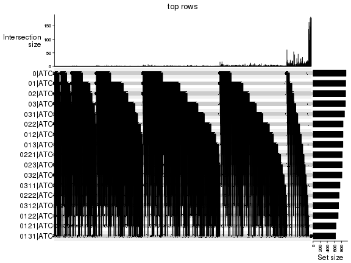


### UMAP plot

UMAP plot which shows how samples are separated.


<script>
$( function() {
	$( '#tabs-dimension-reduction-by-depth' ).tabs();
} );
</script>
<div id='tabs-dimension-reduction-by-depth'>
<ul>
<li><a href='#tab-dimension-reduction-by-depth-1'>n_signatures ≥ 370</a></li>
<li><a href='#tab-dimension-reduction-by-depth-2'>n_signatures ≥ 399</a></li>
<li><a href='#tab-dimension-reduction-by-depth-3'>n_signatures ≥ 420</a></li>
<li><a href='#tab-dimension-reduction-by-depth-4'>n_signatures ≥ 503</a></li>
<li><a href='#tab-dimension-reduction-by-depth-5'>n_signatures ≥ 604</a></li>
<li><a href='#tab-dimension-reduction-by-depth-6'>n_signatures ≥ 766</a></li>
<li><a href='#tab-dimension-reduction-by-depth-7'>n_signatures ≥ 968</a></li>
<li><a href='#tab-dimension-reduction-by-depth-8'>n_signatures ≥ 973</a></li>
<li><a href='#tab-dimension-reduction-by-depth-9'>n_signatures ≥ 1192</a></li>
<li><a href='#tab-dimension-reduction-by-depth-10'>n_signatures ≥ 1285</a></li>
<li><a href='#tab-dimension-reduction-by-depth-11'>n_signatures ≥ 1674</a></li>
<li><a href='#tab-dimension-reduction-by-depth-12'>n_signatures ≥ 1687</a></li>
<li><a href='#tab-dimension-reduction-by-depth-13'>n_signatures ≥ 2119</a></li>
<li><a href='#tab-dimension-reduction-by-depth-14'>n_signatures ≥ 2215</a></li>
<li><a href='#tab-dimension-reduction-by-depth-15'>n_signatures ≥ 3194</a></li>
<li><a href='#tab-dimension-reduction-by-depth-16'>n_signatures ≥ 3662</a></li>
<li><a href='#tab-dimension-reduction-by-depth-17'>n_signatures ≥ 3761</a></li>
</ul>
<div id='tab-dimension-reduction-by-depth-1'>
<pre><code class="r">par(mfrow = c(1, 2))
dimension_reduction(res_rh, merge_node = merge_node_param(min_n_signatures = 370),
    method = &quot;UMAP&quot;, top_value_method = &quot;SD&quot;, top_n = 1000, scale_rows = FALSE)
dimension_reduction(res_rh, merge_node = merge_node_param(min_n_signatures = 370),
    method = &quot;UMAP&quot;, top_value_method = &quot;ATC&quot;, top_n = 1000, scale_rows = TRUE)
</code></pre>

<p></p>

</div>
<div id='tab-dimension-reduction-by-depth-2'>
<pre><code class="r">par(mfrow = c(1, 2))
dimension_reduction(res_rh, merge_node = merge_node_param(min_n_signatures = 399),
    method = &quot;UMAP&quot;, top_value_method = &quot;SD&quot;, top_n = 1000, scale_rows = FALSE)
dimension_reduction(res_rh, merge_node = merge_node_param(min_n_signatures = 399),
    method = &quot;UMAP&quot;, top_value_method = &quot;ATC&quot;, top_n = 1000, scale_rows = TRUE)
</code></pre>

<p></p>

</div>
<div id='tab-dimension-reduction-by-depth-3'>
<pre><code class="r">par(mfrow = c(1, 2))
dimension_reduction(res_rh, merge_node = merge_node_param(min_n_signatures = 420),
    method = &quot;UMAP&quot;, top_value_method = &quot;SD&quot;, top_n = 1000, scale_rows = FALSE)
dimension_reduction(res_rh, merge_node = merge_node_param(min_n_signatures = 420),
    method = &quot;UMAP&quot;, top_value_method = &quot;ATC&quot;, top_n = 1000, scale_rows = TRUE)
</code></pre>

<p></p>

</div>
<div id='tab-dimension-reduction-by-depth-4'>
<pre><code class="r">par(mfrow = c(1, 2))
dimension_reduction(res_rh, merge_node = merge_node_param(min_n_signatures = 503),
    method = &quot;UMAP&quot;, top_value_method = &quot;SD&quot;, top_n = 1000, scale_rows = FALSE)
dimension_reduction(res_rh, merge_node = merge_node_param(min_n_signatures = 503),
    method = &quot;UMAP&quot;, top_value_method = &quot;ATC&quot;, top_n = 1000, scale_rows = TRUE)
</code></pre>

<p>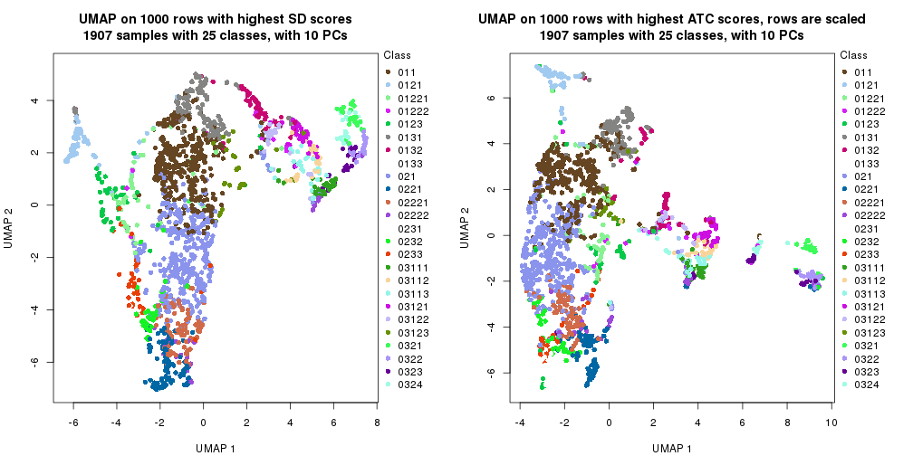</p>

</div>
<div id='tab-dimension-reduction-by-depth-5'>
<pre><code class="r">par(mfrow = c(1, 2))
dimension_reduction(res_rh, merge_node = merge_node_param(min_n_signatures = 604),
    method = &quot;UMAP&quot;, top_value_method = &quot;SD&quot;, top_n = 1000, scale_rows = FALSE)
dimension_reduction(res_rh, merge_node = merge_node_param(min_n_signatures = 604),
    method = &quot;UMAP&quot;, top_value_method = &quot;ATC&quot;, top_n = 1000, scale_rows = TRUE)
</code></pre>

<p></p>

</div>
<div id='tab-dimension-reduction-by-depth-6'>
<pre><code class="r">par(mfrow = c(1, 2))
dimension_reduction(res_rh, merge_node = merge_node_param(min_n_signatures = 766),
    method = &quot;UMAP&quot;, top_value_method = &quot;SD&quot;, top_n = 1000, scale_rows = FALSE)
dimension_reduction(res_rh, merge_node = merge_node_param(min_n_signatures = 766),
    method = &quot;UMAP&quot;, top_value_method = &quot;ATC&quot;, top_n = 1000, scale_rows = TRUE)
</code></pre>

<p></p>

</div>
<div id='tab-dimension-reduction-by-depth-7'>
<pre><code class="r">par(mfrow = c(1, 2))
dimension_reduction(res_rh, merge_node = merge_node_param(min_n_signatures = 968),
    method = &quot;UMAP&quot;, top_value_method = &quot;SD&quot;, top_n = 1000, scale_rows = FALSE)
dimension_reduction(res_rh, merge_node = merge_node_param(min_n_signatures = 968),
    method = &quot;UMAP&quot;, top_value_method = &quot;ATC&quot;, top_n = 1000, scale_rows = TRUE)
</code></pre>

<p></p>

</div>
<div id='tab-dimension-reduction-by-depth-8'>
<pre><code class="r">par(mfrow = c(1, 2))
dimension_reduction(res_rh, merge_node = merge_node_param(min_n_signatures = 973),
    method = &quot;UMAP&quot;, top_value_method = &quot;SD&quot;, top_n = 1000, scale_rows = FALSE)
dimension_reduction(res_rh, merge_node = merge_node_param(min_n_signatures = 973),
    method = &quot;UMAP&quot;, top_value_method = &quot;ATC&quot;, top_n = 1000, scale_rows = TRUE)
</code></pre>

<p></p>

</div>
<div id='tab-dimension-reduction-by-depth-9'>
<pre><code class="r">par(mfrow = c(1, 2))
dimension_reduction(res_rh, merge_node = merge_node_param(min_n_signatures = 1192),
    method = &quot;UMAP&quot;, top_value_method = &quot;SD&quot;, top_n = 1000, scale_rows = FALSE)
dimension_reduction(res_rh, merge_node = merge_node_param(min_n_signatures = 1192),
    method = &quot;UMAP&quot;, top_value_method = &quot;ATC&quot;, top_n = 1000, scale_rows = TRUE)
</code></pre>

<p></p>

</div>
<div id='tab-dimension-reduction-by-depth-10'>
<pre><code class="r">par(mfrow = c(1, 2))
dimension_reduction(res_rh, merge_node = merge_node_param(min_n_signatures = 1285),
    method = &quot;UMAP&quot;, top_value_method = &quot;SD&quot;, top_n = 1000, scale_rows = FALSE)
dimension_reduction(res_rh, merge_node = merge_node_param(min_n_signatures = 1285),
    method = &quot;UMAP&quot;, top_value_method = &quot;ATC&quot;, top_n = 1000, scale_rows = TRUE)
</code></pre>

<p></p>

</div>
<div id='tab-dimension-reduction-by-depth-11'>
<pre><code class="r">par(mfrow = c(1, 2))
dimension_reduction(res_rh, merge_node = merge_node_param(min_n_signatures = 1674),
    method = &quot;UMAP&quot;, top_value_method = &quot;SD&quot;, top_n = 1000, scale_rows = FALSE)
dimension_reduction(res_rh, merge_node = merge_node_param(min_n_signatures = 1674),
    method = &quot;UMAP&quot;, top_value_method = &quot;ATC&quot;, top_n = 1000, scale_rows = TRUE)
</code></pre>

<p></p>

</div>
<div id='tab-dimension-reduction-by-depth-12'>
<pre><code class="r">par(mfrow = c(1, 2))
dimension_reduction(res_rh, merge_node = merge_node_param(min_n_signatures = 1687),
    method = &quot;UMAP&quot;, top_value_method = &quot;SD&quot;, top_n = 1000, scale_rows = FALSE)
dimension_reduction(res_rh, merge_node = merge_node_param(min_n_signatures = 1687),
    method = &quot;UMAP&quot;, top_value_method = &quot;ATC&quot;, top_n = 1000, scale_rows = TRUE)
</code></pre>

<p>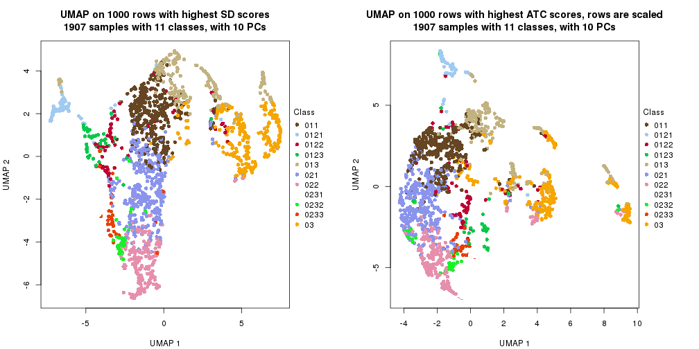</p>

</div>
<div id='tab-dimension-reduction-by-depth-13'>
<pre><code class="r">par(mfrow = c(1, 2))
dimension_reduction(res_rh, merge_node = merge_node_param(min_n_signatures = 2119),
    method = &quot;UMAP&quot;, top_value_method = &quot;SD&quot;, top_n = 1000, scale_rows = FALSE)
dimension_reduction(res_rh, merge_node = merge_node_param(min_n_signatures = 2119),
    method = &quot;UMAP&quot;, top_value_method = &quot;ATC&quot;, top_n = 1000, scale_rows = TRUE)
</code></pre>

<p></p>

</div>
<div id='tab-dimension-reduction-by-depth-14'>
<pre><code class="r">par(mfrow = c(1, 2))
dimension_reduction(res_rh, merge_node = merge_node_param(min_n_signatures = 2215),
    method = &quot;UMAP&quot;, top_value_method = &quot;SD&quot;, top_n = 1000, scale_rows = FALSE)
dimension_reduction(res_rh, merge_node = merge_node_param(min_n_signatures = 2215),
    method = &quot;UMAP&quot;, top_value_method = &quot;ATC&quot;, top_n = 1000, scale_rows = TRUE)
</code></pre>

<p></p>

</div>
<div id='tab-dimension-reduction-by-depth-15'>
<pre><code class="r">par(mfrow = c(1, 2))
dimension_reduction(res_rh, merge_node = merge_node_param(min_n_signatures = 3194),
    method = &quot;UMAP&quot;, top_value_method = &quot;SD&quot;, top_n = 1000, scale_rows = FALSE)
dimension_reduction(res_rh, merge_node = merge_node_param(min_n_signatures = 3194),
    method = &quot;UMAP&quot;, top_value_method = &quot;ATC&quot;, top_n = 1000, scale_rows = TRUE)
</code></pre>

<p></p>

</div>
<div id='tab-dimension-reduction-by-depth-16'>
<pre><code class="r">par(mfrow = c(1, 2))
dimension_reduction(res_rh, merge_node = merge_node_param(min_n_signatures = 3662),
    method = &quot;UMAP&quot;, top_value_method = &quot;SD&quot;, top_n = 1000, scale_rows = FALSE)
dimension_reduction(res_rh, merge_node = merge_node_param(min_n_signatures = 3662),
    method = &quot;UMAP&quot;, top_value_method = &quot;ATC&quot;, top_n = 1000, scale_rows = TRUE)
</code></pre>

<p></p>

</div>
<div id='tab-dimension-reduction-by-depth-17'>
<pre><code class="r">par(mfrow = c(1, 2))
dimension_reduction(res_rh, merge_node = merge_node_param(min_n_signatures = 3761),
    method = &quot;UMAP&quot;, top_value_method = &quot;SD&quot;, top_n = 1000, scale_rows = FALSE)
dimension_reduction(res_rh, merge_node = merge_node_param(min_n_signatures = 3761),
    method = &quot;UMAP&quot;, top_value_method = &quot;ATC&quot;, top_n = 1000, scale_rows = TRUE)
</code></pre>

<p></p>

</div>
</div>


### Signature heatmap

Signatures on the heatmap are the union of all signatures found on every node
on the hierarchy. The number of k-means on rows are automatically selected by the function.


<script>
$( function() {
	$( '#tabs-get-signatures-from-hierarchical-partition' ).tabs();
} );
</script>
<div id='tabs-get-signatures-from-hierarchical-partition'>
<ul>
<li><a href='#tab-get-signatures-from-hierarchical-partition-1'>n_signatures ≥ 370</a></li>
<li><a href='#tab-get-signatures-from-hierarchical-partition-2'>n_signatures ≥ 399</a></li>
<li><a href='#tab-get-signatures-from-hierarchical-partition-3'>n_signatures ≥ 420</a></li>
<li><a href='#tab-get-signatures-from-hierarchical-partition-4'>n_signatures ≥ 503</a></li>
<li><a href='#tab-get-signatures-from-hierarchical-partition-5'>n_signatures ≥ 604</a></li>
<li><a href='#tab-get-signatures-from-hierarchical-partition-6'>n_signatures ≥ 766</a></li>
<li><a href='#tab-get-signatures-from-hierarchical-partition-7'>n_signatures ≥ 968</a></li>
<li><a href='#tab-get-signatures-from-hierarchical-partition-8'>n_signatures ≥ 973</a></li>
<li><a href='#tab-get-signatures-from-hierarchical-partition-9'>n_signatures ≥ 1192</a></li>
<li><a href='#tab-get-signatures-from-hierarchical-partition-10'>n_signatures ≥ 1285</a></li>
<li><a href='#tab-get-signatures-from-hierarchical-partition-11'>n_signatures ≥ 1674</a></li>
<li><a href='#tab-get-signatures-from-hierarchical-partition-12'>n_signatures ≥ 1687</a></li>
<li><a href='#tab-get-signatures-from-hierarchical-partition-13'>n_signatures ≥ 2119</a></li>
<li><a href='#tab-get-signatures-from-hierarchical-partition-14'>n_signatures ≥ 2215</a></li>
<li><a href='#tab-get-signatures-from-hierarchical-partition-15'>n_signatures ≥ 3194</a></li>
<li><a href='#tab-get-signatures-from-hierarchical-partition-16'>n_signatures ≥ 3662</a></li>
<li><a href='#tab-get-signatures-from-hierarchical-partition-17'>n_signatures ≥ 3761</a></li>
</ul>
<div id='tab-get-signatures-from-hierarchical-partition-1'>
<pre><code class="r">get_signatures(res_rh, merge_node = merge_node_param(min_n_signatures = 370))
</code></pre>

<p></p>

</div>
<div id='tab-get-signatures-from-hierarchical-partition-2'>
<pre><code class="r">get_signatures(res_rh, merge_node = merge_node_param(min_n_signatures = 399))
</code></pre>

<p></p>

</div>
<div id='tab-get-signatures-from-hierarchical-partition-3'>
<pre><code class="r">get_signatures(res_rh, merge_node = merge_node_param(min_n_signatures = 420))
</code></pre>

<p></p>

</div>
<div id='tab-get-signatures-from-hierarchical-partition-4'>
<pre><code class="r">get_signatures(res_rh, merge_node = merge_node_param(min_n_signatures = 503))
</code></pre>

<p></p>

</div>
<div id='tab-get-signatures-from-hierarchical-partition-5'>
<pre><code class="r">get_signatures(res_rh, merge_node = merge_node_param(min_n_signatures = 604))
</code></pre>

<p></p>

</div>
<div id='tab-get-signatures-from-hierarchical-partition-6'>
<pre><code class="r">get_signatures(res_rh, merge_node = merge_node_param(min_n_signatures = 766))
</code></pre>

<p>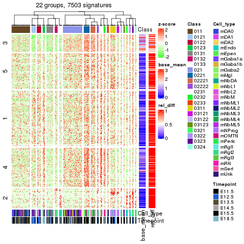</p>

</div>
<div id='tab-get-signatures-from-hierarchical-partition-7'>
<pre><code class="r">get_signatures(res_rh, merge_node = merge_node_param(min_n_signatures = 968))
</code></pre>

<p></p>

</div>
<div id='tab-get-signatures-from-hierarchical-partition-8'>
<pre><code class="r">get_signatures(res_rh, merge_node = merge_node_param(min_n_signatures = 973))
</code></pre>

<p></p>

</div>
<div id='tab-get-signatures-from-hierarchical-partition-9'>
<pre><code class="r">get_signatures(res_rh, merge_node = merge_node_param(min_n_signatures = 1192))
</code></pre>

<p></p>

</div>
<div id='tab-get-signatures-from-hierarchical-partition-10'>
<pre><code class="r">get_signatures(res_rh, merge_node = merge_node_param(min_n_signatures = 1285))
</code></pre>

<p></p>

</div>
<div id='tab-get-signatures-from-hierarchical-partition-11'>
<pre><code class="r">get_signatures(res_rh, merge_node = merge_node_param(min_n_signatures = 1674))
</code></pre>

<p></p>

</div>
<div id='tab-get-signatures-from-hierarchical-partition-12'>
<pre><code class="r">get_signatures(res_rh, merge_node = merge_node_param(min_n_signatures = 1687))
</code></pre>

<p></p>

</div>
<div id='tab-get-signatures-from-hierarchical-partition-13'>
<pre><code class="r">get_signatures(res_rh, merge_node = merge_node_param(min_n_signatures = 2119))
</code></pre>

<p></p>

</div>
<div id='tab-get-signatures-from-hierarchical-partition-14'>
<pre><code class="r">get_signatures(res_rh, merge_node = merge_node_param(min_n_signatures = 2215))
</code></pre>

<p></p>

</div>
<div id='tab-get-signatures-from-hierarchical-partition-15'>
<pre><code class="r">get_signatures(res_rh, merge_node = merge_node_param(min_n_signatures = 3194))
</code></pre>

<p></p>

</div>
<div id='tab-get-signatures-from-hierarchical-partition-16'>
<pre><code class="r">get_signatures(res_rh, merge_node = merge_node_param(min_n_signatures = 3662))
</code></pre>

<p></p>

</div>
<div id='tab-get-signatures-from-hierarchical-partition-17'>
<pre><code class="r">get_signatures(res_rh, merge_node = merge_node_param(min_n_signatures = 3761))
</code></pre>

<pre><code>#&gt; Error in names(x) &lt;- value: &#39;names&#39; attribute [1] must be the same length as the vector [0]
</code></pre>

</div>
</div>


Compare signatures from different nodes:


```r
compare_signatures(res_rh, verbose = FALSE)
```


If there are too many signatures, `top_signatures = ...` can be set to only show the 
signatures with the highest FDRs. Note it only works on every node and the final signatures
are the union of all signatures of all nodes.


```r
# code only for demonstration
# e.g. to show the top 500 most significant rows on each node.
tb = get_signature(res_rh, top_signatures = 500)
```


### Test to known annotations

Test correlation between subgroups and known annotations. If the known
annotation is numeric, one-way ANOVA test is applied, and if the known
annotation is discrete, chi-squared contingency table test is applied.


<script>
$( function() {
	$( '#tabs-test-to-known-factors-from-hierarchical-partition' ).tabs();
} );
</script>
<div id='tabs-test-to-known-factors-from-hierarchical-partition'>
<ul>
<li><a href='#tab-test-to-known-factors-from-hierarchical-partition-1'>n_signatures ≥ 370</a></li>
<li><a href='#tab-test-to-known-factors-from-hierarchical-partition-2'>n_signatures ≥ 399</a></li>
<li><a href='#tab-test-to-known-factors-from-hierarchical-partition-3'>n_signatures ≥ 420</a></li>
<li><a href='#tab-test-to-known-factors-from-hierarchical-partition-4'>n_signatures ≥ 503</a></li>
<li><a href='#tab-test-to-known-factors-from-hierarchical-partition-5'>n_signatures ≥ 604</a></li>
<li><a href='#tab-test-to-known-factors-from-hierarchical-partition-6'>n_signatures ≥ 766</a></li>
<li><a href='#tab-test-to-known-factors-from-hierarchical-partition-7'>n_signatures ≥ 968</a></li>
<li><a href='#tab-test-to-known-factors-from-hierarchical-partition-8'>n_signatures ≥ 973</a></li>
<li><a href='#tab-test-to-known-factors-from-hierarchical-partition-9'>n_signatures ≥ 1192</a></li>
<li><a href='#tab-test-to-known-factors-from-hierarchical-partition-10'>n_signatures ≥ 1285</a></li>
<li><a href='#tab-test-to-known-factors-from-hierarchical-partition-11'>n_signatures ≥ 1674</a></li>
<li><a href='#tab-test-to-known-factors-from-hierarchical-partition-12'>n_signatures ≥ 1687</a></li>
<li><a href='#tab-test-to-known-factors-from-hierarchical-partition-13'>n_signatures ≥ 2119</a></li>
<li><a href='#tab-test-to-known-factors-from-hierarchical-partition-14'>n_signatures ≥ 2215</a></li>
<li><a href='#tab-test-to-known-factors-from-hierarchical-partition-15'>n_signatures ≥ 3194</a></li>
<li><a href='#tab-test-to-known-factors-from-hierarchical-partition-16'>n_signatures ≥ 3662</a></li>
<li><a href='#tab-test-to-known-factors-from-hierarchical-partition-17'>n_signatures ≥ 3761</a></li>
</ul>
<div id='tab-test-to-known-factors-from-hierarchical-partition-1'>
<pre><code class="r">test_to_known_factors(res_rh, merge_node = merge_node_param(min_n_signatures = 370))
</code></pre>

<pre><code>#&gt;       Cell_type Timepoint
#&gt; class         0 4.01e-228
</code></pre>

</div>
<div id='tab-test-to-known-factors-from-hierarchical-partition-2'>
<pre><code class="r">test_to_known_factors(res_rh, merge_node = merge_node_param(min_n_signatures = 399))
</code></pre>

<pre><code>#&gt;       Cell_type Timepoint
#&gt; class         0 1.76e-226
</code></pre>

</div>
<div id='tab-test-to-known-factors-from-hierarchical-partition-3'>
<pre><code class="r">test_to_known_factors(res_rh, merge_node = merge_node_param(min_n_signatures = 420))
</code></pre>

<pre><code>#&gt;       Cell_type Timepoint
#&gt; class         0 9.55e-217
</code></pre>

</div>
<div id='tab-test-to-known-factors-from-hierarchical-partition-4'>
<pre><code class="r">test_to_known_factors(res_rh, merge_node = merge_node_param(min_n_signatures = 503))
</code></pre>

<pre><code>#&gt;       Cell_type Timepoint
#&gt; class         0  9.9e-218
</code></pre>

</div>
<div id='tab-test-to-known-factors-from-hierarchical-partition-5'>
<pre><code class="r">test_to_known_factors(res_rh, merge_node = merge_node_param(min_n_signatures = 604))
</code></pre>

<pre><code>#&gt;       Cell_type Timepoint
#&gt; class         0 8.81e-219
</code></pre>

</div>
<div id='tab-test-to-known-factors-from-hierarchical-partition-6'>
<pre><code class="r">test_to_known_factors(res_rh, merge_node = merge_node_param(min_n_signatures = 766))
</code></pre>

<pre><code>#&gt;       Cell_type Timepoint
#&gt; class         0 4.51e-220
</code></pre>

</div>
<div id='tab-test-to-known-factors-from-hierarchical-partition-7'>
<pre><code class="r">test_to_known_factors(res_rh, merge_node = merge_node_param(min_n_signatures = 968))
</code></pre>

<pre><code>#&gt;       Cell_type Timepoint
#&gt; class         0 1.83e-217
</code></pre>

</div>
<div id='tab-test-to-known-factors-from-hierarchical-partition-8'>
<pre><code class="r">test_to_known_factors(res_rh, merge_node = merge_node_param(min_n_signatures = 973))
</code></pre>

<pre><code>#&gt;       Cell_type Timepoint
#&gt; class         0 1.32e-208
</code></pre>

</div>
<div id='tab-test-to-known-factors-from-hierarchical-partition-9'>
<pre><code class="r">test_to_known_factors(res_rh, merge_node = merge_node_param(min_n_signatures = 1192))
</code></pre>

<pre><code>#&gt;       Cell_type Timepoint
#&gt; class         0 1.32e-208
</code></pre>

</div>
<div id='tab-test-to-known-factors-from-hierarchical-partition-10'>
<pre><code class="r">test_to_known_factors(res_rh, merge_node = merge_node_param(min_n_signatures = 1285))
</code></pre>

<pre><code>#&gt;       Cell_type Timepoint
#&gt; class         0  2.7e-198
</code></pre>

</div>
<div id='tab-test-to-known-factors-from-hierarchical-partition-11'>
<pre><code class="r">test_to_known_factors(res_rh, merge_node = merge_node_param(min_n_signatures = 1674))
</code></pre>

<pre><code>#&gt;       Cell_type Timepoint
#&gt; class         0 5.11e-191
</code></pre>

</div>
<div id='tab-test-to-known-factors-from-hierarchical-partition-12'>
<pre><code class="r">test_to_known_factors(res_rh, merge_node = merge_node_param(min_n_signatures = 1687))
</code></pre>

<pre><code>#&gt;       Cell_type Timepoint
#&gt; class         0 1.47e-166
</code></pre>

</div>
<div id='tab-test-to-known-factors-from-hierarchical-partition-13'>
<pre><code class="r">test_to_known_factors(res_rh, merge_node = merge_node_param(min_n_signatures = 2119))
</code></pre>

<pre><code>#&gt;       Cell_type Timepoint
#&gt; class         0 1.72e-155
</code></pre>

</div>
<div id='tab-test-to-known-factors-from-hierarchical-partition-14'>
<pre><code class="r">test_to_known_factors(res_rh, merge_node = merge_node_param(min_n_signatures = 2215))
</code></pre>

<pre><code>#&gt;       Cell_type Timepoint
#&gt; class         0 1.35e-116
</code></pre>

</div>
<div id='tab-test-to-known-factors-from-hierarchical-partition-15'>
<pre><code class="r">test_to_known_factors(res_rh, merge_node = merge_node_param(min_n_signatures = 3194))
</code></pre>

<pre><code>#&gt;       Cell_type Timepoint
#&gt; class         0  7.06e-78
</code></pre>

</div>
<div id='tab-test-to-known-factors-from-hierarchical-partition-16'>
<pre><code class="r">test_to_known_factors(res_rh, merge_node = merge_node_param(min_n_signatures = 3662))
</code></pre>

<pre><code>#&gt;       Cell_type Timepoint
#&gt; class         0  7.06e-78
</code></pre>

</div>
<div id='tab-test-to-known-factors-from-hierarchical-partition-17'>
<pre><code class="r">test_to_known_factors(res_rh, merge_node = merge_node_param(min_n_signatures = 3761))
</code></pre>

<pre><code>#&gt;       Cell_type Timepoint
#&gt; class        NA        NA
</code></pre>

</div>
</div>


## Results for each node


---------------------------------------------------


### Node0


Child nodes: 
                [Node01](#Node01)
        ,
                [Node02](#Node02)
        ,
                [Node03](#Node03)
        .


The object with results only for a single top-value method and a single partitioning method 
can be extracted as:

```r
res = res_rh["0"]
```

A summary of `res` and all the functions that can be applied to it:

```r
res
```

```
#> A 'DownSamplingConsensusPartition' object with k = 2, 3, 4.
#>   On a matrix with 9885 rows and 500 columns, randomly sampled from 1907 columns.
#>   Top rows (928) are extracted by 'ATC' method.
#>   Subgroups are detected by 'skmeans' method.
#>   Performed in total 150 partitions by row resampling.
#>   Best k for subgroups seems to be 3.
#> 
#> Following methods can be applied to this 'DownSamplingConsensusPartition' object:
#>  [1] "cola_report"             "collect_classes"         "collect_plots"          
#>  [4] "collect_stats"           "colnames"                "compare_partitions"     
#>  [7] "compare_signatures"      "consensus_heatmap"       "dimension_reduction"    
#> [10] "functional_enrichment"   "get_anno_col"            "get_anno"               
#> [13] "get_classes"             "get_consensus"           "get_matrix"             
#> [16] "get_membership"          "get_param"               "get_signatures"         
#> [19] "get_stats"               "is_best_k"               "is_stable_k"            
#> [22] "membership_heatmap"      "ncol"                    "nrow"                   
#> [25] "plot_ecdf"               "predict_classes"         "rownames"               
#> [28] "select_partition_number" "show"                    "suggest_best_k"         
#> [31] "test_to_known_factors"   "top_rows_heatmap"
```

`collect_plots()` function collects all the plots made from `res` for all `k` (number of subgroups)
into one single page to provide an easy and fast comparison between different `k`.

```r
collect_plots(res)
```


The plots are:

- The first row: a plot of the eCDF (empirical cumulative distribution
  function) curves of the consensus matrix for each `k` and the heatmap of
  predicted classes for each `k`.
- The second row: heatmaps of the consensus matrix for each `k`.
- The third row: heatmaps of the membership matrix for each `k`.
- The fouth row: heatmaps of the signatures for each `k`.

All the plots in panels can be made by individual functions and they are
plotted later in this section.

`select_partition_number()` produces several plots showing different
statistics for choosing "optimized" `k`. There are following statistics:

- eCDF curves of the consensus matrix for each `k`;
- 1-PAC. [The PAC score](https://en.wikipedia.org/wiki/Consensus_clustering#Over-interpretation_potential_of_consensus_clustering)
  measures the proportion of the ambiguous subgrouping.
- Mean silhouette score.
- Concordance. The mean probability of fiting the consensus subgroup labels in all
  partitions.
- Area increased. Denote $A_k$ as the area under the eCDF curve for current
  `k`, the area increased is defined as $A_k - A_{k-1}$.
- Rand index. The percent of pairs of samples that are both in a same cluster
  or both are not in a same cluster in the partition of k and k-1.
- Jaccard index. The ratio of pairs of samples are both in a same cluster in
  the partition of k and k-1 and the pairs of samples are both in a same
  cluster in the partition k or k-1.

The detailed explanations of these statistics can be found in [the _cola_
vignette](https://jokergoo.github.io/cola_vignettes/cola.html#toc_13).

Generally speaking, higher 1-PAC score, higher mean silhouette score or higher
concordance corresponds to better partition. Rand index and Jaccard index
measure how similar the current partition is compared to partition with `k-1`.
If they are too similar, we won't accept `k` is better than `k-1`.

```r
select_partition_number(res)
```


The numeric values for all these statistics can be obtained by `get_stats()`.

```r
get_stats(res)
```

```
#>   k 1-PAC mean_silhouette concordance area_increased  Rand Jaccard
#> 2 2 1.000           0.980       0.992          0.498 0.502   0.502
#> 3 3 1.000           0.971       0.989          0.244 0.851   0.710
#> 4 4 0.892           0.898       0.955          0.122 0.887   0.717
```

`suggest_best_k()` suggests the best $k$ based on these statistics. The rules are as follows:

- All $k$ with Jaccard index larger than 0.95 are removed because increasing
  $k$ does not provide enough extra information. If all $k$ are removed, it is
  marked as no subgroup is detected.
- For all $k$ with 1-PAC score larger than 0.9, the maximal $k$ is taken as
  the best $k$, and other $k$ are marked as optional $k$.
- If it does not fit the second rule. The $k$ with the maximal vote of the
  highest 1-PAC score, highest mean silhouette, and highest concordance is
  taken as the best $k$.

```r
suggest_best_k(res)
```

```
#> [1] 3
#> attr(,"optional")
#> [1] 2
```

There is also optional best $k$ = 2 that is worth to check.

Following is the table of the partitions (You need to click the **show/hide
code output** link to see it). The membership matrix (columns with name `p*`)
is inferred by
[`clue::cl_consensus()`](https://www.rdocumentation.org/link/cl_consensus?package=clue)
function with the `SE` method. Basically the value in the membership matrix
represents the probability to belong to a certain group. The finall subgroup
label for an item is determined with the group with highest probability it
belongs to.

In `get_classes()` function, the entropy is calculated from the membership
matrix and the silhouette score is calculated from the consensus matrix.


<script>
$( function() {
	$( '#tabs-node-0-get-classes' ).tabs();
} );
</script>
<div id='tabs-node-0-get-classes'>
<ul>
<li><a href='#tab-node-0-get-classes-1'>k = 2</a></li>
<li><a href='#tab-node-0-get-classes-2'>k = 3</a></li>
<li><a href='#tab-node-0-get-classes-3'>k = 4</a></li>
</ul>

<div id='tab-node-0-get-classes-1'>
<p><a id='tab-node-0-get-classes-1-a' style='color:#0366d6' href='#'>show/hide code output</a></p>
<pre><code class="r">get_classes(res, k = 2)
</code></pre>

<pre><code>#&gt;                class     p
#&gt; 1772094169_G10     1 0.000
#&gt; 1772072247_E09     1 0.000
#&gt; 1772094174_H05     1 0.000
#&gt; 1772094172_F07     1 0.000
#&gt; 1771013117_F06     1 0.000
#&gt; 1771013111_H03     1 0.000
#&gt; 1772094146_G12     1 0.000
#&gt; 1772094166_C10     1 0.000
#&gt; 1772094146_G09     1 1.000
#&gt; 1772094169_H05     1 0.000
#&gt; 1772094169_H08     1 0.249
#&gt; 1772072249_B06     1 0.000
#&gt; 1772094171_C08     1 0.000
#&gt; 1772066085_F11     1 0.751
#&gt; 1772075301_D01     1 0.498
#&gt; 1771013117_B10     1 0.000
#&gt; 1772066085_H04     1 1.000
#&gt; 1772066085_A01     1 0.000
#&gt; 1772094175_G04     1 0.000
#&gt; 1772075300_C04     2 0.000
#&gt; 1772075301_B03     2 0.253
#&gt; 1772066093_G05     2 0.000
#&gt; 1772075300_A11     1 0.000
#&gt; 1772075302_A12     1 1.000
#&gt; 1772094156_E02     1 0.000
#&gt; 1772072247_G12     1 0.000
#&gt; 1772072248_A06     1 0.000
#&gt; 1772075300_D09     1 0.000
#&gt; 1772072246_G11     1 0.000
#&gt; 1772072247_G08     1 0.000
#&gt; 1771013153_A09     1 0.502
#&gt; 1772071049_B04     1 0.249
#&gt; 1772094169_E01     1 0.000
#&gt; 1772094144_B07     1 0.253
#&gt; 1772094171_E09     1 0.000
#&gt; 1772094158_C11     1 0.249
#&gt; 1772094175_G11     1 1.000
#&gt; 1772075303_B10     1 0.000
#&gt; 1772066093_E07     1 0.000
#&gt; 1772094171_G11     2 0.498
#&gt; 1771013118_F09     1 0.000
#&gt; 1772094169_E07     1 0.000
#&gt; 1772096112_A01     2 0.000
#&gt; 1772071050_C03     1 0.000
#&gt; 1772094156_G06     1 0.000
#&gt; 1772094169_A01     1 0.000
#&gt; 1771013153_D02     1 0.000
#&gt; 1772092007_E08     1 0.000
#&gt; 1772092007_F03     1 0.000
#&gt; 1771013153_B03     1 0.249
#&gt; 1772094166_C08     2 0.498
#&gt; 1772094156_B01     1 0.000
#&gt; 1772071049_D05     1 0.249
#&gt; 1772096112_F05     2 0.249
#&gt; 1772094169_C07     2 0.751
#&gt; 1772075303_B01     1 0.249
#&gt; 1771013108_B05     1 0.000
#&gt; 1772096115_A02     1 0.000
#&gt; 1772094163_G12     1 0.000
#&gt; 1772092007_G10     1 0.000
#&gt; 1772094156_D04     1 0.249
#&gt; 1772094144_G03     2 0.249
#&gt; 1772092007_C11     1 0.000
#&gt; 1772075302_D11     1 0.000
#&gt; 1772094169_B12     1 0.000
#&gt; 1772092007_F04     2 0.000
#&gt; 1772092007_C03     1 0.000
#&gt; 1772075303_H02     1 0.249
#&gt; 1772092007_A08     1 0.000
#&gt; 1772092006_F01     2 0.498
#&gt; 1772094158_D09     1 0.000
#&gt; 1772092007_B07     2 0.249
#&gt; 1772094158_G07     2 0.747
#&gt; 1772071065_G09     2 0.249
#&gt; 1772075302_G03     1 0.000
#&gt; 1772075302_C09     1 0.000
#&gt; 1772094161_A07     1 0.000
#&gt; 1772071065_D07     1 0.000
#&gt; 1772071050_B06     2 0.249
#&gt; 1771013108_A12     1 0.000
#&gt; 1772092007_G02     2 1.000
#&gt; 1772094159_F02     2 1.000
#&gt; 1772094156_B11     1 0.000
#&gt; 1772094161_B04     2 0.502
#&gt; 1772094161_G01     2 0.498
#&gt; 1772094156_E03     2 1.000
#&gt; 1772094172_D10     1 0.000
#&gt; 1772092007_H04     1 0.249
#&gt; 1772066085_A06     2 0.751
#&gt; 1772092007_A01     1 0.000
#&gt; 1771013153_E08     1 0.751
#&gt; 1772094163_D07     1 0.000
#&gt; 1772092006_A05     2 0.000
#&gt; 1772071065_E04     2 0.000
#&gt; 1772072248_G01     1 0.000
#&gt; 1772066085_A11     1 0.000
#&gt; 1772094166_F09     2 1.000
#&gt; 1772092007_G01     1 0.000
#&gt; 1772094171_H02     1 0.000
#&gt; 1772092007_B08     2 0.498
#&gt; 1772092006_H05     1 0.000
#&gt; 1772075303_G09     1 0.000
#&gt; 1772092007_F01     1 0.000
#&gt; 1772094172_G12     1 1.000
#&gt; 1772094174_E05     1 0.000
#&gt; 1772075301_B05     2 0.000
#&gt; 1772094169_D03     2 0.498
#&gt; 1771013153_A02     1 0.000
#&gt; 1772094173_B09     1 0.000
#&gt; 1772066085_F05     1 0.000
#&gt; 1772094173_C09     1 0.000
#&gt; 1772066084_E11     1 0.000
#&gt; 1772094156_D03     1 0.249
#&gt; 1772096112_C05     1 0.000
#&gt; 1772071065_E09     2 0.253
#&gt; 1771013153_D09     1 0.000
#&gt; 1772071046_G02     2 0.747
#&gt; 1772094172_H08     2 1.000
#&gt; 1772071065_A04     2 0.249
#&gt; 1772066091_F09     1 0.000
#&gt; 1772066091_C04     2 0.498
#&gt; 1772071048_H03     2 0.498
#&gt; 1772094158_H12     1 0.253
#&gt; 1772092006_C08     1 0.253
#&gt; 1772094158_G10     1 0.000
#&gt; 1772096111_C02     1 0.000
#&gt; 1772094171_D07     2 1.000
#&gt; 1772094175_C08     2 0.498
#&gt; 1772094173_B12     1 0.249
#&gt; 1772075301_H01     1 0.000
#&gt; 1772071048_D09     1 0.000
#&gt; 1772094175_E09     2 0.000
#&gt; 1772075300_E11     1 0.000
#&gt; 1772094175_B10     1 0.253
#&gt; 1772075300_C02     2 0.000
#&gt; 1772075300_H05     1 0.000
#&gt; 1772071048_C05     2 0.498
#&gt; 1772066085_F12     2 0.498
#&gt; 1772094173_D09     2 0.000
#&gt; 1772094174_G04     1 0.000
#&gt; 1772066085_E07     2 0.498
#&gt; 1772066093_H04     2 0.751
#&gt; 1772071065_G03     1 0.000
#&gt; 1772072249_F03     2 0.249
#&gt; 1772072247_D10     1 0.000
#&gt; 1772072246_G08     1 0.249
#&gt; 1772072247_D12     1 0.502
#&gt; 1772072246_A11     1 0.000
#&gt; 1772072247_H01     1 0.000
#&gt; 1772072249_D02     1 0.000
#&gt; 1772072249_C02     2 0.000
#&gt; 1772072247_F11     1 0.000
#&gt; 1772072247_C08     2 0.000
#&gt; 1772072249_B11     1 0.000
#&gt; 1772072249_A09     1 0.000
#&gt; 1772072246_D07     2 0.000
#&gt; 1772072249_C08     1 0.000
#&gt; 1772072248_A04     1 0.000
#&gt; 1772072248_D02     1 0.000
#&gt; 1772072247_G03     1 0.000
#&gt; 1772072247_D04     1 0.000
#&gt; 1772072247_D07     1 0.751
#&gt; 1772072249_E11     1 0.000
#&gt; 1772072249_C01     1 0.000
#&gt; 1772075300_B11     1 0.000
#&gt; 1772075300_B07     1 0.000
#&gt; 1772072248_F03     1 0.000
#&gt; 1772072248_B09     1 0.000
#&gt; 1772072246_E04     2 1.000
#&gt; 1772075301_D06     2 0.000
#&gt; 1772072249_F08     1 0.000
#&gt; 1772072248_B11     1 0.000
#&gt; 1772072249_D06     1 0.000
#&gt; 1772072248_F02     1 0.000
#&gt; 1772094175_F04     1 0.751
#&gt; 1772096115_B01     1 0.000
#&gt; 1772094172_G05     1 0.000
#&gt; 1772096111_F03     2 1.000
#&gt; 1772072248_B02     1 0.000
#&gt; 1772094172_F12     1 0.000
#&gt; 1772094158_D01     1 0.000
#&gt; 1772092007_C12     2 0.502
#&gt; 1772072246_G06     1 0.000
#&gt; 1771013153_F02     1 0.000
#&gt; 1772072248_G07     1 0.000
#&gt; 1772072246_C06     2 0.751
#&gt; 1772072246_H01     1 0.000
#&gt; 1772094169_D01     1 0.000
#&gt; 1772094174_C05     1 0.000
#&gt; 1772066087_E02     2 0.000
#&gt; 1772094174_B10     1 0.000
#&gt; 1772066084_A07     2 0.502
#&gt; 1772071046_C12     1 1.000
#&gt; 1772094146_C08     2 1.000
#&gt; 1772072246_A01     1 0.000
#&gt; 1772096115_A12     1 0.000
#&gt; 1772072246_H07     1 0.000
#&gt; 1771013111_D04     1 0.000
#&gt; 1772092007_D06     2 0.000
#&gt; 1772092006_G06     2 0.747
#&gt; 1772066084_B04     1 0.000
#&gt; 1772075302_F08     2 0.747
#&gt; 1772072247_G07     1 0.000
#&gt; 1772071065_B01     1 0.000
#&gt; 1771013118_H03     1 0.253
#&gt; 1772094144_F02     1 0.000
#&gt; 1772094144_A01     1 0.000
#&gt; 1772092007_C09     1 0.253
#&gt; 1772092006_H03     2 0.249
#&gt; 1772094175_D05     1 0.751
#&gt; 1772072246_G09     1 0.000
#&gt; 1772094158_F03     1 0.000
#&gt; 1772071046_D06     1 0.000
#&gt; 1772094173_B03     1 0.000
#&gt; 1772094158_B01     2 0.249
#&gt; 1772072246_E05     1 0.000
#&gt; 1772072246_C05     2 0.000
#&gt; 1772066084_E02     2 0.000
#&gt; 1772094144_A06     1 0.502
#&gt; 1771013110_B02     1 0.000
#&gt; 1772094171_A01     1 0.000
#&gt; 1772094156_B08     1 0.000
#&gt; 1772094146_C04     1 0.751
#&gt; 1771013013_H11     2 0.000
#&gt; 1772094166_E07     1 0.000
#&gt; 1772094161_C05     1 0.249
#&gt; 1772096114_C09     2 0.253
#&gt; 1772094171_D04     1 0.000
#&gt; 1772094158_B11     1 0.000
#&gt; 1772094144_H07     1 0.000
#&gt; 1772094144_H05     2 0.000
#&gt; 1772094144_F05     1 0.249
#&gt; 1772094161_E03     1 0.000
#&gt; 1771013153_A08     1 0.000
#&gt; 1772094171_H10     1 0.000
#&gt; 1772094146_D07     2 0.000
#&gt; 1772094144_E03     1 0.502
#&gt; 1772096111_H02     1 0.249
#&gt; 1772092006_D06     1 0.498
#&gt; 1772094144_B02     1 0.253
#&gt; 1771013113_B03     1 0.000
#&gt; 1772094169_G11     1 0.253
#&gt; 1771013013_C12     1 0.000
#&gt; 1772072247_B02     1 0.000
#&gt; 1772094146_F09     1 0.000
#&gt; 1772094146_A04     2 0.000
#&gt; 1772094146_A06     1 0.000
#&gt; 1772092007_B02     2 0.249
#&gt; 1772094163_C10     1 0.249
#&gt; 1771013153_F09     1 0.000
#&gt; 1772092007_A02     2 0.249
#&gt; 1772092006_H04     2 0.000
#&gt; 1772092007_D07     1 0.000
#&gt; 1772094169_C12     2 0.000
#&gt; 1772096114_E03     1 0.000
#&gt; 1772094173_B02     1 0.000
#&gt; 1772094169_B04     1 0.502
#&gt; 1772094166_F07     2 0.000
#&gt; 1771013108_E01     1 0.000
#&gt; 1771013108_E10     1 0.000
#&gt; 1772094144_B04     2 0.000
#&gt; 1772094171_C03     2 0.249
#&gt; 1772094146_E05     1 0.000
#&gt; 1772094172_H11     1 0.000
#&gt; 1771013013_G04     1 0.000
#&gt; 1772094172_C03     1 0.000
#&gt; 1772094166_A12     1 0.000
#&gt; 1772096115_E10     1 0.000
#&gt; 1772094166_B10     1 0.000
#&gt; 1772094146_E02     2 0.249
#&gt; 1772094171_H04     2 0.498
#&gt; 1772094156_B12     1 0.000
#&gt; 1772094158_A01     1 0.000
#&gt; 1772094144_F04     1 0.000
#&gt; 1772094158_E07     1 0.502
#&gt; 1772094171_B06     1 0.000
#&gt; 1771013153_B08     1 0.000
#&gt; 1772094158_B03     1 0.000
#&gt; 1771013013_H10     1 0.253
#&gt; 1771013118_A12     1 0.000
#&gt; 1772094175_D07     2 0.253
#&gt; 1772094144_D11     1 0.751
#&gt; 1771013110_D06     1 0.000
#&gt; 1772094166_B05     1 0.000
#&gt; 1772096114_E01     1 0.000
#&gt; 1771013108_E06     1 0.000
#&gt; 1771013118_A04     1 0.000
#&gt; 1772094146_D04     1 0.249
#&gt; 1772094146_G11     1 0.000
#&gt; 1772096115_E03     1 0.000
#&gt; 1772094144_B10     1 0.000
#&gt; 1772094161_D08     1 0.000
#&gt; 1772071065_C05     1 0.249
#&gt; 1771013013_B10     1 0.751
#&gt; 1771013108_E03     1 0.751
#&gt; 1772094158_D05     1 0.000
#&gt; 1771013111_F03     1 0.502
#&gt; 1771013113_G05     1 0.000
#&gt; 1772066085_D11     1 0.000
#&gt; 1772071046_D01     1 0.249
#&gt; 1771013118_E09     1 0.000
#&gt; 1771013013_E05     1 0.249
#&gt; 1772094146_G08     1 0.000
#&gt; 1772094146_H12     1 0.000
#&gt; 1771013111_D07     1 0.502
#&gt; 1772094144_D10     1 0.751
#&gt; 1772094146_D12     1 0.000
#&gt; 1772096112_C11     1 0.000
#&gt; 1771013108_C09     1 0.000
#&gt; 1772094166_E09     1 0.000
#&gt; 1772092007_F06     1 0.502
#&gt; 1772094171_B09     1 0.000
#&gt; 1772094146_A05     1 0.502
#&gt; 1772094163_A07     1 0.000
#&gt; 1772094146_C12     1 0.502
#&gt; 1772096111_F10     1 0.000
#&gt; 1771013111_G05     1 0.000
#&gt; 1772094169_D10     1 0.000
#&gt; 1772094146_A02     2 0.249
#&gt; 1772094144_C03     1 0.498
#&gt; 1772092006_C09     1 0.249
#&gt; 1772092006_B05     1 0.000
#&gt; 1772092007_A12     2 0.000
#&gt; 1772092007_D11     1 0.000
#&gt; 1772094144_C11     1 0.502
#&gt; 1772094146_H06     1 1.000
#&gt; 1771013113_F10     1 0.000
#&gt; 1772094144_H01     1 0.000
#&gt; 1771013153_A10     1 0.000
#&gt; 1772094144_B08     1 0.249
#&gt; 1772096112_F04     2 0.253
#&gt; 1772094144_D12     1 0.502
#&gt; 1772094144_B01     2 0.249
#&gt; 1772094166_E06     2 0.000
#&gt; 1772094146_G10     2 0.000
#&gt; 1772096114_C10     2 0.249
#&gt; 1772094144_A02     2 0.253
#&gt; 1772094144_E06     1 0.751
#&gt; 1772094166_G10     1 0.751
#&gt; 1772094146_D06     2 0.249
#&gt; 1772096112_E01     2 0.000
#&gt; 1772096112_F12     2 0.249
#&gt; 1772094146_B07     2 0.000
#&gt; 1772094146_F02     2 0.000
#&gt; 1772094166_D06     2 0.751
#&gt; 1771013118_F02     2 0.000
#&gt; 1772094146_D03     1 0.000
#&gt; 1772092006_G02     1 0.751
#&gt; 1772092007_H11     1 0.502
#&gt; 1772094161_D02     1 0.249
#&gt; 1772094144_H10     2 0.000
#&gt; 1772094144_D08     1 0.502
#&gt; 1772094146_D01     2 0.000
#&gt; 1772094146_C06     1 0.000
#&gt; 1772094146_D09     2 0.751
#&gt; 1772092007_E01     1 0.502
#&gt; 1772094146_H11     1 0.253
#&gt; 1772094146_D02     1 0.498
#&gt; 1772094146_C07     2 0.249
#&gt; 1772094144_G06     1 0.000
#&gt; 1772094166_C12     2 0.000
#&gt; 1772094146_B02     2 0.249
#&gt; 1771013118_F11     2 0.000
#&gt; 1772094146_F06     1 0.249
#&gt; 1772094146_B12     1 0.249
#&gt; 1772071048_D04     1 0.000
#&gt; 1772075300_E03     1 0.502
#&gt; 1772072248_G08     1 0.000
#&gt; 1772072246_C12     1 0.000
#&gt; 1772072246_A10     1 0.249
#&gt; 1772072248_D01     1 0.249
#&gt; 1772072246_D12     2 0.000
#&gt; 1772072246_A09     1 0.502
#&gt; 1772072249_G09     1 0.000
#&gt; 1772072246_C04     2 0.000
#&gt; 1772094173_H05     1 0.253
#&gt; 1772094173_H03     1 0.000
#&gt; 1772072246_F02     1 0.751
#&gt; 1772071046_F06     2 0.000
#&gt; 1772066085_G12     1 0.502
#&gt; 1772066084_D08     2 0.000
#&gt; 1772066084_H09     1 0.000
#&gt; 1772066084_A01     1 0.000
#&gt; 1772066084_H07     2 0.249
#&gt; 1772094174_D07     1 1.000
#&gt; 1772071048_F05     1 0.000
#&gt; 1772072246_B07     2 0.000
#&gt; 1772096114_C11     2 0.000
#&gt; 1772066093_F08     1 0.000
#&gt; 1772094172_E06     1 0.000
#&gt; 1772071046_G08     1 0.000
#&gt; 1772066087_B04     1 0.000
#&gt; 1772066085_D08     1 0.000
#&gt; 1772066085_D12     1 0.253
#&gt; 1771013108_F10     1 0.000
#&gt; 1772066084_C10     1 0.000
#&gt; 1772072248_B06     1 0.000
#&gt; 1772094172_D06     2 0.751
#&gt; 1772066093_F12     1 0.000
#&gt; 1772072246_F06     2 0.000
#&gt; 1772092006_A01     1 0.000
#&gt; 1772094175_A03     1 0.000
#&gt; 1772094172_F01     1 0.000
#&gt; 1772092007_D12     2 0.000
#&gt; 1772094161_C07     1 0.249
#&gt; 1772094159_D09     1 1.000
#&gt; 1772094144_D04     2 0.000
#&gt; 1772094146_D11     2 0.502
#&gt; 1772092007_A11     2 0.253
#&gt; 1771013110_F03     1 0.000
#&gt; 1772094146_A09     1 0.000
#&gt; 1772071050_F12     1 0.498
#&gt; 1772094144_A07     2 0.498
#&gt; 1772094144_H04     1 0.000
#&gt; 1772092007_A05     1 0.000
#&gt; 1772071049_G06     2 0.000
#&gt; 1772096115_C10     1 0.000
#&gt; 1772094156_C03     1 0.000
#&gt; 1771013113_F07     1 0.000
#&gt; 1772094169_H02     1 0.000
#&gt; 1772092006_E01     2 1.000
#&gt; 1772094169_G05     2 1.000
#&gt; 1772092007_E04     1 0.249
#&gt; 1771013110_A02     1 0.000
#&gt; 1772092007_B10     1 0.751
#&gt; 1772066091_F01     1 0.000
#&gt; 1771013113_A02     1 0.253
#&gt; 1771013153_F06     1 0.000
#&gt; 1771013153_A11     1 0.502
#&gt; 1772094169_E05     1 0.000
#&gt; 1772094146_G02     2 0.249
#&gt; 1771013118_H04     1 0.000
#&gt; 1772094166_D03     2 0.249
#&gt; 1771013153_A12     1 0.000
#&gt; 1772071050_B05     1 0.000
#&gt; 1772071049_G08     1 1.000
#&gt; 1771013013_C02     1 0.000
#&gt; 1772071050_H04     1 0.000
#&gt; 1772066085_H08     2 0.000
#&gt; 1772096111_C03     1 0.000
#&gt; 1772072248_A02     1 0.000
#&gt; 1772071048_H01     2 0.000
#&gt; 1772066085_B12     1 0.000
#&gt; 1772071049_A09     2 0.502
#&gt; 1772071050_D04     2 0.000
#&gt; 1772094172_B05     1 0.000
#&gt; 1772094174_F04     1 0.000
#&gt; 1772094161_C02     1 0.000
#&gt; 1772071049_H08     1 0.253
#&gt; 1772092007_B01     2 0.000
#&gt; 1771013117_D04     1 0.249
#&gt; 1772071049_A02     2 0.000
#&gt; 1772094169_D07     2 0.000
#&gt; 1772071065_E07     2 0.000
#&gt; 1772094171_A05     1 0.000
#&gt; 1772096114_G07     2 0.751
#&gt; 1772094166_E11     2 0.000
#&gt; 1772094173_H12     1 1.000
#&gt; 1772094172_C12     1 0.000
#&gt; 1772066093_F11     1 0.249
#&gt; 1772075301_H02     1 0.000
#&gt; 1772096114_B02     1 0.000
#&gt; 1772094173_D02     2 0.249
#&gt; 1772066084_D09     2 0.000
#&gt; 1772066087_G03     2 0.000
#&gt; 1772066085_B07     2 0.502
#&gt; 1772094174_C07     2 0.249
#&gt; 1772066085_C03     2 0.249
#&gt; 1772066085_H12     2 0.000
#&gt; 1772066085_F04     2 0.249
#&gt; 1772075300_B03     2 0.000
#&gt; 1772066085_D02     2 0.000
#&gt; 1772066084_A12     2 0.249
#&gt; 1772066084_C12     2 0.000
#&gt; 1772075300_B01     1 0.249
#&gt; 1772066091_H08     2 1.000
#&gt; 1772071048_B03     2 0.249
#&gt; 1772094175_B07     2 0.498
#&gt; 1772071046_H06     2 0.000
#&gt; 1772094173_A12     2 0.000
#&gt; 1772066084_B03     2 0.000
#&gt; 1772066085_F10     1 0.000
#&gt; 1772094173_G08     2 0.000
#&gt; 1772094172_G10     1 0.000
#&gt; 1772094173_A04     1 0.000
#&gt; 1772094172_H01     1 0.000
#&gt; 1772066087_G11     1 0.751
#&gt; 1772066084_G06     2 0.000
#&gt; 1772094175_F09     1 0.000
#&gt; 1772094173_B08     1 0.253
#&gt; 1772094175_E08     1 0.000
#&gt; 1772096111_C12     1 0.249
#&gt; 1772066085_C11     2 0.000
#&gt; 1772094173_G10     1 0.000
#&gt; 1772096115_G02     1 0.000
#&gt; 1772096114_H09     1 0.000
#&gt; 1772096112_E08     1 0.000
#&gt; 1772096112_D06     2 0.502
#&gt; 1772071065_H05     1 0.502
#&gt; 1772075303_E12     1 0.000
#&gt; 1772066085_H11     2 0.747
#&gt; 1772066085_E04     1 0.000
#&gt; 1772066085_D03     2 0.000
#&gt; 1772066084_H11     1 0.000
#&gt; 1772066084_C11     1 0.502
#&gt; 1772096114_B11     2 0.253
#&gt; 1772066084_A10     1 0.000
#&gt; 1772094173_A11     1 0.000
#&gt; 1772066084_C09     1 0.000
#&gt; 1772071046_B02     1 0.249
#&gt; 1772096115_E07     1 0.000
#&gt; 1772094173_C12     1 0.000
#&gt; 1772094174_F02     1 0.000
#&gt; 1772096112_B04     2 0.000
#&gt; 1772094172_D03     1 0.000
#&gt; 1772071046_H04     1 0.000
#&gt; 1772071046_F08     1 0.253
#&gt; 1772071046_B12     2 0.000
#&gt; 1772094175_G06     1 0.000
#&gt; 1772066084_F08     2 0.000
#&gt; 1772066085_A04     1 0.000
#&gt; 1772094172_C04     1 0.000
#&gt; 1772072249_B02     1 0.000
#&gt; 1772072246_A06     1 0.000
#&gt; 1772075301_C10     1 0.000
#&gt; 1772072249_G02     1 0.000
#&gt; 1772094173_E12     2 0.000
#&gt; 1772075300_H10     1 0.000
#&gt; 1772072248_C10     1 0.000
#&gt; 1772071046_B01     2 0.000
#&gt; 1772071049_C07     2 0.000
#&gt; 1772096114_H02     2 1.000
#&gt; 1772071065_B05     1 0.000
#&gt; 1772096114_E07     1 0.000
#&gt; 1772071065_F02     1 0.000
#&gt; 1772075302_B12     1 0.000
#&gt; 1772066085_A12     1 0.000
#&gt; 1772072246_H05     1 0.502
#&gt; 1772071049_A04     1 0.000
#&gt; 1772075302_F05     1 0.000
#&gt; 1772094172_D09     1 0.000
#&gt; 1772096111_D02     1 0.000
#&gt; 1772094174_B05     1 0.000
#&gt; 1772092007_H06     2 0.249
#&gt; 1772071065_A01     2 0.000
#&gt; 1772092006_C04     2 0.000
#&gt; 1772071049_E08     2 0.000
#&gt; 1772092006_A03     2 0.000
#&gt; 1772092006_E04     2 1.000
#&gt; 1772094159_G01     2 0.000
#&gt; 1772094158_D04     2 0.000
#&gt; 1772092007_E09     2 0.000
#&gt; 1772092007_H07     2 0.000
#&gt; 1772071050_G07     2 0.000
#&gt; 1772094146_B08     2 0.000
#&gt; 1772071050_G08     2 0.000
#&gt; 1772094171_A07     2 0.000
#&gt; 1772094144_E12     2 0.000
#&gt; 1772096114_F01     2 0.000
#&gt; 1772092006_H12     2 0.502
#&gt; 1772071049_G11     2 0.000
#&gt; 1772092006_D01     2 0.000
#&gt; 1772066091_C12     2 0.000
#&gt; 1772096114_B05     1 0.000
#&gt; 1772075303_G02     2 0.000
#&gt; 1772096112_H11     2 0.249
#&gt; 1772094161_F02     2 0.000
#&gt; 1772071049_G09     2 0.000
#&gt; 1772096112_D08     2 0.000
#&gt; 1772094166_B09     2 0.000
#&gt; 1772094166_C06     2 0.000
#&gt; 1772096112_A08     2 0.249
#&gt; 1772096112_E05     1 1.000
#&gt; 1772096112_B07     1 1.000
#&gt; 1772094169_C08     2 0.000
#&gt; 1772094163_B06     2 0.249
#&gt; 1772071050_G03     2 0.000
#&gt; 1772071050_A01     1 1.000
#&gt; 1772075302_E01     2 0.000
#&gt; 1772071049_F12     2 0.000
#&gt; 1772096114_F07     2 0.000
#&gt; 1772092007_G06     2 0.751
#&gt; 1772096115_F11     2 0.000
#&gt; 1772094158_A09     1 0.253
#&gt; 1771013153_G05     1 0.000
#&gt; 1772096115_E06     2 0.000
#&gt; 1772096115_H12     2 0.000
#&gt; 1772096114_A09     2 1.000
#&gt; 1772075303_D08     2 0.000
#&gt; 1772075302_C10     2 0.000
#&gt; 1772096114_D09     2 0.000
#&gt; 1772094166_H06     2 0.000
#&gt; 1772075302_C04     2 0.000
#&gt; 1772075302_A03     2 0.000
#&gt; 1772096112_B11     2 0.000
#&gt; 1772071049_D08     2 0.000
#&gt; 1772071065_F09     2 0.000
#&gt; 1772096112_C06     2 0.249
#&gt; 1772075302_E11     2 0.000
#&gt; 1772071065_A05     1 1.000
#&gt; 1772094166_G03     2 0.000
#&gt; 1772094166_B11     2 0.000
#&gt; 1772094171_E10     2 0.000
#&gt; 1772094171_B10     2 0.000
#&gt; 1772094159_G02     1 0.000
#&gt; 1772094171_H03     2 0.000
#&gt; 1772094158_B10     1 0.751
#&gt; 1772071065_E12     2 0.000
#&gt; 1772092007_E10     2 0.498
#&gt; 1772094166_A01     1 0.498
#&gt; 1772094171_C02     2 0.000
#&gt; 1772071050_A10     2 0.000
#&gt; 1772094169_G06     1 0.000
#&gt; 1772071049_E01     2 0.000
#&gt; 1772071049_C11     2 0.000
#&gt; 1772094169_B08     2 0.249
#&gt; 1772094166_H08     1 0.000
#&gt; 1772071065_H01     1 1.000
#&gt; 1772094158_G05     2 0.000
#&gt; 1772094158_C01     2 0.000
#&gt; 1772096114_B01     2 0.000
#&gt; 1772094158_H06     2 0.000
#&gt; 1772094156_C12     2 0.000
#&gt; 1772094166_A10     2 0.249
#&gt; 1772094158_D10     1 0.751
#&gt; 1772092007_H10     2 0.000
#&gt; 1772092007_G12     1 0.498
#&gt; 1772071050_C05     1 1.000
#&gt; 1772092007_C05     2 0.253
#&gt; 1772092007_H03     2 0.000
#&gt; 1772094156_B07     2 0.000
#&gt; 1772094156_D10     1 0.751
#&gt; 1772096115_B02     2 0.249
#&gt; 1772096111_B11     2 0.000
#&gt; 1772094161_C08     1 1.000
#&gt; 1772094161_A09     2 0.253
#&gt; 1772094146_B11     2 0.000
#&gt; 1772092007_E12     2 0.502
#&gt; 1772092007_C02     2 0.498
#&gt; 1772092006_E05     2 0.000
#&gt; 1772094159_H01     1 0.000
#&gt; 1772094171_H11     1 0.000
#&gt; 1772094163_H08     1 0.000
#&gt; 1772094169_D08     1 0.000
#&gt; 1772094169_C06     1 0.000
#&gt; 1772094171_B07     1 0.000
#&gt; 1772096114_E08     1 0.751
#&gt; 1772094166_F12     1 0.751
#&gt; 1772094169_B09     1 0.000
#&gt; 1772094171_D09     1 0.000
#&gt; 1772094171_E06     1 0.000
#&gt; 1772094169_C01     1 0.000
#&gt; 1772094169_F02     1 0.000
#&gt; 1772094171_H06     1 0.000
#&gt; 1772094171_F01     1 0.000
#&gt; 1772094171_G03     1 0.253
#&gt; 1772094159_D08     1 0.000
#&gt; 1772094169_B03     1 0.000
#&gt; 1772094169_F05     1 0.000
#&gt; 1772094169_E04     1 0.502
#&gt; 1772094171_G01     1 0.000
#&gt; 1772094169_A09     1 0.000
#&gt; 1772096115_D12     2 0.000
#&gt; 1772094169_A07     1 0.000
#&gt; 1772094171_F03     1 0.000
#&gt; 1772094171_G09     1 0.000
#&gt; 1772094169_F09     2 0.249
#&gt; 1772096114_C04     1 0.000
#&gt; 1772094169_C02     1 0.000
#&gt; 1772094171_E01     1 0.000
#&gt; 1772094171_F09     1 0.000
#&gt; 1772094171_A06     1 0.000
#&gt; 1772094171_F02     1 0.000
#&gt; 1772094169_C09     1 0.000
#&gt; 1772094159_G03     1 0.000
#&gt; 1772094171_E07     1 0.000
#&gt; 1772094169_C10     1 0.000
#&gt; 1772094171_A12     1 0.000
#&gt; 1772094171_E05     2 0.249
#&gt; 1772066091_D09     1 0.000
#&gt; 1772094169_E12     1 0.000
#&gt; 1772094159_C03     1 0.000
#&gt; 1772094169_C04     1 0.000
#&gt; 1772094169_E02     1 0.000
#&gt; 1772094166_E08     1 0.502
#&gt; 1772094169_F03     1 0.000
#&gt; 1772094166_F08     1 0.000
#&gt; 1772094169_C03     2 0.498
#&gt; 1771013153_E06     1 0.000
#&gt; 1772094173_A10     2 0.000
#&gt; 1772094144_A12     1 0.502
#&gt; 1772094146_F10     1 0.747
#&gt; 1772092007_E03     1 0.000
#&gt; 1772096114_H06     1 1.000
#&gt; 1771013153_C05     1 0.000
#&gt; 1771013108_A05     1 0.249
#&gt; 1772094144_F09     2 0.000
#&gt; 1772096112_H06     1 1.000
#&gt; 1771013118_F03     1 1.000
#&gt; 1772092006_B09     2 0.249
#&gt; 1772075303_A11     1 1.000
#&gt; 1771013118_B09     1 0.498
#&gt; 1772094146_H02     1 1.000
#&gt; 1772094156_A08     1 0.000
#&gt; 1771013153_C09     1 0.000
#&gt; 1772094146_A08     1 1.000
#&gt; 1771013118_C03     1 0.747
#&gt; 1772092006_C10     1 1.000
#&gt; 1772071065_A09     2 0.000
#&gt; 1772092007_H12     2 0.000
#&gt; 1772094156_F06     1 0.000
#&gt; 1771013111_G09     1 0.000
#&gt; 1772092007_G11     2 0.000
#&gt; 1772094166_D11     1 0.000
#&gt; 1772071050_E05     1 0.751
#&gt; 1772071050_A12     1 1.000
#&gt; 1772094156_F05     1 0.747
#&gt; 1771013118_F07     1 0.000
#&gt; 1772094146_B10     2 0.751
#&gt; 1772094146_A10     2 0.000
#&gt; 1771013118_C02     1 0.498
#&gt; 1772094156_A12     1 0.502
#&gt; 1772094144_D09     1 1.000
#&gt; 1772096112_E09     1 1.000
#&gt; 1772094169_F04     1 0.000
#&gt; 1772096115_A09     1 0.747
#&gt; 1772071065_F05     2 0.000
#&gt; 1772094171_D05     1 0.502
#&gt; 1772096115_C11     2 0.000
#&gt; 1772096114_D10     1 0.249
#&gt; 1772094166_C02     1 1.000
#&gt; 1772096115_G05     1 0.249
#&gt; 1772096112_D12     2 0.249
#&gt; 1771013108_G07     1 0.000
#&gt; 1772071049_D11     2 0.000
#&gt; 1772092006_D04     2 0.253
#&gt; 1772094158_H11     1 0.000
#&gt; 1772094163_H07     1 1.000
#&gt; 1772096112_H12     2 0.000
#&gt; 1772071049_B02     2 0.000
#&gt; 1772096111_D09     1 0.249
#&gt; 1772071065_F12     1 1.000
#&gt; 1772096111_A11     1 1.000
#&gt; 1772071049_B05     2 0.000
#&gt; 1772096115_D10     1 1.000
#&gt; 1771013013_D06     1 0.498
#&gt; 1772094161_B02     1 0.502
#&gt; 1772092007_D02     1 0.000
#&gt; 1772071050_D05     2 0.000
#&gt; 1772096114_F11     1 1.000
#&gt; 1772094156_B04     1 1.000
#&gt; 1772094156_C04     1 0.249
#&gt; 1772094163_E12     1 0.000
#&gt; 1772071065_E05     1 1.000
#&gt; 1772071049_G02     1 0.502
#&gt; 1772094172_A10     1 0.000
#&gt; 1772066085_E12     1 0.249
#&gt; 1772066091_D05     1 0.000
#&gt; 1772096112_E06     2 0.000
#&gt; 1772096114_E06     1 1.000
#&gt; 1772071048_E01     1 1.000
#&gt; 1772094156_A11     1 1.000
#&gt; 1772075300_B02     1 0.000
#&gt; 1772066093_D12     1 0.000
#&gt; 1772094166_C01     1 0.000
#&gt; 1772094174_G03     1 0.000
#&gt; 1772071065_F07     1 0.498
#&gt; 1772094171_A08     1 0.000
#&gt; 1772066093_H10     1 0.000
#&gt; 1772096112_D03     1 1.000
#&gt; 1772094144_B03     1 1.000
#&gt; 1772071050_H02     1 1.000
#&gt; 1772094163_D02     1 0.502
#&gt; 1772071049_D09     2 0.000
#&gt; 1772066091_F06     1 1.000
#&gt; 1772094171_D11     1 0.000
#&gt; 1772094174_C06     1 0.253
#&gt; 1772066093_H08     1 0.000
#&gt; 1772072247_E08     1 0.000
#&gt; 1772066085_E01     1 0.502
#&gt; 1772066091_E01     1 1.000
#&gt; 1771013118_C12     1 0.249
#&gt; 1772072249_G01     1 0.000
#&gt; 1772075303_D10     1 0.249
#&gt; 1772094169_F10     1 0.000
#&gt; 1772092006_A09     1 0.747
#&gt; 1771013118_H01     1 0.751
#&gt; 1772071049_C08     2 0.000
#&gt; 1772075302_E05     2 0.000
#&gt; 1772066085_H03     1 0.000
#&gt; 1772071046_A12     1 0.502
#&gt; 1772066085_E08     1 0.000
#&gt; 1772075302_H10     1 0.498
#&gt; 1772071050_E08     1 0.502
#&gt; 1772071050_D08     1 0.747
#&gt; 1772094169_E08     2 0.000
#&gt; 1772094171_A10     1 0.000
#&gt; 1772096115_C08     1 0.249
#&gt; 1772066093_E08     1 0.751
#&gt; 1772075302_B10     2 0.253
#&gt; 1771013117_A07     1 0.498
#&gt; 1772094166_H10     1 0.000
#&gt; 1772066093_E06     1 1.000
#&gt; 1772066085_D09     1 0.751
#&gt; 1772066093_D07     1 0.249
#&gt; 1772071050_A06     1 0.747
#&gt; 1772072247_G02     1 0.000
#&gt; 1772096114_C01     2 0.000
#&gt; 1771013111_E02     1 0.751
#&gt; 1772094171_F10     1 0.000
#&gt; 1772096111_C10     1 0.000
#&gt; 1772092006_D10     1 1.000
#&gt; 1772096112_G09     1 1.000
#&gt; 1772071065_D08     1 1.000
#&gt; 1772094163_A11     1 0.000
#&gt; 1772066093_G03     1 0.000
#&gt; 1772094166_D09     2 0.000
#&gt; 1772071050_C11     2 0.000
#&gt; 1772094163_C09     1 0.253
#&gt; 1772096111_B01     1 0.253
#&gt; 1772066087_H06     1 1.000
#&gt; 1772094175_C11     1 0.498
#&gt; 1772066087_H09     1 1.000
#&gt; 1772096115_F05     1 0.000
#&gt; 1772096114_G08     1 0.751
#&gt; 1772096114_D06     1 0.249
#&gt; 1772071065_F01     1 1.000
#&gt; 1772071049_G05     1 0.000
#&gt; 1772071065_C03     1 0.747
#&gt; 1772096111_F04     2 0.249
#&gt; 1772066093_A12     1 0.249
#&gt; 1772096112_F01     1 0.747
#&gt; 1772094161_A10     1 0.000
#&gt; 1771013108_D03     1 0.000
#&gt; 1772096114_D02     1 0.751
#&gt; 1771013118_E03     2 0.000
#&gt; 1772094173_D04     1 0.000
#&gt; 1772066093_A02     1 1.000
#&gt; 1772096114_G04     1 0.249
#&gt; 1772096115_B10     1 0.000
#&gt; 1772071050_B12     1 0.000
#&gt; 1772096111_B10     1 0.249
#&gt; 1772096111_H07     1 0.000
#&gt; 1772094163_G09     1 0.000
#&gt; 1771013153_H01     1 0.000
#&gt; 1772096111_B03     1 0.000
#&gt; 1772066085_H05     1 0.751
#&gt; 1772075302_D06     1 1.000
#&gt; 1772094171_G06     1 0.000
#&gt; 1772094172_E08     1 0.000
#&gt; 1772094171_E11     2 0.000
#&gt; 1772094169_F08     1 0.000
#&gt; 1772071065_E08     1 0.751
#&gt; 1772071065_F04     1 0.498
#&gt; 1772071050_C09     1 1.000
#&gt; 1772071050_C01     1 0.747
#&gt; 1772094173_H10     1 0.000
#&gt; 1772094166_D02     1 1.000
#&gt; 1772094163_A06     1 0.000
#&gt; 1772094171_G10     2 0.249
#&gt; 1772071065_B03     1 1.000
#&gt; 1772096114_H04     2 0.253
#&gt; 1772096111_A02     1 0.000
#&gt; 1771013108_E12     1 0.249
#&gt; 1772094156_E01     1 1.000
#&gt; 1772096115_E02     1 0.000
#&gt; 1772094174_G10     1 1.000
#&gt; 1772096112_G02     2 0.000
#&gt; 1772075300_G06     1 1.000
#&gt; 1772096111_G09     1 0.751
#&gt; 1772094169_H04     1 0.000
#&gt; 1771013110_C11     1 0.000
#&gt; 1771013108_D08     1 0.498
#&gt; 1772092007_H05     1 0.000
#&gt; 1772094166_B04     2 0.498
#&gt; 1771013013_A02     1 0.751
#&gt; 1772094174_B08     1 0.000
#&gt; 1772096114_D03     2 0.498
#&gt; 1772066085_G05     1 1.000
#&gt; 1772071065_H12     1 1.000
#&gt; 1772066087_D04     2 0.000
#&gt; 1772066091_B09     1 0.253
#&gt; 1772071046_A04     1 0.000
#&gt; 1772094158_A10     1 1.000
#&gt; 1772075300_C07     1 0.498
#&gt; 1772096112_A12     1 1.000
#&gt; 1772094173_E11     1 1.000
#&gt; 1772075300_E02     1 1.000
#&gt; 1772094172_G01     1 0.000
#&gt; 1772066093_B01     1 0.498
#&gt; 1772066093_F03     1 0.498
#&gt; 1772066085_B01     1 1.000
#&gt; 1771013111_D03     1 0.000
#&gt; 1772096112_F06     2 0.249
#&gt; 1772066091_B12     1 1.000
#&gt; 1772071065_A03     2 0.000
#&gt; 1772071065_E06     1 1.000
#&gt; 1771013013_G12     1 1.000
#&gt; 1772094161_G05     1 0.000
#&gt; 1772094166_G04     2 0.253
#&gt; 1772094144_H09     1 0.249
#&gt; 1771013013_E12     1 0.000
#&gt; 1772096112_B09     1 0.000
#&gt; 1772094166_G12     1 0.000
#&gt; 1772094171_C01     1 0.000
#&gt; 1772092006_G07     1 0.502
#&gt; 1772094163_F11     1 0.249
#&gt; 1772094163_C04     1 0.000
#&gt; 1772094169_F06     1 0.000
#&gt; 1771013013_G06     1 0.747
#&gt; 1772094163_F06     1 0.000
#&gt; 1772096114_C12     1 0.249
#&gt; 1772096111_H06     1 0.502
#&gt; 1772092006_G04     1 0.000
#&gt; 1772071049_A05     1 0.249
#&gt; 1771013013_H04     1 0.249
#&gt; 1771013113_C08     1 0.000
#&gt; 1772094146_D05     1 0.249
#&gt; 1772094163_G03     1 0.000
#&gt; 1771013013_D02     1 1.000
#&gt; 1771013111_C05     1 0.000
#&gt; 1771013113_G10     1 0.498
#&gt; 1772094163_F04     1 0.249
#&gt; 1772094163_A12     1 0.000
#&gt; 1771013113_C02     1 0.000
#&gt; 1772071049_B10     2 0.249
#&gt; 1772094146_E06     1 1.000
#&gt; 1772075302_G09     1 1.000
#&gt; 1772094144_B06     1 0.000
#&gt; 1772094146_C02     1 0.000
#&gt; 1771013118_C06     1 0.747
#&gt; 1772094163_B07     1 0.249
#&gt; 1771013111_A06     1 0.000
#&gt; 1772094163_F05     1 0.000
#&gt; 1772096115_F10     1 0.747
#&gt; 1772094161_E07     1 0.000
#&gt; 1772094166_F11     1 0.498
#&gt; 1771013118_G07     1 0.000
#&gt; 1772094146_E10     1 0.000
#&gt; 1772094144_F10     1 0.000
#&gt; 1772094146_D10     1 0.000
#&gt; 1772096114_A08     1 0.000
#&gt; 1772094163_E09     1 0.000
#&gt; 1772094166_C03     1 0.000
#&gt; 1772071050_B07     1 0.502
#&gt; 1772094171_D08     1 0.000
#&gt; 1772096115_G04     1 0.249
#&gt; 1771013153_D11     1 0.000
#&gt; 1772096112_A07     1 0.000
#&gt; 1772094144_G04     1 0.498
#&gt; 1772094166_E02     1 0.000
#&gt; 1772075302_D08     1 0.000
#&gt; 1772094169_H12     1 0.000
#&gt; 1772094171_F11     1 0.000
#&gt; 1772094144_H06     1 0.000
#&gt; 1771013110_A03     1 0.000
#&gt; 1772075302_B11     2 1.000
#&gt; 1772094146_A03     1 0.000
#&gt; 1771013108_G12     1 0.000
#&gt; 1772096115_F02     1 0.249
#&gt; 1772094166_G08     1 0.249
#&gt; 1772096115_H09     1 0.249
#&gt; 1772094169_D11     1 0.000
#&gt; 1772094169_H01     1 0.000
#&gt; 1772094171_F08     1 0.000
#&gt; 1772094144_C05     1 0.000
#&gt; 1772094169_A03     1 0.000
#&gt; 1772094171_B11     1 0.000
#&gt; 1772094161_G12     1 0.000
#&gt; 1772094169_G08     1 0.000
#&gt; 1771013153_D01     1 0.000
#&gt; 1772094169_E09     1 0.000
#&gt; 1772096114_B07     1 0.000
#&gt; 1772094144_B12     1 0.249
#&gt; 1772094169_B01     1 0.000
#&gt; 1771013111_C11     1 0.000
#&gt; 1772094171_D02     1 0.000
#&gt; 1772094166_E04     1 0.000
#&gt; 1771013118_B11     1 0.498
#&gt; 1772094146_H05     1 0.000
#&gt; 1772096115_D01     1 0.000
#&gt; 1772094146_B06     1 0.498
#&gt; 1771013013_A07     1 0.000
#&gt; 1771013013_H01     1 0.502
#&gt; 1772094146_B04     1 0.751
#&gt; 1771013111_F01     1 1.000
#&gt; 1771013153_B05     1 0.000
#&gt; 1772094146_F04     1 0.000
#&gt; 1772094171_B04     1 0.000
#&gt; 1772094169_A06     1 0.000
#&gt; 1772094169_B06     1 0.000
#&gt; 1772094169_G02     1 0.000
#&gt; 1772094169_G03     1 0.000
#&gt; 1771013118_E02     1 0.249
#&gt; 1771013118_C11     1 0.000
#&gt; 1771013111_F10     1 0.000
#&gt; 1772094163_G10     1 0.000
#&gt; 1772094169_D04     2 0.502
#&gt; 1772092006_B08     1 0.000
#&gt; 1772094169_B10     1 0.000
#&gt; 1771013013_C07     1 1.000
#&gt; 1771013153_H11     1 0.000
#&gt; 1771013111_A07     1 0.000
#&gt; 1771013153_B07     1 0.000
#&gt; 1771013013_H03     1 0.751
#&gt; 1772094166_G09     1 0.000
#&gt; 1772096112_A10     1 0.000
#&gt; 1772094163_E01     1 0.249
#&gt; 1772092007_C10     1 1.000
#&gt; 1772094169_F11     1 0.000
#&gt; 1771013118_A08     1 1.000
#&gt; 1771013013_D04     1 0.249
#&gt; 1772094158_F05     1 0.502
#&gt; 1772096111_D12     1 0.751
#&gt; 1772094158_C06     1 0.498
#&gt; 1772094161_E01     1 0.000
#&gt; 1772092006_B01     1 0.000
#&gt; 1772094146_F07     1 0.000
#&gt; 1772094163_G02     2 0.000
#&gt; 1771013013_G10     1 0.000
#&gt; 1772071049_A10     1 0.498
#&gt; 1771013110_E07     1 0.249
#&gt; 1771013013_A06     1 1.000
#&gt; 1772094159_E02     1 0.000
#&gt; 1772092006_E07     1 0.253
#&gt; 1772094169_A04     1 0.000
#&gt; 1772094146_G03     1 0.000
#&gt; 1772094163_D04     1 0.249
#&gt; 1772094169_E11     1 0.000
#&gt; 1772094171_E12     1 0.000
#&gt; 1772071050_F01     1 1.000
#&gt; 1772094158_E12     1 0.000
#&gt; 1772094166_B08     1 0.000
#&gt; 1771013013_C04     1 0.000
#&gt; 1771013013_C05     1 0.000
#&gt; 1772094171_A09     1 0.000
#&gt; 1772071049_C05     2 0.502
#&gt; 1772071049_G12     2 0.751
#&gt; 1772094161_D09     1 0.498
#&gt; 1772092006_E11     1 0.000
#&gt; 1772071049_A12     2 0.253
#&gt; 1772094158_E10     1 0.249
#&gt; 1772094144_H11     1 0.502
#&gt; 1772094158_G06     1 0.000
#&gt; 1772094166_E12     1 0.000
#&gt; 1771013111_E10     1 0.498
#&gt; 1772094159_A09     1 0.502
#&gt; 1772071050_A03     1 0.498
#&gt; 1772071065_C01     1 0.498
#&gt; 1771013110_G01     1 0.249
#&gt; 1771013118_A11     1 0.000
#&gt; 1771013013_B06     1 0.751
#&gt; 1771013118_D04     1 0.747
#&gt; 1772094158_H02     1 1.000
#&gt; 1771013118_E10     1 0.249
#&gt; 1772094146_A01     1 0.000
#&gt; 1771013013_E09     1 0.000
#&gt; 1772096112_E10     1 0.000
#&gt; 1771013013_G01     1 0.751
#&gt; 1772094166_F01     1 0.000
#&gt; 1772094163_C02     1 0.249
#&gt; 1772066085_C05     1 1.000
#&gt; 1772094161_C09     1 0.000
#&gt; 1771013013_D03     1 0.000
#&gt; 1772092007_D03     1 0.249
#&gt; 1772094161_A04     1 0.000
#&gt; 1772094144_G08     1 0.000
#&gt; 1772094146_G04     1 0.000
#&gt; 1771013013_B11     1 0.000
#&gt; 1771013108_D04     1 0.000
#&gt; 1772094166_A11     2 0.000
#&gt; 1771013110_H10     1 0.000
#&gt; 1772094166_F06     2 0.000
#&gt; 1772094144_D06     1 0.747
#&gt; 1771013013_H08     1 0.000
#&gt; 1772092007_B12     1 0.000
#&gt; 1771013111_B03     1 0.000
#&gt; 1771013013_C03     1 0.751
#&gt; 1772096111_C06     1 0.751
#&gt; 1772094163_G08     1 0.000
#&gt; 1772071065_B08     1 1.000
#&gt; 1772096111_E11     1 0.751
#&gt; 1772094166_A05     1 0.747
#&gt; 1771013013_B12     1 0.249
#&gt; 1772071050_H05     2 0.249
#&gt; 1771013118_B02     1 1.000
#&gt; 1772094166_E05     1 0.000
#&gt; 1772094163_C06     1 0.751
#&gt; 1772066091_A06     1 1.000
#&gt; 1772094169_A10     1 0.000
#&gt; 1772094163_D06     1 0.000
#&gt; 1772094163_H11     1 0.000
#&gt; 1772094163_B01     1 0.000
#&gt; 1772092007_D09     2 0.000
#&gt; 1772092006_D07     1 1.000
#&gt; 1772092006_H11     2 0.000
#&gt; 1772092006_A02     2 0.751
#&gt; 1772094144_A08     1 0.249
#&gt; 1772094144_F07     1 1.000
#&gt; 1772071049_F04     2 0.000
#&gt; 1772094163_F12     1 0.249
#&gt; 1772094159_E01     1 0.000
#&gt; 1772071050_H12     1 0.249
#&gt; 1772092006_E10     1 0.000
#&gt; 1772094144_E05     1 0.000
#&gt; 1772071050_C12     1 0.249
#&gt; 1772094146_E09     1 0.751
#&gt; 1772066087_A01     1 0.000
#&gt; 1772072248_D11     2 0.000
#&gt; 1772072249_D01     1 1.000
#&gt; 1772096112_A11     1 0.751
#&gt; 1772071048_E02     1 0.249
#&gt; 1772096114_C02     2 0.751
#&gt; 1772096112_G04     2 0.253
#&gt; 1772094172_B08     1 0.498
#&gt; 1772066093_C03     1 0.000
#&gt; 1772071065_A11     2 0.000
#&gt; 1772094163_H04     2 0.498
#&gt; 1772071065_D12     1 0.000
#&gt; 1772066091_B04     2 0.000
#&gt; 1772071065_E10     1 1.000
#&gt; 1772096114_E12     2 0.000
#&gt; 1772066093_B12     1 0.751
#&gt; 1772094172_A06     1 0.249
#&gt; 1772071046_G11     2 0.000
#&gt; 1772094173_B04     1 0.000
#&gt; 1772071050_C04     1 0.747
#&gt; 1772096112_C04     2 0.249
#&gt; 1772066093_E03     1 0.000
#&gt; 1772094173_A09     2 0.000
#&gt; 1772094173_G06     1 0.751
#&gt; 1772066091_C03     1 0.751
#&gt; 1772071046_B04     2 0.000
#&gt; 1772094175_A02     1 0.000
#&gt; 1772096111_G12     1 0.249
#&gt; 1772066091_H12     1 0.502
#&gt; 1772094173_C08     1 0.000
#&gt; 1772066084_H06     2 0.000
#&gt; 1772071046_B11     1 0.751
#&gt; 1772075303_C03     1 0.000
#&gt; 1772094173_F12     1 0.751
#&gt; 1772094175_A05     2 0.000
#&gt; 1772094173_H01     1 1.000
#&gt; 1772094172_E01     2 0.249
#&gt; 1772066093_B09     1 0.000
#&gt; 1772075300_G11     2 1.000
#&gt; 1772066084_F04     2 0.000
#&gt; 1772071046_G07     2 1.000
#&gt; 1772094173_G07     2 0.000
#&gt; 1772072248_A03     1 0.000
#&gt; 1772075303_A04     2 0.000
#&gt; 1771013013_E04     1 0.249
#&gt; 1772094163_A10     1 0.249
#&gt; 1772094161_B01     1 0.000
#&gt; 1772096111_A08     1 0.249
#&gt; 1772096111_C07     1 0.000
#&gt; 1772094171_A03     1 0.249
#&gt; 1772094163_F03     1 0.000
#&gt; 1772096114_E05     1 0.249
#&gt; 1772096115_D05     1 0.502
#&gt; 1771013153_D03     1 0.000
#&gt; 1772094161_E11     1 0.751
#&gt; 1772096115_B09     1 0.000
#&gt; 1772094163_H05     1 0.000
#&gt; 1771013013_D08     1 0.253
#&gt; 1772094166_G02     1 0.000
#&gt; 1772075302_C12     1 0.249
#&gt; 1772096111_D01     1 0.000
#&gt; 1772071065_A12     1 0.000
#&gt; 1772075303_D03     1 0.000
#&gt; 1772096111_A09     1 0.747
#&gt; 1771013111_G01     1 0.000
#&gt; 1772096114_H01     1 0.249
#&gt; 1772096111_B07     2 0.498
#&gt; 1771013108_A03     1 0.000
#&gt; 1772075302_H12     2 0.000
#&gt; 1772094166_C05     2 0.000
#&gt; 1772071048_A09     2 0.249
#&gt; 1772075302_C11     2 0.000
#&gt; 1772094175_A07     1 0.000
#&gt; 1772096112_H04     1 0.000
#&gt; 1772096115_H04     1 0.000
#&gt; 1772071049_F02     1 0.747
#&gt; 1772096112_H01     1 0.253
#&gt; 1772096112_D05     2 0.000
#&gt; 1771013108_H02     1 0.000
#&gt; 1772071065_F11     1 0.000
#&gt; 1771013111_A09     1 0.000
#&gt; 1772096111_F11     1 0.000
#&gt; 1772094163_D09     1 0.000
#&gt; 1772066084_E01     2 0.751
#&gt; 1772094166_F04     2 0.751
#&gt; 1772075303_A10     1 0.000
#&gt; 1772096111_H09     2 0.000
#&gt; 1772096115_A06     2 0.000
#&gt; 1772096111_A07     1 0.000
#&gt; 1772094166_D10     1 0.249
#&gt; 1772094175_E11     1 0.747
#&gt; 1772096111_A05     1 0.502
#&gt; 1772096114_G05     1 0.000
#&gt; 1772096115_D11     1 0.000
#&gt; 1772096112_E12     1 1.000
#&gt; 1771013111_D01     1 0.000
#&gt; 1772066093_D05     1 1.000
#&gt; 1772096112_F10     1 0.249
#&gt; 1772096111_C04     1 1.000
#&gt; 1772071065_F08     1 0.747
#&gt; 1772071065_D06     1 0.249
#&gt; 1772096115_G06     1 0.751
#&gt; 1772094146_H07     1 0.249
#&gt; 1772075302_E08     1 0.498
#&gt; 1772071065_G11     2 0.498
#&gt; 1772096111_F05     1 0.498
#&gt; 1772096115_B12     2 0.000
#&gt; 1772071065_A08     1 0.249
#&gt; 1772094163_C08     1 0.000
#&gt; 1771013108_A08     1 0.000
#&gt; 1772094158_E02     1 0.249
#&gt; 1772094171_A04     1 0.000
#&gt; 1771013108_B10     1 0.747
#&gt; 1772096114_F05     1 0.000
#&gt; 1772071065_D04     1 0.000
#&gt; 1772096111_D06     1 0.000
#&gt; 1772071048_H12     2 0.000
#&gt; 1772096112_A05     1 0.000
#&gt; 1772094161_C10     1 0.000
#&gt; 1772096115_C03     1 0.502
#&gt; 1772094172_B10     1 0.498
#&gt; 1771013111_C08     1 0.000
#&gt; 1772094173_F06     1 0.498
#&gt; 1772096114_H10     1 0.249
#&gt; 1772094144_F08     1 1.000
#&gt; 1771013111_A05     1 0.751
#&gt; 1771013108_H11     1 0.000
#&gt; 1772071050_G06     1 0.249
#&gt; 1771013108_C01     1 1.000
#&gt; 1771013110_D04     1 0.000
#&gt; 1772096111_C01     1 0.000
#&gt; 1771013111_A11     1 1.000
#&gt; 1771013111_C04     1 0.249
#&gt; 1772096115_F09     1 0.502
#&gt; 1772096111_E01     2 0.000
#&gt; 1772071048_G05     1 0.502
#&gt; 1771013108_H07     1 0.000
#&gt; 1772094146_G06     1 0.000
#&gt; 1772071065_H10     1 0.000
#&gt; 1772092006_C06     1 0.000
#&gt; 1772075303_A07     1 0.000
#&gt; 1772096114_G11     2 0.751
#&gt; 1772096111_H11     1 0.249
#&gt; 1772096112_C09     1 0.000
#&gt; 1771013108_E08     1 0.249
#&gt; 1772094158_G11     1 0.000
#&gt; 1772071065_G12     1 0.502
#&gt; 1772096115_A04     2 0.000
#&gt; 1772096115_B11     1 0.249
#&gt; 1771013111_B07     1 0.000
#&gt; 1772075302_F04     1 0.498
#&gt; 1772075303_C09     2 0.000
#&gt; 1772094166_B12     1 0.000
#&gt; 1772071050_C06     1 1.000
#&gt; 1772094166_G06     2 0.249
#&gt; 1772094163_E06     1 0.000
#&gt; 1772071065_E02     2 0.000
#&gt; 1772071065_G06     2 0.000
#&gt; 1772066084_G02     2 0.000
#&gt; 1772066085_B04     2 0.249
#&gt; 1772072249_B10     1 1.000
#&gt; 1772072246_A08     2 0.000
#&gt; 1772066087_H03     2 0.000
#&gt; 1772071046_E03     2 0.000
#&gt; 1772066093_C10     1 0.249
#&gt; 1772066093_B11     2 0.000
#&gt; 1772075301_D02     2 0.000
#&gt; 1772096114_D01     2 0.751
#&gt; 1772072246_D05     2 0.000
#&gt; 1772094173_G12     1 0.751
#&gt; 1772075301_G06     2 0.000
#&gt; 1772075302_A01     2 0.000
#&gt; 1772066093_D06     2 0.751
#&gt; 1772066087_G09     2 0.000
#&gt; 1772066087_B02     2 0.000
#&gt; 1772096112_D10     1 0.249
#&gt; 1772066091_D10     2 0.000
#&gt; 1772096114_F08     1 1.000
#&gt; 1772066084_A02     2 0.000
#&gt; 1772066093_H01     2 0.000
#&gt; 1772066093_H05     2 0.000
#&gt; 1772066087_H01     2 0.000
#&gt; 1772094175_F07     2 0.498
#&gt; 1772066093_G08     1 1.000
#&gt; 1772096111_F01     2 0.502
#&gt; 1772066087_H04     2 0.000
#&gt; 1772071046_C02     2 0.000
#&gt; 1772066093_G07     2 0.000
#&gt; 1772072247_F07     1 0.000
#&gt; 1772071048_E07     2 0.751
#&gt; 1772071046_D05     2 0.000
#&gt; 1772066093_B03     2 0.000
#&gt; 1772066087_F09     2 0.249
#&gt; 1772066093_A03     2 0.000
#&gt; 1772072248_H04     2 0.000
#&gt; 1772094173_E04     2 0.000
#&gt; 1772066085_H07     2 0.000
#&gt; 1772072246_B10     2 0.000
#&gt; 1772066087_G07     2 0.000
#&gt; 1772075301_E12     2 0.498
#&gt; 1772071046_G04     2 0.000
#&gt; 1772075302_G02     2 0.000
#&gt; 1772075303_G01     2 0.000
#&gt; 1772075302_F03     2 0.253
#&gt; 1772066093_B07     2 0.000
#&gt; 1772096114_D05     2 0.502
#&gt; 1771013153_A03     1 1.000
#&gt; 1772071048_E09     2 0.253
#&gt; 1772066093_C04     1 0.498
#&gt; 1772075302_E07     2 0.249
#&gt; 1772071065_B11     2 0.000
#&gt; 1772072249_F02     2 0.000
#&gt; 1772096114_B09     2 0.751
#&gt; 1772071065_G05     2 0.000
#&gt; 1772066093_E04     2 0.502
#&gt; 1772071048_D05     2 0.000
#&gt; 1772066093_G04     1 0.000
#&gt; 1772066084_F02     2 0.000
#&gt; 1772071048_A12     2 0.000
#&gt; 1772066087_H07     2 0.000
#&gt; 1772066084_D01     1 0.498
#&gt; 1772066084_F06     2 0.000
#&gt; 1772066084_B12     2 0.249
#&gt; 1772066084_C03     2 0.000
#&gt; 1772071046_C10     2 0.000
#&gt; 1772066093_E10     1 1.000
#&gt; 1772094172_A07     1 0.498
#&gt; 1772094175_B01     2 0.000
#&gt; 1772066093_B05     2 0.000
#&gt; 1772071046_C01     2 0.000
#&gt; 1772094173_C01     2 0.000
#&gt; 1772071048_H07     1 0.249
#&gt; 1772075301_C07     2 0.000
#&gt; 1772071048_E11     2 0.000
#&gt; 1772066093_C06     2 0.000
#&gt; 1772071048_B12     2 0.000
#&gt; 1772094172_F09     2 0.498
#&gt; 1772072248_B07     2 0.000
#&gt; 1772094173_C03     2 0.000
#&gt; 1772094175_C03     2 0.249
#&gt; 1772071048_C06     2 0.000
#&gt; 1772094166_H12     2 0.498
#&gt; 1772066093_D10     2 0.000
#&gt; 1772066084_B11     2 0.000
#&gt; 1772066093_C05     2 0.000
#&gt; 1772066093_C01     1 0.249
#&gt; 1772066093_F06     1 1.000
#&gt; 1772066084_D06     2 0.000
#&gt; 1772094172_C11     2 0.249
#&gt; 1772066087_F02     2 0.000
#&gt; 1772066087_A12     2 0.000
#&gt; 1772066085_A07     2 0.249
#&gt; 1772066087_C03     2 0.000
#&gt; 1772072249_B08     1 1.000
#&gt; 1772066085_F02     2 0.000
#&gt; 1772066087_D08     2 0.249
#&gt; 1772066087_D09     2 0.000
#&gt; 1772066085_G07     2 0.000
#&gt; 1772071065_H03     1 0.498
#&gt; 1772096112_G05     1 0.747
#&gt; 1772094175_B03     2 1.000
#&gt; 1772066084_E09     2 0.000
#&gt; 1772066085_B06     2 0.249
#&gt; 1772066087_E11     2 0.000
#&gt; 1772066085_F01     2 0.000
#&gt; 1772071048_B09     2 0.249
#&gt; 1772071048_F11     2 0.000
#&gt; 1772094174_A12     2 0.000
#&gt; 1772066084_H10     2 0.249
#&gt; 1772066087_E12     2 0.000
#&gt; 1772066085_C02     2 0.000
#&gt; 1772094175_E03     2 0.000
#&gt; 1772094172_B03     1 1.000
#&gt; 1772071048_B11     2 0.000
#&gt; 1772066093_D09     1 0.751
#&gt; 1772094156_C10     2 0.249
#&gt; 1772071048_F01     2 0.249
#&gt; 1772066084_B05     2 0.000
#&gt; 1772071065_B04     2 0.000
#&gt; 1772075302_B01     2 0.253
#&gt; 1772071048_A05     2 0.000
#&gt; 1772071048_F04     2 0.249
#&gt; 1772066087_G06     2 0.000
#&gt; 1772094174_A06     2 0.000
#&gt; 1772075301_G03     1 0.249
#&gt; 1772094174_D10     2 0.502
#&gt; 1772075300_B08     1 0.498
#&gt; 1772075300_B12     1 0.253
#&gt; 1772066084_B10     2 0.000
#&gt; 1772072249_E05     1 0.751
#&gt; 1772066087_E08     2 0.000
#&gt; 1772075301_C03     2 0.249
#&gt; 1772075301_A01     2 0.000
#&gt; 1772075301_G12     2 0.000
#&gt; 1772066093_E12     2 0.000
#&gt; 1772071048_H04     2 0.000
#&gt; 1772071048_B10     1 0.751
#&gt; 1772071048_G04     2 0.000
#&gt; 1772066093_E11     1 1.000
#&gt; 1772075301_G05     1 0.498
#&gt; 1772071046_C05     2 0.000
#&gt; 1772066087_G04     2 0.000
#&gt; 1772066084_B06     2 0.000
#&gt; 1772072246_G12     2 1.000
#&gt; 1772075300_A04     1 0.253
#&gt; 1772094175_B06     2 0.000
#&gt; 1772096114_F04     2 0.000
#&gt; 1772072246_F11     2 0.000
#&gt; 1772094172_D08     2 0.000
#&gt; 1772066084_C05     2 0.000
#&gt; 1772071048_E10     1 1.000
#&gt; 1772066087_H10     2 0.000
#&gt; 1772094173_A03     1 1.000
#&gt; 1772066087_A09     2 0.000
#&gt; 1772071049_A01     2 0.000
#&gt; 1772071049_C09     2 1.000
#&gt; 1772071048_G06     2 0.000
#&gt; 1771013117_C07     1 1.000
#&gt; 1772075302_H06     1 1.000
#&gt; 1772071048_B08     1 0.751
#&gt; 1772066087_A03     2 0.498
#&gt; 1772071048_F08     2 0.000
#&gt; 1772094173_H04     1 1.000
#&gt; 1772066087_E09     1 1.000
#&gt; 1772072248_C12     1 1.000
#&gt; 1772072246_B11     1 0.502
#&gt; 1772094173_A05     1 1.000
#&gt; 1772066084_C02     2 0.000
#&gt; 1772094173_E05     1 1.000
#&gt; 1772071046_A01     2 0.000
#&gt; 1772066087_G12     2 0.000
#&gt; 1772071065_G07     2 0.000
#&gt; 1772071048_C01     2 0.000
#&gt; 1772066085_F06     2 0.000
#&gt; 1772094172_C05     2 0.000
#&gt; 1772066084_B02     2 0.000
#&gt; 1772094173_E10     1 1.000
#&gt; 1772066084_E12     2 0.000
#&gt; 1772094172_E07     2 0.000
#&gt; 1772075301_D09     1 0.502
#&gt; 1772072248_A05     2 0.000
#&gt; 1772094174_D02     2 0.000
#&gt; 1772066093_F05     1 0.751
#&gt; 1772094172_D07     1 0.751
#&gt; 1772066091_E09     1 0.751
#&gt; 1772066084_G08     2 0.751
#&gt; 1772094173_G03     1 1.000
#&gt; 1772094175_G07     1 1.000
#&gt; 1772096114_A07     2 1.000
#&gt; 1772066087_A02     2 0.000
#&gt; 1772096112_G06     2 0.000
#&gt; 1772072246_C10     2 0.000
#&gt; 1772094174_A09     2 0.000
#&gt; 1772066091_D12     2 0.000
#&gt; 1772075303_E01     2 0.000
#&gt; 1772072248_A07     1 1.000
#&gt; 1772094175_C12     1 0.249
#&gt; 1772072249_C10     2 0.000
#&gt; 1772075303_F02     2 0.000
#&gt; 1772066087_D12     2 0.000
#&gt; 1772071046_G09     2 0.000
#&gt; 1772096115_H10     1 0.249
#&gt; 1772094175_E01     2 0.000
#&gt; 1771013110_A04     2 0.498
#&gt; 1772094173_C10     2 0.502
#&gt; 1772066087_C05     1 1.000
#&gt; 1772075301_C11     2 0.249
#&gt; 1772094175_C06     2 0.000
#&gt; 1772094175_F11     2 0.000
#&gt; 1772066085_G03     2 0.000
#&gt; 1772094175_C01     1 0.502
#&gt; 1772066087_E03     2 0.249
#&gt; 1772094175_C02     1 1.000
#&gt; 1772075300_E06     2 0.000
#&gt; 1772071046_E12     2 0.000
#&gt; 1772066087_B01     2 0.000
#&gt; 1772066087_B10     2 0.000
#&gt; 1772066085_B05     2 0.000
#&gt; 1772094175_A12     1 0.751
#&gt; 1772071065_G01     2 0.000
#&gt; 1772066085_F07     1 1.000
#&gt; 1772075300_B04     2 0.000
#&gt; 1772066087_F11     1 1.000
#&gt; 1772094172_G02     2 0.249
#&gt; 1772075300_C12     1 0.249
#&gt; 1772071048_E06     2 0.000
#&gt; 1772072246_G04     2 0.000
#&gt; 1772094175_A04     1 0.502
#&gt; 1772094175_F01     2 0.000
#&gt; 1772066087_B07     2 0.249
#&gt; 1772094172_E02     2 0.751
#&gt; 1772094175_F08     2 0.249
#&gt; 1772072247_F02     2 0.000
#&gt; 1772096112_D07     2 0.000
#&gt; 1772066085_E09     1 0.000
#&gt; 1772071048_H11     2 0.000
#&gt; 1772075302_C03     1 0.502
#&gt; 1772071046_E05     2 0.000
#&gt; 1772066087_C01     1 1.000
#&gt; 1772071048_A11     2 0.000
#&gt; 1772096115_B07     2 0.253
#&gt; 1772094174_A01     2 0.000
#&gt; 1772066085_D01     2 0.000
#&gt; 1772094174_H06     1 0.249
#&gt; 1772094175_A01     2 0.000
#&gt; 1772066085_H01     2 0.000
#&gt; 1772075300_B10     2 0.000
#&gt; 1772096112_A06     2 0.000
#&gt; 1772071048_F03     2 1.000
#&gt; 1772096112_F02     2 1.000
#&gt; 1772066085_D06     2 0.000
#&gt; 1772071046_B07     1 0.000
#&gt; 1772075301_H06     1 0.751
#&gt; 1772094175_F06     1 1.000
#&gt; 1772075300_D05     2 0.000
#&gt; 1772094173_F10     2 0.000
#&gt; 1772094172_C01     1 0.000
#&gt; 1772075300_C05     2 0.000
#&gt; 1772071046_H11     2 0.000
#&gt; 1772075300_H12     2 0.751
#&gt; 1772072246_D11     2 0.249
#&gt; 1772094172_B07     1 1.000
#&gt; 1772075300_G05     1 0.751
#&gt; 1772072249_C11     1 0.751
#&gt; 1772094173_D05     2 0.000
#&gt; 1772071046_A08     2 0.000
#&gt; 1772075300_A12     1 0.000
#&gt; 1772075300_C08     1 0.000
#&gt; 1772066093_F01     2 0.249
#&gt; 1772066087_A11     2 0.000
#&gt; 1772072249_E06     1 1.000
#&gt; 1772071048_C12     2 0.000
#&gt; 1772072246_F05     1 1.000
#&gt; 1772075300_C01     2 0.000
#&gt; 1772071065_E01     2 0.000
#&gt; 1772094172_G07     2 0.000
#&gt; 1772071048_D12     2 0.000
#&gt; 1772094174_E07     1 0.000
#&gt; 1772094175_B09     2 0.000
#&gt; 1772071048_G10     1 0.751
#&gt; 1772072249_E04     1 1.000
#&gt; 1772066085_C04     2 0.000
#&gt; 1772094175_D11     2 0.000
#&gt; 1772094174_B02     2 0.000
#&gt; 1772075300_A10     2 0.751
#&gt; 1772072246_F10     2 0.000
#&gt; 1772094172_A04     2 0.000
#&gt; 1772066085_B11     2 0.000
#&gt; 1772094175_D10     1 0.751
#&gt; 1772071048_C10     2 0.000
#&gt; 1772066085_G11     2 0.000
#&gt; 1772071048_A03     2 0.000
#&gt; 1772066085_F03     1 0.502
#&gt; 1772075300_D12     1 0.498
#&gt; 1772066085_E03     2 0.000
#&gt; 1772094173_E08     1 1.000
#&gt; 1772094173_B05     2 0.000
#&gt; 1772094175_E12     1 1.000
#&gt; 1772072248_H11     1 1.000
#&gt; 1772094173_A08     2 0.000
#&gt; 1772094175_C04     2 0.000
#&gt; 1772071046_D11     2 0.000
#&gt; 1772071065_G04     2 0.000
#&gt; 1772075301_F04     2 0.000
#&gt; 1772094175_E10     1 0.498
#&gt; 1772094173_B07     1 1.000
#&gt; 1772094175_D09     2 0.000
#&gt; 1772071049_F10     2 0.000
#&gt; 1772072246_B08     2 0.000
#&gt; 1772094174_C10     1 1.000
#&gt; 1772075300_F09     1 0.747
#&gt; 1772066085_A05     1 1.000
#&gt; 1772066084_B01     2 0.000
#&gt; 1772066085_C06     2 0.000
#&gt; 1772096112_C02     2 1.000
#&gt; 1772094175_C05     2 0.000
#&gt; 1772066085_H10     2 0.000
#&gt; 1772094173_B10     2 0.000
#&gt; 1772066084_D03     2 0.000
#&gt; 1772096115_F07     2 0.000
#&gt; 1772075302_E03     2 0.000
#&gt; 1772075302_F10     2 0.000
#&gt; 1772071048_C08     2 0.000
#&gt; 1772094175_B12     2 0.000
#&gt; 1772066091_H06     1 1.000
#&gt; 1772094172_H12     1 0.498
#&gt; 1772094173_C04     2 0.000
#&gt; 1772072246_C02     2 0.000
#&gt; 1772075301_B08     2 0.751
#&gt; 1772071048_F10     1 0.249
#&gt; 1772094175_E04     2 0.000
#&gt; 1772071046_E09     1 1.000
#&gt; 1772066087_E07     2 0.000
#&gt; 1772075302_H03     2 0.000
#&gt; 1772071050_F02     2 0.000
#&gt; 1772071050_E02     2 0.000
#&gt; 1772096112_C08     2 0.000
#&gt; 1772071065_C02     2 0.000
#&gt; 1772075302_E02     2 0.000
#&gt; 1772075301_E07     2 0.000
#&gt; 1772075301_E03     2 0.000
#&gt; 1772075300_F08     2 0.000
#&gt; 1772072246_B03     2 0.000
#&gt; 1772075300_B06     2 0.000
#&gt; 1772071046_C07     2 0.000
#&gt; 1772075302_E10     2 0.000
#&gt; 1772094169_B02     2 0.000
#&gt; 1772066093_G01     2 0.000
#&gt; 1772096115_B03     2 0.253
#&gt; 1772096112_E11     2 0.000
#&gt; 1772096115_C09     2 0.000
#&gt; 1772092006_A06     2 0.000
#&gt; 1772092006_B03     2 0.000
#&gt; 1772092007_B11     2 0.498
#&gt; 1772094163_D01     2 0.000
#&gt; 1772094161_C01     1 1.000
#&gt; 1772096111_G04     2 0.000
#&gt; 1772071049_H01     2 0.000
#&gt; 1772096115_A01     2 0.000
#&gt; 1772071050_C07     2 0.000
#&gt; 1772094163_A02     2 0.000
#&gt; 1772071050_E01     1 1.000
#&gt; 1772094174_D05     1 0.498
#&gt; 1772071048_E03     2 0.000
#&gt; 1772066093_G09     2 0.000
#&gt; 1772094175_D08     2 0.000
#&gt; 1772071048_B06     2 0.000
#&gt; 1772094173_A01     2 0.000
#&gt; 1772096111_A06     2 0.000
#&gt; 1772066084_D07     2 0.000
#&gt; 1772066087_B11     2 0.000
#&gt; 1772075301_A03     2 0.000
#&gt; 1772094174_C02     2 0.000
#&gt; 1772094161_F04     2 0.000
#&gt; 1772094158_F10     2 0.000
#&gt; 1772094158_F12     2 0.000
#&gt; 1772094158_A02     2 0.000
#&gt; 1772094161_B09     2 0.000
#&gt; 1772092006_H06     2 0.000
#&gt; 1772092006_B07     2 0.000
#&gt; 1772094156_E04     2 0.000
#&gt; 1772071065_H07     2 0.000
#&gt; 1772092007_B06     2 0.000
#&gt; 1772092006_D03     2 0.000
#&gt; 1772092006_G09     2 0.000
#&gt; 1772094156_D01     2 0.000
#&gt; 1772071050_D12     2 0.000
#&gt; 1771013111_C09     2 0.000
#&gt; 1772071050_G02     2 0.000
#&gt; 1772094163_B02     2 0.249
#&gt; 1772075302_E06     2 0.000
#&gt; 1772096115_E05     2 0.000
#&gt; 1772096114_F02     2 0.000
#&gt; 1772094166_D01     2 0.000
#&gt; 1772096112_C03     2 0.000
#&gt; 1772092007_E07     2 0.000
#&gt; 1772094163_C07     2 0.000
#&gt; 1772092007_A07     2 0.000
#&gt; 1772096112_E07     2 0.000
#&gt; 1772071065_C08     2 0.000
#&gt; 1772071065_B06     2 0.000
#&gt; 1772075303_A08     2 0.000
#&gt; 1772071049_G04     2 0.253
#&gt; 1772071065_H09     2 0.000
#&gt; 1772075302_E12     2 0.000
#&gt; 1772096114_A12     2 0.000
#&gt; 1772075300_A03     2 0.000
#&gt; 1772075302_B07     2 0.000
#&gt; 1772075302_H08     2 0.000
#&gt; 1772075303_E07     2 0.253
#&gt; 1772071065_F06     2 0.000
#&gt; 1772094166_G05     2 0.000
#&gt; 1772096112_E04     2 0.000
#&gt; 1772096114_G02     2 0.000
#&gt; 1772092007_E02     2 0.000
#&gt; 1772096114_A06     2 0.000
#&gt; 1772096115_A11     2 0.000
#&gt; 1772096114_G06     2 0.000
#&gt; 1772096115_H06     2 0.000
#&gt; 1772071065_B12     2 0.000
#&gt; 1772075302_D12     2 0.000
#&gt; 1772075303_C12     2 0.000
#&gt; 1772075303_H07     2 0.000
#&gt; 1771013153_H09     1 1.000
#&gt; 1772066093_E05     1 1.000
#&gt; 1771013108_F05     1 0.000
#&gt; 1772094173_D07     2 0.000
#&gt; 1771013153_E09     1 1.000
#&gt; 1772066093_G11     2 0.502
#&gt; 1772066087_B09     2 0.000
#&gt; 1772096112_H02     2 0.000
#&gt; 1772096115_F12     2 0.000
#&gt; 1772096115_E11     1 0.498
#&gt; 1772075301_F08     2 0.249
#&gt; 1772096115_G12     2 0.249
#&gt; 1772094169_A12     2 0.498
#&gt; 1772096115_E04     2 0.000
#&gt; 1772075302_E04     2 0.000
#&gt; 1772071049_H02     2 0.249
#&gt; 1772075302_F01     2 0.000
#&gt; 1772092007_F05     2 0.000
#&gt; 1772096112_E02     2 0.000
#&gt; 1772071048_A01     2 0.000
#&gt; 1772066087_F01     2 0.000
#&gt; 1772075302_D01     2 0.000
#&gt; 1772096112_D01     2 0.000
#&gt; 1772094173_E07     2 0.000
#&gt; 1772096114_E02     2 0.000
#&gt; 1772071065_A02     2 0.249
#&gt; 1772094158_G02     2 0.000
#&gt; 1772066085_G10     2 0.000
#&gt; 1772075303_F01     1 0.751
#&gt; 1772075301_H12     2 0.000
#&gt; 1772075302_B04     2 0.000
#&gt; 1772075301_C08     2 0.000
#&gt; 1772071065_H11     2 0.000
#&gt; 1772075301_B11     2 0.000
#&gt; 1772094158_C10     2 0.000
#&gt; 1772094173_B06     2 0.000
#&gt; 1772066084_H01     2 0.000
#&gt; 1772075300_D06     2 0.502
#&gt; 1772066087_H11     2 0.000
#&gt; 1772071065_H06     2 0.253
#&gt; 1772096115_H03     2 0.253
#&gt; 1772096114_E04     2 0.000
#&gt; 1772075302_B05     1 1.000
#&gt; 1772075302_D09     2 0.000
#&gt; 1772075301_D03     2 0.000
#&gt; 1772071065_D03     2 0.000
#&gt; 1772066084_H03     2 0.000
#&gt; 1772075302_C02     2 0.502
#&gt; 1772094169_A05     2 0.498
#&gt; 1772071065_H02     2 0.000
#&gt; 1772096114_A11     2 0.249
#&gt; 1772075300_A07     2 0.000
#&gt; 1772075301_C12     2 0.000
#&gt; 1772071046_G12     2 0.000
#&gt; 1772075301_F10     2 0.502
#&gt; 1772075301_C05     2 0.249
#&gt; 1772075301_F06     2 0.249
#&gt; 1772075301_D10     2 0.502
#&gt; 1772075301_E02     2 0.000
#&gt; 1772075301_C02     2 0.000
#&gt; 1772075301_H04     2 0.000
#&gt; 1772075301_A12     2 0.000
#&gt; 1772066087_D01     2 0.502
#&gt; 1772075301_F12     2 0.000
#&gt; 1772075301_A11     2 0.000
#&gt; 1772072246_F08     2 0.000
#&gt; 1772075301_B07     2 0.000
#&gt; 1772075301_A02     2 0.000
#&gt; 1772066087_B05     2 0.000
#&gt; 1772075301_E10     2 0.000
#&gt; 1772066084_E08     2 0.000
#&gt; 1772072248_C11     2 0.000
#&gt; 1772066084_F03     2 0.000
#&gt; 1772072246_E01     2 0.000
#&gt; 1772072246_D02     2 0.000
#&gt; 1772072246_C07     2 0.000
#&gt; 1772066084_E07     2 0.000
#&gt; 1772075301_H10     2 0.000
#&gt; 1772072246_B01     2 0.000
#&gt; 1772066085_B02     2 0.000
#&gt; 1772066084_C07     2 0.000
#&gt; 1772075300_A06     2 0.000
#&gt; 1772066084_G07     2 0.000
#&gt; 1772075301_F01     2 0.000
#&gt; 1772071046_D12     2 0.000
#&gt; 1772071046_G06     2 0.000
#&gt; 1772075301_D05     2 0.000
#&gt; 1772096112_B02     2 0.000
#&gt; 1772072246_D01     2 0.000
#&gt; 1772072246_G05     2 0.000
#&gt; 1772066084_B09     2 0.000
#&gt; 1772071065_A06     2 0.000
#&gt; 1772071046_D10     2 0.000
#&gt; 1772075300_E01     2 0.000
#&gt; 1772075301_E09     2 0.000
#&gt; 1772075301_G04     2 0.000
#&gt; 1772071046_H12     2 0.249
#&gt; 1772075301_B10     2 0.000
#&gt; 1772075301_H03     1 0.000
#&gt; 1772075301_A08     2 0.000
#&gt; 1772066093_A10     2 0.498
#&gt; 1772071046_E06     2 0.000
#&gt; 1772075301_G10     2 0.000
#&gt; 1772094172_C02     2 0.000
#&gt; 1772094173_C11     2 0.000
#&gt; 1772075300_A09     2 0.000
#&gt; 1772075301_D08     2 0.000
#&gt; 1772075301_A07     2 0.000
#&gt; 1772071046_G05     2 0.000
#&gt; 1772075301_F05     2 0.000
#&gt; 1772075301_D11     2 0.000
#&gt; 1772066093_H12     2 0.000
#&gt; 1772075301_H11     2 0.249
#&gt; 1772071046_E04     2 0.000
#&gt; 1772075301_C09     2 0.000
#&gt; 1772075301_E05     2 0.000
#&gt; 1772075301_E04     2 0.000
#&gt; 1772071048_D11     2 0.000
#&gt; 1772075301_D04     2 0.000
#&gt; 1772075300_H07     2 0.000
#&gt; 1772071048_A08     2 0.000
#&gt; 1772075301_F09     2 0.000
#&gt; 1772071046_G01     2 0.249
#&gt; 1772072249_A08     2 1.000
#&gt; 1772066093_F07     2 0.000
#&gt; 1772071050_G09     2 0.000
#&gt; 1772072246_A03     2 0.249
#&gt; 1772071046_H07     2 0.249
#&gt; 1772066093_E09     2 0.498
#&gt; 1772071048_C02     2 0.249
#&gt; 1772066087_C04     2 0.000
#&gt; 1772075301_C04     2 0.000
#&gt; 1772071048_D06     2 0.000
#&gt; 1772071046_A11     2 0.747
#&gt; 1772072246_E10     2 0.498
#&gt; 1772071046_B06     2 0.000
#&gt; 1772072246_C01     2 0.000
#&gt; 1772071046_A09     2 0.498
#&gt; 1772075300_F06     2 1.000
#&gt; 1772066085_C07     2 0.000
#&gt; 1772075301_E11     2 0.000
#&gt; 1772075301_F02     2 0.000
#&gt; 1772075301_A06     2 0.000
#&gt; 1772075301_A05     2 0.000
#&gt; 1772075301_B01     2 0.000
#&gt; 1772075301_G02     2 0.000
#&gt; 1772075301_F07     2 0.000
#&gt; 1772075301_G09     2 0.000
#&gt; 1772075301_G11     2 0.000
#&gt; 1772075300_D07     2 0.000
#&gt; 1772075301_B04     2 0.249
#&gt; 1772066093_D11     2 0.000
#&gt; 1772066093_G06     1 0.249
#&gt; 1772071046_H02     2 0.000
#&gt; 1772071046_F02     2 0.000
#&gt; 1772066093_A06     2 1.000
#&gt; 1772071046_A02     2 0.498
#&gt; 1772071046_A06     2 0.000
#&gt; 1772066087_D02     2 0.000
#&gt; 1772066093_H11     2 0.498
#&gt; 1772066093_C11     2 1.000
#&gt; 1772066093_F02     2 0.000
#&gt; 1772075301_D12     2 0.249
#&gt; 1772066093_H07     2 0.249
#&gt; 1772066093_H02     2 0.498
#&gt; 1772071046_E11     2 0.249
#&gt; 1772072249_D10     2 1.000
#&gt; 1772071046_F04     2 0.000
#&gt; 1772066093_E02     2 0.000
#&gt; 1772071065_B07     2 0.000
#&gt; 1772071048_G11     2 1.000
#&gt; 1772071048_C04     2 0.249
#&gt; 1772075300_H08     1 0.000
#&gt; 1772072249_A04     2 0.498
#&gt; 1772066085_H06     2 0.000
#&gt; 1772072249_F01     1 0.253
#&gt; 1772066085_G04     1 0.000
#&gt; 1772072248_E08     1 0.000
#&gt; 1772075301_A10     2 0.000
#&gt; 1772075301_B02     2 0.249
#&gt; 1772072246_E08     2 0.000
#&gt; 1772071046_D09     2 0.000
#&gt; 1772094174_G09     1 0.000
#&gt; 1772072247_B11     1 0.000
#&gt; 1772072249_G10     1 0.000
#&gt; 1772071046_B10     1 0.000
#&gt; 1772066085_G01     1 0.000
#&gt; 1772072249_B05     1 0.000
#&gt; 1772066084_C01     1 0.000
#&gt; 1772066085_E02     2 0.249
#&gt; 1772066085_E05     1 0.253
#&gt; 1772072249_A07     1 0.000
#&gt; 1772072247_F09     1 0.000
#&gt; 1772066085_H02     1 0.000
#&gt; 1772072248_F08     1 0.000
#&gt; 1772071046_F11     2 1.000
#&gt; 1772072246_C08     2 0.000
#&gt; 1772072246_E07     1 0.000
#&gt; 1772072246_D03     2 0.249
#&gt; 1772072246_F01     1 0.000
#&gt; 1772072246_E12     1 0.000
#&gt; 1772072246_H02     1 0.000
#&gt; 1772072246_F09     1 0.000
#&gt; 1772072246_A07     1 0.000
#&gt; 1772072247_A06     1 0.000
#&gt; 1772072246_F03     1 0.000
#&gt; 1772072246_D10     2 0.249
#&gt; 1772072246_F12     1 0.000
#&gt; 1772072246_B06     2 0.498
#&gt; 1772072246_H06     1 0.000
#&gt; 1772072246_D06     1 0.000
#&gt; 1772072246_E11     2 0.000
#&gt; 1772072246_D04     2 1.000
#&gt; 1772072246_A12     2 1.000
#&gt; 1772066085_C01     2 0.000
#&gt; 1772075300_C03     1 0.000
#&gt; 1772094166_F05     1 0.000
</code></pre>

<script>
$('#tab-node-0-get-classes-1-a').parent().next().next().hide();
$('#tab-node-0-get-classes-1-a').click(function(){
  $('#tab-node-0-get-classes-1-a').parent().next().next().toggle();
  return(false);
});
</script>
</div>

<div id='tab-node-0-get-classes-2'>
<p><a id='tab-node-0-get-classes-2-a' style='color:#0366d6' href='#'>show/hide code output</a></p>
<pre><code class="r">get_classes(res, k = 3)
</code></pre>

<pre><code>#&gt;                class     p
#&gt; 1772094169_G10     1 0.000
#&gt; 1772072247_E09     1 0.000
#&gt; 1772094174_H05     1 1.000
#&gt; 1772094172_F07     1 1.000
#&gt; 1771013117_F06     1 1.000
#&gt; 1771013111_H03     1 1.000
#&gt; 1772094146_G12     3 0.000
#&gt; 1772094166_C10     1 1.000
#&gt; 1772094146_G09     3 0.000
#&gt; 1772094169_H05     3 0.000
#&gt; 1772094169_H08     3 0.000
#&gt; 1772072249_B06     1 0.498
#&gt; 1772094171_C08     3 1.000
#&gt; 1772066085_F11     1 1.000
#&gt; 1772075301_D01     1 0.000
#&gt; 1771013117_B10     1 1.000
#&gt; 1772066085_H04     1 1.000
#&gt; 1772066085_A01     1 0.751
#&gt; 1772094175_G04     1 1.000
#&gt; 1772075300_C04     2 1.000
#&gt; 1772075301_B03     2 0.000
#&gt; 1772066093_G05     2 0.000
#&gt; 1772075300_A11     1 1.000
#&gt; 1772075302_A12     1 0.502
#&gt; 1772094156_E02     3 1.000
#&gt; 1772072247_G12     1 1.000
#&gt; 1772072248_A06     1 0.000
#&gt; 1772075300_D09     1 1.000
#&gt; 1772072246_G11     1 0.000
#&gt; 1772072247_G08     1 0.498
#&gt; 1771013153_A09     3 0.000
#&gt; 1772071049_B04     3 0.000
#&gt; 1772094169_E01     3 0.000
#&gt; 1772094144_B07     3 0.000
#&gt; 1772094171_E09     3 1.000
#&gt; 1772094158_C11     3 0.000
#&gt; 1772094175_G11     1 1.000
#&gt; 1772075303_B10     3 1.000
#&gt; 1772066093_E07     3 1.000
#&gt; 1772094171_G11     3 1.000
#&gt; 1771013118_F09     1 1.000
#&gt; 1772094169_E07     1 0.249
#&gt; 1772096112_A01     3 1.000
#&gt; 1772071050_C03     3 1.000
#&gt; 1772094156_G06     3 1.000
#&gt; 1772094169_A01     3 0.000
#&gt; 1771013153_D02     3 1.000
#&gt; 1772092007_E08     3 1.000
#&gt; 1772092007_F03     3 0.000
#&gt; 1771013153_B03     3 0.000
#&gt; 1772094166_C08     3 0.000
#&gt; 1772094156_B01     3 0.249
#&gt; 1772071049_D05     3 0.000
#&gt; 1772096112_F05     2 1.000
#&gt; 1772094169_C07     3 0.000
#&gt; 1772075303_B01     3 1.000
#&gt; 1771013108_B05     1 1.000
#&gt; 1772096115_A02     1 1.000
#&gt; 1772094163_G12     1 0.502
#&gt; 1772092007_G10     3 0.000
#&gt; 1772094156_D04     3 0.000
#&gt; 1772094144_G03     3 0.000
#&gt; 1772092007_C11     1 1.000
#&gt; 1772075302_D11     3 0.000
#&gt; 1772094169_B12     3 0.000
#&gt; 1772092007_F04     3 1.000
#&gt; 1772092007_C03     3 0.000
#&gt; 1772075303_H02     3 1.000
#&gt; 1772092007_A08     3 1.000
#&gt; 1772092006_F01     3 0.000
#&gt; 1772094158_D09     3 0.000
#&gt; 1772092007_B07     3 0.000
#&gt; 1772094158_G07     3 0.000
#&gt; 1772071065_G09     3 0.249
#&gt; 1772075302_G03     3 0.000
#&gt; 1772075302_C09     3 0.000
#&gt; 1772094161_A07     1 1.000
#&gt; 1772071065_D07     3 0.000
#&gt; 1772071050_B06     2 0.000
#&gt; 1771013108_A12     3 0.000
#&gt; 1772092007_G02     3 0.000
#&gt; 1772094159_F02     3 0.000
#&gt; 1772094156_B11     1 1.000
#&gt; 1772094161_B04     3 1.000
#&gt; 1772094161_G01     3 0.000
#&gt; 1772094156_E03     3 0.000
#&gt; 1772094172_D10     3 1.000
#&gt; 1772092007_H04     3 0.000
#&gt; 1772066085_A06     3 0.000
#&gt; 1772092007_A01     3 1.000
#&gt; 1771013153_E08     3 1.000
#&gt; 1772094163_D07     1 1.000
#&gt; 1772092006_A05     2 1.000
#&gt; 1772071065_E04     2 0.000
#&gt; 1772072248_G01     1 1.000
#&gt; 1772066085_A11     1 1.000
#&gt; 1772094166_F09     3 0.000
#&gt; 1772092007_G01     3 0.000
#&gt; 1772094171_H02     1 0.000
#&gt; 1772092007_B08     3 0.000
#&gt; 1772092006_H05     1 1.000
#&gt; 1772075303_G09     1 1.000
#&gt; 1772092007_F01     3 0.000
#&gt; 1772094172_G12     1 0.000
#&gt; 1772094174_E05     1 1.000
#&gt; 1772075301_B05     2 0.249
#&gt; 1772094169_D03     3 1.000
#&gt; 1771013153_A02     3 1.000
#&gt; 1772094173_B09     3 0.000
#&gt; 1772066085_F05     1 1.000
#&gt; 1772094173_C09     3 0.000
#&gt; 1772066084_E11     3 0.000
#&gt; 1772094156_D03     3 0.000
#&gt; 1772096112_C05     3 1.000
#&gt; 1772071065_E09     3 0.000
#&gt; 1771013153_D09     1 1.000
#&gt; 1772071046_G02     3 0.000
#&gt; 1772094172_H08     3 1.000
#&gt; 1772071065_A04     3 0.000
#&gt; 1772066091_F09     3 0.000
#&gt; 1772066091_C04     3 0.000
#&gt; 1772071048_H03     3 0.000
#&gt; 1772094158_H12     3 1.000
#&gt; 1772092006_C08     3 0.000
#&gt; 1772094158_G10     3 0.000
#&gt; 1772096111_C02     3 0.000
#&gt; 1772094171_D07     3 0.000
#&gt; 1772094175_C08     3 0.000
#&gt; 1772094173_B12     3 0.000
#&gt; 1772075301_H01     3 1.000
#&gt; 1772071048_D09     3 0.000
#&gt; 1772094175_E09     3 1.000
#&gt; 1772075300_E11     3 1.000
#&gt; 1772094175_B10     3 0.000
#&gt; 1772075300_C02     3 0.000
#&gt; 1772075300_H05     1 1.000
#&gt; 1772071048_C05     2 1.000
#&gt; 1772066085_F12     3 0.000
#&gt; 1772094173_D09     2 1.000
#&gt; 1772094174_G04     1 1.000
#&gt; 1772066085_E07     2 0.502
#&gt; 1772066093_H04     3 0.000
#&gt; 1772071065_G03     3 0.000
#&gt; 1772072249_F03     2 0.751
#&gt; 1772072247_D10     1 1.000
#&gt; 1772072246_G08     1 1.000
#&gt; 1772072247_D12     3 0.000
#&gt; 1772072246_A11     3 0.000
#&gt; 1772072247_H01     3 1.000
#&gt; 1772072249_D02     3 0.502
#&gt; 1772072249_C02     2 0.000
#&gt; 1772072247_F11     3 0.751
#&gt; 1772072247_C08     3 0.000
#&gt; 1772072249_B11     3 0.000
#&gt; 1772072249_A09     1 1.000
#&gt; 1772072246_D07     2 1.000
#&gt; 1772072249_C08     3 0.000
#&gt; 1772072248_A04     1 1.000
#&gt; 1772072248_D02     3 0.000
#&gt; 1772072247_G03     3 0.000
#&gt; 1772072247_D04     1 1.000
#&gt; 1772072247_D07     3 0.000
#&gt; 1772072249_E11     3 1.000
#&gt; 1772072249_C01     1 1.000
#&gt; 1772075300_B11     3 0.000
#&gt; 1772075300_B07     3 0.000
#&gt; 1772072248_F03     1 1.000
#&gt; 1772072248_B09     1 1.000
#&gt; 1772072246_E04     2 1.000
#&gt; 1772075301_D06     2 0.249
#&gt; 1772072249_F08     1 0.000
#&gt; 1772072248_B11     1 1.000
#&gt; 1772072249_D06     1 1.000
#&gt; 1772072248_F02     3 0.000
#&gt; 1772094175_F04     3 1.000
#&gt; 1772096115_B01     3 0.000
#&gt; 1772094172_G05     3 0.000
#&gt; 1772096111_F03     3 0.000
#&gt; 1772072248_B02     1 1.000
#&gt; 1772094172_F12     3 1.000
#&gt; 1772094158_D01     1 1.000
#&gt; 1772092007_C12     3 0.000
#&gt; 1772072246_G06     1 1.000
#&gt; 1771013153_F02     1 0.000
#&gt; 1772072248_G07     1 1.000
#&gt; 1772072246_C06     3 0.000
#&gt; 1772072246_H01     1 0.000
#&gt; 1772094169_D01     1 0.000
#&gt; 1772094174_C05     1 1.000
#&gt; 1772066087_E02     2 0.000
#&gt; 1772094174_B10     1 1.000
#&gt; 1772066084_A07     3 0.000
#&gt; 1772071046_C12     1 1.000
#&gt; 1772094146_C08     3 0.000
#&gt; 1772072246_A01     1 0.000
#&gt; 1772096115_A12     1 1.000
#&gt; 1772072246_H07     1 0.498
#&gt; 1771013111_D04     1 1.000
#&gt; 1772092007_D06     3 0.000
#&gt; 1772092006_G06     3 0.000
#&gt; 1772066084_B04     3 0.000
#&gt; 1772075302_F08     3 0.000
#&gt; 1772072247_G07     1 1.000
#&gt; 1772071065_B01     3 0.000
#&gt; 1771013118_H03     3 0.000
#&gt; 1772094144_F02     3 1.000
#&gt; 1772094144_A01     3 0.000
#&gt; 1772092007_C09     3 0.000
#&gt; 1772092006_H03     3 1.000
#&gt; 1772094175_D05     3 0.000
#&gt; 1772072246_G09     1 0.000
#&gt; 1772094158_F03     3 0.000
#&gt; 1772071046_D06     1 0.000
#&gt; 1772094173_B03     1 1.000
#&gt; 1772094158_B01     3 0.000
#&gt; 1772072246_E05     1 1.000
#&gt; 1772072246_C05     2 0.000
#&gt; 1772066084_E02     2 0.498
#&gt; 1772094144_A06     3 0.000
#&gt; 1771013110_B02     1 1.000
#&gt; 1772094171_A01     1 1.000
#&gt; 1772094156_B08     3 0.000
#&gt; 1772094146_C04     3 0.000
#&gt; 1771013013_H11     3 0.000
#&gt; 1772094166_E07     3 1.000
#&gt; 1772094161_C05     3 1.000
#&gt; 1772096114_C09     3 0.000
#&gt; 1772094171_D04     3 0.000
#&gt; 1772094158_B11     1 1.000
#&gt; 1772094144_H07     3 0.000
#&gt; 1772094144_H05     2 1.000
#&gt; 1772094144_F05     3 0.000
#&gt; 1772094161_E03     3 0.000
#&gt; 1771013153_A08     1 1.000
#&gt; 1772094171_H10     3 1.000
#&gt; 1772094146_D07     3 0.000
#&gt; 1772094144_E03     3 0.000
#&gt; 1772096111_H02     3 0.000
#&gt; 1772092006_D06     3 0.000
#&gt; 1772094144_B02     3 0.000
#&gt; 1771013113_B03     3 0.249
#&gt; 1772094169_G11     3 1.000
#&gt; 1771013013_C12     3 1.000
#&gt; 1772072247_B02     1 0.000
#&gt; 1772094146_F09     3 0.000
#&gt; 1772094146_A04     3 0.000
#&gt; 1772094146_A06     3 0.000
#&gt; 1772092007_B02     2 1.000
#&gt; 1772094163_C10     1 1.000
#&gt; 1771013153_F09     1 1.000
#&gt; 1772092007_A02     3 0.000
#&gt; 1772092006_H04     2 1.000
#&gt; 1772092007_D07     3 0.000
#&gt; 1772094169_C12     2 1.000
#&gt; 1772096114_E03     3 1.000
#&gt; 1772094173_B02     1 0.000
#&gt; 1772094169_B04     3 0.000
#&gt; 1772094166_F07     2 1.000
#&gt; 1771013108_E01     1 0.751
#&gt; 1771013108_E10     1 1.000
#&gt; 1772094144_B04     3 0.000
#&gt; 1772094171_C03     2 1.000
#&gt; 1772094146_E05     3 0.000
#&gt; 1772094172_H11     3 1.000
#&gt; 1771013013_G04     3 1.000
#&gt; 1772094172_C03     1 1.000
#&gt; 1772094166_A12     3 1.000
#&gt; 1772096115_E10     3 1.000
#&gt; 1772094166_B10     3 0.751
#&gt; 1772094146_E02     3 0.253
#&gt; 1772094171_H04     3 0.751
#&gt; 1772094156_B12     3 0.000
#&gt; 1772094158_A01     1 1.000
#&gt; 1772094144_F04     3 0.000
#&gt; 1772094158_E07     3 0.000
#&gt; 1772094171_B06     3 0.000
#&gt; 1771013153_B08     1 1.000
#&gt; 1772094158_B03     1 1.000
#&gt; 1771013013_H10     3 0.000
#&gt; 1771013118_A12     1 1.000
#&gt; 1772094175_D07     2 0.000
#&gt; 1772094144_D11     3 0.000
#&gt; 1771013110_D06     1 1.000
#&gt; 1772094166_B05     1 1.000
#&gt; 1772096114_E01     3 0.000
#&gt; 1771013108_E06     1 1.000
#&gt; 1771013118_A04     3 1.000
#&gt; 1772094146_D04     3 0.000
#&gt; 1772094146_G11     3 0.000
#&gt; 1772096115_E03     3 0.000
#&gt; 1772094144_B10     1 1.000
#&gt; 1772094161_D08     1 1.000
#&gt; 1772071065_C05     3 0.000
#&gt; 1771013013_B10     3 0.000
#&gt; 1771013108_E03     3 0.751
#&gt; 1772094158_D05     3 1.000
#&gt; 1771013111_F03     1 1.000
#&gt; 1771013113_G05     3 1.000
#&gt; 1772066085_D11     1 0.000
#&gt; 1772071046_D01     3 0.000
#&gt; 1771013118_E09     3 0.000
#&gt; 1771013013_E05     3 0.000
#&gt; 1772094146_G08     3 0.000
#&gt; 1772094146_H12     3 1.000
#&gt; 1771013111_D07     1 1.000
#&gt; 1772094144_D10     3 0.000
#&gt; 1772094146_D12     3 0.502
#&gt; 1772096112_C11     1 1.000
#&gt; 1771013108_C09     1 0.000
#&gt; 1772094166_E09     3 0.000
#&gt; 1772092007_F06     3 0.000
#&gt; 1772094171_B09     3 1.000
#&gt; 1772094146_A05     3 0.000
#&gt; 1772094163_A07     1 1.000
#&gt; 1772094146_C12     3 0.000
#&gt; 1772096111_F10     3 1.000
#&gt; 1771013111_G05     1 1.000
#&gt; 1772094169_D10     3 0.000
#&gt; 1772094146_A02     3 0.000
#&gt; 1772094144_C03     3 0.000
#&gt; 1772092006_C09     3 0.000
#&gt; 1772092006_B05     1 1.000
#&gt; 1772092007_A12     3 0.000
#&gt; 1772092007_D11     3 0.000
#&gt; 1772094144_C11     3 0.000
#&gt; 1772094146_H06     3 0.000
#&gt; 1771013113_F10     3 0.000
#&gt; 1772094144_H01     3 0.000
#&gt; 1771013153_A10     1 1.000
#&gt; 1772094144_B08     3 0.000
#&gt; 1772096112_F04     3 1.000
#&gt; 1772094144_D12     3 0.000
#&gt; 1772094144_B01     3 0.000
#&gt; 1772094166_E06     2 1.000
#&gt; 1772094146_G10     3 1.000
#&gt; 1772096114_C10     2 0.000
#&gt; 1772094144_A02     3 1.000
#&gt; 1772094144_E06     3 0.000
#&gt; 1772094166_G10     3 0.000
#&gt; 1772094146_D06     3 0.000
#&gt; 1772096112_E01     2 1.000
#&gt; 1772096112_F12     3 1.000
#&gt; 1772094146_B07     3 1.000
#&gt; 1772094146_F02     2 1.000
#&gt; 1772094166_D06     3 1.000
#&gt; 1771013118_F02     3 0.000
#&gt; 1772094146_D03     3 0.498
#&gt; 1772092006_G02     3 0.000
#&gt; 1772092007_H11     3 0.000
#&gt; 1772094161_D02     3 0.000
#&gt; 1772094144_H10     3 0.000
#&gt; 1772094144_D08     3 0.000
#&gt; 1772094146_D01     3 1.000
#&gt; 1772094146_C06     3 1.000
#&gt; 1772094146_D09     2 1.000
#&gt; 1772092007_E01     3 0.000
#&gt; 1772094146_H11     3 0.000
#&gt; 1772094146_D02     3 0.000
#&gt; 1772094146_C07     3 0.249
#&gt; 1772094144_G06     3 0.000
#&gt; 1772094166_C12     3 1.000
#&gt; 1772094146_B02     3 0.000
#&gt; 1771013118_F11     3 0.000
#&gt; 1772094146_F06     3 0.000
#&gt; 1772094146_B12     3 0.000
#&gt; 1772071048_D04     1 1.000
#&gt; 1772075300_E03     1 1.000
#&gt; 1772072248_G08     1 0.000
#&gt; 1772072246_C12     1 0.502
#&gt; 1772072246_A10     1 1.000
#&gt; 1772072248_D01     1 1.000
#&gt; 1772072246_D12     3 0.502
#&gt; 1772072246_A09     1 0.253
#&gt; 1772072249_G09     1 1.000
#&gt; 1772072246_C04     2 0.000
#&gt; 1772094173_H05     3 1.000
#&gt; 1772094173_H03     1 1.000
#&gt; 1772072246_F02     1 1.000
#&gt; 1772071046_F06     2 1.000
#&gt; 1772066085_G12     3 1.000
#&gt; 1772066084_D08     2 1.000
#&gt; 1772066084_H09     3 1.000
#&gt; 1772066084_A01     1 1.000
#&gt; 1772066084_H07     2 0.000
#&gt; 1772094174_D07     1 0.000
#&gt; 1772071048_F05     1 1.000
#&gt; 1772072246_B07     2 0.000
#&gt; 1772096114_C11     2 0.498
#&gt; 1772066093_F08     1 0.000
#&gt; 1772094172_E06     1 0.000
#&gt; 1772071046_G08     1 1.000
#&gt; 1772066087_B04     3 1.000
#&gt; 1772066085_D08     1 0.000
#&gt; 1772066085_D12     3 0.000
#&gt; 1771013108_F10     1 1.000
#&gt; 1772066084_C10     1 0.751
#&gt; 1772072248_B06     1 0.000
#&gt; 1772094172_D06     2 0.000
#&gt; 1772066093_F12     1 0.000
#&gt; 1772072246_F06     2 0.000
#&gt; 1772092006_A01     3 0.000
#&gt; 1772094175_A03     1 0.502
#&gt; 1772094172_F01     1 1.000
#&gt; 1772092007_D12     2 1.000
#&gt; 1772094161_C07     3 0.000
#&gt; 1772094159_D09     3 0.000
#&gt; 1772094144_D04     3 1.000
#&gt; 1772094146_D11     3 0.000
#&gt; 1772092007_A11     3 0.000
#&gt; 1771013110_F03     3 1.000
#&gt; 1772094146_A09     3 0.000
#&gt; 1772071050_F12     3 0.000
#&gt; 1772094144_A07     3 0.000
#&gt; 1772094144_H04     3 0.000
#&gt; 1772092007_A05     3 0.000
#&gt; 1772071049_G06     3 0.000
#&gt; 1772096115_C10     1 1.000
#&gt; 1772094156_C03     1 1.000
#&gt; 1771013113_F07     3 0.000
#&gt; 1772094169_H02     3 1.000
#&gt; 1772092006_E01     3 0.000
#&gt; 1772094169_G05     3 0.000
#&gt; 1772092007_E04     3 0.000
#&gt; 1771013110_A02     1 1.000
#&gt; 1772092007_B10     3 0.000
#&gt; 1772066091_F01     1 1.000
#&gt; 1771013113_A02     3 0.000
#&gt; 1771013153_F06     3 1.000
#&gt; 1771013153_A11     1 1.000
#&gt; 1772094169_E05     1 1.000
#&gt; 1772094146_G02     3 0.000
#&gt; 1771013118_H04     3 0.000
#&gt; 1772094166_D03     2 1.000
#&gt; 1771013153_A12     1 1.000
#&gt; 1772071050_B05     3 1.000
#&gt; 1772071049_G08     3 0.000
#&gt; 1771013013_C02     3 1.000
#&gt; 1772071050_H04     1 1.000
#&gt; 1772066085_H08     2 1.000
#&gt; 1772096111_C03     1 0.751
#&gt; 1772072248_A02     1 0.751
#&gt; 1772071048_H01     2 0.000
#&gt; 1772066085_B12     3 1.000
#&gt; 1772071049_A09     3 0.000
#&gt; 1772071050_D04     3 0.000
#&gt; 1772094172_B05     1 0.502
#&gt; 1772094174_F04     3 0.751
#&gt; 1772094161_C02     3 0.000
#&gt; 1772071049_H08     1 1.000
#&gt; 1772092007_B01     2 1.000
#&gt; 1771013117_D04     3 0.000
#&gt; 1772071049_A02     2 1.000
#&gt; 1772094169_D07     2 1.000
#&gt; 1772071065_E07     3 0.000
#&gt; 1772094171_A05     1 1.000
#&gt; 1772096114_G07     3 0.000
#&gt; 1772094166_E11     3 1.000
#&gt; 1772094173_H12     3 1.000
#&gt; 1772094172_C12     1 0.751
#&gt; 1772066093_F11     1 0.000
#&gt; 1772075301_H02     1 0.498
#&gt; 1772096114_B02     3 0.249
#&gt; 1772094173_D02     3 0.000
#&gt; 1772066084_D09     2 1.000
#&gt; 1772066087_G03     2 1.000
#&gt; 1772066085_B07     3 0.000
#&gt; 1772094174_C07     2 1.000
#&gt; 1772066085_C03     3 1.000
#&gt; 1772066085_H12     2 0.000
#&gt; 1772066085_F04     3 0.000
#&gt; 1772075300_B03     2 1.000
#&gt; 1772066085_D02     2 0.000
#&gt; 1772066084_A12     2 1.000
#&gt; 1772066084_C12     2 1.000
#&gt; 1772075300_B01     3 0.000
#&gt; 1772066091_H08     3 1.000
#&gt; 1772071048_B03     2 1.000
#&gt; 1772094175_B07     3 1.000
#&gt; 1772071046_H06     2 1.000
#&gt; 1772094173_A12     2 1.000
#&gt; 1772066084_B03     2 1.000
#&gt; 1772066085_F10     1 1.000
#&gt; 1772094173_G08     3 1.000
#&gt; 1772094172_G10     3 0.000
#&gt; 1772094173_A04     3 1.000
#&gt; 1772094172_H01     1 1.000
#&gt; 1772066087_G11     3 1.000
#&gt; 1772066084_G06     3 0.000
#&gt; 1772094175_F09     3 0.000
#&gt; 1772094173_B08     3 0.000
#&gt; 1772094175_E08     3 0.751
#&gt; 1772096111_C12     3 1.000
#&gt; 1772066085_C11     2 0.253
#&gt; 1772094173_G10     3 0.000
#&gt; 1772096115_G02     1 1.000
#&gt; 1772096114_H09     1 1.000
#&gt; 1772096112_E08     1 1.000
#&gt; 1772096112_D06     2 1.000
#&gt; 1772071065_H05     3 0.000
#&gt; 1772075303_E12     3 1.000
#&gt; 1772066085_H11     3 1.000
#&gt; 1772066085_E04     1 1.000
#&gt; 1772066085_D03     2 1.000
#&gt; 1772066084_H11     3 1.000
#&gt; 1772066084_C11     1 1.000
#&gt; 1772096114_B11     2 0.498
#&gt; 1772066084_A10     1 1.000
#&gt; 1772094173_A11     1 1.000
#&gt; 1772066084_C09     1 1.000
#&gt; 1772071046_B02     1 0.000
#&gt; 1772096115_E07     1 1.000
#&gt; 1772094173_C12     1 1.000
#&gt; 1772094174_F02     1 1.000
#&gt; 1772096112_B04     2 1.000
#&gt; 1772094172_D03     1 1.000
#&gt; 1772071046_H04     1 1.000
#&gt; 1772071046_F08     1 1.000
#&gt; 1772071046_B12     2 0.000
#&gt; 1772094175_G06     3 1.000
#&gt; 1772066084_F08     2 1.000
#&gt; 1772066085_A04     1 1.000
#&gt; 1772094172_C04     1 1.000
#&gt; 1772072249_B02     1 0.747
#&gt; 1772072246_A06     1 0.000
#&gt; 1772075301_C10     1 1.000
#&gt; 1772072249_G02     1 0.000
#&gt; 1772094173_E12     2 0.000
#&gt; 1772075300_H10     1 0.498
#&gt; 1772072248_C10     1 0.000
#&gt; 1772071046_B01     2 0.000
#&gt; 1772071049_C07     3 1.000
#&gt; 1772096114_H02     3 0.000
#&gt; 1772071065_B05     3 1.000
#&gt; 1772096114_E07     3 0.000
#&gt; 1772071065_F02     1 0.000
#&gt; 1772075302_B12     3 0.000
#&gt; 1772066085_A12     1 0.249
#&gt; 1772072246_H05     1 0.000
#&gt; 1772071049_A04     3 0.000
#&gt; 1772075302_F05     3 0.498
#&gt; 1772094172_D09     1 0.000
#&gt; 1772096111_D02     3 1.000
#&gt; 1772094174_B05     1 1.000
#&gt; 1772092007_H06     2 0.000
#&gt; 1772071065_A01     2 0.000
#&gt; 1772092006_C04     2 0.000
#&gt; 1772071049_E08     2 0.000
#&gt; 1772092006_A03     2 0.000
#&gt; 1772092006_E04     2 0.000
#&gt; 1772094159_G01     2 0.000
#&gt; 1772094158_D04     2 0.000
#&gt; 1772092007_E09     2 0.000
#&gt; 1772092007_H07     2 0.000
#&gt; 1772071050_G07     2 0.000
#&gt; 1772094146_B08     2 1.000
#&gt; 1772071050_G08     2 0.000
#&gt; 1772094171_A07     2 0.000
#&gt; 1772094144_E12     2 0.000
#&gt; 1772096114_F01     2 0.000
#&gt; 1772092006_H12     2 0.000
#&gt; 1772071049_G11     2 0.000
#&gt; 1772092006_D01     2 0.000
#&gt; 1772066091_C12     2 0.000
#&gt; 1772096114_B05     1 0.751
#&gt; 1772075303_G02     2 0.000
#&gt; 1772096112_H11     2 0.000
#&gt; 1772094161_F02     2 1.000
#&gt; 1772071049_G09     2 0.000
#&gt; 1772096112_D08     2 0.000
#&gt; 1772094166_B09     2 0.000
#&gt; 1772094166_C06     2 0.000
#&gt; 1772096112_A08     2 0.000
#&gt; 1772096112_E05     1 0.000
#&gt; 1772096112_B07     1 1.000
#&gt; 1772094169_C08     2 0.000
#&gt; 1772094163_B06     2 0.000
#&gt; 1772071050_G03     2 0.000
#&gt; 1772071050_A01     1 0.000
#&gt; 1772075302_E01     2 0.000
#&gt; 1772071049_F12     2 0.000
#&gt; 1772096114_F07     2 0.000
#&gt; 1772092007_G06     2 0.000
#&gt; 1772096115_F11     2 0.000
#&gt; 1772094158_A09     1 0.000
#&gt; 1771013153_G05     1 0.249
#&gt; 1772096115_E06     2 0.000
#&gt; 1772096115_H12     2 0.000
#&gt; 1772096114_A09     2 0.000
#&gt; 1772075303_D08     2 0.000
#&gt; 1772075302_C10     2 0.000
#&gt; 1772096114_D09     2 0.000
#&gt; 1772094166_H06     2 0.000
#&gt; 1772075302_C04     2 0.000
#&gt; 1772075302_A03     2 0.000
#&gt; 1772096112_B11     2 0.000
#&gt; 1772071049_D08     2 0.000
#&gt; 1772071065_F09     2 0.000
#&gt; 1772096112_C06     2 0.000
#&gt; 1772075302_E11     2 0.000
#&gt; 1772071065_A05     1 0.751
#&gt; 1772094166_G03     2 0.000
#&gt; 1772094166_B11     2 0.000
#&gt; 1772094171_E10     2 0.000
#&gt; 1772094171_B10     2 0.000
#&gt; 1772094159_G02     1 0.000
#&gt; 1772094171_H03     2 0.000
#&gt; 1772094158_B10     1 0.751
#&gt; 1772071065_E12     2 0.000
#&gt; 1772092007_E10     2 0.000
#&gt; 1772094166_A01     1 0.000
#&gt; 1772094171_C02     2 0.000
#&gt; 1772071050_A10     2 0.000
#&gt; 1772094169_G06     1 1.000
#&gt; 1772071049_E01     2 0.000
#&gt; 1772071049_C11     2 0.000
#&gt; 1772094169_B08     2 0.000
#&gt; 1772094166_H08     1 0.000
#&gt; 1772071065_H01     1 0.000
#&gt; 1772094158_G05     2 0.000
#&gt; 1772094158_C01     1 1.000
#&gt; 1772096114_B01     2 0.000
#&gt; 1772094158_H06     2 0.000
#&gt; 1772094156_C12     2 0.000
#&gt; 1772094166_A10     2 0.000
#&gt; 1772094158_D10     1 0.249
#&gt; 1772092007_H10     2 0.000
#&gt; 1772092007_G12     1 1.000
#&gt; 1772071050_C05     1 1.000
#&gt; 1772092007_C05     2 0.000
#&gt; 1772092007_H03     2 0.000
#&gt; 1772094156_B07     2 0.000
#&gt; 1772094156_D10     1 0.000
#&gt; 1772096115_B02     2 0.000
#&gt; 1772096111_B11     2 0.000
#&gt; 1772094161_C08     1 1.000
#&gt; 1772094161_A09     2 0.000
#&gt; 1772094146_B11     2 0.000
#&gt; 1772092007_E12     2 0.000
#&gt; 1772092007_C02     2 0.000
#&gt; 1772092006_E05     2 0.000
#&gt; 1772094159_H01     1 0.000
#&gt; 1772094171_H11     1 0.000
#&gt; 1772094163_H08     1 0.000
#&gt; 1772094169_D08     1 0.000
#&gt; 1772094169_C06     1 0.000
#&gt; 1772094171_B07     2 1.000
#&gt; 1772096114_E08     1 0.000
#&gt; 1772094166_F12     1 0.000
#&gt; 1772094169_B09     1 0.000
#&gt; 1772094171_D09     1 0.000
#&gt; 1772094171_E06     1 0.000
#&gt; 1772094169_C01     1 0.000
#&gt; 1772094169_F02     1 0.000
#&gt; 1772094171_H06     1 0.000
#&gt; 1772094171_F01     1 0.000
#&gt; 1772094171_G03     1 0.000
#&gt; 1772094159_D08     1 0.000
#&gt; 1772094169_B03     1 0.000
#&gt; 1772094169_F05     1 0.000
#&gt; 1772094169_E04     2 1.000
#&gt; 1772094171_G01     1 0.000
#&gt; 1772094169_A09     1 0.000
#&gt; 1772096115_D12     2 0.502
#&gt; 1772094169_A07     1 0.000
#&gt; 1772094171_F03     1 0.000
#&gt; 1772094171_G09     1 0.000
#&gt; 1772094169_F09     1 0.751
#&gt; 1772096114_C04     1 0.000
#&gt; 1772094169_C02     1 0.000
#&gt; 1772094171_E01     1 0.000
#&gt; 1772094171_F09     1 0.000
#&gt; 1772094171_A06     1 0.000
#&gt; 1772094171_F02     1 0.000
#&gt; 1772094169_C09     1 0.000
#&gt; 1772094159_G03     1 0.000
#&gt; 1772094171_E07     1 0.000
#&gt; 1772094169_C10     1 0.000
#&gt; 1772094171_A12     1 0.000
#&gt; 1772094171_E05     2 0.000
#&gt; 1772066091_D09     1 0.000
#&gt; 1772094169_E12     1 0.000
#&gt; 1772094159_C03     1 0.000
#&gt; 1772094169_C04     1 0.000
#&gt; 1772094169_E02     1 0.000
#&gt; 1772094166_E08     1 0.000
#&gt; 1772094169_F03     1 0.000
#&gt; 1772094166_F08     1 0.000
#&gt; 1772094169_C03     2 0.000
#&gt; 1771013153_E06     1 0.000
#&gt; 1772094173_A10     2 0.000
#&gt; 1772094144_A12     1 0.253
#&gt; 1772094146_F10     3 1.000
#&gt; 1772092007_E03     1 0.000
#&gt; 1772096114_H06     1 1.000
#&gt; 1771013153_C05     1 0.000
#&gt; 1771013108_A05     1 0.000
#&gt; 1772094144_F09     2 0.000
#&gt; 1772096112_H06     1 1.000
#&gt; 1771013118_F03     3 0.000
#&gt; 1772092006_B09     2 0.498
#&gt; 1772075303_A11     2 0.751
#&gt; 1771013118_B09     1 0.751
#&gt; 1772094146_H02     1 0.253
#&gt; 1772094156_A08     1 0.000
#&gt; 1771013153_C09     1 0.000
#&gt; 1772094146_A08     1 0.751
#&gt; 1771013118_C03     1 1.000
#&gt; 1772092006_C10     1 1.000
#&gt; 1772071065_A09     2 0.000
#&gt; 1772092007_H12     2 0.000
#&gt; 1772094156_F06     1 0.000
#&gt; 1771013111_G09     1 0.000
#&gt; 1772092007_G11     2 0.000
#&gt; 1772094166_D11     1 0.000
#&gt; 1772071050_E05     1 0.000
#&gt; 1772071050_A12     1 0.000
#&gt; 1772094156_F05     1 0.000
#&gt; 1771013118_F07     1 0.000
#&gt; 1772094146_B10     3 0.000
#&gt; 1772094146_A10     2 0.000
#&gt; 1771013118_C02     1 1.000
#&gt; 1772094156_A12     1 0.000
#&gt; 1772094144_D09     1 0.000
#&gt; 1772096112_E09     1 0.751
#&gt; 1772094169_F04     1 0.000
#&gt; 1772096115_A09     1 0.249
#&gt; 1772071065_F05     2 0.000
#&gt; 1772094171_D05     2 1.000
#&gt; 1772096115_C11     2 0.000
#&gt; 1772096114_D10     1 0.000
#&gt; 1772094166_C02     1 1.000
#&gt; 1772096115_G05     1 1.000
#&gt; 1772096112_D12     2 0.000
#&gt; 1771013108_G07     1 0.000
#&gt; 1772071049_D11     2 0.000
#&gt; 1772092006_D04     2 1.000
#&gt; 1772094158_H11     1 0.000
#&gt; 1772094163_H07     1 1.000
#&gt; 1772096112_H12     2 0.000
#&gt; 1772071049_B02     2 0.000
#&gt; 1772096111_D09     1 0.000
#&gt; 1772071065_F12     1 0.751
#&gt; 1772096111_A11     1 0.751
#&gt; 1772071049_B05     1 1.000
#&gt; 1772096115_D10     1 0.000
#&gt; 1771013013_D06     1 0.000
#&gt; 1772094161_B02     1 1.000
#&gt; 1772092007_D02     1 0.000
#&gt; 1772071050_D05     2 0.000
#&gt; 1772096114_F11     1 0.249
#&gt; 1772094156_B04     1 0.000
#&gt; 1772094156_C04     1 1.000
#&gt; 1772094163_E12     1 0.000
#&gt; 1772071065_E05     1 0.000
#&gt; 1772071049_G02     1 0.000
#&gt; 1772094172_A10     1 0.249
#&gt; 1772066085_E12     1 0.000
#&gt; 1772066091_D05     1 0.000
#&gt; 1772096112_E06     2 0.249
#&gt; 1772096114_E06     2 0.000
#&gt; 1772071048_E01     1 0.000
#&gt; 1772094156_A11     1 0.000
#&gt; 1772075300_B02     1 0.000
#&gt; 1772066093_D12     1 0.000
#&gt; 1772094166_C01     1 0.000
#&gt; 1772094174_G03     1 0.000
#&gt; 1772071065_F07     1 0.000
#&gt; 1772094171_A08     1 0.000
#&gt; 1772066093_H10     1 0.000
#&gt; 1772096112_D03     1 1.000
#&gt; 1772094144_B03     1 0.502
#&gt; 1772071050_H02     1 0.000
#&gt; 1772094163_D02     1 0.000
#&gt; 1772071049_D09     2 0.000
#&gt; 1772066091_F06     1 1.000
#&gt; 1772094171_D11     1 0.000
#&gt; 1772094174_C06     1 0.000
#&gt; 1772066093_H08     1 0.000
#&gt; 1772072247_E08     1 0.000
#&gt; 1772066085_E01     1 0.000
#&gt; 1772066091_E01     1 0.000
#&gt; 1771013118_C12     1 1.000
#&gt; 1772072249_G01     1 0.000
#&gt; 1772075303_D10     1 0.000
#&gt; 1772094169_F10     1 0.000
#&gt; 1772092006_A09     1 0.751
#&gt; 1771013118_H01     1 1.000
#&gt; 1772071049_C08     1 1.000
#&gt; 1772075302_E05     2 0.000
#&gt; 1772066085_H03     1 0.000
#&gt; 1772071046_A12     1 0.249
#&gt; 1772066085_E08     1 0.000
#&gt; 1772075302_H10     1 0.000
#&gt; 1772071050_E08     1 0.000
#&gt; 1772071050_D08     1 0.000
#&gt; 1772094169_E08     2 0.000
#&gt; 1772094171_A10     1 0.000
#&gt; 1772096115_C08     1 0.249
#&gt; 1772066093_E08     1 0.000
#&gt; 1772075302_B10     2 0.000
#&gt; 1771013117_A07     1 0.000
#&gt; 1772094166_H10     1 0.000
#&gt; 1772066093_E06     1 0.000
#&gt; 1772066085_D09     1 0.000
#&gt; 1772066093_D07     1 0.000
#&gt; 1772071050_A06     1 0.000
#&gt; 1772072247_G02     1 0.000
#&gt; 1772096114_C01     2 0.498
#&gt; 1771013111_E02     1 0.000
#&gt; 1772094171_F10     1 0.000
#&gt; 1772096111_C10     1 0.000
#&gt; 1772092006_D10     2 0.249
#&gt; 1772096112_G09     1 0.249
#&gt; 1772071065_D08     2 1.000
#&gt; 1772094163_A11     1 0.000
#&gt; 1772066093_G03     1 0.000
#&gt; 1772094166_D09     2 0.000
#&gt; 1772071050_C11     2 0.000
#&gt; 1772094163_C09     1 0.249
#&gt; 1772096111_B01     1 0.000
#&gt; 1772066087_H06     1 0.249
#&gt; 1772094175_C11     1 0.000
#&gt; 1772066087_H09     1 0.000
#&gt; 1772096115_F05     1 0.000
#&gt; 1772096114_G08     1 0.000
#&gt; 1772096114_D06     1 0.000
#&gt; 1772071065_F01     1 0.000
#&gt; 1772071049_G05     1 0.000
#&gt; 1772071065_C03     1 0.000
#&gt; 1772096111_F04     2 0.000
#&gt; 1772066093_A12     1 0.000
#&gt; 1772096112_F01     1 0.000
#&gt; 1772094161_A10     1 0.000
#&gt; 1771013108_D03     1 0.000
#&gt; 1772096114_D02     1 0.000
#&gt; 1771013118_E03     2 1.000
#&gt; 1772094173_D04     1 0.000
#&gt; 1772066093_A02     1 0.000
#&gt; 1772096114_G04     1 0.000
#&gt; 1772096115_B10     1 0.000
#&gt; 1772071050_B12     1 0.000
#&gt; 1772096111_B10     1 0.000
#&gt; 1772096111_H07     1 0.000
#&gt; 1772094163_G09     1 0.000
#&gt; 1771013153_H01     1 0.000
#&gt; 1772096111_B03     1 0.000
#&gt; 1772066085_H05     1 0.000
#&gt; 1772075302_D06     1 0.751
#&gt; 1772094171_G06     1 0.000
#&gt; 1772094172_E08     1 0.000
#&gt; 1772094171_E11     2 0.000
#&gt; 1772094169_F08     1 0.000
#&gt; 1772071065_E08     1 0.000
#&gt; 1772071065_F04     1 0.000
#&gt; 1772071050_C09     1 0.498
#&gt; 1772071050_C01     1 0.000
#&gt; 1772094173_H10     1 0.000
#&gt; 1772094166_D02     1 0.000
#&gt; 1772094163_A06     1 0.000
#&gt; 1772094171_G10     2 0.000
#&gt; 1772071065_B03     1 0.000
#&gt; 1772096114_H04     2 0.000
#&gt; 1772096111_A02     1 0.502
#&gt; 1771013108_E12     1 0.000
#&gt; 1772094156_E01     1 1.000
#&gt; 1772096115_E02     1 1.000
#&gt; 1772094174_G10     1 0.000
#&gt; 1772096112_G02     2 0.000
#&gt; 1772075300_G06     1 0.249
#&gt; 1772096111_G09     1 1.000
#&gt; 1772094169_H04     1 0.000
#&gt; 1771013110_C11     1 0.000
#&gt; 1771013108_D08     1 0.000
#&gt; 1772092007_H05     1 0.000
#&gt; 1772094166_B04     2 0.000
#&gt; 1771013013_A02     1 1.000
#&gt; 1772094174_B08     1 0.000
#&gt; 1772096114_D03     2 0.000
#&gt; 1772066085_G05     1 1.000
#&gt; 1772071065_H12     1 1.000
#&gt; 1772066087_D04     2 0.253
#&gt; 1772066091_B09     1 0.000
#&gt; 1772071046_A04     1 0.000
#&gt; 1772094158_A10     1 0.000
#&gt; 1772075300_C07     1 0.000
#&gt; 1772096112_A12     1 1.000
#&gt; 1772094173_E11     1 0.751
#&gt; 1772075300_E02     1 0.249
#&gt; 1772094172_G01     1 0.000
#&gt; 1772066093_B01     1 0.000
#&gt; 1772066093_F03     1 0.000
#&gt; 1772066085_B01     1 0.249
#&gt; 1771013111_D03     1 0.000
#&gt; 1772096112_F06     2 0.000
#&gt; 1772066091_B12     1 0.253
#&gt; 1772071065_A03     2 0.000
#&gt; 1772071065_E06     1 1.000
#&gt; 1771013013_G12     1 1.000
#&gt; 1772094161_G05     1 1.000
#&gt; 1772094166_G04     2 1.000
#&gt; 1772094144_H09     1 1.000
#&gt; 1771013013_E12     3 1.000
#&gt; 1772096112_B09     1 1.000
#&gt; 1772094166_G12     1 1.000
#&gt; 1772094171_C01     1 0.000
#&gt; 1772092006_G07     1 1.000
#&gt; 1772094163_F11     1 0.000
#&gt; 1772094163_C04     1 1.000
#&gt; 1772094169_F06     1 0.747
#&gt; 1771013013_G06     1 1.000
#&gt; 1772094163_F06     1 0.751
#&gt; 1772096114_C12     1 1.000
#&gt; 1772096111_H06     1 1.000
#&gt; 1772092006_G04     1 0.000
#&gt; 1772071049_A05     1 1.000
#&gt; 1771013013_H04     1 0.747
#&gt; 1771013113_C08     1 1.000
#&gt; 1772094146_D05     1 1.000
#&gt; 1772094163_G03     1 1.000
#&gt; 1771013013_D02     3 1.000
#&gt; 1771013111_C05     1 1.000
#&gt; 1771013113_G10     1 1.000
#&gt; 1772094163_F04     3 1.000
#&gt; 1772094163_A12     1 0.000
#&gt; 1771013113_C02     1 1.000
#&gt; 1772071049_B10     3 1.000
#&gt; 1772094146_E06     3 1.000
#&gt; 1772075302_G09     3 0.000
#&gt; 1772094144_B06     1 1.000
#&gt; 1772094146_C02     1 1.000
#&gt; 1771013118_C06     1 1.000
#&gt; 1772094163_B07     1 0.000
#&gt; 1771013111_A06     1 1.000
#&gt; 1772094163_F05     1 0.000
#&gt; 1772096115_F10     1 0.747
#&gt; 1772094161_E07     1 1.000
#&gt; 1772094166_F11     1 0.000
#&gt; 1771013118_G07     3 1.000
#&gt; 1772094146_E10     1 1.000
#&gt; 1772094144_F10     1 1.000
#&gt; 1772094146_D10     1 1.000
#&gt; 1772096114_A08     1 0.000
#&gt; 1772094163_E09     1 0.000
#&gt; 1772094166_C03     1 0.000
#&gt; 1772071050_B07     1 0.000
#&gt; 1772094171_D08     1 0.000
#&gt; 1772096115_G04     1 0.000
#&gt; 1771013153_D11     1 1.000
#&gt; 1772096112_A07     1 0.751
#&gt; 1772094144_G04     1 0.249
#&gt; 1772094166_E02     1 0.000
#&gt; 1772075302_D08     1 1.000
#&gt; 1772094169_H12     1 0.000
#&gt; 1772094171_F11     1 0.000
#&gt; 1772094144_H06     1 0.000
#&gt; 1771013110_A03     1 0.253
#&gt; 1772075302_B11     2 0.249
#&gt; 1772094146_A03     1 1.000
#&gt; 1771013108_G12     1 0.000
#&gt; 1772096115_F02     1 1.000
#&gt; 1772094166_G08     1 0.000
#&gt; 1772096115_H09     1 0.000
#&gt; 1772094169_D11     1 0.000
#&gt; 1772094169_H01     1 0.000
#&gt; 1772094171_F08     1 0.000
#&gt; 1772094144_C05     1 1.000
#&gt; 1772094169_A03     1 0.000
#&gt; 1772094171_B11     1 0.000
#&gt; 1772094161_G12     1 0.751
#&gt; 1772094169_G08     1 0.000
#&gt; 1771013153_D01     1 0.502
#&gt; 1772094169_E09     1 0.000
#&gt; 1772096114_B07     1 0.000
#&gt; 1772094144_B12     3 1.000
#&gt; 1772094169_B01     1 0.000
#&gt; 1771013111_C11     1 1.000
#&gt; 1772094171_D02     1 0.000
#&gt; 1772094166_E04     1 0.000
#&gt; 1771013118_B11     1 1.000
#&gt; 1772094146_H05     1 1.000
#&gt; 1772096115_D01     1 1.000
#&gt; 1772094146_B06     1 1.000
#&gt; 1771013013_A07     1 1.000
#&gt; 1771013013_H01     1 1.000
#&gt; 1772094146_B04     1 0.000
#&gt; 1771013111_F01     1 0.000
#&gt; 1771013153_B05     1 0.000
#&gt; 1772094146_F04     1 1.000
#&gt; 1772094171_B04     1 0.000
#&gt; 1772094169_A06     1 0.000
#&gt; 1772094169_B06     1 0.000
#&gt; 1772094169_G02     1 0.000
#&gt; 1772094169_G03     1 0.000
#&gt; 1771013118_E02     1 1.000
#&gt; 1771013118_C11     1 0.498
#&gt; 1771013111_F10     1 0.249
#&gt; 1772094163_G10     1 0.000
#&gt; 1772094169_D04     2 0.000
#&gt; 1772092006_B08     1 0.000
#&gt; 1772094169_B10     1 0.000
#&gt; 1771013013_C07     1 1.000
#&gt; 1771013153_H11     1 0.000
#&gt; 1771013111_A07     1 0.000
#&gt; 1771013153_B07     1 0.000
#&gt; 1771013013_H03     1 1.000
#&gt; 1772094166_G09     1 0.000
#&gt; 1772096112_A10     1 0.000
#&gt; 1772094163_E01     1 0.000
#&gt; 1772092007_C10     1 1.000
#&gt; 1772094169_F11     1 0.000
#&gt; 1771013118_A08     1 1.000
#&gt; 1771013013_D04     1 1.000
#&gt; 1772094158_F05     1 0.000
#&gt; 1772096111_D12     1 1.000
#&gt; 1772094158_C06     1 0.000
#&gt; 1772094161_E01     1 1.000
#&gt; 1772092006_B01     1 0.000
#&gt; 1772094146_F07     1 0.751
#&gt; 1772094163_G02     2 0.000
#&gt; 1771013013_G10     1 1.000
#&gt; 1772071049_A10     1 0.000
#&gt; 1771013110_E07     1 0.000
#&gt; 1771013013_A06     3 1.000
#&gt; 1772094159_E02     1 0.000
#&gt; 1772092006_E07     1 1.000
#&gt; 1772094169_A04     1 0.000
#&gt; 1772094146_G03     1 1.000
#&gt; 1772094163_D04     1 0.249
#&gt; 1772094169_E11     1 0.000
#&gt; 1772094171_E12     1 0.000
#&gt; 1772071050_F01     1 0.000
#&gt; 1772094158_E12     1 0.000
#&gt; 1772094166_B08     1 0.000
#&gt; 1771013013_C04     1 0.751
#&gt; 1771013013_C05     1 0.498
#&gt; 1772094171_A09     1 0.000
#&gt; 1772071049_C05     2 0.000
#&gt; 1772071049_G12     1 1.000
#&gt; 1772094161_D09     1 0.498
#&gt; 1772092006_E11     1 0.000
#&gt; 1772071049_A12     2 1.000
#&gt; 1772094158_E10     1 0.000
#&gt; 1772094144_H11     1 1.000
#&gt; 1772094158_G06     1 1.000
#&gt; 1772094166_E12     1 0.751
#&gt; 1771013111_E10     1 0.000
#&gt; 1772094159_A09     2 1.000
#&gt; 1772071050_A03     1 0.000
#&gt; 1772071065_C01     1 0.000
#&gt; 1771013110_G01     1 0.502
#&gt; 1771013118_A11     1 1.000
#&gt; 1771013013_B06     1 1.000
#&gt; 1771013118_D04     1 1.000
#&gt; 1772094158_H02     1 0.000
#&gt; 1771013118_E10     1 1.000
#&gt; 1772094146_A01     1 1.000
#&gt; 1771013013_E09     1 1.000
#&gt; 1772096112_E10     1 0.502
#&gt; 1771013013_G01     1 0.249
#&gt; 1772094166_F01     1 0.000
#&gt; 1772094163_C02     1 0.000
#&gt; 1772066085_C05     3 0.000
#&gt; 1772094161_C09     1 0.249
#&gt; 1771013013_D03     1 0.000
#&gt; 1772092007_D03     1 1.000
#&gt; 1772094161_A04     1 0.000
#&gt; 1772094144_G08     1 0.000
#&gt; 1772094146_G04     1 0.498
#&gt; 1771013013_B11     1 0.249
#&gt; 1771013108_D04     1 0.000
#&gt; 1772094166_A11     2 0.000
#&gt; 1771013110_H10     1 0.000
#&gt; 1772094166_F06     3 1.000
#&gt; 1772094144_D06     3 0.000
#&gt; 1771013013_H08     1 0.000
#&gt; 1772092007_B12     1 0.502
#&gt; 1771013111_B03     1 0.000
#&gt; 1771013013_C03     1 1.000
#&gt; 1772096111_C06     1 0.000
#&gt; 1772094163_G08     1 0.000
#&gt; 1772071065_B08     1 0.000
#&gt; 1772096111_E11     1 0.000
#&gt; 1772094166_A05     1 0.000
#&gt; 1771013013_B12     3 1.000
#&gt; 1772071050_H05     2 1.000
#&gt; 1771013118_B02     1 1.000
#&gt; 1772094166_E05     3 0.000
#&gt; 1772094163_C06     1 1.000
#&gt; 1772066091_A06     1 0.000
#&gt; 1772094169_A10     1 0.000
#&gt; 1772094163_D06     1 0.000
#&gt; 1772094163_H11     1 1.000
#&gt; 1772094163_B01     1 1.000
#&gt; 1772092007_D09     2 0.498
#&gt; 1772092006_D07     3 0.000
#&gt; 1772092006_H11     2 0.000
#&gt; 1772092006_A02     2 1.000
#&gt; 1772094144_A08     1 0.000
#&gt; 1772094144_F07     1 1.000
#&gt; 1772071049_F04     2 0.751
#&gt; 1772094163_F12     3 0.000
#&gt; 1772094159_E01     1 0.751
#&gt; 1772071050_H12     1 1.000
#&gt; 1772092006_E10     1 1.000
#&gt; 1772094144_E05     1 1.000
#&gt; 1772071050_C12     1 0.000
#&gt; 1772094146_E09     1 1.000
#&gt; 1772066087_A01     1 0.000
#&gt; 1772072248_D11     2 0.000
#&gt; 1772072249_D01     1 1.000
#&gt; 1772096112_A11     1 0.000
#&gt; 1772071048_E02     1 0.249
#&gt; 1772096114_C02     2 0.249
#&gt; 1772096112_G04     2 0.000
#&gt; 1772094172_B08     1 0.000
#&gt; 1772066093_C03     1 0.000
#&gt; 1772071065_A11     2 0.000
#&gt; 1772094163_H04     2 0.000
#&gt; 1772071065_D12     1 0.000
#&gt; 1772066091_B04     2 0.000
#&gt; 1772071065_E10     1 0.249
#&gt; 1772096114_E12     2 0.000
#&gt; 1772066093_B12     1 0.000
#&gt; 1772094172_A06     1 0.751
#&gt; 1772071046_G11     2 0.000
#&gt; 1772094173_B04     1 0.000
#&gt; 1772071050_C04     1 1.000
#&gt; 1772096112_C04     2 0.000
#&gt; 1772066093_E03     1 0.000
#&gt; 1772094173_A09     2 0.000
#&gt; 1772094173_G06     1 0.000
#&gt; 1772066091_C03     1 0.000
#&gt; 1772071046_B04     2 0.000
#&gt; 1772094175_A02     1 0.000
#&gt; 1772096111_G12     1 0.000
#&gt; 1772066091_H12     1 1.000
#&gt; 1772094173_C08     1 0.000
#&gt; 1772066084_H06     2 0.000
#&gt; 1772071046_B11     1 0.000
#&gt; 1772075303_C03     1 0.498
#&gt; 1772094173_F12     1 0.000
#&gt; 1772094175_A05     2 0.000
#&gt; 1772094173_H01     1 1.000
#&gt; 1772094172_E01     2 0.000
#&gt; 1772066093_B09     1 0.000
#&gt; 1772075300_G11     2 0.000
#&gt; 1772066084_F04     2 0.000
#&gt; 1772071046_G07     2 0.000
#&gt; 1772094173_G07     2 0.000
#&gt; 1772072248_A03     1 0.000
#&gt; 1772075303_A04     2 0.502
#&gt; 1771013013_E04     1 1.000
#&gt; 1772094163_A10     1 0.000
#&gt; 1772094161_B01     1 1.000
#&gt; 1772096111_A08     1 0.000
#&gt; 1772096111_C07     1 0.000
#&gt; 1772094171_A03     1 0.000
#&gt; 1772094163_F03     1 0.000
#&gt; 1772096114_E05     1 0.000
#&gt; 1772096115_D05     1 1.000
#&gt; 1771013153_D03     1 0.000
#&gt; 1772094161_E11     1 0.747
#&gt; 1772096115_B09     1 0.000
#&gt; 1772094163_H05     1 0.000
#&gt; 1771013013_D08     1 1.000
#&gt; 1772094166_G02     1 0.000
#&gt; 1772075302_C12     1 0.000
#&gt; 1772096111_D01     1 0.000
#&gt; 1772071065_A12     1 0.000
#&gt; 1772075303_D03     1 0.000
#&gt; 1772096111_A09     1 0.751
#&gt; 1771013111_G01     1 0.000
#&gt; 1772096114_H01     1 1.000
#&gt; 1772096111_B07     2 0.000
#&gt; 1771013108_A03     1 0.000
#&gt; 1772075302_H12     2 0.000
#&gt; 1772094166_C05     2 0.000
#&gt; 1772071048_A09     2 0.000
#&gt; 1772075302_C11     2 0.000
#&gt; 1772094175_A07     1 0.000
#&gt; 1772096112_H04     1 0.000
#&gt; 1772096115_H04     1 0.000
#&gt; 1772071049_F02     1 0.249
#&gt; 1772096112_H01     1 0.000
#&gt; 1772096112_D05     2 0.000
#&gt; 1771013108_H02     1 0.000
#&gt; 1772071065_F11     1 0.000
#&gt; 1771013111_A09     1 0.000
#&gt; 1772096111_F11     1 0.000
#&gt; 1772094163_D09     1 0.000
#&gt; 1772066084_E01     1 1.000
#&gt; 1772094166_F04     2 0.000
#&gt; 1772075303_A10     1 1.000
#&gt; 1772096111_H09     2 0.000
#&gt; 1772096115_A06     2 0.000
#&gt; 1772096111_A07     1 0.000
#&gt; 1772094166_D10     1 0.000
#&gt; 1772094175_E11     1 1.000
#&gt; 1772096111_A05     1 0.000
#&gt; 1772096114_G05     1 0.000
#&gt; 1772096115_D11     1 0.000
#&gt; 1772096112_E12     1 0.751
#&gt; 1771013111_D01     1 0.000
#&gt; 1772066093_D05     1 1.000
#&gt; 1772096112_F10     1 0.000
#&gt; 1772096111_C04     1 0.498
#&gt; 1772071065_F08     1 0.000
#&gt; 1772071065_D06     1 0.000
#&gt; 1772096115_G06     1 0.000
#&gt; 1772094146_H07     1 1.000
#&gt; 1772075302_E08     1 0.751
#&gt; 1772071065_G11     2 0.000
#&gt; 1772096111_F05     1 0.498
#&gt; 1772096115_B12     2 0.000
#&gt; 1772071065_A08     1 0.000
#&gt; 1772094163_C08     1 1.000
#&gt; 1771013108_A08     1 0.000
#&gt; 1772094158_E02     1 0.000
#&gt; 1772094171_A04     1 0.000
#&gt; 1771013108_B10     1 0.000
#&gt; 1772096114_F05     1 0.000
#&gt; 1772071065_D04     1 0.000
#&gt; 1772096111_D06     1 1.000
#&gt; 1772071048_H12     2 0.000
#&gt; 1772096112_A05     1 0.000
#&gt; 1772094161_C10     1 0.000
#&gt; 1772096115_C03     1 0.000
#&gt; 1772094172_B10     1 0.000
#&gt; 1771013111_C08     1 0.000
#&gt; 1772094173_F06     1 0.000
#&gt; 1772096114_H10     1 0.000
#&gt; 1772094144_F08     1 0.000
#&gt; 1771013111_A05     1 0.000
#&gt; 1771013108_H11     1 0.000
#&gt; 1772071050_G06     1 1.000
#&gt; 1771013108_C01     1 0.000
#&gt; 1771013110_D04     1 0.249
#&gt; 1772096111_C01     1 0.000
#&gt; 1771013111_A11     1 0.502
#&gt; 1771013111_C04     1 0.000
#&gt; 1772096115_F09     1 0.000
#&gt; 1772096111_E01     2 0.751
#&gt; 1772071048_G05     1 0.000
#&gt; 1771013108_H07     1 0.000
#&gt; 1772094146_G06     3 0.000
#&gt; 1772071065_H10     1 0.498
#&gt; 1772092006_C06     1 0.000
#&gt; 1772075303_A07     1 0.000
#&gt; 1772096114_G11     2 0.000
#&gt; 1772096111_H11     1 0.000
#&gt; 1772096112_C09     1 0.249
#&gt; 1771013108_E08     1 0.000
#&gt; 1772094158_G11     1 0.000
#&gt; 1772071065_G12     1 0.000
#&gt; 1772096115_A04     2 0.000
#&gt; 1772096115_B11     1 0.249
#&gt; 1771013111_B07     1 1.000
#&gt; 1772075302_F04     1 0.498
#&gt; 1772075303_C09     2 0.498
#&gt; 1772094166_B12     1 1.000
#&gt; 1772071050_C06     1 0.000
#&gt; 1772094166_G06     2 0.000
#&gt; 1772094163_E06     1 0.000
#&gt; 1772071065_E02     2 0.000
#&gt; 1772071065_G06     2 0.000
#&gt; 1772066084_G02     2 0.000
#&gt; 1772066085_B04     2 0.000
#&gt; 1772072249_B10     1 1.000
#&gt; 1772072246_A08     2 0.000
#&gt; 1772066087_H03     2 0.000
#&gt; 1772071046_E03     2 0.000
#&gt; 1772066093_C10     1 0.000
#&gt; 1772066093_B11     2 0.000
#&gt; 1772075301_D02     2 0.000
#&gt; 1772096114_D01     2 0.000
#&gt; 1772072246_D05     2 0.000
#&gt; 1772094173_G12     1 0.000
#&gt; 1772075301_G06     2 0.000
#&gt; 1772075302_A01     2 0.000
#&gt; 1772066093_D06     2 0.000
#&gt; 1772066087_G09     2 0.000
#&gt; 1772066087_B02     2 0.000
#&gt; 1772096112_D10     1 0.000
#&gt; 1772066091_D10     2 0.000
#&gt; 1772096114_F08     1 0.747
#&gt; 1772066084_A02     2 0.000
#&gt; 1772066093_H01     2 0.000
#&gt; 1772066093_H05     2 0.000
#&gt; 1772066087_H01     2 0.000
#&gt; 1772094175_F07     2 0.000
#&gt; 1772066093_G08     1 0.000
#&gt; 1772096111_F01     2 0.747
#&gt; 1772066087_H04     2 0.000
#&gt; 1772071046_C02     2 0.000
#&gt; 1772066093_G07     2 0.000
#&gt; 1772072247_F07     1 0.000
#&gt; 1772071048_E07     2 0.000
#&gt; 1772071046_D05     2 0.000
#&gt; 1772066093_B03     2 0.000
#&gt; 1772066087_F09     2 0.000
#&gt; 1772066093_A03     2 0.000
#&gt; 1772072248_H04     2 0.000
#&gt; 1772094173_E04     2 0.000
#&gt; 1772066085_H07     2 0.000
#&gt; 1772072246_B10     2 0.000
#&gt; 1772066087_G07     2 0.000
#&gt; 1772075301_E12     2 0.000
#&gt; 1772071046_G04     2 0.000
#&gt; 1772075302_G02     2 0.000
#&gt; 1772075303_G01     2 0.000
#&gt; 1772075302_F03     2 0.000
#&gt; 1772066093_B07     2 0.000
#&gt; 1772096114_D05     2 0.000
#&gt; 1771013153_A03     1 0.000
#&gt; 1772071048_E09     2 0.000
#&gt; 1772066093_C04     1 0.000
#&gt; 1772075302_E07     2 0.000
#&gt; 1772071065_B11     2 0.000
#&gt; 1772072249_F02     2 0.000
#&gt; 1772096114_B09     2 0.000
#&gt; 1772071065_G05     2 0.000
#&gt; 1772066093_E04     2 0.000
#&gt; 1772071048_D05     2 0.000
#&gt; 1772066093_G04     1 0.000
#&gt; 1772066084_F02     2 0.000
#&gt; 1772071048_A12     2 0.000
#&gt; 1772066087_H07     2 0.000
#&gt; 1772066084_D01     1 0.751
#&gt; 1772066084_F06     2 0.000
#&gt; 1772066084_B12     2 0.000
#&gt; 1772066084_C03     2 0.000
#&gt; 1772071046_C10     2 0.000
#&gt; 1772066093_E10     1 0.249
#&gt; 1772094172_A07     1 0.751
#&gt; 1772094175_B01     2 0.000
#&gt; 1772066093_B05     2 0.000
#&gt; 1772071046_C01     2 0.000
#&gt; 1772094173_C01     2 0.000
#&gt; 1772071048_H07     1 1.000
#&gt; 1772075301_C07     2 0.000
#&gt; 1772071048_E11     2 0.000
#&gt; 1772066093_C06     2 0.000
#&gt; 1772071048_B12     2 0.000
#&gt; 1772094172_F09     2 0.000
#&gt; 1772072248_B07     2 0.000
#&gt; 1772094173_C03     2 0.000
#&gt; 1772094175_C03     2 0.000
#&gt; 1772071048_C06     2 0.000
#&gt; 1772094166_H12     2 0.000
#&gt; 1772066093_D10     2 0.000
#&gt; 1772066084_B11     2 0.000
#&gt; 1772066093_C05     2 0.000
#&gt; 1772066093_C01     1 0.000
#&gt; 1772066093_F06     1 0.747
#&gt; 1772066084_D06     2 0.000
#&gt; 1772094172_C11     2 0.000
#&gt; 1772066087_F02     2 0.000
#&gt; 1772066087_A12     2 0.000
#&gt; 1772066085_A07     2 0.000
#&gt; 1772066087_C03     2 0.000
#&gt; 1772072249_B08     1 0.000
#&gt; 1772066085_F02     2 0.000
#&gt; 1772066087_D08     2 0.000
#&gt; 1772066087_D09     2 0.000
#&gt; 1772066085_G07     2 0.000
#&gt; 1772071065_H03     1 0.249
#&gt; 1772096112_G05     1 1.000
#&gt; 1772094175_B03     1 1.000
#&gt; 1772066084_E09     2 0.000
#&gt; 1772066085_B06     2 0.000
#&gt; 1772066087_E11     2 0.000
#&gt; 1772066085_F01     2 0.000
#&gt; 1772071048_B09     2 0.000
#&gt; 1772071048_F11     2 0.000
#&gt; 1772094174_A12     2 0.000
#&gt; 1772066084_H10     2 0.000
#&gt; 1772066087_E12     2 0.000
#&gt; 1772066085_C02     2 0.000
#&gt; 1772094175_E03     2 0.000
#&gt; 1772094172_B03     1 0.000
#&gt; 1772071048_B11     2 0.000
#&gt; 1772066093_D09     1 0.249
#&gt; 1772094156_C10     2 0.000
#&gt; 1772071048_F01     1 1.000
#&gt; 1772066084_B05     2 0.000
#&gt; 1772071065_B04     2 0.000
#&gt; 1772075302_B01     2 0.000
#&gt; 1772071048_A05     2 0.000
#&gt; 1772071048_F04     2 0.000
#&gt; 1772066087_G06     2 0.000
#&gt; 1772094174_A06     2 0.253
#&gt; 1772075301_G03     1 0.000
#&gt; 1772094174_D10     2 0.000
#&gt; 1772075300_B08     1 0.000
#&gt; 1772075300_B12     1 0.000
#&gt; 1772066084_B10     2 0.000
#&gt; 1772072249_E05     1 0.000
#&gt; 1772066087_E08     2 0.000
#&gt; 1772075301_C03     2 0.000
#&gt; 1772075301_A01     2 0.000
#&gt; 1772075301_G12     2 0.000
#&gt; 1772066093_E12     2 0.000
#&gt; 1772071048_H04     2 0.000
#&gt; 1772071048_B10     1 1.000
#&gt; 1772071048_G04     2 0.000
#&gt; 1772066093_E11     1 0.000
#&gt; 1772075301_G05     1 0.000
#&gt; 1772071046_C05     2 1.000
#&gt; 1772066087_G04     2 0.000
#&gt; 1772066084_B06     2 0.000
#&gt; 1772072246_G12     1 1.000
#&gt; 1772075300_A04     1 0.000
#&gt; 1772094175_B06     2 0.000
#&gt; 1772096114_F04     2 0.000
#&gt; 1772072246_F11     2 0.000
#&gt; 1772094172_D08     2 0.000
#&gt; 1772066084_C05     2 0.000
#&gt; 1772071048_E10     1 0.747
#&gt; 1772066087_H10     2 0.000
#&gt; 1772094173_A03     1 0.751
#&gt; 1772066087_A09     2 0.000
#&gt; 1772071049_A01     2 0.000
#&gt; 1772071049_C09     2 0.000
#&gt; 1772071048_G06     2 0.000
#&gt; 1771013117_C07     1 0.249
#&gt; 1772075302_H06     2 1.000
#&gt; 1772071048_B08     1 0.000
#&gt; 1772066087_A03     2 0.000
#&gt; 1772071048_F08     2 0.000
#&gt; 1772094173_H04     1 1.000
#&gt; 1772066087_E09     1 1.000
#&gt; 1772072248_C12     1 0.000
#&gt; 1772072246_B11     1 0.000
#&gt; 1772094173_A05     1 1.000
#&gt; 1772066084_C02     2 0.000
#&gt; 1772094173_E05     1 0.249
#&gt; 1772071046_A01     2 0.000
#&gt; 1772066087_G12     2 0.000
#&gt; 1772071065_G07     2 0.000
#&gt; 1772071048_C01     2 0.000
#&gt; 1772066085_F06     2 0.000
#&gt; 1772094172_C05     2 0.000
#&gt; 1772066084_B02     2 0.000
#&gt; 1772094173_E10     1 1.000
#&gt; 1772066084_E12     2 0.000
#&gt; 1772094172_E07     2 0.000
#&gt; 1772075301_D09     1 0.000
#&gt; 1772072248_A05     2 0.000
#&gt; 1772094174_D02     2 0.000
#&gt; 1772066093_F05     1 0.000
#&gt; 1772094172_D07     1 0.000
#&gt; 1772066091_E09     1 0.000
#&gt; 1772066084_G08     1 1.000
#&gt; 1772094173_G03     1 1.000
#&gt; 1772094175_G07     1 0.253
#&gt; 1772096114_A07     2 0.000
#&gt; 1772066087_A02     2 0.751
#&gt; 1772096112_G06     2 0.000
#&gt; 1772072246_C10     2 0.000
#&gt; 1772094174_A09     2 0.000
#&gt; 1772066091_D12     2 0.000
#&gt; 1772075303_E01     2 0.000
#&gt; 1772072248_A07     1 0.000
#&gt; 1772094175_C12     1 0.000
#&gt; 1772072249_C10     2 0.000
#&gt; 1772075303_F02     2 0.000
#&gt; 1772066087_D12     2 0.000
#&gt; 1772071046_G09     2 0.000
#&gt; 1772096115_H10     1 0.000
#&gt; 1772094175_E01     2 0.000
#&gt; 1771013110_A04     1 1.000
#&gt; 1772094173_C10     2 0.000
#&gt; 1772066087_C05     1 1.000
#&gt; 1772075301_C11     2 0.000
#&gt; 1772094175_C06     2 0.000
#&gt; 1772094175_F11     2 0.000
#&gt; 1772066085_G03     2 0.000
#&gt; 1772094175_C01     1 0.751
#&gt; 1772066087_E03     2 0.000
#&gt; 1772094175_C02     1 0.751
#&gt; 1772075300_E06     2 0.000
#&gt; 1772071046_E12     2 0.000
#&gt; 1772066087_B01     2 0.000
#&gt; 1772066087_B10     2 1.000
#&gt; 1772066085_B05     2 0.000
#&gt; 1772094175_A12     1 0.000
#&gt; 1772071065_G01     2 0.000
#&gt; 1772066085_F07     2 1.000
#&gt; 1772075300_B04     2 0.000
#&gt; 1772066087_F11     1 0.502
#&gt; 1772094172_G02     2 0.000
#&gt; 1772075300_C12     1 0.000
#&gt; 1772071048_E06     2 0.000
#&gt; 1772072246_G04     2 0.000
#&gt; 1772094175_A04     1 1.000
#&gt; 1772094175_F01     2 0.000
#&gt; 1772066087_B07     2 0.000
#&gt; 1772094172_E02     2 0.000
#&gt; 1772094175_F08     2 0.000
#&gt; 1772072247_F02     2 0.000
#&gt; 1772096112_D07     2 0.000
#&gt; 1772066085_E09     1 0.000
#&gt; 1772071048_H11     2 0.000
#&gt; 1772075302_C03     1 0.747
#&gt; 1772071046_E05     2 0.000
#&gt; 1772066087_C01     1 1.000
#&gt; 1772071048_A11     2 0.000
#&gt; 1772096115_B07     2 0.000
#&gt; 1772094174_A01     2 0.000
#&gt; 1772066085_D01     2 0.000
#&gt; 1772094174_H06     1 0.498
#&gt; 1772094175_A01     2 0.000
#&gt; 1772066085_H01     2 0.000
#&gt; 1772075300_B10     2 0.000
#&gt; 1772096112_A06     2 0.000
#&gt; 1772071048_F03     1 1.000
#&gt; 1772096112_F02     2 0.000
#&gt; 1772066085_D06     2 0.000
#&gt; 1772071046_B07     1 0.000
#&gt; 1772075301_H06     2 1.000
#&gt; 1772094175_F06     1 0.000
#&gt; 1772075300_D05     2 0.000
#&gt; 1772094173_F10     2 0.000
#&gt; 1772094172_C01     1 0.000
#&gt; 1772075300_C05     2 0.000
#&gt; 1772071046_H11     2 0.000
#&gt; 1772075300_H12     2 0.000
#&gt; 1772072246_D11     2 0.000
#&gt; 1772094172_B07     1 1.000
#&gt; 1772075300_G05     1 0.000
#&gt; 1772072249_C11     1 0.000
#&gt; 1772094173_D05     2 0.000
#&gt; 1772071046_A08     2 0.000
#&gt; 1772075300_A12     1 0.000
#&gt; 1772075300_C08     1 0.000
#&gt; 1772066093_F01     2 0.000
#&gt; 1772066087_A11     2 0.000
#&gt; 1772072249_E06     1 1.000
#&gt; 1772071048_C12     2 0.000
#&gt; 1772072246_F05     1 1.000
#&gt; 1772075300_C01     2 0.000
#&gt; 1772071065_E01     2 0.000
#&gt; 1772094172_G07     2 0.000
#&gt; 1772071048_D12     2 0.000
#&gt; 1772094174_E07     1 0.000
#&gt; 1772094175_B09     2 0.000
#&gt; 1772071048_G10     1 0.000
#&gt; 1772072249_E04     1 1.000
#&gt; 1772066085_C04     2 0.000
#&gt; 1772094175_D11     2 0.000
#&gt; 1772094174_B02     2 0.000
#&gt; 1772075300_A10     2 0.000
#&gt; 1772072246_F10     2 0.000
#&gt; 1772094172_A04     2 0.000
#&gt; 1772066085_B11     2 0.000
#&gt; 1772094175_D10     1 1.000
#&gt; 1772071048_C10     2 0.000
#&gt; 1772066085_G11     2 0.000
#&gt; 1772071048_A03     2 0.000
#&gt; 1772066085_F03     1 0.000
#&gt; 1772075300_D12     1 0.000
#&gt; 1772066085_E03     2 0.000
#&gt; 1772094173_E08     1 1.000
#&gt; 1772094173_B05     2 0.249
#&gt; 1772094175_E12     1 0.000
#&gt; 1772072248_H11     1 0.249
#&gt; 1772094173_A08     2 0.000
#&gt; 1772094175_C04     2 0.000
#&gt; 1772071046_D11     2 0.000
#&gt; 1772071065_G04     2 0.000
#&gt; 1772075301_F04     2 0.000
#&gt; 1772094175_E10     1 0.000
#&gt; 1772094173_B07     1 1.000
#&gt; 1772094175_D09     2 0.000
#&gt; 1772071049_F10     2 0.000
#&gt; 1772072246_B08     2 0.000
#&gt; 1772094174_C10     1 1.000
#&gt; 1772075300_F09     1 0.000
#&gt; 1772066085_A05     1 0.751
#&gt; 1772066084_B01     2 0.000
#&gt; 1772066085_C06     2 0.000
#&gt; 1772096112_C02     2 0.000
#&gt; 1772094175_C05     2 0.000
#&gt; 1772066085_H10     2 0.000
#&gt; 1772094173_B10     2 0.000
#&gt; 1772066084_D03     2 0.000
#&gt; 1772096115_F07     2 0.000
#&gt; 1772075302_E03     2 0.000
#&gt; 1772075302_F10     2 0.000
#&gt; 1772071048_C08     2 0.000
#&gt; 1772094175_B12     2 0.000
#&gt; 1772066091_H06     1 1.000
#&gt; 1772094172_H12     1 0.751
#&gt; 1772094173_C04     2 0.000
#&gt; 1772072246_C02     2 0.000
#&gt; 1772075301_B08     2 0.000
#&gt; 1772071048_F10     1 0.000
#&gt; 1772094175_E04     2 0.000
#&gt; 1772071046_E09     1 0.000
#&gt; 1772066087_E07     2 0.000
#&gt; 1772075302_H03     2 0.000
#&gt; 1772071050_F02     2 0.000
#&gt; 1772071050_E02     2 0.000
#&gt; 1772096112_C08     2 0.000
#&gt; 1772071065_C02     2 0.000
#&gt; 1772075302_E02     2 0.000
#&gt; 1772075301_E07     2 0.000
#&gt; 1772075301_E03     2 0.000
#&gt; 1772075300_F08     2 0.000
#&gt; 1772072246_B03     2 0.000
#&gt; 1772075300_B06     2 0.000
#&gt; 1772071046_C07     2 0.000
#&gt; 1772075302_E10     2 0.000
#&gt; 1772094169_B02     2 0.000
#&gt; 1772066093_G01     2 0.000
#&gt; 1772096115_B03     2 0.000
#&gt; 1772096112_E11     2 0.000
#&gt; 1772096115_C09     2 0.000
#&gt; 1772092006_A06     2 0.249
#&gt; 1772092006_B03     2 0.000
#&gt; 1772092007_B11     2 0.000
#&gt; 1772094163_D01     2 0.000
#&gt; 1772094161_C01     1 0.000
#&gt; 1772096111_G04     2 0.000
#&gt; 1772071049_H01     2 0.000
#&gt; 1772096115_A01     2 0.000
#&gt; 1772071050_C07     2 0.000
#&gt; 1772094163_A02     2 0.000
#&gt; 1772071050_E01     1 1.000
#&gt; 1772094174_D05     1 0.502
#&gt; 1772071048_E03     2 0.000
#&gt; 1772066093_G09     2 0.000
#&gt; 1772094175_D08     2 0.000
#&gt; 1772071048_B06     2 0.000
#&gt; 1772094173_A01     2 0.000
#&gt; 1772096111_A06     2 0.000
#&gt; 1772066084_D07     2 0.000
#&gt; 1772066087_B11     2 0.000
#&gt; 1772075301_A03     2 0.000
#&gt; 1772094174_C02     2 0.000
#&gt; 1772094161_F04     2 0.000
#&gt; 1772094158_F10     2 0.000
#&gt; 1772094158_F12     2 0.000
#&gt; 1772094158_A02     2 0.000
#&gt; 1772094161_B09     2 0.000
#&gt; 1772092006_H06     2 0.249
#&gt; 1772092006_B07     2 0.000
#&gt; 1772094156_E04     2 0.000
#&gt; 1772071065_H07     2 0.000
#&gt; 1772092007_B06     2 0.249
#&gt; 1772092006_D03     2 0.000
#&gt; 1772092006_G09     2 0.000
#&gt; 1772094156_D01     2 0.000
#&gt; 1772071050_D12     2 0.000
#&gt; 1771013111_C09     2 0.000
#&gt; 1772071050_G02     2 0.000
#&gt; 1772094163_B02     2 0.000
#&gt; 1772075302_E06     2 0.000
#&gt; 1772096115_E05     2 0.000
#&gt; 1772096114_F02     2 0.000
#&gt; 1772094166_D01     2 0.000
#&gt; 1772096112_C03     2 0.000
#&gt; 1772092007_E07     2 0.000
#&gt; 1772094163_C07     2 0.000
#&gt; 1772092007_A07     2 0.000
#&gt; 1772096112_E07     2 0.000
#&gt; 1772071065_C08     2 0.000
#&gt; 1772071065_B06     2 0.000
#&gt; 1772075303_A08     2 0.000
#&gt; 1772071049_G04     2 0.000
#&gt; 1772071065_H09     2 0.000
#&gt; 1772075302_E12     2 0.000
#&gt; 1772096114_A12     2 0.000
#&gt; 1772075300_A03     2 0.000
#&gt; 1772075302_B07     2 0.000
#&gt; 1772075302_H08     2 0.000
#&gt; 1772075303_E07     2 0.000
#&gt; 1772071065_F06     2 0.000
#&gt; 1772094166_G05     2 0.000
#&gt; 1772096112_E04     2 0.000
#&gt; 1772096114_G02     2 0.000
#&gt; 1772092007_E02     2 0.000
#&gt; 1772096114_A06     2 0.000
#&gt; 1772096115_A11     2 0.000
#&gt; 1772096114_G06     2 0.000
#&gt; 1772096115_H06     2 0.000
#&gt; 1772071065_B12     2 0.000
#&gt; 1772075302_D12     2 0.000
#&gt; 1772075303_C12     2 0.000
#&gt; 1772075303_H07     2 0.000
#&gt; 1771013153_H09     1 1.000
#&gt; 1772066093_E05     1 0.000
#&gt; 1771013108_F05     1 0.498
#&gt; 1772094173_D07     2 0.000
#&gt; 1771013153_E09     1 0.000
#&gt; 1772066093_G11     2 0.000
#&gt; 1772066087_B09     2 0.000
#&gt; 1772096112_H02     2 0.000
#&gt; 1772096115_F12     2 0.000
#&gt; 1772096115_E11     1 1.000
#&gt; 1772075301_F08     2 0.000
#&gt; 1772096115_G12     2 0.000
#&gt; 1772094169_A12     2 0.000
#&gt; 1772096115_E04     2 0.000
#&gt; 1772075302_E04     2 0.000
#&gt; 1772071049_H02     2 0.000
#&gt; 1772075302_F01     2 0.000
#&gt; 1772092007_F05     2 0.000
#&gt; 1772096112_E02     2 0.000
#&gt; 1772071048_A01     2 0.000
#&gt; 1772066087_F01     2 0.000
#&gt; 1772075302_D01     2 0.000
#&gt; 1772096112_D01     2 0.000
#&gt; 1772094173_E07     2 0.000
#&gt; 1772096114_E02     2 0.000
#&gt; 1772071065_A02     2 0.000
#&gt; 1772094158_G02     2 0.000
#&gt; 1772066085_G10     2 0.000
#&gt; 1772075303_F01     1 0.000
#&gt; 1772075301_H12     2 0.000
#&gt; 1772075302_B04     2 0.000
#&gt; 1772075301_C08     2 0.000
#&gt; 1772071065_H11     2 0.000
#&gt; 1772075301_B11     2 0.000
#&gt; 1772094158_C10     2 0.000
#&gt; 1772094173_B06     2 0.000
#&gt; 1772066084_H01     2 0.000
#&gt; 1772075300_D06     2 0.000
#&gt; 1772066087_H11     2 0.000
#&gt; 1772071065_H06     2 0.000
#&gt; 1772096115_H03     2 0.000
#&gt; 1772096114_E04     2 0.000
#&gt; 1772075302_B05     1 1.000
#&gt; 1772075302_D09     2 0.000
#&gt; 1772075301_D03     2 0.000
#&gt; 1772071065_D03     2 0.000
#&gt; 1772066084_H03     2 0.000
#&gt; 1772075302_C02     2 0.000
#&gt; 1772094169_A05     2 0.000
#&gt; 1772071065_H02     2 0.000
#&gt; 1772096114_A11     2 0.000
#&gt; 1772075300_A07     2 0.000
#&gt; 1772075301_C12     2 0.000
#&gt; 1772071046_G12     2 0.000
#&gt; 1772075301_F10     2 0.000
#&gt; 1772075301_C05     2 0.000
#&gt; 1772075301_F06     2 0.000
#&gt; 1772075301_D10     2 0.000
#&gt; 1772075301_E02     2 0.000
#&gt; 1772075301_C02     2 0.000
#&gt; 1772075301_H04     2 0.000
#&gt; 1772075301_A12     2 0.000
#&gt; 1772066087_D01     2 0.000
#&gt; 1772075301_F12     2 0.000
#&gt; 1772075301_A11     2 0.000
#&gt; 1772072246_F08     2 0.000
#&gt; 1772075301_B07     2 0.000
#&gt; 1772075301_A02     2 0.000
#&gt; 1772066087_B05     2 0.000
#&gt; 1772075301_E10     2 0.000
#&gt; 1772066084_E08     2 0.000
#&gt; 1772072248_C11     2 0.000
#&gt; 1772066084_F03     2 0.000
#&gt; 1772072246_E01     2 0.000
#&gt; 1772072246_D02     2 0.000
#&gt; 1772072246_C07     2 0.000
#&gt; 1772066084_E07     2 0.000
#&gt; 1772075301_H10     2 0.000
#&gt; 1772072246_B01     2 0.000
#&gt; 1772066085_B02     2 0.000
#&gt; 1772066084_C07     2 0.000
#&gt; 1772075300_A06     2 0.000
#&gt; 1772066084_G07     2 0.000
#&gt; 1772075301_F01     2 0.000
#&gt; 1772071046_D12     2 0.000
#&gt; 1772071046_G06     2 0.000
#&gt; 1772075301_D05     2 0.000
#&gt; 1772096112_B02     2 0.000
#&gt; 1772072246_D01     2 0.000
#&gt; 1772072246_G05     2 0.000
#&gt; 1772066084_B09     2 0.000
#&gt; 1772071065_A06     2 0.000
#&gt; 1772071046_D10     2 0.000
#&gt; 1772075300_E01     2 0.000
#&gt; 1772075301_E09     2 0.000
#&gt; 1772075301_G04     2 0.000
#&gt; 1772071046_H12     2 0.000
#&gt; 1772075301_B10     2 0.000
#&gt; 1772075301_H03     2 0.502
#&gt; 1772075301_A08     2 0.000
#&gt; 1772066093_A10     2 0.000
#&gt; 1772071046_E06     2 0.000
#&gt; 1772075301_G10     2 0.000
#&gt; 1772094172_C02     2 0.000
#&gt; 1772094173_C11     2 0.000
#&gt; 1772075300_A09     2 0.000
#&gt; 1772075301_D08     2 0.000
#&gt; 1772075301_A07     2 0.000
#&gt; 1772071046_G05     2 0.000
#&gt; 1772075301_F05     2 0.000
#&gt; 1772075301_D11     2 0.000
#&gt; 1772066093_H12     2 0.000
#&gt; 1772075301_H11     2 0.000
#&gt; 1772071046_E04     2 0.000
#&gt; 1772075301_C09     2 0.000
#&gt; 1772075301_E05     2 0.000
#&gt; 1772075301_E04     2 0.000
#&gt; 1772071048_D11     2 0.000
#&gt; 1772075301_D04     2 0.000
#&gt; 1772075300_H07     2 0.000
#&gt; 1772071048_A08     2 0.000
#&gt; 1772075301_F09     2 0.000
#&gt; 1772071046_G01     2 0.000
#&gt; 1772072249_A08     2 0.000
#&gt; 1772066093_F07     2 0.000
#&gt; 1772071050_G09     2 0.000
#&gt; 1772072246_A03     2 0.000
#&gt; 1772071046_H07     2 0.000
#&gt; 1772066093_E09     2 0.000
#&gt; 1772071048_C02     2 0.000
#&gt; 1772066087_C04     2 0.000
#&gt; 1772075301_C04     2 0.000
#&gt; 1772071048_D06     2 0.000
#&gt; 1772071046_A11     2 0.000
#&gt; 1772072246_E10     2 0.000
#&gt; 1772071046_B06     2 0.000
#&gt; 1772072246_C01     2 0.000
#&gt; 1772071046_A09     2 0.000
#&gt; 1772075300_F06     2 0.000
#&gt; 1772066085_C07     2 0.000
#&gt; 1772075301_E11     2 0.000
#&gt; 1772075301_F02     2 0.000
#&gt; 1772075301_A06     2 0.000
#&gt; 1772075301_A05     2 0.000
#&gt; 1772075301_B01     2 0.000
#&gt; 1772075301_G02     2 0.000
#&gt; 1772075301_F07     2 0.000
#&gt; 1772075301_G09     2 0.000
#&gt; 1772075301_G11     2 0.000
#&gt; 1772075300_D07     2 0.000
#&gt; 1772075301_B04     2 0.000
#&gt; 1772066093_D11     2 0.000
#&gt; 1772066093_G06     1 0.000
#&gt; 1772071046_H02     2 0.000
#&gt; 1772071046_F02     2 0.000
#&gt; 1772066093_A06     2 0.000
#&gt; 1772071046_A02     2 0.000
#&gt; 1772071046_A06     2 0.000
#&gt; 1772066087_D02     2 0.000
#&gt; 1772066093_H11     2 0.000
#&gt; 1772066093_C11     2 0.000
#&gt; 1772066093_F02     2 0.000
#&gt; 1772075301_D12     2 0.000
#&gt; 1772066093_H07     2 0.000
#&gt; 1772066093_H02     2 0.000
#&gt; 1772071046_E11     2 0.000
#&gt; 1772072249_D10     2 0.000
#&gt; 1772071046_F04     2 0.000
#&gt; 1772066093_E02     2 0.000
#&gt; 1772071065_B07     2 0.000
#&gt; 1772071048_G11     2 1.000
#&gt; 1772071048_C04     2 0.000
#&gt; 1772075300_H08     1 0.000
#&gt; 1772072249_A04     2 0.000
#&gt; 1772066085_H06     2 0.000
#&gt; 1772072249_F01     1 0.000
#&gt; 1772066085_G04     1 0.000
#&gt; 1772072248_E08     1 0.000
#&gt; 1772075301_A10     2 0.000
#&gt; 1772075301_B02     2 0.000
#&gt; 1772072246_E08     2 0.000
#&gt; 1772071046_D09     2 0.000
#&gt; 1772094174_G09     1 0.000
#&gt; 1772072247_B11     1 0.000
#&gt; 1772072249_G10     1 0.000
#&gt; 1772071046_B10     1 0.000
#&gt; 1772066085_G01     1 0.000
#&gt; 1772072249_B05     1 0.000
#&gt; 1772066084_C01     1 0.000
#&gt; 1772066085_E02     2 0.000
#&gt; 1772066085_E05     1 1.000
#&gt; 1772072249_A07     1 0.000
#&gt; 1772072247_F09     1 0.000
#&gt; 1772066085_H02     1 0.000
#&gt; 1772072248_F08     1 0.000
#&gt; 1772071046_F11     2 0.000
#&gt; 1772072246_C08     2 0.000
#&gt; 1772072246_E07     1 0.000
#&gt; 1772072246_D03     2 0.000
#&gt; 1772072246_F01     1 0.000
#&gt; 1772072246_E12     1 0.000
#&gt; 1772072246_H02     1 0.000
#&gt; 1772072246_F09     1 0.000
#&gt; 1772072246_A07     1 0.000
#&gt; 1772072247_A06     1 0.000
#&gt; 1772072246_F03     1 0.000
#&gt; 1772072246_D10     2 0.000
#&gt; 1772072246_F12     1 0.000
#&gt; 1772072246_B06     2 0.000
#&gt; 1772072246_H06     1 0.000
#&gt; 1772072246_D06     1 0.000
#&gt; 1772072246_E11     2 0.000
#&gt; 1772072246_D04     2 0.000
#&gt; 1772072246_A12     2 0.249
#&gt; 1772066085_C01     2 0.000
#&gt; 1772075300_C03     1 0.498
#&gt; 1772094166_F05     1 0.000
</code></pre>

<script>
$('#tab-node-0-get-classes-2-a').parent().next().next().hide();
$('#tab-node-0-get-classes-2-a').click(function(){
  $('#tab-node-0-get-classes-2-a').parent().next().next().toggle();
  return(false);
});
</script>
</div>

<div id='tab-node-0-get-classes-3'>
<p><a id='tab-node-0-get-classes-3-a' style='color:#0366d6' href='#'>show/hide code output</a></p>
<pre><code class="r">get_classes(res, k = 4)
</code></pre>

<pre><code>#&gt;                class     p
#&gt; 1772094169_G10     4 1.000
#&gt; 1772072247_E09     1 1.000
#&gt; 1772094174_H05     1 0.000
#&gt; 1772094172_F07     1 1.000
#&gt; 1771013117_F06     1 0.000
#&gt; 1771013111_H03     1 0.000
#&gt; 1772094146_G12     3 0.000
#&gt; 1772094166_C10     1 0.000
#&gt; 1772094146_G09     3 0.000
#&gt; 1772094169_H05     3 0.000
#&gt; 1772094169_H08     3 0.000
#&gt; 1772072249_B06     1 1.000
#&gt; 1772094171_C08     1 1.000
#&gt; 1772066085_F11     1 0.000
#&gt; 1772075301_D01     4 1.000
#&gt; 1771013117_B10     1 0.000
#&gt; 1772066085_H04     1 0.249
#&gt; 1772066085_A01     1 0.498
#&gt; 1772094175_G04     1 0.000
#&gt; 1772075300_C04     2 1.000
#&gt; 1772075301_B03     2 0.000
#&gt; 1772066093_G05     2 0.000
#&gt; 1772075300_A11     1 0.000
#&gt; 1772075302_A12     1 1.000
#&gt; 1772094156_E02     3 1.000
#&gt; 1772072247_G12     1 0.000
#&gt; 1772072248_A06     1 1.000
#&gt; 1772075300_D09     1 0.249
#&gt; 1772072246_G11     4 0.000
#&gt; 1772072247_G08     1 1.000
#&gt; 1771013153_A09     3 0.000
#&gt; 1772071049_B04     3 0.000
#&gt; 1772094169_E01     3 0.000
#&gt; 1772094144_B07     3 0.000
#&gt; 1772094171_E09     1 1.000
#&gt; 1772094158_C11     3 0.000
#&gt; 1772094175_G11     1 0.000
#&gt; 1772075303_B10     3 1.000
#&gt; 1772066093_E07     1 1.000
#&gt; 1772094171_G11     3 1.000
#&gt; 1771013118_F09     1 0.249
#&gt; 1772094169_E07     4 0.498
#&gt; 1772096112_A01     3 1.000
#&gt; 1772071050_C03     3 1.000
#&gt; 1772094156_G06     3 1.000
#&gt; 1772094169_A01     3 0.000
#&gt; 1771013153_D02     3 1.000
#&gt; 1772092007_E08     3 1.000
#&gt; 1772092007_F03     3 0.000
#&gt; 1771013153_B03     3 0.000
#&gt; 1772094166_C08     3 0.000
#&gt; 1772094156_B01     3 0.000
#&gt; 1772071049_D05     3 0.000
#&gt; 1772096112_F05     2 0.751
#&gt; 1772094169_C07     3 0.249
#&gt; 1772075303_B01     3 1.000
#&gt; 1771013108_B05     1 0.000
#&gt; 1772096115_A02     1 1.000
#&gt; 1772094163_G12     1 1.000
#&gt; 1772092007_G10     3 0.000
#&gt; 1772094156_D04     3 0.000
#&gt; 1772094144_G03     3 0.000
#&gt; 1772092007_C11     1 0.249
#&gt; 1772075302_D11     3 0.000
#&gt; 1772094169_B12     3 0.000
#&gt; 1772092007_F04     3 1.000
#&gt; 1772092007_C03     3 0.000
#&gt; 1772075303_H02     1 1.000
#&gt; 1772092007_A08     3 0.498
#&gt; 1772092006_F01     3 0.000
#&gt; 1772094158_D09     3 0.000
#&gt; 1772092007_B07     3 0.000
#&gt; 1772094158_G07     3 0.000
#&gt; 1772071065_G09     3 0.253
#&gt; 1772075302_G03     3 0.000
#&gt; 1772075302_C09     3 0.000
#&gt; 1772094161_A07     1 0.249
#&gt; 1772071065_D07     3 0.000
#&gt; 1772071050_B06     2 0.000
#&gt; 1771013108_A12     3 0.000
#&gt; 1772092007_G02     3 0.000
#&gt; 1772094159_F02     3 0.000
#&gt; 1772094156_B11     1 0.249
#&gt; 1772094161_B04     3 1.000
#&gt; 1772094161_G01     3 0.000
#&gt; 1772094156_E03     3 0.000
#&gt; 1772094172_D10     3 1.000
#&gt; 1772092007_H04     3 0.000
#&gt; 1772066085_A06     3 0.000
#&gt; 1772092007_A01     3 1.000
#&gt; 1771013153_E08     3 1.000
#&gt; 1772094163_D07     1 1.000
#&gt; 1772092006_A05     2 1.000
#&gt; 1772071065_E04     2 0.000
#&gt; 1772072248_G01     1 0.000
#&gt; 1772066085_A11     1 1.000
#&gt; 1772094166_F09     3 0.000
#&gt; 1772092007_G01     3 0.000
#&gt; 1772094171_H02     4 0.000
#&gt; 1772092007_B08     3 0.000
#&gt; 1772092006_H05     1 1.000
#&gt; 1772075303_G09     1 0.249
#&gt; 1772092007_F01     3 0.000
#&gt; 1772094172_G12     1 0.000
#&gt; 1772094174_E05     1 0.000
#&gt; 1772075301_B05     2 0.000
#&gt; 1772094169_D03     2 1.000
#&gt; 1771013153_A02     3 1.000
#&gt; 1772094173_B09     3 0.000
#&gt; 1772066085_F05     1 0.000
#&gt; 1772094173_C09     3 0.000
#&gt; 1772066084_E11     3 0.000
#&gt; 1772094156_D03     3 0.000
#&gt; 1772096112_C05     3 0.751
#&gt; 1772071065_E09     3 0.000
#&gt; 1771013153_D09     1 0.000
#&gt; 1772071046_G02     3 0.000
#&gt; 1772094172_H08     3 1.000
#&gt; 1772071065_A04     3 0.000
#&gt; 1772066091_F09     3 0.000
#&gt; 1772066091_C04     3 0.000
#&gt; 1772071048_H03     3 0.000
#&gt; 1772094158_H12     3 0.498
#&gt; 1772092006_C08     3 0.000
#&gt; 1772094158_G10     3 0.000
#&gt; 1772096111_C02     3 0.000
#&gt; 1772094171_D07     3 0.000
#&gt; 1772094175_C08     3 0.000
#&gt; 1772094173_B12     3 0.000
#&gt; 1772075301_H01     1 1.000
#&gt; 1772071048_D09     3 0.000
#&gt; 1772094175_E09     3 1.000
#&gt; 1772075300_E11     1 1.000
#&gt; 1772094175_B10     3 0.000
#&gt; 1772075300_C02     3 0.000
#&gt; 1772075300_H05     1 0.000
#&gt; 1772071048_C05     2 1.000
#&gt; 1772066085_F12     3 0.000
#&gt; 1772094173_D09     2 1.000
#&gt; 1772094174_G04     1 0.000
#&gt; 1772066085_E07     2 0.000
#&gt; 1772066093_H04     3 0.000
#&gt; 1772071065_G03     3 0.000
#&gt; 1772072249_F03     2 1.000
#&gt; 1772072247_D10     1 0.000
#&gt; 1772072246_G08     1 0.000
#&gt; 1772072247_D12     3 0.000
#&gt; 1772072246_A11     3 0.000
#&gt; 1772072247_H01     1 1.000
#&gt; 1772072249_D02     3 0.000
#&gt; 1772072249_C02     2 0.000
#&gt; 1772072247_F11     3 0.000
#&gt; 1772072247_C08     3 0.000
#&gt; 1772072249_B11     3 0.000
#&gt; 1772072249_A09     1 0.000
#&gt; 1772072246_D07     2 0.751
#&gt; 1772072249_C08     3 0.000
#&gt; 1772072248_A04     1 0.000
#&gt; 1772072248_D02     3 0.000
#&gt; 1772072247_G03     3 0.000
#&gt; 1772072247_D04     1 0.000
#&gt; 1772072247_D07     3 0.000
#&gt; 1772072249_E11     1 1.000
#&gt; 1772072249_C01     1 0.000
#&gt; 1772075300_B11     3 0.000
#&gt; 1772075300_B07     3 0.000
#&gt; 1772072248_F03     4 1.000
#&gt; 1772072248_B09     1 0.000
#&gt; 1772072246_E04     2 1.000
#&gt; 1772075301_D06     2 0.502
#&gt; 1772072249_F08     4 0.000
#&gt; 1772072248_B11     1 0.000
#&gt; 1772072249_D06     1 0.000
#&gt; 1772072248_F02     3 0.000
#&gt; 1772094175_F04     1 1.000
#&gt; 1772096115_B01     3 0.000
#&gt; 1772094172_G05     3 0.000
#&gt; 1772096111_F03     3 0.000
#&gt; 1772072248_B02     1 0.000
#&gt; 1772094172_F12     1 1.000
#&gt; 1772094158_D01     1 0.000
#&gt; 1772092007_C12     3 0.000
#&gt; 1772072246_G06     1 0.502
#&gt; 1771013153_F02     4 1.000
#&gt; 1772072248_G07     1 0.000
#&gt; 1772072246_C06     3 0.000
#&gt; 1772072246_H01     4 0.000
#&gt; 1772094169_D01     4 1.000
#&gt; 1772094174_C05     1 0.000
#&gt; 1772066087_E02     2 0.498
#&gt; 1772094174_B10     1 0.000
#&gt; 1772066084_A07     3 0.000
#&gt; 1772071046_C12     1 1.000
#&gt; 1772094146_C08     3 0.000
#&gt; 1772072246_A01     4 0.253
#&gt; 1772096115_A12     1 0.000
#&gt; 1772072246_H07     1 0.751
#&gt; 1771013111_D04     1 0.000
#&gt; 1772092007_D06     3 0.000
#&gt; 1772092006_G06     3 0.000
#&gt; 1772066084_B04     3 0.000
#&gt; 1772075302_F08     3 0.000
#&gt; 1772072247_G07     1 0.000
#&gt; 1772071065_B01     3 0.000
#&gt; 1771013118_H03     3 0.000
#&gt; 1772094144_F02     3 1.000
#&gt; 1772094144_A01     3 0.000
#&gt; 1772092007_C09     3 0.000
#&gt; 1772092006_H03     3 1.000
#&gt; 1772094175_D05     3 0.000
#&gt; 1772072246_G09     4 0.000
#&gt; 1772094158_F03     3 0.000
#&gt; 1772071046_D06     1 1.000
#&gt; 1772094173_B03     1 0.000
#&gt; 1772094158_B01     3 0.000
#&gt; 1772072246_E05     1 0.502
#&gt; 1772072246_C05     2 0.000
#&gt; 1772066084_E02     2 0.249
#&gt; 1772094144_A06     3 0.000
#&gt; 1771013110_B02     1 0.751
#&gt; 1772094171_A01     1 1.000
#&gt; 1772094156_B08     3 0.000
#&gt; 1772094146_C04     3 0.000
#&gt; 1771013013_H11     3 0.000
#&gt; 1772094166_E07     3 0.249
#&gt; 1772094161_C05     3 1.000
#&gt; 1772096114_C09     3 0.000
#&gt; 1772094171_D04     3 0.000
#&gt; 1772094158_B11     1 0.253
#&gt; 1772094144_H07     3 0.000
#&gt; 1772094144_H05     2 1.000
#&gt; 1772094144_F05     3 0.000
#&gt; 1772094161_E03     3 0.000
#&gt; 1771013153_A08     1 0.000
#&gt; 1772094171_H10     3 1.000
#&gt; 1772094146_D07     3 0.000
#&gt; 1772094144_E03     3 0.000
#&gt; 1772096111_H02     3 0.000
#&gt; 1772092006_D06     3 0.000
#&gt; 1772094144_B02     3 0.000
#&gt; 1771013113_B03     3 0.000
#&gt; 1772094169_G11     3 1.000
#&gt; 1771013013_C12     1 1.000
#&gt; 1772072247_B02     4 1.000
#&gt; 1772094146_F09     3 0.000
#&gt; 1772094146_A04     3 0.000
#&gt; 1772094146_A06     3 0.000
#&gt; 1772092007_B02     2 1.000
#&gt; 1772094163_C10     1 1.000
#&gt; 1771013153_F09     1 0.000
#&gt; 1772092007_A02     3 0.000
#&gt; 1772092006_H04     2 1.000
#&gt; 1772092007_D07     3 0.000
#&gt; 1772094169_C12     2 1.000
#&gt; 1772096114_E03     3 1.000
#&gt; 1772094173_B02     1 1.000
#&gt; 1772094169_B04     3 0.000
#&gt; 1772094166_F07     2 1.000
#&gt; 1771013108_E01     1 0.000
#&gt; 1771013108_E10     1 0.000
#&gt; 1772094144_B04     3 0.000
#&gt; 1772094171_C03     2 1.000
#&gt; 1772094146_E05     3 0.000
#&gt; 1772094172_H11     3 1.000
#&gt; 1771013013_G04     3 1.000
#&gt; 1772094172_C03     1 1.000
#&gt; 1772094166_A12     3 1.000
#&gt; 1772096115_E10     3 1.000
#&gt; 1772094166_B10     3 0.502
#&gt; 1772094146_E02     3 0.253
#&gt; 1772094171_H04     3 1.000
#&gt; 1772094156_B12     3 0.000
#&gt; 1772094158_A01     1 0.000
#&gt; 1772094144_F04     3 0.000
#&gt; 1772094158_E07     3 0.000
#&gt; 1772094171_B06     3 0.000
#&gt; 1771013153_B08     1 0.000
#&gt; 1772094158_B03     1 0.000
#&gt; 1771013013_H10     3 0.000
#&gt; 1771013118_A12     1 0.000
#&gt; 1772094175_D07     2 0.000
#&gt; 1772094144_D11     3 0.000
#&gt; 1771013110_D06     1 0.000
#&gt; 1772094166_B05     1 0.000
#&gt; 1772096114_E01     3 0.000
#&gt; 1771013108_E06     1 0.000
#&gt; 1771013118_A04     3 1.000
#&gt; 1772094146_D04     3 0.000
#&gt; 1772094146_G11     3 0.000
#&gt; 1772096115_E03     3 0.000
#&gt; 1772094144_B10     1 1.000
#&gt; 1772094161_D08     1 0.000
#&gt; 1772071065_C05     3 0.000
#&gt; 1771013013_B10     3 0.000
#&gt; 1771013108_E03     3 0.000
#&gt; 1772094158_D05     1 1.000
#&gt; 1771013111_F03     1 0.000
#&gt; 1771013113_G05     1 1.000
#&gt; 1772066085_D11     4 0.751
#&gt; 1772071046_D01     3 0.000
#&gt; 1771013118_E09     3 0.000
#&gt; 1771013013_E05     3 0.000
#&gt; 1772094146_G08     3 0.000
#&gt; 1772094146_H12     3 0.249
#&gt; 1771013111_D07     1 1.000
#&gt; 1772094144_D10     3 0.000
#&gt; 1772094146_D12     3 0.502
#&gt; 1772096112_C11     1 0.502
#&gt; 1771013108_C09     4 0.751
#&gt; 1772094166_E09     3 0.000
#&gt; 1772092007_F06     3 0.000
#&gt; 1772094171_B09     3 1.000
#&gt; 1772094146_A05     3 0.000
#&gt; 1772094163_A07     1 0.000
#&gt; 1772094146_C12     3 0.000
#&gt; 1772096111_F10     1 1.000
#&gt; 1771013111_G05     1 1.000
#&gt; 1772094169_D10     3 0.000
#&gt; 1772094146_A02     3 0.000
#&gt; 1772094144_C03     3 0.000
#&gt; 1772092006_C09     3 0.249
#&gt; 1772092006_B05     1 1.000
#&gt; 1772092007_A12     3 0.000
#&gt; 1772092007_D11     3 0.000
#&gt; 1772094144_C11     3 0.000
#&gt; 1772094146_H06     3 0.000
#&gt; 1771013113_F10     3 0.000
#&gt; 1772094144_H01     3 0.000
#&gt; 1771013153_A10     1 0.751
#&gt; 1772094144_B08     3 0.000
#&gt; 1772096112_F04     3 1.000
#&gt; 1772094144_D12     3 0.000
#&gt; 1772094144_B01     3 0.000
#&gt; 1772094166_E06     3 1.000
#&gt; 1772094146_G10     3 1.000
#&gt; 1772096114_C10     2 0.000
#&gt; 1772094144_A02     3 1.000
#&gt; 1772094144_E06     3 0.000
#&gt; 1772094166_G10     3 0.000
#&gt; 1772094146_D06     3 0.000
#&gt; 1772096112_E01     2 1.000
#&gt; 1772096112_F12     3 1.000
#&gt; 1772094146_B07     3 1.000
#&gt; 1772094146_F02     2 1.000
#&gt; 1772094166_D06     3 1.000
#&gt; 1771013118_F02     3 0.000
#&gt; 1772094146_D03     3 0.000
#&gt; 1772092006_G02     3 0.000
#&gt; 1772092007_H11     3 0.000
#&gt; 1772094161_D02     3 0.000
#&gt; 1772094144_H10     3 0.000
#&gt; 1772094144_D08     3 0.000
#&gt; 1772094146_D01     3 1.000
#&gt; 1772094146_C06     3 1.000
#&gt; 1772094146_D09     3 1.000
#&gt; 1772092007_E01     3 0.000
#&gt; 1772094146_H11     3 0.000
#&gt; 1772094146_D02     3 0.000
#&gt; 1772094146_C07     3 0.000
#&gt; 1772094144_G06     3 0.000
#&gt; 1772094166_C12     3 1.000
#&gt; 1772094146_B02     3 0.000
#&gt; 1771013118_F11     3 0.000
#&gt; 1772094146_F06     3 0.000
#&gt; 1772094146_B12     3 0.000
#&gt; 1772071048_D04     1 0.000
#&gt; 1772075300_E03     1 0.000
#&gt; 1772072248_G08     4 0.000
#&gt; 1772072246_C12     1 1.000
#&gt; 1772072246_A10     1 1.000
#&gt; 1772072248_D01     1 0.498
#&gt; 1772072246_D12     3 1.000
#&gt; 1772072246_A09     4 1.000
#&gt; 1772072249_G09     1 0.000
#&gt; 1772072246_C04     2 0.498
#&gt; 1772094173_H05     3 1.000
#&gt; 1772094173_H03     1 0.000
#&gt; 1772072246_F02     1 1.000
#&gt; 1772071046_F06     2 1.000
#&gt; 1772066085_G12     1 1.000
#&gt; 1772066084_D08     2 0.502
#&gt; 1772066084_H09     1 1.000
#&gt; 1772066084_A01     1 0.000
#&gt; 1772066084_H07     2 0.249
#&gt; 1772094174_D07     1 0.249
#&gt; 1772071048_F05     1 0.000
#&gt; 1772072246_B07     2 0.000
#&gt; 1772096114_C11     2 0.502
#&gt; 1772066093_F08     1 1.000
#&gt; 1772094172_E06     1 1.000
#&gt; 1772071046_G08     1 0.000
#&gt; 1772066087_B04     1 1.000
#&gt; 1772066085_D08     4 1.000
#&gt; 1772066085_D12     3 0.000
#&gt; 1771013108_F10     1 1.000
#&gt; 1772066084_C10     1 0.498
#&gt; 1772072248_B06     1 1.000
#&gt; 1772094172_D06     2 0.502
#&gt; 1772066093_F12     1 0.000
#&gt; 1772072246_F06     2 0.000
#&gt; 1772092006_A01     3 0.000
#&gt; 1772094175_A03     1 0.000
#&gt; 1772094172_F01     1 0.000
#&gt; 1772092007_D12     2 1.000
#&gt; 1772094161_C07     3 0.000
#&gt; 1772094159_D09     3 0.000
#&gt; 1772094144_D04     3 1.000
#&gt; 1772094146_D11     3 0.000
#&gt; 1772092007_A11     3 0.000
#&gt; 1771013110_F03     1 1.000
#&gt; 1772094146_A09     3 0.000
#&gt; 1772071050_F12     3 0.000
#&gt; 1772094144_A07     3 0.000
#&gt; 1772094144_H04     3 0.000
#&gt; 1772092007_A05     3 0.000
#&gt; 1772071049_G06     3 0.000
#&gt; 1772096115_C10     1 1.000
#&gt; 1772094156_C03     1 0.000
#&gt; 1771013113_F07     3 0.000
#&gt; 1772094169_H02     3 1.000
#&gt; 1772092006_E01     3 0.000
#&gt; 1772094169_G05     3 0.000
#&gt; 1772092007_E04     3 0.000
#&gt; 1771013110_A02     1 0.000
#&gt; 1772092007_B10     3 0.000
#&gt; 1772066091_F01     1 0.000
#&gt; 1771013113_A02     3 0.000
#&gt; 1771013153_F06     3 1.000
#&gt; 1771013153_A11     1 0.000
#&gt; 1772094169_E05     1 1.000
#&gt; 1772094146_G02     3 0.000
#&gt; 1771013118_H04     3 0.000
#&gt; 1772094166_D03     2 1.000
#&gt; 1771013153_A12     1 0.000
#&gt; 1772071050_B05     3 1.000
#&gt; 1772071049_G08     3 0.000
#&gt; 1771013013_C02     1 1.000
#&gt; 1772071050_H04     1 0.000
#&gt; 1772066085_H08     2 1.000
#&gt; 1772096111_C03     1 0.498
#&gt; 1772072248_A02     1 1.000
#&gt; 1772071048_H01     2 0.000
#&gt; 1772066085_B12     1 1.000
#&gt; 1772071049_A09     3 0.000
#&gt; 1772071050_D04     3 0.000
#&gt; 1772094172_B05     1 1.000
#&gt; 1772094174_F04     3 0.502
#&gt; 1772094161_C02     3 0.000
#&gt; 1772071049_H08     1 0.000
#&gt; 1772092007_B01     2 1.000
#&gt; 1771013117_D04     3 0.000
#&gt; 1772071049_A02     2 1.000
#&gt; 1772094169_D07     2 1.000
#&gt; 1772071065_E07     3 0.000
#&gt; 1772094171_A05     1 1.000
#&gt; 1772096114_G07     3 0.000
#&gt; 1772094166_E11     3 1.000
#&gt; 1772094173_H12     3 1.000
#&gt; 1772094172_C12     1 0.000
#&gt; 1772066093_F11     4 1.000
#&gt; 1772075301_H02     4 0.000
#&gt; 1772096114_B02     3 1.000
#&gt; 1772094173_D02     3 0.000
#&gt; 1772066084_D09     2 1.000
#&gt; 1772066087_G03     2 1.000
#&gt; 1772066085_B07     3 0.000
#&gt; 1772094174_C07     2 1.000
#&gt; 1772066085_C03     3 1.000
#&gt; 1772066085_H12     2 0.000
#&gt; 1772066085_F04     3 0.000
#&gt; 1772075300_B03     2 1.000
#&gt; 1772066085_D02     2 0.000
#&gt; 1772066084_A12     2 1.000
#&gt; 1772066084_C12     2 0.249
#&gt; 1772075300_B01     3 0.000
#&gt; 1772066091_H08     3 0.751
#&gt; 1772071048_B03     2 1.000
#&gt; 1772094175_B07     3 1.000
#&gt; 1772071046_H06     2 1.000
#&gt; 1772094173_A12     2 1.000
#&gt; 1772066084_B03     2 1.000
#&gt; 1772066085_F10     1 0.000
#&gt; 1772094173_G08     3 1.000
#&gt; 1772094172_G10     3 0.000
#&gt; 1772094173_A04     1 1.000
#&gt; 1772094172_H01     1 1.000
#&gt; 1772066087_G11     3 1.000
#&gt; 1772066084_G06     3 0.000
#&gt; 1772094175_F09     3 0.000
#&gt; 1772094173_B08     3 0.000
#&gt; 1772094175_E08     3 0.000
#&gt; 1772096111_C12     1 1.000
#&gt; 1772066085_C11     2 0.502
#&gt; 1772094173_G10     3 0.000
#&gt; 1772096115_G02     1 0.747
#&gt; 1772096114_H09     1 0.747
#&gt; 1772096112_E08     1 0.498
#&gt; 1772096112_D06     2 1.000
#&gt; 1772071065_H05     3 0.000
#&gt; 1772075303_E12     3 1.000
#&gt; 1772066085_H11     3 1.000
#&gt; 1772066085_E04     1 0.000
#&gt; 1772066085_D03     2 1.000
#&gt; 1772066084_H11     1 1.000
#&gt; 1772066084_C11     1 0.498
#&gt; 1772096114_B11     2 0.751
#&gt; 1772066084_A10     1 0.000
#&gt; 1772094173_A11     1 1.000
#&gt; 1772066084_C09     1 0.000
#&gt; 1772071046_B02     4 1.000
#&gt; 1772096115_E07     1 0.498
#&gt; 1772094173_C12     1 0.751
#&gt; 1772094174_F02     1 0.000
#&gt; 1772096112_B04     2 1.000
#&gt; 1772094172_D03     1 0.000
#&gt; 1772071046_H04     1 0.502
#&gt; 1772071046_F08     1 1.000
#&gt; 1772071046_B12     2 0.000
#&gt; 1772094175_G06     3 1.000
#&gt; 1772066084_F08     2 1.000
#&gt; 1772066085_A04     1 1.000
#&gt; 1772094172_C04     1 0.249
#&gt; 1772072249_B02     1 1.000
#&gt; 1772072246_A06     4 0.249
#&gt; 1772075301_C10     1 0.000
#&gt; 1772072249_G02     1 1.000
#&gt; 1772094173_E12     2 0.000
#&gt; 1772075300_H10     1 1.000
#&gt; 1772072248_C10     1 1.000
#&gt; 1772071046_B01     2 0.000
#&gt; 1772071049_C07     3 1.000
#&gt; 1772096114_H02     3 0.000
#&gt; 1772071065_B05     3 1.000
#&gt; 1772096114_E07     3 0.000
#&gt; 1772071065_F02     1 0.249
#&gt; 1772075302_B12     3 0.000
#&gt; 1772066085_A12     4 1.000
#&gt; 1772072246_H05     4 0.751
#&gt; 1772071049_A04     3 0.000
#&gt; 1772075302_F05     3 1.000
#&gt; 1772094172_D09     1 1.000
#&gt; 1772096111_D02     1 1.000
#&gt; 1772094174_B05     1 1.000
#&gt; 1772092007_H06     2 0.000
#&gt; 1772071065_A01     2 0.000
#&gt; 1772092006_C04     2 0.000
#&gt; 1772071049_E08     2 0.000
#&gt; 1772092006_A03     2 0.000
#&gt; 1772092006_E04     2 0.000
#&gt; 1772094159_G01     2 0.000
#&gt; 1772094158_D04     2 0.000
#&gt; 1772092007_E09     2 0.000
#&gt; 1772092007_H07     2 0.000
#&gt; 1772071050_G07     2 0.000
#&gt; 1772094146_B08     2 1.000
#&gt; 1772071050_G08     2 0.000
#&gt; 1772094171_A07     2 0.000
#&gt; 1772094144_E12     2 0.000
#&gt; 1772096114_F01     2 0.000
#&gt; 1772092006_H12     2 0.000
#&gt; 1772071049_G11     2 0.000
#&gt; 1772092006_D01     2 0.000
#&gt; 1772066091_C12     2 0.000
#&gt; 1772096114_B05     1 0.249
#&gt; 1772075303_G02     2 0.000
#&gt; 1772096112_H11     2 0.000
#&gt; 1772094161_F02     1 1.000
#&gt; 1772071049_G09     2 0.000
#&gt; 1772096112_D08     2 0.000
#&gt; 1772094166_B09     2 0.000
#&gt; 1772094166_C06     2 0.000
#&gt; 1772096112_A08     2 0.000
#&gt; 1772096112_E05     1 0.502
#&gt; 1772096112_B07     1 1.000
#&gt; 1772094169_C08     2 0.000
#&gt; 1772094163_B06     2 0.000
#&gt; 1772071050_G03     2 0.000
#&gt; 1772071050_A01     1 0.249
#&gt; 1772075302_E01     2 0.000
#&gt; 1772071049_F12     2 0.000
#&gt; 1772096114_F07     2 0.000
#&gt; 1772092007_G06     2 0.000
#&gt; 1772096115_F11     2 0.000
#&gt; 1772094158_A09     4 1.000
#&gt; 1771013153_G05     4 0.000
#&gt; 1772096115_E06     2 0.000
#&gt; 1772096115_H12     2 0.000
#&gt; 1772096114_A09     2 0.000
#&gt; 1772075303_D08     2 0.000
#&gt; 1772075302_C10     2 0.000
#&gt; 1772096114_D09     2 0.000
#&gt; 1772094166_H06     2 0.000
#&gt; 1772075302_C04     2 0.000
#&gt; 1772075302_A03     2 0.000
#&gt; 1772096112_B11     2 0.000
#&gt; 1772071049_D08     2 0.000
#&gt; 1772071065_F09     2 0.000
#&gt; 1772096112_C06     2 0.000
#&gt; 1772075302_E11     2 0.000
#&gt; 1772071065_A05     1 0.498
#&gt; 1772094166_G03     2 0.000
#&gt; 1772094166_B11     2 0.000
#&gt; 1772094171_E10     2 0.000
#&gt; 1772094171_B10     2 0.000
#&gt; 1772094159_G02     4 0.000
#&gt; 1772094171_H03     2 0.000
#&gt; 1772094158_B10     1 0.751
#&gt; 1772071065_E12     2 0.000
#&gt; 1772092007_E10     2 0.000
#&gt; 1772094166_A01     4 1.000
#&gt; 1772094171_C02     2 0.000
#&gt; 1772071050_A10     2 0.000
#&gt; 1772094169_G06     4 0.000
#&gt; 1772071049_E01     2 0.000
#&gt; 1772071049_C11     2 0.000
#&gt; 1772094169_B08     2 0.000
#&gt; 1772094166_H08     1 1.000
#&gt; 1772071065_H01     1 0.751
#&gt; 1772094158_G05     2 0.000
#&gt; 1772094158_C01     1 1.000
#&gt; 1772096114_B01     2 0.000
#&gt; 1772094158_H06     2 0.000
#&gt; 1772094156_C12     2 0.000
#&gt; 1772094166_A10     2 0.000
#&gt; 1772094158_D10     1 0.498
#&gt; 1772092007_H10     2 0.000
#&gt; 1772092007_G12     1 1.000
#&gt; 1772071050_C05     1 0.249
#&gt; 1772092007_C05     2 0.000
#&gt; 1772092007_H03     2 0.000
#&gt; 1772094156_B07     2 0.000
#&gt; 1772094156_D10     1 1.000
#&gt; 1772096115_B02     2 0.000
#&gt; 1772096111_B11     2 0.000
#&gt; 1772094161_C08     1 1.000
#&gt; 1772094161_A09     2 0.000
#&gt; 1772094146_B11     2 0.000
#&gt; 1772092007_E12     2 0.000
#&gt; 1772092007_C02     2 0.000
#&gt; 1772092006_E05     2 0.000
#&gt; 1772094159_H01     4 0.000
#&gt; 1772094171_H11     4 0.000
#&gt; 1772094163_H08     1 0.751
#&gt; 1772094169_D08     4 0.000
#&gt; 1772094169_C06     4 0.000
#&gt; 1772094171_B07     4 0.000
#&gt; 1772096114_E08     4 1.000
#&gt; 1772094166_F12     1 1.000
#&gt; 1772094169_B09     4 0.000
#&gt; 1772094171_D09     4 0.000
#&gt; 1772094171_E06     4 0.000
#&gt; 1772094169_C01     4 0.000
#&gt; 1772094169_F02     4 0.000
#&gt; 1772094171_H06     4 0.000
#&gt; 1772094171_F01     4 0.000
#&gt; 1772094171_G03     4 0.000
#&gt; 1772094159_D08     4 0.000
#&gt; 1772094169_B03     4 0.000
#&gt; 1772094169_F05     4 0.000
#&gt; 1772094169_E04     2 1.000
#&gt; 1772094171_G01     4 0.000
#&gt; 1772094169_A09     4 0.000
#&gt; 1772096115_D12     2 0.253
#&gt; 1772094169_A07     4 0.000
#&gt; 1772094171_F03     4 0.000
#&gt; 1772094171_G09     4 0.000
#&gt; 1772094169_F09     4 0.000
#&gt; 1772096114_C04     4 0.000
#&gt; 1772094169_C02     4 0.000
#&gt; 1772094171_E01     4 0.000
#&gt; 1772094171_F09     4 0.000
#&gt; 1772094171_A06     4 0.000
#&gt; 1772094171_F02     4 0.000
#&gt; 1772094169_C09     4 1.000
#&gt; 1772094159_G03     4 0.000
#&gt; 1772094171_E07     4 0.000
#&gt; 1772094169_C10     4 0.249
#&gt; 1772094171_A12     4 0.000
#&gt; 1772094171_E05     2 0.000
#&gt; 1772066091_D09     4 0.000
#&gt; 1772094169_E12     4 0.000
#&gt; 1772094159_C03     4 0.000
#&gt; 1772094169_C04     4 0.000
#&gt; 1772094169_E02     4 0.000
#&gt; 1772094166_E08     4 0.000
#&gt; 1772094169_F03     4 0.000
#&gt; 1772094166_F08     4 1.000
#&gt; 1772094169_C03     2 0.249
#&gt; 1771013153_E06     1 1.000
#&gt; 1772094173_A10     2 0.000
#&gt; 1772094144_A12     1 1.000
#&gt; 1772094146_F10     1 1.000
#&gt; 1772092007_E03     1 1.000
#&gt; 1772096114_H06     1 1.000
#&gt; 1771013153_C05     1 1.000
#&gt; 1771013108_A05     1 1.000
#&gt; 1772094144_F09     2 0.000
#&gt; 1772096112_H06     1 0.000
#&gt; 1771013118_F03     1 1.000
#&gt; 1772092006_B09     2 0.000
#&gt; 1772075303_A11     2 0.751
#&gt; 1771013118_B09     1 0.000
#&gt; 1772094146_H02     1 0.498
#&gt; 1772094156_A08     4 1.000
#&gt; 1771013153_C09     4 0.000
#&gt; 1772094146_A08     1 0.502
#&gt; 1771013118_C03     1 0.000
#&gt; 1772092006_C10     1 0.000
#&gt; 1772071065_A09     2 0.000
#&gt; 1772092007_H12     2 0.000
#&gt; 1772094156_F06     1 1.000
#&gt; 1771013111_G09     4 0.000
#&gt; 1772092007_G11     2 0.000
#&gt; 1772094166_D11     4 1.000
#&gt; 1772071050_E05     1 0.000
#&gt; 1772071050_A12     1 0.502
#&gt; 1772094156_F05     1 0.000
#&gt; 1771013118_F07     1 0.747
#&gt; 1772094146_B10     3 0.000
#&gt; 1772094146_A10     2 0.000
#&gt; 1771013118_C02     1 0.000
#&gt; 1772094156_A12     1 0.751
#&gt; 1772094144_D09     1 0.249
#&gt; 1772096112_E09     1 0.000
#&gt; 1772094169_F04     4 0.000
#&gt; 1772096115_A09     1 1.000
#&gt; 1772071065_F05     2 0.000
#&gt; 1772094171_D05     4 1.000
#&gt; 1772096115_C11     2 0.000
#&gt; 1772096114_D10     1 0.751
#&gt; 1772094166_C02     1 0.000
#&gt; 1772096115_G05     1 1.000
#&gt; 1772096112_D12     2 0.000
#&gt; 1771013108_G07     4 1.000
#&gt; 1772071049_D11     2 0.000
#&gt; 1772092006_D04     2 0.751
#&gt; 1772094158_H11     1 1.000
#&gt; 1772094163_H07     1 0.498
#&gt; 1772096112_H12     2 0.000
#&gt; 1772071049_B02     2 0.000
#&gt; 1772096111_D09     1 1.000
#&gt; 1772071065_F12     1 0.000
#&gt; 1772096111_A11     1 0.751
#&gt; 1772071049_B05     1 1.000
#&gt; 1772096115_D10     1 0.000
#&gt; 1771013013_D06     1 0.000
#&gt; 1772094161_B02     1 1.000
#&gt; 1772092007_D02     4 0.000
#&gt; 1772071050_D05     2 0.498
#&gt; 1772096114_F11     1 0.000
#&gt; 1772094156_B04     1 1.000
#&gt; 1772094156_C04     1 0.502
#&gt; 1772094163_E12     4 1.000
#&gt; 1772071065_E05     1 1.000
#&gt; 1772071049_G02     1 1.000
#&gt; 1772094172_A10     1 1.000
#&gt; 1772066085_E12     1 0.000
#&gt; 1772066091_D05     1 0.751
#&gt; 1772096112_E06     2 0.747
#&gt; 1772096114_E06     2 0.249
#&gt; 1772071048_E01     1 0.502
#&gt; 1772094156_A11     1 0.502
#&gt; 1772075300_B02     1 1.000
#&gt; 1772066093_D12     1 1.000
#&gt; 1772094166_C01     4 1.000
#&gt; 1772094174_G03     4 1.000
#&gt; 1772071065_F07     1 0.000
#&gt; 1772094171_A08     4 0.000
#&gt; 1772066093_H10     4 1.000
#&gt; 1772096112_D03     1 1.000
#&gt; 1772094144_B03     1 0.000
#&gt; 1772071050_H02     1 1.000
#&gt; 1772094163_D02     1 1.000
#&gt; 1772071049_D09     2 0.000
#&gt; 1772066091_F06     1 1.000
#&gt; 1772094171_D11     4 0.000
#&gt; 1772094174_C06     1 1.000
#&gt; 1772066093_H08     4 1.000
#&gt; 1772072247_E08     4 0.000
#&gt; 1772066085_E01     1 0.000
#&gt; 1772066091_E01     1 0.000
#&gt; 1771013118_C12     1 0.000
#&gt; 1772072249_G01     4 0.751
#&gt; 1772075303_D10     1 1.000
#&gt; 1772094169_F10     4 0.000
#&gt; 1772092006_A09     1 0.253
#&gt; 1771013118_H01     1 0.249
#&gt; 1772071049_C08     1 1.000
#&gt; 1772075302_E05     2 0.000
#&gt; 1772066085_H03     1 0.498
#&gt; 1772071046_A12     1 1.000
#&gt; 1772066085_E08     1 0.000
#&gt; 1772075302_H10     1 0.000
#&gt; 1772071050_E08     1 1.000
#&gt; 1772071050_D08     1 1.000
#&gt; 1772094169_E08     2 0.751
#&gt; 1772094171_A10     4 0.000
#&gt; 1772096115_C08     1 1.000
#&gt; 1772066093_E08     1 1.000
#&gt; 1772075302_B10     2 0.000
#&gt; 1771013117_A07     1 0.000
#&gt; 1772094166_H10     4 0.000
#&gt; 1772066093_E06     4 1.000
#&gt; 1772066085_D09     1 1.000
#&gt; 1772066093_D07     1 0.498
#&gt; 1772071050_A06     4 1.000
#&gt; 1772072247_G02     4 0.000
#&gt; 1772096114_C01     2 0.000
#&gt; 1771013111_E02     1 1.000
#&gt; 1772094171_F10     4 1.000
#&gt; 1772096111_C10     1 1.000
#&gt; 1772092006_D10     1 0.751
#&gt; 1772096112_G09     1 1.000
#&gt; 1772071065_D08     1 1.000
#&gt; 1772094163_A11     1 1.000
#&gt; 1772066093_G03     1 1.000
#&gt; 1772094166_D09     2 0.000
#&gt; 1772071050_C11     2 0.000
#&gt; 1772094163_C09     1 0.000
#&gt; 1772096111_B01     1 0.502
#&gt; 1772066087_H06     1 0.498
#&gt; 1772094175_C11     4 1.000
#&gt; 1772066087_H09     1 1.000
#&gt; 1772096115_F05     1 0.000
#&gt; 1772096114_G08     1 1.000
#&gt; 1772096114_D06     1 1.000
#&gt; 1772071065_F01     1 0.751
#&gt; 1772071049_G05     1 1.000
#&gt; 1772071065_C03     1 1.000
#&gt; 1772096111_F04     2 0.000
#&gt; 1772066093_A12     1 1.000
#&gt; 1772096112_F01     1 0.000
#&gt; 1772094161_A10     1 1.000
#&gt; 1771013108_D03     1 1.000
#&gt; 1772096114_D02     1 0.498
#&gt; 1771013118_E03     2 1.000
#&gt; 1772094173_D04     4 1.000
#&gt; 1772066093_A02     1 1.000
#&gt; 1772096114_G04     1 1.000
#&gt; 1772096115_B10     1 1.000
#&gt; 1772071050_B12     4 1.000
#&gt; 1772096111_B10     1 1.000
#&gt; 1772096111_H07     4 0.000
#&gt; 1772094163_G09     4 0.498
#&gt; 1771013153_H01     4 1.000
#&gt; 1772096111_B03     4 1.000
#&gt; 1772066085_H05     1 1.000
#&gt; 1772075302_D06     1 0.747
#&gt; 1772094171_G06     4 0.000
#&gt; 1772094172_E08     4 0.000
#&gt; 1772094171_E11     2 0.000
#&gt; 1772094169_F08     4 0.000
#&gt; 1772071065_E08     1 1.000
#&gt; 1772071065_F04     1 1.000
#&gt; 1772071050_C09     1 1.000
#&gt; 1772071050_C01     1 1.000
#&gt; 1772094173_H10     4 0.000
#&gt; 1772094166_D02     1 1.000
#&gt; 1772094163_A06     1 1.000
#&gt; 1772094171_G10     2 0.000
#&gt; 1772071065_B03     1 0.249
#&gt; 1772096114_H04     2 0.000
#&gt; 1772096111_A02     1 1.000
#&gt; 1771013108_E12     4 1.000
#&gt; 1772094156_E01     1 1.000
#&gt; 1772096115_E02     1 1.000
#&gt; 1772094174_G10     1 1.000
#&gt; 1772096112_G02     2 0.000
#&gt; 1772075300_G06     1 1.000
#&gt; 1772096111_G09     1 1.000
#&gt; 1772094169_H04     4 0.000
#&gt; 1771013110_C11     4 1.000
#&gt; 1771013108_D08     4 1.000
#&gt; 1772092007_H05     1 0.747
#&gt; 1772094166_B04     2 0.000
#&gt; 1771013013_A02     1 0.000
#&gt; 1772094174_B08     4 0.000
#&gt; 1772096114_D03     2 0.000
#&gt; 1772066085_G05     1 0.249
#&gt; 1772071065_H12     1 0.000
#&gt; 1772066087_D04     2 0.502
#&gt; 1772066091_B09     4 1.000
#&gt; 1772071046_A04     4 0.000
#&gt; 1772094158_A10     1 0.000
#&gt; 1772075300_C07     1 1.000
#&gt; 1772096112_A12     1 1.000
#&gt; 1772094173_E11     1 0.498
#&gt; 1772075300_E02     1 0.751
#&gt; 1772094172_G01     4 1.000
#&gt; 1772066093_B01     1 1.000
#&gt; 1772066093_F03     1 1.000
#&gt; 1772066085_B01     1 1.000
#&gt; 1771013111_D03     4 0.000
#&gt; 1772096112_F06     2 0.000
#&gt; 1772066091_B12     1 0.000
#&gt; 1772071065_A03     2 1.000
#&gt; 1772071065_E06     1 1.000
#&gt; 1771013013_G12     1 1.000
#&gt; 1772094161_G05     1 0.000
#&gt; 1772094166_G04     2 1.000
#&gt; 1772094144_H09     1 0.000
#&gt; 1771013013_E12     3 1.000
#&gt; 1772096112_B09     1 1.000
#&gt; 1772094166_G12     1 0.000
#&gt; 1772094171_C01     1 1.000
#&gt; 1772092006_G07     1 0.000
#&gt; 1772094163_F11     4 0.249
#&gt; 1772094163_C04     1 0.000
#&gt; 1772094169_F06     1 1.000
#&gt; 1771013013_G06     1 0.000
#&gt; 1772094163_F06     1 0.498
#&gt; 1772096114_C12     1 0.000
#&gt; 1772096111_H06     1 0.000
#&gt; 1772092006_G04     4 1.000
#&gt; 1772071049_A05     1 0.000
#&gt; 1771013013_H04     1 0.000
#&gt; 1771013113_C08     1 0.000
#&gt; 1772094146_D05     1 0.000
#&gt; 1772094163_G03     1 0.000
#&gt; 1771013013_D02     3 1.000
#&gt; 1771013111_C05     1 0.000
#&gt; 1771013113_G10     1 1.000
#&gt; 1772094163_F04     3 0.502
#&gt; 1772094163_A12     4 1.000
#&gt; 1771013113_C02     1 0.000
#&gt; 1772071049_B10     3 1.000
#&gt; 1772094146_E06     3 1.000
#&gt; 1772075302_G09     3 0.000
#&gt; 1772094144_B06     1 0.000
#&gt; 1772094146_C02     1 0.000
#&gt; 1771013118_C06     1 0.000
#&gt; 1772094163_B07     1 1.000
#&gt; 1771013111_A06     1 0.000
#&gt; 1772094163_F05     1 0.502
#&gt; 1772096115_F10     1 0.000
#&gt; 1772094161_E07     1 0.000
#&gt; 1772094166_F11     1 0.000
#&gt; 1771013118_G07     3 1.000
#&gt; 1772094146_E10     1 0.000
#&gt; 1772094144_F10     1 0.000
#&gt; 1772094146_D10     1 0.000
#&gt; 1772096114_A08     1 0.000
#&gt; 1772094163_E09     1 0.747
#&gt; 1772094166_C03     1 1.000
#&gt; 1772071050_B07     1 0.751
#&gt; 1772094171_D08     4 0.502
#&gt; 1772096115_G04     1 0.751
#&gt; 1771013153_D11     1 0.000
#&gt; 1772096112_A07     1 0.000
#&gt; 1772094144_G04     1 0.249
#&gt; 1772094166_E02     1 1.000
#&gt; 1772075302_D08     1 0.000
#&gt; 1772094169_H12     4 1.000
#&gt; 1772094171_F11     4 1.000
#&gt; 1772094144_H06     4 1.000
#&gt; 1771013110_A03     1 1.000
#&gt; 1772075302_B11     4 0.000
#&gt; 1772094146_A03     1 0.000
#&gt; 1771013108_G12     1 1.000
#&gt; 1772096115_F02     1 0.000
#&gt; 1772094166_G08     1 1.000
#&gt; 1772096115_H09     4 1.000
#&gt; 1772094169_D11     4 0.000
#&gt; 1772094169_H01     4 1.000
#&gt; 1772094171_F08     4 0.000
#&gt; 1772094144_C05     1 0.000
#&gt; 1772094169_A03     4 1.000
#&gt; 1772094171_B11     4 0.000
#&gt; 1772094161_G12     1 0.000
#&gt; 1772094169_G08     4 1.000
#&gt; 1771013153_D01     1 0.000
#&gt; 1772094169_E09     4 0.249
#&gt; 1772096114_B07     4 1.000
#&gt; 1772094144_B12     3 1.000
#&gt; 1772094169_B01     4 1.000
#&gt; 1771013111_C11     1 0.000
#&gt; 1772094171_D02     4 0.000
#&gt; 1772094166_E04     4 0.000
#&gt; 1771013118_B11     1 0.000
#&gt; 1772094146_H05     1 0.000
#&gt; 1772096115_D01     1 0.000
#&gt; 1772094146_B06     1 0.000
#&gt; 1771013013_A07     1 0.249
#&gt; 1771013013_H01     1 0.000
#&gt; 1772094146_B04     1 1.000
#&gt; 1771013111_F01     1 1.000
#&gt; 1771013153_B05     1 0.498
#&gt; 1772094146_F04     1 0.000
#&gt; 1772094171_B04     4 1.000
#&gt; 1772094169_A06     4 0.000
#&gt; 1772094169_B06     4 0.000
#&gt; 1772094169_G02     4 0.000
#&gt; 1772094169_G03     4 0.000
#&gt; 1771013118_E02     1 0.000
#&gt; 1771013118_C11     1 0.000
#&gt; 1771013111_F10     1 1.000
#&gt; 1772094163_G10     1 1.000
#&gt; 1772094169_D04     2 0.000
#&gt; 1772092006_B08     4 0.249
#&gt; 1772094169_B10     4 1.000
#&gt; 1771013013_C07     1 0.000
#&gt; 1771013153_H11     4 1.000
#&gt; 1771013111_A07     4 0.751
#&gt; 1771013153_B07     4 0.000
#&gt; 1771013013_H03     1 0.000
#&gt; 1772094166_G09     4 1.000
#&gt; 1772096112_A10     4 1.000
#&gt; 1772094163_E01     1 0.249
#&gt; 1772092007_C10     1 0.498
#&gt; 1772094169_F11     4 0.000
#&gt; 1771013118_A08     1 0.751
#&gt; 1771013013_D04     1 0.000
#&gt; 1772094158_F05     1 1.000
#&gt; 1772096111_D12     1 0.000
#&gt; 1772094158_C06     1 0.000
#&gt; 1772094161_E01     1 0.000
#&gt; 1772092006_B01     4 0.747
#&gt; 1772094146_F07     1 0.000
#&gt; 1772094163_G02     2 0.000
#&gt; 1771013013_G10     1 0.000
#&gt; 1772071049_A10     1 0.000
#&gt; 1771013110_E07     4 0.000
#&gt; 1771013013_A06     1 1.000
#&gt; 1772094159_E02     1 1.000
#&gt; 1772092006_E07     1 0.747
#&gt; 1772094169_A04     4 1.000
#&gt; 1772094146_G03     1 0.249
#&gt; 1772094163_D04     1 1.000
#&gt; 1772094169_E11     4 0.000
#&gt; 1772094171_E12     4 1.000
#&gt; 1772071050_F01     1 0.751
#&gt; 1772094158_E12     1 1.000
#&gt; 1772094166_B08     1 0.751
#&gt; 1771013013_C04     1 0.000
#&gt; 1771013013_C05     1 0.000
#&gt; 1772094171_A09     4 1.000
#&gt; 1772071049_C05     2 0.000
#&gt; 1772071049_G12     1 0.751
#&gt; 1772094161_D09     1 0.000
#&gt; 1772092006_E11     4 0.000
#&gt; 1772071049_A12     2 1.000
#&gt; 1772094158_E10     1 0.249
#&gt; 1772094144_H11     1 0.000
#&gt; 1772094158_G06     1 0.000
#&gt; 1772094166_E12     1 0.253
#&gt; 1771013111_E10     1 1.000
#&gt; 1772094159_A09     2 1.000
#&gt; 1772071050_A03     1 0.498
#&gt; 1772071065_C01     1 1.000
#&gt; 1771013110_G01     1 0.000
#&gt; 1771013118_A11     1 0.000
#&gt; 1771013013_B06     1 0.000
#&gt; 1771013118_D04     1 0.000
#&gt; 1772094158_H02     1 1.000
#&gt; 1771013118_E10     1 0.000
#&gt; 1772094146_A01     1 0.000
#&gt; 1771013013_E09     1 0.000
#&gt; 1772096112_E10     1 0.000
#&gt; 1771013013_G01     1 0.000
#&gt; 1772094166_F01     1 0.249
#&gt; 1772094163_C02     1 1.000
#&gt; 1772066085_C05     3 0.000
#&gt; 1772094161_C09     1 1.000
#&gt; 1771013013_D03     1 0.000
#&gt; 1772092007_D03     1 0.000
#&gt; 1772094161_A04     1 0.000
#&gt; 1772094144_G08     4 1.000
#&gt; 1772094146_G04     1 0.000
#&gt; 1771013013_B11     1 0.000
#&gt; 1771013108_D04     1 1.000
#&gt; 1772094166_A11     2 0.000
#&gt; 1771013110_H10     4 1.000
#&gt; 1772094166_F06     3 1.000
#&gt; 1772094144_D06     3 0.000
#&gt; 1771013013_H08     1 0.751
#&gt; 1772092007_B12     1 0.000
#&gt; 1771013111_B03     4 1.000
#&gt; 1771013013_C03     1 0.000
#&gt; 1772096111_C06     1 1.000
#&gt; 1772094163_G08     1 1.000
#&gt; 1772071065_B08     1 1.000
#&gt; 1772096111_E11     1 0.502
#&gt; 1772094166_A05     1 1.000
#&gt; 1771013013_B12     1 1.000
#&gt; 1772071050_H05     2 1.000
#&gt; 1771013118_B02     1 0.000
#&gt; 1772094166_E05     3 0.249
#&gt; 1772094163_C06     1 0.000
#&gt; 1772066091_A06     1 0.000
#&gt; 1772094169_A10     4 0.000
#&gt; 1772094163_D06     1 0.249
#&gt; 1772094163_H11     1 0.000
#&gt; 1772094163_B01     1 0.000
#&gt; 1772092007_D09     2 0.000
#&gt; 1772092006_D07     3 0.000
#&gt; 1772092006_H11     2 0.000
#&gt; 1772092006_A02     2 1.000
#&gt; 1772094144_A08     1 0.249
#&gt; 1772094144_F07     1 0.000
#&gt; 1772071049_F04     2 1.000
#&gt; 1772094163_F12     3 0.000
#&gt; 1772094159_E01     1 0.249
#&gt; 1772071050_H12     1 0.000
#&gt; 1772092006_E10     1 0.000
#&gt; 1772094144_E05     1 0.000
#&gt; 1772071050_C12     1 0.000
#&gt; 1772094146_E09     1 0.000
#&gt; 1772066087_A01     4 1.000
#&gt; 1772072248_D11     2 0.000
#&gt; 1772072249_D01     4 1.000
#&gt; 1772096112_A11     1 1.000
#&gt; 1772071048_E02     4 0.000
#&gt; 1772096114_C02     2 0.502
#&gt; 1772096112_G04     2 0.000
#&gt; 1772094172_B08     1 0.249
#&gt; 1772066093_C03     1 1.000
#&gt; 1772071065_A11     2 0.000
#&gt; 1772094163_H04     2 0.000
#&gt; 1772071065_D12     1 0.502
#&gt; 1772066091_B04     2 0.000
#&gt; 1772071065_E10     1 0.253
#&gt; 1772096114_E12     2 0.000
#&gt; 1772066093_B12     1 1.000
#&gt; 1772094172_A06     1 1.000
#&gt; 1772071046_G11     2 0.000
#&gt; 1772094173_B04     1 1.000
#&gt; 1772071050_C04     1 0.249
#&gt; 1772096112_C04     2 0.000
#&gt; 1772066093_E03     1 0.751
#&gt; 1772094173_A09     2 0.000
#&gt; 1772094173_G06     1 0.000
#&gt; 1772066091_C03     1 1.000
#&gt; 1772071046_B04     2 0.000
#&gt; 1772094175_A02     1 1.000
#&gt; 1772096111_G12     1 0.000
#&gt; 1772066091_H12     1 0.000
#&gt; 1772094173_C08     1 1.000
#&gt; 1772066084_H06     2 0.000
#&gt; 1772071046_B11     1 1.000
#&gt; 1772075303_C03     1 0.000
#&gt; 1772094173_F12     1 0.498
#&gt; 1772094175_A05     2 0.000
#&gt; 1772094173_H01     4 1.000
#&gt; 1772094172_E01     2 0.000
#&gt; 1772066093_B09     4 0.000
#&gt; 1772075300_G11     2 0.000
#&gt; 1772066084_F04     2 0.000
#&gt; 1772071046_G07     2 0.747
#&gt; 1772094173_G07     2 0.000
#&gt; 1772072248_A03     4 0.000
#&gt; 1772075303_A04     2 0.249
#&gt; 1771013013_E04     1 0.000
#&gt; 1772094163_A10     1 0.751
#&gt; 1772094161_B01     1 0.000
#&gt; 1772096111_A08     1 1.000
#&gt; 1772096111_C07     1 1.000
#&gt; 1772094171_A03     4 1.000
#&gt; 1772094163_F03     1 0.751
#&gt; 1772096114_E05     4 1.000
#&gt; 1772096115_D05     1 0.751
#&gt; 1771013153_D03     1 1.000
#&gt; 1772094161_E11     1 0.000
#&gt; 1772096115_B09     1 0.000
#&gt; 1772094163_H05     1 1.000
#&gt; 1771013013_D08     1 0.000
#&gt; 1772094166_G02     4 0.000
#&gt; 1772075302_C12     1 0.751
#&gt; 1772096111_D01     1 1.000
#&gt; 1772071065_A12     1 0.000
#&gt; 1772075303_D03     1 1.000
#&gt; 1772096111_A09     4 1.000
#&gt; 1771013111_G01     4 1.000
#&gt; 1772096114_H01     4 1.000
#&gt; 1772096111_B07     2 0.000
#&gt; 1771013108_A03     1 1.000
#&gt; 1772075302_H12     2 0.000
#&gt; 1772094166_C05     2 0.000
#&gt; 1772071048_A09     2 0.000
#&gt; 1772075302_C11     2 0.000
#&gt; 1772094175_A07     1 1.000
#&gt; 1772096112_H04     4 0.502
#&gt; 1772096115_H04     1 1.000
#&gt; 1772071049_F02     1 0.253
#&gt; 1772096112_H01     1 1.000
#&gt; 1772096112_D05     2 0.000
#&gt; 1771013108_H02     4 1.000
#&gt; 1772071065_F11     1 1.000
#&gt; 1771013111_A09     4 0.000
#&gt; 1772096111_F11     1 1.000
#&gt; 1772094163_D09     1 0.502
#&gt; 1772066084_E01     1 1.000
#&gt; 1772094166_F04     2 0.498
#&gt; 1772075303_A10     1 0.000
#&gt; 1772096111_H09     2 0.000
#&gt; 1772096115_A06     2 0.000
#&gt; 1772096111_A07     1 0.000
#&gt; 1772094166_D10     1 0.502
#&gt; 1772094175_E11     1 0.000
#&gt; 1772096111_A05     1 1.000
#&gt; 1772096114_G05     1 1.000
#&gt; 1772096115_D11     1 1.000
#&gt; 1772096112_E12     1 0.000
#&gt; 1771013111_D01     1 0.000
#&gt; 1772066093_D05     2 1.000
#&gt; 1772096112_F10     1 0.000
#&gt; 1772096111_C04     1 1.000
#&gt; 1772071065_F08     1 1.000
#&gt; 1772071065_D06     1 0.498
#&gt; 1772096115_G06     1 0.249
#&gt; 1772094146_H07     1 0.249
#&gt; 1772075302_E08     1 0.000
#&gt; 1772071065_G11     1 1.000
#&gt; 1772096111_F05     1 1.000
#&gt; 1772096115_B12     2 0.000
#&gt; 1772071065_A08     1 0.502
#&gt; 1772094163_C08     1 0.000
#&gt; 1771013108_A08     1 1.000
#&gt; 1772094158_E02     1 1.000
#&gt; 1772094171_A04     4 1.000
#&gt; 1771013108_B10     1 1.000
#&gt; 1772096114_F05     1 1.000
#&gt; 1772071065_D04     1 0.751
#&gt; 1772096111_D06     1 0.000
#&gt; 1772071048_H12     2 1.000
#&gt; 1772096112_A05     1 1.000
#&gt; 1772094161_C10     1 0.751
#&gt; 1772096115_C03     1 0.751
#&gt; 1772094172_B10     1 1.000
#&gt; 1771013111_C08     1 1.000
#&gt; 1772094173_F06     1 1.000
#&gt; 1772096114_H10     1 0.502
#&gt; 1772094144_F08     1 0.751
#&gt; 1771013111_A05     4 1.000
#&gt; 1771013108_H11     1 1.000
#&gt; 1772071050_G06     1 0.000
#&gt; 1771013108_C01     1 1.000
#&gt; 1771013110_D04     1 0.000
#&gt; 1772096111_C01     1 0.751
#&gt; 1771013111_A11     1 0.000
#&gt; 1771013111_C04     1 0.751
#&gt; 1772096115_F09     1 1.000
#&gt; 1772096111_E01     2 1.000
#&gt; 1772071048_G05     1 1.000
#&gt; 1771013108_H07     4 1.000
#&gt; 1772094146_G06     3 0.000
#&gt; 1772071065_H10     1 1.000
#&gt; 1772092006_C06     4 0.249
#&gt; 1772075303_A07     1 1.000
#&gt; 1772096114_G11     2 0.498
#&gt; 1772096111_H11     1 1.000
#&gt; 1772096112_C09     1 0.000
#&gt; 1771013108_E08     1 1.000
#&gt; 1772094158_G11     1 0.502
#&gt; 1772071065_G12     1 0.502
#&gt; 1772096115_A04     2 0.000
#&gt; 1772096115_B11     1 0.000
#&gt; 1771013111_B07     1 1.000
#&gt; 1772075302_F04     1 0.249
#&gt; 1772075303_C09     2 0.000
#&gt; 1772094166_B12     1 0.000
#&gt; 1772071050_C06     4 1.000
#&gt; 1772094166_G06     2 0.000
#&gt; 1772094163_E06     1 1.000
#&gt; 1772071065_E02     2 0.000
#&gt; 1772071065_G06     2 0.000
#&gt; 1772066084_G02     2 0.000
#&gt; 1772066085_B04     2 0.000
#&gt; 1772072249_B10     1 1.000
#&gt; 1772072246_A08     2 0.000
#&gt; 1772066087_H03     2 0.000
#&gt; 1772071046_E03     2 0.000
#&gt; 1772066093_C10     4 1.000
#&gt; 1772066093_B11     2 0.000
#&gt; 1772075301_D02     2 0.000
#&gt; 1772096114_D01     2 0.000
#&gt; 1772072246_D05     2 0.000
#&gt; 1772094173_G12     1 0.253
#&gt; 1772075301_G06     2 0.000
#&gt; 1772075302_A01     2 0.000
#&gt; 1772066093_D06     2 0.000
#&gt; 1772066087_G09     2 0.000
#&gt; 1772066087_B02     2 0.000
#&gt; 1772096112_D10     1 0.000
#&gt; 1772066091_D10     2 0.000
#&gt; 1772096114_F08     1 1.000
#&gt; 1772066084_A02     2 0.000
#&gt; 1772066093_H01     2 0.000
#&gt; 1772066093_H05     2 0.000
#&gt; 1772066087_H01     2 0.000
#&gt; 1772094175_F07     2 0.000
#&gt; 1772066093_G08     4 1.000
#&gt; 1772096111_F01     2 0.000
#&gt; 1772066087_H04     2 0.000
#&gt; 1772071046_C02     2 0.000
#&gt; 1772066093_G07     2 0.000
#&gt; 1772072247_F07     4 0.000
#&gt; 1772071048_E07     2 0.000
#&gt; 1772071046_D05     2 0.000
#&gt; 1772066093_B03     2 0.000
#&gt; 1772066087_F09     2 0.000
#&gt; 1772066093_A03     2 0.000
#&gt; 1772072248_H04     2 0.000
#&gt; 1772094173_E04     2 0.000
#&gt; 1772066085_H07     2 0.000
#&gt; 1772072246_B10     2 0.000
#&gt; 1772066087_G07     2 0.000
#&gt; 1772075301_E12     2 0.000
#&gt; 1772071046_G04     2 0.000
#&gt; 1772075302_G02     2 0.000
#&gt; 1772075303_G01     2 0.000
#&gt; 1772075302_F03     2 0.000
#&gt; 1772066093_B07     2 0.000
#&gt; 1772096114_D05     2 0.000
#&gt; 1771013153_A03     1 1.000
#&gt; 1772071048_E09     2 0.000
#&gt; 1772066093_C04     1 1.000
#&gt; 1772075302_E07     2 0.000
#&gt; 1772071065_B11     2 0.000
#&gt; 1772072249_F02     2 0.000
#&gt; 1772096114_B09     2 0.000
#&gt; 1772071065_G05     2 0.000
#&gt; 1772066093_E04     2 0.000
#&gt; 1772071048_D05     2 0.000
#&gt; 1772066093_G04     1 1.000
#&gt; 1772066084_F02     2 0.000
#&gt; 1772071048_A12     2 0.502
#&gt; 1772066087_H07     2 0.000
#&gt; 1772066084_D01     1 1.000
#&gt; 1772066084_F06     2 0.000
#&gt; 1772066084_B12     2 0.000
#&gt; 1772066084_C03     2 0.000
#&gt; 1772071046_C10     2 0.000
#&gt; 1772066093_E10     1 1.000
#&gt; 1772094172_A07     1 0.000
#&gt; 1772094175_B01     2 0.000
#&gt; 1772066093_B05     2 0.000
#&gt; 1772071046_C01     2 0.000
#&gt; 1772094173_C01     2 0.000
#&gt; 1772071048_H07     1 1.000
#&gt; 1772075301_C07     2 0.000
#&gt; 1772071048_E11     2 0.000
#&gt; 1772066093_C06     2 0.000
#&gt; 1772071048_B12     2 0.000
#&gt; 1772094172_F09     2 0.000
#&gt; 1772072248_B07     2 0.000
#&gt; 1772094173_C03     2 0.000
#&gt; 1772094175_C03     2 0.000
#&gt; 1772071048_C06     2 0.000
#&gt; 1772094166_H12     2 0.000
#&gt; 1772066093_D10     2 0.000
#&gt; 1772066084_B11     2 0.000
#&gt; 1772066093_C05     2 0.000
#&gt; 1772066093_C01     4 0.000
#&gt; 1772066093_F06     1 1.000
#&gt; 1772066084_D06     2 0.000
#&gt; 1772094172_C11     2 0.000
#&gt; 1772066087_F02     2 0.000
#&gt; 1772066087_A12     2 0.000
#&gt; 1772066085_A07     2 0.000
#&gt; 1772066087_C03     2 0.000
#&gt; 1772072249_B08     4 0.502
#&gt; 1772066085_F02     2 0.000
#&gt; 1772066087_D08     2 0.253
#&gt; 1772066087_D09     2 0.000
#&gt; 1772066085_G07     2 0.000
#&gt; 1772071065_H03     1 0.498
#&gt; 1772096112_G05     1 1.000
#&gt; 1772094175_B03     1 0.751
#&gt; 1772066084_E09     2 0.000
#&gt; 1772066085_B06     2 0.000
#&gt; 1772066087_E11     2 0.000
#&gt; 1772066085_F01     2 0.000
#&gt; 1772071048_B09     2 0.000
#&gt; 1772071048_F11     2 0.000
#&gt; 1772094174_A12     2 0.000
#&gt; 1772066084_H10     2 0.000
#&gt; 1772066087_E12     2 0.000
#&gt; 1772066085_C02     2 0.000
#&gt; 1772094175_E03     2 0.000
#&gt; 1772094172_B03     1 0.249
#&gt; 1772071048_B11     2 0.000
#&gt; 1772066093_D09     1 1.000
#&gt; 1772094156_C10     2 0.000
#&gt; 1772071048_F01     1 1.000
#&gt; 1772066084_B05     2 0.000
#&gt; 1772071065_B04     2 0.000
#&gt; 1772075302_B01     2 0.000
#&gt; 1772071048_A05     2 0.000
#&gt; 1772071048_F04     2 0.000
#&gt; 1772066087_G06     2 0.000
#&gt; 1772094174_A06     2 0.000
#&gt; 1772075301_G03     1 1.000
#&gt; 1772094174_D10     2 0.249
#&gt; 1772075300_B08     1 1.000
#&gt; 1772075300_B12     1 1.000
#&gt; 1772066084_B10     2 0.000
#&gt; 1772072249_E05     1 0.751
#&gt; 1772066087_E08     2 0.000
#&gt; 1772075301_C03     2 0.000
#&gt; 1772075301_A01     2 0.000
#&gt; 1772075301_G12     2 0.000
#&gt; 1772066093_E12     2 0.000
#&gt; 1772071048_H04     2 0.000
#&gt; 1772071048_B10     1 1.000
#&gt; 1772071048_G04     2 0.000
#&gt; 1772066093_E11     1 1.000
#&gt; 1772075301_G05     4 1.000
#&gt; 1772071046_C05     4 1.000
#&gt; 1772066087_G04     2 0.000
#&gt; 1772066084_B06     2 0.000
#&gt; 1772072246_G12     1 1.000
#&gt; 1772075300_A04     1 1.000
#&gt; 1772094175_B06     2 0.000
#&gt; 1772096114_F04     2 0.000
#&gt; 1772072246_F11     2 0.000
#&gt; 1772094172_D08     2 0.249
#&gt; 1772066084_C05     2 0.502
#&gt; 1772071048_E10     1 1.000
#&gt; 1772066087_H10     2 0.000
#&gt; 1772094173_A03     4 1.000
#&gt; 1772066087_A09     2 0.000
#&gt; 1772071049_A01     2 0.000
#&gt; 1772071049_C09     2 0.498
#&gt; 1772071048_G06     2 0.000
#&gt; 1771013117_C07     1 0.000
#&gt; 1772075302_H06     1 0.751
#&gt; 1772071048_B08     1 1.000
#&gt; 1772066087_A03     2 0.000
#&gt; 1772071048_F08     2 0.000
#&gt; 1772094173_H04     1 1.000
#&gt; 1772066087_E09     1 1.000
#&gt; 1772072248_C12     1 1.000
#&gt; 1772072246_B11     4 0.000
#&gt; 1772094173_A05     1 1.000
#&gt; 1772066084_C02     2 0.000
#&gt; 1772094173_E05     1 1.000
#&gt; 1772071046_A01     2 0.000
#&gt; 1772066087_G12     2 0.000
#&gt; 1772071065_G07     2 0.000
#&gt; 1772071048_C01     2 0.000
#&gt; 1772066085_F06     2 0.000
#&gt; 1772094172_C05     2 0.000
#&gt; 1772066084_B02     2 0.000
#&gt; 1772094173_E10     1 1.000
#&gt; 1772066084_E12     2 0.000
#&gt; 1772094172_E07     2 0.000
#&gt; 1772075301_D09     1 1.000
#&gt; 1772072248_A05     2 0.000
#&gt; 1772094174_D02     2 0.000
#&gt; 1772066093_F05     1 1.000
#&gt; 1772094172_D07     1 0.000
#&gt; 1772066091_E09     1 1.000
#&gt; 1772066084_G08     1 1.000
#&gt; 1772094173_G03     1 1.000
#&gt; 1772094175_G07     1 0.249
#&gt; 1772096114_A07     2 0.000
#&gt; 1772066087_A02     2 1.000
#&gt; 1772096112_G06     2 0.000
#&gt; 1772072246_C10     2 0.000
#&gt; 1772094174_A09     2 0.000
#&gt; 1772066091_D12     2 0.000
#&gt; 1772075303_E01     2 0.000
#&gt; 1772072248_A07     1 1.000
#&gt; 1772094175_C12     4 0.751
#&gt; 1772072249_C10     2 0.253
#&gt; 1772075303_F02     2 0.000
#&gt; 1772066087_D12     2 0.000
#&gt; 1772071046_G09     2 0.000
#&gt; 1772096115_H10     1 1.000
#&gt; 1772094175_E01     2 0.000
#&gt; 1771013110_A04     1 1.000
#&gt; 1772094173_C10     2 0.502
#&gt; 1772066087_C05     1 1.000
#&gt; 1772075301_C11     2 0.000
#&gt; 1772094175_C06     2 0.000
#&gt; 1772094175_F11     2 0.253
#&gt; 1772066085_G03     2 0.000
#&gt; 1772094175_C01     1 0.249
#&gt; 1772066087_E03     2 0.000
#&gt; 1772094175_C02     1 1.000
#&gt; 1772075300_E06     2 0.000
#&gt; 1772071046_E12     2 0.000
#&gt; 1772066087_B01     2 0.000
#&gt; 1772066087_B10     2 0.751
#&gt; 1772066085_B05     2 0.000
#&gt; 1772094175_A12     1 0.253
#&gt; 1772071065_G01     2 0.751
#&gt; 1772066085_F07     2 1.000
#&gt; 1772075300_B04     2 0.000
#&gt; 1772066087_F11     4 1.000
#&gt; 1772094172_G02     2 0.000
#&gt; 1772075300_C12     1 1.000
#&gt; 1772071048_E06     2 0.000
#&gt; 1772072246_G04     2 0.000
#&gt; 1772094175_A04     1 1.000
#&gt; 1772094175_F01     2 0.000
#&gt; 1772066087_B07     2 0.000
#&gt; 1772094172_E02     2 0.000
#&gt; 1772094175_F08     2 0.000
#&gt; 1772072247_F02     2 0.000
#&gt; 1772096112_D07     2 0.000
#&gt; 1772066085_E09     4 0.000
#&gt; 1772071048_H11     2 0.000
#&gt; 1772075302_C03     1 1.000
#&gt; 1772071046_E05     2 0.000
#&gt; 1772066087_C01     1 1.000
#&gt; 1772071048_A11     2 0.000
#&gt; 1772096115_B07     2 0.000
#&gt; 1772094174_A01     2 0.000
#&gt; 1772066085_D01     2 0.000
#&gt; 1772094174_H06     4 1.000
#&gt; 1772094175_A01     2 0.000
#&gt; 1772066085_H01     2 0.000
#&gt; 1772075300_B10     2 0.000
#&gt; 1772096112_A06     2 0.000
#&gt; 1772071048_F03     1 1.000
#&gt; 1772096112_F02     2 0.000
#&gt; 1772066085_D06     2 0.000
#&gt; 1772071046_B07     4 0.000
#&gt; 1772075301_H06     4 0.751
#&gt; 1772094175_F06     1 1.000
#&gt; 1772075300_D05     2 0.000
#&gt; 1772094173_F10     2 0.000
#&gt; 1772094172_C01     4 0.751
#&gt; 1772075300_C05     2 0.000
#&gt; 1772071046_H11     2 0.000
#&gt; 1772075300_H12     2 0.000
#&gt; 1772072246_D11     2 0.498
#&gt; 1772094172_B07     1 1.000
#&gt; 1772075300_G05     1 1.000
#&gt; 1772072249_C11     1 1.000
#&gt; 1772094173_D05     2 0.000
#&gt; 1772071046_A08     2 0.000
#&gt; 1772075300_A12     1 1.000
#&gt; 1772075300_C08     1 1.000
#&gt; 1772066093_F01     4 0.498
#&gt; 1772066087_A11     2 0.000
#&gt; 1772072249_E06     1 1.000
#&gt; 1772071048_C12     2 0.000
#&gt; 1772072246_F05     1 1.000
#&gt; 1772075300_C01     2 0.000
#&gt; 1772071065_E01     2 0.000
#&gt; 1772094172_G07     2 0.000
#&gt; 1772071048_D12     2 0.000
#&gt; 1772094174_E07     4 0.498
#&gt; 1772094175_B09     2 0.000
#&gt; 1772071048_G10     1 1.000
#&gt; 1772072249_E04     1 1.000
#&gt; 1772066085_C04     2 0.000
#&gt; 1772094175_D11     2 0.000
#&gt; 1772094174_B02     2 0.000
#&gt; 1772075300_A10     2 0.000
#&gt; 1772072246_F10     2 0.000
#&gt; 1772094172_A04     2 0.000
#&gt; 1772066085_B11     2 0.502
#&gt; 1772094175_D10     1 0.498
#&gt; 1772071048_C10     2 0.000
#&gt; 1772066085_G11     2 0.000
#&gt; 1772071048_A03     2 0.000
#&gt; 1772066085_F03     1 0.747
#&gt; 1772075300_D12     1 0.751
#&gt; 1772066085_E03     2 0.000
#&gt; 1772094173_E08     1 1.000
#&gt; 1772094173_B05     2 1.000
#&gt; 1772094175_E12     1 0.751
#&gt; 1772072248_H11     1 1.000
#&gt; 1772094173_A08     2 0.000
#&gt; 1772094175_C04     2 0.000
#&gt; 1772071046_D11     2 0.000
#&gt; 1772071065_G04     2 0.000
#&gt; 1772075301_F04     2 0.000
#&gt; 1772094175_E10     1 1.000
#&gt; 1772094173_B07     1 1.000
#&gt; 1772094175_D09     2 0.000
#&gt; 1772071049_F10     2 0.000
#&gt; 1772072246_B08     2 0.000
#&gt; 1772094174_C10     1 1.000
#&gt; 1772075300_F09     4 0.751
#&gt; 1772066085_A05     1 0.502
#&gt; 1772066084_B01     2 0.000
#&gt; 1772066085_C06     2 0.000
#&gt; 1772096112_C02     2 0.000
#&gt; 1772094175_C05     2 0.000
#&gt; 1772066085_H10     2 0.000
#&gt; 1772094173_B10     2 0.000
#&gt; 1772066084_D03     2 0.000
#&gt; 1772096115_F07     2 0.000
#&gt; 1772075302_E03     2 0.000
#&gt; 1772075302_F10     2 0.000
#&gt; 1772071048_C08     2 0.000
#&gt; 1772094175_B12     2 0.000
#&gt; 1772066091_H06     1 0.747
#&gt; 1772094172_H12     1 0.000
#&gt; 1772094173_C04     2 0.000
#&gt; 1772072246_C02     2 0.000
#&gt; 1772075301_B08     2 0.000
#&gt; 1772071048_F10     4 1.000
#&gt; 1772094175_E04     2 0.000
#&gt; 1772071046_E09     4 1.000
#&gt; 1772066087_E07     2 0.000
#&gt; 1772075302_H03     2 0.000
#&gt; 1772071050_F02     2 0.000
#&gt; 1772071050_E02     2 0.000
#&gt; 1772096112_C08     2 0.000
#&gt; 1772071065_C02     2 0.000
#&gt; 1772075302_E02     2 0.000
#&gt; 1772075301_E07     2 0.000
#&gt; 1772075301_E03     2 0.000
#&gt; 1772075300_F08     2 0.000
#&gt; 1772072246_B03     2 0.000
#&gt; 1772075300_B06     2 0.000
#&gt; 1772071046_C07     2 0.000
#&gt; 1772075302_E10     2 0.000
#&gt; 1772094169_B02     2 0.000
#&gt; 1772066093_G01     2 0.000
#&gt; 1772096115_B03     2 0.000
#&gt; 1772096112_E11     2 0.000
#&gt; 1772096115_C09     2 0.000
#&gt; 1772092006_A06     2 0.000
#&gt; 1772092006_B03     2 0.000
#&gt; 1772092007_B11     2 0.000
#&gt; 1772094163_D01     2 0.000
#&gt; 1772094161_C01     1 0.498
#&gt; 1772096111_G04     2 0.000
#&gt; 1772071049_H01     2 0.000
#&gt; 1772096115_A01     2 0.000
#&gt; 1772071050_C07     2 0.000
#&gt; 1772094163_A02     2 0.000
#&gt; 1772071050_E01     1 1.000
#&gt; 1772094174_D05     1 1.000
#&gt; 1772071048_E03     2 0.000
#&gt; 1772066093_G09     2 0.000
#&gt; 1772094175_D08     2 0.000
#&gt; 1772071048_B06     2 0.000
#&gt; 1772094173_A01     2 0.000
#&gt; 1772096111_A06     2 0.000
#&gt; 1772066084_D07     2 0.000
#&gt; 1772066087_B11     2 0.000
#&gt; 1772075301_A03     2 0.000
#&gt; 1772094174_C02     2 0.000
#&gt; 1772094161_F04     2 0.000
#&gt; 1772094158_F10     2 0.000
#&gt; 1772094158_F12     2 0.000
#&gt; 1772094158_A02     2 0.000
#&gt; 1772094161_B09     2 0.000
#&gt; 1772092006_H06     2 0.253
#&gt; 1772092006_B07     2 0.000
#&gt; 1772094156_E04     2 0.000
#&gt; 1772071065_H07     2 0.000
#&gt; 1772092007_B06     2 0.000
#&gt; 1772092006_D03     2 0.000
#&gt; 1772092006_G09     2 0.000
#&gt; 1772094156_D01     2 0.000
#&gt; 1772071050_D12     2 0.000
#&gt; 1771013111_C09     2 0.000
#&gt; 1772071050_G02     2 0.000
#&gt; 1772094163_B02     2 0.000
#&gt; 1772075302_E06     2 0.000
#&gt; 1772096115_E05     2 0.000
#&gt; 1772096114_F02     2 0.000
#&gt; 1772094166_D01     2 0.000
#&gt; 1772096112_C03     2 0.000
#&gt; 1772092007_E07     2 0.000
#&gt; 1772094163_C07     2 0.000
#&gt; 1772092007_A07     2 0.000
#&gt; 1772096112_E07     2 0.000
#&gt; 1772071065_C08     2 0.000
#&gt; 1772071065_B06     2 0.000
#&gt; 1772075303_A08     2 0.000
#&gt; 1772071049_G04     2 0.000
#&gt; 1772071065_H09     2 0.000
#&gt; 1772075302_E12     2 0.000
#&gt; 1772096114_A12     2 0.000
#&gt; 1772075300_A03     2 0.000
#&gt; 1772075302_B07     2 0.000
#&gt; 1772075302_H08     2 0.000
#&gt; 1772075303_E07     2 0.000
#&gt; 1772071065_F06     2 0.000
#&gt; 1772094166_G05     2 0.000
#&gt; 1772096112_E04     2 0.000
#&gt; 1772096114_G02     2 0.000
#&gt; 1772092007_E02     2 0.000
#&gt; 1772096114_A06     2 0.000
#&gt; 1772096115_A11     2 0.000
#&gt; 1772096114_G06     2 0.000
#&gt; 1772096115_H06     2 0.000
#&gt; 1772071065_B12     2 0.000
#&gt; 1772075302_D12     2 0.000
#&gt; 1772075303_C12     2 0.000
#&gt; 1772075303_H07     2 0.000
#&gt; 1771013153_H09     4 0.498
#&gt; 1772066093_E05     4 1.000
#&gt; 1771013108_F05     4 0.000
#&gt; 1772094173_D07     2 0.000
#&gt; 1771013153_E09     1 1.000
#&gt; 1772066093_G11     2 0.000
#&gt; 1772066087_B09     2 0.000
#&gt; 1772096112_H02     2 0.000
#&gt; 1772096115_F12     2 0.000
#&gt; 1772096115_E11     4 0.000
#&gt; 1772075301_F08     2 0.000
#&gt; 1772096115_G12     2 0.000
#&gt; 1772094169_A12     2 0.000
#&gt; 1772096115_E04     2 0.000
#&gt; 1772075302_E04     2 0.000
#&gt; 1772071049_H02     2 0.000
#&gt; 1772075302_F01     2 0.000
#&gt; 1772092007_F05     2 0.000
#&gt; 1772096112_E02     2 0.000
#&gt; 1772071048_A01     2 0.000
#&gt; 1772066087_F01     2 0.000
#&gt; 1772075302_D01     2 0.000
#&gt; 1772096112_D01     2 0.498
#&gt; 1772094173_E07     2 0.000
#&gt; 1772096114_E02     2 0.000
#&gt; 1772071065_A02     2 0.000
#&gt; 1772094158_G02     2 0.000
#&gt; 1772066085_G10     2 0.000
#&gt; 1772075303_F01     1 0.502
#&gt; 1772075301_H12     2 0.000
#&gt; 1772075302_B04     2 0.000
#&gt; 1772075301_C08     2 0.000
#&gt; 1772071065_H11     2 0.000
#&gt; 1772075301_B11     2 0.000
#&gt; 1772094158_C10     2 0.000
#&gt; 1772094173_B06     2 0.000
#&gt; 1772066084_H01     2 0.000
#&gt; 1772075300_D06     2 0.000
#&gt; 1772066087_H11     2 0.000
#&gt; 1772071065_H06     2 0.000
#&gt; 1772096115_H03     2 0.000
#&gt; 1772096114_E04     2 0.000
#&gt; 1772075302_B05     1 0.747
#&gt; 1772075302_D09     2 0.000
#&gt; 1772075301_D03     2 0.000
#&gt; 1772071065_D03     2 0.000
#&gt; 1772066084_H03     2 0.000
#&gt; 1772075302_C02     2 0.000
#&gt; 1772094169_A05     2 0.000
#&gt; 1772071065_H02     2 0.000
#&gt; 1772096114_A11     2 0.000
#&gt; 1772075300_A07     2 0.000
#&gt; 1772075301_C12     2 0.000
#&gt; 1772071046_G12     2 0.000
#&gt; 1772075301_F10     2 0.000
#&gt; 1772075301_C05     2 0.000
#&gt; 1772075301_F06     2 0.000
#&gt; 1772075301_D10     2 0.000
#&gt; 1772075301_E02     2 0.000
#&gt; 1772075301_C02     2 0.000
#&gt; 1772075301_H04     2 0.000
#&gt; 1772075301_A12     2 0.000
#&gt; 1772066087_D01     2 0.000
#&gt; 1772075301_F12     2 0.000
#&gt; 1772075301_A11     2 0.000
#&gt; 1772072246_F08     2 0.000
#&gt; 1772075301_B07     2 0.000
#&gt; 1772075301_A02     2 0.000
#&gt; 1772066087_B05     2 0.000
#&gt; 1772075301_E10     2 0.000
#&gt; 1772066084_E08     2 0.000
#&gt; 1772072248_C11     2 0.000
#&gt; 1772066084_F03     2 0.000
#&gt; 1772072246_E01     2 0.000
#&gt; 1772072246_D02     2 0.747
#&gt; 1772072246_C07     2 0.000
#&gt; 1772066084_E07     2 0.000
#&gt; 1772075301_H10     2 0.000
#&gt; 1772072246_B01     2 0.000
#&gt; 1772066085_B02     2 0.000
#&gt; 1772066084_C07     2 0.000
#&gt; 1772075300_A06     2 0.000
#&gt; 1772066084_G07     2 0.000
#&gt; 1772075301_F01     2 0.000
#&gt; 1772071046_D12     2 0.000
#&gt; 1772071046_G06     2 0.000
#&gt; 1772075301_D05     2 0.000
#&gt; 1772096112_B02     2 0.000
#&gt; 1772072246_D01     2 0.000
#&gt; 1772072246_G05     2 0.000
#&gt; 1772066084_B09     2 0.000
#&gt; 1772071065_A06     2 0.000
#&gt; 1772071046_D10     2 0.000
#&gt; 1772075300_E01     2 0.000
#&gt; 1772075301_E09     2 0.000
#&gt; 1772075301_G04     2 0.000
#&gt; 1772071046_H12     2 0.000
#&gt; 1772075301_B10     2 0.000
#&gt; 1772075301_H03     4 0.000
#&gt; 1772075301_A08     2 0.000
#&gt; 1772066093_A10     2 0.000
#&gt; 1772071046_E06     2 0.000
#&gt; 1772075301_G10     2 0.000
#&gt; 1772094172_C02     2 0.000
#&gt; 1772094173_C11     2 0.000
#&gt; 1772075300_A09     2 0.000
#&gt; 1772075301_D08     2 0.000
#&gt; 1772075301_A07     2 0.000
#&gt; 1772071046_G05     2 0.000
#&gt; 1772075301_F05     2 0.000
#&gt; 1772075301_D11     2 0.000
#&gt; 1772066093_H12     2 0.000
#&gt; 1772075301_H11     2 0.000
#&gt; 1772071046_E04     2 0.000
#&gt; 1772075301_C09     2 0.000
#&gt; 1772075301_E05     2 0.000
#&gt; 1772075301_E04     2 0.000
#&gt; 1772071048_D11     2 0.000
#&gt; 1772075301_D04     2 0.000
#&gt; 1772075300_H07     2 1.000
#&gt; 1772071048_A08     2 0.000
#&gt; 1772075301_F09     2 0.000
#&gt; 1772071046_G01     2 0.000
#&gt; 1772072249_A08     2 0.000
#&gt; 1772066093_F07     2 0.000
#&gt; 1772071050_G09     2 0.000
#&gt; 1772072246_A03     2 0.000
#&gt; 1772071046_H07     2 0.000
#&gt; 1772066093_E09     2 0.000
#&gt; 1772071048_C02     2 0.000
#&gt; 1772066087_C04     2 0.000
#&gt; 1772075301_C04     2 0.000
#&gt; 1772071048_D06     2 0.000
#&gt; 1772071046_A11     2 0.000
#&gt; 1772072246_E10     2 0.000
#&gt; 1772071046_B06     2 0.000
#&gt; 1772072246_C01     2 0.000
#&gt; 1772071046_A09     2 0.249
#&gt; 1772075300_F06     4 0.000
#&gt; 1772066085_C07     2 0.000
#&gt; 1772075301_E11     2 0.000
#&gt; 1772075301_F02     2 0.000
#&gt; 1772075301_A06     2 0.000
#&gt; 1772075301_A05     2 0.000
#&gt; 1772075301_B01     2 0.000
#&gt; 1772075301_G02     2 0.000
#&gt; 1772075301_F07     2 0.000
#&gt; 1772075301_G09     2 0.000
#&gt; 1772075301_G11     2 0.000
#&gt; 1772075300_D07     2 0.000
#&gt; 1772075301_B04     2 0.000
#&gt; 1772066093_D11     2 0.000
#&gt; 1772066093_G06     4 0.000
#&gt; 1772071046_H02     2 0.000
#&gt; 1772071046_F02     2 0.000
#&gt; 1772066093_A06     2 0.000
#&gt; 1772071046_A02     2 0.747
#&gt; 1772071046_A06     2 1.000
#&gt; 1772066087_D02     2 0.000
#&gt; 1772066093_H11     2 0.000
#&gt; 1772066093_C11     2 0.000
#&gt; 1772066093_F02     2 0.000
#&gt; 1772075301_D12     2 0.000
#&gt; 1772066093_H07     2 0.000
#&gt; 1772066093_H02     2 0.747
#&gt; 1772071046_E11     2 0.000
#&gt; 1772072249_D10     4 1.000
#&gt; 1772071046_F04     2 0.000
#&gt; 1772066093_E02     2 0.000
#&gt; 1772071065_B07     2 0.000
#&gt; 1772071048_G11     4 0.000
#&gt; 1772071048_C04     2 0.000
#&gt; 1772075300_H08     4 0.000
#&gt; 1772072249_A04     2 1.000
#&gt; 1772066085_H06     2 0.000
#&gt; 1772072249_F01     4 0.000
#&gt; 1772066085_G04     4 0.000
#&gt; 1772072248_E08     4 0.000
#&gt; 1772075301_A10     2 0.000
#&gt; 1772075301_B02     2 0.000
#&gt; 1772072246_E08     2 0.000
#&gt; 1772071046_D09     2 0.000
#&gt; 1772094174_G09     4 0.000
#&gt; 1772072247_B11     4 0.000
#&gt; 1772072249_G10     4 0.000
#&gt; 1772071046_B10     4 0.000
#&gt; 1772066085_G01     4 0.000
#&gt; 1772072249_B05     4 0.000
#&gt; 1772066084_C01     4 0.000
#&gt; 1772066085_E02     2 0.249
#&gt; 1772066085_E05     4 0.000
#&gt; 1772072249_A07     4 0.000
#&gt; 1772072247_F09     4 0.000
#&gt; 1772066085_H02     4 0.000
#&gt; 1772072248_F08     4 0.000
#&gt; 1772071046_F11     4 0.000
#&gt; 1772072246_C08     2 0.000
#&gt; 1772072246_E07     4 0.000
#&gt; 1772072246_D03     2 1.000
#&gt; 1772072246_F01     4 0.000
#&gt; 1772072246_E12     4 0.000
#&gt; 1772072246_H02     4 0.000
#&gt; 1772072246_F09     4 0.000
#&gt; 1772072246_A07     4 0.000
#&gt; 1772072247_A06     4 0.000
#&gt; 1772072246_F03     4 0.000
#&gt; 1772072246_D10     2 0.000
#&gt; 1772072246_F12     4 0.000
#&gt; 1772072246_B06     4 1.000
#&gt; 1772072246_H06     4 0.000
#&gt; 1772072246_D06     4 0.000
#&gt; 1772072246_E11     2 0.000
#&gt; 1772072246_D04     4 1.000
#&gt; 1772072246_A12     4 1.000
#&gt; 1772066085_C01     2 0.000
#&gt; 1772075300_C03     4 0.000
#&gt; 1772094166_F05     4 0.000
</code></pre>

<script>
$('#tab-node-0-get-classes-3-a').parent().next().next().hide();
$('#tab-node-0-get-classes-3-a').click(function(){
  $('#tab-node-0-get-classes-3-a').parent().next().next().toggle();
  return(false);
});
</script>
</div>
</div>

Heatmaps for the consensus matrix. It visualizes the probability of two
samples to be in a same group.


<script>
$( function() {
	$( '#tabs-node-0-consensus-heatmap' ).tabs();
} );
</script>
<div id='tabs-node-0-consensus-heatmap'>
<ul>
<li><a href='#tab-node-0-consensus-heatmap-1'>k = 2</a></li>
<li><a href='#tab-node-0-consensus-heatmap-2'>k = 3</a></li>
<li><a href='#tab-node-0-consensus-heatmap-3'>k = 4</a></li>
</ul>
<div id='tab-node-0-consensus-heatmap-1'>
<pre><code class="r">consensus_heatmap(res, k = 2)
</code></pre>

<p></p>

</div>
<div id='tab-node-0-consensus-heatmap-2'>
<pre><code class="r">consensus_heatmap(res, k = 3)
</code></pre>

<p></p>

</div>
<div id='tab-node-0-consensus-heatmap-3'>
<pre><code class="r">consensus_heatmap(res, k = 4)
</code></pre>

<p></p>

</div>
</div>

Heatmaps for the membership of samples in all partitions to see how consistent they are:


<script>
$( function() {
	$( '#tabs-node-0-membership-heatmap' ).tabs();
} );
</script>
<div id='tabs-node-0-membership-heatmap'>
<ul>
<li><a href='#tab-node-0-membership-heatmap-1'>k = 2</a></li>
<li><a href='#tab-node-0-membership-heatmap-2'>k = 3</a></li>
<li><a href='#tab-node-0-membership-heatmap-3'>k = 4</a></li>
</ul>
<div id='tab-node-0-membership-heatmap-1'>
<pre><code class="r">membership_heatmap(res, k = 2)
</code></pre>

<p></p>

</div>
<div id='tab-node-0-membership-heatmap-2'>
<pre><code class="r">membership_heatmap(res, k = 3)
</code></pre>

<p></p>

</div>
<div id='tab-node-0-membership-heatmap-3'>
<pre><code class="r">membership_heatmap(res, k = 4)
</code></pre>

<p></p>

</div>
</div>

As soon as the classes for columns are determined, the signatures
that are significantly different between subgroups can be looked for. 
Following are the heatmaps for signatures.


Signature heatmaps where rows are scaled:


<script>
$( function() {
	$( '#tabs-node-0-get-signatures' ).tabs();
} );
</script>
<div id='tabs-node-0-get-signatures'>
<ul>
<li><a href='#tab-node-0-get-signatures-1'>k = 2</a></li>
<li><a href='#tab-node-0-get-signatures-2'>k = 3</a></li>
<li><a href='#tab-node-0-get-signatures-3'>k = 4</a></li>
</ul>
<div id='tab-node-0-get-signatures-1'>
<pre><code class="r">get_signatures(res, k = 2)
</code></pre>

<p></p>

</div>
<div id='tab-node-0-get-signatures-2'>
<pre><code class="r">get_signatures(res, k = 3)
</code></pre>

<p></p>

</div>
<div id='tab-node-0-get-signatures-3'>
<pre><code class="r">get_signatures(res, k = 4)
</code></pre>

<p></p>

</div>
</div>


Signature heatmaps where rows are not scaled:


<script>
$( function() {
	$( '#tabs-node-0-get-signatures-no-scale' ).tabs();
} );
</script>
<div id='tabs-node-0-get-signatures-no-scale'>
<ul>
<li><a href='#tab-node-0-get-signatures-no-scale-1'>k = 2</a></li>
<li><a href='#tab-node-0-get-signatures-no-scale-2'>k = 3</a></li>
<li><a href='#tab-node-0-get-signatures-no-scale-3'>k = 4</a></li>
</ul>
<div id='tab-node-0-get-signatures-no-scale-1'>
<pre><code class="r">get_signatures(res, k = 2, scale_rows = FALSE)
</code></pre>

<p></p>

</div>
<div id='tab-node-0-get-signatures-no-scale-2'>
<pre><code class="r">get_signatures(res, k = 3, scale_rows = FALSE)
</code></pre>

<p></p>

</div>
<div id='tab-node-0-get-signatures-no-scale-3'>
<pre><code class="r">get_signatures(res, k = 4, scale_rows = FALSE)
</code></pre>

<p></p>

</div>
</div>


Compare the overlap of signatures from different k:

```r
compare_signatures(res)
```


`get_signature()` returns a data frame invisibly. To get the list of signatures, the function
call should be assigned to a variable explicitly. In following code, if `plot` argument is set
to `FALSE`, no heatmap is plotted while only the differential analysis is performed.

```r
# code only for demonstration
tb = get_signature(res, k = ..., plot = FALSE)
```

An example of the output of `tb` is:

```
#>   which_row         fdr    mean_1    mean_2 scaled_mean_1 scaled_mean_2 km
#> 1        38 0.042760348  8.373488  9.131774    -0.5533452     0.5164555  1
#> 2        40 0.018707592  7.106213  8.469186    -0.6173731     0.5762149  1
#> 3        55 0.019134737 10.221463 11.207825    -0.6159697     0.5749050  1
#> 4        59 0.006059896  5.921854  7.869574    -0.6899429     0.6439467  1
#> 5        60 0.018055526  8.928898 10.211722    -0.6204761     0.5791110  1
#> 6        98 0.009384629 15.714769 14.887706     0.6635654    -0.6193277  2
...
```

The columns in `tb` are:

1. `which_row`: row indices corresponding to the input matrix.
2. `fdr`: FDR for the differential test. 
3. `mean_x`: The mean value in group x.
4. `scaled_mean_x`: The mean value in group x after rows are scaled.
5. `km`: Row groups if k-means clustering is applied to rows (which is done by automatically selecting number of clusters).

If there are too many signatures, `top_signatures = ...` can be set to only show the 
signatures with the highest FDRs:

```r
# code only for demonstration
# e.g. to show the top 500 most significant rows
tb = get_signature(res, k = ..., top_signatures = 500)
```

If the signatures are defined as these which are uniquely high in current group, `diff_method` argument
can be set to `"uniquely_high_in_one_group"`:

```r
# code only for demonstration
tb = get_signature(res, k = ..., diff_method = "uniquely_high_in_one_group")
```


UMAP plot which shows how samples are separated.


<script>
$( function() {
	$( '#tabs-node-0-dimension-reduction' ).tabs();
} );
</script>
<div id='tabs-node-0-dimension-reduction'>
<ul>
<li><a href='#tab-node-0-dimension-reduction-1'>k = 2</a></li>
<li><a href='#tab-node-0-dimension-reduction-2'>k = 3</a></li>
<li><a href='#tab-node-0-dimension-reduction-3'>k = 4</a></li>
</ul>
<div id='tab-node-0-dimension-reduction-1'>
<pre><code class="r">dimension_reduction(res, k = 2, method = &quot;UMAP&quot;)
</code></pre>

<p></p>

</div>
<div id='tab-node-0-dimension-reduction-2'>
<pre><code class="r">dimension_reduction(res, k = 3, method = &quot;UMAP&quot;)
</code></pre>

<p></p>

</div>
<div id='tab-node-0-dimension-reduction-3'>
<pre><code class="r">dimension_reduction(res, k = 4, method = &quot;UMAP&quot;)
</code></pre>

<p></p>

</div>
</div>


Following heatmap shows how subgroups are split when increasing `k`:

```r
collect_classes(res)
```


Test correlation between subgroups and known annotations. If the known
annotation is numeric, one-way ANOVA test is applied, and if the known
annotation is discrete, chi-squared contingency table test is applied.

```r
test_to_known_factors(res)
```

```
#>             n_sample Cell_type(p-value) Timepoint(p-value) k
#> ATC:skmeans     1188          2.39e-101           6.74e-43 2
#> ATC:skmeans     1322          8.34e-284           1.21e-84 3
#> ATC:skmeans     1192          1.04e-282           2.30e-89 4
```


If matrix rows can be associated to genes, consider to use `functional_enrichment(res,
...)` to perform function enrichment for the signature genes. See [this vignette](https://jokergoo.github.io/cola_vignettes/functional_enrichment.html) for more detailed explanations.


 

---------------------------------------------------


### Node01


Parent node: [Node0](#Node0).
Child nodes: 
                Node011-leaf
        ,
                [Node012](#Node012)
        ,
                [Node013](#Node013)
        ,
                Node021-leaf
        ,
                [Node022](#Node022)
        ,
                [Node023](#Node023)
        ,
                [Node031](#Node031)
        ,
                [Node032](#Node032)
        .


The object with results only for a single top-value method and a single partitioning method 
can be extracted as:

```r
res = res_rh["01"]
```

A summary of `res` and all the functions that can be applied to it:

```r
res
```

```
#> A 'DownSamplingConsensusPartition' object with k = 2, 3, 4.
#>   On a matrix with 9885 rows and 500 columns, randomly sampled from 833 columns.
#>   Top rows (922) are extracted by 'ATC' method.
#>   Subgroups are detected by 'skmeans' method.
#>   Performed in total 150 partitions by row resampling.
#>   Best k for subgroups seems to be 4.
#> 
#> Following methods can be applied to this 'DownSamplingConsensusPartition' object:
#>  [1] "cola_report"             "collect_classes"         "collect_plots"          
#>  [4] "collect_stats"           "colnames"                "compare_partitions"     
#>  [7] "compare_signatures"      "consensus_heatmap"       "dimension_reduction"    
#> [10] "functional_enrichment"   "get_anno_col"            "get_anno"               
#> [13] "get_classes"             "get_consensus"           "get_matrix"             
#> [16] "get_membership"          "get_param"               "get_signatures"         
#> [19] "get_stats"               "is_best_k"               "is_stable_k"            
#> [22] "membership_heatmap"      "ncol"                    "nrow"                   
#> [25] "plot_ecdf"               "predict_classes"         "rownames"               
#> [28] "select_partition_number" "show"                    "suggest_best_k"         
#> [31] "test_to_known_factors"   "top_rows_heatmap"
```

`collect_plots()` function collects all the plots made from `res` for all `k` (number of subgroups)
into one single page to provide an easy and fast comparison between different `k`.

```r
collect_plots(res)
```


The plots are:

- The first row: a plot of the eCDF (empirical cumulative distribution
  function) curves of the consensus matrix for each `k` and the heatmap of
  predicted classes for each `k`.
- The second row: heatmaps of the consensus matrix for each `k`.
- The third row: heatmaps of the membership matrix for each `k`.
- The fouth row: heatmaps of the signatures for each `k`.

All the plots in panels can be made by individual functions and they are
plotted later in this section.

`select_partition_number()` produces several plots showing different
statistics for choosing "optimized" `k`. There are following statistics:

- eCDF curves of the consensus matrix for each `k`;
- 1-PAC. [The PAC score](https://en.wikipedia.org/wiki/Consensus_clustering#Over-interpretation_potential_of_consensus_clustering)
  measures the proportion of the ambiguous subgrouping.
- Mean silhouette score.
- Concordance. The mean probability of fiting the consensus subgroup labels in all
  partitions.
- Area increased. Denote $A_k$ as the area under the eCDF curve for current
  `k`, the area increased is defined as $A_k - A_{k-1}$.
- Rand index. The percent of pairs of samples that are both in a same cluster
  or both are not in a same cluster in the partition of k and k-1.
- Jaccard index. The ratio of pairs of samples are both in a same cluster in
  the partition of k and k-1 and the pairs of samples are both in a same
  cluster in the partition k or k-1.

The detailed explanations of these statistics can be found in [the _cola_
vignette](https://jokergoo.github.io/cola_vignettes/cola.html#toc_13).

Generally speaking, higher 1-PAC score, higher mean silhouette score or higher
concordance corresponds to better partition. Rand index and Jaccard index
measure how similar the current partition is compared to partition with `k-1`.
If they are too similar, we won't accept `k` is better than `k-1`.

```r
select_partition_number(res)
```


The numeric values for all these statistics can be obtained by `get_stats()`.

```r
get_stats(res)
```

```
#>   k 1-PAC mean_silhouette concordance area_increased  Rand Jaccard
#> 2 2 1.000           0.970       0.987          0.477 0.524   0.524
#> 3 3 0.969           0.955       0.981          0.392 0.693   0.474
#> 4 4 0.952           0.937       0.972          0.119 0.824   0.542
```

`suggest_best_k()` suggests the best $k$ based on these statistics. The rules are as follows:

- All $k$ with Jaccard index larger than 0.95 are removed because increasing
  $k$ does not provide enough extra information. If all $k$ are removed, it is
  marked as no subgroup is detected.
- For all $k$ with 1-PAC score larger than 0.9, the maximal $k$ is taken as
  the best $k$, and other $k$ are marked as optional $k$.
- If it does not fit the second rule. The $k$ with the maximal vote of the
  highest 1-PAC score, highest mean silhouette, and highest concordance is
  taken as the best $k$.

```r
suggest_best_k(res)
```

```
#> [1] 4
#> attr(,"optional")
#> [1] 2 3
```

There is also optional best $k$ = 2 3 that is worth to check.

Following is the table of the partitions (You need to click the **show/hide
code output** link to see it). The membership matrix (columns with name `p*`)
is inferred by
[`clue::cl_consensus()`](https://www.rdocumentation.org/link/cl_consensus?package=clue)
function with the `SE` method. Basically the value in the membership matrix
represents the probability to belong to a certain group. The finall subgroup
label for an item is determined with the group with highest probability it
belongs to.

In `get_classes()` function, the entropy is calculated from the membership
matrix and the silhouette score is calculated from the consensus matrix.


<script>
$( function() {
	$( '#tabs-node-01-get-classes' ).tabs();
} );
</script>
<div id='tabs-node-01-get-classes'>
<ul>
<li><a href='#tab-node-01-get-classes-1'>k = 2</a></li>
<li><a href='#tab-node-01-get-classes-2'>k = 3</a></li>
<li><a href='#tab-node-01-get-classes-3'>k = 4</a></li>
</ul>

<div id='tab-node-01-get-classes-1'>
<p><a id='tab-node-01-get-classes-1-a' style='color:#0366d6' href='#'>show/hide code output</a></p>
<pre><code class="r">get_classes(res, k = 2)
</code></pre>

<pre><code>#&gt;                class     p
#&gt; 1772094169_G10     2 0.000
#&gt; 1772072247_E09     1 1.000
#&gt; 1772094174_H05     1 0.000
#&gt; 1772094172_F07     2 0.751
#&gt; 1771013117_F06     1 0.000
#&gt; 1771013111_H03     1 0.000
#&gt; 1772094166_C10     2 0.751
#&gt; 1772072249_B06     1 0.747
#&gt; 1772066085_F11     1 0.000
#&gt; 1772075301_D01     2 0.747
#&gt; 1771013117_B10     1 0.000
#&gt; 1772066085_H04     1 0.000
#&gt; 1772066085_A01     1 0.249
#&gt; 1772094175_G04     1 0.000
#&gt; 1772075300_A11     1 0.000
#&gt; 1772075302_A12     1 0.751
#&gt; 1772072247_G12     1 0.000
#&gt; 1772072248_A06     1 1.000
#&gt; 1772075300_D09     1 0.000
#&gt; 1772072246_G11     2 0.000
#&gt; 1772072247_G08     1 1.000
#&gt; 1772094175_G11     1 0.000
#&gt; 1771013118_F09     1 0.000
#&gt; 1772094169_E07     2 0.000
#&gt; 1771013108_B05     1 0.000
#&gt; 1772096115_A02     2 0.249
#&gt; 1772094163_G12     1 1.000
#&gt; 1772092007_C11     1 0.000
#&gt; 1772094161_A07     1 0.000
#&gt; 1772094156_B11     1 0.000
#&gt; 1772094163_D07     1 1.000
#&gt; 1772072248_G01     1 0.000
#&gt; 1772066085_A11     1 1.000
#&gt; 1772094171_H02     2 0.000
#&gt; 1772092006_H05     2 0.000
#&gt; 1772075303_G09     2 0.751
#&gt; 1772094172_G12     1 0.000
#&gt; 1772094174_E05     1 0.000
#&gt; 1772066085_F05     1 0.000
#&gt; 1771013153_D09     1 0.000
#&gt; 1772075300_H05     1 0.000
#&gt; 1772094174_G04     1 0.000
#&gt; 1772072247_D10     1 0.000
#&gt; 1772072246_G08     1 0.000
#&gt; 1772072249_A09     1 0.000
#&gt; 1772072248_A04     1 0.000
#&gt; 1772072247_D04     1 0.000
#&gt; 1772072249_C01     1 0.000
#&gt; 1772072248_F03     2 1.000
#&gt; 1772072248_B09     1 0.000
#&gt; 1772072249_F08     2 0.000
#&gt; 1772072248_B11     1 0.000
#&gt; 1772072249_D06     1 0.000
#&gt; 1772072248_B02     1 0.000
#&gt; 1772094158_D01     1 0.000
#&gt; 1772072246_G06     2 1.000
#&gt; 1771013153_F02     2 0.000
#&gt; 1772072248_G07     1 0.000
#&gt; 1772072246_H01     2 0.000
#&gt; 1772094169_D01     2 0.000
#&gt; 1772094174_C05     1 0.000
#&gt; 1772094174_B10     1 0.000
#&gt; 1772071046_C12     1 0.000
#&gt; 1772072246_A01     2 0.249
#&gt; 1772096115_A12     1 0.000
#&gt; 1772072246_H07     1 0.498
#&gt; 1771013111_D04     1 0.000
#&gt; 1772072247_G07     1 0.000
#&gt; 1772072246_G09     2 0.000
#&gt; 1772071046_D06     2 0.498
#&gt; 1772094173_B03     1 0.000
#&gt; 1772072246_E05     1 0.747
#&gt; 1771013110_B02     1 1.000
#&gt; 1772094171_A01     2 0.000
#&gt; 1772094158_B11     1 0.000
#&gt; 1771013153_A08     1 0.000
#&gt; 1772072247_B02     1 1.000
#&gt; 1772094163_C10     2 1.000
#&gt; 1771013153_F09     1 0.498
#&gt; 1772094173_B02     1 1.000
#&gt; 1771013108_E01     1 0.000
#&gt; 1771013108_E10     1 0.000
#&gt; 1772094172_C03     1 0.000
#&gt; 1772094158_A01     1 0.000
#&gt; 1771013153_B08     1 0.000
#&gt; 1772094158_B03     1 0.000
#&gt; 1771013118_A12     1 0.000
#&gt; 1771013110_D06     1 0.000
#&gt; 1772094166_B05     1 0.000
#&gt; 1771013108_E06     1 0.000
#&gt; 1772094144_B10     1 0.000
#&gt; 1772094161_D08     1 0.000
#&gt; 1771013111_F03     2 1.000
#&gt; 1772066085_D11     2 0.000
#&gt; 1771013111_D07     1 0.000
#&gt; 1772096112_C11     2 0.000
#&gt; 1771013108_C09     2 0.000
#&gt; 1772094163_A07     2 1.000
#&gt; 1771013111_G05     2 0.000
#&gt; 1772092006_B05     2 0.000
#&gt; 1771013153_A10     1 0.000
#&gt; 1772071048_D04     1 0.000
#&gt; 1772075300_E03     1 0.000
#&gt; 1772072248_G08     2 0.000
#&gt; 1772072246_C12     1 0.751
#&gt; 1772072246_A10     2 1.000
#&gt; 1772072248_D01     1 0.000
#&gt; 1772072246_A09     2 0.000
#&gt; 1772072249_G09     1 0.000
#&gt; 1772094173_H03     1 0.249
#&gt; 1772072246_F02     2 1.000
#&gt; 1772066084_A01     1 0.000
#&gt; 1772094174_D07     1 0.000
#&gt; 1772071048_F05     1 0.000
#&gt; 1772066093_F08     1 1.000
#&gt; 1772094172_E06     1 0.747
#&gt; 1772071046_G08     1 0.000
#&gt; 1772066085_D08     2 0.000
#&gt; 1771013108_F10     2 0.000
#&gt; 1772066084_C10     1 0.000
#&gt; 1772072248_B06     1 1.000
#&gt; 1772066093_F12     1 0.000
#&gt; 1772094175_A03     1 0.000
#&gt; 1772094172_F01     1 0.000
#&gt; 1772096115_C10     1 0.000
#&gt; 1772094156_C03     1 0.000
#&gt; 1771013110_A02     1 0.000
#&gt; 1772066091_F01     1 0.000
#&gt; 1771013153_A11     1 0.000
#&gt; 1772094169_E05     2 0.000
#&gt; 1771013153_A12     1 0.249
#&gt; 1772071050_H04     1 0.000
#&gt; 1772096111_C03     2 1.000
#&gt; 1772072248_A02     1 0.000
#&gt; 1772094172_B05     1 1.000
#&gt; 1772071049_H08     1 0.000
#&gt; 1772094171_A05     2 0.000
#&gt; 1772094172_C12     1 0.000
#&gt; 1772066093_F11     2 0.253
#&gt; 1772075301_H02     2 0.000
#&gt; 1772066085_F10     1 0.000
#&gt; 1772094172_H01     2 1.000
#&gt; 1772096115_G02     2 1.000
#&gt; 1772096114_H09     2 1.000
#&gt; 1772096112_E08     1 0.000
#&gt; 1772066085_E04     1 0.000
#&gt; 1772066084_C11     1 0.000
#&gt; 1772066084_A10     1 0.000
#&gt; 1772094173_A11     1 0.000
#&gt; 1772066084_C09     1 0.000
#&gt; 1772071046_B02     2 0.000
#&gt; 1772096115_E07     2 0.747
#&gt; 1772094173_C12     1 0.000
#&gt; 1772094174_F02     1 0.000
#&gt; 1772094172_D03     1 0.000
#&gt; 1772071046_H04     2 0.751
#&gt; 1772071046_F08     1 0.000
#&gt; 1772066085_A04     2 0.502
#&gt; 1772094172_C04     1 0.000
#&gt; 1772072249_B02     1 1.000
#&gt; 1772072246_A06     2 1.000
#&gt; 1772075301_C10     1 0.000
#&gt; 1772072249_G02     1 1.000
#&gt; 1772075300_H10     2 0.000
#&gt; 1772072248_C10     1 1.000
#&gt; 1772071065_F02     1 0.498
#&gt; 1772066085_A12     2 0.000
#&gt; 1772072246_H05     2 0.000
#&gt; 1772094172_D09     2 0.000
#&gt; 1772094174_B05     1 1.000
#&gt; 1772096114_B05     1 0.000
#&gt; 1772096112_E05     1 0.000
#&gt; 1772096112_B07     1 0.000
#&gt; 1772071050_A01     1 0.000
#&gt; 1772094158_A09     2 0.253
#&gt; 1771013153_G05     2 0.000
#&gt; 1772071065_A05     1 0.000
#&gt; 1772094159_G02     2 0.000
#&gt; 1772094158_B10     1 0.000
#&gt; 1772094166_A01     2 0.000
#&gt; 1772094169_G06     2 0.000
#&gt; 1772094166_H08     2 0.000
#&gt; 1772071065_H01     1 0.000
#&gt; 1772094158_C01     1 0.000
#&gt; 1772094158_D10     1 0.000
#&gt; 1772092007_G12     2 1.000
#&gt; 1772071050_C05     1 0.000
#&gt; 1772094156_D10     1 0.000
#&gt; 1772094161_C08     1 0.000
#&gt; 1772094159_H01     2 0.000
#&gt; 1772094171_H11     2 0.000
#&gt; 1772094163_H08     2 0.000
#&gt; 1772094169_D08     2 0.000
#&gt; 1772094169_C06     2 0.000
#&gt; 1772096114_E08     2 0.249
#&gt; 1772094166_F12     1 0.000
#&gt; 1772094169_B09     2 0.000
#&gt; 1772094171_D09     2 0.000
#&gt; 1772094171_E06     2 0.000
#&gt; 1772094169_C01     2 0.000
#&gt; 1772094169_F02     2 0.000
#&gt; 1772094171_H06     2 0.000
#&gt; 1772094171_F01     2 0.000
#&gt; 1772094171_G03     2 0.000
#&gt; 1772094159_D08     2 0.000
#&gt; 1772094169_B03     2 0.000
#&gt; 1772094169_F05     2 0.000
#&gt; 1772094171_G01     2 0.000
#&gt; 1772094169_A09     2 0.000
#&gt; 1772094169_A07     2 0.000
#&gt; 1772094171_F03     2 0.000
#&gt; 1772094171_G09     2 0.000
#&gt; 1772094169_F09     2 0.000
#&gt; 1772096114_C04     2 0.000
#&gt; 1772094169_C02     2 0.000
#&gt; 1772094171_E01     2 0.000
#&gt; 1772094171_F09     2 0.000
#&gt; 1772094171_A06     2 0.000
#&gt; 1772094171_F02     2 0.000
#&gt; 1772094169_C09     2 0.000
#&gt; 1772094159_G03     2 0.000
#&gt; 1772094171_E07     2 0.000
#&gt; 1772094169_C10     2 0.000
#&gt; 1772094171_A12     2 0.000
#&gt; 1772066091_D09     2 0.000
#&gt; 1772094169_E12     2 0.000
#&gt; 1772094159_C03     2 0.000
#&gt; 1772094169_C04     2 0.000
#&gt; 1772094169_E02     2 0.000
#&gt; 1772094166_E08     2 0.000
#&gt; 1772094169_F03     2 0.000
#&gt; 1772094166_F08     2 0.000
#&gt; 1771013153_E06     1 0.747
#&gt; 1772094144_A12     1 0.249
#&gt; 1772092007_E03     2 1.000
#&gt; 1772096114_H06     1 0.000
#&gt; 1771013153_C05     1 1.000
#&gt; 1771013108_A05     1 0.000
#&gt; 1772096112_H06     1 0.000
#&gt; 1771013118_B09     1 0.000
#&gt; 1772094146_H02     1 0.000
#&gt; 1772094156_A08     2 0.000
#&gt; 1771013153_C09     2 0.000
#&gt; 1772094146_A08     1 0.000
#&gt; 1771013118_C03     1 0.000
#&gt; 1772092006_C10     1 0.000
#&gt; 1772094156_F06     1 0.000
#&gt; 1771013111_G09     2 0.000
#&gt; 1772094166_D11     1 1.000
#&gt; 1772071050_E05     1 0.000
#&gt; 1772071050_A12     1 0.000
#&gt; 1772094156_F05     1 0.000
#&gt; 1771013118_F07     1 0.000
#&gt; 1771013118_C02     1 0.000
#&gt; 1772094156_A12     1 0.000
#&gt; 1772094144_D09     1 0.000
#&gt; 1772096112_E09     1 0.000
#&gt; 1772094169_F04     2 0.000
#&gt; 1772096115_A09     2 0.751
#&gt; 1772096114_D10     1 0.000
#&gt; 1772094166_C02     1 0.000
#&gt; 1772096115_G05     1 0.000
#&gt; 1771013108_G07     2 0.000
#&gt; 1772094158_H11     1 0.000
#&gt; 1772094163_H07     1 0.000
#&gt; 1772096111_D09     1 0.249
#&gt; 1772071065_F12     1 0.000
#&gt; 1772096111_A11     1 0.249
#&gt; 1772071049_B05     1 0.000
#&gt; 1772096115_D10     1 0.000
#&gt; 1771013013_D06     1 0.000
#&gt; 1772094161_B02     1 0.000
#&gt; 1772092007_D02     2 0.000
#&gt; 1772096114_F11     1 0.000
#&gt; 1772094156_B04     1 0.000
#&gt; 1772094156_C04     1 0.000
#&gt; 1772094163_E12     1 1.000
#&gt; 1772071065_E05     1 0.000
#&gt; 1772071049_G02     1 0.000
#&gt; 1772094172_A10     1 0.000
#&gt; 1772066085_E12     1 0.000
#&gt; 1772066091_D05     1 0.000
#&gt; 1772071048_E01     1 0.000
#&gt; 1772094156_A11     1 0.000
#&gt; 1772075300_B02     1 0.000
#&gt; 1772066093_D12     1 0.000
#&gt; 1772094166_C01     1 1.000
#&gt; 1772094174_G03     1 1.000
#&gt; 1772071065_F07     1 0.000
#&gt; 1772094171_A08     2 0.000
#&gt; 1772066093_H10     1 0.751
#&gt; 1772096112_D03     2 0.502
#&gt; 1772094144_B03     1 0.000
#&gt; 1772071050_H02     1 0.000
#&gt; 1772094163_D02     1 0.253
#&gt; 1772066091_F06     1 0.000
#&gt; 1772094171_D11     2 0.000
#&gt; 1772094174_C06     1 0.000
#&gt; 1772066093_H08     1 1.000
#&gt; 1772072247_E08     1 1.000
#&gt; 1772066085_E01     1 0.000
#&gt; 1772066091_E01     1 0.000
#&gt; 1771013118_C12     1 0.000
#&gt; 1772072249_G01     2 0.000
#&gt; 1772075303_D10     1 0.000
#&gt; 1772094169_F10     2 0.000
#&gt; 1772092006_A09     1 0.000
#&gt; 1771013118_H01     1 0.000
#&gt; 1772071049_C08     1 0.000
#&gt; 1772066085_H03     1 0.249
#&gt; 1772071046_A12     1 0.000
#&gt; 1772066085_E08     1 0.000
#&gt; 1772075302_H10     1 0.000
#&gt; 1772071050_E08     1 0.000
#&gt; 1772071050_D08     1 0.000
#&gt; 1772094171_A10     2 0.000
#&gt; 1772096115_C08     1 0.000
#&gt; 1772066093_E08     1 0.502
#&gt; 1771013117_A07     1 0.000
#&gt; 1772094166_H10     2 0.000
#&gt; 1772066093_E06     2 0.249
#&gt; 1772066085_D09     1 0.000
#&gt; 1772066093_D07     1 0.000
#&gt; 1772071050_A06     2 1.000
#&gt; 1772072247_G02     2 0.751
#&gt; 1771013111_E02     2 0.000
#&gt; 1772094171_F10     2 0.000
#&gt; 1772096111_C10     1 0.000
#&gt; 1772096112_G09     1 1.000
#&gt; 1772094163_A11     1 1.000
#&gt; 1772066093_G03     1 1.000
#&gt; 1772094163_C09     1 0.000
#&gt; 1772096111_B01     1 0.000
#&gt; 1772066087_H06     1 0.000
#&gt; 1772094175_C11     1 0.000
#&gt; 1772066087_H09     1 0.000
#&gt; 1772096115_F05     1 0.000
#&gt; 1772096114_G08     2 0.751
#&gt; 1772096114_D06     1 0.000
#&gt; 1772071065_F01     1 0.000
#&gt; 1772071049_G05     1 0.249
#&gt; 1772071065_C03     1 0.000
#&gt; 1772066093_A12     1 0.000
#&gt; 1772096112_F01     1 0.000
#&gt; 1772094161_A10     1 0.502
#&gt; 1771013108_D03     2 0.000
#&gt; 1772096114_D02     1 0.000
#&gt; 1772094173_D04     1 1.000
#&gt; 1772066093_A02     1 0.000
#&gt; 1772096114_G04     1 0.000
#&gt; 1772096115_B10     1 0.498
#&gt; 1772071050_B12     2 1.000
#&gt; 1772096111_B10     1 0.000
#&gt; 1772096111_H07     2 0.000
#&gt; 1772094163_G09     2 0.000
#&gt; 1771013153_H01     2 0.000
#&gt; 1772096111_B03     1 1.000
#&gt; 1772066085_H05     1 0.000
#&gt; 1772075302_D06     1 0.000
#&gt; 1772094171_G06     2 0.000
#&gt; 1772094172_E08     2 0.000
#&gt; 1772094169_F08     2 0.000
#&gt; 1772071065_E08     1 0.000
#&gt; 1772071065_F04     1 0.000
#&gt; 1772071050_C09     1 0.000
#&gt; 1772071050_C01     1 0.000
#&gt; 1772094173_H10     2 0.000
#&gt; 1772094166_D02     1 0.000
#&gt; 1772094163_A06     1 0.000
#&gt; 1772071065_B03     1 0.000
#&gt; 1772096111_A02     1 1.000
#&gt; 1771013108_E12     1 1.000
#&gt; 1772094156_E01     1 0.000
#&gt; 1772096115_E02     1 0.000
#&gt; 1772094174_G10     1 0.498
#&gt; 1772075300_G06     1 0.000
#&gt; 1772096111_G09     2 1.000
#&gt; 1772094169_H04     2 0.000
#&gt; 1771013110_C11     1 1.000
#&gt; 1771013108_D08     2 0.000
#&gt; 1772092007_H05     1 0.000
#&gt; 1771013013_A02     1 0.000
#&gt; 1772094174_B08     2 0.000
#&gt; 1772066085_G05     1 0.000
#&gt; 1772071065_H12     1 0.000
#&gt; 1772066091_B09     1 1.000
#&gt; 1772071046_A04     2 0.000
#&gt; 1772094158_A10     1 0.000
#&gt; 1772075300_C07     1 0.000
#&gt; 1772096112_A12     1 0.000
#&gt; 1772094173_E11     1 0.000
#&gt; 1772075300_E02     1 0.000
#&gt; 1772094172_G01     2 0.000
#&gt; 1772066093_B01     1 0.249
#&gt; 1772066093_F03     1 0.751
#&gt; 1772066085_B01     1 0.000
#&gt; 1771013111_D03     2 0.000
#&gt; 1772066091_B12     1 0.000
#&gt; 1772071065_E06     1 0.000
#&gt; 1771013013_G12     1 0.000
#&gt; 1772094161_G05     1 0.000
#&gt; 1772094144_H09     1 0.000
#&gt; 1772096112_B09     1 0.000
#&gt; 1772094166_G12     1 0.000
#&gt; 1772094171_C01     2 0.249
#&gt; 1772092006_G07     1 0.000
#&gt; 1772094163_F11     2 0.000
#&gt; 1772094163_C04     1 0.000
#&gt; 1772094169_F06     2 0.000
#&gt; 1771013013_G06     1 0.000
#&gt; 1772094163_F06     1 0.000
#&gt; 1772096114_C12     1 0.000
#&gt; 1772096111_H06     1 1.000
#&gt; 1772092006_G04     2 0.000
#&gt; 1772071049_A05     1 0.000
#&gt; 1771013013_H04     1 0.000
#&gt; 1771013113_C08     1 0.000
#&gt; 1772094146_D05     1 0.000
#&gt; 1772094163_G03     1 0.000
#&gt; 1771013111_C05     1 0.000
#&gt; 1771013113_G10     2 0.000
#&gt; 1772094163_A12     2 0.000
#&gt; 1771013113_C02     1 0.000
#&gt; 1772094144_B06     1 0.000
#&gt; 1772094146_C02     1 0.000
#&gt; 1771013118_C06     1 0.000
#&gt; 1772094163_B07     1 0.253
#&gt; 1771013111_A06     1 0.000
#&gt; 1772094163_F05     1 0.249
#&gt; 1772096115_F10     1 0.000
#&gt; 1772094161_E07     1 0.000
#&gt; 1772094166_F11     1 0.000
#&gt; 1772094146_E10     1 0.000
#&gt; 1772094144_F10     1 0.000
#&gt; 1772094146_D10     1 0.000
#&gt; 1772096114_A08     1 0.498
#&gt; 1772094163_E09     1 0.249
#&gt; 1772094166_C03     1 0.000
#&gt; 1772071050_B07     1 0.000
#&gt; 1772094171_D08     2 0.000
#&gt; 1772096115_G04     1 0.000
#&gt; 1771013153_D11     1 0.000
#&gt; 1772096112_A07     1 0.000
#&gt; 1772094144_G04     1 0.000
#&gt; 1772094166_E02     2 0.000
#&gt; 1772075302_D08     1 0.000
#&gt; 1772094169_H12     2 0.000
#&gt; 1772094171_F11     2 0.000
#&gt; 1772094144_H06     2 0.000
#&gt; 1771013110_A03     1 0.751
#&gt; 1772094146_A03     1 0.000
#&gt; 1771013108_G12     1 1.000
#&gt; 1772096115_F02     1 1.000
#&gt; 1772094166_G08     2 0.000
#&gt; 1772096115_H09     2 0.000
#&gt; 1772094169_D11     2 0.000
#&gt; 1772094169_H01     2 0.000
#&gt; 1772094171_F08     2 0.000
#&gt; 1772094144_C05     1 0.000
#&gt; 1772094169_A03     2 0.000
#&gt; 1772094171_B11     2 0.000
#&gt; 1772094161_G12     1 0.000
#&gt; 1772094169_G08     2 0.000
#&gt; 1771013153_D01     1 0.000
#&gt; 1772094169_E09     2 0.000
#&gt; 1772096114_B07     1 1.000
#&gt; 1772094169_B01     2 0.000
#&gt; 1771013111_C11     1 0.000
#&gt; 1772094171_D02     2 0.000
#&gt; 1772094166_E04     2 0.000
#&gt; 1771013118_B11     1 0.000
#&gt; 1772094146_H05     1 0.000
#&gt; 1772096115_D01     1 0.249
#&gt; 1772094146_B06     1 0.000
#&gt; 1771013013_A07     1 0.000
#&gt; 1771013013_H01     1 0.000
#&gt; 1772094146_B04     2 0.249
#&gt; 1771013111_F01     1 0.502
#&gt; 1771013153_B05     1 0.000
#&gt; 1772094146_F04     1 0.000
#&gt; 1772094171_B04     2 0.000
#&gt; 1772094169_A06     2 0.000
#&gt; 1772094169_B06     2 0.000
#&gt; 1772094169_G02     2 0.000
#&gt; 1772094169_G03     2 0.000
#&gt; 1771013118_E02     1 0.000
#&gt; 1771013118_C11     1 0.000
#&gt; 1771013111_F10     1 1.000
#&gt; 1772094163_G10     1 1.000
#&gt; 1772092006_B08     2 0.000
#&gt; 1772094169_B10     2 0.000
#&gt; 1771013013_C07     1 0.000
#&gt; 1771013153_H11     2 0.000
#&gt; 1771013111_A07     2 0.000
#&gt; 1771013153_B07     2 0.000
#&gt; 1771013013_H03     1 0.000
#&gt; 1772094166_G09     2 1.000
#&gt; 1772096112_A10     1 1.000
#&gt; 1772094163_E01     1 0.000
#&gt; 1772092007_C10     2 1.000
#&gt; 1772094169_F11     2 0.000
#&gt; 1771013118_A08     1 0.000
#&gt; 1771013013_D04     1 0.000
#&gt; 1772094158_F05     1 1.000
#&gt; 1772096111_D12     1 0.000
#&gt; 1772094158_C06     1 0.000
#&gt; 1772094161_E01     1 0.000
#&gt; 1772092006_B01     2 0.000
#&gt; 1772094146_F07     1 0.000
#&gt; 1771013013_G10     1 0.000
#&gt; 1772071049_A10     1 0.000
#&gt; 1771013110_E07     2 0.000
#&gt; 1772094159_E02     1 1.000
#&gt; 1772092006_E07     2 0.751
#&gt; 1772094169_A04     2 0.000
#&gt; 1772094146_G03     1 0.000
#&gt; 1772094163_D04     1 0.000
#&gt; 1772094169_E11     2 0.000
#&gt; 1772094171_E12     2 0.000
#&gt; 1772071050_F01     1 0.000
#&gt; 1772094158_E12     1 0.000
#&gt; 1772094166_B08     1 0.000
#&gt; 1771013013_C04     1 0.000
#&gt; 1771013013_C05     1 0.000
#&gt; 1772094171_A09     2 0.000
#&gt; 1772071049_G12     1 0.000
#&gt; 1772094161_D09     1 0.000
#&gt; 1772092006_E11     2 0.000
#&gt; 1772094158_E10     1 0.000
#&gt; 1772094144_H11     1 0.000
#&gt; 1772094158_G06     1 0.000
#&gt; 1772094166_E12     1 0.000
#&gt; 1771013111_E10     1 0.000
#&gt; 1772071050_A03     1 0.249
#&gt; 1772071065_C01     1 0.000
#&gt; 1771013110_G01     1 0.000
#&gt; 1771013118_A11     1 0.000
#&gt; 1771013013_B06     1 0.000
#&gt; 1771013118_D04     1 0.000
#&gt; 1772094158_H02     2 0.249
#&gt; 1771013118_E10     1 0.000
#&gt; 1772094146_A01     1 0.000
#&gt; 1771013013_E09     1 0.000
#&gt; 1772096112_E10     1 0.000
#&gt; 1771013013_G01     1 0.000
#&gt; 1772094166_F01     1 0.000
#&gt; 1772094163_C02     1 0.253
#&gt; 1772094161_C09     1 0.000
#&gt; 1771013013_D03     1 0.000
#&gt; 1772092007_D03     1 0.000
#&gt; 1772094161_A04     1 0.000
#&gt; 1772094144_G08     1 1.000
#&gt; 1772094146_G04     1 0.000
#&gt; 1771013013_B11     1 0.000
#&gt; 1771013108_D04     1 1.000
#&gt; 1771013110_H10     1 1.000
#&gt; 1771013013_H08     1 0.249
#&gt; 1772092007_B12     1 0.747
#&gt; 1771013111_B03     2 0.000
#&gt; 1771013013_C03     1 0.000
#&gt; 1772096111_C06     1 0.000
#&gt; 1772094163_G08     1 0.249
#&gt; 1772071065_B08     1 0.000
#&gt; 1772096111_E11     1 0.000
#&gt; 1772094166_A05     1 0.000
#&gt; 1771013118_B02     1 0.000
#&gt; 1772094163_C06     1 0.000
#&gt; 1772066091_A06     1 0.000
#&gt; 1772094169_A10     2 0.000
#&gt; 1772094163_D06     1 0.000
#&gt; 1772094163_H11     1 0.000
#&gt; 1772094163_B01     1 0.000
#&gt; 1772094144_A08     1 0.000
#&gt; 1772094144_F07     1 0.000
#&gt; 1772094159_E01     2 1.000
#&gt; 1772071050_H12     1 0.000
#&gt; 1772092006_E10     1 0.000
#&gt; 1772094144_E05     1 0.000
#&gt; 1772071050_C12     1 0.000
#&gt; 1772094146_E09     1 0.000
#&gt; 1772066087_A01     1 0.253
#&gt; 1772072249_D01     2 1.000
#&gt; 1772096112_A11     1 0.000
#&gt; 1772071048_E02     2 0.000
#&gt; 1772094172_B08     1 0.000
#&gt; 1772066093_C03     1 0.502
#&gt; 1772071065_D12     1 0.000
#&gt; 1772071065_E10     1 0.000
#&gt; 1772066093_B12     1 0.000
#&gt; 1772094172_A06     1 0.249
#&gt; 1772094173_B04     1 0.000
#&gt; 1772071050_C04     1 0.000
#&gt; 1772066093_E03     1 0.000
#&gt; 1772094173_G06     1 0.000
#&gt; 1772066091_C03     1 0.502
#&gt; 1772094175_A02     1 0.000
#&gt; 1772096111_G12     1 0.000
#&gt; 1772066091_H12     1 0.000
#&gt; 1772094173_C08     1 0.000
#&gt; 1772071046_B11     1 0.000
#&gt; 1772075303_C03     1 0.000
#&gt; 1772094173_F12     1 0.000
#&gt; 1772094173_H01     2 0.000
#&gt; 1772066093_B09     2 0.000
#&gt; 1772072248_A03     2 0.000
#&gt; 1771013013_E04     1 0.000
#&gt; 1772094163_A10     1 0.000
#&gt; 1772094161_B01     1 0.000
#&gt; 1772096111_A08     2 1.000
#&gt; 1772096111_C07     1 1.000
#&gt; 1772094171_A03     2 0.000
#&gt; 1772094163_F03     1 0.249
#&gt; 1772096114_E05     2 0.000
#&gt; 1772096115_D05     1 0.000
#&gt; 1771013153_D03     1 0.000
#&gt; 1772094161_E11     1 0.000
#&gt; 1772096115_B09     1 0.000
#&gt; 1772094163_H05     1 0.000
#&gt; 1771013013_D08     1 0.000
#&gt; 1772094166_G02     2 0.000
#&gt; 1772075302_C12     1 0.000
#&gt; 1772096111_D01     1 0.000
#&gt; 1772071065_A12     1 0.249
#&gt; 1772075303_D03     1 0.000
#&gt; 1772096111_A09     2 1.000
#&gt; 1771013111_G01     2 0.000
#&gt; 1772096114_H01     2 0.000
#&gt; 1771013108_A03     1 0.751
#&gt; 1772094175_A07     1 0.000
#&gt; 1772096112_H04     2 0.000
#&gt; 1772096115_H04     2 1.000
#&gt; 1772071049_F02     1 0.000
#&gt; 1772096112_H01     1 0.498
#&gt; 1771013108_H02     2 0.000
#&gt; 1772071065_F11     1 0.000
#&gt; 1771013111_A09     2 0.000
#&gt; 1772096111_F11     2 0.751
#&gt; 1772094163_D09     1 0.747
#&gt; 1772066084_E01     1 0.000
#&gt; 1772075303_A10     1 0.000
#&gt; 1772096111_A07     1 0.000
#&gt; 1772094166_D10     1 0.000
#&gt; 1772094175_E11     1 0.000
#&gt; 1772096111_A05     1 0.000
#&gt; 1772096114_G05     1 1.000
#&gt; 1772096115_D11     1 0.502
#&gt; 1772096112_E12     1 0.000
#&gt; 1771013111_D01     1 0.000
#&gt; 1772066093_D05     1 0.747
#&gt; 1772096112_F10     1 0.000
#&gt; 1772096111_C04     1 0.000
#&gt; 1772071065_F08     1 0.000
#&gt; 1772071065_D06     1 0.000
#&gt; 1772096115_G06     1 0.000
#&gt; 1772094146_H07     1 0.000
#&gt; 1772075302_E08     2 1.000
#&gt; 1772096111_F05     1 0.498
#&gt; 1772071065_A08     1 0.000
#&gt; 1772094163_C08     1 0.000
#&gt; 1771013108_A08     1 1.000
#&gt; 1772094158_E02     1 0.000
#&gt; 1772094171_A04     2 0.000
#&gt; 1771013108_B10     1 0.000
#&gt; 1772096114_F05     1 1.000
#&gt; 1772071065_D04     1 0.000
#&gt; 1772096111_D06     1 0.000
#&gt; 1772096112_A05     1 0.249
#&gt; 1772094161_C10     1 0.253
#&gt; 1772096115_C03     2 0.502
#&gt; 1772094172_B10     1 0.000
#&gt; 1771013111_C08     1 0.000
#&gt; 1772094173_F06     1 0.000
#&gt; 1772096114_H10     1 0.000
#&gt; 1772094144_F08     1 0.249
#&gt; 1771013111_A05     1 1.000
#&gt; 1771013108_H11     1 1.000
#&gt; 1772071050_G06     2 1.000
#&gt; 1771013108_C01     1 0.751
#&gt; 1771013110_D04     1 0.000
#&gt; 1772096111_C01     1 0.000
#&gt; 1771013111_A11     1 0.000
#&gt; 1771013111_C04     1 0.000
#&gt; 1772096115_F09     2 0.000
#&gt; 1772071048_G05     1 0.000
#&gt; 1771013108_H07     2 0.000
#&gt; 1772071065_H10     2 1.000
#&gt; 1772092006_C06     2 0.000
#&gt; 1772075303_A07     1 0.249
#&gt; 1772096111_H11     2 1.000
#&gt; 1772096112_C09     1 0.000
#&gt; 1771013108_E08     1 0.502
#&gt; 1772094158_G11     1 0.000
#&gt; 1772071065_G12     1 0.000
#&gt; 1772096115_B11     1 0.000
#&gt; 1771013111_B07     2 0.000
#&gt; 1772075302_F04     1 0.000
#&gt; 1772094166_B12     1 0.000
#&gt; 1772071050_C06     2 0.249
#&gt; 1772094163_E06     2 0.253
#&gt; 1772072249_B10     1 0.000
#&gt; 1772066093_C10     1 0.000
#&gt; 1772094173_G12     1 0.000
#&gt; 1772096112_D10     1 0.000
#&gt; 1772096114_F08     2 0.751
#&gt; 1772066093_G08     1 0.502
#&gt; 1772072247_F07     2 0.000
#&gt; 1771013153_A03     1 0.000
#&gt; 1772066093_C04     1 0.000
#&gt; 1772066093_G04     1 0.498
#&gt; 1772066084_D01     1 0.000
#&gt; 1772066093_E10     1 0.000
#&gt; 1772094172_A07     1 0.000
#&gt; 1772071048_H07     2 0.249
#&gt; 1772066093_C01     2 0.000
#&gt; 1772066093_F06     1 0.000
#&gt; 1772072249_B08     2 0.747
#&gt; 1772071065_H03     1 0.000
#&gt; 1772096112_G05     1 0.000
#&gt; 1772094175_B03     1 0.249
#&gt; 1772094172_B03     1 0.000
#&gt; 1772066093_D09     1 0.000
#&gt; 1772071048_F01     1 0.000
#&gt; 1772075301_G03     1 0.751
#&gt; 1772075300_B08     1 0.000
#&gt; 1772075300_B12     1 0.000
#&gt; 1772072249_E05     1 0.000
#&gt; 1772071048_B10     1 0.000
#&gt; 1772066093_E11     1 0.000
#&gt; 1772075301_G05     1 0.502
#&gt; 1772072246_G12     1 0.000
#&gt; 1772075300_A04     1 0.000
#&gt; 1772071048_E10     1 0.000
#&gt; 1772094173_A03     2 1.000
#&gt; 1771013117_C07     1 0.000
#&gt; 1772071048_B08     1 0.000
#&gt; 1772094173_H04     1 0.000
#&gt; 1772066087_E09     1 1.000
#&gt; 1772072248_C12     1 0.000
#&gt; 1772072246_B11     2 0.000
#&gt; 1772094173_A05     1 0.000
#&gt; 1772094173_E05     2 0.751
#&gt; 1772094173_E10     1 0.000
#&gt; 1772075301_D09     1 0.000
#&gt; 1772066093_F05     1 0.751
#&gt; 1772094172_D07     1 0.000
#&gt; 1772066091_E09     1 0.000
#&gt; 1772066084_G08     1 0.000
#&gt; 1772094173_G03     1 0.000
#&gt; 1772094175_G07     1 0.000
#&gt; 1772072248_A07     1 0.502
#&gt; 1772094175_C12     2 0.000
#&gt; 1772096115_H10     1 0.000
#&gt; 1771013110_A04     1 0.000
#&gt; 1772066087_C05     1 0.000
#&gt; 1772094175_C01     1 0.253
#&gt; 1772094175_C02     1 0.000
#&gt; 1772094175_A12     1 0.000
#&gt; 1772066087_F11     1 1.000
#&gt; 1772075300_C12     1 0.000
#&gt; 1772094175_A04     1 0.000
#&gt; 1772066085_E09     2 0.000
#&gt; 1772075302_C03     2 1.000
#&gt; 1772066087_C01     1 0.000
#&gt; 1772094174_H06     2 0.249
#&gt; 1772071048_F03     1 0.000
#&gt; 1772071046_B07     2 0.000
#&gt; 1772094175_F06     1 0.000
#&gt; 1772094172_C01     2 0.747
#&gt; 1772094172_B07     1 0.000
#&gt; 1772075300_G05     1 0.000
#&gt; 1772072249_C11     1 0.000
#&gt; 1772075300_A12     1 0.000
#&gt; 1772075300_C08     1 0.498
#&gt; 1772072249_E06     1 0.000
#&gt; 1772072246_F05     1 0.000
#&gt; 1772094174_E07     2 0.000
#&gt; 1772071048_G10     1 0.000
#&gt; 1772072249_E04     1 0.000
#&gt; 1772094175_D10     1 0.000
#&gt; 1772066085_F03     1 0.000
#&gt; 1772075300_D12     1 0.000
#&gt; 1772094173_E08     1 0.498
#&gt; 1772094175_E12     1 0.000
#&gt; 1772072248_H11     1 0.000
#&gt; 1772094175_E10     1 0.000
#&gt; 1772094173_B07     1 0.000
#&gt; 1772094174_C10     1 0.000
#&gt; 1772075300_F09     2 0.000
#&gt; 1772066085_A05     1 0.000
#&gt; 1772066091_H06     1 0.000
#&gt; 1772094172_H12     1 0.000
#&gt; 1772071048_F10     1 0.000
#&gt; 1772071046_E09     1 0.502
#&gt; 1772094161_C01     1 0.000
#&gt; 1772071050_E01     1 0.000
#&gt; 1772094174_D05     1 0.000
#&gt; 1771013153_H09     2 0.249
#&gt; 1772066093_E05     1 0.000
#&gt; 1771013108_F05     2 0.000
#&gt; 1771013153_E09     2 0.253
#&gt; 1772096115_E11     2 0.000
#&gt; 1772075303_F01     1 0.000
#&gt; 1772075302_B05     2 1.000
#&gt; 1772066093_G06     2 0.000
#&gt; 1772075300_H08     2 0.000
#&gt; 1772072249_F01     2 0.000
#&gt; 1772066085_G04     2 0.000
#&gt; 1772072248_E08     2 0.000
#&gt; 1772094174_G09     2 0.000
#&gt; 1772072247_B11     2 0.000
#&gt; 1772072249_G10     2 0.000
#&gt; 1772071046_B10     2 0.000
#&gt; 1772066085_G01     2 0.000
#&gt; 1772072249_B05     2 0.000
#&gt; 1772066084_C01     2 0.000
#&gt; 1772066085_E05     2 0.000
#&gt; 1772072249_A07     2 0.000
#&gt; 1772072247_F09     2 0.000
#&gt; 1772066085_H02     2 0.000
#&gt; 1772072248_F08     2 0.000
#&gt; 1772072246_E07     2 0.000
#&gt; 1772072246_F01     2 0.000
#&gt; 1772072246_E12     2 0.000
#&gt; 1772072246_H02     2 0.000
#&gt; 1772072246_F09     2 0.000
#&gt; 1772072246_A07     2 0.000
#&gt; 1772072247_A06     2 0.000
#&gt; 1772072246_F03     2 0.000
#&gt; 1772072246_F12     2 0.000
#&gt; 1772072246_H06     2 0.000
#&gt; 1772072246_D06     2 0.000
#&gt; 1772075300_C03     2 0.000
#&gt; 1772094166_F05     2 0.000
</code></pre>

<script>
$('#tab-node-01-get-classes-1-a').parent().next().next().hide();
$('#tab-node-01-get-classes-1-a').click(function(){
  $('#tab-node-01-get-classes-1-a').parent().next().next().toggle();
  return(false);
});
</script>
</div>

<div id='tab-node-01-get-classes-2'>
<p><a id='tab-node-01-get-classes-2-a' style='color:#0366d6' href='#'>show/hide code output</a></p>
<pre><code class="r">get_classes(res, k = 3)
</code></pre>

<pre><code>#&gt;                class     p
#&gt; 1772094169_G10     2 0.000
#&gt; 1772072247_E09     3 0.000
#&gt; 1772094174_H05     3 0.000
#&gt; 1772094172_F07     2 0.000
#&gt; 1771013117_F06     3 0.000
#&gt; 1771013111_H03     3 0.000
#&gt; 1772094166_C10     2 1.000
#&gt; 1772072249_B06     3 0.000
#&gt; 1772066085_F11     3 0.502
#&gt; 1772075301_D01     1 0.000
#&gt; 1771013117_B10     3 0.000
#&gt; 1772066085_H04     1 0.000
#&gt; 1772066085_A01     3 0.000
#&gt; 1772094175_G04     3 0.000
#&gt; 1772075300_A11     3 0.000
#&gt; 1772075302_A12     1 0.747
#&gt; 1772072247_G12     3 0.000
#&gt; 1772072248_A06     3 0.000
#&gt; 1772075300_D09     3 0.000
#&gt; 1772072246_G11     2 0.000
#&gt; 1772072247_G08     3 0.000
#&gt; 1772094175_G11     1 0.000
#&gt; 1771013118_F09     3 0.000
#&gt; 1772094169_E07     2 0.000
#&gt; 1771013108_B05     3 0.000
#&gt; 1772096115_A02     2 0.000
#&gt; 1772094163_G12     3 0.000
#&gt; 1772092007_C11     3 0.000
#&gt; 1772094161_A07     3 0.000
#&gt; 1772094156_B11     3 0.000
#&gt; 1772094163_D07     3 0.000
#&gt; 1772072248_G01     3 0.000
#&gt; 1772066085_A11     3 0.000
#&gt; 1772094171_H02     2 0.000
#&gt; 1772092006_H05     2 0.000
#&gt; 1772075303_G09     3 0.000
#&gt; 1772094172_G12     1 0.000
#&gt; 1772094174_E05     3 0.000
#&gt; 1772066085_F05     3 1.000
#&gt; 1771013153_D09     3 0.000
#&gt; 1772075300_H05     3 0.000
#&gt; 1772094174_G04     3 0.000
#&gt; 1772072247_D10     3 0.000
#&gt; 1772072246_G08     3 0.000
#&gt; 1772072249_A09     3 0.000
#&gt; 1772072248_A04     3 0.000
#&gt; 1772072247_D04     3 0.000
#&gt; 1772072249_C01     3 0.000
#&gt; 1772072248_F03     2 0.000
#&gt; 1772072248_B09     3 0.000
#&gt; 1772072249_F08     2 0.000
#&gt; 1772072248_B11     3 0.000
#&gt; 1772072249_D06     3 0.000
#&gt; 1772072248_B02     3 0.000
#&gt; 1772094158_D01     3 0.000
#&gt; 1772072246_G06     3 0.249
#&gt; 1771013153_F02     3 0.000
#&gt; 1772072248_G07     3 0.000
#&gt; 1772072246_H01     2 0.000
#&gt; 1772094169_D01     2 0.000
#&gt; 1772094174_C05     3 0.000
#&gt; 1772094174_B10     3 0.000
#&gt; 1772071046_C12     1 0.000
#&gt; 1772072246_A01     2 0.000
#&gt; 1772096115_A12     3 0.249
#&gt; 1772072246_H07     3 0.000
#&gt; 1771013111_D04     3 0.000
#&gt; 1772072247_G07     3 0.000
#&gt; 1772072246_G09     2 0.000
#&gt; 1772071046_D06     2 0.000
#&gt; 1772094173_B03     3 0.000
#&gt; 1772072246_E05     3 0.000
#&gt; 1771013110_B02     3 0.000
#&gt; 1772094171_A01     2 0.000
#&gt; 1772094158_B11     3 1.000
#&gt; 1771013153_A08     3 0.000
#&gt; 1772072247_B02     3 0.000
#&gt; 1772094163_C10     2 0.253
#&gt; 1771013153_F09     3 0.000
#&gt; 1772094173_B02     3 0.000
#&gt; 1771013108_E01     3 0.000
#&gt; 1771013108_E10     3 0.000
#&gt; 1772094172_C03     3 0.000
#&gt; 1772094158_A01     3 0.000
#&gt; 1771013153_B08     3 0.000
#&gt; 1772094158_B03     3 0.000
#&gt; 1771013118_A12     3 0.000
#&gt; 1771013110_D06     3 0.000
#&gt; 1772094166_B05     3 0.000
#&gt; 1771013108_E06     3 0.000
#&gt; 1772094144_B10     3 0.000
#&gt; 1772094161_D08     3 0.000
#&gt; 1771013111_F03     3 0.000
#&gt; 1772066085_D11     2 0.000
#&gt; 1771013111_D07     3 0.000
#&gt; 1772096112_C11     2 0.000
#&gt; 1771013108_C09     2 0.000
#&gt; 1772094163_A07     3 1.000
#&gt; 1771013111_G05     2 0.000
#&gt; 1772092006_B05     2 0.000
#&gt; 1771013153_A10     3 0.000
#&gt; 1772071048_D04     3 0.000
#&gt; 1772075300_E03     3 0.000
#&gt; 1772072248_G08     2 0.000
#&gt; 1772072246_C12     3 0.000
#&gt; 1772072246_A10     1 1.000
#&gt; 1772072248_D01     3 0.000
#&gt; 1772072246_A09     2 0.000
#&gt; 1772072249_G09     3 0.000
#&gt; 1772094173_H03     3 0.000
#&gt; 1772072246_F02     2 0.751
#&gt; 1772066084_A01     3 0.253
#&gt; 1772094174_D07     1 0.000
#&gt; 1772071048_F05     3 0.000
#&gt; 1772066093_F08     3 0.000
#&gt; 1772094172_E06     3 0.000
#&gt; 1772071046_G08     3 0.000
#&gt; 1772066085_D08     2 0.000
#&gt; 1771013108_F10     2 1.000
#&gt; 1772066084_C10     3 0.000
#&gt; 1772072248_B06     3 0.000
#&gt; 1772066093_F12     3 0.000
#&gt; 1772094175_A03     3 0.000
#&gt; 1772094172_F01     3 0.000
#&gt; 1772096115_C10     3 0.000
#&gt; 1772094156_C03     3 0.000
#&gt; 1771013110_A02     3 0.000
#&gt; 1772066091_F01     3 0.000
#&gt; 1771013153_A11     3 0.000
#&gt; 1772094169_E05     2 0.000
#&gt; 1771013153_A12     3 0.000
#&gt; 1772071050_H04     3 0.000
#&gt; 1772096111_C03     1 1.000
#&gt; 1772072248_A02     3 0.000
#&gt; 1772094172_B05     3 0.000
#&gt; 1772071049_H08     3 0.000
#&gt; 1772094171_A05     2 0.249
#&gt; 1772094172_C12     1 0.000
#&gt; 1772066093_F11     1 0.000
#&gt; 1772075301_H02     2 0.000
#&gt; 1772066085_F10     3 0.000
#&gt; 1772094172_H01     1 0.751
#&gt; 1772096115_G02     2 0.000
#&gt; 1772096114_H09     1 0.249
#&gt; 1772096112_E08     3 0.000
#&gt; 1772066085_E04     3 0.000
#&gt; 1772066084_C11     3 0.000
#&gt; 1772066084_A10     3 0.000
#&gt; 1772094173_A11     3 0.000
#&gt; 1772066084_C09     3 0.000
#&gt; 1772071046_B02     2 0.000
#&gt; 1772096115_E07     2 0.249
#&gt; 1772094173_C12     3 0.000
#&gt; 1772094174_F02     3 0.000
#&gt; 1772094172_D03     3 0.000
#&gt; 1772071046_H04     1 1.000
#&gt; 1772071046_F08     3 0.000
#&gt; 1772066085_A04     3 1.000
#&gt; 1772094172_C04     3 0.000
#&gt; 1772072249_B02     3 0.000
#&gt; 1772072246_A06     3 1.000
#&gt; 1772075301_C10     3 0.000
#&gt; 1772072249_G02     3 0.000
#&gt; 1772075300_H10     2 0.249
#&gt; 1772072248_C10     3 0.000
#&gt; 1772071065_F02     3 0.000
#&gt; 1772066085_A12     2 0.000
#&gt; 1772072246_H05     2 0.502
#&gt; 1772094172_D09     3 0.000
#&gt; 1772094174_B05     3 0.000
#&gt; 1772096114_B05     1 0.000
#&gt; 1772096112_E05     1 0.000
#&gt; 1772096112_B07     1 0.000
#&gt; 1772071050_A01     1 0.000
#&gt; 1772094158_A09     1 0.000
#&gt; 1771013153_G05     2 0.000
#&gt; 1772071065_A05     1 0.000
#&gt; 1772094159_G02     2 0.000
#&gt; 1772094158_B10     1 0.000
#&gt; 1772094166_A01     2 0.249
#&gt; 1772094169_G06     2 0.000
#&gt; 1772094166_H08     2 0.000
#&gt; 1772071065_H01     1 0.000
#&gt; 1772094158_C01     1 0.000
#&gt; 1772094158_D10     1 0.000
#&gt; 1772092007_G12     1 0.000
#&gt; 1772071050_C05     1 0.000
#&gt; 1772094156_D10     1 0.000
#&gt; 1772094161_C08     1 0.000
#&gt; 1772094159_H01     2 0.000
#&gt; 1772094171_H11     2 0.000
#&gt; 1772094163_H08     2 0.000
#&gt; 1772094169_D08     2 0.000
#&gt; 1772094169_C06     2 0.000
#&gt; 1772096114_E08     2 0.498
#&gt; 1772094166_F12     1 0.000
#&gt; 1772094169_B09     2 0.000
#&gt; 1772094171_D09     2 0.000
#&gt; 1772094171_E06     2 0.000
#&gt; 1772094169_C01     2 0.000
#&gt; 1772094169_F02     2 0.000
#&gt; 1772094171_H06     2 0.000
#&gt; 1772094171_F01     2 0.000
#&gt; 1772094171_G03     2 0.000
#&gt; 1772094159_D08     2 0.000
#&gt; 1772094169_B03     2 0.000
#&gt; 1772094169_F05     2 0.000
#&gt; 1772094171_G01     2 0.000
#&gt; 1772094169_A09     2 0.000
#&gt; 1772094169_A07     2 0.000
#&gt; 1772094171_F03     2 0.000
#&gt; 1772094171_G09     2 0.000
#&gt; 1772094169_F09     2 0.000
#&gt; 1772096114_C04     2 0.000
#&gt; 1772094169_C02     2 0.000
#&gt; 1772094171_E01     2 0.000
#&gt; 1772094171_F09     2 0.000
#&gt; 1772094171_A06     2 0.000
#&gt; 1772094171_F02     2 0.000
#&gt; 1772094169_C09     2 0.000
#&gt; 1772094159_G03     2 0.000
#&gt; 1772094171_E07     2 0.000
#&gt; 1772094169_C10     2 0.000
#&gt; 1772094171_A12     2 0.000
#&gt; 1772066091_D09     2 0.000
#&gt; 1772094169_E12     2 0.000
#&gt; 1772094159_C03     2 0.000
#&gt; 1772094169_C04     2 0.000
#&gt; 1772094169_E02     2 0.000
#&gt; 1772094166_E08     2 0.000
#&gt; 1772094169_F03     2 0.000
#&gt; 1772094166_F08     2 0.000
#&gt; 1771013153_E06     1 1.000
#&gt; 1772094144_A12     1 0.000
#&gt; 1772092007_E03     1 0.000
#&gt; 1772096114_H06     1 0.000
#&gt; 1771013153_C05     1 0.498
#&gt; 1771013108_A05     3 1.000
#&gt; 1772096112_H06     1 0.000
#&gt; 1771013118_B09     1 0.000
#&gt; 1772094146_H02     1 0.000
#&gt; 1772094156_A08     2 0.249
#&gt; 1771013153_C09     2 0.000
#&gt; 1772094146_A08     1 0.000
#&gt; 1771013118_C03     1 0.000
#&gt; 1772092006_C10     1 0.000
#&gt; 1772094156_F06     1 0.000
#&gt; 1771013111_G09     2 0.000
#&gt; 1772094166_D11     3 1.000
#&gt; 1772071050_E05     1 0.000
#&gt; 1772071050_A12     1 0.000
#&gt; 1772094156_F05     1 0.000
#&gt; 1771013118_F07     3 0.751
#&gt; 1771013118_C02     3 1.000
#&gt; 1772094156_A12     1 0.000
#&gt; 1772094144_D09     1 0.000
#&gt; 1772096112_E09     1 0.000
#&gt; 1772094169_F04     2 0.000
#&gt; 1772096115_A09     1 0.000
#&gt; 1772096114_D10     1 0.000
#&gt; 1772094166_C02     1 0.000
#&gt; 1772096115_G05     1 0.000
#&gt; 1771013108_G07     2 0.000
#&gt; 1772094158_H11     1 0.000
#&gt; 1772094163_H07     1 0.000
#&gt; 1772096111_D09     1 0.000
#&gt; 1772071065_F12     1 0.000
#&gt; 1772096111_A11     1 0.000
#&gt; 1772071049_B05     1 0.000
#&gt; 1772096115_D10     1 0.000
#&gt; 1771013013_D06     1 0.000
#&gt; 1772094161_B02     1 0.000
#&gt; 1772092007_D02     2 0.000
#&gt; 1772096114_F11     1 0.000
#&gt; 1772094156_B04     1 0.000
#&gt; 1772094156_C04     1 0.000
#&gt; 1772094163_E12     3 0.000
#&gt; 1772071065_E05     1 0.000
#&gt; 1772071049_G02     1 0.000
#&gt; 1772094172_A10     1 0.000
#&gt; 1772066085_E12     1 0.000
#&gt; 1772066091_D05     3 1.000
#&gt; 1772071048_E01     1 0.000
#&gt; 1772094156_A11     1 0.000
#&gt; 1772075300_B02     1 0.000
#&gt; 1772066093_D12     3 1.000
#&gt; 1772094166_C01     3 1.000
#&gt; 1772094174_G03     3 1.000
#&gt; 1772071065_F07     1 0.000
#&gt; 1772094171_A08     2 0.000
#&gt; 1772066093_H10     1 0.751
#&gt; 1772096112_D03     1 0.000
#&gt; 1772094144_B03     1 0.000
#&gt; 1772071050_H02     1 0.000
#&gt; 1772094163_D02     1 0.000
#&gt; 1772066091_F06     1 0.000
#&gt; 1772094171_D11     2 0.000
#&gt; 1772094174_C06     1 0.000
#&gt; 1772066093_H08     3 1.000
#&gt; 1772072247_E08     3 0.000
#&gt; 1772066085_E01     3 1.000
#&gt; 1772066091_E01     1 0.000
#&gt; 1771013118_C12     3 0.000
#&gt; 1772072249_G01     2 0.498
#&gt; 1772075303_D10     1 0.000
#&gt; 1772094169_F10     2 0.000
#&gt; 1772092006_A09     1 0.000
#&gt; 1771013118_H01     1 0.000
#&gt; 1772071049_C08     1 0.000
#&gt; 1772066085_H03     3 1.000
#&gt; 1772071046_A12     1 0.000
#&gt; 1772066085_E08     3 1.000
#&gt; 1772075302_H10     1 0.000
#&gt; 1772071050_E08     1 1.000
#&gt; 1772071050_D08     1 0.000
#&gt; 1772094171_A10     2 0.000
#&gt; 1772096115_C08     1 0.000
#&gt; 1772066093_E08     3 1.000
#&gt; 1771013117_A07     1 1.000
#&gt; 1772094166_H10     2 0.000
#&gt; 1772066093_E06     1 0.751
#&gt; 1772066085_D09     1 0.249
#&gt; 1772066093_D07     1 0.000
#&gt; 1772071050_A06     1 0.000
#&gt; 1772072247_G02     2 0.751
#&gt; 1771013111_E02     2 1.000
#&gt; 1772094171_F10     2 0.000
#&gt; 1772096111_C10     1 0.000
#&gt; 1772096112_G09     1 0.000
#&gt; 1772094163_A11     1 0.000
#&gt; 1772066093_G03     3 0.000
#&gt; 1772094163_C09     1 0.000
#&gt; 1772096111_B01     1 0.000
#&gt; 1772066087_H06     1 0.000
#&gt; 1772094175_C11     1 0.000
#&gt; 1772066087_H09     1 0.000
#&gt; 1772096115_F05     1 0.000
#&gt; 1772096114_G08     1 0.000
#&gt; 1772096114_D06     1 0.000
#&gt; 1772071065_F01     1 0.000
#&gt; 1772071049_G05     3 1.000
#&gt; 1772071065_C03     1 0.000
#&gt; 1772066093_A12     1 0.000
#&gt; 1772096112_F01     3 1.000
#&gt; 1772094161_A10     1 0.000
#&gt; 1771013108_D03     2 0.751
#&gt; 1772096114_D02     1 0.000
#&gt; 1772094173_D04     1 0.000
#&gt; 1772066093_A02     1 0.249
#&gt; 1772096114_G04     1 0.000
#&gt; 1772096115_B10     3 1.000
#&gt; 1772071050_B12     3 1.000
#&gt; 1772096111_B10     1 0.000
#&gt; 1772096111_H07     2 0.000
#&gt; 1772094163_G09     2 0.000
#&gt; 1771013153_H01     2 1.000
#&gt; 1772096111_B03     3 0.000
#&gt; 1772066085_H05     1 1.000
#&gt; 1772075302_D06     1 0.000
#&gt; 1772094171_G06     2 0.000
#&gt; 1772094172_E08     2 0.000
#&gt; 1772094169_F08     2 0.000
#&gt; 1772071065_E08     1 0.000
#&gt; 1772071065_F04     1 0.000
#&gt; 1772071050_C09     1 0.000
#&gt; 1772071050_C01     1 0.000
#&gt; 1772094173_H10     2 0.000
#&gt; 1772094166_D02     1 0.000
#&gt; 1772094163_A06     1 0.000
#&gt; 1772071065_B03     1 0.000
#&gt; 1772096111_A02     1 0.000
#&gt; 1771013108_E12     1 0.000
#&gt; 1772094156_E01     1 0.000
#&gt; 1772096115_E02     1 0.000
#&gt; 1772094174_G10     1 0.000
#&gt; 1772075300_G06     1 0.000
#&gt; 1772096111_G09     1 0.000
#&gt; 1772094169_H04     2 0.000
#&gt; 1771013110_C11     3 0.000
#&gt; 1771013108_D08     2 0.747
#&gt; 1772092007_H05     1 0.000
#&gt; 1771013013_A02     1 1.000
#&gt; 1772094174_B08     2 0.000
#&gt; 1772066085_G05     1 0.000
#&gt; 1772071065_H12     1 0.000
#&gt; 1772066091_B09     1 0.000
#&gt; 1772071046_A04     2 0.000
#&gt; 1772094158_A10     1 1.000
#&gt; 1772075300_C07     1 0.000
#&gt; 1772096112_A12     1 0.000
#&gt; 1772094173_E11     1 0.000
#&gt; 1772075300_E02     1 0.000
#&gt; 1772094172_G01     2 0.000
#&gt; 1772066093_B01     1 0.000
#&gt; 1772066093_F03     1 0.000
#&gt; 1772066085_B01     1 0.000
#&gt; 1771013111_D03     2 0.000
#&gt; 1772066091_B12     1 1.000
#&gt; 1772071065_E06     1 0.000
#&gt; 1771013013_G12     1 0.000
#&gt; 1772094161_G05     3 0.000
#&gt; 1772094144_H09     3 0.249
#&gt; 1772096112_B09     3 0.000
#&gt; 1772094166_G12     1 0.000
#&gt; 1772094171_C01     2 0.000
#&gt; 1772092006_G07     1 0.747
#&gt; 1772094163_F11     2 0.000
#&gt; 1772094163_C04     1 0.253
#&gt; 1772094169_F06     2 0.000
#&gt; 1771013013_G06     3 1.000
#&gt; 1772094163_F06     3 0.000
#&gt; 1772096114_C12     1 1.000
#&gt; 1772096111_H06     1 1.000
#&gt; 1772092006_G04     2 0.000
#&gt; 1772071049_A05     1 0.502
#&gt; 1771013013_H04     3 0.000
#&gt; 1771013113_C08     3 0.000
#&gt; 1772094146_D05     3 0.000
#&gt; 1772094163_G03     3 0.000
#&gt; 1771013111_C05     3 0.000
#&gt; 1771013113_G10     2 1.000
#&gt; 1772094163_A12     2 0.000
#&gt; 1771013113_C02     3 1.000
#&gt; 1772094144_B06     1 1.000
#&gt; 1772094146_C02     3 0.000
#&gt; 1771013118_C06     3 1.000
#&gt; 1772094163_B07     1 0.000
#&gt; 1771013111_A06     3 0.000
#&gt; 1772094163_F05     3 1.000
#&gt; 1772096115_F10     1 0.000
#&gt; 1772094161_E07     1 0.000
#&gt; 1772094166_F11     1 0.000
#&gt; 1772094146_E10     3 0.000
#&gt; 1772094144_F10     3 0.249
#&gt; 1772094146_D10     3 0.747
#&gt; 1772096114_A08     1 0.000
#&gt; 1772094163_E09     1 0.000
#&gt; 1772094166_C03     1 1.000
#&gt; 1772071050_B07     1 0.000
#&gt; 1772094171_D08     2 0.000
#&gt; 1772096115_G04     1 0.000
#&gt; 1771013153_D11     3 0.000
#&gt; 1772096112_A07     3 1.000
#&gt; 1772094144_G04     1 0.000
#&gt; 1772094166_E02     2 0.751
#&gt; 1772075302_D08     1 1.000
#&gt; 1772094169_H12     2 0.000
#&gt; 1772094171_F11     2 0.000
#&gt; 1772094144_H06     2 0.000
#&gt; 1771013110_A03     1 0.502
#&gt; 1772094146_A03     3 1.000
#&gt; 1771013108_G12     3 0.000
#&gt; 1772096115_F02     1 0.000
#&gt; 1772094166_G08     1 0.751
#&gt; 1772096115_H09     2 0.498
#&gt; 1772094169_D11     2 0.000
#&gt; 1772094169_H01     2 0.000
#&gt; 1772094171_F08     2 0.000
#&gt; 1772094144_C05     3 0.000
#&gt; 1772094169_A03     2 0.498
#&gt; 1772094171_B11     2 0.000
#&gt; 1772094161_G12     3 1.000
#&gt; 1772094169_G08     2 0.000
#&gt; 1771013153_D01     3 0.000
#&gt; 1772094169_E09     2 0.000
#&gt; 1772096114_B07     3 0.000
#&gt; 1772094169_B01     2 0.000
#&gt; 1771013111_C11     3 0.000
#&gt; 1772094171_D02     2 0.000
#&gt; 1772094166_E04     2 0.000
#&gt; 1771013118_B11     1 0.000
#&gt; 1772094146_H05     3 0.000
#&gt; 1772096115_D01     3 0.000
#&gt; 1772094146_B06     1 0.000
#&gt; 1771013013_A07     3 0.000
#&gt; 1771013013_H01     3 1.000
#&gt; 1772094146_B04     1 1.000
#&gt; 1771013111_F01     1 0.000
#&gt; 1771013153_B05     3 0.249
#&gt; 1772094146_F04     3 1.000
#&gt; 1772094171_B04     2 0.000
#&gt; 1772094169_A06     2 0.000
#&gt; 1772094169_B06     2 0.000
#&gt; 1772094169_G02     2 0.000
#&gt; 1772094169_G03     2 0.000
#&gt; 1771013118_E02     3 1.000
#&gt; 1771013118_C11     3 0.000
#&gt; 1771013111_F10     3 0.000
#&gt; 1772094163_G10     3 0.000
#&gt; 1772092006_B08     2 0.000
#&gt; 1772094169_B10     2 0.000
#&gt; 1771013013_C07     1 0.253
#&gt; 1771013153_H11     2 0.000
#&gt; 1771013111_A07     2 0.000
#&gt; 1771013153_B07     2 0.000
#&gt; 1771013013_H03     1 1.000
#&gt; 1772094166_G09     3 1.000
#&gt; 1772096112_A10     1 0.747
#&gt; 1772094163_E01     1 0.000
#&gt; 1772092007_C10     1 0.249
#&gt; 1772094169_F11     2 0.000
#&gt; 1771013118_A08     1 0.000
#&gt; 1771013013_D04     3 1.000
#&gt; 1772094158_F05     1 0.000
#&gt; 1772096111_D12     1 0.000
#&gt; 1772094158_C06     1 0.000
#&gt; 1772094161_E01     3 0.747
#&gt; 1772092006_B01     2 0.000
#&gt; 1772094146_F07     1 0.000
#&gt; 1771013013_G10     3 0.000
#&gt; 1772071049_A10     1 0.000
#&gt; 1771013110_E07     2 0.000
#&gt; 1772094159_E02     1 0.253
#&gt; 1772092006_E07     2 0.000
#&gt; 1772094169_A04     2 0.000
#&gt; 1772094146_G03     3 0.000
#&gt; 1772094163_D04     1 0.000
#&gt; 1772094169_E11     2 0.000
#&gt; 1772094171_E12     2 0.000
#&gt; 1772071050_F01     1 0.000
#&gt; 1772094158_E12     3 0.249
#&gt; 1772094166_B08     1 0.000
#&gt; 1771013013_C04     3 0.751
#&gt; 1771013013_C05     3 1.000
#&gt; 1772094171_A09     2 0.000
#&gt; 1772071049_G12     1 0.000
#&gt; 1772094161_D09     1 0.000
#&gt; 1772092006_E11     2 0.000
#&gt; 1772094158_E10     1 0.000
#&gt; 1772094144_H11     1 0.000
#&gt; 1772094158_G06     3 0.000
#&gt; 1772094166_E12     1 0.000
#&gt; 1771013111_E10     3 1.000
#&gt; 1772071050_A03     3 1.000
#&gt; 1772071065_C01     1 0.000
#&gt; 1771013110_G01     3 1.000
#&gt; 1771013118_A11     3 0.751
#&gt; 1771013013_B06     3 1.000
#&gt; 1771013118_D04     3 0.502
#&gt; 1772094158_H02     1 0.249
#&gt; 1771013118_E10     3 0.000
#&gt; 1772094146_A01     3 0.000
#&gt; 1771013013_E09     3 1.000
#&gt; 1772096112_E10     1 0.000
#&gt; 1771013013_G01     3 0.751
#&gt; 1772094166_F01     1 0.000
#&gt; 1772094163_C02     1 0.000
#&gt; 1772094161_C09     1 0.000
#&gt; 1771013013_D03     3 0.000
#&gt; 1772092007_D03     1 0.000
#&gt; 1772094161_A04     3 1.000
#&gt; 1772094144_G08     3 0.747
#&gt; 1772094146_G04     1 0.000
#&gt; 1771013013_B11     3 1.000
#&gt; 1771013108_D04     3 0.000
#&gt; 1771013110_H10     3 0.502
#&gt; 1771013013_H08     3 0.751
#&gt; 1772092007_B12     3 0.502
#&gt; 1771013111_B03     2 0.000
#&gt; 1771013013_C03     3 0.502
#&gt; 1772096111_C06     1 0.000
#&gt; 1772094163_G08     3 1.000
#&gt; 1772071065_B08     1 0.000
#&gt; 1772096111_E11     1 0.000
#&gt; 1772094166_A05     1 0.000
#&gt; 1771013118_B02     1 0.000
#&gt; 1772094163_C06     1 0.000
#&gt; 1772066091_A06     1 0.000
#&gt; 1772094169_A10     2 0.000
#&gt; 1772094163_D06     3 1.000
#&gt; 1772094163_H11     1 0.000
#&gt; 1772094163_B01     1 0.000
#&gt; 1772094144_A08     3 1.000
#&gt; 1772094144_F07     1 0.249
#&gt; 1772094159_E01     1 0.000
#&gt; 1772071050_H12     1 0.498
#&gt; 1772092006_E10     3 0.747
#&gt; 1772094144_E05     3 0.498
#&gt; 1772071050_C12     3 1.000
#&gt; 1772094146_E09     3 0.498
#&gt; 1772066087_A01     1 0.000
#&gt; 1772072249_D01     1 0.000
#&gt; 1772096112_A11     1 0.751
#&gt; 1772071048_E02     2 0.000
#&gt; 1772094172_B08     1 0.000
#&gt; 1772066093_C03     3 0.000
#&gt; 1772071065_D12     1 0.000
#&gt; 1772071065_E10     1 0.000
#&gt; 1772066093_B12     1 0.000
#&gt; 1772094172_A06     1 0.000
#&gt; 1772094173_B04     3 1.000
#&gt; 1772071050_C04     1 0.000
#&gt; 1772066093_E03     3 0.498
#&gt; 1772094173_G06     1 0.000
#&gt; 1772066091_C03     1 0.000
#&gt; 1772094175_A02     1 0.000
#&gt; 1772096111_G12     3 1.000
#&gt; 1772066091_H12     1 1.000
#&gt; 1772094173_C08     1 0.000
#&gt; 1772071046_B11     3 1.000
#&gt; 1772075303_C03     1 0.000
#&gt; 1772094173_F12     3 1.000
#&gt; 1772094173_H01     2 0.747
#&gt; 1772066093_B09     2 0.000
#&gt; 1772072248_A03     2 0.000
#&gt; 1771013013_E04     3 0.253
#&gt; 1772094163_A10     1 0.249
#&gt; 1772094161_B01     3 0.747
#&gt; 1772096111_A08     1 0.249
#&gt; 1772096111_C07     1 0.000
#&gt; 1772094171_A03     2 0.000
#&gt; 1772094163_F03     3 0.000
#&gt; 1772096114_E05     2 0.249
#&gt; 1772096115_D05     1 0.000
#&gt; 1771013153_D03     3 1.000
#&gt; 1772094161_E11     1 0.000
#&gt; 1772096115_B09     3 1.000
#&gt; 1772094163_H05     3 1.000
#&gt; 1771013013_D08     3 0.253
#&gt; 1772094166_G02     2 0.000
#&gt; 1772075302_C12     3 0.751
#&gt; 1772096111_D01     1 0.000
#&gt; 1772071065_A12     3 1.000
#&gt; 1772075303_D03     3 0.502
#&gt; 1772096111_A09     1 0.000
#&gt; 1771013111_G01     2 0.000
#&gt; 1772096114_H01     2 0.000
#&gt; 1771013108_A03     3 0.000
#&gt; 1772094175_A07     1 0.000
#&gt; 1772096112_H04     2 1.000
#&gt; 1772096115_H04     1 0.000
#&gt; 1772071049_F02     1 0.000
#&gt; 1772096112_H01     1 0.502
#&gt; 1771013108_H02     2 0.000
#&gt; 1772071065_F11     1 0.000
#&gt; 1771013111_A09     2 0.000
#&gt; 1772096111_F11     1 0.000
#&gt; 1772094163_D09     1 0.000
#&gt; 1772066084_E01     1 0.000
#&gt; 1772075303_A10     1 0.000
#&gt; 1772096111_A07     1 0.000
#&gt; 1772094166_D10     1 0.000
#&gt; 1772094175_E11     1 0.000
#&gt; 1772096111_A05     1 0.000
#&gt; 1772096114_G05     3 0.000
#&gt; 1772096115_D11     1 0.000
#&gt; 1772096112_E12     1 0.000
#&gt; 1771013111_D01     3 0.000
#&gt; 1772066093_D05     1 0.000
#&gt; 1772096112_F10     1 0.249
#&gt; 1772096111_C04     1 0.000
#&gt; 1772071065_F08     3 0.502
#&gt; 1772071065_D06     1 0.000
#&gt; 1772096115_G06     1 0.000
#&gt; 1772094146_H07     1 0.249
#&gt; 1772075302_E08     1 0.000
#&gt; 1772096111_F05     1 0.000
#&gt; 1772071065_A08     1 0.000
#&gt; 1772094163_C08     3 0.249
#&gt; 1771013108_A08     3 0.249
#&gt; 1772094158_E02     1 0.000
#&gt; 1772094171_A04     2 0.000
#&gt; 1771013108_B10     3 1.000
#&gt; 1772096114_F05     3 0.249
#&gt; 1772071065_D04     3 1.000
#&gt; 1772096111_D06     1 0.502
#&gt; 1772096112_A05     3 1.000
#&gt; 1772094161_C10     3 1.000
#&gt; 1772096115_C03     1 0.000
#&gt; 1772094172_B10     3 1.000
#&gt; 1771013111_C08     3 1.000
#&gt; 1772094173_F06     1 1.000
#&gt; 1772096114_H10     1 0.000
#&gt; 1772094144_F08     1 0.000
#&gt; 1771013111_A05     1 0.000
#&gt; 1771013108_H11     3 0.000
#&gt; 1772071050_G06     1 0.000
#&gt; 1771013108_C01     1 0.502
#&gt; 1771013110_D04     3 1.000
#&gt; 1772096111_C01     3 1.000
#&gt; 1771013111_A11     3 1.000
#&gt; 1771013111_C04     3 0.249
#&gt; 1772096115_F09     2 0.498
#&gt; 1772071048_G05     1 0.000
#&gt; 1771013108_H07     2 0.000
#&gt; 1772071065_H10     2 0.249
#&gt; 1772092006_C06     2 0.000
#&gt; 1772075303_A07     1 0.000
#&gt; 1772096111_H11     1 0.000
#&gt; 1772096112_C09     1 0.000
#&gt; 1771013108_E08     3 0.000
#&gt; 1772094158_G11     3 0.249
#&gt; 1772071065_G12     1 0.000
#&gt; 1772096115_B11     1 0.000
#&gt; 1771013111_B07     2 0.000
#&gt; 1772075302_F04     1 0.000
#&gt; 1772094166_B12     1 0.000
#&gt; 1772071050_C06     1 0.502
#&gt; 1772094163_E06     1 0.747
#&gt; 1772072249_B10     1 0.000
#&gt; 1772066093_C10     1 0.498
#&gt; 1772094173_G12     1 0.000
#&gt; 1772096112_D10     1 0.000
#&gt; 1772096114_F08     1 1.000
#&gt; 1772066093_G08     1 0.000
#&gt; 1772072247_F07     2 0.000
#&gt; 1771013153_A03     3 1.000
#&gt; 1772066093_C04     1 0.000
#&gt; 1772066093_G04     1 0.000
#&gt; 1772066084_D01     1 0.000
#&gt; 1772066093_E10     1 0.000
#&gt; 1772094172_A07     1 0.000
#&gt; 1772071048_H07     1 0.000
#&gt; 1772066093_C01     2 0.502
#&gt; 1772066093_F06     1 0.000
#&gt; 1772072249_B08     1 0.000
#&gt; 1772071065_H03     1 0.000
#&gt; 1772096112_G05     1 0.000
#&gt; 1772094175_B03     1 0.000
#&gt; 1772094172_B03     1 0.000
#&gt; 1772066093_D09     1 0.000
#&gt; 1772071048_F01     1 0.000
#&gt; 1772075301_G03     1 0.000
#&gt; 1772075300_B08     1 0.000
#&gt; 1772075300_B12     1 0.000
#&gt; 1772072249_E05     1 0.000
#&gt; 1772071048_B10     1 0.000
#&gt; 1772066093_E11     1 0.000
#&gt; 1772075301_G05     1 0.000
#&gt; 1772072246_G12     1 0.000
#&gt; 1772075300_A04     1 0.000
#&gt; 1772071048_E10     1 0.000
#&gt; 1772094173_A03     1 0.000
#&gt; 1771013117_C07     1 0.000
#&gt; 1772071048_B08     1 0.000
#&gt; 1772094173_H04     1 0.000
#&gt; 1772066087_E09     1 0.000
#&gt; 1772072248_C12     1 0.000
#&gt; 1772072246_B11     2 0.000
#&gt; 1772094173_A05     1 0.000
#&gt; 1772094173_E05     1 0.000
#&gt; 1772094173_E10     1 0.000
#&gt; 1772075301_D09     1 0.000
#&gt; 1772066093_F05     1 0.000
#&gt; 1772094172_D07     1 0.000
#&gt; 1772066091_E09     1 0.000
#&gt; 1772066084_G08     1 0.000
#&gt; 1772094173_G03     1 0.000
#&gt; 1772094175_G07     1 0.000
#&gt; 1772072248_A07     1 0.000
#&gt; 1772094175_C12     2 0.253
#&gt; 1772096115_H10     1 0.000
#&gt; 1771013110_A04     1 0.000
#&gt; 1772066087_C05     1 0.000
#&gt; 1772094175_C01     1 0.000
#&gt; 1772094175_C02     1 0.000
#&gt; 1772094175_A12     1 0.000
#&gt; 1772066087_F11     1 0.000
#&gt; 1772075300_C12     1 0.000
#&gt; 1772094175_A04     1 0.000
#&gt; 1772066085_E09     2 0.000
#&gt; 1772075302_C03     1 0.000
#&gt; 1772066087_C01     1 0.000
#&gt; 1772094174_H06     1 0.000
#&gt; 1772071048_F03     1 0.000
#&gt; 1772071046_B07     2 0.000
#&gt; 1772094175_F06     1 0.000
#&gt; 1772094172_C01     2 1.000
#&gt; 1772094172_B07     1 0.000
#&gt; 1772075300_G05     1 0.000
#&gt; 1772072249_C11     1 0.000
#&gt; 1772075300_A12     3 1.000
#&gt; 1772075300_C08     1 0.000
#&gt; 1772072249_E06     1 0.000
#&gt; 1772072246_F05     1 0.000
#&gt; 1772094174_E07     2 1.000
#&gt; 1772071048_G10     1 0.000
#&gt; 1772072249_E04     1 0.000
#&gt; 1772094175_D10     1 0.000
#&gt; 1772066085_F03     1 0.000
#&gt; 1772075300_D12     1 0.000
#&gt; 1772094173_E08     1 0.000
#&gt; 1772094175_E12     1 0.000
#&gt; 1772072248_H11     1 0.000
#&gt; 1772094175_E10     1 0.000
#&gt; 1772094173_B07     1 0.000
#&gt; 1772094174_C10     1 0.000
#&gt; 1772075300_F09     1 0.751
#&gt; 1772066085_A05     1 0.000
#&gt; 1772066091_H06     1 0.000
#&gt; 1772094172_H12     1 0.000
#&gt; 1772071048_F10     1 0.000
#&gt; 1772071046_E09     1 0.000
#&gt; 1772094161_C01     1 0.000
#&gt; 1772071050_E01     1 0.000
#&gt; 1772094174_D05     1 0.000
#&gt; 1771013153_H09     1 1.000
#&gt; 1772066093_E05     1 0.000
#&gt; 1771013108_F05     2 0.000
#&gt; 1771013153_E09     1 0.000
#&gt; 1772096115_E11     2 0.000
#&gt; 1772075303_F01     1 0.000
#&gt; 1772075302_B05     1 0.000
#&gt; 1772066093_G06     2 0.249
#&gt; 1772075300_H08     2 0.000
#&gt; 1772072249_F01     2 0.000
#&gt; 1772066085_G04     2 0.000
#&gt; 1772072248_E08     2 0.000
#&gt; 1772094174_G09     2 0.000
#&gt; 1772072247_B11     2 0.000
#&gt; 1772072249_G10     2 0.000
#&gt; 1772071046_B10     2 0.000
#&gt; 1772066085_G01     2 0.000
#&gt; 1772072249_B05     2 0.000
#&gt; 1772066084_C01     2 0.000
#&gt; 1772066085_E05     2 0.000
#&gt; 1772072249_A07     2 0.000
#&gt; 1772072247_F09     2 0.000
#&gt; 1772066085_H02     2 0.000
#&gt; 1772072248_F08     2 0.000
#&gt; 1772072246_E07     2 0.000
#&gt; 1772072246_F01     2 0.000
#&gt; 1772072246_E12     2 0.000
#&gt; 1772072246_H02     2 0.000
#&gt; 1772072246_F09     2 0.000
#&gt; 1772072246_A07     2 0.000
#&gt; 1772072247_A06     2 0.000
#&gt; 1772072246_F03     2 0.000
#&gt; 1772072246_F12     2 0.000
#&gt; 1772072246_H06     2 0.000
#&gt; 1772072246_D06     2 0.000
#&gt; 1772075300_C03     2 0.000
#&gt; 1772094166_F05     2 0.000
</code></pre>

<script>
$('#tab-node-01-get-classes-2-a').parent().next().next().hide();
$('#tab-node-01-get-classes-2-a').click(function(){
  $('#tab-node-01-get-classes-2-a').parent().next().next().toggle();
  return(false);
});
</script>
</div>

<div id='tab-node-01-get-classes-3'>
<p><a id='tab-node-01-get-classes-3-a' style='color:#0366d6' href='#'>show/hide code output</a></p>
<pre><code class="r">get_classes(res, k = 4)
</code></pre>

<pre><code>#&gt;                class     p
#&gt; 1772094169_G10     2 0.000
#&gt; 1772072247_E09     4 0.000
#&gt; 1772094174_H05     4 0.000
#&gt; 1772094172_F07     2 0.000
#&gt; 1771013117_F06     4 0.000
#&gt; 1771013111_H03     4 0.000
#&gt; 1772094166_C10     4 0.000
#&gt; 1772072249_B06     4 0.000
#&gt; 1772066085_F11     3 1.000
#&gt; 1772075301_D01     1 0.000
#&gt; 1771013117_B10     4 0.000
#&gt; 1772066085_H04     3 0.751
#&gt; 1772066085_A01     4 0.000
#&gt; 1772094175_G04     4 0.000
#&gt; 1772075300_A11     4 0.000
#&gt; 1772075302_A12     1 0.498
#&gt; 1772072247_G12     4 0.000
#&gt; 1772072248_A06     4 0.000
#&gt; 1772075300_D09     4 0.000
#&gt; 1772072246_G11     2 0.000
#&gt; 1772072247_G08     4 0.000
#&gt; 1772094175_G11     3 1.000
#&gt; 1771013118_F09     4 0.000
#&gt; 1772094169_E07     2 0.000
#&gt; 1771013108_B05     4 0.000
#&gt; 1772096115_A02     2 1.000
#&gt; 1772094163_G12     4 0.000
#&gt; 1772092007_C11     4 0.000
#&gt; 1772094161_A07     4 0.000
#&gt; 1772094156_B11     4 0.000
#&gt; 1772094163_D07     4 0.000
#&gt; 1772072248_G01     4 0.000
#&gt; 1772066085_A11     4 0.000
#&gt; 1772094171_H02     2 0.000
#&gt; 1772092006_H05     2 0.000
#&gt; 1772075303_G09     4 0.000
#&gt; 1772094172_G12     1 0.000
#&gt; 1772094174_E05     4 0.000
#&gt; 1772066085_F05     3 0.249
#&gt; 1771013153_D09     4 0.000
#&gt; 1772075300_H05     4 0.000
#&gt; 1772094174_G04     4 0.000
#&gt; 1772072247_D10     4 0.000
#&gt; 1772072246_G08     4 0.000
#&gt; 1772072249_A09     4 0.000
#&gt; 1772072248_A04     4 0.000
#&gt; 1772072247_D04     4 0.000
#&gt; 1772072249_C01     4 0.000
#&gt; 1772072248_F03     2 0.000
#&gt; 1772072248_B09     4 0.000
#&gt; 1772072249_F08     2 0.000
#&gt; 1772072248_B11     4 0.000
#&gt; 1772072249_D06     4 0.000
#&gt; 1772072248_B02     4 0.000
#&gt; 1772094158_D01     4 0.000
#&gt; 1772072246_G06     4 0.000
#&gt; 1771013153_F02     4 0.000
#&gt; 1772072248_G07     4 0.000
#&gt; 1772072246_H01     2 0.000
#&gt; 1772094169_D01     2 0.000
#&gt; 1772094174_C05     4 0.000
#&gt; 1772094174_B10     4 0.000
#&gt; 1772071046_C12     1 0.000
#&gt; 1772072246_A01     2 0.000
#&gt; 1772096115_A12     3 0.000
#&gt; 1772072246_H07     4 0.000
#&gt; 1771013111_D04     4 0.000
#&gt; 1772072247_G07     4 0.000
#&gt; 1772072246_G09     2 0.000
#&gt; 1772071046_D06     2 1.000
#&gt; 1772094173_B03     4 0.000
#&gt; 1772072246_E05     4 0.000
#&gt; 1771013110_B02     4 0.000
#&gt; 1772094171_A01     2 0.000
#&gt; 1772094158_B11     3 0.000
#&gt; 1771013153_A08     4 0.000
#&gt; 1772072247_B02     4 0.000
#&gt; 1772094163_C10     1 0.253
#&gt; 1771013153_F09     4 0.000
#&gt; 1772094173_B02     4 0.000
#&gt; 1771013108_E01     4 0.502
#&gt; 1771013108_E10     4 0.000
#&gt; 1772094172_C03     4 1.000
#&gt; 1772094158_A01     4 0.000
#&gt; 1771013153_B08     4 0.502
#&gt; 1772094158_B03     4 0.000
#&gt; 1771013118_A12     4 0.249
#&gt; 1771013110_D06     4 0.253
#&gt; 1772094166_B05     4 1.000
#&gt; 1771013108_E06     4 0.000
#&gt; 1772094144_B10     3 1.000
#&gt; 1772094161_D08     3 1.000
#&gt; 1771013111_F03     4 0.000
#&gt; 1772066085_D11     2 0.000
#&gt; 1771013111_D07     4 0.000
#&gt; 1772096112_C11     2 1.000
#&gt; 1771013108_C09     2 0.000
#&gt; 1772094163_A07     4 0.751
#&gt; 1771013111_G05     2 0.000
#&gt; 1772092006_B05     2 0.000
#&gt; 1771013153_A10     4 0.000
#&gt; 1772071048_D04     4 0.000
#&gt; 1772075300_E03     4 0.000
#&gt; 1772072248_G08     2 0.000
#&gt; 1772072246_C12     4 0.000
#&gt; 1772072246_A10     4 0.000
#&gt; 1772072248_D01     4 0.000
#&gt; 1772072246_A09     2 0.000
#&gt; 1772072249_G09     4 0.000
#&gt; 1772094173_H03     4 0.000
#&gt; 1772072246_F02     4 0.000
#&gt; 1772066084_A01     4 0.000
#&gt; 1772094174_D07     1 0.000
#&gt; 1772071048_F05     4 0.000
#&gt; 1772066093_F08     4 0.000
#&gt; 1772094172_E06     4 0.000
#&gt; 1772071046_G08     4 0.000
#&gt; 1772066085_D08     2 0.249
#&gt; 1771013108_F10     4 0.000
#&gt; 1772066084_C10     4 0.000
#&gt; 1772072248_B06     4 0.000
#&gt; 1772066093_F12     4 0.000
#&gt; 1772094175_A03     4 0.000
#&gt; 1772094172_F01     4 0.000
#&gt; 1772096115_C10     4 0.000
#&gt; 1772094156_C03     4 0.000
#&gt; 1771013110_A02     4 0.000
#&gt; 1772066091_F01     4 0.000
#&gt; 1771013153_A11     4 0.000
#&gt; 1772094169_E05     2 0.000
#&gt; 1771013153_A12     4 0.000
#&gt; 1772071050_H04     4 0.000
#&gt; 1772096111_C03     4 0.000
#&gt; 1772072248_A02     4 0.000
#&gt; 1772094172_B05     4 0.000
#&gt; 1772071049_H08     4 0.000
#&gt; 1772094171_A05     2 0.000
#&gt; 1772094172_C12     4 0.502
#&gt; 1772066093_F11     1 0.000
#&gt; 1772075301_H02     2 0.000
#&gt; 1772066085_F10     4 0.000
#&gt; 1772094172_H01     4 0.000
#&gt; 1772096115_G02     2 0.751
#&gt; 1772096114_H09     4 0.249
#&gt; 1772096112_E08     4 0.000
#&gt; 1772066085_E04     4 0.000
#&gt; 1772066084_C11     4 0.000
#&gt; 1772066084_A10     4 0.000
#&gt; 1772094173_A11     4 0.000
#&gt; 1772066084_C09     4 0.000
#&gt; 1772071046_B02     4 1.000
#&gt; 1772096115_E07     4 0.000
#&gt; 1772094173_C12     4 0.000
#&gt; 1772094174_F02     4 0.000
#&gt; 1772094172_D03     4 0.000
#&gt; 1772071046_H04     4 0.000
#&gt; 1772071046_F08     4 0.000
#&gt; 1772066085_A04     4 0.000
#&gt; 1772094172_C04     4 0.000
#&gt; 1772072249_B02     4 0.000
#&gt; 1772072246_A06     4 0.000
#&gt; 1772075301_C10     4 0.000
#&gt; 1772072249_G02     4 0.000
#&gt; 1772075300_H10     4 0.000
#&gt; 1772072248_C10     4 0.000
#&gt; 1772071065_F02     4 0.000
#&gt; 1772066085_A12     4 0.000
#&gt; 1772072246_H05     2 0.000
#&gt; 1772094172_D09     4 0.000
#&gt; 1772094174_B05     4 0.000
#&gt; 1772096114_B05     1 0.000
#&gt; 1772096112_E05     1 0.000
#&gt; 1772096112_B07     1 0.000
#&gt; 1772071050_A01     1 0.000
#&gt; 1772094158_A09     1 0.000
#&gt; 1771013153_G05     2 0.000
#&gt; 1772071065_A05     1 0.000
#&gt; 1772094159_G02     2 0.000
#&gt; 1772094158_B10     1 0.000
#&gt; 1772094166_A01     2 0.000
#&gt; 1772094169_G06     2 0.249
#&gt; 1772094166_H08     2 0.000
#&gt; 1772071065_H01     1 0.000
#&gt; 1772094158_C01     1 0.000
#&gt; 1772094158_D10     1 0.000
#&gt; 1772092007_G12     1 0.000
#&gt; 1772071050_C05     1 0.000
#&gt; 1772094156_D10     1 0.000
#&gt; 1772094161_C08     1 0.000
#&gt; 1772094159_H01     2 0.000
#&gt; 1772094171_H11     2 0.000
#&gt; 1772094163_H08     2 0.747
#&gt; 1772094169_D08     2 0.000
#&gt; 1772094169_C06     2 0.000
#&gt; 1772096114_E08     2 0.249
#&gt; 1772094166_F12     1 0.000
#&gt; 1772094169_B09     2 0.000
#&gt; 1772094171_D09     2 0.000
#&gt; 1772094171_E06     2 0.000
#&gt; 1772094169_C01     2 0.000
#&gt; 1772094169_F02     2 0.000
#&gt; 1772094171_H06     2 0.000
#&gt; 1772094171_F01     2 0.000
#&gt; 1772094171_G03     2 0.000
#&gt; 1772094159_D08     2 0.000
#&gt; 1772094169_B03     2 0.000
#&gt; 1772094169_F05     2 0.000
#&gt; 1772094171_G01     2 0.000
#&gt; 1772094169_A09     2 0.000
#&gt; 1772094169_A07     2 0.000
#&gt; 1772094171_F03     2 0.000
#&gt; 1772094171_G09     2 0.000
#&gt; 1772094169_F09     2 0.000
#&gt; 1772096114_C04     2 0.000
#&gt; 1772094169_C02     2 0.000
#&gt; 1772094171_E01     2 0.000
#&gt; 1772094171_F09     2 0.000
#&gt; 1772094171_A06     2 0.000
#&gt; 1772094171_F02     2 0.000
#&gt; 1772094169_C09     2 0.000
#&gt; 1772094159_G03     2 0.000
#&gt; 1772094171_E07     2 0.000
#&gt; 1772094169_C10     2 0.000
#&gt; 1772094171_A12     2 0.000
#&gt; 1772066091_D09     2 0.000
#&gt; 1772094169_E12     2 0.000
#&gt; 1772094159_C03     2 0.000
#&gt; 1772094169_C04     2 0.000
#&gt; 1772094169_E02     2 0.000
#&gt; 1772094166_E08     2 0.000
#&gt; 1772094169_F03     2 0.000
#&gt; 1772094166_F08     2 0.000
#&gt; 1771013153_E06     3 1.000
#&gt; 1772094144_A12     1 0.000
#&gt; 1772092007_E03     1 0.000
#&gt; 1772096114_H06     1 0.000
#&gt; 1771013153_C05     3 0.253
#&gt; 1771013108_A05     3 0.253
#&gt; 1772096112_H06     1 0.000
#&gt; 1771013118_B09     1 0.000
#&gt; 1772094146_H02     1 0.000
#&gt; 1772094156_A08     2 0.502
#&gt; 1771013153_C09     2 0.000
#&gt; 1772094146_A08     1 0.000
#&gt; 1771013118_C03     3 1.000
#&gt; 1772092006_C10     1 0.000
#&gt; 1772094156_F06     1 0.000
#&gt; 1771013111_G09     2 0.000
#&gt; 1772094166_D11     2 1.000
#&gt; 1772071050_E05     3 1.000
#&gt; 1772071050_A12     1 1.000
#&gt; 1772094156_F05     1 0.000
#&gt; 1771013118_F07     3 0.000
#&gt; 1771013118_C02     3 0.000
#&gt; 1772094156_A12     1 1.000
#&gt; 1772094144_D09     1 0.000
#&gt; 1772096112_E09     1 0.000
#&gt; 1772094169_F04     2 0.000
#&gt; 1772096115_A09     1 0.000
#&gt; 1772096114_D10     3 1.000
#&gt; 1772094166_C02     1 0.000
#&gt; 1772096115_G05     1 0.000
#&gt; 1771013108_G07     2 0.000
#&gt; 1772094158_H11     1 0.000
#&gt; 1772094163_H07     1 0.000
#&gt; 1772096111_D09     1 0.000
#&gt; 1772071065_F12     1 0.000
#&gt; 1772096111_A11     1 0.000
#&gt; 1772071049_B05     1 0.000
#&gt; 1772096115_D10     3 1.000
#&gt; 1771013013_D06     3 0.249
#&gt; 1772094161_B02     1 0.000
#&gt; 1772092007_D02     2 0.000
#&gt; 1772096114_F11     1 0.751
#&gt; 1772094156_B04     1 0.000
#&gt; 1772094156_C04     3 0.751
#&gt; 1772094163_E12     4 0.747
#&gt; 1772071065_E05     1 1.000
#&gt; 1772071049_G02     1 0.249
#&gt; 1772094172_A10     1 0.000
#&gt; 1772066085_E12     3 1.000
#&gt; 1772066091_D05     3 0.751
#&gt; 1772071048_E01     1 0.000
#&gt; 1772094156_A11     1 0.000
#&gt; 1772075300_B02     1 1.000
#&gt; 1772066093_D12     3 1.000
#&gt; 1772094166_C01     4 1.000
#&gt; 1772094174_G03     4 0.747
#&gt; 1772071065_F07     1 0.000
#&gt; 1772094171_A08     2 0.000
#&gt; 1772066093_H10     3 0.751
#&gt; 1772096112_D03     1 0.000
#&gt; 1772094144_B03     1 0.000
#&gt; 1772071050_H02     1 1.000
#&gt; 1772094163_D02     1 0.000
#&gt; 1772066091_F06     1 0.000
#&gt; 1772094171_D11     2 0.000
#&gt; 1772094174_C06     1 0.000
#&gt; 1772066093_H08     3 1.000
#&gt; 1772072247_E08     4 1.000
#&gt; 1772066085_E01     3 0.253
#&gt; 1772066091_E01     3 1.000
#&gt; 1771013118_C12     3 0.000
#&gt; 1772072249_G01     2 0.000
#&gt; 1772075303_D10     1 0.000
#&gt; 1772094169_F10     2 0.000
#&gt; 1772092006_A09     1 0.000
#&gt; 1771013118_H01     1 0.000
#&gt; 1772071049_C08     1 0.000
#&gt; 1772066085_H03     3 0.000
#&gt; 1772071046_A12     1 0.000
#&gt; 1772066085_E08     3 0.000
#&gt; 1772075302_H10     1 0.000
#&gt; 1772071050_E08     3 1.000
#&gt; 1772071050_D08     1 0.502
#&gt; 1772094171_A10     2 0.000
#&gt; 1772096115_C08     1 0.000
#&gt; 1772066093_E08     3 1.000
#&gt; 1771013117_A07     3 1.000
#&gt; 1772094166_H10     2 0.000
#&gt; 1772066093_E06     1 0.000
#&gt; 1772066085_D09     1 0.000
#&gt; 1772066093_D07     3 1.000
#&gt; 1772071050_A06     1 0.000
#&gt; 1772072247_G02     4 0.751
#&gt; 1771013111_E02     2 0.249
#&gt; 1772094171_F10     2 0.249
#&gt; 1772096111_C10     1 0.000
#&gt; 1772096112_G09     1 0.000
#&gt; 1772094163_A11     3 0.751
#&gt; 1772066093_G03     3 1.000
#&gt; 1772094163_C09     1 0.000
#&gt; 1772096111_B01     1 0.000
#&gt; 1772066087_H06     1 0.000
#&gt; 1772094175_C11     1 0.000
#&gt; 1772066087_H09     3 1.000
#&gt; 1772096115_F05     3 1.000
#&gt; 1772096114_G08     1 0.000
#&gt; 1772096114_D06     3 1.000
#&gt; 1772071065_F01     1 0.000
#&gt; 1772071049_G05     3 1.000
#&gt; 1772071065_C03     1 0.000
#&gt; 1772066093_A12     3 1.000
#&gt; 1772096112_F01     3 0.747
#&gt; 1772094161_A10     3 1.000
#&gt; 1771013108_D03     2 0.000
#&gt; 1772096114_D02     1 0.000
#&gt; 1772094173_D04     1 0.000
#&gt; 1772066093_A02     3 1.000
#&gt; 1772096114_G04     1 0.000
#&gt; 1772096115_B10     3 0.249
#&gt; 1772071050_B12     4 1.000
#&gt; 1772096111_B10     1 0.000
#&gt; 1772096111_H07     2 0.000
#&gt; 1772094163_G09     2 0.000
#&gt; 1771013153_H01     2 0.747
#&gt; 1772096111_B03     4 1.000
#&gt; 1772066085_H05     3 1.000
#&gt; 1772075302_D06     1 0.000
#&gt; 1772094171_G06     2 0.000
#&gt; 1772094172_E08     2 0.000
#&gt; 1772094169_F08     2 0.000
#&gt; 1772071065_E08     1 0.751
#&gt; 1772071065_F04     1 0.000
#&gt; 1772071050_C09     1 0.000
#&gt; 1772071050_C01     3 1.000
#&gt; 1772094173_H10     2 0.000
#&gt; 1772094166_D02     1 0.000
#&gt; 1772094163_A06     3 0.747
#&gt; 1772071065_B03     1 0.000
#&gt; 1772096111_A02     1 0.000
#&gt; 1771013108_E12     1 0.502
#&gt; 1772094156_E01     1 0.000
#&gt; 1772096115_E02     1 0.000
#&gt; 1772094174_G10     1 0.249
#&gt; 1772075300_G06     1 0.498
#&gt; 1772096111_G09     1 0.000
#&gt; 1772094169_H04     2 0.000
#&gt; 1771013110_C11     4 1.000
#&gt; 1771013108_D08     2 0.000
#&gt; 1772092007_H05     3 1.000
#&gt; 1771013013_A02     3 0.249
#&gt; 1772094174_B08     2 0.000
#&gt; 1772066085_G05     1 0.000
#&gt; 1772071065_H12     1 0.000
#&gt; 1772066091_B09     3 1.000
#&gt; 1772071046_A04     2 0.000
#&gt; 1772094158_A10     3 1.000
#&gt; 1772075300_C07     1 0.000
#&gt; 1772096112_A12     1 0.000
#&gt; 1772094173_E11     1 0.000
#&gt; 1772075300_E02     1 0.000
#&gt; 1772094172_G01     2 0.502
#&gt; 1772066093_B01     3 1.000
#&gt; 1772066093_F03     3 1.000
#&gt; 1772066085_B01     1 0.000
#&gt; 1771013111_D03     2 0.000
#&gt; 1772066091_B12     3 0.751
#&gt; 1772071065_E06     1 0.000
#&gt; 1771013013_G12     3 1.000
#&gt; 1772094161_G05     3 0.502
#&gt; 1772094144_H09     3 0.000
#&gt; 1772096112_B09     3 0.000
#&gt; 1772094166_G12     1 0.502
#&gt; 1772094171_C01     2 0.000
#&gt; 1772092006_G07     3 1.000
#&gt; 1772094163_F11     2 0.000
#&gt; 1772094163_C04     3 0.000
#&gt; 1772094169_F06     2 0.000
#&gt; 1771013013_G06     3 0.000
#&gt; 1772094163_F06     3 0.000
#&gt; 1772096114_C12     3 0.000
#&gt; 1772096111_H06     1 1.000
#&gt; 1772092006_G04     2 0.000
#&gt; 1772071049_A05     3 0.000
#&gt; 1771013013_H04     3 0.000
#&gt; 1771013113_C08     3 1.000
#&gt; 1772094146_D05     3 0.000
#&gt; 1772094163_G03     3 0.751
#&gt; 1771013111_C05     3 0.249
#&gt; 1771013113_G10     2 1.000
#&gt; 1772094163_A12     2 0.000
#&gt; 1771013113_C02     3 0.000
#&gt; 1772094144_B06     3 0.000
#&gt; 1772094146_C02     3 0.000
#&gt; 1771013118_C06     3 0.000
#&gt; 1772094163_B07     3 0.498
#&gt; 1771013111_A06     3 1.000
#&gt; 1772094163_F05     3 0.249
#&gt; 1772096115_F10     1 0.000
#&gt; 1772094161_E07     3 0.000
#&gt; 1772094166_F11     3 0.253
#&gt; 1772094146_E10     3 0.000
#&gt; 1772094144_F10     3 0.000
#&gt; 1772094146_D10     3 0.000
#&gt; 1772096114_A08     3 0.502
#&gt; 1772094163_E09     3 0.751
#&gt; 1772094166_C03     3 0.000
#&gt; 1772071050_B07     3 1.000
#&gt; 1772094171_D08     2 0.000
#&gt; 1772096115_G04     3 1.000
#&gt; 1771013153_D11     4 1.000
#&gt; 1772096112_A07     3 0.000
#&gt; 1772094144_G04     3 0.751
#&gt; 1772094166_E02     1 1.000
#&gt; 1772075302_D08     3 0.000
#&gt; 1772094169_H12     2 0.000
#&gt; 1772094171_F11     2 0.000
#&gt; 1772094144_H06     2 0.000
#&gt; 1771013110_A03     3 0.000
#&gt; 1772094146_A03     3 0.000
#&gt; 1771013108_G12     3 0.751
#&gt; 1772096115_F02     1 0.000
#&gt; 1772094166_G08     1 0.249
#&gt; 1772096115_H09     2 0.000
#&gt; 1772094169_D11     2 0.000
#&gt; 1772094169_H01     2 0.000
#&gt; 1772094171_F08     2 0.000
#&gt; 1772094144_C05     3 1.000
#&gt; 1772094169_A03     1 1.000
#&gt; 1772094171_B11     2 0.000
#&gt; 1772094161_G12     3 0.000
#&gt; 1772094169_G08     2 0.000
#&gt; 1771013153_D01     3 1.000
#&gt; 1772094169_E09     2 0.000
#&gt; 1772096114_B07     4 0.747
#&gt; 1772094169_B01     2 0.000
#&gt; 1771013111_C11     3 0.751
#&gt; 1772094171_D02     2 0.000
#&gt; 1772094166_E04     2 0.000
#&gt; 1771013118_B11     3 0.751
#&gt; 1772094146_H05     3 0.000
#&gt; 1772096115_D01     3 0.000
#&gt; 1772094146_B06     3 1.000
#&gt; 1771013013_A07     3 0.000
#&gt; 1771013013_H01     3 0.000
#&gt; 1772094146_B04     1 0.751
#&gt; 1771013111_F01     1 1.000
#&gt; 1771013153_B05     3 0.000
#&gt; 1772094146_F04     3 0.000
#&gt; 1772094171_B04     2 0.000
#&gt; 1772094169_A06     2 0.000
#&gt; 1772094169_B06     2 0.000
#&gt; 1772094169_G02     2 0.000
#&gt; 1772094169_G03     2 0.000
#&gt; 1771013118_E02     3 0.000
#&gt; 1771013118_C11     3 0.751
#&gt; 1771013111_F10     4 0.000
#&gt; 1772094163_G10     3 0.000
#&gt; 1772092006_B08     2 0.000
#&gt; 1772094169_B10     2 0.000
#&gt; 1771013013_C07     3 0.000
#&gt; 1771013153_H11     2 0.000
#&gt; 1771013111_A07     2 0.000
#&gt; 1771013153_B07     2 0.000
#&gt; 1771013013_H03     3 0.000
#&gt; 1772094166_G09     2 1.000
#&gt; 1772096112_A10     1 0.000
#&gt; 1772094163_E01     3 0.502
#&gt; 1772092007_C10     1 0.751
#&gt; 1772094169_F11     2 0.000
#&gt; 1771013118_A08     1 0.751
#&gt; 1771013013_D04     3 0.000
#&gt; 1772094158_F05     3 1.000
#&gt; 1772096111_D12     1 0.000
#&gt; 1772094158_C06     1 0.000
#&gt; 1772094161_E01     3 0.000
#&gt; 1772092006_B01     2 0.000
#&gt; 1772094146_F07     3 0.000
#&gt; 1771013013_G10     4 0.000
#&gt; 1772071049_A10     3 1.000
#&gt; 1771013110_E07     2 0.000
#&gt; 1772094159_E02     3 0.000
#&gt; 1772092006_E07     2 0.000
#&gt; 1772094169_A04     2 0.000
#&gt; 1772094146_G03     3 0.000
#&gt; 1772094163_D04     1 0.000
#&gt; 1772094169_E11     2 0.000
#&gt; 1772094171_E12     2 0.000
#&gt; 1772071050_F01     1 0.000
#&gt; 1772094158_E12     3 0.249
#&gt; 1772094166_B08     1 0.249
#&gt; 1771013013_C04     3 0.000
#&gt; 1771013013_C05     3 0.000
#&gt; 1772094171_A09     2 0.000
#&gt; 1772071049_G12     1 0.000
#&gt; 1772094161_D09     3 0.747
#&gt; 1772092006_E11     2 0.000
#&gt; 1772094158_E10     3 1.000
#&gt; 1772094144_H11     1 0.249
#&gt; 1772094158_G06     3 0.000
#&gt; 1772094166_E12     3 0.000
#&gt; 1771013111_E10     3 0.747
#&gt; 1772071050_A03     3 1.000
#&gt; 1772071065_C01     3 1.000
#&gt; 1771013110_G01     3 0.000
#&gt; 1771013118_A11     3 0.000
#&gt; 1771013013_B06     3 0.000
#&gt; 1771013118_D04     3 0.000
#&gt; 1772094158_H02     1 0.000
#&gt; 1771013118_E10     3 0.000
#&gt; 1772094146_A01     3 0.000
#&gt; 1771013013_E09     3 0.000
#&gt; 1772096112_E10     3 0.751
#&gt; 1771013013_G01     3 0.000
#&gt; 1772094166_F01     3 0.249
#&gt; 1772094163_C02     3 1.000
#&gt; 1772094161_C09     1 0.000
#&gt; 1771013013_D03     3 0.253
#&gt; 1772092007_D03     1 0.498
#&gt; 1772094161_A04     3 0.000
#&gt; 1772094144_G08     4 1.000
#&gt; 1772094146_G04     3 0.253
#&gt; 1771013013_B11     3 0.000
#&gt; 1771013108_D04     3 1.000
#&gt; 1771013110_H10     4 0.249
#&gt; 1771013013_H08     3 0.000
#&gt; 1772092007_B12     3 0.000
#&gt; 1771013111_B03     2 0.000
#&gt; 1771013013_C03     3 0.000
#&gt; 1772096111_C06     1 0.000
#&gt; 1772094163_G08     3 0.000
#&gt; 1772071065_B08     3 1.000
#&gt; 1772096111_E11     1 0.000
#&gt; 1772094166_A05     1 0.000
#&gt; 1771013118_B02     3 0.000
#&gt; 1772094163_C06     1 0.000
#&gt; 1772066091_A06     3 1.000
#&gt; 1772094169_A10     2 0.000
#&gt; 1772094163_D06     3 0.000
#&gt; 1772094163_H11     3 0.498
#&gt; 1772094163_B01     3 0.498
#&gt; 1772094144_A08     3 0.000
#&gt; 1772094144_F07     3 0.000
#&gt; 1772094159_E01     1 0.000
#&gt; 1772071050_H12     3 0.000
#&gt; 1772092006_E10     3 0.000
#&gt; 1772094144_E05     3 0.000
#&gt; 1772071050_C12     3 0.253
#&gt; 1772094146_E09     3 0.000
#&gt; 1772066087_A01     1 0.000
#&gt; 1772072249_D01     1 0.000
#&gt; 1772096112_A11     3 0.751
#&gt; 1772071048_E02     2 0.751
#&gt; 1772094172_B08     3 1.000
#&gt; 1772066093_C03     3 0.751
#&gt; 1772071065_D12     3 1.000
#&gt; 1772071065_E10     1 0.000
#&gt; 1772066093_B12     1 1.000
#&gt; 1772094172_A06     1 0.000
#&gt; 1772094173_B04     3 0.253
#&gt; 1772071050_C04     1 0.000
#&gt; 1772066093_E03     3 0.000
#&gt; 1772094173_G06     3 1.000
#&gt; 1772066091_C03     1 0.000
#&gt; 1772094175_A02     1 1.000
#&gt; 1772096111_G12     3 0.000
#&gt; 1772066091_H12     3 0.751
#&gt; 1772094173_C08     1 1.000
#&gt; 1772071046_B11     3 1.000
#&gt; 1772075303_C03     1 0.000
#&gt; 1772094173_F12     3 0.502
#&gt; 1772094173_H01     1 0.502
#&gt; 1772066093_B09     2 0.000
#&gt; 1772072248_A03     2 0.000
#&gt; 1771013013_E04     3 0.000
#&gt; 1772094163_A10     3 1.000
#&gt; 1772094161_B01     3 0.000
#&gt; 1772096111_A08     1 0.000
#&gt; 1772096111_C07     3 1.000
#&gt; 1772094171_A03     2 0.000
#&gt; 1772094163_F03     3 0.000
#&gt; 1772096114_E05     2 0.751
#&gt; 1772096115_D05     1 0.000
#&gt; 1771013153_D03     3 0.000
#&gt; 1772094161_E11     1 0.000
#&gt; 1772096115_B09     3 0.000
#&gt; 1772094163_H05     3 0.000
#&gt; 1771013013_D08     3 0.000
#&gt; 1772094166_G02     2 0.000
#&gt; 1772075302_C12     3 0.000
#&gt; 1772096111_D01     3 0.751
#&gt; 1772071065_A12     3 0.253
#&gt; 1772075303_D03     3 0.000
#&gt; 1772096111_A09     1 0.000
#&gt; 1771013111_G01     2 0.000
#&gt; 1772096114_H01     2 0.000
#&gt; 1771013108_A03     3 0.000
#&gt; 1772094175_A07     1 0.249
#&gt; 1772096112_H04     2 1.000
#&gt; 1772096115_H04     1 0.000
#&gt; 1772071049_F02     1 0.000
#&gt; 1772096112_H01     3 1.000
#&gt; 1771013108_H02     2 0.000
#&gt; 1772071065_F11     3 1.000
#&gt; 1771013111_A09     2 0.000
#&gt; 1772096111_F11     1 0.000
#&gt; 1772094163_D09     1 0.000
#&gt; 1772066084_E01     1 0.000
#&gt; 1772075303_A10     1 0.249
#&gt; 1772096111_A07     1 0.498
#&gt; 1772094166_D10     1 0.000
#&gt; 1772094175_E11     3 1.000
#&gt; 1772096111_A05     1 0.000
#&gt; 1772096114_G05     3 0.498
#&gt; 1772096115_D11     1 1.000
#&gt; 1772096112_E12     1 0.000
#&gt; 1771013111_D01     3 0.751
#&gt; 1772066093_D05     1 0.000
#&gt; 1772096112_F10     3 1.000
#&gt; 1772096111_C04     1 0.000
#&gt; 1772071065_F08     3 0.751
#&gt; 1772071065_D06     1 0.000
#&gt; 1772096115_G06     3 1.000
#&gt; 1772094146_H07     3 0.000
#&gt; 1772075302_E08     1 0.000
#&gt; 1772096111_F05     1 0.000
#&gt; 1772071065_A08     3 0.747
#&gt; 1772094163_C08     3 0.000
#&gt; 1771013108_A08     3 0.751
#&gt; 1772094158_E02     1 0.000
#&gt; 1772094171_A04     2 0.000
#&gt; 1771013108_B10     3 0.000
#&gt; 1772096114_F05     3 0.502
#&gt; 1772071065_D04     3 0.751
#&gt; 1772096111_D06     1 0.751
#&gt; 1772096112_A05     3 0.000
#&gt; 1772094161_C10     3 0.000
#&gt; 1772096115_C03     1 0.751
#&gt; 1772094172_B10     3 1.000
#&gt; 1771013111_C08     3 0.751
#&gt; 1772094173_F06     3 1.000
#&gt; 1772096114_H10     1 0.000
#&gt; 1772094144_F08     1 0.000
#&gt; 1771013111_A05     3 1.000
#&gt; 1771013108_H11     3 1.000
#&gt; 1772071050_G06     1 1.000
#&gt; 1771013108_C01     3 0.000
#&gt; 1771013110_D04     3 0.000
#&gt; 1772096111_C01     3 0.000
#&gt; 1771013111_A11     3 0.000
#&gt; 1771013111_C04     3 0.000
#&gt; 1772096115_F09     1 0.747
#&gt; 1772071048_G05     1 1.000
#&gt; 1771013108_H07     2 0.000
#&gt; 1772071065_H10     2 0.747
#&gt; 1772092006_C06     2 0.000
#&gt; 1772075303_A07     3 0.751
#&gt; 1772096111_H11     1 0.000
#&gt; 1772096112_C09     3 1.000
#&gt; 1771013108_E08     3 0.747
#&gt; 1772094158_G11     3 0.502
#&gt; 1772071065_G12     3 1.000
#&gt; 1772096115_B11     1 0.000
#&gt; 1771013111_B07     2 0.000
#&gt; 1772075302_F04     1 0.000
#&gt; 1772094166_B12     3 0.747
#&gt; 1772071050_C06     1 0.502
#&gt; 1772094163_E06     1 1.000
#&gt; 1772072249_B10     1 0.000
#&gt; 1772066093_C10     3 1.000
#&gt; 1772094173_G12     3 1.000
#&gt; 1772096112_D10     3 0.498
#&gt; 1772096114_F08     1 0.000
#&gt; 1772066093_G08     1 0.000
#&gt; 1772072247_F07     2 0.000
#&gt; 1771013153_A03     3 1.000
#&gt; 1772066093_C04     1 1.000
#&gt; 1772066093_G04     1 0.000
#&gt; 1772066084_D01     1 0.000
#&gt; 1772066093_E10     1 0.000
#&gt; 1772094172_A07     1 1.000
#&gt; 1772071048_H07     1 0.000
#&gt; 1772066093_C01     2 1.000
#&gt; 1772066093_F06     1 0.000
#&gt; 1772072249_B08     1 0.000
#&gt; 1772071065_H03     1 0.000
#&gt; 1772096112_G05     1 0.000
#&gt; 1772094175_B03     1 0.000
#&gt; 1772094172_B03     3 1.000
#&gt; 1772066093_D09     1 0.000
#&gt; 1772071048_F01     1 0.000
#&gt; 1772075301_G03     1 0.000
#&gt; 1772075300_B08     1 0.000
#&gt; 1772075300_B12     1 1.000
#&gt; 1772072249_E05     1 1.000
#&gt; 1772071048_B10     1 0.000
#&gt; 1772066093_E11     1 0.000
#&gt; 1772075301_G05     1 0.000
#&gt; 1772072246_G12     1 0.000
#&gt; 1772075300_A04     1 0.000
#&gt; 1772071048_E10     1 0.000
#&gt; 1772094173_A03     1 0.000
#&gt; 1771013117_C07     1 1.000
#&gt; 1772071048_B08     1 0.000
#&gt; 1772094173_H04     1 0.000
#&gt; 1772066087_E09     1 0.000
#&gt; 1772072248_C12     1 0.000
#&gt; 1772072246_B11     2 0.000
#&gt; 1772094173_A05     1 0.000
#&gt; 1772094173_E05     1 0.000
#&gt; 1772094173_E10     1 0.000
#&gt; 1772075301_D09     1 0.498
#&gt; 1772066093_F05     1 0.000
#&gt; 1772094172_D07     1 0.000
#&gt; 1772066091_E09     1 0.000
#&gt; 1772066084_G08     1 0.000
#&gt; 1772094173_G03     1 0.000
#&gt; 1772094175_G07     3 1.000
#&gt; 1772072248_A07     1 0.000
#&gt; 1772094175_C12     2 0.498
#&gt; 1772096115_H10     1 0.000
#&gt; 1771013110_A04     1 0.000
#&gt; 1772066087_C05     1 0.000
#&gt; 1772094175_C01     1 0.000
#&gt; 1772094175_C02     1 0.000
#&gt; 1772094175_A12     1 1.000
#&gt; 1772066087_F11     1 0.000
#&gt; 1772075300_C12     1 0.000
#&gt; 1772094175_A04     1 0.000
#&gt; 1772066085_E09     2 0.000
#&gt; 1772075302_C03     1 0.000
#&gt; 1772066087_C01     1 0.000
#&gt; 1772094174_H06     1 0.000
#&gt; 1772071048_F03     1 0.000
#&gt; 1772071046_B07     2 0.000
#&gt; 1772094175_F06     1 0.000
#&gt; 1772094172_C01     2 1.000
#&gt; 1772094172_B07     1 0.000
#&gt; 1772075300_G05     1 0.000
#&gt; 1772072249_C11     1 0.000
#&gt; 1772075300_A12     3 1.000
#&gt; 1772075300_C08     3 1.000
#&gt; 1772072249_E06     1 0.000
#&gt; 1772072246_F05     1 0.000
#&gt; 1772094174_E07     1 1.000
#&gt; 1772071048_G10     1 0.000
#&gt; 1772072249_E04     1 0.000
#&gt; 1772094175_D10     1 0.000
#&gt; 1772066085_F03     1 0.498
#&gt; 1772075300_D12     3 1.000
#&gt; 1772094173_E08     1 0.000
#&gt; 1772094175_E12     1 0.249
#&gt; 1772072248_H11     1 0.000
#&gt; 1772094175_E10     1 0.000
#&gt; 1772094173_B07     1 0.000
#&gt; 1772094174_C10     1 0.000
#&gt; 1772075300_F09     1 0.000
#&gt; 1772066085_A05     1 0.000
#&gt; 1772066091_H06     1 0.000
#&gt; 1772094172_H12     1 1.000
#&gt; 1772071048_F10     1 0.000
#&gt; 1772071046_E09     1 0.000
#&gt; 1772094161_C01     1 0.000
#&gt; 1772071050_E01     1 0.000
#&gt; 1772094174_D05     1 0.000
#&gt; 1771013153_H09     1 0.249
#&gt; 1772066093_E05     1 0.000
#&gt; 1771013108_F05     2 0.000
#&gt; 1771013153_E09     1 0.000
#&gt; 1772096115_E11     2 0.000
#&gt; 1772075303_F01     1 0.000
#&gt; 1772075302_B05     1 0.000
#&gt; 1772066093_G06     2 0.498
#&gt; 1772075300_H08     2 0.000
#&gt; 1772072249_F01     2 0.000
#&gt; 1772066085_G04     2 0.000
#&gt; 1772072248_E08     2 0.000
#&gt; 1772094174_G09     2 0.000
#&gt; 1772072247_B11     2 0.000
#&gt; 1772072249_G10     2 0.000
#&gt; 1772071046_B10     2 0.000
#&gt; 1772066085_G01     2 0.000
#&gt; 1772072249_B05     2 0.000
#&gt; 1772066084_C01     2 0.000
#&gt; 1772066085_E05     2 0.000
#&gt; 1772072249_A07     2 0.000
#&gt; 1772072247_F09     2 0.000
#&gt; 1772066085_H02     2 0.000
#&gt; 1772072248_F08     2 0.000
#&gt; 1772072246_E07     2 0.000
#&gt; 1772072246_F01     2 0.000
#&gt; 1772072246_E12     2 0.000
#&gt; 1772072246_H02     2 0.000
#&gt; 1772072246_F09     2 0.000
#&gt; 1772072246_A07     2 0.000
#&gt; 1772072247_A06     2 0.000
#&gt; 1772072246_F03     2 0.000
#&gt; 1772072246_F12     2 0.000
#&gt; 1772072246_H06     2 0.000
#&gt; 1772072246_D06     2 0.000
#&gt; 1772075300_C03     2 0.000
#&gt; 1772094166_F05     2 0.000
</code></pre>

<script>
$('#tab-node-01-get-classes-3-a').parent().next().next().hide();
$('#tab-node-01-get-classes-3-a').click(function(){
  $('#tab-node-01-get-classes-3-a').parent().next().next().toggle();
  return(false);
});
</script>
</div>
</div>

Heatmaps for the consensus matrix. It visualizes the probability of two
samples to be in a same group.


<script>
$( function() {
	$( '#tabs-node-01-consensus-heatmap' ).tabs();
} );
</script>
<div id='tabs-node-01-consensus-heatmap'>
<ul>
<li><a href='#tab-node-01-consensus-heatmap-1'>k = 2</a></li>
<li><a href='#tab-node-01-consensus-heatmap-2'>k = 3</a></li>
<li><a href='#tab-node-01-consensus-heatmap-3'>k = 4</a></li>
</ul>
<div id='tab-node-01-consensus-heatmap-1'>
<pre><code class="r">consensus_heatmap(res, k = 2)
</code></pre>

<p></p>

</div>
<div id='tab-node-01-consensus-heatmap-2'>
<pre><code class="r">consensus_heatmap(res, k = 3)
</code></pre>

<p></p>

</div>
<div id='tab-node-01-consensus-heatmap-3'>
<pre><code class="r">consensus_heatmap(res, k = 4)
</code></pre>

<p></p>

</div>
</div>

Heatmaps for the membership of samples in all partitions to see how consistent they are:


<script>
$( function() {
	$( '#tabs-node-01-membership-heatmap' ).tabs();
} );
</script>
<div id='tabs-node-01-membership-heatmap'>
<ul>
<li><a href='#tab-node-01-membership-heatmap-1'>k = 2</a></li>
<li><a href='#tab-node-01-membership-heatmap-2'>k = 3</a></li>
<li><a href='#tab-node-01-membership-heatmap-3'>k = 4</a></li>
</ul>
<div id='tab-node-01-membership-heatmap-1'>
<pre><code class="r">membership_heatmap(res, k = 2)
</code></pre>

<p></p>

</div>
<div id='tab-node-01-membership-heatmap-2'>
<pre><code class="r">membership_heatmap(res, k = 3)
</code></pre>

<p></p>

</div>
<div id='tab-node-01-membership-heatmap-3'>
<pre><code class="r">membership_heatmap(res, k = 4)
</code></pre>

<p></p>

</div>
</div>

As soon as the classes for columns are determined, the signatures
that are significantly different between subgroups can be looked for. 
Following are the heatmaps for signatures.


Signature heatmaps where rows are scaled:


<script>
$( function() {
	$( '#tabs-node-01-get-signatures' ).tabs();
} );
</script>
<div id='tabs-node-01-get-signatures'>
<ul>
<li><a href='#tab-node-01-get-signatures-1'>k = 2</a></li>
<li><a href='#tab-node-01-get-signatures-2'>k = 3</a></li>
<li><a href='#tab-node-01-get-signatures-3'>k = 4</a></li>
</ul>
<div id='tab-node-01-get-signatures-1'>
<pre><code class="r">get_signatures(res, k = 2)
</code></pre>

<p></p>

</div>
<div id='tab-node-01-get-signatures-2'>
<pre><code class="r">get_signatures(res, k = 3)
</code></pre>

<p></p>

</div>
<div id='tab-node-01-get-signatures-3'>
<pre><code class="r">get_signatures(res, k = 4)
</code></pre>

<p></p>

</div>
</div>


Signature heatmaps where rows are not scaled:


<script>
$( function() {
	$( '#tabs-node-01-get-signatures-no-scale' ).tabs();
} );
</script>
<div id='tabs-node-01-get-signatures-no-scale'>
<ul>
<li><a href='#tab-node-01-get-signatures-no-scale-1'>k = 2</a></li>
<li><a href='#tab-node-01-get-signatures-no-scale-2'>k = 3</a></li>
<li><a href='#tab-node-01-get-signatures-no-scale-3'>k = 4</a></li>
</ul>
<div id='tab-node-01-get-signatures-no-scale-1'>
<pre><code class="r">get_signatures(res, k = 2, scale_rows = FALSE)
</code></pre>

<p></p>

</div>
<div id='tab-node-01-get-signatures-no-scale-2'>
<pre><code class="r">get_signatures(res, k = 3, scale_rows = FALSE)
</code></pre>

<p></p>

</div>
<div id='tab-node-01-get-signatures-no-scale-3'>
<pre><code class="r">get_signatures(res, k = 4, scale_rows = FALSE)
</code></pre>

<p>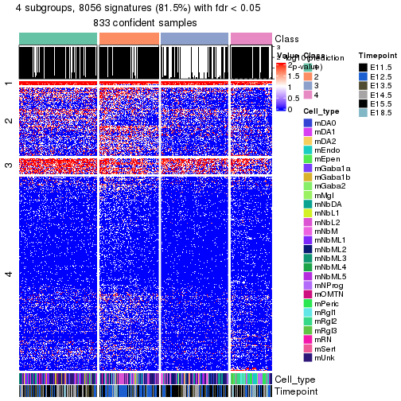</p>

</div>
</div>


Compare the overlap of signatures from different k:

```r
compare_signatures(res)
```


`get_signature()` returns a data frame invisibly. To get the list of signatures, the function
call should be assigned to a variable explicitly. In following code, if `plot` argument is set
to `FALSE`, no heatmap is plotted while only the differential analysis is performed.

```r
# code only for demonstration
tb = get_signature(res, k = ..., plot = FALSE)
```

An example of the output of `tb` is:

```
#>   which_row         fdr    mean_1    mean_2 scaled_mean_1 scaled_mean_2 km
#> 1        38 0.042760348  8.373488  9.131774    -0.5533452     0.5164555  1
#> 2        40 0.018707592  7.106213  8.469186    -0.6173731     0.5762149  1
#> 3        55 0.019134737 10.221463 11.207825    -0.6159697     0.5749050  1
#> 4        59 0.006059896  5.921854  7.869574    -0.6899429     0.6439467  1
#> 5        60 0.018055526  8.928898 10.211722    -0.6204761     0.5791110  1
#> 6        98 0.009384629 15.714769 14.887706     0.6635654    -0.6193277  2
...
```

The columns in `tb` are:

1. `which_row`: row indices corresponding to the input matrix.
2. `fdr`: FDR for the differential test. 
3. `mean_x`: The mean value in group x.
4. `scaled_mean_x`: The mean value in group x after rows are scaled.
5. `km`: Row groups if k-means clustering is applied to rows (which is done by automatically selecting number of clusters).

If there are too many signatures, `top_signatures = ...` can be set to only show the 
signatures with the highest FDRs:

```r
# code only for demonstration
# e.g. to show the top 500 most significant rows
tb = get_signature(res, k = ..., top_signatures = 500)
```

If the signatures are defined as these which are uniquely high in current group, `diff_method` argument
can be set to `"uniquely_high_in_one_group"`:

```r
# code only for demonstration
tb = get_signature(res, k = ..., diff_method = "uniquely_high_in_one_group")
```


UMAP plot which shows how samples are separated.


<script>
$( function() {
	$( '#tabs-node-01-dimension-reduction' ).tabs();
} );
</script>
<div id='tabs-node-01-dimension-reduction'>
<ul>
<li><a href='#tab-node-01-dimension-reduction-1'>k = 2</a></li>
<li><a href='#tab-node-01-dimension-reduction-2'>k = 3</a></li>
<li><a href='#tab-node-01-dimension-reduction-3'>k = 4</a></li>
</ul>
<div id='tab-node-01-dimension-reduction-1'>
<pre><code class="r">dimension_reduction(res, k = 2, method = &quot;UMAP&quot;)
</code></pre>

<p></p>

</div>
<div id='tab-node-01-dimension-reduction-2'>
<pre><code class="r">dimension_reduction(res, k = 3, method = &quot;UMAP&quot;)
</code></pre>

<p></p>

</div>
<div id='tab-node-01-dimension-reduction-3'>
<pre><code class="r">dimension_reduction(res, k = 4, method = &quot;UMAP&quot;)
</code></pre>

<p></p>

</div>
</div>


Following heatmap shows how subgroups are split when increasing `k`:

```r
collect_classes(res)
```


Test correlation between subgroups and known annotations. If the known
annotation is numeric, one-way ANOVA test is applied, and if the known
annotation is discrete, chi-squared contingency table test is applied.

```r
test_to_known_factors(res)
```

```
#>             n_sample Cell_type(p-value) Timepoint(p-value) k
#> ATC:skmeans      650           1.68e-16           3.57e-27 2
#> ATC:skmeans      650           1.19e-68           1.77e-34 3
#> ATC:skmeans      600          7.33e-119           1.93e-64 4
```


If matrix rows can be associated to genes, consider to use `functional_enrichment(res,
...)` to perform function enrichment for the signature genes. See [this vignette](https://jokergoo.github.io/cola_vignettes/functional_enrichment.html) for more detailed explanations.


 

---------------------------------------------------


### Node012


Parent node: [Node01](#Node01).
Child nodes: 
                [Node0121](#Node0121)
        ,
                [Node0122](#Node0122)
        ,
                Node0123-leaf
        ,
                [Node0131](#Node0131)
        ,
                Node0132-leaf
        ,
                Node0133-leaf
        ,
                [Node0221](#Node0221)
        ,
                [Node0222](#Node0222)
        ,
                Node0231-leaf
        ,
                Node0232-leaf
        ,
                Node0233-leaf
        ,
                [Node0311](#Node0311)
        ,
                [Node0312](#Node0312)
        ,
                Node0321-leaf
        ,
                Node0322-leaf
        ,
                Node0323-leaf
        ,
                Node0324-leaf
        .


The object with results only for a single top-value method and a single partitioning method 
can be extracted as:

```r
res = res_rh["012"]
```

A summary of `res` and all the functions that can be applied to it:

```r
res
```

```
#> A 'ConsensusPartition' object with k = 2, 3, 4.
#>   On a matrix with 8433 rows and 213 columns.
#>   Top rows (843) are extracted by 'ATC' method.
#>   Subgroups are detected by 'skmeans' method.
#>   Performed in total 150 partitions by row resampling.
#>   Best k for subgroups seems to be 4.
#> 
#> Following methods can be applied to this 'ConsensusPartition' object:
#>  [1] "cola_report"             "collect_classes"         "collect_plots"          
#>  [4] "collect_stats"           "colnames"                "compare_partitions"     
#>  [7] "compare_signatures"      "consensus_heatmap"       "dimension_reduction"    
#> [10] "functional_enrichment"   "get_anno_col"            "get_anno"               
#> [13] "get_classes"             "get_consensus"           "get_matrix"             
#> [16] "get_membership"          "get_param"               "get_signatures"         
#> [19] "get_stats"               "is_best_k"               "is_stable_k"            
#> [22] "membership_heatmap"      "ncol"                    "nrow"                   
#> [25] "plot_ecdf"               "predict_classes"         "rownames"               
#> [28] "select_partition_number" "show"                    "suggest_best_k"         
#> [31] "test_to_known_factors"   "top_rows_heatmap"
```

`collect_plots()` function collects all the plots made from `res` for all `k` (number of subgroups)
into one single page to provide an easy and fast comparison between different `k`.

```r
collect_plots(res)
```


The plots are:

- The first row: a plot of the eCDF (empirical cumulative distribution
  function) curves of the consensus matrix for each `k` and the heatmap of
  predicted classes for each `k`.
- The second row: heatmaps of the consensus matrix for each `k`.
- The third row: heatmaps of the membership matrix for each `k`.
- The fouth row: heatmaps of the signatures for each `k`.

All the plots in panels can be made by individual functions and they are
plotted later in this section.

`select_partition_number()` produces several plots showing different
statistics for choosing "optimized" `k`. There are following statistics:

- eCDF curves of the consensus matrix for each `k`;
- 1-PAC. [The PAC score](https://en.wikipedia.org/wiki/Consensus_clustering#Over-interpretation_potential_of_consensus_clustering)
  measures the proportion of the ambiguous subgrouping.
- Mean silhouette score.
- Concordance. The mean probability of fiting the consensus subgroup labels in all
  partitions.
- Area increased. Denote $A_k$ as the area under the eCDF curve for current
  `k`, the area increased is defined as $A_k - A_{k-1}$.
- Rand index. The percent of pairs of samples that are both in a same cluster
  or both are not in a same cluster in the partition of k and k-1.
- Jaccard index. The ratio of pairs of samples are both in a same cluster in
  the partition of k and k-1 and the pairs of samples are both in a same
  cluster in the partition k or k-1.

The detailed explanations of these statistics can be found in [the _cola_
vignette](https://jokergoo.github.io/cola_vignettes/cola.html#toc_13).

Generally speaking, higher 1-PAC score, higher mean silhouette score or higher
concordance corresponds to better partition. Rand index and Jaccard index
measure how similar the current partition is compared to partition with `k-1`.
If they are too similar, we won't accept `k` is better than `k-1`.

```r
select_partition_number(res)
```


The numeric values for all these statistics can be obtained by `get_stats()`.

```r
get_stats(res)
```

```
#>   k 1-PAC mean_silhouette concordance area_increased  Rand Jaccard
#> 2 2 1.000           0.971       0.989         0.5013 0.500   0.500
#> 3 3 0.988           0.955       0.982         0.3054 0.754   0.549
#> 4 4 0.934           0.929       0.965         0.0969 0.878   0.675
```

`suggest_best_k()` suggests the best $k$ based on these statistics. The rules are as follows:

- All $k$ with Jaccard index larger than 0.95 are removed because increasing
  $k$ does not provide enough extra information. If all $k$ are removed, it is
  marked as no subgroup is detected.
- For all $k$ with 1-PAC score larger than 0.9, the maximal $k$ is taken as
  the best $k$, and other $k$ are marked as optional $k$.
- If it does not fit the second rule. The $k$ with the maximal vote of the
  highest 1-PAC score, highest mean silhouette, and highest concordance is
  taken as the best $k$.

```r
suggest_best_k(res)
```

```
#> [1] 4
#> attr(,"optional")
#> [1] 2 3
```

There is also optional best $k$ = 2 3 that is worth to check.

Following is the table of the partitions (You need to click the **show/hide
code output** link to see it). The membership matrix (columns with name `p*`)
is inferred by
[`clue::cl_consensus()`](https://www.rdocumentation.org/link/cl_consensus?package=clue)
function with the `SE` method. Basically the value in the membership matrix
represents the probability to belong to a certain group. The finall subgroup
label for an item is determined with the group with highest probability it
belongs to.

In `get_classes()` function, the entropy is calculated from the membership
matrix and the silhouette score is calculated from the consensus matrix.


<script>
$( function() {
	$( '#tabs-node-012-get-classes' ).tabs();
} );
</script>
<div id='tabs-node-012-get-classes'>
<ul>
<li><a href='#tab-node-012-get-classes-1'>k = 2</a></li>
<li><a href='#tab-node-012-get-classes-2'>k = 3</a></li>
<li><a href='#tab-node-012-get-classes-3'>k = 4</a></li>
</ul>

<div id='tab-node-012-get-classes-1'>
<p><a id='tab-node-012-get-classes-1-a' style='color:#0366d6' href='#'>show/hide code output</a></p>
<pre><code class="r">cbind(get_classes(res, k = 2), get_membership(res, k = 2))
</code></pre>

<pre><code>#&gt;                class entropy silhouette   p1   p2
#&gt; 1772094169_G10     2   0.000      0.986 0.00 1.00
#&gt; 1772094172_F07     2   0.000      0.986 0.00 1.00
#&gt; 1772094166_C10     2   0.000      0.986 0.00 1.00
#&gt; 1772072246_G11     2   0.000      0.986 0.00 1.00
#&gt; 1772094169_E07     2   0.000      0.986 0.00 1.00
#&gt; 1772096115_A02     2   0.000      0.986 0.00 1.00
#&gt; 1772094171_H02     2   0.000      0.986 0.00 1.00
#&gt; 1772092006_H05     2   0.000      0.986 0.00 1.00
#&gt; 1772072248_F03     2   0.000      0.986 0.00 1.00
#&gt; 1772072249_F08     2   0.000      0.986 0.00 1.00
#&gt; 1772072246_H01     2   0.000      0.986 0.00 1.00
#&gt; 1772094169_D01     1   0.000      0.992 1.00 0.00
#&gt; 1772072246_A01     2   0.000      0.986 0.00 1.00
#&gt; 1772072246_G09     2   0.000      0.986 0.00 1.00
#&gt; 1772071046_D06     1   0.402      0.908 0.92 0.08
#&gt; 1772094171_A01     2   0.000      0.986 0.00 1.00
#&gt; 1772094163_C10     2   0.000      0.986 0.00 1.00
#&gt; 1772066085_D11     1   0.000      0.992 1.00 0.00
#&gt; 1772096112_C11     2   0.000      0.986 0.00 1.00
#&gt; 1771013108_C09     2   0.000      0.986 0.00 1.00
#&gt; 1771013111_G05     2   0.000      0.986 0.00 1.00
#&gt; 1772092006_B05     1   0.000      0.992 1.00 0.00
#&gt; 1772072248_G08     2   0.000      0.986 0.00 1.00
#&gt; 1772072246_A09     2   0.000      0.986 0.00 1.00
#&gt; 1772072246_F02     2   0.000      0.986 0.00 1.00
#&gt; 1772066085_D08     2   0.000      0.986 0.00 1.00
#&gt; 1771013108_F10     2   0.000      0.986 0.00 1.00
#&gt; 1772094169_E05     2   0.000      0.986 0.00 1.00
#&gt; 1772094171_A05     2   0.000      0.986 0.00 1.00
#&gt; 1772075301_H02     2   0.000      0.986 0.00 1.00
#&gt; 1772096115_G02     2   0.000      0.986 0.00 1.00
#&gt; 1772071046_B02     2   0.000      0.986 0.00 1.00
#&gt; 1772096115_E07     2   0.000      0.986 0.00 1.00
#&gt; 1772075300_H10     2   0.971      0.334 0.40 0.60
#&gt; 1772066085_A12     1   0.943      0.432 0.64 0.36
#&gt; 1772072246_H05     2   0.000      0.986 0.00 1.00
#&gt; 1771013153_G05     2   0.000      0.986 0.00 1.00
#&gt; 1772094159_G02     1   0.000      0.992 1.00 0.00
#&gt; 1772094166_A01     2   0.000      0.986 0.00 1.00
#&gt; 1772094169_G06     2   0.000      0.986 0.00 1.00
#&gt; 1772094166_H08     2   0.000      0.986 0.00 1.00
#&gt; 1772094159_H01     1   0.000      0.992 1.00 0.00
#&gt; 1772094171_H11     1   0.000      0.992 1.00 0.00
#&gt; 1772094163_H08     2   0.000      0.986 0.00 1.00
#&gt; 1772094169_D08     2   0.000      0.986 0.00 1.00
#&gt; 1772094169_C06     1   0.000      0.992 1.00 0.00
#&gt; 1772096114_E08     2   0.000      0.986 0.00 1.00
#&gt; 1772094169_B09     1   0.000      0.992 1.00 0.00
#&gt; 1772094171_D09     1   0.000      0.992 1.00 0.00
#&gt; 1772094171_E06     1   0.000      0.992 1.00 0.00
#&gt; 1772094169_C01     1   0.000      0.992 1.00 0.00
#&gt; 1772094169_F02     1   0.000      0.992 1.00 0.00
#&gt; 1772094171_H06     1   0.000      0.992 1.00 0.00
#&gt; 1772094171_F01     1   0.000      0.992 1.00 0.00
#&gt; 1772094171_G03     2   0.000      0.986 0.00 1.00
#&gt; 1772094159_D08     1   0.000      0.992 1.00 0.00
#&gt; 1772094169_B03     1   0.000      0.992 1.00 0.00
#&gt; 1772094169_F05     1   0.000      0.992 1.00 0.00
#&gt; 1772094171_G01     1   0.000      0.992 1.00 0.00
#&gt; 1772094169_A09     1   0.000      0.992 1.00 0.00
#&gt; 1772094169_A07     1   0.000      0.992 1.00 0.00
#&gt; 1772094171_F03     2   0.000      0.986 0.00 1.00
#&gt; 1772094171_G09     1   0.000      0.992 1.00 0.00
#&gt; 1772094169_F09     2   0.000      0.986 0.00 1.00
#&gt; 1772096114_C04     2   0.000      0.986 0.00 1.00
#&gt; 1772094169_C02     1   0.000      0.992 1.00 0.00
#&gt; 1772094171_E01     1   0.000      0.992 1.00 0.00
#&gt; 1772094171_F09     1   0.000      0.992 1.00 0.00
#&gt; 1772094171_A06     1   0.000      0.992 1.00 0.00
#&gt; 1772094171_F02     1   0.000      0.992 1.00 0.00
#&gt; 1772094169_C09     2   0.000      0.986 0.00 1.00
#&gt; 1772094159_G03     1   0.000      0.992 1.00 0.00
#&gt; 1772094171_E07     1   0.000      0.992 1.00 0.00
#&gt; 1772094169_C10     1   0.000      0.992 1.00 0.00
#&gt; 1772094171_A12     1   0.000      0.992 1.00 0.00
#&gt; 1772066091_D09     2   0.000      0.986 0.00 1.00
#&gt; 1772094169_E12     1   0.000      0.992 1.00 0.00
#&gt; 1772094159_C03     1   0.000      0.992 1.00 0.00
#&gt; 1772094169_C04     1   0.000      0.992 1.00 0.00
#&gt; 1772094169_E02     1   0.000      0.992 1.00 0.00
#&gt; 1772094166_E08     1   0.000      0.992 1.00 0.00
#&gt; 1772094169_F03     2   0.000      0.986 0.00 1.00
#&gt; 1772094166_F08     2   0.000      0.986 0.00 1.00
#&gt; 1772094156_A08     2   0.402      0.904 0.08 0.92
#&gt; 1771013153_C09     1   0.327      0.931 0.94 0.06
#&gt; 1771013111_G09     2   0.000      0.986 0.00 1.00
#&gt; 1772094169_F04     1   0.000      0.992 1.00 0.00
#&gt; 1771013108_G07     1   0.000      0.992 1.00 0.00
#&gt; 1772092007_D02     1   0.000      0.992 1.00 0.00
#&gt; 1772094171_A08     1   0.000      0.992 1.00 0.00
#&gt; 1772094171_D11     1   0.000      0.992 1.00 0.00
#&gt; 1772072249_G01     2   0.000      0.986 0.00 1.00
#&gt; 1772094169_F10     1   0.000      0.992 1.00 0.00
#&gt; 1772094171_A10     1   0.000      0.992 1.00 0.00
#&gt; 1772094166_H10     2   0.000      0.986 0.00 1.00
#&gt; 1772072247_G02     1   0.000      0.992 1.00 0.00
#&gt; 1771013111_E02     1   0.141      0.972 0.98 0.02
#&gt; 1772094171_F10     2   0.000      0.986 0.00 1.00
#&gt; 1771013108_D03     1   0.000      0.992 1.00 0.00
#&gt; 1772096111_H07     1   0.000      0.992 1.00 0.00
#&gt; 1772094163_G09     2   0.000      0.986 0.00 1.00
#&gt; 1771013153_H01     1   0.000      0.992 1.00 0.00
#&gt; 1772094171_G06     1   0.000      0.992 1.00 0.00
#&gt; 1772094172_E08     1   0.000      0.992 1.00 0.00
#&gt; 1772094169_F08     1   0.000      0.992 1.00 0.00
#&gt; 1772094173_H10     1   0.000      0.992 1.00 0.00
#&gt; 1772094169_H04     1   0.000      0.992 1.00 0.00
#&gt; 1771013108_D08     1   0.000      0.992 1.00 0.00
#&gt; 1772094174_B08     1   0.000      0.992 1.00 0.00
#&gt; 1772071046_A04     1   0.000      0.992 1.00 0.00
#&gt; 1772094172_G01     2   0.000      0.986 0.00 1.00
#&gt; 1771013111_D03     1   0.000      0.992 1.00 0.00
#&gt; 1772094171_C01     2   0.000      0.986 0.00 1.00
#&gt; 1772094163_F11     2   0.000      0.986 0.00 1.00
#&gt; 1772094169_F06     2   0.000      0.986 0.00 1.00
#&gt; 1772092006_G04     1   0.000      0.992 1.00 0.00
#&gt; 1771013113_G10     2   0.000      0.986 0.00 1.00
#&gt; 1772094163_A12     1   0.000      0.992 1.00 0.00
#&gt; 1772094171_D08     2   0.000      0.986 0.00 1.00
#&gt; 1772094166_E02     2   0.000      0.986 0.00 1.00
#&gt; 1772094169_H12     1   0.000      0.992 1.00 0.00
#&gt; 1772094171_F11     2   0.000      0.986 0.00 1.00
#&gt; 1772094144_H06     1   0.000      0.992 1.00 0.00
#&gt; 1772096115_H09     1   0.000      0.992 1.00 0.00
#&gt; 1772094169_D11     1   0.000      0.992 1.00 0.00
#&gt; 1772094169_H01     2   0.000      0.986 0.00 1.00
#&gt; 1772094171_F08     1   0.000      0.992 1.00 0.00
#&gt; 1772094169_A03     2   0.000      0.986 0.00 1.00
#&gt; 1772094171_B11     1   0.000      0.992 1.00 0.00
#&gt; 1772094169_G08     2   0.000      0.986 0.00 1.00
#&gt; 1772094169_E09     1   0.000      0.992 1.00 0.00
#&gt; 1772094169_B01     1   0.000      0.992 1.00 0.00
#&gt; 1772094171_D02     1   0.000      0.992 1.00 0.00
#&gt; 1772094166_E04     1   0.000      0.992 1.00 0.00
#&gt; 1772094171_B04     1   0.000      0.992 1.00 0.00
#&gt; 1772094169_A06     1   0.000      0.992 1.00 0.00
#&gt; 1772094169_B06     1   0.000      0.992 1.00 0.00
#&gt; 1772094169_G02     1   0.000      0.992 1.00 0.00
#&gt; 1772094169_G03     1   0.000      0.992 1.00 0.00
#&gt; 1772092006_B08     1   0.000      0.992 1.00 0.00
#&gt; 1772094169_B10     1   0.000      0.992 1.00 0.00
#&gt; 1771013153_H11     1   0.000      0.992 1.00 0.00
#&gt; 1771013111_A07     2   0.000      0.986 0.00 1.00
#&gt; 1771013153_B07     2   0.000      0.986 0.00 1.00
#&gt; 1772094169_F11     1   0.000      0.992 1.00 0.00
#&gt; 1772092006_B01     1   0.000      0.992 1.00 0.00
#&gt; 1771013110_E07     2   0.000      0.986 0.00 1.00
#&gt; 1772092006_E07     2   0.000      0.986 0.00 1.00
#&gt; 1772094169_A04     2   0.000      0.986 0.00 1.00
#&gt; 1772094169_E11     1   0.000      0.992 1.00 0.00
#&gt; 1772094171_E12     2   0.000      0.986 0.00 1.00
#&gt; 1772094171_A09     2   0.000      0.986 0.00 1.00
#&gt; 1772092006_E11     1   0.881      0.569 0.70 0.30
#&gt; 1771013111_B03     1   0.000      0.992 1.00 0.00
#&gt; 1772094169_A10     2   0.000      0.986 0.00 1.00
#&gt; 1772071048_E02     2   0.000      0.986 0.00 1.00
#&gt; 1772094173_H01     2   0.000      0.986 0.00 1.00
#&gt; 1772066093_B09     2   0.000      0.986 0.00 1.00
#&gt; 1772072248_A03     2   0.000      0.986 0.00 1.00
#&gt; 1772094171_A03     2   0.000      0.986 0.00 1.00
#&gt; 1772096114_E05     2   0.000      0.986 0.00 1.00
#&gt; 1772094166_G02     1   0.000      0.992 1.00 0.00
#&gt; 1771013111_G01     1   0.000      0.992 1.00 0.00
#&gt; 1772096114_H01     2   0.000      0.986 0.00 1.00
#&gt; 1772096112_H04     2   0.000      0.986 0.00 1.00
#&gt; 1771013108_H02     2   0.469      0.881 0.10 0.90
#&gt; 1771013111_A09     2   0.000      0.986 0.00 1.00
#&gt; 1772094171_A04     2   0.141      0.967 0.02 0.98
#&gt; 1772096115_F09     2   0.000      0.986 0.00 1.00
#&gt; 1771013108_H07     1   0.000      0.992 1.00 0.00
#&gt; 1772071065_H10     2   0.000      0.986 0.00 1.00
#&gt; 1772092006_C06     1   0.000      0.992 1.00 0.00
#&gt; 1771013111_B07     2   0.000      0.986 0.00 1.00
#&gt; 1772072247_F07     2   0.000      0.986 0.00 1.00
#&gt; 1772066093_C01     2   0.000      0.986 0.00 1.00
#&gt; 1772072246_B11     1   0.000      0.992 1.00 0.00
#&gt; 1772094175_C12     2   0.000      0.986 0.00 1.00
#&gt; 1772066085_E09     1   0.000      0.992 1.00 0.00
#&gt; 1772071046_B07     1   0.000      0.992 1.00 0.00
#&gt; 1772094172_C01     1   0.000      0.992 1.00 0.00
#&gt; 1772094174_E07     2   0.000      0.986 0.00 1.00
#&gt; 1771013108_F05     2   0.000      0.986 0.00 1.00
#&gt; 1772096115_E11     2   0.000      0.986 0.00 1.00
#&gt; 1772066093_G06     2   0.000      0.986 0.00 1.00
#&gt; 1772075300_H08     2   0.000      0.986 0.00 1.00
#&gt; 1772072249_F01     2   0.000      0.986 0.00 1.00
#&gt; 1772066085_G04     1   0.000      0.992 1.00 0.00
#&gt; 1772072248_E08     2   0.000      0.986 0.00 1.00
#&gt; 1772094174_G09     1   0.000      0.992 1.00 0.00
#&gt; 1772072247_B11     2   0.995      0.152 0.46 0.54
#&gt; 1772072249_G10     2   0.995      0.152 0.46 0.54
#&gt; 1772071046_B10     1   0.000      0.992 1.00 0.00
#&gt; 1772066085_G01     2   0.000      0.986 0.00 1.00
#&gt; 1772072249_B05     1   0.000      0.992 1.00 0.00
#&gt; 1772066084_C01     2   0.000      0.986 0.00 1.00
#&gt; 1772066085_E05     2   0.000      0.986 0.00 1.00
#&gt; 1772072249_A07     2   0.000      0.986 0.00 1.00
#&gt; 1772072247_F09     1   0.000      0.992 1.00 0.00
#&gt; 1772066085_H02     1   0.000      0.992 1.00 0.00
#&gt; 1772072248_F08     1   0.000      0.992 1.00 0.00
#&gt; 1772072246_E07     2   0.000      0.986 0.00 1.00
#&gt; 1772072246_F01     1   0.000      0.992 1.00 0.00
#&gt; 1772072246_E12     2   0.000      0.986 0.00 1.00
#&gt; 1772072246_H02     2   0.000      0.986 0.00 1.00
#&gt; 1772072246_F09     2   0.000      0.986 0.00 1.00
#&gt; 1772072246_A07     2   0.000      0.986 0.00 1.00
#&gt; 1772072247_A06     2   0.000      0.986 0.00 1.00
#&gt; 1772072246_F03     2   0.000      0.986 0.00 1.00
#&gt; 1772072246_F12     2   0.000      0.986 0.00 1.00
#&gt; 1772072246_H06     2   0.000      0.986 0.00 1.00
#&gt; 1772072246_D06     2   0.000      0.986 0.00 1.00
#&gt; 1772075300_C03     2   0.000      0.986 0.00 1.00
#&gt; 1772094166_F05     2   0.000      0.986 0.00 1.00
</code></pre>

<script>
$('#tab-node-012-get-classes-1-a').parent().next().next().hide();
$('#tab-node-012-get-classes-1-a').click(function(){
  $('#tab-node-012-get-classes-1-a').parent().next().next().toggle();
  return(false);
});
</script>
</div>

<div id='tab-node-012-get-classes-2'>
<p><a id='tab-node-012-get-classes-2-a' style='color:#0366d6' href='#'>show/hide code output</a></p>
<pre><code class="r">cbind(get_classes(res, k = 3), get_membership(res, k = 3))
</code></pre>

<pre><code>#&gt;                class entropy silhouette   p1   p2   p3
#&gt; 1772094169_G10     2  0.0000     0.9777 0.00 1.00 0.00
#&gt; 1772094172_F07     2  0.0000     0.9777 0.00 1.00 0.00
#&gt; 1772094166_C10     2  0.0000     0.9777 0.00 1.00 0.00
#&gt; 1772072246_G11     3  0.0000     0.9783 0.00 0.00 1.00
#&gt; 1772094169_E07     2  0.0000     0.9777 0.00 1.00 0.00
#&gt; 1772096115_A02     2  0.0000     0.9777 0.00 1.00 0.00
#&gt; 1772094171_H02     3  0.0000     0.9783 0.00 0.00 1.00
#&gt; 1772092006_H05     2  0.0000     0.9777 0.00 1.00 0.00
#&gt; 1772072248_F03     3  0.0000     0.9783 0.00 0.00 1.00
#&gt; 1772072249_F08     3  0.0000     0.9783 0.00 0.00 1.00
#&gt; 1772072246_H01     3  0.0000     0.9783 0.00 0.00 1.00
#&gt; 1772094169_D01     1  0.0000     0.9850 1.00 0.00 0.00
#&gt; 1772072246_A01     3  0.0000     0.9783 0.00 0.00 1.00
#&gt; 1772072246_G09     3  0.0000     0.9783 0.00 0.00 1.00
#&gt; 1772071046_D06     2  0.5835     0.4832 0.34 0.66 0.00
#&gt; 1772094171_A01     2  0.0000     0.9777 0.00 1.00 0.00
#&gt; 1772094163_C10     2  0.0000     0.9777 0.00 1.00 0.00
#&gt; 1772066085_D11     1  0.0000     0.9850 1.00 0.00 0.00
#&gt; 1772096112_C11     2  0.0000     0.9777 0.00 1.00 0.00
#&gt; 1771013108_C09     2  0.0000     0.9777 0.00 1.00 0.00
#&gt; 1771013111_G05     2  0.0000     0.9777 0.00 1.00 0.00
#&gt; 1772092006_B05     2  0.0000     0.9777 0.00 1.00 0.00
#&gt; 1772072248_G08     3  0.0000     0.9783 0.00 0.00 1.00
#&gt; 1772072246_A09     2  0.6302     0.0616 0.00 0.52 0.48
#&gt; 1772072246_F02     2  0.6302     0.0640 0.00 0.52 0.48
#&gt; 1772066085_D08     2  0.0000     0.9777 0.00 1.00 0.00
#&gt; 1771013108_F10     2  0.0000     0.9777 0.00 1.00 0.00
#&gt; 1772094169_E05     2  0.0000     0.9777 0.00 1.00 0.00
#&gt; 1772094171_A05     2  0.0000     0.9777 0.00 1.00 0.00
#&gt; 1772075301_H02     3  0.0000     0.9783 0.00 0.00 1.00
#&gt; 1772096115_G02     2  0.0000     0.9777 0.00 1.00 0.00
#&gt; 1772071046_B02     3  0.0000     0.9783 0.00 0.00 1.00
#&gt; 1772096115_E07     2  0.0000     0.9777 0.00 1.00 0.00
#&gt; 1772075300_H10     2  0.4556     0.8426 0.06 0.86 0.08
#&gt; 1772066085_A12     2  0.0892     0.9576 0.02 0.98 0.00
#&gt; 1772072246_H05     3  0.0000     0.9783 0.00 0.00 1.00
#&gt; 1771013153_G05     3  0.5560     0.5858 0.00 0.30 0.70
#&gt; 1772094159_G02     1  0.0000     0.9850 1.00 0.00 0.00
#&gt; 1772094166_A01     2  0.0000     0.9777 0.00 1.00 0.00
#&gt; 1772094169_G06     2  0.0000     0.9777 0.00 1.00 0.00
#&gt; 1772094166_H08     2  0.0000     0.9777 0.00 1.00 0.00
#&gt; 1772094159_H01     1  0.0000     0.9850 1.00 0.00 0.00
#&gt; 1772094171_H11     1  0.0000     0.9850 1.00 0.00 0.00
#&gt; 1772094163_H08     2  0.0000     0.9777 0.00 1.00 0.00
#&gt; 1772094169_D08     2  0.0000     0.9777 0.00 1.00 0.00
#&gt; 1772094169_C06     3  0.1529     0.9426 0.04 0.00 0.96
#&gt; 1772096114_E08     2  0.0000     0.9777 0.00 1.00 0.00
#&gt; 1772094169_B09     1  0.0000     0.9850 1.00 0.00 0.00
#&gt; 1772094171_D09     1  0.0000     0.9850 1.00 0.00 0.00
#&gt; 1772094171_E06     1  0.0000     0.9850 1.00 0.00 0.00
#&gt; 1772094169_C01     1  0.0000     0.9850 1.00 0.00 0.00
#&gt; 1772094169_F02     1  0.0000     0.9850 1.00 0.00 0.00
#&gt; 1772094171_H06     1  0.0000     0.9850 1.00 0.00 0.00
#&gt; 1772094171_F01     1  0.0000     0.9850 1.00 0.00 0.00
#&gt; 1772094171_G03     2  0.1529     0.9403 0.00 0.96 0.04
#&gt; 1772094159_D08     1  0.0000     0.9850 1.00 0.00 0.00
#&gt; 1772094169_B03     1  0.0000     0.9850 1.00 0.00 0.00
#&gt; 1772094169_F05     1  0.0000     0.9850 1.00 0.00 0.00
#&gt; 1772094171_G01     1  0.0000     0.9850 1.00 0.00 0.00
#&gt; 1772094169_A09     1  0.0000     0.9850 1.00 0.00 0.00
#&gt; 1772094169_A07     1  0.0000     0.9850 1.00 0.00 0.00
#&gt; 1772094171_F03     2  0.0000     0.9777 0.00 1.00 0.00
#&gt; 1772094171_G09     1  0.0000     0.9850 1.00 0.00 0.00
#&gt; 1772094169_F09     2  0.0000     0.9777 0.00 1.00 0.00
#&gt; 1772096114_C04     3  0.0892     0.9627 0.00 0.02 0.98
#&gt; 1772094169_C02     1  0.0000     0.9850 1.00 0.00 0.00
#&gt; 1772094171_E01     1  0.0000     0.9850 1.00 0.00 0.00
#&gt; 1772094171_F09     1  0.0000     0.9850 1.00 0.00 0.00
#&gt; 1772094171_A06     1  0.0000     0.9850 1.00 0.00 0.00
#&gt; 1772094171_F02     1  0.0000     0.9850 1.00 0.00 0.00
#&gt; 1772094169_C09     2  0.0000     0.9777 0.00 1.00 0.00
#&gt; 1772094159_G03     1  0.0000     0.9850 1.00 0.00 0.00
#&gt; 1772094171_E07     1  0.0000     0.9850 1.00 0.00 0.00
#&gt; 1772094169_C10     1  0.0892     0.9643 0.98 0.02 0.00
#&gt; 1772094171_A12     1  0.0000     0.9850 1.00 0.00 0.00
#&gt; 1772066091_D09     3  0.0000     0.9783 0.00 0.00 1.00
#&gt; 1772094169_E12     1  0.0000     0.9850 1.00 0.00 0.00
#&gt; 1772094159_C03     1  0.0000     0.9850 1.00 0.00 0.00
#&gt; 1772094169_C04     1  0.0000     0.9850 1.00 0.00 0.00
#&gt; 1772094169_E02     1  0.0000     0.9850 1.00 0.00 0.00
#&gt; 1772094166_E08     1  0.4002     0.8024 0.84 0.16 0.00
#&gt; 1772094169_F03     2  0.0000     0.9777 0.00 1.00 0.00
#&gt; 1772094166_F08     2  0.0000     0.9777 0.00 1.00 0.00
#&gt; 1772094156_A08     2  0.0000     0.9777 0.00 1.00 0.00
#&gt; 1771013153_C09     2  0.0000     0.9777 0.00 1.00 0.00
#&gt; 1771013111_G09     3  0.0892     0.9626 0.00 0.02 0.98
#&gt; 1772094169_F04     1  0.0000     0.9850 1.00 0.00 0.00
#&gt; 1771013108_G07     1  0.5397     0.6116 0.72 0.28 0.00
#&gt; 1772092007_D02     1  0.0000     0.9850 1.00 0.00 0.00
#&gt; 1772094171_A08     1  0.0000     0.9850 1.00 0.00 0.00
#&gt; 1772094171_D11     1  0.0000     0.9850 1.00 0.00 0.00
#&gt; 1772072249_G01     3  0.0000     0.9783 0.00 0.00 1.00
#&gt; 1772094169_F10     1  0.0000     0.9850 1.00 0.00 0.00
#&gt; 1772094171_A10     1  0.0000     0.9850 1.00 0.00 0.00
#&gt; 1772094166_H10     3  0.3686     0.8383 0.00 0.14 0.86
#&gt; 1772072247_G02     1  0.0000     0.9850 1.00 0.00 0.00
#&gt; 1771013111_E02     2  0.0000     0.9777 0.00 1.00 0.00
#&gt; 1772094171_F10     2  0.0000     0.9777 0.00 1.00 0.00
#&gt; 1771013108_D03     2  0.3340     0.8435 0.12 0.88 0.00
#&gt; 1772096111_H07     1  0.0000     0.9850 1.00 0.00 0.00
#&gt; 1772094163_G09     2  0.0000     0.9777 0.00 1.00 0.00
#&gt; 1771013153_H01     1  0.0000     0.9850 1.00 0.00 0.00
#&gt; 1772094171_G06     1  0.0000     0.9850 1.00 0.00 0.00
#&gt; 1772094172_E08     1  0.0000     0.9850 1.00 0.00 0.00
#&gt; 1772094169_F08     1  0.0000     0.9850 1.00 0.00 0.00
#&gt; 1772094173_H10     1  0.0000     0.9850 1.00 0.00 0.00
#&gt; 1772094169_H04     1  0.0000     0.9850 1.00 0.00 0.00
#&gt; 1771013108_D08     1  0.6244     0.2128 0.56 0.44 0.00
#&gt; 1772094174_B08     1  0.0000     0.9850 1.00 0.00 0.00
#&gt; 1772071046_A04     1  0.0000     0.9850 1.00 0.00 0.00
#&gt; 1772094172_G01     2  0.0000     0.9777 0.00 1.00 0.00
#&gt; 1771013111_D03     1  0.0000     0.9850 1.00 0.00 0.00
#&gt; 1772094171_C01     2  0.0000     0.9777 0.00 1.00 0.00
#&gt; 1772094163_F11     2  0.0000     0.9777 0.00 1.00 0.00
#&gt; 1772094169_F06     2  0.0000     0.9777 0.00 1.00 0.00
#&gt; 1772092006_G04     1  0.0000     0.9850 1.00 0.00 0.00
#&gt; 1771013113_G10     2  0.0000     0.9777 0.00 1.00 0.00
#&gt; 1772094163_A12     1  0.0000     0.9850 1.00 0.00 0.00
#&gt; 1772094171_D08     2  0.0000     0.9777 0.00 1.00 0.00
#&gt; 1772094166_E02     2  0.0000     0.9777 0.00 1.00 0.00
#&gt; 1772094169_H12     2  0.0000     0.9777 0.00 1.00 0.00
#&gt; 1772094171_F11     2  0.0000     0.9777 0.00 1.00 0.00
#&gt; 1772094144_H06     1  0.0000     0.9850 1.00 0.00 0.00
#&gt; 1772096115_H09     2  0.0000     0.9777 0.00 1.00 0.00
#&gt; 1772094169_D11     1  0.0000     0.9850 1.00 0.00 0.00
#&gt; 1772094169_H01     2  0.0000     0.9777 0.00 1.00 0.00
#&gt; 1772094171_F08     1  0.0000     0.9850 1.00 0.00 0.00
#&gt; 1772094169_A03     2  0.0000     0.9777 0.00 1.00 0.00
#&gt; 1772094171_B11     1  0.0000     0.9850 1.00 0.00 0.00
#&gt; 1772094169_G08     2  0.0000     0.9777 0.00 1.00 0.00
#&gt; 1772094169_E09     1  0.0000     0.9850 1.00 0.00 0.00
#&gt; 1772094169_B01     1  0.0000     0.9850 1.00 0.00 0.00
#&gt; 1772094171_D02     1  0.0000     0.9850 1.00 0.00 0.00
#&gt; 1772094166_E04     1  0.0000     0.9850 1.00 0.00 0.00
#&gt; 1772094171_B04     1  0.0000     0.9850 1.00 0.00 0.00
#&gt; 1772094169_A06     1  0.0000     0.9850 1.00 0.00 0.00
#&gt; 1772094169_B06     1  0.0000     0.9850 1.00 0.00 0.00
#&gt; 1772094169_G02     1  0.0000     0.9850 1.00 0.00 0.00
#&gt; 1772094169_G03     1  0.0000     0.9850 1.00 0.00 0.00
#&gt; 1772092006_B08     1  0.0000     0.9850 1.00 0.00 0.00
#&gt; 1772094169_B10     2  0.0000     0.9777 0.00 1.00 0.00
#&gt; 1771013153_H11     2  0.0000     0.9777 0.00 1.00 0.00
#&gt; 1771013111_A07     2  0.0000     0.9777 0.00 1.00 0.00
#&gt; 1771013153_B07     2  0.0000     0.9777 0.00 1.00 0.00
#&gt; 1772094169_F11     1  0.0000     0.9850 1.00 0.00 0.00
#&gt; 1772092006_B01     1  0.0000     0.9850 1.00 0.00 0.00
#&gt; 1771013110_E07     2  0.0000     0.9777 0.00 1.00 0.00
#&gt; 1772092006_E07     2  0.0000     0.9777 0.00 1.00 0.00
#&gt; 1772094169_A04     2  0.0000     0.9777 0.00 1.00 0.00
#&gt; 1772094169_E11     1  0.0000     0.9850 1.00 0.00 0.00
#&gt; 1772094171_E12     2  0.0000     0.9777 0.00 1.00 0.00
#&gt; 1772094171_A09     2  0.0000     0.9777 0.00 1.00 0.00
#&gt; 1772092006_E11     2  0.1529     0.9364 0.04 0.96 0.00
#&gt; 1771013111_B03     1  0.0000     0.9850 1.00 0.00 0.00
#&gt; 1772094169_A10     2  0.0000     0.9777 0.00 1.00 0.00
#&gt; 1772071048_E02     2  0.0000     0.9777 0.00 1.00 0.00
#&gt; 1772094173_H01     2  0.0000     0.9777 0.00 1.00 0.00
#&gt; 1772066093_B09     3  0.5560     0.5868 0.00 0.30 0.70
#&gt; 1772072248_A03     3  0.0000     0.9783 0.00 0.00 1.00
#&gt; 1772094171_A03     2  0.0000     0.9777 0.00 1.00 0.00
#&gt; 1772096114_E05     2  0.0000     0.9777 0.00 1.00 0.00
#&gt; 1772094166_G02     1  0.0000     0.9850 1.00 0.00 0.00
#&gt; 1771013111_G01     1  0.0000     0.9850 1.00 0.00 0.00
#&gt; 1772096114_H01     2  0.0000     0.9777 0.00 1.00 0.00
#&gt; 1772096112_H04     2  0.0000     0.9777 0.00 1.00 0.00
#&gt; 1771013108_H02     2  0.0000     0.9777 0.00 1.00 0.00
#&gt; 1771013111_A09     2  0.0892     0.9596 0.00 0.98 0.02
#&gt; 1772094171_A04     2  0.0000     0.9777 0.00 1.00 0.00
#&gt; 1772096115_F09     2  0.0000     0.9777 0.00 1.00 0.00
#&gt; 1771013108_H07     2  0.0000     0.9777 0.00 1.00 0.00
#&gt; 1772071065_H10     2  0.0000     0.9777 0.00 1.00 0.00
#&gt; 1772092006_C06     1  0.0000     0.9850 1.00 0.00 0.00
#&gt; 1771013111_B07     2  0.0000     0.9777 0.00 1.00 0.00
#&gt; 1772072247_F07     3  0.0000     0.9783 0.00 0.00 1.00
#&gt; 1772066093_C01     3  0.4002     0.8119 0.00 0.16 0.84
#&gt; 1772072246_B11     1  0.4796     0.7150 0.78 0.00 0.22
#&gt; 1772094175_C12     2  0.0000     0.9777 0.00 1.00 0.00
#&gt; 1772066085_E09     1  0.0000     0.9850 1.00 0.00 0.00
#&gt; 1772071046_B07     1  0.0000     0.9850 1.00 0.00 0.00
#&gt; 1772094172_C01     1  0.0000     0.9850 1.00 0.00 0.00
#&gt; 1772094174_E07     2  0.0000     0.9777 0.00 1.00 0.00
#&gt; 1771013108_F05     3  0.1529     0.9448 0.00 0.04 0.96
#&gt; 1772096115_E11     2  0.0000     0.9777 0.00 1.00 0.00
#&gt; 1772066093_G06     3  0.0000     0.9783 0.00 0.00 1.00
#&gt; 1772075300_H08     3  0.0000     0.9783 0.00 0.00 1.00
#&gt; 1772072249_F01     3  0.0000     0.9783 0.00 0.00 1.00
#&gt; 1772066085_G04     1  0.0000     0.9850 1.00 0.00 0.00
#&gt; 1772072248_E08     3  0.0000     0.9783 0.00 0.00 1.00
#&gt; 1772094174_G09     1  0.0000     0.9850 1.00 0.00 0.00
#&gt; 1772072247_B11     3  0.0000     0.9783 0.00 0.00 1.00
#&gt; 1772072249_G10     3  0.0000     0.9783 0.00 0.00 1.00
#&gt; 1772071046_B10     1  0.0000     0.9850 1.00 0.00 0.00
#&gt; 1772066085_G01     3  0.0000     0.9783 0.00 0.00 1.00
#&gt; 1772072249_B05     3  0.0000     0.9783 0.00 0.00 1.00
#&gt; 1772066084_C01     3  0.0000     0.9783 0.00 0.00 1.00
#&gt; 1772066085_E05     3  0.0000     0.9783 0.00 0.00 1.00
#&gt; 1772072249_A07     3  0.0000     0.9783 0.00 0.00 1.00
#&gt; 1772072247_F09     3  0.0000     0.9783 0.00 0.00 1.00
#&gt; 1772066085_H02     3  0.0000     0.9783 0.00 0.00 1.00
#&gt; 1772072248_F08     1  0.0000     0.9850 1.00 0.00 0.00
#&gt; 1772072246_E07     3  0.0000     0.9783 0.00 0.00 1.00
#&gt; 1772072246_F01     3  0.0000     0.9783 0.00 0.00 1.00
#&gt; 1772072246_E12     3  0.0000     0.9783 0.00 0.00 1.00
#&gt; 1772072246_H02     3  0.0000     0.9783 0.00 0.00 1.00
#&gt; 1772072246_F09     3  0.0000     0.9783 0.00 0.00 1.00
#&gt; 1772072246_A07     3  0.0000     0.9783 0.00 0.00 1.00
#&gt; 1772072247_A06     3  0.0000     0.9783 0.00 0.00 1.00
#&gt; 1772072246_F03     3  0.0000     0.9783 0.00 0.00 1.00
#&gt; 1772072246_F12     3  0.0000     0.9783 0.00 0.00 1.00
#&gt; 1772072246_H06     3  0.0000     0.9783 0.00 0.00 1.00
#&gt; 1772072246_D06     3  0.0000     0.9783 0.00 0.00 1.00
#&gt; 1772075300_C03     3  0.0000     0.9783 0.00 0.00 1.00
#&gt; 1772094166_F05     3  0.0000     0.9783 0.00 0.00 1.00
</code></pre>

<script>
$('#tab-node-012-get-classes-2-a').parent().next().next().hide();
$('#tab-node-012-get-classes-2-a').click(function(){
  $('#tab-node-012-get-classes-2-a').parent().next().next().toggle();
  return(false);
});
</script>
</div>

<div id='tab-node-012-get-classes-3'>
<p><a id='tab-node-012-get-classes-3-a' style='color:#0366d6' href='#'>show/hide code output</a></p>
<pre><code class="r">cbind(get_classes(res, k = 4), get_membership(res, k = 4))
</code></pre>

<pre><code>#&gt;                class entropy silhouette   p1   p2   p3   p4
#&gt; 1772094169_G10     4  0.0707      0.953 0.00 0.02 0.00 0.98
#&gt; 1772094172_F07     4  0.0707      0.953 0.00 0.02 0.00 0.98
#&gt; 1772094166_C10     4  0.0707      0.953 0.00 0.02 0.00 0.98
#&gt; 1772072246_G11     3  0.0000      0.966 0.00 0.00 1.00 0.00
#&gt; 1772094169_E07     4  0.3610      0.785 0.00 0.20 0.00 0.80
#&gt; 1772096115_A02     4  0.0707      0.953 0.00 0.02 0.00 0.98
#&gt; 1772094171_H02     3  0.4079      0.750 0.02 0.00 0.80 0.18
#&gt; 1772092006_H05     4  0.0707      0.953 0.00 0.02 0.00 0.98
#&gt; 1772072248_F03     4  0.2647      0.867 0.00 0.00 0.12 0.88
#&gt; 1772072249_F08     3  0.0000      0.966 0.00 0.00 1.00 0.00
#&gt; 1772072246_H01     3  0.0000      0.966 0.00 0.00 1.00 0.00
#&gt; 1772094169_D01     1  0.0707      0.971 0.98 0.00 0.00 0.02
#&gt; 1772072246_A01     4  0.2011      0.902 0.00 0.00 0.08 0.92
#&gt; 1772072246_G09     3  0.0000      0.966 0.00 0.00 1.00 0.00
#&gt; 1772071046_D06     4  0.0707      0.938 0.02 0.00 0.00 0.98
#&gt; 1772094171_A01     4  0.0707      0.953 0.00 0.02 0.00 0.98
#&gt; 1772094163_C10     2  0.2011      0.902 0.00 0.92 0.00 0.08
#&gt; 1772066085_D11     4  0.1211      0.923 0.04 0.00 0.00 0.96
#&gt; 1772096112_C11     4  0.0707      0.953 0.00 0.02 0.00 0.98
#&gt; 1771013108_C09     4  0.0707      0.953 0.00 0.02 0.00 0.98
#&gt; 1771013111_G05     4  0.0707      0.953 0.00 0.02 0.00 0.98
#&gt; 1772092006_B05     4  0.0000      0.940 0.00 0.00 0.00 1.00
#&gt; 1772072248_G08     3  0.0000      0.966 0.00 0.00 1.00 0.00
#&gt; 1772072246_A09     4  0.1411      0.945 0.00 0.02 0.02 0.96
#&gt; 1772072246_F02     4  0.1411      0.945 0.00 0.02 0.02 0.96
#&gt; 1772066085_D08     4  0.0707      0.953 0.00 0.02 0.00 0.98
#&gt; 1771013108_F10     4  0.0707      0.953 0.00 0.02 0.00 0.98
#&gt; 1772094169_E05     4  0.1211      0.939 0.00 0.04 0.00 0.96
#&gt; 1772094171_A05     4  0.0707      0.953 0.00 0.02 0.00 0.98
#&gt; 1772075301_H02     4  0.2921      0.847 0.00 0.00 0.14 0.86
#&gt; 1772096115_G02     4  0.0707      0.953 0.00 0.02 0.00 0.98
#&gt; 1772071046_B02     4  0.1637      0.917 0.00 0.00 0.06 0.94
#&gt; 1772096115_E07     4  0.0707      0.953 0.00 0.02 0.00 0.98
#&gt; 1772075300_H10     4  0.0707      0.953 0.00 0.02 0.00 0.98
#&gt; 1772066085_A12     4  0.0707      0.953 0.00 0.02 0.00 0.98
#&gt; 1772072246_H05     4  0.2921      0.847 0.00 0.00 0.14 0.86
#&gt; 1771013153_G05     2  0.0707      0.937 0.00 0.98 0.02 0.00
#&gt; 1772094159_G02     1  0.0000      0.978 1.00 0.00 0.00 0.00
#&gt; 1772094166_A01     2  0.0000      0.948 0.00 1.00 0.00 0.00
#&gt; 1772094169_G06     2  0.0000      0.948 0.00 1.00 0.00 0.00
#&gt; 1772094166_H08     2  0.0000      0.948 0.00 1.00 0.00 0.00
#&gt; 1772094159_H01     1  0.0000      0.978 1.00 0.00 0.00 0.00
#&gt; 1772094171_H11     1  0.0000      0.978 1.00 0.00 0.00 0.00
#&gt; 1772094163_H08     2  0.2011      0.903 0.00 0.92 0.00 0.08
#&gt; 1772094169_D08     2  0.0000      0.948 0.00 1.00 0.00 0.00
#&gt; 1772094169_C06     3  0.0000      0.966 0.00 0.00 1.00 0.00
#&gt; 1772096114_E08     2  0.0000      0.948 0.00 1.00 0.00 0.00
#&gt; 1772094169_B09     1  0.0000      0.978 1.00 0.00 0.00 0.00
#&gt; 1772094171_D09     1  0.0707      0.971 0.98 0.00 0.00 0.02
#&gt; 1772094171_E06     1  0.0000      0.978 1.00 0.00 0.00 0.00
#&gt; 1772094169_C01     1  0.3037      0.871 0.88 0.00 0.10 0.02
#&gt; 1772094169_F02     1  0.0707      0.971 0.98 0.00 0.00 0.02
#&gt; 1772094171_H06     1  0.0000      0.978 1.00 0.00 0.00 0.00
#&gt; 1772094171_F01     1  0.0707      0.971 0.98 0.00 0.00 0.02
#&gt; 1772094171_G03     2  0.0000      0.948 0.00 1.00 0.00 0.00
#&gt; 1772094159_D08     1  0.0000      0.978 1.00 0.00 0.00 0.00
#&gt; 1772094169_B03     1  0.0000      0.978 1.00 0.00 0.00 0.00
#&gt; 1772094169_F05     1  0.0000      0.978 1.00 0.00 0.00 0.00
#&gt; 1772094171_G01     1  0.0707      0.971 0.98 0.00 0.00 0.02
#&gt; 1772094169_A09     1  0.0000      0.978 1.00 0.00 0.00 0.00
#&gt; 1772094169_A07     1  0.0000      0.978 1.00 0.00 0.00 0.00
#&gt; 1772094171_F03     2  0.0000      0.948 0.00 1.00 0.00 0.00
#&gt; 1772094171_G09     1  0.0707      0.971 0.98 0.00 0.00 0.02
#&gt; 1772094169_F09     2  0.0000      0.948 0.00 1.00 0.00 0.00
#&gt; 1772096114_C04     2  0.4134      0.652 0.00 0.74 0.26 0.00
#&gt; 1772094169_C02     1  0.0707      0.971 0.98 0.00 0.00 0.02
#&gt; 1772094171_E01     1  0.0707      0.971 0.98 0.00 0.00 0.02
#&gt; 1772094171_F09     1  0.0707      0.971 0.98 0.00 0.00 0.02
#&gt; 1772094171_A06     1  0.0000      0.978 1.00 0.00 0.00 0.00
#&gt; 1772094171_F02     1  0.0707      0.971 0.98 0.00 0.00 0.02
#&gt; 1772094169_C09     2  0.0000      0.948 0.00 1.00 0.00 0.00
#&gt; 1772094159_G03     1  0.0000      0.978 1.00 0.00 0.00 0.00
#&gt; 1772094171_E07     1  0.0707      0.971 0.98 0.00 0.00 0.02
#&gt; 1772094169_C10     1  0.3606      0.798 0.84 0.14 0.00 0.02
#&gt; 1772094171_A12     1  0.0000      0.978 1.00 0.00 0.00 0.00
#&gt; 1772066091_D09     3  0.4277      0.589 0.00 0.28 0.72 0.00
#&gt; 1772094169_E12     1  0.0000      0.978 1.00 0.00 0.00 0.00
#&gt; 1772094159_C03     1  0.0000      0.978 1.00 0.00 0.00 0.00
#&gt; 1772094169_C04     1  0.0000      0.978 1.00 0.00 0.00 0.00
#&gt; 1772094169_E02     1  0.0707      0.971 0.98 0.00 0.00 0.02
#&gt; 1772094166_E08     2  0.5570      0.218 0.44 0.54 0.00 0.02
#&gt; 1772094169_F03     2  0.0000      0.948 0.00 1.00 0.00 0.00
#&gt; 1772094166_F08     2  0.0000      0.948 0.00 1.00 0.00 0.00
#&gt; 1772094156_A08     2  0.1211      0.930 0.00 0.96 0.00 0.04
#&gt; 1771013153_C09     2  0.0707      0.941 0.00 0.98 0.00 0.02
#&gt; 1771013111_G09     2  0.4790      0.395 0.00 0.62 0.38 0.00
#&gt; 1772094169_F04     1  0.0707      0.971 0.98 0.00 0.00 0.02
#&gt; 1771013108_G07     1  0.6649      0.321 0.56 0.34 0.00 0.10
#&gt; 1772092007_D02     1  0.0707      0.971 0.98 0.00 0.00 0.02
#&gt; 1772094171_A08     1  0.0000      0.978 1.00 0.00 0.00 0.00
#&gt; 1772094171_D11     1  0.0000      0.978 1.00 0.00 0.00 0.00
#&gt; 1772072249_G01     4  0.2647      0.867 0.00 0.00 0.12 0.88
#&gt; 1772094169_F10     1  0.0000      0.978 1.00 0.00 0.00 0.00
#&gt; 1772094171_A10     1  0.0000      0.978 1.00 0.00 0.00 0.00
#&gt; 1772094166_H10     2  0.3037      0.857 0.00 0.88 0.10 0.02
#&gt; 1772072247_G02     1  0.0000      0.978 1.00 0.00 0.00 0.00
#&gt; 1771013111_E02     2  0.2345      0.885 0.00 0.90 0.00 0.10
#&gt; 1772094171_F10     2  0.0000      0.948 0.00 1.00 0.00 0.00
#&gt; 1771013108_D03     2  0.6110      0.570 0.24 0.66 0.00 0.10
#&gt; 1772096111_H07     1  0.0000      0.978 1.00 0.00 0.00 0.00
#&gt; 1772094163_G09     2  0.0000      0.948 0.00 1.00 0.00 0.00
#&gt; 1771013153_H01     1  0.0000      0.978 1.00 0.00 0.00 0.00
#&gt; 1772094171_G06     1  0.0000      0.978 1.00 0.00 0.00 0.00
#&gt; 1772094172_E08     1  0.0000      0.978 1.00 0.00 0.00 0.00
#&gt; 1772094169_F08     1  0.0707      0.971 0.98 0.00 0.00 0.02
#&gt; 1772094173_H10     1  0.0000      0.978 1.00 0.00 0.00 0.00
#&gt; 1772094169_H04     1  0.0000      0.978 1.00 0.00 0.00 0.00
#&gt; 1771013108_D08     1  0.6382      0.334 0.58 0.34 0.00 0.08
#&gt; 1772094174_B08     1  0.0000      0.978 1.00 0.00 0.00 0.00
#&gt; 1772071046_A04     1  0.0000      0.978 1.00 0.00 0.00 0.00
#&gt; 1772094172_G01     2  0.1637      0.918 0.00 0.94 0.00 0.06
#&gt; 1771013111_D03     1  0.0000      0.978 1.00 0.00 0.00 0.00
#&gt; 1772094171_C01     2  0.0000      0.948 0.00 1.00 0.00 0.00
#&gt; 1772094163_F11     2  0.0000      0.948 0.00 1.00 0.00 0.00
#&gt; 1772094169_F06     2  0.0000      0.948 0.00 1.00 0.00 0.00
#&gt; 1772092006_G04     1  0.0707      0.971 0.98 0.00 0.00 0.02
#&gt; 1771013113_G10     2  0.2345      0.885 0.00 0.90 0.00 0.10
#&gt; 1772094163_A12     1  0.0707      0.971 0.98 0.00 0.00 0.02
#&gt; 1772094171_D08     2  0.0000      0.948 0.00 1.00 0.00 0.00
#&gt; 1772094166_E02     2  0.0000      0.948 0.00 1.00 0.00 0.00
#&gt; 1772094169_H12     2  0.4227      0.788 0.12 0.82 0.00 0.06
#&gt; 1772094171_F11     2  0.0000      0.948 0.00 1.00 0.00 0.00
#&gt; 1772094144_H06     1  0.0000      0.978 1.00 0.00 0.00 0.00
#&gt; 1772096115_H09     2  0.2345      0.885 0.00 0.90 0.00 0.10
#&gt; 1772094169_D11     1  0.0000      0.978 1.00 0.00 0.00 0.00
#&gt; 1772094169_H01     2  0.0000      0.948 0.00 1.00 0.00 0.00
#&gt; 1772094171_F08     1  0.0707      0.971 0.98 0.00 0.00 0.02
#&gt; 1772094169_A03     2  0.0707      0.941 0.00 0.98 0.00 0.02
#&gt; 1772094171_B11     1  0.0000      0.978 1.00 0.00 0.00 0.00
#&gt; 1772094169_G08     2  0.0000      0.948 0.00 1.00 0.00 0.00
#&gt; 1772094169_E09     1  0.0000      0.978 1.00 0.00 0.00 0.00
#&gt; 1772094169_B01     1  0.0000      0.978 1.00 0.00 0.00 0.00
#&gt; 1772094171_D02     1  0.0707      0.971 0.98 0.00 0.00 0.02
#&gt; 1772094166_E04     1  0.0707      0.971 0.98 0.00 0.00 0.02
#&gt; 1772094171_B04     1  0.0000      0.978 1.00 0.00 0.00 0.00
#&gt; 1772094169_A06     1  0.0000      0.978 1.00 0.00 0.00 0.00
#&gt; 1772094169_B06     1  0.0000      0.978 1.00 0.00 0.00 0.00
#&gt; 1772094169_G02     1  0.0000      0.978 1.00 0.00 0.00 0.00
#&gt; 1772094169_G03     1  0.0000      0.978 1.00 0.00 0.00 0.00
#&gt; 1772092006_B08     1  0.1411      0.955 0.96 0.02 0.00 0.02
#&gt; 1772094169_B10     2  0.1211      0.930 0.00 0.96 0.00 0.04
#&gt; 1771013153_H11     4  0.3801      0.720 0.00 0.22 0.00 0.78
#&gt; 1771013111_A07     2  0.0000      0.948 0.00 1.00 0.00 0.00
#&gt; 1771013153_B07     2  0.0000      0.948 0.00 1.00 0.00 0.00
#&gt; 1772094169_F11     1  0.0000      0.978 1.00 0.00 0.00 0.00
#&gt; 1772092006_B01     1  0.0707      0.971 0.98 0.00 0.00 0.02
#&gt; 1771013110_E07     2  0.0000      0.948 0.00 1.00 0.00 0.00
#&gt; 1772092006_E07     2  0.0000      0.948 0.00 1.00 0.00 0.00
#&gt; 1772094169_A04     2  0.2345      0.886 0.00 0.90 0.00 0.10
#&gt; 1772094169_E11     1  0.0000      0.978 1.00 0.00 0.00 0.00
#&gt; 1772094171_E12     2  0.0000      0.948 0.00 1.00 0.00 0.00
#&gt; 1772094171_A09     2  0.0000      0.948 0.00 1.00 0.00 0.00
#&gt; 1772092006_E11     2  0.0707      0.936 0.00 0.98 0.00 0.02
#&gt; 1771013111_B03     1  0.0000      0.978 1.00 0.00 0.00 0.00
#&gt; 1772094169_A10     2  0.0000      0.948 0.00 1.00 0.00 0.00
#&gt; 1772071048_E02     2  0.0000      0.948 0.00 1.00 0.00 0.00
#&gt; 1772094173_H01     2  0.0000      0.948 0.00 1.00 0.00 0.00
#&gt; 1772066093_B09     2  0.1211      0.922 0.00 0.96 0.04 0.00
#&gt; 1772072248_A03     3  0.0000      0.966 0.00 0.00 1.00 0.00
#&gt; 1772094171_A03     2  0.0000      0.948 0.00 1.00 0.00 0.00
#&gt; 1772096114_E05     2  0.0000      0.948 0.00 1.00 0.00 0.00
#&gt; 1772094166_G02     1  0.0000      0.978 1.00 0.00 0.00 0.00
#&gt; 1771013111_G01     1  0.2830      0.883 0.90 0.04 0.00 0.06
#&gt; 1772096114_H01     2  0.0000      0.948 0.00 1.00 0.00 0.00
#&gt; 1772096112_H04     2  0.0000      0.948 0.00 1.00 0.00 0.00
#&gt; 1771013108_H02     2  0.1211      0.930 0.00 0.96 0.00 0.04
#&gt; 1771013111_A09     2  0.0000      0.948 0.00 1.00 0.00 0.00
#&gt; 1772094171_A04     2  0.0707      0.941 0.00 0.98 0.00 0.02
#&gt; 1772096115_F09     2  0.0707      0.941 0.00 0.98 0.00 0.02
#&gt; 1771013108_H07     2  0.4292      0.806 0.08 0.82 0.00 0.10
#&gt; 1772071065_H10     2  0.0000      0.948 0.00 1.00 0.00 0.00
#&gt; 1772092006_C06     1  0.0707      0.971 0.98 0.00 0.00 0.02
#&gt; 1771013111_B07     2  0.1637      0.917 0.00 0.94 0.00 0.06
#&gt; 1772072247_F07     3  0.0000      0.966 0.00 0.00 1.00 0.00
#&gt; 1772066093_C01     2  0.2647      0.851 0.00 0.88 0.12 0.00
#&gt; 1772072246_B11     3  0.4855      0.333 0.40 0.00 0.60 0.00
#&gt; 1772094175_C12     2  0.0000      0.948 0.00 1.00 0.00 0.00
#&gt; 1772066085_E09     1  0.0000      0.978 1.00 0.00 0.00 0.00
#&gt; 1772071046_B07     1  0.0000      0.978 1.00 0.00 0.00 0.00
#&gt; 1772094172_C01     1  0.0000      0.978 1.00 0.00 0.00 0.00
#&gt; 1772094174_E07     2  0.0707      0.941 0.00 0.98 0.00 0.02
#&gt; 1771013108_F05     2  0.2345      0.870 0.00 0.90 0.10 0.00
#&gt; 1772096115_E11     2  0.0000      0.948 0.00 1.00 0.00 0.00
#&gt; 1772066093_G06     3  0.1211      0.925 0.00 0.04 0.96 0.00
#&gt; 1772075300_H08     3  0.0000      0.966 0.00 0.00 1.00 0.00
#&gt; 1772072249_F01     3  0.0000      0.966 0.00 0.00 1.00 0.00
#&gt; 1772066085_G04     1  0.0000      0.978 1.00 0.00 0.00 0.00
#&gt; 1772072248_E08     3  0.0000      0.966 0.00 0.00 1.00 0.00
#&gt; 1772094174_G09     1  0.0000      0.978 1.00 0.00 0.00 0.00
#&gt; 1772072247_B11     3  0.0000      0.966 0.00 0.00 1.00 0.00
#&gt; 1772072249_G10     3  0.0000      0.966 0.00 0.00 1.00 0.00
#&gt; 1772071046_B10     1  0.0000      0.978 1.00 0.00 0.00 0.00
#&gt; 1772066085_G01     3  0.0000      0.966 0.00 0.00 1.00 0.00
#&gt; 1772072249_B05     3  0.0000      0.966 0.00 0.00 1.00 0.00
#&gt; 1772066084_C01     3  0.0000      0.966 0.00 0.00 1.00 0.00
#&gt; 1772066085_E05     3  0.1637      0.900 0.00 0.06 0.94 0.00
#&gt; 1772072249_A07     3  0.0000      0.966 0.00 0.00 1.00 0.00
#&gt; 1772072247_F09     3  0.0000      0.966 0.00 0.00 1.00 0.00
#&gt; 1772066085_H02     3  0.0000      0.966 0.00 0.00 1.00 0.00
#&gt; 1772072248_F08     1  0.0000      0.978 1.00 0.00 0.00 0.00
#&gt; 1772072246_E07     3  0.0000      0.966 0.00 0.00 1.00 0.00
#&gt; 1772072246_F01     3  0.0000      0.966 0.00 0.00 1.00 0.00
#&gt; 1772072246_E12     3  0.0000      0.966 0.00 0.00 1.00 0.00
#&gt; 1772072246_H02     3  0.0000      0.966 0.00 0.00 1.00 0.00
#&gt; 1772072246_F09     3  0.0000      0.966 0.00 0.00 1.00 0.00
#&gt; 1772072246_A07     3  0.0000      0.966 0.00 0.00 1.00 0.00
#&gt; 1772072247_A06     3  0.0000      0.966 0.00 0.00 1.00 0.00
#&gt; 1772072246_F03     3  0.0000      0.966 0.00 0.00 1.00 0.00
#&gt; 1772072246_F12     3  0.0000      0.966 0.00 0.00 1.00 0.00
#&gt; 1772072246_H06     3  0.0000      0.966 0.00 0.00 1.00 0.00
#&gt; 1772072246_D06     3  0.0000      0.966 0.00 0.00 1.00 0.00
#&gt; 1772075300_C03     3  0.0000      0.966 0.00 0.00 1.00 0.00
#&gt; 1772094166_F05     3  0.0000      0.966 0.00 0.00 1.00 0.00
</code></pre>

<script>
$('#tab-node-012-get-classes-3-a').parent().next().next().hide();
$('#tab-node-012-get-classes-3-a').click(function(){
  $('#tab-node-012-get-classes-3-a').parent().next().next().toggle();
  return(false);
});
</script>
</div>
</div>

Heatmaps for the consensus matrix. It visualizes the probability of two
samples to be in a same group.


<script>
$( function() {
	$( '#tabs-node-012-consensus-heatmap' ).tabs();
} );
</script>
<div id='tabs-node-012-consensus-heatmap'>
<ul>
<li><a href='#tab-node-012-consensus-heatmap-1'>k = 2</a></li>
<li><a href='#tab-node-012-consensus-heatmap-2'>k = 3</a></li>
<li><a href='#tab-node-012-consensus-heatmap-3'>k = 4</a></li>
</ul>
<div id='tab-node-012-consensus-heatmap-1'>
<pre><code class="r">consensus_heatmap(res, k = 2)
</code></pre>

<p></p>

</div>
<div id='tab-node-012-consensus-heatmap-2'>
<pre><code class="r">consensus_heatmap(res, k = 3)
</code></pre>

<p></p>

</div>
<div id='tab-node-012-consensus-heatmap-3'>
<pre><code class="r">consensus_heatmap(res, k = 4)
</code></pre>

<p></p>

</div>
</div>

Heatmaps for the membership of samples in all partitions to see how consistent they are:


<script>
$( function() {
	$( '#tabs-node-012-membership-heatmap' ).tabs();
} );
</script>
<div id='tabs-node-012-membership-heatmap'>
<ul>
<li><a href='#tab-node-012-membership-heatmap-1'>k = 2</a></li>
<li><a href='#tab-node-012-membership-heatmap-2'>k = 3</a></li>
<li><a href='#tab-node-012-membership-heatmap-3'>k = 4</a></li>
</ul>
<div id='tab-node-012-membership-heatmap-1'>
<pre><code class="r">membership_heatmap(res, k = 2)
</code></pre>

<p></p>

</div>
<div id='tab-node-012-membership-heatmap-2'>
<pre><code class="r">membership_heatmap(res, k = 3)
</code></pre>

<p></p>

</div>
<div id='tab-node-012-membership-heatmap-3'>
<pre><code class="r">membership_heatmap(res, k = 4)
</code></pre>

<p></p>

</div>
</div>

As soon as the classes for columns are determined, the signatures
that are significantly different between subgroups can be looked for. 
Following are the heatmaps for signatures.


Signature heatmaps where rows are scaled:


<script>
$( function() {
	$( '#tabs-node-012-get-signatures' ).tabs();
} );
</script>
<div id='tabs-node-012-get-signatures'>
<ul>
<li><a href='#tab-node-012-get-signatures-1'>k = 2</a></li>
<li><a href='#tab-node-012-get-signatures-2'>k = 3</a></li>
<li><a href='#tab-node-012-get-signatures-3'>k = 4</a></li>
</ul>
<div id='tab-node-012-get-signatures-1'>
<pre><code class="r">get_signatures(res, k = 2)
</code></pre>

<p></p>

</div>
<div id='tab-node-012-get-signatures-2'>
<pre><code class="r">get_signatures(res, k = 3)
</code></pre>

<p>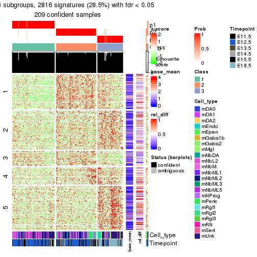</p>

</div>
<div id='tab-node-012-get-signatures-3'>
<pre><code class="r">get_signatures(res, k = 4)
</code></pre>

<p></p>

</div>
</div>


Signature heatmaps where rows are not scaled:


<script>
$( function() {
	$( '#tabs-node-012-get-signatures-no-scale' ).tabs();
} );
</script>
<div id='tabs-node-012-get-signatures-no-scale'>
<ul>
<li><a href='#tab-node-012-get-signatures-no-scale-1'>k = 2</a></li>
<li><a href='#tab-node-012-get-signatures-no-scale-2'>k = 3</a></li>
<li><a href='#tab-node-012-get-signatures-no-scale-3'>k = 4</a></li>
</ul>
<div id='tab-node-012-get-signatures-no-scale-1'>
<pre><code class="r">get_signatures(res, k = 2, scale_rows = FALSE)
</code></pre>

<p></p>

</div>
<div id='tab-node-012-get-signatures-no-scale-2'>
<pre><code class="r">get_signatures(res, k = 3, scale_rows = FALSE)
</code></pre>

<p>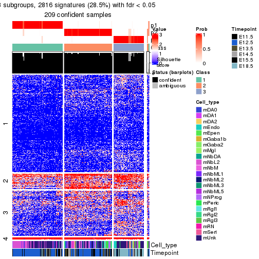</p>

</div>
<div id='tab-node-012-get-signatures-no-scale-3'>
<pre><code class="r">get_signatures(res, k = 4, scale_rows = FALSE)
</code></pre>

<p>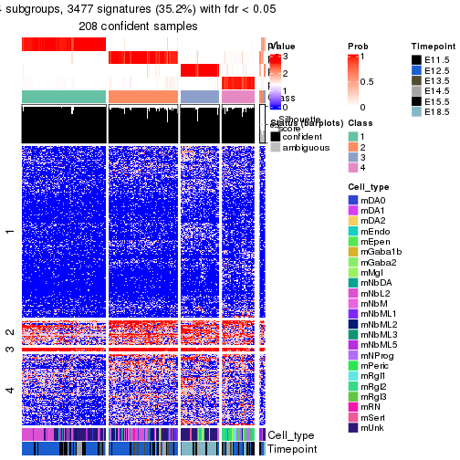</p>

</div>
</div>


Compare the overlap of signatures from different k:

```r
compare_signatures(res)
```


`get_signature()` returns a data frame invisibly. To get the list of signatures, the function
call should be assigned to a variable explicitly. In following code, if `plot` argument is set
to `FALSE`, no heatmap is plotted while only the differential analysis is performed.

```r
# code only for demonstration
tb = get_signature(res, k = ..., plot = FALSE)
```

An example of the output of `tb` is:

```
#>   which_row         fdr    mean_1    mean_2 scaled_mean_1 scaled_mean_2 km
#> 1        38 0.042760348  8.373488  9.131774    -0.5533452     0.5164555  1
#> 2        40 0.018707592  7.106213  8.469186    -0.6173731     0.5762149  1
#> 3        55 0.019134737 10.221463 11.207825    -0.6159697     0.5749050  1
#> 4        59 0.006059896  5.921854  7.869574    -0.6899429     0.6439467  1
#> 5        60 0.018055526  8.928898 10.211722    -0.6204761     0.5791110  1
#> 6        98 0.009384629 15.714769 14.887706     0.6635654    -0.6193277  2
...
```

The columns in `tb` are:

1. `which_row`: row indices corresponding to the input matrix.
2. `fdr`: FDR for the differential test. 
3. `mean_x`: The mean value in group x.
4. `scaled_mean_x`: The mean value in group x after rows are scaled.
5. `km`: Row groups if k-means clustering is applied to rows (which is done by automatically selecting number of clusters).

If there are too many signatures, `top_signatures = ...` can be set to only show the 
signatures with the highest FDRs:

```r
# code only for demonstration
# e.g. to show the top 500 most significant rows
tb = get_signature(res, k = ..., top_signatures = 500)
```

If the signatures are defined as these which are uniquely high in current group, `diff_method` argument
can be set to `"uniquely_high_in_one_group"`:

```r
# code only for demonstration
tb = get_signature(res, k = ..., diff_method = "uniquely_high_in_one_group")
```


UMAP plot which shows how samples are separated.


<script>
$( function() {
	$( '#tabs-node-012-dimension-reduction' ).tabs();
} );
</script>
<div id='tabs-node-012-dimension-reduction'>
<ul>
<li><a href='#tab-node-012-dimension-reduction-1'>k = 2</a></li>
<li><a href='#tab-node-012-dimension-reduction-2'>k = 3</a></li>
<li><a href='#tab-node-012-dimension-reduction-3'>k = 4</a></li>
</ul>
<div id='tab-node-012-dimension-reduction-1'>
<pre><code class="r">dimension_reduction(res, k = 2, method = &quot;UMAP&quot;)
</code></pre>

<p></p>

</div>
<div id='tab-node-012-dimension-reduction-2'>
<pre><code class="r">dimension_reduction(res, k = 3, method = &quot;UMAP&quot;)
</code></pre>

<p></p>

</div>
<div id='tab-node-012-dimension-reduction-3'>
<pre><code class="r">dimension_reduction(res, k = 4, method = &quot;UMAP&quot;)
</code></pre>

<p></p>

</div>
</div>


Following heatmap shows how subgroups are split when increasing `k`:

```r
collect_classes(res)
```


Test correlation between subgroups and known annotations. If the known
annotation is numeric, one-way ANOVA test is applied, and if the known
annotation is discrete, chi-squared contingency table test is applied.

```r
test_to_known_factors(res)
```

```
#>             n_sample Cell_type(p-value) Timepoint(p-value) k
#> ATC:skmeans      209           1.29e-03           1.46e-04 2
#> ATC:skmeans      209           2.69e-09           7.23e-22 3
#> ATC:skmeans      208           1.89e-25           3.45e-22 4
```


If matrix rows can be associated to genes, consider to use `functional_enrichment(res,
...)` to perform function enrichment for the signature genes. See [this vignette](https://jokergoo.github.io/cola_vignettes/functional_enrichment.html) for more detailed explanations.


 

---------------------------------------------------


### Node0121


Parent node: [Node012](#Node012).
Child nodes: 
                Node01211-leaf
        ,
                Node01212-leaf
        ,
                Node01221-leaf
        ,
                Node01222-leaf
        ,
                Node01311-leaf
        ,
                Node01312-leaf
        ,
                Node01313-leaf
        ,
                Node02211-leaf
        ,
                Node02212-leaf
        ,
                Node02221-leaf
        ,
                Node02222-leaf
        ,
                Node03111-leaf
        ,
                Node03112-leaf
        ,
                Node03113-leaf
        ,
                Node03121-leaf
        ,
                Node03122-leaf
        ,
                Node03123-leaf
        .


The object with results only for a single top-value method and a single partitioning method 
can be extracted as:

```r
res = res_rh["0121"]
```

A summary of `res` and all the functions that can be applied to it:

```r
res
```

```
#> A 'ConsensusPartition' object with k = 2, 3, 4.
#>   On a matrix with 6475 rows and 83 columns.
#>   Top rows (648) are extracted by 'ATC' method.
#>   Subgroups are detected by 'skmeans' method.
#>   Performed in total 150 partitions by row resampling.
#>   Best k for subgroups seems to be 2.
#> 
#> Following methods can be applied to this 'ConsensusPartition' object:
#>  [1] "cola_report"             "collect_classes"         "collect_plots"          
#>  [4] "collect_stats"           "colnames"                "compare_partitions"     
#>  [7] "compare_signatures"      "consensus_heatmap"       "dimension_reduction"    
#> [10] "functional_enrichment"   "get_anno_col"            "get_anno"               
#> [13] "get_classes"             "get_consensus"           "get_matrix"             
#> [16] "get_membership"          "get_param"               "get_signatures"         
#> [19] "get_stats"               "is_best_k"               "is_stable_k"            
#> [22] "membership_heatmap"      "ncol"                    "nrow"                   
#> [25] "plot_ecdf"               "predict_classes"         "rownames"               
#> [28] "select_partition_number" "show"                    "suggest_best_k"         
#> [31] "test_to_known_factors"   "top_rows_heatmap"
```

`collect_plots()` function collects all the plots made from `res` for all `k` (number of subgroups)
into one single page to provide an easy and fast comparison between different `k`.

```r
collect_plots(res)
```


The plots are:

- The first row: a plot of the eCDF (empirical cumulative distribution
  function) curves of the consensus matrix for each `k` and the heatmap of
  predicted classes for each `k`.
- The second row: heatmaps of the consensus matrix for each `k`.
- The third row: heatmaps of the membership matrix for each `k`.
- The fouth row: heatmaps of the signatures for each `k`.

All the plots in panels can be made by individual functions and they are
plotted later in this section.

`select_partition_number()` produces several plots showing different
statistics for choosing "optimized" `k`. There are following statistics:

- eCDF curves of the consensus matrix for each `k`;
- 1-PAC. [The PAC score](https://en.wikipedia.org/wiki/Consensus_clustering#Over-interpretation_potential_of_consensus_clustering)
  measures the proportion of the ambiguous subgrouping.
- Mean silhouette score.
- Concordance. The mean probability of fiting the consensus subgroup labels in all
  partitions.
- Area increased. Denote $A_k$ as the area under the eCDF curve for current
  `k`, the area increased is defined as $A_k - A_{k-1}$.
- Rand index. The percent of pairs of samples that are both in a same cluster
  or both are not in a same cluster in the partition of k and k-1.
- Jaccard index. The ratio of pairs of samples are both in a same cluster in
  the partition of k and k-1 and the pairs of samples are both in a same
  cluster in the partition k or k-1.

The detailed explanations of these statistics can be found in [the _cola_
vignette](https://jokergoo.github.io/cola_vignettes/cola.html#toc_13).

Generally speaking, higher 1-PAC score, higher mean silhouette score or higher
concordance corresponds to better partition. Rand index and Jaccard index
measure how similar the current partition is compared to partition with `k-1`.
If they are too similar, we won't accept `k` is better than `k-1`.

```r
select_partition_number(res)
```


The numeric values for all these statistics can be obtained by `get_stats()`.

```r
get_stats(res)
```

```
#>   k 1-PAC mean_silhouette concordance area_increased  Rand Jaccard
#> 2 2 1.000           0.974       0.989          0.506 0.495   0.495
#> 3 3 0.792           0.834       0.928          0.261 0.844   0.693
#> 4 4 0.641           0.617       0.823          0.111 0.949   0.862
```

`suggest_best_k()` suggests the best $k$ based on these statistics. The rules are as follows:

- All $k$ with Jaccard index larger than 0.95 are removed because increasing
  $k$ does not provide enough extra information. If all $k$ are removed, it is
  marked as no subgroup is detected.
- For all $k$ with 1-PAC score larger than 0.9, the maximal $k$ is taken as
  the best $k$, and other $k$ are marked as optional $k$.
- If it does not fit the second rule. The $k$ with the maximal vote of the
  highest 1-PAC score, highest mean silhouette, and highest concordance is
  taken as the best $k$.

```r
suggest_best_k(res)
```

```
#> [1] 2
```


Following is the table of the partitions (You need to click the **show/hide
code output** link to see it). The membership matrix (columns with name `p*`)
is inferred by
[`clue::cl_consensus()`](https://www.rdocumentation.org/link/cl_consensus?package=clue)
function with the `SE` method. Basically the value in the membership matrix
represents the probability to belong to a certain group. The finall subgroup
label for an item is determined with the group with highest probability it
belongs to.

In `get_classes()` function, the entropy is calculated from the membership
matrix and the silhouette score is calculated from the consensus matrix.


<script>
$( function() {
	$( '#tabs-node-0121-get-classes' ).tabs();
} );
</script>
<div id='tabs-node-0121-get-classes'>
<ul>
<li><a href='#tab-node-0121-get-classes-1'>k = 2</a></li>
<li><a href='#tab-node-0121-get-classes-2'>k = 3</a></li>
<li><a href='#tab-node-0121-get-classes-3'>k = 4</a></li>
</ul>

<div id='tab-node-0121-get-classes-1'>
<p><a id='tab-node-0121-get-classes-1-a' style='color:#0366d6' href='#'>show/hide code output</a></p>
<pre><code class="r">cbind(get_classes(res, k = 2), get_membership(res, k = 2))
</code></pre>

<pre><code>#&gt;                class entropy silhouette   p1   p2
#&gt; 1772094169_D01     2   0.000      0.996 0.00 1.00
#&gt; 1772066085_D11     2   0.000      0.996 0.00 1.00
#&gt; 1772094159_G02     2   0.000      0.996 0.00 1.00
#&gt; 1772094159_H01     1   0.242      0.944 0.96 0.04
#&gt; 1772094171_H11     2   0.000      0.996 0.00 1.00
#&gt; 1772094169_B09     2   0.000      0.996 0.00 1.00
#&gt; 1772094171_D09     2   0.000      0.996 0.00 1.00
#&gt; 1772094171_E06     1   0.000      0.983 1.00 0.00
#&gt; 1772094169_C01     2   0.000      0.996 0.00 1.00
#&gt; 1772094169_F02     2   0.000      0.996 0.00 1.00
#&gt; 1772094171_H06     2   0.000      0.996 0.00 1.00
#&gt; 1772094171_F01     2   0.000      0.996 0.00 1.00
#&gt; 1772094159_D08     1   0.000      0.983 1.00 0.00
#&gt; 1772094169_B03     2   0.000      0.996 0.00 1.00
#&gt; 1772094169_F05     2   0.000      0.996 0.00 1.00
#&gt; 1772094171_G01     2   0.000      0.996 0.00 1.00
#&gt; 1772094169_A09     2   0.000      0.996 0.00 1.00
#&gt; 1772094169_A07     2   0.000      0.996 0.00 1.00
#&gt; 1772094171_G09     2   0.000      0.996 0.00 1.00
#&gt; 1772094169_C02     2   0.000      0.996 0.00 1.00
#&gt; 1772094171_E01     2   0.000      0.996 0.00 1.00
#&gt; 1772094171_F09     2   0.000      0.996 0.00 1.00
#&gt; 1772094171_A06     2   0.000      0.996 0.00 1.00
#&gt; 1772094171_F02     2   0.000      0.996 0.00 1.00
#&gt; 1772094159_G03     1   0.000      0.983 1.00 0.00
#&gt; 1772094171_E07     2   0.000      0.996 0.00 1.00
#&gt; 1772094169_C10     2   0.000      0.996 0.00 1.00
#&gt; 1772094171_A12     1   0.000      0.983 1.00 0.00
#&gt; 1772094169_E12     2   0.000      0.996 0.00 1.00
#&gt; 1772094159_C03     1   0.000      0.983 1.00 0.00
#&gt; 1772094169_C04     1   0.925      0.494 0.66 0.34
#&gt; 1772094169_E02     2   0.000      0.996 0.00 1.00
#&gt; 1772094166_E08     1   0.925      0.493 0.66 0.34
#&gt; 1772094169_F04     2   0.000      0.996 0.00 1.00
#&gt; 1771013108_G07     1   0.000      0.983 1.00 0.00
#&gt; 1772092007_D02     2   0.000      0.996 0.00 1.00
#&gt; 1772094171_A08     1   0.000      0.983 1.00 0.00
#&gt; 1772094171_D11     1   0.000      0.983 1.00 0.00
#&gt; 1772094169_F10     1   0.000      0.983 1.00 0.00
#&gt; 1772094171_A10     2   0.000      0.996 0.00 1.00
#&gt; 1772072247_G02     1   0.000      0.983 1.00 0.00
#&gt; 1772096111_H07     1   0.000      0.983 1.00 0.00
#&gt; 1771013153_H01     1   0.000      0.983 1.00 0.00
#&gt; 1772094171_G06     1   0.000      0.983 1.00 0.00
#&gt; 1772094172_E08     1   0.000      0.983 1.00 0.00
#&gt; 1772094169_F08     2   0.000      0.996 0.00 1.00
#&gt; 1772094173_H10     1   0.000      0.983 1.00 0.00
#&gt; 1772094169_H04     2   0.634      0.806 0.16 0.84
#&gt; 1771013108_D08     1   0.000      0.983 1.00 0.00
#&gt; 1772094174_B08     1   0.000      0.983 1.00 0.00
#&gt; 1772071046_A04     1   0.000      0.983 1.00 0.00
#&gt; 1771013111_D03     1   0.000      0.983 1.00 0.00
#&gt; 1772092006_G04     2   0.000      0.996 0.00 1.00
#&gt; 1772094163_A12     2   0.000      0.996 0.00 1.00
#&gt; 1772094144_H06     1   0.000      0.983 1.00 0.00
#&gt; 1772094169_D11     1   0.000      0.983 1.00 0.00
#&gt; 1772094171_F08     2   0.000      0.996 0.00 1.00
#&gt; 1772094171_B11     1   0.000      0.983 1.00 0.00
#&gt; 1772094169_E09     2   0.000      0.996 0.00 1.00
#&gt; 1772094169_B01     1   0.000      0.983 1.00 0.00
#&gt; 1772094171_D02     2   0.000      0.996 0.00 1.00
#&gt; 1772094166_E04     2   0.000      0.996 0.00 1.00
#&gt; 1772094171_B04     1   0.000      0.983 1.00 0.00
#&gt; 1772094169_A06     1   0.000      0.983 1.00 0.00
#&gt; 1772094169_B06     1   0.000      0.983 1.00 0.00
#&gt; 1772094169_G02     2   0.000      0.996 0.00 1.00
#&gt; 1772094169_G03     2   0.000      0.996 0.00 1.00
#&gt; 1772092006_B08     2   0.000      0.996 0.00 1.00
#&gt; 1772094169_F11     1   0.000      0.983 1.00 0.00
#&gt; 1772092006_B01     1   0.000      0.983 1.00 0.00
#&gt; 1772094169_E11     1   0.000      0.983 1.00 0.00
#&gt; 1771013111_B03     1   0.000      0.983 1.00 0.00
#&gt; 1772094166_G02     1   0.000      0.983 1.00 0.00
#&gt; 1771013111_G01     1   0.000      0.983 1.00 0.00
#&gt; 1772092006_C06     2   0.000      0.996 0.00 1.00
#&gt; 1772072246_B11     1   0.000      0.983 1.00 0.00
#&gt; 1772066085_E09     1   0.000      0.983 1.00 0.00
#&gt; 1772071046_B07     1   0.000      0.983 1.00 0.00
#&gt; 1772094172_C01     1   0.000      0.983 1.00 0.00
#&gt; 1772066085_G04     1   0.000      0.983 1.00 0.00
#&gt; 1772094174_G09     1   0.000      0.983 1.00 0.00
#&gt; 1772071046_B10     1   0.000      0.983 1.00 0.00
#&gt; 1772072248_F08     1   0.000      0.983 1.00 0.00
</code></pre>

<script>
$('#tab-node-0121-get-classes-1-a').parent().next().next().hide();
$('#tab-node-0121-get-classes-1-a').click(function(){
  $('#tab-node-0121-get-classes-1-a').parent().next().next().toggle();
  return(false);
});
</script>
</div>

<div id='tab-node-0121-get-classes-2'>
<p><a id='tab-node-0121-get-classes-2-a' style='color:#0366d6' href='#'>show/hide code output</a></p>
<pre><code class="r">cbind(get_classes(res, k = 3), get_membership(res, k = 3))
</code></pre>

<pre><code>#&gt;                class entropy silhouette   p1   p2   p3
#&gt; 1772094169_D01     2  0.0000     0.9384 0.00 1.00 0.00
#&gt; 1772066085_D11     2  0.0000     0.9384 0.00 1.00 0.00
#&gt; 1772094159_G02     2  0.0892     0.9180 0.02 0.98 0.00
#&gt; 1772094159_H01     1  0.4556     0.8048 0.86 0.08 0.06
#&gt; 1772094171_H11     2  0.0000     0.9384 0.00 1.00 0.00
#&gt; 1772094169_B09     2  0.0000     0.9384 0.00 1.00 0.00
#&gt; 1772094171_D09     2  0.0000     0.9384 0.00 1.00 0.00
#&gt; 1772094171_E06     1  0.2959     0.8677 0.90 0.00 0.10
#&gt; 1772094169_C01     2  0.0000     0.9384 0.00 1.00 0.00
#&gt; 1772094169_F02     2  0.0000     0.9384 0.00 1.00 0.00
#&gt; 1772094171_H06     2  0.2066     0.8857 0.00 0.94 0.06
#&gt; 1772094171_F01     2  0.0000     0.9384 0.00 1.00 0.00
#&gt; 1772094159_D08     1  0.0000     0.9356 1.00 0.00 0.00
#&gt; 1772094169_B03     2  0.0000     0.9384 0.00 1.00 0.00
#&gt; 1772094169_F05     2  0.0000     0.9384 0.00 1.00 0.00
#&gt; 1772094171_G01     2  0.0000     0.9384 0.00 1.00 0.00
#&gt; 1772094169_A09     2  0.0000     0.9384 0.00 1.00 0.00
#&gt; 1772094169_A07     2  0.0892     0.9227 0.00 0.98 0.02
#&gt; 1772094171_G09     2  0.0000     0.9384 0.00 1.00 0.00
#&gt; 1772094169_C02     2  0.0000     0.9384 0.00 1.00 0.00
#&gt; 1772094171_E01     2  0.0000     0.9384 0.00 1.00 0.00
#&gt; 1772094171_F09     2  0.0000     0.9384 0.00 1.00 0.00
#&gt; 1772094171_A06     2  0.0000     0.9384 0.00 1.00 0.00
#&gt; 1772094171_F02     2  0.0000     0.9384 0.00 1.00 0.00
#&gt; 1772094159_G03     1  0.0000     0.9356 1.00 0.00 0.00
#&gt; 1772094171_E07     2  0.0000     0.9384 0.00 1.00 0.00
#&gt; 1772094169_C10     3  0.5397     0.5876 0.00 0.28 0.72
#&gt; 1772094171_A12     1  0.0000     0.9356 1.00 0.00 0.00
#&gt; 1772094169_E12     2  0.4796     0.6801 0.00 0.78 0.22
#&gt; 1772094159_C03     1  0.0000     0.9356 1.00 0.00 0.00
#&gt; 1772094169_C04     3  0.8838     0.5883 0.20 0.22 0.58
#&gt; 1772094169_E02     2  0.0000     0.9384 0.00 1.00 0.00
#&gt; 1772094166_E08     3  0.3832     0.7869 0.10 0.02 0.88
#&gt; 1772094169_F04     2  0.0000     0.9384 0.00 1.00 0.00
#&gt; 1771013108_G07     3  0.1529     0.8141 0.04 0.00 0.96
#&gt; 1772092007_D02     3  0.5706     0.5120 0.00 0.32 0.68
#&gt; 1772094171_A08     1  0.6045     0.4302 0.62 0.00 0.38
#&gt; 1772094171_D11     1  0.0000     0.9356 1.00 0.00 0.00
#&gt; 1772094169_F10     1  0.2066     0.9003 0.94 0.00 0.06
#&gt; 1772094171_A10     2  0.0000     0.9384 0.00 1.00 0.00
#&gt; 1772072247_G02     1  0.0000     0.9356 1.00 0.00 0.00
#&gt; 1772096111_H07     1  0.0000     0.9356 1.00 0.00 0.00
#&gt; 1771013153_H01     1  0.0000     0.9356 1.00 0.00 0.00
#&gt; 1772094171_G06     1  0.0000     0.9356 1.00 0.00 0.00
#&gt; 1772094172_E08     1  0.0000     0.9356 1.00 0.00 0.00
#&gt; 1772094169_F08     2  0.0000     0.9384 0.00 1.00 0.00
#&gt; 1772094173_H10     1  0.6244     0.2813 0.56 0.00 0.44
#&gt; 1772094169_H04     2  0.6045     0.3311 0.38 0.62 0.00
#&gt; 1771013108_D08     1  0.4002     0.7911 0.84 0.00 0.16
#&gt; 1772094174_B08     1  0.2959     0.8651 0.90 0.00 0.10
#&gt; 1772071046_A04     1  0.0000     0.9356 1.00 0.00 0.00
#&gt; 1771013111_D03     1  0.0000     0.9356 1.00 0.00 0.00
#&gt; 1772092006_G04     3  0.0000     0.8186 0.00 0.00 1.00
#&gt; 1772094163_A12     3  0.0000     0.8186 0.00 0.00 1.00
#&gt; 1772094144_H06     3  0.1529     0.8116 0.04 0.00 0.96
#&gt; 1772094169_D11     1  0.1529     0.9122 0.96 0.00 0.04
#&gt; 1772094171_F08     2  0.0000     0.9384 0.00 1.00 0.00
#&gt; 1772094171_B11     3  0.5835     0.4252 0.34 0.00 0.66
#&gt; 1772094169_E09     2  0.6309    -0.0452 0.00 0.50 0.50
#&gt; 1772094169_B01     1  0.0000     0.9356 1.00 0.00 0.00
#&gt; 1772094171_D02     2  0.2959     0.8411 0.00 0.90 0.10
#&gt; 1772094166_E04     3  0.0000     0.8186 0.00 0.00 1.00
#&gt; 1772094171_B04     3  0.2066     0.8019 0.06 0.00 0.94
#&gt; 1772094169_A06     1  0.5560     0.6014 0.70 0.00 0.30
#&gt; 1772094169_B06     1  0.4796     0.7332 0.78 0.00 0.22
#&gt; 1772094169_G02     2  0.0000     0.9384 0.00 1.00 0.00
#&gt; 1772094169_G03     2  0.0000     0.9384 0.00 1.00 0.00
#&gt; 1772092006_B08     3  0.4796     0.6663 0.00 0.22 0.78
#&gt; 1772094169_F11     1  0.2066     0.9002 0.94 0.00 0.06
#&gt; 1772092006_B01     3  0.0000     0.8186 0.00 0.00 1.00
#&gt; 1772094169_E11     1  0.0000     0.9356 1.00 0.00 0.00
#&gt; 1771013111_B03     1  0.0892     0.9237 0.98 0.00 0.02
#&gt; 1772094166_G02     1  0.0000     0.9356 1.00 0.00 0.00
#&gt; 1771013111_G01     3  0.6126     0.3586 0.40 0.00 0.60
#&gt; 1772092006_C06     2  0.6244     0.1629 0.00 0.56 0.44
#&gt; 1772072246_B11     1  0.0000     0.9356 1.00 0.00 0.00
#&gt; 1772066085_E09     1  0.0000     0.9356 1.00 0.00 0.00
#&gt; 1772071046_B07     1  0.0000     0.9356 1.00 0.00 0.00
#&gt; 1772094172_C01     1  0.0000     0.9356 1.00 0.00 0.00
#&gt; 1772066085_G04     1  0.0000     0.9356 1.00 0.00 0.00
#&gt; 1772094174_G09     1  0.0000     0.9356 1.00 0.00 0.00
#&gt; 1772071046_B10     1  0.0000     0.9356 1.00 0.00 0.00
#&gt; 1772072248_F08     1  0.0000     0.9356 1.00 0.00 0.00
</code></pre>

<script>
$('#tab-node-0121-get-classes-2-a').parent().next().next().hide();
$('#tab-node-0121-get-classes-2-a').click(function(){
  $('#tab-node-0121-get-classes-2-a').parent().next().next().toggle();
  return(false);
});
</script>
</div>

<div id='tab-node-0121-get-classes-3'>
<p><a id='tab-node-0121-get-classes-3-a' style='color:#0366d6' href='#'>show/hide code output</a></p>
<pre><code class="r">cbind(get_classes(res, k = 4), get_membership(res, k = 4))
</code></pre>

<pre><code>#&gt;                class entropy silhouette   p1   p2   p3   p4
#&gt; 1772094169_D01     2  0.1211     0.8206 0.00 0.96 0.00 0.04
#&gt; 1772066085_D11     2  0.1211     0.8230 0.00 0.96 0.00 0.04
#&gt; 1772094159_G02     2  0.5570     0.4094 0.00 0.54 0.02 0.44
#&gt; 1772094159_H01     4  0.6879     0.3238 0.40 0.06 0.02 0.52
#&gt; 1772094171_H11     2  0.3400     0.7659 0.00 0.82 0.00 0.18
#&gt; 1772094169_B09     2  0.1637     0.8210 0.00 0.94 0.00 0.06
#&gt; 1772094171_D09     2  0.0707     0.8269 0.00 0.98 0.00 0.02
#&gt; 1772094171_E06     1  0.6011    -0.1812 0.48 0.00 0.04 0.48
#&gt; 1772094169_C01     2  0.0707     0.8263 0.00 0.98 0.00 0.02
#&gt; 1772094169_F02     2  0.0707     0.8263 0.00 0.98 0.00 0.02
#&gt; 1772094171_H06     2  0.5957     0.3837 0.00 0.54 0.04 0.42
#&gt; 1772094171_F01     2  0.0000     0.8264 0.00 1.00 0.00 0.00
#&gt; 1772094159_D08     1  0.1411     0.8238 0.96 0.00 0.02 0.02
#&gt; 1772094169_B03     2  0.5570     0.3685 0.00 0.54 0.02 0.44
#&gt; 1772094169_F05     2  0.2011     0.8154 0.00 0.92 0.00 0.08
#&gt; 1772094171_G01     2  0.0707     0.8240 0.00 0.98 0.00 0.02
#&gt; 1772094169_A09     2  0.4406     0.6372 0.00 0.70 0.00 0.30
#&gt; 1772094169_A07     2  0.5986     0.5386 0.00 0.62 0.06 0.32
#&gt; 1772094171_G09     2  0.0707     0.8263 0.00 0.98 0.00 0.02
#&gt; 1772094169_C02     2  0.2345     0.8080 0.00 0.90 0.00 0.10
#&gt; 1772094171_E01     2  0.0707     0.8263 0.00 0.98 0.00 0.02
#&gt; 1772094171_F09     2  0.0707     0.8240 0.00 0.98 0.00 0.02
#&gt; 1772094171_A06     2  0.4134     0.7020 0.00 0.74 0.00 0.26
#&gt; 1772094171_F02     2  0.0000     0.8264 0.00 1.00 0.00 0.00
#&gt; 1772094159_G03     1  0.0000     0.8426 1.00 0.00 0.00 0.00
#&gt; 1772094171_E07     2  0.0000     0.8264 0.00 1.00 0.00 0.00
#&gt; 1772094169_C10     3  0.6840     0.3719 0.00 0.18 0.60 0.22
#&gt; 1772094171_A12     1  0.0000     0.8426 1.00 0.00 0.00 0.00
#&gt; 1772094169_E12     2  0.7047     0.1360 0.00 0.44 0.12 0.44
#&gt; 1772094159_C03     1  0.1411     0.8250 0.96 0.00 0.02 0.02
#&gt; 1772094169_C04     4  0.8024     0.2656 0.12 0.06 0.28 0.54
#&gt; 1772094169_E02     2  0.0000     0.8264 0.00 1.00 0.00 0.00
#&gt; 1772094166_E08     3  0.6863     0.4309 0.12 0.02 0.64 0.22
#&gt; 1772094169_F04     2  0.2345     0.8089 0.00 0.90 0.00 0.10
#&gt; 1771013108_G07     3  0.3935     0.5671 0.06 0.00 0.84 0.10
#&gt; 1772092007_D02     3  0.5487     0.1733 0.00 0.40 0.58 0.02
#&gt; 1772094171_A08     4  0.7550     0.3761 0.30 0.00 0.22 0.48
#&gt; 1772094171_D11     1  0.0707     0.8347 0.98 0.00 0.00 0.02
#&gt; 1772094169_F10     1  0.5489     0.5143 0.70 0.00 0.06 0.24
#&gt; 1772094171_A10     2  0.3172     0.7599 0.00 0.84 0.00 0.16
#&gt; 1772072247_G02     1  0.0000     0.8426 1.00 0.00 0.00 0.00
#&gt; 1772096111_H07     1  0.0000     0.8426 1.00 0.00 0.00 0.00
#&gt; 1771013153_H01     1  0.0000     0.8426 1.00 0.00 0.00 0.00
#&gt; 1772094171_G06     1  0.2011     0.7929 0.92 0.00 0.00 0.08
#&gt; 1772094172_E08     1  0.0000     0.8426 1.00 0.00 0.00 0.00
#&gt; 1772094169_F08     2  0.2345     0.8133 0.00 0.90 0.00 0.10
#&gt; 1772094173_H10     3  0.7047    -0.1021 0.44 0.00 0.44 0.12
#&gt; 1772094169_H04     4  0.7847     0.1559 0.12 0.32 0.04 0.52
#&gt; 1771013108_D08     1  0.6805     0.0303 0.50 0.00 0.40 0.10
#&gt; 1772094174_B08     1  0.3821     0.7101 0.84 0.00 0.12 0.04
#&gt; 1772071046_A04     1  0.0000     0.8426 1.00 0.00 0.00 0.00
#&gt; 1771013111_D03     1  0.0000     0.8426 1.00 0.00 0.00 0.00
#&gt; 1772092006_G04     3  0.2011     0.6038 0.00 0.00 0.92 0.08
#&gt; 1772094163_A12     3  0.1211     0.6166 0.00 0.00 0.96 0.04
#&gt; 1772094144_H06     3  0.1411     0.6103 0.02 0.00 0.96 0.02
#&gt; 1772094169_D11     1  0.3975     0.6089 0.76 0.00 0.00 0.24
#&gt; 1772094171_F08     2  0.1913     0.8142 0.00 0.94 0.02 0.04
#&gt; 1772094171_B11     4  0.7909     0.2169 0.16 0.02 0.36 0.46
#&gt; 1772094169_E09     2  0.7845    -0.1273 0.00 0.40 0.32 0.28
#&gt; 1772094169_B01     1  0.3821     0.7221 0.84 0.00 0.04 0.12
#&gt; 1772094171_D02     2  0.2335     0.8075 0.00 0.92 0.02 0.06
#&gt; 1772094166_E04     3  0.1211     0.6182 0.00 0.00 0.96 0.04
#&gt; 1772094171_B04     3  0.5392     0.3084 0.04 0.00 0.68 0.28
#&gt; 1772094169_A06     1  0.7832    -0.4240 0.38 0.00 0.26 0.36
#&gt; 1772094169_B06     1  0.6477     0.2687 0.60 0.00 0.10 0.30
#&gt; 1772094169_G02     2  0.3335     0.7737 0.00 0.86 0.02 0.12
#&gt; 1772094169_G03     2  0.1211     0.8206 0.00 0.96 0.00 0.04
#&gt; 1772092006_B08     3  0.4491     0.5057 0.00 0.14 0.80 0.06
#&gt; 1772094169_F11     1  0.5661     0.5032 0.70 0.00 0.08 0.22
#&gt; 1772092006_B01     3  0.1211     0.6109 0.00 0.00 0.96 0.04
#&gt; 1772094169_E11     1  0.1913     0.8127 0.94 0.00 0.04 0.02
#&gt; 1771013111_B03     1  0.5151     0.6023 0.76 0.00 0.14 0.10
#&gt; 1772094166_G02     1  0.0707     0.8319 0.98 0.00 0.00 0.02
#&gt; 1771013111_G01     3  0.6720     0.2112 0.30 0.00 0.58 0.12
#&gt; 1772092006_C06     2  0.6336     0.0476 0.00 0.48 0.46 0.06
#&gt; 1772072246_B11     1  0.0000     0.8426 1.00 0.00 0.00 0.00
#&gt; 1772066085_E09     1  0.0707     0.8352 0.98 0.00 0.00 0.02
#&gt; 1772071046_B07     1  0.0000     0.8426 1.00 0.00 0.00 0.00
#&gt; 1772094172_C01     1  0.0000     0.8426 1.00 0.00 0.00 0.00
#&gt; 1772066085_G04     1  0.1637     0.8122 0.94 0.00 0.00 0.06
#&gt; 1772094174_G09     1  0.0000     0.8426 1.00 0.00 0.00 0.00
#&gt; 1772071046_B10     1  0.0000     0.8426 1.00 0.00 0.00 0.00
#&gt; 1772072248_F08     1  0.0000     0.8426 1.00 0.00 0.00 0.00
</code></pre>

<script>
$('#tab-node-0121-get-classes-3-a').parent().next().next().hide();
$('#tab-node-0121-get-classes-3-a').click(function(){
  $('#tab-node-0121-get-classes-3-a').parent().next().next().toggle();
  return(false);
});
</script>
</div>
</div>

Heatmaps for the consensus matrix. It visualizes the probability of two
samples to be in a same group.


<script>
$( function() {
	$( '#tabs-node-0121-consensus-heatmap' ).tabs();
} );
</script>
<div id='tabs-node-0121-consensus-heatmap'>
<ul>
<li><a href='#tab-node-0121-consensus-heatmap-1'>k = 2</a></li>
<li><a href='#tab-node-0121-consensus-heatmap-2'>k = 3</a></li>
<li><a href='#tab-node-0121-consensus-heatmap-3'>k = 4</a></li>
</ul>
<div id='tab-node-0121-consensus-heatmap-1'>
<pre><code class="r">consensus_heatmap(res, k = 2)
</code></pre>

<p></p>

</div>
<div id='tab-node-0121-consensus-heatmap-2'>
<pre><code class="r">consensus_heatmap(res, k = 3)
</code></pre>

<p></p>

</div>
<div id='tab-node-0121-consensus-heatmap-3'>
<pre><code class="r">consensus_heatmap(res, k = 4)
</code></pre>

<p></p>

</div>
</div>

Heatmaps for the membership of samples in all partitions to see how consistent they are:


<script>
$( function() {
	$( '#tabs-node-0121-membership-heatmap' ).tabs();
} );
</script>
<div id='tabs-node-0121-membership-heatmap'>
<ul>
<li><a href='#tab-node-0121-membership-heatmap-1'>k = 2</a></li>
<li><a href='#tab-node-0121-membership-heatmap-2'>k = 3</a></li>
<li><a href='#tab-node-0121-membership-heatmap-3'>k = 4</a></li>
</ul>
<div id='tab-node-0121-membership-heatmap-1'>
<pre><code class="r">membership_heatmap(res, k = 2)
</code></pre>

<p></p>

</div>
<div id='tab-node-0121-membership-heatmap-2'>
<pre><code class="r">membership_heatmap(res, k = 3)
</code></pre>

<p></p>

</div>
<div id='tab-node-0121-membership-heatmap-3'>
<pre><code class="r">membership_heatmap(res, k = 4)
</code></pre>

<p></p>

</div>
</div>

As soon as the classes for columns are determined, the signatures
that are significantly different between subgroups can be looked for. 
Following are the heatmaps for signatures.


Signature heatmaps where rows are scaled:


<script>
$( function() {
	$( '#tabs-node-0121-get-signatures' ).tabs();
} );
</script>
<div id='tabs-node-0121-get-signatures'>
<ul>
<li><a href='#tab-node-0121-get-signatures-1'>k = 2</a></li>
<li><a href='#tab-node-0121-get-signatures-2'>k = 3</a></li>
<li><a href='#tab-node-0121-get-signatures-3'>k = 4</a></li>
</ul>
<div id='tab-node-0121-get-signatures-1'>
<pre><code class="r">get_signatures(res, k = 2)
</code></pre>

<p></p>

</div>
<div id='tab-node-0121-get-signatures-2'>
<pre><code class="r">get_signatures(res, k = 3)
</code></pre>

<p>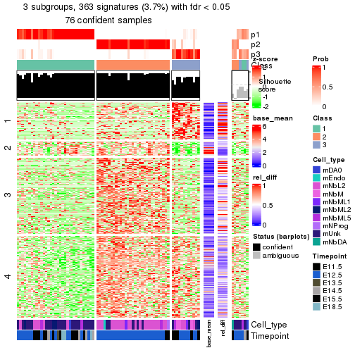</p>

</div>
<div id='tab-node-0121-get-signatures-3'>
<pre><code class="r">get_signatures(res, k = 4)
</code></pre>

<p></p>

</div>
</div>


Signature heatmaps where rows are not scaled:


<script>
$( function() {
	$( '#tabs-node-0121-get-signatures-no-scale' ).tabs();
} );
</script>
<div id='tabs-node-0121-get-signatures-no-scale'>
<ul>
<li><a href='#tab-node-0121-get-signatures-no-scale-1'>k = 2</a></li>
<li><a href='#tab-node-0121-get-signatures-no-scale-2'>k = 3</a></li>
<li><a href='#tab-node-0121-get-signatures-no-scale-3'>k = 4</a></li>
</ul>
<div id='tab-node-0121-get-signatures-no-scale-1'>
<pre><code class="r">get_signatures(res, k = 2, scale_rows = FALSE)
</code></pre>

<p></p>

</div>
<div id='tab-node-0121-get-signatures-no-scale-2'>
<pre><code class="r">get_signatures(res, k = 3, scale_rows = FALSE)
</code></pre>

<p></p>

</div>
<div id='tab-node-0121-get-signatures-no-scale-3'>
<pre><code class="r">get_signatures(res, k = 4, scale_rows = FALSE)
</code></pre>

<p></p>

</div>
</div>


Compare the overlap of signatures from different k:

```r
compare_signatures(res)
```


`get_signature()` returns a data frame invisibly. To get the list of signatures, the function
call should be assigned to a variable explicitly. In following code, if `plot` argument is set
to `FALSE`, no heatmap is plotted while only the differential analysis is performed.

```r
# code only for demonstration
tb = get_signature(res, k = ..., plot = FALSE)
```

An example of the output of `tb` is:

```
#>   which_row         fdr    mean_1    mean_2 scaled_mean_1 scaled_mean_2 km
#> 1        38 0.042760348  8.373488  9.131774    -0.5533452     0.5164555  1
#> 2        40 0.018707592  7.106213  8.469186    -0.6173731     0.5762149  1
#> 3        55 0.019134737 10.221463 11.207825    -0.6159697     0.5749050  1
#> 4        59 0.006059896  5.921854  7.869574    -0.6899429     0.6439467  1
#> 5        60 0.018055526  8.928898 10.211722    -0.6204761     0.5791110  1
#> 6        98 0.009384629 15.714769 14.887706     0.6635654    -0.6193277  2
...
```

The columns in `tb` are:

1. `which_row`: row indices corresponding to the input matrix.
2. `fdr`: FDR for the differential test. 
3. `mean_x`: The mean value in group x.
4. `scaled_mean_x`: The mean value in group x after rows are scaled.
5. `km`: Row groups if k-means clustering is applied to rows (which is done by automatically selecting number of clusters).

If there are too many signatures, `top_signatures = ...` can be set to only show the 
signatures with the highest FDRs:

```r
# code only for demonstration
# e.g. to show the top 500 most significant rows
tb = get_signature(res, k = ..., top_signatures = 500)
```

If the signatures are defined as these which are uniquely high in current group, `diff_method` argument
can be set to `"uniquely_high_in_one_group"`:

```r
# code only for demonstration
tb = get_signature(res, k = ..., diff_method = "uniquely_high_in_one_group")
```


UMAP plot which shows how samples are separated.


<script>
$( function() {
	$( '#tabs-node-0121-dimension-reduction' ).tabs();
} );
</script>
<div id='tabs-node-0121-dimension-reduction'>
<ul>
<li><a href='#tab-node-0121-dimension-reduction-1'>k = 2</a></li>
<li><a href='#tab-node-0121-dimension-reduction-2'>k = 3</a></li>
<li><a href='#tab-node-0121-dimension-reduction-3'>k = 4</a></li>
</ul>
<div id='tab-node-0121-dimension-reduction-1'>
<pre><code class="r">dimension_reduction(res, k = 2, method = &quot;UMAP&quot;)
</code></pre>

<p></p>

</div>
<div id='tab-node-0121-dimension-reduction-2'>
<pre><code class="r">dimension_reduction(res, k = 3, method = &quot;UMAP&quot;)
</code></pre>

<p></p>

</div>
<div id='tab-node-0121-dimension-reduction-3'>
<pre><code class="r">dimension_reduction(res, k = 4, method = &quot;UMAP&quot;)
</code></pre>

<p></p>

</div>
</div>


Following heatmap shows how subgroups are split when increasing `k`:

```r
collect_classes(res)
```


Test correlation between subgroups and known annotations. If the known
annotation is numeric, one-way ANOVA test is applied, and if the known
annotation is discrete, chi-squared contingency table test is applied.

```r
test_to_known_factors(res)
```

```
#>             n_sample Cell_type(p-value) Timepoint(p-value) k
#> ATC:skmeans       81           1.82e-03           0.003314 2
#> ATC:skmeans       76           5.19e-05           0.001153 3
#> ATC:skmeans       62           2.72e-06           0.000138 4
```


If matrix rows can be associated to genes, consider to use `functional_enrichment(res,
...)` to perform function enrichment for the signature genes. See [this vignette](https://jokergoo.github.io/cola_vignettes/functional_enrichment.html) for more detailed explanations.


 

---------------------------------------------------


### Node0122


Parent node: [Node012](#Node012).
Child nodes: 
                Node01211-leaf
        ,
                Node01212-leaf
        ,
                Node01221-leaf
        ,
                Node01222-leaf
        ,
                Node01311-leaf
        ,
                Node01312-leaf
        ,
                Node01313-leaf
        ,
                Node02211-leaf
        ,
                Node02212-leaf
        ,
                Node02221-leaf
        ,
                Node02222-leaf
        ,
                Node03111-leaf
        ,
                Node03112-leaf
        ,
                Node03113-leaf
        ,
                Node03121-leaf
        ,
                Node03122-leaf
        ,
                Node03123-leaf
        .


The object with results only for a single top-value method and a single partitioning method 
can be extracted as:

```r
res = res_rh["0122"]
```

A summary of `res` and all the functions that can be applied to it:

```r
res
```

```
#> A 'ConsensusPartition' object with k = 2, 3, 4.
#>   On a matrix with 7070 rows and 81 columns.
#>   Top rows (707) are extracted by 'ATC' method.
#>   Subgroups are detected by 'skmeans' method.
#>   Performed in total 150 partitions by row resampling.
#>   Best k for subgroups seems to be 3.
#> 
#> Following methods can be applied to this 'ConsensusPartition' object:
#>  [1] "cola_report"             "collect_classes"         "collect_plots"          
#>  [4] "collect_stats"           "colnames"                "compare_partitions"     
#>  [7] "compare_signatures"      "consensus_heatmap"       "dimension_reduction"    
#> [10] "functional_enrichment"   "get_anno_col"            "get_anno"               
#> [13] "get_classes"             "get_consensus"           "get_matrix"             
#> [16] "get_membership"          "get_param"               "get_signatures"         
#> [19] "get_stats"               "is_best_k"               "is_stable_k"            
#> [22] "membership_heatmap"      "ncol"                    "nrow"                   
#> [25] "plot_ecdf"               "predict_classes"         "rownames"               
#> [28] "select_partition_number" "show"                    "suggest_best_k"         
#> [31] "test_to_known_factors"   "top_rows_heatmap"
```

`collect_plots()` function collects all the plots made from `res` for all `k` (number of subgroups)
into one single page to provide an easy and fast comparison between different `k`.

```r
collect_plots(res)
```


The plots are:

- The first row: a plot of the eCDF (empirical cumulative distribution
  function) curves of the consensus matrix for each `k` and the heatmap of
  predicted classes for each `k`.
- The second row: heatmaps of the consensus matrix for each `k`.
- The third row: heatmaps of the membership matrix for each `k`.
- The fouth row: heatmaps of the signatures for each `k`.

All the plots in panels can be made by individual functions and they are
plotted later in this section.

`select_partition_number()` produces several plots showing different
statistics for choosing "optimized" `k`. There are following statistics:

- eCDF curves of the consensus matrix for each `k`;
- 1-PAC. [The PAC score](https://en.wikipedia.org/wiki/Consensus_clustering#Over-interpretation_potential_of_consensus_clustering)
  measures the proportion of the ambiguous subgrouping.
- Mean silhouette score.
- Concordance. The mean probability of fiting the consensus subgroup labels in all
  partitions.
- Area increased. Denote $A_k$ as the area under the eCDF curve for current
  `k`, the area increased is defined as $A_k - A_{k-1}$.
- Rand index. The percent of pairs of samples that are both in a same cluster
  or both are not in a same cluster in the partition of k and k-1.
- Jaccard index. The ratio of pairs of samples are both in a same cluster in
  the partition of k and k-1 and the pairs of samples are both in a same
  cluster in the partition k or k-1.

The detailed explanations of these statistics can be found in [the _cola_
vignette](https://jokergoo.github.io/cola_vignettes/cola.html#toc_13).

Generally speaking, higher 1-PAC score, higher mean silhouette score or higher
concordance corresponds to better partition. Rand index and Jaccard index
measure how similar the current partition is compared to partition with `k-1`.
If they are too similar, we won't accept `k` is better than `k-1`.

```r
select_partition_number(res)
```


The numeric values for all these statistics can be obtained by `get_stats()`.

```r
get_stats(res)
```

```
#>   k 1-PAC mean_silhouette concordance area_increased  Rand Jaccard
#> 2 2 1.000           0.983       0.993          0.433 0.568   0.568
#> 3 3 0.946           0.942       0.975          0.543 0.712   0.514
#> 4 4 0.720           0.738       0.878          0.119 0.875   0.645
```

`suggest_best_k()` suggests the best $k$ based on these statistics. The rules are as follows:

- All $k$ with Jaccard index larger than 0.95 are removed because increasing
  $k$ does not provide enough extra information. If all $k$ are removed, it is
  marked as no subgroup is detected.
- For all $k$ with 1-PAC score larger than 0.9, the maximal $k$ is taken as
  the best $k$, and other $k$ are marked as optional $k$.
- If it does not fit the second rule. The $k$ with the maximal vote of the
  highest 1-PAC score, highest mean silhouette, and highest concordance is
  taken as the best $k$.

```r
suggest_best_k(res)
```

```
#> [1] 3
#> attr(,"optional")
#> [1] 2
```

There is also optional best $k$ = 2 that is worth to check.

Following is the table of the partitions (You need to click the **show/hide
code output** link to see it). The membership matrix (columns with name `p*`)
is inferred by
[`clue::cl_consensus()`](https://www.rdocumentation.org/link/cl_consensus?package=clue)
function with the `SE` method. Basically the value in the membership matrix
represents the probability to belong to a certain group. The finall subgroup
label for an item is determined with the group with highest probability it
belongs to.

In `get_classes()` function, the entropy is calculated from the membership
matrix and the silhouette score is calculated from the consensus matrix.


<script>
$( function() {
	$( '#tabs-node-0122-get-classes' ).tabs();
} );
</script>
<div id='tabs-node-0122-get-classes'>
<ul>
<li><a href='#tab-node-0122-get-classes-1'>k = 2</a></li>
<li><a href='#tab-node-0122-get-classes-2'>k = 3</a></li>
<li><a href='#tab-node-0122-get-classes-3'>k = 4</a></li>
</ul>

<div id='tab-node-0122-get-classes-1'>
<p><a id='tab-node-0122-get-classes-1-a' style='color:#0366d6' href='#'>show/hide code output</a></p>
<pre><code class="r">cbind(get_classes(res, k = 2), get_membership(res, k = 2))
</code></pre>

<pre><code>#&gt;                class entropy silhouette   p1   p2
#&gt; 1772094169_G10     2   0.000      0.990 0.00 1.00
#&gt; 1772094172_F07     2   0.000      0.990 0.00 1.00
#&gt; 1772094166_C10     2   0.000      0.990 0.00 1.00
#&gt; 1772094169_E07     2   0.000      0.990 0.00 1.00
#&gt; 1772096115_A02     2   0.000      0.990 0.00 1.00
#&gt; 1772092006_H05     2   0.000      0.990 0.00 1.00
#&gt; 1772071046_D06     2   0.000      0.990 0.00 1.00
#&gt; 1772094171_A01     2   0.000      0.990 0.00 1.00
#&gt; 1772094163_C10     1   0.904      0.522 0.68 0.32
#&gt; 1772096112_C11     2   0.000      0.990 0.00 1.00
#&gt; 1771013108_C09     2   0.000      0.990 0.00 1.00
#&gt; 1771013111_G05     2   0.000      0.990 0.00 1.00
#&gt; 1772092006_B05     2   0.000      0.990 0.00 1.00
#&gt; 1772072246_A09     2   0.000      0.990 0.00 1.00
#&gt; 1772072246_F02     2   0.000      0.990 0.00 1.00
#&gt; 1772066085_D08     2   0.000      0.990 0.00 1.00
#&gt; 1771013108_F10     2   0.000      0.990 0.00 1.00
#&gt; 1772094169_E05     2   0.000      0.990 0.00 1.00
#&gt; 1772094171_A05     2   0.000      0.990 0.00 1.00
#&gt; 1772096115_G02     2   0.000      0.990 0.00 1.00
#&gt; 1772096115_E07     2   0.000      0.990 0.00 1.00
#&gt; 1772075300_H10     2   0.000      0.990 0.00 1.00
#&gt; 1772066085_A12     2   0.000      0.990 0.00 1.00
#&gt; 1772094166_A01     1   0.000      0.994 1.00 0.00
#&gt; 1772094169_G06     1   0.000      0.994 1.00 0.00
#&gt; 1772094166_H08     1   0.000      0.994 1.00 0.00
#&gt; 1772094163_H08     1   0.000      0.994 1.00 0.00
#&gt; 1772094169_D08     1   0.000      0.994 1.00 0.00
#&gt; 1772096114_E08     1   0.000      0.994 1.00 0.00
#&gt; 1772094171_G03     1   0.000      0.994 1.00 0.00
#&gt; 1772094171_F03     1   0.000      0.994 1.00 0.00
#&gt; 1772094169_F09     1   0.000      0.994 1.00 0.00
#&gt; 1772094169_C09     1   0.000      0.994 1.00 0.00
#&gt; 1772094169_F03     1   0.000      0.994 1.00 0.00
#&gt; 1772094166_F08     1   0.000      0.994 1.00 0.00
#&gt; 1772094156_A08     1   0.000      0.994 1.00 0.00
#&gt; 1771013153_C09     1   0.000      0.994 1.00 0.00
#&gt; 1771013111_E02     1   0.000      0.994 1.00 0.00
#&gt; 1772094171_F10     1   0.000      0.994 1.00 0.00
#&gt; 1771013108_D03     1   0.000      0.994 1.00 0.00
#&gt; 1772094163_G09     1   0.000      0.994 1.00 0.00
#&gt; 1772094172_G01     1   0.000      0.994 1.00 0.00
#&gt; 1772094171_C01     1   0.000      0.994 1.00 0.00
#&gt; 1772094163_F11     1   0.000      0.994 1.00 0.00
#&gt; 1772094169_F06     1   0.000      0.994 1.00 0.00
#&gt; 1771013113_G10     1   0.000      0.994 1.00 0.00
#&gt; 1772094171_D08     1   0.000      0.994 1.00 0.00
#&gt; 1772094166_E02     1   0.000      0.994 1.00 0.00
#&gt; 1772094169_H12     1   0.000      0.994 1.00 0.00
#&gt; 1772094171_F11     1   0.000      0.994 1.00 0.00
#&gt; 1772096115_H09     1   0.000      0.994 1.00 0.00
#&gt; 1772094169_H01     1   0.000      0.994 1.00 0.00
#&gt; 1772094169_A03     1   0.000      0.994 1.00 0.00
#&gt; 1772094169_G08     1   0.000      0.994 1.00 0.00
#&gt; 1772094169_B10     1   0.000      0.994 1.00 0.00
#&gt; 1771013153_H11     2   0.795      0.681 0.24 0.76
#&gt; 1771013111_A07     1   0.000      0.994 1.00 0.00
#&gt; 1771013153_B07     1   0.000      0.994 1.00 0.00
#&gt; 1771013110_E07     1   0.000      0.994 1.00 0.00
#&gt; 1772092006_E07     2   0.000      0.990 0.00 1.00
#&gt; 1772094169_A04     2   0.000      0.990 0.00 1.00
#&gt; 1772094171_E12     1   0.000      0.994 1.00 0.00
#&gt; 1772094171_A09     1   0.000      0.994 1.00 0.00
#&gt; 1772092006_E11     1   0.000      0.994 1.00 0.00
#&gt; 1772094169_A10     1   0.000      0.994 1.00 0.00
#&gt; 1772071048_E02     1   0.000      0.994 1.00 0.00
#&gt; 1772094173_H01     1   0.000      0.994 1.00 0.00
#&gt; 1772094171_A03     1   0.000      0.994 1.00 0.00
#&gt; 1772096114_E05     1   0.000      0.994 1.00 0.00
#&gt; 1772096114_H01     1   0.000      0.994 1.00 0.00
#&gt; 1772096112_H04     1   0.000      0.994 1.00 0.00
#&gt; 1771013108_H02     1   0.000      0.994 1.00 0.00
#&gt; 1771013111_A09     1   0.000      0.994 1.00 0.00
#&gt; 1772094171_A04     1   0.000      0.994 1.00 0.00
#&gt; 1772096115_F09     1   0.000      0.994 1.00 0.00
#&gt; 1771013108_H07     1   0.000      0.994 1.00 0.00
#&gt; 1772071065_H10     1   0.000      0.994 1.00 0.00
#&gt; 1771013111_B07     1   0.000      0.994 1.00 0.00
#&gt; 1772094175_C12     1   0.000      0.994 1.00 0.00
#&gt; 1772094174_E07     1   0.000      0.994 1.00 0.00
#&gt; 1772096115_E11     1   0.000      0.994 1.00 0.00
</code></pre>

<script>
$('#tab-node-0122-get-classes-1-a').parent().next().next().hide();
$('#tab-node-0122-get-classes-1-a').click(function(){
  $('#tab-node-0122-get-classes-1-a').parent().next().next().toggle();
  return(false);
});
</script>
</div>

<div id='tab-node-0122-get-classes-2'>
<p><a id='tab-node-0122-get-classes-2-a' style='color:#0366d6' href='#'>show/hide code output</a></p>
<pre><code class="r">cbind(get_classes(res, k = 3), get_membership(res, k = 3))
</code></pre>

<pre><code>#&gt;                class entropy silhouette   p1   p2   p3
#&gt; 1772094169_G10     2  0.0000      0.994 0.00 1.00 0.00
#&gt; 1772094172_F07     2  0.0000      0.994 0.00 1.00 0.00
#&gt; 1772094166_C10     2  0.0000      0.994 0.00 1.00 0.00
#&gt; 1772094169_E07     3  0.3340      0.843 0.00 0.12 0.88
#&gt; 1772096115_A02     2  0.0000      0.994 0.00 1.00 0.00
#&gt; 1772092006_H05     2  0.0000      0.994 0.00 1.00 0.00
#&gt; 1772071046_D06     2  0.3340      0.864 0.12 0.88 0.00
#&gt; 1772094171_A01     2  0.0000      0.994 0.00 1.00 0.00
#&gt; 1772094163_C10     1  0.0000      0.967 1.00 0.00 0.00
#&gt; 1772096112_C11     2  0.0000      0.994 0.00 1.00 0.00
#&gt; 1771013108_C09     2  0.0000      0.994 0.00 1.00 0.00
#&gt; 1771013111_G05     2  0.0000      0.994 0.00 1.00 0.00
#&gt; 1772092006_B05     2  0.0000      0.994 0.00 1.00 0.00
#&gt; 1772072246_A09     2  0.0000      0.994 0.00 1.00 0.00
#&gt; 1772072246_F02     2  0.0000      0.994 0.00 1.00 0.00
#&gt; 1772066085_D08     2  0.0000      0.994 0.00 1.00 0.00
#&gt; 1771013108_F10     2  0.0000      0.994 0.00 1.00 0.00
#&gt; 1772094169_E05     2  0.0000      0.994 0.00 1.00 0.00
#&gt; 1772094171_A05     2  0.0000      0.994 0.00 1.00 0.00
#&gt; 1772096115_G02     2  0.0000      0.994 0.00 1.00 0.00
#&gt; 1772096115_E07     2  0.0000      0.994 0.00 1.00 0.00
#&gt; 1772075300_H10     2  0.0000      0.994 0.00 1.00 0.00
#&gt; 1772066085_A12     2  0.0000      0.994 0.00 1.00 0.00
#&gt; 1772094166_A01     3  0.2537      0.896 0.08 0.00 0.92
#&gt; 1772094169_G06     3  0.0000      0.962 0.00 0.00 1.00
#&gt; 1772094166_H08     1  0.0000      0.967 1.00 0.00 0.00
#&gt; 1772094163_H08     1  0.0000      0.967 1.00 0.00 0.00
#&gt; 1772094169_D08     3  0.0000      0.962 0.00 0.00 1.00
#&gt; 1772096114_E08     1  0.2959      0.875 0.90 0.00 0.10
#&gt; 1772094171_G03     3  0.0000      0.962 0.00 0.00 1.00
#&gt; 1772094171_F03     3  0.0000      0.962 0.00 0.00 1.00
#&gt; 1772094169_F09     3  0.0000      0.962 0.00 0.00 1.00
#&gt; 1772094169_C09     3  0.0000      0.962 0.00 0.00 1.00
#&gt; 1772094169_F03     3  0.0000      0.962 0.00 0.00 1.00
#&gt; 1772094166_F08     3  0.0000      0.962 0.00 0.00 1.00
#&gt; 1772094156_A08     1  0.0000      0.967 1.00 0.00 0.00
#&gt; 1771013153_C09     1  0.0000      0.967 1.00 0.00 0.00
#&gt; 1771013111_E02     1  0.0000      0.967 1.00 0.00 0.00
#&gt; 1772094171_F10     1  0.5948      0.437 0.64 0.00 0.36
#&gt; 1771013108_D03     1  0.0000      0.967 1.00 0.00 0.00
#&gt; 1772094163_G09     3  0.0000      0.962 0.00 0.00 1.00
#&gt; 1772094172_G01     1  0.0000      0.967 1.00 0.00 0.00
#&gt; 1772094171_C01     3  0.0000      0.962 0.00 0.00 1.00
#&gt; 1772094163_F11     3  0.0000      0.962 0.00 0.00 1.00
#&gt; 1772094169_F06     3  0.0000      0.962 0.00 0.00 1.00
#&gt; 1771013113_G10     1  0.0000      0.967 1.00 0.00 0.00
#&gt; 1772094171_D08     3  0.0000      0.962 0.00 0.00 1.00
#&gt; 1772094166_E02     1  0.0892      0.952 0.98 0.00 0.02
#&gt; 1772094169_H12     1  0.0000      0.967 1.00 0.00 0.00
#&gt; 1772094171_F11     1  0.0000      0.967 1.00 0.00 0.00
#&gt; 1772096115_H09     1  0.0000      0.967 1.00 0.00 0.00
#&gt; 1772094169_H01     3  0.0000      0.962 0.00 0.00 1.00
#&gt; 1772094169_A03     1  0.0000      0.967 1.00 0.00 0.00
#&gt; 1772094169_G08     3  0.0000      0.962 0.00 0.00 1.00
#&gt; 1772094169_B10     1  0.0000      0.967 1.00 0.00 0.00
#&gt; 1771013153_H11     1  0.0000      0.967 1.00 0.00 0.00
#&gt; 1771013111_A07     3  0.0000      0.962 0.00 0.00 1.00
#&gt; 1771013153_B07     3  0.0892      0.948 0.02 0.00 0.98
#&gt; 1771013110_E07     3  0.2066      0.915 0.06 0.00 0.94
#&gt; 1772092006_E07     3  0.0000      0.962 0.00 0.00 1.00
#&gt; 1772094169_A04     2  0.0000      0.994 0.00 1.00 0.00
#&gt; 1772094171_E12     1  0.2537      0.898 0.92 0.00 0.08
#&gt; 1772094171_A09     3  0.0000      0.962 0.00 0.00 1.00
#&gt; 1772092006_E11     3  0.0000      0.962 0.00 0.00 1.00
#&gt; 1772094169_A10     3  0.0000      0.962 0.00 0.00 1.00
#&gt; 1772071048_E02     3  0.5706      0.531 0.32 0.00 0.68
#&gt; 1772094173_H01     1  0.0000      0.967 1.00 0.00 0.00
#&gt; 1772094171_A03     1  0.0000      0.967 1.00 0.00 0.00
#&gt; 1772096114_E05     1  0.0000      0.967 1.00 0.00 0.00
#&gt; 1772096114_H01     3  0.5948      0.436 0.36 0.00 0.64
#&gt; 1772096112_H04     1  0.5560      0.566 0.70 0.00 0.30
#&gt; 1771013108_H02     1  0.0000      0.967 1.00 0.00 0.00
#&gt; 1771013111_A09     3  0.0000      0.962 0.00 0.00 1.00
#&gt; 1772094171_A04     1  0.0000      0.967 1.00 0.00 0.00
#&gt; 1772096115_F09     1  0.0000      0.967 1.00 0.00 0.00
#&gt; 1771013108_H07     1  0.0000      0.967 1.00 0.00 0.00
#&gt; 1772071065_H10     3  0.1529      0.933 0.04 0.00 0.96
#&gt; 1771013111_B07     1  0.1529      0.935 0.96 0.00 0.04
#&gt; 1772094175_C12     1  0.0000      0.967 1.00 0.00 0.00
#&gt; 1772094174_E07     1  0.0000      0.967 1.00 0.00 0.00
#&gt; 1772096115_E11     3  0.0000      0.962 0.00 0.00 1.00
</code></pre>

<script>
$('#tab-node-0122-get-classes-2-a').parent().next().next().hide();
$('#tab-node-0122-get-classes-2-a').click(function(){
  $('#tab-node-0122-get-classes-2-a').parent().next().next().toggle();
  return(false);
});
</script>
</div>

<div id='tab-node-0122-get-classes-3'>
<p><a id='tab-node-0122-get-classes-3-a' style='color:#0366d6' href='#'>show/hide code output</a></p>
<pre><code class="r">cbind(get_classes(res, k = 4), get_membership(res, k = 4))
</code></pre>

<pre><code>#&gt;                class entropy silhouette   p1   p2   p3   p4
#&gt; 1772094169_G10     2  0.1211      0.933 0.00 0.96 0.00 0.04
#&gt; 1772094172_F07     2  0.5820      0.663 0.24 0.68 0.00 0.08
#&gt; 1772094166_C10     2  0.5486      0.726 0.20 0.72 0.00 0.08
#&gt; 1772094169_E07     3  0.3525      0.775 0.00 0.10 0.86 0.04
#&gt; 1772096115_A02     2  0.2011      0.921 0.00 0.92 0.00 0.08
#&gt; 1772092006_H05     2  0.1211      0.933 0.00 0.96 0.00 0.04
#&gt; 1772071046_D06     1  0.6510      0.103 0.54 0.38 0.00 0.08
#&gt; 1772094171_A01     2  0.1211      0.936 0.00 0.96 0.00 0.04
#&gt; 1772094163_C10     1  0.1637      0.771 0.94 0.00 0.00 0.06
#&gt; 1772096112_C11     2  0.0707      0.938 0.00 0.98 0.00 0.02
#&gt; 1771013108_C09     2  0.0707      0.938 0.00 0.98 0.00 0.02
#&gt; 1771013111_G05     2  0.0707      0.938 0.00 0.98 0.00 0.02
#&gt; 1772092006_B05     2  0.0707      0.938 0.00 0.98 0.00 0.02
#&gt; 1772072246_A09     2  0.0707      0.938 0.00 0.98 0.00 0.02
#&gt; 1772072246_F02     2  0.0707      0.938 0.00 0.98 0.00 0.02
#&gt; 1772066085_D08     2  0.3972      0.866 0.08 0.84 0.00 0.08
#&gt; 1771013108_F10     2  0.0000      0.939 0.00 1.00 0.00 0.00
#&gt; 1772094169_E05     2  0.1211      0.932 0.00 0.96 0.00 0.04
#&gt; 1772094171_A05     2  0.0707      0.938 0.00 0.98 0.00 0.02
#&gt; 1772096115_G02     2  0.1637      0.928 0.00 0.94 0.00 0.06
#&gt; 1772096115_E07     2  0.0707      0.938 0.00 0.98 0.00 0.02
#&gt; 1772075300_H10     2  0.0707      0.938 0.00 0.98 0.00 0.02
#&gt; 1772066085_A12     2  0.0707      0.938 0.00 0.98 0.00 0.02
#&gt; 1772094166_A01     3  0.5820      0.573 0.24 0.00 0.68 0.08
#&gt; 1772094169_G06     3  0.0707      0.895 0.00 0.00 0.98 0.02
#&gt; 1772094166_H08     1  0.0707      0.794 0.98 0.00 0.00 0.02
#&gt; 1772094163_H08     1  0.1211      0.786 0.96 0.00 0.00 0.04
#&gt; 1772094169_D08     3  0.0000      0.902 0.00 0.00 1.00 0.00
#&gt; 1772096114_E08     1  0.4894      0.620 0.78 0.00 0.10 0.12
#&gt; 1772094171_G03     3  0.0000      0.902 0.00 0.00 1.00 0.00
#&gt; 1772094171_F03     3  0.0000      0.902 0.00 0.00 1.00 0.00
#&gt; 1772094169_F09     3  0.0000      0.902 0.00 0.00 1.00 0.00
#&gt; 1772094169_C09     3  0.0000      0.902 0.00 0.00 1.00 0.00
#&gt; 1772094169_F03     3  0.0000      0.902 0.00 0.00 1.00 0.00
#&gt; 1772094166_F08     3  0.0707      0.895 0.00 0.00 0.98 0.02
#&gt; 1772094156_A08     1  0.4790      0.236 0.62 0.00 0.00 0.38
#&gt; 1771013153_C09     1  0.5000     -0.207 0.50 0.00 0.00 0.50
#&gt; 1771013111_E02     1  0.0000      0.803 1.00 0.00 0.00 0.00
#&gt; 1772094171_F10     1  0.7550      0.107 0.48 0.00 0.30 0.22
#&gt; 1771013108_D03     1  0.0000      0.803 1.00 0.00 0.00 0.00
#&gt; 1772094163_G09     4  0.4855      0.274 0.00 0.00 0.40 0.60
#&gt; 1772094172_G01     1  0.0000      0.803 1.00 0.00 0.00 0.00
#&gt; 1772094171_C01     3  0.1211      0.882 0.00 0.00 0.96 0.04
#&gt; 1772094163_F11     3  0.0000      0.902 0.00 0.00 1.00 0.00
#&gt; 1772094169_F06     3  0.0707      0.893 0.00 0.00 0.98 0.02
#&gt; 1771013113_G10     4  0.3400      0.716 0.18 0.00 0.00 0.82
#&gt; 1772094171_D08     3  0.0000      0.902 0.00 0.00 1.00 0.00
#&gt; 1772094166_E02     4  0.2921      0.741 0.14 0.00 0.00 0.86
#&gt; 1772094169_H12     1  0.3400      0.653 0.82 0.00 0.00 0.18
#&gt; 1772094171_F11     4  0.4134      0.646 0.26 0.00 0.00 0.74
#&gt; 1772096115_H09     1  0.0000      0.803 1.00 0.00 0.00 0.00
#&gt; 1772094169_H01     3  0.0707      0.893 0.00 0.00 0.98 0.02
#&gt; 1772094169_A03     4  0.4907      0.332 0.42 0.00 0.00 0.58
#&gt; 1772094169_G08     3  0.0000      0.902 0.00 0.00 1.00 0.00
#&gt; 1772094169_B10     1  0.4855      0.208 0.60 0.00 0.00 0.40
#&gt; 1771013153_H11     1  0.0707      0.792 0.98 0.00 0.00 0.02
#&gt; 1771013111_A07     4  0.2345      0.758 0.00 0.00 0.10 0.90
#&gt; 1771013153_B07     4  0.2345      0.758 0.00 0.00 0.10 0.90
#&gt; 1771013110_E07     4  0.2647      0.754 0.00 0.00 0.12 0.88
#&gt; 1772092006_E07     3  0.1211      0.881 0.00 0.00 0.96 0.04
#&gt; 1772094169_A04     2  0.4227      0.818 0.00 0.82 0.12 0.06
#&gt; 1772094171_E12     1  0.2411      0.761 0.92 0.00 0.04 0.04
#&gt; 1772094171_A09     3  0.0000      0.902 0.00 0.00 1.00 0.00
#&gt; 1772092006_E11     4  0.2921      0.746 0.00 0.00 0.14 0.86
#&gt; 1772094169_A10     3  0.0000      0.902 0.00 0.00 1.00 0.00
#&gt; 1772071048_E02     4  0.4949      0.710 0.06 0.00 0.18 0.76
#&gt; 1772094173_H01     1  0.0000      0.803 1.00 0.00 0.00 0.00
#&gt; 1772094171_A03     1  0.4994     -0.105 0.52 0.00 0.00 0.48
#&gt; 1772096114_E05     1  0.0000      0.803 1.00 0.00 0.00 0.00
#&gt; 1772096114_H01     3  0.7084      0.287 0.34 0.00 0.52 0.14
#&gt; 1772096112_H04     4  0.3606      0.745 0.14 0.00 0.02 0.84
#&gt; 1771013108_H02     4  0.4522      0.565 0.32 0.00 0.00 0.68
#&gt; 1771013111_A09     3  0.5000     -0.019 0.00 0.00 0.50 0.50
#&gt; 1772094171_A04     1  0.0707      0.795 0.98 0.00 0.00 0.02
#&gt; 1772096115_F09     1  0.0000      0.803 1.00 0.00 0.00 0.00
#&gt; 1771013108_H07     4  0.4855      0.405 0.40 0.00 0.00 0.60
#&gt; 1772071065_H10     3  0.5902      0.625 0.16 0.00 0.70 0.14
#&gt; 1771013111_B07     4  0.3198      0.761 0.08 0.00 0.04 0.88
#&gt; 1772094175_C12     1  0.0000      0.803 1.00 0.00 0.00 0.00
#&gt; 1772094174_E07     1  0.0000      0.803 1.00 0.00 0.00 0.00
#&gt; 1772096115_E11     3  0.1637      0.870 0.00 0.00 0.94 0.06
</code></pre>

<script>
$('#tab-node-0122-get-classes-3-a').parent().next().next().hide();
$('#tab-node-0122-get-classes-3-a').click(function(){
  $('#tab-node-0122-get-classes-3-a').parent().next().next().toggle();
  return(false);
});
</script>
</div>
</div>

Heatmaps for the consensus matrix. It visualizes the probability of two
samples to be in a same group.


<script>
$( function() {
	$( '#tabs-node-0122-consensus-heatmap' ).tabs();
} );
</script>
<div id='tabs-node-0122-consensus-heatmap'>
<ul>
<li><a href='#tab-node-0122-consensus-heatmap-1'>k = 2</a></li>
<li><a href='#tab-node-0122-consensus-heatmap-2'>k = 3</a></li>
<li><a href='#tab-node-0122-consensus-heatmap-3'>k = 4</a></li>
</ul>
<div id='tab-node-0122-consensus-heatmap-1'>
<pre><code class="r">consensus_heatmap(res, k = 2)
</code></pre>

<p></p>

</div>
<div id='tab-node-0122-consensus-heatmap-2'>
<pre><code class="r">consensus_heatmap(res, k = 3)
</code></pre>

<p></p>

</div>
<div id='tab-node-0122-consensus-heatmap-3'>
<pre><code class="r">consensus_heatmap(res, k = 4)
</code></pre>

<p></p>

</div>
</div>

Heatmaps for the membership of samples in all partitions to see how consistent they are:


<script>
$( function() {
	$( '#tabs-node-0122-membership-heatmap' ).tabs();
} );
</script>
<div id='tabs-node-0122-membership-heatmap'>
<ul>
<li><a href='#tab-node-0122-membership-heatmap-1'>k = 2</a></li>
<li><a href='#tab-node-0122-membership-heatmap-2'>k = 3</a></li>
<li><a href='#tab-node-0122-membership-heatmap-3'>k = 4</a></li>
</ul>
<div id='tab-node-0122-membership-heatmap-1'>
<pre><code class="r">membership_heatmap(res, k = 2)
</code></pre>

<p></p>

</div>
<div id='tab-node-0122-membership-heatmap-2'>
<pre><code class="r">membership_heatmap(res, k = 3)
</code></pre>

<p></p>

</div>
<div id='tab-node-0122-membership-heatmap-3'>
<pre><code class="r">membership_heatmap(res, k = 4)
</code></pre>

<p></p>

</div>
</div>

As soon as the classes for columns are determined, the signatures
that are significantly different between subgroups can be looked for. 
Following are the heatmaps for signatures.


Signature heatmaps where rows are scaled:


<script>
$( function() {
	$( '#tabs-node-0122-get-signatures' ).tabs();
} );
</script>
<div id='tabs-node-0122-get-signatures'>
<ul>
<li><a href='#tab-node-0122-get-signatures-1'>k = 2</a></li>
<li><a href='#tab-node-0122-get-signatures-2'>k = 3</a></li>
<li><a href='#tab-node-0122-get-signatures-3'>k = 4</a></li>
</ul>
<div id='tab-node-0122-get-signatures-1'>
<pre><code class="r">get_signatures(res, k = 2)
</code></pre>

<p></p>

</div>
<div id='tab-node-0122-get-signatures-2'>
<pre><code class="r">get_signatures(res, k = 3)
</code></pre>

<p></p>

</div>
<div id='tab-node-0122-get-signatures-3'>
<pre><code class="r">get_signatures(res, k = 4)
</code></pre>

<p></p>

</div>
</div>


Signature heatmaps where rows are not scaled:


<script>
$( function() {
	$( '#tabs-node-0122-get-signatures-no-scale' ).tabs();
} );
</script>
<div id='tabs-node-0122-get-signatures-no-scale'>
<ul>
<li><a href='#tab-node-0122-get-signatures-no-scale-1'>k = 2</a></li>
<li><a href='#tab-node-0122-get-signatures-no-scale-2'>k = 3</a></li>
<li><a href='#tab-node-0122-get-signatures-no-scale-3'>k = 4</a></li>
</ul>
<div id='tab-node-0122-get-signatures-no-scale-1'>
<pre><code class="r">get_signatures(res, k = 2, scale_rows = FALSE)
</code></pre>

<p></p>

</div>
<div id='tab-node-0122-get-signatures-no-scale-2'>
<pre><code class="r">get_signatures(res, k = 3, scale_rows = FALSE)
</code></pre>

<p></p>

</div>
<div id='tab-node-0122-get-signatures-no-scale-3'>
<pre><code class="r">get_signatures(res, k = 4, scale_rows = FALSE)
</code></pre>

<p></p>

</div>
</div>


Compare the overlap of signatures from different k:

```r
compare_signatures(res)
```


`get_signature()` returns a data frame invisibly. To get the list of signatures, the function
call should be assigned to a variable explicitly. In following code, if `plot` argument is set
to `FALSE`, no heatmap is plotted while only the differential analysis is performed.

```r
# code only for demonstration
tb = get_signature(res, k = ..., plot = FALSE)
```

An example of the output of `tb` is:

```
#>   which_row         fdr    mean_1    mean_2 scaled_mean_1 scaled_mean_2 km
#> 1        38 0.042760348  8.373488  9.131774    -0.5533452     0.5164555  1
#> 2        40 0.018707592  7.106213  8.469186    -0.6173731     0.5762149  1
#> 3        55 0.019134737 10.221463 11.207825    -0.6159697     0.5749050  1
#> 4        59 0.006059896  5.921854  7.869574    -0.6899429     0.6439467  1
#> 5        60 0.018055526  8.928898 10.211722    -0.6204761     0.5791110  1
#> 6        98 0.009384629 15.714769 14.887706     0.6635654    -0.6193277  2
...
```

The columns in `tb` are:

1. `which_row`: row indices corresponding to the input matrix.
2. `fdr`: FDR for the differential test. 
3. `mean_x`: The mean value in group x.
4. `scaled_mean_x`: The mean value in group x after rows are scaled.
5. `km`: Row groups if k-means clustering is applied to rows (which is done by automatically selecting number of clusters).

If there are too many signatures, `top_signatures = ...` can be set to only show the 
signatures with the highest FDRs:

```r
# code only for demonstration
# e.g. to show the top 500 most significant rows
tb = get_signature(res, k = ..., top_signatures = 500)
```

If the signatures are defined as these which are uniquely high in current group, `diff_method` argument
can be set to `"uniquely_high_in_one_group"`:

```r
# code only for demonstration
tb = get_signature(res, k = ..., diff_method = "uniquely_high_in_one_group")
```


UMAP plot which shows how samples are separated.


<script>
$( function() {
	$( '#tabs-node-0122-dimension-reduction' ).tabs();
} );
</script>
<div id='tabs-node-0122-dimension-reduction'>
<ul>
<li><a href='#tab-node-0122-dimension-reduction-1'>k = 2</a></li>
<li><a href='#tab-node-0122-dimension-reduction-2'>k = 3</a></li>
<li><a href='#tab-node-0122-dimension-reduction-3'>k = 4</a></li>
</ul>
<div id='tab-node-0122-dimension-reduction-1'>
<pre><code class="r">dimension_reduction(res, k = 2, method = &quot;UMAP&quot;)
</code></pre>

<p></p>

</div>
<div id='tab-node-0122-dimension-reduction-2'>
<pre><code class="r">dimension_reduction(res, k = 3, method = &quot;UMAP&quot;)
</code></pre>

<p></p>

</div>
<div id='tab-node-0122-dimension-reduction-3'>
<pre><code class="r">dimension_reduction(res, k = 4, method = &quot;UMAP&quot;)
</code></pre>

<p></p>

</div>
</div>


Following heatmap shows how subgroups are split when increasing `k`:

```r
collect_classes(res)
```


Test correlation between subgroups and known annotations. If the known
annotation is numeric, one-way ANOVA test is applied, and if the known
annotation is discrete, chi-squared contingency table test is applied.

```r
test_to_known_factors(res)
```

```
#>             n_sample Cell_type(p-value) Timepoint(p-value) k
#> ATC:skmeans       81           7.41e-08            0.03401 2
#> ATC:skmeans       79           1.50e-06            0.02083 3
#> ATC:skmeans       70           8.17e-06            0.00206 4
```


If matrix rows can be associated to genes, consider to use `functional_enrichment(res,
...)` to perform function enrichment for the signature genes. See [this vignette](https://jokergoo.github.io/cola_vignettes/functional_enrichment.html) for more detailed explanations.


 

---------------------------------------------------


### Node013


Parent node: [Node01](#Node01).
Child nodes: 
                [Node0121](#Node0121)
        ,
                [Node0122](#Node0122)
        ,
                Node0123-leaf
        ,
                [Node0131](#Node0131)
        ,
                Node0132-leaf
        ,
                Node0133-leaf
        ,
                [Node0221](#Node0221)
        ,
                [Node0222](#Node0222)
        ,
                Node0231-leaf
        ,
                Node0232-leaf
        ,
                Node0233-leaf
        ,
                [Node0311](#Node0311)
        ,
                [Node0312](#Node0312)
        ,
                Node0321-leaf
        ,
                Node0322-leaf
        ,
                Node0323-leaf
        ,
                Node0324-leaf
        .


The object with results only for a single top-value method and a single partitioning method 
can be extracted as:

```r
res = res_rh["013"]
```

A summary of `res` and all the functions that can be applied to it:

```r
res
```

```
#> A 'ConsensusPartition' object with k = 2, 3, 4.
#>   On a matrix with 8413 rows and 253 columns.
#>   Top rows (841) are extracted by 'ATC' method.
#>   Subgroups are detected by 'skmeans' method.
#>   Performed in total 150 partitions by row resampling.
#>   Best k for subgroups seems to be 3.
#> 
#> Following methods can be applied to this 'ConsensusPartition' object:
#>  [1] "cola_report"             "collect_classes"         "collect_plots"          
#>  [4] "collect_stats"           "colnames"                "compare_partitions"     
#>  [7] "compare_signatures"      "consensus_heatmap"       "dimension_reduction"    
#> [10] "functional_enrichment"   "get_anno_col"            "get_anno"               
#> [13] "get_classes"             "get_consensus"           "get_matrix"             
#> [16] "get_membership"          "get_param"               "get_signatures"         
#> [19] "get_stats"               "is_best_k"               "is_stable_k"            
#> [22] "membership_heatmap"      "ncol"                    "nrow"                   
#> [25] "plot_ecdf"               "predict_classes"         "rownames"               
#> [28] "select_partition_number" "show"                    "suggest_best_k"         
#> [31] "test_to_known_factors"   "top_rows_heatmap"
```

`collect_plots()` function collects all the plots made from `res` for all `k` (number of subgroups)
into one single page to provide an easy and fast comparison between different `k`.

```r
collect_plots(res)
```


The plots are:

- The first row: a plot of the eCDF (empirical cumulative distribution
  function) curves of the consensus matrix for each `k` and the heatmap of
  predicted classes for each `k`.
- The second row: heatmaps of the consensus matrix for each `k`.
- The third row: heatmaps of the membership matrix for each `k`.
- The fouth row: heatmaps of the signatures for each `k`.

All the plots in panels can be made by individual functions and they are
plotted later in this section.

`select_partition_number()` produces several plots showing different
statistics for choosing "optimized" `k`. There are following statistics:

- eCDF curves of the consensus matrix for each `k`;
- 1-PAC. [The PAC score](https://en.wikipedia.org/wiki/Consensus_clustering#Over-interpretation_potential_of_consensus_clustering)
  measures the proportion of the ambiguous subgrouping.
- Mean silhouette score.
- Concordance. The mean probability of fiting the consensus subgroup labels in all
  partitions.
- Area increased. Denote $A_k$ as the area under the eCDF curve for current
  `k`, the area increased is defined as $A_k - A_{k-1}$.
- Rand index. The percent of pairs of samples that are both in a same cluster
  or both are not in a same cluster in the partition of k and k-1.
- Jaccard index. The ratio of pairs of samples are both in a same cluster in
  the partition of k and k-1 and the pairs of samples are both in a same
  cluster in the partition k or k-1.

The detailed explanations of these statistics can be found in [the _cola_
vignette](https://jokergoo.github.io/cola_vignettes/cola.html#toc_13).

Generally speaking, higher 1-PAC score, higher mean silhouette score or higher
concordance corresponds to better partition. Rand index and Jaccard index
measure how similar the current partition is compared to partition with `k-1`.
If they are too similar, we won't accept `k` is better than `k-1`.

```r
select_partition_number(res)
```


The numeric values for all these statistics can be obtained by `get_stats()`.

```r
get_stats(res)
```

```
#>   k 1-PAC mean_silhouette concordance area_increased  Rand Jaccard
#> 2 2 1.000           0.981       0.992          0.484 0.515   0.515
#> 3 3 1.000           0.986       0.990          0.224 0.862   0.740
#> 4 4 0.813           0.796       0.893          0.222 0.832   0.595
```

`suggest_best_k()` suggests the best $k$ based on these statistics. The rules are as follows:

- All $k$ with Jaccard index larger than 0.95 are removed because increasing
  $k$ does not provide enough extra information. If all $k$ are removed, it is
  marked as no subgroup is detected.
- For all $k$ with 1-PAC score larger than 0.9, the maximal $k$ is taken as
  the best $k$, and other $k$ are marked as optional $k$.
- If it does not fit the second rule. The $k$ with the maximal vote of the
  highest 1-PAC score, highest mean silhouette, and highest concordance is
  taken as the best $k$.

```r
suggest_best_k(res)
```

```
#> [1] 3
#> attr(,"optional")
#> [1] 2
```

There is also optional best $k$ = 2 that is worth to check.

Following is the table of the partitions (You need to click the **show/hide
code output** link to see it). The membership matrix (columns with name `p*`)
is inferred by
[`clue::cl_consensus()`](https://www.rdocumentation.org/link/cl_consensus?package=clue)
function with the `SE` method. Basically the value in the membership matrix
represents the probability to belong to a certain group. The finall subgroup
label for an item is determined with the group with highest probability it
belongs to.

In `get_classes()` function, the entropy is calculated from the membership
matrix and the silhouette score is calculated from the consensus matrix.


<script>
$( function() {
	$( '#tabs-node-013-get-classes' ).tabs();
} );
</script>
<div id='tabs-node-013-get-classes'>
<ul>
<li><a href='#tab-node-013-get-classes-1'>k = 2</a></li>
<li><a href='#tab-node-013-get-classes-2'>k = 3</a></li>
<li><a href='#tab-node-013-get-classes-3'>k = 4</a></li>
</ul>

<div id='tab-node-013-get-classes-1'>
<p><a id='tab-node-013-get-classes-1-a' style='color:#0366d6' href='#'>show/hide code output</a></p>
<pre><code class="r">cbind(get_classes(res, k = 2), get_membership(res, k = 2))
</code></pre>

<pre><code>#&gt;                class entropy silhouette   p1   p2
#&gt; 1772072247_E09     2   0.000      0.988 0.00 1.00
#&gt; 1772094174_H05     2   0.141      0.970 0.02 0.98
#&gt; 1771013117_F06     2   0.904      0.535 0.32 0.68
#&gt; 1771013111_H03     2   0.000      0.988 0.00 1.00
#&gt; 1772072249_B06     2   0.000      0.988 0.00 1.00
#&gt; 1772066085_F11     1   0.000      0.995 1.00 0.00
#&gt; 1771013117_B10     2   0.327      0.929 0.06 0.94
#&gt; 1772066085_A01     1   0.000      0.995 1.00 0.00
#&gt; 1772094175_G04     2   0.000      0.988 0.00 1.00
#&gt; 1772075300_A11     2   0.000      0.988 0.00 1.00
#&gt; 1772072247_G12     2   0.000      0.988 0.00 1.00
#&gt; 1772072248_A06     2   0.000      0.988 0.00 1.00
#&gt; 1772075300_D09     2   0.000      0.988 0.00 1.00
#&gt; 1772072247_G08     2   0.000      0.988 0.00 1.00
#&gt; 1771013118_F09     2   0.000      0.988 0.00 1.00
#&gt; 1771013108_B05     2   0.000      0.988 0.00 1.00
#&gt; 1772094163_G12     2   0.000      0.988 0.00 1.00
#&gt; 1772092007_C11     2   0.000      0.988 0.00 1.00
#&gt; 1772094161_A07     2   0.000      0.988 0.00 1.00
#&gt; 1772094156_B11     2   0.000      0.988 0.00 1.00
#&gt; 1772094163_D07     2   0.000      0.988 0.00 1.00
#&gt; 1772072248_G01     2   0.000      0.988 0.00 1.00
#&gt; 1772066085_A11     2   0.000      0.988 0.00 1.00
#&gt; 1772075303_G09     2   0.000      0.988 0.00 1.00
#&gt; 1772094174_E05     2   0.000      0.988 0.00 1.00
#&gt; 1772066085_F05     2   0.000      0.988 0.00 1.00
#&gt; 1771013153_D09     2   0.000      0.988 0.00 1.00
#&gt; 1772075300_H05     2   0.000      0.988 0.00 1.00
#&gt; 1772094174_G04     2   0.000      0.988 0.00 1.00
#&gt; 1772072247_D10     2   0.000      0.988 0.00 1.00
#&gt; 1772072246_G08     2   0.000      0.988 0.00 1.00
#&gt; 1772072249_A09     2   0.000      0.988 0.00 1.00
#&gt; 1772072248_A04     2   0.000      0.988 0.00 1.00
#&gt; 1772072247_D04     2   0.000      0.988 0.00 1.00
#&gt; 1772072249_C01     2   0.000      0.988 0.00 1.00
#&gt; 1772072248_B09     2   0.000      0.988 0.00 1.00
#&gt; 1772072248_B11     2   0.000      0.988 0.00 1.00
#&gt; 1772072249_D06     2   0.000      0.988 0.00 1.00
#&gt; 1772072248_B02     2   0.000      0.988 0.00 1.00
#&gt; 1772094158_D01     2   0.000      0.988 0.00 1.00
#&gt; 1772072246_G06     2   0.000      0.988 0.00 1.00
#&gt; 1771013153_F02     2   0.000      0.988 0.00 1.00
#&gt; 1772072248_G07     2   0.000      0.988 0.00 1.00
#&gt; 1772094174_C05     2   0.000      0.988 0.00 1.00
#&gt; 1772094174_B10     2   0.000      0.988 0.00 1.00
#&gt; 1772096115_A12     2   0.000      0.988 0.00 1.00
#&gt; 1772072246_H07     2   0.000      0.988 0.00 1.00
#&gt; 1771013111_D04     1   0.000      0.995 1.00 0.00
#&gt; 1772072247_G07     2   0.000      0.988 0.00 1.00
#&gt; 1772094173_B03     2   0.327      0.930 0.06 0.94
#&gt; 1772072246_E05     2   0.000      0.988 0.00 1.00
#&gt; 1771013110_B02     1   0.000      0.995 1.00 0.00
#&gt; 1772094158_B11     1   0.722      0.747 0.80 0.20
#&gt; 1771013153_A08     1   0.971      0.323 0.60 0.40
#&gt; 1772072247_B02     2   0.000      0.988 0.00 1.00
#&gt; 1771013153_F09     2   0.000      0.988 0.00 1.00
#&gt; 1772094173_B02     2   0.000      0.988 0.00 1.00
#&gt; 1771013108_E01     1   0.000      0.995 1.00 0.00
#&gt; 1771013108_E10     1   0.000      0.995 1.00 0.00
#&gt; 1772094172_C03     2   0.000      0.988 0.00 1.00
#&gt; 1772094158_A01     1   0.000      0.995 1.00 0.00
#&gt; 1771013153_B08     1   0.000      0.995 1.00 0.00
#&gt; 1772094158_B03     1   0.000      0.995 1.00 0.00
#&gt; 1771013118_A12     1   0.000      0.995 1.00 0.00
#&gt; 1771013110_D06     1   0.529      0.860 0.88 0.12
#&gt; 1772094166_B05     1   0.000      0.995 1.00 0.00
#&gt; 1771013108_E06     1   0.000      0.995 1.00 0.00
#&gt; 1772094144_B10     1   0.000      0.995 1.00 0.00
#&gt; 1772094161_D08     1   0.000      0.995 1.00 0.00
#&gt; 1771013111_F03     2   0.000      0.988 0.00 1.00
#&gt; 1771013111_D07     2   0.000      0.988 0.00 1.00
#&gt; 1772094163_A07     2   0.000      0.988 0.00 1.00
#&gt; 1771013153_A10     2   0.000      0.988 0.00 1.00
#&gt; 1772071048_D04     2   0.000      0.988 0.00 1.00
#&gt; 1772075300_E03     2   0.000      0.988 0.00 1.00
#&gt; 1772072246_C12     2   0.000      0.988 0.00 1.00
#&gt; 1772072248_D01     2   0.000      0.988 0.00 1.00
#&gt; 1772072249_G09     2   0.000      0.988 0.00 1.00
#&gt; 1772094173_H03     2   0.000      0.988 0.00 1.00
#&gt; 1772066084_A01     2   0.000      0.988 0.00 1.00
#&gt; 1772071048_F05     2   0.000      0.988 0.00 1.00
#&gt; 1772066093_F08     2   0.000      0.988 0.00 1.00
#&gt; 1772094172_E06     2   0.000      0.988 0.00 1.00
#&gt; 1772071046_G08     2   0.000      0.988 0.00 1.00
#&gt; 1772066084_C10     2   0.000      0.988 0.00 1.00
#&gt; 1772072248_B06     2   0.000      0.988 0.00 1.00
#&gt; 1772066093_F12     2   0.000      0.988 0.00 1.00
#&gt; 1772094175_A03     2   0.000      0.988 0.00 1.00
#&gt; 1772094172_F01     2   0.000      0.988 0.00 1.00
#&gt; 1772096115_C10     2   0.000      0.988 0.00 1.00
#&gt; 1772094156_C03     2   0.000      0.988 0.00 1.00
#&gt; 1771013110_A02     2   0.000      0.988 0.00 1.00
#&gt; 1772066091_F01     2   0.795      0.686 0.24 0.76
#&gt; 1771013153_A11     2   0.141      0.970 0.02 0.98
#&gt; 1771013153_A12     2   0.000      0.988 0.00 1.00
#&gt; 1772071050_H04     2   0.000      0.988 0.00 1.00
#&gt; 1772072248_A02     2   0.000      0.988 0.00 1.00
#&gt; 1772094172_B05     2   0.000      0.988 0.00 1.00
#&gt; 1772071049_H08     2   0.000      0.988 0.00 1.00
#&gt; 1772066085_F10     2   0.000      0.988 0.00 1.00
#&gt; 1772096112_E08     2   0.000      0.988 0.00 1.00
#&gt; 1772066085_E04     2   0.000      0.988 0.00 1.00
#&gt; 1772066084_C11     2   0.000      0.988 0.00 1.00
#&gt; 1772066084_A10     2   0.000      0.988 0.00 1.00
#&gt; 1772094173_A11     2   0.000      0.988 0.00 1.00
#&gt; 1772066084_C09     2   0.000      0.988 0.00 1.00
#&gt; 1772094173_C12     2   0.000      0.988 0.00 1.00
#&gt; 1772094174_F02     2   0.000      0.988 0.00 1.00
#&gt; 1772094172_D03     2   0.000      0.988 0.00 1.00
#&gt; 1772071046_F08     2   0.000      0.988 0.00 1.00
#&gt; 1772066085_A04     2   0.000      0.988 0.00 1.00
#&gt; 1772094172_C04     2   0.000      0.988 0.00 1.00
#&gt; 1772072249_B02     2   0.000      0.988 0.00 1.00
#&gt; 1772072246_A06     2   0.000      0.988 0.00 1.00
#&gt; 1772075301_C10     2   0.000      0.988 0.00 1.00
#&gt; 1772072249_G02     2   0.000      0.988 0.00 1.00
#&gt; 1772072248_C10     2   0.000      0.988 0.00 1.00
#&gt; 1772071065_F02     1   0.000      0.995 1.00 0.00
#&gt; 1772094172_D09     2   0.000      0.988 0.00 1.00
#&gt; 1772094174_B05     2   0.000      0.988 0.00 1.00
#&gt; 1771013108_A05     1   0.000      0.995 1.00 0.00
#&gt; 1772094166_D11     1   0.000      0.995 1.00 0.00
#&gt; 1771013118_F07     1   0.000      0.995 1.00 0.00
#&gt; 1771013118_C02     1   0.000      0.995 1.00 0.00
#&gt; 1772094163_E12     1   0.000      0.995 1.00 0.00
#&gt; 1772066091_D05     1   0.000      0.995 1.00 0.00
#&gt; 1772066093_D12     1   0.000      0.995 1.00 0.00
#&gt; 1772094166_C01     1   0.000      0.995 1.00 0.00
#&gt; 1772094174_G03     1   0.000      0.995 1.00 0.00
#&gt; 1772066093_H08     1   0.000      0.995 1.00 0.00
#&gt; 1772072247_E08     1   0.000      0.995 1.00 0.00
#&gt; 1772066085_E01     1   0.000      0.995 1.00 0.00
#&gt; 1771013118_C12     1   0.000      0.995 1.00 0.00
#&gt; 1772066085_H03     1   0.000      0.995 1.00 0.00
#&gt; 1772066085_E08     1   0.000      0.995 1.00 0.00
#&gt; 1772066093_E08     1   0.000      0.995 1.00 0.00
#&gt; 1772066093_G03     1   0.000      0.995 1.00 0.00
#&gt; 1772071049_G05     1   0.000      0.995 1.00 0.00
#&gt; 1772096112_F01     1   0.000      0.995 1.00 0.00
#&gt; 1772096115_B10     1   0.000      0.995 1.00 0.00
#&gt; 1772071050_B12     1   0.000      0.995 1.00 0.00
#&gt; 1772096111_B03     1   0.000      0.995 1.00 0.00
#&gt; 1771013110_C11     1   0.000      0.995 1.00 0.00
#&gt; 1772094161_G05     1   0.000      0.995 1.00 0.00
#&gt; 1772094144_H09     1   0.000      0.995 1.00 0.00
#&gt; 1772096112_B09     1   0.000      0.995 1.00 0.00
#&gt; 1771013013_G06     1   0.000      0.995 1.00 0.00
#&gt; 1772094163_F06     1   0.000      0.995 1.00 0.00
#&gt; 1771013013_H04     1   0.000      0.995 1.00 0.00
#&gt; 1771013113_C08     1   0.000      0.995 1.00 0.00
#&gt; 1772094146_D05     1   0.000      0.995 1.00 0.00
#&gt; 1772094163_G03     1   0.000      0.995 1.00 0.00
#&gt; 1771013111_C05     1   0.000      0.995 1.00 0.00
#&gt; 1771013113_C02     2   0.995      0.152 0.46 0.54
#&gt; 1772094146_C02     1   0.000      0.995 1.00 0.00
#&gt; 1771013118_C06     1   0.000      0.995 1.00 0.00
#&gt; 1771013111_A06     1   0.000      0.995 1.00 0.00
#&gt; 1772094163_F05     1   0.000      0.995 1.00 0.00
#&gt; 1772094146_E10     1   0.000      0.995 1.00 0.00
#&gt; 1772094144_F10     1   0.000      0.995 1.00 0.00
#&gt; 1772094146_D10     1   0.000      0.995 1.00 0.00
#&gt; 1771013153_D11     1   0.000      0.995 1.00 0.00
#&gt; 1772096112_A07     1   0.000      0.995 1.00 0.00
#&gt; 1772094146_A03     1   0.000      0.995 1.00 0.00
#&gt; 1771013108_G12     1   0.000      0.995 1.00 0.00
#&gt; 1772094144_C05     1   0.000      0.995 1.00 0.00
#&gt; 1772094161_G12     1   0.000      0.995 1.00 0.00
#&gt; 1771013153_D01     1   0.000      0.995 1.00 0.00
#&gt; 1772096114_B07     1   0.000      0.995 1.00 0.00
#&gt; 1771013111_C11     1   0.000      0.995 1.00 0.00
#&gt; 1772094146_H05     1   0.000      0.995 1.00 0.00
#&gt; 1772096115_D01     1   0.000      0.995 1.00 0.00
#&gt; 1771013013_A07     1   0.000      0.995 1.00 0.00
#&gt; 1771013013_H01     1   0.000      0.995 1.00 0.00
#&gt; 1771013153_B05     1   0.000      0.995 1.00 0.00
#&gt; 1772094146_F04     1   0.000      0.995 1.00 0.00
#&gt; 1771013118_E02     1   0.000      0.995 1.00 0.00
#&gt; 1771013118_C11     1   0.000      0.995 1.00 0.00
#&gt; 1771013111_F10     1   0.000      0.995 1.00 0.00
#&gt; 1772094163_G10     1   0.000      0.995 1.00 0.00
#&gt; 1772094166_G09     1   0.000      0.995 1.00 0.00
#&gt; 1771013013_D04     1   0.000      0.995 1.00 0.00
#&gt; 1772094161_E01     1   0.000      0.995 1.00 0.00
#&gt; 1771013013_G10     1   0.000      0.995 1.00 0.00
#&gt; 1772094146_G03     1   0.000      0.995 1.00 0.00
#&gt; 1772094158_E12     1   0.000      0.995 1.00 0.00
#&gt; 1771013013_C04     1   0.000      0.995 1.00 0.00
#&gt; 1771013013_C05     1   0.000      0.995 1.00 0.00
#&gt; 1772094158_G06     1   0.000      0.995 1.00 0.00
#&gt; 1771013111_E10     1   0.000      0.995 1.00 0.00
#&gt; 1772071050_A03     1   0.000      0.995 1.00 0.00
#&gt; 1771013110_G01     1   0.000      0.995 1.00 0.00
#&gt; 1771013118_A11     1   0.000      0.995 1.00 0.00
#&gt; 1771013013_B06     1   0.000      0.995 1.00 0.00
#&gt; 1771013118_D04     1   0.000      0.995 1.00 0.00
#&gt; 1771013118_E10     1   0.000      0.995 1.00 0.00
#&gt; 1772094146_A01     1   0.000      0.995 1.00 0.00
#&gt; 1771013013_E09     1   0.000      0.995 1.00 0.00
#&gt; 1771013013_G01     1   0.000      0.995 1.00 0.00
#&gt; 1771013013_D03     1   0.000      0.995 1.00 0.00
#&gt; 1772094161_A04     1   0.000      0.995 1.00 0.00
#&gt; 1772094144_G08     1   0.000      0.995 1.00 0.00
#&gt; 1771013013_B11     1   0.000      0.995 1.00 0.00
#&gt; 1771013108_D04     1   0.000      0.995 1.00 0.00
#&gt; 1771013110_H10     1   0.000      0.995 1.00 0.00
#&gt; 1771013013_H08     1   0.000      0.995 1.00 0.00
#&gt; 1772092007_B12     1   0.000      0.995 1.00 0.00
#&gt; 1771013013_C03     1   0.000      0.995 1.00 0.00
#&gt; 1772094163_G08     1   0.000      0.995 1.00 0.00
#&gt; 1772094163_D06     1   0.000      0.995 1.00 0.00
#&gt; 1772094144_A08     1   0.000      0.995 1.00 0.00
#&gt; 1772092006_E10     1   0.000      0.995 1.00 0.00
#&gt; 1772094144_E05     1   0.000      0.995 1.00 0.00
#&gt; 1772071050_C12     1   0.000      0.995 1.00 0.00
#&gt; 1772094146_E09     1   0.000      0.995 1.00 0.00
#&gt; 1772066093_C03     1   0.000      0.995 1.00 0.00
#&gt; 1772094173_B04     1   0.000      0.995 1.00 0.00
#&gt; 1772066093_E03     1   0.000      0.995 1.00 0.00
#&gt; 1772096111_G12     1   0.000      0.995 1.00 0.00
#&gt; 1772071046_B11     1   0.000      0.995 1.00 0.00
#&gt; 1772094173_F12     1   0.000      0.995 1.00 0.00
#&gt; 1771013013_E04     1   0.000      0.995 1.00 0.00
#&gt; 1772094161_B01     1   0.000      0.995 1.00 0.00
#&gt; 1772094163_F03     1   0.000      0.995 1.00 0.00
#&gt; 1771013153_D03     1   0.000      0.995 1.00 0.00
#&gt; 1772096115_B09     1   0.000      0.995 1.00 0.00
#&gt; 1772094163_H05     1   0.000      0.995 1.00 0.00
#&gt; 1771013013_D08     1   0.000      0.995 1.00 0.00
#&gt; 1772075302_C12     1   0.000      0.995 1.00 0.00
#&gt; 1772071065_A12     1   0.000      0.995 1.00 0.00
#&gt; 1772075303_D03     1   0.000      0.995 1.00 0.00
#&gt; 1771013108_A03     1   0.000      0.995 1.00 0.00
#&gt; 1772096114_G05     1   0.000      0.995 1.00 0.00
#&gt; 1771013111_D01     1   0.000      0.995 1.00 0.00
#&gt; 1772071065_F08     1   0.000      0.995 1.00 0.00
#&gt; 1772094163_C08     1   0.000      0.995 1.00 0.00
#&gt; 1771013108_A08     1   0.000      0.995 1.00 0.00
#&gt; 1771013108_B10     1   0.000      0.995 1.00 0.00
#&gt; 1772096114_F05     1   0.000      0.995 1.00 0.00
#&gt; 1772071065_D04     1   0.000      0.995 1.00 0.00
#&gt; 1772096112_A05     1   0.000      0.995 1.00 0.00
#&gt; 1772094161_C10     1   0.000      0.995 1.00 0.00
#&gt; 1772094172_B10     1   0.000      0.995 1.00 0.00
#&gt; 1771013111_C08     1   0.000      0.995 1.00 0.00
#&gt; 1771013108_H11     1   0.000      0.995 1.00 0.00
#&gt; 1771013110_D04     1   0.000      0.995 1.00 0.00
#&gt; 1772096111_C01     1   0.000      0.995 1.00 0.00
#&gt; 1771013111_A11     1   0.000      0.995 1.00 0.00
#&gt; 1771013111_C04     1   0.000      0.995 1.00 0.00
#&gt; 1771013108_E08     1   0.000      0.995 1.00 0.00
#&gt; 1772094158_G11     1   0.000      0.995 1.00 0.00
#&gt; 1771013153_A03     1   0.000      0.995 1.00 0.00
#&gt; 1772075300_A12     1   0.000      0.995 1.00 0.00
</code></pre>

<script>
$('#tab-node-013-get-classes-1-a').parent().next().next().hide();
$('#tab-node-013-get-classes-1-a').click(function(){
  $('#tab-node-013-get-classes-1-a').parent().next().next().toggle();
  return(false);
});
</script>
</div>

<div id='tab-node-013-get-classes-2'>
<p><a id='tab-node-013-get-classes-2-a' style='color:#0366d6' href='#'>show/hide code output</a></p>
<pre><code class="r">cbind(get_classes(res, k = 3), get_membership(res, k = 3))
</code></pre>

<pre><code>#&gt;                class entropy silhouette   p1   p2   p3
#&gt; 1772072247_E09     3  0.0892      0.988 0.00 0.02 0.98
#&gt; 1772094174_H05     3  0.0000      0.972 0.00 0.00 1.00
#&gt; 1771013117_F06     3  0.0000      0.972 0.00 0.00 1.00
#&gt; 1771013111_H03     3  0.0892      0.988 0.00 0.02 0.98
#&gt; 1772072249_B06     3  0.0892      0.988 0.00 0.02 0.98
#&gt; 1772066085_F11     1  0.0892      0.987 0.98 0.00 0.02
#&gt; 1771013117_B10     3  0.0000      0.972 0.00 0.00 1.00
#&gt; 1772066085_A01     3  0.2537      0.896 0.08 0.00 0.92
#&gt; 1772094175_G04     3  0.0892      0.988 0.00 0.02 0.98
#&gt; 1772075300_A11     3  0.0892      0.988 0.00 0.02 0.98
#&gt; 1772072247_G12     3  0.0892      0.988 0.00 0.02 0.98
#&gt; 1772072248_A06     3  0.0892      0.988 0.00 0.02 0.98
#&gt; 1772075300_D09     3  0.0892      0.988 0.00 0.02 0.98
#&gt; 1772072247_G08     3  0.0892      0.988 0.00 0.02 0.98
#&gt; 1771013118_F09     3  0.0892      0.988 0.00 0.02 0.98
#&gt; 1771013108_B05     3  0.0892      0.988 0.00 0.02 0.98
#&gt; 1772094163_G12     3  0.0892      0.988 0.00 0.02 0.98
#&gt; 1772092007_C11     3  0.0892      0.988 0.00 0.02 0.98
#&gt; 1772094161_A07     3  0.0892      0.988 0.00 0.02 0.98
#&gt; 1772094156_B11     3  0.0892      0.988 0.00 0.02 0.98
#&gt; 1772094163_D07     3  0.0892      0.988 0.00 0.02 0.98
#&gt; 1772072248_G01     3  0.0892      0.988 0.00 0.02 0.98
#&gt; 1772066085_A11     3  0.0892      0.988 0.00 0.02 0.98
#&gt; 1772075303_G09     3  0.0892      0.988 0.00 0.02 0.98
#&gt; 1772094174_E05     3  0.0892      0.988 0.00 0.02 0.98
#&gt; 1772066085_F05     3  0.0892      0.988 0.00 0.02 0.98
#&gt; 1771013153_D09     3  0.0892      0.988 0.00 0.02 0.98
#&gt; 1772075300_H05     3  0.0892      0.988 0.00 0.02 0.98
#&gt; 1772094174_G04     3  0.0892      0.988 0.00 0.02 0.98
#&gt; 1772072247_D10     3  0.0892      0.988 0.00 0.02 0.98
#&gt; 1772072246_G08     3  0.0892      0.988 0.00 0.02 0.98
#&gt; 1772072249_A09     3  0.0892      0.988 0.00 0.02 0.98
#&gt; 1772072248_A04     3  0.0892      0.988 0.00 0.02 0.98
#&gt; 1772072247_D04     3  0.0892      0.988 0.00 0.02 0.98
#&gt; 1772072249_C01     3  0.0892      0.988 0.00 0.02 0.98
#&gt; 1772072248_B09     3  0.0892      0.988 0.00 0.02 0.98
#&gt; 1772072248_B11     3  0.0892      0.988 0.00 0.02 0.98
#&gt; 1772072249_D06     3  0.0892      0.988 0.00 0.02 0.98
#&gt; 1772072248_B02     3  0.0892      0.988 0.00 0.02 0.98
#&gt; 1772094158_D01     3  0.0892      0.988 0.00 0.02 0.98
#&gt; 1772072246_G06     3  0.4796      0.743 0.00 0.22 0.78
#&gt; 1771013153_F02     3  0.0892      0.988 0.00 0.02 0.98
#&gt; 1772072248_G07     3  0.0892      0.988 0.00 0.02 0.98
#&gt; 1772094174_C05     3  0.0892      0.988 0.00 0.02 0.98
#&gt; 1772094174_B10     3  0.0000      0.972 0.00 0.00 1.00
#&gt; 1772096115_A12     3  0.0000      0.972 0.00 0.00 1.00
#&gt; 1772072246_H07     3  0.0892      0.988 0.00 0.02 0.98
#&gt; 1771013111_D04     3  0.2537      0.878 0.08 0.00 0.92
#&gt; 1772072247_G07     3  0.0000      0.972 0.00 0.00 1.00
#&gt; 1772094173_B03     3  0.0000      0.972 0.00 0.00 1.00
#&gt; 1772072246_E05     3  0.0892      0.988 0.00 0.02 0.98
#&gt; 1771013110_B02     1  0.0000      0.994 1.00 0.00 0.00
#&gt; 1772094158_B11     2  0.0892      0.971 0.00 0.98 0.02
#&gt; 1771013153_A08     2  0.0892      0.971 0.00 0.98 0.02
#&gt; 1772072247_B02     2  0.0000      0.988 0.00 1.00 0.00
#&gt; 1771013153_F09     2  0.0000      0.988 0.00 1.00 0.00
#&gt; 1772094173_B02     2  0.0000      0.988 0.00 1.00 0.00
#&gt; 1771013108_E01     2  0.2947      0.904 0.06 0.92 0.02
#&gt; 1771013108_E10     1  0.0892      0.987 0.98 0.00 0.02
#&gt; 1772094172_C03     2  0.0892      0.971 0.00 0.98 0.02
#&gt; 1772094158_A01     2  0.2414      0.930 0.04 0.94 0.02
#&gt; 1771013153_B08     1  0.0892      0.987 0.98 0.00 0.02
#&gt; 1772094158_B03     2  0.3415      0.876 0.08 0.90 0.02
#&gt; 1771013118_A12     1  0.0892      0.987 0.98 0.00 0.02
#&gt; 1771013110_D06     2  0.0892      0.971 0.00 0.98 0.02
#&gt; 1772094166_B05     1  0.0892      0.987 0.98 0.00 0.02
#&gt; 1771013108_E06     1  0.0000      0.994 1.00 0.00 0.00
#&gt; 1772094144_B10     1  0.0892      0.987 0.98 0.00 0.02
#&gt; 1772094161_D08     1  0.0892      0.987 0.98 0.00 0.02
#&gt; 1771013111_F03     2  0.0000      0.988 0.00 1.00 0.00
#&gt; 1771013111_D07     2  0.0000      0.988 0.00 1.00 0.00
#&gt; 1772094163_A07     2  0.0000      0.988 0.00 1.00 0.00
#&gt; 1771013153_A10     2  0.0000      0.988 0.00 1.00 0.00
#&gt; 1772071048_D04     2  0.0000      0.988 0.00 1.00 0.00
#&gt; 1772075300_E03     2  0.0000      0.988 0.00 1.00 0.00
#&gt; 1772072246_C12     2  0.0000      0.988 0.00 1.00 0.00
#&gt; 1772072248_D01     2  0.0000      0.988 0.00 1.00 0.00
#&gt; 1772072249_G09     2  0.0000      0.988 0.00 1.00 0.00
#&gt; 1772094173_H03     2  0.0000      0.988 0.00 1.00 0.00
#&gt; 1772066084_A01     2  0.0000      0.988 0.00 1.00 0.00
#&gt; 1772071048_F05     2  0.0000      0.988 0.00 1.00 0.00
#&gt; 1772066093_F08     2  0.0000      0.988 0.00 1.00 0.00
#&gt; 1772094172_E06     2  0.0000      0.988 0.00 1.00 0.00
#&gt; 1772071046_G08     2  0.0000      0.988 0.00 1.00 0.00
#&gt; 1772066084_C10     2  0.0000      0.988 0.00 1.00 0.00
#&gt; 1772072248_B06     2  0.0000      0.988 0.00 1.00 0.00
#&gt; 1772066093_F12     2  0.0000      0.988 0.00 1.00 0.00
#&gt; 1772094175_A03     2  0.0000      0.988 0.00 1.00 0.00
#&gt; 1772094172_F01     2  0.0000      0.988 0.00 1.00 0.00
#&gt; 1772096115_C10     2  0.0000      0.988 0.00 1.00 0.00
#&gt; 1772094156_C03     2  0.0892      0.971 0.00 0.98 0.02
#&gt; 1771013110_A02     2  0.0000      0.988 0.00 1.00 0.00
#&gt; 1772066091_F01     2  0.0892      0.971 0.00 0.98 0.02
#&gt; 1771013153_A11     2  0.0000      0.988 0.00 1.00 0.00
#&gt; 1771013153_A12     2  0.0000      0.988 0.00 1.00 0.00
#&gt; 1772071050_H04     2  0.0000      0.988 0.00 1.00 0.00
#&gt; 1772072248_A02     2  0.0000      0.988 0.00 1.00 0.00
#&gt; 1772094172_B05     2  0.0000      0.988 0.00 1.00 0.00
#&gt; 1772071049_H08     2  0.0000      0.988 0.00 1.00 0.00
#&gt; 1772066085_F10     2  0.0000      0.988 0.00 1.00 0.00
#&gt; 1772096112_E08     2  0.0000      0.988 0.00 1.00 0.00
#&gt; 1772066085_E04     2  0.0000      0.988 0.00 1.00 0.00
#&gt; 1772066084_C11     2  0.0000      0.988 0.00 1.00 0.00
#&gt; 1772066084_A10     2  0.0000      0.988 0.00 1.00 0.00
#&gt; 1772094173_A11     2  0.0000      0.988 0.00 1.00 0.00
#&gt; 1772066084_C09     2  0.0000      0.988 0.00 1.00 0.00
#&gt; 1772094173_C12     2  0.0000      0.988 0.00 1.00 0.00
#&gt; 1772094174_F02     2  0.0000      0.988 0.00 1.00 0.00
#&gt; 1772094172_D03     2  0.0000      0.988 0.00 1.00 0.00
#&gt; 1772071046_F08     2  0.0000      0.988 0.00 1.00 0.00
#&gt; 1772066085_A04     2  0.0000      0.988 0.00 1.00 0.00
#&gt; 1772094172_C04     2  0.0000      0.988 0.00 1.00 0.00
#&gt; 1772072249_B02     2  0.0000      0.988 0.00 1.00 0.00
#&gt; 1772072246_A06     2  0.0000      0.988 0.00 1.00 0.00
#&gt; 1772075301_C10     2  0.0000      0.988 0.00 1.00 0.00
#&gt; 1772072249_G02     2  0.0000      0.988 0.00 1.00 0.00
#&gt; 1772072248_C10     2  0.0000      0.988 0.00 1.00 0.00
#&gt; 1772071065_F02     2  0.4002      0.778 0.16 0.84 0.00
#&gt; 1772094172_D09     2  0.0000      0.988 0.00 1.00 0.00
#&gt; 1772094174_B05     2  0.0000      0.988 0.00 1.00 0.00
#&gt; 1771013108_A05     1  0.0000      0.994 1.00 0.00 0.00
#&gt; 1772094166_D11     1  0.0000      0.994 1.00 0.00 0.00
#&gt; 1771013118_F07     1  0.0000      0.994 1.00 0.00 0.00
#&gt; 1771013118_C02     1  0.0000      0.994 1.00 0.00 0.00
#&gt; 1772094163_E12     1  0.0000      0.994 1.00 0.00 0.00
#&gt; 1772066091_D05     1  0.0000      0.994 1.00 0.00 0.00
#&gt; 1772066093_D12     1  0.0000      0.994 1.00 0.00 0.00
#&gt; 1772094166_C01     1  0.0000      0.994 1.00 0.00 0.00
#&gt; 1772094174_G03     1  0.0000      0.994 1.00 0.00 0.00
#&gt; 1772066093_H08     1  0.0000      0.994 1.00 0.00 0.00
#&gt; 1772072247_E08     1  0.0000      0.994 1.00 0.00 0.00
#&gt; 1772066085_E01     1  0.0000      0.994 1.00 0.00 0.00
#&gt; 1771013118_C12     1  0.0892      0.987 0.98 0.00 0.02
#&gt; 1772066085_H03     1  0.0000      0.994 1.00 0.00 0.00
#&gt; 1772066085_E08     1  0.0000      0.994 1.00 0.00 0.00
#&gt; 1772066093_E08     1  0.0000      0.994 1.00 0.00 0.00
#&gt; 1772066093_G03     1  0.0000      0.994 1.00 0.00 0.00
#&gt; 1772071049_G05     1  0.0000      0.994 1.00 0.00 0.00
#&gt; 1772096112_F01     1  0.0000      0.994 1.00 0.00 0.00
#&gt; 1772096115_B10     1  0.0000      0.994 1.00 0.00 0.00
#&gt; 1772071050_B12     1  0.0000      0.994 1.00 0.00 0.00
#&gt; 1772096111_B03     1  0.0000      0.994 1.00 0.00 0.00
#&gt; 1771013110_C11     1  0.0000      0.994 1.00 0.00 0.00
#&gt; 1772094161_G05     1  0.0892      0.987 0.98 0.00 0.02
#&gt; 1772094144_H09     1  0.0892      0.987 0.98 0.00 0.02
#&gt; 1772096112_B09     1  0.0892      0.987 0.98 0.00 0.02
#&gt; 1771013013_G06     1  0.0892      0.987 0.98 0.00 0.02
#&gt; 1772094163_F06     1  0.0892      0.987 0.98 0.00 0.02
#&gt; 1771013013_H04     1  0.0000      0.994 1.00 0.00 0.00
#&gt; 1771013113_C08     1  0.0892      0.987 0.98 0.00 0.02
#&gt; 1772094146_D05     1  0.0892      0.987 0.98 0.00 0.02
#&gt; 1772094163_G03     1  0.0892      0.987 0.98 0.00 0.02
#&gt; 1771013111_C05     1  0.0892      0.987 0.98 0.00 0.02
#&gt; 1771013113_C02     2  0.2414      0.930 0.04 0.94 0.02
#&gt; 1772094146_C02     1  0.0892      0.987 0.98 0.00 0.02
#&gt; 1771013118_C06     1  0.0892      0.987 0.98 0.00 0.02
#&gt; 1771013111_A06     1  0.0892      0.987 0.98 0.00 0.02
#&gt; 1772094163_F05     1  0.0000      0.994 1.00 0.00 0.00
#&gt; 1772094146_E10     1  0.0892      0.987 0.98 0.00 0.02
#&gt; 1772094144_F10     1  0.0892      0.987 0.98 0.00 0.02
#&gt; 1772094146_D10     1  0.0892      0.987 0.98 0.00 0.02
#&gt; 1771013153_D11     1  0.0000      0.994 1.00 0.00 0.00
#&gt; 1772096112_A07     1  0.0892      0.987 0.98 0.00 0.02
#&gt; 1772094146_A03     1  0.0892      0.987 0.98 0.00 0.02
#&gt; 1771013108_G12     1  0.0000      0.994 1.00 0.00 0.00
#&gt; 1772094144_C05     1  0.0892      0.987 0.98 0.00 0.02
#&gt; 1772094161_G12     1  0.0000      0.994 1.00 0.00 0.00
#&gt; 1771013153_D01     1  0.0000      0.994 1.00 0.00 0.00
#&gt; 1772096114_B07     1  0.0000      0.994 1.00 0.00 0.00
#&gt; 1771013111_C11     1  0.0000      0.994 1.00 0.00 0.00
#&gt; 1772094146_H05     1  0.0892      0.987 0.98 0.00 0.02
#&gt; 1772096115_D01     1  0.0000      0.994 1.00 0.00 0.00
#&gt; 1771013013_A07     1  0.0892      0.987 0.98 0.00 0.02
#&gt; 1771013013_H01     1  0.0892      0.987 0.98 0.00 0.02
#&gt; 1771013153_B05     1  0.0000      0.994 1.00 0.00 0.00
#&gt; 1772094146_F04     1  0.0892      0.987 0.98 0.00 0.02
#&gt; 1771013118_E02     1  0.0892      0.987 0.98 0.00 0.02
#&gt; 1771013118_C11     1  0.0000      0.994 1.00 0.00 0.00
#&gt; 1771013111_F10     1  0.0000      0.994 1.00 0.00 0.00
#&gt; 1772094163_G10     1  0.0000      0.994 1.00 0.00 0.00
#&gt; 1772094166_G09     1  0.0000      0.994 1.00 0.00 0.00
#&gt; 1771013013_D04     1  0.0000      0.994 1.00 0.00 0.00
#&gt; 1772094161_E01     1  0.0892      0.987 0.98 0.00 0.02
#&gt; 1771013013_G10     1  0.0892      0.987 0.98 0.00 0.02
#&gt; 1772094146_G03     1  0.0892      0.987 0.98 0.00 0.02
#&gt; 1772094158_E12     1  0.0000      0.994 1.00 0.00 0.00
#&gt; 1771013013_C04     1  0.0000      0.994 1.00 0.00 0.00
#&gt; 1771013013_C05     1  0.0000      0.994 1.00 0.00 0.00
#&gt; 1772094158_G06     1  0.0892      0.987 0.98 0.00 0.02
#&gt; 1771013111_E10     1  0.0000      0.994 1.00 0.00 0.00
#&gt; 1772071050_A03     1  0.0000      0.994 1.00 0.00 0.00
#&gt; 1771013110_G01     1  0.0000      0.994 1.00 0.00 0.00
#&gt; 1771013118_A11     1  0.0000      0.994 1.00 0.00 0.00
#&gt; 1771013013_B06     1  0.0000      0.994 1.00 0.00 0.00
#&gt; 1771013118_D04     1  0.0892      0.987 0.98 0.00 0.02
#&gt; 1771013118_E10     1  0.0892      0.987 0.98 0.00 0.02
#&gt; 1772094146_A01     1  0.0892      0.987 0.98 0.00 0.02
#&gt; 1771013013_E09     1  0.0892      0.987 0.98 0.00 0.02
#&gt; 1771013013_G01     1  0.0000      0.994 1.00 0.00 0.00
#&gt; 1771013013_D03     1  0.0000      0.994 1.00 0.00 0.00
#&gt; 1772094161_A04     1  0.0000      0.994 1.00 0.00 0.00
#&gt; 1772094144_G08     1  0.0000      0.994 1.00 0.00 0.00
#&gt; 1771013013_B11     1  0.0000      0.994 1.00 0.00 0.00
#&gt; 1771013108_D04     1  0.0000      0.994 1.00 0.00 0.00
#&gt; 1771013110_H10     1  0.0000      0.994 1.00 0.00 0.00
#&gt; 1771013013_H08     1  0.0000      0.994 1.00 0.00 0.00
#&gt; 1772092007_B12     1  0.0000      0.994 1.00 0.00 0.00
#&gt; 1771013013_C03     1  0.0000      0.994 1.00 0.00 0.00
#&gt; 1772094163_G08     1  0.0000      0.994 1.00 0.00 0.00
#&gt; 1772094163_D06     1  0.0000      0.994 1.00 0.00 0.00
#&gt; 1772094144_A08     1  0.0000      0.994 1.00 0.00 0.00
#&gt; 1772092006_E10     1  0.0892      0.987 0.98 0.00 0.02
#&gt; 1772094144_E05     1  0.0892      0.987 0.98 0.00 0.02
#&gt; 1772071050_C12     1  0.0000      0.994 1.00 0.00 0.00
#&gt; 1772094146_E09     1  0.0892      0.987 0.98 0.00 0.02
#&gt; 1772066093_C03     1  0.0000      0.994 1.00 0.00 0.00
#&gt; 1772094173_B04     1  0.0000      0.994 1.00 0.00 0.00
#&gt; 1772066093_E03     1  0.0000      0.994 1.00 0.00 0.00
#&gt; 1772096111_G12     1  0.0000      0.994 1.00 0.00 0.00
#&gt; 1772071046_B11     1  0.0000      0.994 1.00 0.00 0.00
#&gt; 1772094173_F12     1  0.0000      0.994 1.00 0.00 0.00
#&gt; 1771013013_E04     1  0.0000      0.994 1.00 0.00 0.00
#&gt; 1772094161_B01     1  0.0000      0.994 1.00 0.00 0.00
#&gt; 1772094163_F03     1  0.0000      0.994 1.00 0.00 0.00
#&gt; 1771013153_D03     1  0.0000      0.994 1.00 0.00 0.00
#&gt; 1772096115_B09     1  0.0000      0.994 1.00 0.00 0.00
#&gt; 1772094163_H05     1  0.0000      0.994 1.00 0.00 0.00
#&gt; 1771013013_D08     1  0.0000      0.994 1.00 0.00 0.00
#&gt; 1772075302_C12     1  0.0000      0.994 1.00 0.00 0.00
#&gt; 1772071065_A12     1  0.0000      0.994 1.00 0.00 0.00
#&gt; 1772075303_D03     1  0.0000      0.994 1.00 0.00 0.00
#&gt; 1771013108_A03     1  0.0000      0.994 1.00 0.00 0.00
#&gt; 1772096114_G05     1  0.0000      0.994 1.00 0.00 0.00
#&gt; 1771013111_D01     1  0.0000      0.994 1.00 0.00 0.00
#&gt; 1772071065_F08     1  0.0000      0.994 1.00 0.00 0.00
#&gt; 1772094163_C08     1  0.0000      0.994 1.00 0.00 0.00
#&gt; 1771013108_A08     1  0.0000      0.994 1.00 0.00 0.00
#&gt; 1771013108_B10     1  0.0000      0.994 1.00 0.00 0.00
#&gt; 1772096114_F05     1  0.0000      0.994 1.00 0.00 0.00
#&gt; 1772071065_D04     1  0.0000      0.994 1.00 0.00 0.00
#&gt; 1772096112_A05     1  0.0000      0.994 1.00 0.00 0.00
#&gt; 1772094161_C10     1  0.0000      0.994 1.00 0.00 0.00
#&gt; 1772094172_B10     1  0.0000      0.994 1.00 0.00 0.00
#&gt; 1771013111_C08     1  0.0000      0.994 1.00 0.00 0.00
#&gt; 1771013108_H11     1  0.0000      0.994 1.00 0.00 0.00
#&gt; 1771013110_D04     1  0.0000      0.994 1.00 0.00 0.00
#&gt; 1772096111_C01     1  0.0000      0.994 1.00 0.00 0.00
#&gt; 1771013111_A11     1  0.0000      0.994 1.00 0.00 0.00
#&gt; 1771013111_C04     1  0.0000      0.994 1.00 0.00 0.00
#&gt; 1771013108_E08     1  0.0000      0.994 1.00 0.00 0.00
#&gt; 1772094158_G11     1  0.0000      0.994 1.00 0.00 0.00
#&gt; 1771013153_A03     1  0.0000      0.994 1.00 0.00 0.00
#&gt; 1772075300_A12     1  0.0000      0.994 1.00 0.00 0.00
</code></pre>

<script>
$('#tab-node-013-get-classes-2-a').parent().next().next().hide();
$('#tab-node-013-get-classes-2-a').click(function(){
  $('#tab-node-013-get-classes-2-a').parent().next().next().toggle();
  return(false);
});
</script>
</div>

<div id='tab-node-013-get-classes-3'>
<p><a id='tab-node-013-get-classes-3-a' style='color:#0366d6' href='#'>show/hide code output</a></p>
<pre><code class="r">cbind(get_classes(res, k = 4), get_membership(res, k = 4))
</code></pre>

<pre><code>#&gt;                class entropy silhouette   p1   p2   p3   p4
#&gt; 1772072247_E09     3  0.0000     0.9880 0.00 0.00 1.00 0.00
#&gt; 1772094174_H05     3  0.0000     0.9880 0.00 0.00 1.00 0.00
#&gt; 1771013117_F06     3  0.0000     0.9880 0.00 0.00 1.00 0.00
#&gt; 1771013111_H03     3  0.0000     0.9880 0.00 0.00 1.00 0.00
#&gt; 1772072249_B06     3  0.0000     0.9880 0.00 0.00 1.00 0.00
#&gt; 1772066085_F11     4  0.0707     0.8580 0.02 0.00 0.00 0.98
#&gt; 1771013117_B10     3  0.0000     0.9880 0.00 0.00 1.00 0.00
#&gt; 1772066085_A01     1  0.4522     0.1412 0.68 0.00 0.32 0.00
#&gt; 1772094175_G04     3  0.0000     0.9880 0.00 0.00 1.00 0.00
#&gt; 1772075300_A11     3  0.0000     0.9880 0.00 0.00 1.00 0.00
#&gt; 1772072247_G12     3  0.0000     0.9880 0.00 0.00 1.00 0.00
#&gt; 1772072248_A06     3  0.0000     0.9880 0.00 0.00 1.00 0.00
#&gt; 1772075300_D09     3  0.0000     0.9880 0.00 0.00 1.00 0.00
#&gt; 1772072247_G08     3  0.0000     0.9880 0.00 0.00 1.00 0.00
#&gt; 1771013118_F09     3  0.0000     0.9880 0.00 0.00 1.00 0.00
#&gt; 1771013108_B05     3  0.0000     0.9880 0.00 0.00 1.00 0.00
#&gt; 1772094163_G12     3  0.0000     0.9880 0.00 0.00 1.00 0.00
#&gt; 1772092007_C11     3  0.0000     0.9880 0.00 0.00 1.00 0.00
#&gt; 1772094161_A07     3  0.0000     0.9880 0.00 0.00 1.00 0.00
#&gt; 1772094156_B11     3  0.0000     0.9880 0.00 0.00 1.00 0.00
#&gt; 1772094163_D07     3  0.0000     0.9880 0.00 0.00 1.00 0.00
#&gt; 1772072248_G01     3  0.0000     0.9880 0.00 0.00 1.00 0.00
#&gt; 1772066085_A11     3  0.0000     0.9880 0.00 0.00 1.00 0.00
#&gt; 1772075303_G09     3  0.0000     0.9880 0.00 0.00 1.00 0.00
#&gt; 1772094174_E05     3  0.0000     0.9880 0.00 0.00 1.00 0.00
#&gt; 1772066085_F05     3  0.0000     0.9880 0.00 0.00 1.00 0.00
#&gt; 1771013153_D09     3  0.0000     0.9880 0.00 0.00 1.00 0.00
#&gt; 1772075300_H05     3  0.0000     0.9880 0.00 0.00 1.00 0.00
#&gt; 1772094174_G04     3  0.0000     0.9880 0.00 0.00 1.00 0.00
#&gt; 1772072247_D10     3  0.0000     0.9880 0.00 0.00 1.00 0.00
#&gt; 1772072246_G08     3  0.0000     0.9880 0.00 0.00 1.00 0.00
#&gt; 1772072249_A09     3  0.0000     0.9880 0.00 0.00 1.00 0.00
#&gt; 1772072248_A04     3  0.0000     0.9880 0.00 0.00 1.00 0.00
#&gt; 1772072247_D04     3  0.0000     0.9880 0.00 0.00 1.00 0.00
#&gt; 1772072249_C01     3  0.0000     0.9880 0.00 0.00 1.00 0.00
#&gt; 1772072248_B09     3  0.0000     0.9880 0.00 0.00 1.00 0.00
#&gt; 1772072248_B11     3  0.0000     0.9880 0.00 0.00 1.00 0.00
#&gt; 1772072249_D06     3  0.0000     0.9880 0.00 0.00 1.00 0.00
#&gt; 1772072248_B02     3  0.0000     0.9880 0.00 0.00 1.00 0.00
#&gt; 1772094158_D01     3  0.0000     0.9880 0.00 0.00 1.00 0.00
#&gt; 1772072246_G06     3  0.4277     0.6102 0.00 0.28 0.72 0.00
#&gt; 1771013153_F02     3  0.0000     0.9880 0.00 0.00 1.00 0.00
#&gt; 1772072248_G07     3  0.0000     0.9880 0.00 0.00 1.00 0.00
#&gt; 1772094174_C05     3  0.0000     0.9880 0.00 0.00 1.00 0.00
#&gt; 1772094174_B10     3  0.0000     0.9880 0.00 0.00 1.00 0.00
#&gt; 1772096115_A12     3  0.0000     0.9880 0.00 0.00 1.00 0.00
#&gt; 1772072246_H07     3  0.0000     0.9880 0.00 0.00 1.00 0.00
#&gt; 1771013111_D04     3  0.4936     0.6891 0.28 0.00 0.70 0.02
#&gt; 1772072247_G07     3  0.0000     0.9880 0.00 0.00 1.00 0.00
#&gt; 1772094173_B03     3  0.0707     0.9726 0.02 0.00 0.98 0.00
#&gt; 1772072246_E05     3  0.0707     0.9693 0.00 0.02 0.98 0.00
#&gt; 1771013110_B02     1  0.0000     0.6479 1.00 0.00 0.00 0.00
#&gt; 1772094158_B11     2  0.2011     0.9038 0.00 0.92 0.00 0.08
#&gt; 1771013153_A08     2  0.0000     0.9782 0.00 1.00 0.00 0.00
#&gt; 1772072247_B02     2  0.2921     0.8584 0.14 0.86 0.00 0.00
#&gt; 1771013153_F09     2  0.0000     0.9782 0.00 1.00 0.00 0.00
#&gt; 1772094173_B02     2  0.0000     0.9782 0.00 1.00 0.00 0.00
#&gt; 1771013108_E01     2  0.5256     0.6912 0.26 0.70 0.00 0.04
#&gt; 1771013108_E10     1  0.2345     0.5726 0.90 0.00 0.00 0.10
#&gt; 1772094172_C03     2  0.0000     0.9782 0.00 1.00 0.00 0.00
#&gt; 1772094158_A01     2  0.6881     0.4961 0.34 0.54 0.00 0.12
#&gt; 1771013153_B08     4  0.2011     0.7757 0.08 0.00 0.00 0.92
#&gt; 1772094158_B03     2  0.5860     0.5481 0.38 0.58 0.00 0.04
#&gt; 1771013118_A12     1  0.0000     0.6479 1.00 0.00 0.00 0.00
#&gt; 1771013110_D06     2  0.1211     0.9424 0.00 0.96 0.00 0.04
#&gt; 1772094166_B05     4  0.0000     0.8735 0.00 0.00 0.00 1.00
#&gt; 1771013108_E06     1  0.0000     0.6479 1.00 0.00 0.00 0.00
#&gt; 1772094144_B10     4  0.0000     0.8735 0.00 0.00 0.00 1.00
#&gt; 1772094161_D08     4  0.0000     0.8735 0.00 0.00 0.00 1.00
#&gt; 1771013111_F03     2  0.0000     0.9782 0.00 1.00 0.00 0.00
#&gt; 1771013111_D07     2  0.0000     0.9782 0.00 1.00 0.00 0.00
#&gt; 1772094163_A07     2  0.0000     0.9782 0.00 1.00 0.00 0.00
#&gt; 1771013153_A10     2  0.0000     0.9782 0.00 1.00 0.00 0.00
#&gt; 1772071048_D04     2  0.0000     0.9782 0.00 1.00 0.00 0.00
#&gt; 1772075300_E03     2  0.0000     0.9782 0.00 1.00 0.00 0.00
#&gt; 1772072246_C12     2  0.0000     0.9782 0.00 1.00 0.00 0.00
#&gt; 1772072248_D01     2  0.0000     0.9782 0.00 1.00 0.00 0.00
#&gt; 1772072249_G09     2  0.0000     0.9782 0.00 1.00 0.00 0.00
#&gt; 1772094173_H03     2  0.0000     0.9782 0.00 1.00 0.00 0.00
#&gt; 1772066084_A01     2  0.0000     0.9782 0.00 1.00 0.00 0.00
#&gt; 1772071048_F05     2  0.0000     0.9782 0.00 1.00 0.00 0.00
#&gt; 1772066093_F08     2  0.0000     0.9782 0.00 1.00 0.00 0.00
#&gt; 1772094172_E06     2  0.0000     0.9782 0.00 1.00 0.00 0.00
#&gt; 1772071046_G08     2  0.0000     0.9782 0.00 1.00 0.00 0.00
#&gt; 1772066084_C10     2  0.0000     0.9782 0.00 1.00 0.00 0.00
#&gt; 1772072248_B06     2  0.0000     0.9782 0.00 1.00 0.00 0.00
#&gt; 1772066093_F12     2  0.0000     0.9782 0.00 1.00 0.00 0.00
#&gt; 1772094175_A03     2  0.0000     0.9782 0.00 1.00 0.00 0.00
#&gt; 1772094172_F01     2  0.0000     0.9782 0.00 1.00 0.00 0.00
#&gt; 1772096115_C10     2  0.0000     0.9782 0.00 1.00 0.00 0.00
#&gt; 1772094156_C03     2  0.0000     0.9782 0.00 1.00 0.00 0.00
#&gt; 1771013110_A02     2  0.0000     0.9782 0.00 1.00 0.00 0.00
#&gt; 1772066091_F01     2  0.0000     0.9782 0.00 1.00 0.00 0.00
#&gt; 1771013153_A11     2  0.0000     0.9782 0.00 1.00 0.00 0.00
#&gt; 1771013153_A12     2  0.0000     0.9782 0.00 1.00 0.00 0.00
#&gt; 1772071050_H04     2  0.0000     0.9782 0.00 1.00 0.00 0.00
#&gt; 1772072248_A02     2  0.0000     0.9782 0.00 1.00 0.00 0.00
#&gt; 1772094172_B05     2  0.0000     0.9782 0.00 1.00 0.00 0.00
#&gt; 1772071049_H08     2  0.0000     0.9782 0.00 1.00 0.00 0.00
#&gt; 1772066085_F10     2  0.0000     0.9782 0.00 1.00 0.00 0.00
#&gt; 1772096112_E08     2  0.0000     0.9782 0.00 1.00 0.00 0.00
#&gt; 1772066085_E04     2  0.0000     0.9782 0.00 1.00 0.00 0.00
#&gt; 1772066084_C11     2  0.0000     0.9782 0.00 1.00 0.00 0.00
#&gt; 1772066084_A10     2  0.0000     0.9782 0.00 1.00 0.00 0.00
#&gt; 1772094173_A11     2  0.0000     0.9782 0.00 1.00 0.00 0.00
#&gt; 1772066084_C09     2  0.0000     0.9782 0.00 1.00 0.00 0.00
#&gt; 1772094173_C12     2  0.0000     0.9782 0.00 1.00 0.00 0.00
#&gt; 1772094174_F02     2  0.0000     0.9782 0.00 1.00 0.00 0.00
#&gt; 1772094172_D03     2  0.0000     0.9782 0.00 1.00 0.00 0.00
#&gt; 1772071046_F08     2  0.0000     0.9782 0.00 1.00 0.00 0.00
#&gt; 1772066085_A04     2  0.0000     0.9782 0.00 1.00 0.00 0.00
#&gt; 1772094172_C04     2  0.0000     0.9782 0.00 1.00 0.00 0.00
#&gt; 1772072249_B02     2  0.0000     0.9782 0.00 1.00 0.00 0.00
#&gt; 1772072246_A06     2  0.0000     0.9782 0.00 1.00 0.00 0.00
#&gt; 1772075301_C10     2  0.0000     0.9782 0.00 1.00 0.00 0.00
#&gt; 1772072249_G02     2  0.0000     0.9782 0.00 1.00 0.00 0.00
#&gt; 1772072248_C10     2  0.0000     0.9782 0.00 1.00 0.00 0.00
#&gt; 1772071065_F02     1  0.3801     0.4031 0.78 0.22 0.00 0.00
#&gt; 1772094172_D09     2  0.0000     0.9782 0.00 1.00 0.00 0.00
#&gt; 1772094174_B05     2  0.0000     0.9782 0.00 1.00 0.00 0.00
#&gt; 1771013108_A05     1  0.4790     0.6892 0.62 0.00 0.00 0.38
#&gt; 1772094166_D11     1  0.0000     0.6479 1.00 0.00 0.00 0.00
#&gt; 1771013118_F07     4  0.0000     0.8735 0.00 0.00 0.00 1.00
#&gt; 1771013118_C02     4  0.0000     0.8735 0.00 0.00 0.00 1.00
#&gt; 1772094163_E12     1  0.0000     0.6479 1.00 0.00 0.00 0.00
#&gt; 1772066091_D05     4  0.4855    -0.0772 0.40 0.00 0.00 0.60
#&gt; 1772066093_D12     1  0.4790     0.6892 0.62 0.00 0.00 0.38
#&gt; 1772094166_C01     1  0.0000     0.6479 1.00 0.00 0.00 0.00
#&gt; 1772094174_G03     1  0.0000     0.6479 1.00 0.00 0.00 0.00
#&gt; 1772066093_H08     1  0.4713     0.7010 0.64 0.00 0.00 0.36
#&gt; 1772072247_E08     1  0.0000     0.6479 1.00 0.00 0.00 0.00
#&gt; 1772066085_E01     1  0.4790     0.6892 0.62 0.00 0.00 0.38
#&gt; 1771013118_C12     4  0.0000     0.8735 0.00 0.00 0.00 1.00
#&gt; 1772066085_H03     1  0.4855     0.6644 0.60 0.00 0.00 0.40
#&gt; 1772066085_E08     1  0.4790     0.6892 0.62 0.00 0.00 0.38
#&gt; 1772066093_E08     1  0.4713     0.7010 0.64 0.00 0.00 0.36
#&gt; 1772066093_G03     1  0.0000     0.6479 1.00 0.00 0.00 0.00
#&gt; 1772071049_G05     1  0.4855     0.6644 0.60 0.00 0.00 0.40
#&gt; 1772096112_F01     4  0.4713     0.1118 0.36 0.00 0.00 0.64
#&gt; 1772096115_B10     1  0.4713     0.7010 0.64 0.00 0.00 0.36
#&gt; 1772071050_B12     1  0.0000     0.6479 1.00 0.00 0.00 0.00
#&gt; 1772096111_B03     1  0.0000     0.6479 1.00 0.00 0.00 0.00
#&gt; 1771013110_C11     1  0.0000     0.6479 1.00 0.00 0.00 0.00
#&gt; 1772094161_G05     4  0.0000     0.8735 0.00 0.00 0.00 1.00
#&gt; 1772094144_H09     4  0.0000     0.8735 0.00 0.00 0.00 1.00
#&gt; 1772096112_B09     4  0.0000     0.8735 0.00 0.00 0.00 1.00
#&gt; 1771013013_G06     4  0.0000     0.8735 0.00 0.00 0.00 1.00
#&gt; 1772094163_F06     4  0.0000     0.8735 0.00 0.00 0.00 1.00
#&gt; 1771013013_H04     4  0.4134     0.4565 0.26 0.00 0.00 0.74
#&gt; 1771013113_C08     4  0.0000     0.8735 0.00 0.00 0.00 1.00
#&gt; 1772094146_D05     4  0.0000     0.8735 0.00 0.00 0.00 1.00
#&gt; 1772094163_G03     4  0.0000     0.8735 0.00 0.00 0.00 1.00
#&gt; 1771013111_C05     4  0.0000     0.8735 0.00 0.00 0.00 1.00
#&gt; 1771013113_C02     4  0.4713     0.2652 0.00 0.36 0.00 0.64
#&gt; 1772094146_C02     4  0.0000     0.8735 0.00 0.00 0.00 1.00
#&gt; 1771013118_C06     4  0.0000     0.8735 0.00 0.00 0.00 1.00
#&gt; 1771013111_A06     4  0.0000     0.8735 0.00 0.00 0.00 1.00
#&gt; 1772094163_F05     4  0.5000    -0.4539 0.50 0.00 0.00 0.50
#&gt; 1772094146_E10     4  0.0000     0.8735 0.00 0.00 0.00 1.00
#&gt; 1772094144_F10     4  0.0000     0.8735 0.00 0.00 0.00 1.00
#&gt; 1772094146_D10     4  0.0000     0.8735 0.00 0.00 0.00 1.00
#&gt; 1771013153_D11     1  0.0707     0.6361 0.98 0.00 0.00 0.02
#&gt; 1772096112_A07     4  0.0000     0.8735 0.00 0.00 0.00 1.00
#&gt; 1772094146_A03     4  0.0000     0.8735 0.00 0.00 0.00 1.00
#&gt; 1771013108_G12     4  0.0000     0.8735 0.00 0.00 0.00 1.00
#&gt; 1772094144_C05     4  0.0000     0.8735 0.00 0.00 0.00 1.00
#&gt; 1772094161_G12     4  0.0707     0.8578 0.02 0.00 0.00 0.98
#&gt; 1771013153_D01     1  0.4994     0.4768 0.52 0.00 0.00 0.48
#&gt; 1772096114_B07     1  0.0000     0.6479 1.00 0.00 0.00 0.00
#&gt; 1771013111_C11     4  0.4855    -0.1035 0.40 0.00 0.00 0.60
#&gt; 1772094146_H05     4  0.0000     0.8735 0.00 0.00 0.00 1.00
#&gt; 1772096115_D01     4  0.0000     0.8735 0.00 0.00 0.00 1.00
#&gt; 1771013013_A07     4  0.0000     0.8735 0.00 0.00 0.00 1.00
#&gt; 1771013013_H01     4  0.0000     0.8735 0.00 0.00 0.00 1.00
#&gt; 1771013153_B05     1  0.4977     0.5452 0.54 0.00 0.00 0.46
#&gt; 1772094146_F04     4  0.0000     0.8735 0.00 0.00 0.00 1.00
#&gt; 1771013118_E02     4  0.0000     0.8735 0.00 0.00 0.00 1.00
#&gt; 1771013118_C11     1  0.4790     0.6892 0.62 0.00 0.00 0.38
#&gt; 1771013111_F10     1  0.0000     0.6479 1.00 0.00 0.00 0.00
#&gt; 1772094163_G10     1  0.4977     0.4247 0.54 0.00 0.00 0.46
#&gt; 1772094166_G09     1  0.0000     0.6479 1.00 0.00 0.00 0.00
#&gt; 1771013013_D04     4  0.0707     0.8578 0.02 0.00 0.00 0.98
#&gt; 1772094161_E01     4  0.0000     0.8735 0.00 0.00 0.00 1.00
#&gt; 1771013013_G10     1  0.0707     0.6361 0.98 0.00 0.00 0.02
#&gt; 1772094146_G03     4  0.0000     0.8735 0.00 0.00 0.00 1.00
#&gt; 1772094158_E12     1  0.2011     0.6615 0.92 0.00 0.00 0.08
#&gt; 1771013013_C04     4  0.4134     0.4567 0.26 0.00 0.00 0.74
#&gt; 1771013013_C05     1  0.4790     0.6892 0.62 0.00 0.00 0.38
#&gt; 1772094158_G06     4  0.0000     0.8735 0.00 0.00 0.00 1.00
#&gt; 1771013111_E10     1  0.4713     0.7010 0.64 0.00 0.00 0.36
#&gt; 1772071050_A03     1  0.4855     0.6644 0.60 0.00 0.00 0.40
#&gt; 1771013110_G01     4  0.2345     0.7716 0.10 0.00 0.00 0.90
#&gt; 1771013118_A11     1  0.4907     0.6303 0.58 0.00 0.00 0.42
#&gt; 1771013013_B06     4  0.0000     0.8735 0.00 0.00 0.00 1.00
#&gt; 1771013118_D04     4  0.0000     0.8735 0.00 0.00 0.00 1.00
#&gt; 1771013118_E10     4  0.0000     0.8735 0.00 0.00 0.00 1.00
#&gt; 1772094146_A01     4  0.0000     0.8735 0.00 0.00 0.00 1.00
#&gt; 1771013013_E09     4  0.0000     0.8735 0.00 0.00 0.00 1.00
#&gt; 1771013013_G01     1  0.4713     0.7010 0.64 0.00 0.00 0.36
#&gt; 1771013013_D03     1  0.3975     0.6891 0.76 0.00 0.00 0.24
#&gt; 1772094161_A04     1  0.4790     0.6892 0.62 0.00 0.00 0.38
#&gt; 1772094144_G08     1  0.0000     0.6479 1.00 0.00 0.00 0.00
#&gt; 1771013013_B11     1  0.4790     0.6892 0.62 0.00 0.00 0.38
#&gt; 1771013108_D04     1  0.0000     0.6479 1.00 0.00 0.00 0.00
#&gt; 1771013110_H10     1  0.0000     0.6479 1.00 0.00 0.00 0.00
#&gt; 1771013013_H08     4  0.4977    -0.3196 0.46 0.00 0.00 0.54
#&gt; 1772092007_B12     4  0.1211     0.8406 0.04 0.00 0.00 0.96
#&gt; 1771013013_C03     4  0.2011     0.7986 0.08 0.00 0.00 0.92
#&gt; 1772094163_G08     1  0.4713     0.7010 0.64 0.00 0.00 0.36
#&gt; 1772094163_D06     1  0.4855     0.6644 0.60 0.00 0.00 0.40
#&gt; 1772094144_A08     4  0.0000     0.8735 0.00 0.00 0.00 1.00
#&gt; 1772092006_E10     4  0.0000     0.8735 0.00 0.00 0.00 1.00
#&gt; 1772094144_E05     4  0.0000     0.8735 0.00 0.00 0.00 1.00
#&gt; 1772071050_C12     4  0.0000     0.8735 0.00 0.00 0.00 1.00
#&gt; 1772094146_E09     4  0.0000     0.8735 0.00 0.00 0.00 1.00
#&gt; 1772066093_C03     1  0.0707     0.6519 0.98 0.00 0.00 0.02
#&gt; 1772094173_B04     1  0.4790     0.6892 0.62 0.00 0.00 0.38
#&gt; 1772066093_E03     1  0.4713     0.7010 0.64 0.00 0.00 0.36
#&gt; 1772096111_G12     1  0.4855     0.6644 0.60 0.00 0.00 0.40
#&gt; 1772071046_B11     1  0.4790     0.6892 0.62 0.00 0.00 0.38
#&gt; 1772094173_F12     1  0.4790     0.6892 0.62 0.00 0.00 0.38
#&gt; 1771013013_E04     4  0.1211     0.8405 0.04 0.00 0.00 0.96
#&gt; 1772094161_B01     4  0.4994    -0.3956 0.48 0.00 0.00 0.52
#&gt; 1772094163_F03     1  0.4624     0.7015 0.66 0.00 0.00 0.34
#&gt; 1771013153_D03     1  0.4406     0.6981 0.70 0.00 0.00 0.30
#&gt; 1772096115_B09     4  0.2647     0.7420 0.12 0.00 0.00 0.88
#&gt; 1772094163_H05     1  0.4855     0.6644 0.60 0.00 0.00 0.40
#&gt; 1771013013_D08     1  0.4948     0.5902 0.56 0.00 0.00 0.44
#&gt; 1772075302_C12     1  0.4855     0.6644 0.60 0.00 0.00 0.40
#&gt; 1772071065_A12     1  0.4790     0.6892 0.62 0.00 0.00 0.38
#&gt; 1772075303_D03     4  0.4624     0.1864 0.34 0.00 0.00 0.66
#&gt; 1771013108_A03     1  0.4713     0.7010 0.64 0.00 0.00 0.36
#&gt; 1772096114_G05     1  0.0000     0.6479 1.00 0.00 0.00 0.00
#&gt; 1771013111_D01     1  0.4713     0.7010 0.64 0.00 0.00 0.36
#&gt; 1772071065_F08     4  0.2345     0.7722 0.10 0.00 0.00 0.90
#&gt; 1772094163_C08     4  0.4977    -0.3290 0.46 0.00 0.00 0.54
#&gt; 1771013108_A08     1  0.0000     0.6479 1.00 0.00 0.00 0.00
#&gt; 1771013108_B10     1  0.4713     0.7010 0.64 0.00 0.00 0.36
#&gt; 1772096114_F05     1  0.3801     0.6856 0.78 0.00 0.00 0.22
#&gt; 1772071065_D04     1  0.4977     0.5445 0.54 0.00 0.00 0.46
#&gt; 1772096112_A05     1  0.4790     0.6892 0.62 0.00 0.00 0.38
#&gt; 1772094161_C10     4  0.4994    -0.3883 0.48 0.00 0.00 0.52
#&gt; 1772094172_B10     1  0.4790     0.6892 0.62 0.00 0.00 0.38
#&gt; 1771013111_C08     1  0.4855     0.6644 0.60 0.00 0.00 0.40
#&gt; 1771013108_H11     1  0.4713     0.7010 0.64 0.00 0.00 0.36
#&gt; 1771013110_D04     1  0.4977     0.5472 0.54 0.00 0.00 0.46
#&gt; 1772096111_C01     1  0.4907     0.6298 0.58 0.00 0.00 0.42
#&gt; 1771013111_A11     4  0.1637     0.8208 0.06 0.00 0.00 0.94
#&gt; 1771013111_C04     1  0.4522     0.7007 0.68 0.00 0.00 0.32
#&gt; 1771013108_E08     4  0.3172     0.6770 0.16 0.00 0.00 0.84
#&gt; 1772094158_G11     1  0.4713     0.7010 0.64 0.00 0.00 0.36
#&gt; 1771013153_A03     1  0.5000     0.4365 0.50 0.00 0.00 0.50
#&gt; 1772075300_A12     1  0.4713     0.7010 0.64 0.00 0.00 0.36
</code></pre>

<script>
$('#tab-node-013-get-classes-3-a').parent().next().next().hide();
$('#tab-node-013-get-classes-3-a').click(function(){
  $('#tab-node-013-get-classes-3-a').parent().next().next().toggle();
  return(false);
});
</script>
</div>
</div>

Heatmaps for the consensus matrix. It visualizes the probability of two
samples to be in a same group.


<script>
$( function() {
	$( '#tabs-node-013-consensus-heatmap' ).tabs();
} );
</script>
<div id='tabs-node-013-consensus-heatmap'>
<ul>
<li><a href='#tab-node-013-consensus-heatmap-1'>k = 2</a></li>
<li><a href='#tab-node-013-consensus-heatmap-2'>k = 3</a></li>
<li><a href='#tab-node-013-consensus-heatmap-3'>k = 4</a></li>
</ul>
<div id='tab-node-013-consensus-heatmap-1'>
<pre><code class="r">consensus_heatmap(res, k = 2)
</code></pre>

<p></p>

</div>
<div id='tab-node-013-consensus-heatmap-2'>
<pre><code class="r">consensus_heatmap(res, k = 3)
</code></pre>

<p></p>

</div>
<div id='tab-node-013-consensus-heatmap-3'>
<pre><code class="r">consensus_heatmap(res, k = 4)
</code></pre>

<p></p>

</div>
</div>

Heatmaps for the membership of samples in all partitions to see how consistent they are:


<script>
$( function() {
	$( '#tabs-node-013-membership-heatmap' ).tabs();
} );
</script>
<div id='tabs-node-013-membership-heatmap'>
<ul>
<li><a href='#tab-node-013-membership-heatmap-1'>k = 2</a></li>
<li><a href='#tab-node-013-membership-heatmap-2'>k = 3</a></li>
<li><a href='#tab-node-013-membership-heatmap-3'>k = 4</a></li>
</ul>
<div id='tab-node-013-membership-heatmap-1'>
<pre><code class="r">membership_heatmap(res, k = 2)
</code></pre>

<p></p>

</div>
<div id='tab-node-013-membership-heatmap-2'>
<pre><code class="r">membership_heatmap(res, k = 3)
</code></pre>

<p></p>

</div>
<div id='tab-node-013-membership-heatmap-3'>
<pre><code class="r">membership_heatmap(res, k = 4)
</code></pre>

<p></p>

</div>
</div>

As soon as the classes for columns are determined, the signatures
that are significantly different between subgroups can be looked for. 
Following are the heatmaps for signatures.


Signature heatmaps where rows are scaled:


<script>
$( function() {
	$( '#tabs-node-013-get-signatures' ).tabs();
} );
</script>
<div id='tabs-node-013-get-signatures'>
<ul>
<li><a href='#tab-node-013-get-signatures-1'>k = 2</a></li>
<li><a href='#tab-node-013-get-signatures-2'>k = 3</a></li>
<li><a href='#tab-node-013-get-signatures-3'>k = 4</a></li>
</ul>
<div id='tab-node-013-get-signatures-1'>
<pre><code class="r">get_signatures(res, k = 2)
</code></pre>

<p></p>

</div>
<div id='tab-node-013-get-signatures-2'>
<pre><code class="r">get_signatures(res, k = 3)
</code></pre>

<p></p>

</div>
<div id='tab-node-013-get-signatures-3'>
<pre><code class="r">get_signatures(res, k = 4)
</code></pre>

<p></p>

</div>
</div>


Signature heatmaps where rows are not scaled:


<script>
$( function() {
	$( '#tabs-node-013-get-signatures-no-scale' ).tabs();
} );
</script>
<div id='tabs-node-013-get-signatures-no-scale'>
<ul>
<li><a href='#tab-node-013-get-signatures-no-scale-1'>k = 2</a></li>
<li><a href='#tab-node-013-get-signatures-no-scale-2'>k = 3</a></li>
<li><a href='#tab-node-013-get-signatures-no-scale-3'>k = 4</a></li>
</ul>
<div id='tab-node-013-get-signatures-no-scale-1'>
<pre><code class="r">get_signatures(res, k = 2, scale_rows = FALSE)
</code></pre>

<p></p>

</div>
<div id='tab-node-013-get-signatures-no-scale-2'>
<pre><code class="r">get_signatures(res, k = 3, scale_rows = FALSE)
</code></pre>

<p></p>

</div>
<div id='tab-node-013-get-signatures-no-scale-3'>
<pre><code class="r">get_signatures(res, k = 4, scale_rows = FALSE)
</code></pre>

<p></p>

</div>
</div>


Compare the overlap of signatures from different k:

```r
compare_signatures(res)
```


`get_signature()` returns a data frame invisibly. To get the list of signatures, the function
call should be assigned to a variable explicitly. In following code, if `plot` argument is set
to `FALSE`, no heatmap is plotted while only the differential analysis is performed.

```r
# code only for demonstration
tb = get_signature(res, k = ..., plot = FALSE)
```

An example of the output of `tb` is:

```
#>   which_row         fdr    mean_1    mean_2 scaled_mean_1 scaled_mean_2 km
#> 1        38 0.042760348  8.373488  9.131774    -0.5533452     0.5164555  1
#> 2        40 0.018707592  7.106213  8.469186    -0.6173731     0.5762149  1
#> 3        55 0.019134737 10.221463 11.207825    -0.6159697     0.5749050  1
#> 4        59 0.006059896  5.921854  7.869574    -0.6899429     0.6439467  1
#> 5        60 0.018055526  8.928898 10.211722    -0.6204761     0.5791110  1
#> 6        98 0.009384629 15.714769 14.887706     0.6635654    -0.6193277  2
...
```

The columns in `tb` are:

1. `which_row`: row indices corresponding to the input matrix.
2. `fdr`: FDR for the differential test. 
3. `mean_x`: The mean value in group x.
4. `scaled_mean_x`: The mean value in group x after rows are scaled.
5. `km`: Row groups if k-means clustering is applied to rows (which is done by automatically selecting number of clusters).

If there are too many signatures, `top_signatures = ...` can be set to only show the 
signatures with the highest FDRs:

```r
# code only for demonstration
# e.g. to show the top 500 most significant rows
tb = get_signature(res, k = ..., top_signatures = 500)
```

If the signatures are defined as these which are uniquely high in current group, `diff_method` argument
can be set to `"uniquely_high_in_one_group"`:

```r
# code only for demonstration
tb = get_signature(res, k = ..., diff_method = "uniquely_high_in_one_group")
```


UMAP plot which shows how samples are separated.


<script>
$( function() {
	$( '#tabs-node-013-dimension-reduction' ).tabs();
} );
</script>
<div id='tabs-node-013-dimension-reduction'>
<ul>
<li><a href='#tab-node-013-dimension-reduction-1'>k = 2</a></li>
<li><a href='#tab-node-013-dimension-reduction-2'>k = 3</a></li>
<li><a href='#tab-node-013-dimension-reduction-3'>k = 4</a></li>
</ul>
<div id='tab-node-013-dimension-reduction-1'>
<pre><code class="r">dimension_reduction(res, k = 2, method = &quot;UMAP&quot;)
</code></pre>

<p></p>

</div>
<div id='tab-node-013-dimension-reduction-2'>
<pre><code class="r">dimension_reduction(res, k = 3, method = &quot;UMAP&quot;)
</code></pre>

<p></p>

</div>
<div id='tab-node-013-dimension-reduction-3'>
<pre><code class="r">dimension_reduction(res, k = 4, method = &quot;UMAP&quot;)
</code></pre>

<p></p>

</div>
</div>


Following heatmap shows how subgroups are split when increasing `k`:

```r
collect_classes(res)
```


Test correlation between subgroups and known annotations. If the known
annotation is numeric, one-way ANOVA test is applied, and if the known
annotation is discrete, chi-squared contingency table test is applied.

```r
test_to_known_factors(res)
```

```
#>             n_sample Cell_type(p-value) Timepoint(p-value) k
#> ATC:skmeans      251           2.05e-36           2.40e-21 2
#> ATC:skmeans      253           6.31e-77           6.08e-19 3
#> ATC:skmeans      235           2.39e-77           4.76e-22 4
```


If matrix rows can be associated to genes, consider to use `functional_enrichment(res,
...)` to perform function enrichment for the signature genes. See [this vignette](https://jokergoo.github.io/cola_vignettes/functional_enrichment.html) for more detailed explanations.


 

---------------------------------------------------


### Node0131


Parent node: [Node013](#Node013).
Child nodes: 
                Node01211-leaf
        ,
                Node01212-leaf
        ,
                Node01221-leaf
        ,
                Node01222-leaf
        ,
                Node01311-leaf
        ,
                Node01312-leaf
        ,
                Node01313-leaf
        ,
                Node02211-leaf
        ,
                Node02212-leaf
        ,
                Node02221-leaf
        ,
                Node02222-leaf
        ,
                Node03111-leaf
        ,
                Node03112-leaf
        ,
                Node03113-leaf
        ,
                Node03121-leaf
        ,
                Node03122-leaf
        ,
                Node03123-leaf
        .


The object with results only for a single top-value method and a single partitioning method 
can be extracted as:

```r
res = res_rh["0131"]
```

A summary of `res` and all the functions that can be applied to it:

```r
res
```

```
#> A 'ConsensusPartition' object with k = 2, 3, 4.
#>   On a matrix with 6807 rows and 141 columns.
#>   Top rows (633) are extracted by 'ATC' method.
#>   Subgroups are detected by 'skmeans' method.
#>   Performed in total 150 partitions by row resampling.
#>   Best k for subgroups seems to be 3.
#> 
#> Following methods can be applied to this 'ConsensusPartition' object:
#>  [1] "cola_report"             "collect_classes"         "collect_plots"          
#>  [4] "collect_stats"           "colnames"                "compare_partitions"     
#>  [7] "compare_signatures"      "consensus_heatmap"       "dimension_reduction"    
#> [10] "functional_enrichment"   "get_anno_col"            "get_anno"               
#> [13] "get_classes"             "get_consensus"           "get_matrix"             
#> [16] "get_membership"          "get_param"               "get_signatures"         
#> [19] "get_stats"               "is_best_k"               "is_stable_k"            
#> [22] "membership_heatmap"      "ncol"                    "nrow"                   
#> [25] "plot_ecdf"               "predict_classes"         "rownames"               
#> [28] "select_partition_number" "show"                    "suggest_best_k"         
#> [31] "test_to_known_factors"   "top_rows_heatmap"
```

`collect_plots()` function collects all the plots made from `res` for all `k` (number of subgroups)
into one single page to provide an easy and fast comparison between different `k`.

```r
collect_plots(res)
```


The plots are:

- The first row: a plot of the eCDF (empirical cumulative distribution
  function) curves of the consensus matrix for each `k` and the heatmap of
  predicted classes for each `k`.
- The second row: heatmaps of the consensus matrix for each `k`.
- The third row: heatmaps of the membership matrix for each `k`.
- The fouth row: heatmaps of the signatures for each `k`.

All the plots in panels can be made by individual functions and they are
plotted later in this section.

`select_partition_number()` produces several plots showing different
statistics for choosing "optimized" `k`. There are following statistics:

- eCDF curves of the consensus matrix for each `k`;
- 1-PAC. [The PAC score](https://en.wikipedia.org/wiki/Consensus_clustering#Over-interpretation_potential_of_consensus_clustering)
  measures the proportion of the ambiguous subgrouping.
- Mean silhouette score.
- Concordance. The mean probability of fiting the consensus subgroup labels in all
  partitions.
- Area increased. Denote $A_k$ as the area under the eCDF curve for current
  `k`, the area increased is defined as $A_k - A_{k-1}$.
- Rand index. The percent of pairs of samples that are both in a same cluster
  or both are not in a same cluster in the partition of k and k-1.
- Jaccard index. The ratio of pairs of samples are both in a same cluster in
  the partition of k and k-1 and the pairs of samples are both in a same
  cluster in the partition k or k-1.

The detailed explanations of these statistics can be found in [the _cola_
vignette](https://jokergoo.github.io/cola_vignettes/cola.html#toc_13).

Generally speaking, higher 1-PAC score, higher mean silhouette score or higher
concordance corresponds to better partition. Rand index and Jaccard index
measure how similar the current partition is compared to partition with `k-1`.
If they are too similar, we won't accept `k` is better than `k-1`.

```r
select_partition_number(res)
```


The numeric values for all these statistics can be obtained by `get_stats()`.

```r
get_stats(res)
```

```
#>   k 1-PAC mean_silhouette concordance area_increased  Rand Jaccard
#> 2 2 0.841           0.907       0.962         0.5017 0.499   0.499
#> 3 3 0.913           0.910       0.962         0.3320 0.738   0.521
#> 4 4 0.711           0.749       0.868         0.0905 0.912   0.748
```

`suggest_best_k()` suggests the best $k$ based on these statistics. The rules are as follows:

- All $k$ with Jaccard index larger than 0.95 are removed because increasing
  $k$ does not provide enough extra information. If all $k$ are removed, it is
  marked as no subgroup is detected.
- For all $k$ with 1-PAC score larger than 0.9, the maximal $k$ is taken as
  the best $k$, and other $k$ are marked as optional $k$.
- If it does not fit the second rule. The $k$ with the maximal vote of the
  highest 1-PAC score, highest mean silhouette, and highest concordance is
  taken as the best $k$.

```r
suggest_best_k(res)
```

```
#> [1] 3
```


Following is the table of the partitions (You need to click the **show/hide
code output** link to see it). The membership matrix (columns with name `p*`)
is inferred by
[`clue::cl_consensus()`](https://www.rdocumentation.org/link/cl_consensus?package=clue)
function with the `SE` method. Basically the value in the membership matrix
represents the probability to belong to a certain group. The finall subgroup
label for an item is determined with the group with highest probability it
belongs to.

In `get_classes()` function, the entropy is calculated from the membership
matrix and the silhouette score is calculated from the consensus matrix.


<script>
$( function() {
	$( '#tabs-node-0131-get-classes' ).tabs();
} );
</script>
<div id='tabs-node-0131-get-classes'>
<ul>
<li><a href='#tab-node-0131-get-classes-1'>k = 2</a></li>
<li><a href='#tab-node-0131-get-classes-2'>k = 3</a></li>
<li><a href='#tab-node-0131-get-classes-3'>k = 4</a></li>
</ul>

<div id='tab-node-0131-get-classes-1'>
<p><a id='tab-node-0131-get-classes-1-a' style='color:#0366d6' href='#'>show/hide code output</a></p>
<pre><code class="r">cbind(get_classes(res, k = 2), get_membership(res, k = 2))
</code></pre>

<pre><code>#&gt;                class entropy silhouette   p1   p2
#&gt; 1772066085_F11     2   0.000    0.96357 0.00 1.00
#&gt; 1771013110_B02     1   0.000    0.95609 1.00 0.00
#&gt; 1771013108_E10     1   0.943    0.44010 0.64 0.36
#&gt; 1771013153_B08     2   0.000    0.96357 0.00 1.00
#&gt; 1771013118_A12     2   0.760    0.71237 0.22 0.78
#&gt; 1772094166_B05     2   0.141    0.94593 0.02 0.98
#&gt; 1771013108_E06     1   0.000    0.95609 1.00 0.00
#&gt; 1772094144_B10     2   0.000    0.96357 0.00 1.00
#&gt; 1772094161_D08     2   0.000    0.96357 0.00 1.00
#&gt; 1771013108_A05     1   0.000    0.95609 1.00 0.00
#&gt; 1772094166_D11     1   0.000    0.95609 1.00 0.00
#&gt; 1771013118_F07     2   0.000    0.96357 0.00 1.00
#&gt; 1771013118_C02     2   0.000    0.96357 0.00 1.00
#&gt; 1772094163_E12     1   0.000    0.95609 1.00 0.00
#&gt; 1772066091_D05     1   0.722    0.74980 0.80 0.20
#&gt; 1772066093_D12     1   0.000    0.95609 1.00 0.00
#&gt; 1772094166_C01     1   0.000    0.95609 1.00 0.00
#&gt; 1772094174_G03     1   0.000    0.95609 1.00 0.00
#&gt; 1772066093_H08     1   0.000    0.95609 1.00 0.00
#&gt; 1772072247_E08     1   0.000    0.95609 1.00 0.00
#&gt; 1772066085_E01     1   0.000    0.95609 1.00 0.00
#&gt; 1771013118_C12     2   0.000    0.96357 0.00 1.00
#&gt; 1772066085_H03     1   0.795    0.68976 0.76 0.24
#&gt; 1772066085_E08     1   0.141    0.94142 0.98 0.02
#&gt; 1772066093_E08     1   0.000    0.95609 1.00 0.00
#&gt; 1772066093_G03     1   0.000    0.95609 1.00 0.00
#&gt; 1772071049_G05     1   0.000    0.95609 1.00 0.00
#&gt; 1772096112_F01     2   0.958    0.37789 0.38 0.62
#&gt; 1772096115_B10     1   0.000    0.95609 1.00 0.00
#&gt; 1772071050_B12     1   0.000    0.95609 1.00 0.00
#&gt; 1772096111_B03     1   0.000    0.95609 1.00 0.00
#&gt; 1771013110_C11     1   0.000    0.95609 1.00 0.00
#&gt; 1772094161_G05     2   0.000    0.96357 0.00 1.00
#&gt; 1772094144_H09     2   0.000    0.96357 0.00 1.00
#&gt; 1772096112_B09     2   0.000    0.96357 0.00 1.00
#&gt; 1771013013_G06     2   0.000    0.96357 0.00 1.00
#&gt; 1772094163_F06     2   0.000    0.96357 0.00 1.00
#&gt; 1771013013_H04     2   0.000    0.96357 0.00 1.00
#&gt; 1771013113_C08     2   0.000    0.96357 0.00 1.00
#&gt; 1772094146_D05     2   0.000    0.96357 0.00 1.00
#&gt; 1772094163_G03     2   0.000    0.96357 0.00 1.00
#&gt; 1771013111_C05     2   0.000    0.96357 0.00 1.00
#&gt; 1772094146_C02     2   0.000    0.96357 0.00 1.00
#&gt; 1771013118_C06     2   0.000    0.96357 0.00 1.00
#&gt; 1771013111_A06     2   0.000    0.96357 0.00 1.00
#&gt; 1772094163_F05     2   0.000    0.96357 0.00 1.00
#&gt; 1772094146_E10     2   0.000    0.96357 0.00 1.00
#&gt; 1772094144_F10     2   0.000    0.96357 0.00 1.00
#&gt; 1772094146_D10     2   0.000    0.96357 0.00 1.00
#&gt; 1771013153_D11     1   0.000    0.95609 1.00 0.00
#&gt; 1772096112_A07     2   0.000    0.96357 0.00 1.00
#&gt; 1772094146_A03     2   0.000    0.96357 0.00 1.00
#&gt; 1771013108_G12     2   0.971    0.32792 0.40 0.60
#&gt; 1772094144_C05     2   0.000    0.96357 0.00 1.00
#&gt; 1772094161_G12     2   0.000    0.96357 0.00 1.00
#&gt; 1771013153_D01     1   0.000    0.95609 1.00 0.00
#&gt; 1772096114_B07     1   0.000    0.95609 1.00 0.00
#&gt; 1771013111_C11     1   0.141    0.94130 0.98 0.02
#&gt; 1772094146_H05     2   0.000    0.96357 0.00 1.00
#&gt; 1772096115_D01     2   0.000    0.96357 0.00 1.00
#&gt; 1771013013_A07     2   0.000    0.96357 0.00 1.00
#&gt; 1771013013_H01     2   0.000    0.96357 0.00 1.00
#&gt; 1771013153_B05     1   0.469    0.87170 0.90 0.10
#&gt; 1772094146_F04     2   0.000    0.96357 0.00 1.00
#&gt; 1771013118_E02     2   0.000    0.96357 0.00 1.00
#&gt; 1771013118_C11     1   0.000    0.95609 1.00 0.00
#&gt; 1771013111_F10     1   0.000    0.95609 1.00 0.00
#&gt; 1772094163_G10     1   0.634    0.79958 0.84 0.16
#&gt; 1772094166_G09     1   0.000    0.95609 1.00 0.00
#&gt; 1771013013_D04     2   0.000    0.96357 0.00 1.00
#&gt; 1772094161_E01     2   0.000    0.96357 0.00 1.00
#&gt; 1771013013_G10     1   0.000    0.95609 1.00 0.00
#&gt; 1772094146_G03     2   0.000    0.96357 0.00 1.00
#&gt; 1772094158_E12     1   0.000    0.95609 1.00 0.00
#&gt; 1771013013_C04     2   0.943    0.42913 0.36 0.64
#&gt; 1771013013_C05     1   0.000    0.95609 1.00 0.00
#&gt; 1772094158_G06     2   0.000    0.96357 0.00 1.00
#&gt; 1771013111_E10     1   0.000    0.95609 1.00 0.00
#&gt; 1772071050_A03     2   0.795    0.67979 0.24 0.76
#&gt; 1771013110_G01     2   0.000    0.96357 0.00 1.00
#&gt; 1771013118_A11     2   0.000    0.96357 0.00 1.00
#&gt; 1771013013_B06     2   0.000    0.96357 0.00 1.00
#&gt; 1771013118_D04     2   0.000    0.96357 0.00 1.00
#&gt; 1771013118_E10     2   0.000    0.96357 0.00 1.00
#&gt; 1772094146_A01     2   0.000    0.96357 0.00 1.00
#&gt; 1771013013_E09     2   0.000    0.96357 0.00 1.00
#&gt; 1771013013_G01     1   0.000    0.95609 1.00 0.00
#&gt; 1771013013_D03     1   0.000    0.95609 1.00 0.00
#&gt; 1772094161_A04     1   0.327    0.90922 0.94 0.06
#&gt; 1772094144_G08     1   0.000    0.95609 1.00 0.00
#&gt; 1771013013_B11     1   0.000    0.95609 1.00 0.00
#&gt; 1771013108_D04     1   0.000    0.95609 1.00 0.00
#&gt; 1771013110_H10     1   0.000    0.95609 1.00 0.00
#&gt; 1771013013_H08     1   0.925    0.49814 0.66 0.34
#&gt; 1772092007_B12     2   0.000    0.96357 0.00 1.00
#&gt; 1771013013_C03     2   0.000    0.96357 0.00 1.00
#&gt; 1772094163_G08     1   0.000    0.95609 1.00 0.00
#&gt; 1772094163_D06     2   0.000    0.96357 0.00 1.00
#&gt; 1772094144_A08     2   0.000    0.96357 0.00 1.00
#&gt; 1772092006_E10     2   0.000    0.96357 0.00 1.00
#&gt; 1772094144_E05     2   0.000    0.96357 0.00 1.00
#&gt; 1772071050_C12     2   0.000    0.96357 0.00 1.00
#&gt; 1772094146_E09     2   0.000    0.96357 0.00 1.00
#&gt; 1772066093_C03     1   0.000    0.95609 1.00 0.00
#&gt; 1772094173_B04     1   0.000    0.95609 1.00 0.00
#&gt; 1772066093_E03     1   0.000    0.95609 1.00 0.00
#&gt; 1772096111_G12     1   0.141    0.94140 0.98 0.02
#&gt; 1772071046_B11     1   0.000    0.95609 1.00 0.00
#&gt; 1772094173_F12     1   0.000    0.95609 1.00 0.00
#&gt; 1771013013_E04     2   0.000    0.96357 0.00 1.00
#&gt; 1772094161_B01     2   0.760    0.70973 0.22 0.78
#&gt; 1772094163_F03     1   0.469    0.87123 0.90 0.10
#&gt; 1771013153_D03     1   0.000    0.95609 1.00 0.00
#&gt; 1772096115_B09     2   0.000    0.96357 0.00 1.00
#&gt; 1772094163_H05     1   0.000    0.95609 1.00 0.00
#&gt; 1771013013_D08     2   0.242    0.92790 0.04 0.96
#&gt; 1772075302_C12     1   0.000    0.95609 1.00 0.00
#&gt; 1772071065_A12     1   0.000    0.95609 1.00 0.00
#&gt; 1772075303_D03     1   0.000    0.95609 1.00 0.00
#&gt; 1771013108_A03     1   0.000    0.95609 1.00 0.00
#&gt; 1772096114_G05     1   0.000    0.95609 1.00 0.00
#&gt; 1771013111_D01     1   0.000    0.95609 1.00 0.00
#&gt; 1772071065_F08     1   0.680    0.77812 0.82 0.18
#&gt; 1772094163_C08     1   0.402    0.89034 0.92 0.08
#&gt; 1771013108_A08     1   0.000    0.95609 1.00 0.00
#&gt; 1771013108_B10     1   0.000    0.95609 1.00 0.00
#&gt; 1772096114_F05     1   0.000    0.95609 1.00 0.00
#&gt; 1772071065_D04     1   0.000    0.95609 1.00 0.00
#&gt; 1772096112_A05     1   0.000    0.95609 1.00 0.00
#&gt; 1772094161_C10     1   1.000   -0.00102 0.50 0.50
#&gt; 1772094172_B10     1   0.000    0.95609 1.00 0.00
#&gt; 1771013111_C08     1   0.000    0.95609 1.00 0.00
#&gt; 1771013108_H11     1   0.000    0.95609 1.00 0.00
#&gt; 1771013110_D04     1   1.000   -0.00763 0.50 0.50
#&gt; 1772096111_C01     1   0.827    0.65716 0.74 0.26
#&gt; 1771013111_A11     2   0.000    0.96357 0.00 1.00
#&gt; 1771013111_C04     1   0.000    0.95609 1.00 0.00
#&gt; 1771013108_E08     1   0.000    0.95609 1.00 0.00
#&gt; 1772094158_G11     1   0.000    0.95609 1.00 0.00
#&gt; 1771013153_A03     2   0.904    0.52755 0.32 0.68
#&gt; 1772075300_A12     1   0.000    0.95609 1.00 0.00
</code></pre>

<script>
$('#tab-node-0131-get-classes-1-a').parent().next().next().hide();
$('#tab-node-0131-get-classes-1-a').click(function(){
  $('#tab-node-0131-get-classes-1-a').parent().next().next().toggle();
  return(false);
});
</script>
</div>

<div id='tab-node-0131-get-classes-2'>
<p><a id='tab-node-0131-get-classes-2-a' style='color:#0366d6' href='#'>show/hide code output</a></p>
<pre><code class="r">cbind(get_classes(res, k = 3), get_membership(res, k = 3))
</code></pre>

<pre><code>#&gt;                class entropy silhouette   p1   p2   p3
#&gt; 1772066085_F11     2  0.0000      0.977 0.00 1.00 0.00
#&gt; 1771013110_B02     1  0.0000      0.961 1.00 0.00 0.00
#&gt; 1771013108_E10     1  0.0000      0.961 1.00 0.00 0.00
#&gt; 1771013153_B08     2  0.0000      0.977 0.00 1.00 0.00
#&gt; 1771013118_A12     1  0.0000      0.961 1.00 0.00 0.00
#&gt; 1772094166_B05     1  0.6126      0.339 0.60 0.40 0.00
#&gt; 1771013108_E06     1  0.0000      0.961 1.00 0.00 0.00
#&gt; 1772094144_B10     2  0.0000      0.977 0.00 1.00 0.00
#&gt; 1772094161_D08     2  0.0000      0.977 0.00 1.00 0.00
#&gt; 1771013108_A05     3  0.0000      0.938 0.00 0.00 1.00
#&gt; 1772094166_D11     1  0.0000      0.961 1.00 0.00 0.00
#&gt; 1771013118_F07     3  0.5560      0.577 0.00 0.30 0.70
#&gt; 1771013118_C02     2  0.0000      0.977 0.00 1.00 0.00
#&gt; 1772094163_E12     1  0.0000      0.961 1.00 0.00 0.00
#&gt; 1772066091_D05     3  0.0000      0.938 0.00 0.00 1.00
#&gt; 1772066093_D12     3  0.0000      0.938 0.00 0.00 1.00
#&gt; 1772094166_C01     1  0.0000      0.961 1.00 0.00 0.00
#&gt; 1772094174_G03     1  0.0000      0.961 1.00 0.00 0.00
#&gt; 1772066093_H08     3  0.0000      0.938 0.00 0.00 1.00
#&gt; 1772072247_E08     1  0.0000      0.961 1.00 0.00 0.00
#&gt; 1772066085_E01     3  0.0000      0.938 0.00 0.00 1.00
#&gt; 1771013118_C12     2  0.0000      0.977 0.00 1.00 0.00
#&gt; 1772066085_H03     3  0.0000      0.938 0.00 0.00 1.00
#&gt; 1772066085_E08     3  0.0000      0.938 0.00 0.00 1.00
#&gt; 1772066093_E08     3  0.0000      0.938 0.00 0.00 1.00
#&gt; 1772066093_G03     1  0.0000      0.961 1.00 0.00 0.00
#&gt; 1772071049_G05     3  0.0000      0.938 0.00 0.00 1.00
#&gt; 1772096112_F01     3  0.0000      0.938 0.00 0.00 1.00
#&gt; 1772096115_B10     3  0.0000      0.938 0.00 0.00 1.00
#&gt; 1772071050_B12     1  0.0000      0.961 1.00 0.00 0.00
#&gt; 1772096111_B03     1  0.0000      0.961 1.00 0.00 0.00
#&gt; 1771013110_C11     1  0.0000      0.961 1.00 0.00 0.00
#&gt; 1772094161_G05     2  0.0000      0.977 0.00 1.00 0.00
#&gt; 1772094144_H09     2  0.0000      0.977 0.00 1.00 0.00
#&gt; 1772096112_B09     2  0.0000      0.977 0.00 1.00 0.00
#&gt; 1771013013_G06     2  0.0000      0.977 0.00 1.00 0.00
#&gt; 1772094163_F06     2  0.0000      0.977 0.00 1.00 0.00
#&gt; 1771013013_H04     2  0.0000      0.977 0.00 1.00 0.00
#&gt; 1771013113_C08     2  0.0000      0.977 0.00 1.00 0.00
#&gt; 1772094146_D05     2  0.0000      0.977 0.00 1.00 0.00
#&gt; 1772094163_G03     2  0.0000      0.977 0.00 1.00 0.00
#&gt; 1771013111_C05     2  0.0000      0.977 0.00 1.00 0.00
#&gt; 1772094146_C02     2  0.0000      0.977 0.00 1.00 0.00
#&gt; 1771013118_C06     2  0.0000      0.977 0.00 1.00 0.00
#&gt; 1771013111_A06     2  0.0000      0.977 0.00 1.00 0.00
#&gt; 1772094163_F05     3  0.3686      0.814 0.00 0.14 0.86
#&gt; 1772094146_E10     2  0.0000      0.977 0.00 1.00 0.00
#&gt; 1772094144_F10     2  0.0000      0.977 0.00 1.00 0.00
#&gt; 1772094146_D10     2  0.0000      0.977 0.00 1.00 0.00
#&gt; 1771013153_D11     1  0.0000      0.961 1.00 0.00 0.00
#&gt; 1772096112_A07     2  0.0000      0.977 0.00 1.00 0.00
#&gt; 1772094146_A03     2  0.0000      0.977 0.00 1.00 0.00
#&gt; 1771013108_G12     1  0.2537      0.886 0.92 0.08 0.00
#&gt; 1772094144_C05     2  0.0000      0.977 0.00 1.00 0.00
#&gt; 1772094161_G12     2  0.0000      0.977 0.00 1.00 0.00
#&gt; 1771013153_D01     1  0.0000      0.961 1.00 0.00 0.00
#&gt; 1772096114_B07     1  0.0000      0.961 1.00 0.00 0.00
#&gt; 1771013111_C11     1  0.0000      0.961 1.00 0.00 0.00
#&gt; 1772094146_H05     2  0.0000      0.977 0.00 1.00 0.00
#&gt; 1772096115_D01     2  0.0000      0.977 0.00 1.00 0.00
#&gt; 1771013013_A07     2  0.0000      0.977 0.00 1.00 0.00
#&gt; 1771013013_H01     2  0.0000      0.977 0.00 1.00 0.00
#&gt; 1771013153_B05     1  0.1529      0.927 0.96 0.04 0.00
#&gt; 1772094146_F04     2  0.0000      0.977 0.00 1.00 0.00
#&gt; 1771013118_E02     2  0.0000      0.977 0.00 1.00 0.00
#&gt; 1771013118_C11     1  0.0000      0.961 1.00 0.00 0.00
#&gt; 1771013111_F10     1  0.0000      0.961 1.00 0.00 0.00
#&gt; 1772094163_G10     1  0.0000      0.961 1.00 0.00 0.00
#&gt; 1772094166_G09     1  0.0000      0.961 1.00 0.00 0.00
#&gt; 1771013013_D04     2  0.0000      0.977 0.00 1.00 0.00
#&gt; 1772094161_E01     2  0.0000      0.977 0.00 1.00 0.00
#&gt; 1771013013_G10     1  0.0000      0.961 1.00 0.00 0.00
#&gt; 1772094146_G03     2  0.0000      0.977 0.00 1.00 0.00
#&gt; 1772094158_E12     1  0.0000      0.961 1.00 0.00 0.00
#&gt; 1771013013_C04     2  0.5835      0.471 0.34 0.66 0.00
#&gt; 1771013013_C05     3  0.6244      0.217 0.44 0.00 0.56
#&gt; 1772094158_G06     2  0.0000      0.977 0.00 1.00 0.00
#&gt; 1771013111_E10     3  0.0000      0.938 0.00 0.00 1.00
#&gt; 1772071050_A03     3  0.0000      0.938 0.00 0.00 1.00
#&gt; 1771013110_G01     3  0.0000      0.938 0.00 0.00 1.00
#&gt; 1771013118_A11     2  0.0000      0.977 0.00 1.00 0.00
#&gt; 1771013013_B06     2  0.0000      0.977 0.00 1.00 0.00
#&gt; 1771013118_D04     2  0.0000      0.977 0.00 1.00 0.00
#&gt; 1771013118_E10     2  0.0000      0.977 0.00 1.00 0.00
#&gt; 1772094146_A01     2  0.0000      0.977 0.00 1.00 0.00
#&gt; 1771013013_E09     2  0.0000      0.977 0.00 1.00 0.00
#&gt; 1771013013_G01     1  0.2066      0.908 0.94 0.00 0.06
#&gt; 1771013013_D03     1  0.0000      0.961 1.00 0.00 0.00
#&gt; 1772094161_A04     3  0.0000      0.938 0.00 0.00 1.00
#&gt; 1772094144_G08     1  0.0000      0.961 1.00 0.00 0.00
#&gt; 1771013013_B11     1  0.0892      0.945 0.98 0.00 0.02
#&gt; 1771013108_D04     1  0.0000      0.961 1.00 0.00 0.00
#&gt; 1771013110_H10     1  0.0000      0.961 1.00 0.00 0.00
#&gt; 1771013013_H08     3  0.4209      0.830 0.02 0.12 0.86
#&gt; 1772092007_B12     2  0.5397      0.603 0.00 0.72 0.28
#&gt; 1771013013_C03     2  0.0000      0.977 0.00 1.00 0.00
#&gt; 1772094163_G08     1  0.6280      0.105 0.54 0.00 0.46
#&gt; 1772094163_D06     3  0.0000      0.938 0.00 0.00 1.00
#&gt; 1772094144_A08     2  0.0000      0.977 0.00 1.00 0.00
#&gt; 1772092006_E10     2  0.0000      0.977 0.00 1.00 0.00
#&gt; 1772094144_E05     2  0.0000      0.977 0.00 1.00 0.00
#&gt; 1772071050_C12     2  0.0892      0.958 0.00 0.98 0.02
#&gt; 1772094146_E09     2  0.0000      0.977 0.00 1.00 0.00
#&gt; 1772066093_C03     1  0.0000      0.961 1.00 0.00 0.00
#&gt; 1772094173_B04     3  0.0000      0.938 0.00 0.00 1.00
#&gt; 1772066093_E03     3  0.5835      0.486 0.34 0.00 0.66
#&gt; 1772096111_G12     3  0.0000      0.938 0.00 0.00 1.00
#&gt; 1772071046_B11     3  0.0000      0.938 0.00 0.00 1.00
#&gt; 1772094173_F12     3  0.0000      0.938 0.00 0.00 1.00
#&gt; 1771013013_E04     2  0.4291      0.771 0.00 0.82 0.18
#&gt; 1772094161_B01     3  0.8538      0.279 0.10 0.38 0.52
#&gt; 1772094163_F03     1  0.4966      0.817 0.84 0.06 0.10
#&gt; 1771013153_D03     1  0.0000      0.961 1.00 0.00 0.00
#&gt; 1772096115_B09     3  0.0000      0.938 0.00 0.00 1.00
#&gt; 1772094163_H05     3  0.0000      0.938 0.00 0.00 1.00
#&gt; 1771013013_D08     2  0.6229      0.575 0.02 0.70 0.28
#&gt; 1772075302_C12     1  0.1529      0.929 0.96 0.00 0.04
#&gt; 1772071065_A12     3  0.0000      0.938 0.00 0.00 1.00
#&gt; 1772075303_D03     3  0.0000      0.938 0.00 0.00 1.00
#&gt; 1771013108_A03     3  0.1529      0.909 0.04 0.00 0.96
#&gt; 1772096114_G05     1  0.0000      0.961 1.00 0.00 0.00
#&gt; 1771013111_D01     1  0.0000      0.961 1.00 0.00 0.00
#&gt; 1772071065_F08     3  0.0000      0.938 0.00 0.00 1.00
#&gt; 1772094163_C08     1  0.0892      0.945 0.98 0.02 0.00
#&gt; 1771013108_A08     1  0.0000      0.961 1.00 0.00 0.00
#&gt; 1771013108_B10     3  0.5706      0.528 0.32 0.00 0.68
#&gt; 1772096114_F05     1  0.0000      0.961 1.00 0.00 0.00
#&gt; 1772071065_D04     3  0.0000      0.938 0.00 0.00 1.00
#&gt; 1772096112_A05     3  0.0000      0.938 0.00 0.00 1.00
#&gt; 1772094161_C10     3  0.0000      0.938 0.00 0.00 1.00
#&gt; 1772094172_B10     3  0.0000      0.938 0.00 0.00 1.00
#&gt; 1771013111_C08     3  0.0000      0.938 0.00 0.00 1.00
#&gt; 1771013108_H11     1  0.0000      0.961 1.00 0.00 0.00
#&gt; 1771013110_D04     1  0.8803      0.464 0.58 0.24 0.18
#&gt; 1772096111_C01     3  0.0000      0.938 0.00 0.00 1.00
#&gt; 1771013111_A11     3  0.5216      0.647 0.00 0.26 0.74
#&gt; 1771013111_C04     1  0.0000      0.961 1.00 0.00 0.00
#&gt; 1771013108_E08     3  0.1529      0.908 0.04 0.00 0.96
#&gt; 1772094158_G11     1  0.0000      0.961 1.00 0.00 0.00
#&gt; 1771013153_A03     3  0.0000      0.938 0.00 0.00 1.00
#&gt; 1772075300_A12     3  0.0000      0.938 0.00 0.00 1.00
</code></pre>

<script>
$('#tab-node-0131-get-classes-2-a').parent().next().next().hide();
$('#tab-node-0131-get-classes-2-a').click(function(){
  $('#tab-node-0131-get-classes-2-a').parent().next().next().toggle();
  return(false);
});
</script>
</div>

<div id='tab-node-0131-get-classes-3'>
<p><a id='tab-node-0131-get-classes-3-a' style='color:#0366d6' href='#'>show/hide code output</a></p>
<pre><code class="r">cbind(get_classes(res, k = 4), get_membership(res, k = 4))
</code></pre>

<pre><code>#&gt;                class entropy silhouette   p1   p2   p3   p4
#&gt; 1772066085_F11     2  0.5863     0.6986 0.00 0.70 0.12 0.18
#&gt; 1771013110_B02     4  0.5062     0.4387 0.30 0.02 0.00 0.68
#&gt; 1771013108_E10     4  0.6104     0.5609 0.18 0.14 0.00 0.68
#&gt; 1771013153_B08     4  0.4522     0.5439 0.00 0.32 0.00 0.68
#&gt; 1771013118_A12     4  0.6104     0.5609 0.18 0.14 0.00 0.68
#&gt; 1772094166_B05     4  0.5636     0.6003 0.06 0.26 0.00 0.68
#&gt; 1771013108_E06     4  0.5062     0.4387 0.30 0.02 0.00 0.68
#&gt; 1772094144_B10     4  0.4790     0.4708 0.00 0.38 0.00 0.62
#&gt; 1772094161_D08     4  0.4907     0.4063 0.00 0.42 0.00 0.58
#&gt; 1771013108_A05     3  0.0000     0.9225 0.00 0.00 1.00 0.00
#&gt; 1772094166_D11     1  0.0000     0.8385 1.00 0.00 0.00 0.00
#&gt; 1771013118_F07     3  0.7779     0.0715 0.02 0.14 0.46 0.38
#&gt; 1771013118_C02     2  0.3400     0.8259 0.00 0.82 0.00 0.18
#&gt; 1772094163_E12     1  0.0000     0.8385 1.00 0.00 0.00 0.00
#&gt; 1772066091_D05     3  0.0000     0.9225 0.00 0.00 1.00 0.00
#&gt; 1772066093_D12     3  0.0000     0.9225 0.00 0.00 1.00 0.00
#&gt; 1772094166_C01     1  0.0000     0.8385 1.00 0.00 0.00 0.00
#&gt; 1772094174_G03     1  0.0000     0.8385 1.00 0.00 0.00 0.00
#&gt; 1772066093_H08     3  0.0000     0.9225 0.00 0.00 1.00 0.00
#&gt; 1772072247_E08     1  0.0000     0.8385 1.00 0.00 0.00 0.00
#&gt; 1772066085_E01     3  0.0000     0.9225 0.00 0.00 1.00 0.00
#&gt; 1771013118_C12     2  0.3172     0.8364 0.00 0.84 0.00 0.16
#&gt; 1772066085_H03     3  0.0707     0.9153 0.00 0.00 0.98 0.02
#&gt; 1772066085_E08     3  0.0000     0.9225 0.00 0.00 1.00 0.00
#&gt; 1772066093_E08     3  0.0000     0.9225 0.00 0.00 1.00 0.00
#&gt; 1772066093_G03     1  0.0000     0.8385 1.00 0.00 0.00 0.00
#&gt; 1772071049_G05     3  0.0000     0.9225 0.00 0.00 1.00 0.00
#&gt; 1772096112_F01     3  0.1211     0.9069 0.00 0.00 0.96 0.04
#&gt; 1772096115_B10     3  0.2011     0.8677 0.08 0.00 0.92 0.00
#&gt; 1772071050_B12     1  0.0000     0.8385 1.00 0.00 0.00 0.00
#&gt; 1772096111_B03     1  0.0000     0.8385 1.00 0.00 0.00 0.00
#&gt; 1771013110_C11     1  0.0000     0.8385 1.00 0.00 0.00 0.00
#&gt; 1772094161_G05     2  0.0000     0.8622 0.00 1.00 0.00 0.00
#&gt; 1772094144_H09     2  0.0000     0.8622 0.00 1.00 0.00 0.00
#&gt; 1772096112_B09     2  0.0000     0.8622 0.00 1.00 0.00 0.00
#&gt; 1771013013_G06     2  0.3400     0.8259 0.00 0.82 0.00 0.18
#&gt; 1772094163_F06     2  0.1211     0.8361 0.00 0.96 0.00 0.04
#&gt; 1771013013_H04     2  0.3975     0.7739 0.00 0.76 0.00 0.24
#&gt; 1771013113_C08     2  0.1637     0.8149 0.00 0.94 0.00 0.06
#&gt; 1772094146_D05     2  0.0000     0.8622 0.00 1.00 0.00 0.00
#&gt; 1772094163_G03     2  0.0707     0.8539 0.00 0.98 0.00 0.02
#&gt; 1771013111_C05     2  0.2921     0.7074 0.00 0.86 0.00 0.14
#&gt; 1772094146_C02     2  0.0000     0.8622 0.00 1.00 0.00 0.00
#&gt; 1771013118_C06     2  0.3400     0.8259 0.00 0.82 0.00 0.18
#&gt; 1771013111_A06     2  0.1637     0.8141 0.00 0.94 0.00 0.06
#&gt; 1772094163_F05     3  0.4731     0.6860 0.00 0.16 0.78 0.06
#&gt; 1772094146_E10     2  0.0000     0.8622 0.00 1.00 0.00 0.00
#&gt; 1772094144_F10     2  0.0000     0.8622 0.00 1.00 0.00 0.00
#&gt; 1772094146_D10     2  0.1211     0.8650 0.00 0.96 0.00 0.04
#&gt; 1771013153_D11     1  0.4522     0.5883 0.68 0.00 0.00 0.32
#&gt; 1772096112_A07     2  0.0000     0.8622 0.00 1.00 0.00 0.00
#&gt; 1772094146_A03     2  0.0000     0.8622 0.00 1.00 0.00 0.00
#&gt; 1771013108_G12     1  0.7544    -0.2067 0.46 0.20 0.00 0.34
#&gt; 1772094144_C05     2  0.1211     0.8333 0.00 0.96 0.00 0.04
#&gt; 1772094161_G12     2  0.3400     0.8259 0.00 0.82 0.00 0.18
#&gt; 1771013153_D01     1  0.4134     0.6731 0.74 0.00 0.00 0.26
#&gt; 1772096114_B07     1  0.0000     0.8385 1.00 0.00 0.00 0.00
#&gt; 1771013111_C11     1  0.4907     0.4218 0.58 0.00 0.00 0.42
#&gt; 1772094146_H05     2  0.0000     0.8622 0.00 1.00 0.00 0.00
#&gt; 1772096115_D01     2  0.0707     0.8494 0.00 0.98 0.00 0.02
#&gt; 1771013013_A07     2  0.2647     0.8526 0.00 0.88 0.00 0.12
#&gt; 1771013013_H01     2  0.3400     0.8259 0.00 0.82 0.00 0.18
#&gt; 1771013153_B05     1  0.5173     0.5552 0.66 0.02 0.00 0.32
#&gt; 1772094146_F04     2  0.0000     0.8622 0.00 1.00 0.00 0.00
#&gt; 1771013118_E02     2  0.2647     0.8526 0.00 0.88 0.00 0.12
#&gt; 1771013118_C11     1  0.3610     0.7464 0.80 0.00 0.00 0.20
#&gt; 1771013111_F10     4  0.4855     0.2733 0.40 0.00 0.00 0.60
#&gt; 1772094163_G10     1  0.3172     0.7451 0.84 0.00 0.00 0.16
#&gt; 1772094166_G09     1  0.0000     0.8385 1.00 0.00 0.00 0.00
#&gt; 1771013013_D04     2  0.4755     0.7773 0.00 0.76 0.04 0.20
#&gt; 1772094161_E01     2  0.2921     0.8455 0.00 0.86 0.00 0.14
#&gt; 1771013013_G10     4  0.4994    -0.2142 0.48 0.00 0.00 0.52
#&gt; 1772094146_G03     2  0.0000     0.8622 0.00 1.00 0.00 0.00
#&gt; 1772094158_E12     1  0.0000     0.8385 1.00 0.00 0.00 0.00
#&gt; 1771013013_C04     4  0.7602     0.0446 0.20 0.38 0.00 0.42
#&gt; 1771013013_C05     1  0.7394     0.3195 0.52 0.00 0.24 0.24
#&gt; 1772094158_G06     2  0.0000     0.8622 0.00 1.00 0.00 0.00
#&gt; 1771013111_E10     3  0.0707     0.9124 0.02 0.00 0.98 0.00
#&gt; 1772071050_A03     3  0.1411     0.9038 0.00 0.02 0.96 0.02
#&gt; 1771013110_G01     3  0.0707     0.9116 0.00 0.02 0.98 0.00
#&gt; 1771013118_A11     2  0.4948     0.4525 0.00 0.56 0.00 0.44
#&gt; 1771013013_B06     2  0.4755     0.7785 0.00 0.76 0.04 0.20
#&gt; 1771013118_D04     2  0.2921     0.8455 0.00 0.86 0.00 0.14
#&gt; 1771013118_E10     2  0.2921     0.8455 0.00 0.86 0.00 0.14
#&gt; 1772094146_A01     2  0.0000     0.8622 0.00 1.00 0.00 0.00
#&gt; 1771013013_E09     2  0.3400     0.8259 0.00 0.82 0.00 0.18
#&gt; 1771013013_G01     1  0.4079     0.7405 0.80 0.00 0.02 0.18
#&gt; 1771013013_D03     1  0.3172     0.7670 0.84 0.00 0.00 0.16
#&gt; 1772094161_A04     3  0.0707     0.9153 0.00 0.00 0.98 0.02
#&gt; 1772094144_G08     1  0.0000     0.8385 1.00 0.00 0.00 0.00
#&gt; 1771013013_B11     1  0.5819     0.5314 0.64 0.02 0.02 0.32
#&gt; 1771013108_D04     1  0.0000     0.8385 1.00 0.00 0.00 0.00
#&gt; 1771013110_H10     1  0.0000     0.8385 1.00 0.00 0.00 0.00
#&gt; 1771013013_H08     3  0.8474     0.3287 0.12 0.12 0.54 0.22
#&gt; 1772092007_B12     2  0.7016     0.3296 0.00 0.54 0.32 0.14
#&gt; 1771013013_C03     2  0.3801     0.7941 0.00 0.78 0.00 0.22
#&gt; 1772094163_G08     1  0.2706     0.7767 0.90 0.00 0.08 0.02
#&gt; 1772094163_D06     3  0.3335     0.8127 0.00 0.02 0.86 0.12
#&gt; 1772094144_A08     2  0.1637     0.8635 0.00 0.94 0.00 0.06
#&gt; 1772092006_E10     2  0.2345     0.8573 0.00 0.90 0.00 0.10
#&gt; 1772094144_E05     2  0.1211     0.8646 0.00 0.96 0.00 0.04
#&gt; 1772071050_C12     2  0.2647     0.8526 0.00 0.88 0.00 0.12
#&gt; 1772094146_E09     2  0.0000     0.8622 0.00 1.00 0.00 0.00
#&gt; 1772066093_C03     1  0.0000     0.8385 1.00 0.00 0.00 0.00
#&gt; 1772094173_B04     3  0.2921     0.7955 0.14 0.00 0.86 0.00
#&gt; 1772066093_E03     1  0.4522     0.4526 0.68 0.00 0.32 0.00
#&gt; 1772096111_G12     3  0.0707     0.9147 0.00 0.00 0.98 0.02
#&gt; 1772071046_B11     3  0.0000     0.9225 0.00 0.00 1.00 0.00
#&gt; 1772094173_F12     3  0.0000     0.9225 0.00 0.00 1.00 0.00
#&gt; 1771013013_E04     2  0.6449     0.6076 0.00 0.64 0.14 0.22
#&gt; 1772094161_B01     4  0.8736     0.3197 0.06 0.24 0.24 0.46
#&gt; 1772094163_F03     1  0.4011     0.7336 0.86 0.04 0.06 0.04
#&gt; 1771013153_D03     1  0.2011     0.8102 0.92 0.00 0.00 0.08
#&gt; 1772096115_B09     3  0.1411     0.9054 0.00 0.02 0.96 0.02
#&gt; 1772094163_H05     3  0.0000     0.9225 0.00 0.00 1.00 0.00
#&gt; 1771013013_D08     4  0.7744     0.0219 0.02 0.36 0.14 0.48
#&gt; 1772075302_C12     1  0.4088     0.7590 0.82 0.00 0.04 0.14
#&gt; 1772071065_A12     3  0.1913     0.8901 0.04 0.00 0.94 0.02
#&gt; 1772075303_D03     3  0.0000     0.9225 0.00 0.00 1.00 0.00
#&gt; 1771013108_A03     3  0.3525     0.8148 0.10 0.00 0.86 0.04
#&gt; 1772096114_G05     1  0.0000     0.8385 1.00 0.00 0.00 0.00
#&gt; 1771013111_D01     1  0.3400     0.7481 0.82 0.00 0.00 0.18
#&gt; 1772071065_F08     3  0.1637     0.8919 0.00 0.00 0.94 0.06
#&gt; 1772094163_C08     1  0.4948     0.4311 0.56 0.00 0.00 0.44
#&gt; 1771013108_A08     1  0.0000     0.8385 1.00 0.00 0.00 0.00
#&gt; 1771013108_B10     1  0.6110     0.5115 0.66 0.00 0.24 0.10
#&gt; 1772096114_F05     1  0.0000     0.8385 1.00 0.00 0.00 0.00
#&gt; 1772071065_D04     3  0.0000     0.9225 0.00 0.00 1.00 0.00
#&gt; 1772096112_A05     3  0.0000     0.9225 0.00 0.00 1.00 0.00
#&gt; 1772094161_C10     3  0.0000     0.9225 0.00 0.00 1.00 0.00
#&gt; 1772094172_B10     3  0.0000     0.9225 0.00 0.00 1.00 0.00
#&gt; 1771013111_C08     3  0.1637     0.8828 0.06 0.00 0.94 0.00
#&gt; 1771013108_H11     1  0.0000     0.8385 1.00 0.00 0.00 0.00
#&gt; 1771013110_D04     4  0.8277     0.3321 0.26 0.20 0.04 0.50
#&gt; 1772096111_C01     3  0.0000     0.9225 0.00 0.00 1.00 0.00
#&gt; 1771013111_A11     3  0.5106     0.5664 0.00 0.24 0.72 0.04
#&gt; 1771013111_C04     1  0.2921     0.7842 0.86 0.00 0.00 0.14
#&gt; 1771013108_E08     3  0.3610     0.7242 0.20 0.00 0.80 0.00
#&gt; 1772094158_G11     1  0.2011     0.8108 0.92 0.00 0.00 0.08
#&gt; 1771013153_A03     3  0.0000     0.9225 0.00 0.00 1.00 0.00
#&gt; 1772075300_A12     3  0.0000     0.9225 0.00 0.00 1.00 0.00
</code></pre>

<script>
$('#tab-node-0131-get-classes-3-a').parent().next().next().hide();
$('#tab-node-0131-get-classes-3-a').click(function(){
  $('#tab-node-0131-get-classes-3-a').parent().next().next().toggle();
  return(false);
});
</script>
</div>
</div>

Heatmaps for the consensus matrix. It visualizes the probability of two
samples to be in a same group.


<script>
$( function() {
	$( '#tabs-node-0131-consensus-heatmap' ).tabs();
} );
</script>
<div id='tabs-node-0131-consensus-heatmap'>
<ul>
<li><a href='#tab-node-0131-consensus-heatmap-1'>k = 2</a></li>
<li><a href='#tab-node-0131-consensus-heatmap-2'>k = 3</a></li>
<li><a href='#tab-node-0131-consensus-heatmap-3'>k = 4</a></li>
</ul>
<div id='tab-node-0131-consensus-heatmap-1'>
<pre><code class="r">consensus_heatmap(res, k = 2)
</code></pre>

<p></p>

</div>
<div id='tab-node-0131-consensus-heatmap-2'>
<pre><code class="r">consensus_heatmap(res, k = 3)
</code></pre>

<p></p>

</div>
<div id='tab-node-0131-consensus-heatmap-3'>
<pre><code class="r">consensus_heatmap(res, k = 4)
</code></pre>

<p></p>

</div>
</div>

Heatmaps for the membership of samples in all partitions to see how consistent they are:


<script>
$( function() {
	$( '#tabs-node-0131-membership-heatmap' ).tabs();
} );
</script>
<div id='tabs-node-0131-membership-heatmap'>
<ul>
<li><a href='#tab-node-0131-membership-heatmap-1'>k = 2</a></li>
<li><a href='#tab-node-0131-membership-heatmap-2'>k = 3</a></li>
<li><a href='#tab-node-0131-membership-heatmap-3'>k = 4</a></li>
</ul>
<div id='tab-node-0131-membership-heatmap-1'>
<pre><code class="r">membership_heatmap(res, k = 2)
</code></pre>

<p></p>

</div>
<div id='tab-node-0131-membership-heatmap-2'>
<pre><code class="r">membership_heatmap(res, k = 3)
</code></pre>

<p></p>

</div>
<div id='tab-node-0131-membership-heatmap-3'>
<pre><code class="r">membership_heatmap(res, k = 4)
</code></pre>

<p></p>

</div>
</div>

As soon as the classes for columns are determined, the signatures
that are significantly different between subgroups can be looked for. 
Following are the heatmaps for signatures.


Signature heatmaps where rows are scaled:


<script>
$( function() {
	$( '#tabs-node-0131-get-signatures' ).tabs();
} );
</script>
<div id='tabs-node-0131-get-signatures'>
<ul>
<li><a href='#tab-node-0131-get-signatures-1'>k = 2</a></li>
<li><a href='#tab-node-0131-get-signatures-2'>k = 3</a></li>
<li><a href='#tab-node-0131-get-signatures-3'>k = 4</a></li>
</ul>
<div id='tab-node-0131-get-signatures-1'>
<pre><code class="r">get_signatures(res, k = 2)
</code></pre>

<p></p>

</div>
<div id='tab-node-0131-get-signatures-2'>
<pre><code class="r">get_signatures(res, k = 3)
</code></pre>

<p></p>

</div>
<div id='tab-node-0131-get-signatures-3'>
<pre><code class="r">get_signatures(res, k = 4)
</code></pre>

<p></p>

</div>
</div>


Signature heatmaps where rows are not scaled:


<script>
$( function() {
	$( '#tabs-node-0131-get-signatures-no-scale' ).tabs();
} );
</script>
<div id='tabs-node-0131-get-signatures-no-scale'>
<ul>
<li><a href='#tab-node-0131-get-signatures-no-scale-1'>k = 2</a></li>
<li><a href='#tab-node-0131-get-signatures-no-scale-2'>k = 3</a></li>
<li><a href='#tab-node-0131-get-signatures-no-scale-3'>k = 4</a></li>
</ul>
<div id='tab-node-0131-get-signatures-no-scale-1'>
<pre><code class="r">get_signatures(res, k = 2, scale_rows = FALSE)
</code></pre>

<p></p>

</div>
<div id='tab-node-0131-get-signatures-no-scale-2'>
<pre><code class="r">get_signatures(res, k = 3, scale_rows = FALSE)
</code></pre>

<p></p>

</div>
<div id='tab-node-0131-get-signatures-no-scale-3'>
<pre><code class="r">get_signatures(res, k = 4, scale_rows = FALSE)
</code></pre>

<p></p>

</div>
</div>


Compare the overlap of signatures from different k:

```r
compare_signatures(res)
```


`get_signature()` returns a data frame invisibly. To get the list of signatures, the function
call should be assigned to a variable explicitly. In following code, if `plot` argument is set
to `FALSE`, no heatmap is plotted while only the differential analysis is performed.

```r
# code only for demonstration
tb = get_signature(res, k = ..., plot = FALSE)
```

An example of the output of `tb` is:

```
#>   which_row         fdr    mean_1    mean_2 scaled_mean_1 scaled_mean_2 km
#> 1        38 0.042760348  8.373488  9.131774    -0.5533452     0.5164555  1
#> 2        40 0.018707592  7.106213  8.469186    -0.6173731     0.5762149  1
#> 3        55 0.019134737 10.221463 11.207825    -0.6159697     0.5749050  1
#> 4        59 0.006059896  5.921854  7.869574    -0.6899429     0.6439467  1
#> 5        60 0.018055526  8.928898 10.211722    -0.6204761     0.5791110  1
#> 6        98 0.009384629 15.714769 14.887706     0.6635654    -0.6193277  2
...
```

The columns in `tb` are:

1. `which_row`: row indices corresponding to the input matrix.
2. `fdr`: FDR for the differential test. 
3. `mean_x`: The mean value in group x.
4. `scaled_mean_x`: The mean value in group x after rows are scaled.
5. `km`: Row groups if k-means clustering is applied to rows (which is done by automatically selecting number of clusters).

If there are too many signatures, `top_signatures = ...` can be set to only show the 
signatures with the highest FDRs:

```r
# code only for demonstration
# e.g. to show the top 500 most significant rows
tb = get_signature(res, k = ..., top_signatures = 500)
```

If the signatures are defined as these which are uniquely high in current group, `diff_method` argument
can be set to `"uniquely_high_in_one_group"`:

```r
# code only for demonstration
tb = get_signature(res, k = ..., diff_method = "uniquely_high_in_one_group")
```


UMAP plot which shows how samples are separated.


<script>
$( function() {
	$( '#tabs-node-0131-dimension-reduction' ).tabs();
} );
</script>
<div id='tabs-node-0131-dimension-reduction'>
<ul>
<li><a href='#tab-node-0131-dimension-reduction-1'>k = 2</a></li>
<li><a href='#tab-node-0131-dimension-reduction-2'>k = 3</a></li>
<li><a href='#tab-node-0131-dimension-reduction-3'>k = 4</a></li>
</ul>
<div id='tab-node-0131-dimension-reduction-1'>
<pre><code class="r">dimension_reduction(res, k = 2, method = &quot;UMAP&quot;)
</code></pre>

<p></p>

</div>
<div id='tab-node-0131-dimension-reduction-2'>
<pre><code class="r">dimension_reduction(res, k = 3, method = &quot;UMAP&quot;)
</code></pre>

<p></p>

</div>
<div id='tab-node-0131-dimension-reduction-3'>
<pre><code class="r">dimension_reduction(res, k = 4, method = &quot;UMAP&quot;)
</code></pre>

<p></p>

</div>
</div>


Following heatmap shows how subgroups are split when increasing `k`:

```r
collect_classes(res)
```

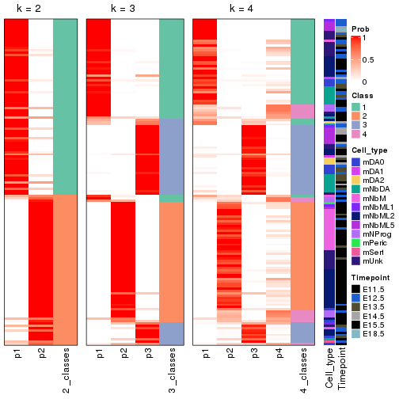


Test correlation between subgroups and known annotations. If the known
annotation is numeric, one-way ANOVA test is applied, and if the known
annotation is discrete, chi-squared contingency table test is applied.

```r
test_to_known_factors(res)
```

```
#>             n_sample Cell_type(p-value) Timepoint(p-value) k
#> ATC:skmeans      134           5.03e-07           4.60e-07 2
#> ATC:skmeans      134           7.33e-06           8.89e-09 3
#> ATC:skmeans      122           9.25e-23           3.02e-08 4
```


If matrix rows can be associated to genes, consider to use `functional_enrichment(res,
...)` to perform function enrichment for the signature genes. See [this vignette](https://jokergoo.github.io/cola_vignettes/functional_enrichment.html) for more detailed explanations.


 

---------------------------------------------------


### Node02


Parent node: [Node0](#Node0).
Child nodes: 
                Node011-leaf
        ,
                [Node012](#Node012)
        ,
                [Node013](#Node013)
        ,
                Node021-leaf
        ,
                [Node022](#Node022)
        ,
                [Node023](#Node023)
        ,
                [Node031](#Node031)
        ,
                [Node032](#Node032)
        .


The object with results only for a single top-value method and a single partitioning method 
can be extracted as:

```r
res = res_rh["02"]
```

A summary of `res` and all the functions that can be applied to it:

```r
res
```

```
#> A 'DownSamplingConsensusPartition' object with k = 2, 3, 4.
#>   On a matrix with 9885 rows and 500 columns, randomly sampled from 748 columns.
#>   Top rows (918) are extracted by 'ATC' method.
#>   Subgroups are detected by 'skmeans' method.
#>   Performed in total 150 partitions by row resampling.
#>   Best k for subgroups seems to be 3.
#> 
#> Following methods can be applied to this 'DownSamplingConsensusPartition' object:
#>  [1] "cola_report"             "collect_classes"         "collect_plots"          
#>  [4] "collect_stats"           "colnames"                "compare_partitions"     
#>  [7] "compare_signatures"      "consensus_heatmap"       "dimension_reduction"    
#> [10] "functional_enrichment"   "get_anno_col"            "get_anno"               
#> [13] "get_classes"             "get_consensus"           "get_matrix"             
#> [16] "get_membership"          "get_param"               "get_signatures"         
#> [19] "get_stats"               "is_best_k"               "is_stable_k"            
#> [22] "membership_heatmap"      "ncol"                    "nrow"                   
#> [25] "plot_ecdf"               "predict_classes"         "rownames"               
#> [28] "select_partition_number" "show"                    "suggest_best_k"         
#> [31] "test_to_known_factors"   "top_rows_heatmap"
```

`collect_plots()` function collects all the plots made from `res` for all `k` (number of subgroups)
into one single page to provide an easy and fast comparison between different `k`.

```r
collect_plots(res)
```


The plots are:

- The first row: a plot of the eCDF (empirical cumulative distribution
  function) curves of the consensus matrix for each `k` and the heatmap of
  predicted classes for each `k`.
- The second row: heatmaps of the consensus matrix for each `k`.
- The third row: heatmaps of the membership matrix for each `k`.
- The fouth row: heatmaps of the signatures for each `k`.

All the plots in panels can be made by individual functions and they are
plotted later in this section.

`select_partition_number()` produces several plots showing different
statistics for choosing "optimized" `k`. There are following statistics:

- eCDF curves of the consensus matrix for each `k`;
- 1-PAC. [The PAC score](https://en.wikipedia.org/wiki/Consensus_clustering#Over-interpretation_potential_of_consensus_clustering)
  measures the proportion of the ambiguous subgrouping.
- Mean silhouette score.
- Concordance. The mean probability of fiting the consensus subgroup labels in all
  partitions.
- Area increased. Denote $A_k$ as the area under the eCDF curve for current
  `k`, the area increased is defined as $A_k - A_{k-1}$.
- Rand index. The percent of pairs of samples that are both in a same cluster
  or both are not in a same cluster in the partition of k and k-1.
- Jaccard index. The ratio of pairs of samples are both in a same cluster in
  the partition of k and k-1 and the pairs of samples are both in a same
  cluster in the partition k or k-1.

The detailed explanations of these statistics can be found in [the _cola_
vignette](https://jokergoo.github.io/cola_vignettes/cola.html#toc_13).

Generally speaking, higher 1-PAC score, higher mean silhouette score or higher
concordance corresponds to better partition. Rand index and Jaccard index
measure how similar the current partition is compared to partition with `k-1`.
If they are too similar, we won't accept `k` is better than `k-1`.

```r
select_partition_number(res)
```


The numeric values for all these statistics can be obtained by `get_stats()`.

```r
get_stats(res)
```

```
#>   k 1-PAC mean_silhouette concordance area_increased  Rand Jaccard
#> 2 2 1.000           0.963       0.986          0.498 0.503   0.503
#> 3 3 0.998           0.961       0.984          0.240 0.846   0.703
#> 4 4 0.817           0.877       0.937          0.137 0.888   0.718
```

`suggest_best_k()` suggests the best $k$ based on these statistics. The rules are as follows:

- All $k$ with Jaccard index larger than 0.95 are removed because increasing
  $k$ does not provide enough extra information. If all $k$ are removed, it is
  marked as no subgroup is detected.
- For all $k$ with 1-PAC score larger than 0.9, the maximal $k$ is taken as
  the best $k$, and other $k$ are marked as optional $k$.
- If it does not fit the second rule. The $k$ with the maximal vote of the
  highest 1-PAC score, highest mean silhouette, and highest concordance is
  taken as the best $k$.

```r
suggest_best_k(res)
```

```
#> [1] 3
#> attr(,"optional")
#> [1] 2
```

There is also optional best $k$ = 2 that is worth to check.

Following is the table of the partitions (You need to click the **show/hide
code output** link to see it). The membership matrix (columns with name `p*`)
is inferred by
[`clue::cl_consensus()`](https://www.rdocumentation.org/link/cl_consensus?package=clue)
function with the `SE` method. Basically the value in the membership matrix
represents the probability to belong to a certain group. The finall subgroup
label for an item is determined with the group with highest probability it
belongs to.

In `get_classes()` function, the entropy is calculated from the membership
matrix and the silhouette score is calculated from the consensus matrix.


<script>
$( function() {
	$( '#tabs-node-02-get-classes' ).tabs();
} );
</script>
<div id='tabs-node-02-get-classes'>
<ul>
<li><a href='#tab-node-02-get-classes-1'>k = 2</a></li>
<li><a href='#tab-node-02-get-classes-2'>k = 3</a></li>
<li><a href='#tab-node-02-get-classes-3'>k = 4</a></li>
</ul>

<div id='tab-node-02-get-classes-1'>
<p><a id='tab-node-02-get-classes-1-a' style='color:#0366d6' href='#'>show/hide code output</a></p>
<pre><code class="r">get_classes(res, k = 2)
</code></pre>

<pre><code>#&gt;                class     p
#&gt; 1772075300_C04     2 0.751
#&gt; 1772075301_B03     2 0.000
#&gt; 1772066093_G05     1 0.498
#&gt; 1772096112_F05     2 0.249
#&gt; 1772071050_B06     2 0.000
#&gt; 1772092006_A05     2 0.000
#&gt; 1772071065_E04     2 0.000
#&gt; 1772075301_B05     1 0.751
#&gt; 1772071048_C05     1 0.000
#&gt; 1772094173_D09     1 0.000
#&gt; 1772066085_E07     2 0.502
#&gt; 1772072249_F03     2 0.249
#&gt; 1772072249_C02     2 0.751
#&gt; 1772072246_D07     2 0.249
#&gt; 1772072246_E04     2 1.000
#&gt; 1772075301_D06     2 0.249
#&gt; 1772066087_E02     2 0.751
#&gt; 1772072246_C05     2 0.000
#&gt; 1772066084_E02     2 1.000
#&gt; 1772094144_H05     1 0.498
#&gt; 1772092007_B02     2 0.000
#&gt; 1772092006_H04     1 1.000
#&gt; 1772094169_C12     1 0.000
#&gt; 1772094166_F07     2 0.249
#&gt; 1772094171_C03     1 0.000
#&gt; 1772094175_D07     1 0.000
#&gt; 1772094166_E06     1 0.000
#&gt; 1772096114_C10     1 1.000
#&gt; 1772096112_E01     2 0.249
#&gt; 1772094146_F02     2 0.751
#&gt; 1772094146_D09     1 0.000
#&gt; 1772072246_C04     2 0.498
#&gt; 1772071046_F06     1 0.000
#&gt; 1772066084_D08     1 1.000
#&gt; 1772066084_H07     2 0.751
#&gt; 1772072246_B07     1 0.751
#&gt; 1772096114_C11     1 0.000
#&gt; 1772094172_D06     1 0.249
#&gt; 1772072246_F06     2 1.000
#&gt; 1772092007_D12     2 0.751
#&gt; 1772094166_D03     1 0.498
#&gt; 1772066085_H08     1 0.000
#&gt; 1772071048_H01     1 0.000
#&gt; 1772092007_B01     2 0.249
#&gt; 1772071049_A02     2 0.249
#&gt; 1772094169_D07     1 0.000
#&gt; 1772066084_D09     1 0.000
#&gt; 1772066087_G03     2 0.751
#&gt; 1772094174_C07     1 0.000
#&gt; 1772066085_H12     2 0.751
#&gt; 1772075300_B03     2 1.000
#&gt; 1772066085_D02     2 0.498
#&gt; 1772066084_A12     2 0.502
#&gt; 1772066084_C12     1 0.000
#&gt; 1772071048_B03     1 0.000
#&gt; 1772071046_H06     1 0.000
#&gt; 1772094173_A12     1 0.000
#&gt; 1772066084_B03     1 0.000
#&gt; 1772066085_C11     1 0.000
#&gt; 1772096112_D06     1 0.000
#&gt; 1772066085_D03     1 0.000
#&gt; 1772096114_B11     1 0.000
#&gt; 1772096112_B04     2 0.253
#&gt; 1772071046_B12     2 1.000
#&gt; 1772066084_F08     1 0.000
#&gt; 1772094173_E12     1 0.000
#&gt; 1772071046_B01     1 0.000
#&gt; 1772092007_H06     2 0.000
#&gt; 1772071065_A01     1 0.249
#&gt; 1772092006_C04     2 0.000
#&gt; 1772071049_E08     1 1.000
#&gt; 1772092006_A03     2 0.000
#&gt; 1772092006_E04     2 1.000
#&gt; 1772094159_G01     2 0.502
#&gt; 1772094158_D04     1 0.000
#&gt; 1772092007_E09     2 0.000
#&gt; 1772092007_H07     2 0.000
#&gt; 1772071050_G07     2 0.000
#&gt; 1772094146_B08     1 0.000
#&gt; 1772071050_G08     1 0.502
#&gt; 1772094171_A07     2 0.000
#&gt; 1772094144_E12     1 0.747
#&gt; 1772096114_F01     2 0.000
#&gt; 1772092006_H12     1 0.751
#&gt; 1772071049_G11     1 0.747
#&gt; 1772092006_D01     1 1.000
#&gt; 1772066091_C12     1 0.000
#&gt; 1772075303_G02     1 1.000
#&gt; 1772096112_H11     1 0.000
#&gt; 1772094161_F02     1 0.000
#&gt; 1772071049_G09     2 0.249
#&gt; 1772096112_D08     2 1.000
#&gt; 1772094166_B09     1 0.000
#&gt; 1772094166_C06     2 0.000
#&gt; 1772096112_A08     1 0.000
#&gt; 1772094169_C08     1 0.498
#&gt; 1772094163_B06     1 1.000
#&gt; 1772071050_G03     1 0.000
#&gt; 1772075302_E01     1 1.000
#&gt; 1772071049_F12     1 0.000
#&gt; 1772096114_F07     2 0.502
#&gt; 1772092007_G06     1 1.000
#&gt; 1772096115_F11     1 0.000
#&gt; 1772096115_E06     2 1.000
#&gt; 1772096115_H12     1 0.000
#&gt; 1772096114_A09     2 0.000
#&gt; 1772075303_D08     1 0.000
#&gt; 1772075302_C10     1 0.000
#&gt; 1772096114_D09     2 0.000
#&gt; 1772094166_H06     1 0.249
#&gt; 1772075302_C04     2 0.498
#&gt; 1772075302_A03     2 0.000
#&gt; 1772096112_B11     2 0.253
#&gt; 1772071049_D08     2 0.498
#&gt; 1772071065_F09     2 0.000
#&gt; 1772096112_C06     1 0.000
#&gt; 1772075302_E11     2 0.000
#&gt; 1772094166_G03     2 0.000
#&gt; 1772094166_B11     2 0.000
#&gt; 1772094171_E10     1 0.498
#&gt; 1772094171_B10     1 0.000
#&gt; 1772094171_H03     1 0.000
#&gt; 1772071065_E12     1 0.249
#&gt; 1772092007_E10     1 1.000
#&gt; 1772094171_C02     2 1.000
#&gt; 1772071050_A10     1 0.000
#&gt; 1772071049_E01     2 0.498
#&gt; 1772071049_C11     2 0.000
#&gt; 1772094169_B08     1 1.000
#&gt; 1772094158_G05     1 0.000
#&gt; 1772096114_B01     1 1.000
#&gt; 1772094158_H06     2 0.000
#&gt; 1772094156_C12     1 1.000
#&gt; 1772094166_A10     1 0.751
#&gt; 1772092007_H10     1 0.502
#&gt; 1772092007_C05     1 1.000
#&gt; 1772092007_H03     1 1.000
#&gt; 1772094156_B07     2 0.000
#&gt; 1772096115_B02     1 0.751
#&gt; 1772096111_B11     1 0.751
#&gt; 1772094161_A09     1 1.000
#&gt; 1772094146_B11     1 0.498
#&gt; 1772092007_E12     1 0.000
#&gt; 1772092007_C02     1 1.000
#&gt; 1772092006_E05     1 0.502
#&gt; 1772094171_B07     1 0.249
#&gt; 1772094169_E04     1 0.000
#&gt; 1772096115_D12     1 0.253
#&gt; 1772094171_E05     1 0.000
#&gt; 1772094169_C03     1 0.498
#&gt; 1772094173_A10     1 0.000
#&gt; 1772094144_F09     1 0.000
#&gt; 1772092006_B09     1 0.751
#&gt; 1772075303_A11     1 0.000
#&gt; 1772071065_A09     2 0.000
#&gt; 1772092007_H12     1 0.249
#&gt; 1772092007_G11     1 0.000
#&gt; 1772094146_A10     1 0.000
#&gt; 1772071065_F05     1 0.747
#&gt; 1772094171_D05     1 0.000
#&gt; 1772096115_C11     1 0.000
#&gt; 1772096112_D12     1 0.000
#&gt; 1772071049_D11     1 0.747
#&gt; 1772092006_D04     1 0.747
#&gt; 1772096112_H12     2 0.253
#&gt; 1772071049_B02     1 0.747
#&gt; 1772071050_D05     1 0.249
#&gt; 1772096112_E06     1 0.000
#&gt; 1772096114_E06     1 1.000
#&gt; 1772071049_D09     1 1.000
#&gt; 1772075302_E05     1 0.253
#&gt; 1772094169_E08     1 0.000
#&gt; 1772075302_B10     1 0.498
#&gt; 1772096114_C01     1 0.000
#&gt; 1772092006_D10     1 0.000
#&gt; 1772071065_D08     1 0.249
#&gt; 1772094166_D09     1 0.000
#&gt; 1772071050_C11     1 1.000
#&gt; 1772096111_F04     1 0.000
#&gt; 1771013118_E03     1 0.000
#&gt; 1772094171_E11     1 1.000
#&gt; 1772094171_G10     1 0.000
#&gt; 1772096114_H04     2 0.253
#&gt; 1772096112_G02     1 0.502
#&gt; 1772094166_B04     1 0.249
#&gt; 1772096114_D03     1 0.000
#&gt; 1772066087_D04     1 0.000
#&gt; 1772096112_F06     1 0.000
#&gt; 1772071065_A03     1 0.000
#&gt; 1772094166_G04     1 0.000
#&gt; 1772075302_B11     2 0.000
#&gt; 1772094169_D04     1 1.000
#&gt; 1772094163_G02     1 1.000
#&gt; 1772071049_C05     1 0.249
#&gt; 1772071049_A12     1 0.000
#&gt; 1772094159_A09     1 0.751
#&gt; 1772094166_A11     1 0.249
#&gt; 1772071050_H05     1 0.000
#&gt; 1772092007_D09     1 1.000
#&gt; 1772092006_H11     1 1.000
#&gt; 1772092006_A02     1 1.000
#&gt; 1772071049_F04     1 0.000
#&gt; 1772072248_D11     1 0.747
#&gt; 1772096114_C02     1 0.498
#&gt; 1772096112_G04     1 0.249
#&gt; 1772071065_A11     2 0.000
#&gt; 1772094163_H04     1 1.000
#&gt; 1772066091_B04     1 0.000
#&gt; 1772096114_E12     1 0.498
#&gt; 1772071046_G11     1 0.253
#&gt; 1772096112_C04     1 0.000
#&gt; 1772094173_A09     1 0.000
#&gt; 1772071046_B04     1 0.000
#&gt; 1772066084_H06     1 0.249
#&gt; 1772094175_A05     1 0.000
#&gt; 1772094172_E01     1 0.000
#&gt; 1772075300_G11     2 0.000
#&gt; 1772066084_F04     1 0.000
#&gt; 1772071046_G07     2 0.000
#&gt; 1772094173_G07     1 1.000
#&gt; 1772075303_A04     1 1.000
#&gt; 1772096111_B07     1 0.502
#&gt; 1772075302_H12     2 0.000
#&gt; 1772094166_C05     1 0.249
#&gt; 1772071048_A09     1 1.000
#&gt; 1772075302_C11     1 1.000
#&gt; 1772096112_D05     1 0.000
#&gt; 1772094166_F04     1 0.751
#&gt; 1772096111_H09     1 0.249
#&gt; 1772096115_A06     1 1.000
#&gt; 1772071065_G11     1 0.000
#&gt; 1772096115_B12     1 0.751
#&gt; 1772071048_H12     1 0.000
#&gt; 1772096111_E01     1 0.502
#&gt; 1772096114_G11     1 0.502
#&gt; 1772096115_A04     1 0.000
#&gt; 1772075303_C09     1 0.502
#&gt; 1772094166_G06     2 0.000
#&gt; 1772071065_E02     1 1.000
#&gt; 1772071065_G06     2 0.000
#&gt; 1772066084_G02     2 0.249
#&gt; 1772066085_B04     2 0.000
#&gt; 1772072246_A08     2 0.502
#&gt; 1772066087_H03     2 0.000
#&gt; 1772071046_E03     2 0.502
#&gt; 1772066093_B11     1 0.253
#&gt; 1772075301_D02     2 0.000
#&gt; 1772096114_D01     1 0.000
#&gt; 1772072246_D05     2 0.502
#&gt; 1772075301_G06     2 0.000
#&gt; 1772075302_A01     1 0.747
#&gt; 1772066093_D06     2 0.000
#&gt; 1772066087_G09     1 0.000
#&gt; 1772066087_B02     2 0.000
#&gt; 1772066091_D10     1 0.000
#&gt; 1772066084_A02     2 0.000
#&gt; 1772066093_H01     1 0.000
#&gt; 1772066093_H05     1 0.000
#&gt; 1772066087_H01     1 0.000
#&gt; 1772094175_F07     1 0.000
#&gt; 1772096111_F01     1 0.000
#&gt; 1772066087_H04     2 0.498
#&gt; 1772071046_C02     2 0.000
#&gt; 1772066093_G07     2 0.000
#&gt; 1772071048_E07     2 0.000
#&gt; 1772071046_D05     2 0.000
#&gt; 1772066093_B03     2 0.751
#&gt; 1772066087_F09     1 0.498
#&gt; 1772066093_A03     1 0.000
#&gt; 1772072248_H04     1 0.249
#&gt; 1772094173_E04     1 0.000
#&gt; 1772066085_H07     1 0.000
#&gt; 1772072246_B10     2 0.000
#&gt; 1772066087_G07     2 0.000
#&gt; 1772075301_E12     2 0.000
#&gt; 1772071046_G04     2 0.000
#&gt; 1772075302_G02     2 0.000
#&gt; 1772075303_G01     1 0.498
#&gt; 1772075302_F03     2 0.000
#&gt; 1772066093_B07     1 0.253
#&gt; 1772096114_D05     1 0.000
#&gt; 1772071048_E09     2 0.000
#&gt; 1772075302_E07     2 0.000
#&gt; 1772071065_B11     2 0.000
#&gt; 1772072249_F02     2 0.249
#&gt; 1772096114_B09     2 0.000
#&gt; 1772071065_G05     2 0.000
#&gt; 1772066093_E04     2 0.249
#&gt; 1772071048_D05     1 0.249
#&gt; 1772066084_F02     2 0.249
#&gt; 1772071048_A12     1 0.000
#&gt; 1772066087_H07     2 0.000
#&gt; 1772066084_F06     2 0.000
#&gt; 1772066084_B12     1 0.000
#&gt; 1772066084_C03     1 0.000
#&gt; 1772071046_C10     2 0.751
#&gt; 1772094175_B01     1 0.000
#&gt; 1772066093_B05     1 0.751
#&gt; 1772071046_C01     2 0.751
#&gt; 1772094173_C01     2 0.249
#&gt; 1772075301_C07     2 0.000
#&gt; 1772071048_E11     1 0.000
#&gt; 1772066093_C06     2 0.000
#&gt; 1772071048_B12     2 0.000
#&gt; 1772094172_F09     1 0.000
#&gt; 1772072248_B07     2 1.000
#&gt; 1772094173_C03     2 0.000
#&gt; 1772094175_C03     1 0.000
#&gt; 1772071048_C06     1 0.000
#&gt; 1772094166_H12     1 0.253
#&gt; 1772066093_D10     1 0.000
#&gt; 1772066084_B11     1 0.249
#&gt; 1772066093_C05     1 0.000
#&gt; 1772066084_D06     1 0.253
#&gt; 1772094172_C11     1 0.000
#&gt; 1772066087_F02     2 1.000
#&gt; 1772066087_A12     2 0.000
#&gt; 1772066085_A07     1 0.000
#&gt; 1772066087_C03     2 0.751
#&gt; 1772066085_F02     1 0.000
#&gt; 1772066087_D08     1 0.000
#&gt; 1772066087_D09     2 0.249
#&gt; 1772066085_G07     1 0.000
#&gt; 1772066084_E09     1 0.000
#&gt; 1772066085_B06     1 0.000
#&gt; 1772066087_E11     1 0.249
#&gt; 1772066085_F01     1 0.000
#&gt; 1772071048_B09     1 0.000
#&gt; 1772071048_F11     1 0.000
#&gt; 1772094174_A12     1 0.000
#&gt; 1772066084_H10     1 0.000
#&gt; 1772066087_E12     1 0.751
#&gt; 1772066085_C02     1 0.751
#&gt; 1772094175_E03     1 1.000
#&gt; 1772071048_B11     1 0.000
#&gt; 1772094156_C10     1 0.000
#&gt; 1772066084_B05     1 0.000
#&gt; 1772071065_B04     1 0.000
#&gt; 1772075302_B01     1 0.000
#&gt; 1772071048_A05     1 0.000
#&gt; 1772071048_F04     1 0.747
#&gt; 1772066087_G06     1 1.000
#&gt; 1772094174_A06     1 0.000
#&gt; 1772094174_D10     1 0.000
#&gt; 1772066084_B10     1 0.502
#&gt; 1772066087_E08     1 0.000
#&gt; 1772075301_C03     1 0.747
#&gt; 1772075301_A01     1 0.502
#&gt; 1772075301_G12     1 0.000
#&gt; 1772066093_E12     1 0.502
#&gt; 1772071048_H04     1 0.253
#&gt; 1772071048_G04     1 0.000
#&gt; 1772071046_C05     1 0.000
#&gt; 1772066087_G04     1 0.000
#&gt; 1772066084_B06     1 0.249
#&gt; 1772094175_B06     1 0.000
#&gt; 1772096114_F04     1 0.000
#&gt; 1772072246_F11     1 0.000
#&gt; 1772094172_D08     1 0.000
#&gt; 1772066084_C05     1 0.000
#&gt; 1772066087_H10     1 0.000
#&gt; 1772066087_A09     1 0.000
#&gt; 1772071049_A01     1 0.249
#&gt; 1772071049_C09     2 0.751
#&gt; 1772071048_G06     2 0.751
#&gt; 1772075302_H06     1 0.747
#&gt; 1772066087_A03     1 0.249
#&gt; 1772071048_F08     1 0.000
#&gt; 1772066084_C02     1 0.000
#&gt; 1772071046_A01     1 0.000
#&gt; 1772066087_G12     2 0.253
#&gt; 1772071065_G07     1 0.751
#&gt; 1772071048_C01     1 0.000
#&gt; 1772066085_F06     1 1.000
#&gt; 1772094172_C05     2 1.000
#&gt; 1772066084_B02     1 0.000
#&gt; 1772066084_E12     1 0.000
#&gt; 1772094172_E07     1 0.249
#&gt; 1772072248_A05     1 0.000
#&gt; 1772094174_D02     1 0.249
#&gt; 1772096114_A07     1 0.249
#&gt; 1772066087_A02     1 0.000
#&gt; 1772096112_G06     1 0.000
#&gt; 1772072246_C10     1 0.000
#&gt; 1772094174_A09     1 0.249
#&gt; 1772066091_D12     1 0.000
#&gt; 1772075303_E01     1 0.000
#&gt; 1772072249_C10     1 0.000
#&gt; 1772075303_F02     1 0.502
#&gt; 1772066087_D12     1 0.249
#&gt; 1772071046_G09     1 0.000
#&gt; 1772094175_E01     1 0.000
#&gt; 1772094173_C10     1 0.000
#&gt; 1772075301_C11     1 0.000
#&gt; 1772094175_C06     1 0.000
#&gt; 1772094175_F11     1 0.249
#&gt; 1772066085_G03     1 0.000
#&gt; 1772066087_E03     1 0.498
#&gt; 1772075300_E06     1 0.502
#&gt; 1772071046_E12     1 0.249
#&gt; 1772066087_B01     1 0.249
#&gt; 1772066087_B10     1 0.751
#&gt; 1772066085_B05     1 0.000
#&gt; 1772071065_G01     1 0.000
#&gt; 1772066085_F07     1 0.000
#&gt; 1772075300_B04     1 1.000
#&gt; 1772094172_G02     1 0.000
#&gt; 1772071048_E06     2 0.249
#&gt; 1772072246_G04     2 0.751
#&gt; 1772094175_F01     2 0.502
#&gt; 1772066087_B07     1 0.000
#&gt; 1772094172_E02     1 0.498
#&gt; 1772094175_F08     1 0.000
#&gt; 1772072247_F02     1 0.000
#&gt; 1772096112_D07     1 0.000
#&gt; 1772071048_H11     1 0.000
#&gt; 1772071046_E05     1 0.000
#&gt; 1772071048_A11     1 0.000
#&gt; 1772096115_B07     1 0.000
#&gt; 1772094174_A01     1 0.000
#&gt; 1772066085_D01     1 0.000
#&gt; 1772094175_A01     1 0.000
#&gt; 1772066085_H01     1 0.000
#&gt; 1772075300_B10     1 0.000
#&gt; 1772096112_A06     1 0.000
#&gt; 1772096112_F02     1 0.000
#&gt; 1772066085_D06     1 0.000
#&gt; 1772075301_H06     1 0.498
#&gt; 1772075300_D05     1 0.000
#&gt; 1772094173_F10     1 0.000
#&gt; 1772075300_C05     1 0.249
#&gt; 1772071046_H11     1 0.000
#&gt; 1772075300_H12     1 0.751
#&gt; 1772072246_D11     1 0.498
#&gt; 1772094173_D05     1 0.000
#&gt; 1772071046_A08     1 0.000
#&gt; 1772066093_F01     1 1.000
#&gt; 1772066087_A11     2 1.000
#&gt; 1772071048_C12     1 0.000
#&gt; 1772075300_C01     1 0.249
#&gt; 1772071065_E01     1 0.249
#&gt; 1772094172_G07     1 0.000
#&gt; 1772071048_D12     1 0.253
#&gt; 1772094175_B09     1 0.249
#&gt; 1772066085_C04     1 0.000
#&gt; 1772094175_D11     1 0.000
#&gt; 1772094174_B02     1 0.000
#&gt; 1772075300_A10     1 0.249
#&gt; 1772072246_F10     1 0.249
#&gt; 1772094172_A04     1 0.751
#&gt; 1772066085_B11     1 0.000
#&gt; 1772071048_C10     1 0.498
#&gt; 1772066085_G11     1 0.000
#&gt; 1772071048_A03     1 0.000
#&gt; 1772066085_E03     1 0.000
#&gt; 1772094173_B05     1 0.000
#&gt; 1772094173_A08     1 0.000
#&gt; 1772094175_C04     2 0.000
#&gt; 1772071046_D11     2 0.498
#&gt; 1772071065_G04     1 0.751
#&gt; 1772075301_F04     1 0.253
#&gt; 1772094175_D09     1 0.000
#&gt; 1772071049_F10     1 0.000
#&gt; 1772072246_B08     1 0.000
#&gt; 1772066084_B01     1 0.249
#&gt; 1772066085_C06     1 0.000
#&gt; 1772096112_C02     1 0.000
#&gt; 1772094175_C05     1 0.253
#&gt; 1772066085_H10     2 1.000
#&gt; 1772094173_B10     1 0.000
#&gt; 1772066084_D03     1 0.000
#&gt; 1772096115_F07     1 0.000
#&gt; 1772075302_E03     1 0.249
#&gt; 1772075302_F10     1 0.249
#&gt; 1772071048_C08     1 0.000
#&gt; 1772094175_B12     1 0.000
#&gt; 1772094173_C04     2 1.000
#&gt; 1772072246_C02     1 0.000
#&gt; 1772075301_B08     2 0.498
#&gt; 1772094175_E04     1 0.000
#&gt; 1772066087_E07     2 0.249
#&gt; 1772075302_H03     2 0.249
#&gt; 1772071050_F02     2 0.000
#&gt; 1772071050_E02     2 0.000
#&gt; 1772096112_C08     1 0.000
#&gt; 1772071065_C02     2 0.000
#&gt; 1772075302_E02     2 0.000
#&gt; 1772075301_E07     2 0.000
#&gt; 1772075301_E03     2 0.000
#&gt; 1772075300_F08     2 0.000
#&gt; 1772072246_B03     2 0.000
#&gt; 1772075300_B06     2 0.000
#&gt; 1772071046_C07     2 0.249
#&gt; 1772075302_E10     1 0.000
#&gt; 1772094169_B02     2 0.498
#&gt; 1772066093_G01     1 0.000
#&gt; 1772096115_B03     2 0.249
#&gt; 1772096112_E11     2 0.751
#&gt; 1772096115_C09     1 0.253
#&gt; 1772092006_A06     2 0.000
#&gt; 1772092006_B03     2 0.000
#&gt; 1772092007_B11     2 0.000
#&gt; 1772094163_D01     1 0.000
#&gt; 1772096111_G04     2 0.249
#&gt; 1772071049_H01     2 0.000
#&gt; 1772096115_A01     2 0.253
#&gt; 1772071050_C07     1 0.000
#&gt; 1772094163_A02     2 0.249
#&gt; 1772071048_E03     2 0.751
#&gt; 1772066093_G09     2 0.498
#&gt; 1772094175_D08     2 0.498
#&gt; 1772071048_B06     2 0.253
#&gt; 1772094173_A01     2 0.249
#&gt; 1772096111_A06     1 1.000
#&gt; 1772066084_D07     1 0.000
#&gt; 1772066087_B11     1 0.000
#&gt; 1772075301_A03     2 0.000
#&gt; 1772094174_C02     1 0.751
#&gt; 1772094161_F04     1 0.498
#&gt; 1772094158_F10     1 0.000
#&gt; 1772094158_F12     1 0.751
#&gt; 1772094158_A02     1 0.000
#&gt; 1772094161_B09     1 0.000
#&gt; 1772092006_H06     1 1.000
#&gt; 1772092006_B07     1 1.000
#&gt; 1772094156_E04     1 1.000
#&gt; 1772071065_H07     2 0.249
#&gt; 1772092007_B06     2 0.000
#&gt; 1772092006_D03     1 1.000
#&gt; 1772092006_G09     2 0.000
#&gt; 1772094156_D01     1 0.000
#&gt; 1772071050_D12     1 0.000
#&gt; 1771013111_C09     1 1.000
#&gt; 1772071050_G02     2 0.000
#&gt; 1772094163_B02     1 0.751
#&gt; 1772075302_E06     2 0.000
#&gt; 1772096115_E05     1 0.000
#&gt; 1772096114_F02     1 0.498
#&gt; 1772094166_D01     1 0.751
#&gt; 1772096112_C03     1 0.253
#&gt; 1772092007_E07     2 0.000
#&gt; 1772094163_C07     2 1.000
#&gt; 1772092007_A07     2 0.000
#&gt; 1772096112_E07     2 0.000
#&gt; 1772071065_C08     2 0.000
#&gt; 1772071065_B06     2 0.000
#&gt; 1772075303_A08     2 0.000
#&gt; 1772071049_G04     2 0.000
#&gt; 1772071065_H09     2 0.000
#&gt; 1772075302_E12     2 0.000
#&gt; 1772096114_A12     2 0.000
#&gt; 1772075300_A03     2 0.000
#&gt; 1772075302_B07     2 0.000
#&gt; 1772075302_H08     2 0.498
#&gt; 1772075303_E07     2 0.000
#&gt; 1772071065_F06     2 0.000
#&gt; 1772094166_G05     1 0.502
#&gt; 1772096112_E04     1 0.751
#&gt; 1772096114_G02     2 0.000
#&gt; 1772092007_E02     1 0.751
#&gt; 1772096114_A06     1 1.000
#&gt; 1772096115_A11     2 0.000
#&gt; 1772096114_G06     1 1.000
#&gt; 1772096115_H06     1 1.000
#&gt; 1772071065_B12     1 1.000
#&gt; 1772075302_D12     1 1.000
#&gt; 1772075303_C12     1 1.000
#&gt; 1772075303_H07     2 0.000
#&gt; 1772094173_D07     2 0.000
#&gt; 1772066093_G11     2 0.000
#&gt; 1772066087_B09     2 0.000
#&gt; 1772096112_H02     1 0.000
#&gt; 1772096115_F12     1 0.751
#&gt; 1772075301_F08     2 0.498
#&gt; 1772096115_G12     1 0.249
#&gt; 1772094169_A12     1 0.502
#&gt; 1772096115_E04     2 0.000
#&gt; 1772075302_E04     2 0.000
#&gt; 1772071049_H02     2 0.000
#&gt; 1772075302_F01     2 0.747
#&gt; 1772092007_F05     2 0.000
#&gt; 1772096112_E02     2 0.249
#&gt; 1772071048_A01     2 0.249
#&gt; 1772066087_F01     2 0.000
#&gt; 1772075302_D01     1 0.000
#&gt; 1772096112_D01     2 0.498
#&gt; 1772094173_E07     1 0.000
#&gt; 1772096114_E02     2 0.000
#&gt; 1772071065_A02     2 0.000
#&gt; 1772094158_G02     1 0.000
#&gt; 1772066085_G10     1 0.253
#&gt; 1772075301_H12     2 0.498
#&gt; 1772075302_B04     2 0.253
#&gt; 1772075301_C08     2 0.000
#&gt; 1772071065_H11     1 0.751
#&gt; 1772075301_B11     1 0.498
#&gt; 1772094158_C10     1 0.000
#&gt; 1772094173_B06     1 0.502
#&gt; 1772066084_H01     2 1.000
#&gt; 1772075300_D06     2 0.000
#&gt; 1772066087_H11     2 0.498
#&gt; 1772071065_H06     2 0.000
#&gt; 1772096115_H03     1 1.000
#&gt; 1772096114_E04     2 0.249
#&gt; 1772075302_D09     1 0.502
#&gt; 1772075301_D03     1 0.751
#&gt; 1772071065_D03     2 0.000
#&gt; 1772066084_H03     2 0.249
#&gt; 1772075302_C02     1 0.249
#&gt; 1772094169_A05     1 0.000
#&gt; 1772071065_H02     2 0.000
#&gt; 1772096114_A11     2 0.751
#&gt; 1772075300_A07     2 0.000
#&gt; 1772075301_C12     2 0.000
#&gt; 1772071046_G12     2 1.000
#&gt; 1772075301_F10     2 0.000
#&gt; 1772075301_C05     1 0.502
#&gt; 1772075301_F06     2 0.000
#&gt; 1772075301_D10     2 0.000
#&gt; 1772075301_E02     2 0.000
#&gt; 1772075301_C02     2 0.249
#&gt; 1772075301_H04     2 0.000
#&gt; 1772075301_A12     1 1.000
#&gt; 1772066087_D01     2 0.249
#&gt; 1772075301_F12     2 0.000
#&gt; 1772075301_A11     2 0.000
#&gt; 1772072246_F08     2 0.000
#&gt; 1772075301_B07     2 0.502
#&gt; 1772075301_A02     2 0.000
#&gt; 1772066087_B05     2 0.000
#&gt; 1772075301_E10     2 0.000
#&gt; 1772066084_E08     2 0.249
#&gt; 1772072248_C11     2 0.747
#&gt; 1772066084_F03     2 0.253
#&gt; 1772072246_E01     1 1.000
#&gt; 1772072246_D02     1 1.000
#&gt; 1772072246_C07     2 1.000
#&gt; 1772066084_E07     1 0.502
#&gt; 1772075301_H10     2 0.000
#&gt; 1772072246_B01     1 0.498
#&gt; 1772066085_B02     2 0.249
#&gt; 1772066084_C07     2 0.249
#&gt; 1772075300_A06     2 0.751
#&gt; 1772066084_G07     2 0.000
#&gt; 1772075301_F01     2 0.249
#&gt; 1772071046_D12     2 0.498
#&gt; 1772071046_G06     2 0.000
#&gt; 1772075301_D05     2 0.000
#&gt; 1772096112_B02     2 0.249
#&gt; 1772072246_D01     2 0.253
#&gt; 1772072246_G05     2 0.000
#&gt; 1772066084_B09     2 0.000
#&gt; 1772071065_A06     2 0.000
#&gt; 1772071046_D10     2 0.249
#&gt; 1772075300_E01     2 0.000
#&gt; 1772075301_E09     2 0.000
#&gt; 1772075301_G04     1 1.000
#&gt; 1772071046_H12     2 0.751
#&gt; 1772075301_B10     2 0.000
#&gt; 1772075301_H03     1 0.498
#&gt; 1772075301_A08     2 0.000
#&gt; 1772066093_A10     2 0.000
#&gt; 1772071046_E06     2 1.000
#&gt; 1772075301_G10     2 0.249
#&gt; 1772094172_C02     2 0.751
#&gt; 1772094173_C11     2 0.000
#&gt; 1772075300_A09     2 0.000
#&gt; 1772075301_D08     2 0.000
#&gt; 1772075301_A07     2 0.000
#&gt; 1772071046_G05     2 0.751
#&gt; 1772075301_F05     2 0.000
#&gt; 1772075301_D11     2 0.000
#&gt; 1772066093_H12     2 0.498
#&gt; 1772075301_H11     2 0.000
#&gt; 1772071046_E04     2 1.000
#&gt; 1772075301_C09     2 0.000
#&gt; 1772075301_E05     2 0.000
#&gt; 1772075301_E04     2 0.000
#&gt; 1772071048_D11     2 0.249
#&gt; 1772075301_D04     2 0.000
#&gt; 1772075300_H07     1 0.249
#&gt; 1772071048_A08     2 0.253
#&gt; 1772075301_F09     2 0.000
#&gt; 1772071046_G01     2 0.000
#&gt; 1772072249_A08     2 0.000
#&gt; 1772066093_F07     2 0.000
#&gt; 1772071050_G09     2 0.000
#&gt; 1772072246_A03     2 0.000
#&gt; 1772071046_H07     2 0.000
#&gt; 1772066093_E09     2 0.000
#&gt; 1772071048_C02     2 0.000
#&gt; 1772066087_C04     2 0.000
#&gt; 1772075301_C04     2 0.000
#&gt; 1772071048_D06     2 0.000
#&gt; 1772071046_A11     2 0.000
#&gt; 1772072246_E10     2 0.000
#&gt; 1772071046_B06     2 0.000
#&gt; 1772072246_C01     2 0.000
#&gt; 1772071046_A09     2 0.000
#&gt; 1772075300_F06     2 0.000
#&gt; 1772066085_C07     2 0.000
#&gt; 1772075301_E11     2 0.000
#&gt; 1772075301_F02     2 0.000
#&gt; 1772075301_A06     2 0.249
#&gt; 1772075301_A05     2 0.000
#&gt; 1772075301_B01     2 0.000
#&gt; 1772075301_G02     2 0.000
#&gt; 1772075301_F07     2 0.000
#&gt; 1772075301_G09     2 0.000
#&gt; 1772075301_G11     2 0.000
#&gt; 1772075300_D07     2 0.000
#&gt; 1772075301_B04     2 0.000
#&gt; 1772066093_D11     2 0.000
#&gt; 1772071046_H02     2 0.000
#&gt; 1772071046_F02     2 0.000
#&gt; 1772066093_A06     2 0.000
#&gt; 1772071046_A02     2 0.000
#&gt; 1772071046_A06     1 0.747
#&gt; 1772066087_D02     2 0.000
#&gt; 1772066093_H11     2 0.000
#&gt; 1772066093_C11     2 0.000
#&gt; 1772066093_F02     2 0.000
#&gt; 1772075301_D12     2 0.000
#&gt; 1772066093_H07     2 0.000
#&gt; 1772066093_H02     2 0.000
#&gt; 1772071046_E11     2 0.000
#&gt; 1772072249_D10     2 0.000
#&gt; 1772071046_F04     2 0.000
#&gt; 1772066093_E02     2 0.000
#&gt; 1772071065_B07     2 0.000
#&gt; 1772071048_G11     1 0.249
#&gt; 1772071048_C04     2 0.000
#&gt; 1772072249_A04     2 0.000
#&gt; 1772066085_H06     2 0.000
#&gt; 1772075301_A10     2 0.000
#&gt; 1772075301_B02     2 0.000
#&gt; 1772072246_E08     2 0.249
#&gt; 1772071046_D09     1 0.000
#&gt; 1772066085_E02     1 0.000
#&gt; 1772071046_F11     2 0.000
#&gt; 1772072246_C08     2 0.000
#&gt; 1772072246_D03     2 0.751
#&gt; 1772072246_D10     2 0.000
#&gt; 1772072246_B06     2 0.000
#&gt; 1772072246_E11     2 0.000
#&gt; 1772072246_D04     2 0.000
#&gt; 1772072246_A12     2 0.249
#&gt; 1772066085_C01     2 0.000
</code></pre>

<script>
$('#tab-node-02-get-classes-1-a').parent().next().next().hide();
$('#tab-node-02-get-classes-1-a').click(function(){
  $('#tab-node-02-get-classes-1-a').parent().next().next().toggle();
  return(false);
});
</script>
</div>

<div id='tab-node-02-get-classes-2'>
<p><a id='tab-node-02-get-classes-2-a' style='color:#0366d6' href='#'>show/hide code output</a></p>
<pre><code class="r">get_classes(res, k = 3)
</code></pre>

<pre><code>#&gt;                class     p
#&gt; 1772075300_C04     2 0.000
#&gt; 1772075301_B03     2 1.000
#&gt; 1772066093_G05     1 1.000
#&gt; 1772096112_F05     2 0.000
#&gt; 1772071050_B06     3 0.000
#&gt; 1772092006_A05     2 0.000
#&gt; 1772071065_E04     3 0.000
#&gt; 1772075301_B05     1 1.000
#&gt; 1772071048_C05     2 0.000
#&gt; 1772094173_D09     1 0.000
#&gt; 1772066085_E07     3 0.000
#&gt; 1772072249_F03     2 0.000
#&gt; 1772072249_C02     2 0.000
#&gt; 1772072246_D07     2 0.000
#&gt; 1772072246_E04     3 0.000
#&gt; 1772075301_D06     2 0.000
#&gt; 1772066087_E02     2 0.000
#&gt; 1772072246_C05     2 0.249
#&gt; 1772066084_E02     2 0.000
#&gt; 1772094144_H05     1 1.000
#&gt; 1772092007_B02     2 0.000
#&gt; 1772092006_H04     2 0.000
#&gt; 1772094169_C12     2 1.000
#&gt; 1772094166_F07     2 0.000
#&gt; 1772094171_C03     1 0.249
#&gt; 1772094175_D07     1 0.000
#&gt; 1772094166_E06     2 0.000
#&gt; 1772096114_C10     1 0.502
#&gt; 1772096112_E01     2 0.000
#&gt; 1772094146_F02     2 0.000
#&gt; 1772094146_D09     1 0.502
#&gt; 1772072246_C04     2 0.751
#&gt; 1772071046_F06     1 0.000
#&gt; 1772066084_D08     2 0.000
#&gt; 1772066084_H07     2 0.000
#&gt; 1772072246_B07     1 0.249
#&gt; 1772096114_C11     1 0.000
#&gt; 1772094172_D06     1 0.249
#&gt; 1772072246_F06     2 0.747
#&gt; 1772092007_D12     2 0.000
#&gt; 1772094166_D03     1 0.249
#&gt; 1772066085_H08     1 0.000
#&gt; 1772071048_H01     1 1.000
#&gt; 1772092007_B01     2 0.000
#&gt; 1772071049_A02     2 0.000
#&gt; 1772094169_D07     1 0.751
#&gt; 1772066084_D09     2 0.000
#&gt; 1772066087_G03     2 0.000
#&gt; 1772094174_C07     1 1.000
#&gt; 1772066085_H12     2 0.000
#&gt; 1772075300_B03     2 0.000
#&gt; 1772066085_D02     2 0.000
#&gt; 1772066084_A12     2 0.000
#&gt; 1772066084_C12     1 0.000
#&gt; 1772071048_B03     2 0.000
#&gt; 1772071046_H06     2 0.000
#&gt; 1772094173_A12     1 0.000
#&gt; 1772066084_B03     2 0.000
#&gt; 1772066085_C11     1 0.000
#&gt; 1772096112_D06     2 0.000
#&gt; 1772066085_D03     1 0.000
#&gt; 1772096114_B11     1 0.000
#&gt; 1772096112_B04     2 0.000
#&gt; 1772071046_B12     2 0.000
#&gt; 1772066084_F08     2 0.000
#&gt; 1772094173_E12     1 1.000
#&gt; 1772071046_B01     1 0.498
#&gt; 1772092007_H06     3 0.000
#&gt; 1772071065_A01     1 0.000
#&gt; 1772092006_C04     2 0.000
#&gt; 1772071049_E08     1 0.249
#&gt; 1772092006_A03     2 0.000
#&gt; 1772092006_E04     1 0.249
#&gt; 1772094159_G01     3 0.000
#&gt; 1772094158_D04     1 0.000
#&gt; 1772092007_E09     2 0.253
#&gt; 1772092007_H07     2 0.000
#&gt; 1772071050_G07     3 0.751
#&gt; 1772094146_B08     1 0.751
#&gt; 1772071050_G08     1 0.502
#&gt; 1772094171_A07     2 0.000
#&gt; 1772094144_E12     1 0.249
#&gt; 1772096114_F01     2 0.000
#&gt; 1772092006_H12     1 0.000
#&gt; 1772071049_G11     1 1.000
#&gt; 1772092006_D01     1 0.000
#&gt; 1772066091_C12     1 1.000
#&gt; 1772075303_G02     1 1.000
#&gt; 1772096112_H11     1 0.000
#&gt; 1772094161_F02     1 1.000
#&gt; 1772071049_G09     2 0.000
#&gt; 1772096112_D08     2 0.000
#&gt; 1772094166_B09     1 0.498
#&gt; 1772094166_C06     2 0.000
#&gt; 1772096112_A08     1 0.000
#&gt; 1772094169_C08     1 1.000
#&gt; 1772094163_B06     1 0.751
#&gt; 1772071050_G03     1 0.000
#&gt; 1772075302_E01     2 0.000
#&gt; 1772071049_F12     1 0.000
#&gt; 1772096114_F07     3 0.000
#&gt; 1772092007_G06     3 1.000
#&gt; 1772096115_F11     1 0.000
#&gt; 1772096115_E06     2 0.000
#&gt; 1772096115_H12     1 0.000
#&gt; 1772096114_A09     3 0.000
#&gt; 1772075303_D08     1 0.000
#&gt; 1772075302_C10     1 1.000
#&gt; 1772096114_D09     2 0.000
#&gt; 1772094166_H06     2 0.000
#&gt; 1772075302_C04     2 0.000
#&gt; 1772075302_A03     2 0.000
#&gt; 1772096112_B11     2 0.000
#&gt; 1772071049_D08     2 0.000
#&gt; 1772071065_F09     3 0.000
#&gt; 1772096112_C06     1 1.000
#&gt; 1772075302_E11     2 0.000
#&gt; 1772094166_G03     2 0.000
#&gt; 1772094166_B11     2 0.000
#&gt; 1772094171_E10     1 0.751
#&gt; 1772094171_B10     1 0.498
#&gt; 1772094171_H03     1 1.000
#&gt; 1772071065_E12     1 0.000
#&gt; 1772092007_E10     1 1.000
#&gt; 1772094171_C02     3 0.000
#&gt; 1772071050_A10     1 0.000
#&gt; 1772071049_E01     2 0.000
#&gt; 1772071049_C11     3 0.000
#&gt; 1772094169_B08     3 1.000
#&gt; 1772094158_G05     1 0.751
#&gt; 1772096114_B01     1 1.000
#&gt; 1772094158_H06     3 0.751
#&gt; 1772094156_C12     1 0.249
#&gt; 1772094166_A10     1 0.000
#&gt; 1772092007_H10     1 0.747
#&gt; 1772092007_C05     1 1.000
#&gt; 1772092007_H03     1 1.000
#&gt; 1772094156_B07     2 0.000
#&gt; 1772096115_B02     1 0.249
#&gt; 1772096111_B11     1 1.000
#&gt; 1772094161_A09     1 0.751
#&gt; 1772094146_B11     1 1.000
#&gt; 1772092007_E12     1 1.000
#&gt; 1772092007_C02     3 0.751
#&gt; 1772092006_E05     1 0.000
#&gt; 1772094171_B07     3 1.000
#&gt; 1772094169_E04     1 1.000
#&gt; 1772096115_D12     1 1.000
#&gt; 1772094171_E05     1 1.000
#&gt; 1772094169_C03     1 1.000
#&gt; 1772094173_A10     1 0.000
#&gt; 1772094144_F09     1 1.000
#&gt; 1772092006_B09     1 0.000
#&gt; 1772075303_A11     1 0.498
#&gt; 1772071065_A09     3 0.253
#&gt; 1772092007_H12     1 0.000
#&gt; 1772092007_G11     1 0.000
#&gt; 1772094146_A10     1 0.000
#&gt; 1772071065_F05     1 0.502
#&gt; 1772094171_D05     1 1.000
#&gt; 1772096115_C11     1 0.000
#&gt; 1772096112_D12     1 0.000
#&gt; 1772071049_D11     1 0.751
#&gt; 1772092006_D04     1 0.000
#&gt; 1772096112_H12     2 0.000
#&gt; 1772071049_B02     1 1.000
#&gt; 1772071050_D05     1 0.000
#&gt; 1772096112_E06     1 0.000
#&gt; 1772096114_E06     1 1.000
#&gt; 1772071049_D09     1 0.000
#&gt; 1772075302_E05     1 0.000
#&gt; 1772094169_E08     1 1.000
#&gt; 1772075302_B10     1 0.000
#&gt; 1772096114_C01     1 0.000
#&gt; 1772092006_D10     1 0.000
#&gt; 1772071065_D08     1 0.000
#&gt; 1772094166_D09     1 1.000
#&gt; 1772071050_C11     1 1.000
#&gt; 1772096111_F04     1 0.000
#&gt; 1771013118_E03     1 0.000
#&gt; 1772094171_E11     1 1.000
#&gt; 1772094171_G10     1 0.000
#&gt; 1772096114_H04     2 0.000
#&gt; 1772096112_G02     1 0.000
#&gt; 1772094166_B04     1 0.747
#&gt; 1772096114_D03     1 1.000
#&gt; 1772066087_D04     1 0.498
#&gt; 1772096112_F06     1 0.000
#&gt; 1772071065_A03     1 0.249
#&gt; 1772094166_G04     2 0.000
#&gt; 1772075302_B11     3 0.000
#&gt; 1772094169_D04     1 1.000
#&gt; 1772094163_G02     1 0.751
#&gt; 1772071049_C05     1 0.000
#&gt; 1772071049_A12     1 0.000
#&gt; 1772094159_A09     1 1.000
#&gt; 1772094166_A11     1 1.000
#&gt; 1772071050_H05     1 0.000
#&gt; 1772092007_D09     2 0.000
#&gt; 1772092006_H11     1 1.000
#&gt; 1772092006_A02     1 0.000
#&gt; 1772071049_F04     1 0.000
#&gt; 1772072248_D11     1 0.000
#&gt; 1772096114_C02     1 1.000
#&gt; 1772096112_G04     1 0.253
#&gt; 1772071065_A11     3 0.000
#&gt; 1772094163_H04     1 1.000
#&gt; 1772066091_B04     1 0.000
#&gt; 1772096114_E12     1 0.000
#&gt; 1772071046_G11     1 0.000
#&gt; 1772096112_C04     1 0.000
#&gt; 1772094173_A09     1 0.000
#&gt; 1772071046_B04     2 0.751
#&gt; 1772066084_H06     1 0.498
#&gt; 1772094175_A05     1 0.000
#&gt; 1772094172_E01     1 1.000
#&gt; 1772075300_G11     3 0.000
#&gt; 1772066084_F04     1 0.747
#&gt; 1772071046_G07     3 0.000
#&gt; 1772094173_G07     1 1.000
#&gt; 1772075303_A04     1 0.249
#&gt; 1772096111_B07     1 1.000
#&gt; 1772075302_H12     2 0.000
#&gt; 1772094166_C05     1 0.000
#&gt; 1772071048_A09     1 1.000
#&gt; 1772075302_C11     2 0.000
#&gt; 1772096112_D05     1 0.000
#&gt; 1772094166_F04     1 1.000
#&gt; 1772096111_H09     1 0.249
#&gt; 1772096115_A06     1 0.000
#&gt; 1772071065_G11     1 0.253
#&gt; 1772096115_B12     1 0.000
#&gt; 1772071048_H12     1 1.000
#&gt; 1772096111_E01     1 0.000
#&gt; 1772096114_G11     1 0.253
#&gt; 1772096115_A04     1 0.000
#&gt; 1772075303_C09     1 0.000
#&gt; 1772094166_G06     2 0.000
#&gt; 1772071065_E02     1 0.253
#&gt; 1772071065_G06     2 0.000
#&gt; 1772066084_G02     2 0.000
#&gt; 1772066085_B04     2 0.000
#&gt; 1772072246_A08     2 0.000
#&gt; 1772066087_H03     2 0.498
#&gt; 1772071046_E03     3 0.000
#&gt; 1772066093_B11     1 1.000
#&gt; 1772075301_D02     2 0.000
#&gt; 1772096114_D01     1 1.000
#&gt; 1772072246_D05     2 0.000
#&gt; 1772075301_G06     3 1.000
#&gt; 1772075302_A01     1 0.253
#&gt; 1772066093_D06     3 0.000
#&gt; 1772066087_G09     1 0.249
#&gt; 1772066087_B02     2 0.000
#&gt; 1772066091_D10     1 0.000
#&gt; 1772066084_A02     2 0.000
#&gt; 1772066093_H01     1 1.000
#&gt; 1772066093_H05     1 1.000
#&gt; 1772066087_H01     1 1.000
#&gt; 1772094175_F07     1 1.000
#&gt; 1772096111_F01     1 0.000
#&gt; 1772066087_H04     3 1.000
#&gt; 1772071046_C02     3 1.000
#&gt; 1772066093_G07     3 0.000
#&gt; 1772071048_E07     3 1.000
#&gt; 1772071046_D05     2 0.000
#&gt; 1772066093_B03     3 1.000
#&gt; 1772066087_F09     1 1.000
#&gt; 1772066093_A03     1 0.747
#&gt; 1772072248_H04     1 0.000
#&gt; 1772094173_E04     1 1.000
#&gt; 1772066085_H07     1 0.000
#&gt; 1772072246_B10     2 1.000
#&gt; 1772066087_G07     2 0.000
#&gt; 1772075301_E12     2 1.000
#&gt; 1772071046_G04     2 1.000
#&gt; 1772075302_G02     2 0.249
#&gt; 1772075303_G01     1 0.498
#&gt; 1772075302_F03     2 1.000
#&gt; 1772066093_B07     1 1.000
#&gt; 1772096114_D05     1 0.249
#&gt; 1772071048_E09     3 0.000
#&gt; 1772075302_E07     3 0.502
#&gt; 1772071065_B11     3 1.000
#&gt; 1772072249_F02     3 0.498
#&gt; 1772096114_B09     2 1.000
#&gt; 1772071065_G05     2 0.000
#&gt; 1772066093_E04     3 0.000
#&gt; 1772071048_D05     1 0.000
#&gt; 1772066084_F02     2 0.000
#&gt; 1772071048_A12     1 1.000
#&gt; 1772066087_H07     2 0.000
#&gt; 1772066084_F06     2 0.000
#&gt; 1772066084_B12     1 0.751
#&gt; 1772066084_C03     1 0.000
#&gt; 1772071046_C10     2 0.000
#&gt; 1772094175_B01     1 0.000
#&gt; 1772066093_B05     1 1.000
#&gt; 1772071046_C01     2 0.000
#&gt; 1772094173_C01     2 0.000
#&gt; 1772075301_C07     2 0.000
#&gt; 1772071048_E11     1 0.000
#&gt; 1772066093_C06     3 0.000
#&gt; 1772071048_B12     2 0.000
#&gt; 1772094172_F09     1 1.000
#&gt; 1772072248_B07     2 0.000
#&gt; 1772094173_C03     2 0.000
#&gt; 1772094175_C03     1 0.000
#&gt; 1772071048_C06     1 1.000
#&gt; 1772094166_H12     2 0.000
#&gt; 1772066093_D10     1 1.000
#&gt; 1772066084_B11     2 0.000
#&gt; 1772066093_C05     1 1.000
#&gt; 1772066084_D06     1 0.000
#&gt; 1772094172_C11     1 1.000
#&gt; 1772066087_F02     2 0.000
#&gt; 1772066087_A12     2 0.000
#&gt; 1772066085_A07     1 0.000
#&gt; 1772066087_C03     1 0.751
#&gt; 1772066085_F02     1 0.000
#&gt; 1772066087_D08     1 1.000
#&gt; 1772066087_D09     2 0.000
#&gt; 1772066085_G07     1 0.249
#&gt; 1772066084_E09     1 0.000
#&gt; 1772066085_B06     1 0.000
#&gt; 1772066087_E11     1 0.000
#&gt; 1772066085_F01     1 0.000
#&gt; 1772071048_B09     1 0.000
#&gt; 1772071048_F11     1 0.249
#&gt; 1772094174_A12     1 0.000
#&gt; 1772066084_H10     1 0.000
#&gt; 1772066087_E12     1 1.000
#&gt; 1772066085_C02     1 0.000
#&gt; 1772094175_E03     1 0.747
#&gt; 1772071048_B11     1 0.751
#&gt; 1772094156_C10     1 0.249
#&gt; 1772066084_B05     1 0.000
#&gt; 1772071065_B04     1 0.000
#&gt; 1772075302_B01     1 0.498
#&gt; 1772071048_A05     1 1.000
#&gt; 1772071048_F04     1 1.000
#&gt; 1772066087_G06     1 0.000
#&gt; 1772094174_A06     1 1.000
#&gt; 1772094174_D10     1 0.000
#&gt; 1772066084_B10     1 0.000
#&gt; 1772066087_E08     1 0.000
#&gt; 1772075301_C03     1 1.000
#&gt; 1772075301_A01     1 1.000
#&gt; 1772075301_G12     1 1.000
#&gt; 1772066093_E12     1 1.000
#&gt; 1772071048_H04     1 0.502
#&gt; 1772071048_G04     1 0.249
#&gt; 1772071046_C05     1 1.000
#&gt; 1772066087_G04     1 1.000
#&gt; 1772066084_B06     1 0.751
#&gt; 1772094175_B06     1 1.000
#&gt; 1772096114_F04     1 0.249
#&gt; 1772072246_F11     1 0.747
#&gt; 1772094172_D08     1 0.000
#&gt; 1772066084_C05     1 0.253
#&gt; 1772066087_H10     1 0.249
#&gt; 1772066087_A09     1 0.000
#&gt; 1772071049_A01     1 0.000
#&gt; 1772071049_C09     3 0.747
#&gt; 1772071048_G06     2 0.000
#&gt; 1772075302_H06     1 0.249
#&gt; 1772066087_A03     1 1.000
#&gt; 1772071048_F08     1 1.000
#&gt; 1772066084_C02     1 0.498
#&gt; 1772071046_A01     1 1.000
#&gt; 1772066087_G12     2 0.000
#&gt; 1772071065_G07     1 0.000
#&gt; 1772071048_C01     1 0.000
#&gt; 1772066085_F06     1 0.751
#&gt; 1772094172_C05     2 0.000
#&gt; 1772066084_B02     1 0.000
#&gt; 1772066084_E12     1 0.000
#&gt; 1772094172_E07     1 1.000
#&gt; 1772072248_A05     1 1.000
#&gt; 1772094174_D02     1 0.249
#&gt; 1772096114_A07     1 1.000
#&gt; 1772066087_A02     1 1.000
#&gt; 1772096112_G06     1 0.000
#&gt; 1772072246_C10     1 0.000
#&gt; 1772094174_A09     1 1.000
#&gt; 1772066091_D12     1 0.000
#&gt; 1772075303_E01     1 0.000
#&gt; 1772072249_C10     1 0.000
#&gt; 1772075303_F02     1 0.249
#&gt; 1772066087_D12     1 0.498
#&gt; 1772071046_G09     1 0.751
#&gt; 1772094175_E01     1 0.000
#&gt; 1772094173_C10     1 0.000
#&gt; 1772075301_C11     1 1.000
#&gt; 1772094175_C06     1 0.000
#&gt; 1772094175_F11     1 1.000
#&gt; 1772066085_G03     1 0.000
#&gt; 1772066087_E03     1 1.000
#&gt; 1772075300_E06     1 1.000
#&gt; 1772071046_E12     1 1.000
#&gt; 1772066087_B01     1 0.751
#&gt; 1772066087_B10     1 1.000
#&gt; 1772066085_B05     1 0.000
#&gt; 1772071065_G01     1 0.000
#&gt; 1772066085_F07     1 0.000
#&gt; 1772075300_B04     1 1.000
#&gt; 1772094172_G02     1 1.000
#&gt; 1772071048_E06     1 0.498
#&gt; 1772072246_G04     2 0.000
#&gt; 1772094175_F01     2 0.000
#&gt; 1772066087_B07     1 0.000
#&gt; 1772094172_E02     1 0.000
#&gt; 1772094175_F08     1 0.000
#&gt; 1772072247_F02     1 0.000
#&gt; 1772096112_D07     1 0.000
#&gt; 1772071048_H11     1 0.000
#&gt; 1772071046_E05     1 1.000
#&gt; 1772071048_A11     1 0.000
#&gt; 1772096115_B07     1 0.000
#&gt; 1772094174_A01     1 0.000
#&gt; 1772066085_D01     1 0.000
#&gt; 1772094175_A01     1 0.249
#&gt; 1772066085_H01     1 1.000
#&gt; 1772075300_B10     1 1.000
#&gt; 1772096112_A06     1 0.000
#&gt; 1772096112_F02     1 0.000
#&gt; 1772066085_D06     1 0.751
#&gt; 1772075301_H06     1 1.000
#&gt; 1772075300_D05     1 1.000
#&gt; 1772094173_F10     1 0.249
#&gt; 1772075300_C05     1 1.000
#&gt; 1772071046_H11     1 0.000
#&gt; 1772075300_H12     1 0.249
#&gt; 1772072246_D11     1 1.000
#&gt; 1772094173_D05     1 0.000
#&gt; 1772071046_A08     1 0.747
#&gt; 1772066093_F01     1 1.000
#&gt; 1772066087_A11     2 0.249
#&gt; 1772071048_C12     1 0.000
#&gt; 1772075300_C01     1 1.000
#&gt; 1772071065_E01     1 0.000
#&gt; 1772094172_G07     1 0.000
#&gt; 1772071048_D12     1 0.000
#&gt; 1772094175_B09     1 0.502
#&gt; 1772066085_C04     1 0.000
#&gt; 1772094175_D11     1 0.000
#&gt; 1772094174_B02     1 0.000
#&gt; 1772075300_A10     1 1.000
#&gt; 1772072246_F10     1 0.000
#&gt; 1772094172_A04     1 0.502
#&gt; 1772066085_B11     1 0.000
#&gt; 1772071048_C10     1 0.000
#&gt; 1772066085_G11     1 0.000
#&gt; 1772071048_A03     1 0.000
#&gt; 1772066085_E03     1 1.000
#&gt; 1772094173_B05     1 0.000
#&gt; 1772094173_A08     1 0.249
#&gt; 1772094175_C04     2 0.000
#&gt; 1772071046_D11     2 0.000
#&gt; 1772071065_G04     1 0.000
#&gt; 1772075301_F04     1 1.000
#&gt; 1772094175_D09     1 0.502
#&gt; 1772071049_F10     1 0.000
#&gt; 1772072246_B08     1 1.000
#&gt; 1772066084_B01     1 0.000
#&gt; 1772066085_C06     1 0.000
#&gt; 1772096112_C02     1 1.000
#&gt; 1772094175_C05     1 1.000
#&gt; 1772066085_H10     2 0.000
#&gt; 1772094173_B10     1 0.000
#&gt; 1772066084_D03     1 0.502
#&gt; 1772096115_F07     1 1.000
#&gt; 1772075302_E03     1 0.751
#&gt; 1772075302_F10     1 0.751
#&gt; 1772071048_C08     1 0.000
#&gt; 1772094175_B12     1 0.000
#&gt; 1772094173_C04     2 0.000
#&gt; 1772072246_C02     1 1.000
#&gt; 1772075301_B08     3 0.000
#&gt; 1772094175_E04     1 1.000
#&gt; 1772066087_E07     2 0.000
#&gt; 1772075302_H03     2 0.000
#&gt; 1772071050_F02     2 1.000
#&gt; 1772071050_E02     3 1.000
#&gt; 1772096112_C08     1 0.000
#&gt; 1772071065_C02     2 0.000
#&gt; 1772075302_E02     2 0.000
#&gt; 1772075301_E07     2 0.000
#&gt; 1772075301_E03     2 0.000
#&gt; 1772075300_F08     2 0.000
#&gt; 1772072246_B03     2 0.498
#&gt; 1772075300_B06     2 0.000
#&gt; 1772071046_C07     2 0.000
#&gt; 1772075302_E10     1 0.253
#&gt; 1772094169_B02     3 1.000
#&gt; 1772066093_G01     1 1.000
#&gt; 1772096115_B03     2 0.000
#&gt; 1772096112_E11     2 0.000
#&gt; 1772096115_C09     2 0.000
#&gt; 1772092006_A06     2 0.000
#&gt; 1772092006_B03     2 0.000
#&gt; 1772092007_B11     2 1.000
#&gt; 1772094163_D01     1 0.000
#&gt; 1772096111_G04     2 0.000
#&gt; 1772071049_H01     2 0.000
#&gt; 1772096115_A01     2 0.000
#&gt; 1772071050_C07     1 0.000
#&gt; 1772094163_A02     2 0.000
#&gt; 1772071048_E03     2 0.000
#&gt; 1772066093_G09     3 0.000
#&gt; 1772094175_D08     3 0.498
#&gt; 1772071048_B06     2 0.000
#&gt; 1772094173_A01     2 0.000
#&gt; 1772096111_A06     1 1.000
#&gt; 1772066084_D07     1 1.000
#&gt; 1772066087_B11     1 0.000
#&gt; 1772075301_A03     2 1.000
#&gt; 1772094174_C02     1 0.000
#&gt; 1772094161_F04     1 0.000
#&gt; 1772094158_F10     1 0.000
#&gt; 1772094158_F12     1 0.000
#&gt; 1772094158_A02     1 0.000
#&gt; 1772094161_B09     1 1.000
#&gt; 1772092006_H06     2 0.000
#&gt; 1772092006_B07     2 0.000
#&gt; 1772094156_E04     2 0.000
#&gt; 1772071065_H07     2 0.000
#&gt; 1772092007_B06     2 0.000
#&gt; 1772092006_D03     1 1.000
#&gt; 1772092006_G09     2 0.000
#&gt; 1772094156_D01     1 1.000
#&gt; 1772071050_D12     1 0.000
#&gt; 1771013111_C09     3 1.000
#&gt; 1772071050_G02     3 0.000
#&gt; 1772094163_B02     1 0.253
#&gt; 1772075302_E06     2 0.000
#&gt; 1772096115_E05     1 0.000
#&gt; 1772096114_F02     1 0.000
#&gt; 1772094166_D01     1 1.000
#&gt; 1772096112_C03     2 0.000
#&gt; 1772092007_E07     2 0.000
#&gt; 1772094163_C07     2 0.498
#&gt; 1772092007_A07     2 0.751
#&gt; 1772096112_E07     2 0.000
#&gt; 1772071065_C08     2 0.000
#&gt; 1772071065_B06     2 0.000
#&gt; 1772075303_A08     2 0.000
#&gt; 1772071049_G04     2 0.502
#&gt; 1772071065_H09     2 0.000
#&gt; 1772075302_E12     2 0.000
#&gt; 1772096114_A12     2 0.000
#&gt; 1772075300_A03     2 0.000
#&gt; 1772075302_B07     2 0.000
#&gt; 1772075302_H08     2 0.249
#&gt; 1772075303_E07     2 0.000
#&gt; 1772071065_F06     2 0.000
#&gt; 1772094166_G05     2 0.000
#&gt; 1772096112_E04     1 1.000
#&gt; 1772096114_G02     2 0.000
#&gt; 1772092007_E02     1 1.000
#&gt; 1772096114_A06     3 1.000
#&gt; 1772096115_A11     2 0.000
#&gt; 1772096114_G06     1 1.000
#&gt; 1772096115_H06     1 0.000
#&gt; 1772071065_B12     1 0.000
#&gt; 1772075302_D12     1 1.000
#&gt; 1772075303_C12     2 0.747
#&gt; 1772075303_H07     2 0.000
#&gt; 1772094173_D07     2 0.000
#&gt; 1772066093_G11     3 0.000
#&gt; 1772066087_B09     2 0.000
#&gt; 1772096112_H02     1 0.000
#&gt; 1772096115_F12     1 1.000
#&gt; 1772075301_F08     3 1.000
#&gt; 1772096115_G12     1 0.000
#&gt; 1772094169_A12     1 0.751
#&gt; 1772096115_E04     2 0.000
#&gt; 1772075302_E04     2 1.000
#&gt; 1772071049_H02     3 0.000
#&gt; 1772075302_F01     2 0.000
#&gt; 1772092007_F05     2 0.000
#&gt; 1772096112_E02     2 0.249
#&gt; 1772071048_A01     2 0.000
#&gt; 1772066087_F01     1 1.000
#&gt; 1772075302_D01     1 1.000
#&gt; 1772096112_D01     2 0.000
#&gt; 1772094173_E07     1 1.000
#&gt; 1772096114_E02     2 0.000
#&gt; 1772071065_A02     3 0.249
#&gt; 1772094158_G02     1 1.000
#&gt; 1772066085_G10     1 0.000
#&gt; 1772075301_H12     1 0.502
#&gt; 1772075302_B04     2 0.253
#&gt; 1772075301_C08     2 0.751
#&gt; 1772071065_H11     1 1.000
#&gt; 1772075301_B11     1 1.000
#&gt; 1772094158_C10     1 1.000
#&gt; 1772094173_B06     1 0.498
#&gt; 1772066084_H01     2 0.000
#&gt; 1772075300_D06     2 0.000
#&gt; 1772066087_H11     2 0.000
#&gt; 1772071065_H06     3 0.000
#&gt; 1772096115_H03     1 0.502
#&gt; 1772096114_E04     2 0.000
#&gt; 1772075302_D09     1 0.249
#&gt; 1772075301_D03     1 1.000
#&gt; 1772071065_D03     2 0.000
#&gt; 1772066084_H03     2 0.000
#&gt; 1772075302_C02     1 1.000
#&gt; 1772094169_A05     1 0.747
#&gt; 1772071065_H02     3 0.000
#&gt; 1772096114_A11     2 0.000
#&gt; 1772075300_A07     2 0.000
#&gt; 1772075301_C12     3 0.498
#&gt; 1772071046_G12     2 1.000
#&gt; 1772075301_F10     3 0.751
#&gt; 1772075301_C05     1 1.000
#&gt; 1772075301_F06     3 0.000
#&gt; 1772075301_D10     3 0.000
#&gt; 1772075301_E02     3 0.000
#&gt; 1772075301_C02     3 0.000
#&gt; 1772075301_H04     3 0.249
#&gt; 1772075301_A12     1 1.000
#&gt; 1772066087_D01     2 0.747
#&gt; 1772075301_F12     2 0.000
#&gt; 1772075301_A11     2 0.000
#&gt; 1772072246_F08     2 0.747
#&gt; 1772075301_B07     3 0.000
#&gt; 1772075301_A02     3 0.000
#&gt; 1772066087_B05     1 1.000
#&gt; 1772075301_E10     3 0.000
#&gt; 1772066084_E08     2 0.000
#&gt; 1772072248_C11     3 0.498
#&gt; 1772066084_F03     2 0.000
#&gt; 1772072246_E01     1 1.000
#&gt; 1772072246_D02     3 1.000
#&gt; 1772072246_C07     3 0.000
#&gt; 1772066084_E07     1 1.000
#&gt; 1772075301_H10     3 0.000
#&gt; 1772072246_B01     1 0.000
#&gt; 1772066085_B02     2 0.000
#&gt; 1772066084_C07     2 0.000
#&gt; 1772075300_A06     1 0.502
#&gt; 1772066084_G07     2 0.000
#&gt; 1772075301_F01     2 0.751
#&gt; 1772071046_D12     2 0.000
#&gt; 1772071046_G06     2 0.000
#&gt; 1772075301_D05     2 1.000
#&gt; 1772096112_B02     2 0.000
#&gt; 1772072246_D01     2 0.000
#&gt; 1772072246_G05     2 0.000
#&gt; 1772066084_B09     2 0.000
#&gt; 1772071065_A06     2 0.000
#&gt; 1772071046_D10     2 0.000
#&gt; 1772075300_E01     2 0.000
#&gt; 1772075301_E09     3 0.000
#&gt; 1772075301_G04     3 1.000
#&gt; 1772071046_H12     3 0.249
#&gt; 1772075301_B10     2 0.502
#&gt; 1772075301_H03     1 1.000
#&gt; 1772075301_A08     2 1.000
#&gt; 1772066093_A10     3 1.000
#&gt; 1772071046_E06     2 0.000
#&gt; 1772075301_G10     2 1.000
#&gt; 1772094172_C02     2 0.000
#&gt; 1772094173_C11     2 0.000
#&gt; 1772075300_A09     2 0.000
#&gt; 1772075301_D08     2 1.000
#&gt; 1772075301_A07     2 0.000
#&gt; 1772071046_G05     2 0.000
#&gt; 1772075301_F05     2 1.000
#&gt; 1772075301_D11     2 0.249
#&gt; 1772066093_H12     3 1.000
#&gt; 1772075301_H11     3 1.000
#&gt; 1772071046_E04     2 0.000
#&gt; 1772075301_C09     3 0.000
#&gt; 1772075301_E05     2 1.000
#&gt; 1772075301_E04     2 1.000
#&gt; 1772071048_D11     2 0.000
#&gt; 1772075301_D04     3 1.000
#&gt; 1772075300_H07     3 1.000
#&gt; 1772071048_A08     2 0.000
#&gt; 1772075301_F09     3 0.249
#&gt; 1772071046_G01     3 0.000
#&gt; 1772072249_A08     3 0.000
#&gt; 1772066093_F07     3 0.000
#&gt; 1772071050_G09     2 1.000
#&gt; 1772072246_A03     3 1.000
#&gt; 1772071046_H07     3 0.502
#&gt; 1772066093_E09     3 0.000
#&gt; 1772071048_C02     3 0.000
#&gt; 1772066087_C04     2 1.000
#&gt; 1772075301_C04     3 0.000
#&gt; 1772071048_D06     3 1.000
#&gt; 1772071046_A11     3 0.000
#&gt; 1772072246_E10     3 0.000
#&gt; 1772071046_B06     3 1.000
#&gt; 1772072246_C01     3 1.000
#&gt; 1772071046_A09     3 0.000
#&gt; 1772075300_F06     3 0.000
#&gt; 1772066085_C07     2 0.000
#&gt; 1772075301_E11     2 1.000
#&gt; 1772075301_F02     2 0.000
#&gt; 1772075301_A06     2 0.000
#&gt; 1772075301_A05     2 1.000
#&gt; 1772075301_B01     2 0.000
#&gt; 1772075301_G02     2 1.000
#&gt; 1772075301_F07     2 1.000
#&gt; 1772075301_G09     2 0.751
#&gt; 1772075301_G11     2 1.000
#&gt; 1772075300_D07     2 0.000
#&gt; 1772075301_B04     3 0.000
#&gt; 1772066093_D11     3 1.000
#&gt; 1772071046_H02     3 0.000
#&gt; 1772071046_F02     3 0.000
#&gt; 1772066093_A06     3 0.000
#&gt; 1772071046_A02     3 0.000
#&gt; 1772071046_A06     3 0.747
#&gt; 1772066087_D02     2 0.000
#&gt; 1772066093_H11     3 0.000
#&gt; 1772066093_C11     3 0.000
#&gt; 1772066093_F02     3 1.000
#&gt; 1772075301_D12     3 0.000
#&gt; 1772066093_H07     3 0.000
#&gt; 1772066093_H02     3 0.000
#&gt; 1772071046_E11     3 0.000
#&gt; 1772072249_D10     3 0.000
#&gt; 1772071046_F04     3 0.000
#&gt; 1772066093_E02     3 0.000
#&gt; 1772071065_B07     3 0.000
#&gt; 1772071048_G11     3 1.000
#&gt; 1772071048_C04     3 0.000
#&gt; 1772072249_A04     3 0.000
#&gt; 1772066085_H06     3 0.000
#&gt; 1772075301_A10     3 0.000
#&gt; 1772075301_B02     3 1.000
#&gt; 1772072246_E08     3 0.000
#&gt; 1772071046_D09     1 1.000
#&gt; 1772066085_E02     1 1.000
#&gt; 1772071046_F11     3 0.000
#&gt; 1772072246_C08     3 0.000
#&gt; 1772072246_D03     3 0.000
#&gt; 1772072246_D10     3 0.000
#&gt; 1772072246_B06     3 0.000
#&gt; 1772072246_E11     3 0.000
#&gt; 1772072246_D04     3 0.000
#&gt; 1772072246_A12     3 0.000
#&gt; 1772066085_C01     3 0.000
</code></pre>

<script>
$('#tab-node-02-get-classes-2-a').parent().next().next().hide();
$('#tab-node-02-get-classes-2-a').click(function(){
  $('#tab-node-02-get-classes-2-a').parent().next().next().toggle();
  return(false);
});
</script>
</div>

<div id='tab-node-02-get-classes-3'>
<p><a id='tab-node-02-get-classes-3-a' style='color:#0366d6' href='#'>show/hide code output</a></p>
<pre><code class="r">get_classes(res, k = 4)
</code></pre>

<pre><code>#&gt;                class     p
#&gt; 1772075300_C04     2 1.000
#&gt; 1772075301_B03     2 1.000
#&gt; 1772066093_G05     1 0.000
#&gt; 1772096112_F05     4 0.000
#&gt; 1772071050_B06     3 0.000
#&gt; 1772092006_A05     2 1.000
#&gt; 1772071065_E04     3 0.000
#&gt; 1772075301_B05     1 0.249
#&gt; 1772071048_C05     4 0.000
#&gt; 1772094173_D09     4 0.249
#&gt; 1772066085_E07     3 0.000
#&gt; 1772072249_F03     2 0.000
#&gt; 1772072249_C02     2 0.000
#&gt; 1772072246_D07     4 0.249
#&gt; 1772072246_E04     3 0.000
#&gt; 1772075301_D06     2 0.000
#&gt; 1772066087_E02     2 0.751
#&gt; 1772072246_C05     2 0.000
#&gt; 1772066084_E02     2 1.000
#&gt; 1772094144_H05     4 0.000
#&gt; 1772092007_B02     2 1.000
#&gt; 1772092006_H04     4 0.000
#&gt; 1772094169_C12     4 0.000
#&gt; 1772094166_F07     4 1.000
#&gt; 1772094171_C03     4 0.751
#&gt; 1772094175_D07     1 0.000
#&gt; 1772094166_E06     4 0.000
#&gt; 1772096114_C10     1 1.000
#&gt; 1772096112_E01     2 1.000
#&gt; 1772094146_F02     4 0.000
#&gt; 1772094146_D09     4 0.000
#&gt; 1772072246_C04     2 0.000
#&gt; 1772071046_F06     1 1.000
#&gt; 1772066084_D08     4 0.000
#&gt; 1772066084_H07     2 0.502
#&gt; 1772072246_B07     1 0.000
#&gt; 1772096114_C11     1 1.000
#&gt; 1772094172_D06     1 1.000
#&gt; 1772072246_F06     2 1.000
#&gt; 1772092007_D12     4 0.000
#&gt; 1772094166_D03     4 0.000
#&gt; 1772066085_H08     1 0.249
#&gt; 1772071048_H01     4 0.000
#&gt; 1772092007_B01     4 1.000
#&gt; 1772071049_A02     2 1.000
#&gt; 1772094169_D07     4 0.000
#&gt; 1772066084_D09     4 0.000
#&gt; 1772066087_G03     2 0.751
#&gt; 1772094174_C07     4 0.000
#&gt; 1772066085_H12     4 1.000
#&gt; 1772075300_B03     2 0.751
#&gt; 1772066085_D02     2 0.751
#&gt; 1772066084_A12     2 1.000
#&gt; 1772066084_C12     4 1.000
#&gt; 1772071048_B03     4 0.000
#&gt; 1772071046_H06     4 0.000
#&gt; 1772094173_A12     4 0.751
#&gt; 1772066084_B03     4 0.000
#&gt; 1772066085_C11     1 1.000
#&gt; 1772096112_D06     4 0.000
#&gt; 1772066085_D03     1 1.000
#&gt; 1772096114_B11     4 0.502
#&gt; 1772096112_B04     2 1.000
#&gt; 1772071046_B12     2 0.502
#&gt; 1772066084_F08     4 0.000
#&gt; 1772094173_E12     1 1.000
#&gt; 1772071046_B01     1 0.253
#&gt; 1772092007_H06     3 0.000
#&gt; 1772071065_A01     1 1.000
#&gt; 1772092006_C04     2 0.747
#&gt; 1772071049_E08     1 0.498
#&gt; 1772092006_A03     2 1.000
#&gt; 1772092006_E04     4 0.000
#&gt; 1772094159_G01     3 0.000
#&gt; 1772094158_D04     1 0.498
#&gt; 1772092007_E09     2 1.000
#&gt; 1772092007_H07     2 1.000
#&gt; 1772071050_G07     3 1.000
#&gt; 1772094146_B08     4 0.000
#&gt; 1772071050_G08     1 0.000
#&gt; 1772094171_A07     2 0.502
#&gt; 1772094144_E12     1 1.000
#&gt; 1772096114_F01     2 0.000
#&gt; 1772092006_H12     1 1.000
#&gt; 1772071049_G11     1 1.000
#&gt; 1772092006_D01     4 1.000
#&gt; 1772066091_C12     4 0.000
#&gt; 1772075303_G02     4 0.000
#&gt; 1772096112_H11     4 1.000
#&gt; 1772094161_F02     1 0.000
#&gt; 1772071049_G09     2 0.498
#&gt; 1772096112_D08     4 0.000
#&gt; 1772094166_B09     1 1.000
#&gt; 1772094166_C06     2 1.000
#&gt; 1772096112_A08     1 0.751
#&gt; 1772094169_C08     1 1.000
#&gt; 1772094163_B06     4 0.000
#&gt; 1772071050_G03     1 1.000
#&gt; 1772075302_E01     4 0.000
#&gt; 1772071049_F12     1 1.000
#&gt; 1772096114_F07     3 0.000
#&gt; 1772092007_G06     3 1.000
#&gt; 1772096115_F11     1 0.249
#&gt; 1772096115_E06     4 0.000
#&gt; 1772096115_H12     1 1.000
#&gt; 1772096114_A09     3 1.000
#&gt; 1772075303_D08     1 1.000
#&gt; 1772075302_C10     4 0.000
#&gt; 1772096114_D09     2 1.000
#&gt; 1772094166_H06     4 0.000
#&gt; 1772075302_C04     4 1.000
#&gt; 1772075302_A03     2 1.000
#&gt; 1772096112_B11     4 0.249
#&gt; 1772071049_D08     2 1.000
#&gt; 1772071065_F09     4 0.249
#&gt; 1772096112_C06     4 0.000
#&gt; 1772075302_E11     2 1.000
#&gt; 1772094166_G03     2 1.000
#&gt; 1772094166_B11     4 0.000
#&gt; 1772094171_E10     1 1.000
#&gt; 1772094171_B10     1 1.000
#&gt; 1772094171_H03     1 1.000
#&gt; 1772071065_E12     1 1.000
#&gt; 1772092007_E10     1 0.751
#&gt; 1772094171_C02     3 0.000
#&gt; 1772071050_A10     1 1.000
#&gt; 1772071049_E01     2 1.000
#&gt; 1772071049_C11     3 0.000
#&gt; 1772094169_B08     1 1.000
#&gt; 1772094158_G05     1 0.253
#&gt; 1772096114_B01     1 1.000
#&gt; 1772094158_H06     3 0.000
#&gt; 1772094156_C12     1 1.000
#&gt; 1772094166_A10     1 1.000
#&gt; 1772092007_H10     1 0.751
#&gt; 1772092007_C05     1 0.249
#&gt; 1772092007_H03     1 1.000
#&gt; 1772094156_B07     4 0.000
#&gt; 1772096115_B02     1 0.000
#&gt; 1772096111_B11     1 0.249
#&gt; 1772094161_A09     1 1.000
#&gt; 1772094146_B11     4 0.000
#&gt; 1772092007_E12     1 0.751
#&gt; 1772092007_C02     3 0.000
#&gt; 1772092006_E05     4 1.000
#&gt; 1772094171_B07     3 1.000
#&gt; 1772094169_E04     1 1.000
#&gt; 1772096115_D12     4 0.000
#&gt; 1772094171_E05     1 0.502
#&gt; 1772094169_C03     1 0.747
#&gt; 1772094173_A10     1 0.502
#&gt; 1772094144_F09     1 1.000
#&gt; 1772092006_B09     1 1.000
#&gt; 1772075303_A11     1 1.000
#&gt; 1772071065_A09     4 0.000
#&gt; 1772092007_H12     4 0.000
#&gt; 1772092007_G11     1 1.000
#&gt; 1772094146_A10     1 1.000
#&gt; 1772071065_F05     4 0.000
#&gt; 1772094171_D05     1 0.253
#&gt; 1772096115_C11     1 1.000
#&gt; 1772096112_D12     1 0.751
#&gt; 1772071049_D11     4 0.000
#&gt; 1772092006_D04     1 1.000
#&gt; 1772096112_H12     2 1.000
#&gt; 1772071049_B02     4 0.000
#&gt; 1772071050_D05     4 1.000
#&gt; 1772096112_E06     1 1.000
#&gt; 1772096114_E06     1 1.000
#&gt; 1772071049_D09     4 1.000
#&gt; 1772075302_E05     1 1.000
#&gt; 1772094169_E08     1 1.000
#&gt; 1772075302_B10     1 1.000
#&gt; 1772096114_C01     1 1.000
#&gt; 1772092006_D10     1 1.000
#&gt; 1772071065_D08     1 1.000
#&gt; 1772094166_D09     1 0.000
#&gt; 1772071050_C11     1 0.751
#&gt; 1772096111_F04     1 1.000
#&gt; 1771013118_E03     1 1.000
#&gt; 1772094171_E11     1 0.751
#&gt; 1772094171_G10     1 1.000
#&gt; 1772096114_H04     4 0.000
#&gt; 1772096112_G02     4 1.000
#&gt; 1772094166_B04     1 1.000
#&gt; 1772096114_D03     1 0.000
#&gt; 1772066087_D04     1 0.000
#&gt; 1772096112_F06     1 1.000
#&gt; 1772071065_A03     1 0.751
#&gt; 1772094166_G04     4 0.000
#&gt; 1772075302_B11     3 0.000
#&gt; 1772094169_D04     1 1.000
#&gt; 1772094163_G02     1 1.000
#&gt; 1772071049_C05     1 1.000
#&gt; 1772071049_A12     1 1.000
#&gt; 1772094159_A09     1 1.000
#&gt; 1772094166_A11     1 1.000
#&gt; 1772071050_H05     1 1.000
#&gt; 1772092007_D09     4 0.000
#&gt; 1772092006_H11     1 1.000
#&gt; 1772092006_A02     4 1.000
#&gt; 1772071049_F04     1 1.000
#&gt; 1772072248_D11     1 0.000
#&gt; 1772096114_C02     1 0.751
#&gt; 1772096112_G04     1 1.000
#&gt; 1772071065_A11     3 0.000
#&gt; 1772094163_H04     1 1.000
#&gt; 1772066091_B04     1 0.751
#&gt; 1772096114_E12     1 1.000
#&gt; 1772071046_G11     1 1.000
#&gt; 1772096112_C04     4 0.249
#&gt; 1772094173_A09     1 0.502
#&gt; 1772071046_B04     4 0.498
#&gt; 1772066084_H06     4 1.000
#&gt; 1772094175_A05     1 0.498
#&gt; 1772094172_E01     1 0.000
#&gt; 1772075300_G11     3 0.000
#&gt; 1772066084_F04     1 0.249
#&gt; 1772071046_G07     3 0.000
#&gt; 1772094173_G07     1 0.253
#&gt; 1772075303_A04     4 0.502
#&gt; 1772096111_B07     1 0.751
#&gt; 1772075302_H12     4 0.000
#&gt; 1772094166_C05     4 1.000
#&gt; 1772071048_A09     1 0.751
#&gt; 1772075302_C11     4 0.000
#&gt; 1772096112_D05     1 1.000
#&gt; 1772094166_F04     1 1.000
#&gt; 1772096111_H09     1 1.000
#&gt; 1772096115_A06     4 1.000
#&gt; 1772071065_G11     1 1.000
#&gt; 1772096115_B12     1 1.000
#&gt; 1772071048_H12     1 0.000
#&gt; 1772096111_E01     1 1.000
#&gt; 1772096114_G11     1 1.000
#&gt; 1772096115_A04     1 1.000
#&gt; 1772075303_C09     1 1.000
#&gt; 1772094166_G06     2 1.000
#&gt; 1772071065_E02     1 1.000
#&gt; 1772071065_G06     4 0.000
#&gt; 1772066084_G02     2 0.000
#&gt; 1772066085_B04     2 0.000
#&gt; 1772072246_A08     2 0.000
#&gt; 1772066087_H03     2 0.000
#&gt; 1772071046_E03     3 0.000
#&gt; 1772066093_B11     1 0.000
#&gt; 1772075301_D02     2 0.498
#&gt; 1772096114_D01     1 0.000
#&gt; 1772072246_D05     2 0.000
#&gt; 1772075301_G06     2 1.000
#&gt; 1772075302_A01     1 1.000
#&gt; 1772066093_D06     3 0.000
#&gt; 1772066087_G09     1 0.000
#&gt; 1772066087_B02     2 0.000
#&gt; 1772066091_D10     1 1.000
#&gt; 1772066084_A02     4 0.751
#&gt; 1772066093_H01     1 0.000
#&gt; 1772066093_H05     1 0.000
#&gt; 1772066087_H01     1 0.000
#&gt; 1772094175_F07     1 0.000
#&gt; 1772096111_F01     1 1.000
#&gt; 1772066087_H04     3 0.502
#&gt; 1772071046_C02     3 1.000
#&gt; 1772066093_G07     3 0.000
#&gt; 1772071048_E07     2 1.000
#&gt; 1772071046_D05     2 0.000
#&gt; 1772066093_B03     3 0.249
#&gt; 1772066087_F09     1 0.000
#&gt; 1772066093_A03     1 0.249
#&gt; 1772072248_H04     1 0.000
#&gt; 1772094173_E04     4 0.000
#&gt; 1772066085_H07     1 0.000
#&gt; 1772072246_B10     2 1.000
#&gt; 1772066087_G07     2 0.000
#&gt; 1772075301_E12     2 1.000
#&gt; 1772071046_G04     2 1.000
#&gt; 1772075302_G02     2 1.000
#&gt; 1772075303_G01     1 0.249
#&gt; 1772075302_F03     2 1.000
#&gt; 1772066093_B07     1 0.000
#&gt; 1772096114_D05     1 0.498
#&gt; 1772071048_E09     3 0.000
#&gt; 1772075302_E07     4 0.502
#&gt; 1772071065_B11     3 1.000
#&gt; 1772072249_F02     2 0.000
#&gt; 1772096114_B09     2 1.000
#&gt; 1772071065_G05     2 0.000
#&gt; 1772066093_E04     3 0.253
#&gt; 1772071048_D05     1 0.000
#&gt; 1772066084_F02     2 0.502
#&gt; 1772071048_A12     1 0.000
#&gt; 1772066087_H07     2 0.000
#&gt; 1772066084_F06     2 0.502
#&gt; 1772066084_B12     1 0.000
#&gt; 1772066084_C03     1 0.000
#&gt; 1772071046_C10     2 0.000
#&gt; 1772094175_B01     1 0.000
#&gt; 1772066093_B05     1 1.000
#&gt; 1772071046_C01     2 0.000
#&gt; 1772094173_C01     2 0.000
#&gt; 1772075301_C07     2 0.249
#&gt; 1772071048_E11     1 0.249
#&gt; 1772066093_C06     3 0.000
#&gt; 1772071048_B12     2 0.000
#&gt; 1772094172_F09     1 0.000
#&gt; 1772072248_B07     2 0.000
#&gt; 1772094173_C03     2 1.000
#&gt; 1772094175_C03     1 0.000
#&gt; 1772071048_C06     1 0.000
#&gt; 1772094166_H12     4 0.000
#&gt; 1772066093_D10     1 0.502
#&gt; 1772066084_B11     4 0.000
#&gt; 1772066093_C05     1 0.000
#&gt; 1772066084_D06     1 0.000
#&gt; 1772094172_C11     1 1.000
#&gt; 1772066087_F02     2 0.000
#&gt; 1772066087_A12     2 1.000
#&gt; 1772066085_A07     1 1.000
#&gt; 1772066087_C03     1 0.000
#&gt; 1772066085_F02     1 0.000
#&gt; 1772066087_D08     1 0.000
#&gt; 1772066087_D09     2 0.000
#&gt; 1772066085_G07     1 0.000
#&gt; 1772066084_E09     1 0.751
#&gt; 1772066085_B06     1 0.502
#&gt; 1772066087_E11     1 0.000
#&gt; 1772066085_F01     1 1.000
#&gt; 1772071048_B09     1 0.000
#&gt; 1772071048_F11     1 0.000
#&gt; 1772094174_A12     1 0.747
#&gt; 1772066084_H10     1 0.000
#&gt; 1772066087_E12     1 0.249
#&gt; 1772066085_C02     1 0.000
#&gt; 1772094175_E03     1 1.000
#&gt; 1772071048_B11     1 1.000
#&gt; 1772094156_C10     1 0.253
#&gt; 1772066084_B05     1 0.000
#&gt; 1772071065_B04     1 1.000
#&gt; 1772075302_B01     1 0.249
#&gt; 1772071048_A05     1 0.000
#&gt; 1772071048_F04     1 0.000
#&gt; 1772066087_G06     4 0.751
#&gt; 1772094174_A06     1 0.000
#&gt; 1772094174_D10     1 0.000
#&gt; 1772066084_B10     1 0.000
#&gt; 1772066087_E08     1 0.000
#&gt; 1772075301_C03     1 0.249
#&gt; 1772075301_A01     1 0.000
#&gt; 1772075301_G12     1 0.000
#&gt; 1772066093_E12     1 0.000
#&gt; 1772071048_H04     1 0.000
#&gt; 1772071048_G04     1 0.000
#&gt; 1772071046_C05     1 0.249
#&gt; 1772066087_G04     1 0.000
#&gt; 1772066084_B06     1 0.747
#&gt; 1772094175_B06     1 0.000
#&gt; 1772096114_F04     1 1.000
#&gt; 1772072246_F11     1 0.000
#&gt; 1772094172_D08     1 0.000
#&gt; 1772066084_C05     1 0.000
#&gt; 1772066087_H10     1 0.000
#&gt; 1772066087_A09     1 0.000
#&gt; 1772071049_A01     1 0.498
#&gt; 1772071049_C09     3 0.000
#&gt; 1772071048_G06     2 0.000
#&gt; 1772075302_H06     1 1.000
#&gt; 1772066087_A03     1 0.000
#&gt; 1772071048_F08     1 0.000
#&gt; 1772066084_C02     4 0.000
#&gt; 1772071046_A01     1 0.000
#&gt; 1772066087_G12     4 0.498
#&gt; 1772071065_G07     1 0.751
#&gt; 1772071048_C01     1 0.498
#&gt; 1772066085_F06     4 0.000
#&gt; 1772094172_C05     2 0.000
#&gt; 1772066084_B02     1 0.751
#&gt; 1772066084_E12     1 0.498
#&gt; 1772094172_E07     1 0.000
#&gt; 1772072248_A05     1 0.000
#&gt; 1772094174_D02     1 0.747
#&gt; 1772096114_A07     1 0.000
#&gt; 1772066087_A02     1 0.000
#&gt; 1772096112_G06     1 1.000
#&gt; 1772072246_C10     1 0.000
#&gt; 1772094174_A09     1 0.249
#&gt; 1772066091_D12     4 1.000
#&gt; 1772075303_E01     1 0.747
#&gt; 1772072249_C10     1 0.000
#&gt; 1772075303_F02     1 1.000
#&gt; 1772066087_D12     1 0.000
#&gt; 1772071046_G09     1 0.000
#&gt; 1772094175_E01     1 0.502
#&gt; 1772094173_C10     1 0.000
#&gt; 1772075301_C11     1 0.000
#&gt; 1772094175_C06     1 0.249
#&gt; 1772094175_F11     1 0.000
#&gt; 1772066085_G03     1 0.502
#&gt; 1772066087_E03     1 0.000
#&gt; 1772075300_E06     1 0.249
#&gt; 1772071046_E12     1 0.000
#&gt; 1772066087_B01     1 0.000
#&gt; 1772066087_B10     1 0.000
#&gt; 1772066085_B05     1 0.000
#&gt; 1772071065_G01     1 0.751
#&gt; 1772066085_F07     1 0.249
#&gt; 1772075300_B04     1 0.000
#&gt; 1772094172_G02     1 0.000
#&gt; 1772071048_E06     1 1.000
#&gt; 1772072246_G04     2 0.000
#&gt; 1772094175_F01     2 1.000
#&gt; 1772066087_B07     1 0.000
#&gt; 1772094172_E02     1 0.000
#&gt; 1772094175_F08     1 0.000
#&gt; 1772072247_F02     1 0.000
#&gt; 1772096112_D07     1 0.502
#&gt; 1772071048_H11     1 0.000
#&gt; 1772071046_E05     1 0.000
#&gt; 1772071048_A11     1 0.751
#&gt; 1772096115_B07     1 1.000
#&gt; 1772094174_A01     1 0.000
#&gt; 1772066085_D01     1 1.000
#&gt; 1772094175_A01     1 0.000
#&gt; 1772066085_H01     4 0.000
#&gt; 1772075300_B10     1 0.000
#&gt; 1772096112_A06     1 1.000
#&gt; 1772096112_F02     1 1.000
#&gt; 1772066085_D06     4 1.000
#&gt; 1772075301_H06     1 0.747
#&gt; 1772075300_D05     1 0.000
#&gt; 1772094173_F10     1 0.000
#&gt; 1772075300_C05     1 0.000
#&gt; 1772071046_H11     1 0.000
#&gt; 1772075300_H12     4 0.498
#&gt; 1772072246_D11     1 1.000
#&gt; 1772094173_D05     1 0.000
#&gt; 1772071046_A08     1 0.000
#&gt; 1772066093_F01     1 1.000
#&gt; 1772066087_A11     2 0.751
#&gt; 1772071048_C12     1 0.000
#&gt; 1772075300_C01     1 0.000
#&gt; 1772071065_E01     1 0.751
#&gt; 1772094172_G07     1 0.000
#&gt; 1772071048_D12     1 0.000
#&gt; 1772094175_B09     1 0.000
#&gt; 1772066085_C04     1 1.000
#&gt; 1772094175_D11     1 1.000
#&gt; 1772094174_B02     1 0.502
#&gt; 1772075300_A10     1 0.249
#&gt; 1772072246_F10     1 0.000
#&gt; 1772094172_A04     1 0.000
#&gt; 1772066085_B11     1 0.000
#&gt; 1772071048_C10     1 0.000
#&gt; 1772066085_G11     1 1.000
#&gt; 1772071048_A03     1 0.000
#&gt; 1772066085_E03     4 0.253
#&gt; 1772094173_B05     1 0.000
#&gt; 1772094173_A08     1 0.000
#&gt; 1772094175_C04     2 1.000
#&gt; 1772071046_D11     2 0.751
#&gt; 1772071065_G04     1 0.747
#&gt; 1772075301_F04     1 1.000
#&gt; 1772094175_D09     1 0.000
#&gt; 1772071049_F10     1 1.000
#&gt; 1772072246_B08     1 0.000
#&gt; 1772066084_B01     1 1.000
#&gt; 1772066085_C06     1 0.000
#&gt; 1772096112_C02     1 0.000
#&gt; 1772094175_C05     4 0.249
#&gt; 1772066085_H10     2 0.000
#&gt; 1772094173_B10     1 0.000
#&gt; 1772066084_D03     1 0.000
#&gt; 1772096115_F07     1 0.000
#&gt; 1772075302_E03     1 0.249
#&gt; 1772075302_F10     1 1.000
#&gt; 1772071048_C08     1 0.000
#&gt; 1772094175_B12     1 0.000
#&gt; 1772094173_C04     2 0.498
#&gt; 1772072246_C02     1 0.000
#&gt; 1772075301_B08     3 0.000
#&gt; 1772094175_E04     4 0.000
#&gt; 1772066087_E07     2 0.000
#&gt; 1772075302_H03     2 0.000
#&gt; 1772071050_F02     2 1.000
#&gt; 1772071050_E02     3 1.000
#&gt; 1772096112_C08     1 1.000
#&gt; 1772071065_C02     4 0.000
#&gt; 1772075302_E02     2 1.000
#&gt; 1772075301_E07     2 0.000
#&gt; 1772075301_E03     2 0.000
#&gt; 1772075300_F08     2 0.000
#&gt; 1772072246_B03     2 0.000
#&gt; 1772075300_B06     2 0.000
#&gt; 1772071046_C07     2 0.000
#&gt; 1772075302_E10     4 1.000
#&gt; 1772094169_B02     3 0.000
#&gt; 1772066093_G01     1 0.000
#&gt; 1772096115_B03     2 0.751
#&gt; 1772096112_E11     2 0.498
#&gt; 1772096115_C09     4 0.000
#&gt; 1772092006_A06     4 1.000
#&gt; 1772092006_B03     2 0.000
#&gt; 1772092007_B11     2 1.000
#&gt; 1772094163_D01     1 1.000
#&gt; 1772096111_G04     4 1.000
#&gt; 1772071049_H01     2 0.000
#&gt; 1772096115_A01     2 0.000
#&gt; 1772071050_C07     1 0.000
#&gt; 1772094163_A02     2 0.249
#&gt; 1772071048_E03     2 0.000
#&gt; 1772066093_G09     3 0.000
#&gt; 1772094175_D08     3 0.000
#&gt; 1772071048_B06     2 0.000
#&gt; 1772094173_A01     2 0.000
#&gt; 1772096111_A06     1 0.253
#&gt; 1772066084_D07     1 0.751
#&gt; 1772066087_B11     1 0.000
#&gt; 1772075301_A03     2 1.000
#&gt; 1772094174_C02     1 0.249
#&gt; 1772094161_F04     1 1.000
#&gt; 1772094158_F10     1 0.751
#&gt; 1772094158_F12     1 1.000
#&gt; 1772094158_A02     1 1.000
#&gt; 1772094161_B09     1 0.000
#&gt; 1772092006_H06     4 0.000
#&gt; 1772092006_B07     4 0.000
#&gt; 1772094156_E04     4 0.000
#&gt; 1772071065_H07     2 1.000
#&gt; 1772092007_B06     2 1.000
#&gt; 1772092006_D03     4 0.000
#&gt; 1772092006_G09     2 1.000
#&gt; 1772094156_D01     1 1.000
#&gt; 1772071050_D12     1 1.000
#&gt; 1771013111_C09     3 1.000
#&gt; 1772071050_G02     3 0.000
#&gt; 1772094163_B02     4 0.000
#&gt; 1772075302_E06     2 0.502
#&gt; 1772096115_E05     1 0.751
#&gt; 1772096114_F02     1 1.000
#&gt; 1772094166_D01     4 0.000
#&gt; 1772096112_C03     4 0.000
#&gt; 1772092007_E07     4 0.502
#&gt; 1772094163_C07     4 0.249
#&gt; 1772092007_A07     2 1.000
#&gt; 1772096112_E07     2 1.000
#&gt; 1772071065_C08     2 1.000
#&gt; 1772071065_B06     2 1.000
#&gt; 1772075303_A08     4 0.000
#&gt; 1772071049_G04     2 1.000
#&gt; 1772071065_H09     2 1.000
#&gt; 1772075302_E12     2 1.000
#&gt; 1772096114_A12     4 0.000
#&gt; 1772075300_A03     2 0.000
#&gt; 1772075302_B07     2 1.000
#&gt; 1772075302_H08     2 0.502
#&gt; 1772075303_E07     2 0.502
#&gt; 1772071065_F06     2 1.000
#&gt; 1772094166_G05     4 0.000
#&gt; 1772096112_E04     4 0.000
#&gt; 1772096114_G02     2 0.751
#&gt; 1772092007_E02     1 1.000
#&gt; 1772096114_A06     3 1.000
#&gt; 1772096115_A11     2 0.747
#&gt; 1772096114_G06     1 0.502
#&gt; 1772096115_H06     1 1.000
#&gt; 1772071065_B12     1 1.000
#&gt; 1772075302_D12     4 0.000
#&gt; 1772075303_C12     4 0.000
#&gt; 1772075303_H07     4 0.000
#&gt; 1772094173_D07     2 0.000
#&gt; 1772066093_G11     3 0.000
#&gt; 1772066087_B09     2 0.000
#&gt; 1772096112_H02     1 1.000
#&gt; 1772096115_F12     4 0.000
#&gt; 1772075301_F08     3 0.249
#&gt; 1772096115_G12     1 1.000
#&gt; 1772094169_A12     1 0.000
#&gt; 1772096115_E04     4 0.253
#&gt; 1772075302_E04     2 1.000
#&gt; 1772071049_H02     3 0.000
#&gt; 1772075302_F01     2 0.000
#&gt; 1772092007_F05     4 1.000
#&gt; 1772096112_E02     2 0.000
#&gt; 1772071048_A01     2 0.000
#&gt; 1772066087_F01     2 0.502
#&gt; 1772075302_D01     1 0.000
#&gt; 1772096112_D01     2 1.000
#&gt; 1772094173_E07     1 0.000
#&gt; 1772096114_E02     2 0.502
#&gt; 1772071065_A02     3 0.000
#&gt; 1772094158_G02     1 0.000
#&gt; 1772066085_G10     1 0.751
#&gt; 1772075301_H12     4 1.000
#&gt; 1772075302_B04     4 0.000
#&gt; 1772075301_C08     2 0.000
#&gt; 1772071065_H11     1 0.253
#&gt; 1772075301_B11     1 0.000
#&gt; 1772094158_C10     1 0.000
#&gt; 1772094173_B06     1 0.000
#&gt; 1772066084_H01     2 0.000
#&gt; 1772075300_D06     4 0.000
#&gt; 1772066087_H11     2 0.249
#&gt; 1772071065_H06     3 0.000
#&gt; 1772096115_H03     4 0.498
#&gt; 1772096114_E04     4 0.502
#&gt; 1772075302_D09     4 0.000
#&gt; 1772075301_D03     1 0.498
#&gt; 1772071065_D03     2 1.000
#&gt; 1772066084_H03     2 0.000
#&gt; 1772075302_C02     1 1.000
#&gt; 1772094169_A05     4 1.000
#&gt; 1772071065_H02     3 0.000
#&gt; 1772096114_A11     4 0.000
#&gt; 1772075300_A07     2 0.000
#&gt; 1772075301_C12     3 1.000
#&gt; 1772071046_G12     2 1.000
#&gt; 1772075301_F10     3 0.249
#&gt; 1772075301_C05     1 0.000
#&gt; 1772075301_F06     3 0.000
#&gt; 1772075301_D10     3 0.000
#&gt; 1772075301_E02     3 0.000
#&gt; 1772075301_C02     3 0.502
#&gt; 1772075301_H04     3 0.751
#&gt; 1772075301_A12     1 0.498
#&gt; 1772066087_D01     2 0.000
#&gt; 1772075301_F12     2 0.000
#&gt; 1772075301_A11     2 0.000
#&gt; 1772072246_F08     2 0.502
#&gt; 1772075301_B07     3 0.000
#&gt; 1772075301_A02     3 0.000
#&gt; 1772066087_B05     3 1.000
#&gt; 1772075301_E10     3 0.000
#&gt; 1772066084_E08     2 0.000
#&gt; 1772072248_C11     3 0.000
#&gt; 1772066084_F03     2 0.000
#&gt; 1772072246_E01     1 0.502
#&gt; 1772072246_D02     3 0.747
#&gt; 1772072246_C07     3 0.000
#&gt; 1772066084_E07     4 0.000
#&gt; 1772075301_H10     3 0.000
#&gt; 1772072246_B01     1 0.000
#&gt; 1772066085_B02     2 0.000
#&gt; 1772066084_C07     2 0.000
#&gt; 1772075300_A06     1 0.751
#&gt; 1772066084_G07     2 0.000
#&gt; 1772075301_F01     2 1.000
#&gt; 1772071046_D12     2 0.000
#&gt; 1772071046_G06     2 0.000
#&gt; 1772075301_D05     2 0.751
#&gt; 1772096112_B02     2 0.249
#&gt; 1772072246_D01     2 0.000
#&gt; 1772072246_G05     2 0.000
#&gt; 1772066084_B09     2 0.000
#&gt; 1772071065_A06     2 0.751
#&gt; 1772071046_D10     2 0.000
#&gt; 1772075300_E01     2 0.000
#&gt; 1772075301_E09     3 0.000
#&gt; 1772075301_G04     3 0.249
#&gt; 1772071046_H12     3 0.000
#&gt; 1772075301_B10     2 0.751
#&gt; 1772075301_H03     1 1.000
#&gt; 1772075301_A08     2 1.000
#&gt; 1772066093_A10     3 1.000
#&gt; 1772071046_E06     2 0.000
#&gt; 1772075301_G10     2 1.000
#&gt; 1772094172_C02     2 0.000
#&gt; 1772094173_C11     2 0.000
#&gt; 1772075300_A09     2 0.000
#&gt; 1772075301_D08     2 1.000
#&gt; 1772075301_A07     2 0.000
#&gt; 1772071046_G05     2 0.000
#&gt; 1772075301_F05     2 1.000
#&gt; 1772075301_D11     2 0.000
#&gt; 1772066093_H12     3 0.000
#&gt; 1772075301_H11     3 0.751
#&gt; 1772071046_E04     2 0.000
#&gt; 1772075301_C09     3 0.000
#&gt; 1772075301_E05     2 1.000
#&gt; 1772075301_E04     2 1.000
#&gt; 1772071048_D11     2 0.000
#&gt; 1772075301_D04     2 1.000
#&gt; 1772075300_H07     3 1.000
#&gt; 1772071048_A08     2 0.000
#&gt; 1772075301_F09     3 0.000
#&gt; 1772071046_G01     3 0.000
#&gt; 1772072249_A08     3 0.000
#&gt; 1772066093_F07     3 0.000
#&gt; 1772071050_G09     2 1.000
#&gt; 1772072246_A03     2 1.000
#&gt; 1772071046_H07     3 1.000
#&gt; 1772066093_E09     3 0.000
#&gt; 1772071048_C02     3 1.000
#&gt; 1772066087_C04     2 1.000
#&gt; 1772075301_C04     3 0.751
#&gt; 1772071048_D06     3 1.000
#&gt; 1772071046_A11     3 0.000
#&gt; 1772072246_E10     3 0.000
#&gt; 1772071046_B06     3 1.000
#&gt; 1772072246_C01     2 1.000
#&gt; 1772071046_A09     3 0.000
#&gt; 1772075300_F06     3 0.000
#&gt; 1772066085_C07     2 0.000
#&gt; 1772075301_E11     2 1.000
#&gt; 1772075301_F02     2 1.000
#&gt; 1772075301_A06     2 0.000
#&gt; 1772075301_A05     2 1.000
#&gt; 1772075301_B01     2 0.249
#&gt; 1772075301_G02     2 0.751
#&gt; 1772075301_F07     2 1.000
#&gt; 1772075301_G09     2 0.502
#&gt; 1772075301_G11     2 1.000
#&gt; 1772075300_D07     2 0.000
#&gt; 1772075301_B04     3 0.000
#&gt; 1772066093_D11     3 1.000
#&gt; 1772071046_H02     3 0.000
#&gt; 1772071046_F02     3 0.000
#&gt; 1772066093_A06     3 0.000
#&gt; 1772071046_A02     3 0.000
#&gt; 1772071046_A06     3 0.502
#&gt; 1772066087_D02     2 0.000
#&gt; 1772066093_H11     3 0.000
#&gt; 1772066093_C11     3 0.000
#&gt; 1772066093_F02     3 1.000
#&gt; 1772075301_D12     3 0.000
#&gt; 1772066093_H07     3 0.000
#&gt; 1772066093_H02     3 0.000
#&gt; 1772071046_E11     3 0.249
#&gt; 1772072249_D10     3 0.000
#&gt; 1772071046_F04     3 0.000
#&gt; 1772066093_E02     3 0.000
#&gt; 1772071065_B07     3 0.000
#&gt; 1772071048_G11     3 1.000
#&gt; 1772071048_C04     3 0.000
#&gt; 1772072249_A04     3 0.000
#&gt; 1772066085_H06     3 0.000
#&gt; 1772075301_A10     3 0.000
#&gt; 1772075301_B02     3 1.000
#&gt; 1772072246_E08     3 0.000
#&gt; 1772071046_D09     1 1.000
#&gt; 1772066085_E02     1 1.000
#&gt; 1772071046_F11     3 0.000
#&gt; 1772072246_C08     3 0.000
#&gt; 1772072246_D03     3 0.000
#&gt; 1772072246_D10     3 0.000
#&gt; 1772072246_B06     3 0.000
#&gt; 1772072246_E11     3 1.000
#&gt; 1772072246_D04     3 0.000
#&gt; 1772072246_A12     3 0.000
#&gt; 1772066085_C01     3 0.000
</code></pre>

<script>
$('#tab-node-02-get-classes-3-a').parent().next().next().hide();
$('#tab-node-02-get-classes-3-a').click(function(){
  $('#tab-node-02-get-classes-3-a').parent().next().next().toggle();
  return(false);
});
</script>
</div>
</div>

Heatmaps for the consensus matrix. It visualizes the probability of two
samples to be in a same group.


<script>
$( function() {
	$( '#tabs-node-02-consensus-heatmap' ).tabs();
} );
</script>
<div id='tabs-node-02-consensus-heatmap'>
<ul>
<li><a href='#tab-node-02-consensus-heatmap-1'>k = 2</a></li>
<li><a href='#tab-node-02-consensus-heatmap-2'>k = 3</a></li>
<li><a href='#tab-node-02-consensus-heatmap-3'>k = 4</a></li>
</ul>
<div id='tab-node-02-consensus-heatmap-1'>
<pre><code class="r">consensus_heatmap(res, k = 2)
</code></pre>

<p></p>

</div>
<div id='tab-node-02-consensus-heatmap-2'>
<pre><code class="r">consensus_heatmap(res, k = 3)
</code></pre>

<p></p>

</div>
<div id='tab-node-02-consensus-heatmap-3'>
<pre><code class="r">consensus_heatmap(res, k = 4)
</code></pre>

<p></p>

</div>
</div>

Heatmaps for the membership of samples in all partitions to see how consistent they are:


<script>
$( function() {
	$( '#tabs-node-02-membership-heatmap' ).tabs();
} );
</script>
<div id='tabs-node-02-membership-heatmap'>
<ul>
<li><a href='#tab-node-02-membership-heatmap-1'>k = 2</a></li>
<li><a href='#tab-node-02-membership-heatmap-2'>k = 3</a></li>
<li><a href='#tab-node-02-membership-heatmap-3'>k = 4</a></li>
</ul>
<div id='tab-node-02-membership-heatmap-1'>
<pre><code class="r">membership_heatmap(res, k = 2)
</code></pre>

<p></p>

</div>
<div id='tab-node-02-membership-heatmap-2'>
<pre><code class="r">membership_heatmap(res, k = 3)
</code></pre>

<p></p>

</div>
<div id='tab-node-02-membership-heatmap-3'>
<pre><code class="r">membership_heatmap(res, k = 4)
</code></pre>

<p></p>

</div>
</div>

As soon as the classes for columns are determined, the signatures
that are significantly different between subgroups can be looked for. 
Following are the heatmaps for signatures.


Signature heatmaps where rows are scaled:


<script>
$( function() {
	$( '#tabs-node-02-get-signatures' ).tabs();
} );
</script>
<div id='tabs-node-02-get-signatures'>
<ul>
<li><a href='#tab-node-02-get-signatures-1'>k = 2</a></li>
<li><a href='#tab-node-02-get-signatures-2'>k = 3</a></li>
<li><a href='#tab-node-02-get-signatures-3'>k = 4</a></li>
</ul>
<div id='tab-node-02-get-signatures-1'>
<pre><code class="r">get_signatures(res, k = 2)
</code></pre>

<p></p>

</div>
<div id='tab-node-02-get-signatures-2'>
<pre><code class="r">get_signatures(res, k = 3)
</code></pre>

<p></p>

</div>
<div id='tab-node-02-get-signatures-3'>
<pre><code class="r">get_signatures(res, k = 4)
</code></pre>

<p></p>

</div>
</div>


Signature heatmaps where rows are not scaled:


<script>
$( function() {
	$( '#tabs-node-02-get-signatures-no-scale' ).tabs();
} );
</script>
<div id='tabs-node-02-get-signatures-no-scale'>
<ul>
<li><a href='#tab-node-02-get-signatures-no-scale-1'>k = 2</a></li>
<li><a href='#tab-node-02-get-signatures-no-scale-2'>k = 3</a></li>
<li><a href='#tab-node-02-get-signatures-no-scale-3'>k = 4</a></li>
</ul>
<div id='tab-node-02-get-signatures-no-scale-1'>
<pre><code class="r">get_signatures(res, k = 2, scale_rows = FALSE)
</code></pre>

<p></p>

</div>
<div id='tab-node-02-get-signatures-no-scale-2'>
<pre><code class="r">get_signatures(res, k = 3, scale_rows = FALSE)
</code></pre>

<p>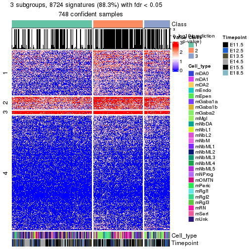</p>

</div>
<div id='tab-node-02-get-signatures-no-scale-3'>
<pre><code class="r">get_signatures(res, k = 4, scale_rows = FALSE)
</code></pre>

<p></p>

</div>
</div>


Compare the overlap of signatures from different k:

```r
compare_signatures(res)
```


`get_signature()` returns a data frame invisibly. To get the list of signatures, the function
call should be assigned to a variable explicitly. In following code, if `plot` argument is set
to `FALSE`, no heatmap is plotted while only the differential analysis is performed.

```r
# code only for demonstration
tb = get_signature(res, k = ..., plot = FALSE)
```

An example of the output of `tb` is:

```
#>   which_row         fdr    mean_1    mean_2 scaled_mean_1 scaled_mean_2 km
#> 1        38 0.042760348  8.373488  9.131774    -0.5533452     0.5164555  1
#> 2        40 0.018707592  7.106213  8.469186    -0.6173731     0.5762149  1
#> 3        55 0.019134737 10.221463 11.207825    -0.6159697     0.5749050  1
#> 4        59 0.006059896  5.921854  7.869574    -0.6899429     0.6439467  1
#> 5        60 0.018055526  8.928898 10.211722    -0.6204761     0.5791110  1
#> 6        98 0.009384629 15.714769 14.887706     0.6635654    -0.6193277  2
...
```

The columns in `tb` are:

1. `which_row`: row indices corresponding to the input matrix.
2. `fdr`: FDR for the differential test. 
3. `mean_x`: The mean value in group x.
4. `scaled_mean_x`: The mean value in group x after rows are scaled.
5. `km`: Row groups if k-means clustering is applied to rows (which is done by automatically selecting number of clusters).

If there are too many signatures, `top_signatures = ...` can be set to only show the 
signatures with the highest FDRs:

```r
# code only for demonstration
# e.g. to show the top 500 most significant rows
tb = get_signature(res, k = ..., top_signatures = 500)
```

If the signatures are defined as these which are uniquely high in current group, `diff_method` argument
can be set to `"uniquely_high_in_one_group"`:

```r
# code only for demonstration
tb = get_signature(res, k = ..., diff_method = "uniquely_high_in_one_group")
```


UMAP plot which shows how samples are separated.


<script>
$( function() {
	$( '#tabs-node-02-dimension-reduction' ).tabs();
} );
</script>
<div id='tabs-node-02-dimension-reduction'>
<ul>
<li><a href='#tab-node-02-dimension-reduction-1'>k = 2</a></li>
<li><a href='#tab-node-02-dimension-reduction-2'>k = 3</a></li>
<li><a href='#tab-node-02-dimension-reduction-3'>k = 4</a></li>
</ul>
<div id='tab-node-02-dimension-reduction-1'>
<pre><code class="r">dimension_reduction(res, k = 2, method = &quot;UMAP&quot;)
</code></pre>

<p></p>

</div>
<div id='tab-node-02-dimension-reduction-2'>
<pre><code class="r">dimension_reduction(res, k = 3, method = &quot;UMAP&quot;)
</code></pre>

<p></p>

</div>
<div id='tab-node-02-dimension-reduction-3'>
<pre><code class="r">dimension_reduction(res, k = 4, method = &quot;UMAP&quot;)
</code></pre>

<p></p>

</div>
</div>


Following heatmap shows how subgroups are split when increasing `k`:

```r
collect_classes(res)
```


Test correlation between subgroups and known annotations. If the known
annotation is numeric, one-way ANOVA test is applied, and if the known
annotation is discrete, chi-squared contingency table test is applied.

```r
test_to_known_factors(res)
```

```
#>             n_sample Cell_type(p-value) Timepoint(p-value) k
#> ATC:skmeans      431           2.48e-31           3.17e-03 2
#> ATC:skmeans      429           8.52e-19           3.43e-05 3
#> ATC:skmeans      368           8.46e-36           3.45e-24 4
```


If matrix rows can be associated to genes, consider to use `functional_enrichment(res,
...)` to perform function enrichment for the signature genes. See [this vignette](https://jokergoo.github.io/cola_vignettes/functional_enrichment.html) for more detailed explanations.


 

---------------------------------------------------


### Node022


Parent node: [Node02](#Node02).
Child nodes: 
                [Node0121](#Node0121)
        ,
                [Node0122](#Node0122)
        ,
                Node0123-leaf
        ,
                [Node0131](#Node0131)
        ,
                Node0132-leaf
        ,
                Node0133-leaf
        ,
                [Node0221](#Node0221)
        ,
                [Node0222](#Node0222)
        ,
                Node0231-leaf
        ,
                Node0232-leaf
        ,
                Node0233-leaf
        ,
                [Node0311](#Node0311)
        ,
                [Node0312](#Node0312)
        ,
                Node0321-leaf
        ,
                Node0322-leaf
        ,
                Node0323-leaf
        ,
                Node0324-leaf
        .


The object with results only for a single top-value method and a single partitioning method 
can be extracted as:

```r
res = res_rh["022"]
```

A summary of `res` and all the functions that can be applied to it:

```r
res
```

```
#> A 'ConsensusPartition' object with k = 2, 3, 4.
#>   On a matrix with 8454 rows and 238 columns.
#>   Top rows (845) are extracted by 'ATC' method.
#>   Subgroups are detected by 'skmeans' method.
#>   Performed in total 150 partitions by row resampling.
#>   Best k for subgroups seems to be 4.
#> 
#> Following methods can be applied to this 'ConsensusPartition' object:
#>  [1] "cola_report"             "collect_classes"         "collect_plots"          
#>  [4] "collect_stats"           "colnames"                "compare_partitions"     
#>  [7] "compare_signatures"      "consensus_heatmap"       "dimension_reduction"    
#> [10] "functional_enrichment"   "get_anno_col"            "get_anno"               
#> [13] "get_classes"             "get_consensus"           "get_matrix"             
#> [16] "get_membership"          "get_param"               "get_signatures"         
#> [19] "get_stats"               "is_best_k"               "is_stable_k"            
#> [22] "membership_heatmap"      "ncol"                    "nrow"                   
#> [25] "plot_ecdf"               "predict_classes"         "rownames"               
#> [28] "select_partition_number" "show"                    "suggest_best_k"         
#> [31] "test_to_known_factors"   "top_rows_heatmap"
```

`collect_plots()` function collects all the plots made from `res` for all `k` (number of subgroups)
into one single page to provide an easy and fast comparison between different `k`.

```r
collect_plots(res)
```


The plots are:

- The first row: a plot of the eCDF (empirical cumulative distribution
  function) curves of the consensus matrix for each `k` and the heatmap of
  predicted classes for each `k`.
- The second row: heatmaps of the consensus matrix for each `k`.
- The third row: heatmaps of the membership matrix for each `k`.
- The fouth row: heatmaps of the signatures for each `k`.

All the plots in panels can be made by individual functions and they are
plotted later in this section.

`select_partition_number()` produces several plots showing different
statistics for choosing "optimized" `k`. There are following statistics:

- eCDF curves of the consensus matrix for each `k`;
- 1-PAC. [The PAC score](https://en.wikipedia.org/wiki/Consensus_clustering#Over-interpretation_potential_of_consensus_clustering)
  measures the proportion of the ambiguous subgrouping.
- Mean silhouette score.
- Concordance. The mean probability of fiting the consensus subgroup labels in all
  partitions.
- Area increased. Denote $A_k$ as the area under the eCDF curve for current
  `k`, the area increased is defined as $A_k - A_{k-1}$.
- Rand index. The percent of pairs of samples that are both in a same cluster
  or both are not in a same cluster in the partition of k and k-1.
- Jaccard index. The ratio of pairs of samples are both in a same cluster in
  the partition of k and k-1 and the pairs of samples are both in a same
  cluster in the partition k or k-1.

The detailed explanations of these statistics can be found in [the _cola_
vignette](https://jokergoo.github.io/cola_vignettes/cola.html#toc_13).

Generally speaking, higher 1-PAC score, higher mean silhouette score or higher
concordance corresponds to better partition. Rand index and Jaccard index
measure how similar the current partition is compared to partition with `k-1`.
If they are too similar, we won't accept `k` is better than `k-1`.

```r
select_partition_number(res)
```


The numeric values for all these statistics can be obtained by `get_stats()`.

```r
get_stats(res)
```

```
#>   k 1-PAC mean_silhouette concordance area_increased  Rand Jaccard
#> 2 2 1.000           0.971       0.988          0.499 0.501   0.501
#> 3 3 0.973           0.940       0.972          0.269 0.818   0.653
#> 4 4 0.955           0.923       0.969          0.158 0.829   0.574
```

`suggest_best_k()` suggests the best $k$ based on these statistics. The rules are as follows:

- All $k$ with Jaccard index larger than 0.95 are removed because increasing
  $k$ does not provide enough extra information. If all $k$ are removed, it is
  marked as no subgroup is detected.
- For all $k$ with 1-PAC score larger than 0.9, the maximal $k$ is taken as
  the best $k$, and other $k$ are marked as optional $k$.
- If it does not fit the second rule. The $k$ with the maximal vote of the
  highest 1-PAC score, highest mean silhouette, and highest concordance is
  taken as the best $k$.

```r
suggest_best_k(res)
```

```
#> [1] 4
#> attr(,"optional")
#> [1] 2 3
```

There is also optional best $k$ = 2 3 that is worth to check.

Following is the table of the partitions (You need to click the **show/hide
code output** link to see it). The membership matrix (columns with name `p*`)
is inferred by
[`clue::cl_consensus()`](https://www.rdocumentation.org/link/cl_consensus?package=clue)
function with the `SE` method. Basically the value in the membership matrix
represents the probability to belong to a certain group. The finall subgroup
label for an item is determined with the group with highest probability it
belongs to.

In `get_classes()` function, the entropy is calculated from the membership
matrix and the silhouette score is calculated from the consensus matrix.


<script>
$( function() {
	$( '#tabs-node-022-get-classes' ).tabs();
} );
</script>
<div id='tabs-node-022-get-classes'>
<ul>
<li><a href='#tab-node-022-get-classes-1'>k = 2</a></li>
<li><a href='#tab-node-022-get-classes-2'>k = 3</a></li>
<li><a href='#tab-node-022-get-classes-3'>k = 4</a></li>
</ul>

<div id='tab-node-022-get-classes-1'>
<p><a id='tab-node-022-get-classes-1-a' style='color:#0366d6' href='#'>show/hide code output</a></p>
<pre><code class="r">cbind(get_classes(res, k = 2), get_membership(res, k = 2))
</code></pre>

<pre><code>#&gt;                class entropy silhouette   p1   p2
#&gt; 1772075300_C04     2   0.000     0.9911 0.00 1.00
#&gt; 1772075301_B03     1   0.925     0.4957 0.66 0.34
#&gt; 1772096112_F05     2   0.000     0.9911 0.00 1.00
#&gt; 1772092006_A05     1   0.000     0.9841 1.00 0.00
#&gt; 1772071048_C05     2   0.000     0.9911 0.00 1.00
#&gt; 1772072249_F03     1   0.000     0.9841 1.00 0.00
#&gt; 1772072249_C02     1   0.000     0.9841 1.00 0.00
#&gt; 1772072246_D07     2   0.000     0.9911 0.00 1.00
#&gt; 1772075301_D06     1   0.000     0.9841 1.00 0.00
#&gt; 1772066087_E02     1   0.000     0.9841 1.00 0.00
#&gt; 1772072246_C05     1   0.634     0.8110 0.84 0.16
#&gt; 1772066084_E02     2   0.000     0.9911 0.00 1.00
#&gt; 1772092007_B02     1   0.000     0.9841 1.00 0.00
#&gt; 1772092006_H04     2   0.000     0.9911 0.00 1.00
#&gt; 1772094169_C12     2   0.000     0.9911 0.00 1.00
#&gt; 1772094166_F07     2   0.000     0.9911 0.00 1.00
#&gt; 1772094166_E06     2   0.000     0.9911 0.00 1.00
#&gt; 1772096112_E01     2   0.000     0.9911 0.00 1.00
#&gt; 1772094146_F02     2   0.000     0.9911 0.00 1.00
#&gt; 1772072246_C04     1   0.995     0.1575 0.54 0.46
#&gt; 1772066084_D08     2   0.000     0.9911 0.00 1.00
#&gt; 1772066084_H07     2   0.000     0.9911 0.00 1.00
#&gt; 1772072246_F06     1   0.000     0.9841 1.00 0.00
#&gt; 1772092007_D12     2   0.000     0.9911 0.00 1.00
#&gt; 1772092007_B01     2   0.000     0.9911 0.00 1.00
#&gt; 1772071049_A02     2   0.000     0.9911 0.00 1.00
#&gt; 1772066084_D09     2   0.000     0.9911 0.00 1.00
#&gt; 1772066087_G03     1   0.000     0.9841 1.00 0.00
#&gt; 1772066085_H12     2   0.000     0.9911 0.00 1.00
#&gt; 1772075300_B03     1   0.000     0.9841 1.00 0.00
#&gt; 1772066085_D02     2   0.000     0.9911 0.00 1.00
#&gt; 1772066084_A12     1   0.000     0.9841 1.00 0.00
#&gt; 1772071048_B03     2   0.000     0.9911 0.00 1.00
#&gt; 1772071046_H06     2   0.000     0.9911 0.00 1.00
#&gt; 1772066084_B03     2   0.000     0.9911 0.00 1.00
#&gt; 1772096112_D06     2   0.000     0.9911 0.00 1.00
#&gt; 1772096112_B04     2   0.000     0.9911 0.00 1.00
#&gt; 1772071046_B12     2   0.000     0.9911 0.00 1.00
#&gt; 1772066084_F08     2   0.000     0.9911 0.00 1.00
#&gt; 1772092006_C04     1   0.000     0.9841 1.00 0.00
#&gt; 1772092006_A03     2   0.469     0.8867 0.10 0.90
#&gt; 1772092007_E09     2   0.000     0.9911 0.00 1.00
#&gt; 1772092007_H07     2   0.000     0.9911 0.00 1.00
#&gt; 1772094171_A07     1   0.000     0.9841 1.00 0.00
#&gt; 1772096114_F01     1   0.827     0.6547 0.74 0.26
#&gt; 1772071049_G09     2   0.000     0.9911 0.00 1.00
#&gt; 1772096112_D08     2   0.000     0.9911 0.00 1.00
#&gt; 1772094166_C06     2   0.000     0.9911 0.00 1.00
#&gt; 1772075302_E01     2   0.000     0.9911 0.00 1.00
#&gt; 1772096115_E06     2   0.000     0.9911 0.00 1.00
#&gt; 1772096114_D09     2   0.000     0.9911 0.00 1.00
#&gt; 1772094166_H06     2   0.000     0.9911 0.00 1.00
#&gt; 1772075302_C04     2   0.000     0.9911 0.00 1.00
#&gt; 1772075302_A03     2   0.000     0.9911 0.00 1.00
#&gt; 1772096112_B11     2   0.000     0.9911 0.00 1.00
#&gt; 1772071049_D08     2   0.000     0.9911 0.00 1.00
#&gt; 1772075302_E11     1   0.000     0.9841 1.00 0.00
#&gt; 1772094166_G03     2   0.000     0.9911 0.00 1.00
#&gt; 1772094166_B11     2   0.000     0.9911 0.00 1.00
#&gt; 1772071049_E01     2   0.000     0.9911 0.00 1.00
#&gt; 1772094156_B07     2   0.000     0.9911 0.00 1.00
#&gt; 1772096112_H12     2   0.000     0.9911 0.00 1.00
#&gt; 1772096114_H04     2   0.000     0.9911 0.00 1.00
#&gt; 1772094166_G04     2   0.000     0.9911 0.00 1.00
#&gt; 1772092007_D09     2   0.000     0.9911 0.00 1.00
#&gt; 1772071046_B04     2   0.000     0.9911 0.00 1.00
#&gt; 1772075302_H12     2   0.000     0.9911 0.00 1.00
#&gt; 1772075302_C11     2   0.000     0.9911 0.00 1.00
#&gt; 1772094166_G06     2   0.000     0.9911 0.00 1.00
#&gt; 1772071065_G06     2   0.000     0.9911 0.00 1.00
#&gt; 1772066084_G02     1   0.000     0.9841 1.00 0.00
#&gt; 1772066085_B04     1   0.000     0.9841 1.00 0.00
#&gt; 1772072246_A08     1   0.000     0.9841 1.00 0.00
#&gt; 1772066087_H03     1   0.000     0.9841 1.00 0.00
#&gt; 1772075301_D02     1   0.000     0.9841 1.00 0.00
#&gt; 1772072246_D05     1   0.000     0.9841 1.00 0.00
#&gt; 1772066087_B02     1   0.000     0.9841 1.00 0.00
#&gt; 1772066084_A02     2   0.000     0.9911 0.00 1.00
#&gt; 1772071046_D05     1   0.000     0.9841 1.00 0.00
#&gt; 1772072246_B10     1   0.000     0.9841 1.00 0.00
#&gt; 1772066087_G07     1   0.000     0.9841 1.00 0.00
#&gt; 1772075301_E12     1   0.000     0.9841 1.00 0.00
#&gt; 1772071046_G04     1   0.000     0.9841 1.00 0.00
#&gt; 1772075302_G02     2   0.000     0.9911 0.00 1.00
#&gt; 1772075302_F03     1   0.000     0.9841 1.00 0.00
#&gt; 1772096114_B09     2   0.000     0.9911 0.00 1.00
#&gt; 1772071065_G05     2   0.000     0.9911 0.00 1.00
#&gt; 1772066084_F02     1   0.141     0.9664 0.98 0.02
#&gt; 1772066087_H07     2   0.999     0.0595 0.48 0.52
#&gt; 1772066084_F06     2   0.141     0.9727 0.02 0.98
#&gt; 1772071046_C10     2   0.000     0.9911 0.00 1.00
#&gt; 1772071046_C01     1   0.000     0.9841 1.00 0.00
#&gt; 1772094173_C01     1   0.000     0.9841 1.00 0.00
#&gt; 1772075301_C07     1   0.000     0.9841 1.00 0.00
#&gt; 1772071048_B12     1   0.000     0.9841 1.00 0.00
#&gt; 1772072248_B07     2   0.469     0.8861 0.10 0.90
#&gt; 1772094173_C03     2   0.000     0.9911 0.00 1.00
#&gt; 1772094166_H12     2   0.000     0.9911 0.00 1.00
#&gt; 1772066084_B11     2   0.000     0.9911 0.00 1.00
#&gt; 1772066087_F02     1   0.000     0.9841 1.00 0.00
#&gt; 1772066087_A12     1   0.402     0.9075 0.92 0.08
#&gt; 1772066087_D09     1   0.402     0.9079 0.92 0.08
#&gt; 1772071048_G06     2   0.000     0.9911 0.00 1.00
#&gt; 1772066087_G12     2   0.000     0.9911 0.00 1.00
#&gt; 1772094172_C05     2   0.000     0.9911 0.00 1.00
#&gt; 1772072246_G04     1   0.000     0.9841 1.00 0.00
#&gt; 1772094175_F01     2   0.000     0.9911 0.00 1.00
#&gt; 1772066087_A11     2   0.000     0.9911 0.00 1.00
#&gt; 1772094175_C04     2   0.000     0.9911 0.00 1.00
#&gt; 1772071046_D11     2   0.000     0.9911 0.00 1.00
#&gt; 1772066085_H10     2   0.000     0.9911 0.00 1.00
#&gt; 1772094173_C04     2   0.000     0.9911 0.00 1.00
#&gt; 1772066087_E07     2   0.000     0.9911 0.00 1.00
#&gt; 1772075302_H03     1   0.000     0.9841 1.00 0.00
#&gt; 1772071050_F02     1   0.000     0.9841 1.00 0.00
#&gt; 1772071065_C02     2   0.000     0.9911 0.00 1.00
#&gt; 1772075302_E02     1   0.634     0.8108 0.84 0.16
#&gt; 1772075301_E07     1   0.000     0.9841 1.00 0.00
#&gt; 1772075301_E03     1   0.000     0.9841 1.00 0.00
#&gt; 1772075300_F08     1   0.000     0.9841 1.00 0.00
#&gt; 1772072246_B03     1   0.000     0.9841 1.00 0.00
#&gt; 1772075300_B06     1   0.000     0.9841 1.00 0.00
#&gt; 1772071046_C07     1   0.000     0.9841 1.00 0.00
#&gt; 1772096115_B03     1   0.000     0.9841 1.00 0.00
#&gt; 1772096112_E11     2   0.000     0.9911 0.00 1.00
#&gt; 1772096115_C09     2   0.000     0.9911 0.00 1.00
#&gt; 1772092006_A06     2   0.000     0.9911 0.00 1.00
#&gt; 1772092006_B03     1   0.000     0.9841 1.00 0.00
#&gt; 1772092007_B11     2   0.000     0.9911 0.00 1.00
#&gt; 1772096111_G04     2   0.000     0.9911 0.00 1.00
#&gt; 1772071049_H01     1   0.000     0.9841 1.00 0.00
#&gt; 1772096115_A01     2   0.000     0.9911 0.00 1.00
#&gt; 1772094163_A02     1   0.000     0.9841 1.00 0.00
#&gt; 1772071048_E03     2   0.000     0.9911 0.00 1.00
#&gt; 1772071048_B06     1   0.000     0.9841 1.00 0.00
#&gt; 1772094173_A01     1   0.000     0.9841 1.00 0.00
#&gt; 1772075301_A03     1   0.000     0.9841 1.00 0.00
#&gt; 1772092006_H06     2   0.000     0.9911 0.00 1.00
#&gt; 1772092006_B07     2   0.000     0.9911 0.00 1.00
#&gt; 1772094156_E04     2   0.000     0.9911 0.00 1.00
#&gt; 1772071065_H07     2   0.000     0.9911 0.00 1.00
#&gt; 1772092007_B06     2   0.000     0.9911 0.00 1.00
#&gt; 1772092006_G09     2   0.000     0.9911 0.00 1.00
#&gt; 1772075302_E06     1   0.000     0.9841 1.00 0.00
#&gt; 1772096112_C03     2   0.000     0.9911 0.00 1.00
#&gt; 1772092007_E07     2   0.000     0.9911 0.00 1.00
#&gt; 1772094163_C07     2   0.000     0.9911 0.00 1.00
#&gt; 1772092007_A07     2   0.000     0.9911 0.00 1.00
#&gt; 1772096112_E07     2   0.000     0.9911 0.00 1.00
#&gt; 1772071065_C08     2   0.141     0.9727 0.02 0.98
#&gt; 1772071065_B06     2   0.000     0.9911 0.00 1.00
#&gt; 1772075303_A08     2   0.000     0.9911 0.00 1.00
#&gt; 1772071049_G04     2   0.000     0.9911 0.00 1.00
#&gt; 1772071065_H09     2   0.000     0.9911 0.00 1.00
#&gt; 1772075302_E12     2   0.000     0.9911 0.00 1.00
#&gt; 1772096114_A12     2   0.000     0.9911 0.00 1.00
#&gt; 1772075300_A03     1   0.000     0.9841 1.00 0.00
#&gt; 1772075302_B07     2   0.000     0.9911 0.00 1.00
#&gt; 1772075302_H08     2   0.000     0.9911 0.00 1.00
#&gt; 1772075303_E07     1   0.000     0.9841 1.00 0.00
#&gt; 1772071065_F06     2   0.000     0.9911 0.00 1.00
#&gt; 1772094166_G05     2   0.000     0.9911 0.00 1.00
#&gt; 1772096114_G02     2   0.000     0.9911 0.00 1.00
#&gt; 1772096115_A11     1   0.000     0.9841 1.00 0.00
#&gt; 1772075303_C12     2   0.000     0.9911 0.00 1.00
#&gt; 1772075303_H07     2   0.000     0.9911 0.00 1.00
#&gt; 1772094173_D07     2   0.000     0.9911 0.00 1.00
#&gt; 1772066087_B09     1   0.327     0.9286 0.94 0.06
#&gt; 1772096115_E04     2   0.000     0.9911 0.00 1.00
#&gt; 1772075302_E04     1   0.402     0.9084 0.92 0.08
#&gt; 1772075302_F01     2   0.000     0.9911 0.00 1.00
#&gt; 1772092007_F05     2   0.000     0.9911 0.00 1.00
#&gt; 1772096112_E02     2   0.000     0.9911 0.00 1.00
#&gt; 1772071048_A01     2   0.760     0.7162 0.22 0.78
#&gt; 1772096112_D01     1   0.000     0.9841 1.00 0.00
#&gt; 1772096114_E02     2   0.141     0.9727 0.02 0.98
#&gt; 1772075302_B04     2   0.000     0.9911 0.00 1.00
#&gt; 1772075301_C08     2   0.141     0.9727 0.02 0.98
#&gt; 1772066084_H01     2   0.000     0.9911 0.00 1.00
#&gt; 1772075300_D06     2   0.000     0.9911 0.00 1.00
#&gt; 1772066087_H11     2   0.000     0.9911 0.00 1.00
#&gt; 1772096114_E04     2   0.000     0.9911 0.00 1.00
#&gt; 1772071065_D03     2   0.000     0.9911 0.00 1.00
#&gt; 1772066084_H03     1   0.000     0.9841 1.00 0.00
#&gt; 1772096114_A11     2   0.000     0.9911 0.00 1.00
#&gt; 1772075300_A07     1   0.000     0.9841 1.00 0.00
#&gt; 1772071046_G12     1   0.000     0.9841 1.00 0.00
#&gt; 1772066087_D01     1   0.000     0.9841 1.00 0.00
#&gt; 1772075301_F12     1   0.000     0.9841 1.00 0.00
#&gt; 1772075301_A11     1   0.000     0.9841 1.00 0.00
#&gt; 1772072246_F08     1   0.000     0.9841 1.00 0.00
#&gt; 1772066084_E08     1   0.000     0.9841 1.00 0.00
#&gt; 1772066084_F03     1   0.000     0.9841 1.00 0.00
#&gt; 1772066085_B02     1   0.000     0.9841 1.00 0.00
#&gt; 1772066084_C07     1   0.000     0.9841 1.00 0.00
#&gt; 1772066084_G07     1   0.000     0.9841 1.00 0.00
#&gt; 1772075301_F01     1   0.000     0.9841 1.00 0.00
#&gt; 1772071046_D12     1   0.000     0.9841 1.00 0.00
#&gt; 1772071046_G06     2   0.402     0.9103 0.08 0.92
#&gt; 1772075301_D05     1   0.000     0.9841 1.00 0.00
#&gt; 1772096112_B02     1   0.000     0.9841 1.00 0.00
#&gt; 1772072246_D01     1   0.000     0.9841 1.00 0.00
#&gt; 1772072246_G05     1   0.000     0.9841 1.00 0.00
#&gt; 1772066084_B09     1   0.000     0.9841 1.00 0.00
#&gt; 1772071065_A06     2   0.000     0.9911 0.00 1.00
#&gt; 1772071046_D10     1   0.000     0.9841 1.00 0.00
#&gt; 1772075300_E01     1   0.000     0.9841 1.00 0.00
#&gt; 1772075301_B10     1   0.000     0.9841 1.00 0.00
#&gt; 1772075301_A08     1   0.000     0.9841 1.00 0.00
#&gt; 1772071046_E06     2   0.000     0.9911 0.00 1.00
#&gt; 1772075301_G10     1   0.000     0.9841 1.00 0.00
#&gt; 1772094172_C02     1   0.000     0.9841 1.00 0.00
#&gt; 1772094173_C11     1   0.000     0.9841 1.00 0.00
#&gt; 1772075300_A09     1   0.000     0.9841 1.00 0.00
#&gt; 1772075301_D08     1   0.000     0.9841 1.00 0.00
#&gt; 1772075301_A07     1   0.000     0.9841 1.00 0.00
#&gt; 1772071046_G05     2   0.000     0.9911 0.00 1.00
#&gt; 1772075301_F05     1   0.000     0.9841 1.00 0.00
#&gt; 1772075301_D11     2   0.327     0.9319 0.06 0.94
#&gt; 1772071046_E04     1   0.000     0.9841 1.00 0.00
#&gt; 1772075301_E05     1   0.000     0.9841 1.00 0.00
#&gt; 1772075301_E04     2   0.000     0.9911 0.00 1.00
#&gt; 1772071048_D11     1   0.000     0.9841 1.00 0.00
#&gt; 1772071048_A08     2   0.000     0.9911 0.00 1.00
#&gt; 1772071050_G09     1   0.000     0.9841 1.00 0.00
#&gt; 1772066087_C04     1   0.000     0.9841 1.00 0.00
#&gt; 1772066085_C07     1   0.000     0.9841 1.00 0.00
#&gt; 1772075301_E11     1   0.000     0.9841 1.00 0.00
#&gt; 1772075301_F02     1   0.000     0.9841 1.00 0.00
#&gt; 1772075301_A06     1   0.000     0.9841 1.00 0.00
#&gt; 1772075301_A05     1   0.000     0.9841 1.00 0.00
#&gt; 1772075301_B01     1   0.000     0.9841 1.00 0.00
#&gt; 1772075301_G02     1   0.000     0.9841 1.00 0.00
#&gt; 1772075301_F07     1   0.000     0.9841 1.00 0.00
#&gt; 1772075301_G09     1   0.000     0.9841 1.00 0.00
#&gt; 1772075301_G11     1   0.000     0.9841 1.00 0.00
#&gt; 1772075300_D07     1   0.000     0.9841 1.00 0.00
#&gt; 1772066087_D02     1   0.000     0.9841 1.00 0.00
</code></pre>

<script>
$('#tab-node-022-get-classes-1-a').parent().next().next().hide();
$('#tab-node-022-get-classes-1-a').click(function(){
  $('#tab-node-022-get-classes-1-a').parent().next().next().toggle();
  return(false);
});
</script>
</div>

<div id='tab-node-022-get-classes-2'>
<p><a id='tab-node-022-get-classes-2-a' style='color:#0366d6' href='#'>show/hide code output</a></p>
<pre><code class="r">cbind(get_classes(res, k = 3), get_membership(res, k = 3))
</code></pre>

<pre><code>#&gt;                class entropy silhouette   p1   p2   p3
#&gt; 1772075300_C04     3  0.0892     0.9416 0.00 0.02 0.98
#&gt; 1772075301_B03     3  0.0892     0.9272 0.00 0.02 0.98
#&gt; 1772096112_F05     3  0.5706     0.5803 0.00 0.32 0.68
#&gt; 1772092006_A05     3  0.0892     0.9341 0.02 0.00 0.98
#&gt; 1772071048_C05     3  0.0892     0.9416 0.00 0.02 0.98
#&gt; 1772072249_F03     3  0.0892     0.9341 0.02 0.00 0.98
#&gt; 1772072249_C02     3  0.2537     0.8830 0.08 0.00 0.92
#&gt; 1772072246_D07     3  0.0892     0.9416 0.00 0.02 0.98
#&gt; 1772075301_D06     1  0.1529     0.9346 0.96 0.00 0.04
#&gt; 1772066087_E02     3  0.2066     0.9032 0.06 0.00 0.94
#&gt; 1772072246_C05     3  0.0892     0.9341 0.02 0.00 0.98
#&gt; 1772066084_E02     3  0.0892     0.9416 0.00 0.02 0.98
#&gt; 1772092007_B02     3  0.0892     0.9341 0.02 0.00 0.98
#&gt; 1772092006_H04     3  0.6280     0.2359 0.00 0.46 0.54
#&gt; 1772094169_C12     3  0.0892     0.9416 0.00 0.02 0.98
#&gt; 1772094166_F07     3  0.0892     0.9416 0.00 0.02 0.98
#&gt; 1772094166_E06     3  0.0892     0.9416 0.00 0.02 0.98
#&gt; 1772096112_E01     3  0.0892     0.9416 0.00 0.02 0.98
#&gt; 1772094146_F02     3  0.0892     0.9416 0.00 0.02 0.98
#&gt; 1772072246_C04     3  0.0000     0.9333 0.00 0.00 1.00
#&gt; 1772066084_D08     3  0.0892     0.9416 0.00 0.02 0.98
#&gt; 1772066084_H07     3  0.0000     0.9333 0.00 0.00 1.00
#&gt; 1772072246_F06     3  0.0892     0.9341 0.02 0.00 0.98
#&gt; 1772092007_D12     3  0.0892     0.9416 0.00 0.02 0.98
#&gt; 1772092007_B01     3  0.0892     0.9416 0.00 0.02 0.98
#&gt; 1772071049_A02     3  0.0892     0.9416 0.00 0.02 0.98
#&gt; 1772066084_D09     3  0.0892     0.9416 0.00 0.02 0.98
#&gt; 1772066087_G03     3  0.0892     0.9341 0.02 0.00 0.98
#&gt; 1772066085_H12     3  0.0892     0.9416 0.00 0.02 0.98
#&gt; 1772075300_B03     3  0.0892     0.9341 0.02 0.00 0.98
#&gt; 1772066085_D02     3  0.0000     0.9333 0.00 0.00 1.00
#&gt; 1772066084_A12     3  0.0892     0.9341 0.02 0.00 0.98
#&gt; 1772071048_B03     3  0.0892     0.9416 0.00 0.02 0.98
#&gt; 1772071046_H06     3  0.0892     0.9416 0.00 0.02 0.98
#&gt; 1772066084_B03     3  0.0892     0.9416 0.00 0.02 0.98
#&gt; 1772096112_D06     3  0.0892     0.9416 0.00 0.02 0.98
#&gt; 1772096112_B04     3  0.0892     0.9416 0.00 0.02 0.98
#&gt; 1772071046_B12     3  0.0000     0.9333 0.00 0.00 1.00
#&gt; 1772066084_F08     3  0.0892     0.9416 0.00 0.02 0.98
#&gt; 1772092006_C04     1  0.0000     0.9666 1.00 0.00 0.00
#&gt; 1772092006_A03     2  0.0892     0.9698 0.02 0.98 0.00
#&gt; 1772092007_E09     2  0.0000     0.9870 0.00 1.00 0.00
#&gt; 1772092007_H07     2  0.0000     0.9870 0.00 1.00 0.00
#&gt; 1772094171_A07     1  0.0000     0.9666 1.00 0.00 0.00
#&gt; 1772096114_F01     2  0.4209     0.8360 0.12 0.86 0.02
#&gt; 1772071049_G09     2  0.0000     0.9870 0.00 1.00 0.00
#&gt; 1772096112_D08     2  0.0000     0.9870 0.00 1.00 0.00
#&gt; 1772094166_C06     2  0.0000     0.9870 0.00 1.00 0.00
#&gt; 1772075302_E01     2  0.0000     0.9870 0.00 1.00 0.00
#&gt; 1772096115_E06     2  0.0000     0.9870 0.00 1.00 0.00
#&gt; 1772096114_D09     2  0.0000     0.9870 0.00 1.00 0.00
#&gt; 1772094166_H06     2  0.0000     0.9870 0.00 1.00 0.00
#&gt; 1772075302_C04     2  0.0000     0.9870 0.00 1.00 0.00
#&gt; 1772075302_A03     2  0.0000     0.9870 0.00 1.00 0.00
#&gt; 1772096112_B11     2  0.0000     0.9870 0.00 1.00 0.00
#&gt; 1772071049_D08     2  0.0000     0.9870 0.00 1.00 0.00
#&gt; 1772075302_E11     1  0.0000     0.9666 1.00 0.00 0.00
#&gt; 1772094166_G03     2  0.0000     0.9870 0.00 1.00 0.00
#&gt; 1772094166_B11     2  0.0000     0.9870 0.00 1.00 0.00
#&gt; 1772071049_E01     2  0.0000     0.9870 0.00 1.00 0.00
#&gt; 1772094156_B07     2  0.0000     0.9870 0.00 1.00 0.00
#&gt; 1772096112_H12     2  0.0000     0.9870 0.00 1.00 0.00
#&gt; 1772096114_H04     2  0.0000     0.9870 0.00 1.00 0.00
#&gt; 1772094166_G04     2  0.0000     0.9870 0.00 1.00 0.00
#&gt; 1772092007_D09     2  0.0000     0.9870 0.00 1.00 0.00
#&gt; 1772071046_B04     2  0.0892     0.9780 0.00 0.98 0.02
#&gt; 1772075302_H12     2  0.0000     0.9870 0.00 1.00 0.00
#&gt; 1772075302_C11     2  0.0000     0.9870 0.00 1.00 0.00
#&gt; 1772094166_G06     2  0.0000     0.9870 0.00 1.00 0.00
#&gt; 1772071065_G06     2  0.0000     0.9870 0.00 1.00 0.00
#&gt; 1772066084_G02     1  0.0000     0.9666 1.00 0.00 0.00
#&gt; 1772066085_B04     1  0.0000     0.9666 1.00 0.00 0.00
#&gt; 1772072246_A08     1  0.0000     0.9666 1.00 0.00 0.00
#&gt; 1772066087_H03     1  0.0000     0.9666 1.00 0.00 0.00
#&gt; 1772075301_D02     1  0.0000     0.9666 1.00 0.00 0.00
#&gt; 1772072246_D05     1  0.0892     0.9550 0.98 0.00 0.02
#&gt; 1772066087_B02     1  0.0000     0.9666 1.00 0.00 0.00
#&gt; 1772066084_A02     2  0.0892     0.9780 0.00 0.98 0.02
#&gt; 1772071046_D05     1  0.0892     0.9550 0.98 0.00 0.02
#&gt; 1772072246_B10     1  0.0000     0.9666 1.00 0.00 0.00
#&gt; 1772066087_G07     1  0.0000     0.9666 1.00 0.00 0.00
#&gt; 1772075301_E12     1  0.0000     0.9666 1.00 0.00 0.00
#&gt; 1772071046_G04     1  0.0000     0.9666 1.00 0.00 0.00
#&gt; 1772075302_G02     2  0.0000     0.9870 0.00 1.00 0.00
#&gt; 1772075302_F03     1  0.0892     0.9503 0.98 0.02 0.00
#&gt; 1772096114_B09     2  0.0000     0.9870 0.00 1.00 0.00
#&gt; 1772071065_G05     2  0.0000     0.9870 0.00 1.00 0.00
#&gt; 1772066084_F02     3  0.0892     0.9257 0.02 0.00 0.98
#&gt; 1772066087_H07     2  0.3415     0.8903 0.08 0.90 0.02
#&gt; 1772066084_F06     2  0.1781     0.9610 0.02 0.96 0.02
#&gt; 1772071046_C10     2  0.0892     0.9780 0.00 0.98 0.02
#&gt; 1772071046_C01     1  0.0000     0.9666 1.00 0.00 0.00
#&gt; 1772094173_C01     1  0.0000     0.9666 1.00 0.00 0.00
#&gt; 1772075301_C07     1  0.0000     0.9666 1.00 0.00 0.00
#&gt; 1772071048_B12     1  0.0000     0.9666 1.00 0.00 0.00
#&gt; 1772072248_B07     2  0.1781     0.9613 0.02 0.96 0.02
#&gt; 1772094173_C03     2  0.0892     0.9780 0.00 0.98 0.02
#&gt; 1772094166_H12     2  0.0000     0.9870 0.00 1.00 0.00
#&gt; 1772066084_B11     2  0.0892     0.9780 0.00 0.98 0.02
#&gt; 1772066087_F02     1  0.4209     0.8219 0.86 0.12 0.02
#&gt; 1772066087_A12     1  0.2414     0.9178 0.94 0.04 0.02
#&gt; 1772066087_D09     1  0.7074     0.0505 0.50 0.48 0.02
#&gt; 1772071048_G06     2  0.0892     0.9780 0.00 0.98 0.02
#&gt; 1772066087_G12     2  0.0892     0.9780 0.00 0.98 0.02
#&gt; 1772094172_C05     2  0.0892     0.9780 0.00 0.98 0.02
#&gt; 1772072246_G04     1  0.3340     0.8482 0.88 0.00 0.12
#&gt; 1772094175_F01     2  0.0892     0.9780 0.00 0.98 0.02
#&gt; 1772066087_A11     2  0.0892     0.9780 0.00 0.98 0.02
#&gt; 1772094175_C04     2  0.0000     0.9870 0.00 1.00 0.00
#&gt; 1772071046_D11     2  0.0892     0.9780 0.00 0.98 0.02
#&gt; 1772066085_H10     2  0.0892     0.9780 0.00 0.98 0.02
#&gt; 1772094173_C04     2  0.0892     0.9780 0.00 0.98 0.02
#&gt; 1772066087_E07     2  0.0892     0.9780 0.00 0.98 0.02
#&gt; 1772075302_H03     1  0.2066     0.9089 0.94 0.06 0.00
#&gt; 1772071050_F02     1  0.0000     0.9666 1.00 0.00 0.00
#&gt; 1772071065_C02     2  0.0000     0.9870 0.00 1.00 0.00
#&gt; 1772075302_E02     1  0.6192     0.2892 0.58 0.42 0.00
#&gt; 1772075301_E07     1  0.0000     0.9666 1.00 0.00 0.00
#&gt; 1772075301_E03     1  0.0000     0.9666 1.00 0.00 0.00
#&gt; 1772075300_F08     1  0.0000     0.9666 1.00 0.00 0.00
#&gt; 1772072246_B03     1  0.0000     0.9666 1.00 0.00 0.00
#&gt; 1772075300_B06     1  0.0000     0.9666 1.00 0.00 0.00
#&gt; 1772071046_C07     1  0.0000     0.9666 1.00 0.00 0.00
#&gt; 1772096115_B03     1  0.0000     0.9666 1.00 0.00 0.00
#&gt; 1772096112_E11     2  0.0892     0.9780 0.00 0.98 0.02
#&gt; 1772096115_C09     2  0.0000     0.9870 0.00 1.00 0.00
#&gt; 1772092006_A06     2  0.0000     0.9870 0.00 1.00 0.00
#&gt; 1772092006_B03     1  0.0000     0.9666 1.00 0.00 0.00
#&gt; 1772092007_B11     2  0.0000     0.9870 0.00 1.00 0.00
#&gt; 1772096111_G04     2  0.0000     0.9870 0.00 1.00 0.00
#&gt; 1772071049_H01     1  0.0000     0.9666 1.00 0.00 0.00
#&gt; 1772096115_A01     2  0.0892     0.9780 0.00 0.98 0.02
#&gt; 1772094163_A02     1  0.0000     0.9666 1.00 0.00 0.00
#&gt; 1772071048_E03     2  0.0892     0.9780 0.00 0.98 0.02
#&gt; 1772071048_B06     1  0.0892     0.9550 0.98 0.00 0.02
#&gt; 1772094173_A01     1  0.0892     0.9550 0.98 0.00 0.02
#&gt; 1772075301_A03     1  0.0000     0.9666 1.00 0.00 0.00
#&gt; 1772092006_H06     2  0.0000     0.9870 0.00 1.00 0.00
#&gt; 1772092006_B07     2  0.0000     0.9870 0.00 1.00 0.00
#&gt; 1772094156_E04     2  0.0000     0.9870 0.00 1.00 0.00
#&gt; 1772071065_H07     2  0.0000     0.9870 0.00 1.00 0.00
#&gt; 1772092007_B06     3  0.5706     0.5792 0.00 0.32 0.68
#&gt; 1772092006_G09     2  0.0000     0.9870 0.00 1.00 0.00
#&gt; 1772075302_E06     1  0.0000     0.9666 1.00 0.00 0.00
#&gt; 1772096112_C03     2  0.0000     0.9870 0.00 1.00 0.00
#&gt; 1772092007_E07     2  0.0000     0.9870 0.00 1.00 0.00
#&gt; 1772094163_C07     3  0.6280     0.2322 0.00 0.46 0.54
#&gt; 1772092007_A07     2  0.0000     0.9870 0.00 1.00 0.00
#&gt; 1772096112_E07     2  0.0000     0.9870 0.00 1.00 0.00
#&gt; 1772071065_C08     2  0.0000     0.9870 0.00 1.00 0.00
#&gt; 1772071065_B06     2  0.0000     0.9870 0.00 1.00 0.00
#&gt; 1772075303_A08     2  0.0000     0.9870 0.00 1.00 0.00
#&gt; 1772071049_G04     2  0.0000     0.9870 0.00 1.00 0.00
#&gt; 1772071065_H09     2  0.0000     0.9870 0.00 1.00 0.00
#&gt; 1772075302_E12     2  0.0000     0.9870 0.00 1.00 0.00
#&gt; 1772096114_A12     2  0.0000     0.9870 0.00 1.00 0.00
#&gt; 1772075300_A03     1  0.0000     0.9666 1.00 0.00 0.00
#&gt; 1772075302_B07     2  0.0000     0.9870 0.00 1.00 0.00
#&gt; 1772075302_H08     2  0.0000     0.9870 0.00 1.00 0.00
#&gt; 1772075303_E07     1  0.0000     0.9666 1.00 0.00 0.00
#&gt; 1772071065_F06     2  0.0000     0.9870 0.00 1.00 0.00
#&gt; 1772094166_G05     2  0.0000     0.9870 0.00 1.00 0.00
#&gt; 1772096114_G02     2  0.0000     0.9870 0.00 1.00 0.00
#&gt; 1772096115_A11     1  0.1529     0.9305 0.96 0.04 0.00
#&gt; 1772075303_C12     2  0.0000     0.9870 0.00 1.00 0.00
#&gt; 1772075303_H07     2  0.0000     0.9870 0.00 1.00 0.00
#&gt; 1772094173_D07     2  0.0892     0.9780 0.00 0.98 0.02
#&gt; 1772066087_B09     1  0.6387     0.5552 0.68 0.30 0.02
#&gt; 1772096115_E04     2  0.0000     0.9870 0.00 1.00 0.00
#&gt; 1772075302_E04     2  0.3686     0.8176 0.14 0.86 0.00
#&gt; 1772075302_F01     2  0.0000     0.9870 0.00 1.00 0.00
#&gt; 1772092007_F05     2  0.0000     0.9870 0.00 1.00 0.00
#&gt; 1772096112_E02     2  0.0000     0.9870 0.00 1.00 0.00
#&gt; 1772071048_A01     2  0.4209     0.8359 0.12 0.86 0.02
#&gt; 1772096112_D01     3  0.0892     0.9341 0.02 0.00 0.98
#&gt; 1772096114_E02     2  0.0000     0.9870 0.00 1.00 0.00
#&gt; 1772075302_B04     2  0.0000     0.9870 0.00 1.00 0.00
#&gt; 1772075301_C08     3  0.5948     0.4987 0.00 0.36 0.64
#&gt; 1772066084_H01     2  0.0892     0.9780 0.00 0.98 0.02
#&gt; 1772075300_D06     2  0.0000     0.9870 0.00 1.00 0.00
#&gt; 1772066087_H11     2  0.0892     0.9780 0.00 0.98 0.02
#&gt; 1772096114_E04     2  0.0000     0.9870 0.00 1.00 0.00
#&gt; 1772071065_D03     2  0.0000     0.9870 0.00 1.00 0.00
#&gt; 1772066084_H03     1  0.3832     0.8481 0.88 0.10 0.02
#&gt; 1772096114_A11     2  0.0000     0.9870 0.00 1.00 0.00
#&gt; 1772075300_A07     1  0.0000     0.9666 1.00 0.00 0.00
#&gt; 1772071046_G12     1  0.0892     0.9550 0.98 0.00 0.02
#&gt; 1772066087_D01     1  0.0892     0.9550 0.98 0.00 0.02
#&gt; 1772075301_F12     1  0.0000     0.9666 1.00 0.00 0.00
#&gt; 1772075301_A11     1  0.0000     0.9666 1.00 0.00 0.00
#&gt; 1772072246_F08     1  0.0000     0.9666 1.00 0.00 0.00
#&gt; 1772066084_E08     3  0.1529     0.9207 0.04 0.00 0.96
#&gt; 1772066084_F03     1  0.0892     0.9550 0.98 0.00 0.02
#&gt; 1772066085_B02     1  0.0892     0.9550 0.98 0.00 0.02
#&gt; 1772066084_C07     1  0.0000     0.9666 1.00 0.00 0.00
#&gt; 1772066084_G07     1  0.0000     0.9666 1.00 0.00 0.00
#&gt; 1772075301_F01     1  0.3415     0.8728 0.90 0.08 0.02
#&gt; 1772071046_D12     1  0.0000     0.9666 1.00 0.00 0.00
#&gt; 1772071046_G06     2  0.2414     0.9391 0.04 0.94 0.02
#&gt; 1772075301_D05     1  0.0000     0.9666 1.00 0.00 0.00
#&gt; 1772096112_B02     1  0.0000     0.9666 1.00 0.00 0.00
#&gt; 1772072246_D01     1  0.0000     0.9666 1.00 0.00 0.00
#&gt; 1772072246_G05     1  0.0000     0.9666 1.00 0.00 0.00
#&gt; 1772066084_B09     1  0.6280     0.1427 0.54 0.00 0.46
#&gt; 1772071065_A06     2  0.0000     0.9870 0.00 1.00 0.00
#&gt; 1772071046_D10     1  0.0892     0.9550 0.98 0.00 0.02
#&gt; 1772075300_E01     1  0.0000     0.9666 1.00 0.00 0.00
#&gt; 1772075301_B10     1  0.0000     0.9666 1.00 0.00 0.00
#&gt; 1772075301_A08     1  0.0000     0.9666 1.00 0.00 0.00
#&gt; 1772071046_E06     2  0.0892     0.9780 0.00 0.98 0.02
#&gt; 1772075301_G10     1  0.0892     0.9550 0.98 0.00 0.02
#&gt; 1772094172_C02     1  0.0892     0.9550 0.98 0.00 0.02
#&gt; 1772094173_C11     1  0.0000     0.9666 1.00 0.00 0.00
#&gt; 1772075300_A09     1  0.0892     0.9550 0.98 0.00 0.02
#&gt; 1772075301_D08     1  0.0000     0.9666 1.00 0.00 0.00
#&gt; 1772075301_A07     1  0.0000     0.9666 1.00 0.00 0.00
#&gt; 1772071046_G05     2  0.0892     0.9780 0.00 0.98 0.02
#&gt; 1772075301_F05     1  0.0000     0.9666 1.00 0.00 0.00
#&gt; 1772075301_D11     2  0.0892     0.9780 0.00 0.98 0.02
#&gt; 1772071046_E04     1  0.0892     0.9550 0.98 0.00 0.02
#&gt; 1772075301_E05     1  0.0000     0.9666 1.00 0.00 0.00
#&gt; 1772075301_E04     2  0.0892     0.9780 0.00 0.98 0.02
#&gt; 1772071048_D11     1  0.0000     0.9666 1.00 0.00 0.00
#&gt; 1772071048_A08     2  0.0892     0.9780 0.00 0.98 0.02
#&gt; 1772071050_G09     1  0.0000     0.9666 1.00 0.00 0.00
#&gt; 1772066087_C04     1  0.0000     0.9666 1.00 0.00 0.00
#&gt; 1772066085_C07     1  0.0000     0.9666 1.00 0.00 0.00
#&gt; 1772075301_E11     1  0.0000     0.9666 1.00 0.00 0.00
#&gt; 1772075301_F02     1  0.0000     0.9666 1.00 0.00 0.00
#&gt; 1772075301_A06     1  0.0000     0.9666 1.00 0.00 0.00
#&gt; 1772075301_A05     1  0.0000     0.9666 1.00 0.00 0.00
#&gt; 1772075301_B01     1  0.0000     0.9666 1.00 0.00 0.00
#&gt; 1772075301_G02     1  0.0000     0.9666 1.00 0.00 0.00
#&gt; 1772075301_F07     1  0.0000     0.9666 1.00 0.00 0.00
#&gt; 1772075301_G09     1  0.0000     0.9666 1.00 0.00 0.00
#&gt; 1772075301_G11     1  0.0000     0.9666 1.00 0.00 0.00
#&gt; 1772075300_D07     1  0.0000     0.9666 1.00 0.00 0.00
#&gt; 1772066087_D02     1  0.0000     0.9666 1.00 0.00 0.00
</code></pre>

<script>
$('#tab-node-022-get-classes-2-a').parent().next().next().hide();
$('#tab-node-022-get-classes-2-a').click(function(){
  $('#tab-node-022-get-classes-2-a').parent().next().next().toggle();
  return(false);
});
</script>
</div>

<div id='tab-node-022-get-classes-3'>
<p><a id='tab-node-022-get-classes-3-a' style='color:#0366d6' href='#'>show/hide code output</a></p>
<pre><code class="r">cbind(get_classes(res, k = 4), get_membership(res, k = 4))
</code></pre>

<pre><code>#&gt;                class entropy silhouette   p1   p2   p3   p4
#&gt; 1772075300_C04     3  0.0000     0.9385 0.00 0.00 1.00 0.00
#&gt; 1772075301_B03     3  0.4855     0.3035 0.00 0.00 0.60 0.40
#&gt; 1772096112_F05     2  0.2647     0.8561 0.00 0.88 0.12 0.00
#&gt; 1772092006_A05     3  0.0000     0.9385 0.00 0.00 1.00 0.00
#&gt; 1772071048_C05     3  0.0000     0.9385 0.00 0.00 1.00 0.00
#&gt; 1772072249_F03     3  0.0000     0.9385 0.00 0.00 1.00 0.00
#&gt; 1772072249_C02     3  0.1211     0.9012 0.04 0.00 0.96 0.00
#&gt; 1772072246_D07     3  0.0000     0.9385 0.00 0.00 1.00 0.00
#&gt; 1772075301_D06     1  0.0000     0.9907 1.00 0.00 0.00 0.00
#&gt; 1772066087_E02     3  0.4406     0.5751 0.30 0.00 0.70 0.00
#&gt; 1772072246_C05     3  0.0000     0.9385 0.00 0.00 1.00 0.00
#&gt; 1772066084_E02     3  0.0000     0.9385 0.00 0.00 1.00 0.00
#&gt; 1772092007_B02     3  0.0000     0.9385 0.00 0.00 1.00 0.00
#&gt; 1772092006_H04     2  0.0000     0.9754 0.00 1.00 0.00 0.00
#&gt; 1772094169_C12     3  0.0000     0.9385 0.00 0.00 1.00 0.00
#&gt; 1772094166_F07     3  0.0000     0.9385 0.00 0.00 1.00 0.00
#&gt; 1772094166_E06     3  0.0000     0.9385 0.00 0.00 1.00 0.00
#&gt; 1772096112_E01     3  0.0000     0.9385 0.00 0.00 1.00 0.00
#&gt; 1772094146_F02     3  0.0000     0.9385 0.00 0.00 1.00 0.00
#&gt; 1772072246_C04     3  0.0000     0.9385 0.00 0.00 1.00 0.00
#&gt; 1772066084_D08     3  0.0000     0.9385 0.00 0.00 1.00 0.00
#&gt; 1772066084_H07     3  0.0000     0.9385 0.00 0.00 1.00 0.00
#&gt; 1772072246_F06     3  0.0000     0.9385 0.00 0.00 1.00 0.00
#&gt; 1772092007_D12     3  0.0000     0.9385 0.00 0.00 1.00 0.00
#&gt; 1772092007_B01     3  0.0000     0.9385 0.00 0.00 1.00 0.00
#&gt; 1772071049_A02     3  0.0000     0.9385 0.00 0.00 1.00 0.00
#&gt; 1772066084_D09     3  0.0000     0.9385 0.00 0.00 1.00 0.00
#&gt; 1772066087_G03     3  0.0000     0.9385 0.00 0.00 1.00 0.00
#&gt; 1772066085_H12     3  0.0000     0.9385 0.00 0.00 1.00 0.00
#&gt; 1772075300_B03     3  0.0000     0.9385 0.00 0.00 1.00 0.00
#&gt; 1772066085_D02     3  0.0000     0.9385 0.00 0.00 1.00 0.00
#&gt; 1772066084_A12     3  0.0000     0.9385 0.00 0.00 1.00 0.00
#&gt; 1772071048_B03     3  0.0000     0.9385 0.00 0.00 1.00 0.00
#&gt; 1772071046_H06     3  0.0000     0.9385 0.00 0.00 1.00 0.00
#&gt; 1772066084_B03     3  0.0000     0.9385 0.00 0.00 1.00 0.00
#&gt; 1772096112_D06     3  0.0000     0.9385 0.00 0.00 1.00 0.00
#&gt; 1772096112_B04     3  0.0000     0.9385 0.00 0.00 1.00 0.00
#&gt; 1772071046_B12     3  0.0000     0.9385 0.00 0.00 1.00 0.00
#&gt; 1772066084_F08     3  0.0000     0.9385 0.00 0.00 1.00 0.00
#&gt; 1772092006_C04     1  0.0000     0.9907 1.00 0.00 0.00 0.00
#&gt; 1772092006_A03     2  0.0000     0.9754 0.00 1.00 0.00 0.00
#&gt; 1772092007_E09     2  0.0000     0.9754 0.00 1.00 0.00 0.00
#&gt; 1772092007_H07     2  0.0000     0.9754 0.00 1.00 0.00 0.00
#&gt; 1772094171_A07     1  0.0000     0.9907 1.00 0.00 0.00 0.00
#&gt; 1772096114_F01     4  0.1913     0.8930 0.02 0.04 0.00 0.94
#&gt; 1772071049_G09     2  0.0000     0.9754 0.00 1.00 0.00 0.00
#&gt; 1772096112_D08     2  0.0000     0.9754 0.00 1.00 0.00 0.00
#&gt; 1772094166_C06     2  0.0000     0.9754 0.00 1.00 0.00 0.00
#&gt; 1772075302_E01     2  0.0000     0.9754 0.00 1.00 0.00 0.00
#&gt; 1772096115_E06     2  0.0000     0.9754 0.00 1.00 0.00 0.00
#&gt; 1772096114_D09     2  0.0000     0.9754 0.00 1.00 0.00 0.00
#&gt; 1772094166_H06     2  0.0000     0.9754 0.00 1.00 0.00 0.00
#&gt; 1772075302_C04     2  0.0000     0.9754 0.00 1.00 0.00 0.00
#&gt; 1772075302_A03     2  0.0000     0.9754 0.00 1.00 0.00 0.00
#&gt; 1772096112_B11     2  0.0000     0.9754 0.00 1.00 0.00 0.00
#&gt; 1772071049_D08     2  0.0000     0.9754 0.00 1.00 0.00 0.00
#&gt; 1772075302_E11     1  0.0000     0.9907 1.00 0.00 0.00 0.00
#&gt; 1772094166_G03     2  0.0000     0.9754 0.00 1.00 0.00 0.00
#&gt; 1772094166_B11     2  0.0000     0.9754 0.00 1.00 0.00 0.00
#&gt; 1772071049_E01     2  0.0000     0.9754 0.00 1.00 0.00 0.00
#&gt; 1772094156_B07     2  0.0000     0.9754 0.00 1.00 0.00 0.00
#&gt; 1772096112_H12     2  0.0000     0.9754 0.00 1.00 0.00 0.00
#&gt; 1772096114_H04     2  0.0000     0.9754 0.00 1.00 0.00 0.00
#&gt; 1772094166_G04     2  0.0000     0.9754 0.00 1.00 0.00 0.00
#&gt; 1772092007_D09     2  0.0000     0.9754 0.00 1.00 0.00 0.00
#&gt; 1772071046_B04     4  0.0000     0.9291 0.00 0.00 0.00 1.00
#&gt; 1772075302_H12     2  0.0000     0.9754 0.00 1.00 0.00 0.00
#&gt; 1772075302_C11     2  0.0000     0.9754 0.00 1.00 0.00 0.00
#&gt; 1772094166_G06     2  0.0000     0.9754 0.00 1.00 0.00 0.00
#&gt; 1772071065_G06     2  0.0000     0.9754 0.00 1.00 0.00 0.00
#&gt; 1772066084_G02     1  0.0000     0.9907 1.00 0.00 0.00 0.00
#&gt; 1772066085_B04     1  0.0000     0.9907 1.00 0.00 0.00 0.00
#&gt; 1772072246_A08     1  0.0000     0.9907 1.00 0.00 0.00 0.00
#&gt; 1772066087_H03     1  0.0000     0.9907 1.00 0.00 0.00 0.00
#&gt; 1772075301_D02     1  0.0000     0.9907 1.00 0.00 0.00 0.00
#&gt; 1772072246_D05     4  0.0000     0.9291 0.00 0.00 0.00 1.00
#&gt; 1772066087_B02     1  0.0000     0.9907 1.00 0.00 0.00 0.00
#&gt; 1772066084_A02     2  0.4277     0.6162 0.00 0.72 0.00 0.28
#&gt; 1772071046_D05     4  0.0707     0.9171 0.02 0.00 0.00 0.98
#&gt; 1772072246_B10     1  0.0000     0.9907 1.00 0.00 0.00 0.00
#&gt; 1772066087_G07     1  0.0000     0.9907 1.00 0.00 0.00 0.00
#&gt; 1772075301_E12     1  0.0000     0.9907 1.00 0.00 0.00 0.00
#&gt; 1772071046_G04     1  0.0000     0.9907 1.00 0.00 0.00 0.00
#&gt; 1772075302_G02     2  0.0000     0.9754 0.00 1.00 0.00 0.00
#&gt; 1772075302_F03     1  0.5767     0.4992 0.66 0.06 0.00 0.28
#&gt; 1772096114_B09     2  0.0000     0.9754 0.00 1.00 0.00 0.00
#&gt; 1772071065_G05     2  0.0000     0.9754 0.00 1.00 0.00 0.00
#&gt; 1772066084_F02     4  0.3172     0.7743 0.00 0.00 0.16 0.84
#&gt; 1772066087_H07     4  0.0000     0.9291 0.00 0.00 0.00 1.00
#&gt; 1772066084_F06     4  0.0707     0.9160 0.00 0.02 0.00 0.98
#&gt; 1772071046_C10     4  0.0000     0.9291 0.00 0.00 0.00 1.00
#&gt; 1772071046_C01     1  0.0000     0.9907 1.00 0.00 0.00 0.00
#&gt; 1772094173_C01     4  0.4948     0.2702 0.44 0.00 0.00 0.56
#&gt; 1772075301_C07     1  0.0000     0.9907 1.00 0.00 0.00 0.00
#&gt; 1772071048_B12     1  0.0000     0.9907 1.00 0.00 0.00 0.00
#&gt; 1772072248_B07     4  0.0000     0.9291 0.00 0.00 0.00 1.00
#&gt; 1772094173_C03     4  0.1637     0.8795 0.00 0.06 0.00 0.94
#&gt; 1772094166_H12     2  0.0000     0.9754 0.00 1.00 0.00 0.00
#&gt; 1772066084_B11     2  0.4855     0.3472 0.00 0.60 0.00 0.40
#&gt; 1772066087_F02     4  0.0000     0.9291 0.00 0.00 0.00 1.00
#&gt; 1772066087_A12     1  0.2011     0.8967 0.92 0.08 0.00 0.00
#&gt; 1772066087_D09     4  0.0000     0.9291 0.00 0.00 0.00 1.00
#&gt; 1772071048_G06     4  0.0000     0.9291 0.00 0.00 0.00 1.00
#&gt; 1772066087_G12     2  0.3400     0.7818 0.00 0.82 0.00 0.18
#&gt; 1772094172_C05     4  0.0000     0.9291 0.00 0.00 0.00 1.00
#&gt; 1772072246_G04     4  0.7684     0.0795 0.22 0.00 0.36 0.42
#&gt; 1772094175_F01     4  0.0000     0.9291 0.00 0.00 0.00 1.00
#&gt; 1772066087_A11     4  0.0000     0.9291 0.00 0.00 0.00 1.00
#&gt; 1772094175_C04     2  0.0000     0.9754 0.00 1.00 0.00 0.00
#&gt; 1772071046_D11     4  0.0000     0.9291 0.00 0.00 0.00 1.00
#&gt; 1772066085_H10     4  0.0000     0.9291 0.00 0.00 0.00 1.00
#&gt; 1772094173_C04     4  0.0000     0.9291 0.00 0.00 0.00 1.00
#&gt; 1772066087_E07     4  0.0000     0.9291 0.00 0.00 0.00 1.00
#&gt; 1772075302_H03     1  0.2011     0.8954 0.92 0.08 0.00 0.00
#&gt; 1772071050_F02     1  0.0000     0.9907 1.00 0.00 0.00 0.00
#&gt; 1772071065_C02     2  0.0000     0.9754 0.00 1.00 0.00 0.00
#&gt; 1772075302_E02     2  0.4624     0.4897 0.34 0.66 0.00 0.00
#&gt; 1772075301_E07     1  0.0000     0.9907 1.00 0.00 0.00 0.00
#&gt; 1772075301_E03     1  0.0000     0.9907 1.00 0.00 0.00 0.00
#&gt; 1772075300_F08     1  0.0000     0.9907 1.00 0.00 0.00 0.00
#&gt; 1772072246_B03     1  0.0000     0.9907 1.00 0.00 0.00 0.00
#&gt; 1772075300_B06     1  0.0000     0.9907 1.00 0.00 0.00 0.00
#&gt; 1772071046_C07     1  0.0000     0.9907 1.00 0.00 0.00 0.00
#&gt; 1772096115_B03     1  0.0000     0.9907 1.00 0.00 0.00 0.00
#&gt; 1772096112_E11     2  0.2647     0.8579 0.00 0.88 0.00 0.12
#&gt; 1772096115_C09     2  0.0000     0.9754 0.00 1.00 0.00 0.00
#&gt; 1772092006_A06     2  0.0000     0.9754 0.00 1.00 0.00 0.00
#&gt; 1772092006_B03     1  0.0000     0.9907 1.00 0.00 0.00 0.00
#&gt; 1772092007_B11     2  0.0000     0.9754 0.00 1.00 0.00 0.00
#&gt; 1772096111_G04     2  0.0000     0.9754 0.00 1.00 0.00 0.00
#&gt; 1772071049_H01     1  0.0000     0.9907 1.00 0.00 0.00 0.00
#&gt; 1772096115_A01     4  0.0707     0.9161 0.00 0.02 0.00 0.98
#&gt; 1772094163_A02     1  0.0000     0.9907 1.00 0.00 0.00 0.00
#&gt; 1772071048_E03     4  0.0000     0.9291 0.00 0.00 0.00 1.00
#&gt; 1772071048_B06     4  0.0000     0.9291 0.00 0.00 0.00 1.00
#&gt; 1772094173_A01     4  0.2647     0.8299 0.12 0.00 0.00 0.88
#&gt; 1772075301_A03     1  0.0000     0.9907 1.00 0.00 0.00 0.00
#&gt; 1772092006_H06     2  0.0000     0.9754 0.00 1.00 0.00 0.00
#&gt; 1772092006_B07     2  0.0000     0.9754 0.00 1.00 0.00 0.00
#&gt; 1772094156_E04     2  0.0000     0.9754 0.00 1.00 0.00 0.00
#&gt; 1772071065_H07     2  0.0000     0.9754 0.00 1.00 0.00 0.00
#&gt; 1772092007_B06     2  0.0000     0.9754 0.00 1.00 0.00 0.00
#&gt; 1772092006_G09     2  0.0000     0.9754 0.00 1.00 0.00 0.00
#&gt; 1772075302_E06     1  0.0000     0.9907 1.00 0.00 0.00 0.00
#&gt; 1772096112_C03     2  0.0000     0.9754 0.00 1.00 0.00 0.00
#&gt; 1772092007_E07     2  0.0000     0.9754 0.00 1.00 0.00 0.00
#&gt; 1772094163_C07     2  0.2345     0.8789 0.00 0.90 0.10 0.00
#&gt; 1772092007_A07     2  0.0000     0.9754 0.00 1.00 0.00 0.00
#&gt; 1772096112_E07     2  0.0000     0.9754 0.00 1.00 0.00 0.00
#&gt; 1772071065_C08     2  0.0707     0.9561 0.02 0.98 0.00 0.00
#&gt; 1772071065_B06     2  0.0000     0.9754 0.00 1.00 0.00 0.00
#&gt; 1772075303_A08     2  0.0000     0.9754 0.00 1.00 0.00 0.00
#&gt; 1772071049_G04     2  0.0000     0.9754 0.00 1.00 0.00 0.00
#&gt; 1772071065_H09     2  0.0000     0.9754 0.00 1.00 0.00 0.00
#&gt; 1772075302_E12     2  0.0000     0.9754 0.00 1.00 0.00 0.00
#&gt; 1772096114_A12     2  0.0000     0.9754 0.00 1.00 0.00 0.00
#&gt; 1772075300_A03     1  0.0000     0.9907 1.00 0.00 0.00 0.00
#&gt; 1772075302_B07     2  0.0000     0.9754 0.00 1.00 0.00 0.00
#&gt; 1772075302_H08     2  0.0000     0.9754 0.00 1.00 0.00 0.00
#&gt; 1772075303_E07     1  0.0000     0.9907 1.00 0.00 0.00 0.00
#&gt; 1772071065_F06     2  0.0000     0.9754 0.00 1.00 0.00 0.00
#&gt; 1772094166_G05     2  0.0000     0.9754 0.00 1.00 0.00 0.00
#&gt; 1772096114_G02     2  0.0000     0.9754 0.00 1.00 0.00 0.00
#&gt; 1772096115_A11     1  0.2011     0.8968 0.92 0.08 0.00 0.00
#&gt; 1772075303_C12     2  0.0000     0.9754 0.00 1.00 0.00 0.00
#&gt; 1772075303_H07     2  0.0000     0.9754 0.00 1.00 0.00 0.00
#&gt; 1772094173_D07     4  0.0000     0.9291 0.00 0.00 0.00 1.00
#&gt; 1772066087_B09     4  0.0000     0.9291 0.00 0.00 0.00 1.00
#&gt; 1772096115_E04     2  0.0000     0.9754 0.00 1.00 0.00 0.00
#&gt; 1772075302_E04     2  0.3172     0.7938 0.16 0.84 0.00 0.00
#&gt; 1772075302_F01     2  0.1637     0.9224 0.00 0.94 0.00 0.06
#&gt; 1772092007_F05     2  0.0000     0.9754 0.00 1.00 0.00 0.00
#&gt; 1772096112_E02     2  0.0000     0.9754 0.00 1.00 0.00 0.00
#&gt; 1772071048_A01     4  0.0000     0.9291 0.00 0.00 0.00 1.00
#&gt; 1772096112_D01     3  0.4948     0.2360 0.44 0.00 0.56 0.00
#&gt; 1772096114_E02     2  0.0000     0.9754 0.00 1.00 0.00 0.00
#&gt; 1772075302_B04     2  0.0000     0.9754 0.00 1.00 0.00 0.00
#&gt; 1772075301_C08     3  0.7493     0.2311 0.00 0.20 0.48 0.32
#&gt; 1772066084_H01     4  0.0000     0.9291 0.00 0.00 0.00 1.00
#&gt; 1772075300_D06     2  0.0000     0.9754 0.00 1.00 0.00 0.00
#&gt; 1772066087_H11     4  0.2921     0.7851 0.00 0.14 0.00 0.86
#&gt; 1772096114_E04     2  0.0000     0.9754 0.00 1.00 0.00 0.00
#&gt; 1772071065_D03     2  0.0000     0.9754 0.00 1.00 0.00 0.00
#&gt; 1772066084_H03     4  0.0000     0.9291 0.00 0.00 0.00 1.00
#&gt; 1772096114_A11     2  0.0000     0.9754 0.00 1.00 0.00 0.00
#&gt; 1772075300_A07     1  0.0000     0.9907 1.00 0.00 0.00 0.00
#&gt; 1772071046_G12     4  0.0000     0.9291 0.00 0.00 0.00 1.00
#&gt; 1772066087_D01     4  0.2011     0.8687 0.08 0.00 0.00 0.92
#&gt; 1772075301_F12     1  0.0000     0.9907 1.00 0.00 0.00 0.00
#&gt; 1772075301_A11     1  0.0000     0.9907 1.00 0.00 0.00 0.00
#&gt; 1772072246_F08     1  0.0000     0.9907 1.00 0.00 0.00 0.00
#&gt; 1772066084_E08     3  0.0707     0.9210 0.00 0.00 0.98 0.02
#&gt; 1772066084_F03     4  0.0000     0.9291 0.00 0.00 0.00 1.00
#&gt; 1772066085_B02     4  0.4713     0.4700 0.36 0.00 0.00 0.64
#&gt; 1772066084_C07     1  0.0000     0.9907 1.00 0.00 0.00 0.00
#&gt; 1772066084_G07     1  0.0000     0.9907 1.00 0.00 0.00 0.00
#&gt; 1772075301_F01     4  0.1211     0.9030 0.04 0.00 0.00 0.96
#&gt; 1772071046_D12     1  0.0000     0.9907 1.00 0.00 0.00 0.00
#&gt; 1772071046_G06     4  0.0000     0.9291 0.00 0.00 0.00 1.00
#&gt; 1772075301_D05     1  0.0000     0.9907 1.00 0.00 0.00 0.00
#&gt; 1772096112_B02     1  0.0000     0.9907 1.00 0.00 0.00 0.00
#&gt; 1772072246_D01     1  0.0000     0.9907 1.00 0.00 0.00 0.00
#&gt; 1772072246_G05     1  0.0000     0.9907 1.00 0.00 0.00 0.00
#&gt; 1772066084_B09     3  0.4977     0.1792 0.46 0.00 0.54 0.00
#&gt; 1772071065_A06     2  0.1211     0.9410 0.00 0.96 0.00 0.04
#&gt; 1772071046_D10     4  0.0000     0.9291 0.00 0.00 0.00 1.00
#&gt; 1772075300_E01     1  0.0000     0.9907 1.00 0.00 0.00 0.00
#&gt; 1772075301_B10     1  0.0000     0.9907 1.00 0.00 0.00 0.00
#&gt; 1772075301_A08     1  0.0000     0.9907 1.00 0.00 0.00 0.00
#&gt; 1772071046_E06     4  0.0000     0.9291 0.00 0.00 0.00 1.00
#&gt; 1772075301_G10     4  0.1637     0.8877 0.06 0.00 0.00 0.94
#&gt; 1772094172_C02     4  0.4977     0.2074 0.46 0.00 0.00 0.54
#&gt; 1772094173_C11     1  0.0000     0.9907 1.00 0.00 0.00 0.00
#&gt; 1772075300_A09     4  0.3400     0.7623 0.18 0.00 0.00 0.82
#&gt; 1772075301_D08     1  0.0000     0.9907 1.00 0.00 0.00 0.00
#&gt; 1772075301_A07     1  0.0000     0.9907 1.00 0.00 0.00 0.00
#&gt; 1772071046_G05     4  0.0000     0.9291 0.00 0.00 0.00 1.00
#&gt; 1772075301_F05     1  0.0000     0.9907 1.00 0.00 0.00 0.00
#&gt; 1772075301_D11     4  0.0000     0.9291 0.00 0.00 0.00 1.00
#&gt; 1772071046_E04     4  0.0000     0.9291 0.00 0.00 0.00 1.00
#&gt; 1772075301_E05     1  0.0000     0.9907 1.00 0.00 0.00 0.00
#&gt; 1772075301_E04     4  0.0707     0.9159 0.00 0.02 0.00 0.98
#&gt; 1772071048_D11     1  0.0000     0.9907 1.00 0.00 0.00 0.00
#&gt; 1772071048_A08     4  0.1637     0.8805 0.00 0.06 0.00 0.94
#&gt; 1772071050_G09     1  0.0000     0.9907 1.00 0.00 0.00 0.00
#&gt; 1772066087_C04     1  0.0000     0.9907 1.00 0.00 0.00 0.00
#&gt; 1772066085_C07     1  0.0000     0.9907 1.00 0.00 0.00 0.00
#&gt; 1772075301_E11     1  0.0000     0.9907 1.00 0.00 0.00 0.00
#&gt; 1772075301_F02     1  0.0000     0.9907 1.00 0.00 0.00 0.00
#&gt; 1772075301_A06     1  0.0000     0.9907 1.00 0.00 0.00 0.00
#&gt; 1772075301_A05     1  0.0000     0.9907 1.00 0.00 0.00 0.00
#&gt; 1772075301_B01     1  0.0000     0.9907 1.00 0.00 0.00 0.00
#&gt; 1772075301_G02     1  0.0000     0.9907 1.00 0.00 0.00 0.00
#&gt; 1772075301_F07     1  0.0000     0.9907 1.00 0.00 0.00 0.00
#&gt; 1772075301_G09     1  0.0000     0.9907 1.00 0.00 0.00 0.00
#&gt; 1772075301_G11     1  0.0000     0.9907 1.00 0.00 0.00 0.00
#&gt; 1772075300_D07     1  0.0000     0.9907 1.00 0.00 0.00 0.00
#&gt; 1772066087_D02     1  0.0000     0.9907 1.00 0.00 0.00 0.00
</code></pre>

<script>
$('#tab-node-022-get-classes-3-a').parent().next().next().hide();
$('#tab-node-022-get-classes-3-a').click(function(){
  $('#tab-node-022-get-classes-3-a').parent().next().next().toggle();
  return(false);
});
</script>
</div>
</div>

Heatmaps for the consensus matrix. It visualizes the probability of two
samples to be in a same group.


<script>
$( function() {
	$( '#tabs-node-022-consensus-heatmap' ).tabs();
} );
</script>
<div id='tabs-node-022-consensus-heatmap'>
<ul>
<li><a href='#tab-node-022-consensus-heatmap-1'>k = 2</a></li>
<li><a href='#tab-node-022-consensus-heatmap-2'>k = 3</a></li>
<li><a href='#tab-node-022-consensus-heatmap-3'>k = 4</a></li>
</ul>
<div id='tab-node-022-consensus-heatmap-1'>
<pre><code class="r">consensus_heatmap(res, k = 2)
</code></pre>

<p></p>

</div>
<div id='tab-node-022-consensus-heatmap-2'>
<pre><code class="r">consensus_heatmap(res, k = 3)
</code></pre>

<p></p>

</div>
<div id='tab-node-022-consensus-heatmap-3'>
<pre><code class="r">consensus_heatmap(res, k = 4)
</code></pre>

<p></p>

</div>
</div>

Heatmaps for the membership of samples in all partitions to see how consistent they are:


<script>
$( function() {
	$( '#tabs-node-022-membership-heatmap' ).tabs();
} );
</script>
<div id='tabs-node-022-membership-heatmap'>
<ul>
<li><a href='#tab-node-022-membership-heatmap-1'>k = 2</a></li>
<li><a href='#tab-node-022-membership-heatmap-2'>k = 3</a></li>
<li><a href='#tab-node-022-membership-heatmap-3'>k = 4</a></li>
</ul>
<div id='tab-node-022-membership-heatmap-1'>
<pre><code class="r">membership_heatmap(res, k = 2)
</code></pre>

<p></p>

</div>
<div id='tab-node-022-membership-heatmap-2'>
<pre><code class="r">membership_heatmap(res, k = 3)
</code></pre>

<p>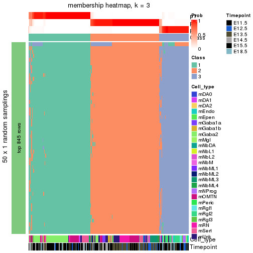</p>

</div>
<div id='tab-node-022-membership-heatmap-3'>
<pre><code class="r">membership_heatmap(res, k = 4)
</code></pre>

<p></p>

</div>
</div>

As soon as the classes for columns are determined, the signatures
that are significantly different between subgroups can be looked for. 
Following are the heatmaps for signatures.


Signature heatmaps where rows are scaled:


<script>
$( function() {
	$( '#tabs-node-022-get-signatures' ).tabs();
} );
</script>
<div id='tabs-node-022-get-signatures'>
<ul>
<li><a href='#tab-node-022-get-signatures-1'>k = 2</a></li>
<li><a href='#tab-node-022-get-signatures-2'>k = 3</a></li>
<li><a href='#tab-node-022-get-signatures-3'>k = 4</a></li>
</ul>
<div id='tab-node-022-get-signatures-1'>
<pre><code class="r">get_signatures(res, k = 2)
</code></pre>

<p></p>

</div>
<div id='tab-node-022-get-signatures-2'>
<pre><code class="r">get_signatures(res, k = 3)
</code></pre>

<p></p>

</div>
<div id='tab-node-022-get-signatures-3'>
<pre><code class="r">get_signatures(res, k = 4)
</code></pre>

<p></p>

</div>
</div>


Signature heatmaps where rows are not scaled:


<script>
$( function() {
	$( '#tabs-node-022-get-signatures-no-scale' ).tabs();
} );
</script>
<div id='tabs-node-022-get-signatures-no-scale'>
<ul>
<li><a href='#tab-node-022-get-signatures-no-scale-1'>k = 2</a></li>
<li><a href='#tab-node-022-get-signatures-no-scale-2'>k = 3</a></li>
<li><a href='#tab-node-022-get-signatures-no-scale-3'>k = 4</a></li>
</ul>
<div id='tab-node-022-get-signatures-no-scale-1'>
<pre><code class="r">get_signatures(res, k = 2, scale_rows = FALSE)
</code></pre>

<p></p>

</div>
<div id='tab-node-022-get-signatures-no-scale-2'>
<pre><code class="r">get_signatures(res, k = 3, scale_rows = FALSE)
</code></pre>

<p></p>

</div>
<div id='tab-node-022-get-signatures-no-scale-3'>
<pre><code class="r">get_signatures(res, k = 4, scale_rows = FALSE)
</code></pre>

<p></p>

</div>
</div>


Compare the overlap of signatures from different k:

```r
compare_signatures(res)
```


`get_signature()` returns a data frame invisibly. To get the list of signatures, the function
call should be assigned to a variable explicitly. In following code, if `plot` argument is set
to `FALSE`, no heatmap is plotted while only the differential analysis is performed.

```r
# code only for demonstration
tb = get_signature(res, k = ..., plot = FALSE)
```

An example of the output of `tb` is:

```
#>   which_row         fdr    mean_1    mean_2 scaled_mean_1 scaled_mean_2 km
#> 1        38 0.042760348  8.373488  9.131774    -0.5533452     0.5164555  1
#> 2        40 0.018707592  7.106213  8.469186    -0.6173731     0.5762149  1
#> 3        55 0.019134737 10.221463 11.207825    -0.6159697     0.5749050  1
#> 4        59 0.006059896  5.921854  7.869574    -0.6899429     0.6439467  1
#> 5        60 0.018055526  8.928898 10.211722    -0.6204761     0.5791110  1
#> 6        98 0.009384629 15.714769 14.887706     0.6635654    -0.6193277  2
...
```

The columns in `tb` are:

1. `which_row`: row indices corresponding to the input matrix.
2. `fdr`: FDR for the differential test. 
3. `mean_x`: The mean value in group x.
4. `scaled_mean_x`: The mean value in group x after rows are scaled.
5. `km`: Row groups if k-means clustering is applied to rows (which is done by automatically selecting number of clusters).

If there are too many signatures, `top_signatures = ...` can be set to only show the 
signatures with the highest FDRs:

```r
# code only for demonstration
# e.g. to show the top 500 most significant rows
tb = get_signature(res, k = ..., top_signatures = 500)
```

If the signatures are defined as these which are uniquely high in current group, `diff_method` argument
can be set to `"uniquely_high_in_one_group"`:

```r
# code only for demonstration
tb = get_signature(res, k = ..., diff_method = "uniquely_high_in_one_group")
```


UMAP plot which shows how samples are separated.


<script>
$( function() {
	$( '#tabs-node-022-dimension-reduction' ).tabs();
} );
</script>
<div id='tabs-node-022-dimension-reduction'>
<ul>
<li><a href='#tab-node-022-dimension-reduction-1'>k = 2</a></li>
<li><a href='#tab-node-022-dimension-reduction-2'>k = 3</a></li>
<li><a href='#tab-node-022-dimension-reduction-3'>k = 4</a></li>
</ul>
<div id='tab-node-022-dimension-reduction-1'>
<pre><code class="r">dimension_reduction(res, k = 2, method = &quot;UMAP&quot;)
</code></pre>

<p></p>

</div>
<div id='tab-node-022-dimension-reduction-2'>
<pre><code class="r">dimension_reduction(res, k = 3, method = &quot;UMAP&quot;)
</code></pre>

<p></p>

</div>
<div id='tab-node-022-dimension-reduction-3'>
<pre><code class="r">dimension_reduction(res, k = 4, method = &quot;UMAP&quot;)
</code></pre>

<p></p>

</div>
</div>


Following heatmap shows how subgroups are split when increasing `k`:

```r
collect_classes(res)
```


Test correlation between subgroups and known annotations. If the known
annotation is numeric, one-way ANOVA test is applied, and if the known
annotation is discrete, chi-squared contingency table test is applied.

```r
test_to_known_factors(res)
```

```
#>             n_sample Cell_type(p-value) Timepoint(p-value) k
#> ATC:skmeans      235           9.78e-09           4.24e-10 2
#> ATC:skmeans      232           1.01e-35           1.65e-11 3
#> ATC:skmeans      227           1.04e-35           7.57e-25 4
```


If matrix rows can be associated to genes, consider to use `functional_enrichment(res,
...)` to perform function enrichment for the signature genes. See [this vignette](https://jokergoo.github.io/cola_vignettes/functional_enrichment.html) for more detailed explanations.


 

---------------------------------------------------


### Node0221


Parent node: [Node022](#Node022).
Child nodes: 
                Node01211-leaf
        ,
                Node01212-leaf
        ,
                Node01221-leaf
        ,
                Node01222-leaf
        ,
                Node01311-leaf
        ,
                Node01312-leaf
        ,
                Node01313-leaf
        ,
                Node02211-leaf
        ,
                Node02212-leaf
        ,
                Node02221-leaf
        ,
                Node02222-leaf
        ,
                Node03111-leaf
        ,
                Node03112-leaf
        ,
                Node03113-leaf
        ,
                Node03121-leaf
        ,
                Node03122-leaf
        ,
                Node03123-leaf
        .


The object with results only for a single top-value method and a single partitioning method 
can be extracted as:

```r
res = res_rh["0221"]
```

A summary of `res` and all the functions that can be applied to it:

```r
res
```

```
#> A 'ConsensusPartition' object with k = 2, 3, 4.
#>   On a matrix with 8231 rows and 109 columns.
#>   Top rows (823) are extracted by 'ATC' method.
#>   Subgroups are detected by 'skmeans' method.
#>   Performed in total 150 partitions by row resampling.
#>   Best k for subgroups seems to be 2.
#> 
#> Following methods can be applied to this 'ConsensusPartition' object:
#>  [1] "cola_report"             "collect_classes"         "collect_plots"          
#>  [4] "collect_stats"           "colnames"                "compare_partitions"     
#>  [7] "compare_signatures"      "consensus_heatmap"       "dimension_reduction"    
#> [10] "functional_enrichment"   "get_anno_col"            "get_anno"               
#> [13] "get_classes"             "get_consensus"           "get_matrix"             
#> [16] "get_membership"          "get_param"               "get_signatures"         
#> [19] "get_stats"               "is_best_k"               "is_stable_k"            
#> [22] "membership_heatmap"      "ncol"                    "nrow"                   
#> [25] "plot_ecdf"               "predict_classes"         "rownames"               
#> [28] "select_partition_number" "show"                    "suggest_best_k"         
#> [31] "test_to_known_factors"   "top_rows_heatmap"
```

`collect_plots()` function collects all the plots made from `res` for all `k` (number of subgroups)
into one single page to provide an easy and fast comparison between different `k`.

```r
collect_plots(res)
```


The plots are:

- The first row: a plot of the eCDF (empirical cumulative distribution
  function) curves of the consensus matrix for each `k` and the heatmap of
  predicted classes for each `k`.
- The second row: heatmaps of the consensus matrix for each `k`.
- The third row: heatmaps of the membership matrix for each `k`.
- The fouth row: heatmaps of the signatures for each `k`.

All the plots in panels can be made by individual functions and they are
plotted later in this section.

`select_partition_number()` produces several plots showing different
statistics for choosing "optimized" `k`. There are following statistics:

- eCDF curves of the consensus matrix for each `k`;
- 1-PAC. [The PAC score](https://en.wikipedia.org/wiki/Consensus_clustering#Over-interpretation_potential_of_consensus_clustering)
  measures the proportion of the ambiguous subgrouping.
- Mean silhouette score.
- Concordance. The mean probability of fiting the consensus subgroup labels in all
  partitions.
- Area increased. Denote $A_k$ as the area under the eCDF curve for current
  `k`, the area increased is defined as $A_k - A_{k-1}$.
- Rand index. The percent of pairs of samples that are both in a same cluster
  or both are not in a same cluster in the partition of k and k-1.
- Jaccard index. The ratio of pairs of samples are both in a same cluster in
  the partition of k and k-1 and the pairs of samples are both in a same
  cluster in the partition k or k-1.

The detailed explanations of these statistics can be found in [the _cola_
vignette](https://jokergoo.github.io/cola_vignettes/cola.html#toc_13).

Generally speaking, higher 1-PAC score, higher mean silhouette score or higher
concordance corresponds to better partition. Rand index and Jaccard index
measure how similar the current partition is compared to partition with `k-1`.
If they are too similar, we won't accept `k` is better than `k-1`.

```r
select_partition_number(res)
```


The numeric values for all these statistics can be obtained by `get_stats()`.

```r
get_stats(res)
```

```
#>   k 1-PAC mean_silhouette concordance area_increased  Rand Jaccard
#> 2 2 0.904           0.915       0.966          0.505 0.495   0.495
#> 3 3 0.856           0.882       0.939          0.312 0.732   0.513
#> 4 4 0.645           0.631       0.809          0.114 0.906   0.733
```

`suggest_best_k()` suggests the best $k$ based on these statistics. The rules are as follows:

- All $k$ with Jaccard index larger than 0.95 are removed because increasing
  $k$ does not provide enough extra information. If all $k$ are removed, it is
  marked as no subgroup is detected.
- For all $k$ with 1-PAC score larger than 0.9, the maximal $k$ is taken as
  the best $k$, and other $k$ are marked as optional $k$.
- If it does not fit the second rule. The $k$ with the maximal vote of the
  highest 1-PAC score, highest mean silhouette, and highest concordance is
  taken as the best $k$.

```r
suggest_best_k(res)
```

```
#> [1] 2
```


Following is the table of the partitions (You need to click the **show/hide
code output** link to see it). The membership matrix (columns with name `p*`)
is inferred by
[`clue::cl_consensus()`](https://www.rdocumentation.org/link/cl_consensus?package=clue)
function with the `SE` method. Basically the value in the membership matrix
represents the probability to belong to a certain group. The finall subgroup
label for an item is determined with the group with highest probability it
belongs to.

In `get_classes()` function, the entropy is calculated from the membership
matrix and the silhouette score is calculated from the consensus matrix.


<script>
$( function() {
	$( '#tabs-node-0221-get-classes' ).tabs();
} );
</script>
<div id='tabs-node-0221-get-classes'>
<ul>
<li><a href='#tab-node-0221-get-classes-1'>k = 2</a></li>
<li><a href='#tab-node-0221-get-classes-2'>k = 3</a></li>
<li><a href='#tab-node-0221-get-classes-3'>k = 4</a></li>
</ul>

<div id='tab-node-0221-get-classes-1'>
<p><a id='tab-node-0221-get-classes-1-a' style='color:#0366d6' href='#'>show/hide code output</a></p>
<pre><code class="r">cbind(get_classes(res, k = 2), get_membership(res, k = 2))
</code></pre>

<pre><code>#&gt;                class entropy silhouette   p1   p2
#&gt; 1772075301_B03     2   0.000     0.9708 0.00 1.00
#&gt; 1772092006_A05     1   0.000     0.9575 1.00 0.00
#&gt; 1772072249_F03     2   0.000     0.9708 0.00 1.00
#&gt; 1772072249_C02     2   0.000     0.9708 0.00 1.00
#&gt; 1772075301_D06     1   0.000     0.9575 1.00 0.00
#&gt; 1772066087_E02     1   0.000     0.9575 1.00 0.00
#&gt; 1772072246_C05     2   0.000     0.9708 0.00 1.00
#&gt; 1772092007_B02     1   0.000     0.9575 1.00 0.00
#&gt; 1772072246_C04     2   0.000     0.9708 0.00 1.00
#&gt; 1772072246_F06     1   0.827     0.6503 0.74 0.26
#&gt; 1772066087_G03     1   0.000     0.9575 1.00 0.00
#&gt; 1772075300_B03     2   0.971     0.3111 0.40 0.60
#&gt; 1772066084_A12     2   0.000     0.9708 0.00 1.00
#&gt; 1772092006_C04     1   0.000     0.9575 1.00 0.00
#&gt; 1772094171_A07     1   0.827     0.6540 0.74 0.26
#&gt; 1772096114_F01     2   0.000     0.9708 0.00 1.00
#&gt; 1772075302_E11     1   0.000     0.9575 1.00 0.00
#&gt; 1772066084_G02     2   0.402     0.8911 0.08 0.92
#&gt; 1772066085_B04     2   0.242     0.9335 0.04 0.96
#&gt; 1772072246_A08     2   0.000     0.9708 0.00 1.00
#&gt; 1772066087_H03     2   0.000     0.9708 0.00 1.00
#&gt; 1772075301_D02     1   0.000     0.9575 1.00 0.00
#&gt; 1772072246_D05     2   0.000     0.9708 0.00 1.00
#&gt; 1772066087_B02     2   0.000     0.9708 0.00 1.00
#&gt; 1772071046_D05     2   0.000     0.9708 0.00 1.00
#&gt; 1772072246_B10     1   0.000     0.9575 1.00 0.00
#&gt; 1772066087_G07     2   0.000     0.9708 0.00 1.00
#&gt; 1772075301_E12     1   0.000     0.9575 1.00 0.00
#&gt; 1772071046_G04     1   0.000     0.9575 1.00 0.00
#&gt; 1772075302_F03     2   0.000     0.9708 0.00 1.00
#&gt; 1772066084_F02     2   0.000     0.9708 0.00 1.00
#&gt; 1772071046_C01     2   0.925     0.4718 0.34 0.66
#&gt; 1772094173_C01     2   0.000     0.9708 0.00 1.00
#&gt; 1772075301_C07     1   0.000     0.9575 1.00 0.00
#&gt; 1772071048_B12     2   0.000     0.9708 0.00 1.00
#&gt; 1772066087_F02     2   0.000     0.9708 0.00 1.00
#&gt; 1772066087_A12     2   0.000     0.9708 0.00 1.00
#&gt; 1772066087_D09     2   0.000     0.9708 0.00 1.00
#&gt; 1772072246_G04     2   0.000     0.9708 0.00 1.00
#&gt; 1772075302_H03     2   0.000     0.9708 0.00 1.00
#&gt; 1772071050_F02     1   0.000     0.9575 1.00 0.00
#&gt; 1772075302_E02     2   0.999     0.0382 0.48 0.52
#&gt; 1772075301_E07     1   0.000     0.9575 1.00 0.00
#&gt; 1772075301_E03     1   0.000     0.9575 1.00 0.00
#&gt; 1772075300_F08     1   0.000     0.9575 1.00 0.00
#&gt; 1772072246_B03     1   0.971     0.3433 0.60 0.40
#&gt; 1772075300_B06     1   0.000     0.9575 1.00 0.00
#&gt; 1772071046_C07     2   0.000     0.9708 0.00 1.00
#&gt; 1772096115_B03     1   0.958     0.4025 0.62 0.38
#&gt; 1772092006_B03     1   0.000     0.9575 1.00 0.00
#&gt; 1772071049_H01     1   0.000     0.9575 1.00 0.00
#&gt; 1772094163_A02     2   0.000     0.9708 0.00 1.00
#&gt; 1772071048_B06     2   0.000     0.9708 0.00 1.00
#&gt; 1772094173_A01     2   0.000     0.9708 0.00 1.00
#&gt; 1772075301_A03     1   0.000     0.9575 1.00 0.00
#&gt; 1772075302_E06     1   0.000     0.9575 1.00 0.00
#&gt; 1772075300_A03     2   0.000     0.9708 0.00 1.00
#&gt; 1772075303_E07     1   0.000     0.9575 1.00 0.00
#&gt; 1772096115_A11     2   0.000     0.9708 0.00 1.00
#&gt; 1772066087_B09     2   0.000     0.9708 0.00 1.00
#&gt; 1772075302_E04     1   0.634     0.7991 0.84 0.16
#&gt; 1772096112_D01     1   0.141     0.9414 0.98 0.02
#&gt; 1772066084_H03     2   0.000     0.9708 0.00 1.00
#&gt; 1772075300_A07     1   0.000     0.9575 1.00 0.00
#&gt; 1772071046_G12     2   0.000     0.9708 0.00 1.00
#&gt; 1772066087_D01     2   0.000     0.9708 0.00 1.00
#&gt; 1772075301_F12     1   0.000     0.9575 1.00 0.00
#&gt; 1772075301_A11     1   0.000     0.9575 1.00 0.00
#&gt; 1772072246_F08     2   0.000     0.9708 0.00 1.00
#&gt; 1772066084_E08     2   0.000     0.9708 0.00 1.00
#&gt; 1772066084_F03     2   0.000     0.9708 0.00 1.00
#&gt; 1772066085_B02     2   0.000     0.9708 0.00 1.00
#&gt; 1772066084_C07     1   0.000     0.9575 1.00 0.00
#&gt; 1772066084_G07     1   0.000     0.9575 1.00 0.00
#&gt; 1772075301_F01     2   0.000     0.9708 0.00 1.00
#&gt; 1772071046_D12     1   0.995     0.1652 0.54 0.46
#&gt; 1772075301_D05     1   0.000     0.9575 1.00 0.00
#&gt; 1772096112_B02     1   0.634     0.7983 0.84 0.16
#&gt; 1772072246_D01     1   0.327     0.9067 0.94 0.06
#&gt; 1772072246_G05     2   0.000     0.9708 0.00 1.00
#&gt; 1772066084_B09     2   0.000     0.9708 0.00 1.00
#&gt; 1772071046_D10     2   0.000     0.9708 0.00 1.00
#&gt; 1772075300_E01     1   0.000     0.9575 1.00 0.00
#&gt; 1772075301_B10     2   0.000     0.9708 0.00 1.00
#&gt; 1772075301_A08     2   0.000     0.9708 0.00 1.00
#&gt; 1772075301_G10     2   0.000     0.9708 0.00 1.00
#&gt; 1772094172_C02     2   0.000     0.9708 0.00 1.00
#&gt; 1772094173_C11     1   0.000     0.9575 1.00 0.00
#&gt; 1772075300_A09     2   0.000     0.9708 0.00 1.00
#&gt; 1772075301_D08     1   0.000     0.9575 1.00 0.00
#&gt; 1772075301_A07     2   0.634     0.7963 0.16 0.84
#&gt; 1772075301_F05     2   0.000     0.9708 0.00 1.00
#&gt; 1772071046_E04     2   0.000     0.9708 0.00 1.00
#&gt; 1772075301_E05     2   0.000     0.9708 0.00 1.00
#&gt; 1772071048_D11     1   0.000     0.9575 1.00 0.00
#&gt; 1772071050_G09     1   0.000     0.9575 1.00 0.00
#&gt; 1772066087_C04     1   0.000     0.9575 1.00 0.00
#&gt; 1772066085_C07     1   0.000     0.9575 1.00 0.00
#&gt; 1772075301_E11     1   0.000     0.9575 1.00 0.00
#&gt; 1772075301_F02     1   0.000     0.9575 1.00 0.00
#&gt; 1772075301_A06     1   0.000     0.9575 1.00 0.00
#&gt; 1772075301_A05     1   0.000     0.9575 1.00 0.00
#&gt; 1772075301_B01     1   0.000     0.9575 1.00 0.00
#&gt; 1772075301_G02     1   0.000     0.9575 1.00 0.00
#&gt; 1772075301_F07     1   0.000     0.9575 1.00 0.00
#&gt; 1772075301_G09     1   0.000     0.9575 1.00 0.00
#&gt; 1772075301_G11     1   0.000     0.9575 1.00 0.00
#&gt; 1772075300_D07     1   0.000     0.9575 1.00 0.00
#&gt; 1772066087_D02     2   0.000     0.9708 0.00 1.00
</code></pre>

<script>
$('#tab-node-0221-get-classes-1-a').parent().next().next().hide();
$('#tab-node-0221-get-classes-1-a').click(function(){
  $('#tab-node-0221-get-classes-1-a').parent().next().next().toggle();
  return(false);
});
</script>
</div>

<div id='tab-node-0221-get-classes-2'>
<p><a id='tab-node-0221-get-classes-2-a' style='color:#0366d6' href='#'>show/hide code output</a></p>
<pre><code class="r">cbind(get_classes(res, k = 3), get_membership(res, k = 3))
</code></pre>

<pre><code>#&gt;                class entropy silhouette   p1   p2   p3
#&gt; 1772075301_B03     2  0.0000     0.9522 0.00 1.00 0.00
#&gt; 1772092006_A05     3  0.2537     0.8991 0.08 0.00 0.92
#&gt; 1772072249_F03     2  0.2066     0.9131 0.00 0.94 0.06
#&gt; 1772072249_C02     2  0.0000     0.9522 0.00 1.00 0.00
#&gt; 1772075301_D06     3  0.4555     0.7867 0.20 0.00 0.80
#&gt; 1772066087_E02     3  0.2066     0.9074 0.06 0.00 0.94
#&gt; 1772072246_C05     2  0.0000     0.9522 0.00 1.00 0.00
#&gt; 1772092007_B02     3  0.2959     0.8885 0.10 0.00 0.90
#&gt; 1772072246_C04     2  0.0000     0.9522 0.00 1.00 0.00
#&gt; 1772072246_F06     2  0.7995    -0.0657 0.46 0.48 0.06
#&gt; 1772066087_G03     3  0.1529     0.9125 0.04 0.00 0.96
#&gt; 1772075300_B03     3  0.1781     0.9105 0.02 0.02 0.96
#&gt; 1772066084_A12     3  0.0000     0.9121 0.00 0.00 1.00
#&gt; 1772092006_C04     3  0.4291     0.8127 0.18 0.00 0.82
#&gt; 1772094171_A07     3  0.0000     0.9121 0.00 0.00 1.00
#&gt; 1772096114_F01     2  0.1529     0.9581 0.00 0.96 0.04
#&gt; 1772075302_E11     3  0.2959     0.8882 0.10 0.00 0.90
#&gt; 1772066084_G02     3  0.0892     0.9029 0.00 0.02 0.98
#&gt; 1772066085_B04     3  0.0000     0.9121 0.00 0.00 1.00
#&gt; 1772072246_A08     2  0.0000     0.9522 0.00 1.00 0.00
#&gt; 1772066087_H03     2  0.1529     0.9581 0.00 0.96 0.04
#&gt; 1772075301_D02     1  0.0892     0.9139 0.98 0.00 0.02
#&gt; 1772072246_D05     2  0.0000     0.9522 0.00 1.00 0.00
#&gt; 1772066087_B02     3  0.5948     0.3790 0.00 0.36 0.64
#&gt; 1772071046_D05     2  0.1529     0.9581 0.00 0.96 0.04
#&gt; 1772072246_B10     1  0.0892     0.9160 0.98 0.02 0.00
#&gt; 1772066087_G07     2  0.2066     0.9480 0.00 0.94 0.06
#&gt; 1772075301_E12     1  0.0000     0.9262 1.00 0.00 0.00
#&gt; 1772071046_G04     1  0.0000     0.9262 1.00 0.00 0.00
#&gt; 1772075302_F03     2  0.0000     0.9522 0.00 1.00 0.00
#&gt; 1772066084_F02     2  0.1529     0.9581 0.00 0.96 0.04
#&gt; 1772071046_C01     1  0.6922     0.6559 0.72 0.20 0.08
#&gt; 1772094173_C01     2  0.2066     0.9480 0.00 0.94 0.06
#&gt; 1772075301_C07     1  0.0000     0.9262 1.00 0.00 0.00
#&gt; 1772071048_B12     2  0.2066     0.9480 0.00 0.94 0.06
#&gt; 1772066087_F02     2  0.1529     0.9581 0.00 0.96 0.04
#&gt; 1772066087_A12     3  0.2959     0.8373 0.00 0.10 0.90
#&gt; 1772066087_D09     2  0.1529     0.9581 0.00 0.96 0.04
#&gt; 1772072246_G04     2  0.0000     0.9522 0.00 1.00 0.00
#&gt; 1772075302_H03     2  0.2066     0.9480 0.00 0.94 0.06
#&gt; 1772071050_F02     1  0.0000     0.9262 1.00 0.00 0.00
#&gt; 1772075302_E02     3  0.3572     0.8826 0.04 0.06 0.90
#&gt; 1772075301_E07     1  0.0000     0.9262 1.00 0.00 0.00
#&gt; 1772075301_E03     1  0.0000     0.9262 1.00 0.00 0.00
#&gt; 1772075300_F08     1  0.3686     0.7952 0.86 0.00 0.14
#&gt; 1772072246_B03     1  0.2959     0.8560 0.90 0.10 0.00
#&gt; 1772075300_B06     3  0.6280     0.2198 0.46 0.00 0.54
#&gt; 1772071046_C07     2  0.2537     0.9331 0.00 0.92 0.08
#&gt; 1772096115_B03     3  0.0000     0.9121 0.00 0.00 1.00
#&gt; 1772092006_B03     3  0.1529     0.9125 0.04 0.00 0.96
#&gt; 1772071049_H01     3  0.1529     0.9125 0.04 0.00 0.96
#&gt; 1772094163_A02     3  0.0000     0.9121 0.00 0.00 1.00
#&gt; 1772071048_B06     2  0.1529     0.9581 0.00 0.96 0.04
#&gt; 1772094173_A01     2  0.1529     0.9581 0.00 0.96 0.04
#&gt; 1772075301_A03     1  0.0000     0.9262 1.00 0.00 0.00
#&gt; 1772075302_E06     1  0.1529     0.9009 0.96 0.00 0.04
#&gt; 1772075300_A03     2  0.1529     0.9581 0.00 0.96 0.04
#&gt; 1772075303_E07     3  0.3340     0.8728 0.12 0.00 0.88
#&gt; 1772096115_A11     3  0.0000     0.9121 0.00 0.00 1.00
#&gt; 1772066087_B09     2  0.1529     0.9581 0.00 0.96 0.04
#&gt; 1772075302_E04     1  0.1529     0.9034 0.96 0.04 0.00
#&gt; 1772096112_D01     3  0.0892     0.9141 0.02 0.00 0.98
#&gt; 1772066084_H03     2  0.1529     0.9581 0.00 0.96 0.04
#&gt; 1772075300_A07     1  0.5706     0.4854 0.68 0.00 0.32
#&gt; 1772071046_G12     2  0.0000     0.9522 0.00 1.00 0.00
#&gt; 1772066087_D01     2  0.1529     0.9581 0.00 0.96 0.04
#&gt; 1772075301_F12     1  0.0000     0.9262 1.00 0.00 0.00
#&gt; 1772075301_A11     1  0.0000     0.9262 1.00 0.00 0.00
#&gt; 1772072246_F08     1  0.6192     0.3328 0.58 0.42 0.00
#&gt; 1772066084_E08     2  0.0000     0.9522 0.00 1.00 0.00
#&gt; 1772066084_F03     2  0.1529     0.9581 0.00 0.96 0.04
#&gt; 1772066085_B02     2  0.2066     0.9480 0.00 0.94 0.06
#&gt; 1772066084_C07     3  0.2066     0.9092 0.06 0.00 0.94
#&gt; 1772066084_G07     3  0.1529     0.9039 0.04 0.00 0.96
#&gt; 1772075301_F01     2  0.0000     0.9522 0.00 1.00 0.00
#&gt; 1772071046_D12     3  0.0000     0.9121 0.00 0.00 1.00
#&gt; 1772075301_D05     1  0.0892     0.9160 0.98 0.02 0.00
#&gt; 1772096112_B02     3  0.0000     0.9121 0.00 0.00 1.00
#&gt; 1772072246_D01     1  0.2066     0.8912 0.94 0.06 0.00
#&gt; 1772072246_G05     2  0.0000     0.9522 0.00 1.00 0.00
#&gt; 1772066084_B09     2  0.5216     0.6998 0.00 0.74 0.26
#&gt; 1772071046_D10     2  0.1529     0.9581 0.00 0.96 0.04
#&gt; 1772075300_E01     1  0.4291     0.7499 0.82 0.00 0.18
#&gt; 1772075301_B10     2  0.2537     0.8856 0.08 0.92 0.00
#&gt; 1772075301_A08     2  0.0892     0.9411 0.02 0.98 0.00
#&gt; 1772075301_G10     2  0.0000     0.9522 0.00 1.00 0.00
#&gt; 1772094172_C02     2  0.1529     0.9581 0.00 0.96 0.04
#&gt; 1772094173_C11     3  0.2066     0.9074 0.06 0.00 0.94
#&gt; 1772075300_A09     2  0.1529     0.9581 0.00 0.96 0.04
#&gt; 1772075301_D08     1  0.1529     0.9034 0.96 0.04 0.00
#&gt; 1772075301_A07     1  0.6956     0.5180 0.66 0.30 0.04
#&gt; 1772075301_F05     2  0.0000     0.9522 0.00 1.00 0.00
#&gt; 1772071046_E04     2  0.1529     0.9581 0.00 0.96 0.04
#&gt; 1772075301_E05     2  0.0892     0.9413 0.02 0.98 0.00
#&gt; 1772071048_D11     1  0.5016     0.6629 0.76 0.00 0.24
#&gt; 1772071050_G09     1  0.0000     0.9262 1.00 0.00 0.00
#&gt; 1772066087_C04     1  0.0000     0.9262 1.00 0.00 0.00
#&gt; 1772066085_C07     3  0.2959     0.8875 0.10 0.00 0.90
#&gt; 1772075301_E11     1  0.0000     0.9262 1.00 0.00 0.00
#&gt; 1772075301_F02     1  0.0000     0.9262 1.00 0.00 0.00
#&gt; 1772075301_A06     1  0.0000     0.9262 1.00 0.00 0.00
#&gt; 1772075301_A05     1  0.0000     0.9262 1.00 0.00 0.00
#&gt; 1772075301_B01     1  0.0000     0.9262 1.00 0.00 0.00
#&gt; 1772075301_G02     1  0.0000     0.9262 1.00 0.00 0.00
#&gt; 1772075301_F07     1  0.0000     0.9262 1.00 0.00 0.00
#&gt; 1772075301_G09     1  0.0000     0.9262 1.00 0.00 0.00
#&gt; 1772075301_G11     1  0.0000     0.9262 1.00 0.00 0.00
#&gt; 1772075300_D07     1  0.0000     0.9262 1.00 0.00 0.00
#&gt; 1772066087_D02     2  0.1529     0.9581 0.00 0.96 0.04
</code></pre>

<script>
$('#tab-node-0221-get-classes-2-a').parent().next().next().hide();
$('#tab-node-0221-get-classes-2-a').click(function(){
  $('#tab-node-0221-get-classes-2-a').parent().next().next().toggle();
  return(false);
});
</script>
</div>

<div id='tab-node-0221-get-classes-3'>
<p><a id='tab-node-0221-get-classes-3-a' style='color:#0366d6' href='#'>show/hide code output</a></p>
<pre><code class="r">cbind(get_classes(res, k = 4), get_membership(res, k = 4))
</code></pre>

<pre><code>#&gt;                class entropy silhouette   p1   p2   p3   p4
#&gt; 1772075301_B03     2  0.4855   -0.18844 0.00 0.60 0.00 0.40
#&gt; 1772092006_A05     4  0.2647    0.55573 0.00 0.00 0.12 0.88
#&gt; 1772072249_F03     4  0.4522    0.59148 0.00 0.32 0.00 0.68
#&gt; 1772072249_C02     4  0.5594    0.41524 0.00 0.46 0.02 0.52
#&gt; 1772075301_D06     4  0.2647    0.55573 0.00 0.00 0.12 0.88
#&gt; 1772066087_E02     4  0.2647    0.55573 0.00 0.00 0.12 0.88
#&gt; 1772072246_C05     4  0.4713    0.57026 0.00 0.36 0.00 0.64
#&gt; 1772092007_B02     4  0.3335    0.53328 0.02 0.00 0.12 0.86
#&gt; 1772072246_C04     4  0.5535    0.48035 0.00 0.42 0.02 0.56
#&gt; 1772072246_F06     4  0.4522    0.59148 0.00 0.32 0.00 0.68
#&gt; 1772066087_G03     4  0.2647    0.55573 0.00 0.00 0.12 0.88
#&gt; 1772075300_B03     4  0.2647    0.55573 0.00 0.00 0.12 0.88
#&gt; 1772066084_A12     4  0.2647    0.55573 0.00 0.00 0.12 0.88
#&gt; 1772092006_C04     3  0.6921    0.60877 0.16 0.00 0.58 0.26
#&gt; 1772094171_A07     3  0.3400    0.71650 0.00 0.00 0.82 0.18
#&gt; 1772096114_F01     2  0.5173    0.76090 0.00 0.66 0.32 0.02
#&gt; 1772075302_E11     3  0.6808    0.59229 0.12 0.00 0.56 0.32
#&gt; 1772066084_G02     3  0.0707    0.59833 0.00 0.02 0.98 0.00
#&gt; 1772066085_B04     3  0.2011    0.68281 0.00 0.00 0.92 0.08
#&gt; 1772072246_A08     2  0.5793   -0.03198 0.00 0.60 0.04 0.36
#&gt; 1772066087_H03     2  0.4624    0.77051 0.00 0.66 0.34 0.00
#&gt; 1772075301_D02     1  0.3975    0.66213 0.76 0.00 0.00 0.24
#&gt; 1772072246_D05     2  0.2706    0.55045 0.00 0.90 0.02 0.08
#&gt; 1772066087_B02     3  0.3801    0.20497 0.00 0.22 0.78 0.00
#&gt; 1772071046_D05     2  0.4522    0.77639 0.00 0.68 0.32 0.00
#&gt; 1772072246_B10     1  0.0000    0.86454 1.00 0.00 0.00 0.00
#&gt; 1772066087_G07     2  0.4713    0.75985 0.00 0.64 0.36 0.00
#&gt; 1772075301_E12     1  0.0000    0.86454 1.00 0.00 0.00 0.00
#&gt; 1772071046_G04     1  0.0000    0.86454 1.00 0.00 0.00 0.00
#&gt; 1772075302_F03     2  0.1637    0.58826 0.00 0.94 0.00 0.06
#&gt; 1772066084_F02     2  0.5986    0.74217 0.00 0.62 0.32 0.06
#&gt; 1772071046_C01     1  0.8543    0.00860 0.44 0.22 0.30 0.04
#&gt; 1772094173_C01     2  0.4713    0.75985 0.00 0.64 0.36 0.00
#&gt; 1772075301_C07     1  0.0000    0.86454 1.00 0.00 0.00 0.00
#&gt; 1772071048_B12     2  0.4713    0.75985 0.00 0.64 0.36 0.00
#&gt; 1772066087_F02     2  0.4522    0.77639 0.00 0.68 0.32 0.00
#&gt; 1772066087_A12     3  0.3037    0.53032 0.00 0.10 0.88 0.02
#&gt; 1772066087_D09     2  0.4522    0.77639 0.00 0.68 0.32 0.00
#&gt; 1772072246_G04     2  0.5428   -0.12038 0.00 0.60 0.02 0.38
#&gt; 1772075302_H03     2  0.4624    0.75732 0.00 0.66 0.34 0.00
#&gt; 1772071050_F02     1  0.0000    0.86454 1.00 0.00 0.00 0.00
#&gt; 1772075302_E02     3  0.6317    0.67765 0.02 0.08 0.68 0.22
#&gt; 1772075301_E07     1  0.0000    0.86454 1.00 0.00 0.00 0.00
#&gt; 1772075301_E03     1  0.0000    0.86454 1.00 0.00 0.00 0.00
#&gt; 1772075300_F08     1  0.5147    0.61092 0.74 0.00 0.20 0.06
#&gt; 1772072246_B03     1  0.7016    0.31792 0.54 0.32 0.00 0.14
#&gt; 1772075300_B06     3  0.7745    0.37940 0.34 0.00 0.42 0.24
#&gt; 1772071046_C07     2  0.4713    0.75953 0.00 0.64 0.36 0.00
#&gt; 1772096115_B03     3  0.2921    0.70926 0.00 0.00 0.86 0.14
#&gt; 1772092006_B03     3  0.5271    0.63115 0.02 0.00 0.64 0.34
#&gt; 1772071049_H01     3  0.5173    0.64481 0.02 0.00 0.66 0.32
#&gt; 1772094163_A02     3  0.2011    0.68281 0.00 0.00 0.92 0.08
#&gt; 1772071048_B06     2  0.4624    0.77051 0.00 0.66 0.34 0.00
#&gt; 1772094173_A01     2  0.4624    0.77051 0.00 0.66 0.34 0.00
#&gt; 1772075301_A03     1  0.0000    0.86454 1.00 0.00 0.00 0.00
#&gt; 1772075302_E06     1  0.3335    0.76520 0.86 0.00 0.02 0.12
#&gt; 1772075300_A03     2  0.4522    0.76962 0.00 0.68 0.32 0.00
#&gt; 1772075303_E07     3  0.6500    0.63926 0.12 0.00 0.62 0.26
#&gt; 1772096115_A11     3  0.0707    0.63506 0.00 0.00 0.98 0.02
#&gt; 1772066087_B09     2  0.4624    0.77051 0.00 0.66 0.34 0.00
#&gt; 1772075302_E04     1  0.4939    0.64724 0.74 0.22 0.00 0.04
#&gt; 1772096112_D01     3  0.5000    0.40671 0.00 0.00 0.50 0.50
#&gt; 1772066084_H03     2  0.4522    0.77639 0.00 0.68 0.32 0.00
#&gt; 1772075300_A07     1  0.5271    0.38761 0.64 0.00 0.34 0.02
#&gt; 1772071046_G12     2  0.1637    0.58826 0.00 0.94 0.00 0.06
#&gt; 1772066087_D01     2  0.4522    0.77639 0.00 0.68 0.32 0.00
#&gt; 1772075301_F12     1  0.0000    0.86454 1.00 0.00 0.00 0.00
#&gt; 1772075301_A11     1  0.0000    0.86454 1.00 0.00 0.00 0.00
#&gt; 1772072246_F08     2  0.6881   -0.00621 0.34 0.54 0.00 0.12
#&gt; 1772066084_E08     4  0.5606    0.37760 0.00 0.48 0.02 0.50
#&gt; 1772066084_F03     2  0.4522    0.77639 0.00 0.68 0.32 0.00
#&gt; 1772066085_B02     2  0.4624    0.77051 0.00 0.66 0.34 0.00
#&gt; 1772066084_C07     3  0.5767    0.65608 0.06 0.00 0.66 0.28
#&gt; 1772066084_G07     3  0.4491    0.71311 0.06 0.00 0.80 0.14
#&gt; 1772075301_F01     2  0.2345    0.54860 0.00 0.90 0.00 0.10
#&gt; 1772071046_D12     3  0.3400    0.71654 0.00 0.00 0.82 0.18
#&gt; 1772075301_D05     1  0.2411    0.81695 0.92 0.04 0.00 0.04
#&gt; 1772096112_B02     3  0.3172    0.71475 0.00 0.00 0.84 0.16
#&gt; 1772072246_D01     1  0.5767    0.50947 0.66 0.28 0.00 0.06
#&gt; 1772072246_G05     2  0.2706    0.55045 0.00 0.90 0.02 0.08
#&gt; 1772066084_B09     4  0.6649    0.31446 0.00 0.10 0.34 0.56
#&gt; 1772071046_D10     2  0.4522    0.77639 0.00 0.68 0.32 0.00
#&gt; 1772075300_E01     1  0.5793    0.29271 0.60 0.00 0.36 0.04
#&gt; 1772075301_B10     2  0.3030    0.59109 0.02 0.90 0.02 0.06
#&gt; 1772075301_A08     2  0.3935    0.62252 0.02 0.86 0.06 0.06
#&gt; 1772075301_G10     2  0.1637    0.58826 0.00 0.94 0.00 0.06
#&gt; 1772094172_C02     2  0.4522    0.77639 0.00 0.68 0.32 0.00
#&gt; 1772094173_C11     4  0.6988   -0.33372 0.12 0.00 0.38 0.50
#&gt; 1772075300_A09     2  0.4406    0.77319 0.00 0.70 0.30 0.00
#&gt; 1772075301_D08     1  0.4332    0.71879 0.80 0.16 0.00 0.04
#&gt; 1772075301_A07     1  0.6011    0.03007 0.48 0.48 0.00 0.04
#&gt; 1772075301_F05     2  0.2011    0.56984 0.00 0.92 0.00 0.08
#&gt; 1772071046_E04     2  0.3400    0.72166 0.00 0.82 0.18 0.00
#&gt; 1772075301_E05     2  0.2011    0.56984 0.00 0.92 0.00 0.08
#&gt; 1772071048_D11     1  0.5327    0.56908 0.72 0.00 0.22 0.06
#&gt; 1772071050_G09     1  0.0000    0.86454 1.00 0.00 0.00 0.00
#&gt; 1772066087_C04     1  0.0000    0.86454 1.00 0.00 0.00 0.00
#&gt; 1772066085_C07     3  0.5956    0.66927 0.10 0.00 0.68 0.22
#&gt; 1772075301_E11     1  0.0000    0.86454 1.00 0.00 0.00 0.00
#&gt; 1772075301_F02     1  0.0000    0.86454 1.00 0.00 0.00 0.00
#&gt; 1772075301_A06     1  0.0000    0.86454 1.00 0.00 0.00 0.00
#&gt; 1772075301_A05     1  0.0000    0.86454 1.00 0.00 0.00 0.00
#&gt; 1772075301_B01     1  0.0000    0.86454 1.00 0.00 0.00 0.00
#&gt; 1772075301_G02     1  0.0000    0.86454 1.00 0.00 0.00 0.00
#&gt; 1772075301_F07     1  0.0000    0.86454 1.00 0.00 0.00 0.00
#&gt; 1772075301_G09     1  0.0000    0.86454 1.00 0.00 0.00 0.00
#&gt; 1772075301_G11     1  0.0000    0.86454 1.00 0.00 0.00 0.00
#&gt; 1772075300_D07     1  0.0000    0.86454 1.00 0.00 0.00 0.00
#&gt; 1772066087_D02     2  0.5713    0.72187 0.00 0.62 0.34 0.04
</code></pre>

<script>
$('#tab-node-0221-get-classes-3-a').parent().next().next().hide();
$('#tab-node-0221-get-classes-3-a').click(function(){
  $('#tab-node-0221-get-classes-3-a').parent().next().next().toggle();
  return(false);
});
</script>
</div>
</div>

Heatmaps for the consensus matrix. It visualizes the probability of two
samples to be in a same group.


<script>
$( function() {
	$( '#tabs-node-0221-consensus-heatmap' ).tabs();
} );
</script>
<div id='tabs-node-0221-consensus-heatmap'>
<ul>
<li><a href='#tab-node-0221-consensus-heatmap-1'>k = 2</a></li>
<li><a href='#tab-node-0221-consensus-heatmap-2'>k = 3</a></li>
<li><a href='#tab-node-0221-consensus-heatmap-3'>k = 4</a></li>
</ul>
<div id='tab-node-0221-consensus-heatmap-1'>
<pre><code class="r">consensus_heatmap(res, k = 2)
</code></pre>

<p></p>

</div>
<div id='tab-node-0221-consensus-heatmap-2'>
<pre><code class="r">consensus_heatmap(res, k = 3)
</code></pre>

<p></p>

</div>
<div id='tab-node-0221-consensus-heatmap-3'>
<pre><code class="r">consensus_heatmap(res, k = 4)
</code></pre>

<p></p>

</div>
</div>

Heatmaps for the membership of samples in all partitions to see how consistent they are:


<script>
$( function() {
	$( '#tabs-node-0221-membership-heatmap' ).tabs();
} );
</script>
<div id='tabs-node-0221-membership-heatmap'>
<ul>
<li><a href='#tab-node-0221-membership-heatmap-1'>k = 2</a></li>
<li><a href='#tab-node-0221-membership-heatmap-2'>k = 3</a></li>
<li><a href='#tab-node-0221-membership-heatmap-3'>k = 4</a></li>
</ul>
<div id='tab-node-0221-membership-heatmap-1'>
<pre><code class="r">membership_heatmap(res, k = 2)
</code></pre>

<p></p>

</div>
<div id='tab-node-0221-membership-heatmap-2'>
<pre><code class="r">membership_heatmap(res, k = 3)
</code></pre>

<p></p>

</div>
<div id='tab-node-0221-membership-heatmap-3'>
<pre><code class="r">membership_heatmap(res, k = 4)
</code></pre>

<p></p>

</div>
</div>

As soon as the classes for columns are determined, the signatures
that are significantly different between subgroups can be looked for. 
Following are the heatmaps for signatures.


Signature heatmaps where rows are scaled:


<script>
$( function() {
	$( '#tabs-node-0221-get-signatures' ).tabs();
} );
</script>
<div id='tabs-node-0221-get-signatures'>
<ul>
<li><a href='#tab-node-0221-get-signatures-1'>k = 2</a></li>
<li><a href='#tab-node-0221-get-signatures-2'>k = 3</a></li>
<li><a href='#tab-node-0221-get-signatures-3'>k = 4</a></li>
</ul>
<div id='tab-node-0221-get-signatures-1'>
<pre><code class="r">get_signatures(res, k = 2)
</code></pre>

<p></p>

</div>
<div id='tab-node-0221-get-signatures-2'>
<pre><code class="r">get_signatures(res, k = 3)
</code></pre>

<p></p>

</div>
<div id='tab-node-0221-get-signatures-3'>
<pre><code class="r">get_signatures(res, k = 4)
</code></pre>

<p></p>

</div>
</div>


Signature heatmaps where rows are not scaled:


<script>
$( function() {
	$( '#tabs-node-0221-get-signatures-no-scale' ).tabs();
} );
</script>
<div id='tabs-node-0221-get-signatures-no-scale'>
<ul>
<li><a href='#tab-node-0221-get-signatures-no-scale-1'>k = 2</a></li>
<li><a href='#tab-node-0221-get-signatures-no-scale-2'>k = 3</a></li>
<li><a href='#tab-node-0221-get-signatures-no-scale-3'>k = 4</a></li>
</ul>
<div id='tab-node-0221-get-signatures-no-scale-1'>
<pre><code class="r">get_signatures(res, k = 2, scale_rows = FALSE)
</code></pre>

<p></p>

</div>
<div id='tab-node-0221-get-signatures-no-scale-2'>
<pre><code class="r">get_signatures(res, k = 3, scale_rows = FALSE)
</code></pre>

<p></p>

</div>
<div id='tab-node-0221-get-signatures-no-scale-3'>
<pre><code class="r">get_signatures(res, k = 4, scale_rows = FALSE)
</code></pre>

<p></p>

</div>
</div>


Compare the overlap of signatures from different k:

```r
compare_signatures(res)
```


`get_signature()` returns a data frame invisibly. To get the list of signatures, the function
call should be assigned to a variable explicitly. In following code, if `plot` argument is set
to `FALSE`, no heatmap is plotted while only the differential analysis is performed.

```r
# code only for demonstration
tb = get_signature(res, k = ..., plot = FALSE)
```

An example of the output of `tb` is:

```
#>   which_row         fdr    mean_1    mean_2 scaled_mean_1 scaled_mean_2 km
#> 1        38 0.042760348  8.373488  9.131774    -0.5533452     0.5164555  1
#> 2        40 0.018707592  7.106213  8.469186    -0.6173731     0.5762149  1
#> 3        55 0.019134737 10.221463 11.207825    -0.6159697     0.5749050  1
#> 4        59 0.006059896  5.921854  7.869574    -0.6899429     0.6439467  1
#> 5        60 0.018055526  8.928898 10.211722    -0.6204761     0.5791110  1
#> 6        98 0.009384629 15.714769 14.887706     0.6635654    -0.6193277  2
...
```

The columns in `tb` are:

1. `which_row`: row indices corresponding to the input matrix.
2. `fdr`: FDR for the differential test. 
3. `mean_x`: The mean value in group x.
4. `scaled_mean_x`: The mean value in group x after rows are scaled.
5. `km`: Row groups if k-means clustering is applied to rows (which is done by automatically selecting number of clusters).

If there are too many signatures, `top_signatures = ...` can be set to only show the 
signatures with the highest FDRs:

```r
# code only for demonstration
# e.g. to show the top 500 most significant rows
tb = get_signature(res, k = ..., top_signatures = 500)
```

If the signatures are defined as these which are uniquely high in current group, `diff_method` argument
can be set to `"uniquely_high_in_one_group"`:

```r
# code only for demonstration
tb = get_signature(res, k = ..., diff_method = "uniquely_high_in_one_group")
```


UMAP plot which shows how samples are separated.


<script>
$( function() {
	$( '#tabs-node-0221-dimension-reduction' ).tabs();
} );
</script>
<div id='tabs-node-0221-dimension-reduction'>
<ul>
<li><a href='#tab-node-0221-dimension-reduction-1'>k = 2</a></li>
<li><a href='#tab-node-0221-dimension-reduction-2'>k = 3</a></li>
<li><a href='#tab-node-0221-dimension-reduction-3'>k = 4</a></li>
</ul>
<div id='tab-node-0221-dimension-reduction-1'>
<pre><code class="r">dimension_reduction(res, k = 2, method = &quot;UMAP&quot;)
</code></pre>

<p></p>

</div>
<div id='tab-node-0221-dimension-reduction-2'>
<pre><code class="r">dimension_reduction(res, k = 3, method = &quot;UMAP&quot;)
</code></pre>

<p></p>

</div>
<div id='tab-node-0221-dimension-reduction-3'>
<pre><code class="r">dimension_reduction(res, k = 4, method = &quot;UMAP&quot;)
</code></pre>

<p></p>

</div>
</div>


Following heatmap shows how subgroups are split when increasing `k`:

```r
collect_classes(res)
```


Test correlation between subgroups and known annotations. If the known
annotation is numeric, one-way ANOVA test is applied, and if the known
annotation is discrete, chi-squared contingency table test is applied.

```r
test_to_known_factors(res)
```

```
#>             n_sample Cell_type(p-value) Timepoint(p-value) k
#> ATC:skmeans      103           6.32e-01           1.93e-02 2
#> ATC:skmeans      104           1.67e-01           2.93e-05 3
#> ATC:skmeans       92           3.07e-09           2.66e-05 4
```


If matrix rows can be associated to genes, consider to use `functional_enrichment(res,
...)` to perform function enrichment for the signature genes. See [this vignette](https://jokergoo.github.io/cola_vignettes/functional_enrichment.html) for more detailed explanations.


 

---------------------------------------------------


### Node0222


Parent node: [Node022](#Node022).
Child nodes: 
                Node01211-leaf
        ,
                Node01212-leaf
        ,
                Node01221-leaf
        ,
                Node01222-leaf
        ,
                Node01311-leaf
        ,
                Node01312-leaf
        ,
                Node01313-leaf
        ,
                Node02211-leaf
        ,
                Node02212-leaf
        ,
                Node02221-leaf
        ,
                Node02222-leaf
        ,
                Node03111-leaf
        ,
                Node03112-leaf
        ,
                Node03113-leaf
        ,
                Node03121-leaf
        ,
                Node03122-leaf
        ,
                Node03123-leaf
        .


The object with results only for a single top-value method and a single partitioning method 
can be extracted as:

```r
res = res_rh["0222"]
```

A summary of `res` and all the functions that can be applied to it:

```r
res
```

```
#> A 'ConsensusPartition' object with k = 2, 3, 4.
#>   On a matrix with 7341 rows and 129 columns.
#>   Top rows (734) are extracted by 'ATC' method.
#>   Subgroups are detected by 'skmeans' method.
#>   Performed in total 150 partitions by row resampling.
#>   Best k for subgroups seems to be 3.
#> 
#> Following methods can be applied to this 'ConsensusPartition' object:
#>  [1] "cola_report"             "collect_classes"         "collect_plots"          
#>  [4] "collect_stats"           "colnames"                "compare_partitions"     
#>  [7] "compare_signatures"      "consensus_heatmap"       "dimension_reduction"    
#> [10] "functional_enrichment"   "get_anno_col"            "get_anno"               
#> [13] "get_classes"             "get_consensus"           "get_matrix"             
#> [16] "get_membership"          "get_param"               "get_signatures"         
#> [19] "get_stats"               "is_best_k"               "is_stable_k"            
#> [22] "membership_heatmap"      "ncol"                    "nrow"                   
#> [25] "plot_ecdf"               "predict_classes"         "rownames"               
#> [28] "select_partition_number" "show"                    "suggest_best_k"         
#> [31] "test_to_known_factors"   "top_rows_heatmap"
```

`collect_plots()` function collects all the plots made from `res` for all `k` (number of subgroups)
into one single page to provide an easy and fast comparison between different `k`.

```r
collect_plots(res)
```


The plots are:

- The first row: a plot of the eCDF (empirical cumulative distribution
  function) curves of the consensus matrix for each `k` and the heatmap of
  predicted classes for each `k`.
- The second row: heatmaps of the consensus matrix for each `k`.
- The third row: heatmaps of the membership matrix for each `k`.
- The fouth row: heatmaps of the signatures for each `k`.

All the plots in panels can be made by individual functions and they are
plotted later in this section.

`select_partition_number()` produces several plots showing different
statistics for choosing "optimized" `k`. There are following statistics:

- eCDF curves of the consensus matrix for each `k`;
- 1-PAC. [The PAC score](https://en.wikipedia.org/wiki/Consensus_clustering#Over-interpretation_potential_of_consensus_clustering)
  measures the proportion of the ambiguous subgrouping.
- Mean silhouette score.
- Concordance. The mean probability of fiting the consensus subgroup labels in all
  partitions.
- Area increased. Denote $A_k$ as the area under the eCDF curve for current
  `k`, the area increased is defined as $A_k - A_{k-1}$.
- Rand index. The percent of pairs of samples that are both in a same cluster
  or both are not in a same cluster in the partition of k and k-1.
- Jaccard index. The ratio of pairs of samples are both in a same cluster in
  the partition of k and k-1 and the pairs of samples are both in a same
  cluster in the partition k or k-1.

The detailed explanations of these statistics can be found in [the _cola_
vignette](https://jokergoo.github.io/cola_vignettes/cola.html#toc_13).

Generally speaking, higher 1-PAC score, higher mean silhouette score or higher
concordance corresponds to better partition. Rand index and Jaccard index
measure how similar the current partition is compared to partition with `k-1`.
If they are too similar, we won't accept `k` is better than `k-1`.

```r
select_partition_number(res)
```


The numeric values for all these statistics can be obtained by `get_stats()`.

```r
get_stats(res)
```

```
#>   k 1-PAC mean_silhouette concordance area_increased  Rand Jaccard
#> 2 2 1.000           0.998       0.999          0.407 0.594   0.594
#> 3 3 0.957           0.944       0.976          0.625 0.721   0.539
#> 4 4 0.798           0.772       0.900          0.129 0.858   0.612
```

`suggest_best_k()` suggests the best $k$ based on these statistics. The rules are as follows:

- All $k$ with Jaccard index larger than 0.95 are removed because increasing
  $k$ does not provide enough extra information. If all $k$ are removed, it is
  marked as no subgroup is detected.
- For all $k$ with 1-PAC score larger than 0.9, the maximal $k$ is taken as
  the best $k$, and other $k$ are marked as optional $k$.
- If it does not fit the second rule. The $k$ with the maximal vote of the
  highest 1-PAC score, highest mean silhouette, and highest concordance is
  taken as the best $k$.

```r
suggest_best_k(res)
```

```
#> [1] 3
#> attr(,"optional")
#> [1] 2
```

There is also optional best $k$ = 2 that is worth to check.

Following is the table of the partitions (You need to click the **show/hide
code output** link to see it). The membership matrix (columns with name `p*`)
is inferred by
[`clue::cl_consensus()`](https://www.rdocumentation.org/link/cl_consensus?package=clue)
function with the `SE` method. Basically the value in the membership matrix
represents the probability to belong to a certain group. The finall subgroup
label for an item is determined with the group with highest probability it
belongs to.

In `get_classes()` function, the entropy is calculated from the membership
matrix and the silhouette score is calculated from the consensus matrix.


<script>
$( function() {
	$( '#tabs-node-0222-get-classes' ).tabs();
} );
</script>
<div id='tabs-node-0222-get-classes'>
<ul>
<li><a href='#tab-node-0222-get-classes-1'>k = 2</a></li>
<li><a href='#tab-node-0222-get-classes-2'>k = 3</a></li>
<li><a href='#tab-node-0222-get-classes-3'>k = 4</a></li>
</ul>

<div id='tab-node-0222-get-classes-1'>
<p><a id='tab-node-0222-get-classes-1-a' style='color:#0366d6' href='#'>show/hide code output</a></p>
<pre><code class="r">cbind(get_classes(res, k = 2), get_membership(res, k = 2))
</code></pre>

<pre><code>#&gt;                class entropy silhouette   p1   p2
#&gt; 1772075300_C04     2   0.000      0.999 0.00 1.00
#&gt; 1772096112_F05     2   0.000      0.999 0.00 1.00
#&gt; 1772071048_C05     2   0.000      0.999 0.00 1.00
#&gt; 1772072246_D07     2   0.000      0.999 0.00 1.00
#&gt; 1772066084_E02     2   0.000      0.999 0.00 1.00
#&gt; 1772092006_H04     2   0.000      0.999 0.00 1.00
#&gt; 1772094169_C12     2   0.000      0.999 0.00 1.00
#&gt; 1772094166_F07     2   0.000      0.999 0.00 1.00
#&gt; 1772094166_E06     2   0.000      0.999 0.00 1.00
#&gt; 1772096112_E01     2   0.000      0.999 0.00 1.00
#&gt; 1772094146_F02     2   0.000      0.999 0.00 1.00
#&gt; 1772066084_D08     2   0.000      0.999 0.00 1.00
#&gt; 1772066084_H07     2   0.000      0.999 0.00 1.00
#&gt; 1772092007_D12     2   0.000      0.999 0.00 1.00
#&gt; 1772092007_B01     2   0.000      0.999 0.00 1.00
#&gt; 1772071049_A02     2   0.000      0.999 0.00 1.00
#&gt; 1772066084_D09     2   0.000      0.999 0.00 1.00
#&gt; 1772066085_H12     2   0.000      0.999 0.00 1.00
#&gt; 1772066085_D02     2   0.000      0.999 0.00 1.00
#&gt; 1772071048_B03     2   0.000      0.999 0.00 1.00
#&gt; 1772071046_H06     2   0.000      0.999 0.00 1.00
#&gt; 1772066084_B03     2   0.000      0.999 0.00 1.00
#&gt; 1772096112_D06     2   0.000      0.999 0.00 1.00
#&gt; 1772096112_B04     2   0.000      0.999 0.00 1.00
#&gt; 1772071046_B12     2   0.000      0.999 0.00 1.00
#&gt; 1772066084_F08     2   0.000      0.999 0.00 1.00
#&gt; 1772092006_A03     1   0.000      0.999 1.00 0.00
#&gt; 1772092007_E09     1   0.000      0.999 1.00 0.00
#&gt; 1772092007_H07     1   0.000      0.999 1.00 0.00
#&gt; 1772071049_G09     1   0.000      0.999 1.00 0.00
#&gt; 1772096112_D08     1   0.000      0.999 1.00 0.00
#&gt; 1772094166_C06     2   0.000      0.999 0.00 1.00
#&gt; 1772075302_E01     1   0.000      0.999 1.00 0.00
#&gt; 1772096115_E06     1   0.000      0.999 1.00 0.00
#&gt; 1772096114_D09     1   0.000      0.999 1.00 0.00
#&gt; 1772094166_H06     1   0.000      0.999 1.00 0.00
#&gt; 1772075302_C04     1   0.000      0.999 1.00 0.00
#&gt; 1772075302_A03     1   0.000      0.999 1.00 0.00
#&gt; 1772096112_B11     1   0.000      0.999 1.00 0.00
#&gt; 1772071049_D08     1   0.000      0.999 1.00 0.00
#&gt; 1772094166_G03     2   0.000      0.999 0.00 1.00
#&gt; 1772094166_B11     1   0.000      0.999 1.00 0.00
#&gt; 1772071049_E01     1   0.000      0.999 1.00 0.00
#&gt; 1772094156_B07     1   0.000      0.999 1.00 0.00
#&gt; 1772096112_H12     1   0.000      0.999 1.00 0.00
#&gt; 1772096114_H04     1   0.000      0.999 1.00 0.00
#&gt; 1772094166_G04     2   0.000      0.999 0.00 1.00
#&gt; 1772092007_D09     1   0.000      0.999 1.00 0.00
#&gt; 1772071046_B04     1   0.000      0.999 1.00 0.00
#&gt; 1772075302_H12     1   0.000      0.999 1.00 0.00
#&gt; 1772075302_C11     1   0.000      0.999 1.00 0.00
#&gt; 1772094166_G06     2   0.000      0.999 0.00 1.00
#&gt; 1772071065_G06     1   0.000      0.999 1.00 0.00
#&gt; 1772066084_A02     1   0.000      0.999 1.00 0.00
#&gt; 1772075302_G02     1   0.000      0.999 1.00 0.00
#&gt; 1772096114_B09     1   0.000      0.999 1.00 0.00
#&gt; 1772071065_G05     1   0.000      0.999 1.00 0.00
#&gt; 1772066087_H07     1   0.000      0.999 1.00 0.00
#&gt; 1772066084_F06     1   0.000      0.999 1.00 0.00
#&gt; 1772071046_C10     1   0.000      0.999 1.00 0.00
#&gt; 1772072248_B07     1   0.000      0.999 1.00 0.00
#&gt; 1772094173_C03     1   0.000      0.999 1.00 0.00
#&gt; 1772094166_H12     1   0.000      0.999 1.00 0.00
#&gt; 1772066084_B11     1   0.000      0.999 1.00 0.00
#&gt; 1772071048_G06     1   0.000      0.999 1.00 0.00
#&gt; 1772066087_G12     1   0.000      0.999 1.00 0.00
#&gt; 1772094172_C05     1   0.000      0.999 1.00 0.00
#&gt; 1772094175_F01     1   0.000      0.999 1.00 0.00
#&gt; 1772066087_A11     1   0.000      0.999 1.00 0.00
#&gt; 1772094175_C04     1   0.000      0.999 1.00 0.00
#&gt; 1772071046_D11     1   0.000      0.999 1.00 0.00
#&gt; 1772066085_H10     1   0.000      0.999 1.00 0.00
#&gt; 1772094173_C04     1   0.000      0.999 1.00 0.00
#&gt; 1772066087_E07     1   0.000      0.999 1.00 0.00
#&gt; 1772071065_C02     2   0.000      0.999 0.00 1.00
#&gt; 1772096112_E11     1   0.000      0.999 1.00 0.00
#&gt; 1772096115_C09     1   0.000      0.999 1.00 0.00
#&gt; 1772092006_A06     2   0.000      0.999 0.00 1.00
#&gt; 1772092007_B11     1   0.000      0.999 1.00 0.00
#&gt; 1772096111_G04     1   0.000      0.999 1.00 0.00
#&gt; 1772096115_A01     1   0.000      0.999 1.00 0.00
#&gt; 1772071048_E03     1   0.000      0.999 1.00 0.00
#&gt; 1772092006_H06     1   0.000      0.999 1.00 0.00
#&gt; 1772092006_B07     1   0.000      0.999 1.00 0.00
#&gt; 1772094156_E04     1   0.000      0.999 1.00 0.00
#&gt; 1772071065_H07     1   0.000      0.999 1.00 0.00
#&gt; 1772092007_B06     2   0.000      0.999 0.00 1.00
#&gt; 1772092006_G09     2   0.141      0.980 0.02 0.98
#&gt; 1772096112_C03     1   0.000      0.999 1.00 0.00
#&gt; 1772092007_E07     1   0.000      0.999 1.00 0.00
#&gt; 1772094163_C07     2   0.000      0.999 0.00 1.00
#&gt; 1772092007_A07     1   0.000      0.999 1.00 0.00
#&gt; 1772096112_E07     1   0.000      0.999 1.00 0.00
#&gt; 1772071065_C08     1   0.000      0.999 1.00 0.00
#&gt; 1772071065_B06     1   0.000      0.999 1.00 0.00
#&gt; 1772075303_A08     1   0.000      0.999 1.00 0.00
#&gt; 1772071049_G04     1   0.000      0.999 1.00 0.00
#&gt; 1772071065_H09     1   0.000      0.999 1.00 0.00
#&gt; 1772075302_E12     1   0.000      0.999 1.00 0.00
#&gt; 1772096114_A12     1   0.000      0.999 1.00 0.00
#&gt; 1772075302_B07     1   0.000      0.999 1.00 0.00
#&gt; 1772075302_H08     1   0.000      0.999 1.00 0.00
#&gt; 1772071065_F06     1   0.000      0.999 1.00 0.00
#&gt; 1772094166_G05     1   0.000      0.999 1.00 0.00
#&gt; 1772096114_G02     1   0.000      0.999 1.00 0.00
#&gt; 1772075303_C12     1   0.000      0.999 1.00 0.00
#&gt; 1772075303_H07     1   0.000      0.999 1.00 0.00
#&gt; 1772094173_D07     1   0.000      0.999 1.00 0.00
#&gt; 1772096115_E04     1   0.000      0.999 1.00 0.00
#&gt; 1772075302_F01     1   0.000      0.999 1.00 0.00
#&gt; 1772092007_F05     1   0.000      0.999 1.00 0.00
#&gt; 1772096112_E02     1   0.000      0.999 1.00 0.00
#&gt; 1772071048_A01     1   0.000      0.999 1.00 0.00
#&gt; 1772096114_E02     1   0.000      0.999 1.00 0.00
#&gt; 1772075302_B04     1   0.000      0.999 1.00 0.00
#&gt; 1772075301_C08     2   0.000      0.999 0.00 1.00
#&gt; 1772066084_H01     1   0.000      0.999 1.00 0.00
#&gt; 1772075300_D06     1   0.000      0.999 1.00 0.00
#&gt; 1772066087_H11     1   0.000      0.999 1.00 0.00
#&gt; 1772096114_E04     1   0.000      0.999 1.00 0.00
#&gt; 1772071065_D03     1   0.000      0.999 1.00 0.00
#&gt; 1772096114_A11     1   0.529      0.864 0.88 0.12
#&gt; 1772071046_G06     1   0.000      0.999 1.00 0.00
#&gt; 1772071065_A06     1   0.000      0.999 1.00 0.00
#&gt; 1772071046_E06     1   0.000      0.999 1.00 0.00
#&gt; 1772071046_G05     1   0.000      0.999 1.00 0.00
#&gt; 1772075301_D11     1   0.000      0.999 1.00 0.00
#&gt; 1772075301_E04     1   0.000      0.999 1.00 0.00
#&gt; 1772071048_A08     1   0.000      0.999 1.00 0.00
</code></pre>

<script>
$('#tab-node-0222-get-classes-1-a').parent().next().next().hide();
$('#tab-node-0222-get-classes-1-a').click(function(){
  $('#tab-node-0222-get-classes-1-a').parent().next().next().toggle();
  return(false);
});
</script>
</div>

<div id='tab-node-0222-get-classes-2'>
<p><a id='tab-node-0222-get-classes-2-a' style='color:#0366d6' href='#'>show/hide code output</a></p>
<pre><code class="r">cbind(get_classes(res, k = 3), get_membership(res, k = 3))
</code></pre>

<pre><code>#&gt;                class entropy silhouette   p1   p2   p3
#&gt; 1772075300_C04     2  0.0000      0.976 0.00 1.00 0.00
#&gt; 1772096112_F05     2  0.0000      0.976 0.00 1.00 0.00
#&gt; 1772071048_C05     2  0.0000      0.976 0.00 1.00 0.00
#&gt; 1772072246_D07     2  0.2066      0.923 0.00 0.94 0.06
#&gt; 1772066084_E02     2  0.0000      0.976 0.00 1.00 0.00
#&gt; 1772092006_H04     2  0.0000      0.976 0.00 1.00 0.00
#&gt; 1772094169_C12     2  0.0000      0.976 0.00 1.00 0.00
#&gt; 1772094166_F07     2  0.0000      0.976 0.00 1.00 0.00
#&gt; 1772094166_E06     2  0.0000      0.976 0.00 1.00 0.00
#&gt; 1772096112_E01     2  0.0000      0.976 0.00 1.00 0.00
#&gt; 1772094146_F02     2  0.0000      0.976 0.00 1.00 0.00
#&gt; 1772066084_D08     2  0.0000      0.976 0.00 1.00 0.00
#&gt; 1772066084_H07     2  0.0000      0.976 0.00 1.00 0.00
#&gt; 1772092007_D12     2  0.0000      0.976 0.00 1.00 0.00
#&gt; 1772092007_B01     2  0.0000      0.976 0.00 1.00 0.00
#&gt; 1772071049_A02     2  0.0000      0.976 0.00 1.00 0.00
#&gt; 1772066084_D09     2  0.0000      0.976 0.00 1.00 0.00
#&gt; 1772066085_H12     2  0.0000      0.976 0.00 1.00 0.00
#&gt; 1772066085_D02     2  0.0000      0.976 0.00 1.00 0.00
#&gt; 1772071048_B03     2  0.0000      0.976 0.00 1.00 0.00
#&gt; 1772071046_H06     2  0.0000      0.976 0.00 1.00 0.00
#&gt; 1772066084_B03     2  0.0000      0.976 0.00 1.00 0.00
#&gt; 1772096112_D06     2  0.0000      0.976 0.00 1.00 0.00
#&gt; 1772096112_B04     2  0.0000      0.976 0.00 1.00 0.00
#&gt; 1772071046_B12     2  0.0000      0.976 0.00 1.00 0.00
#&gt; 1772066084_F08     2  0.0000      0.976 0.00 1.00 0.00
#&gt; 1772092006_A03     1  0.0000      0.978 1.00 0.00 0.00
#&gt; 1772092007_E09     1  0.0000      0.978 1.00 0.00 0.00
#&gt; 1772092007_H07     1  0.0000      0.978 1.00 0.00 0.00
#&gt; 1772071049_G09     1  0.0000      0.978 1.00 0.00 0.00
#&gt; 1772096112_D08     3  0.0000      0.967 0.00 0.00 1.00
#&gt; 1772094166_C06     2  0.2537      0.908 0.08 0.92 0.00
#&gt; 1772075302_E01     1  0.0000      0.978 1.00 0.00 0.00
#&gt; 1772096115_E06     1  0.0000      0.978 1.00 0.00 0.00
#&gt; 1772096114_D09     1  0.0000      0.978 1.00 0.00 0.00
#&gt; 1772094166_H06     1  0.5016      0.689 0.76 0.00 0.24
#&gt; 1772075302_C04     1  0.0000      0.978 1.00 0.00 0.00
#&gt; 1772075302_A03     1  0.0000      0.978 1.00 0.00 0.00
#&gt; 1772096112_B11     1  0.0000      0.978 1.00 0.00 0.00
#&gt; 1772071049_D08     1  0.0000      0.978 1.00 0.00 0.00
#&gt; 1772094166_G03     2  0.0892      0.961 0.02 0.98 0.00
#&gt; 1772094166_B11     1  0.0000      0.978 1.00 0.00 0.00
#&gt; 1772071049_E01     1  0.0000      0.978 1.00 0.00 0.00
#&gt; 1772094156_B07     3  0.0000      0.967 0.00 0.00 1.00
#&gt; 1772096112_H12     1  0.5016      0.689 0.76 0.00 0.24
#&gt; 1772096114_H04     1  0.0000      0.978 1.00 0.00 0.00
#&gt; 1772094166_G04     2  0.0000      0.976 0.00 1.00 0.00
#&gt; 1772092007_D09     1  0.0000      0.978 1.00 0.00 0.00
#&gt; 1772071046_B04     3  0.0000      0.967 0.00 0.00 1.00
#&gt; 1772075302_H12     1  0.0000      0.978 1.00 0.00 0.00
#&gt; 1772075302_C11     1  0.0000      0.978 1.00 0.00 0.00
#&gt; 1772094166_G06     2  0.2537      0.908 0.08 0.92 0.00
#&gt; 1772071065_G06     1  0.0000      0.978 1.00 0.00 0.00
#&gt; 1772066084_A02     3  0.0000      0.967 0.00 0.00 1.00
#&gt; 1772075302_G02     1  0.0000      0.978 1.00 0.00 0.00
#&gt; 1772096114_B09     1  0.0000      0.978 1.00 0.00 0.00
#&gt; 1772071065_G05     1  0.0000      0.978 1.00 0.00 0.00
#&gt; 1772066087_H07     3  0.0000      0.967 0.00 0.00 1.00
#&gt; 1772066084_F06     3  0.0000      0.967 0.00 0.00 1.00
#&gt; 1772071046_C10     3  0.0000      0.967 0.00 0.00 1.00
#&gt; 1772072248_B07     3  0.0000      0.967 0.00 0.00 1.00
#&gt; 1772094173_C03     3  0.0000      0.967 0.00 0.00 1.00
#&gt; 1772094166_H12     3  0.5948      0.435 0.36 0.00 0.64
#&gt; 1772066084_B11     3  0.0000      0.967 0.00 0.00 1.00
#&gt; 1772071048_G06     3  0.0000      0.967 0.00 0.00 1.00
#&gt; 1772066087_G12     3  0.0000      0.967 0.00 0.00 1.00
#&gt; 1772094172_C05     3  0.0000      0.967 0.00 0.00 1.00
#&gt; 1772094175_F01     3  0.0000      0.967 0.00 0.00 1.00
#&gt; 1772066087_A11     3  0.0000      0.967 0.00 0.00 1.00
#&gt; 1772094175_C04     3  0.0000      0.967 0.00 0.00 1.00
#&gt; 1772071046_D11     3  0.0000      0.967 0.00 0.00 1.00
#&gt; 1772066085_H10     3  0.0000      0.967 0.00 0.00 1.00
#&gt; 1772094173_C04     3  0.0000      0.967 0.00 0.00 1.00
#&gt; 1772066087_E07     3  0.0000      0.967 0.00 0.00 1.00
#&gt; 1772071065_C02     2  0.4862      0.791 0.02 0.82 0.16
#&gt; 1772096112_E11     3  0.0000      0.967 0.00 0.00 1.00
#&gt; 1772096115_C09     3  0.0000      0.967 0.00 0.00 1.00
#&gt; 1772092006_A06     2  0.5706      0.543 0.32 0.68 0.00
#&gt; 1772092007_B11     1  0.0000      0.978 1.00 0.00 0.00
#&gt; 1772096111_G04     1  0.5948      0.434 0.64 0.00 0.36
#&gt; 1772096115_A01     3  0.0000      0.967 0.00 0.00 1.00
#&gt; 1772071048_E03     3  0.0000      0.967 0.00 0.00 1.00
#&gt; 1772092006_H06     1  0.0000      0.978 1.00 0.00 0.00
#&gt; 1772092006_B07     1  0.0000      0.978 1.00 0.00 0.00
#&gt; 1772094156_E04     1  0.0000      0.978 1.00 0.00 0.00
#&gt; 1772071065_H07     1  0.0000      0.978 1.00 0.00 0.00
#&gt; 1772092007_B06     2  0.0000      0.976 0.00 1.00 0.00
#&gt; 1772092006_G09     1  0.0000      0.978 1.00 0.00 0.00
#&gt; 1772096112_C03     3  0.0000      0.967 0.00 0.00 1.00
#&gt; 1772092007_E07     1  0.0000      0.978 1.00 0.00 0.00
#&gt; 1772094163_C07     2  0.0892      0.961 0.02 0.98 0.00
#&gt; 1772092007_A07     1  0.0000      0.978 1.00 0.00 0.00
#&gt; 1772096112_E07     3  0.5835      0.494 0.34 0.00 0.66
#&gt; 1772071065_C08     1  0.0000      0.978 1.00 0.00 0.00
#&gt; 1772071065_B06     1  0.0000      0.978 1.00 0.00 0.00
#&gt; 1772075303_A08     1  0.0000      0.978 1.00 0.00 0.00
#&gt; 1772071049_G04     1  0.0000      0.978 1.00 0.00 0.00
#&gt; 1772071065_H09     1  0.0000      0.978 1.00 0.00 0.00
#&gt; 1772075302_E12     1  0.0000      0.978 1.00 0.00 0.00
#&gt; 1772096114_A12     3  0.0000      0.967 0.00 0.00 1.00
#&gt; 1772075302_B07     1  0.0000      0.978 1.00 0.00 0.00
#&gt; 1772075302_H08     1  0.3340      0.858 0.88 0.00 0.12
#&gt; 1772071065_F06     1  0.0000      0.978 1.00 0.00 0.00
#&gt; 1772094166_G05     1  0.0000      0.978 1.00 0.00 0.00
#&gt; 1772096114_G02     3  0.5216      0.647 0.26 0.00 0.74
#&gt; 1772075303_C12     1  0.2066      0.924 0.94 0.00 0.06
#&gt; 1772075303_H07     1  0.0000      0.978 1.00 0.00 0.00
#&gt; 1772094173_D07     3  0.0000      0.967 0.00 0.00 1.00
#&gt; 1772096115_E04     1  0.0000      0.978 1.00 0.00 0.00
#&gt; 1772075302_F01     3  0.3340      0.848 0.12 0.00 0.88
#&gt; 1772092007_F05     1  0.0000      0.978 1.00 0.00 0.00
#&gt; 1772096112_E02     3  0.0000      0.967 0.00 0.00 1.00
#&gt; 1772071048_A01     3  0.0000      0.967 0.00 0.00 1.00
#&gt; 1772096114_E02     1  0.0000      0.978 1.00 0.00 0.00
#&gt; 1772075302_B04     1  0.0000      0.978 1.00 0.00 0.00
#&gt; 1772075301_C08     3  0.4291      0.764 0.00 0.18 0.82
#&gt; 1772066084_H01     3  0.0000      0.967 0.00 0.00 1.00
#&gt; 1772075300_D06     3  0.0000      0.967 0.00 0.00 1.00
#&gt; 1772066087_H11     3  0.0000      0.967 0.00 0.00 1.00
#&gt; 1772096114_E04     1  0.0000      0.978 1.00 0.00 0.00
#&gt; 1772071065_D03     1  0.0000      0.978 1.00 0.00 0.00
#&gt; 1772096114_A11     1  0.2414      0.929 0.94 0.02 0.04
#&gt; 1772071046_G06     3  0.0000      0.967 0.00 0.00 1.00
#&gt; 1772071065_A06     1  0.0000      0.978 1.00 0.00 0.00
#&gt; 1772071046_E06     3  0.0000      0.967 0.00 0.00 1.00
#&gt; 1772071046_G05     3  0.0000      0.967 0.00 0.00 1.00
#&gt; 1772075301_D11     3  0.0000      0.967 0.00 0.00 1.00
#&gt; 1772075301_E04     3  0.0000      0.967 0.00 0.00 1.00
#&gt; 1772071048_A08     3  0.0000      0.967 0.00 0.00 1.00
</code></pre>

<script>
$('#tab-node-0222-get-classes-2-a').parent().next().next().hide();
$('#tab-node-0222-get-classes-2-a').click(function(){
  $('#tab-node-0222-get-classes-2-a').parent().next().next().toggle();
  return(false);
});
</script>
</div>

<div id='tab-node-0222-get-classes-3'>
<p><a id='tab-node-0222-get-classes-3-a' style='color:#0366d6' href='#'>show/hide code output</a></p>
<pre><code class="r">cbind(get_classes(res, k = 4), get_membership(res, k = 4))
</code></pre>

<pre><code>#&gt;                class entropy silhouette   p1   p2   p3   p4
#&gt; 1772075300_C04     2  0.0000    0.94757 0.00 1.00 0.00 0.00
#&gt; 1772096112_F05     2  0.0000    0.94757 0.00 1.00 0.00 0.00
#&gt; 1772071048_C05     2  0.0000    0.94757 0.00 1.00 0.00 0.00
#&gt; 1772072246_D07     2  0.0000    0.94757 0.00 1.00 0.00 0.00
#&gt; 1772066084_E02     2  0.0000    0.94757 0.00 1.00 0.00 0.00
#&gt; 1772092006_H04     2  0.2011    0.92546 0.00 0.92 0.00 0.08
#&gt; 1772094169_C12     2  0.2011    0.92546 0.00 0.92 0.00 0.08
#&gt; 1772094166_F07     2  0.2011    0.92546 0.00 0.92 0.00 0.08
#&gt; 1772094166_E06     2  0.2011    0.92546 0.00 0.92 0.00 0.08
#&gt; 1772096112_E01     2  0.2011    0.92546 0.00 0.92 0.00 0.08
#&gt; 1772094146_F02     2  0.2011    0.92546 0.00 0.92 0.00 0.08
#&gt; 1772066084_D08     2  0.0000    0.94757 0.00 1.00 0.00 0.00
#&gt; 1772066084_H07     2  0.0000    0.94757 0.00 1.00 0.00 0.00
#&gt; 1772092007_D12     2  0.2011    0.92546 0.00 0.92 0.00 0.08
#&gt; 1772092007_B01     2  0.2011    0.92546 0.00 0.92 0.00 0.08
#&gt; 1772071049_A02     2  0.2011    0.92546 0.00 0.92 0.00 0.08
#&gt; 1772066084_D09     2  0.0000    0.94757 0.00 1.00 0.00 0.00
#&gt; 1772066085_H12     2  0.0000    0.94757 0.00 1.00 0.00 0.00
#&gt; 1772066085_D02     2  0.0000    0.94757 0.00 1.00 0.00 0.00
#&gt; 1772071048_B03     2  0.0000    0.94757 0.00 1.00 0.00 0.00
#&gt; 1772071046_H06     2  0.0000    0.94757 0.00 1.00 0.00 0.00
#&gt; 1772066084_B03     2  0.0000    0.94757 0.00 1.00 0.00 0.00
#&gt; 1772096112_D06     2  0.0000    0.94757 0.00 1.00 0.00 0.00
#&gt; 1772096112_B04     2  0.0000    0.94757 0.00 1.00 0.00 0.00
#&gt; 1772071046_B12     2  0.0000    0.94757 0.00 1.00 0.00 0.00
#&gt; 1772066084_F08     2  0.0000    0.94757 0.00 1.00 0.00 0.00
#&gt; 1772092006_A03     4  0.4134    0.72642 0.26 0.00 0.00 0.74
#&gt; 1772092007_E09     4  0.3975    0.73553 0.24 0.00 0.00 0.76
#&gt; 1772092007_H07     4  0.4277    0.69873 0.28 0.00 0.00 0.72
#&gt; 1772071049_G09     4  0.5793    0.54079 0.36 0.00 0.04 0.60
#&gt; 1772096112_D08     3  0.0000    0.94093 0.00 0.00 1.00 0.00
#&gt; 1772094166_C06     4  0.0000    0.79223 0.00 0.00 0.00 1.00
#&gt; 1772075302_E01     1  0.0000    0.81730 1.00 0.00 0.00 0.00
#&gt; 1772096115_E06     4  0.3172    0.80036 0.16 0.00 0.00 0.84
#&gt; 1772096114_D09     4  0.3610    0.78031 0.20 0.00 0.00 0.80
#&gt; 1772094166_H06     4  0.5383    0.74188 0.16 0.00 0.10 0.74
#&gt; 1772075302_C04     1  0.4406    0.43821 0.70 0.00 0.00 0.30
#&gt; 1772075302_A03     1  0.4907    0.06370 0.58 0.00 0.00 0.42
#&gt; 1772096112_B11     4  0.3610    0.78031 0.20 0.00 0.00 0.80
#&gt; 1772071049_D08     4  0.3610    0.78031 0.20 0.00 0.00 0.80
#&gt; 1772094166_G03     4  0.0000    0.79223 0.00 0.00 0.00 1.00
#&gt; 1772094166_B11     4  0.2011    0.80942 0.08 0.00 0.00 0.92
#&gt; 1772071049_E01     1  0.4977   -0.09496 0.54 0.00 0.00 0.46
#&gt; 1772094156_B07     3  0.0000    0.94093 0.00 0.00 1.00 0.00
#&gt; 1772096112_H12     4  0.5151    0.75083 0.14 0.00 0.10 0.76
#&gt; 1772096114_H04     4  0.2921    0.80567 0.14 0.00 0.00 0.86
#&gt; 1772094166_G04     2  0.4624    0.59211 0.00 0.66 0.00 0.34
#&gt; 1772092007_D09     4  0.3172    0.79517 0.16 0.00 0.00 0.84
#&gt; 1772071046_B04     3  0.0000    0.94093 0.00 0.00 1.00 0.00
#&gt; 1772075302_H12     1  0.0000    0.81730 1.00 0.00 0.00 0.00
#&gt; 1772075302_C11     1  0.0000    0.81730 1.00 0.00 0.00 0.00
#&gt; 1772094166_G06     4  0.0000    0.79223 0.00 0.00 0.00 1.00
#&gt; 1772071065_G06     1  0.0000    0.81730 1.00 0.00 0.00 0.00
#&gt; 1772066084_A02     3  0.0000    0.94093 0.00 0.00 1.00 0.00
#&gt; 1772075302_G02     1  0.0000    0.81730 1.00 0.00 0.00 0.00
#&gt; 1772096114_B09     4  0.2011    0.80714 0.08 0.00 0.00 0.92
#&gt; 1772071065_G05     1  0.1211    0.79133 0.96 0.00 0.00 0.04
#&gt; 1772066087_H07     3  0.0000    0.94093 0.00 0.00 1.00 0.00
#&gt; 1772066084_F06     3  0.0000    0.94093 0.00 0.00 1.00 0.00
#&gt; 1772071046_C10     3  0.0000    0.94093 0.00 0.00 1.00 0.00
#&gt; 1772072248_B07     3  0.0000    0.94093 0.00 0.00 1.00 0.00
#&gt; 1772094173_C03     3  0.0000    0.94093 0.00 0.00 1.00 0.00
#&gt; 1772094166_H12     3  0.6005   -0.00418 0.04 0.00 0.50 0.46
#&gt; 1772066084_B11     3  0.0000    0.94093 0.00 0.00 1.00 0.00
#&gt; 1772071048_G06     3  0.0000    0.94093 0.00 0.00 1.00 0.00
#&gt; 1772066087_G12     3  0.0000    0.94093 0.00 0.00 1.00 0.00
#&gt; 1772094172_C05     3  0.0000    0.94093 0.00 0.00 1.00 0.00
#&gt; 1772094175_F01     3  0.0000    0.94093 0.00 0.00 1.00 0.00
#&gt; 1772066087_A11     3  0.0000    0.94093 0.00 0.00 1.00 0.00
#&gt; 1772094175_C04     3  0.0000    0.94093 0.00 0.00 1.00 0.00
#&gt; 1772071046_D11     3  0.0000    0.94093 0.00 0.00 1.00 0.00
#&gt; 1772066085_H10     3  0.0000    0.94093 0.00 0.00 1.00 0.00
#&gt; 1772094173_C04     3  0.0000    0.94093 0.00 0.00 1.00 0.00
#&gt; 1772066087_E07     3  0.0000    0.94093 0.00 0.00 1.00 0.00
#&gt; 1772071065_C02     2  0.4855    0.33027 0.40 0.60 0.00 0.00
#&gt; 1772096112_E11     3  0.0000    0.94093 0.00 0.00 1.00 0.00
#&gt; 1772096115_C09     3  0.4713    0.43428 0.36 0.00 0.64 0.00
#&gt; 1772092006_A06     4  0.0000    0.79223 0.00 0.00 0.00 1.00
#&gt; 1772092007_B11     4  0.3801    0.75808 0.22 0.00 0.00 0.78
#&gt; 1772096111_G04     4  0.2411    0.79748 0.04 0.00 0.04 0.92
#&gt; 1772096115_A01     3  0.0000    0.94093 0.00 0.00 1.00 0.00
#&gt; 1772071048_E03     3  0.0000    0.94093 0.00 0.00 1.00 0.00
#&gt; 1772092006_H06     1  0.0000    0.81730 1.00 0.00 0.00 0.00
#&gt; 1772092006_B07     1  0.2011    0.75984 0.92 0.00 0.00 0.08
#&gt; 1772094156_E04     4  0.3610    0.75653 0.20 0.00 0.00 0.80
#&gt; 1772071065_H07     1  0.0000    0.81730 1.00 0.00 0.00 0.00
#&gt; 1772092007_B06     4  0.1637    0.76301 0.00 0.06 0.00 0.94
#&gt; 1772092006_G09     4  0.0707    0.79979 0.02 0.00 0.00 0.98
#&gt; 1772096112_C03     3  0.0000    0.94093 0.00 0.00 1.00 0.00
#&gt; 1772092007_E07     1  0.0707    0.80492 0.98 0.00 0.00 0.02
#&gt; 1772094163_C07     4  0.4907    0.08030 0.00 0.42 0.00 0.58
#&gt; 1772092007_A07     1  0.4977   -0.01647 0.54 0.00 0.00 0.46
#&gt; 1772096112_E07     1  0.5000   -0.07397 0.50 0.00 0.50 0.00
#&gt; 1772071065_C08     1  0.3801    0.58657 0.78 0.00 0.00 0.22
#&gt; 1772071065_B06     1  0.0000    0.81730 1.00 0.00 0.00 0.00
#&gt; 1772075303_A08     1  0.0000    0.81730 1.00 0.00 0.00 0.00
#&gt; 1772071049_G04     4  0.3801    0.75792 0.22 0.00 0.00 0.78
#&gt; 1772071065_H09     1  0.0000    0.81730 1.00 0.00 0.00 0.00
#&gt; 1772075302_E12     1  0.0000    0.81730 1.00 0.00 0.00 0.00
#&gt; 1772096114_A12     3  0.1211    0.90663 0.04 0.00 0.96 0.00
#&gt; 1772075302_B07     1  0.2921    0.69792 0.86 0.00 0.00 0.14
#&gt; 1772075302_H08     1  0.1211    0.78425 0.96 0.00 0.04 0.00
#&gt; 1772071065_F06     1  0.4948    0.05704 0.56 0.00 0.00 0.44
#&gt; 1772094166_G05     4  0.4994    0.14784 0.48 0.00 0.00 0.52
#&gt; 1772096114_G02     1  0.4948    0.15281 0.56 0.00 0.44 0.00
#&gt; 1772075303_C12     1  0.0000    0.81730 1.00 0.00 0.00 0.00
#&gt; 1772075303_H07     1  0.0000    0.81730 1.00 0.00 0.00 0.00
#&gt; 1772094173_D07     3  0.0000    0.94093 0.00 0.00 1.00 0.00
#&gt; 1772096115_E04     1  0.4948    0.00383 0.56 0.00 0.00 0.44
#&gt; 1772075302_F01     1  0.3801    0.59570 0.78 0.00 0.22 0.00
#&gt; 1772092007_F05     1  0.0000    0.81730 1.00 0.00 0.00 0.00
#&gt; 1772096112_E02     3  0.5000    0.02528 0.50 0.00 0.50 0.00
#&gt; 1772071048_A01     3  0.0000    0.94093 0.00 0.00 1.00 0.00
#&gt; 1772096114_E02     4  0.4713    0.58152 0.36 0.00 0.00 0.64
#&gt; 1772075302_B04     1  0.0000    0.81730 1.00 0.00 0.00 0.00
#&gt; 1772075301_C08     3  0.4855    0.34173 0.00 0.40 0.60 0.00
#&gt; 1772066084_H01     3  0.0000    0.94093 0.00 0.00 1.00 0.00
#&gt; 1772075300_D06     3  0.4624    0.48165 0.34 0.00 0.66 0.00
#&gt; 1772066087_H11     3  0.0000    0.94093 0.00 0.00 1.00 0.00
#&gt; 1772096114_E04     1  0.2647    0.71949 0.88 0.00 0.00 0.12
#&gt; 1772071065_D03     1  0.0000    0.81730 1.00 0.00 0.00 0.00
#&gt; 1772096114_A11     4  0.0000    0.79223 0.00 0.00 0.00 1.00
#&gt; 1772071046_G06     3  0.0000    0.94093 0.00 0.00 1.00 0.00
#&gt; 1772071065_A06     1  0.0000    0.81730 1.00 0.00 0.00 0.00
#&gt; 1772071046_E06     3  0.0000    0.94093 0.00 0.00 1.00 0.00
#&gt; 1772071046_G05     3  0.0000    0.94093 0.00 0.00 1.00 0.00
#&gt; 1772075301_D11     3  0.0000    0.94093 0.00 0.00 1.00 0.00
#&gt; 1772075301_E04     3  0.1211    0.90707 0.04 0.00 0.96 0.00
#&gt; 1772071048_A08     3  0.0000    0.94093 0.00 0.00 1.00 0.00
</code></pre>

<script>
$('#tab-node-0222-get-classes-3-a').parent().next().next().hide();
$('#tab-node-0222-get-classes-3-a').click(function(){
  $('#tab-node-0222-get-classes-3-a').parent().next().next().toggle();
  return(false);
});
</script>
</div>
</div>

Heatmaps for the consensus matrix. It visualizes the probability of two
samples to be in a same group.


<script>
$( function() {
	$( '#tabs-node-0222-consensus-heatmap' ).tabs();
} );
</script>
<div id='tabs-node-0222-consensus-heatmap'>
<ul>
<li><a href='#tab-node-0222-consensus-heatmap-1'>k = 2</a></li>
<li><a href='#tab-node-0222-consensus-heatmap-2'>k = 3</a></li>
<li><a href='#tab-node-0222-consensus-heatmap-3'>k = 4</a></li>
</ul>
<div id='tab-node-0222-consensus-heatmap-1'>
<pre><code class="r">consensus_heatmap(res, k = 2)
</code></pre>

<p></p>

</div>
<div id='tab-node-0222-consensus-heatmap-2'>
<pre><code class="r">consensus_heatmap(res, k = 3)
</code></pre>

<p>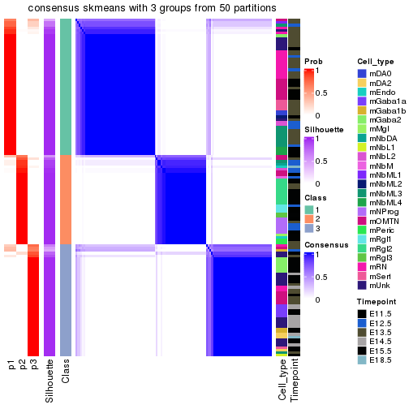</p>

</div>
<div id='tab-node-0222-consensus-heatmap-3'>
<pre><code class="r">consensus_heatmap(res, k = 4)
</code></pre>

<p></p>

</div>
</div>

Heatmaps for the membership of samples in all partitions to see how consistent they are:


<script>
$( function() {
	$( '#tabs-node-0222-membership-heatmap' ).tabs();
} );
</script>
<div id='tabs-node-0222-membership-heatmap'>
<ul>
<li><a href='#tab-node-0222-membership-heatmap-1'>k = 2</a></li>
<li><a href='#tab-node-0222-membership-heatmap-2'>k = 3</a></li>
<li><a href='#tab-node-0222-membership-heatmap-3'>k = 4</a></li>
</ul>
<div id='tab-node-0222-membership-heatmap-1'>
<pre><code class="r">membership_heatmap(res, k = 2)
</code></pre>

<p></p>

</div>
<div id='tab-node-0222-membership-heatmap-2'>
<pre><code class="r">membership_heatmap(res, k = 3)
</code></pre>

<p></p>

</div>
<div id='tab-node-0222-membership-heatmap-3'>
<pre><code class="r">membership_heatmap(res, k = 4)
</code></pre>

<p></p>

</div>
</div>

As soon as the classes for columns are determined, the signatures
that are significantly different between subgroups can be looked for. 
Following are the heatmaps for signatures.


Signature heatmaps where rows are scaled:


<script>
$( function() {
	$( '#tabs-node-0222-get-signatures' ).tabs();
} );
</script>
<div id='tabs-node-0222-get-signatures'>
<ul>
<li><a href='#tab-node-0222-get-signatures-1'>k = 2</a></li>
<li><a href='#tab-node-0222-get-signatures-2'>k = 3</a></li>
<li><a href='#tab-node-0222-get-signatures-3'>k = 4</a></li>
</ul>
<div id='tab-node-0222-get-signatures-1'>
<pre><code class="r">get_signatures(res, k = 2)
</code></pre>

<p></p>

</div>
<div id='tab-node-0222-get-signatures-2'>
<pre><code class="r">get_signatures(res, k = 3)
</code></pre>

<p></p>

</div>
<div id='tab-node-0222-get-signatures-3'>
<pre><code class="r">get_signatures(res, k = 4)
</code></pre>

<p></p>

</div>
</div>


Signature heatmaps where rows are not scaled:


<script>
$( function() {
	$( '#tabs-node-0222-get-signatures-no-scale' ).tabs();
} );
</script>
<div id='tabs-node-0222-get-signatures-no-scale'>
<ul>
<li><a href='#tab-node-0222-get-signatures-no-scale-1'>k = 2</a></li>
<li><a href='#tab-node-0222-get-signatures-no-scale-2'>k = 3</a></li>
<li><a href='#tab-node-0222-get-signatures-no-scale-3'>k = 4</a></li>
</ul>
<div id='tab-node-0222-get-signatures-no-scale-1'>
<pre><code class="r">get_signatures(res, k = 2, scale_rows = FALSE)
</code></pre>

<p></p>

</div>
<div id='tab-node-0222-get-signatures-no-scale-2'>
<pre><code class="r">get_signatures(res, k = 3, scale_rows = FALSE)
</code></pre>

<p></p>

</div>
<div id='tab-node-0222-get-signatures-no-scale-3'>
<pre><code class="r">get_signatures(res, k = 4, scale_rows = FALSE)
</code></pre>

<p></p>

</div>
</div>


Compare the overlap of signatures from different k:

```r
compare_signatures(res)
```

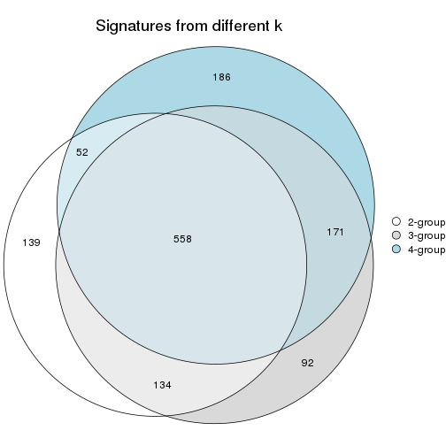

`get_signature()` returns a data frame invisibly. To get the list of signatures, the function
call should be assigned to a variable explicitly. In following code, if `plot` argument is set
to `FALSE`, no heatmap is plotted while only the differential analysis is performed.

```r
# code only for demonstration
tb = get_signature(res, k = ..., plot = FALSE)
```

An example of the output of `tb` is:

```
#>   which_row         fdr    mean_1    mean_2 scaled_mean_1 scaled_mean_2 km
#> 1        38 0.042760348  8.373488  9.131774    -0.5533452     0.5164555  1
#> 2        40 0.018707592  7.106213  8.469186    -0.6173731     0.5762149  1
#> 3        55 0.019134737 10.221463 11.207825    -0.6159697     0.5749050  1
#> 4        59 0.006059896  5.921854  7.869574    -0.6899429     0.6439467  1
#> 5        60 0.018055526  8.928898 10.211722    -0.6204761     0.5791110  1
#> 6        98 0.009384629 15.714769 14.887706     0.6635654    -0.6193277  2
...
```

The columns in `tb` are:

1. `which_row`: row indices corresponding to the input matrix.
2. `fdr`: FDR for the differential test. 
3. `mean_x`: The mean value in group x.
4. `scaled_mean_x`: The mean value in group x after rows are scaled.
5. `km`: Row groups if k-means clustering is applied to rows (which is done by automatically selecting number of clusters).

If there are too many signatures, `top_signatures = ...` can be set to only show the 
signatures with the highest FDRs:

```r
# code only for demonstration
# e.g. to show the top 500 most significant rows
tb = get_signature(res, k = ..., top_signatures = 500)
```

If the signatures are defined as these which are uniquely high in current group, `diff_method` argument
can be set to `"uniquely_high_in_one_group"`:

```r
# code only for demonstration
tb = get_signature(res, k = ..., diff_method = "uniquely_high_in_one_group")
```


UMAP plot which shows how samples are separated.


<script>
$( function() {
	$( '#tabs-node-0222-dimension-reduction' ).tabs();
} );
</script>
<div id='tabs-node-0222-dimension-reduction'>
<ul>
<li><a href='#tab-node-0222-dimension-reduction-1'>k = 2</a></li>
<li><a href='#tab-node-0222-dimension-reduction-2'>k = 3</a></li>
<li><a href='#tab-node-0222-dimension-reduction-3'>k = 4</a></li>
</ul>
<div id='tab-node-0222-dimension-reduction-1'>
<pre><code class="r">dimension_reduction(res, k = 2, method = &quot;UMAP&quot;)
</code></pre>

<p></p>

</div>
<div id='tab-node-0222-dimension-reduction-2'>
<pre><code class="r">dimension_reduction(res, k = 3, method = &quot;UMAP&quot;)
</code></pre>

<p></p>

</div>
<div id='tab-node-0222-dimension-reduction-3'>
<pre><code class="r">dimension_reduction(res, k = 4, method = &quot;UMAP&quot;)
</code></pre>

<p></p>

</div>
</div>


Following heatmap shows how subgroups are split when increasing `k`:

```r
collect_classes(res)
```

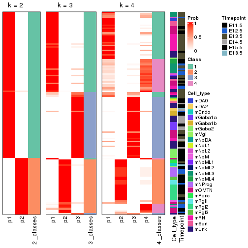


Test correlation between subgroups and known annotations. If the known
annotation is numeric, one-way ANOVA test is applied, and if the known
annotation is discrete, chi-squared contingency table test is applied.

```r
test_to_known_factors(res)
```

```
#>             n_sample Cell_type(p-value) Timepoint(p-value) k
#> ATC:skmeans      129           2.96e-11           5.05e-04 2
#> ATC:skmeans      126           5.88e-14           4.81e-13 3
#> ATC:skmeans      113           5.03e-16           6.09e-15 4
```


If matrix rows can be associated to genes, consider to use `functional_enrichment(res,
...)` to perform function enrichment for the signature genes. See [this vignette](https://jokergoo.github.io/cola_vignettes/functional_enrichment.html) for more detailed explanations.


 

---------------------------------------------------


### Node023


Parent node: [Node02](#Node02).
Child nodes: 
                [Node0121](#Node0121)
        ,
                [Node0122](#Node0122)
        ,
                Node0123-leaf
        ,
                [Node0131](#Node0131)
        ,
                Node0132-leaf
        ,
                Node0133-leaf
        ,
                [Node0221](#Node0221)
        ,
                [Node0222](#Node0222)
        ,
                Node0231-leaf
        ,
                Node0232-leaf
        ,
                Node0233-leaf
        ,
                [Node0311](#Node0311)
        ,
                [Node0312](#Node0312)
        ,
                Node0321-leaf
        ,
                Node0322-leaf
        ,
                Node0323-leaf
        ,
                Node0324-leaf
        .


The object with results only for a single top-value method and a single partitioning method 
can be extracted as:

```r
res = res_rh["023"]
```

A summary of `res` and all the functions that can be applied to it:

```r
res
```

```
#> A 'ConsensusPartition' object with k = 2, 3, 4.
#>   On a matrix with 8221 rows and 124 columns.
#>   Top rows (822) are extracted by 'ATC' method.
#>   Subgroups are detected by 'skmeans' method.
#>   Performed in total 150 partitions by row resampling.
#>   Best k for subgroups seems to be 3.
#> 
#> Following methods can be applied to this 'ConsensusPartition' object:
#>  [1] "cola_report"             "collect_classes"         "collect_plots"          
#>  [4] "collect_stats"           "colnames"                "compare_partitions"     
#>  [7] "compare_signatures"      "consensus_heatmap"       "dimension_reduction"    
#> [10] "functional_enrichment"   "get_anno_col"            "get_anno"               
#> [13] "get_classes"             "get_consensus"           "get_matrix"             
#> [16] "get_membership"          "get_param"               "get_signatures"         
#> [19] "get_stats"               "is_best_k"               "is_stable_k"            
#> [22] "membership_heatmap"      "ncol"                    "nrow"                   
#> [25] "plot_ecdf"               "predict_classes"         "rownames"               
#> [28] "select_partition_number" "show"                    "suggest_best_k"         
#> [31] "test_to_known_factors"   "top_rows_heatmap"
```

`collect_plots()` function collects all the plots made from `res` for all `k` (number of subgroups)
into one single page to provide an easy and fast comparison between different `k`.

```r
collect_plots(res)
```


The plots are:

- The first row: a plot of the eCDF (empirical cumulative distribution
  function) curves of the consensus matrix for each `k` and the heatmap of
  predicted classes for each `k`.
- The second row: heatmaps of the consensus matrix for each `k`.
- The third row: heatmaps of the membership matrix for each `k`.
- The fouth row: heatmaps of the signatures for each `k`.

All the plots in panels can be made by individual functions and they are
plotted later in this section.

`select_partition_number()` produces several plots showing different
statistics for choosing "optimized" `k`. There are following statistics:

- eCDF curves of the consensus matrix for each `k`;
- 1-PAC. [The PAC score](https://en.wikipedia.org/wiki/Consensus_clustering#Over-interpretation_potential_of_consensus_clustering)
  measures the proportion of the ambiguous subgrouping.
- Mean silhouette score.
- Concordance. The mean probability of fiting the consensus subgroup labels in all
  partitions.
- Area increased. Denote $A_k$ as the area under the eCDF curve for current
  `k`, the area increased is defined as $A_k - A_{k-1}$.
- Rand index. The percent of pairs of samples that are both in a same cluster
  or both are not in a same cluster in the partition of k and k-1.
- Jaccard index. The ratio of pairs of samples are both in a same cluster in
  the partition of k and k-1 and the pairs of samples are both in a same
  cluster in the partition k or k-1.

The detailed explanations of these statistics can be found in [the _cola_
vignette](https://jokergoo.github.io/cola_vignettes/cola.html#toc_13).

Generally speaking, higher 1-PAC score, higher mean silhouette score or higher
concordance corresponds to better partition. Rand index and Jaccard index
measure how similar the current partition is compared to partition with `k-1`.
If they are too similar, we won't accept `k` is better than `k-1`.

```r
select_partition_number(res)
```


The numeric values for all these statistics can be obtained by `get_stats()`.

```r
get_stats(res)
```

```
#>   k 1-PAC mean_silhouette concordance area_increased  Rand Jaccard
#> 2 2 1.000           0.971       0.988         0.4913 0.509   0.509
#> 3 3 1.000           0.976       0.990         0.3674 0.737   0.522
#> 4 4 0.817           0.831       0.908         0.0886 0.931   0.793
```

`suggest_best_k()` suggests the best $k$ based on these statistics. The rules are as follows:

- All $k$ with Jaccard index larger than 0.95 are removed because increasing
  $k$ does not provide enough extra information. If all $k$ are removed, it is
  marked as no subgroup is detected.
- For all $k$ with 1-PAC score larger than 0.9, the maximal $k$ is taken as
  the best $k$, and other $k$ are marked as optional $k$.
- If it does not fit the second rule. The $k$ with the maximal vote of the
  highest 1-PAC score, highest mean silhouette, and highest concordance is
  taken as the best $k$.

```r
suggest_best_k(res)
```

```
#> [1] 3
#> attr(,"optional")
#> [1] 2
```

There is also optional best $k$ = 2 that is worth to check.

Following is the table of the partitions (You need to click the **show/hide
code output** link to see it). The membership matrix (columns with name `p*`)
is inferred by
[`clue::cl_consensus()`](https://www.rdocumentation.org/link/cl_consensus?package=clue)
function with the `SE` method. Basically the value in the membership matrix
represents the probability to belong to a certain group. The finall subgroup
label for an item is determined with the group with highest probability it
belongs to.

In `get_classes()` function, the entropy is calculated from the membership
matrix and the silhouette score is calculated from the consensus matrix.


<script>
$( function() {
	$( '#tabs-node-023-get-classes' ).tabs();
} );
</script>
<div id='tabs-node-023-get-classes'>
<ul>
<li><a href='#tab-node-023-get-classes-1'>k = 2</a></li>
<li><a href='#tab-node-023-get-classes-2'>k = 3</a></li>
<li><a href='#tab-node-023-get-classes-3'>k = 4</a></li>
</ul>

<div id='tab-node-023-get-classes-1'>
<p><a id='tab-node-023-get-classes-1-a' style='color:#0366d6' href='#'>show/hide code output</a></p>
<pre><code class="r">cbind(get_classes(res, k = 2), get_membership(res, k = 2))
</code></pre>

<pre><code>#&gt;                class entropy silhouette   p1   p2
#&gt; 1772071050_B06     2   0.000      0.989 0.00 1.00
#&gt; 1772071065_E04     2   0.327      0.932 0.06 0.94
#&gt; 1772066085_E07     1   0.000      0.985 1.00 0.00
#&gt; 1772072246_E04     2   0.000      0.989 0.00 1.00
#&gt; 1772092007_H06     2   0.000      0.989 0.00 1.00
#&gt; 1772094159_G01     2   0.000      0.989 0.00 1.00
#&gt; 1772071050_G07     1   0.242      0.950 0.96 0.04
#&gt; 1772096114_F07     2   0.000      0.989 0.00 1.00
#&gt; 1772092007_G06     2   0.000      0.989 0.00 1.00
#&gt; 1772096114_A09     2   0.000      0.989 0.00 1.00
#&gt; 1772071065_F09     2   0.000      0.989 0.00 1.00
#&gt; 1772094171_C02     2   0.000      0.989 0.00 1.00
#&gt; 1772071049_C11     2   0.327      0.932 0.06 0.94
#&gt; 1772094169_B08     2   0.000      0.989 0.00 1.00
#&gt; 1772094158_H06     2   0.000      0.989 0.00 1.00
#&gt; 1772092007_C02     2   0.000      0.989 0.00 1.00
#&gt; 1772094171_B07     2   0.000      0.989 0.00 1.00
#&gt; 1772071065_A09     2   0.000      0.989 0.00 1.00
#&gt; 1772075302_B11     2   0.584      0.836 0.14 0.86
#&gt; 1772071065_A11     1   0.000      0.985 1.00 0.00
#&gt; 1772075300_G11     2   0.141      0.971 0.02 0.98
#&gt; 1772071046_G07     1   0.000      0.985 1.00 0.00
#&gt; 1772071046_E03     2   0.000      0.989 0.00 1.00
#&gt; 1772075301_G06     2   0.469      0.885 0.10 0.90
#&gt; 1772066093_D06     1   0.000      0.985 1.00 0.00
#&gt; 1772066087_H04     2   0.000      0.989 0.00 1.00
#&gt; 1772071046_C02     1   0.000      0.985 1.00 0.00
#&gt; 1772066093_G07     2   0.958      0.384 0.38 0.62
#&gt; 1772071048_E07     1   0.000      0.985 1.00 0.00
#&gt; 1772066093_B03     2   0.000      0.989 0.00 1.00
#&gt; 1772071048_E09     1   0.000      0.985 1.00 0.00
#&gt; 1772075302_E07     2   0.000      0.989 0.00 1.00
#&gt; 1772071065_B11     1   0.000      0.985 1.00 0.00
#&gt; 1772072249_F02     2   0.000      0.989 0.00 1.00
#&gt; 1772066093_E04     2   0.000      0.989 0.00 1.00
#&gt; 1772066093_C06     1   0.327      0.931 0.94 0.06
#&gt; 1772071049_C09     2   0.000      0.989 0.00 1.00
#&gt; 1772075301_B08     2   0.000      0.989 0.00 1.00
#&gt; 1772071050_E02     1   0.000      0.985 1.00 0.00
#&gt; 1772094169_B02     2   0.000      0.989 0.00 1.00
#&gt; 1772066093_G09     2   0.000      0.989 0.00 1.00
#&gt; 1772094175_D08     2   0.000      0.989 0.00 1.00
#&gt; 1771013111_C09     2   0.000      0.989 0.00 1.00
#&gt; 1772071050_G02     2   0.000      0.989 0.00 1.00
#&gt; 1772096114_A06     2   0.000      0.989 0.00 1.00
#&gt; 1772066093_G11     2   0.000      0.989 0.00 1.00
#&gt; 1772075301_F08     2   0.000      0.989 0.00 1.00
#&gt; 1772071049_H02     2   0.000      0.989 0.00 1.00
#&gt; 1772071065_A02     2   0.000      0.989 0.00 1.00
#&gt; 1772071065_H06     2   0.000      0.989 0.00 1.00
#&gt; 1772071065_H02     1   0.141      0.969 0.98 0.02
#&gt; 1772075301_C12     2   0.000      0.989 0.00 1.00
#&gt; 1772075301_F10     2   0.000      0.989 0.00 1.00
#&gt; 1772075301_F06     2   0.000      0.989 0.00 1.00
#&gt; 1772075301_D10     2   0.000      0.989 0.00 1.00
#&gt; 1772075301_E02     2   0.000      0.989 0.00 1.00
#&gt; 1772075301_C02     2   0.000      0.989 0.00 1.00
#&gt; 1772075301_H04     2   0.000      0.989 0.00 1.00
#&gt; 1772075301_B07     2   0.000      0.989 0.00 1.00
#&gt; 1772075301_A02     2   0.000      0.989 0.00 1.00
#&gt; 1772075301_E10     2   0.000      0.989 0.00 1.00
#&gt; 1772072248_C11     2   0.000      0.989 0.00 1.00
#&gt; 1772072246_D02     2   0.000      0.989 0.00 1.00
#&gt; 1772072246_C07     2   0.000      0.989 0.00 1.00
#&gt; 1772075301_H10     2   0.000      0.989 0.00 1.00
#&gt; 1772075301_E09     2   0.000      0.989 0.00 1.00
#&gt; 1772075301_G04     2   0.000      0.989 0.00 1.00
#&gt; 1772071046_H12     2   0.000      0.989 0.00 1.00
#&gt; 1772066093_A10     2   0.000      0.989 0.00 1.00
#&gt; 1772066093_H12     2   0.000      0.989 0.00 1.00
#&gt; 1772075301_H11     2   0.000      0.989 0.00 1.00
#&gt; 1772075301_C09     2   0.000      0.989 0.00 1.00
#&gt; 1772075301_D04     2   0.000      0.989 0.00 1.00
#&gt; 1772075300_H07     2   0.000      0.989 0.00 1.00
#&gt; 1772075301_F09     2   0.000      0.989 0.00 1.00
#&gt; 1772071046_G01     1   0.000      0.985 1.00 0.00
#&gt; 1772072249_A08     1   0.000      0.985 1.00 0.00
#&gt; 1772066093_F07     1   0.000      0.985 1.00 0.00
#&gt; 1772072246_A03     1   0.000      0.985 1.00 0.00
#&gt; 1772071046_H07     1   0.000      0.985 1.00 0.00
#&gt; 1772066093_E09     1   0.000      0.985 1.00 0.00
#&gt; 1772071048_C02     1   0.000      0.985 1.00 0.00
#&gt; 1772075301_C04     1   0.000      0.985 1.00 0.00
#&gt; 1772071048_D06     1   0.000      0.985 1.00 0.00
#&gt; 1772071046_A11     1   0.000      0.985 1.00 0.00
#&gt; 1772072246_E10     1   0.000      0.985 1.00 0.00
#&gt; 1772071046_B06     1   0.000      0.985 1.00 0.00
#&gt; 1772072246_C01     1   0.000      0.985 1.00 0.00
#&gt; 1772071046_A09     1   0.000      0.985 1.00 0.00
#&gt; 1772075300_F06     1   0.000      0.985 1.00 0.00
#&gt; 1772075301_B04     1   0.402      0.909 0.92 0.08
#&gt; 1772066093_D11     1   0.000      0.985 1.00 0.00
#&gt; 1772071046_H02     1   0.000      0.985 1.00 0.00
#&gt; 1772071046_F02     1   0.000      0.985 1.00 0.00
#&gt; 1772066093_A06     2   0.000      0.989 0.00 1.00
#&gt; 1772071046_A02     1   0.000      0.985 1.00 0.00
#&gt; 1772071046_A06     2   0.000      0.989 0.00 1.00
#&gt; 1772066093_H11     1   0.000      0.985 1.00 0.00
#&gt; 1772066093_C11     1   0.000      0.985 1.00 0.00
#&gt; 1772066093_F02     1   0.000      0.985 1.00 0.00
#&gt; 1772075301_D12     1   0.000      0.985 1.00 0.00
#&gt; 1772066093_H07     1   0.469      0.886 0.90 0.10
#&gt; 1772066093_H02     1   0.000      0.985 1.00 0.00
#&gt; 1772071046_E11     1   0.000      0.985 1.00 0.00
#&gt; 1772072249_D10     1   0.000      0.985 1.00 0.00
#&gt; 1772071046_F04     1   0.000      0.985 1.00 0.00
#&gt; 1772066093_E02     2   0.000      0.989 0.00 1.00
#&gt; 1772071065_B07     2   0.000      0.989 0.00 1.00
#&gt; 1772071048_G11     2   0.000      0.989 0.00 1.00
#&gt; 1772071048_C04     2   0.000      0.989 0.00 1.00
#&gt; 1772072249_A04     1   0.000      0.985 1.00 0.00
#&gt; 1772066085_H06     2   0.000      0.989 0.00 1.00
#&gt; 1772075301_A10     2   0.000      0.989 0.00 1.00
#&gt; 1772075301_B02     2   0.000      0.989 0.00 1.00
#&gt; 1772072246_E08     1   0.000      0.985 1.00 0.00
#&gt; 1772071046_F11     1   0.990      0.208 0.56 0.44
#&gt; 1772072246_C08     1   0.141      0.968 0.98 0.02
#&gt; 1772072246_D03     1   0.000      0.985 1.00 0.00
#&gt; 1772072246_D10     1   0.000      0.985 1.00 0.00
#&gt; 1772072246_B06     1   0.000      0.985 1.00 0.00
#&gt; 1772072246_E11     1   0.000      0.985 1.00 0.00
#&gt; 1772072246_D04     1   0.000      0.985 1.00 0.00
#&gt; 1772072246_A12     1   0.000      0.985 1.00 0.00
#&gt; 1772066085_C01     1   0.000      0.985 1.00 0.00
</code></pre>

<script>
$('#tab-node-023-get-classes-1-a').parent().next().next().hide();
$('#tab-node-023-get-classes-1-a').click(function(){
  $('#tab-node-023-get-classes-1-a').parent().next().next().toggle();
  return(false);
});
</script>
</div>

<div id='tab-node-023-get-classes-2'>
<p><a id='tab-node-023-get-classes-2-a' style='color:#0366d6' href='#'>show/hide code output</a></p>
<pre><code class="r">cbind(get_classes(res, k = 3), get_membership(res, k = 3))
</code></pre>

<pre><code>#&gt;                class entropy silhouette   p1   p2   p3
#&gt; 1772071050_B06     3  0.0000     0.9798 0.00 0.00 1.00
#&gt; 1772071065_E04     3  0.0000     0.9798 0.00 0.00 1.00
#&gt; 1772066085_E07     1  0.0000     1.0000 1.00 0.00 0.00
#&gt; 1772072246_E04     2  0.0000     0.9890 0.00 1.00 0.00
#&gt; 1772092007_H06     3  0.0000     0.9798 0.00 0.00 1.00
#&gt; 1772094159_G01     3  0.0892     0.9623 0.00 0.02 0.98
#&gt; 1772071050_G07     3  0.0000     0.9798 0.00 0.00 1.00
#&gt; 1772096114_F07     3  0.0000     0.9798 0.00 0.00 1.00
#&gt; 1772092007_G06     3  0.0000     0.9798 0.00 0.00 1.00
#&gt; 1772096114_A09     3  0.0000     0.9798 0.00 0.00 1.00
#&gt; 1772071065_F09     3  0.4555     0.7418 0.00 0.20 0.80
#&gt; 1772094171_C02     3  0.2066     0.9225 0.00 0.06 0.94
#&gt; 1772071049_C11     3  0.0000     0.9798 0.00 0.00 1.00
#&gt; 1772094169_B08     3  0.0000     0.9798 0.00 0.00 1.00
#&gt; 1772094158_H06     3  0.0000     0.9798 0.00 0.00 1.00
#&gt; 1772092007_C02     3  0.0000     0.9798 0.00 0.00 1.00
#&gt; 1772094171_B07     3  0.0000     0.9798 0.00 0.00 1.00
#&gt; 1772071065_A09     3  0.0000     0.9798 0.00 0.00 1.00
#&gt; 1772075302_B11     3  0.0000     0.9798 0.00 0.00 1.00
#&gt; 1772071065_A11     3  0.0000     0.9798 0.00 0.00 1.00
#&gt; 1772075300_G11     3  0.0000     0.9798 0.00 0.00 1.00
#&gt; 1772071046_G07     1  0.0000     1.0000 1.00 0.00 0.00
#&gt; 1772071046_E03     2  0.0000     0.9890 0.00 1.00 0.00
#&gt; 1772075301_G06     2  0.0000     0.9890 0.00 1.00 0.00
#&gt; 1772066093_D06     1  0.0000     1.0000 1.00 0.00 0.00
#&gt; 1772066087_H04     2  0.0000     0.9890 0.00 1.00 0.00
#&gt; 1772071046_C02     1  0.0000     1.0000 1.00 0.00 0.00
#&gt; 1772066093_G07     3  0.0000     0.9798 0.00 0.00 1.00
#&gt; 1772071048_E07     1  0.0000     1.0000 1.00 0.00 0.00
#&gt; 1772066093_B03     2  0.0000     0.9890 0.00 1.00 0.00
#&gt; 1772071048_E09     1  0.0000     1.0000 1.00 0.00 0.00
#&gt; 1772075302_E07     3  0.0000     0.9798 0.00 0.00 1.00
#&gt; 1772071065_B11     1  0.0000     1.0000 1.00 0.00 0.00
#&gt; 1772072249_F02     2  0.0000     0.9890 0.00 1.00 0.00
#&gt; 1772066093_E04     2  0.0000     0.9890 0.00 1.00 0.00
#&gt; 1772066093_C06     3  0.0000     0.9798 0.00 0.00 1.00
#&gt; 1772071049_C09     3  0.0000     0.9798 0.00 0.00 1.00
#&gt; 1772075301_B08     2  0.0000     0.9890 0.00 1.00 0.00
#&gt; 1772071050_E02     1  0.0000     1.0000 1.00 0.00 0.00
#&gt; 1772094169_B02     3  0.0000     0.9798 0.00 0.00 1.00
#&gt; 1772066093_G09     3  0.0000     0.9798 0.00 0.00 1.00
#&gt; 1772094175_D08     2  0.0000     0.9890 0.00 1.00 0.00
#&gt; 1771013111_C09     3  0.0000     0.9798 0.00 0.00 1.00
#&gt; 1772071050_G02     3  0.0000     0.9798 0.00 0.00 1.00
#&gt; 1772096114_A06     3  0.0000     0.9798 0.00 0.00 1.00
#&gt; 1772066093_G11     2  0.5016     0.6839 0.00 0.76 0.24
#&gt; 1772075301_F08     2  0.0000     0.9890 0.00 1.00 0.00
#&gt; 1772071049_H02     3  0.0000     0.9798 0.00 0.00 1.00
#&gt; 1772071065_A02     3  0.0000     0.9798 0.00 0.00 1.00
#&gt; 1772071065_H06     3  0.0000     0.9798 0.00 0.00 1.00
#&gt; 1772071065_H02     3  0.0000     0.9798 0.00 0.00 1.00
#&gt; 1772075301_C12     2  0.0000     0.9890 0.00 1.00 0.00
#&gt; 1772075301_F10     2  0.0000     0.9890 0.00 1.00 0.00
#&gt; 1772075301_F06     2  0.0000     0.9890 0.00 1.00 0.00
#&gt; 1772075301_D10     2  0.0000     0.9890 0.00 1.00 0.00
#&gt; 1772075301_E02     2  0.0000     0.9890 0.00 1.00 0.00
#&gt; 1772075301_C02     2  0.0000     0.9890 0.00 1.00 0.00
#&gt; 1772075301_H04     2  0.0000     0.9890 0.00 1.00 0.00
#&gt; 1772075301_B07     2  0.0000     0.9890 0.00 1.00 0.00
#&gt; 1772075301_A02     2  0.0000     0.9890 0.00 1.00 0.00
#&gt; 1772075301_E10     2  0.0000     0.9890 0.00 1.00 0.00
#&gt; 1772072248_C11     2  0.0000     0.9890 0.00 1.00 0.00
#&gt; 1772072246_D02     2  0.0000     0.9890 0.00 1.00 0.00
#&gt; 1772072246_C07     2  0.0000     0.9890 0.00 1.00 0.00
#&gt; 1772075301_H10     2  0.0000     0.9890 0.00 1.00 0.00
#&gt; 1772075301_E09     2  0.0000     0.9890 0.00 1.00 0.00
#&gt; 1772075301_G04     2  0.0000     0.9890 0.00 1.00 0.00
#&gt; 1772071046_H12     2  0.0000     0.9890 0.00 1.00 0.00
#&gt; 1772066093_A10     2  0.0000     0.9890 0.00 1.00 0.00
#&gt; 1772066093_H12     2  0.0000     0.9890 0.00 1.00 0.00
#&gt; 1772075301_H11     2  0.0000     0.9890 0.00 1.00 0.00
#&gt; 1772075301_C09     2  0.0000     0.9890 0.00 1.00 0.00
#&gt; 1772075301_D04     2  0.0000     0.9890 0.00 1.00 0.00
#&gt; 1772075300_H07     2  0.0000     0.9890 0.00 1.00 0.00
#&gt; 1772075301_F09     2  0.0000     0.9890 0.00 1.00 0.00
#&gt; 1772071046_G01     1  0.0000     1.0000 1.00 0.00 0.00
#&gt; 1772072249_A08     1  0.0000     1.0000 1.00 0.00 0.00
#&gt; 1772066093_F07     1  0.0000     1.0000 1.00 0.00 0.00
#&gt; 1772072246_A03     1  0.0000     1.0000 1.00 0.00 0.00
#&gt; 1772071046_H07     1  0.0000     1.0000 1.00 0.00 0.00
#&gt; 1772066093_E09     1  0.0000     1.0000 1.00 0.00 0.00
#&gt; 1772071048_C02     1  0.0000     1.0000 1.00 0.00 0.00
#&gt; 1772075301_C04     1  0.0000     1.0000 1.00 0.00 0.00
#&gt; 1772071048_D06     1  0.0000     1.0000 1.00 0.00 0.00
#&gt; 1772071046_A11     1  0.0000     1.0000 1.00 0.00 0.00
#&gt; 1772072246_E10     1  0.0000     1.0000 1.00 0.00 0.00
#&gt; 1772071046_B06     1  0.0000     1.0000 1.00 0.00 0.00
#&gt; 1772072246_C01     1  0.0000     1.0000 1.00 0.00 0.00
#&gt; 1772071046_A09     1  0.0000     1.0000 1.00 0.00 0.00
#&gt; 1772075300_F06     1  0.0000     1.0000 1.00 0.00 0.00
#&gt; 1772075301_B04     2  0.2537     0.9097 0.08 0.92 0.00
#&gt; 1772066093_D11     1  0.0000     1.0000 1.00 0.00 0.00
#&gt; 1772071046_H02     1  0.0000     1.0000 1.00 0.00 0.00
#&gt; 1772071046_F02     1  0.0000     1.0000 1.00 0.00 0.00
#&gt; 1772066093_A06     3  0.0000     0.9798 0.00 0.00 1.00
#&gt; 1772071046_A02     1  0.0000     1.0000 1.00 0.00 0.00
#&gt; 1772071046_A06     3  0.0000     0.9798 0.00 0.00 1.00
#&gt; 1772066093_H11     1  0.0000     1.0000 1.00 0.00 0.00
#&gt; 1772066093_C11     1  0.0000     1.0000 1.00 0.00 0.00
#&gt; 1772066093_F02     1  0.0000     1.0000 1.00 0.00 0.00
#&gt; 1772075301_D12     1  0.0000     1.0000 1.00 0.00 0.00
#&gt; 1772066093_H07     3  0.0000     0.9798 0.00 0.00 1.00
#&gt; 1772066093_H02     3  0.6302     0.0814 0.48 0.00 0.52
#&gt; 1772071046_E11     1  0.0000     1.0000 1.00 0.00 0.00
#&gt; 1772072249_D10     1  0.0000     1.0000 1.00 0.00 0.00
#&gt; 1772071046_F04     1  0.0000     1.0000 1.00 0.00 0.00
#&gt; 1772066093_E02     3  0.0000     0.9798 0.00 0.00 1.00
#&gt; 1772071065_B07     3  0.0000     0.9798 0.00 0.00 1.00
#&gt; 1772071048_G11     3  0.0000     0.9798 0.00 0.00 1.00
#&gt; 1772071048_C04     3  0.0000     0.9798 0.00 0.00 1.00
#&gt; 1772072249_A04     1  0.0000     1.0000 1.00 0.00 0.00
#&gt; 1772066085_H06     2  0.2537     0.9086 0.00 0.92 0.08
#&gt; 1772075301_A10     2  0.0000     0.9890 0.00 1.00 0.00
#&gt; 1772075301_B02     2  0.0000     0.9890 0.00 1.00 0.00
#&gt; 1772072246_E08     1  0.0000     1.0000 1.00 0.00 0.00
#&gt; 1772071046_F11     3  0.0892     0.9620 0.02 0.00 0.98
#&gt; 1772072246_C08     2  0.0892     0.9707 0.02 0.98 0.00
#&gt; 1772072246_D03     1  0.0000     1.0000 1.00 0.00 0.00
#&gt; 1772072246_D10     1  0.0000     1.0000 1.00 0.00 0.00
#&gt; 1772072246_B06     1  0.0000     1.0000 1.00 0.00 0.00
#&gt; 1772072246_E11     1  0.0000     1.0000 1.00 0.00 0.00
#&gt; 1772072246_D04     1  0.0000     1.0000 1.00 0.00 0.00
#&gt; 1772072246_A12     1  0.0000     1.0000 1.00 0.00 0.00
#&gt; 1772066085_C01     1  0.0000     1.0000 1.00 0.00 0.00
</code></pre>

<script>
$('#tab-node-023-get-classes-2-a').parent().next().next().hide();
$('#tab-node-023-get-classes-2-a').click(function(){
  $('#tab-node-023-get-classes-2-a').parent().next().next().toggle();
  return(false);
});
</script>
</div>

<div id='tab-node-023-get-classes-3'>
<p><a id='tab-node-023-get-classes-3-a' style='color:#0366d6' href='#'>show/hide code output</a></p>
<pre><code class="r">cbind(get_classes(res, k = 4), get_membership(res, k = 4))
</code></pre>

<pre><code>#&gt;                class entropy silhouette   p1   p2   p3   p4
#&gt; 1772071050_B06     3  0.2647      0.799 0.00 0.00 0.88 0.12
#&gt; 1772071065_E04     4  0.4977      0.393 0.00 0.00 0.46 0.54
#&gt; 1772066085_E07     1  0.0000      0.961 1.00 0.00 0.00 0.00
#&gt; 1772072246_E04     2  0.2011      0.880 0.00 0.92 0.08 0.00
#&gt; 1772092007_H06     3  0.3172      0.753 0.00 0.00 0.84 0.16
#&gt; 1772094159_G01     3  0.1637      0.813 0.00 0.06 0.94 0.00
#&gt; 1772071050_G07     4  0.4939      0.715 0.04 0.00 0.22 0.74
#&gt; 1772096114_F07     3  0.1211      0.858 0.00 0.00 0.96 0.04
#&gt; 1772092007_G06     3  0.1211      0.858 0.00 0.00 0.96 0.04
#&gt; 1772096114_A09     3  0.1637      0.849 0.00 0.00 0.94 0.06
#&gt; 1772071065_F09     3  0.4939      0.566 0.00 0.22 0.74 0.04
#&gt; 1772094171_C02     3  0.3198      0.759 0.00 0.08 0.88 0.04
#&gt; 1772071049_C11     4  0.5000      0.267 0.00 0.00 0.50 0.50
#&gt; 1772094169_B08     3  0.0000      0.861 0.00 0.00 1.00 0.00
#&gt; 1772094158_H06     3  0.1211      0.849 0.00 0.00 0.96 0.04
#&gt; 1772092007_C02     3  0.0000      0.861 0.00 0.00 1.00 0.00
#&gt; 1772094171_B07     3  0.1211      0.849 0.00 0.00 0.96 0.04
#&gt; 1772071065_A09     3  0.1637      0.849 0.00 0.00 0.94 0.06
#&gt; 1772075302_B11     3  0.4406      0.464 0.00 0.00 0.70 0.30
#&gt; 1772071065_A11     4  0.4134      0.704 0.00 0.00 0.26 0.74
#&gt; 1772075300_G11     4  0.4277      0.682 0.00 0.00 0.28 0.72
#&gt; 1772071046_G07     1  0.2345      0.919 0.90 0.00 0.00 0.10
#&gt; 1772071046_E03     2  0.2647      0.845 0.00 0.88 0.12 0.00
#&gt; 1772075301_G06     2  0.0707      0.919 0.00 0.98 0.00 0.02
#&gt; 1772066093_D06     1  0.0000      0.961 1.00 0.00 0.00 0.00
#&gt; 1772066087_H04     2  0.1637      0.897 0.00 0.94 0.06 0.00
#&gt; 1772071046_C02     1  0.0000      0.961 1.00 0.00 0.00 0.00
#&gt; 1772066093_G07     4  0.3610      0.726 0.00 0.00 0.20 0.80
#&gt; 1772071048_E07     1  0.0000      0.961 1.00 0.00 0.00 0.00
#&gt; 1772066093_B03     2  0.0000      0.929 0.00 1.00 0.00 0.00
#&gt; 1772071048_E09     1  0.3172      0.803 0.84 0.00 0.00 0.16
#&gt; 1772075302_E07     3  0.1211      0.858 0.00 0.00 0.96 0.04
#&gt; 1772071065_B11     1  0.1211      0.936 0.96 0.00 0.00 0.04
#&gt; 1772072249_F02     2  0.0000      0.929 0.00 1.00 0.00 0.00
#&gt; 1772066093_E04     2  0.2335      0.879 0.00 0.92 0.02 0.06
#&gt; 1772066093_C06     4  0.3172      0.722 0.00 0.00 0.16 0.84
#&gt; 1772071049_C09     3  0.0000      0.861 0.00 0.00 1.00 0.00
#&gt; 1772075301_B08     2  0.0000      0.929 0.00 1.00 0.00 0.00
#&gt; 1772071050_E02     1  0.1637      0.921 0.94 0.00 0.00 0.06
#&gt; 1772094169_B02     3  0.1211      0.849 0.00 0.00 0.96 0.04
#&gt; 1772066093_G09     3  0.1211      0.850 0.00 0.00 0.96 0.04
#&gt; 1772094175_D08     2  0.1211      0.909 0.00 0.96 0.04 0.00
#&gt; 1771013111_C09     3  0.0707      0.855 0.00 0.02 0.98 0.00
#&gt; 1772071050_G02     3  0.2921      0.781 0.00 0.00 0.86 0.14
#&gt; 1772096114_A06     3  0.0000      0.861 0.00 0.00 1.00 0.00
#&gt; 1772066093_G11     4  0.6500      0.505 0.00 0.26 0.12 0.62
#&gt; 1772075301_F08     2  0.2921      0.820 0.00 0.86 0.14 0.00
#&gt; 1772071049_H02     4  0.4907      0.467 0.00 0.00 0.42 0.58
#&gt; 1772071065_A02     3  0.1637      0.849 0.00 0.00 0.94 0.06
#&gt; 1772071065_H06     3  0.1637      0.849 0.00 0.00 0.94 0.06
#&gt; 1772071065_H02     4  0.4713      0.579 0.00 0.00 0.36 0.64
#&gt; 1772075301_C12     2  0.0000      0.929 0.00 1.00 0.00 0.00
#&gt; 1772075301_F10     2  0.0000      0.929 0.00 1.00 0.00 0.00
#&gt; 1772075301_F06     2  0.0000      0.929 0.00 1.00 0.00 0.00
#&gt; 1772075301_D10     2  0.0000      0.929 0.00 1.00 0.00 0.00
#&gt; 1772075301_E02     2  0.0000      0.929 0.00 1.00 0.00 0.00
#&gt; 1772075301_C02     2  0.0000      0.929 0.00 1.00 0.00 0.00
#&gt; 1772075301_H04     2  0.0000      0.929 0.00 1.00 0.00 0.00
#&gt; 1772075301_B07     2  0.0000      0.929 0.00 1.00 0.00 0.00
#&gt; 1772075301_A02     2  0.0000      0.929 0.00 1.00 0.00 0.00
#&gt; 1772075301_E10     2  0.0000      0.929 0.00 1.00 0.00 0.00
#&gt; 1772072248_C11     2  0.0707      0.920 0.00 0.98 0.02 0.00
#&gt; 1772072246_D02     2  0.0000      0.929 0.00 1.00 0.00 0.00
#&gt; 1772072246_C07     2  0.0000      0.929 0.00 1.00 0.00 0.00
#&gt; 1772075301_H10     2  0.0000      0.929 0.00 1.00 0.00 0.00
#&gt; 1772075301_E09     2  0.0000      0.929 0.00 1.00 0.00 0.00
#&gt; 1772075301_G04     2  0.0000      0.929 0.00 1.00 0.00 0.00
#&gt; 1772071046_H12     2  0.4624      0.533 0.00 0.66 0.34 0.00
#&gt; 1772066093_A10     2  0.4994      0.155 0.00 0.52 0.00 0.48
#&gt; 1772066093_H12     2  0.0000      0.929 0.00 1.00 0.00 0.00
#&gt; 1772075301_H11     2  0.0000      0.929 0.00 1.00 0.00 0.00
#&gt; 1772075301_C09     2  0.0000      0.929 0.00 1.00 0.00 0.00
#&gt; 1772075301_D04     2  0.0707      0.919 0.00 0.98 0.00 0.02
#&gt; 1772075300_H07     2  0.2411      0.886 0.00 0.92 0.04 0.04
#&gt; 1772075301_F09     2  0.0000      0.929 0.00 1.00 0.00 0.00
#&gt; 1772071046_G01     1  0.0000      0.961 1.00 0.00 0.00 0.00
#&gt; 1772072249_A08     1  0.2011      0.932 0.92 0.00 0.00 0.08
#&gt; 1772066093_F07     1  0.0707      0.956 0.98 0.00 0.00 0.02
#&gt; 1772072246_A03     1  0.0000      0.961 1.00 0.00 0.00 0.00
#&gt; 1772071046_H07     1  0.0000      0.961 1.00 0.00 0.00 0.00
#&gt; 1772066093_E09     1  0.0000      0.961 1.00 0.00 0.00 0.00
#&gt; 1772071048_C02     1  0.0000      0.961 1.00 0.00 0.00 0.00
#&gt; 1772075301_C04     1  0.0000      0.961 1.00 0.00 0.00 0.00
#&gt; 1772071048_D06     1  0.0000      0.961 1.00 0.00 0.00 0.00
#&gt; 1772071046_A11     1  0.0000      0.961 1.00 0.00 0.00 0.00
#&gt; 1772072246_E10     1  0.0000      0.961 1.00 0.00 0.00 0.00
#&gt; 1772071046_B06     1  0.0000      0.961 1.00 0.00 0.00 0.00
#&gt; 1772072246_C01     1  0.0000      0.961 1.00 0.00 0.00 0.00
#&gt; 1772071046_A09     1  0.2345      0.922 0.90 0.00 0.00 0.10
#&gt; 1772075300_F06     1  0.2647      0.907 0.88 0.00 0.00 0.12
#&gt; 1772075301_B04     2  0.6976      0.379 0.24 0.58 0.00 0.18
#&gt; 1772066093_D11     1  0.0000      0.961 1.00 0.00 0.00 0.00
#&gt; 1772071046_H02     1  0.0707      0.956 0.98 0.00 0.00 0.02
#&gt; 1772071046_F02     1  0.0000      0.961 1.00 0.00 0.00 0.00
#&gt; 1772066093_A06     4  0.3975      0.714 0.00 0.00 0.24 0.76
#&gt; 1772071046_A02     1  0.2345      0.921 0.90 0.00 0.00 0.10
#&gt; 1772071046_A06     3  0.1637      0.835 0.00 0.00 0.94 0.06
#&gt; 1772066093_H11     4  0.3801      0.578 0.22 0.00 0.00 0.78
#&gt; 1772066093_C11     4  0.4522      0.391 0.32 0.00 0.00 0.68
#&gt; 1772066093_F02     1  0.0000      0.961 1.00 0.00 0.00 0.00
#&gt; 1772075301_D12     1  0.0000      0.961 1.00 0.00 0.00 0.00
#&gt; 1772066093_H07     4  0.3606      0.721 0.02 0.00 0.14 0.84
#&gt; 1772066093_H02     4  0.1411      0.662 0.02 0.00 0.02 0.96
#&gt; 1772071046_E11     1  0.0000      0.961 1.00 0.00 0.00 0.00
#&gt; 1772072249_D10     1  0.3853      0.859 0.82 0.02 0.00 0.16
#&gt; 1772071046_F04     1  0.1637      0.940 0.94 0.00 0.00 0.06
#&gt; 1772066093_E02     4  0.4522      0.654 0.00 0.00 0.32 0.68
#&gt; 1772071065_B07     3  0.4855      0.133 0.00 0.00 0.60 0.40
#&gt; 1772071048_G11     3  0.0707      0.857 0.00 0.00 0.98 0.02
#&gt; 1772071048_C04     3  0.4277      0.543 0.00 0.00 0.72 0.28
#&gt; 1772072249_A04     1  0.3172      0.877 0.84 0.00 0.00 0.16
#&gt; 1772066085_H06     2  0.5487      0.353 0.00 0.58 0.40 0.02
#&gt; 1772075301_A10     2  0.0000      0.929 0.00 1.00 0.00 0.00
#&gt; 1772075301_B02     2  0.0707      0.919 0.00 0.98 0.02 0.00
#&gt; 1772072246_E08     1  0.2647      0.907 0.88 0.00 0.00 0.12
#&gt; 1772071046_F11     3  0.4284      0.655 0.02 0.00 0.78 0.20
#&gt; 1772072246_C08     2  0.4292      0.764 0.08 0.82 0.00 0.10
#&gt; 1772072246_D03     1  0.3606      0.876 0.84 0.02 0.00 0.14
#&gt; 1772072246_D10     1  0.0000      0.961 1.00 0.00 0.00 0.00
#&gt; 1772072246_B06     1  0.1211      0.949 0.96 0.00 0.00 0.04
#&gt; 1772072246_E11     1  0.0000      0.961 1.00 0.00 0.00 0.00
#&gt; 1772072246_D04     1  0.1211      0.949 0.96 0.00 0.00 0.04
#&gt; 1772072246_A12     1  0.2345      0.921 0.90 0.00 0.00 0.10
#&gt; 1772066085_C01     1  0.0000      0.961 1.00 0.00 0.00 0.00
</code></pre>

<script>
$('#tab-node-023-get-classes-3-a').parent().next().next().hide();
$('#tab-node-023-get-classes-3-a').click(function(){
  $('#tab-node-023-get-classes-3-a').parent().next().next().toggle();
  return(false);
});
</script>
</div>
</div>

Heatmaps for the consensus matrix. It visualizes the probability of two
samples to be in a same group.


<script>
$( function() {
	$( '#tabs-node-023-consensus-heatmap' ).tabs();
} );
</script>
<div id='tabs-node-023-consensus-heatmap'>
<ul>
<li><a href='#tab-node-023-consensus-heatmap-1'>k = 2</a></li>
<li><a href='#tab-node-023-consensus-heatmap-2'>k = 3</a></li>
<li><a href='#tab-node-023-consensus-heatmap-3'>k = 4</a></li>
</ul>
<div id='tab-node-023-consensus-heatmap-1'>
<pre><code class="r">consensus_heatmap(res, k = 2)
</code></pre>

<p></p>

</div>
<div id='tab-node-023-consensus-heatmap-2'>
<pre><code class="r">consensus_heatmap(res, k = 3)
</code></pre>

<p></p>

</div>
<div id='tab-node-023-consensus-heatmap-3'>
<pre><code class="r">consensus_heatmap(res, k = 4)
</code></pre>

<p></p>

</div>
</div>

Heatmaps for the membership of samples in all partitions to see how consistent they are:


<script>
$( function() {
	$( '#tabs-node-023-membership-heatmap' ).tabs();
} );
</script>
<div id='tabs-node-023-membership-heatmap'>
<ul>
<li><a href='#tab-node-023-membership-heatmap-1'>k = 2</a></li>
<li><a href='#tab-node-023-membership-heatmap-2'>k = 3</a></li>
<li><a href='#tab-node-023-membership-heatmap-3'>k = 4</a></li>
</ul>
<div id='tab-node-023-membership-heatmap-1'>
<pre><code class="r">membership_heatmap(res, k = 2)
</code></pre>

<p></p>

</div>
<div id='tab-node-023-membership-heatmap-2'>
<pre><code class="r">membership_heatmap(res, k = 3)
</code></pre>

<p></p>

</div>
<div id='tab-node-023-membership-heatmap-3'>
<pre><code class="r">membership_heatmap(res, k = 4)
</code></pre>

<p></p>

</div>
</div>

As soon as the classes for columns are determined, the signatures
that are significantly different between subgroups can be looked for. 
Following are the heatmaps for signatures.


Signature heatmaps where rows are scaled:


<script>
$( function() {
	$( '#tabs-node-023-get-signatures' ).tabs();
} );
</script>
<div id='tabs-node-023-get-signatures'>
<ul>
<li><a href='#tab-node-023-get-signatures-1'>k = 2</a></li>
<li><a href='#tab-node-023-get-signatures-2'>k = 3</a></li>
<li><a href='#tab-node-023-get-signatures-3'>k = 4</a></li>
</ul>
<div id='tab-node-023-get-signatures-1'>
<pre><code class="r">get_signatures(res, k = 2)
</code></pre>

<p></p>

</div>
<div id='tab-node-023-get-signatures-2'>
<pre><code class="r">get_signatures(res, k = 3)
</code></pre>

<p></p>

</div>
<div id='tab-node-023-get-signatures-3'>
<pre><code class="r">get_signatures(res, k = 4)
</code></pre>

<p></p>

</div>
</div>


Signature heatmaps where rows are not scaled:


<script>
$( function() {
	$( '#tabs-node-023-get-signatures-no-scale' ).tabs();
} );
</script>
<div id='tabs-node-023-get-signatures-no-scale'>
<ul>
<li><a href='#tab-node-023-get-signatures-no-scale-1'>k = 2</a></li>
<li><a href='#tab-node-023-get-signatures-no-scale-2'>k = 3</a></li>
<li><a href='#tab-node-023-get-signatures-no-scale-3'>k = 4</a></li>
</ul>
<div id='tab-node-023-get-signatures-no-scale-1'>
<pre><code class="r">get_signatures(res, k = 2, scale_rows = FALSE)
</code></pre>

<p></p>

</div>
<div id='tab-node-023-get-signatures-no-scale-2'>
<pre><code class="r">get_signatures(res, k = 3, scale_rows = FALSE)
</code></pre>

<p></p>

</div>
<div id='tab-node-023-get-signatures-no-scale-3'>
<pre><code class="r">get_signatures(res, k = 4, scale_rows = FALSE)
</code></pre>

<p></p>

</div>
</div>


Compare the overlap of signatures from different k:

```r
compare_signatures(res)
```


`get_signature()` returns a data frame invisibly. To get the list of signatures, the function
call should be assigned to a variable explicitly. In following code, if `plot` argument is set
to `FALSE`, no heatmap is plotted while only the differential analysis is performed.

```r
# code only for demonstration
tb = get_signature(res, k = ..., plot = FALSE)
```

An example of the output of `tb` is:

```
#>   which_row         fdr    mean_1    mean_2 scaled_mean_1 scaled_mean_2 km
#> 1        38 0.042760348  8.373488  9.131774    -0.5533452     0.5164555  1
#> 2        40 0.018707592  7.106213  8.469186    -0.6173731     0.5762149  1
#> 3        55 0.019134737 10.221463 11.207825    -0.6159697     0.5749050  1
#> 4        59 0.006059896  5.921854  7.869574    -0.6899429     0.6439467  1
#> 5        60 0.018055526  8.928898 10.211722    -0.6204761     0.5791110  1
#> 6        98 0.009384629 15.714769 14.887706     0.6635654    -0.6193277  2
...
```

The columns in `tb` are:

1. `which_row`: row indices corresponding to the input matrix.
2. `fdr`: FDR for the differential test. 
3. `mean_x`: The mean value in group x.
4. `scaled_mean_x`: The mean value in group x after rows are scaled.
5. `km`: Row groups if k-means clustering is applied to rows (which is done by automatically selecting number of clusters).

If there are too many signatures, `top_signatures = ...` can be set to only show the 
signatures with the highest FDRs:

```r
# code only for demonstration
# e.g. to show the top 500 most significant rows
tb = get_signature(res, k = ..., top_signatures = 500)
```

If the signatures are defined as these which are uniquely high in current group, `diff_method` argument
can be set to `"uniquely_high_in_one_group"`:

```r
# code only for demonstration
tb = get_signature(res, k = ..., diff_method = "uniquely_high_in_one_group")
```


UMAP plot which shows how samples are separated.


<script>
$( function() {
	$( '#tabs-node-023-dimension-reduction' ).tabs();
} );
</script>
<div id='tabs-node-023-dimension-reduction'>
<ul>
<li><a href='#tab-node-023-dimension-reduction-1'>k = 2</a></li>
<li><a href='#tab-node-023-dimension-reduction-2'>k = 3</a></li>
<li><a href='#tab-node-023-dimension-reduction-3'>k = 4</a></li>
</ul>
<div id='tab-node-023-dimension-reduction-1'>
<pre><code class="r">dimension_reduction(res, k = 2, method = &quot;UMAP&quot;)
</code></pre>

<p></p>

</div>
<div id='tab-node-023-dimension-reduction-2'>
<pre><code class="r">dimension_reduction(res, k = 3, method = &quot;UMAP&quot;)
</code></pre>

<p></p>

</div>
<div id='tab-node-023-dimension-reduction-3'>
<pre><code class="r">dimension_reduction(res, k = 4, method = &quot;UMAP&quot;)
</code></pre>

<p></p>

</div>
</div>


Following heatmap shows how subgroups are split when increasing `k`:

```r
collect_classes(res)
```


Test correlation between subgroups and known annotations. If the known
annotation is numeric, one-way ANOVA test is applied, and if the known
annotation is discrete, chi-squared contingency table test is applied.

```r
test_to_known_factors(res)
```

```
#>             n_sample Cell_type(p-value) Timepoint(p-value) k
#> ATC:skmeans      122           1.04e-01           3.32e-03 2
#> ATC:skmeans      123           6.62e-04           5.29e-13 3
#> ATC:skmeans      115           1.04e-05           3.74e-15 4
```


If matrix rows can be associated to genes, consider to use `functional_enrichment(res,
...)` to perform function enrichment for the signature genes. See [this vignette](https://jokergoo.github.io/cola_vignettes/functional_enrichment.html) for more detailed explanations.


 

---------------------------------------------------


### Node03


Parent node: [Node0](#Node0).
Child nodes: 
                Node011-leaf
        ,
                [Node012](#Node012)
        ,
                [Node013](#Node013)
        ,
                Node021-leaf
        ,
                [Node022](#Node022)
        ,
                [Node023](#Node023)
        ,
                [Node031](#Node031)
        ,
                [Node032](#Node032)
        .


The object with results only for a single top-value method and a single partitioning method 
can be extracted as:

```r
res = res_rh["03"]
```

A summary of `res` and all the functions that can be applied to it:

```r
res
```

```
#> A 'ConsensusPartition' object with k = 2, 3, 4.
#>   On a matrix with 9128 rows and 326 columns.
#>   Top rows (913) are extracted by 'ATC' method.
#>   Subgroups are detected by 'skmeans' method.
#>   Performed in total 150 partitions by row resampling.
#>   Best k for subgroups seems to be 4.
#> 
#> Following methods can be applied to this 'ConsensusPartition' object:
#>  [1] "cola_report"             "collect_classes"         "collect_plots"          
#>  [4] "collect_stats"           "colnames"                "compare_partitions"     
#>  [7] "compare_signatures"      "consensus_heatmap"       "dimension_reduction"    
#> [10] "functional_enrichment"   "get_anno_col"            "get_anno"               
#> [13] "get_classes"             "get_consensus"           "get_matrix"             
#> [16] "get_membership"          "get_param"               "get_signatures"         
#> [19] "get_stats"               "is_best_k"               "is_stable_k"            
#> [22] "membership_heatmap"      "ncol"                    "nrow"                   
#> [25] "plot_ecdf"               "predict_classes"         "rownames"               
#> [28] "select_partition_number" "show"                    "suggest_best_k"         
#> [31] "test_to_known_factors"   "top_rows_heatmap"
```

`collect_plots()` function collects all the plots made from `res` for all `k` (number of subgroups)
into one single page to provide an easy and fast comparison between different `k`.

```r
collect_plots(res)
```


The plots are:

- The first row: a plot of the eCDF (empirical cumulative distribution
  function) curves of the consensus matrix for each `k` and the heatmap of
  predicted classes for each `k`.
- The second row: heatmaps of the consensus matrix for each `k`.
- The third row: heatmaps of the membership matrix for each `k`.
- The fouth row: heatmaps of the signatures for each `k`.

All the plots in panels can be made by individual functions and they are
plotted later in this section.

`select_partition_number()` produces several plots showing different
statistics for choosing "optimized" `k`. There are following statistics:

- eCDF curves of the consensus matrix for each `k`;
- 1-PAC. [The PAC score](https://en.wikipedia.org/wiki/Consensus_clustering#Over-interpretation_potential_of_consensus_clustering)
  measures the proportion of the ambiguous subgrouping.
- Mean silhouette score.
- Concordance. The mean probability of fiting the consensus subgroup labels in all
  partitions.
- Area increased. Denote $A_k$ as the area under the eCDF curve for current
  `k`, the area increased is defined as $A_k - A_{k-1}$.
- Rand index. The percent of pairs of samples that are both in a same cluster
  or both are not in a same cluster in the partition of k and k-1.
- Jaccard index. The ratio of pairs of samples are both in a same cluster in
  the partition of k and k-1 and the pairs of samples are both in a same
  cluster in the partition k or k-1.

The detailed explanations of these statistics can be found in [the _cola_
vignette](https://jokergoo.github.io/cola_vignettes/cola.html#toc_13).

Generally speaking, higher 1-PAC score, higher mean silhouette score or higher
concordance corresponds to better partition. Rand index and Jaccard index
measure how similar the current partition is compared to partition with `k-1`.
If they are too similar, we won't accept `k` is better than `k-1`.

```r
select_partition_number(res)
```


The numeric values for all these statistics can be obtained by `get_stats()`.

```r
get_stats(res)
```

```
#>   k 1-PAC mean_silhouette concordance area_increased  Rand Jaccard
#> 2 2 1.000           0.994       0.998         0.4698 0.530   0.530
#> 3 3 0.958           0.945       0.978         0.4216 0.736   0.531
#> 4 4 0.923           0.903       0.950         0.0933 0.899   0.713
```

`suggest_best_k()` suggests the best $k$ based on these statistics. The rules are as follows:

- All $k$ with Jaccard index larger than 0.95 are removed because increasing
  $k$ does not provide enough extra information. If all $k$ are removed, it is
  marked as no subgroup is detected.
- For all $k$ with 1-PAC score larger than 0.9, the maximal $k$ is taken as
  the best $k$, and other $k$ are marked as optional $k$.
- If it does not fit the second rule. The $k$ with the maximal vote of the
  highest 1-PAC score, highest mean silhouette, and highest concordance is
  taken as the best $k$.

```r
suggest_best_k(res)
```

```
#> [1] 4
#> attr(,"optional")
#> [1] 2 3
```

There is also optional best $k$ = 2 3 that is worth to check.

Following is the table of the partitions (You need to click the **show/hide
code output** link to see it). The membership matrix (columns with name `p*`)
is inferred by
[`clue::cl_consensus()`](https://www.rdocumentation.org/link/cl_consensus?package=clue)
function with the `SE` method. Basically the value in the membership matrix
represents the probability to belong to a certain group. The finall subgroup
label for an item is determined with the group with highest probability it
belongs to.

In `get_classes()` function, the entropy is calculated from the membership
matrix and the silhouette score is calculated from the consensus matrix.


<script>
$( function() {
	$( '#tabs-node-03-get-classes' ).tabs();
} );
</script>
<div id='tabs-node-03-get-classes'>
<ul>
<li><a href='#tab-node-03-get-classes-1'>k = 2</a></li>
<li><a href='#tab-node-03-get-classes-2'>k = 3</a></li>
<li><a href='#tab-node-03-get-classes-3'>k = 4</a></li>
</ul>

<div id='tab-node-03-get-classes-1'>
<p><a id='tab-node-03-get-classes-1-a' style='color:#0366d6' href='#'>show/hide code output</a></p>
<pre><code class="r">cbind(get_classes(res, k = 2), get_membership(res, k = 2))
</code></pre>

<pre><code>#&gt;                class entropy silhouette   p1   p2
#&gt; 1772094146_G12     1   0.000      0.999 1.00 0.00
#&gt; 1772094146_G09     1   0.000      0.999 1.00 0.00
#&gt; 1772094169_H05     2   0.000      0.996 0.00 1.00
#&gt; 1772094169_H08     2   0.000      0.996 0.00 1.00
#&gt; 1772094171_C08     2   0.000      0.996 0.00 1.00
#&gt; 1772094156_E02     2   0.000      0.996 0.00 1.00
#&gt; 1771013153_A09     2   0.000      0.996 0.00 1.00
#&gt; 1772071049_B04     2   0.000      0.996 0.00 1.00
#&gt; 1772094169_E01     2   0.000      0.996 0.00 1.00
#&gt; 1772094144_B07     2   0.000      0.996 0.00 1.00
#&gt; 1772094171_E09     2   0.000      0.996 0.00 1.00
#&gt; 1772094158_C11     2   0.000      0.996 0.00 1.00
#&gt; 1772075303_B10     2   0.000      0.996 0.00 1.00
#&gt; 1772066093_E07     2   0.242      0.955 0.04 0.96
#&gt; 1772094171_G11     2   0.000      0.996 0.00 1.00
#&gt; 1772096112_A01     2   0.000      0.996 0.00 1.00
#&gt; 1772071050_C03     2   0.000      0.996 0.00 1.00
#&gt; 1772094156_G06     2   0.141      0.976 0.02 0.98
#&gt; 1772094169_A01     2   0.000      0.996 0.00 1.00
#&gt; 1771013153_D02     2   0.000      0.996 0.00 1.00
#&gt; 1772092007_E08     2   0.000      0.996 0.00 1.00
#&gt; 1772092007_F03     2   0.000      0.996 0.00 1.00
#&gt; 1771013153_B03     2   0.000      0.996 0.00 1.00
#&gt; 1772094166_C08     2   0.000      0.996 0.00 1.00
#&gt; 1772094156_B01     2   0.995      0.148 0.46 0.54
#&gt; 1772071049_D05     2   0.000      0.996 0.00 1.00
#&gt; 1772094169_C07     2   0.000      0.996 0.00 1.00
#&gt; 1772075303_B01     2   0.000      0.996 0.00 1.00
#&gt; 1772092007_G10     2   0.000      0.996 0.00 1.00
#&gt; 1772094156_D04     2   0.000      0.996 0.00 1.00
#&gt; 1772094144_G03     2   0.000      0.996 0.00 1.00
#&gt; 1772075302_D11     2   0.000      0.996 0.00 1.00
#&gt; 1772094169_B12     2   0.000      0.996 0.00 1.00
#&gt; 1772092007_F04     2   0.000      0.996 0.00 1.00
#&gt; 1772092007_C03     2   0.000      0.996 0.00 1.00
#&gt; 1772075303_H02     2   0.000      0.996 0.00 1.00
#&gt; 1772092007_A08     2   0.000      0.996 0.00 1.00
#&gt; 1772092006_F01     2   0.000      0.996 0.00 1.00
#&gt; 1772094158_D09     2   0.000      0.996 0.00 1.00
#&gt; 1772092007_B07     2   0.000      0.996 0.00 1.00
#&gt; 1772094158_G07     2   0.000      0.996 0.00 1.00
#&gt; 1772071065_G09     2   0.000      0.996 0.00 1.00
#&gt; 1772075302_G03     2   0.000      0.996 0.00 1.00
#&gt; 1772075302_C09     2   0.000      0.996 0.00 1.00
#&gt; 1772071065_D07     2   0.000      0.996 0.00 1.00
#&gt; 1771013108_A12     2   0.000      0.996 0.00 1.00
#&gt; 1772092007_G02     2   0.000      0.996 0.00 1.00
#&gt; 1772094159_F02     2   0.000      0.996 0.00 1.00
#&gt; 1772094161_B04     2   0.000      0.996 0.00 1.00
#&gt; 1772094161_G01     2   0.000      0.996 0.00 1.00
#&gt; 1772094156_E03     2   0.000      0.996 0.00 1.00
#&gt; 1772094172_D10     2   0.000      0.996 0.00 1.00
#&gt; 1772092007_H04     2   0.000      0.996 0.00 1.00
#&gt; 1772066085_A06     2   0.000      0.996 0.00 1.00
#&gt; 1772092007_A01     2   0.000      0.996 0.00 1.00
#&gt; 1771013153_E08     2   0.000      0.996 0.00 1.00
#&gt; 1772094166_F09     2   0.000      0.996 0.00 1.00
#&gt; 1772092007_G01     2   0.000      0.996 0.00 1.00
#&gt; 1772092007_B08     2   0.000      0.996 0.00 1.00
#&gt; 1772092007_F01     2   0.000      0.996 0.00 1.00
#&gt; 1772094169_D03     2   0.000      0.996 0.00 1.00
#&gt; 1771013153_A02     2   0.000      0.996 0.00 1.00
#&gt; 1772094173_B09     2   0.000      0.996 0.00 1.00
#&gt; 1772094173_C09     2   0.000      0.996 0.00 1.00
#&gt; 1772066084_E11     2   0.000      0.996 0.00 1.00
#&gt; 1772094156_D03     2   0.000      0.996 0.00 1.00
#&gt; 1772096112_C05     2   0.000      0.996 0.00 1.00
#&gt; 1772071065_E09     2   0.000      0.996 0.00 1.00
#&gt; 1772071046_G02     2   0.000      0.996 0.00 1.00
#&gt; 1772094172_H08     2   0.000      0.996 0.00 1.00
#&gt; 1772071065_A04     2   0.000      0.996 0.00 1.00
#&gt; 1772066091_F09     2   0.000      0.996 0.00 1.00
#&gt; 1772066091_C04     2   0.000      0.996 0.00 1.00
#&gt; 1772071048_H03     2   0.000      0.996 0.00 1.00
#&gt; 1772094158_H12     2   0.000      0.996 0.00 1.00
#&gt; 1772092006_C08     2   0.000      0.996 0.00 1.00
#&gt; 1772094158_G10     2   0.000      0.996 0.00 1.00
#&gt; 1772096111_C02     2   0.000      0.996 0.00 1.00
#&gt; 1772094171_D07     2   0.000      0.996 0.00 1.00
#&gt; 1772094175_C08     2   0.000      0.996 0.00 1.00
#&gt; 1772094173_B12     2   0.000      0.996 0.00 1.00
#&gt; 1772075301_H01     2   0.000      0.996 0.00 1.00
#&gt; 1772071048_D09     2   0.000      0.996 0.00 1.00
#&gt; 1772094175_E09     2   0.000      0.996 0.00 1.00
#&gt; 1772075300_E11     2   0.000      0.996 0.00 1.00
#&gt; 1772094175_B10     2   0.000      0.996 0.00 1.00
#&gt; 1772075300_C02     2   0.000      0.996 0.00 1.00
#&gt; 1772066085_F12     2   0.000      0.996 0.00 1.00
#&gt; 1772066093_H04     2   0.000      0.996 0.00 1.00
#&gt; 1772071065_G03     2   0.000      0.996 0.00 1.00
#&gt; 1772072247_D12     2   0.000      0.996 0.00 1.00
#&gt; 1772072246_A11     2   0.000      0.996 0.00 1.00
#&gt; 1772072247_H01     2   0.000      0.996 0.00 1.00
#&gt; 1772072249_D02     2   0.000      0.996 0.00 1.00
#&gt; 1772072247_F11     2   0.000      0.996 0.00 1.00
#&gt; 1772072247_C08     2   0.000      0.996 0.00 1.00
#&gt; 1772072249_B11     2   0.000      0.996 0.00 1.00
#&gt; 1772072249_C08     2   0.000      0.996 0.00 1.00
#&gt; 1772072248_D02     2   0.000      0.996 0.00 1.00
#&gt; 1772072247_G03     2   0.000      0.996 0.00 1.00
#&gt; 1772072247_D07     2   0.000      0.996 0.00 1.00
#&gt; 1772072249_E11     2   0.000      0.996 0.00 1.00
#&gt; 1772075300_B11     2   0.000      0.996 0.00 1.00
#&gt; 1772075300_B07     2   0.000      0.996 0.00 1.00
#&gt; 1772072248_F02     2   0.000      0.996 0.00 1.00
#&gt; 1772094175_F04     2   0.000      0.996 0.00 1.00
#&gt; 1772096115_B01     2   0.000      0.996 0.00 1.00
#&gt; 1772094172_G05     2   0.000      0.996 0.00 1.00
#&gt; 1772096111_F03     2   0.000      0.996 0.00 1.00
#&gt; 1772094172_F12     2   0.000      0.996 0.00 1.00
#&gt; 1772092007_C12     2   0.000      0.996 0.00 1.00
#&gt; 1772072246_C06     2   0.000      0.996 0.00 1.00
#&gt; 1772066084_A07     2   0.000      0.996 0.00 1.00
#&gt; 1772094146_C08     1   0.680      0.779 0.82 0.18
#&gt; 1772092007_D06     2   0.000      0.996 0.00 1.00
#&gt; 1772092006_G06     2   0.000      0.996 0.00 1.00
#&gt; 1772066084_B04     2   0.000      0.996 0.00 1.00
#&gt; 1772075302_F08     2   0.000      0.996 0.00 1.00
#&gt; 1772071065_B01     1   0.000      0.999 1.00 0.00
#&gt; 1771013118_H03     1   0.000      0.999 1.00 0.00
#&gt; 1772094144_F02     2   0.000      0.996 0.00 1.00
#&gt; 1772094144_A01     1   0.000      0.999 1.00 0.00
#&gt; 1772092007_C09     2   0.000      0.996 0.00 1.00
#&gt; 1772092006_H03     2   0.000      0.996 0.00 1.00
#&gt; 1772094175_D05     2   0.000      0.996 0.00 1.00
#&gt; 1772094158_F03     2   0.000      0.996 0.00 1.00
#&gt; 1772094158_B01     1   0.000      0.999 1.00 0.00
#&gt; 1772094144_A06     1   0.000      0.999 1.00 0.00
#&gt; 1772094156_B08     1   0.000      0.999 1.00 0.00
#&gt; 1772094146_C04     1   0.000      0.999 1.00 0.00
#&gt; 1771013013_H11     1   0.000      0.999 1.00 0.00
#&gt; 1772094166_E07     1   0.000      0.999 1.00 0.00
#&gt; 1772094161_C05     1   0.000      0.999 1.00 0.00
#&gt; 1772096114_C09     1   0.000      0.999 1.00 0.00
#&gt; 1772094171_D04     1   0.000      0.999 1.00 0.00
#&gt; 1772094144_H07     1   0.000      0.999 1.00 0.00
#&gt; 1772094144_F05     1   0.000      0.999 1.00 0.00
#&gt; 1772094161_E03     1   0.000      0.999 1.00 0.00
#&gt; 1772094171_H10     1   0.000      0.999 1.00 0.00
#&gt; 1772094146_D07     1   0.000      0.999 1.00 0.00
#&gt; 1772094144_E03     1   0.000      0.999 1.00 0.00
#&gt; 1772096111_H02     1   0.000      0.999 1.00 0.00
#&gt; 1772092006_D06     1   0.000      0.999 1.00 0.00
#&gt; 1772094144_B02     1   0.000      0.999 1.00 0.00
#&gt; 1771013113_B03     1   0.000      0.999 1.00 0.00
#&gt; 1772094169_G11     1   0.000      0.999 1.00 0.00
#&gt; 1771013013_C12     1   0.000      0.999 1.00 0.00
#&gt; 1772094146_F09     1   0.000      0.999 1.00 0.00
#&gt; 1772094146_A04     1   0.000      0.999 1.00 0.00
#&gt; 1772094146_A06     1   0.000      0.999 1.00 0.00
#&gt; 1772092007_A02     1   0.000      0.999 1.00 0.00
#&gt; 1772092007_D07     1   0.000      0.999 1.00 0.00
#&gt; 1772096114_E03     1   0.000      0.999 1.00 0.00
#&gt; 1772094169_B04     1   0.000      0.999 1.00 0.00
#&gt; 1772094144_B04     1   0.000      0.999 1.00 0.00
#&gt; 1772094146_E05     1   0.000      0.999 1.00 0.00
#&gt; 1772094172_H11     1   0.000      0.999 1.00 0.00
#&gt; 1771013013_G04     1   0.000      0.999 1.00 0.00
#&gt; 1772094166_A12     1   0.000      0.999 1.00 0.00
#&gt; 1772096115_E10     1   0.000      0.999 1.00 0.00
#&gt; 1772094166_B10     1   0.000      0.999 1.00 0.00
#&gt; 1772094146_E02     1   0.000      0.999 1.00 0.00
#&gt; 1772094171_H04     1   0.000      0.999 1.00 0.00
#&gt; 1772094156_B12     1   0.000      0.999 1.00 0.00
#&gt; 1772094144_F04     1   0.000      0.999 1.00 0.00
#&gt; 1772094158_E07     1   0.000      0.999 1.00 0.00
#&gt; 1772094171_B06     1   0.000      0.999 1.00 0.00
#&gt; 1771013013_H10     1   0.000      0.999 1.00 0.00
#&gt; 1772094144_D11     1   0.000      0.999 1.00 0.00
#&gt; 1772096114_E01     1   0.000      0.999 1.00 0.00
#&gt; 1771013118_A04     1   0.000      0.999 1.00 0.00
#&gt; 1772094146_D04     1   0.000      0.999 1.00 0.00
#&gt; 1772094146_G11     1   0.000      0.999 1.00 0.00
#&gt; 1772096115_E03     1   0.000      0.999 1.00 0.00
#&gt; 1772071065_C05     1   0.000      0.999 1.00 0.00
#&gt; 1771013013_B10     1   0.000      0.999 1.00 0.00
#&gt; 1771013108_E03     1   0.000      0.999 1.00 0.00
#&gt; 1772094158_D05     1   0.000      0.999 1.00 0.00
#&gt; 1771013113_G05     1   0.000      0.999 1.00 0.00
#&gt; 1772071046_D01     1   0.000      0.999 1.00 0.00
#&gt; 1771013118_E09     1   0.000      0.999 1.00 0.00
#&gt; 1771013013_E05     1   0.000      0.999 1.00 0.00
#&gt; 1772094146_G08     1   0.000      0.999 1.00 0.00
#&gt; 1772094146_H12     1   0.000      0.999 1.00 0.00
#&gt; 1772094144_D10     1   0.000      0.999 1.00 0.00
#&gt; 1772094146_D12     1   0.000      0.999 1.00 0.00
#&gt; 1772094166_E09     1   0.000      0.999 1.00 0.00
#&gt; 1772092007_F06     1   0.000      0.999 1.00 0.00
#&gt; 1772094171_B09     1   0.000      0.999 1.00 0.00
#&gt; 1772094146_A05     1   0.000      0.999 1.00 0.00
#&gt; 1772094146_C12     1   0.000      0.999 1.00 0.00
#&gt; 1772096111_F10     1   0.000      0.999 1.00 0.00
#&gt; 1772094169_D10     1   0.000      0.999 1.00 0.00
#&gt; 1772094146_A02     1   0.000      0.999 1.00 0.00
#&gt; 1772094144_C03     1   0.000      0.999 1.00 0.00
#&gt; 1772092006_C09     2   0.000      0.996 0.00 1.00
#&gt; 1772092007_A12     1   0.000      0.999 1.00 0.00
#&gt; 1772092007_D11     1   0.000      0.999 1.00 0.00
#&gt; 1772094144_C11     1   0.000      0.999 1.00 0.00
#&gt; 1772094146_H06     1   0.000      0.999 1.00 0.00
#&gt; 1771013113_F10     1   0.000      0.999 1.00 0.00
#&gt; 1772094144_H01     1   0.000      0.999 1.00 0.00
#&gt; 1772094144_B08     1   0.000      0.999 1.00 0.00
#&gt; 1772096112_F04     1   0.000      0.999 1.00 0.00
#&gt; 1772094144_D12     1   0.000      0.999 1.00 0.00
#&gt; 1772094144_B01     1   0.000      0.999 1.00 0.00
#&gt; 1772094146_G10     1   0.000      0.999 1.00 0.00
#&gt; 1772094144_A02     1   0.000      0.999 1.00 0.00
#&gt; 1772094144_E06     1   0.000      0.999 1.00 0.00
#&gt; 1772094166_G10     1   0.000      0.999 1.00 0.00
#&gt; 1772094146_D06     1   0.000      0.999 1.00 0.00
#&gt; 1772096112_F12     1   0.000      0.999 1.00 0.00
#&gt; 1772094146_B07     1   0.000      0.999 1.00 0.00
#&gt; 1772094166_D06     1   0.000      0.999 1.00 0.00
#&gt; 1771013118_F02     1   0.000      0.999 1.00 0.00
#&gt; 1772094146_D03     1   0.000      0.999 1.00 0.00
#&gt; 1772092006_G02     1   0.000      0.999 1.00 0.00
#&gt; 1772092007_H11     1   0.000      0.999 1.00 0.00
#&gt; 1772094161_D02     1   0.000      0.999 1.00 0.00
#&gt; 1772094144_H10     1   0.000      0.999 1.00 0.00
#&gt; 1772094144_D08     1   0.000      0.999 1.00 0.00
#&gt; 1772094146_D01     1   0.000      0.999 1.00 0.00
#&gt; 1772094146_C06     1   0.000      0.999 1.00 0.00
#&gt; 1772092007_E01     1   0.000      0.999 1.00 0.00
#&gt; 1772094146_H11     1   0.000      0.999 1.00 0.00
#&gt; 1772094146_D02     1   0.000      0.999 1.00 0.00
#&gt; 1772094146_C07     1   0.000      0.999 1.00 0.00
#&gt; 1772094144_G06     1   0.000      0.999 1.00 0.00
#&gt; 1772094166_C12     1   0.000      0.999 1.00 0.00
#&gt; 1772094146_B02     1   0.000      0.999 1.00 0.00
#&gt; 1771013118_F11     1   0.000      0.999 1.00 0.00
#&gt; 1772094146_F06     1   0.000      0.999 1.00 0.00
#&gt; 1772094146_B12     1   0.000      0.999 1.00 0.00
#&gt; 1772072246_D12     1   0.000      0.999 1.00 0.00
#&gt; 1772094173_H05     1   0.000      0.999 1.00 0.00
#&gt; 1772066085_G12     1   0.000      0.999 1.00 0.00
#&gt; 1772066084_H09     1   0.000      0.999 1.00 0.00
#&gt; 1772066087_B04     1   0.000      0.999 1.00 0.00
#&gt; 1772066085_D12     1   0.000      0.999 1.00 0.00
#&gt; 1772092006_A01     1   0.000      0.999 1.00 0.00
#&gt; 1772094161_C07     1   0.000      0.999 1.00 0.00
#&gt; 1772094159_D09     1   0.000      0.999 1.00 0.00
#&gt; 1772094144_D04     1   0.000      0.999 1.00 0.00
#&gt; 1772094146_D11     1   0.000      0.999 1.00 0.00
#&gt; 1772092007_A11     1   0.000      0.999 1.00 0.00
#&gt; 1771013110_F03     1   0.000      0.999 1.00 0.00
#&gt; 1772094146_A09     1   0.000      0.999 1.00 0.00
#&gt; 1772071050_F12     1   0.000      0.999 1.00 0.00
#&gt; 1772094144_A07     1   0.000      0.999 1.00 0.00
#&gt; 1772094144_H04     1   0.000      0.999 1.00 0.00
#&gt; 1772092007_A05     1   0.000      0.999 1.00 0.00
#&gt; 1772071049_G06     1   0.000      0.999 1.00 0.00
#&gt; 1771013113_F07     1   0.000      0.999 1.00 0.00
#&gt; 1772094169_H02     1   0.000      0.999 1.00 0.00
#&gt; 1772092006_E01     1   0.000      0.999 1.00 0.00
#&gt; 1772094169_G05     1   0.000      0.999 1.00 0.00
#&gt; 1772092007_E04     1   0.000      0.999 1.00 0.00
#&gt; 1772092007_B10     1   0.000      0.999 1.00 0.00
#&gt; 1771013113_A02     1   0.000      0.999 1.00 0.00
#&gt; 1771013153_F06     1   0.000      0.999 1.00 0.00
#&gt; 1772094146_G02     1   0.000      0.999 1.00 0.00
#&gt; 1771013118_H04     1   0.000      0.999 1.00 0.00
#&gt; 1772071050_B05     1   0.000      0.999 1.00 0.00
#&gt; 1772071049_G08     1   0.000      0.999 1.00 0.00
#&gt; 1771013013_C02     1   0.000      0.999 1.00 0.00
#&gt; 1772066085_B12     1   0.000      0.999 1.00 0.00
#&gt; 1772071049_A09     1   0.000      0.999 1.00 0.00
#&gt; 1772071050_D04     1   0.000      0.999 1.00 0.00
#&gt; 1772094174_F04     1   0.000      0.999 1.00 0.00
#&gt; 1772094161_C02     1   0.000      0.999 1.00 0.00
#&gt; 1771013117_D04     1   0.000      0.999 1.00 0.00
#&gt; 1772071065_E07     1   0.000      0.999 1.00 0.00
#&gt; 1772096114_G07     1   0.000      0.999 1.00 0.00
#&gt; 1772094166_E11     1   0.000      0.999 1.00 0.00
#&gt; 1772094173_H12     1   0.000      0.999 1.00 0.00
#&gt; 1772096114_B02     1   0.000      0.999 1.00 0.00
#&gt; 1772094173_D02     1   0.000      0.999 1.00 0.00
#&gt; 1772066085_B07     2   0.000      0.996 0.00 1.00
#&gt; 1772066085_C03     1   0.000      0.999 1.00 0.00
#&gt; 1772066085_F04     1   0.000      0.999 1.00 0.00
#&gt; 1772075300_B01     1   0.000      0.999 1.00 0.00
#&gt; 1772066091_H08     1   0.000      0.999 1.00 0.00
#&gt; 1772094175_B07     1   0.000      0.999 1.00 0.00
#&gt; 1772094173_G08     1   0.000      0.999 1.00 0.00
#&gt; 1772094172_G10     1   0.000      0.999 1.00 0.00
#&gt; 1772094173_A04     1   0.000      0.999 1.00 0.00
#&gt; 1772066087_G11     1   0.000      0.999 1.00 0.00
#&gt; 1772066084_G06     1   0.000      0.999 1.00 0.00
#&gt; 1772094175_F09     1   0.000      0.999 1.00 0.00
#&gt; 1772094173_B08     1   0.000      0.999 1.00 0.00
#&gt; 1772094175_E08     1   0.000      0.999 1.00 0.00
#&gt; 1772096111_C12     1   0.000      0.999 1.00 0.00
#&gt; 1772094173_G10     1   0.000      0.999 1.00 0.00
#&gt; 1772071065_H05     1   0.000      0.999 1.00 0.00
#&gt; 1772075303_E12     1   0.000      0.999 1.00 0.00
#&gt; 1772066085_H11     1   0.000      0.999 1.00 0.00
#&gt; 1772066084_H11     1   0.000      0.999 1.00 0.00
#&gt; 1772094175_G06     1   0.000      0.999 1.00 0.00
#&gt; 1772071049_C07     1   0.000      0.999 1.00 0.00
#&gt; 1772096114_H02     1   0.000      0.999 1.00 0.00
#&gt; 1772071065_B05     1   0.000      0.999 1.00 0.00
#&gt; 1772096114_E07     1   0.000      0.999 1.00 0.00
#&gt; 1772075302_B12     1   0.000      0.999 1.00 0.00
#&gt; 1772071049_A04     1   0.000      0.999 1.00 0.00
#&gt; 1772075302_F05     1   0.000      0.999 1.00 0.00
#&gt; 1772096111_D02     1   0.000      0.999 1.00 0.00
#&gt; 1772094146_F10     1   0.000      0.999 1.00 0.00
#&gt; 1771013118_F03     1   0.000      0.999 1.00 0.00
#&gt; 1772094146_B10     1   0.000      0.999 1.00 0.00
#&gt; 1771013013_E12     1   0.000      0.999 1.00 0.00
#&gt; 1771013013_D02     1   0.000      0.999 1.00 0.00
#&gt; 1772094163_F04     1   0.000      0.999 1.00 0.00
#&gt; 1772071049_B10     1   0.000      0.999 1.00 0.00
#&gt; 1772094146_E06     1   0.000      0.999 1.00 0.00
#&gt; 1772075302_G09     1   0.000      0.999 1.00 0.00
#&gt; 1771013118_G07     1   0.000      0.999 1.00 0.00
#&gt; 1772094144_B12     1   0.000      0.999 1.00 0.00
#&gt; 1771013013_A06     1   0.000      0.999 1.00 0.00
#&gt; 1772066085_C05     1   0.000      0.999 1.00 0.00
#&gt; 1772094166_F06     1   0.000      0.999 1.00 0.00
#&gt; 1772094144_D06     1   0.000      0.999 1.00 0.00
#&gt; 1771013013_B12     1   0.000      0.999 1.00 0.00
#&gt; 1772094166_E05     1   0.000      0.999 1.00 0.00
#&gt; 1772092006_D07     1   0.000      0.999 1.00 0.00
#&gt; 1772094163_F12     1   0.000      0.999 1.00 0.00
#&gt; 1772094146_G06     1   0.000      0.999 1.00 0.00
</code></pre>

<script>
$('#tab-node-03-get-classes-1-a').parent().next().next().hide();
$('#tab-node-03-get-classes-1-a').click(function(){
  $('#tab-node-03-get-classes-1-a').parent().next().next().toggle();
  return(false);
});
</script>
</div>

<div id='tab-node-03-get-classes-2'>
<p><a id='tab-node-03-get-classes-2-a' style='color:#0366d6' href='#'>show/hide code output</a></p>
<pre><code class="r">cbind(get_classes(res, k = 3), get_membership(res, k = 3))
</code></pre>

<pre><code>#&gt;                class entropy silhouette   p1   p2   p3
#&gt; 1772094146_G12     3  0.0000   0.976783 0.00 0.00 1.00
#&gt; 1772094146_G09     3  0.0000   0.976783 0.00 0.00 1.00
#&gt; 1772094169_H05     2  0.0000   0.989479 0.00 1.00 0.00
#&gt; 1772094169_H08     2  0.0000   0.989479 0.00 1.00 0.00
#&gt; 1772094171_C08     2  0.0000   0.989479 0.00 1.00 0.00
#&gt; 1772094156_E02     1  0.0000   0.964829 1.00 0.00 0.00
#&gt; 1771013153_A09     2  0.0892   0.970402 0.02 0.98 0.00
#&gt; 1772071049_B04     2  0.0000   0.989479 0.00 1.00 0.00
#&gt; 1772094169_E01     2  0.0000   0.989479 0.00 1.00 0.00
#&gt; 1772094144_B07     2  0.0000   0.989479 0.00 1.00 0.00
#&gt; 1772094171_E09     2  0.0000   0.989479 0.00 1.00 0.00
#&gt; 1772094158_C11     1  0.6309  -0.000708 0.50 0.50 0.00
#&gt; 1772075303_B10     1  0.0000   0.964829 1.00 0.00 0.00
#&gt; 1772066093_E07     1  0.0000   0.964829 1.00 0.00 0.00
#&gt; 1772094171_G11     3  0.6045   0.384593 0.00 0.38 0.62
#&gt; 1772096112_A01     2  0.0892   0.970466 0.00 0.98 0.02
#&gt; 1772071050_C03     1  0.6309  -0.000790 0.50 0.50 0.00
#&gt; 1772094156_G06     1  0.0000   0.964829 1.00 0.00 0.00
#&gt; 1772094169_A01     2  0.0000   0.989479 0.00 1.00 0.00
#&gt; 1771013153_D02     1  0.0000   0.964829 1.00 0.00 0.00
#&gt; 1772092007_E08     2  0.2537   0.906495 0.08 0.92 0.00
#&gt; 1772092007_F03     2  0.0000   0.989479 0.00 1.00 0.00
#&gt; 1771013153_B03     2  0.5706   0.521839 0.32 0.68 0.00
#&gt; 1772094166_C08     3  0.0000   0.976783 0.00 0.00 1.00
#&gt; 1772094156_B01     1  0.0000   0.964829 1.00 0.00 0.00
#&gt; 1772071049_D05     2  0.6280   0.134633 0.46 0.54 0.00
#&gt; 1772094169_C07     3  0.0000   0.976783 0.00 0.00 1.00
#&gt; 1772075303_B01     2  0.0000   0.989479 0.00 1.00 0.00
#&gt; 1772092007_G10     2  0.0000   0.989479 0.00 1.00 0.00
#&gt; 1772094156_D04     2  0.0000   0.989479 0.00 1.00 0.00
#&gt; 1772094144_G03     2  0.0000   0.989479 0.00 1.00 0.00
#&gt; 1772075302_D11     2  0.0000   0.989479 0.00 1.00 0.00
#&gt; 1772094169_B12     2  0.0000   0.989479 0.00 1.00 0.00
#&gt; 1772092007_F04     2  0.0000   0.989479 0.00 1.00 0.00
#&gt; 1772092007_C03     2  0.0000   0.989479 0.00 1.00 0.00
#&gt; 1772075303_H02     2  0.0000   0.989479 0.00 1.00 0.00
#&gt; 1772092007_A08     2  0.0000   0.989479 0.00 1.00 0.00
#&gt; 1772092006_F01     2  0.0000   0.989479 0.00 1.00 0.00
#&gt; 1772094158_D09     2  0.0000   0.989479 0.00 1.00 0.00
#&gt; 1772092007_B07     2  0.0000   0.989479 0.00 1.00 0.00
#&gt; 1772094158_G07     2  0.0000   0.989479 0.00 1.00 0.00
#&gt; 1772071065_G09     2  0.0000   0.989479 0.00 1.00 0.00
#&gt; 1772075302_G03     2  0.0000   0.989479 0.00 1.00 0.00
#&gt; 1772075302_C09     2  0.0000   0.989479 0.00 1.00 0.00
#&gt; 1772071065_D07     2  0.0000   0.989479 0.00 1.00 0.00
#&gt; 1771013108_A12     2  0.0000   0.989479 0.00 1.00 0.00
#&gt; 1772092007_G02     2  0.0000   0.989479 0.00 1.00 0.00
#&gt; 1772094159_F02     2  0.0000   0.989479 0.00 1.00 0.00
#&gt; 1772094161_B04     2  0.0000   0.989479 0.00 1.00 0.00
#&gt; 1772094161_G01     2  0.0000   0.989479 0.00 1.00 0.00
#&gt; 1772094156_E03     2  0.0000   0.989479 0.00 1.00 0.00
#&gt; 1772094172_D10     2  0.0000   0.989479 0.00 1.00 0.00
#&gt; 1772092007_H04     2  0.0000   0.989479 0.00 1.00 0.00
#&gt; 1772066085_A06     2  0.0000   0.989479 0.00 1.00 0.00
#&gt; 1772092007_A01     2  0.0000   0.989479 0.00 1.00 0.00
#&gt; 1771013153_E08     2  0.0000   0.989479 0.00 1.00 0.00
#&gt; 1772094166_F09     2  0.0000   0.989479 0.00 1.00 0.00
#&gt; 1772092007_G01     2  0.0000   0.989479 0.00 1.00 0.00
#&gt; 1772092007_B08     2  0.2959   0.883977 0.00 0.90 0.10
#&gt; 1772092007_F01     2  0.0000   0.989479 0.00 1.00 0.00
#&gt; 1772094169_D03     2  0.0000   0.989479 0.00 1.00 0.00
#&gt; 1771013153_A02     2  0.0000   0.989479 0.00 1.00 0.00
#&gt; 1772094173_B09     2  0.0000   0.989479 0.00 1.00 0.00
#&gt; 1772094173_C09     2  0.0000   0.989479 0.00 1.00 0.00
#&gt; 1772066084_E11     2  0.0000   0.989479 0.00 1.00 0.00
#&gt; 1772094156_D03     2  0.0000   0.989479 0.00 1.00 0.00
#&gt; 1772096112_C05     2  0.0000   0.989479 0.00 1.00 0.00
#&gt; 1772071065_E09     2  0.0000   0.989479 0.00 1.00 0.00
#&gt; 1772071046_G02     2  0.0000   0.989479 0.00 1.00 0.00
#&gt; 1772094172_H08     2  0.0000   0.989479 0.00 1.00 0.00
#&gt; 1772071065_A04     2  0.0000   0.989479 0.00 1.00 0.00
#&gt; 1772066091_F09     2  0.0000   0.989479 0.00 1.00 0.00
#&gt; 1772066091_C04     2  0.0000   0.989479 0.00 1.00 0.00
#&gt; 1772071048_H03     2  0.0000   0.989479 0.00 1.00 0.00
#&gt; 1772094158_H12     2  0.0000   0.989479 0.00 1.00 0.00
#&gt; 1772092006_C08     2  0.0000   0.989479 0.00 1.00 0.00
#&gt; 1772094158_G10     2  0.0000   0.989479 0.00 1.00 0.00
#&gt; 1772096111_C02     2  0.0000   0.989479 0.00 1.00 0.00
#&gt; 1772094171_D07     2  0.0000   0.989479 0.00 1.00 0.00
#&gt; 1772094175_C08     2  0.0000   0.989479 0.00 1.00 0.00
#&gt; 1772094173_B12     2  0.0000   0.989479 0.00 1.00 0.00
#&gt; 1772075301_H01     2  0.0000   0.989479 0.00 1.00 0.00
#&gt; 1772071048_D09     2  0.0000   0.989479 0.00 1.00 0.00
#&gt; 1772094175_E09     2  0.0000   0.989479 0.00 1.00 0.00
#&gt; 1772075300_E11     2  0.0000   0.989479 0.00 1.00 0.00
#&gt; 1772094175_B10     2  0.0000   0.989479 0.00 1.00 0.00
#&gt; 1772075300_C02     2  0.0000   0.989479 0.00 1.00 0.00
#&gt; 1772066085_F12     2  0.0000   0.989479 0.00 1.00 0.00
#&gt; 1772066093_H04     2  0.0000   0.989479 0.00 1.00 0.00
#&gt; 1772071065_G03     2  0.0000   0.989479 0.00 1.00 0.00
#&gt; 1772072247_D12     2  0.0000   0.989479 0.00 1.00 0.00
#&gt; 1772072246_A11     2  0.0000   0.989479 0.00 1.00 0.00
#&gt; 1772072247_H01     2  0.0000   0.989479 0.00 1.00 0.00
#&gt; 1772072249_D02     2  0.0000   0.989479 0.00 1.00 0.00
#&gt; 1772072247_F11     2  0.0000   0.989479 0.00 1.00 0.00
#&gt; 1772072247_C08     2  0.0000   0.989479 0.00 1.00 0.00
#&gt; 1772072249_B11     2  0.0000   0.989479 0.00 1.00 0.00
#&gt; 1772072249_C08     2  0.0000   0.989479 0.00 1.00 0.00
#&gt; 1772072248_D02     2  0.0000   0.989479 0.00 1.00 0.00
#&gt; 1772072247_G03     2  0.0000   0.989479 0.00 1.00 0.00
#&gt; 1772072247_D07     2  0.0000   0.989479 0.00 1.00 0.00
#&gt; 1772072249_E11     2  0.0000   0.989479 0.00 1.00 0.00
#&gt; 1772075300_B11     2  0.0000   0.989479 0.00 1.00 0.00
#&gt; 1772075300_B07     2  0.0000   0.989479 0.00 1.00 0.00
#&gt; 1772072248_F02     2  0.0000   0.989479 0.00 1.00 0.00
#&gt; 1772094175_F04     2  0.0000   0.989479 0.00 1.00 0.00
#&gt; 1772096115_B01     2  0.0000   0.989479 0.00 1.00 0.00
#&gt; 1772094172_G05     2  0.0000   0.989479 0.00 1.00 0.00
#&gt; 1772096111_F03     2  0.0000   0.989479 0.00 1.00 0.00
#&gt; 1772094172_F12     2  0.0000   0.989479 0.00 1.00 0.00
#&gt; 1772092007_C12     2  0.0000   0.989479 0.00 1.00 0.00
#&gt; 1772072246_C06     2  0.0000   0.989479 0.00 1.00 0.00
#&gt; 1772066084_A07     2  0.0000   0.989479 0.00 1.00 0.00
#&gt; 1772094146_C08     3  0.0000   0.976783 0.00 0.00 1.00
#&gt; 1772092007_D06     3  0.0000   0.976783 0.00 0.00 1.00
#&gt; 1772092006_G06     2  0.2066   0.929475 0.00 0.94 0.06
#&gt; 1772066084_B04     1  0.6045   0.392926 0.62 0.38 0.00
#&gt; 1772075302_F08     2  0.0000   0.989479 0.00 1.00 0.00
#&gt; 1772071065_B01     1  0.0000   0.964829 1.00 0.00 0.00
#&gt; 1771013118_H03     3  0.0000   0.976783 0.00 0.00 1.00
#&gt; 1772094144_F02     1  0.0000   0.964829 1.00 0.00 0.00
#&gt; 1772094144_A01     3  0.0000   0.976783 0.00 0.00 1.00
#&gt; 1772092007_C09     2  0.0000   0.989479 0.00 1.00 0.00
#&gt; 1772092006_H03     3  0.0000   0.976783 0.00 0.00 1.00
#&gt; 1772094175_D05     1  0.4555   0.738748 0.80 0.20 0.00
#&gt; 1772094158_F03     2  0.0000   0.989479 0.00 1.00 0.00
#&gt; 1772094158_B01     3  0.0000   0.976783 0.00 0.00 1.00
#&gt; 1772094144_A06     3  0.5016   0.688056 0.24 0.00 0.76
#&gt; 1772094156_B08     1  0.5016   0.682746 0.76 0.00 0.24
#&gt; 1772094146_C04     1  0.0000   0.964829 1.00 0.00 0.00
#&gt; 1771013013_H11     3  0.0000   0.976783 0.00 0.00 1.00
#&gt; 1772094166_E07     1  0.0000   0.964829 1.00 0.00 0.00
#&gt; 1772094161_C05     1  0.0000   0.964829 1.00 0.00 0.00
#&gt; 1772096114_C09     3  0.0000   0.976783 0.00 0.00 1.00
#&gt; 1772094171_D04     3  0.0000   0.976783 0.00 0.00 1.00
#&gt; 1772094144_H07     3  0.0000   0.976783 0.00 0.00 1.00
#&gt; 1772094144_F05     1  0.0000   0.964829 1.00 0.00 0.00
#&gt; 1772094161_E03     1  0.0000   0.964829 1.00 0.00 0.00
#&gt; 1772094171_H10     1  0.0000   0.964829 1.00 0.00 0.00
#&gt; 1772094146_D07     3  0.0000   0.976783 0.00 0.00 1.00
#&gt; 1772094144_E03     3  0.0000   0.976783 0.00 0.00 1.00
#&gt; 1772096111_H02     3  0.0000   0.976783 0.00 0.00 1.00
#&gt; 1772092006_D06     3  0.0000   0.976783 0.00 0.00 1.00
#&gt; 1772094144_B02     1  0.0000   0.964829 1.00 0.00 0.00
#&gt; 1771013113_B03     1  0.0000   0.964829 1.00 0.00 0.00
#&gt; 1772094169_G11     1  0.0000   0.964829 1.00 0.00 0.00
#&gt; 1771013013_C12     1  0.0000   0.964829 1.00 0.00 0.00
#&gt; 1772094146_F09     1  0.0000   0.964829 1.00 0.00 0.00
#&gt; 1772094146_A04     3  0.0000   0.976783 0.00 0.00 1.00
#&gt; 1772094146_A06     3  0.0000   0.976783 0.00 0.00 1.00
#&gt; 1772092007_A02     3  0.0000   0.976783 0.00 0.00 1.00
#&gt; 1772092007_D07     3  0.0000   0.976783 0.00 0.00 1.00
#&gt; 1772096114_E03     1  0.0000   0.964829 1.00 0.00 0.00
#&gt; 1772094169_B04     3  0.0000   0.976783 0.00 0.00 1.00
#&gt; 1772094144_B04     3  0.0000   0.976783 0.00 0.00 1.00
#&gt; 1772094146_E05     1  0.0000   0.964829 1.00 0.00 0.00
#&gt; 1772094172_H11     1  0.0000   0.964829 1.00 0.00 0.00
#&gt; 1771013013_G04     1  0.0000   0.964829 1.00 0.00 0.00
#&gt; 1772094166_A12     1  0.0000   0.964829 1.00 0.00 0.00
#&gt; 1772096115_E10     1  0.0000   0.964829 1.00 0.00 0.00
#&gt; 1772094166_B10     1  0.0000   0.964829 1.00 0.00 0.00
#&gt; 1772094146_E02     3  0.0000   0.976783 0.00 0.00 1.00
#&gt; 1772094171_H04     3  0.0000   0.976783 0.00 0.00 1.00
#&gt; 1772094156_B12     1  0.6126   0.334800 0.60 0.00 0.40
#&gt; 1772094144_F04     1  0.0000   0.964829 1.00 0.00 0.00
#&gt; 1772094158_E07     3  0.0000   0.976783 0.00 0.00 1.00
#&gt; 1772094171_B06     3  0.0000   0.976783 0.00 0.00 1.00
#&gt; 1771013013_H10     1  0.0000   0.964829 1.00 0.00 0.00
#&gt; 1772094144_D11     3  0.0000   0.976783 0.00 0.00 1.00
#&gt; 1772096114_E01     1  0.5216   0.649815 0.74 0.00 0.26
#&gt; 1771013118_A04     1  0.0000   0.964829 1.00 0.00 0.00
#&gt; 1772094146_D04     1  0.0000   0.964829 1.00 0.00 0.00
#&gt; 1772094146_G11     1  0.0000   0.964829 1.00 0.00 0.00
#&gt; 1772096115_E03     1  0.0000   0.964829 1.00 0.00 0.00
#&gt; 1772071065_C05     1  0.0000   0.964829 1.00 0.00 0.00
#&gt; 1771013013_B10     1  0.0000   0.964829 1.00 0.00 0.00
#&gt; 1771013108_E03     1  0.0000   0.964829 1.00 0.00 0.00
#&gt; 1772094158_D05     1  0.0000   0.964829 1.00 0.00 0.00
#&gt; 1771013113_G05     1  0.0000   0.964829 1.00 0.00 0.00
#&gt; 1772071046_D01     3  0.5835   0.486788 0.34 0.00 0.66
#&gt; 1771013118_E09     1  0.0000   0.964829 1.00 0.00 0.00
#&gt; 1771013013_E05     1  0.0000   0.964829 1.00 0.00 0.00
#&gt; 1772094146_G08     3  0.3686   0.834338 0.14 0.00 0.86
#&gt; 1772094146_H12     1  0.0000   0.964829 1.00 0.00 0.00
#&gt; 1772094144_D10     1  0.5016   0.684914 0.76 0.00 0.24
#&gt; 1772094146_D12     1  0.0000   0.964829 1.00 0.00 0.00
#&gt; 1772094166_E09     3  0.0000   0.976783 0.00 0.00 1.00
#&gt; 1772092007_F06     1  0.0892   0.947747 0.98 0.00 0.02
#&gt; 1772094171_B09     3  0.1529   0.941460 0.04 0.00 0.96
#&gt; 1772094146_A05     3  0.0000   0.976783 0.00 0.00 1.00
#&gt; 1772094146_C12     3  0.2959   0.880963 0.10 0.00 0.90
#&gt; 1772096111_F10     1  0.0000   0.964829 1.00 0.00 0.00
#&gt; 1772094169_D10     3  0.0000   0.976783 0.00 0.00 1.00
#&gt; 1772094146_A02     1  0.0000   0.964829 1.00 0.00 0.00
#&gt; 1772094144_C03     3  0.0000   0.976783 0.00 0.00 1.00
#&gt; 1772092006_C09     1  0.0892   0.947577 0.98 0.02 0.00
#&gt; 1772092007_A12     3  0.0000   0.976783 0.00 0.00 1.00
#&gt; 1772092007_D11     1  0.0000   0.964829 1.00 0.00 0.00
#&gt; 1772094144_C11     3  0.0000   0.976783 0.00 0.00 1.00
#&gt; 1772094146_H06     3  0.0000   0.976783 0.00 0.00 1.00
#&gt; 1771013113_F10     3  0.0000   0.976783 0.00 0.00 1.00
#&gt; 1772094144_H01     3  0.0000   0.976783 0.00 0.00 1.00
#&gt; 1772094144_B08     3  0.0000   0.976783 0.00 0.00 1.00
#&gt; 1772096112_F04     3  0.0000   0.976783 0.00 0.00 1.00
#&gt; 1772094144_D12     1  0.0000   0.964829 1.00 0.00 0.00
#&gt; 1772094144_B01     1  0.5216   0.651029 0.74 0.00 0.26
#&gt; 1772094146_G10     3  0.0000   0.976783 0.00 0.00 1.00
#&gt; 1772094144_A02     3  0.0000   0.976783 0.00 0.00 1.00
#&gt; 1772094144_E06     3  0.0000   0.976783 0.00 0.00 1.00
#&gt; 1772094166_G10     3  0.0000   0.976783 0.00 0.00 1.00
#&gt; 1772094146_D06     3  0.0000   0.976783 0.00 0.00 1.00
#&gt; 1772096112_F12     3  0.0000   0.976783 0.00 0.00 1.00
#&gt; 1772094146_B07     3  0.0000   0.976783 0.00 0.00 1.00
#&gt; 1772094166_D06     3  0.0000   0.976783 0.00 0.00 1.00
#&gt; 1771013118_F02     3  0.0000   0.976783 0.00 0.00 1.00
#&gt; 1772094146_D03     1  0.0000   0.964829 1.00 0.00 0.00
#&gt; 1772092006_G02     3  0.0000   0.976783 0.00 0.00 1.00
#&gt; 1772092007_H11     3  0.0000   0.976783 0.00 0.00 1.00
#&gt; 1772094161_D02     3  0.0000   0.976783 0.00 0.00 1.00
#&gt; 1772094144_H10     3  0.0000   0.976783 0.00 0.00 1.00
#&gt; 1772094144_D08     3  0.0000   0.976783 0.00 0.00 1.00
#&gt; 1772094146_D01     3  0.0000   0.976783 0.00 0.00 1.00
#&gt; 1772094146_C06     1  0.0000   0.964829 1.00 0.00 0.00
#&gt; 1772092007_E01     3  0.0000   0.976783 0.00 0.00 1.00
#&gt; 1772094146_H11     3  0.0000   0.976783 0.00 0.00 1.00
#&gt; 1772094146_D02     1  0.0000   0.964829 1.00 0.00 0.00
#&gt; 1772094146_C07     3  0.0000   0.976783 0.00 0.00 1.00
#&gt; 1772094144_G06     3  0.0000   0.976783 0.00 0.00 1.00
#&gt; 1772094166_C12     3  0.0000   0.976783 0.00 0.00 1.00
#&gt; 1772094146_B02     3  0.0000   0.976783 0.00 0.00 1.00
#&gt; 1771013118_F11     3  0.0000   0.976783 0.00 0.00 1.00
#&gt; 1772094146_F06     3  0.2959   0.881067 0.10 0.00 0.90
#&gt; 1772094146_B12     3  0.0000   0.976783 0.00 0.00 1.00
#&gt; 1772072246_D12     1  0.3686   0.824767 0.86 0.00 0.14
#&gt; 1772094173_H05     1  0.0000   0.964829 1.00 0.00 0.00
#&gt; 1772066085_G12     1  0.0000   0.964829 1.00 0.00 0.00
#&gt; 1772066084_H09     1  0.0000   0.964829 1.00 0.00 0.00
#&gt; 1772066087_B04     1  0.0000   0.964829 1.00 0.00 0.00
#&gt; 1772066085_D12     1  0.0000   0.964829 1.00 0.00 0.00
#&gt; 1772092006_A01     3  0.0000   0.976783 0.00 0.00 1.00
#&gt; 1772094161_C07     3  0.0000   0.976783 0.00 0.00 1.00
#&gt; 1772094159_D09     3  0.0000   0.976783 0.00 0.00 1.00
#&gt; 1772094144_D04     3  0.0000   0.976783 0.00 0.00 1.00
#&gt; 1772094146_D11     3  0.0000   0.976783 0.00 0.00 1.00
#&gt; 1772092007_A11     3  0.0000   0.976783 0.00 0.00 1.00
#&gt; 1771013110_F03     1  0.0000   0.964829 1.00 0.00 0.00
#&gt; 1772094146_A09     1  0.0000   0.964829 1.00 0.00 0.00
#&gt; 1772071050_F12     1  0.0000   0.964829 1.00 0.00 0.00
#&gt; 1772094144_A07     3  0.0000   0.976783 0.00 0.00 1.00
#&gt; 1772094144_H04     3  0.5016   0.686388 0.24 0.00 0.76
#&gt; 1772092007_A05     1  0.0000   0.964829 1.00 0.00 0.00
#&gt; 1772071049_G06     3  0.0000   0.976783 0.00 0.00 1.00
#&gt; 1771013113_F07     3  0.0000   0.976783 0.00 0.00 1.00
#&gt; 1772094169_H02     1  0.0000   0.964829 1.00 0.00 0.00
#&gt; 1772092006_E01     3  0.0000   0.976783 0.00 0.00 1.00
#&gt; 1772094169_G05     3  0.0000   0.976783 0.00 0.00 1.00
#&gt; 1772092007_E04     3  0.0000   0.976783 0.00 0.00 1.00
#&gt; 1772092007_B10     1  0.0000   0.964829 1.00 0.00 0.00
#&gt; 1771013113_A02     1  0.0000   0.964829 1.00 0.00 0.00
#&gt; 1771013153_F06     1  0.0000   0.964829 1.00 0.00 0.00
#&gt; 1772094146_G02     3  0.0000   0.976783 0.00 0.00 1.00
#&gt; 1771013118_H04     1  0.1529   0.929933 0.96 0.00 0.04
#&gt; 1772071050_B05     1  0.0000   0.964829 1.00 0.00 0.00
#&gt; 1772071049_G08     1  0.5397   0.614437 0.72 0.00 0.28
#&gt; 1771013013_C02     1  0.0000   0.964829 1.00 0.00 0.00
#&gt; 1772066085_B12     1  0.0000   0.964829 1.00 0.00 0.00
#&gt; 1772071049_A09     3  0.0000   0.976783 0.00 0.00 1.00
#&gt; 1772071050_D04     3  0.0000   0.976783 0.00 0.00 1.00
#&gt; 1772094174_F04     1  0.0000   0.964829 1.00 0.00 0.00
#&gt; 1772094161_C02     3  0.0000   0.976783 0.00 0.00 1.00
#&gt; 1771013117_D04     3  0.1529   0.941662 0.04 0.00 0.96
#&gt; 1772071065_E07     3  0.0000   0.976783 0.00 0.00 1.00
#&gt; 1772096114_G07     3  0.0000   0.976783 0.00 0.00 1.00
#&gt; 1772094166_E11     3  0.0000   0.976783 0.00 0.00 1.00
#&gt; 1772094173_H12     1  0.0000   0.964829 1.00 0.00 0.00
#&gt; 1772096114_B02     1  0.0000   0.964829 1.00 0.00 0.00
#&gt; 1772094173_D02     3  0.0000   0.976783 0.00 0.00 1.00
#&gt; 1772066085_B07     2  0.0000   0.989479 0.00 1.00 0.00
#&gt; 1772066085_C03     3  0.0000   0.976783 0.00 0.00 1.00
#&gt; 1772066085_F04     1  0.0000   0.964829 1.00 0.00 0.00
#&gt; 1772075300_B01     1  0.0000   0.964829 1.00 0.00 0.00
#&gt; 1772066091_H08     3  0.0000   0.976783 0.00 0.00 1.00
#&gt; 1772094175_B07     3  0.0000   0.976783 0.00 0.00 1.00
#&gt; 1772094173_G08     3  0.0000   0.976783 0.00 0.00 1.00
#&gt; 1772094172_G10     1  0.0000   0.964829 1.00 0.00 0.00
#&gt; 1772094173_A04     1  0.0000   0.964829 1.00 0.00 0.00
#&gt; 1772066087_G11     1  0.0000   0.964829 1.00 0.00 0.00
#&gt; 1772066084_G06     3  0.0000   0.976783 0.00 0.00 1.00
#&gt; 1772094175_F09     3  0.3340   0.858603 0.12 0.00 0.88
#&gt; 1772094173_B08     1  0.2959   0.870504 0.90 0.00 0.10
#&gt; 1772094175_E08     1  0.0000   0.964829 1.00 0.00 0.00
#&gt; 1772096111_C12     1  0.0000   0.964829 1.00 0.00 0.00
#&gt; 1772094173_G10     1  0.0000   0.964829 1.00 0.00 0.00
#&gt; 1772071065_H05     1  0.0000   0.964829 1.00 0.00 0.00
#&gt; 1772075303_E12     1  0.0000   0.964829 1.00 0.00 0.00
#&gt; 1772066085_H11     3  0.6192   0.273653 0.42 0.00 0.58
#&gt; 1772066084_H11     1  0.0000   0.964829 1.00 0.00 0.00
#&gt; 1772094175_G06     1  0.0000   0.964829 1.00 0.00 0.00
#&gt; 1772071049_C07     3  0.0000   0.976783 0.00 0.00 1.00
#&gt; 1772096114_H02     3  0.3686   0.832657 0.14 0.00 0.86
#&gt; 1772071065_B05     1  0.0000   0.964829 1.00 0.00 0.00
#&gt; 1772096114_E07     1  0.0000   0.964829 1.00 0.00 0.00
#&gt; 1772075302_B12     1  0.0000   0.964829 1.00 0.00 0.00
#&gt; 1772071049_A04     1  0.0000   0.964829 1.00 0.00 0.00
#&gt; 1772075302_F05     1  0.0000   0.964829 1.00 0.00 0.00
#&gt; 1772096111_D02     3  0.0000   0.976783 0.00 0.00 1.00
#&gt; 1772094146_F10     1  0.0000   0.964829 1.00 0.00 0.00
#&gt; 1771013118_F03     1  0.0000   0.964829 1.00 0.00 0.00
#&gt; 1772094146_B10     1  0.4796   0.718193 0.78 0.00 0.22
#&gt; 1771013013_E12     1  0.0000   0.964829 1.00 0.00 0.00
#&gt; 1771013013_D02     1  0.0000   0.964829 1.00 0.00 0.00
#&gt; 1772094163_F04     1  0.0000   0.964829 1.00 0.00 0.00
#&gt; 1772071049_B10     3  0.0000   0.976783 0.00 0.00 1.00
#&gt; 1772094146_E06     1  0.0000   0.964829 1.00 0.00 0.00
#&gt; 1772075302_G09     1  0.0000   0.964829 1.00 0.00 0.00
#&gt; 1771013118_G07     1  0.0000   0.964829 1.00 0.00 0.00
#&gt; 1772094144_B12     1  0.0000   0.964829 1.00 0.00 0.00
#&gt; 1771013013_A06     1  0.0000   0.964829 1.00 0.00 0.00
#&gt; 1772066085_C05     1  0.0000   0.964829 1.00 0.00 0.00
#&gt; 1772094166_F06     1  0.0000   0.964829 1.00 0.00 0.00
#&gt; 1772094144_D06     1  0.4002   0.802388 0.84 0.00 0.16
#&gt; 1771013013_B12     1  0.0000   0.964829 1.00 0.00 0.00
#&gt; 1772094166_E05     1  0.0000   0.964829 1.00 0.00 0.00
#&gt; 1772092006_D07     1  0.0000   0.964829 1.00 0.00 0.00
#&gt; 1772094163_F12     1  0.0000   0.964829 1.00 0.00 0.00
#&gt; 1772094146_G06     1  0.0000   0.964829 1.00 0.00 0.00
</code></pre>

<script>
$('#tab-node-03-get-classes-2-a').parent().next().next().hide();
$('#tab-node-03-get-classes-2-a').click(function(){
  $('#tab-node-03-get-classes-2-a').parent().next().next().toggle();
  return(false);
});
</script>
</div>

<div id='tab-node-03-get-classes-3'>
<p><a id='tab-node-03-get-classes-3-a' style='color:#0366d6' href='#'>show/hide code output</a></p>
<pre><code class="r">cbind(get_classes(res, k = 4), get_membership(res, k = 4))
</code></pre>

<pre><code>#&gt;                class entropy silhouette   p1   p2   p3   p4
#&gt; 1772094146_G12     3  0.0707      0.954 0.02 0.00 0.98 0.00
#&gt; 1772094146_G09     3  0.0000      0.967 0.00 0.00 1.00 0.00
#&gt; 1772094169_H05     4  0.4277      0.783 0.00 0.28 0.00 0.72
#&gt; 1772094169_H08     2  0.3610      0.748 0.00 0.80 0.00 0.20
#&gt; 1772094171_C08     2  0.0000      0.935 0.00 1.00 0.00 0.00
#&gt; 1772094156_E02     4  0.0000      0.847 0.00 0.00 0.00 1.00
#&gt; 1771013153_A09     4  0.0707      0.852 0.00 0.02 0.00 0.98
#&gt; 1772071049_B04     2  0.3610      0.748 0.00 0.80 0.00 0.20
#&gt; 1772094169_E01     2  0.3610      0.748 0.00 0.80 0.00 0.20
#&gt; 1772094144_B07     4  0.1211      0.848 0.00 0.04 0.00 0.96
#&gt; 1772094171_E09     4  0.0000      0.847 0.00 0.00 0.00 1.00
#&gt; 1772094158_C11     4  0.0000      0.847 0.00 0.00 0.00 1.00
#&gt; 1772075303_B10     4  0.0000      0.847 0.00 0.00 0.00 1.00
#&gt; 1772066093_E07     4  0.0000      0.847 0.00 0.00 0.00 1.00
#&gt; 1772094171_G11     2  0.5657      0.641 0.00 0.72 0.16 0.12
#&gt; 1772096112_A01     2  0.3610      0.748 0.00 0.80 0.00 0.20
#&gt; 1772071050_C03     4  0.0000      0.847 0.00 0.00 0.00 1.00
#&gt; 1772094156_G06     4  0.0000      0.847 0.00 0.00 0.00 1.00
#&gt; 1772094169_A01     2  0.4472      0.705 0.00 0.76 0.02 0.22
#&gt; 1771013153_D02     4  0.0000      0.847 0.00 0.00 0.00 1.00
#&gt; 1772092007_E08     4  0.0000      0.847 0.00 0.00 0.00 1.00
#&gt; 1772092007_F03     2  0.3610      0.748 0.00 0.80 0.00 0.20
#&gt; 1771013153_B03     4  0.0707      0.852 0.00 0.02 0.00 0.98
#&gt; 1772094166_C08     2  0.4713      0.447 0.00 0.64 0.36 0.00
#&gt; 1772094156_B01     4  0.0707      0.841 0.02 0.00 0.00 0.98
#&gt; 1772071049_D05     4  0.0000      0.847 0.00 0.00 0.00 1.00
#&gt; 1772094169_C07     3  0.0000      0.967 0.00 0.00 1.00 0.00
#&gt; 1772075303_B01     4  0.0707      0.852 0.00 0.02 0.00 0.98
#&gt; 1772092007_G10     4  0.0707      0.852 0.00 0.02 0.00 0.98
#&gt; 1772094156_D04     2  0.3610      0.748 0.00 0.80 0.00 0.20
#&gt; 1772094144_G03     2  0.3610      0.748 0.00 0.80 0.00 0.20
#&gt; 1772075302_D11     4  0.3610      0.743 0.00 0.20 0.00 0.80
#&gt; 1772094169_B12     2  0.3610      0.748 0.00 0.80 0.00 0.20
#&gt; 1772092007_F04     2  0.3610      0.748 0.00 0.80 0.00 0.20
#&gt; 1772092007_C03     4  0.2011      0.835 0.00 0.08 0.00 0.92
#&gt; 1772075303_H02     4  0.0707      0.852 0.00 0.02 0.00 0.98
#&gt; 1772092007_A08     4  0.0707      0.852 0.00 0.02 0.00 0.98
#&gt; 1772092006_F01     2  0.0000      0.935 0.00 1.00 0.00 0.00
#&gt; 1772094158_D09     2  0.2011      0.854 0.00 0.92 0.00 0.08
#&gt; 1772092007_B07     2  0.0000      0.935 0.00 1.00 0.00 0.00
#&gt; 1772094158_G07     2  0.0000      0.935 0.00 1.00 0.00 0.00
#&gt; 1772071065_G09     2  0.0000      0.935 0.00 1.00 0.00 0.00
#&gt; 1772075302_G03     2  0.0000      0.935 0.00 1.00 0.00 0.00
#&gt; 1772075302_C09     2  0.0000      0.935 0.00 1.00 0.00 0.00
#&gt; 1772071065_D07     2  0.0000      0.935 0.00 1.00 0.00 0.00
#&gt; 1771013108_A12     4  0.4522      0.729 0.00 0.32 0.00 0.68
#&gt; 1772092007_G02     2  0.0000      0.935 0.00 1.00 0.00 0.00
#&gt; 1772094159_F02     2  0.0000      0.935 0.00 1.00 0.00 0.00
#&gt; 1772094161_B04     2  0.0000      0.935 0.00 1.00 0.00 0.00
#&gt; 1772094161_G01     2  0.0000      0.935 0.00 1.00 0.00 0.00
#&gt; 1772094156_E03     2  0.0000      0.935 0.00 1.00 0.00 0.00
#&gt; 1772094172_D10     2  0.0707      0.917 0.00 0.98 0.00 0.02
#&gt; 1772092007_H04     2  0.0000      0.935 0.00 1.00 0.00 0.00
#&gt; 1772066085_A06     2  0.0000      0.935 0.00 1.00 0.00 0.00
#&gt; 1772092007_A01     4  0.4277      0.783 0.00 0.28 0.00 0.72
#&gt; 1771013153_E08     4  0.4277      0.783 0.00 0.28 0.00 0.72
#&gt; 1772094166_F09     2  0.0000      0.935 0.00 1.00 0.00 0.00
#&gt; 1772092007_G01     4  0.4277      0.783 0.00 0.28 0.00 0.72
#&gt; 1772092007_B08     2  0.1211      0.894 0.00 0.96 0.04 0.00
#&gt; 1772092007_F01     2  0.0000      0.935 0.00 1.00 0.00 0.00
#&gt; 1772094169_D03     2  0.0000      0.935 0.00 1.00 0.00 0.00
#&gt; 1771013153_A02     4  0.3400      0.818 0.00 0.18 0.00 0.82
#&gt; 1772094173_B09     2  0.0000      0.935 0.00 1.00 0.00 0.00
#&gt; 1772094173_C09     2  0.0000      0.935 0.00 1.00 0.00 0.00
#&gt; 1772066084_E11     4  0.4277      0.783 0.00 0.28 0.00 0.72
#&gt; 1772094156_D03     2  0.0000      0.935 0.00 1.00 0.00 0.00
#&gt; 1772096112_C05     4  0.4277      0.783 0.00 0.28 0.00 0.72
#&gt; 1772071065_E09     2  0.0000      0.935 0.00 1.00 0.00 0.00
#&gt; 1772071046_G02     2  0.0000      0.935 0.00 1.00 0.00 0.00
#&gt; 1772094172_H08     2  0.0000      0.935 0.00 1.00 0.00 0.00
#&gt; 1772071065_A04     2  0.0000      0.935 0.00 1.00 0.00 0.00
#&gt; 1772066091_F09     2  0.0000      0.935 0.00 1.00 0.00 0.00
#&gt; 1772066091_C04     2  0.0000      0.935 0.00 1.00 0.00 0.00
#&gt; 1772071048_H03     2  0.0000      0.935 0.00 1.00 0.00 0.00
#&gt; 1772094158_H12     4  0.4277      0.783 0.00 0.28 0.00 0.72
#&gt; 1772092006_C08     2  0.0000      0.935 0.00 1.00 0.00 0.00
#&gt; 1772094158_G10     2  0.0000      0.935 0.00 1.00 0.00 0.00
#&gt; 1772096111_C02     2  0.0000      0.935 0.00 1.00 0.00 0.00
#&gt; 1772094171_D07     2  0.0000      0.935 0.00 1.00 0.00 0.00
#&gt; 1772094175_C08     2  0.0000      0.935 0.00 1.00 0.00 0.00
#&gt; 1772094173_B12     2  0.0000      0.935 0.00 1.00 0.00 0.00
#&gt; 1772075301_H01     4  0.4277      0.783 0.00 0.28 0.00 0.72
#&gt; 1772071048_D09     4  0.4855      0.583 0.00 0.40 0.00 0.60
#&gt; 1772094175_E09     2  0.0000      0.935 0.00 1.00 0.00 0.00
#&gt; 1772075300_E11     4  0.4277      0.783 0.00 0.28 0.00 0.72
#&gt; 1772094175_B10     2  0.1637      0.878 0.00 0.94 0.00 0.06
#&gt; 1772075300_C02     2  0.0000      0.935 0.00 1.00 0.00 0.00
#&gt; 1772066085_F12     2  0.0000      0.935 0.00 1.00 0.00 0.00
#&gt; 1772066093_H04     2  0.0000      0.935 0.00 1.00 0.00 0.00
#&gt; 1772071065_G03     4  0.4277      0.783 0.00 0.28 0.00 0.72
#&gt; 1772072247_D12     4  0.4277      0.783 0.00 0.28 0.00 0.72
#&gt; 1772072246_A11     2  0.0000      0.935 0.00 1.00 0.00 0.00
#&gt; 1772072247_H01     4  0.4277      0.783 0.00 0.28 0.00 0.72
#&gt; 1772072249_D02     4  0.4277      0.783 0.00 0.28 0.00 0.72
#&gt; 1772072247_F11     4  0.4277      0.783 0.00 0.28 0.00 0.72
#&gt; 1772072247_C08     2  0.0000      0.935 0.00 1.00 0.00 0.00
#&gt; 1772072249_B11     2  0.0000      0.935 0.00 1.00 0.00 0.00
#&gt; 1772072249_C08     4  0.4277      0.783 0.00 0.28 0.00 0.72
#&gt; 1772072248_D02     2  0.0000      0.935 0.00 1.00 0.00 0.00
#&gt; 1772072247_G03     2  0.0000      0.935 0.00 1.00 0.00 0.00
#&gt; 1772072247_D07     2  0.0000      0.935 0.00 1.00 0.00 0.00
#&gt; 1772072249_E11     4  0.4277      0.783 0.00 0.28 0.00 0.72
#&gt; 1772075300_B11     2  0.0000      0.935 0.00 1.00 0.00 0.00
#&gt; 1772075300_B07     2  0.0000      0.935 0.00 1.00 0.00 0.00
#&gt; 1772072248_F02     2  0.0000      0.935 0.00 1.00 0.00 0.00
#&gt; 1772094175_F04     4  0.4277      0.783 0.00 0.28 0.00 0.72
#&gt; 1772096115_B01     2  0.1637      0.877 0.00 0.94 0.00 0.06
#&gt; 1772094172_G05     2  0.4994     -0.270 0.00 0.52 0.00 0.48
#&gt; 1772096111_F03     2  0.0000      0.935 0.00 1.00 0.00 0.00
#&gt; 1772094172_F12     4  0.4277      0.783 0.00 0.28 0.00 0.72
#&gt; 1772092007_C12     2  0.0000      0.935 0.00 1.00 0.00 0.00
#&gt; 1772072246_C06     2  0.0000      0.935 0.00 1.00 0.00 0.00
#&gt; 1772066084_A07     4  0.0707      0.852 0.00 0.02 0.00 0.98
#&gt; 1772094146_C08     3  0.0000      0.967 0.00 0.00 1.00 0.00
#&gt; 1772092007_D06     3  0.0000      0.967 0.00 0.00 1.00 0.00
#&gt; 1772092006_G06     2  0.3606      0.759 0.00 0.84 0.14 0.02
#&gt; 1772066084_B04     4  0.0000      0.847 0.00 0.00 0.00 1.00
#&gt; 1772075302_F08     2  0.0000      0.935 0.00 1.00 0.00 0.00
#&gt; 1772071065_B01     1  0.0000      0.964 1.00 0.00 0.00 0.00
#&gt; 1771013118_H03     3  0.0000      0.967 0.00 0.00 1.00 0.00
#&gt; 1772094144_F02     4  0.0000      0.847 0.00 0.00 0.00 1.00
#&gt; 1772094144_A01     3  0.0707      0.954 0.02 0.00 0.98 0.00
#&gt; 1772092007_C09     4  0.0707      0.852 0.00 0.02 0.00 0.98
#&gt; 1772092006_H03     3  0.3172      0.789 0.00 0.16 0.84 0.00
#&gt; 1772094175_D05     4  0.0000      0.847 0.00 0.00 0.00 1.00
#&gt; 1772094158_F03     4  0.0707      0.852 0.00 0.02 0.00 0.98
#&gt; 1772094158_B01     3  0.0000      0.967 0.00 0.00 1.00 0.00
#&gt; 1772094144_A06     1  0.4907      0.250 0.58 0.00 0.42 0.00
#&gt; 1772094156_B08     1  0.0707      0.951 0.98 0.00 0.02 0.00
#&gt; 1772094146_C04     1  0.0000      0.964 1.00 0.00 0.00 0.00
#&gt; 1771013013_H11     3  0.0000      0.967 0.00 0.00 1.00 0.00
#&gt; 1772094166_E07     1  0.0000      0.964 1.00 0.00 0.00 0.00
#&gt; 1772094161_C05     1  0.0000      0.964 1.00 0.00 0.00 0.00
#&gt; 1772096114_C09     3  0.0000      0.967 0.00 0.00 1.00 0.00
#&gt; 1772094171_D04     3  0.0000      0.967 0.00 0.00 1.00 0.00
#&gt; 1772094144_H07     3  0.0000      0.967 0.00 0.00 1.00 0.00
#&gt; 1772094144_F05     1  0.0000      0.964 1.00 0.00 0.00 0.00
#&gt; 1772094161_E03     1  0.0000      0.964 1.00 0.00 0.00 0.00
#&gt; 1772094171_H10     1  0.0707      0.962 0.98 0.00 0.00 0.02
#&gt; 1772094146_D07     3  0.0000      0.967 0.00 0.00 1.00 0.00
#&gt; 1772094144_E03     3  0.0000      0.967 0.00 0.00 1.00 0.00
#&gt; 1772096111_H02     3  0.0707      0.954 0.02 0.00 0.98 0.00
#&gt; 1772092006_D06     3  0.0000      0.967 0.00 0.00 1.00 0.00
#&gt; 1772094144_B02     1  0.0000      0.964 1.00 0.00 0.00 0.00
#&gt; 1771013113_B03     1  0.0000      0.964 1.00 0.00 0.00 0.00
#&gt; 1772094169_G11     1  0.0000      0.964 1.00 0.00 0.00 0.00
#&gt; 1771013013_C12     1  0.0707      0.962 0.98 0.00 0.00 0.02
#&gt; 1772094146_F09     1  0.0000      0.964 1.00 0.00 0.00 0.00
#&gt; 1772094146_A04     3  0.0000      0.967 0.00 0.00 1.00 0.00
#&gt; 1772094146_A06     3  0.2011      0.899 0.08 0.00 0.92 0.00
#&gt; 1772092007_A02     3  0.0000      0.967 0.00 0.00 1.00 0.00
#&gt; 1772092007_D07     3  0.0000      0.967 0.00 0.00 1.00 0.00
#&gt; 1772096114_E03     1  0.0000      0.964 1.00 0.00 0.00 0.00
#&gt; 1772094169_B04     3  0.0000      0.967 0.00 0.00 1.00 0.00
#&gt; 1772094144_B04     3  0.0000      0.967 0.00 0.00 1.00 0.00
#&gt; 1772094146_E05     1  0.0000      0.964 1.00 0.00 0.00 0.00
#&gt; 1772094172_H11     1  0.0000      0.964 1.00 0.00 0.00 0.00
#&gt; 1771013013_G04     1  0.0000      0.964 1.00 0.00 0.00 0.00
#&gt; 1772094166_A12     1  0.0000      0.964 1.00 0.00 0.00 0.00
#&gt; 1772096115_E10     1  0.0000      0.964 1.00 0.00 0.00 0.00
#&gt; 1772094166_B10     1  0.0707      0.962 0.98 0.00 0.00 0.02
#&gt; 1772094146_E02     3  0.0000      0.967 0.00 0.00 1.00 0.00
#&gt; 1772094171_H04     3  0.0000      0.967 0.00 0.00 1.00 0.00
#&gt; 1772094156_B12     1  0.1637      0.911 0.94 0.00 0.06 0.00
#&gt; 1772094144_F04     1  0.0000      0.964 1.00 0.00 0.00 0.00
#&gt; 1772094158_E07     3  0.0000      0.967 0.00 0.00 1.00 0.00
#&gt; 1772094171_B06     3  0.0000      0.967 0.00 0.00 1.00 0.00
#&gt; 1771013013_H10     1  0.0000      0.964 1.00 0.00 0.00 0.00
#&gt; 1772094144_D11     3  0.0000      0.967 0.00 0.00 1.00 0.00
#&gt; 1772096114_E01     1  0.0707      0.951 0.98 0.00 0.02 0.00
#&gt; 1771013118_A04     1  0.0000      0.964 1.00 0.00 0.00 0.00
#&gt; 1772094146_D04     1  0.0000      0.964 1.00 0.00 0.00 0.00
#&gt; 1772094146_G11     1  0.0707      0.962 0.98 0.00 0.00 0.02
#&gt; 1772096115_E03     1  0.0000      0.964 1.00 0.00 0.00 0.00
#&gt; 1772071065_C05     1  0.0000      0.964 1.00 0.00 0.00 0.00
#&gt; 1771013013_B10     1  0.0000      0.964 1.00 0.00 0.00 0.00
#&gt; 1771013108_E03     1  0.0000      0.964 1.00 0.00 0.00 0.00
#&gt; 1772094158_D05     1  0.0000      0.964 1.00 0.00 0.00 0.00
#&gt; 1771013113_G05     1  0.0000      0.964 1.00 0.00 0.00 0.00
#&gt; 1772071046_D01     1  0.4406      0.559 0.70 0.00 0.30 0.00
#&gt; 1771013118_E09     1  0.0000      0.964 1.00 0.00 0.00 0.00
#&gt; 1771013013_E05     1  0.0000      0.964 1.00 0.00 0.00 0.00
#&gt; 1772094146_G08     3  0.4977      0.180 0.46 0.00 0.54 0.00
#&gt; 1772094146_H12     1  0.0000      0.964 1.00 0.00 0.00 0.00
#&gt; 1772094144_D10     1  0.0000      0.964 1.00 0.00 0.00 0.00
#&gt; 1772094146_D12     1  0.0000      0.964 1.00 0.00 0.00 0.00
#&gt; 1772094166_E09     3  0.0707      0.953 0.00 0.00 0.98 0.02
#&gt; 1772092007_F06     1  0.0000      0.964 1.00 0.00 0.00 0.00
#&gt; 1772094171_B09     3  0.2921      0.816 0.14 0.00 0.86 0.00
#&gt; 1772094146_A05     3  0.0707      0.954 0.02 0.00 0.98 0.00
#&gt; 1772094146_C12     3  0.4134      0.666 0.26 0.00 0.74 0.00
#&gt; 1772096111_F10     1  0.0000      0.964 1.00 0.00 0.00 0.00
#&gt; 1772094169_D10     3  0.0000      0.967 0.00 0.00 1.00 0.00
#&gt; 1772094146_A02     1  0.0707      0.962 0.98 0.00 0.00 0.02
#&gt; 1772094144_C03     3  0.0000      0.967 0.00 0.00 1.00 0.00
#&gt; 1772092006_C09     4  0.0000      0.847 0.00 0.00 0.00 1.00
#&gt; 1772092007_A12     3  0.0000      0.967 0.00 0.00 1.00 0.00
#&gt; 1772092007_D11     1  0.0000      0.964 1.00 0.00 0.00 0.00
#&gt; 1772094144_C11     3  0.0000      0.967 0.00 0.00 1.00 0.00
#&gt; 1772094146_H06     3  0.0707      0.952 0.02 0.00 0.98 0.00
#&gt; 1771013113_F10     3  0.0000      0.967 0.00 0.00 1.00 0.00
#&gt; 1772094144_H01     3  0.1637      0.919 0.06 0.00 0.94 0.00
#&gt; 1772094144_B08     3  0.2345      0.875 0.10 0.00 0.90 0.00
#&gt; 1772096112_F04     3  0.0000      0.967 0.00 0.00 1.00 0.00
#&gt; 1772094144_D12     1  0.0000      0.964 1.00 0.00 0.00 0.00
#&gt; 1772094144_B01     1  0.0707      0.962 0.98 0.00 0.00 0.02
#&gt; 1772094146_G10     3  0.0000      0.967 0.00 0.00 1.00 0.00
#&gt; 1772094144_A02     3  0.0000      0.967 0.00 0.00 1.00 0.00
#&gt; 1772094144_E06     3  0.0707      0.954 0.02 0.00 0.98 0.00
#&gt; 1772094166_G10     3  0.0000      0.967 0.00 0.00 1.00 0.00
#&gt; 1772094146_D06     3  0.0000      0.967 0.00 0.00 1.00 0.00
#&gt; 1772096112_F12     3  0.0000      0.967 0.00 0.00 1.00 0.00
#&gt; 1772094146_B07     3  0.0000      0.967 0.00 0.00 1.00 0.00
#&gt; 1772094166_D06     3  0.0000      0.967 0.00 0.00 1.00 0.00
#&gt; 1771013118_F02     3  0.0000      0.967 0.00 0.00 1.00 0.00
#&gt; 1772094146_D03     1  0.0000      0.964 1.00 0.00 0.00 0.00
#&gt; 1772092006_G02     3  0.0000      0.967 0.00 0.00 1.00 0.00
#&gt; 1772092007_H11     3  0.0000      0.967 0.00 0.00 1.00 0.00
#&gt; 1772094161_D02     3  0.0707      0.954 0.02 0.00 0.98 0.00
#&gt; 1772094144_H10     3  0.0000      0.967 0.00 0.00 1.00 0.00
#&gt; 1772094144_D08     3  0.0707      0.954 0.02 0.00 0.98 0.00
#&gt; 1772094146_D01     3  0.0000      0.967 0.00 0.00 1.00 0.00
#&gt; 1772094146_C06     1  0.0707      0.962 0.98 0.00 0.00 0.02
#&gt; 1772092007_E01     3  0.1637      0.919 0.06 0.00 0.94 0.00
#&gt; 1772094146_H11     3  0.0707      0.954 0.02 0.00 0.98 0.00
#&gt; 1772094146_D02     1  0.0000      0.964 1.00 0.00 0.00 0.00
#&gt; 1772094146_C07     3  0.0000      0.967 0.00 0.00 1.00 0.00
#&gt; 1772094144_G06     3  0.0707      0.954 0.02 0.00 0.98 0.00
#&gt; 1772094166_C12     3  0.0000      0.967 0.00 0.00 1.00 0.00
#&gt; 1772094146_B02     3  0.0000      0.967 0.00 0.00 1.00 0.00
#&gt; 1771013118_F11     3  0.0000      0.967 0.00 0.00 1.00 0.00
#&gt; 1772094146_F06     1  0.4855      0.311 0.60 0.00 0.40 0.00
#&gt; 1772094146_B12     3  0.0000      0.967 0.00 0.00 1.00 0.00
#&gt; 1772072246_D12     1  0.4292      0.821 0.82 0.00 0.10 0.08
#&gt; 1772094173_H05     1  0.0707      0.962 0.98 0.00 0.00 0.02
#&gt; 1772066085_G12     1  0.2011      0.925 0.92 0.00 0.00 0.08
#&gt; 1772066084_H09     1  0.2011      0.925 0.92 0.00 0.00 0.08
#&gt; 1772066087_B04     1  0.2011      0.925 0.92 0.00 0.00 0.08
#&gt; 1772066085_D12     1  0.2011      0.925 0.92 0.00 0.00 0.08
#&gt; 1772092006_A01     3  0.0000      0.967 0.00 0.00 1.00 0.00
#&gt; 1772094161_C07     3  0.0000      0.967 0.00 0.00 1.00 0.00
#&gt; 1772094159_D09     3  0.0000      0.967 0.00 0.00 1.00 0.00
#&gt; 1772094144_D04     3  0.0000      0.967 0.00 0.00 1.00 0.00
#&gt; 1772094146_D11     3  0.0000      0.967 0.00 0.00 1.00 0.00
#&gt; 1772092007_A11     3  0.0000      0.967 0.00 0.00 1.00 0.00
#&gt; 1771013110_F03     1  0.0000      0.964 1.00 0.00 0.00 0.00
#&gt; 1772094146_A09     1  0.0000      0.964 1.00 0.00 0.00 0.00
#&gt; 1772071050_F12     1  0.0000      0.964 1.00 0.00 0.00 0.00
#&gt; 1772094144_A07     3  0.0000      0.967 0.00 0.00 1.00 0.00
#&gt; 1772094144_H04     1  0.4713      0.420 0.64 0.00 0.36 0.00
#&gt; 1772092007_A05     1  0.0000      0.964 1.00 0.00 0.00 0.00
#&gt; 1772071049_G06     3  0.0000      0.967 0.00 0.00 1.00 0.00
#&gt; 1771013113_F07     3  0.0000      0.967 0.00 0.00 1.00 0.00
#&gt; 1772094169_H02     1  0.0707      0.962 0.98 0.00 0.00 0.02
#&gt; 1772092006_E01     3  0.0000      0.967 0.00 0.00 1.00 0.00
#&gt; 1772094169_G05     3  0.0000      0.967 0.00 0.00 1.00 0.00
#&gt; 1772092007_E04     3  0.0000      0.967 0.00 0.00 1.00 0.00
#&gt; 1772092007_B10     1  0.0000      0.964 1.00 0.00 0.00 0.00
#&gt; 1771013113_A02     1  0.0000      0.964 1.00 0.00 0.00 0.00
#&gt; 1771013153_F06     1  0.0000      0.964 1.00 0.00 0.00 0.00
#&gt; 1772094146_G02     3  0.0000      0.967 0.00 0.00 1.00 0.00
#&gt; 1771013118_H04     1  0.0707      0.951 0.98 0.00 0.02 0.00
#&gt; 1772071050_B05     1  0.0707      0.962 0.98 0.00 0.00 0.02
#&gt; 1772071049_G08     1  0.1211      0.932 0.96 0.00 0.04 0.00
#&gt; 1771013013_C02     1  0.0707      0.962 0.98 0.00 0.00 0.02
#&gt; 1772066085_B12     1  0.0707      0.962 0.98 0.00 0.00 0.02
#&gt; 1772071049_A09     3  0.0000      0.967 0.00 0.00 1.00 0.00
#&gt; 1772071050_D04     3  0.0000      0.967 0.00 0.00 1.00 0.00
#&gt; 1772094174_F04     1  0.0000      0.964 1.00 0.00 0.00 0.00
#&gt; 1772094161_C02     3  0.1637      0.919 0.06 0.00 0.94 0.00
#&gt; 1771013117_D04     3  0.3400      0.777 0.18 0.00 0.82 0.00
#&gt; 1772071065_E07     3  0.0000      0.967 0.00 0.00 1.00 0.00
#&gt; 1772096114_G07     3  0.0000      0.967 0.00 0.00 1.00 0.00
#&gt; 1772094166_E11     3  0.0000      0.967 0.00 0.00 1.00 0.00
#&gt; 1772094173_H12     1  0.0000      0.964 1.00 0.00 0.00 0.00
#&gt; 1772096114_B02     1  0.0707      0.962 0.98 0.00 0.00 0.02
#&gt; 1772094173_D02     3  0.0000      0.967 0.00 0.00 1.00 0.00
#&gt; 1772066085_B07     2  0.0000      0.935 0.00 1.00 0.00 0.00
#&gt; 1772066085_C03     3  0.0000      0.967 0.00 0.00 1.00 0.00
#&gt; 1772066085_F04     1  0.2011      0.925 0.92 0.00 0.00 0.08
#&gt; 1772075300_B01     1  0.0000      0.964 1.00 0.00 0.00 0.00
#&gt; 1772066091_H08     3  0.0000      0.967 0.00 0.00 1.00 0.00
#&gt; 1772094175_B07     3  0.0000      0.967 0.00 0.00 1.00 0.00
#&gt; 1772094173_G08     3  0.0000      0.967 0.00 0.00 1.00 0.00
#&gt; 1772094172_G10     1  0.0000      0.964 1.00 0.00 0.00 0.00
#&gt; 1772094173_A04     1  0.1637      0.939 0.94 0.00 0.00 0.06
#&gt; 1772066087_G11     1  0.2011      0.925 0.92 0.00 0.00 0.08
#&gt; 1772066084_G06     3  0.0000      0.967 0.00 0.00 1.00 0.00
#&gt; 1772094175_F09     3  0.3400      0.778 0.18 0.00 0.82 0.00
#&gt; 1772094173_B08     1  0.0707      0.951 0.98 0.00 0.02 0.00
#&gt; 1772094175_E08     1  0.0000      0.964 1.00 0.00 0.00 0.00
#&gt; 1772096111_C12     1  0.2011      0.925 0.92 0.00 0.00 0.08
#&gt; 1772094173_G10     1  0.0000      0.964 1.00 0.00 0.00 0.00
#&gt; 1772071065_H05     1  0.2011      0.925 0.92 0.00 0.00 0.08
#&gt; 1772075303_E12     1  0.2011      0.925 0.92 0.00 0.00 0.08
#&gt; 1772066085_H11     3  0.6554      0.185 0.40 0.00 0.52 0.08
#&gt; 1772066084_H11     1  0.2011      0.925 0.92 0.00 0.00 0.08
#&gt; 1772094175_G06     1  0.0000      0.964 1.00 0.00 0.00 0.00
#&gt; 1772071049_C07     3  0.0000      0.967 0.00 0.00 1.00 0.00
#&gt; 1772096114_H02     3  0.4642      0.654 0.24 0.00 0.74 0.02
#&gt; 1772071065_B05     1  0.2011      0.925 0.92 0.00 0.00 0.08
#&gt; 1772096114_E07     1  0.2011      0.925 0.92 0.00 0.00 0.08
#&gt; 1772075302_B12     1  0.2011      0.925 0.92 0.00 0.00 0.08
#&gt; 1772071049_A04     1  0.1637      0.939 0.94 0.00 0.00 0.06
#&gt; 1772075302_F05     1  0.2011      0.925 0.92 0.00 0.00 0.08
#&gt; 1772096111_D02     3  0.0000      0.967 0.00 0.00 1.00 0.00
#&gt; 1772094146_F10     1  0.0707      0.962 0.98 0.00 0.00 0.02
#&gt; 1771013118_F03     1  0.0707      0.962 0.98 0.00 0.00 0.02
#&gt; 1772094146_B10     1  0.0707      0.962 0.98 0.00 0.00 0.02
#&gt; 1771013013_E12     1  0.0707      0.962 0.98 0.00 0.00 0.02
#&gt; 1771013013_D02     1  0.0707      0.962 0.98 0.00 0.00 0.02
#&gt; 1772094163_F04     1  0.0707      0.962 0.98 0.00 0.00 0.02
#&gt; 1772071049_B10     3  0.0000      0.967 0.00 0.00 1.00 0.00
#&gt; 1772094146_E06     1  0.0707      0.962 0.98 0.00 0.00 0.02
#&gt; 1772075302_G09     1  0.0707      0.962 0.98 0.00 0.00 0.02
#&gt; 1771013118_G07     1  0.0707      0.962 0.98 0.00 0.00 0.02
#&gt; 1772094144_B12     1  0.0707      0.962 0.98 0.00 0.00 0.02
#&gt; 1771013013_A06     1  0.0707      0.962 0.98 0.00 0.00 0.02
#&gt; 1772066085_C05     1  0.0707      0.962 0.98 0.00 0.00 0.02
#&gt; 1772094166_F06     1  0.0707      0.962 0.98 0.00 0.00 0.02
#&gt; 1772094144_D06     1  0.0707      0.962 0.98 0.00 0.00 0.02
#&gt; 1771013013_B12     1  0.0707      0.962 0.98 0.00 0.00 0.02
#&gt; 1772094166_E05     1  0.0707      0.962 0.98 0.00 0.00 0.02
#&gt; 1772092006_D07     1  0.0707      0.962 0.98 0.00 0.00 0.02
#&gt; 1772094163_F12     1  0.0707      0.962 0.98 0.00 0.00 0.02
#&gt; 1772094146_G06     1  0.0707      0.962 0.98 0.00 0.00 0.02
</code></pre>

<script>
$('#tab-node-03-get-classes-3-a').parent().next().next().hide();
$('#tab-node-03-get-classes-3-a').click(function(){
  $('#tab-node-03-get-classes-3-a').parent().next().next().toggle();
  return(false);
});
</script>
</div>
</div>

Heatmaps for the consensus matrix. It visualizes the probability of two
samples to be in a same group.


<script>
$( function() {
	$( '#tabs-node-03-consensus-heatmap' ).tabs();
} );
</script>
<div id='tabs-node-03-consensus-heatmap'>
<ul>
<li><a href='#tab-node-03-consensus-heatmap-1'>k = 2</a></li>
<li><a href='#tab-node-03-consensus-heatmap-2'>k = 3</a></li>
<li><a href='#tab-node-03-consensus-heatmap-3'>k = 4</a></li>
</ul>
<div id='tab-node-03-consensus-heatmap-1'>
<pre><code class="r">consensus_heatmap(res, k = 2)
</code></pre>

<p></p>

</div>
<div id='tab-node-03-consensus-heatmap-2'>
<pre><code class="r">consensus_heatmap(res, k = 3)
</code></pre>

<p>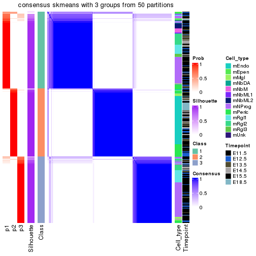</p>

</div>
<div id='tab-node-03-consensus-heatmap-3'>
<pre><code class="r">consensus_heatmap(res, k = 4)
</code></pre>

<p></p>

</div>
</div>

Heatmaps for the membership of samples in all partitions to see how consistent they are:


<script>
$( function() {
	$( '#tabs-node-03-membership-heatmap' ).tabs();
} );
</script>
<div id='tabs-node-03-membership-heatmap'>
<ul>
<li><a href='#tab-node-03-membership-heatmap-1'>k = 2</a></li>
<li><a href='#tab-node-03-membership-heatmap-2'>k = 3</a></li>
<li><a href='#tab-node-03-membership-heatmap-3'>k = 4</a></li>
</ul>
<div id='tab-node-03-membership-heatmap-1'>
<pre><code class="r">membership_heatmap(res, k = 2)
</code></pre>

<p></p>

</div>
<div id='tab-node-03-membership-heatmap-2'>
<pre><code class="r">membership_heatmap(res, k = 3)
</code></pre>

<p></p>

</div>
<div id='tab-node-03-membership-heatmap-3'>
<pre><code class="r">membership_heatmap(res, k = 4)
</code></pre>

<p></p>

</div>
</div>

As soon as the classes for columns are determined, the signatures
that are significantly different between subgroups can be looked for. 
Following are the heatmaps for signatures.


Signature heatmaps where rows are scaled:


<script>
$( function() {
	$( '#tabs-node-03-get-signatures' ).tabs();
} );
</script>
<div id='tabs-node-03-get-signatures'>
<ul>
<li><a href='#tab-node-03-get-signatures-1'>k = 2</a></li>
<li><a href='#tab-node-03-get-signatures-2'>k = 3</a></li>
<li><a href='#tab-node-03-get-signatures-3'>k = 4</a></li>
</ul>
<div id='tab-node-03-get-signatures-1'>
<pre><code class="r">get_signatures(res, k = 2)
</code></pre>

<p>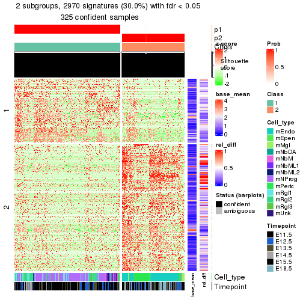</p>

</div>
<div id='tab-node-03-get-signatures-2'>
<pre><code class="r">get_signatures(res, k = 3)
</code></pre>

<p></p>

</div>
<div id='tab-node-03-get-signatures-3'>
<pre><code class="r">get_signatures(res, k = 4)
</code></pre>

<p></p>

</div>
</div>


Signature heatmaps where rows are not scaled:


<script>
$( function() {
	$( '#tabs-node-03-get-signatures-no-scale' ).tabs();
} );
</script>
<div id='tabs-node-03-get-signatures-no-scale'>
<ul>
<li><a href='#tab-node-03-get-signatures-no-scale-1'>k = 2</a></li>
<li><a href='#tab-node-03-get-signatures-no-scale-2'>k = 3</a></li>
<li><a href='#tab-node-03-get-signatures-no-scale-3'>k = 4</a></li>
</ul>
<div id='tab-node-03-get-signatures-no-scale-1'>
<pre><code class="r">get_signatures(res, k = 2, scale_rows = FALSE)
</code></pre>

<p></p>

</div>
<div id='tab-node-03-get-signatures-no-scale-2'>
<pre><code class="r">get_signatures(res, k = 3, scale_rows = FALSE)
</code></pre>

<p></p>

</div>
<div id='tab-node-03-get-signatures-no-scale-3'>
<pre><code class="r">get_signatures(res, k = 4, scale_rows = FALSE)
</code></pre>

<p></p>

</div>
</div>


Compare the overlap of signatures from different k:

```r
compare_signatures(res)
```


`get_signature()` returns a data frame invisibly. To get the list of signatures, the function
call should be assigned to a variable explicitly. In following code, if `plot` argument is set
to `FALSE`, no heatmap is plotted while only the differential analysis is performed.

```r
# code only for demonstration
tb = get_signature(res, k = ..., plot = FALSE)
```

An example of the output of `tb` is:

```
#>   which_row         fdr    mean_1    mean_2 scaled_mean_1 scaled_mean_2 km
#> 1        38 0.042760348  8.373488  9.131774    -0.5533452     0.5164555  1
#> 2        40 0.018707592  7.106213  8.469186    -0.6173731     0.5762149  1
#> 3        55 0.019134737 10.221463 11.207825    -0.6159697     0.5749050  1
#> 4        59 0.006059896  5.921854  7.869574    -0.6899429     0.6439467  1
#> 5        60 0.018055526  8.928898 10.211722    -0.6204761     0.5791110  1
#> 6        98 0.009384629 15.714769 14.887706     0.6635654    -0.6193277  2
...
```

The columns in `tb` are:

1. `which_row`: row indices corresponding to the input matrix.
2. `fdr`: FDR for the differential test. 
3. `mean_x`: The mean value in group x.
4. `scaled_mean_x`: The mean value in group x after rows are scaled.
5. `km`: Row groups if k-means clustering is applied to rows (which is done by automatically selecting number of clusters).

If there are too many signatures, `top_signatures = ...` can be set to only show the 
signatures with the highest FDRs:

```r
# code only for demonstration
# e.g. to show the top 500 most significant rows
tb = get_signature(res, k = ..., top_signatures = 500)
```

If the signatures are defined as these which are uniquely high in current group, `diff_method` argument
can be set to `"uniquely_high_in_one_group"`:

```r
# code only for demonstration
tb = get_signature(res, k = ..., diff_method = "uniquely_high_in_one_group")
```


UMAP plot which shows how samples are separated.


<script>
$( function() {
	$( '#tabs-node-03-dimension-reduction' ).tabs();
} );
</script>
<div id='tabs-node-03-dimension-reduction'>
<ul>
<li><a href='#tab-node-03-dimension-reduction-1'>k = 2</a></li>
<li><a href='#tab-node-03-dimension-reduction-2'>k = 3</a></li>
<li><a href='#tab-node-03-dimension-reduction-3'>k = 4</a></li>
</ul>
<div id='tab-node-03-dimension-reduction-1'>
<pre><code class="r">dimension_reduction(res, k = 2, method = &quot;UMAP&quot;)
</code></pre>

<p></p>

</div>
<div id='tab-node-03-dimension-reduction-2'>
<pre><code class="r">dimension_reduction(res, k = 3, method = &quot;UMAP&quot;)
</code></pre>

<p></p>

</div>
<div id='tab-node-03-dimension-reduction-3'>
<pre><code class="r">dimension_reduction(res, k = 4, method = &quot;UMAP&quot;)
</code></pre>

<p></p>

</div>
</div>


Following heatmap shows how subgroups are split when increasing `k`:

```r
collect_classes(res)
```


Test correlation between subgroups and known annotations. If the known
annotation is numeric, one-way ANOVA test is applied, and if the known
annotation is discrete, chi-squared contingency table test is applied.

```r
test_to_known_factors(res)
```

```
#>             n_sample Cell_type(p-value) Timepoint(p-value) k
#> ATC:skmeans      325           8.95e-57           1.16e-06 2
#> ATC:skmeans      318           3.02e-51           8.83e-08 3
#> ATC:skmeans      319           1.26e-56           3.99e-05 4
```


If matrix rows can be associated to genes, consider to use `functional_enrichment(res,
...)` to perform function enrichment for the signature genes. See [this vignette](https://jokergoo.github.io/cola_vignettes/functional_enrichment.html) for more detailed explanations.


 

---------------------------------------------------


### Node031


Parent node: [Node03](#Node03).
Child nodes: 
                [Node0121](#Node0121)
        ,
                [Node0122](#Node0122)
        ,
                Node0123-leaf
        ,
                [Node0131](#Node0131)
        ,
                Node0132-leaf
        ,
                Node0133-leaf
        ,
                [Node0221](#Node0221)
        ,
                [Node0222](#Node0222)
        ,
                Node0231-leaf
        ,
                Node0232-leaf
        ,
                Node0233-leaf
        ,
                [Node0311](#Node0311)
        ,
                [Node0312](#Node0312)
        ,
                Node0321-leaf
        ,
                Node0322-leaf
        ,
                Node0323-leaf
        ,
                Node0324-leaf
        .


The object with results only for a single top-value method and a single partitioning method 
can be extracted as:

```r
res = res_rh["031"]
```

A summary of `res` and all the functions that can be applied to it:

```r
res
```

```
#> A 'ConsensusPartition' object with k = 2, 3, 4.
#>   On a matrix with 8858 rows and 204 columns.
#>   Top rows (886) are extracted by 'ATC' method.
#>   Subgroups are detected by 'skmeans' method.
#>   Performed in total 150 partitions by row resampling.
#>   Best k for subgroups seems to be 4.
#> 
#> Following methods can be applied to this 'ConsensusPartition' object:
#>  [1] "cola_report"             "collect_classes"         "collect_plots"          
#>  [4] "collect_stats"           "colnames"                "compare_partitions"     
#>  [7] "compare_signatures"      "consensus_heatmap"       "dimension_reduction"    
#> [10] "functional_enrichment"   "get_anno_col"            "get_anno"               
#> [13] "get_classes"             "get_consensus"           "get_matrix"             
#> [16] "get_membership"          "get_param"               "get_signatures"         
#> [19] "get_stats"               "is_best_k"               "is_stable_k"            
#> [22] "membership_heatmap"      "ncol"                    "nrow"                   
#> [25] "plot_ecdf"               "predict_classes"         "rownames"               
#> [28] "select_partition_number" "show"                    "suggest_best_k"         
#> [31] "test_to_known_factors"   "top_rows_heatmap"
```

`collect_plots()` function collects all the plots made from `res` for all `k` (number of subgroups)
into one single page to provide an easy and fast comparison between different `k`.

```r
collect_plots(res)
```


The plots are:

- The first row: a plot of the eCDF (empirical cumulative distribution
  function) curves of the consensus matrix for each `k` and the heatmap of
  predicted classes for each `k`.
- The second row: heatmaps of the consensus matrix for each `k`.
- The third row: heatmaps of the membership matrix for each `k`.
- The fouth row: heatmaps of the signatures for each `k`.

All the plots in panels can be made by individual functions and they are
plotted later in this section.

`select_partition_number()` produces several plots showing different
statistics for choosing "optimized" `k`. There are following statistics:

- eCDF curves of the consensus matrix for each `k`;
- 1-PAC. [The PAC score](https://en.wikipedia.org/wiki/Consensus_clustering#Over-interpretation_potential_of_consensus_clustering)
  measures the proportion of the ambiguous subgrouping.
- Mean silhouette score.
- Concordance. The mean probability of fiting the consensus subgroup labels in all
  partitions.
- Area increased. Denote $A_k$ as the area under the eCDF curve for current
  `k`, the area increased is defined as $A_k - A_{k-1}$.
- Rand index. The percent of pairs of samples that are both in a same cluster
  or both are not in a same cluster in the partition of k and k-1.
- Jaccard index. The ratio of pairs of samples are both in a same cluster in
  the partition of k and k-1 and the pairs of samples are both in a same
  cluster in the partition k or k-1.

The detailed explanations of these statistics can be found in [the _cola_
vignette](https://jokergoo.github.io/cola_vignettes/cola.html#toc_13).

Generally speaking, higher 1-PAC score, higher mean silhouette score or higher
concordance corresponds to better partition. Rand index and Jaccard index
measure how similar the current partition is compared to partition with `k-1`.
If they are too similar, we won't accept `k` is better than `k-1`.

```r
select_partition_number(res)
```


The numeric values for all these statistics can be obtained by `get_stats()`.

```r
get_stats(res)
```

```
#>   k 1-PAC mean_silhouette concordance area_increased  Rand Jaccard
#> 2 2 0.959           0.964       0.984          0.503 0.498   0.498
#> 3 3 0.753           0.890       0.941          0.313 0.748   0.537
#> 4 4 0.951           0.928       0.967          0.113 0.857   0.618
```

`suggest_best_k()` suggests the best $k$ based on these statistics. The rules are as follows:

- All $k$ with Jaccard index larger than 0.95 are removed because increasing
  $k$ does not provide enough extra information. If all $k$ are removed, it is
  marked as no subgroup is detected.
- For all $k$ with 1-PAC score larger than 0.9, the maximal $k$ is taken as
  the best $k$, and other $k$ are marked as optional $k$.
- If it does not fit the second rule. The $k$ with the maximal vote of the
  highest 1-PAC score, highest mean silhouette, and highest concordance is
  taken as the best $k$.

```r
suggest_best_k(res)
```

```
#> [1] 4
#> attr(,"optional")
#> [1] 2
```

There is also optional best $k$ = 2 that is worth to check.

Following is the table of the partitions (You need to click the **show/hide
code output** link to see it). The membership matrix (columns with name `p*`)
is inferred by
[`clue::cl_consensus()`](https://www.rdocumentation.org/link/cl_consensus?package=clue)
function with the `SE` method. Basically the value in the membership matrix
represents the probability to belong to a certain group. The finall subgroup
label for an item is determined with the group with highest probability it
belongs to.

In `get_classes()` function, the entropy is calculated from the membership
matrix and the silhouette score is calculated from the consensus matrix.


<script>
$( function() {
	$( '#tabs-node-031-get-classes' ).tabs();
} );
</script>
<div id='tabs-node-031-get-classes'>
<ul>
<li><a href='#tab-node-031-get-classes-1'>k = 2</a></li>
<li><a href='#tab-node-031-get-classes-2'>k = 3</a></li>
<li><a href='#tab-node-031-get-classes-3'>k = 4</a></li>
</ul>

<div id='tab-node-031-get-classes-1'>
<p><a id='tab-node-031-get-classes-1-a' style='color:#0366d6' href='#'>show/hide code output</a></p>
<pre><code class="r">cbind(get_classes(res, k = 2), get_membership(res, k = 2))
</code></pre>

<pre><code>#&gt;                class entropy silhouette   p1   p2
#&gt; 1772094146_G12     1   0.000      0.980 1.00 0.00
#&gt; 1772094146_G09     1   0.000      0.980 1.00 0.00
#&gt; 1772094146_C08     1   0.000      0.980 1.00 0.00
#&gt; 1772071065_B01     2   0.000      0.987 0.00 1.00
#&gt; 1771013118_H03     1   0.000      0.980 1.00 0.00
#&gt; 1772094144_A01     1   0.000      0.980 1.00 0.00
#&gt; 1772094158_B01     1   0.000      0.980 1.00 0.00
#&gt; 1772094144_A06     1   0.971      0.345 0.60 0.40
#&gt; 1772094156_B08     1   0.000      0.980 1.00 0.00
#&gt; 1772094146_C04     2   0.000      0.987 0.00 1.00
#&gt; 1771013013_H11     1   0.000      0.980 1.00 0.00
#&gt; 1772094166_E07     2   0.000      0.987 0.00 1.00
#&gt; 1772094161_C05     2   0.000      0.987 0.00 1.00
#&gt; 1772096114_C09     1   0.000      0.980 1.00 0.00
#&gt; 1772094171_D04     1   0.000      0.980 1.00 0.00
#&gt; 1772094144_H07     1   0.000      0.980 1.00 0.00
#&gt; 1772094144_F05     2   0.000      0.987 0.00 1.00
#&gt; 1772094161_E03     2   0.000      0.987 0.00 1.00
#&gt; 1772094171_H10     2   0.000      0.987 0.00 1.00
#&gt; 1772094146_D07     1   0.000      0.980 1.00 0.00
#&gt; 1772094144_E03     1   0.000      0.980 1.00 0.00
#&gt; 1772096111_H02     1   0.000      0.980 1.00 0.00
#&gt; 1772092006_D06     1   0.000      0.980 1.00 0.00
#&gt; 1772094144_B02     2   0.680      0.776 0.18 0.82
#&gt; 1771013113_B03     2   0.000      0.987 0.00 1.00
#&gt; 1772094169_G11     2   0.000      0.987 0.00 1.00
#&gt; 1771013013_C12     2   0.000      0.987 0.00 1.00
#&gt; 1772094146_F09     2   0.000      0.987 0.00 1.00
#&gt; 1772094146_A04     1   0.000      0.980 1.00 0.00
#&gt; 1772094146_A06     1   0.000      0.980 1.00 0.00
#&gt; 1772092007_A02     1   0.000      0.980 1.00 0.00
#&gt; 1772092007_D07     1   0.000      0.980 1.00 0.00
#&gt; 1772096114_E03     2   0.000      0.987 0.00 1.00
#&gt; 1772094169_B04     1   0.000      0.980 1.00 0.00
#&gt; 1772094144_B04     1   0.000      0.980 1.00 0.00
#&gt; 1772094146_E05     2   0.000      0.987 0.00 1.00
#&gt; 1772094172_H11     2   0.000      0.987 0.00 1.00
#&gt; 1771013013_G04     2   0.000      0.987 0.00 1.00
#&gt; 1772094166_A12     2   0.000      0.987 0.00 1.00
#&gt; 1772096115_E10     2   0.000      0.987 0.00 1.00
#&gt; 1772094166_B10     2   0.000      0.987 0.00 1.00
#&gt; 1772094146_E02     1   0.000      0.980 1.00 0.00
#&gt; 1772094171_H04     1   0.000      0.980 1.00 0.00
#&gt; 1772094156_B12     1   0.529      0.864 0.88 0.12
#&gt; 1772094144_F04     2   0.000      0.987 0.00 1.00
#&gt; 1772094158_E07     1   0.000      0.980 1.00 0.00
#&gt; 1772094171_B06     1   0.000      0.980 1.00 0.00
#&gt; 1771013013_H10     2   0.000      0.987 0.00 1.00
#&gt; 1772094144_D11     1   0.000      0.980 1.00 0.00
#&gt; 1772096114_E01     1   0.827      0.661 0.74 0.26
#&gt; 1771013118_A04     2   0.000      0.987 0.00 1.00
#&gt; 1772094146_D04     2   0.000      0.987 0.00 1.00
#&gt; 1772094146_G11     2   0.000      0.987 0.00 1.00
#&gt; 1772096115_E03     2   0.000      0.987 0.00 1.00
#&gt; 1772071065_C05     2   0.000      0.987 0.00 1.00
#&gt; 1771013013_B10     2   0.000      0.987 0.00 1.00
#&gt; 1771013108_E03     2   0.000      0.987 0.00 1.00
#&gt; 1772094158_D05     2   0.000      0.987 0.00 1.00
#&gt; 1771013113_G05     2   0.000      0.987 0.00 1.00
#&gt; 1772071046_D01     1   0.469      0.886 0.90 0.10
#&gt; 1771013118_E09     2   0.000      0.987 0.00 1.00
#&gt; 1771013013_E05     2   0.000      0.987 0.00 1.00
#&gt; 1772094146_G08     1   0.529      0.864 0.88 0.12
#&gt; 1772094146_H12     2   0.000      0.987 0.00 1.00
#&gt; 1772094144_D10     2   0.000      0.987 0.00 1.00
#&gt; 1772094146_D12     2   0.000      0.987 0.00 1.00
#&gt; 1772094166_E09     1   0.000      0.980 1.00 0.00
#&gt; 1772092007_F06     2   0.000      0.987 0.00 1.00
#&gt; 1772094171_B09     1   0.327      0.926 0.94 0.06
#&gt; 1772094146_A05     1   0.000      0.980 1.00 0.00
#&gt; 1772094146_C12     1   0.000      0.980 1.00 0.00
#&gt; 1772096111_F10     2   0.000      0.987 0.00 1.00
#&gt; 1772094169_D10     1   0.000      0.980 1.00 0.00
#&gt; 1772094146_A02     2   0.000      0.987 0.00 1.00
#&gt; 1772094144_C03     1   0.000      0.980 1.00 0.00
#&gt; 1772092007_A12     1   0.000      0.980 1.00 0.00
#&gt; 1772092007_D11     2   0.000      0.987 0.00 1.00
#&gt; 1772094144_C11     1   0.000      0.980 1.00 0.00
#&gt; 1772094146_H06     1   0.000      0.980 1.00 0.00
#&gt; 1771013113_F10     1   0.000      0.980 1.00 0.00
#&gt; 1772094144_H01     1   0.000      0.980 1.00 0.00
#&gt; 1772094144_B08     1   0.000      0.980 1.00 0.00
#&gt; 1772096112_F04     1   0.000      0.980 1.00 0.00
#&gt; 1772094144_D12     2   0.000      0.987 0.00 1.00
#&gt; 1772094144_B01     1   0.141      0.963 0.98 0.02
#&gt; 1772094146_G10     1   0.000      0.980 1.00 0.00
#&gt; 1772094144_A02     1   0.000      0.980 1.00 0.00
#&gt; 1772094144_E06     1   0.000      0.980 1.00 0.00
#&gt; 1772094166_G10     1   0.000      0.980 1.00 0.00
#&gt; 1772094146_D06     1   0.000      0.980 1.00 0.00
#&gt; 1772096112_F12     1   0.000      0.980 1.00 0.00
#&gt; 1772094146_B07     1   0.000      0.980 1.00 0.00
#&gt; 1772094166_D06     1   0.000      0.980 1.00 0.00
#&gt; 1771013118_F02     1   0.000      0.980 1.00 0.00
#&gt; 1772094146_D03     2   0.000      0.987 0.00 1.00
#&gt; 1772092006_G02     1   0.000      0.980 1.00 0.00
#&gt; 1772092007_H11     1   0.000      0.980 1.00 0.00
#&gt; 1772094161_D02     1   0.000      0.980 1.00 0.00
#&gt; 1772094144_H10     1   0.000      0.980 1.00 0.00
#&gt; 1772094144_D08     1   0.000      0.980 1.00 0.00
#&gt; 1772094146_D01     1   0.000      0.980 1.00 0.00
#&gt; 1772094146_C06     2   0.000      0.987 0.00 1.00
#&gt; 1772092007_E01     1   0.827      0.661 0.74 0.26
#&gt; 1772094146_H11     1   0.000      0.980 1.00 0.00
#&gt; 1772094146_D02     2   0.000      0.987 0.00 1.00
#&gt; 1772094146_C07     1   0.000      0.980 1.00 0.00
#&gt; 1772094144_G06     1   0.000      0.980 1.00 0.00
#&gt; 1772094166_C12     1   0.000      0.980 1.00 0.00
#&gt; 1772094146_B02     1   0.000      0.980 1.00 0.00
#&gt; 1771013118_F11     1   0.000      0.980 1.00 0.00
#&gt; 1772094146_F06     1   0.000      0.980 1.00 0.00
#&gt; 1772094146_B12     1   0.000      0.980 1.00 0.00
#&gt; 1772072246_D12     2   0.000      0.987 0.00 1.00
#&gt; 1772094173_H05     2   0.000      0.987 0.00 1.00
#&gt; 1772066085_G12     2   0.000      0.987 0.00 1.00
#&gt; 1772066084_H09     2   0.000      0.987 0.00 1.00
#&gt; 1772066087_B04     2   0.000      0.987 0.00 1.00
#&gt; 1772066085_D12     2   0.000      0.987 0.00 1.00
#&gt; 1772092006_A01     1   0.000      0.980 1.00 0.00
#&gt; 1772094161_C07     1   0.000      0.980 1.00 0.00
#&gt; 1772094159_D09     1   0.000      0.980 1.00 0.00
#&gt; 1772094144_D04     1   0.000      0.980 1.00 0.00
#&gt; 1772094146_D11     1   0.000      0.980 1.00 0.00
#&gt; 1772092007_A11     1   0.000      0.980 1.00 0.00
#&gt; 1771013110_F03     2   0.000      0.987 0.00 1.00
#&gt; 1772094146_A09     2   0.000      0.987 0.00 1.00
#&gt; 1772071050_F12     2   0.000      0.987 0.00 1.00
#&gt; 1772094144_A07     1   0.000      0.980 1.00 0.00
#&gt; 1772094144_H04     1   0.000      0.980 1.00 0.00
#&gt; 1772092007_A05     2   0.000      0.987 0.00 1.00
#&gt; 1772071049_G06     1   0.000      0.980 1.00 0.00
#&gt; 1771013113_F07     1   0.000      0.980 1.00 0.00
#&gt; 1772094169_H02     2   0.000      0.987 0.00 1.00
#&gt; 1772092006_E01     1   0.000      0.980 1.00 0.00
#&gt; 1772094169_G05     1   0.000      0.980 1.00 0.00
#&gt; 1772092007_E04     1   0.000      0.980 1.00 0.00
#&gt; 1772092007_B10     2   0.000      0.987 0.00 1.00
#&gt; 1771013113_A02     2   0.000      0.987 0.00 1.00
#&gt; 1771013153_F06     2   0.000      0.987 0.00 1.00
#&gt; 1772094146_G02     1   0.000      0.980 1.00 0.00
#&gt; 1771013118_H04     2   0.958      0.380 0.38 0.62
#&gt; 1772071050_B05     2   0.000      0.987 0.00 1.00
#&gt; 1772071049_G08     1   0.722      0.759 0.80 0.20
#&gt; 1771013013_C02     2   0.000      0.987 0.00 1.00
#&gt; 1772066085_B12     2   0.000      0.987 0.00 1.00
#&gt; 1772071049_A09     1   0.000      0.980 1.00 0.00
#&gt; 1772071050_D04     1   0.000      0.980 1.00 0.00
#&gt; 1772094174_F04     2   0.000      0.987 0.00 1.00
#&gt; 1772094161_C02     1   0.000      0.980 1.00 0.00
#&gt; 1771013117_D04     1   0.469      0.886 0.90 0.10
#&gt; 1772071065_E07     1   0.000      0.980 1.00 0.00
#&gt; 1772096114_G07     1   0.000      0.980 1.00 0.00
#&gt; 1772094166_E11     1   0.000      0.980 1.00 0.00
#&gt; 1772094173_H12     2   0.000      0.987 0.00 1.00
#&gt; 1772096114_B02     2   0.000      0.987 0.00 1.00
#&gt; 1772094173_D02     1   0.000      0.980 1.00 0.00
#&gt; 1772066085_C03     1   0.000      0.980 1.00 0.00
#&gt; 1772066085_F04     2   0.000      0.987 0.00 1.00
#&gt; 1772075300_B01     2   0.000      0.987 0.00 1.00
#&gt; 1772066091_H08     1   0.000      0.980 1.00 0.00
#&gt; 1772094175_B07     1   0.000      0.980 1.00 0.00
#&gt; 1772094173_G08     1   0.000      0.980 1.00 0.00
#&gt; 1772094172_G10     2   0.000      0.987 0.00 1.00
#&gt; 1772094173_A04     2   0.000      0.987 0.00 1.00
#&gt; 1772066087_G11     2   0.000      0.987 0.00 1.00
#&gt; 1772066084_G06     1   0.000      0.980 1.00 0.00
#&gt; 1772094175_F09     1   0.584      0.840 0.86 0.14
#&gt; 1772094173_B08     2   0.680      0.779 0.18 0.82
#&gt; 1772094175_E08     2   0.000      0.987 0.00 1.00
#&gt; 1772096111_C12     2   0.000      0.987 0.00 1.00
#&gt; 1772094173_G10     2   0.000      0.987 0.00 1.00
#&gt; 1772071065_H05     2   0.000      0.987 0.00 1.00
#&gt; 1772075303_E12     2   0.000      0.987 0.00 1.00
#&gt; 1772066085_H11     2   0.855      0.611 0.28 0.72
#&gt; 1772066084_H11     2   0.000      0.987 0.00 1.00
#&gt; 1772094175_G06     2   0.000      0.987 0.00 1.00
#&gt; 1772071049_C07     1   0.000      0.980 1.00 0.00
#&gt; 1772096114_H02     1   0.000      0.980 1.00 0.00
#&gt; 1772071065_B05     2   0.000      0.987 0.00 1.00
#&gt; 1772096114_E07     2   0.000      0.987 0.00 1.00
#&gt; 1772075302_B12     2   0.000      0.987 0.00 1.00
#&gt; 1772071049_A04     2   0.000      0.987 0.00 1.00
#&gt; 1772075302_F05     2   0.000      0.987 0.00 1.00
#&gt; 1772096111_D02     1   0.795      0.695 0.76 0.24
#&gt; 1772094146_F10     2   0.000      0.987 0.00 1.00
#&gt; 1771013118_F03     2   0.000      0.987 0.00 1.00
#&gt; 1772094146_B10     2   0.760      0.717 0.22 0.78
#&gt; 1771013013_E12     2   0.000      0.987 0.00 1.00
#&gt; 1771013013_D02     2   0.000      0.987 0.00 1.00
#&gt; 1772094163_F04     2   0.000      0.987 0.00 1.00
#&gt; 1772071049_B10     1   0.000      0.980 1.00 0.00
#&gt; 1772094146_E06     2   0.000      0.987 0.00 1.00
#&gt; 1772075302_G09     2   0.000      0.987 0.00 1.00
#&gt; 1771013118_G07     2   0.000      0.987 0.00 1.00
#&gt; 1772094144_B12     2   0.000      0.987 0.00 1.00
#&gt; 1771013013_A06     2   0.000      0.987 0.00 1.00
#&gt; 1772066085_C05     2   0.000      0.987 0.00 1.00
#&gt; 1772094166_F06     2   0.000      0.987 0.00 1.00
#&gt; 1772094144_D06     2   0.000      0.987 0.00 1.00
#&gt; 1771013013_B12     2   0.000      0.987 0.00 1.00
#&gt; 1772094166_E05     2   0.000      0.987 0.00 1.00
#&gt; 1772092006_D07     2   0.000      0.987 0.00 1.00
#&gt; 1772094163_F12     2   0.000      0.987 0.00 1.00
#&gt; 1772094146_G06     2   0.000      0.987 0.00 1.00
</code></pre>

<script>
$('#tab-node-031-get-classes-1-a').parent().next().next().hide();
$('#tab-node-031-get-classes-1-a').click(function(){
  $('#tab-node-031-get-classes-1-a').parent().next().next().toggle();
  return(false);
});
</script>
</div>

<div id='tab-node-031-get-classes-2'>
<p><a id='tab-node-031-get-classes-2-a' style='color:#0366d6' href='#'>show/hide code output</a></p>
<pre><code class="r">cbind(get_classes(res, k = 3), get_membership(res, k = 3))
</code></pre>

<pre><code>#&gt;                class entropy silhouette   p1   p2   p3
#&gt; 1772094146_G12     1  0.2959     0.8748 0.90 0.00 0.10
#&gt; 1772094146_G09     1  0.0000     0.9716 1.00 0.00 0.00
#&gt; 1772094146_C08     1  0.0000     0.9716 1.00 0.00 0.00
#&gt; 1772071065_B01     3  0.0000     0.9435 0.00 0.00 1.00
#&gt; 1771013118_H03     1  0.0000     0.9716 1.00 0.00 0.00
#&gt; 1772094144_A01     1  0.0000     0.9716 1.00 0.00 0.00
#&gt; 1772094158_B01     1  0.0000     0.9716 1.00 0.00 0.00
#&gt; 1772094144_A06     3  0.0892     0.9283 0.02 0.00 0.98
#&gt; 1772094156_B08     3  0.3340     0.8422 0.12 0.00 0.88
#&gt; 1772094146_C04     3  0.0000     0.9435 0.00 0.00 1.00
#&gt; 1771013013_H11     1  0.0000     0.9716 1.00 0.00 0.00
#&gt; 1772094166_E07     3  0.0000     0.9435 0.00 0.00 1.00
#&gt; 1772094161_C05     3  0.0000     0.9435 0.00 0.00 1.00
#&gt; 1772096114_C09     1  0.0000     0.9716 1.00 0.00 0.00
#&gt; 1772094171_D04     1  0.0000     0.9716 1.00 0.00 0.00
#&gt; 1772094144_H07     1  0.0000     0.9716 1.00 0.00 0.00
#&gt; 1772094144_F05     2  0.5835     0.6196 0.00 0.66 0.34
#&gt; 1772094161_E03     3  0.0000     0.9435 0.00 0.00 1.00
#&gt; 1772094171_H10     2  0.3340     0.8846 0.00 0.88 0.12
#&gt; 1772094146_D07     1  0.0000     0.9716 1.00 0.00 0.00
#&gt; 1772094144_E03     1  0.0000     0.9716 1.00 0.00 0.00
#&gt; 1772096111_H02     1  0.0000     0.9716 1.00 0.00 0.00
#&gt; 1772092006_D06     1  0.0000     0.9716 1.00 0.00 0.00
#&gt; 1772094144_B02     3  0.0000     0.9435 0.00 0.00 1.00
#&gt; 1771013113_B03     3  0.0000     0.9435 0.00 0.00 1.00
#&gt; 1772094169_G11     3  0.0000     0.9435 0.00 0.00 1.00
#&gt; 1771013013_C12     2  0.5016     0.7859 0.00 0.76 0.24
#&gt; 1772094146_F09     3  0.0000     0.9435 0.00 0.00 1.00
#&gt; 1772094146_A04     1  0.0000     0.9716 1.00 0.00 0.00
#&gt; 1772094146_A06     1  0.0000     0.9716 1.00 0.00 0.00
#&gt; 1772092007_A02     1  0.0000     0.9716 1.00 0.00 0.00
#&gt; 1772092007_D07     1  0.0000     0.9716 1.00 0.00 0.00
#&gt; 1772096114_E03     3  0.0000     0.9435 0.00 0.00 1.00
#&gt; 1772094169_B04     1  0.0000     0.9716 1.00 0.00 0.00
#&gt; 1772094144_B04     1  0.0000     0.9716 1.00 0.00 0.00
#&gt; 1772094146_E05     3  0.0000     0.9435 0.00 0.00 1.00
#&gt; 1772094172_H11     3  0.0000     0.9435 0.00 0.00 1.00
#&gt; 1771013013_G04     3  0.0000     0.9435 0.00 0.00 1.00
#&gt; 1772094166_A12     3  0.0000     0.9435 0.00 0.00 1.00
#&gt; 1772096115_E10     3  0.0000     0.9435 0.00 0.00 1.00
#&gt; 1772094166_B10     2  0.3340     0.8846 0.00 0.88 0.12
#&gt; 1772094146_E02     1  0.0000     0.9716 1.00 0.00 0.00
#&gt; 1772094171_H04     1  0.0000     0.9716 1.00 0.00 0.00
#&gt; 1772094156_B12     3  0.0892     0.9308 0.02 0.00 0.98
#&gt; 1772094144_F04     3  0.0000     0.9435 0.00 0.00 1.00
#&gt; 1772094158_E07     1  0.0000     0.9716 1.00 0.00 0.00
#&gt; 1772094171_B06     1  0.0000     0.9716 1.00 0.00 0.00
#&gt; 1771013013_H10     3  0.0000     0.9435 0.00 0.00 1.00
#&gt; 1772094144_D11     1  0.0000     0.9716 1.00 0.00 0.00
#&gt; 1772096114_E01     2  0.7029     0.2218 0.44 0.54 0.02
#&gt; 1771013118_A04     3  0.0000     0.9435 0.00 0.00 1.00
#&gt; 1772094146_D04     3  0.0000     0.9435 0.00 0.00 1.00
#&gt; 1772094146_G11     2  0.3340     0.8846 0.00 0.88 0.12
#&gt; 1772096115_E03     3  0.3340     0.8706 0.00 0.12 0.88
#&gt; 1772071065_C05     3  0.0000     0.9435 0.00 0.00 1.00
#&gt; 1771013013_B10     3  0.0000     0.9435 0.00 0.00 1.00
#&gt; 1771013108_E03     3  0.1529     0.9222 0.00 0.04 0.96
#&gt; 1772094158_D05     3  0.0000     0.9435 0.00 0.00 1.00
#&gt; 1771013113_G05     3  0.0000     0.9435 0.00 0.00 1.00
#&gt; 1772071046_D01     3  0.7995     0.1141 0.46 0.06 0.48
#&gt; 1771013118_E09     3  0.0000     0.9435 0.00 0.00 1.00
#&gt; 1771013013_E05     3  0.0000     0.9435 0.00 0.00 1.00
#&gt; 1772094146_G08     3  0.0892     0.9283 0.02 0.00 0.98
#&gt; 1772094146_H12     3  0.0000     0.9435 0.00 0.00 1.00
#&gt; 1772094144_D10     3  0.0000     0.9435 0.00 0.00 1.00
#&gt; 1772094146_D12     3  0.0000     0.9435 0.00 0.00 1.00
#&gt; 1772094166_E09     2  0.3686     0.8048 0.14 0.86 0.00
#&gt; 1772092007_F06     3  0.0000     0.9435 0.00 0.00 1.00
#&gt; 1772094171_B09     2  0.3340     0.8211 0.12 0.88 0.00
#&gt; 1772094146_A05     3  0.4555     0.7507 0.20 0.00 0.80
#&gt; 1772094146_C12     3  0.3686     0.8201 0.14 0.00 0.86
#&gt; 1772096111_F10     3  0.0000     0.9435 0.00 0.00 1.00
#&gt; 1772094169_D10     1  0.0000     0.9716 1.00 0.00 0.00
#&gt; 1772094146_A02     2  0.3340     0.8846 0.00 0.88 0.12
#&gt; 1772094144_C03     1  0.0892     0.9560 0.98 0.02 0.00
#&gt; 1772092007_A12     1  0.0000     0.9716 1.00 0.00 0.00
#&gt; 1772092007_D11     3  0.0000     0.9435 0.00 0.00 1.00
#&gt; 1772094144_C11     1  0.0000     0.9716 1.00 0.00 0.00
#&gt; 1772094146_H06     1  0.0892     0.9560 0.98 0.02 0.00
#&gt; 1771013113_F10     1  0.0000     0.9716 1.00 0.00 0.00
#&gt; 1772094144_H01     1  0.0892     0.9560 0.98 0.02 0.00
#&gt; 1772094144_B08     1  0.2959     0.8752 0.90 0.00 0.10
#&gt; 1772096112_F04     1  0.0000     0.9716 1.00 0.00 0.00
#&gt; 1772094144_D12     3  0.0000     0.9435 0.00 0.00 1.00
#&gt; 1772094144_B01     2  0.3340     0.8846 0.00 0.88 0.12
#&gt; 1772094146_G10     1  0.0000     0.9716 1.00 0.00 0.00
#&gt; 1772094144_A02     1  0.6309    -0.0383 0.50 0.50 0.00
#&gt; 1772094144_E06     1  0.0000     0.9716 1.00 0.00 0.00
#&gt; 1772094166_G10     1  0.1529     0.9386 0.96 0.04 0.00
#&gt; 1772094146_D06     1  0.0000     0.9716 1.00 0.00 0.00
#&gt; 1772096112_F12     1  0.0000     0.9716 1.00 0.00 0.00
#&gt; 1772094146_B07     1  0.0000     0.9716 1.00 0.00 0.00
#&gt; 1772094166_D06     1  0.6280     0.1171 0.54 0.46 0.00
#&gt; 1771013118_F02     1  0.0000     0.9716 1.00 0.00 0.00
#&gt; 1772094146_D03     3  0.0000     0.9435 0.00 0.00 1.00
#&gt; 1772092006_G02     1  0.0000     0.9716 1.00 0.00 0.00
#&gt; 1772092007_H11     1  0.0000     0.9716 1.00 0.00 0.00
#&gt; 1772094161_D02     1  0.1529     0.9375 0.96 0.00 0.04
#&gt; 1772094144_H10     1  0.0000     0.9716 1.00 0.00 0.00
#&gt; 1772094144_D08     1  0.0000     0.9716 1.00 0.00 0.00
#&gt; 1772094146_D01     1  0.0000     0.9716 1.00 0.00 0.00
#&gt; 1772094146_C06     2  0.3340     0.8846 0.00 0.88 0.12
#&gt; 1772092007_E01     3  0.3340     0.8417 0.12 0.00 0.88
#&gt; 1772094146_H11     1  0.0000     0.9716 1.00 0.00 0.00
#&gt; 1772094146_D02     2  0.3340     0.8846 0.00 0.88 0.12
#&gt; 1772094146_C07     1  0.0000     0.9716 1.00 0.00 0.00
#&gt; 1772094144_G06     1  0.0000     0.9716 1.00 0.00 0.00
#&gt; 1772094166_C12     1  0.0000     0.9716 1.00 0.00 0.00
#&gt; 1772094146_B02     1  0.0000     0.9716 1.00 0.00 0.00
#&gt; 1771013118_F11     1  0.0000     0.9716 1.00 0.00 0.00
#&gt; 1772094146_F06     1  0.6232     0.6533 0.74 0.22 0.04
#&gt; 1772094146_B12     1  0.0000     0.9716 1.00 0.00 0.00
#&gt; 1772072246_D12     2  0.0000     0.8727 0.00 1.00 0.00
#&gt; 1772094173_H05     2  0.5835     0.4479 0.00 0.66 0.34
#&gt; 1772066085_G12     2  0.0892     0.8727 0.00 0.98 0.02
#&gt; 1772066084_H09     2  0.0892     0.8727 0.00 0.98 0.02
#&gt; 1772066087_B04     2  0.0892     0.8727 0.00 0.98 0.02
#&gt; 1772066085_D12     2  0.0892     0.8727 0.00 0.98 0.02
#&gt; 1772092006_A01     1  0.0000     0.9716 1.00 0.00 0.00
#&gt; 1772094161_C07     1  0.0000     0.9716 1.00 0.00 0.00
#&gt; 1772094159_D09     1  0.0000     0.9716 1.00 0.00 0.00
#&gt; 1772094144_D04     1  0.0000     0.9716 1.00 0.00 0.00
#&gt; 1772094146_D11     1  0.0000     0.9716 1.00 0.00 0.00
#&gt; 1772092007_A11     1  0.0000     0.9716 1.00 0.00 0.00
#&gt; 1771013110_F03     3  0.0000     0.9435 0.00 0.00 1.00
#&gt; 1772094146_A09     3  0.0000     0.9435 0.00 0.00 1.00
#&gt; 1772071050_F12     3  0.3340     0.8706 0.00 0.12 0.88
#&gt; 1772094144_A07     1  0.0000     0.9716 1.00 0.00 0.00
#&gt; 1772094144_H04     1  0.2537     0.8982 0.92 0.00 0.08
#&gt; 1772092007_A05     3  0.0000     0.9435 0.00 0.00 1.00
#&gt; 1772071049_G06     1  0.0000     0.9716 1.00 0.00 0.00
#&gt; 1771013113_F07     1  0.0000     0.9716 1.00 0.00 0.00
#&gt; 1772094169_H02     2  0.0000     0.8727 0.00 1.00 0.00
#&gt; 1772092006_E01     1  0.0000     0.9716 1.00 0.00 0.00
#&gt; 1772094169_G05     1  0.0000     0.9716 1.00 0.00 0.00
#&gt; 1772092007_E04     1  0.0000     0.9716 1.00 0.00 0.00
#&gt; 1772092007_B10     3  0.0000     0.9435 0.00 0.00 1.00
#&gt; 1771013113_A02     3  0.3340     0.8706 0.00 0.12 0.88
#&gt; 1771013153_F06     3  0.3340     0.8706 0.00 0.12 0.88
#&gt; 1772094146_G02     1  0.0000     0.9716 1.00 0.00 0.00
#&gt; 1771013118_H04     3  0.0000     0.9435 0.00 0.00 1.00
#&gt; 1772071050_B05     2  0.1529     0.8771 0.00 0.96 0.04
#&gt; 1772071049_G08     3  0.3340     0.8706 0.00 0.12 0.88
#&gt; 1771013013_C02     2  0.2959     0.8845 0.00 0.90 0.10
#&gt; 1772066085_B12     2  0.6192     0.4771 0.00 0.58 0.42
#&gt; 1772071049_A09     2  0.6045     0.3294 0.38 0.62 0.00
#&gt; 1772071050_D04     1  0.0000     0.9716 1.00 0.00 0.00
#&gt; 1772094174_F04     3  0.3340     0.8706 0.00 0.12 0.88
#&gt; 1772094161_C02     1  0.4555     0.7370 0.80 0.00 0.20
#&gt; 1771013117_D04     3  0.6530     0.7689 0.12 0.12 0.76
#&gt; 1772071065_E07     1  0.0000     0.9716 1.00 0.00 0.00
#&gt; 1772096114_G07     1  0.0000     0.9716 1.00 0.00 0.00
#&gt; 1772094166_E11     1  0.0000     0.9716 1.00 0.00 0.00
#&gt; 1772094173_H12     2  0.5397     0.5795 0.00 0.72 0.28
#&gt; 1772096114_B02     2  0.0000     0.8727 0.00 1.00 0.00
#&gt; 1772094173_D02     1  0.3340     0.8581 0.88 0.12 0.00
#&gt; 1772066085_C03     1  0.3686     0.8396 0.86 0.14 0.00
#&gt; 1772066085_F04     2  0.0000     0.8727 0.00 1.00 0.00
#&gt; 1772075300_B01     2  0.5706     0.4961 0.00 0.68 0.32
#&gt; 1772066091_H08     1  0.0000     0.9716 1.00 0.00 0.00
#&gt; 1772094175_B07     1  0.0000     0.9716 1.00 0.00 0.00
#&gt; 1772094173_G08     1  0.3340     0.8581 0.88 0.12 0.00
#&gt; 1772094172_G10     2  0.0892     0.8727 0.00 0.98 0.02
#&gt; 1772094173_A04     2  0.5397     0.5780 0.00 0.72 0.28
#&gt; 1772066087_G11     2  0.0892     0.8727 0.00 0.98 0.02
#&gt; 1772066084_G06     1  0.0000     0.9716 1.00 0.00 0.00
#&gt; 1772094175_F09     3  0.4209     0.8600 0.02 0.12 0.86
#&gt; 1772094173_B08     3  0.3340     0.8706 0.00 0.12 0.88
#&gt; 1772094175_E08     3  0.3340     0.8706 0.00 0.12 0.88
#&gt; 1772096111_C12     2  0.0892     0.8727 0.00 0.98 0.02
#&gt; 1772094173_G10     3  0.3340     0.8706 0.00 0.12 0.88
#&gt; 1772071065_H05     2  0.0892     0.8727 0.00 0.98 0.02
#&gt; 1772075303_E12     2  0.0892     0.8727 0.00 0.98 0.02
#&gt; 1772066085_H11     2  0.0000     0.8727 0.00 1.00 0.00
#&gt; 1772066084_H11     2  0.0892     0.8727 0.00 0.98 0.02
#&gt; 1772094175_G06     3  0.3340     0.8706 0.00 0.12 0.88
#&gt; 1772071049_C07     1  0.0000     0.9716 1.00 0.00 0.00
#&gt; 1772096114_H02     2  0.0000     0.8727 0.00 1.00 0.00
#&gt; 1772071065_B05     2  0.0892     0.8727 0.00 0.98 0.02
#&gt; 1772096114_E07     2  0.0000     0.8727 0.00 1.00 0.00
#&gt; 1772075302_B12     2  0.0892     0.8727 0.00 0.98 0.02
#&gt; 1772071049_A04     2  0.0000     0.8727 0.00 1.00 0.00
#&gt; 1772075302_F05     2  0.0892     0.8727 0.00 0.98 0.02
#&gt; 1772096111_D02     2  0.4209     0.7867 0.12 0.86 0.02
#&gt; 1772094146_F10     2  0.3340     0.8846 0.00 0.88 0.12
#&gt; 1771013118_F03     2  0.3340     0.8846 0.00 0.88 0.12
#&gt; 1772094146_B10     2  0.3340     0.8846 0.00 0.88 0.12
#&gt; 1771013013_E12     2  0.3340     0.8846 0.00 0.88 0.12
#&gt; 1771013013_D02     2  0.3340     0.8846 0.00 0.88 0.12
#&gt; 1772094163_F04     2  0.3340     0.8846 0.00 0.88 0.12
#&gt; 1772071049_B10     2  0.3340     0.8211 0.12 0.88 0.00
#&gt; 1772094146_E06     2  0.3340     0.8846 0.00 0.88 0.12
#&gt; 1772075302_G09     2  0.3340     0.8846 0.00 0.88 0.12
#&gt; 1771013118_G07     2  0.3340     0.8846 0.00 0.88 0.12
#&gt; 1772094144_B12     2  0.3340     0.8846 0.00 0.88 0.12
#&gt; 1771013013_A06     2  0.3340     0.8846 0.00 0.88 0.12
#&gt; 1772066085_C05     2  0.3340     0.8846 0.00 0.88 0.12
#&gt; 1772094166_F06     2  0.3340     0.8846 0.00 0.88 0.12
#&gt; 1772094144_D06     2  0.3340     0.8846 0.00 0.88 0.12
#&gt; 1771013013_B12     2  0.3340     0.8846 0.00 0.88 0.12
#&gt; 1772094166_E05     2  0.3340     0.8846 0.00 0.88 0.12
#&gt; 1772092006_D07     2  0.3340     0.8846 0.00 0.88 0.12
#&gt; 1772094163_F12     2  0.3340     0.8846 0.00 0.88 0.12
#&gt; 1772094146_G06     2  0.3340     0.8846 0.00 0.88 0.12
</code></pre>

<script>
$('#tab-node-031-get-classes-2-a').parent().next().next().hide();
$('#tab-node-031-get-classes-2-a').click(function(){
  $('#tab-node-031-get-classes-2-a').parent().next().next().toggle();
  return(false);
});
</script>
</div>

<div id='tab-node-031-get-classes-3'>
<p><a id='tab-node-031-get-classes-3-a' style='color:#0366d6' href='#'>show/hide code output</a></p>
<pre><code class="r">cbind(get_classes(res, k = 4), get_membership(res, k = 4))
</code></pre>

<pre><code>#&gt;                class entropy silhouette   p1   p2   p3   p4
#&gt; 1772094146_G12     1  0.0000      0.978 1.00 0.00 0.00 0.00
#&gt; 1772094146_G09     1  0.0707      0.971 0.98 0.00 0.00 0.02
#&gt; 1772094146_C08     1  0.0000      0.978 1.00 0.00 0.00 0.00
#&gt; 1772071065_B01     3  0.0000      0.963 0.00 0.00 1.00 0.00
#&gt; 1771013118_H03     1  0.0000      0.978 1.00 0.00 0.00 0.00
#&gt; 1772094144_A01     1  0.0000      0.978 1.00 0.00 0.00 0.00
#&gt; 1772094158_B01     1  0.0000      0.978 1.00 0.00 0.00 0.00
#&gt; 1772094144_A06     3  0.0000      0.963 0.00 0.00 1.00 0.00
#&gt; 1772094156_B08     3  0.0000      0.963 0.00 0.00 1.00 0.00
#&gt; 1772094146_C04     3  0.0000      0.963 0.00 0.00 1.00 0.00
#&gt; 1771013013_H11     1  0.0000      0.978 1.00 0.00 0.00 0.00
#&gt; 1772094166_E07     3  0.0000      0.963 0.00 0.00 1.00 0.00
#&gt; 1772094161_C05     3  0.0000      0.963 0.00 0.00 1.00 0.00
#&gt; 1772096114_C09     1  0.0707      0.971 0.98 0.00 0.00 0.02
#&gt; 1772094171_D04     1  0.0707      0.971 0.98 0.00 0.00 0.02
#&gt; 1772094144_H07     1  0.0000      0.978 1.00 0.00 0.00 0.00
#&gt; 1772094144_F05     2  0.0000      0.974 0.00 1.00 0.00 0.00
#&gt; 1772094161_E03     3  0.0000      0.963 0.00 0.00 1.00 0.00
#&gt; 1772094171_H10     2  0.0000      0.974 0.00 1.00 0.00 0.00
#&gt; 1772094146_D07     1  0.0000      0.978 1.00 0.00 0.00 0.00
#&gt; 1772094144_E03     1  0.0000      0.978 1.00 0.00 0.00 0.00
#&gt; 1772096111_H02     1  0.0000      0.978 1.00 0.00 0.00 0.00
#&gt; 1772092006_D06     1  0.0000      0.978 1.00 0.00 0.00 0.00
#&gt; 1772094144_B02     3  0.0000      0.963 0.00 0.00 1.00 0.00
#&gt; 1771013113_B03     3  0.0000      0.963 0.00 0.00 1.00 0.00
#&gt; 1772094169_G11     3  0.0000      0.963 0.00 0.00 1.00 0.00
#&gt; 1771013013_C12     3  0.2345      0.868 0.00 0.10 0.90 0.00
#&gt; 1772094146_F09     3  0.0000      0.963 0.00 0.00 1.00 0.00
#&gt; 1772094146_A04     1  0.0000      0.978 1.00 0.00 0.00 0.00
#&gt; 1772094146_A06     1  0.0000      0.978 1.00 0.00 0.00 0.00
#&gt; 1772092007_A02     1  0.0000      0.978 1.00 0.00 0.00 0.00
#&gt; 1772092007_D07     1  0.0707      0.971 0.98 0.00 0.00 0.02
#&gt; 1772096114_E03     3  0.0000      0.963 0.00 0.00 1.00 0.00
#&gt; 1772094169_B04     1  0.0707      0.971 0.98 0.00 0.00 0.02
#&gt; 1772094144_B04     1  0.0000      0.978 1.00 0.00 0.00 0.00
#&gt; 1772094146_E05     3  0.0000      0.963 0.00 0.00 1.00 0.00
#&gt; 1772094172_H11     3  0.0000      0.963 0.00 0.00 1.00 0.00
#&gt; 1771013013_G04     3  0.0000      0.963 0.00 0.00 1.00 0.00
#&gt; 1772094166_A12     3  0.0000      0.963 0.00 0.00 1.00 0.00
#&gt; 1772096115_E10     3  0.0000      0.963 0.00 0.00 1.00 0.00
#&gt; 1772094166_B10     2  0.0000      0.974 0.00 1.00 0.00 0.00
#&gt; 1772094146_E02     1  0.0000      0.978 1.00 0.00 0.00 0.00
#&gt; 1772094171_H04     1  0.0707      0.971 0.98 0.00 0.00 0.02
#&gt; 1772094156_B12     3  0.0000      0.963 0.00 0.00 1.00 0.00
#&gt; 1772094144_F04     3  0.0000      0.963 0.00 0.00 1.00 0.00
#&gt; 1772094158_E07     1  0.0707      0.971 0.98 0.00 0.00 0.02
#&gt; 1772094171_B06     1  0.0707      0.971 0.98 0.00 0.00 0.02
#&gt; 1771013013_H10     3  0.0000      0.963 0.00 0.00 1.00 0.00
#&gt; 1772094144_D11     1  0.0707      0.971 0.98 0.00 0.00 0.02
#&gt; 1772096114_E01     2  0.0000      0.974 0.00 1.00 0.00 0.00
#&gt; 1771013118_A04     3  0.0000      0.963 0.00 0.00 1.00 0.00
#&gt; 1772094146_D04     3  0.0000      0.963 0.00 0.00 1.00 0.00
#&gt; 1772094146_G11     2  0.0000      0.974 0.00 1.00 0.00 0.00
#&gt; 1772096115_E03     4  0.4977      0.148 0.00 0.00 0.46 0.54
#&gt; 1772071065_C05     3  0.0000      0.963 0.00 0.00 1.00 0.00
#&gt; 1771013013_B10     3  0.0000      0.963 0.00 0.00 1.00 0.00
#&gt; 1771013108_E03     3  0.0000      0.963 0.00 0.00 1.00 0.00
#&gt; 1772094158_D05     3  0.0000      0.963 0.00 0.00 1.00 0.00
#&gt; 1771013113_G05     3  0.0000      0.963 0.00 0.00 1.00 0.00
#&gt; 1772071046_D01     1  0.9034      0.025 0.42 0.10 0.16 0.32
#&gt; 1771013118_E09     3  0.0000      0.963 0.00 0.00 1.00 0.00
#&gt; 1771013013_E05     3  0.0000      0.963 0.00 0.00 1.00 0.00
#&gt; 1772094146_G08     3  0.0000      0.963 0.00 0.00 1.00 0.00
#&gt; 1772094146_H12     3  0.0000      0.963 0.00 0.00 1.00 0.00
#&gt; 1772094144_D10     3  0.0000      0.963 0.00 0.00 1.00 0.00
#&gt; 1772094146_D12     3  0.0000      0.963 0.00 0.00 1.00 0.00
#&gt; 1772094166_E09     2  0.0707      0.959 0.00 0.98 0.00 0.02
#&gt; 1772092007_F06     3  0.0000      0.963 0.00 0.00 1.00 0.00
#&gt; 1772094171_B09     2  0.0707      0.959 0.00 0.98 0.00 0.02
#&gt; 1772094146_A05     3  0.2011      0.874 0.08 0.00 0.92 0.00
#&gt; 1772094146_C12     3  0.0000      0.963 0.00 0.00 1.00 0.00
#&gt; 1772096111_F10     3  0.0000      0.963 0.00 0.00 1.00 0.00
#&gt; 1772094169_D10     1  0.0707      0.971 0.98 0.00 0.00 0.02
#&gt; 1772094146_A02     2  0.0000      0.974 0.00 1.00 0.00 0.00
#&gt; 1772094144_C03     2  0.3975      0.686 0.24 0.76 0.00 0.00
#&gt; 1772092007_A12     1  0.0707      0.971 0.98 0.00 0.00 0.02
#&gt; 1772092007_D11     3  0.0000      0.963 0.00 0.00 1.00 0.00
#&gt; 1772094144_C11     1  0.0000      0.978 1.00 0.00 0.00 0.00
#&gt; 1772094146_H06     2  0.0707      0.959 0.02 0.98 0.00 0.00
#&gt; 1771013113_F10     1  0.0707      0.971 0.98 0.00 0.00 0.02
#&gt; 1772094144_H01     2  0.2921      0.821 0.14 0.86 0.00 0.00
#&gt; 1772094144_B08     1  0.3801      0.722 0.78 0.00 0.22 0.00
#&gt; 1772096112_F04     1  0.0000      0.978 1.00 0.00 0.00 0.00
#&gt; 1772094144_D12     3  0.0000      0.963 0.00 0.00 1.00 0.00
#&gt; 1772094144_B01     2  0.0707      0.959 0.02 0.98 0.00 0.00
#&gt; 1772094146_G10     1  0.0000      0.978 1.00 0.00 0.00 0.00
#&gt; 1772094144_A02     2  0.0707      0.959 0.02 0.98 0.00 0.00
#&gt; 1772094144_E06     1  0.0000      0.978 1.00 0.00 0.00 0.00
#&gt; 1772094166_G10     2  0.0707      0.959 0.02 0.98 0.00 0.00
#&gt; 1772094146_D06     1  0.0000      0.978 1.00 0.00 0.00 0.00
#&gt; 1772096112_F12     1  0.0000      0.978 1.00 0.00 0.00 0.00
#&gt; 1772094146_B07     1  0.0000      0.978 1.00 0.00 0.00 0.00
#&gt; 1772094166_D06     2  0.0707      0.959 0.02 0.98 0.00 0.00
#&gt; 1771013118_F02     1  0.0000      0.978 1.00 0.00 0.00 0.00
#&gt; 1772094146_D03     3  0.0000      0.963 0.00 0.00 1.00 0.00
#&gt; 1772092006_G02     1  0.0000      0.978 1.00 0.00 0.00 0.00
#&gt; 1772092007_H11     1  0.0707      0.971 0.98 0.00 0.00 0.02
#&gt; 1772094161_D02     1  0.0707      0.964 0.98 0.00 0.02 0.00
#&gt; 1772094144_H10     1  0.0000      0.978 1.00 0.00 0.00 0.00
#&gt; 1772094144_D08     1  0.0000      0.978 1.00 0.00 0.00 0.00
#&gt; 1772094146_D01     1  0.0000      0.978 1.00 0.00 0.00 0.00
#&gt; 1772094146_C06     2  0.0000      0.974 0.00 1.00 0.00 0.00
#&gt; 1772092007_E01     3  0.1913      0.907 0.04 0.00 0.94 0.02
#&gt; 1772094146_H11     1  0.0000      0.978 1.00 0.00 0.00 0.00
#&gt; 1772094146_D02     2  0.0000      0.974 0.00 1.00 0.00 0.00
#&gt; 1772094146_C07     1  0.0000      0.978 1.00 0.00 0.00 0.00
#&gt; 1772094144_G06     1  0.0000      0.978 1.00 0.00 0.00 0.00
#&gt; 1772094166_C12     1  0.0000      0.978 1.00 0.00 0.00 0.00
#&gt; 1772094146_B02     1  0.0000      0.978 1.00 0.00 0.00 0.00
#&gt; 1771013118_F11     1  0.0000      0.978 1.00 0.00 0.00 0.00
#&gt; 1772094146_F06     2  0.0707      0.959 0.02 0.98 0.00 0.00
#&gt; 1772094146_B12     1  0.0000      0.978 1.00 0.00 0.00 0.00
#&gt; 1772072246_D12     4  0.0707      0.939 0.00 0.02 0.00 0.98
#&gt; 1772094173_H05     4  0.0707      0.939 0.00 0.02 0.00 0.98
#&gt; 1772066085_G12     4  0.0707      0.939 0.00 0.02 0.00 0.98
#&gt; 1772066084_H09     4  0.0707      0.939 0.00 0.02 0.00 0.98
#&gt; 1772066087_B04     4  0.0707      0.939 0.00 0.02 0.00 0.98
#&gt; 1772066085_D12     4  0.0707      0.939 0.00 0.02 0.00 0.98
#&gt; 1772092006_A01     1  0.0707      0.971 0.98 0.00 0.00 0.02
#&gt; 1772094161_C07     1  0.0707      0.971 0.98 0.00 0.00 0.02
#&gt; 1772094159_D09     1  0.0000      0.978 1.00 0.00 0.00 0.00
#&gt; 1772094144_D04     1  0.0000      0.978 1.00 0.00 0.00 0.00
#&gt; 1772094146_D11     1  0.0000      0.978 1.00 0.00 0.00 0.00
#&gt; 1772092007_A11     1  0.0000      0.978 1.00 0.00 0.00 0.00
#&gt; 1771013110_F03     3  0.0000      0.963 0.00 0.00 1.00 0.00
#&gt; 1772094146_A09     3  0.0000      0.963 0.00 0.00 1.00 0.00
#&gt; 1772071050_F12     3  0.4713      0.432 0.00 0.00 0.64 0.36
#&gt; 1772094144_A07     1  0.0000      0.978 1.00 0.00 0.00 0.00
#&gt; 1772094144_H04     1  0.2647      0.861 0.88 0.00 0.12 0.00
#&gt; 1772092007_A05     3  0.0000      0.963 0.00 0.00 1.00 0.00
#&gt; 1772071049_G06     1  0.0707      0.971 0.98 0.00 0.00 0.02
#&gt; 1771013113_F07     1  0.0707      0.971 0.98 0.00 0.00 0.02
#&gt; 1772094169_H02     4  0.0000      0.930 0.00 0.00 0.00 1.00
#&gt; 1772092006_E01     1  0.0000      0.978 1.00 0.00 0.00 0.00
#&gt; 1772094169_G05     1  0.0707      0.971 0.98 0.00 0.00 0.02
#&gt; 1772092007_E04     1  0.0707      0.971 0.98 0.00 0.00 0.02
#&gt; 1772092007_B10     3  0.0000      0.963 0.00 0.00 1.00 0.00
#&gt; 1771013113_A02     3  0.4277      0.607 0.00 0.00 0.72 0.28
#&gt; 1771013153_F06     3  0.4277      0.605 0.00 0.00 0.72 0.28
#&gt; 1772094146_G02     1  0.0000      0.978 1.00 0.00 0.00 0.00
#&gt; 1771013118_H04     3  0.0000      0.963 0.00 0.00 1.00 0.00
#&gt; 1772071050_B05     4  0.0707      0.939 0.00 0.02 0.00 0.98
#&gt; 1772071049_G08     4  0.4406      0.577 0.00 0.00 0.30 0.70
#&gt; 1771013013_C02     2  0.4522      0.503 0.00 0.68 0.00 0.32
#&gt; 1772066085_B12     3  0.5535      0.210 0.00 0.02 0.56 0.42
#&gt; 1772071049_A09     4  0.2647      0.823 0.12 0.00 0.00 0.88
#&gt; 1772071050_D04     1  0.0000      0.978 1.00 0.00 0.00 0.00
#&gt; 1772094174_F04     3  0.3172      0.794 0.00 0.00 0.84 0.16
#&gt; 1772094161_C02     1  0.1637      0.925 0.94 0.00 0.06 0.00
#&gt; 1771013117_D04     4  0.6497      0.584 0.16 0.00 0.20 0.64
#&gt; 1772071065_E07     1  0.3610      0.744 0.80 0.20 0.00 0.00
#&gt; 1772096114_G07     1  0.0707      0.971 0.98 0.00 0.00 0.02
#&gt; 1772094166_E11     1  0.0000      0.978 1.00 0.00 0.00 0.00
#&gt; 1772094173_H12     4  0.0707      0.939 0.00 0.02 0.00 0.98
#&gt; 1772096114_B02     4  0.4713      0.439 0.00 0.36 0.00 0.64
#&gt; 1772094173_D02     4  0.0000      0.930 0.00 0.00 0.00 1.00
#&gt; 1772066085_C03     4  0.0707      0.926 0.02 0.00 0.00 0.98
#&gt; 1772066085_F04     4  0.0707      0.939 0.00 0.02 0.00 0.98
#&gt; 1772075300_B01     4  0.0707      0.939 0.00 0.02 0.00 0.98
#&gt; 1772066091_H08     1  0.0000      0.978 1.00 0.00 0.00 0.00
#&gt; 1772094175_B07     1  0.1211      0.957 0.96 0.00 0.00 0.04
#&gt; 1772094173_G08     4  0.0000      0.930 0.00 0.00 0.00 1.00
#&gt; 1772094172_G10     4  0.0707      0.939 0.00 0.02 0.00 0.98
#&gt; 1772094173_A04     4  0.0707      0.939 0.00 0.02 0.00 0.98
#&gt; 1772066087_G11     4  0.0707      0.939 0.00 0.02 0.00 0.98
#&gt; 1772066084_G06     1  0.0000      0.978 1.00 0.00 0.00 0.00
#&gt; 1772094175_F09     4  0.0707      0.929 0.00 0.00 0.02 0.98
#&gt; 1772094173_B08     4  0.0707      0.929 0.00 0.00 0.02 0.98
#&gt; 1772094175_E08     4  0.2647      0.839 0.00 0.00 0.12 0.88
#&gt; 1772096111_C12     4  0.0707      0.939 0.00 0.02 0.00 0.98
#&gt; 1772094173_G10     4  0.0707      0.929 0.00 0.00 0.02 0.98
#&gt; 1772071065_H05     4  0.0707      0.939 0.00 0.02 0.00 0.98
#&gt; 1772075303_E12     4  0.0707      0.939 0.00 0.02 0.00 0.98
#&gt; 1772066085_H11     4  0.0707      0.939 0.00 0.02 0.00 0.98
#&gt; 1772066084_H11     4  0.0707      0.939 0.00 0.02 0.00 0.98
#&gt; 1772094175_G06     4  0.3975      0.680 0.00 0.00 0.24 0.76
#&gt; 1772071049_C07     1  0.0000      0.978 1.00 0.00 0.00 0.00
#&gt; 1772096114_H02     4  0.0000      0.930 0.00 0.00 0.00 1.00
#&gt; 1772071065_B05     4  0.0707      0.939 0.00 0.02 0.00 0.98
#&gt; 1772096114_E07     4  0.0707      0.939 0.00 0.02 0.00 0.98
#&gt; 1772075302_B12     4  0.0707      0.939 0.00 0.02 0.00 0.98
#&gt; 1772071049_A04     4  0.0707      0.939 0.00 0.02 0.00 0.98
#&gt; 1772075302_F05     4  0.0707      0.939 0.00 0.02 0.00 0.98
#&gt; 1772096111_D02     4  0.0000      0.930 0.00 0.00 0.00 1.00
#&gt; 1772094146_F10     2  0.0000      0.974 0.00 1.00 0.00 0.00
#&gt; 1771013118_F03     2  0.0000      0.974 0.00 1.00 0.00 0.00
#&gt; 1772094146_B10     2  0.0000      0.974 0.00 1.00 0.00 0.00
#&gt; 1771013013_E12     2  0.0000      0.974 0.00 1.00 0.00 0.00
#&gt; 1771013013_D02     2  0.0000      0.974 0.00 1.00 0.00 0.00
#&gt; 1772094163_F04     2  0.0000      0.974 0.00 1.00 0.00 0.00
#&gt; 1772071049_B10     2  0.0000      0.974 0.00 1.00 0.00 0.00
#&gt; 1772094146_E06     2  0.0000      0.974 0.00 1.00 0.00 0.00
#&gt; 1772075302_G09     2  0.0000      0.974 0.00 1.00 0.00 0.00
#&gt; 1771013118_G07     2  0.0000      0.974 0.00 1.00 0.00 0.00
#&gt; 1772094144_B12     2  0.0000      0.974 0.00 1.00 0.00 0.00
#&gt; 1771013013_A06     2  0.0000      0.974 0.00 1.00 0.00 0.00
#&gt; 1772066085_C05     2  0.0000      0.974 0.00 1.00 0.00 0.00
#&gt; 1772094166_F06     2  0.0000      0.974 0.00 1.00 0.00 0.00
#&gt; 1772094144_D06     2  0.0000      0.974 0.00 1.00 0.00 0.00
#&gt; 1771013013_B12     2  0.0000      0.974 0.00 1.00 0.00 0.00
#&gt; 1772094166_E05     2  0.0000      0.974 0.00 1.00 0.00 0.00
#&gt; 1772092006_D07     2  0.0000      0.974 0.00 1.00 0.00 0.00
#&gt; 1772094163_F12     2  0.0000      0.974 0.00 1.00 0.00 0.00
#&gt; 1772094146_G06     2  0.0000      0.974 0.00 1.00 0.00 0.00
</code></pre>

<script>
$('#tab-node-031-get-classes-3-a').parent().next().next().hide();
$('#tab-node-031-get-classes-3-a').click(function(){
  $('#tab-node-031-get-classes-3-a').parent().next().next().toggle();
  return(false);
});
</script>
</div>
</div>

Heatmaps for the consensus matrix. It visualizes the probability of two
samples to be in a same group.


<script>
$( function() {
	$( '#tabs-node-031-consensus-heatmap' ).tabs();
} );
</script>
<div id='tabs-node-031-consensus-heatmap'>
<ul>
<li><a href='#tab-node-031-consensus-heatmap-1'>k = 2</a></li>
<li><a href='#tab-node-031-consensus-heatmap-2'>k = 3</a></li>
<li><a href='#tab-node-031-consensus-heatmap-3'>k = 4</a></li>
</ul>
<div id='tab-node-031-consensus-heatmap-1'>
<pre><code class="r">consensus_heatmap(res, k = 2)
</code></pre>

<p></p>

</div>
<div id='tab-node-031-consensus-heatmap-2'>
<pre><code class="r">consensus_heatmap(res, k = 3)
</code></pre>

<p></p>

</div>
<div id='tab-node-031-consensus-heatmap-3'>
<pre><code class="r">consensus_heatmap(res, k = 4)
</code></pre>

<p></p>

</div>
</div>

Heatmaps for the membership of samples in all partitions to see how consistent they are:


<script>
$( function() {
	$( '#tabs-node-031-membership-heatmap' ).tabs();
} );
</script>
<div id='tabs-node-031-membership-heatmap'>
<ul>
<li><a href='#tab-node-031-membership-heatmap-1'>k = 2</a></li>
<li><a href='#tab-node-031-membership-heatmap-2'>k = 3</a></li>
<li><a href='#tab-node-031-membership-heatmap-3'>k = 4</a></li>
</ul>
<div id='tab-node-031-membership-heatmap-1'>
<pre><code class="r">membership_heatmap(res, k = 2)
</code></pre>

<p></p>

</div>
<div id='tab-node-031-membership-heatmap-2'>
<pre><code class="r">membership_heatmap(res, k = 3)
</code></pre>

<p></p>

</div>
<div id='tab-node-031-membership-heatmap-3'>
<pre><code class="r">membership_heatmap(res, k = 4)
</code></pre>

<p></p>

</div>
</div>

As soon as the classes for columns are determined, the signatures
that are significantly different between subgroups can be looked for. 
Following are the heatmaps for signatures.


Signature heatmaps where rows are scaled:


<script>
$( function() {
	$( '#tabs-node-031-get-signatures' ).tabs();
} );
</script>
<div id='tabs-node-031-get-signatures'>
<ul>
<li><a href='#tab-node-031-get-signatures-1'>k = 2</a></li>
<li><a href='#tab-node-031-get-signatures-2'>k = 3</a></li>
<li><a href='#tab-node-031-get-signatures-3'>k = 4</a></li>
</ul>
<div id='tab-node-031-get-signatures-1'>
<pre><code class="r">get_signatures(res, k = 2)
</code></pre>

<p></p>

</div>
<div id='tab-node-031-get-signatures-2'>
<pre><code class="r">get_signatures(res, k = 3)
</code></pre>

<p></p>

</div>
<div id='tab-node-031-get-signatures-3'>
<pre><code class="r">get_signatures(res, k = 4)
</code></pre>

<p></p>

</div>
</div>


Signature heatmaps where rows are not scaled:


<script>
$( function() {
	$( '#tabs-node-031-get-signatures-no-scale' ).tabs();
} );
</script>
<div id='tabs-node-031-get-signatures-no-scale'>
<ul>
<li><a href='#tab-node-031-get-signatures-no-scale-1'>k = 2</a></li>
<li><a href='#tab-node-031-get-signatures-no-scale-2'>k = 3</a></li>
<li><a href='#tab-node-031-get-signatures-no-scale-3'>k = 4</a></li>
</ul>
<div id='tab-node-031-get-signatures-no-scale-1'>
<pre><code class="r">get_signatures(res, k = 2, scale_rows = FALSE)
</code></pre>

<p></p>

</div>
<div id='tab-node-031-get-signatures-no-scale-2'>
<pre><code class="r">get_signatures(res, k = 3, scale_rows = FALSE)
</code></pre>

<p></p>

</div>
<div id='tab-node-031-get-signatures-no-scale-3'>
<pre><code class="r">get_signatures(res, k = 4, scale_rows = FALSE)
</code></pre>

<p></p>

</div>
</div>


Compare the overlap of signatures from different k:

```r
compare_signatures(res)
```


`get_signature()` returns a data frame invisibly. To get the list of signatures, the function
call should be assigned to a variable explicitly. In following code, if `plot` argument is set
to `FALSE`, no heatmap is plotted while only the differential analysis is performed.

```r
# code only for demonstration
tb = get_signature(res, k = ..., plot = FALSE)
```

An example of the output of `tb` is:

```
#>   which_row         fdr    mean_1    mean_2 scaled_mean_1 scaled_mean_2 km
#> 1        38 0.042760348  8.373488  9.131774    -0.5533452     0.5164555  1
#> 2        40 0.018707592  7.106213  8.469186    -0.6173731     0.5762149  1
#> 3        55 0.019134737 10.221463 11.207825    -0.6159697     0.5749050  1
#> 4        59 0.006059896  5.921854  7.869574    -0.6899429     0.6439467  1
#> 5        60 0.018055526  8.928898 10.211722    -0.6204761     0.5791110  1
#> 6        98 0.009384629 15.714769 14.887706     0.6635654    -0.6193277  2
...
```

The columns in `tb` are:

1. `which_row`: row indices corresponding to the input matrix.
2. `fdr`: FDR for the differential test. 
3. `mean_x`: The mean value in group x.
4. `scaled_mean_x`: The mean value in group x after rows are scaled.
5. `km`: Row groups if k-means clustering is applied to rows (which is done by automatically selecting number of clusters).

If there are too many signatures, `top_signatures = ...` can be set to only show the 
signatures with the highest FDRs:

```r
# code only for demonstration
# e.g. to show the top 500 most significant rows
tb = get_signature(res, k = ..., top_signatures = 500)
```

If the signatures are defined as these which are uniquely high in current group, `diff_method` argument
can be set to `"uniquely_high_in_one_group"`:

```r
# code only for demonstration
tb = get_signature(res, k = ..., diff_method = "uniquely_high_in_one_group")
```


UMAP plot which shows how samples are separated.


<script>
$( function() {
	$( '#tabs-node-031-dimension-reduction' ).tabs();
} );
</script>
<div id='tabs-node-031-dimension-reduction'>
<ul>
<li><a href='#tab-node-031-dimension-reduction-1'>k = 2</a></li>
<li><a href='#tab-node-031-dimension-reduction-2'>k = 3</a></li>
<li><a href='#tab-node-031-dimension-reduction-3'>k = 4</a></li>
</ul>
<div id='tab-node-031-dimension-reduction-1'>
<pre><code class="r">dimension_reduction(res, k = 2, method = &quot;UMAP&quot;)
</code></pre>

<p></p>

</div>
<div id='tab-node-031-dimension-reduction-2'>
<pre><code class="r">dimension_reduction(res, k = 3, method = &quot;UMAP&quot;)
</code></pre>

<p></p>

</div>
<div id='tab-node-031-dimension-reduction-3'>
<pre><code class="r">dimension_reduction(res, k = 4, method = &quot;UMAP&quot;)
</code></pre>

<p></p>

</div>
</div>


Following heatmap shows how subgroups are split when increasing `k`:

```r
collect_classes(res)
```


Test correlation between subgroups and known annotations. If the known
annotation is numeric, one-way ANOVA test is applied, and if the known
annotation is discrete, chi-squared contingency table test is applied.

```r
test_to_known_factors(res)
```

```
#>             n_sample Cell_type(p-value) Timepoint(p-value) k
#> ATC:skmeans      202           1.75e-04           7.47e-02 2
#> ATC:skmeans      196           5.28e-12           1.35e-03 3
#> ATC:skmeans      199           5.37e-34           9.02e-17 4
```


If matrix rows can be associated to genes, consider to use `functional_enrichment(res,
...)` to perform function enrichment for the signature genes. See [this vignette](https://jokergoo.github.io/cola_vignettes/functional_enrichment.html) for more detailed explanations.


 

---------------------------------------------------


### Node0311


Parent node: [Node031](#Node031).
Child nodes: 
                Node01211-leaf
        ,
                Node01212-leaf
        ,
                Node01221-leaf
        ,
                Node01222-leaf
        ,
                Node01311-leaf
        ,
                Node01312-leaf
        ,
                Node01313-leaf
        ,
                Node02211-leaf
        ,
                Node02212-leaf
        ,
                Node02221-leaf
        ,
                Node02222-leaf
        ,
                Node03111-leaf
        ,
                Node03112-leaf
        ,
                Node03113-leaf
        ,
                Node03121-leaf
        ,
                Node03122-leaf
        ,
                Node03123-leaf
        .


The object with results only for a single top-value method and a single partitioning method 
can be extracted as:

```r
res = res_rh["0311"]
```

A summary of `res` and all the functions that can be applied to it:

```r
res
```

```
#> A 'ConsensusPartition' object with k = 2, 3, 4.
#>   On a matrix with 7576 rows and 102 columns.
#>   Top rows (758) are extracted by 'ATC' method.
#>   Subgroups are detected by 'skmeans' method.
#>   Performed in total 150 partitions by row resampling.
#>   Best k for subgroups seems to be 3.
#> 
#> Following methods can be applied to this 'ConsensusPartition' object:
#>  [1] "cola_report"             "collect_classes"         "collect_plots"          
#>  [4] "collect_stats"           "colnames"                "compare_partitions"     
#>  [7] "compare_signatures"      "consensus_heatmap"       "dimension_reduction"    
#> [10] "functional_enrichment"   "get_anno_col"            "get_anno"               
#> [13] "get_classes"             "get_consensus"           "get_matrix"             
#> [16] "get_membership"          "get_param"               "get_signatures"         
#> [19] "get_stats"               "is_best_k"               "is_stable_k"            
#> [22] "membership_heatmap"      "ncol"                    "nrow"                   
#> [25] "plot_ecdf"               "predict_classes"         "rownames"               
#> [28] "select_partition_number" "show"                    "suggest_best_k"         
#> [31] "test_to_known_factors"   "top_rows_heatmap"
```

`collect_plots()` function collects all the plots made from `res` for all `k` (number of subgroups)
into one single page to provide an easy and fast comparison between different `k`.

```r
collect_plots(res)
```


The plots are:

- The first row: a plot of the eCDF (empirical cumulative distribution
  function) curves of the consensus matrix for each `k` and the heatmap of
  predicted classes for each `k`.
- The second row: heatmaps of the consensus matrix for each `k`.
- The third row: heatmaps of the membership matrix for each `k`.
- The fouth row: heatmaps of the signatures for each `k`.

All the plots in panels can be made by individual functions and they are
plotted later in this section.

`select_partition_number()` produces several plots showing different
statistics for choosing "optimized" `k`. There are following statistics:

- eCDF curves of the consensus matrix for each `k`;
- 1-PAC. [The PAC score](https://en.wikipedia.org/wiki/Consensus_clustering#Over-interpretation_potential_of_consensus_clustering)
  measures the proportion of the ambiguous subgrouping.
- Mean silhouette score.
- Concordance. The mean probability of fiting the consensus subgroup labels in all
  partitions.
- Area increased. Denote $A_k$ as the area under the eCDF curve for current
  `k`, the area increased is defined as $A_k - A_{k-1}$.
- Rand index. The percent of pairs of samples that are both in a same cluster
  or both are not in a same cluster in the partition of k and k-1.
- Jaccard index. The ratio of pairs of samples are both in a same cluster in
  the partition of k and k-1 and the pairs of samples are both in a same
  cluster in the partition k or k-1.

The detailed explanations of these statistics can be found in [the _cola_
vignette](https://jokergoo.github.io/cola_vignettes/cola.html#toc_13).

Generally speaking, higher 1-PAC score, higher mean silhouette score or higher
concordance corresponds to better partition. Rand index and Jaccard index
measure how similar the current partition is compared to partition with `k-1`.
If they are too similar, we won't accept `k` is better than `k-1`.

```r
select_partition_number(res)
```


The numeric values for all these statistics can be obtained by `get_stats()`.

```r
get_stats(res)
```

```
#>   k 1-PAC mean_silhouette concordance area_increased  Rand Jaccard
#> 2 2 0.919           0.929       0.971          0.497 0.502   0.502
#> 3 3 1.000           0.975       0.990          0.348 0.735   0.517
#> 4 4 0.881           0.878       0.944          0.124 0.851   0.590
```

`suggest_best_k()` suggests the best $k$ based on these statistics. The rules are as follows:

- All $k$ with Jaccard index larger than 0.95 are removed because increasing
  $k$ does not provide enough extra information. If all $k$ are removed, it is
  marked as no subgroup is detected.
- For all $k$ with 1-PAC score larger than 0.9, the maximal $k$ is taken as
  the best $k$, and other $k$ are marked as optional $k$.
- If it does not fit the second rule. The $k$ with the maximal vote of the
  highest 1-PAC score, highest mean silhouette, and highest concordance is
  taken as the best $k$.

```r
suggest_best_k(res)
```

```
#> [1] 3
#> attr(,"optional")
#> [1] 2
```

There is also optional best $k$ = 2 that is worth to check.

Following is the table of the partitions (You need to click the **show/hide
code output** link to see it). The membership matrix (columns with name `p*`)
is inferred by
[`clue::cl_consensus()`](https://www.rdocumentation.org/link/cl_consensus?package=clue)
function with the `SE` method. Basically the value in the membership matrix
represents the probability to belong to a certain group. The finall subgroup
label for an item is determined with the group with highest probability it
belongs to.

In `get_classes()` function, the entropy is calculated from the membership
matrix and the silhouette score is calculated from the consensus matrix.


<script>
$( function() {
	$( '#tabs-node-0311-get-classes' ).tabs();
} );
</script>
<div id='tabs-node-0311-get-classes'>
<ul>
<li><a href='#tab-node-0311-get-classes-1'>k = 2</a></li>
<li><a href='#tab-node-0311-get-classes-2'>k = 3</a></li>
<li><a href='#tab-node-0311-get-classes-3'>k = 4</a></li>
</ul>

<div id='tab-node-0311-get-classes-1'>
<p><a id='tab-node-0311-get-classes-1-a' style='color:#0366d6' href='#'>show/hide code output</a></p>
<pre><code class="r">cbind(get_classes(res, k = 2), get_membership(res, k = 2))
</code></pre>

<pre><code>#&gt;                class entropy silhouette   p1   p2
#&gt; 1772094146_G12     2   0.000      0.979 0.00 1.00
#&gt; 1772094146_G09     2   0.000      0.979 0.00 1.00
#&gt; 1772094146_C08     1   0.000      0.958 1.00 0.00
#&gt; 1771013118_H03     2   0.634      0.801 0.16 0.84
#&gt; 1772094144_A01     2   0.000      0.979 0.00 1.00
#&gt; 1772094158_B01     1   0.000      0.958 1.00 0.00
#&gt; 1772094144_A06     2   0.000      0.979 0.00 1.00
#&gt; 1772094156_B08     2   0.000      0.979 0.00 1.00
#&gt; 1771013013_H11     1   0.000      0.958 1.00 0.00
#&gt; 1772096114_C09     1   0.855      0.605 0.72 0.28
#&gt; 1772094171_D04     2   0.000      0.979 0.00 1.00
#&gt; 1772094144_H07     2   0.000      0.979 0.00 1.00
#&gt; 1772094146_D07     1   0.000      0.958 1.00 0.00
#&gt; 1772094144_E03     2   0.000      0.979 0.00 1.00
#&gt; 1772096111_H02     2   0.000      0.979 0.00 1.00
#&gt; 1772092006_D06     2   0.000      0.979 0.00 1.00
#&gt; 1772094146_A04     1   0.000      0.958 1.00 0.00
#&gt; 1772094146_A06     2   0.000      0.979 0.00 1.00
#&gt; 1772092007_A02     1   0.000      0.958 1.00 0.00
#&gt; 1772092007_D07     2   0.634      0.802 0.16 0.84
#&gt; 1772094169_B04     2   0.000      0.979 0.00 1.00
#&gt; 1772094144_B04     1   0.000      0.958 1.00 0.00
#&gt; 1772094146_E02     1   0.000      0.958 1.00 0.00
#&gt; 1772094171_H04     1   0.000      0.958 1.00 0.00
#&gt; 1772094156_B12     2   0.000      0.979 0.00 1.00
#&gt; 1772094158_E07     2   0.000      0.979 0.00 1.00
#&gt; 1772094171_B06     2   0.000      0.979 0.00 1.00
#&gt; 1772094144_D11     2   0.000      0.979 0.00 1.00
#&gt; 1772096114_E01     2   0.000      0.979 0.00 1.00
#&gt; 1772071046_D01     2   0.000      0.979 0.00 1.00
#&gt; 1772094146_G08     2   0.000      0.979 0.00 1.00
#&gt; 1772094166_E09     2   0.000      0.979 0.00 1.00
#&gt; 1772094171_B09     2   0.000      0.979 0.00 1.00
#&gt; 1772094146_A05     2   0.000      0.979 0.00 1.00
#&gt; 1772094146_C12     2   0.000      0.979 0.00 1.00
#&gt; 1772094169_D10     2   0.000      0.979 0.00 1.00
#&gt; 1772094144_C03     2   0.000      0.979 0.00 1.00
#&gt; 1772092007_A12     1   0.000      0.958 1.00 0.00
#&gt; 1772094144_C11     2   0.000      0.979 0.00 1.00
#&gt; 1772094146_H06     1   0.981      0.309 0.58 0.42
#&gt; 1771013113_F10     2   0.000      0.979 0.00 1.00
#&gt; 1772094144_H01     2   0.000      0.979 0.00 1.00
#&gt; 1772094144_B08     2   0.000      0.979 0.00 1.00
#&gt; 1772096112_F04     1   0.000      0.958 1.00 0.00
#&gt; 1772094144_B01     1   0.999      0.121 0.52 0.48
#&gt; 1772094146_G10     1   0.000      0.958 1.00 0.00
#&gt; 1772094144_A02     1   0.000      0.958 1.00 0.00
#&gt; 1772094144_E06     2   0.000      0.979 0.00 1.00
#&gt; 1772094166_G10     1   0.827      0.650 0.74 0.26
#&gt; 1772094146_D06     1   0.000      0.958 1.00 0.00
#&gt; 1772096112_F12     1   0.000      0.958 1.00 0.00
#&gt; 1772094146_B07     1   0.000      0.958 1.00 0.00
#&gt; 1772094166_D06     1   0.000      0.958 1.00 0.00
#&gt; 1771013118_F02     1   0.000      0.958 1.00 0.00
#&gt; 1772092006_G02     2   0.141      0.961 0.02 0.98
#&gt; 1772092007_H11     2   0.000      0.979 0.00 1.00
#&gt; 1772094161_D02     2   0.000      0.979 0.00 1.00
#&gt; 1772094144_H10     1   0.000      0.958 1.00 0.00
#&gt; 1772094144_D08     2   0.000      0.979 0.00 1.00
#&gt; 1772094146_D01     1   0.000      0.958 1.00 0.00
#&gt; 1772092007_E01     2   0.000      0.979 0.00 1.00
#&gt; 1772094146_H11     2   0.000      0.979 0.00 1.00
#&gt; 1772094146_C07     1   0.000      0.958 1.00 0.00
#&gt; 1772094144_G06     2   0.000      0.979 0.00 1.00
#&gt; 1772094166_C12     1   0.000      0.958 1.00 0.00
#&gt; 1772094146_B02     1   0.000      0.958 1.00 0.00
#&gt; 1771013118_F11     1   0.000      0.958 1.00 0.00
#&gt; 1772094146_F06     2   0.000      0.979 0.00 1.00
#&gt; 1772094146_B12     2   0.000      0.979 0.00 1.00
#&gt; 1772092006_A01     2   0.000      0.979 0.00 1.00
#&gt; 1772094161_C07     2   0.000      0.979 0.00 1.00
#&gt; 1772094159_D09     2   0.000      0.979 0.00 1.00
#&gt; 1772094144_D04     1   0.000      0.958 1.00 0.00
#&gt; 1772094146_D11     1   0.000      0.958 1.00 0.00
#&gt; 1772092007_A11     1   0.000      0.958 1.00 0.00
#&gt; 1772094144_A07     1   0.000      0.958 1.00 0.00
#&gt; 1772094144_H04     2   0.000      0.979 0.00 1.00
#&gt; 1772071049_G06     2   0.925      0.476 0.34 0.66
#&gt; 1771013113_F07     2   0.000      0.979 0.00 1.00
#&gt; 1772092006_E01     1   0.000      0.958 1.00 0.00
#&gt; 1772094169_G05     2   0.141      0.961 0.02 0.98
#&gt; 1772092007_E04     2   0.000      0.979 0.00 1.00
#&gt; 1772094146_G02     1   0.000      0.958 1.00 0.00
#&gt; 1772071049_G08     2   0.000      0.979 0.00 1.00
#&gt; 1772071049_A09     1   0.000      0.958 1.00 0.00
#&gt; 1772071050_D04     1   0.000      0.958 1.00 0.00
#&gt; 1772094161_C02     2   0.000      0.979 0.00 1.00
#&gt; 1771013117_D04     2   0.000      0.979 0.00 1.00
#&gt; 1772071065_E07     1   0.000      0.958 1.00 0.00
#&gt; 1772096114_G07     2   0.981      0.255 0.42 0.58
#&gt; 1772094166_E11     1   0.000      0.958 1.00 0.00
#&gt; 1772094173_D02     2   0.000      0.979 0.00 1.00
#&gt; 1772066085_C03     1   0.000      0.958 1.00 0.00
#&gt; 1772066091_H08     1   0.000      0.958 1.00 0.00
#&gt; 1772094175_B07     1   0.469      0.866 0.90 0.10
#&gt; 1772094173_G08     1   0.795      0.689 0.76 0.24
#&gt; 1772066084_G06     1   0.000      0.958 1.00 0.00
#&gt; 1772094175_F09     2   0.000      0.979 0.00 1.00
#&gt; 1772071049_C07     1   0.000      0.958 1.00 0.00
#&gt; 1772096114_H02     2   0.141      0.961 0.02 0.98
#&gt; 1772096111_D02     2   0.000      0.979 0.00 1.00
#&gt; 1772071049_B10     1   0.000      0.958 1.00 0.00
</code></pre>

<script>
$('#tab-node-0311-get-classes-1-a').parent().next().next().hide();
$('#tab-node-0311-get-classes-1-a').click(function(){
  $('#tab-node-0311-get-classes-1-a').parent().next().next().toggle();
  return(false);
});
</script>
</div>

<div id='tab-node-0311-get-classes-2'>
<p><a id='tab-node-0311-get-classes-2-a' style='color:#0366d6' href='#'>show/hide code output</a></p>
<pre><code class="r">cbind(get_classes(res, k = 3), get_membership(res, k = 3))
</code></pre>

<pre><code>#&gt;                class entropy silhouette   p1   p2   p3
#&gt; 1772094146_G12     2  0.0000      0.995 0.00 1.00 0.00
#&gt; 1772094146_G09     3  0.0000      0.979 0.00 0.00 1.00
#&gt; 1772094146_C08     1  0.0000      0.993 1.00 0.00 0.00
#&gt; 1771013118_H03     2  0.0000      0.995 0.00 1.00 0.00
#&gt; 1772094144_A01     2  0.0000      0.995 0.00 1.00 0.00
#&gt; 1772094158_B01     1  0.0000      0.993 1.00 0.00 0.00
#&gt; 1772094144_A06     2  0.0000      0.995 0.00 1.00 0.00
#&gt; 1772094156_B08     2  0.0000      0.995 0.00 1.00 0.00
#&gt; 1771013013_H11     1  0.0000      0.993 1.00 0.00 0.00
#&gt; 1772096114_C09     3  0.0000      0.979 0.00 0.00 1.00
#&gt; 1772094171_D04     3  0.0000      0.979 0.00 0.00 1.00
#&gt; 1772094144_H07     2  0.0000      0.995 0.00 1.00 0.00
#&gt; 1772094146_D07     1  0.0000      0.993 1.00 0.00 0.00
#&gt; 1772094144_E03     2  0.0000      0.995 0.00 1.00 0.00
#&gt; 1772096111_H02     2  0.0000      0.995 0.00 1.00 0.00
#&gt; 1772092006_D06     2  0.2066      0.934 0.00 0.94 0.06
#&gt; 1772094146_A04     1  0.0000      0.993 1.00 0.00 0.00
#&gt; 1772094146_A06     2  0.0000      0.995 0.00 1.00 0.00
#&gt; 1772092007_A02     1  0.0000      0.993 1.00 0.00 0.00
#&gt; 1772092007_D07     3  0.0000      0.979 0.00 0.00 1.00
#&gt; 1772094169_B04     3  0.0000      0.979 0.00 0.00 1.00
#&gt; 1772094144_B04     1  0.0000      0.993 1.00 0.00 0.00
#&gt; 1772094146_E02     1  0.5216      0.648 0.74 0.00 0.26
#&gt; 1772094171_H04     3  0.0000      0.979 0.00 0.00 1.00
#&gt; 1772094156_B12     2  0.0000      0.995 0.00 1.00 0.00
#&gt; 1772094158_E07     3  0.0000      0.979 0.00 0.00 1.00
#&gt; 1772094171_B06     3  0.0000      0.979 0.00 0.00 1.00
#&gt; 1772094144_D11     2  0.0000      0.995 0.00 1.00 0.00
#&gt; 1772096114_E01     2  0.0000      0.995 0.00 1.00 0.00
#&gt; 1772071046_D01     2  0.3340      0.862 0.00 0.88 0.12
#&gt; 1772094146_G08     2  0.0000      0.995 0.00 1.00 0.00
#&gt; 1772094166_E09     3  0.0000      0.979 0.00 0.00 1.00
#&gt; 1772094171_B09     3  0.0000      0.979 0.00 0.00 1.00
#&gt; 1772094146_A05     2  0.0000      0.995 0.00 1.00 0.00
#&gt; 1772094146_C12     2  0.0000      0.995 0.00 1.00 0.00
#&gt; 1772094169_D10     3  0.0000      0.979 0.00 0.00 1.00
#&gt; 1772094144_C03     2  0.0000      0.995 0.00 1.00 0.00
#&gt; 1772092007_A12     3  0.0892      0.962 0.02 0.00 0.98
#&gt; 1772094144_C11     2  0.0000      0.995 0.00 1.00 0.00
#&gt; 1772094146_H06     2  0.0000      0.995 0.00 1.00 0.00
#&gt; 1771013113_F10     3  0.0000      0.979 0.00 0.00 1.00
#&gt; 1772094144_H01     2  0.0000      0.995 0.00 1.00 0.00
#&gt; 1772094144_B08     2  0.0000      0.995 0.00 1.00 0.00
#&gt; 1772096112_F04     1  0.0000      0.993 1.00 0.00 0.00
#&gt; 1772094144_B01     2  0.0000      0.995 0.00 1.00 0.00
#&gt; 1772094146_G10     1  0.0000      0.993 1.00 0.00 0.00
#&gt; 1772094144_A02     1  0.0000      0.993 1.00 0.00 0.00
#&gt; 1772094144_E06     2  0.0000      0.995 0.00 1.00 0.00
#&gt; 1772094166_G10     2  0.0000      0.995 0.00 1.00 0.00
#&gt; 1772094146_D06     1  0.0000      0.993 1.00 0.00 0.00
#&gt; 1772096112_F12     1  0.0000      0.993 1.00 0.00 0.00
#&gt; 1772094146_B07     1  0.0000      0.993 1.00 0.00 0.00
#&gt; 1772094166_D06     1  0.0000      0.993 1.00 0.00 0.00
#&gt; 1771013118_F02     1  0.0000      0.993 1.00 0.00 0.00
#&gt; 1772092006_G02     2  0.0000      0.995 0.00 1.00 0.00
#&gt; 1772092007_H11     3  0.0000      0.979 0.00 0.00 1.00
#&gt; 1772094161_D02     2  0.0000      0.995 0.00 1.00 0.00
#&gt; 1772094144_H10     1  0.0000      0.993 1.00 0.00 0.00
#&gt; 1772094144_D08     2  0.0000      0.995 0.00 1.00 0.00
#&gt; 1772094146_D01     1  0.0000      0.993 1.00 0.00 0.00
#&gt; 1772092007_E01     3  0.0000      0.979 0.00 0.00 1.00
#&gt; 1772094146_H11     2  0.0000      0.995 0.00 1.00 0.00
#&gt; 1772094146_C07     1  0.0000      0.993 1.00 0.00 0.00
#&gt; 1772094144_G06     2  0.0000      0.995 0.00 1.00 0.00
#&gt; 1772094166_C12     3  0.2066      0.921 0.06 0.00 0.94
#&gt; 1772094146_B02     1  0.0000      0.993 1.00 0.00 0.00
#&gt; 1771013118_F11     1  0.0000      0.993 1.00 0.00 0.00
#&gt; 1772094146_F06     2  0.0000      0.995 0.00 1.00 0.00
#&gt; 1772094146_B12     2  0.0000      0.995 0.00 1.00 0.00
#&gt; 1772092006_A01     3  0.0000      0.979 0.00 0.00 1.00
#&gt; 1772094161_C07     3  0.2066      0.923 0.00 0.06 0.94
#&gt; 1772094159_D09     3  0.6244      0.213 0.00 0.44 0.56
#&gt; 1772094144_D04     1  0.0000      0.993 1.00 0.00 0.00
#&gt; 1772094146_D11     1  0.0000      0.993 1.00 0.00 0.00
#&gt; 1772092007_A11     1  0.0000      0.993 1.00 0.00 0.00
#&gt; 1772094144_A07     1  0.0000      0.993 1.00 0.00 0.00
#&gt; 1772094144_H04     2  0.0000      0.995 0.00 1.00 0.00
#&gt; 1772071049_G06     3  0.0000      0.979 0.00 0.00 1.00
#&gt; 1771013113_F07     3  0.0000      0.979 0.00 0.00 1.00
#&gt; 1772092006_E01     1  0.0000      0.993 1.00 0.00 0.00
#&gt; 1772094169_G05     3  0.0000      0.979 0.00 0.00 1.00
#&gt; 1772092007_E04     3  0.0000      0.979 0.00 0.00 1.00
#&gt; 1772094146_G02     1  0.0000      0.993 1.00 0.00 0.00
#&gt; 1772071049_G08     2  0.0000      0.995 0.00 1.00 0.00
#&gt; 1772071049_A09     1  0.0000      0.993 1.00 0.00 0.00
#&gt; 1772071050_D04     1  0.0000      0.993 1.00 0.00 0.00
#&gt; 1772094161_C02     2  0.0000      0.995 0.00 1.00 0.00
#&gt; 1771013117_D04     2  0.0000      0.995 0.00 1.00 0.00
#&gt; 1772071065_E07     1  0.0000      0.993 1.00 0.00 0.00
#&gt; 1772096114_G07     3  0.0000      0.979 0.00 0.00 1.00
#&gt; 1772094166_E11     1  0.0000      0.993 1.00 0.00 0.00
#&gt; 1772094173_D02     3  0.0000      0.979 0.00 0.00 1.00
#&gt; 1772066085_C03     1  0.0000      0.993 1.00 0.00 0.00
#&gt; 1772066091_H08     1  0.0000      0.993 1.00 0.00 0.00
#&gt; 1772094175_B07     3  0.0000      0.979 0.00 0.00 1.00
#&gt; 1772094173_G08     3  0.0000      0.979 0.00 0.00 1.00
#&gt; 1772066084_G06     1  0.0000      0.993 1.00 0.00 0.00
#&gt; 1772094175_F09     2  0.0000      0.995 0.00 1.00 0.00
#&gt; 1772071049_C07     1  0.0000      0.993 1.00 0.00 0.00
#&gt; 1772096114_H02     3  0.0000      0.979 0.00 0.00 1.00
#&gt; 1772096111_D02     3  0.0000      0.979 0.00 0.00 1.00
#&gt; 1772071049_B10     1  0.0000      0.993 1.00 0.00 0.00
</code></pre>

<script>
$('#tab-node-0311-get-classes-2-a').parent().next().next().hide();
$('#tab-node-0311-get-classes-2-a').click(function(){
  $('#tab-node-0311-get-classes-2-a').parent().next().next().toggle();
  return(false);
});
</script>
</div>

<div id='tab-node-0311-get-classes-3'>
<p><a id='tab-node-0311-get-classes-3-a' style='color:#0366d6' href='#'>show/hide code output</a></p>
<pre><code class="r">cbind(get_classes(res, k = 4), get_membership(res, k = 4))
</code></pre>

<pre><code>#&gt;                class entropy silhouette   p1   p2   p3   p4
#&gt; 1772094146_G12     2  0.0000     0.9411 0.00 1.00 0.00 0.00
#&gt; 1772094146_G09     3  0.0000     0.9194 0.00 0.00 1.00 0.00
#&gt; 1772094146_C08     1  0.0000     0.9815 1.00 0.00 0.00 0.00
#&gt; 1771013118_H03     2  0.0000     0.9411 0.00 1.00 0.00 0.00
#&gt; 1772094144_A01     2  0.0000     0.9411 0.00 1.00 0.00 0.00
#&gt; 1772094158_B01     1  0.0000     0.9815 1.00 0.00 0.00 0.00
#&gt; 1772094144_A06     2  0.0000     0.9411 0.00 1.00 0.00 0.00
#&gt; 1772094156_B08     2  0.0000     0.9411 0.00 1.00 0.00 0.00
#&gt; 1771013013_H11     1  0.0000     0.9815 1.00 0.00 0.00 0.00
#&gt; 1772096114_C09     3  0.1211     0.8974 0.04 0.00 0.96 0.00
#&gt; 1772094171_D04     3  0.1637     0.9005 0.00 0.00 0.94 0.06
#&gt; 1772094144_H07     2  0.0000     0.9411 0.00 1.00 0.00 0.00
#&gt; 1772094146_D07     1  0.2647     0.8721 0.88 0.00 0.00 0.12
#&gt; 1772094144_E03     2  0.0000     0.9411 0.00 1.00 0.00 0.00
#&gt; 1772096111_H02     2  0.0000     0.9411 0.00 1.00 0.00 0.00
#&gt; 1772092006_D06     2  0.4948     0.2168 0.00 0.56 0.44 0.00
#&gt; 1772094146_A04     1  0.0000     0.9815 1.00 0.00 0.00 0.00
#&gt; 1772094146_A06     2  0.0000     0.9411 0.00 1.00 0.00 0.00
#&gt; 1772092007_A02     1  0.0000     0.9815 1.00 0.00 0.00 0.00
#&gt; 1772092007_D07     3  0.0000     0.9194 0.00 0.00 1.00 0.00
#&gt; 1772094169_B04     3  0.1637     0.9005 0.00 0.00 0.94 0.06
#&gt; 1772094144_B04     1  0.0000     0.9815 1.00 0.00 0.00 0.00
#&gt; 1772094146_E02     4  0.0000     0.8953 0.00 0.00 0.00 1.00
#&gt; 1772094171_H04     4  0.2345     0.8201 0.00 0.00 0.10 0.90
#&gt; 1772094156_B12     2  0.0000     0.9411 0.00 1.00 0.00 0.00
#&gt; 1772094158_E07     3  0.0000     0.9194 0.00 0.00 1.00 0.00
#&gt; 1772094171_B06     3  0.2921     0.8509 0.00 0.00 0.86 0.14
#&gt; 1772094144_D11     2  0.0707     0.9263 0.00 0.98 0.02 0.00
#&gt; 1772096114_E01     2  0.4472     0.6696 0.00 0.76 0.02 0.22
#&gt; 1772071046_D01     4  0.0000     0.8953 0.00 0.00 0.00 1.00
#&gt; 1772094146_G08     2  0.0000     0.9411 0.00 1.00 0.00 0.00
#&gt; 1772094166_E09     4  0.0707     0.8875 0.00 0.00 0.02 0.98
#&gt; 1772094171_B09     3  0.2921     0.8509 0.00 0.00 0.86 0.14
#&gt; 1772094146_A05     2  0.0000     0.9411 0.00 1.00 0.00 0.00
#&gt; 1772094146_C12     2  0.0000     0.9411 0.00 1.00 0.00 0.00
#&gt; 1772094169_D10     3  0.2921     0.8509 0.00 0.00 0.86 0.14
#&gt; 1772094144_C03     4  0.0707     0.8919 0.00 0.02 0.00 0.98
#&gt; 1772092007_A12     3  0.4134     0.6336 0.26 0.00 0.74 0.00
#&gt; 1772094144_C11     2  0.0000     0.9411 0.00 1.00 0.00 0.00
#&gt; 1772094146_H06     2  0.4977     0.0663 0.00 0.54 0.00 0.46
#&gt; 1771013113_F10     3  0.0000     0.9194 0.00 0.00 1.00 0.00
#&gt; 1772094144_H01     4  0.4713     0.4466 0.00 0.36 0.00 0.64
#&gt; 1772094144_B08     2  0.0000     0.9411 0.00 1.00 0.00 0.00
#&gt; 1772096112_F04     1  0.0707     0.9669 0.98 0.00 0.00 0.02
#&gt; 1772094144_B01     4  0.2011     0.8624 0.00 0.08 0.00 0.92
#&gt; 1772094146_G10     4  0.3975     0.6883 0.24 0.00 0.00 0.76
#&gt; 1772094144_A02     4  0.1637     0.8850 0.06 0.00 0.00 0.94
#&gt; 1772094144_E06     2  0.0000     0.9411 0.00 1.00 0.00 0.00
#&gt; 1772094166_G10     4  0.4713     0.4673 0.00 0.36 0.00 0.64
#&gt; 1772094146_D06     1  0.0000     0.9815 1.00 0.00 0.00 0.00
#&gt; 1772096112_F12     4  0.0707     0.8984 0.02 0.00 0.00 0.98
#&gt; 1772094146_B07     1  0.0000     0.9815 1.00 0.00 0.00 0.00
#&gt; 1772094166_D06     4  0.0707     0.8984 0.02 0.00 0.00 0.98
#&gt; 1771013118_F02     1  0.0000     0.9815 1.00 0.00 0.00 0.00
#&gt; 1772092006_G02     2  0.2335     0.8794 0.02 0.92 0.06 0.00
#&gt; 1772092007_H11     3  0.0000     0.9194 0.00 0.00 1.00 0.00
#&gt; 1772094161_D02     2  0.0000     0.9411 0.00 1.00 0.00 0.00
#&gt; 1772094144_H10     1  0.0000     0.9815 1.00 0.00 0.00 0.00
#&gt; 1772094144_D08     2  0.0000     0.9411 0.00 1.00 0.00 0.00
#&gt; 1772094146_D01     4  0.0707     0.8984 0.02 0.00 0.00 0.98
#&gt; 1772092007_E01     3  0.0707     0.9146 0.00 0.00 0.98 0.02
#&gt; 1772094146_H11     2  0.0000     0.9411 0.00 1.00 0.00 0.00
#&gt; 1772094146_C07     1  0.0000     0.9815 1.00 0.00 0.00 0.00
#&gt; 1772094144_G06     2  0.0000     0.9411 0.00 1.00 0.00 0.00
#&gt; 1772094166_C12     4  0.0000     0.8953 0.00 0.00 0.00 1.00
#&gt; 1772094146_B02     1  0.0000     0.9815 1.00 0.00 0.00 0.00
#&gt; 1771013118_F11     1  0.0000     0.9815 1.00 0.00 0.00 0.00
#&gt; 1772094146_F06     4  0.4277     0.6179 0.00 0.28 0.00 0.72
#&gt; 1772094146_B12     2  0.0000     0.9411 0.00 1.00 0.00 0.00
#&gt; 1772092006_A01     3  0.0000     0.9194 0.00 0.00 1.00 0.00
#&gt; 1772094161_C07     3  0.1211     0.8960 0.00 0.04 0.96 0.00
#&gt; 1772094159_D09     3  0.4522     0.5146 0.00 0.32 0.68 0.00
#&gt; 1772094144_D04     1  0.2011     0.9158 0.92 0.00 0.00 0.08
#&gt; 1772094146_D11     1  0.0000     0.9815 1.00 0.00 0.00 0.00
#&gt; 1772092007_A11     1  0.0000     0.9815 1.00 0.00 0.00 0.00
#&gt; 1772094144_A07     1  0.0000     0.9815 1.00 0.00 0.00 0.00
#&gt; 1772094144_H04     2  0.0000     0.9411 0.00 1.00 0.00 0.00
#&gt; 1772071049_G06     3  0.0000     0.9194 0.00 0.00 1.00 0.00
#&gt; 1771013113_F07     3  0.0000     0.9194 0.00 0.00 1.00 0.00
#&gt; 1772092006_E01     1  0.0000     0.9815 1.00 0.00 0.00 0.00
#&gt; 1772094169_G05     3  0.2921     0.8509 0.00 0.00 0.86 0.14
#&gt; 1772092007_E04     3  0.0000     0.9194 0.00 0.00 1.00 0.00
#&gt; 1772094146_G02     1  0.0000     0.9815 1.00 0.00 0.00 0.00
#&gt; 1772071049_G08     2  0.0707     0.9266 0.00 0.98 0.02 0.00
#&gt; 1772071049_A09     4  0.2345     0.8586 0.10 0.00 0.00 0.90
#&gt; 1772071050_D04     1  0.0000     0.9815 1.00 0.00 0.00 0.00
#&gt; 1772094161_C02     2  0.0000     0.9411 0.00 1.00 0.00 0.00
#&gt; 1771013117_D04     2  0.4624     0.4575 0.00 0.66 0.00 0.34
#&gt; 1772071065_E07     4  0.1637     0.8850 0.06 0.00 0.00 0.94
#&gt; 1772096114_G07     3  0.0000     0.9194 0.00 0.00 1.00 0.00
#&gt; 1772094166_E11     1  0.2011     0.9158 0.92 0.00 0.00 0.08
#&gt; 1772094173_D02     3  0.4624     0.5573 0.00 0.00 0.66 0.34
#&gt; 1772066085_C03     4  0.1637     0.8850 0.06 0.00 0.00 0.94
#&gt; 1772066091_H08     4  0.1211     0.8933 0.04 0.00 0.00 0.96
#&gt; 1772094175_B07     4  0.0000     0.8953 0.00 0.00 0.00 1.00
#&gt; 1772094173_G08     4  0.0000     0.8953 0.00 0.00 0.00 1.00
#&gt; 1772066084_G06     1  0.2647     0.8600 0.88 0.00 0.00 0.12
#&gt; 1772094175_F09     2  0.1211     0.9077 0.00 0.96 0.00 0.04
#&gt; 1772071049_C07     1  0.0000     0.9815 1.00 0.00 0.00 0.00
#&gt; 1772096114_H02     4  0.2921     0.7741 0.00 0.00 0.14 0.86
#&gt; 1772096111_D02     3  0.0000     0.9194 0.00 0.00 1.00 0.00
#&gt; 1772071049_B10     4  0.0707     0.8984 0.02 0.00 0.00 0.98
</code></pre>

<script>
$('#tab-node-0311-get-classes-3-a').parent().next().next().hide();
$('#tab-node-0311-get-classes-3-a').click(function(){
  $('#tab-node-0311-get-classes-3-a').parent().next().next().toggle();
  return(false);
});
</script>
</div>
</div>

Heatmaps for the consensus matrix. It visualizes the probability of two
samples to be in a same group.


<script>
$( function() {
	$( '#tabs-node-0311-consensus-heatmap' ).tabs();
} );
</script>
<div id='tabs-node-0311-consensus-heatmap'>
<ul>
<li><a href='#tab-node-0311-consensus-heatmap-1'>k = 2</a></li>
<li><a href='#tab-node-0311-consensus-heatmap-2'>k = 3</a></li>
<li><a href='#tab-node-0311-consensus-heatmap-3'>k = 4</a></li>
</ul>
<div id='tab-node-0311-consensus-heatmap-1'>
<pre><code class="r">consensus_heatmap(res, k = 2)
</code></pre>

<p></p>

</div>
<div id='tab-node-0311-consensus-heatmap-2'>
<pre><code class="r">consensus_heatmap(res, k = 3)
</code></pre>

<p></p>

</div>
<div id='tab-node-0311-consensus-heatmap-3'>
<pre><code class="r">consensus_heatmap(res, k = 4)
</code></pre>

<p></p>

</div>
</div>

Heatmaps for the membership of samples in all partitions to see how consistent they are:


<script>
$( function() {
	$( '#tabs-node-0311-membership-heatmap' ).tabs();
} );
</script>
<div id='tabs-node-0311-membership-heatmap'>
<ul>
<li><a href='#tab-node-0311-membership-heatmap-1'>k = 2</a></li>
<li><a href='#tab-node-0311-membership-heatmap-2'>k = 3</a></li>
<li><a href='#tab-node-0311-membership-heatmap-3'>k = 4</a></li>
</ul>
<div id='tab-node-0311-membership-heatmap-1'>
<pre><code class="r">membership_heatmap(res, k = 2)
</code></pre>

<p></p>

</div>
<div id='tab-node-0311-membership-heatmap-2'>
<pre><code class="r">membership_heatmap(res, k = 3)
</code></pre>

<p></p>

</div>
<div id='tab-node-0311-membership-heatmap-3'>
<pre><code class="r">membership_heatmap(res, k = 4)
</code></pre>

<p></p>

</div>
</div>

As soon as the classes for columns are determined, the signatures
that are significantly different between subgroups can be looked for. 
Following are the heatmaps for signatures.


Signature heatmaps where rows are scaled:


<script>
$( function() {
	$( '#tabs-node-0311-get-signatures' ).tabs();
} );
</script>
<div id='tabs-node-0311-get-signatures'>
<ul>
<li><a href='#tab-node-0311-get-signatures-1'>k = 2</a></li>
<li><a href='#tab-node-0311-get-signatures-2'>k = 3</a></li>
<li><a href='#tab-node-0311-get-signatures-3'>k = 4</a></li>
</ul>
<div id='tab-node-0311-get-signatures-1'>
<pre><code class="r">get_signatures(res, k = 2)
</code></pre>

<p></p>

</div>
<div id='tab-node-0311-get-signatures-2'>
<pre><code class="r">get_signatures(res, k = 3)
</code></pre>

<p></p>

</div>
<div id='tab-node-0311-get-signatures-3'>
<pre><code class="r">get_signatures(res, k = 4)
</code></pre>

<p></p>

</div>
</div>


Signature heatmaps where rows are not scaled:


<script>
$( function() {
	$( '#tabs-node-0311-get-signatures-no-scale' ).tabs();
} );
</script>
<div id='tabs-node-0311-get-signatures-no-scale'>
<ul>
<li><a href='#tab-node-0311-get-signatures-no-scale-1'>k = 2</a></li>
<li><a href='#tab-node-0311-get-signatures-no-scale-2'>k = 3</a></li>
<li><a href='#tab-node-0311-get-signatures-no-scale-3'>k = 4</a></li>
</ul>
<div id='tab-node-0311-get-signatures-no-scale-1'>
<pre><code class="r">get_signatures(res, k = 2, scale_rows = FALSE)
</code></pre>

<p></p>

</div>
<div id='tab-node-0311-get-signatures-no-scale-2'>
<pre><code class="r">get_signatures(res, k = 3, scale_rows = FALSE)
</code></pre>

<p></p>

</div>
<div id='tab-node-0311-get-signatures-no-scale-3'>
<pre><code class="r">get_signatures(res, k = 4, scale_rows = FALSE)
</code></pre>

<p></p>

</div>
</div>


Compare the overlap of signatures from different k:

```r
compare_signatures(res)
```

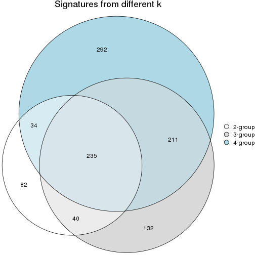

`get_signature()` returns a data frame invisibly. To get the list of signatures, the function
call should be assigned to a variable explicitly. In following code, if `plot` argument is set
to `FALSE`, no heatmap is plotted while only the differential analysis is performed.

```r
# code only for demonstration
tb = get_signature(res, k = ..., plot = FALSE)
```

An example of the output of `tb` is:

```
#>   which_row         fdr    mean_1    mean_2 scaled_mean_1 scaled_mean_2 km
#> 1        38 0.042760348  8.373488  9.131774    -0.5533452     0.5164555  1
#> 2        40 0.018707592  7.106213  8.469186    -0.6173731     0.5762149  1
#> 3        55 0.019134737 10.221463 11.207825    -0.6159697     0.5749050  1
#> 4        59 0.006059896  5.921854  7.869574    -0.6899429     0.6439467  1
#> 5        60 0.018055526  8.928898 10.211722    -0.6204761     0.5791110  1
#> 6        98 0.009384629 15.714769 14.887706     0.6635654    -0.6193277  2
...
```

The columns in `tb` are:

1. `which_row`: row indices corresponding to the input matrix.
2. `fdr`: FDR for the differential test. 
3. `mean_x`: The mean value in group x.
4. `scaled_mean_x`: The mean value in group x after rows are scaled.
5. `km`: Row groups if k-means clustering is applied to rows (which is done by automatically selecting number of clusters).

If there are too many signatures, `top_signatures = ...` can be set to only show the 
signatures with the highest FDRs:

```r
# code only for demonstration
# e.g. to show the top 500 most significant rows
tb = get_signature(res, k = ..., top_signatures = 500)
```

If the signatures are defined as these which are uniquely high in current group, `diff_method` argument
can be set to `"uniquely_high_in_one_group"`:

```r
# code only for demonstration
tb = get_signature(res, k = ..., diff_method = "uniquely_high_in_one_group")
```


UMAP plot which shows how samples are separated.


<script>
$( function() {
	$( '#tabs-node-0311-dimension-reduction' ).tabs();
} );
</script>
<div id='tabs-node-0311-dimension-reduction'>
<ul>
<li><a href='#tab-node-0311-dimension-reduction-1'>k = 2</a></li>
<li><a href='#tab-node-0311-dimension-reduction-2'>k = 3</a></li>
<li><a href='#tab-node-0311-dimension-reduction-3'>k = 4</a></li>
</ul>
<div id='tab-node-0311-dimension-reduction-1'>
<pre><code class="r">dimension_reduction(res, k = 2, method = &quot;UMAP&quot;)
</code></pre>

<p></p>

</div>
<div id='tab-node-0311-dimension-reduction-2'>
<pre><code class="r">dimension_reduction(res, k = 3, method = &quot;UMAP&quot;)
</code></pre>

<p></p>

</div>
<div id='tab-node-0311-dimension-reduction-3'>
<pre><code class="r">dimension_reduction(res, k = 4, method = &quot;UMAP&quot;)
</code></pre>

<p></p>

</div>
</div>


Following heatmap shows how subgroups are split when increasing `k`:

```r
collect_classes(res)
```


Test correlation between subgroups and known annotations. If the known
annotation is numeric, one-way ANOVA test is applied, and if the known
annotation is discrete, chi-squared contingency table test is applied.

```r
test_to_known_factors(res)
```

```
#>             n_sample Cell_type(p-value) Timepoint(p-value) k
#> ATC:skmeans       98              0.357             0.7329 2
#> ATC:skmeans      101              0.166             0.0261 3
#> ATC:skmeans       97              0.109             0.0156 4
```


If matrix rows can be associated to genes, consider to use `functional_enrichment(res,
...)` to perform function enrichment for the signature genes. See [this vignette](https://jokergoo.github.io/cola_vignettes/functional_enrichment.html) for more detailed explanations.


 

---------------------------------------------------


### Node0312


Parent node: [Node031](#Node031).
Child nodes: 
                Node01211-leaf
        ,
                Node01212-leaf
        ,
                Node01221-leaf
        ,
                Node01222-leaf
        ,
                Node01311-leaf
        ,
                Node01312-leaf
        ,
                Node01313-leaf
        ,
                Node02211-leaf
        ,
                Node02212-leaf
        ,
                Node02221-leaf
        ,
                Node02222-leaf
        ,
                Node03111-leaf
        ,
                Node03112-leaf
        ,
                Node03113-leaf
        ,
                Node03121-leaf
        ,
                Node03122-leaf
        ,
                Node03123-leaf
        .


The object with results only for a single top-value method and a single partitioning method 
can be extracted as:

```r
res = res_rh["0312"]
```

A summary of `res` and all the functions that can be applied to it:

```r
res
```

```
#> A 'ConsensusPartition' object with k = 2, 3, 4.
#>   On a matrix with 7192 rows and 102 columns.
#>   Top rows (719) are extracted by 'ATC' method.
#>   Subgroups are detected by 'skmeans' method.
#>   Performed in total 150 partitions by row resampling.
#>   Best k for subgroups seems to be 4.
#> 
#> Following methods can be applied to this 'ConsensusPartition' object:
#>  [1] "cola_report"             "collect_classes"         "collect_plots"          
#>  [4] "collect_stats"           "colnames"                "compare_partitions"     
#>  [7] "compare_signatures"      "consensus_heatmap"       "dimension_reduction"    
#> [10] "functional_enrichment"   "get_anno_col"            "get_anno"               
#> [13] "get_classes"             "get_consensus"           "get_matrix"             
#> [16] "get_membership"          "get_param"               "get_signatures"         
#> [19] "get_stats"               "is_best_k"               "is_stable_k"            
#> [22] "membership_heatmap"      "ncol"                    "nrow"                   
#> [25] "plot_ecdf"               "predict_classes"         "rownames"               
#> [28] "select_partition_number" "show"                    "suggest_best_k"         
#> [31] "test_to_known_factors"   "top_rows_heatmap"
```

`collect_plots()` function collects all the plots made from `res` for all `k` (number of subgroups)
into one single page to provide an easy and fast comparison between different `k`.

```r
collect_plots(res)
```


The plots are:

- The first row: a plot of the eCDF (empirical cumulative distribution
  function) curves of the consensus matrix for each `k` and the heatmap of
  predicted classes for each `k`.
- The second row: heatmaps of the consensus matrix for each `k`.
- The third row: heatmaps of the membership matrix for each `k`.
- The fouth row: heatmaps of the signatures for each `k`.

All the plots in panels can be made by individual functions and they are
plotted later in this section.

`select_partition_number()` produces several plots showing different
statistics for choosing "optimized" `k`. There are following statistics:

- eCDF curves of the consensus matrix for each `k`;
- 1-PAC. [The PAC score](https://en.wikipedia.org/wiki/Consensus_clustering#Over-interpretation_potential_of_consensus_clustering)
  measures the proportion of the ambiguous subgrouping.
- Mean silhouette score.
- Concordance. The mean probability of fiting the consensus subgroup labels in all
  partitions.
- Area increased. Denote $A_k$ as the area under the eCDF curve for current
  `k`, the area increased is defined as $A_k - A_{k-1}$.
- Rand index. The percent of pairs of samples that are both in a same cluster
  or both are not in a same cluster in the partition of k and k-1.
- Jaccard index. The ratio of pairs of samples are both in a same cluster in
  the partition of k and k-1 and the pairs of samples are both in a same
  cluster in the partition k or k-1.

The detailed explanations of these statistics can be found in [the _cola_
vignette](https://jokergoo.github.io/cola_vignettes/cola.html#toc_13).

Generally speaking, higher 1-PAC score, higher mean silhouette score or higher
concordance corresponds to better partition. Rand index and Jaccard index
measure how similar the current partition is compared to partition with `k-1`.
If they are too similar, we won't accept `k` is better than `k-1`.

```r
select_partition_number(res)
```


The numeric values for all these statistics can be obtained by `get_stats()`.

```r
get_stats(res)
```

```
#>   k 1-PAC mean_silhouette concordance area_increased  Rand Jaccard
#> 2 2 0.529           0.693       0.862          0.482 0.533   0.533
#> 3 3 1.000           0.980       0.992          0.369 0.730   0.527
#> 4 4 0.947           0.933       0.956          0.102 0.918   0.765
```

`suggest_best_k()` suggests the best $k$ based on these statistics. The rules are as follows:

- All $k$ with Jaccard index larger than 0.95 are removed because increasing
  $k$ does not provide enough extra information. If all $k$ are removed, it is
  marked as no subgroup is detected.
- For all $k$ with 1-PAC score larger than 0.9, the maximal $k$ is taken as
  the best $k$, and other $k$ are marked as optional $k$.
- If it does not fit the second rule. The $k$ with the maximal vote of the
  highest 1-PAC score, highest mean silhouette, and highest concordance is
  taken as the best $k$.

```r
suggest_best_k(res)
```

```
#> [1] 4
#> attr(,"optional")
#> [1] 3
```

There is also optional best $k$ = 3 that is worth to check.

Following is the table of the partitions (You need to click the **show/hide
code output** link to see it). The membership matrix (columns with name `p*`)
is inferred by
[`clue::cl_consensus()`](https://www.rdocumentation.org/link/cl_consensus?package=clue)
function with the `SE` method. Basically the value in the membership matrix
represents the probability to belong to a certain group. The finall subgroup
label for an item is determined with the group with highest probability it
belongs to.

In `get_classes()` function, the entropy is calculated from the membership
matrix and the silhouette score is calculated from the consensus matrix.


<script>
$( function() {
	$( '#tabs-node-0312-get-classes' ).tabs();
} );
</script>
<div id='tabs-node-0312-get-classes'>
<ul>
<li><a href='#tab-node-0312-get-classes-1'>k = 2</a></li>
<li><a href='#tab-node-0312-get-classes-2'>k = 3</a></li>
<li><a href='#tab-node-0312-get-classes-3'>k = 4</a></li>
</ul>

<div id='tab-node-0312-get-classes-1'>
<p><a id='tab-node-0312-get-classes-1-a' style='color:#0366d6' href='#'>show/hide code output</a></p>
<pre><code class="r">cbind(get_classes(res, k = 2), get_membership(res, k = 2))
</code></pre>

<pre><code>#&gt;                class entropy silhouette   p1   p2
#&gt; 1772071065_B01     1   0.000      0.804 1.00 0.00
#&gt; 1772094146_C04     1   0.000      0.804 1.00 0.00
#&gt; 1772094166_E07     1   0.000      0.804 1.00 0.00
#&gt; 1772094161_C05     1   0.000      0.804 1.00 0.00
#&gt; 1772094144_F05     1   0.000      0.804 1.00 0.00
#&gt; 1772094161_E03     1   0.000      0.804 1.00 0.00
#&gt; 1772094171_H10     2   0.327      0.773 0.06 0.94
#&gt; 1772094144_B02     1   0.000      0.804 1.00 0.00
#&gt; 1771013113_B03     1   0.000      0.804 1.00 0.00
#&gt; 1772094169_G11     1   0.000      0.804 1.00 0.00
#&gt; 1771013013_C12     1   0.000      0.804 1.00 0.00
#&gt; 1772094146_F09     1   0.000      0.804 1.00 0.00
#&gt; 1772096114_E03     1   0.000      0.804 1.00 0.00
#&gt; 1772094146_E05     1   0.000      0.804 1.00 0.00
#&gt; 1772094172_H11     1   0.000      0.804 1.00 0.00
#&gt; 1771013013_G04     1   0.000      0.804 1.00 0.00
#&gt; 1772094166_A12     1   0.000      0.804 1.00 0.00
#&gt; 1772096115_E10     1   0.000      0.804 1.00 0.00
#&gt; 1772094166_B10     1   0.981      0.498 0.58 0.42
#&gt; 1772094144_F04     1   0.000      0.804 1.00 0.00
#&gt; 1771013013_H10     1   0.000      0.804 1.00 0.00
#&gt; 1771013118_A04     1   0.000      0.804 1.00 0.00
#&gt; 1772094146_D04     1   0.000      0.804 1.00 0.00
#&gt; 1772094146_G11     1   0.971      0.520 0.60 0.40
#&gt; 1772096115_E03     2   0.981      0.432 0.42 0.58
#&gt; 1772071065_C05     1   0.000      0.804 1.00 0.00
#&gt; 1771013013_B10     1   0.000      0.804 1.00 0.00
#&gt; 1771013108_E03     1   0.000      0.804 1.00 0.00
#&gt; 1772094158_D05     1   0.000      0.804 1.00 0.00
#&gt; 1771013113_G05     1   0.000      0.804 1.00 0.00
#&gt; 1771013118_E09     1   0.000      0.804 1.00 0.00
#&gt; 1771013013_E05     1   0.000      0.804 1.00 0.00
#&gt; 1772094146_H12     1   0.000      0.804 1.00 0.00
#&gt; 1772094144_D10     1   0.000      0.804 1.00 0.00
#&gt; 1772094146_D12     1   0.000      0.804 1.00 0.00
#&gt; 1772092007_F06     1   0.000      0.804 1.00 0.00
#&gt; 1772096111_F10     1   0.000      0.804 1.00 0.00
#&gt; 1772094146_A02     2   0.999     -0.297 0.48 0.52
#&gt; 1772092007_D11     1   0.000      0.804 1.00 0.00
#&gt; 1772094144_D12     1   0.000      0.804 1.00 0.00
#&gt; 1772094146_D03     1   0.000      0.804 1.00 0.00
#&gt; 1772094146_C06     1   0.855      0.623 0.72 0.28
#&gt; 1772094146_D02     1   0.981      0.498 0.58 0.42
#&gt; 1772072246_D12     2   0.000      0.836 0.00 1.00
#&gt; 1772094173_H05     2   0.000      0.836 0.00 1.00
#&gt; 1772066085_G12     2   0.000      0.836 0.00 1.00
#&gt; 1772066084_H09     2   0.000      0.836 0.00 1.00
#&gt; 1772066087_B04     2   0.000      0.836 0.00 1.00
#&gt; 1772066085_D12     2   0.000      0.836 0.00 1.00
#&gt; 1771013110_F03     1   0.000      0.804 1.00 0.00
#&gt; 1772094146_A09     1   0.000      0.804 1.00 0.00
#&gt; 1772071050_F12     2   0.981      0.432 0.42 0.58
#&gt; 1772092007_A05     1   0.000      0.804 1.00 0.00
#&gt; 1772094169_H02     2   0.000      0.836 0.00 1.00
#&gt; 1772092007_B10     1   0.000      0.804 1.00 0.00
#&gt; 1771013113_A02     1   0.995     -0.189 0.54 0.46
#&gt; 1771013153_F06     2   0.981      0.432 0.42 0.58
#&gt; 1771013118_H04     1   0.000      0.804 1.00 0.00
#&gt; 1772071050_B05     2   0.000      0.836 0.00 1.00
#&gt; 1771013013_C02     2   0.000      0.836 0.00 1.00
#&gt; 1772066085_B12     2   0.999      0.314 0.48 0.52
#&gt; 1772094174_F04     2   0.981      0.432 0.42 0.58
#&gt; 1772094173_H12     2   0.000      0.836 0.00 1.00
#&gt; 1772096114_B02     2   0.000      0.836 0.00 1.00
#&gt; 1772066085_F04     2   0.000      0.836 0.00 1.00
#&gt; 1772075300_B01     2   0.000      0.836 0.00 1.00
#&gt; 1772094172_G10     2   0.000      0.836 0.00 1.00
#&gt; 1772094173_A04     2   0.760      0.655 0.22 0.78
#&gt; 1772066087_G11     2   0.000      0.836 0.00 1.00
#&gt; 1772094173_B08     2   0.981      0.432 0.42 0.58
#&gt; 1772094175_E08     2   0.981      0.432 0.42 0.58
#&gt; 1772096111_C12     2   0.000      0.836 0.00 1.00
#&gt; 1772094173_G10     2   0.881      0.572 0.30 0.70
#&gt; 1772071065_H05     2   0.000      0.836 0.00 1.00
#&gt; 1772075303_E12     2   0.000      0.836 0.00 1.00
#&gt; 1772066085_H11     2   0.000      0.836 0.00 1.00
#&gt; 1772066084_H11     2   0.000      0.836 0.00 1.00
#&gt; 1772094175_G06     2   0.971      0.457 0.40 0.60
#&gt; 1772071065_B05     2   0.000      0.836 0.00 1.00
#&gt; 1772096114_E07     2   0.000      0.836 0.00 1.00
#&gt; 1772075302_B12     2   0.000      0.836 0.00 1.00
#&gt; 1772071049_A04     2   0.000      0.836 0.00 1.00
#&gt; 1772075302_F05     2   0.000      0.836 0.00 1.00
#&gt; 1772094146_F10     1   0.981      0.498 0.58 0.42
#&gt; 1771013118_F03     1   0.981      0.498 0.58 0.42
#&gt; 1772094146_B10     1   0.981      0.498 0.58 0.42
#&gt; 1771013013_E12     1   0.722      0.682 0.80 0.20
#&gt; 1771013013_D02     1   0.971      0.520 0.60 0.40
#&gt; 1772094163_F04     1   0.971      0.520 0.60 0.40
#&gt; 1772094146_E06     1   0.981      0.498 0.58 0.42
#&gt; 1772075302_G09     1   0.990      0.461 0.56 0.44
#&gt; 1771013118_G07     1   0.881      0.607 0.70 0.30
#&gt; 1772094144_B12     1   0.981      0.498 0.58 0.42
#&gt; 1771013013_A06     1   0.981      0.498 0.58 0.42
#&gt; 1772066085_C05     1   0.981      0.498 0.58 0.42
#&gt; 1772094166_F06     1   0.981      0.498 0.58 0.42
#&gt; 1772094144_D06     1   0.981      0.498 0.58 0.42
#&gt; 1771013013_B12     1   0.971      0.520 0.60 0.40
#&gt; 1772094166_E05     1   0.981      0.498 0.58 0.42
#&gt; 1772092006_D07     1   0.981      0.498 0.58 0.42
#&gt; 1772094163_F12     1   0.981      0.498 0.58 0.42
#&gt; 1772094146_G06     1   0.981      0.498 0.58 0.42
</code></pre>

<script>
$('#tab-node-0312-get-classes-1-a').parent().next().next().hide();
$('#tab-node-0312-get-classes-1-a').click(function(){
  $('#tab-node-0312-get-classes-1-a').parent().next().next().toggle();
  return(false);
});
</script>
</div>

<div id='tab-node-0312-get-classes-2'>
<p><a id='tab-node-0312-get-classes-2-a' style='color:#0366d6' href='#'>show/hide code output</a></p>
<pre><code class="r">cbind(get_classes(res, k = 3), get_membership(res, k = 3))
</code></pre>

<pre><code>#&gt;                class entropy silhouette   p1   p2   p3
#&gt; 1772071065_B01     1  0.0000      0.997 1.00 0.00 0.00
#&gt; 1772094146_C04     1  0.0000      0.997 1.00 0.00 0.00
#&gt; 1772094166_E07     1  0.0000      0.997 1.00 0.00 0.00
#&gt; 1772094161_C05     1  0.0000      0.997 1.00 0.00 0.00
#&gt; 1772094144_F05     3  0.0000      1.000 0.00 0.00 1.00
#&gt; 1772094161_E03     1  0.0000      0.997 1.00 0.00 0.00
#&gt; 1772094171_H10     3  0.0000      1.000 0.00 0.00 1.00
#&gt; 1772094144_B02     1  0.0000      0.997 1.00 0.00 0.00
#&gt; 1771013113_B03     1  0.0000      0.997 1.00 0.00 0.00
#&gt; 1772094169_G11     1  0.0892      0.978 0.98 0.00 0.02
#&gt; 1771013013_C12     3  0.0000      1.000 0.00 0.00 1.00
#&gt; 1772094146_F09     1  0.0000      0.997 1.00 0.00 0.00
#&gt; 1772096114_E03     1  0.0000      0.997 1.00 0.00 0.00
#&gt; 1772094146_E05     1  0.0000      0.997 1.00 0.00 0.00
#&gt; 1772094172_H11     1  0.0000      0.997 1.00 0.00 0.00
#&gt; 1771013013_G04     1  0.0000      0.997 1.00 0.00 0.00
#&gt; 1772094166_A12     1  0.0000      0.997 1.00 0.00 0.00
#&gt; 1772096115_E10     1  0.0000      0.997 1.00 0.00 0.00
#&gt; 1772094166_B10     3  0.0000      1.000 0.00 0.00 1.00
#&gt; 1772094144_F04     1  0.0000      0.997 1.00 0.00 0.00
#&gt; 1771013013_H10     1  0.0000      0.997 1.00 0.00 0.00
#&gt; 1771013118_A04     1  0.0000      0.997 1.00 0.00 0.00
#&gt; 1772094146_D04     1  0.0000      0.997 1.00 0.00 0.00
#&gt; 1772094146_G11     3  0.0000      1.000 0.00 0.00 1.00
#&gt; 1772096115_E03     2  0.5835      0.489 0.34 0.66 0.00
#&gt; 1772071065_C05     1  0.0000      0.997 1.00 0.00 0.00
#&gt; 1771013013_B10     1  0.0000      0.997 1.00 0.00 0.00
#&gt; 1771013108_E03     1  0.0000      0.997 1.00 0.00 0.00
#&gt; 1772094158_D05     1  0.0000      0.997 1.00 0.00 0.00
#&gt; 1771013113_G05     1  0.0000      0.997 1.00 0.00 0.00
#&gt; 1771013118_E09     1  0.0000      0.997 1.00 0.00 0.00
#&gt; 1771013013_E05     1  0.0000      0.997 1.00 0.00 0.00
#&gt; 1772094146_H12     1  0.0000      0.997 1.00 0.00 0.00
#&gt; 1772094144_D10     1  0.0000      0.997 1.00 0.00 0.00
#&gt; 1772094146_D12     1  0.0000      0.997 1.00 0.00 0.00
#&gt; 1772092007_F06     1  0.0000      0.997 1.00 0.00 0.00
#&gt; 1772096111_F10     1  0.0000      0.997 1.00 0.00 0.00
#&gt; 1772094146_A02     3  0.0000      1.000 0.00 0.00 1.00
#&gt; 1772092007_D11     1  0.0000      0.997 1.00 0.00 0.00
#&gt; 1772094144_D12     1  0.0000      0.997 1.00 0.00 0.00
#&gt; 1772094146_D03     1  0.0000      0.997 1.00 0.00 0.00
#&gt; 1772094146_C06     3  0.0000      1.000 0.00 0.00 1.00
#&gt; 1772094146_D02     3  0.0000      1.000 0.00 0.00 1.00
#&gt; 1772072246_D12     2  0.0000      0.973 0.00 1.00 0.00
#&gt; 1772094173_H05     2  0.0000      0.973 0.00 1.00 0.00
#&gt; 1772066085_G12     2  0.0000      0.973 0.00 1.00 0.00
#&gt; 1772066084_H09     2  0.0000      0.973 0.00 1.00 0.00
#&gt; 1772066087_B04     2  0.0000      0.973 0.00 1.00 0.00
#&gt; 1772066085_D12     2  0.0000      0.973 0.00 1.00 0.00
#&gt; 1771013110_F03     1  0.0000      0.997 1.00 0.00 0.00
#&gt; 1772094146_A09     1  0.0000      0.997 1.00 0.00 0.00
#&gt; 1772071050_F12     1  0.0000      0.997 1.00 0.00 0.00
#&gt; 1772092007_A05     1  0.0000      0.997 1.00 0.00 0.00
#&gt; 1772094169_H02     2  0.0000      0.973 0.00 1.00 0.00
#&gt; 1772092007_B10     1  0.0000      0.997 1.00 0.00 0.00
#&gt; 1771013113_A02     1  0.0000      0.997 1.00 0.00 0.00
#&gt; 1771013153_F06     1  0.0000      0.997 1.00 0.00 0.00
#&gt; 1771013118_H04     1  0.0000      0.997 1.00 0.00 0.00
#&gt; 1772071050_B05     2  0.5016      0.680 0.00 0.76 0.24
#&gt; 1771013013_C02     3  0.0000      1.000 0.00 0.00 1.00
#&gt; 1772066085_B12     1  0.2959      0.886 0.90 0.10 0.00
#&gt; 1772094174_F04     2  0.4002      0.804 0.16 0.84 0.00
#&gt; 1772094173_H12     2  0.0000      0.973 0.00 1.00 0.00
#&gt; 1772096114_B02     2  0.0000      0.973 0.00 1.00 0.00
#&gt; 1772066085_F04     2  0.0000      0.973 0.00 1.00 0.00
#&gt; 1772075300_B01     2  0.0000      0.973 0.00 1.00 0.00
#&gt; 1772094172_G10     2  0.0000      0.973 0.00 1.00 0.00
#&gt; 1772094173_A04     2  0.0000      0.973 0.00 1.00 0.00
#&gt; 1772066087_G11     2  0.0000      0.973 0.00 1.00 0.00
#&gt; 1772094173_B08     2  0.0000      0.973 0.00 1.00 0.00
#&gt; 1772094175_E08     2  0.0000      0.973 0.00 1.00 0.00
#&gt; 1772096111_C12     2  0.0000      0.973 0.00 1.00 0.00
#&gt; 1772094173_G10     2  0.0000      0.973 0.00 1.00 0.00
#&gt; 1772071065_H05     2  0.0000      0.973 0.00 1.00 0.00
#&gt; 1772075303_E12     2  0.0000      0.973 0.00 1.00 0.00
#&gt; 1772066085_H11     2  0.0000      0.973 0.00 1.00 0.00
#&gt; 1772066084_H11     2  0.0000      0.973 0.00 1.00 0.00
#&gt; 1772094175_G06     2  0.0000      0.973 0.00 1.00 0.00
#&gt; 1772071065_B05     2  0.0000      0.973 0.00 1.00 0.00
#&gt; 1772096114_E07     2  0.0000      0.973 0.00 1.00 0.00
#&gt; 1772075302_B12     2  0.0000      0.973 0.00 1.00 0.00
#&gt; 1772071049_A04     2  0.0000      0.973 0.00 1.00 0.00
#&gt; 1772075302_F05     2  0.0000      0.973 0.00 1.00 0.00
#&gt; 1772094146_F10     3  0.0000      1.000 0.00 0.00 1.00
#&gt; 1771013118_F03     3  0.0000      1.000 0.00 0.00 1.00
#&gt; 1772094146_B10     3  0.0000      1.000 0.00 0.00 1.00
#&gt; 1771013013_E12     3  0.0000      1.000 0.00 0.00 1.00
#&gt; 1771013013_D02     3  0.0000      1.000 0.00 0.00 1.00
#&gt; 1772094163_F04     3  0.0000      1.000 0.00 0.00 1.00
#&gt; 1772094146_E06     3  0.0000      1.000 0.00 0.00 1.00
#&gt; 1772075302_G09     3  0.0000      1.000 0.00 0.00 1.00
#&gt; 1771013118_G07     3  0.0000      1.000 0.00 0.00 1.00
#&gt; 1772094144_B12     3  0.0000      1.000 0.00 0.00 1.00
#&gt; 1771013013_A06     3  0.0000      1.000 0.00 0.00 1.00
#&gt; 1772066085_C05     3  0.0000      1.000 0.00 0.00 1.00
#&gt; 1772094166_F06     3  0.0000      1.000 0.00 0.00 1.00
#&gt; 1772094144_D06     3  0.0000      1.000 0.00 0.00 1.00
#&gt; 1771013013_B12     3  0.0000      1.000 0.00 0.00 1.00
#&gt; 1772094166_E05     3  0.0000      1.000 0.00 0.00 1.00
#&gt; 1772092006_D07     3  0.0000      1.000 0.00 0.00 1.00
#&gt; 1772094163_F12     3  0.0000      1.000 0.00 0.00 1.00
#&gt; 1772094146_G06     3  0.0000      1.000 0.00 0.00 1.00
</code></pre>

<script>
$('#tab-node-0312-get-classes-2-a').parent().next().next().hide();
$('#tab-node-0312-get-classes-2-a').click(function(){
  $('#tab-node-0312-get-classes-2-a').parent().next().next().toggle();
  return(false);
});
</script>
</div>

<div id='tab-node-0312-get-classes-3'>
<p><a id='tab-node-0312-get-classes-3-a' style='color:#0366d6' href='#'>show/hide code output</a></p>
<pre><code class="r">cbind(get_classes(res, k = 4), get_membership(res, k = 4))
</code></pre>

<pre><code>#&gt;                class entropy silhouette   p1   p2   p3   p4
#&gt; 1772071065_B01     1  0.0707      0.952 0.98 0.00 0.00 0.02
#&gt; 1772094146_C04     1  0.0000      0.953 1.00 0.00 0.00 0.00
#&gt; 1772094166_E07     1  0.2011      0.933 0.92 0.00 0.00 0.08
#&gt; 1772094161_C05     1  0.3400      0.856 0.82 0.00 0.00 0.18
#&gt; 1772094144_F05     3  0.0000      0.995 0.00 0.00 1.00 0.00
#&gt; 1772094161_E03     1  0.0707      0.953 0.98 0.00 0.00 0.02
#&gt; 1772094171_H10     3  0.1411      0.961 0.00 0.02 0.96 0.02
#&gt; 1772094144_B02     1  0.1211      0.949 0.96 0.00 0.00 0.04
#&gt; 1771013113_B03     1  0.0707      0.952 0.98 0.00 0.00 0.02
#&gt; 1772094169_G11     1  0.2647      0.903 0.88 0.00 0.00 0.12
#&gt; 1771013013_C12     3  0.1637      0.925 0.06 0.00 0.94 0.00
#&gt; 1772094146_F09     1  0.1211      0.949 0.96 0.00 0.00 0.04
#&gt; 1772096114_E03     1  0.1211      0.949 0.96 0.00 0.00 0.04
#&gt; 1772094146_E05     1  0.0707      0.953 0.98 0.00 0.00 0.02
#&gt; 1772094172_H11     1  0.0707      0.953 0.98 0.00 0.00 0.02
#&gt; 1771013013_G04     1  0.0707      0.952 0.98 0.00 0.00 0.02
#&gt; 1772094166_A12     1  0.2011      0.930 0.92 0.00 0.00 0.08
#&gt; 1772096115_E10     1  0.1637      0.941 0.94 0.00 0.00 0.06
#&gt; 1772094166_B10     3  0.0000      0.995 0.00 0.00 1.00 0.00
#&gt; 1772094144_F04     1  0.0707      0.952 0.98 0.00 0.00 0.02
#&gt; 1771013013_H10     1  0.0707      0.952 0.98 0.00 0.00 0.02
#&gt; 1771013118_A04     1  0.0000      0.953 1.00 0.00 0.00 0.00
#&gt; 1772094146_D04     1  0.0707      0.952 0.98 0.00 0.00 0.02
#&gt; 1772094146_G11     3  0.0000      0.995 0.00 0.00 1.00 0.00
#&gt; 1772096115_E03     4  0.1411      0.830 0.02 0.02 0.00 0.96
#&gt; 1772071065_C05     1  0.1211      0.949 0.96 0.00 0.00 0.04
#&gt; 1771013013_B10     1  0.0000      0.953 1.00 0.00 0.00 0.00
#&gt; 1771013108_E03     1  0.3400      0.856 0.82 0.00 0.00 0.18
#&gt; 1772094158_D05     1  0.0000      0.953 1.00 0.00 0.00 0.00
#&gt; 1771013113_G05     1  0.0707      0.952 0.98 0.00 0.00 0.02
#&gt; 1771013118_E09     1  0.0707      0.952 0.98 0.00 0.00 0.02
#&gt; 1771013013_E05     1  0.0707      0.952 0.98 0.00 0.00 0.02
#&gt; 1772094146_H12     1  0.2011      0.944 0.92 0.00 0.00 0.08
#&gt; 1772094144_D10     1  0.1211      0.949 0.96 0.00 0.00 0.04
#&gt; 1772094146_D12     1  0.1211      0.949 0.96 0.00 0.00 0.04
#&gt; 1772092007_F06     1  0.1211      0.949 0.96 0.00 0.00 0.04
#&gt; 1772096111_F10     1  0.2921      0.887 0.86 0.00 0.00 0.14
#&gt; 1772094146_A02     3  0.0000      0.995 0.00 0.00 1.00 0.00
#&gt; 1772092007_D11     1  0.1211      0.949 0.96 0.00 0.00 0.04
#&gt; 1772094144_D12     1  0.0707      0.952 0.98 0.00 0.00 0.02
#&gt; 1772094146_D03     1  0.0707      0.953 0.98 0.00 0.00 0.02
#&gt; 1772094146_C06     3  0.0000      0.995 0.00 0.00 1.00 0.00
#&gt; 1772094146_D02     3  0.0000      0.995 0.00 0.00 1.00 0.00
#&gt; 1772072246_D12     2  0.0000      0.993 0.00 1.00 0.00 0.00
#&gt; 1772094173_H05     2  0.0000      0.993 0.00 1.00 0.00 0.00
#&gt; 1772066085_G12     2  0.0000      0.993 0.00 1.00 0.00 0.00
#&gt; 1772066084_H09     2  0.0000      0.993 0.00 1.00 0.00 0.00
#&gt; 1772066087_B04     2  0.0000      0.993 0.00 1.00 0.00 0.00
#&gt; 1772066085_D12     2  0.0000      0.993 0.00 1.00 0.00 0.00
#&gt; 1771013110_F03     1  0.4855      0.360 0.60 0.00 0.00 0.40
#&gt; 1772094146_A09     1  0.1211      0.944 0.96 0.00 0.00 0.04
#&gt; 1772071050_F12     4  0.1637      0.833 0.06 0.00 0.00 0.94
#&gt; 1772092007_A05     1  0.0707      0.952 0.98 0.00 0.00 0.02
#&gt; 1772094169_H02     2  0.1211      0.954 0.00 0.96 0.00 0.04
#&gt; 1772092007_B10     1  0.1211      0.953 0.96 0.00 0.00 0.04
#&gt; 1771013113_A02     4  0.4277      0.583 0.28 0.00 0.00 0.72
#&gt; 1771013153_F06     4  0.1211      0.824 0.04 0.00 0.00 0.96
#&gt; 1771013118_H04     1  0.0707      0.952 0.98 0.00 0.00 0.02
#&gt; 1772071050_B05     2  0.1637      0.910 0.00 0.94 0.06 0.00
#&gt; 1771013013_C02     3  0.0707      0.976 0.00 0.02 0.98 0.00
#&gt; 1772066085_B12     4  0.2335      0.839 0.06 0.02 0.00 0.92
#&gt; 1772094174_F04     4  0.1913      0.843 0.04 0.02 0.00 0.94
#&gt; 1772094173_H12     4  0.2647      0.843 0.00 0.12 0.00 0.88
#&gt; 1772096114_B02     2  0.0000      0.993 0.00 1.00 0.00 0.00
#&gt; 1772066085_F04     2  0.0000      0.993 0.00 1.00 0.00 0.00
#&gt; 1772075300_B01     4  0.4790      0.555 0.00 0.38 0.00 0.62
#&gt; 1772094172_G10     4  0.4790      0.555 0.00 0.38 0.00 0.62
#&gt; 1772094173_A04     4  0.2345      0.850 0.00 0.10 0.00 0.90
#&gt; 1772066087_G11     4  0.4624      0.620 0.00 0.34 0.00 0.66
#&gt; 1772094173_B08     4  0.2011      0.855 0.00 0.08 0.00 0.92
#&gt; 1772094175_E08     4  0.2011      0.855 0.00 0.08 0.00 0.92
#&gt; 1772096111_C12     2  0.0000      0.993 0.00 1.00 0.00 0.00
#&gt; 1772094173_G10     4  0.3172      0.817 0.00 0.16 0.00 0.84
#&gt; 1772071065_H05     2  0.0000      0.993 0.00 1.00 0.00 0.00
#&gt; 1772075303_E12     2  0.0000      0.993 0.00 1.00 0.00 0.00
#&gt; 1772066085_H11     2  0.0000      0.993 0.00 1.00 0.00 0.00
#&gt; 1772066084_H11     2  0.0000      0.993 0.00 1.00 0.00 0.00
#&gt; 1772094175_G06     4  0.2011      0.855 0.00 0.08 0.00 0.92
#&gt; 1772071065_B05     2  0.0000      0.993 0.00 1.00 0.00 0.00
#&gt; 1772096114_E07     2  0.0000      0.993 0.00 1.00 0.00 0.00
#&gt; 1772075302_B12     2  0.0000      0.993 0.00 1.00 0.00 0.00
#&gt; 1772071049_A04     2  0.0000      0.993 0.00 1.00 0.00 0.00
#&gt; 1772075302_F05     2  0.0000      0.993 0.00 1.00 0.00 0.00
#&gt; 1772094146_F10     3  0.0000      0.995 0.00 0.00 1.00 0.00
#&gt; 1771013118_F03     3  0.0000      0.995 0.00 0.00 1.00 0.00
#&gt; 1772094146_B10     3  0.0000      0.995 0.00 0.00 1.00 0.00
#&gt; 1771013013_E12     3  0.0000      0.995 0.00 0.00 1.00 0.00
#&gt; 1771013013_D02     3  0.0000      0.995 0.00 0.00 1.00 0.00
#&gt; 1772094163_F04     3  0.0000      0.995 0.00 0.00 1.00 0.00
#&gt; 1772094146_E06     3  0.0000      0.995 0.00 0.00 1.00 0.00
#&gt; 1772075302_G09     3  0.0000      0.995 0.00 0.00 1.00 0.00
#&gt; 1771013118_G07     3  0.0000      0.995 0.00 0.00 1.00 0.00
#&gt; 1772094144_B12     3  0.0000      0.995 0.00 0.00 1.00 0.00
#&gt; 1771013013_A06     3  0.0000      0.995 0.00 0.00 1.00 0.00
#&gt; 1772066085_C05     3  0.0000      0.995 0.00 0.00 1.00 0.00
#&gt; 1772094166_F06     3  0.0000      0.995 0.00 0.00 1.00 0.00
#&gt; 1772094144_D06     3  0.0000      0.995 0.00 0.00 1.00 0.00
#&gt; 1771013013_B12     3  0.0000      0.995 0.00 0.00 1.00 0.00
#&gt; 1772094166_E05     3  0.0000      0.995 0.00 0.00 1.00 0.00
#&gt; 1772092006_D07     3  0.0000      0.995 0.00 0.00 1.00 0.00
#&gt; 1772094163_F12     3  0.0000      0.995 0.00 0.00 1.00 0.00
#&gt; 1772094146_G06     3  0.0000      0.995 0.00 0.00 1.00 0.00
</code></pre>

<script>
$('#tab-node-0312-get-classes-3-a').parent().next().next().hide();
$('#tab-node-0312-get-classes-3-a').click(function(){
  $('#tab-node-0312-get-classes-3-a').parent().next().next().toggle();
  return(false);
});
</script>
</div>
</div>

Heatmaps for the consensus matrix. It visualizes the probability of two
samples to be in a same group.


<script>
$( function() {
	$( '#tabs-node-0312-consensus-heatmap' ).tabs();
} );
</script>
<div id='tabs-node-0312-consensus-heatmap'>
<ul>
<li><a href='#tab-node-0312-consensus-heatmap-1'>k = 2</a></li>
<li><a href='#tab-node-0312-consensus-heatmap-2'>k = 3</a></li>
<li><a href='#tab-node-0312-consensus-heatmap-3'>k = 4</a></li>
</ul>
<div id='tab-node-0312-consensus-heatmap-1'>
<pre><code class="r">consensus_heatmap(res, k = 2)
</code></pre>

<p></p>

</div>
<div id='tab-node-0312-consensus-heatmap-2'>
<pre><code class="r">consensus_heatmap(res, k = 3)
</code></pre>

<p></p>

</div>
<div id='tab-node-0312-consensus-heatmap-3'>
<pre><code class="r">consensus_heatmap(res, k = 4)
</code></pre>

<p></p>

</div>
</div>

Heatmaps for the membership of samples in all partitions to see how consistent they are:


<script>
$( function() {
	$( '#tabs-node-0312-membership-heatmap' ).tabs();
} );
</script>
<div id='tabs-node-0312-membership-heatmap'>
<ul>
<li><a href='#tab-node-0312-membership-heatmap-1'>k = 2</a></li>
<li><a href='#tab-node-0312-membership-heatmap-2'>k = 3</a></li>
<li><a href='#tab-node-0312-membership-heatmap-3'>k = 4</a></li>
</ul>
<div id='tab-node-0312-membership-heatmap-1'>
<pre><code class="r">membership_heatmap(res, k = 2)
</code></pre>

<p></p>

</div>
<div id='tab-node-0312-membership-heatmap-2'>
<pre><code class="r">membership_heatmap(res, k = 3)
</code></pre>

<p></p>

</div>
<div id='tab-node-0312-membership-heatmap-3'>
<pre><code class="r">membership_heatmap(res, k = 4)
</code></pre>

<p></p>

</div>
</div>

As soon as the classes for columns are determined, the signatures
that are significantly different between subgroups can be looked for. 
Following are the heatmaps for signatures.


Signature heatmaps where rows are scaled:


<script>
$( function() {
	$( '#tabs-node-0312-get-signatures' ).tabs();
} );
</script>
<div id='tabs-node-0312-get-signatures'>
<ul>
<li><a href='#tab-node-0312-get-signatures-1'>k = 2</a></li>
<li><a href='#tab-node-0312-get-signatures-2'>k = 3</a></li>
<li><a href='#tab-node-0312-get-signatures-3'>k = 4</a></li>
</ul>
<div id='tab-node-0312-get-signatures-1'>
<pre><code class="r">get_signatures(res, k = 2)
</code></pre>

<p></p>

</div>
<div id='tab-node-0312-get-signatures-2'>
<pre><code class="r">get_signatures(res, k = 3)
</code></pre>

<p></p>

</div>
<div id='tab-node-0312-get-signatures-3'>
<pre><code class="r">get_signatures(res, k = 4)
</code></pre>

<p></p>

</div>
</div>


Signature heatmaps where rows are not scaled:


<script>
$( function() {
	$( '#tabs-node-0312-get-signatures-no-scale' ).tabs();
} );
</script>
<div id='tabs-node-0312-get-signatures-no-scale'>
<ul>
<li><a href='#tab-node-0312-get-signatures-no-scale-1'>k = 2</a></li>
<li><a href='#tab-node-0312-get-signatures-no-scale-2'>k = 3</a></li>
<li><a href='#tab-node-0312-get-signatures-no-scale-3'>k = 4</a></li>
</ul>
<div id='tab-node-0312-get-signatures-no-scale-1'>
<pre><code class="r">get_signatures(res, k = 2, scale_rows = FALSE)
</code></pre>

<p></p>

</div>
<div id='tab-node-0312-get-signatures-no-scale-2'>
<pre><code class="r">get_signatures(res, k = 3, scale_rows = FALSE)
</code></pre>

<p></p>

</div>
<div id='tab-node-0312-get-signatures-no-scale-3'>
<pre><code class="r">get_signatures(res, k = 4, scale_rows = FALSE)
</code></pre>

<p></p>

</div>
</div>


Compare the overlap of signatures from different k:

```r
compare_signatures(res)
```


`get_signature()` returns a data frame invisibly. To get the list of signatures, the function
call should be assigned to a variable explicitly. In following code, if `plot` argument is set
to `FALSE`, no heatmap is plotted while only the differential analysis is performed.

```r
# code only for demonstration
tb = get_signature(res, k = ..., plot = FALSE)
```

An example of the output of `tb` is:

```
#>   which_row         fdr    mean_1    mean_2 scaled_mean_1 scaled_mean_2 km
#> 1        38 0.042760348  8.373488  9.131774    -0.5533452     0.5164555  1
#> 2        40 0.018707592  7.106213  8.469186    -0.6173731     0.5762149  1
#> 3        55 0.019134737 10.221463 11.207825    -0.6159697     0.5749050  1
#> 4        59 0.006059896  5.921854  7.869574    -0.6899429     0.6439467  1
#> 5        60 0.018055526  8.928898 10.211722    -0.6204761     0.5791110  1
#> 6        98 0.009384629 15.714769 14.887706     0.6635654    -0.6193277  2
...
```

The columns in `tb` are:

1. `which_row`: row indices corresponding to the input matrix.
2. `fdr`: FDR for the differential test. 
3. `mean_x`: The mean value in group x.
4. `scaled_mean_x`: The mean value in group x after rows are scaled.
5. `km`: Row groups if k-means clustering is applied to rows (which is done by automatically selecting number of clusters).

If there are too many signatures, `top_signatures = ...` can be set to only show the 
signatures with the highest FDRs:

```r
# code only for demonstration
# e.g. to show the top 500 most significant rows
tb = get_signature(res, k = ..., top_signatures = 500)
```

If the signatures are defined as these which are uniquely high in current group, `diff_method` argument
can be set to `"uniquely_high_in_one_group"`:

```r
# code only for demonstration
tb = get_signature(res, k = ..., diff_method = "uniquely_high_in_one_group")
```


UMAP plot which shows how samples are separated.


<script>
$( function() {
	$( '#tabs-node-0312-dimension-reduction' ).tabs();
} );
</script>
<div id='tabs-node-0312-dimension-reduction'>
<ul>
<li><a href='#tab-node-0312-dimension-reduction-1'>k = 2</a></li>
<li><a href='#tab-node-0312-dimension-reduction-2'>k = 3</a></li>
<li><a href='#tab-node-0312-dimension-reduction-3'>k = 4</a></li>
</ul>
<div id='tab-node-0312-dimension-reduction-1'>
<pre><code class="r">dimension_reduction(res, k = 2, method = &quot;UMAP&quot;)
</code></pre>

<p></p>

</div>
<div id='tab-node-0312-dimension-reduction-2'>
<pre><code class="r">dimension_reduction(res, k = 3, method = &quot;UMAP&quot;)
</code></pre>

<p></p>

</div>
<div id='tab-node-0312-dimension-reduction-3'>
<pre><code class="r">dimension_reduction(res, k = 4, method = &quot;UMAP&quot;)
</code></pre>

<p></p>

</div>
</div>


Following heatmap shows how subgroups are split when increasing `k`:

```r
collect_classes(res)
```


Test correlation between subgroups and known annotations. If the known
annotation is numeric, one-way ANOVA test is applied, and if the known
annotation is discrete, chi-squared contingency table test is applied.

```r
test_to_known_factors(res)
```

```
#>             n_sample Cell_type(p-value) Timepoint(p-value) k
#> ATC:skmeans       76           2.73e-11           1.27e-08 2
#> ATC:skmeans      101           5.40e-21           1.07e-09 3
#> ATC:skmeans      101           1.18e-19           9.54e-13 4
```


If matrix rows can be associated to genes, consider to use `functional_enrichment(res,
...)` to perform function enrichment for the signature genes. See [this vignette](https://jokergoo.github.io/cola_vignettes/functional_enrichment.html) for more detailed explanations.


 

---------------------------------------------------


### Node032


Parent node: [Node03](#Node03).
Child nodes: 
                [Node0121](#Node0121)
        ,
                [Node0122](#Node0122)
        ,
                Node0123-leaf
        ,
                [Node0131](#Node0131)
        ,
                Node0132-leaf
        ,
                Node0133-leaf
        ,
                [Node0221](#Node0221)
        ,
                [Node0222](#Node0222)
        ,
                Node0231-leaf
        ,
                Node0232-leaf
        ,
                Node0233-leaf
        ,
                [Node0311](#Node0311)
        ,
                [Node0312](#Node0312)
        ,
                Node0321-leaf
        ,
                Node0322-leaf
        ,
                Node0323-leaf
        ,
                Node0324-leaf
        .


The object with results only for a single top-value method and a single partitioning method 
can be extracted as:

```r
res = res_rh["032"]
```

A summary of `res` and all the functions that can be applied to it:

```r
res
```

```
#> A 'ConsensusPartition' object with k = 2, 3, 4.
#>   On a matrix with 8139 rows and 122 columns.
#>   Top rows (814) are extracted by 'ATC' method.
#>   Subgroups are detected by 'skmeans' method.
#>   Performed in total 150 partitions by row resampling.
#>   Best k for subgroups seems to be 4.
#> 
#> Following methods can be applied to this 'ConsensusPartition' object:
#>  [1] "cola_report"             "collect_classes"         "collect_plots"          
#>  [4] "collect_stats"           "colnames"                "compare_partitions"     
#>  [7] "compare_signatures"      "consensus_heatmap"       "dimension_reduction"    
#> [10] "functional_enrichment"   "get_anno_col"            "get_anno"               
#> [13] "get_classes"             "get_consensus"           "get_matrix"             
#> [16] "get_membership"          "get_param"               "get_signatures"         
#> [19] "get_stats"               "is_best_k"               "is_stable_k"            
#> [22] "membership_heatmap"      "ncol"                    "nrow"                   
#> [25] "plot_ecdf"               "predict_classes"         "rownames"               
#> [28] "select_partition_number" "show"                    "suggest_best_k"         
#> [31] "test_to_known_factors"   "top_rows_heatmap"
```

`collect_plots()` function collects all the plots made from `res` for all `k` (number of subgroups)
into one single page to provide an easy and fast comparison between different `k`.

```r
collect_plots(res)
```


The plots are:

- The first row: a plot of the eCDF (empirical cumulative distribution
  function) curves of the consensus matrix for each `k` and the heatmap of
  predicted classes for each `k`.
- The second row: heatmaps of the consensus matrix for each `k`.
- The third row: heatmaps of the membership matrix for each `k`.
- The fouth row: heatmaps of the signatures for each `k`.

All the plots in panels can be made by individual functions and they are
plotted later in this section.

`select_partition_number()` produces several plots showing different
statistics for choosing "optimized" `k`. There are following statistics:

- eCDF curves of the consensus matrix for each `k`;
- 1-PAC. [The PAC score](https://en.wikipedia.org/wiki/Consensus_clustering#Over-interpretation_potential_of_consensus_clustering)
  measures the proportion of the ambiguous subgrouping.
- Mean silhouette score.
- Concordance. The mean probability of fiting the consensus subgroup labels in all
  partitions.
- Area increased. Denote $A_k$ as the area under the eCDF curve for current
  `k`, the area increased is defined as $A_k - A_{k-1}$.
- Rand index. The percent of pairs of samples that are both in a same cluster
  or both are not in a same cluster in the partition of k and k-1.
- Jaccard index. The ratio of pairs of samples are both in a same cluster in
  the partition of k and k-1 and the pairs of samples are both in a same
  cluster in the partition k or k-1.

The detailed explanations of these statistics can be found in [the _cola_
vignette](https://jokergoo.github.io/cola_vignettes/cola.html#toc_13).

Generally speaking, higher 1-PAC score, higher mean silhouette score or higher
concordance corresponds to better partition. Rand index and Jaccard index
measure how similar the current partition is compared to partition with `k-1`.
If they are too similar, we won't accept `k` is better than `k-1`.

```r
select_partition_number(res)
```


The numeric values for all these statistics can be obtained by `get_stats()`.

```r
get_stats(res)
```

```
#>   k 1-PAC mean_silhouette concordance area_increased  Rand Jaccard
#> 2 2 1.000           0.981       0.992          0.505 0.496   0.496
#> 3 3 0.948           0.943       0.974          0.277 0.828   0.664
#> 4 4 0.975           0.952       0.973          0.169 0.874   0.654
```

`suggest_best_k()` suggests the best $k$ based on these statistics. The rules are as follows:

- All $k$ with Jaccard index larger than 0.95 are removed because increasing
  $k$ does not provide enough extra information. If all $k$ are removed, it is
  marked as no subgroup is detected.
- For all $k$ with 1-PAC score larger than 0.9, the maximal $k$ is taken as
  the best $k$, and other $k$ are marked as optional $k$.
- If it does not fit the second rule. The $k$ with the maximal vote of the
  highest 1-PAC score, highest mean silhouette, and highest concordance is
  taken as the best $k$.

```r
suggest_best_k(res)
```

```
#> [1] 4
#> attr(,"optional")
#> [1] 2 3
```

There is also optional best $k$ = 2 3 that is worth to check.

Following is the table of the partitions (You need to click the **show/hide
code output** link to see it). The membership matrix (columns with name `p*`)
is inferred by
[`clue::cl_consensus()`](https://www.rdocumentation.org/link/cl_consensus?package=clue)
function with the `SE` method. Basically the value in the membership matrix
represents the probability to belong to a certain group. The finall subgroup
label for an item is determined with the group with highest probability it
belongs to.

In `get_classes()` function, the entropy is calculated from the membership
matrix and the silhouette score is calculated from the consensus matrix.


<script>
$( function() {
	$( '#tabs-node-032-get-classes' ).tabs();
} );
</script>
<div id='tabs-node-032-get-classes'>
<ul>
<li><a href='#tab-node-032-get-classes-1'>k = 2</a></li>
<li><a href='#tab-node-032-get-classes-2'>k = 3</a></li>
<li><a href='#tab-node-032-get-classes-3'>k = 4</a></li>
</ul>

<div id='tab-node-032-get-classes-1'>
<p><a id='tab-node-032-get-classes-1-a' style='color:#0366d6' href='#'>show/hide code output</a></p>
<pre><code class="r">cbind(get_classes(res, k = 2), get_membership(res, k = 2))
</code></pre>

<pre><code>#&gt;                class entropy silhouette   p1   p2
#&gt; 1772094169_H05     1   0.000      0.998 1.00 0.00
#&gt; 1772094169_H08     2   0.000      0.986 0.00 1.00
#&gt; 1772094171_C08     2   0.925      0.489 0.34 0.66
#&gt; 1772094156_E02     1   0.000      0.998 1.00 0.00
#&gt; 1771013153_A09     1   0.000      0.998 1.00 0.00
#&gt; 1772071049_B04     2   0.000      0.986 0.00 1.00
#&gt; 1772094169_E01     2   0.000      0.986 0.00 1.00
#&gt; 1772094144_B07     1   0.000      0.998 1.00 0.00
#&gt; 1772094171_E09     1   0.141      0.980 0.98 0.02
#&gt; 1772094158_C11     1   0.000      0.998 1.00 0.00
#&gt; 1772075303_B10     1   0.000      0.998 1.00 0.00
#&gt; 1772066093_E07     1   0.000      0.998 1.00 0.00
#&gt; 1772094171_G11     2   0.000      0.986 0.00 1.00
#&gt; 1772096112_A01     2   0.000      0.986 0.00 1.00
#&gt; 1772071050_C03     1   0.000      0.998 1.00 0.00
#&gt; 1772094156_G06     1   0.000      0.998 1.00 0.00
#&gt; 1772094169_A01     2   0.000      0.986 0.00 1.00
#&gt; 1771013153_D02     1   0.000      0.998 1.00 0.00
#&gt; 1772092007_E08     1   0.000      0.998 1.00 0.00
#&gt; 1772092007_F03     2   0.000      0.986 0.00 1.00
#&gt; 1771013153_B03     1   0.000      0.998 1.00 0.00
#&gt; 1772094166_C08     2   0.000      0.986 0.00 1.00
#&gt; 1772094156_B01     1   0.000      0.998 1.00 0.00
#&gt; 1772071049_D05     1   0.000      0.998 1.00 0.00
#&gt; 1772094169_C07     2   0.000      0.986 0.00 1.00
#&gt; 1772075303_B01     1   0.000      0.998 1.00 0.00
#&gt; 1772092007_G10     1   0.000      0.998 1.00 0.00
#&gt; 1772094156_D04     1   0.242      0.959 0.96 0.04
#&gt; 1772094144_G03     2   0.000      0.986 0.00 1.00
#&gt; 1772075302_D11     1   0.000      0.998 1.00 0.00
#&gt; 1772094169_B12     2   0.000      0.986 0.00 1.00
#&gt; 1772092007_F04     2   0.000      0.986 0.00 1.00
#&gt; 1772092007_C03     1   0.000      0.998 1.00 0.00
#&gt; 1772075303_H02     1   0.000      0.998 1.00 0.00
#&gt; 1772092007_A08     1   0.000      0.998 1.00 0.00
#&gt; 1772092006_F01     2   0.000      0.986 0.00 1.00
#&gt; 1772094158_D09     1   0.000      0.998 1.00 0.00
#&gt; 1772092007_B07     2   0.000      0.986 0.00 1.00
#&gt; 1772094158_G07     2   0.000      0.986 0.00 1.00
#&gt; 1772071065_G09     2   0.000      0.986 0.00 1.00
#&gt; 1772075302_G03     2   0.000      0.986 0.00 1.00
#&gt; 1772075302_C09     2   0.000      0.986 0.00 1.00
#&gt; 1772071065_D07     2   0.000      0.986 0.00 1.00
#&gt; 1771013108_A12     1   0.000      0.998 1.00 0.00
#&gt; 1772092007_G02     2   0.000      0.986 0.00 1.00
#&gt; 1772094159_F02     2   0.000      0.986 0.00 1.00
#&gt; 1772094161_B04     2   0.000      0.986 0.00 1.00
#&gt; 1772094161_G01     2   0.000      0.986 0.00 1.00
#&gt; 1772094156_E03     2   0.000      0.986 0.00 1.00
#&gt; 1772094172_D10     1   0.000      0.998 1.00 0.00
#&gt; 1772092007_H04     2   0.000      0.986 0.00 1.00
#&gt; 1772066085_A06     2   0.000      0.986 0.00 1.00
#&gt; 1772092007_A01     1   0.000      0.998 1.00 0.00
#&gt; 1771013153_E08     1   0.000      0.998 1.00 0.00
#&gt; 1772094166_F09     2   0.000      0.986 0.00 1.00
#&gt; 1772092007_G01     1   0.000      0.998 1.00 0.00
#&gt; 1772092007_B08     2   0.000      0.986 0.00 1.00
#&gt; 1772092007_F01     2   0.000      0.986 0.00 1.00
#&gt; 1772094169_D03     2   0.000      0.986 0.00 1.00
#&gt; 1771013153_A02     1   0.000      0.998 1.00 0.00
#&gt; 1772094173_B09     1   0.141      0.980 0.98 0.02
#&gt; 1772094173_C09     1   0.000      0.998 1.00 0.00
#&gt; 1772066084_E11     1   0.000      0.998 1.00 0.00
#&gt; 1772094156_D03     2   0.981      0.285 0.42 0.58
#&gt; 1772096112_C05     1   0.000      0.998 1.00 0.00
#&gt; 1772071065_E09     2   0.000      0.986 0.00 1.00
#&gt; 1772071046_G02     2   0.000      0.986 0.00 1.00
#&gt; 1772094172_H08     2   0.000      0.986 0.00 1.00
#&gt; 1772071065_A04     2   0.000      0.986 0.00 1.00
#&gt; 1772066091_F09     1   0.000      0.998 1.00 0.00
#&gt; 1772066091_C04     2   0.000      0.986 0.00 1.00
#&gt; 1772071048_H03     2   0.000      0.986 0.00 1.00
#&gt; 1772094158_H12     1   0.000      0.998 1.00 0.00
#&gt; 1772092006_C08     2   0.000      0.986 0.00 1.00
#&gt; 1772094158_G10     2   0.000      0.986 0.00 1.00
#&gt; 1772096111_C02     1   0.000      0.998 1.00 0.00
#&gt; 1772094171_D07     2   0.000      0.986 0.00 1.00
#&gt; 1772094175_C08     2   0.000      0.986 0.00 1.00
#&gt; 1772094173_B12     2   0.000      0.986 0.00 1.00
#&gt; 1772075301_H01     1   0.000      0.998 1.00 0.00
#&gt; 1772071048_D09     1   0.000      0.998 1.00 0.00
#&gt; 1772094175_E09     2   0.000      0.986 0.00 1.00
#&gt; 1772075300_E11     1   0.000      0.998 1.00 0.00
#&gt; 1772094175_B10     1   0.000      0.998 1.00 0.00
#&gt; 1772075300_C02     2   0.000      0.986 0.00 1.00
#&gt; 1772066085_F12     2   0.000      0.986 0.00 1.00
#&gt; 1772066093_H04     2   0.000      0.986 0.00 1.00
#&gt; 1772071065_G03     1   0.000      0.998 1.00 0.00
#&gt; 1772072247_D12     1   0.000      0.998 1.00 0.00
#&gt; 1772072246_A11     2   0.000      0.986 0.00 1.00
#&gt; 1772072247_H01     1   0.000      0.998 1.00 0.00
#&gt; 1772072249_D02     1   0.000      0.998 1.00 0.00
#&gt; 1772072247_F11     1   0.000      0.998 1.00 0.00
#&gt; 1772072247_C08     2   0.000      0.986 0.00 1.00
#&gt; 1772072249_B11     1   0.000      0.998 1.00 0.00
#&gt; 1772072249_C08     1   0.000      0.998 1.00 0.00
#&gt; 1772072248_D02     1   0.000      0.998 1.00 0.00
#&gt; 1772072247_G03     2   0.000      0.986 0.00 1.00
#&gt; 1772072247_D07     2   0.402      0.905 0.08 0.92
#&gt; 1772072249_E11     1   0.000      0.998 1.00 0.00
#&gt; 1772075300_B11     2   0.000      0.986 0.00 1.00
#&gt; 1772075300_B07     1   0.141      0.980 0.98 0.02
#&gt; 1772072248_F02     2   0.000      0.986 0.00 1.00
#&gt; 1772094175_F04     1   0.000      0.998 1.00 0.00
#&gt; 1772096115_B01     1   0.000      0.998 1.00 0.00
#&gt; 1772094172_G05     1   0.000      0.998 1.00 0.00
#&gt; 1772096111_F03     2   0.000      0.986 0.00 1.00
#&gt; 1772094172_F12     1   0.000      0.998 1.00 0.00
#&gt; 1772092007_C12     2   0.000      0.986 0.00 1.00
#&gt; 1772072246_C06     2   0.000      0.986 0.00 1.00
#&gt; 1772066084_A07     1   0.000      0.998 1.00 0.00
#&gt; 1772092007_D06     2   0.000      0.986 0.00 1.00
#&gt; 1772092006_G06     2   0.000      0.986 0.00 1.00
#&gt; 1772066084_B04     1   0.000      0.998 1.00 0.00
#&gt; 1772075302_F08     2   0.000      0.986 0.00 1.00
#&gt; 1772094144_F02     1   0.000      0.998 1.00 0.00
#&gt; 1772092007_C09     1   0.000      0.998 1.00 0.00
#&gt; 1772092006_H03     2   0.000      0.986 0.00 1.00
#&gt; 1772094175_D05     1   0.000      0.998 1.00 0.00
#&gt; 1772094158_F03     1   0.000      0.998 1.00 0.00
#&gt; 1772092006_C09     1   0.000      0.998 1.00 0.00
#&gt; 1772066085_B07     2   0.000      0.986 0.00 1.00
</code></pre>

<script>
$('#tab-node-032-get-classes-1-a').parent().next().next().hide();
$('#tab-node-032-get-classes-1-a').click(function(){
  $('#tab-node-032-get-classes-1-a').parent().next().next().toggle();
  return(false);
});
</script>
</div>

<div id='tab-node-032-get-classes-2'>
<p><a id='tab-node-032-get-classes-2-a' style='color:#0366d6' href='#'>show/hide code output</a></p>
<pre><code class="r">cbind(get_classes(res, k = 3), get_membership(res, k = 3))
</code></pre>

<pre><code>#&gt;                class entropy silhouette   p1   p2   p3
#&gt; 1772094169_H05     1  0.0000      0.983 1.00 0.00 0.00
#&gt; 1772094169_H08     3  0.0000      0.944 0.00 0.00 1.00
#&gt; 1772094171_C08     3  0.0000      0.944 0.00 0.00 1.00
#&gt; 1772094156_E02     1  0.0000      0.983 1.00 0.00 0.00
#&gt; 1771013153_A09     1  0.0000      0.983 1.00 0.00 0.00
#&gt; 1772071049_B04     3  0.0000      0.944 0.00 0.00 1.00
#&gt; 1772094169_E01     3  0.0000      0.944 0.00 0.00 1.00
#&gt; 1772094144_B07     1  0.0000      0.983 1.00 0.00 0.00
#&gt; 1772094171_E09     3  0.0000      0.944 0.00 0.00 1.00
#&gt; 1772094158_C11     1  0.0000      0.983 1.00 0.00 0.00
#&gt; 1772075303_B10     1  0.0000      0.983 1.00 0.00 0.00
#&gt; 1772066093_E07     1  0.0000      0.983 1.00 0.00 0.00
#&gt; 1772094171_G11     3  0.0000      0.944 0.00 0.00 1.00
#&gt; 1772096112_A01     3  0.0000      0.944 0.00 0.00 1.00
#&gt; 1772071050_C03     1  0.0000      0.983 1.00 0.00 0.00
#&gt; 1772094156_G06     1  0.0000      0.983 1.00 0.00 0.00
#&gt; 1772094169_A01     3  0.0000      0.944 0.00 0.00 1.00
#&gt; 1771013153_D02     1  0.0000      0.983 1.00 0.00 0.00
#&gt; 1772092007_E08     1  0.0000      0.983 1.00 0.00 0.00
#&gt; 1772092007_F03     3  0.0000      0.944 0.00 0.00 1.00
#&gt; 1771013153_B03     1  0.0000      0.983 1.00 0.00 0.00
#&gt; 1772094166_C08     3  0.0000      0.944 0.00 0.00 1.00
#&gt; 1772094156_B01     1  0.0000      0.983 1.00 0.00 0.00
#&gt; 1772071049_D05     1  0.0000      0.983 1.00 0.00 0.00
#&gt; 1772094169_C07     3  0.0000      0.944 0.00 0.00 1.00
#&gt; 1772075303_B01     1  0.0000      0.983 1.00 0.00 0.00
#&gt; 1772092007_G10     1  0.0000      0.983 1.00 0.00 0.00
#&gt; 1772094156_D04     3  0.0000      0.944 0.00 0.00 1.00
#&gt; 1772094144_G03     3  0.0000      0.944 0.00 0.00 1.00
#&gt; 1772075302_D11     1  0.4796      0.728 0.78 0.00 0.22
#&gt; 1772094169_B12     3  0.0000      0.944 0.00 0.00 1.00
#&gt; 1772092007_F04     3  0.0000      0.944 0.00 0.00 1.00
#&gt; 1772092007_C03     1  0.0000      0.983 1.00 0.00 0.00
#&gt; 1772075303_H02     1  0.0000      0.983 1.00 0.00 0.00
#&gt; 1772092007_A08     1  0.0000      0.983 1.00 0.00 0.00
#&gt; 1772092006_F01     2  0.3340      0.849 0.00 0.88 0.12
#&gt; 1772094158_D09     1  0.0000      0.983 1.00 0.00 0.00
#&gt; 1772092007_B07     3  0.4796      0.755 0.00 0.22 0.78
#&gt; 1772094158_G07     2  0.0000      0.976 0.00 1.00 0.00
#&gt; 1772071065_G09     2  0.0000      0.976 0.00 1.00 0.00
#&gt; 1772075302_G03     2  0.0000      0.976 0.00 1.00 0.00
#&gt; 1772075302_C09     2  0.0000      0.976 0.00 1.00 0.00
#&gt; 1772071065_D07     2  0.0000      0.976 0.00 1.00 0.00
#&gt; 1771013108_A12     1  0.0000      0.983 1.00 0.00 0.00
#&gt; 1772092007_G02     2  0.0000      0.976 0.00 1.00 0.00
#&gt; 1772094159_F02     2  0.0000      0.976 0.00 1.00 0.00
#&gt; 1772094161_B04     2  0.2537      0.898 0.00 0.92 0.08
#&gt; 1772094161_G01     2  0.0000      0.976 0.00 1.00 0.00
#&gt; 1772094156_E03     2  0.0000      0.976 0.00 1.00 0.00
#&gt; 1772094172_D10     1  0.5016      0.692 0.76 0.00 0.24
#&gt; 1772092007_H04     2  0.0000      0.976 0.00 1.00 0.00
#&gt; 1772066085_A06     2  0.0000      0.976 0.00 1.00 0.00
#&gt; 1772092007_A01     1  0.0000      0.983 1.00 0.00 0.00
#&gt; 1771013153_E08     1  0.0000      0.983 1.00 0.00 0.00
#&gt; 1772094166_F09     3  0.4002      0.823 0.00 0.16 0.84
#&gt; 1772092007_G01     1  0.0000      0.983 1.00 0.00 0.00
#&gt; 1772092007_B08     3  0.0000      0.944 0.00 0.00 1.00
#&gt; 1772092007_F01     3  0.4291      0.803 0.00 0.18 0.82
#&gt; 1772094169_D03     3  0.0000      0.944 0.00 0.00 1.00
#&gt; 1771013153_A02     1  0.0000      0.983 1.00 0.00 0.00
#&gt; 1772094173_B09     2  0.4796      0.685 0.22 0.78 0.00
#&gt; 1772094173_C09     1  0.0000      0.983 1.00 0.00 0.00
#&gt; 1772066084_E11     1  0.0000      0.983 1.00 0.00 0.00
#&gt; 1772094156_D03     2  0.0892      0.955 0.02 0.98 0.00
#&gt; 1772096112_C05     1  0.0000      0.983 1.00 0.00 0.00
#&gt; 1772071065_E09     2  0.0000      0.976 0.00 1.00 0.00
#&gt; 1772071046_G02     2  0.0000      0.976 0.00 1.00 0.00
#&gt; 1772094172_H08     3  0.5016      0.726 0.00 0.24 0.76
#&gt; 1772071065_A04     2  0.0000      0.976 0.00 1.00 0.00
#&gt; 1772066091_F09     1  0.0000      0.983 1.00 0.00 0.00
#&gt; 1772066091_C04     2  0.0000      0.976 0.00 1.00 0.00
#&gt; 1772071048_H03     2  0.0000      0.976 0.00 1.00 0.00
#&gt; 1772094158_H12     1  0.0000      0.983 1.00 0.00 0.00
#&gt; 1772092006_C08     2  0.0892      0.960 0.00 0.98 0.02
#&gt; 1772094158_G10     2  0.0000      0.976 0.00 1.00 0.00
#&gt; 1772096111_C02     1  0.0000      0.983 1.00 0.00 0.00
#&gt; 1772094171_D07     3  0.0000      0.944 0.00 0.00 1.00
#&gt; 1772094175_C08     2  0.0000      0.976 0.00 1.00 0.00
#&gt; 1772094173_B12     2  0.0000      0.976 0.00 1.00 0.00
#&gt; 1772075301_H01     1  0.0000      0.983 1.00 0.00 0.00
#&gt; 1772071048_D09     1  0.0000      0.983 1.00 0.00 0.00
#&gt; 1772094175_E09     3  0.3340      0.859 0.00 0.12 0.88
#&gt; 1772075300_E11     1  0.0000      0.983 1.00 0.00 0.00
#&gt; 1772094175_B10     1  0.0000      0.983 1.00 0.00 0.00
#&gt; 1772075300_C02     2  0.0000      0.976 0.00 1.00 0.00
#&gt; 1772066085_F12     3  0.4555      0.781 0.00 0.20 0.80
#&gt; 1772066093_H04     2  0.0892      0.959 0.00 0.98 0.02
#&gt; 1772071065_G03     1  0.0000      0.983 1.00 0.00 0.00
#&gt; 1772072247_D12     1  0.0000      0.983 1.00 0.00 0.00
#&gt; 1772072246_A11     2  0.0000      0.976 0.00 1.00 0.00
#&gt; 1772072247_H01     1  0.0000      0.983 1.00 0.00 0.00
#&gt; 1772072249_D02     1  0.0000      0.983 1.00 0.00 0.00
#&gt; 1772072247_F11     1  0.0000      0.983 1.00 0.00 0.00
#&gt; 1772072247_C08     2  0.0000      0.976 0.00 1.00 0.00
#&gt; 1772072249_B11     1  0.1529      0.945 0.96 0.04 0.00
#&gt; 1772072249_C08     1  0.0000      0.983 1.00 0.00 0.00
#&gt; 1772072248_D02     1  0.6126      0.335 0.60 0.40 0.00
#&gt; 1772072247_G03     2  0.0000      0.976 0.00 1.00 0.00
#&gt; 1772072247_D07     2  0.0000      0.976 0.00 1.00 0.00
#&gt; 1772072249_E11     1  0.0000      0.983 1.00 0.00 0.00
#&gt; 1772075300_B11     2  0.0000      0.976 0.00 1.00 0.00
#&gt; 1772075300_B07     2  0.0000      0.976 0.00 1.00 0.00
#&gt; 1772072248_F02     2  0.0000      0.976 0.00 1.00 0.00
#&gt; 1772094175_F04     1  0.0000      0.983 1.00 0.00 0.00
#&gt; 1772096115_B01     1  0.0000      0.983 1.00 0.00 0.00
#&gt; 1772094172_G05     1  0.0000      0.983 1.00 0.00 0.00
#&gt; 1772096111_F03     2  0.0000      0.976 0.00 1.00 0.00
#&gt; 1772094172_F12     1  0.0000      0.983 1.00 0.00 0.00
#&gt; 1772092007_C12     3  0.6045      0.454 0.00 0.38 0.62
#&gt; 1772072246_C06     2  0.0000      0.976 0.00 1.00 0.00
#&gt; 1772066084_A07     1  0.0000      0.983 1.00 0.00 0.00
#&gt; 1772092007_D06     3  0.0000      0.944 0.00 0.00 1.00
#&gt; 1772092006_G06     3  0.0000      0.944 0.00 0.00 1.00
#&gt; 1772066084_B04     1  0.0000      0.983 1.00 0.00 0.00
#&gt; 1772075302_F08     2  0.5016      0.656 0.00 0.76 0.24
#&gt; 1772094144_F02     1  0.0000      0.983 1.00 0.00 0.00
#&gt; 1772092007_C09     1  0.0000      0.983 1.00 0.00 0.00
#&gt; 1772092006_H03     3  0.0000      0.944 0.00 0.00 1.00
#&gt; 1772094175_D05     1  0.0000      0.983 1.00 0.00 0.00
#&gt; 1772094158_F03     1  0.0892      0.965 0.98 0.00 0.02
#&gt; 1772092006_C09     1  0.0000      0.983 1.00 0.00 0.00
#&gt; 1772066085_B07     3  0.0000      0.944 0.00 0.00 1.00
</code></pre>

<script>
$('#tab-node-032-get-classes-2-a').parent().next().next().hide();
$('#tab-node-032-get-classes-2-a').click(function(){
  $('#tab-node-032-get-classes-2-a').parent().next().next().toggle();
  return(false);
});
</script>
</div>

<div id='tab-node-032-get-classes-3'>
<p><a id='tab-node-032-get-classes-3-a' style='color:#0366d6' href='#'>show/hide code output</a></p>
<pre><code class="r">cbind(get_classes(res, k = 4), get_membership(res, k = 4))
</code></pre>

<pre><code>#&gt;                class entropy silhouette   p1   p2   p3   p4
#&gt; 1772094169_H05     4  0.0000     0.9983 0.00 0.00 0.00 1.00
#&gt; 1772094169_H08     3  0.0000     0.9596 0.00 0.00 1.00 0.00
#&gt; 1772094171_C08     3  0.0000     0.9596 0.00 0.00 1.00 0.00
#&gt; 1772094156_E02     4  0.0000     0.9983 0.00 0.00 0.00 1.00
#&gt; 1771013153_A09     4  0.0000     0.9983 0.00 0.00 0.00 1.00
#&gt; 1772071049_B04     3  0.0000     0.9596 0.00 0.00 1.00 0.00
#&gt; 1772094169_E01     3  0.0000     0.9596 0.00 0.00 1.00 0.00
#&gt; 1772094144_B07     4  0.0000     0.9983 0.00 0.00 0.00 1.00
#&gt; 1772094171_E09     3  0.0000     0.9596 0.00 0.00 1.00 0.00
#&gt; 1772094158_C11     4  0.0000     0.9983 0.00 0.00 0.00 1.00
#&gt; 1772075303_B10     4  0.0000     0.9983 0.00 0.00 0.00 1.00
#&gt; 1772066093_E07     4  0.0000     0.9983 0.00 0.00 0.00 1.00
#&gt; 1772094171_G11     3  0.0000     0.9596 0.00 0.00 1.00 0.00
#&gt; 1772096112_A01     3  0.0000     0.9596 0.00 0.00 1.00 0.00
#&gt; 1772071050_C03     4  0.0000     0.9983 0.00 0.00 0.00 1.00
#&gt; 1772094156_G06     4  0.0000     0.9983 0.00 0.00 0.00 1.00
#&gt; 1772094169_A01     3  0.0000     0.9596 0.00 0.00 1.00 0.00
#&gt; 1771013153_D02     4  0.0000     0.9983 0.00 0.00 0.00 1.00
#&gt; 1772092007_E08     4  0.0000     0.9983 0.00 0.00 0.00 1.00
#&gt; 1772092007_F03     3  0.0000     0.9596 0.00 0.00 1.00 0.00
#&gt; 1771013153_B03     4  0.0000     0.9983 0.00 0.00 0.00 1.00
#&gt; 1772094166_C08     3  0.0000     0.9596 0.00 0.00 1.00 0.00
#&gt; 1772094156_B01     4  0.0000     0.9983 0.00 0.00 0.00 1.00
#&gt; 1772071049_D05     4  0.0000     0.9983 0.00 0.00 0.00 1.00
#&gt; 1772094169_C07     3  0.0000     0.9596 0.00 0.00 1.00 0.00
#&gt; 1772075303_B01     4  0.0000     0.9983 0.00 0.00 0.00 1.00
#&gt; 1772092007_G10     4  0.0000     0.9983 0.00 0.00 0.00 1.00
#&gt; 1772094156_D04     4  0.0707     0.9772 0.00 0.00 0.02 0.98
#&gt; 1772094144_G03     3  0.0000     0.9596 0.00 0.00 1.00 0.00
#&gt; 1772075302_D11     4  0.0707     0.9772 0.00 0.00 0.02 0.98
#&gt; 1772094169_B12     3  0.0000     0.9596 0.00 0.00 1.00 0.00
#&gt; 1772092007_F04     3  0.0000     0.9596 0.00 0.00 1.00 0.00
#&gt; 1772092007_C03     4  0.0000     0.9983 0.00 0.00 0.00 1.00
#&gt; 1772075303_H02     4  0.0000     0.9983 0.00 0.00 0.00 1.00
#&gt; 1772092007_A08     4  0.0000     0.9983 0.00 0.00 0.00 1.00
#&gt; 1772092006_F01     2  0.1211     0.9209 0.00 0.96 0.04 0.00
#&gt; 1772094158_D09     1  0.0000     0.9765 1.00 0.00 0.00 0.00
#&gt; 1772092007_B07     3  0.3172     0.8425 0.00 0.16 0.84 0.00
#&gt; 1772094158_G07     2  0.0707     0.9533 0.02 0.98 0.00 0.00
#&gt; 1772071065_G09     2  0.0000     0.9519 0.00 1.00 0.00 0.00
#&gt; 1772075302_G03     2  0.0707     0.9533 0.02 0.98 0.00 0.00
#&gt; 1772075302_C09     2  0.0707     0.9533 0.02 0.98 0.00 0.00
#&gt; 1772071065_D07     2  0.0707     0.9533 0.02 0.98 0.00 0.00
#&gt; 1771013108_A12     1  0.0707     0.9928 0.98 0.00 0.00 0.02
#&gt; 1772092007_G02     2  0.0000     0.9519 0.00 1.00 0.00 0.00
#&gt; 1772094159_F02     2  0.0000     0.9519 0.00 1.00 0.00 0.00
#&gt; 1772094161_B04     2  0.3172     0.7796 0.00 0.84 0.16 0.00
#&gt; 1772094161_G01     2  0.0000     0.9519 0.00 1.00 0.00 0.00
#&gt; 1772094156_E03     2  0.0707     0.9533 0.02 0.98 0.00 0.00
#&gt; 1772094172_D10     1  0.0707     0.9749 0.98 0.00 0.02 0.00
#&gt; 1772092007_H04     2  0.0707     0.9533 0.02 0.98 0.00 0.00
#&gt; 1772066085_A06     2  0.0707     0.9533 0.02 0.98 0.00 0.00
#&gt; 1772092007_A01     1  0.0707     0.9928 0.98 0.00 0.00 0.02
#&gt; 1771013153_E08     1  0.0707     0.9928 0.98 0.00 0.00 0.02
#&gt; 1772094166_F09     3  0.2011     0.9142 0.00 0.08 0.92 0.00
#&gt; 1772092007_G01     1  0.2647     0.8858 0.88 0.00 0.00 0.12
#&gt; 1772092007_B08     3  0.0000     0.9596 0.00 0.00 1.00 0.00
#&gt; 1772092007_F01     3  0.3610     0.7959 0.00 0.20 0.80 0.00
#&gt; 1772094169_D03     3  0.0000     0.9596 0.00 0.00 1.00 0.00
#&gt; 1771013153_A02     1  0.0707     0.9928 0.98 0.00 0.00 0.02
#&gt; 1772094173_B09     1  0.0000     0.9765 1.00 0.00 0.00 0.00
#&gt; 1772094173_C09     1  0.0707     0.9928 0.98 0.00 0.00 0.02
#&gt; 1772066084_E11     1  0.0707     0.9928 0.98 0.00 0.00 0.02
#&gt; 1772094156_D03     2  0.5000     0.0727 0.50 0.50 0.00 0.00
#&gt; 1772096112_C05     1  0.0707     0.9928 0.98 0.00 0.00 0.02
#&gt; 1772071065_E09     2  0.0000     0.9519 0.00 1.00 0.00 0.00
#&gt; 1772071046_G02     2  0.0000     0.9519 0.00 1.00 0.00 0.00
#&gt; 1772094172_H08     3  0.3400     0.8201 0.00 0.18 0.82 0.00
#&gt; 1772071065_A04     2  0.0707     0.9533 0.02 0.98 0.00 0.00
#&gt; 1772066091_F09     1  0.0707     0.9928 0.98 0.00 0.00 0.02
#&gt; 1772066091_C04     2  0.0707     0.9533 0.02 0.98 0.00 0.00
#&gt; 1772071048_H03     2  0.0000     0.9519 0.00 1.00 0.00 0.00
#&gt; 1772094158_H12     1  0.0707     0.9928 0.98 0.00 0.00 0.02
#&gt; 1772092006_C08     2  0.0707     0.9410 0.02 0.98 0.00 0.00
#&gt; 1772094158_G10     2  0.0707     0.9533 0.02 0.98 0.00 0.00
#&gt; 1772096111_C02     1  0.0707     0.9928 0.98 0.00 0.00 0.02
#&gt; 1772094171_D07     3  0.0707     0.9537 0.00 0.02 0.98 0.00
#&gt; 1772094175_C08     2  0.0000     0.9519 0.00 1.00 0.00 0.00
#&gt; 1772094173_B12     2  0.0000     0.9519 0.00 1.00 0.00 0.00
#&gt; 1772075301_H01     1  0.0707     0.9928 0.98 0.00 0.00 0.02
#&gt; 1772071048_D09     1  0.0707     0.9928 0.98 0.00 0.00 0.02
#&gt; 1772094175_E09     3  0.0707     0.9537 0.00 0.02 0.98 0.00
#&gt; 1772075300_E11     1  0.0707     0.9928 0.98 0.00 0.00 0.02
#&gt; 1772094175_B10     1  0.0707     0.9928 0.98 0.00 0.00 0.02
#&gt; 1772075300_C02     2  0.0000     0.9519 0.00 1.00 0.00 0.00
#&gt; 1772066085_F12     3  0.3172     0.8425 0.00 0.16 0.84 0.00
#&gt; 1772066093_H04     2  0.0000     0.9519 0.00 1.00 0.00 0.00
#&gt; 1772071065_G03     1  0.0707     0.9928 0.98 0.00 0.00 0.02
#&gt; 1772072247_D12     1  0.0707     0.9928 0.98 0.00 0.00 0.02
#&gt; 1772072246_A11     2  0.0707     0.9533 0.02 0.98 0.00 0.00
#&gt; 1772072247_H01     1  0.0707     0.9928 0.98 0.00 0.00 0.02
#&gt; 1772072249_D02     1  0.0707     0.9928 0.98 0.00 0.00 0.02
#&gt; 1772072247_F11     1  0.0707     0.9928 0.98 0.00 0.00 0.02
#&gt; 1772072247_C08     2  0.0000     0.9519 0.00 1.00 0.00 0.00
#&gt; 1772072249_B11     1  0.0000     0.9765 1.00 0.00 0.00 0.00
#&gt; 1772072249_C08     1  0.0707     0.9928 0.98 0.00 0.00 0.02
#&gt; 1772072248_D02     1  0.0000     0.9765 1.00 0.00 0.00 0.00
#&gt; 1772072247_G03     2  0.0707     0.9533 0.02 0.98 0.00 0.00
#&gt; 1772072247_D07     2  0.0707     0.9533 0.02 0.98 0.00 0.00
#&gt; 1772072249_E11     1  0.0707     0.9928 0.98 0.00 0.00 0.02
#&gt; 1772075300_B11     2  0.0707     0.9533 0.02 0.98 0.00 0.00
#&gt; 1772075300_B07     2  0.4277     0.6443 0.28 0.72 0.00 0.00
#&gt; 1772072248_F02     2  0.0707     0.9533 0.02 0.98 0.00 0.00
#&gt; 1772094175_F04     1  0.0707     0.9928 0.98 0.00 0.00 0.02
#&gt; 1772096115_B01     1  0.0707     0.9928 0.98 0.00 0.00 0.02
#&gt; 1772094172_G05     1  0.0707     0.9928 0.98 0.00 0.00 0.02
#&gt; 1772096111_F03     2  0.0707     0.9533 0.02 0.98 0.00 0.00
#&gt; 1772094172_F12     1  0.0707     0.9928 0.98 0.00 0.00 0.02
#&gt; 1772092007_C12     3  0.3801     0.7661 0.00 0.22 0.78 0.00
#&gt; 1772072246_C06     2  0.0000     0.9519 0.00 1.00 0.00 0.00
#&gt; 1772066084_A07     4  0.0000     0.9983 0.00 0.00 0.00 1.00
#&gt; 1772092007_D06     3  0.0707     0.9537 0.00 0.02 0.98 0.00
#&gt; 1772092006_G06     3  0.0707     0.9537 0.00 0.02 0.98 0.00
#&gt; 1772066084_B04     4  0.0000     0.9983 0.00 0.00 0.00 1.00
#&gt; 1772075302_F08     2  0.3975     0.6520 0.00 0.76 0.24 0.00
#&gt; 1772094144_F02     4  0.0000     0.9983 0.00 0.00 0.00 1.00
#&gt; 1772092007_C09     4  0.0000     0.9983 0.00 0.00 0.00 1.00
#&gt; 1772092006_H03     3  0.0707     0.9537 0.00 0.02 0.98 0.00
#&gt; 1772094175_D05     4  0.0000     0.9983 0.00 0.00 0.00 1.00
#&gt; 1772094158_F03     4  0.0000     0.9983 0.00 0.00 0.00 1.00
#&gt; 1772092006_C09     4  0.0000     0.9983 0.00 0.00 0.00 1.00
#&gt; 1772066085_B07     3  0.0000     0.9596 0.00 0.00 1.00 0.00
</code></pre>

<script>
$('#tab-node-032-get-classes-3-a').parent().next().next().hide();
$('#tab-node-032-get-classes-3-a').click(function(){
  $('#tab-node-032-get-classes-3-a').parent().next().next().toggle();
  return(false);
});
</script>
</div>
</div>

Heatmaps for the consensus matrix. It visualizes the probability of two
samples to be in a same group.


<script>
$( function() {
	$( '#tabs-node-032-consensus-heatmap' ).tabs();
} );
</script>
<div id='tabs-node-032-consensus-heatmap'>
<ul>
<li><a href='#tab-node-032-consensus-heatmap-1'>k = 2</a></li>
<li><a href='#tab-node-032-consensus-heatmap-2'>k = 3</a></li>
<li><a href='#tab-node-032-consensus-heatmap-3'>k = 4</a></li>
</ul>
<div id='tab-node-032-consensus-heatmap-1'>
<pre><code class="r">consensus_heatmap(res, k = 2)
</code></pre>

<p></p>

</div>
<div id='tab-node-032-consensus-heatmap-2'>
<pre><code class="r">consensus_heatmap(res, k = 3)
</code></pre>

<p></p>

</div>
<div id='tab-node-032-consensus-heatmap-3'>
<pre><code class="r">consensus_heatmap(res, k = 4)
</code></pre>

<p></p>

</div>
</div>

Heatmaps for the membership of samples in all partitions to see how consistent they are:


<script>
$( function() {
	$( '#tabs-node-032-membership-heatmap' ).tabs();
} );
</script>
<div id='tabs-node-032-membership-heatmap'>
<ul>
<li><a href='#tab-node-032-membership-heatmap-1'>k = 2</a></li>
<li><a href='#tab-node-032-membership-heatmap-2'>k = 3</a></li>
<li><a href='#tab-node-032-membership-heatmap-3'>k = 4</a></li>
</ul>
<div id='tab-node-032-membership-heatmap-1'>
<pre><code class="r">membership_heatmap(res, k = 2)
</code></pre>

<p></p>

</div>
<div id='tab-node-032-membership-heatmap-2'>
<pre><code class="r">membership_heatmap(res, k = 3)
</code></pre>

<p></p>

</div>
<div id='tab-node-032-membership-heatmap-3'>
<pre><code class="r">membership_heatmap(res, k = 4)
</code></pre>

<p></p>

</div>
</div>

As soon as the classes for columns are determined, the signatures
that are significantly different between subgroups can be looked for. 
Following are the heatmaps for signatures.


Signature heatmaps where rows are scaled:


<script>
$( function() {
	$( '#tabs-node-032-get-signatures' ).tabs();
} );
</script>
<div id='tabs-node-032-get-signatures'>
<ul>
<li><a href='#tab-node-032-get-signatures-1'>k = 2</a></li>
<li><a href='#tab-node-032-get-signatures-2'>k = 3</a></li>
<li><a href='#tab-node-032-get-signatures-3'>k = 4</a></li>
</ul>
<div id='tab-node-032-get-signatures-1'>
<pre><code class="r">get_signatures(res, k = 2)
</code></pre>

<p></p>

</div>
<div id='tab-node-032-get-signatures-2'>
<pre><code class="r">get_signatures(res, k = 3)
</code></pre>

<p></p>

</div>
<div id='tab-node-032-get-signatures-3'>
<pre><code class="r">get_signatures(res, k = 4)
</code></pre>

<p></p>

</div>
</div>


Signature heatmaps where rows are not scaled:


<script>
$( function() {
	$( '#tabs-node-032-get-signatures-no-scale' ).tabs();
} );
</script>
<div id='tabs-node-032-get-signatures-no-scale'>
<ul>
<li><a href='#tab-node-032-get-signatures-no-scale-1'>k = 2</a></li>
<li><a href='#tab-node-032-get-signatures-no-scale-2'>k = 3</a></li>
<li><a href='#tab-node-032-get-signatures-no-scale-3'>k = 4</a></li>
</ul>
<div id='tab-node-032-get-signatures-no-scale-1'>
<pre><code class="r">get_signatures(res, k = 2, scale_rows = FALSE)
</code></pre>

<p></p>

</div>
<div id='tab-node-032-get-signatures-no-scale-2'>
<pre><code class="r">get_signatures(res, k = 3, scale_rows = FALSE)
</code></pre>

<p></p>

</div>
<div id='tab-node-032-get-signatures-no-scale-3'>
<pre><code class="r">get_signatures(res, k = 4, scale_rows = FALSE)
</code></pre>

<p></p>

</div>
</div>


Compare the overlap of signatures from different k:

```r
compare_signatures(res)
```


`get_signature()` returns a data frame invisibly. To get the list of signatures, the function
call should be assigned to a variable explicitly. In following code, if `plot` argument is set
to `FALSE`, no heatmap is plotted while only the differential analysis is performed.

```r
# code only for demonstration
tb = get_signature(res, k = ..., plot = FALSE)
```

An example of the output of `tb` is:

```
#>   which_row         fdr    mean_1    mean_2 scaled_mean_1 scaled_mean_2 km
#> 1        38 0.042760348  8.373488  9.131774    -0.5533452     0.5164555  1
#> 2        40 0.018707592  7.106213  8.469186    -0.6173731     0.5762149  1
#> 3        55 0.019134737 10.221463 11.207825    -0.6159697     0.5749050  1
#> 4        59 0.006059896  5.921854  7.869574    -0.6899429     0.6439467  1
#> 5        60 0.018055526  8.928898 10.211722    -0.6204761     0.5791110  1
#> 6        98 0.009384629 15.714769 14.887706     0.6635654    -0.6193277  2
...
```

The columns in `tb` are:

1. `which_row`: row indices corresponding to the input matrix.
2. `fdr`: FDR for the differential test. 
3. `mean_x`: The mean value in group x.
4. `scaled_mean_x`: The mean value in group x after rows are scaled.
5. `km`: Row groups if k-means clustering is applied to rows (which is done by automatically selecting number of clusters).

If there are too many signatures, `top_signatures = ...` can be set to only show the 
signatures with the highest FDRs:

```r
# code only for demonstration
# e.g. to show the top 500 most significant rows
tb = get_signature(res, k = ..., top_signatures = 500)
```

If the signatures are defined as these which are uniquely high in current group, `diff_method` argument
can be set to `"uniquely_high_in_one_group"`:

```r
# code only for demonstration
tb = get_signature(res, k = ..., diff_method = "uniquely_high_in_one_group")
```


UMAP plot which shows how samples are separated.


<script>
$( function() {
	$( '#tabs-node-032-dimension-reduction' ).tabs();
} );
</script>
<div id='tabs-node-032-dimension-reduction'>
<ul>
<li><a href='#tab-node-032-dimension-reduction-1'>k = 2</a></li>
<li><a href='#tab-node-032-dimension-reduction-2'>k = 3</a></li>
<li><a href='#tab-node-032-dimension-reduction-3'>k = 4</a></li>
</ul>
<div id='tab-node-032-dimension-reduction-1'>
<pre><code class="r">dimension_reduction(res, k = 2, method = &quot;UMAP&quot;)
</code></pre>

<p></p>

</div>
<div id='tab-node-032-dimension-reduction-2'>
<pre><code class="r">dimension_reduction(res, k = 3, method = &quot;UMAP&quot;)
</code></pre>

<p></p>

</div>
<div id='tab-node-032-dimension-reduction-3'>
<pre><code class="r">dimension_reduction(res, k = 4, method = &quot;UMAP&quot;)
</code></pre>

<p></p>

</div>
</div>


Following heatmap shows how subgroups are split when increasing `k`:

```r
collect_classes(res)
```


Test correlation between subgroups and known annotations. If the known
annotation is numeric, one-way ANOVA test is applied, and if the known
annotation is discrete, chi-squared contingency table test is applied.

```r
test_to_known_factors(res)
```

```
#>             n_sample Cell_type(p-value) Timepoint(p-value) k
#> ATC:skmeans      120           1.55e-01           9.17e-01 2
#> ATC:skmeans      120           1.95e-05           9.92e-04 3
#> ATC:skmeans      121           5.29e-15           7.27e-06 4
```


If matrix rows can be associated to genes, consider to use `functional_enrichment(res,
...)` to perform function enrichment for the signature genes. See [this vignette](https://jokergoo.github.io/cola_vignettes/functional_enrichment.html) for more detailed explanations.


 

## Session info


```r
sessionInfo()
```

```
#> R version 4.1.0 (2021-05-18)
#> Platform: x86_64-pc-linux-gnu (64-bit)
#> Running under: CentOS Linux 7 (Core)
#> 
#> Matrix products: default
#> BLAS/LAPACK: /usr/lib64/libopenblas-r0.3.3.so
#> 
#> locale:
#>  [1] LC_CTYPE=en_US.UTF-8       LC_NUMERIC=C               LC_TIME=en_US.UTF-8       
#>  [4] LC_COLLATE=en_US.UTF-8     LC_MONETARY=en_US.UTF-8    LC_MESSAGES=en_US.UTF-8   
#>  [7] LC_PAPER=en_US.UTF-8       LC_NAME=C                  LC_ADDRESS=C              
#> [10] LC_TELEPHONE=C             LC_MEASUREMENT=en_US.UTF-8 LC_IDENTIFICATION=C       
#> 
#> attached base packages:
#>  [1] grid      parallel  stats4    stats     graphics  grDevices utils     datasets  methods  
#> [10] base     
#> 
#> other attached packages:
#>  [1] genefilter_1.74.0           ComplexHeatmap_2.8.0        markdown_1.1               
#>  [4] knitr_1.33                  scRNAseq_2.6.1              SingleCellExperiment_1.14.1
#>  [7] SummarizedExperiment_1.22.0 Biobase_2.52.0              GenomicRanges_1.44.0       
#> [10] GenomeInfoDb_1.28.1         IRanges_2.26.0              S4Vectors_0.30.0           
#> [13] BiocGenerics_0.38.0         MatrixGenerics_1.4.0        matrixStats_0.59.0         
#> [16] cola_1.9.4                 
#> 
#> loaded via a namespace (and not attached):
#>   [1] circlize_0.4.13               AnnotationHub_3.0.1           BiocFileCache_2.0.0          
#>   [4] lazyeval_0.2.2                polylabelr_0.2.0              splines_4.1.0                
#>   [7] Polychrome_1.3.1              BiocParallel_1.26.1           ggplot2_3.3.5                
#>  [10] digest_0.6.27                 foreach_1.5.1                 ensembldb_2.16.3             
#>  [13] htmltools_0.5.1.1             viridis_0.6.1                 fansi_0.5.0                  
#>  [16] magrittr_2.0.1                memoise_2.0.0                 cluster_2.1.2                
#>  [19] doParallel_1.0.16             Biostrings_2.60.1             annotate_1.70.0              
#>  [22] askpass_1.1                   prettyunits_1.1.1             colorspace_2.0-2             
#>  [25] blob_1.2.1                    rappdirs_0.3.3                xfun_0.24                    
#>  [28] dplyr_1.0.7                   crayon_1.4.1                  RCurl_1.98-1.3               
#>  [31] microbenchmark_1.4-7          jsonlite_1.7.2                impute_1.66.0                
#>  [34] brew_1.0-6                    survival_3.2-11               iterators_1.0.13             
#>  [37] glue_1.4.2                    polyclip_1.10-0               gtable_0.3.0                 
#>  [40] zlibbioc_1.38.0               XVector_0.32.0                GetoptLong_1.0.5             
#>  [43] DelayedArray_0.18.0           shape_1.4.6                   scales_1.1.1                 
#>  [46] data.tree_1.0.0               DBI_1.1.1                     Rcpp_1.0.7                   
#>  [49] viridisLite_0.4.0             xtable_1.8-4                  progress_1.2.2               
#>  [52] clue_0.3-59                   reticulate_1.20               bit_4.0.4                    
#>  [55] mclust_5.4.7                  umap_0.2.7.0                  httr_1.4.2                   
#>  [58] RColorBrewer_1.1-2            ellipsis_0.3.2                pkgconfig_2.0.3              
#>  [61] XML_3.99-0.6                  dbplyr_2.1.1                  utf8_1.2.1                   
#>  [64] tidyselect_1.1.1              rlang_0.4.11                  later_1.2.0                  
#>  [67] AnnotationDbi_1.54.1          munsell_0.5.0                 BiocVersion_3.13.1           
#>  [70] tools_4.1.0                   cachem_1.0.5                  generics_0.1.0               
#>  [73] RSQLite_2.2.7                 ExperimentHub_2.0.0           evaluate_0.14                
#>  [76] stringr_1.4.0                 fastmap_1.1.0                 yaml_2.2.1                   
#>  [79] bit64_4.0.5                   purrr_0.3.4                   dendextend_1.15.1            
#>  [82] KEGGREST_1.32.0               AnnotationFilter_1.16.0       mime_0.11                    
#>  [85] slam_0.1-48                   xml2_1.3.2                    biomaRt_2.48.2               
#>  [88] compiler_4.1.0                rstudioapi_0.13               filelock_1.0.2               
#>  [91] curl_4.3.2                    png_0.1-7                     interactiveDisplayBase_1.30.0
#>  [94] tibble_3.1.2                  stringi_1.7.3                 highr_0.9                    
#>  [97] GenomicFeatures_1.44.0        RSpectra_0.16-0               lattice_0.20-44              
#> [100] ProtGenerics_1.24.0           Matrix_1.3-4                  vctrs_0.3.8                  
#> [103] pillar_1.6.1                  lifecycle_1.0.0               BiocManager_1.30.16          
#> [106] eulerr_6.1.0                  GlobalOptions_0.1.2           bitops_1.0-7                 
#> [109] irlba_2.3.3                   httpuv_1.6.1                  rtracklayer_1.52.0           
#> [112] R6_2.5.0                      BiocIO_1.2.0                  promises_1.2.0.1             
#> [115] gridExtra_2.3                 codetools_0.2-18              assertthat_0.2.1             
#> [118] openssl_1.4.4                 rjson_0.2.20                  GenomicAlignments_1.28.0     
#> [121] Rsamtools_2.8.0               GenomeInfoDbData_1.2.6        hms_1.1.0                    
#> [124] skmeans_0.2-13                Cairo_1.5-12.2                scatterplot3d_0.3-41         
#> [127] shiny_1.6.0                   restfulr_0.0.13
```


